# 1주차 학습정리 - Image Build: GitOps와 컨테이너 이미지 빌드 완전 정복

## 📋 목차

1. [🌐 GitOps 소개](#-gitops-소개)
   - [GitOps의 정의와 핵심 가치](#1-gitops의-정의와-핵심-가치)
   - [GitOps 3대 핵심 원칙](#2-gitops-3대-핵심-원칙)
   - [OpenGitOps 표준과 4대 원칙](#3-opengitops-표준과-4대-원칙)
   - [GitOps 도입의 4가지 이점](#4-gitops-도입의-4가지-이점)
   - [쿠버네티스 CI/CD 파이프라인](#5-쿠버네티스-cicd-파이프라인)
   - [쿠버네티스에 GitOps를 접목한 앱 배포](#6-쿠버네티스에-gitops를-접목한-앱-배포)
   - [데브옵스와 애자일의 관계](#7-데브옵스와-애자일의-관계)

2. [🛠️ 실습 준비](#️-실습-준비)
   - [컨테이너 레지스트리 등록](#1-컨테이너-레지스트리-등록)
   - [Git 저장소 설정](#2-git-저장소-설정)
   - [로컬 쿠버네티스 클러스터 구성](#3-로컬-쿠버네티스-클러스터-구성-kind)

3. [📦 컨테이너 이미지 빌드](#-컨테이너-이미지-빌드)
   - [컨테이너와 OCI 표준](#컨테이너와-oci-표준)
   - [Docker를 사용한 컨테이너 빌드](#31-도커를-사용한-컨테이너-빌드)
   - [Jib을 사용한 Dockerless 빌드](#32-jib을-사용한-dockerless-빌드)
   - [Buildah를 사용한 Daemonless 빌드](#33-buildah를-사용한-daemonless-빌드)
   - [Buildpacks를 통한 자동 빌드](#34-buildpacks를-통한-자동-빌드)
   - [Shipwright와 Kaniko를 사용한 쿠버네티스 빌드](#35-shipwright와-kaniko를-사용한-쿠버네티스-빌드)

4. [🎨 Kustomize](#-kustomize)
   - [Kustomize 소개와 철학](#1-kustomize-소개와-철학)
   - [Base와 Overlay 패턴](#2-base와-overlay-패턴)
   - [주요 기능과 사용법](#3-주요-기능과-사용법)

5. [🚀 Dragonfly - P2P 기반 이미지 배포](#-dragonfly---p2p-기반-이미지-배포)

6. [📚 참고 자료 및 추가 학습](#-참고-자료-및-추가-학습)

---

## 🌐 GitOps 소개

### 1. GitOps의 정의와 핵심 가치

#### 1.1 GitOps의 탄생 배경과 발전

**GitOps**라는 용어는 2017년 Weaveworks의 CEO인 Alexis Richardson이 처음 소개했습니다. 클라우드 네이티브 애플리케이션의 복잡성이 증가하면서, 전통적인 배포 방식의 한계가 드러나기 시작했고, 이를 해결하기 위한 새로운 패러다임이 필요했습니다.

<div class="mermaid">
timeline
    title GitOps 발전 과정
    2014 : Kubernetes 1.0 출시
         : 컨테이너 오케스트레이션 시대 개막
    2017 : Weaveworks가 GitOps 개념 제안
         : Flux 오픈소스 프로젝트 시작
    2018 : Argo CD 출시
         : GitOps 도구 생태계 확장
    2020 : OpenGitOps 워킹 그룹 설립
         : CNCF에서 표준화 작업 시작
    2021 : Flux v2 및 Argo CD 성숙
         : 엔터프라이즈 환경 적용 증가
    2023 : OpenGitOps v1.0.0 표준 발표
         : GitOps 원칙 공식 정의
</div>

**전통적인 배포 방식의 문제점:**

현대적인 클라우드 네이티브 환경 이전에는 다음과 같은 문제들이 존재했습니다:

1. **수동 배포로 인한 인적 오류(Human Error) 증가**
   - SSH로 서버 접속하여 직접 명령어 실행
   - 체크리스트에 의존한 수동 프로세스
   - 단계 누락이나 순서 오류 발생 가능성

2. **환경 간 불일치(Configuration Drift) 발생**
   - 개발/스테이징/프로덕션 환경 간 미묘한 차이
   - "내 컴퓨터에서는 되는데..." 문제
   - 환경별로 다른 설정 파일 관리의 어려움

3. **롤백 및 복구 프로세스의 복잡성**
   - 문제 발생 시 이전 버전으로 복구 어려움
   - 어떤 버전이 언제 배포되었는지 추적 곤란
   - 긴급 롤백 시 패닉 상황 발생

4. **변경 이력 추적의 어려움**
   - 누가, 언제, 무엇을, 왜 변경했는지 파악 힘듦
   - 감사(Audit) 로그 부재
   - 규정 준수(Compliance) 입증 곤란

5. **멀티 클러스터 환경에서의 일관성 부족**
   - 여러 쿠버네티스 클러스터에 동일한 설정 적용 어려움
   - 지역별, 환경별 클러스터 관리 복잡도 증가
   - 구성 표류(Configuration Drift) 감지 불가

**GitOps의 혁명적 접근:**

GitOps는 Git 저장소를 **단일 소스(Single Source of Truth)**로 사용하여 인프라를 코드로 제공하는 방법론 및 관행입니다.

> GitOps is a methodology and practice that uses **Git repositories** as a **single source of truth** to deliver infrastructure as code.

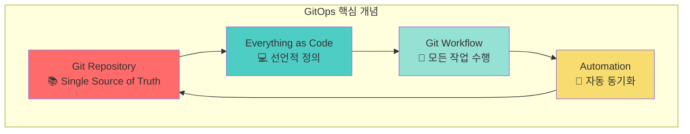

이 접근 방식은 다음과 같은 혁신을 가져왔습니다:

1. **선언적 인프라 관리**: 원하는 상태(Desired State)를 명시적으로 선언
2. **버전 관리**: Git의 모든 기능(브랜치, 태그, 커밋 히스토리) 활용
3. **자동화된 배포**: Git 변경사항이 자동으로 클러스터에 반영
4. **감사 가능성**: 모든 변경사항이 Git 로그에 기록됨

#### 1.2 GitOps가 해결하는 핵심 문제들

**문제 1: 인프라 상태의 불명확성**

전통적 방식:
- 현재 프로덕션 환경이 정확히 어떤 상태인지 알기 어려움
- 누군가 콘솔에서 직접 변경했을 가능성
- 문서화되지 않은 설정 변경 존재

GitOps 해결책:
- Git 저장소가 항상 실제 상태를 반영
- 모든 변경은 Pull Request를 통해 리뷰
- 자동으로 Git 상태와 클러스터 상태 동기화

**문제 2: 배포 프로세스의 일관성 부족**

전통적 방식:
- 팀원마다 다른 배포 스크립트 사용
- 환경별로 다른 배포 절차
- 수동 단계가 포함된 런북(Runbook)

GitOps 해결책:
- 모든 환경에 동일한 GitOps 워크플로 적용
- 자동화된 배포로 인적 오류 제거
- 표준화된 프로세스로 팀 전체 효율성 향상

**문제 3: 재해 복구(Disaster Recovery)의 복잡성**

전통적 방식:
- 클러스터 전체를 복구하려면 긴 매뉴얼 필요
- 백업된 설정 파일이 최신이 아닐 수 있음
- 복구 시간(RTO)이 길고 불확실함

GitOps 해결책:
- Git 저장소만 있으면 언제든 전체 인프라 재생성 가능
- 새 클러스터에 GitOps 도구만 설치하면 자동 복구
- 분 단위의 빠른 복구 시간 달성

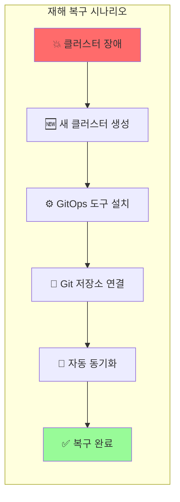

### 2. GitOps 3대 핵심 원칙

GitOps의 기본 철학을 이루는 세 가지 핵심 원칙을 상세히 살펴보겠습니다.

#### 2.1 Git은 신뢰할 수 있는 단일 소스 (Git is the single source of truth)

**단일 소스의 중요성:**

여러 곳에 분산된 정보는 불일치를 야기합니다. GitOps는 **오직 Git 저장소**만을 신뢰할 수 있는 정보의 원천으로 간주합니다.

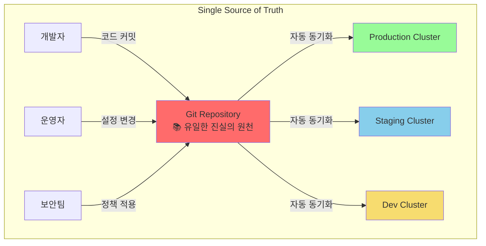

**구체적 구현:**

```yaml
# Git 저장소 구조 예시
gitops-repository/
├── apps/
│   ├── frontend/
│   │   ├── deployment.yaml
│   │   ├── service.yaml
│   │   └── ingress.yaml
│   └── backend/
│       ├── deployment.yaml
│       └── service.yaml
├── infrastructure/
│   ├── namespaces.yaml
│   ├── network-policies.yaml
│   └── resource-quotas.yaml
└── config/
    ├── dev/
    ├── staging/
    └── production/
```

**왜 Git인가?**

Git이 단일 소스로 적합한 이유:

1. **분산 버전 관리**: 전체 이력을 로컬에도 보관
2. **브랜치 전략**: Feature 브랜치로 안전한 실험 가능
3. **코드 리뷰**: Pull Request로 변경사항 검토
4. **롤백 용이성**: 이전 커밋으로 쉽게 되돌리기
5. **협업 도구**: 이슈, 위키, 프로젝트 보드 등 풍부한 기능

#### 2.2 모든 것은 코드로 표현 (Treat everything as code)

**Infrastructure as Code (IaC)를 넘어서:**

GitOps는 단순히 인프라만이 아니라 **모든 것**을 코드로 관리합니다:

- **애플리케이션 매니페스트**: Deployment, Service, ConfigMap 등
- **인프라 리소스**: VPC, 서브넷, 로드밸런서 (Terraform, Crossplane 등)
- **보안 정책**: NetworkPolicy, RBAC, Pod Security Standards
- **모니터링 설정**: Prometheus 규칙, Grafana 대시보드
- **CI/CD 파이프라인**: Jenkins 파일, GitHub Actions 워크플로
- **백업 정책**: Velero 스케줄, 보관 기간 설정

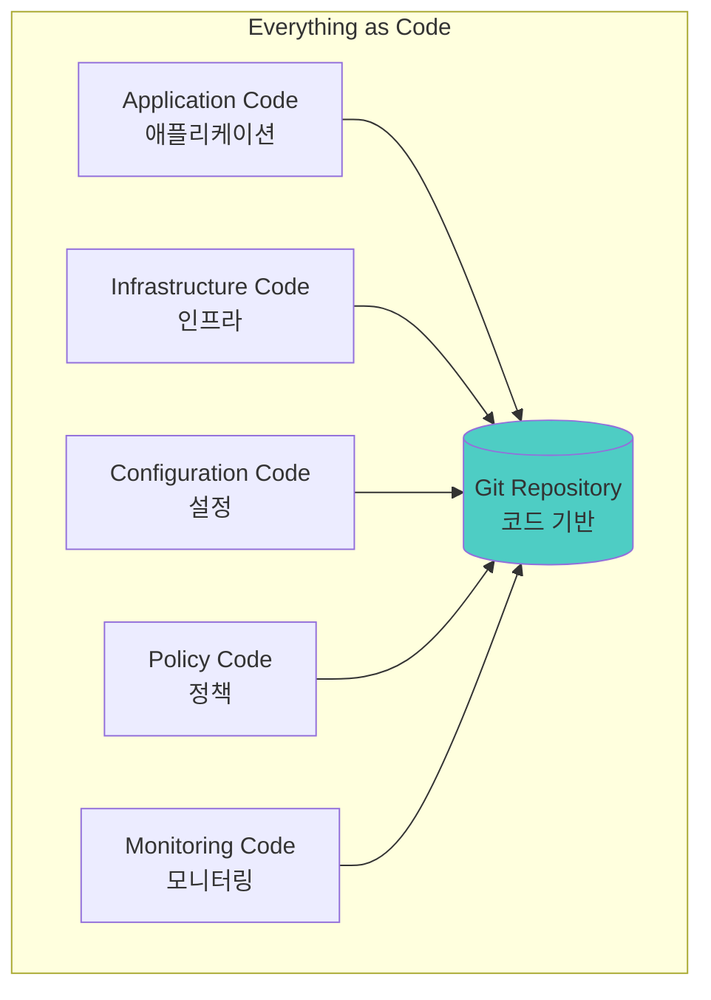

**선언적 vs 명령적 접근:**

```yaml
# ❌ 명령적 (Imperative) - GitOps에서 피해야 함
kubectl create deployment nginx --image=nginx:1.21
kubectl expose deployment nginx --port=80
kubectl scale deployment nginx --replicas=3

# ✅ 선언적 (Declarative) - GitOps 방식
apiVersion: apps/v1
kind: Deployment
metadata:
  name: nginx
spec:
  replicas: 3
  selector:
    matchLabels:
      app: nginx
  template:
    metadata:
      labels:
        app: nginx
    spec:
      containers:
      - name: nginx
        image: nginx:1.21
        ports:
        - containerPort: 80
---
apiVersion: v1
kind: Service
metadata:
  name: nginx
spec:
  selector:
    app: nginx
  ports:
  - port: 80
    targetPort: 80
```

**선언적 접근의 장점:**

1. **멱등성(Idempotency)**: 여러 번 적용해도 같은 결과
2. **자가 치유(Self-Healing)**: 상태가 달라지면 자동으로 복구
3. **명확성**: 최종 상태가 명확하게 정의됨
4. **버전 관리 친화적**: 변경사항을 diff로 쉽게 확인

#### 2.3 작업은 Git 워크플로를 통해 수행 (Operations are performed through Git workflows)

**GitOps 워크플로의 핵심:**

모든 운영 작업은 Git Pull Request를 통해 수행됩니다. 이는 다음을 의미합니다:

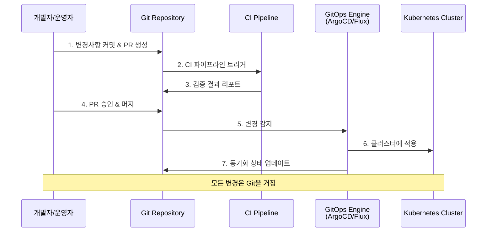

**구체적인 워크플로 예시:**

1. **새로운 기능 배포:**
```bash
# 1. 기능 브랜치 생성
git checkout -b feature/update-nginx-1.22

# 2. 이미지 태그 업데이트
# deployment.yaml에서 nginx:1.21 → nginx:1.22 변경

# 3. 커밋 및 푸시
git add apps/frontend/deployment.yaml
git commit -m "Update nginx to 1.22 for performance improvements"
git push origin feature/update-nginx-1.22

# 4. Pull Request 생성 (GitHub/GitLab 웹 UI)

# 5. 코드 리뷰 및 승인 후 머지

# 6. GitOps 도구가 자동으로 감지하고 배포
```

2. **긴급 롤백:**
```bash
# 방법 1: Git revert 사용
git revert <문제있는-커밋-해시>
git push origin main
# GitOps 도구가 자동으로 이전 버전으로 롤백

# 방법 2: 이전 커밋으로 강제 리셋 (신중하게 사용)
git reset --hard <안정한-커밋-해시>
git push --force origin main
```

3. **환경별 설정 변경:**
```bash
# Kustomize overlay를 사용한 환경별 관리
git checkout -b config/increase-prod-replicas
# overlays/production/kustomization.yaml에서 replicas 수정
git commit -m "Scale production replicas from 3 to 5"
git push origin config/increase-prod-replicas
# PR 생성 → 리뷰 → 머지 → 자동 적용
```

**Git 워크플로의 이점:**

1. **코드 리뷰**: 모든 변경사항을 팀원이 검토
2. **자동화된 검증**: CI 파이프라인에서 YAML 유효성, 보안 스캔 등 수행
3. **승인 프로세스**: CODEOWNERS 파일로 필수 승인자 지정
4. **감사 추적**: 누가, 언제, 왜 변경했는지 Git 로그에 기록
5. **롤백 용이**: 이전 커밋으로 쉽게 되돌리기

### 3. OpenGitOps 표준과 4대 원칙

#### 3.1 OpenGitOps 프로젝트 소개

[OpenGitOps](https://opengitops.dev/)는 CNCF(Cloud Native Computing Foundation) 산하의 워킹 그룹으로, GitOps의 공식 표준을 정의하고 있습니다.

**OpenGitOps의 목표:**

1. **표준화**: 벤더 중립적인 GitOps 원칙 정의
2. **상호운용성**: 다양한 도구 간 호환성 보장
3. **모범 사례**: 업계 검증된 패턴 공유
4. **커뮤니티 육성**: GitOps 생태계 발전

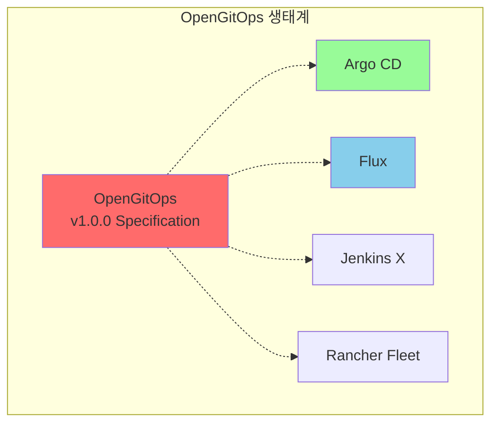

#### 3.2 OpenGitOps 4대 원칙 상세 분석

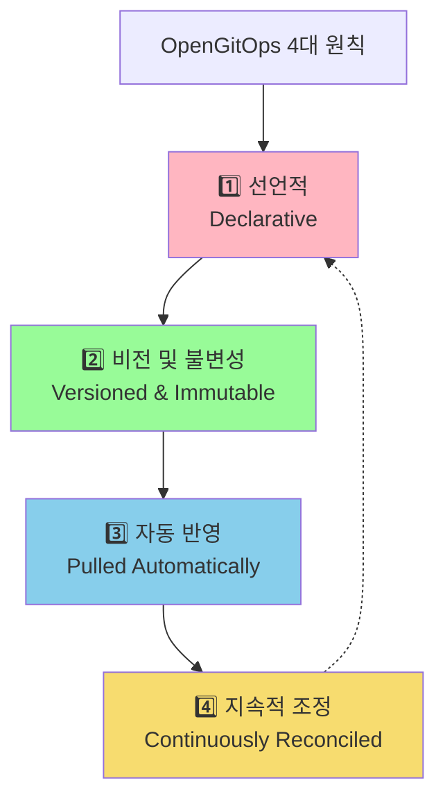

#### 원칙 1: 선언적 (Declarative)

**정의:**
> GitOps로 관리되는 시스템은 **원하는 상태(Desired State)**를 선언적으로 표현해야 한다.

**선언적 시스템의 특징:**

```yaml
# 선언적 정의 예시
# "무엇을(What)" 원하는지만 정의, "어떻게(How)"는 시스템이 알아서 처리

apiVersion: apps/v1
kind: Deployment
metadata:
  name: web-app
spec:
  replicas: 3  # ← 원하는 상태: 3개의 복제본
  selector:
    matchLabels:
      app: web
  template:
    metadata:
      labels:
        app: web
    spec:
      containers:
      - name: nginx
        image: nginx:1.22
        resources:
          requests:    # ← 원하는 리소스 요구사항
            memory: "64Mi"
            cpu: "250m"
          limits:
            memory: "128Mi"
            cpu: "500m"
```

**시스템이 자동으로 수행하는 작업:**
- 3개의 Pod가 없으면 생성
- Pod가 다운되면 자동으로 재시작
- 리소스 요구사항 충족하는 노드에 스케줄링
- 롤링 업데이트로 무중단 배포

**선언적 접근의 장점:**

1. **멱등성 보장**: 동일한 선언을 여러 번 적용해도 같은 결과
2. **자가 치유**: 실제 상태가 원하는 상태와 다르면 자동 복구
3. **예측 가능성**: 최종 상태를 명확히 알 수 있음
4. **문서화**: 코드 자체가 시스템 문서 역할

#### 원칙 2: 비전 및 불변성 (Versioned and Immutable)

**정의:**
> 상태 관리에는 **불변성(Immutable)** 원칙과 **버전 관리(Versioning)** 방법론을 적용한다. 버전 변경 이력은 완벽하게 유지해야 한다.

**Git을 통한 버전 관리:**

```bash
# 모든 변경사항은 Git 커밋으로 기록됨
$ git log --oneline --graph
* a1b2c3d (HEAD -> main) Scale web-app to 5 replicas
* d4e5f6g Update nginx image to 1.22
* g7h8i9j Add resource limits
* j1k2l3m Initial deployment
```

**불변 인프라(Immutable Infrastructure):**

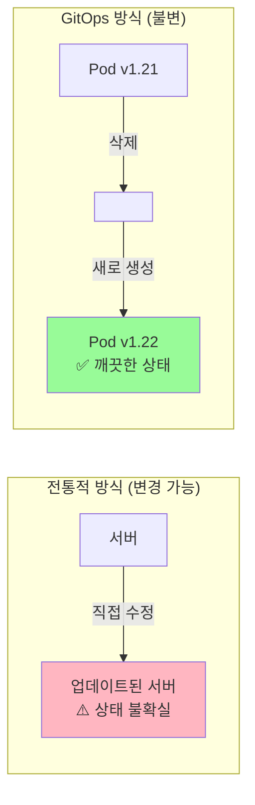

**버전 관리의 이점:**

1. **완벽한 감사 로그**: 누가, 언제, 무엇을, 왜 변경했는지 모두 기록
2. **시간 여행**: 언제든 이전 시점으로 돌아갈 수 있음
3. **비교 분석**: 두 버전 간의 차이를 명확히 확인 (git diff)
4. **브랜치 전략**: 환경별로 다른 버전 유지 가능

**실전 예시: 버전 태깅 전략**

```bash
# Semantic Versioning 적용
git tag -a v1.0.0 -m "Production release 1.0.0"
git push origin v1.0.0

# 환경별 태그
git tag -a dev-2024-01-15 -m "Dev environment snapshot"
git tag -a prod-2024-01-15 -m "Production snapshot"
```

#### 원칙 3: 자동 반영 (Pulled Automatically)

**정의:**
> 배포 환경에 설치된 **소프트웨어 에이전트**가 원하는 상태에 대한 선언적 표현을 Git 저장소에서 **자동으로 끌어온다(Pull)**.

**Pull vs Push 모델 비교:**

```mermaid
graph TB
    subgraph "Push 모델 (전통적 CI/CD)"
        CI_PUSH[CI 파이프라인]
        CLUSTER_PUSH[Kubernetes Cluster]

        CI_PUSH -->|kubectl apply<br/>직접 배포| CLUSTER_PUSH

        NOTE_PUSH[⚠️ CI가 클러스터 접근 권한 필요<br/>⚠️ 보안 위험 증가<br/>⚠️ 클러스터 상태 동기화 어려움]

        style CI_PUSH fill:#FFB6C1
        style NOTE_PUSH fill:#FFE5B4
    end

    subgraph "Pull 모델 (GitOps)"
        GIT[Git Repository]
        AGENT[GitOps Agent<br/>(in Cluster)]
        CLUSTER_PULL[Kubernetes Cluster]

        GIT -.->|주기적 확인| AGENT
        AGENT -->|변경 감지 시<br/>자동 적용| CLUSTER_PULL

        NOTE_PULL[✅ 클러스터 내부에서 동작<br/>✅ 보안 강화<br/>✅ 자동 동기화]

        style AGENT fill:#98FB98
        style NOTE_PULL fill:#D4EDDA
    end
```

**Pull 모델의 작동 원리:**

1. **GitOps 에이전트 설치**: 클러스터 내부에 ArgoCD나 Flux 설치
2. **Git 저장소 연결**: 에이전트가 모니터링할 Git 저장소 지정
3. **주기적 폴링**: 설정된 간격(예: 3분)마다 Git 저장소 확인
4. **변경 감지**: 새로운 커밋이 있으면 자동으로 감지
5. **자동 적용**: 변경사항을 클러스터에 적용

**Argo CD 설정 예시:**

```yaml
apiVersion: argoproj.io/v1alpha1
kind: Application
metadata:
  name: web-app
  namespace: argocd
spec:
  project: default
  source:
    repoURL: https://github.com/myorg/gitops-repo
    targetRevision: HEAD
    path: apps/web-app
  destination:
    server: https://kubernetes.default.svc
    namespace: production
  syncPolicy:
    automated:  # ← 자동 동기화 활성화
      prune: true     # 삭제된 리소스 제거
      selfHeal: true  # 수동 변경 시 자동 복구
    syncOptions:
    - CreateNamespace=true
```

**자동 반영의 이점:**

1. **보안 강화**: CI 파이프라인이 클러스터 접근 권한 불필요
2. **네트워크 격리**: 클러스터가 외부로 나가는 연결만 필요
3. **자가 치유**: 누군가 수동으로 변경해도 자동으로 Git 상태로 복구
4. **멀티 클러스터**: 각 클러스터가 독립적으로 Git에서 pull

#### 원칙 4: 지속적 조정 (Continuously Reconciled)

**정의:**
> 소프트웨어 에이전트는 실제 시스템 상태를 **계속 관찰**하고 **원하는 상태**에 맞도록 변경한다.

**Reconciliation Loop (조정 루프):**

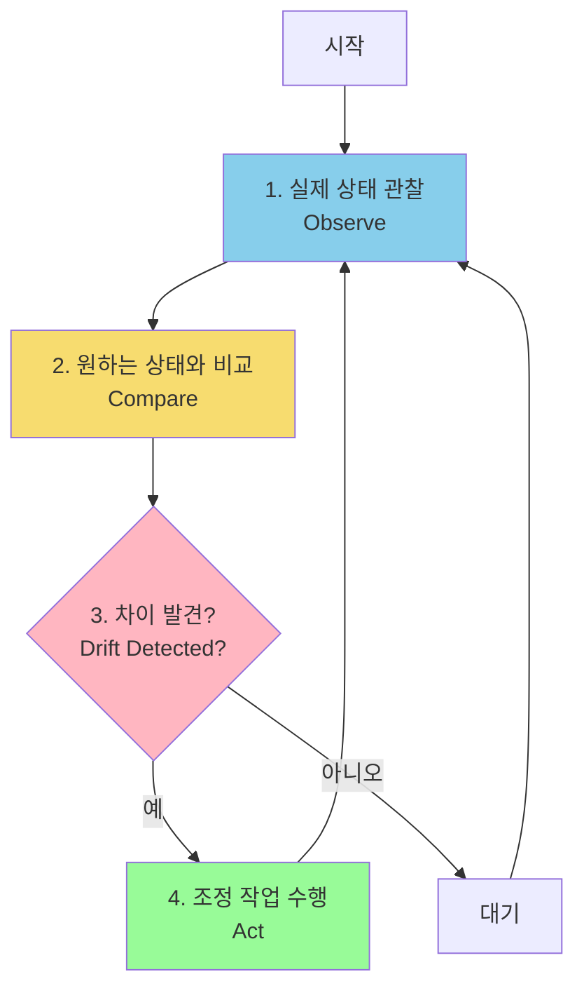

**구체적인 Reconciliation 시나리오:**

**시나리오 1: 수동 변경 감지 및 복구**

```bash
# 운영자가 실수로 수동 변경
kubectl scale deployment web-app --replicas=10

# GitOps 에이전트의 동작:
# 1. 현재 상태 확인: replicas=10
# 2. Git 상태 확인: replicas=3
# 3. 차이 감지: Drift detected!
# 4. 자동 복구: replicas를 3으로 되돌림

# 결과
$ kubectl get deployment web-app
NAME      READY   UP-TO-DATE   AVAILABLE   AGE
web-app   3/3     3            3           10m
```

**시나리오 2: Pod 장애 시 자동 복구**

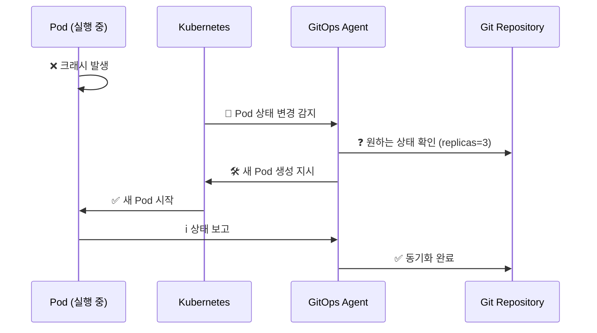

**Reconciliation 주기 설정:**

```yaml
# Flux 설정 예시
apiVersion: kustomize.toolkit.fluxcd.io/v1beta2
kind: Kustomization
metadata:
  name: apps
spec:
  interval: 5m  # ← 5분마다 Git 저장소 확인
  retryInterval: 1m  # 실패 시 1분 후 재시도
  path: ./apps
  prune: true
  sourceRef:
    kind: GitRepository
    name: flux-system
```

**지속적 조정의 이점:**

1. **자가 치유(Self-Healing)**: 시스템이 스스로 문제를 복구
2. **드리프트 방지**: 구성 표류(Configuration Drift) 자동 감지 및 수정
3. **일관성 보장**: 항상 Git에 정의된 상태 유지
4. **감사 가능**: 모든 조정 작업이 로그로 기록

### 4. GitOps 도입의 4가지 이점

#### 4.1 표준 워크플로 (Standard Workflow)

**개발자 친화적인 프로세스:**

GitOps는 개발자들이 이미 익숙한 Git 워크플로를 그대로 활용합니다. 새로운 도구나 프로세스를 학습할 필요가 없습니다.

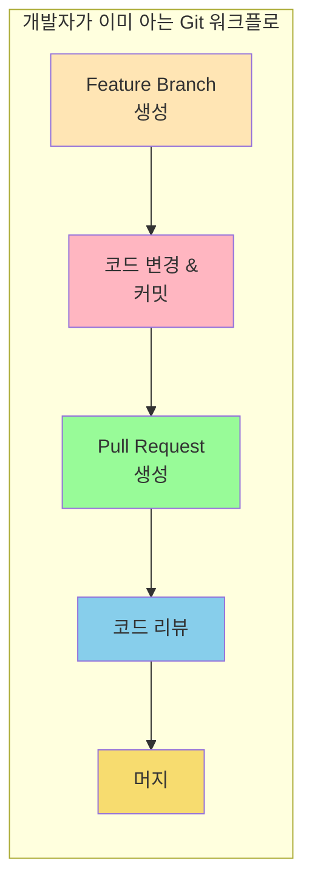

**학습 곡선 최소화:**

```bash
# 개발자의 일상적인 워크플로
# 1. 애플리케이션 코드 변경
git checkout -b feature/new-api
# ... 코드 작성 ...
git commit -m "Add new API endpoint"
git push origin feature/new-api

# 2. 배포 설정 변경 (동일한 워크플로!)
git checkout -b deploy/update-api-version
# ... deployment.yaml 수정 ...
git commit -m "Update API to v2.0"
git push origin deploy/update-api-version

# 두 경우 모두 Pull Request로 리뷰 후 머지
```

**팀 협업 강화:**

- **통일된 프로세스**: 모든 팀원이 동일한 방식으로 작업
- **지식 공유**: PR 리뷰를 통한 자연스러운 지식 전파
- **온보딩 간소화**: 신입 개발자도 빠르게 적응 가능

#### 4.2 강화된 보안 (Enhanced Security)

**변경 사항 사전 검토:**

모든 변경은 Pull Request를 통해 리뷰되므로, 문제를 배포 전에 발견할 수 있습니다.

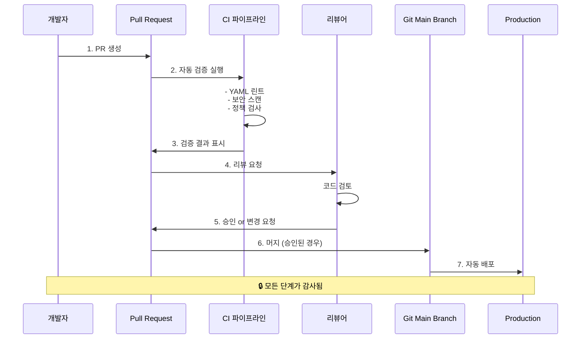

**자동화된 보안 검증:**

```yaml
# GitHub Actions 워크플로 예시
name: Security Scan

on:
  pull_request:
    paths:
      - '**.yaml'
      - '**.yml'

jobs:
  security:
    runs-on: ubuntu-latest
    steps:
      - uses: actions/checkout@v3

      - name: Run Kubesec
        run: |
          docker run --rm -v $(pwd):/project kubesec/kubesec:latest \
            scan /project/apps/**/*.yaml

      - name: Run Trivy
        run: |
          docker run --rm -v $(pwd):/project \
            aquasec/trivy config /project

      - name: Run OPA Conftest
        run: |
          docker run --rm -v $(pwd):/project openpolicyagent/conftest \
            test /project/apps --policy /project/policies
```

**Configuration Drift 감지:**

GitOps 도구는 실제 클러스터 상태와 Git 상태의 차이를 지속적으로 감지합니다.

```bash
# Argo CD에서 Drift 확인
$ argocd app diff web-app

===== apps/Deployment production/web-app ======
 spec:
   replicas: 3
+  # ↑ Git에는 3으로 정의됨
-  # ↓ 클러스터에는 5로 설정되어 있음

# 누군가 kubectl로 수동 변경한 경우 즉시 감지!
```

**접근 제어 강화:**

```yaml
# CODEOWNERS 파일로 필수 승인자 지정
# 프로덕션 환경 변경은 시니어 엔지니어의 승인 필요

/apps/production/*         @senior-engineers @sre-team
/infrastructure/*          @platform-team
/security-policies/*       @security-team
```

**장점 요약:**

1. **사전 검증**: 배포 전에 문제 발견
2. **최소 권한 원칙**: CI가 클러스터 접근 권한 불필요
3. **감사 추적**: 모든 변경이 Git 로그에 기록
4. **규정 준수**: SOC2, HIPAA 등 컴플라이언스 요구사항 충족

#### 4.3 가시성 및 감사 (Visibility and Audit)

**완벽한 변경 이력:**

Git는 모든 변경사항을 타임스탬프, 작성자, 이유와 함께 기록합니다.

```bash
# 누가, 언제, 무엇을 변경했는지 완벽히 추적
$ git log --oneline --all --graph --decorate

* a1b2c3d (HEAD -> main, origin/main) 2024-01-15 | Scale production to 10 replicas | Alice <alice@example.com>
* d4e5f6g 2024-01-14 | Update nginx to 1.22 for security patch | Bob <bob@example.com>
* g7h8i9j 2024-01-13 | Add resource limits per SRE recommendation | Charlie <charlie@example.com>

# 특정 파일의 변경 이력 확인
$ git log --follow -- apps/production/deployment.yaml

# 특정 변경사항의 상세 내용
$ git show d4e5f6g

commit d4e5f6g
Author: Bob <bob@example.com>
Date:   Mon Jan 14 10:30:00 2024 +0900

    Update nginx to 1.22 for security patch

    CVE-2024-XXXXX 보안 취약점 해결을 위해 nginx 버전 업데이트.
    테스트 환경에서 충분히 검증 완료.

    Refs: JIRA-1234

diff --git a/apps/production/deployment.yaml b/apps/production/deployment.yaml
index 1234567..abcdefg 100644
--- a/apps/production/deployment.yaml
+++ b/apps/production/deployment.yaml
@@ -15,7 +15,7 @@ spec:
     spec:
       containers:
       - name: nginx
-        image: nginx:1.21
+        image: nginx:1.22
```

**시각화된 배포 상태:**

GitOps 도구들은 풍부한 UI를 제공하여 배포 상태를 한눈에 파악할 수 있습니다.

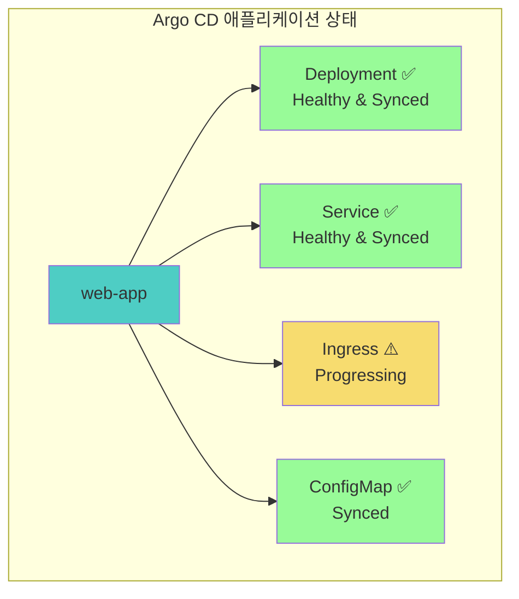

**규정 준수(Compliance) 리포팅:**

```bash
# 감사 보고서 생성 예시
$ git log --since="2024-01-01" --until="2024-01-31" \
  --pretty=format:"%h - %an, %ar : %s" \
  -- apps/production/ > audit-report-jan-2024.txt

# 특정 기간 동안의 프로덕션 변경 내역
a1b2c3d - Alice, 1 day ago : Scale replicas to 10
d4e5f6g - Bob, 3 days ago : Update nginx to 1.22
g7h8i9j - Charlie, 1 week ago : Add resource limits
```

**장점 요약:**

1. **투명성**: 모든 변경이 공개적으로 기록됨
2. **책임성**: 누가 변경했는지 명확함
3. **추적성**: 문제 발생 시 원인 분석 용이
4. **보고서**: 자동화된 감사 보고서 생성 가능

#### 4.4 멀티클러스터 일관성 (Multicluster Consistency)

**여러 환경/클러스터 관리:**

GitOps를 사용하면 여러 쿠버네티스 클러스터를 일관되게 관리할 수 있습니다.

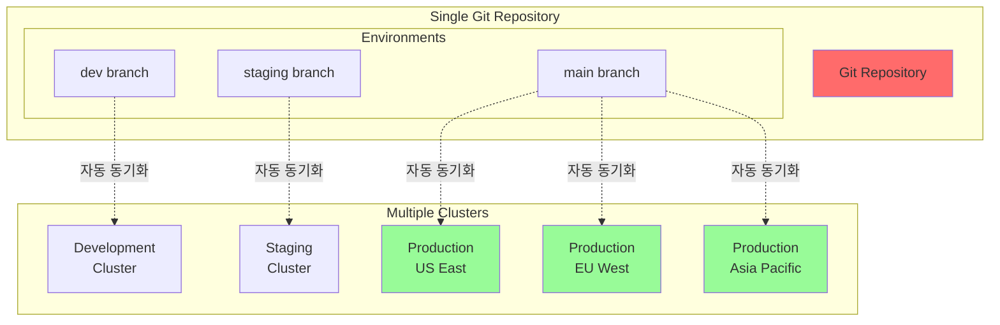

**디렉토리 구조로 환경 분리:**

```bash
gitops-repo/
├── base/                          # 공통 설정
│   ├── deployment.yaml
│   ├── service.yaml
│   └── kustomization.yaml
├── overlays/
│   ├── dev/                       # 개발 환경
│   │   ├── kustomization.yaml
│   │   └── patches/
│   ├── staging/                   # 스테이징 환경
│   │   ├── kustomization.yaml
│   │   └── patches/
│   └── production/
│       ├── us-east/              # 프로덕션 US
│       │   ├── kustomization.yaml
│       │   └── patches/
│       ├── eu-west/              # 프로덕션 EU
│       │   ├── kustomization.yaml
│       │   └── patches/
│       └── asia-pacific/         # 프로덕션 Asia
│           ├── kustomization.yaml
│           └── patches/
```

**환경별 차이 관리:**

```yaml
# base/deployment.yaml - 공통 설정
apiVersion: apps/v1
kind: Deployment
metadata:
  name: web-app
spec:
  replicas: 1  # 기본값
  template:
    spec:
      containers:
      - name: app
        image: myapp:latest
        resources:
          requests:
            memory: "64Mi"
            cpu: "100m"

---
# overlays/production/us-east/kustomization.yaml
apiVersion: kustomize.config.k8s.io/v1beta1
kind: Kustomization

bases:
  - ../../../base

replicas:
  - name: web-app
    count: 10  # 프로덕션은 10개

patchesStrategicMerge:
  - patches/resources.yaml  # 더 많은 리소스 할당

images:
  - name: myapp
    newTag: v2.1.0  # 프로덕션 버전

commonLabels:
  env: production
  region: us-east
```

**일관성 보장 메커니즘:**

1. **동일한 소스**: 모든 클러스터가 같은 Git 저장소 사용
2. **자동 동기화**: 변경사항이 모든 클러스터에 자동 반영
3. **드리프트 감지**: 클러스터 간 차이 즉시 발견
4. **롤백 용이**: 모든 클러스터를 한 번에 이전 버전으로 복구

### 5. 쿠버네티스 CI/CD 파이프라인

#### 5.1 CI와 CD의 역할 분리

**Continuous Integration (CI) - 지속적 통합:**

CI는 코드 변경사항을 검증하고 컨테이너 이미지를 빌드하는 역할을 담당합니다.

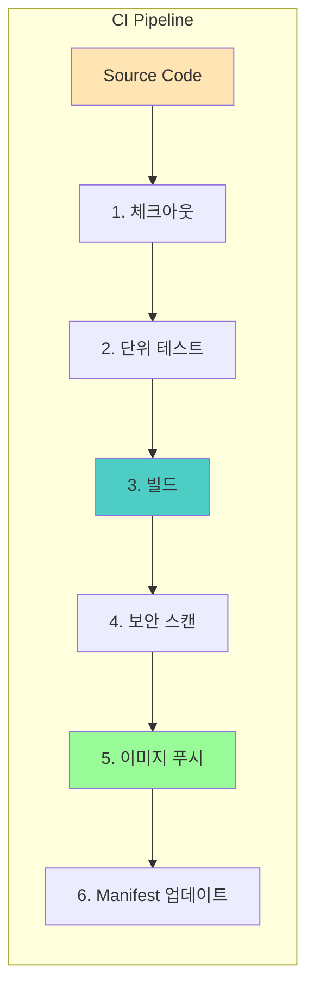

**CI 파이프라인 주요 단계:**

1. **체크아웃**: Git 저장소에서 소스 코드 가져오기
2. **테스트**: 단위 테스트, 통합 테스트 실행
3. **빌드**: 컨테이너 이미지 생성
4. **보안 스캔**: 취약점 검사 (Trivy, Snyk 등)
5. **이미지 푸시**: 컨테이너 레지스트리에 업로드
6. **Manifest 업데이트**: 새 이미지 태그로 deployment.yaml 수정

**Continuous Delivery (CD) - 지속적 배포:**

CD는 Git 저장소의 매니페스트를 쿠버네티스 클러스터에 배포하는 역할을 담당합니다.

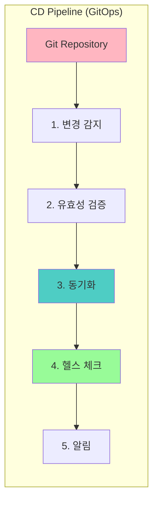

**CD 파이프라인 주요 단계:**

1. **변경 감지**: Git 저장소의 새 커밋 감지
2. **유효성 검증**: YAML 문법, 정책 준수 확인
3. **동기화**: 클러스터에 변경사항 적용
4. **헬스 체크**: 배포된 리소스 상태 확인
5. **알림**: Slack, 이메일 등으로 결과 통보

#### 5.2 전체 CI/CD 플로우

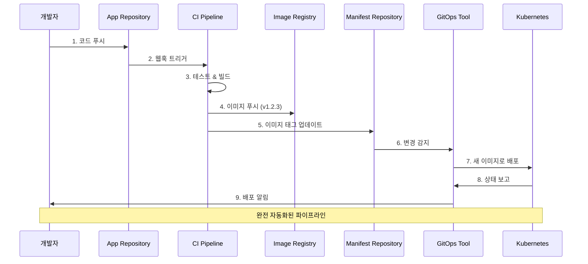

**실제 예시: GitHub Actions + Argo CD**

```yaml
# .github/workflows/ci.yaml
name: CI Pipeline

on:
  push:
    branches: [ main ]

env:
  REGISTRY: ghcr.io
  IMAGE_NAME: ${{ github.repository }}

jobs:
  build-and-push:
    runs-on: ubuntu-latest
    steps:
      - uses: actions/checkout@v3

      - name: Run tests
        run: |
          npm install
          npm test

      - name: Build Docker image
        run: |
          docker build -t $REGISTRY/$IMAGE_NAME:$GITHUB_SHA .
          docker build -t $REGISTRY/$IMAGE_NAME:latest .

      - name: Push to registry
        run: |
          echo "${{ secrets.GITHUB_TOKEN }}" | docker login $REGISTRY -u ${{ github.actor }} --password-stdin
          docker push $REGISTRY/$IMAGE_NAME:$GITHUB_SHA
          docker push $REGISTRY/$IMAGE_NAME:latest

      - name: Update manifest
        run: |
          git clone https://github.com/${{ github.repository }}-gitops
          cd ${{ github.repository }}-gitops
          sed -i "s|image:.*|image: $REGISTRY/$IMAGE_NAME:$GITHUB_SHA|" apps/production/deployment.yaml
          git config user.name "GitHub Actions"
          git config user.email "actions@github.com"
          git commit -am "Update image to $GITHUB_SHA"
          git push
```

#### 5.3 Application Deployment Model

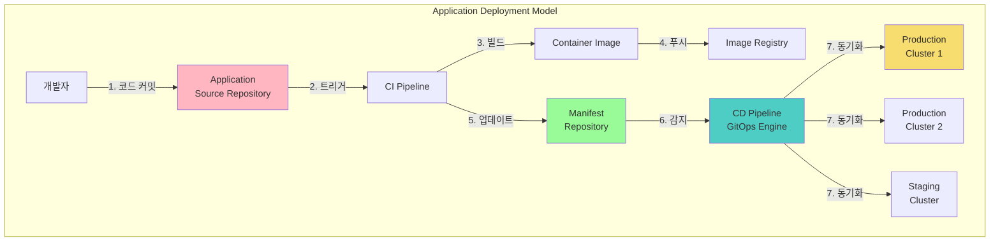

### 6. 쿠버네티스에 GitOps를 접목한 앱 배포

#### 6.1 GitOps 엔진의 역할

GitOps 엔진(Argo CD, Flux 등)은 CD 파이프라인의 핵심으로, **4가지 주요 작업**으로 구성된 GitOps 루프를 실행합니다.

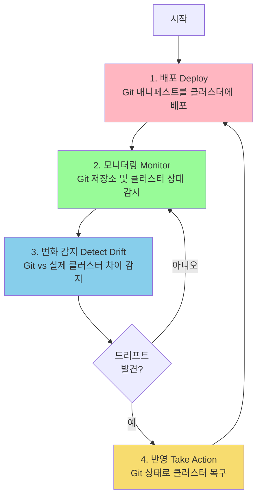

**1. 배포 (Deploy)**

Git 저장소에 정의된 매니페스트를 쿠버네티스 클러스터에 배포합니다.

```bash
# Argo CD로 배포
$ argocd app create web-app \
  --repo https://github.com/myorg/gitops-repo \
  --path apps/web-app \
  --dest-server https://kubernetes.default.svc \
  --dest-namespace production \
  --sync-policy automated

application 'web-app' created
```

**2. 모니터링 (Monitor)**

- Git 저장소의 변경사항 주기적 확인 (폴링)
- 클러스터 리소스 상태 실시간 모니터링
- Kubernetes API를 통한 이벤트 수신

```yaml
# Flux GitRepository 리소스 - 3분마다 확인
apiVersion: source.toolkit.fluxcd.io/v1
kind: GitRepository
metadata:
  name: flux-system
spec:
  interval: 3m  # ← 모니터링 주기
  url: https://github.com/myorg/gitops-repo
  ref:
    branch: main
```

**3. 변화 감지 (Detect Drift)**

Git에 정의된 원하는 상태와 클러스터의 실제 상태를 비교하여 차이를 감지합니다.

```bash
# Drift 예시
$ argocd app diff web-app

===== apps/Deployment production/web-app ======
 apiVersion: apps/v1
 kind: Deployment
 metadata:
   name: web-app
 spec:
-  replicas: 3    # Git에 정의된 상태
+  replicas: 5    # 클러스터의 실제 상태 (누군가 수동 변경)
```

**4. 반영 (Take Action)**

감지된 차이를 해결하기 위해 Git 상태로 클러스터를 복구합니다.

```yaml
# Argo CD의 Self-Heal 설정
apiVersion: argoproj.io/v1alpha1
kind: Application
spec:
  syncPolicy:
    automated:
      selfHeal: true  # ← 드리프트 발견 시 자동 복구
      prune: true     # ← Git에서 삭제된 리소스 제거
```

#### 6.2 2-Repository 패턴

쿠버네티스에서 GitOps를 구현하려면 **최소 2개의 Git 저장소**가 필요합니다.

```mermaid
graph TB
    subgraph "Repository 1: Application Source"
        APP_CODE[애플리케이션<br/>소스 코드]
        APP_TESTS[테스트 코드]
        APP_DOCKER[Dockerfile]

        style APP_CODE fill:#FFB6C1
    end

    subgraph "Repository 2: Kubernetes Manifests"
        K8S_DEP[Deployment]
        K8S_SVC[Service]
        K8S_CM[ConfigMap]
        K8S_SEC[Secrets]

        style K8S_DEP fill:#98FB98
    end

    subgraph "CI Pipeline"
        BUILD[빌드 & 테스트]
        IMAGE[컨테이너 이미지]
        PUSH[레지스트리 푸시]
        UPDATE[Manifest 업데이트]
    end

    subgraph "CD Pipeline (GitOps)"
        GITOPS[GitOps Engine]
        CLUSTER[Kubernetes<br/>Cluster]
    end

    APP_CODE --> BUILD
    BUILD --> IMAGE
    IMAGE --> PUSH
    PUSH --> UPDATE
    UPDATE --> K8S_DEP

    K8S_DEP --> GITOPS
    GITOPS --> CLUSTER
```

**Repository 1: Application Source Code Repository**

애플리케이션의 소스 코드, 테스트, 빌드 설정을 포함합니다.

```bash
app-source-repo/
├── src/                    # 소스 코드
│   ├── main.py
│   └── ...
├── tests/                  # 테스트
│   └── test_main.py
├── requirements.txt        # 의존성
├── Dockerfile             # 컨테이너 이미지 빌드
└── .github/
    └── workflows/
        └── ci.yaml        # CI 파이프라인
```

**Repository 2: Kubernetes Manifests Repository**

쿠버네티스 리소스 정의와 배포 설정을 포함합니다.

```bash
k8s-manifests-repo/
├── apps/
│   ├── web-app/
│   │   ├── deployment.yaml
│   │   ├── service.yaml
│   │   ├── ingress.yaml
│   │   └── kustomization.yaml
│   └── api-server/
│       └── ...
├── infrastructure/
│   ├── namespaces.yaml
│   └── network-policies.yaml
└── overlays/
    ├── dev/
    ├── staging/
    └── production/
```

**왜 2개의 저장소인가?**

1. **관심사의 분리 (Separation of Concerns)**
   - 애플리케이션 개발자: 소스 코드에만 집중
   - 플랫폼 팀: 인프라 및 배포 설정 관리

2. **권한 관리**
   - 소스 코드: 개발자들이 자유롭게 커밋
   - Manifest: 프로덕션 변경은 승인 필요

3. **배포 주기 분리**
   - 코드 변경이 있어도 배포 설정은 그대로 유지 가능
   - 설정만 변경하여 배포 (예: replicas 조정)

#### 6.3 완전한 GitOps 워크플로

```mermaid
sequenceDiagram
    autonumber

    participant Dev as 개발자
    participant AppGit as App Repository
    participant CI as CI Pipeline
    participant Registry as Image Registry
    participant ManifestGit as Manifest Repository
    participant ArgoCD as Argo CD
    participant K8s as Kubernetes

    Dev->>AppGit: 코드 푸시
    AppGit->>CI: Webhook 트리거
    CI->>CI: 테스트 실행
    CI->>CI: 이미지 빌드
    CI->>Registry: 이미지 푸시 (v1.2.3)
    CI->>ManifestGit: deployment.yaml 업데이트<br/>(image: myapp:v1.2.3)
    ManifestGit->>ArgoCD: 변경 감지 (폴링 or Webhook)
    ArgoCD->>ArgoCD: Manifest 검증
    ArgoCD->>K8s: 새 버전 배포
    K8s->>ArgoCD: 배포 상태 보고
    ArgoCD->>Dev: Slack 알림: 배포 성공!

    Note over Dev,K8s: 전체 프로세스 자동화
```

### 7. 데브옵스와 애자일의 관계

#### 7.1 Agile → DevOps → GitOps 진화

```mermaid
graph LR
    AGILE[Agile<br/>애자일<br/>🏃 빠른 반복]
    DEVOPS[DevOps<br/>데브옵스<br/>🤝 개발+운영 통합]
    GITOPS[GitOps<br/>깃옵스<br/>🔄 선언적 배포]

    AGILE -->|보완| DEVOPS
    DEVOPS -->|보완| GITOPS

    AGILE_DESC["소프트웨어 개발<br/>방법론"]
    DEVOPS_DESC["인프라 자동화<br/>& 협업 문화"]
    GITOPS_DESC["Git 중심<br/>운영 모델"]

    AGILE_DESC -.-> AGILE
    DEVOPS_DESC -.-> DEVOPS
    GITOPS_DESC -.-> GITOPS

    style AGILE fill:#FFB6C1
    style DEVOPS fill:#98FB98
    style GITOPS fill:#87CEEB
```

> As DevOps is complementary to Agile software development, **GitOps is complementary to DevOps** for infrastructure automation and application lifecycle management.

#### 7.2 각 방법론의 특징

**Agile (애자일)**

- **핵심**: 빠른 반복, 고객 피드백, 적응적 계획
- **가치**: 작동하는 소프트웨어, 변화에 대한 대응
- **방법**: 스프린트, 스탠드업, 리뷰/회고

**DevOps (데브옵스)**

- **핵심**: 개발과 운영의 벽 허물기
- **가치**: 자동화, 지속적 개선, 협업
- **방법**: CI/CD, 인프라 as 코드, 모니터링

**GitOps (깃옵스)**

- **핵심**: Git를 운영의 중심에
- **가치**: 선언적 관리, 버전 관리, 자동 동기화
- **방법**: Pull Request, GitOps 엔진, Drift 감지

#### 7.3 납기(Lead Time) 단축

**납기의 정의:**

```mermaid
gantt
    title 전통적 방식 vs GitOps 방식 납기 비교
    dateFormat YYYY-MM-DD
    section 전통적 방식
    요구사항 분석       :a1, 2024-01-01, 7d
    개발              :a2, after a1, 14d
    테스트            :a3, after a2, 7d
    배포 준비          :a4, after a3, 3d
    수동 배포          :crit, a5, after a4, 2d
    section GitOps 방식
    요구사항 분석       :b1, 2024-01-01, 7d
    개발              :b2, after b1, 14d
    테스트            :b3, after b2, 7d
    자동 배포          :active, b4, after b3, 1h
```

**납기를 줄이는 방법:**

1. **피드백 루프 단축**
   - 개발 → 배포 → 피드백을 몇 시간 내로 완료
   - 문제를 빨리 발견하고 빨리 수정

2. **자동화**
   - 수동 작업 제거로 시간 절약
   - 인적 오류 감소로 재작업 최소화

3. **문화적 변화**
   - 모든 변경은 Git 워크플로를 통해
   - 팀 전체가 프로세스에 익숙해지기

**GitOps 도입 전후 비교:**

| 지표 | GitOps 도입 전 | GitOps 도입 후 |
|------|---------------|---------------|
| 배포 시간 | 2-4시간 | 5-10분 |
| 배포 빈도 | 주 1-2회 | 하루 10회+ |
| 변경 실패율 | 15-20% | 1-5% |
| 평균 복구 시간 (MTTR) | 2-4시간 | 10-30분 |
| 납기 | 2-4주 | 2-3일 |

---

## 🛠️ 실습 준비

### 1. 컨테이너 레지스트리 등록

#### 1.1 컨테이너 레지스트리의 역할

컨테이너 레지스트리는 Docker 이미지를 저장하고 배포하는 중앙 저장소입니다. Git이 소스 코드를 관리하듯이, 컨테이너 레지스트리는 빌드된 이미지를 관리합니다.

```mermaid
graph TB
    subgraph "컨테이너 레지스트리 생태계"
        BUILD[로컬 빌드] -->|docker push| REGISTRY[Container Registry]

        REGISTRY -->|docker pull| DEV[개발 환경]
        REGISTRY -->|docker pull| CI[CI 파이프라인]
        REGISTRY -->|docker pull| K8S[Kubernetes<br/>클러스터]

        style REGISTRY fill:#2496ED
        style K8S fill:#326CE5
    end
```

#### 1.2 Docker Hub vs Quay.io 상세 비교

**Docker Hub**

- **장점**:
  - 가장 널리 사용되는 레지스트리
  - 방대한 공식 이미지 라이브러리
  - 간단한 설정 및 사용
  - GitHub/GitLab과 자동 빌드 연동

- **단점**:
  - Pull rate limit (익명: 100/6시간, 인증: 200/6시간)
  - 비공개 저장소 제한 (무료 계정: 1개)
  - 보안 스캔 유료 (Pro 플랜)

**Quay.io**

- **장점**:
  - Red Hat 지원 (엔터프라이즈급 안정성)
  - 무료 보안 취약점 스캔
  - Robot 계정으로 세밀한 권한 관리
  - Pull rate limit 없음 (공개 이미지)

- **단점**:
  - 비공개 저장소는 유료
  - 커뮤니티가 Docker Hub보다 작음
  - 설정이 다소 복잡

**선택 가이드:**

```mermaid
flowchart TB
    START{저장소 선택}

    START -->|개인 학습| DOCKER[Docker Hub<br/>✅ 간편함<br/>✅ 무료 시작]

    START -->|오픈소스 프로젝트| DECISION{보안 중요?}
    DECISION -->|예| QUAY[Quay.io<br/>✅ 무료 보안 스캔<br/>✅ 공개 무제한]
    DECISION -->|아니오| DOCKER

    START -->|기업 환경| ENTERPRISE[Private Registry<br/>Harbor, Nexus,<br/>ECR, GCR, ACR]

    style DOCKER fill:#2496ED
    style QUAY fill:#E8" style='color: #000000'>
59866
    style ENTERPRISE fill:#95E1D3
```

#### 1.3 상세 비교표

| 항목 | Docker Hub (무료) | Quay.io (무료) |
|------|-------------------|----------------|
| **공개 저장소** | 무제한 | 무제한 |
| **비공개 저장소** | 1개 | 불가 (유료 필요) |
| **Pull 제한** | 인증: 200/6h<br/>비인증: 100/6h | 공개 이미지: 제한 없음 |
| **빌드 자동화** | GitHub 연동 | GitHub/GitLab 연동 |
| **보안 스캔** | 유료 (Pro+) | ✅ 무료 제공 |
| **권한 제어** | 유료 플랜 | Organization/Robot 계정 |
| **저장소 용량** | 명시 제한 없음 | 100GB 이상 시 제약 가능 |

#### 1.4 Docker Hub 가입 및 설정

**1단계: Docker Hub 계정 생성**

1. [Docker Hub](https://hub.docker.com/) 접속
2. "Sign Up" 클릭
3. 이메일, 사용자명, 비밀번호 입력
4. 이메일 인증 완료

**2단계: 저장소 생성**

```bash
# Docker Hub에 로그인
docker login

# 사용자명과 비밀번호 입력
Username: <your-username>
Password: <your-password>

# 로그인 성공 확인
Login Succeeded
```

**3단계: Access Token 생성 (권장)**

보안을 위해 비밀번호 대신 Access Token 사용을 권장합니다.

1. Docker Hub 로그인
2. Account Settings → Security
3. "New Access Token" 클릭
4. Token 이름 입력 (예: "gitops-study")
5. 생성된 토큰 복사 (한 번만 표시됨!)

```bash
# Token으로 로그인
docker login -u <your-username>
Password: <paste-your-token>
```

#### 1.5 Quay.io 가입 및 설정

**1단계: Quay.io 계정 생성**

1. [Quay.io](https://quay.io/) 접속
2. "Sign Up" 클릭
3. GitHub, Google, Red Hat 계정으로 연동 가능
4. 이메일 인증 완료

**2단계: Robot 계정 생성**

Quay.io의 강력한 기능인 Robot 계정을 사용하면 CI/CD 파이프라인에서 안전하게 인증할 수 있습니다.

1. Quay.io 로그인
2. 우측 상단 계정 메뉴 → Account Settings
3. "Robot Accounts" 탭 선택
4. "Create Robot Account" 클릭
5. 권한 설정 (Read, Write 등)
6. 생성된 credential 저장

```bash
# Robot 계정으로 로그인
docker login quay.io
Username: <org-name>+<robot-name>
Password: <robot-token>
```

### 2. Git 저장소 설정

#### 2.1 GitHub 설정

**저장소 포크 (Fork)**

실습을 위한 예제 저장소를 자신의 계정으로 포크합니다.

```bash
# 1. GitHub 웹에서 저장소 포크
# https://github.com/gitops-cookbook/gitops-cookbook-sc
# "Fork" 버튼 클릭

# 2. 포크한 저장소 클론
git clone https://github.com/<your-username>/gitops-cookbook-sc
cd gitops-cookbook-sc
```

**실습용 저장소 복제**

```bash
# 책의 실습 코드 저장소 복제
git clone https://github.com/gitops-cookbook/chapters
cd chapters

# 디렉토리 구조 확인
tree -L 2

chapters/
├── ch02/  # 2장: 실습 준비
├── ch03/  # 3장: 컨테이너
├── ch04/  # 4장: Kustomize
└── ...
```

#### 2.2 Git 기본 설정

```bash
# Git 사용자 정보 설정
git config --global user.name "Your Name"
git config --global user.email "your.email@example.com"

# 에디터 설정 (선택)
git config --global core.editor "vim"

# 설정 확인
git config --list
```

### 3. 로컬 쿠버네티스 클러스터 구성 (Kind)

#### 3.1 Kind란?

**Kind (Kubernetes IN Docker)**는 Docker 컨테이너를 노드로 사용하여 로컬에서 쿠버네티스 클러스터를 실행하는 도구입니다.

```mermaid
graph TB
    subgraph "Host Machine"
        DOCKER_ENGINE[Docker Engine]

        subgraph "Kind Cluster"
            CONTROL[Control Plane Container<br/>⚙️ kube-apiserver<br/>⚙️ etcd<br/>⚙️ kube-scheduler]

            WORKER1[Worker Node Container 1<br/>🔧 kubelet<br/>🔧 containerd]

            WORKER2[Worker Node Container 2<br/>🔧 kubelet<br/>🔧 containerd]

            CONTROL -.->|API| WORKER1
            CONTROL -.->|API| WORKER2
        end

        DOCKER_ENGINE --> CONTROL
        DOCKER_ENGINE --> WORKER1
        DOCKER_ENGINE --> WORKER2
    end

    style DOCKER_ENGINE fill:#2496ED
    style CONTROL fill:#326CE5
    style WORKER1 fill:#98FB98
    style WORKER2 fill:#98FB98
```

**Kind의 장점:**

1. **빠른 클러스터 생성**: 몇 분 내에 로컬 클러스터 구성
2. **멀티 노드 지원**: Control Plane + 여러 Worker 노드 구성 가능
3. **Kubernetes 버전 선택**: 다양한 K8s 버전 테스트 가능
4. **CI/CD 통합**: GitHub Actions, GitLab CI 등에서 사용
5. **리소스 효율성**: VM보다 가볍고 빠름

#### 3.2 Kind 설치

**macOS 설치:**

```bash
# Homebrew로 설치
brew install kind

# 설치 확인
kind version
# kind v0.20.0 go1.21.0 darwin/arm64
```

**Linux 설치:**

```bash
# 최신 버전 다운로드
curl -Lo ./kind https://kind.sigs.k8s.io/dl/v0.20.0/kind-linux-amd64

# 실행 권한 부여
chmod +x ./kind

# PATH에 추가
sudo mv ./kind /usr/local/bin/kind

# 설치 확인
kind version
```

**Windows (WSL2) 설치:**

```powershell
# WSL2 내부에서 Linux 설치 방법과 동일
curl -Lo ./kind https://kind.sigs.k8s.io/dl/v0.20.0/kind-linux-amd64
chmod +x ./kind
sudo mv ./kind /usr/local/bin/kind
```

#### 3.3 kubectl 설치

kubectl은 쿠버네티스 클러스터를 관리하는 CLI 도구입니다.

**macOS:**

```bash
# Homebrew로 설치
brew install kubectl

# 또는 공식 바이너리 다운로드
curl -LO "https://dl.k8s.io/release/$(curl -L -s https://dl.k8s.io/release/stable.txt)/bin/darwin/arm64/kubectl"
chmod +x kubectl
sudo mv kubectl /usr/local/bin/

# 설치 확인
kubectl version --client
```

**Linux:**

```bash
# 최신 안정 버전 다운로드
curl -LO "https://dl.k8s.io/release/$(curl -L -s https://dl.k8s.io/release/stable.txt)/bin/linux/amd64/kubectl"

# 실행 권한 부여
chmod +x kubectl

# PATH에 추가
sudo mv kubectl /usr/local/bin/

# 설치 확인
kubectl version --client
```

#### 3.4 kubectl 버전 호환성

```mermaid
graph TB
    subgraph "kubectl 버전 호환성"
        API_132[kube-apiserver 1.32]

        KUBECTL_133[kubectl 1.33<br/>✅ 지원됨]
        KUBECTL_132[kubectl 1.32<br/>✅ 지원됨]
        KUBECTL_131[kubectl 1.31<br/>✅ 지원됨]
        KUBECTL_130[kubectl 1.30<br/>⚠️ 지원 안됨]

        API_132 --> KUBECTL_133
        API_132 --> KUBECTL_132
        API_132 --> KUBECTL_131
        API_132 -.->|X| KUBECTL_130

        style API_132 fill:#326CE5
        style KUBECTL_132 fill:#98FB98
        style KUBECTL_133 fill:#87CEEB
        style KUBECTL_131 fill:#87CEEB
        style KUBECTL_130 fill:#FFB6C1
    end
```

> **중요**: kubectl은 kube-apiserver의 **한 버전 차이(older or newer)**까지 지원됩니다.
>
> - kube-apiserver가 1.32라면
> - kubectl 1.31, 1.32, 1.33 모두 지원됨

#### 3.5 Kind 클러스터 생성

**단일 노드 클러스터:**

```bash
# 기본 클러스터 생성 (1 Control Plane)
kind create cluster --name gitops-study

# 생성 과정 출력
Creating cluster "gitops-study" ...
 ✓ Ensuring node image (kindest/node:v1.32.0) 🖼
 ✓ Preparing nodes 📦
 ✓ Writing configuration 📜
 ✓ Starting control-plane 🕹️
 ✓ Installing CNI 🔌
 ✓ Installing StorageClass 💾
Set kubectl context to "kind-gitops-study"
You can now use your cluster with:

kubectl cluster-info --context kind-gitops-study

# 클러스터 확인
kubectl cluster-info

Kubernetes control plane is running at https://127.0.0.1:xxxxx
CoreDNS is running at https://127.0.0.1:xxxxx/api/v1/namespaces/kube-system/services/kube-dns:dns/proxy
```

**멀티 노드 클러스터 (고급):**

```yaml
# kind-config.yaml
kind: Cluster
apiVersion: kind.x-k8s.io/v1alpha4
nodes:
  - role: control-plane
    kubeadmConfigPatches:
    - |
      kind: InitConfiguration
      nodeRegistration:
        kubeletExtraArgs:
          node-labels: "ingress-ready=true"
    extraPortMappings:
    - containerPort: 80
      hostPort: 80
      protocol: TCP
    - containerPort: 443
      hostPort: 443
      protocol: TCP
  - role: worker
  - role: worker
```

```bash
# 설정 파일로 클러스터 생성
kind create cluster --name gitops-study --config kind-config.yaml

# 노드 확인
kubectl get nodes

NAME                         STATUS   ROLES           AGE   VERSION
gitops-study-control-plane   Ready    control-plane   2m    v1.32.0
gitops-study-worker          Ready    <none>          2m    v1.32.0
gitops-study-worker2         Ready    <none>          2m    v1.32.0
```

#### 3.6 클러스터 관리

**클러스터 목록 확인:**

```bash
kind get clusters
# gitops-study
```

**클러스터 삭제:**

```bash
kind delete cluster --name gitops-study
```

**컨텍스트 전환:**

```bash
# 현재 컨텍스트 확인
kubectl config current-context

# 컨텍스트 목록 확인
kubectl config get-contexts

# Kind 클러스터로 전환
kubectl config use-context kind-gitops-study
```

#### 3.7 클러스터 상태 확인

```bash
# 노드 상태
kubectl get nodes

# 시스템 Pod 확인
kubectl get pods -n kube-system

NAME                                                 READY   STATUS    RESTARTS   AGE
coredns-6799fbcd5-8xqnz                             1/1     Running   0          3m
coredns-6799fbcd5-p9zjq                             1/1     Running   0          3m
etcd-gitops-study-control-plane                     1/1     Running   0          3m
kindnet-mzx5h                                       1/1     Running   0          3m
kube-apiserver-gitops-study-control-plane           1/1     Running   0          3m
kube-controller-manager-gitops-study-control-plane  1/1     Running   0          3m
kube-proxy-72lkq                                    1/1     Running   0          3m
kube-scheduler-gitops-study-control-plane           1/1     Running   0          3m

# 클러스터 정보
kubectl cluster-info
```

---

## 📦 컨테이너 이미지 빌드

### 컨테이너와 OCI 표준

#### OCI (Open Container Initiative) 소개

**OCI**는 컨테이너 포맷과 런타임의 개방형 업계 표준을 만드는 거버넌스 기구입니다.

```mermaid
graph TB
    subgraph "OCI 표준"
        OCI[Open Container Initiative]

        IMAGE_SPEC[Image Specification<br/>이미지 포맷 정의]
        RUNTIME_SPEC[Runtime Specification<br/>컨테이너 실행 정의]
        DIST_SPEC[Distribution Specification<br/>이미지 배포 정의]

        OCI --> IMAGE_SPEC
        OCI --> RUNTIME_SPEC
        OCI --> DIST_SPEC
    end

    subgraph "OCI 구현체"
        DOCKER[Docker]
        CONTAINERD[containerd]
        CRIO[CRI-O]
        PODMAN[Podman]
        BUILDAH[Buildah]
    end

    IMAGE_SPEC -.-> DOCKER
    IMAGE_SPEC -.-> CONTAINERD
    IMAGE_SPEC -.-> CRIO
    IMAGE_SPEC -.-> PODMAN
    IMAGE_SPEC -.-> BUILDAH

    style OCI fill:#FF6B6B
    style IMAGE_SPEC fill:#4ECDC4
    style RUNTIME_SPEC fill:#95E1D3
    style DIST_SPEC fill:#F7DC6F
```

**OCI의 목표:**

1. **표준화**: 벤더 중립적인 컨테이너 표준
2. **상호운용성**: 다양한 플랫폼 간 호환
3. **이식성**: OS, 클라우드 간 이동 자유
4. **개방성**: 오픈 소스 및 커뮤니티 주도

#### 컨테이너 이미지 계층 구조

컨테이너 이미지는 **레이어(Layer)**라는 읽기 전용 파일 시스템들이 쌓여있는 구조입니다.

```mermaid
graph TB
    subgraph "컨테이너 이미지 계층 구조"
        WRITABLE[컨테이너 Layer<br/>🔓 쓰기 가능]
        APP[Application Layer<br/>📦 app.py, requirements.txt]
        DEPS[Dependencies Layer<br/>📚 pip packages]
        RUNTIME[Runtime Layer<br/>⚙️ Python 3.9]
        LIBS[System Libraries Layer<br/>🔧 libc, libssl 등]
        BASE[Base OS Layer<br/>🐧 Ubuntu/Alpine]

        WRITABLE --> APP
        APP --> DEPS
        DEPS --> RUNTIME
        RUNTIME --> LIBS
        LIBS --> BASE

        style WRITABLE fill:#FF6B6B
        style APP fill:#4ECDC4
        style DEPS fill:#95E1D3
        style RUNTIME fill:#F7DC6F
        style LIBS fill:#E59866
        style BASE fill:#FFE5B4
    end
```

**레이어의 특징:**

1. **불변성(Immutable)**: 한 번 생성되면 변경 불가
2. **재사용**: 동일한 베이스 레이어를 여러 이미지가 공유
3. **효율성**: 변경된 레이어만 다운로드/업로드
4. **Copy-on-Write**: 컨테이너 실행 시 쓰기 가능 레이어 추가

### 3.1 도커를 사용한 컨테이너 빌드

#### 3.1.1 Dockerfile 이해하기

Dockerfile은 "사용자가 이미지를 조립하기 위해 명령행에서 호출하는 모든 명령을 담은 텍스트 문서"입니다.

**Dockerfile 주요 명령어:**

| 명령어 | 설명 | 예시 |
|--------|------|------|
| `FROM` | 베이스 이미지 지정 | `FROM python:3.9-slim` |
| `WORKDIR` | 작업 디렉토리 설정 | `WORKDIR /app` |
| `COPY` | 파일 복사 | `COPY app.py /app/` |
| `ADD` | 파일 복사 (압축 해제 지원) | `ADD archive.tar.gz /app/` |
| `RUN` | 명령어 실행 (이미지 빌드 시) | `RUN pip install -r requirements.txt` |
| `ENV` | 환경 변수 설정 | `ENV PORT=8080` |
| `EXPOSE` | 포트 노출 (문서화) | `EXPOSE 8080` |
| `CMD` | 컨테이너 시작 명령 (오버라이드 가능) | `CMD ["python", "app.py"]` |
| `ENTRYPOINT` | 컨테이너 진입점 (고정) | `ENTRYPOINT ["python"]` |

**실습 예제:**

```dockerfile
# chapters/ch03/python-app/Dockerfile

# 1. 베이스 이미지 선택
FROM registry.access.redhat.com/ubi8/python-39

# 2. 환경 변수 설정
ENV PORT 8080

# 3. 포트 노출 (문서화 목적)
EXPOSE 8080

# 4. 작업 디렉토리 설정
WORKDIR /usr/src/app

# 5. 의존성 파일 먼저 복사 (레이어 캐싱 최적화)
COPY requirements.txt ./

# 6. 의존성 설치
RUN pip install --no-cache-dir -r requirements.txt

# 7. 애플리케이션 코드 복사
COPY . .

# 8. 컨테이너 진입점
ENTRYPOINT ["python"]

# 9. 기본 실행 명령
CMD ["app.py"]
```

**애플리케이션 코드:**

```python
# app.py
from flask import Flask
import os

app = Flask(__name__)
port = int(os.getenv('PORT', 8080))

@app.route('/')
def hello():
    return 'Hello from GitOps Container!\n'

@app.route('/health')
def health():
    return 'OK', 200

if __name__ == '__main__':
    app.run(host='0.0.0.0', port=port)
```

```txt
# requirements.txt
flask==2.3.0
werkzeug==2.3.0
```

#### 3.1.2 이미지 빌드 프로세스

```mermaid
flowchart TB
    START[Dockerfile] --> PARSE[1. Dockerfile 파싱]

    PARSE --> BASE[2. FROM: 베이스 이미지 Pull]
    BASE --> CACHE1{캐시 존재?}
    CACHE1 -->|예| REUSE1[캐시 재사용 ⚡]
    CACHE1 -->|아니오| DOWNLOAD1[다운로드 📥]

    REUSE1 --> WORKDIR
    DOWNLOAD1 --> WORKDIR

    WORKDIR[3. WORKDIR: 디렉토리 생성]
    WORKDIR --> COPY1[4. COPY: requirements.txt]
    COPY1 --> RUN[5. RUN: pip install]

    RUN --> CACHE2{캐시 존재?}
    CACHE2 -->|예| REUSE2[캐시 재사용 ⚡]
    CACHE2 -->|아니오| INSTALL[패키지 설치 📦]

    REUSE2 --> COPY2
    INSTALL --> COPY2

    COPY2[6. COPY: 앱 코드]
    COPY2 --> META[7. ENTRYPOINT/CMD 설정]
    META --> IMAGE[8. 최종 이미지 생성 ✅]

    style START fill:#FFB6C1
    style IMAGE fill:#98FB98
    style REUSE1 fill:#4ECDC4
    style REUSE2 fill:#4ECDC4
```

#### 3.1.3 실습: 이미지 빌드 및 푸시

```bash
# 변수 설정
MYREGISTRY=docker.io  # 또는 quay.io
MYUSER=<your-username>

# 작업 디렉토리 이동
cd chapters/ch03/python-app

# 파일 확인
ls -la
# Dockerfile
# app.py
# requirements.txt

# 이미지 빌드
docker build -f Dockerfile -t $MYREGISTRY/$MYUSER/pythonapp:latest .

# 빌드 과정 출력
[+] Building 45.2s (10/10) FINISHED
 => [internal] load build definition from Dockerfile
 => => transferring dockerfile: 395B
 => [internal] load .dockerignore
 => [internal] load metadata for registry.access.redhat.com/ubi8/python-39:latest
 => [1/5] FROM registry.access.redhat.com/ubi8/python-39@sha256:fc4a1bd...
 => [internal] load build context
 => [2/5] WORKDIR /usr/src/app
 => [3/5] COPY requirements.txt ./
 => [4/5] RUN pip install --no-cache-dir -r requirements.txt
 => [5/5] COPY . .
 => exporting to image
 => => writing image sha256:8bab03d01adb...
 => => naming to docker.io/myuser/pythonapp:latest
```

**이미지 확인:**

```bash
# 로컬 이미지 목록
docker images

REPOSITORY                                     TAG       IMAGE ID       CREATED         SIZE
myuser/pythonapp                               latest    8bab03d01adb   2 minutes ago   847MB
registry.access.redhat.com/ubi8/python-39     latest    4943bac8bd7d   2 days ago      843MB

# 이미지 레이어 확인
docker history $MYREGISTRY/$MYUSER/pythonapp:latest

IMAGE          CREATED         CREATED BY                                      SIZE
8bab03d01adb   3 minutes ago   CMD ["app.py"]                                  0B
<missing>      3 minutes ago   ENTRYPOINT ["python"]                           0B
<missing>      3 minutes ago   COPY . . # buildkit                             404B
<missing>      3 minutes ago   RUN /bin/sh -c pip install --no-cache-dir...   4.23MB
<missing>      3 minutes ago   COPY requirements.txt ./ # buildkit             5B
<missing>      3 minutes ago   WORKDIR /usr/src/app                            0B
<missing>      3 minutes ago   EXPOSE map[8080/tcp:{}]                         0B
<missing>      3 minutes ago   ENV PORT=8080                                   0B
<missing>      2 days ago      /bin/sh -c #(nop) LABEL ...                     213MB
```

**이미지 내부 확인:**

```bash
# 이미지 상세 정보
docker inspect $MYREGISTRY/$MYUSER/pythonapp:latest | jq '.[]'

{
  "Id": "sha256:8bab03d01adb...",
  "RepoTags": [
    "myuser/pythonapp:latest"
  ],
  "Created": "2024-01-15T12:00:00.000000000Z",
  "Container": "...",
  "Config": {
    "Env": [
      "PORT=8080"
    ],
    "Cmd": [
      "app.py"
    ],
    "WorkingDir": "/usr/src/app",
    "Entrypoint": [
      "python"
    ]
  },
  "RootFS": {
    "Type": "layers",
    "Layers": [
      "sha256:f4e6caeb...",  # Base layer
      "sha256:d0f89817...",  # WORKDIR
      "sha256:15c1e7e6...",  # COPY requirements.txt
      "sha256:b05e1d44...",  # RUN pip install
      "sha256:b5a19e22...",  # COPY app code
      "sha256:097be017...",  # ENTRYPOINT
      "sha256:9e46a29f...",  # CMD
      "sha256:585588e3..."   # metadata
    ]
  }
}
```

#### 3.1.4 레지스트리에 푸시

```bash
# 레지스트리 로그인
docker login $MYREGISTRY
Username: <your-username>
Password: <your-password-or-token>

Login Succeeded

# 이미지 푸시
docker push $MYREGISTRY/$MYUSER/pythonapp:latest

The push refers to repository [docker.io/myuser/pythonapp]
585588e3f844: Pushed
9e46a29f98d3: Pushed
097be017459b: Pushed
b5a19e22c5bc: Pushed
b05e1d4485b2: Pushed
15c1e7e63d7b: Mounted from library/python
d0f89817e29f: Mounted from library/python
f4e6caeb34a4: Mounted from library/python
latest: digest: sha256:abc123def456... size: 2417
```

#### 3.1.5 컨테이너 실행 및 테스트

```bash
# 컨테이너 실행
docker run -d \
  --name myweb \
  -p 8080:8080 \
  $MYREGISTRY/$MYUSER/pythonapp:latest

# 컨테이너 상태 확인
docker ps

CONTAINER ID   IMAGE                    COMMAND             CREATED          STATUS          PORTS
a1b2c3d4e5f6   myuser/pythonapp:latest  "python app.py"     10 seconds ago   Up 9 seconds    0.0.0.0:8080->8080/tcp

# 애플리케이션 테스트
curl http://localhost:8080
Hello from GitOps Container!

curl http://localhost:8080/health
OK

# 로그 확인
docker logs myweb
 * Serving Flask app 'app'
 * Running on all addresses (0.0.0.0)
 * Running on http://127.0.0.1:8080
 * Running on http://172.17.0.2:8080

# 컨테이너 내부 접속
docker exec -it myweb /bin/bash
bash-4.4$ pwd
/usr/src/app
bash-4.4$ ls
app.py  requirements.txt
bash-4.4$ exit

# 컨테이너 정리
docker stop myweb
docker rm myweb
```

#### 3.1.6 Docker 빌드 최적화 기법

**1. 멀티 스테이지 빌드 (Multi-stage Build)**

빌드와 런타임 환경을 분리하여 최종 이미지 크기를 줄입니다.

```dockerfile
# 빌드 스테이지
FROM golang:1.21 AS builder
WORKDIR /app
COPY go.mod go.sum ./
RUN go mod download
COPY . .
RUN CGO_ENABLED=0 GOOS=linux go build -o /app/server

# 런타임 스테이지
FROM alpine:3.18
RUN apk --no-cache add ca-certificates
WORKDIR /root/
COPY --from=builder /app/server ./
EXPOSE 8080
CMD ["./server"]
```

**2. .dockerignore 사용**

불필요한 파일을 빌드 컨텍스트에서 제외합니다.

```bash
# .dockerignore
.git
.gitignore
README.md
.env
*.md
node_modules
__pycache__
*.pyc
.pytest_cache
.vscode
.idea
```

**3. 레이어 캐싱 최적화**

자주 변경되지 않는 명령을 먼저 실행합니다.

```dockerfile
# ❌ 비효율적 - 코드 변경 시 매번 재설치
COPY . .
RUN pip install -r requirements.txt

# ✅ 효율적 - requirements.txt 변경 시에만 재설치
COPY requirements.txt .
RUN pip install -r requirements.txt
COPY . .
```

**4. 베이스 이미지 선택**

```mermaid
graph LR
    subgraph "베이스 이미지 크기 비교"
        UBUNTU[Ubuntu<br/>77MB]
        DEBIAN[Debian<br/>124MB]
        ALPINE[Alpine<br/>5MB]
        SCRATCH[Scratch<br/>0MB]

        style ALPINE fill:#98FB98
        style SCRATCH fill:#4ECDC4
        style UBUNTU fill:#FFE5B4
        style DEBIAN fill:#FFB6C1
    end
```

- **alpine**: 최소 크기, 보안 패치 빠름
- **slim**: 중간 크기, 일반적 사용
- **scratch**: 빈 이미지, Go/Rust 같은 정적 바이너리용

### 3.2 Jib을 사용한 Dockerless 빌드

#### 3.2.1 Jib 소개

**Jib (Java Image Builder)**는 Google이 개발한 Java 애플리케이션을 위한 컨테이너 이미지 빌더입니다.

**Jib의 특징:**

1. **Docker 데몬 불필요**: Docker를 설치하지 않아도 이미지 빌드 가능
2. **빠른 빌드**: 변경된 레이어만 재빌드
3. **재현 가능**: 동일한 입력에 대해 항상 같은 이미지 생성
4. **Maven/Gradle 통합**: 빌드 도구에 직접 통합

```mermaid
graph LR
    subgraph "전통적 Docker 빌드"
        JAR1[JAR 파일] --> DOCKERFILE[Dockerfile 작성]
        DOCKERFILE --> DOCKER_BUILD[docker build]
        DOCKER_BUILD --> DOCKER_DAEMON[Docker Daemon]
        DOCKER_DAEMON --> IMAGE1[컨테이너 이미지]

        style DOCKER_DAEMON fill:#FFB6C1
    end

    subgraph "Jib 빌드"
        SOURCE[소스 코드] --> JIB[Jib Plugin]
        JIB --> IMAGE2[컨테이너 이미지]
        JIB -.->|직접 푸시| REGISTRY[Registry]

        style JIB fill:#98FB98
    end
```

#### 3.2.2 Jib 사용 예시 (Maven)

```xml
<!-- pom.xml -->
<project>
  <build>
    <plugins>
      <plugin>
        <groupId>com.google.cloud.tools</groupId>
        <artifactId>jib-maven-plugin</artifactId>
        <version>3.4.0</version>
        <configuration>
          <to>
            <image>docker.io/myuser/my-app:latest</image>
          </to>
        </configuration>
      </plugin>
    </plugins>
  </build>
</project>
```

```bash
# 레지스트리에 직접 푸시 (Docker 불필요!)
mvn compile jib:build

# 로컬 Docker 데몬으로 빌드
mvn compile jib:dockerBuild

# tar 파일로 저장
mvn compile jib:buildTar
```

#### 3.2.3 Jib 사용 예시 (Gradle)

```gradle
// build.gradle
plugins {
  id 'com.google.cloud.tools.jib' version '3.4.0'
}

jib {
  to {
    image = 'docker.io/myuser/my-app:latest'
  }
  container {
    jvmFlags = ['-Xms512m', '-Xmx512m']
    ports = ['8080']
    labels = [
      'maintainer': 'myteam@example.com',
      'version': project.version
    ]
  }
}
```

```bash
# 레지스트리에 직접 푸시
./gradlew jib

# 로컬 Docker로 빌드
./gradlew jibDockerBuild
```

#### 3.2.4 Jib의 레이어 최적화

```mermaid
graph TB
    subgraph "Jib의 스마트 레이어링"
        APP_LAYER[Application Classes<br/>자주 변경됨]
        RES_LAYER[Resources<br/>가끔 변경됨]
        DEP_LAYER[Dependencies<br/>거의 변경 안됨]
        BASE_LAYER[Base Image<br/>변경 안됨]

        APP_LAYER --> RES_LAYER
        RES_LAYER --> DEP_LAYER
        DEP_LAYER --> BASE_LAYER

        style APP_LAYER fill:#FF6B6B
        style RES_LAYER fill:#F7DC6F
        style DEP_LAYER fill:#98FB98
        style BASE_LAYER fill:#87CEEB
    end
```

Jib은 자동으로 애플리케이션을 3개의 레이어로 분리합니다:
1. **Dependencies**: 외부 라이브러리 (거의 변경 안됨)
2. **Resources**: 설정 파일, static 파일
3. **Classes**: 애플리케이션 클래스 (자주 변경됨)

이를 통해 코드 변경 시 애플리케이션 레이어만 재빌드하므로 빌드 시간이 크게 단축됩니다.

### 3.3 Buildah를 사용한 Daemonless 빌드

#### 3.3.1 Buildah 소개

**Buildah**는 Red Hat이 주도하는 오픈소스 프로젝트로, Docker 데몬 없이 OCI 컨테이너 이미지를 빌드하는 도구입니다.

**Buildah의 특징:**

1. **Daemonless**: 데몬 프로세스 불필요
2. **루트 권한 불필요**: Rootless 모드 지원
3. **Dockerfile 지원**: 기존 Dockerfile 사용 가능
4. **스크립트 기반**: Bash 스크립트로 이미지 빌드 가능
5. **OCI 표준 준수**: 완벽한 OCI 호환

```mermaid
graph TB
    subgraph "Buildah 아키텍처"
        USER[사용자]

        DOCKERFILE_WAY[Dockerfile 방식]
        SCRIPT_WAY[Script 방식]

        USER --> DOCKERFILE_WAY
        USER --> SCRIPT_WAY

        DOCKERFILE_WAY --> BUILDAH[Buildah]
        SCRIPT_WAY --> BUILDAH

        BUILDAH --> OCI_IMAGE[OCI Image]

        OCI_IMAGE --> STORAGE[Container Storage<br/>/var/lib/containers]
        OCI_IMAGE --> REGISTRY2[Registry]

        style BUILDAH fill:#E59866
        style OCI_IMAGE fill:#98FB98
    end
```

#### 3.3.2 Buildah 설치

```bash
# RHEL/CentOS/Fedora
sudo dnf install buildah

# Ubuntu/Debian
sudo apt-get install buildah

# macOS는 Linux VM 필요
# Lima나 Podman Desktop 사용 권장

# 설치 확인
buildah version
```

#### 3.3.3 Buildah 사용 예시

**방법 1: Dockerfile 사용**

```bash
# Dockerfile로 빌드 (Docker와 동일)
buildah build -f Dockerfile -t myapp:latest .

# 이미지 목록 확인
buildah images

# 레지스트리에 푸시
buildah push myapp:latest docker://docker.io/myuser/myapp:latest
```

**방법 2: Bash 스크립트로 빌드**

```bash
#!/bin/bash

# 1. 새 컨테이너 생성
container=$(buildah from python:3.9-slim)

# 2. 작업 디렉토리 설정
buildah config --workingdir /app $container

# 3. 파일 복사
buildah copy $container requirements.txt /app/
buildah copy $container app.py /app/

# 4. 명령 실행
buildah run $container pip install --no-cache-dir -r /app/requirements.txt

# 5. 환경 변수 설정
buildah config --env PORT=8080 $container

# 6. 포트 노출
buildah config --port 8080 $container

# 7. 시작 명령 설정
buildah config --entrypoint '["python", "/app/app.py"]' $container

# 8. 이미지로 커밋
buildah commit $container myapp:latest

# 9. 컨테이너 정리
buildah rm $container

echo "Image built successfully!"
```

#### 3.3.4 Buildah와 Podman

Buildah는 Podman과 함께 사용할 때 강력합니다.

```mermaid
graph LR
    subgraph "Buildah + Podman 생태계"
        BUILDAH[Buildah<br/>📦 이미지 빌드]
        PODMAN[Podman<br/>🚀 컨테이너 실행]
        SKOPEO[Skopeo<br/>📤 이미지 전송]

        CODE[소스 코드] --> BUILDAH
        BUILDAH --> IMAGE[(OCI Image)]
        IMAGE --> PODMAN
        IMAGE --> SKOPEO
        PODMAN --> CONTAINER[실행 중인<br/>컨테이너]
        SKOPEO --> REGISTRY[Registry]

        style BUILDAH fill:#E59866
        style PODMAN fill:#4ECDC4
        style SKOPEO fill:#95E1D3
    end
```

- **Buildah**: 이미지 빌드 전담
- **Podman**: 컨테이너 실행 (docker run 대체)
- **Skopeo**: 이미지 복사/검사 (docker push/pull 고급 대체)

```bash
# Buildah로 빌드
buildah build -t myapp .

# Podman으로 실행
podman run -d -p 8080:8080 myapp

# Skopeo로 레지스트리 간 복사
skopeo copy \
  docker://docker.io/myuser/myapp:latest \
  docker://quay.io/myuser/myapp:latest
```

### 3.4 Buildpacks를 통한 자동 빌드

#### 3.4.1 Cloud Native Buildpacks 소개

**Cloud Native Buildpacks (CNB)**는 CNCF 프로젝트로, 소스 코드에서 자동으로 컨테이너 이미지를 생성하는 도구입니다.

**Buildpacks의 철학:**

> "**Dockerfile을 작성하지 않아도** 소스 코드만으로 프로덕션 준비된 컨테이너 이미지를 생성"

```mermaid
graph TB
    subgraph "Buildpacks 자동 감지 프로세스"
        SOURCE[소스 코드]

        DETECT{언어/프레임워크<br/>자동 감지}

        PYTHON[Python<br/>Buildpack]
        NODEJS[Node.js<br/>Buildpack]
        JAVA[Java<br/>Buildpack]
        GO[Go<br/>Buildpack]

        SOURCE --> DETECT

        DETECT -->|requirements.txt| PYTHON
        DETECT -->|package.json| NODEJS
        DETECT -->|pom.xml| JAVA
        DETECT -->|go.mod| GO

        PYTHON --> BUILD[자동 빌드]
        NODEJS --> BUILD
        JAVA --> BUILD
        GO --> BUILD

        BUILD --> IMAGE[OCI Image]

        style DETECT fill:#F7DC6F
        style BUILD fill:#4ECDC4
        style IMAGE fill:#98FB98
    end
```

#### 3.4.2 Pack CLI 설치

```bash
# macOS
brew install buildpacks/tap/pack

# Linux
curl -sSL "https://github.com/buildpacks/pack/releases/download/v0.32.0/pack-v0.32.0-linux.tgz" | sudo tar -C /usr/local/bin/ --no-same-owner -xzv pack

# Windows (WSL2)
# Linux 방법과 동일

# 설치 확인
pack version
0.32.0
```

#### 3.4.3 Buildpacks 사용 예시

**Python 애플리케이션:**

```bash
# 소스 코드 디렉토리로 이동
cd python-app/
ls
app.py  requirements.txt

# Buildpacks로 빌드 (Dockerfile 불필요!)
pack build myapp \
  --builder paketobuildpacks/builder:base \
  --buildpack paketo-buildpacks/python

# 출력
===> DETECTING
[detector] 4 of 7 buildpacks participating
[detector] paketo-buildpacks/cpython            1.2.3
[detector] paketo-buildpacks/pip                 1.0.1
[detector] paketo-buildpacks/pip-install         0.5.0
[detector] paketo-buildpacks/python-start        0.8.0
===> ANALYZING
===> RESTORING
===> BUILDING
[builder] ---> Installing CPython 3.11.7
[builder] ---> Installing pip packages
[builder] ---> Configuring start command
===> EXPORTING
[exporter] Adding layer 'paketo-buildpacks/cpython:python'
[exporter] Adding layer 'paketo-buildpacks/pip-install:packages'
Successfully built image myapp

# 실행
docker run -p 8080:8080 myapp
```

**Node.js 애플리케이션:**

```bash
cd nodejs-app/
ls
package.json  server.js

# Buildpacks가 자동으로 Node.js 감지
pack build mynodeapp \
  --builder paketobuildpacks/builder:base

# npm install, npm start 모두 자동!
```

#### 3.4.4 Buildpacks의 장점

1. **Dockerfile 불필요**: 개발자가 컨테이너화 신경 쓸 필요 없음
2. **자동 최적화**: 각 언어별 베스트 프랙티스 적용
3. **보안 패치 자동**: 베이스 이미지 업데이트 자동 적용
4. **일관성**: 팀 전체가 동일한 빌드 프로세스 사용

```mermaid
graph LR
    subgraph "Buildpacks 장점"
        DEV[개발자]
        BP[Buildpacks]
        OPS[운영팀]

        DEV -->|소스 코드만 제공| BP
        BP -->|베스트 프랙티스 적용| IMAGE[최적화된<br/>이미지]
        BP <-->|자동 업데이트| OPS

        style BP fill:#4ECDC4
        style IMAGE fill:#98FB98
    end
```

### 3.5 Shipwright와 Kaniko를 사용한 쿠버네티스 빌드

#### 3.5.1 Shipwright 소개

**Shipwright**는 쿠버네티스에서 컨테이너 이미지를 빌드하는 프레임워크입니다.

```mermaid
graph TB
    subgraph "Shipwright 아키텍처"
        USER[사용자] -->|Build 생성| SHIPWRIGHT[Shipwright<br/>Build Controller]

        SHIPWRIGHT --> STRATEGY{Build Strategy}

        STRATEGY --> KANIKO[Kaniko]
        STRATEGY --> BUILDPACKS[Buildpacks]
        STRATEGY --> BUILDAH2[Buildah]
        STRATEGY --> BUILDKIT[BuildKit]

        KANIKO --> POD1[Pod]
        BUILDPACKS --> POD2[Pod]
        BUILDAH2 --> POD3[Pod]
        BUILDKIT --> POD4[Pod]

        POD1 --> IMAGE3[OCI Image]
        POD2 --> IMAGE3
        POD3 --> IMAGE3
        POD4 --> IMAGE3

        IMAGE3 --> REGISTRY3[Container<br/>Registry]

        style SHIPWRIGHT fill:#326CE5
        style IMAGE3 fill:#98FB98
    end
```

**Shipwright의 특징:**

1. **전략 추상화**: 다양한 빌드 도구 통합
2. **쿠버네티스 네이티브**: CRD로 빌드 정의
3. **확장 가능**: 커스텀 빌드 전략 추가 가능
4. **보안**: Pod Security Standards 준수

#### 3.5.2 Kaniko 소개

**Kaniko**는 쿠버네티스 환경에서 Docker 데몬 없이 Dockerfile을 빌드하는 도구입니다.

```mermaid
graph LR
    subgraph "Kaniko vs Docker"
        subgraph "Docker (전통적)"
            DOCKERFILE1[Dockerfile] --> DOCKER_DAEMON2[Docker Daemon<br/>⚠️ 특권 필요]
            DOCKER_DAEMON2 --> IMAGE4[Image]

            style DOCKER_DAEMON2 fill:#FFB6C1
        end

        subgraph "Kaniko (Kubernetes)"
            DOCKERFILE2[Dockerfile] --> KANIKO_POD[Kaniko Pod<br/>✅ 특권 불필요]
            KANIKO_POD --> IMAGE5[Image]

            style KANIKO_POD fill:#98FB98
        end
    end
```

**Kaniko의 장점:**

1. **데몬 불필요**: Docker 데몬 없이 빌드
2. **보안**: 특권(privileged) 모드 불필요
3. **분리**: 각 빌드가 독립된 Pod에서 실행
4. **캐싱**: 레이어 캐싱 지원

#### 3.5.3 Shipwright + Kaniko 실습

**1단계: Shipwright 설치**

```bash
# Shipwright Operator 설치
kubectl apply -f https://github.com/shipwright-io/build/releases/download/v0.12.0/release.yaml

# 설치 확인
kubectl get pods -n shipwright-build

NAME                                          READY   STATUS    RESTARTS   AGE
shipwright-build-controller-xxxx              1/1     Running   0          1m
```

**2단계: Build Strategy 생성**

```yaml
# kaniko-strategy.yaml
apiVersion: shipwright.io/v1alpha1
kind: ClusterBuildStrategy
metadata:
  name: kaniko
spec:
  buildSteps:
    - name: build-and-push
      image: gcr.io/kaniko-project/executor:v1.9.0
      workingDir: $(params.shp-source-root)
      securityContext:
        runAsUser: 0
        capabilities:
          add:
            - CHOWN
            - DAC_OVERRIDE
            - FOWNER
            - SETGID
            - SETUID
            - SETFCAP
      env:
        - name: DOCKER_CONFIG
          value: /tekton/home/.docker
      command:
        - /kaniko/executor
      args:
        - --dockerfile=$(params.dockerfile)
        - --context=$(params.shp-source-context-dir)
        - --destination=$(params.shp-output-image)
        - --snapshot-mode=redo
        - --push-retry=3
```

```bash
kubectl apply -f kaniko-strategy.yaml
```

**3단계: Build 리소스 생성**

```yaml
# build.yaml
apiVersion: shipwright.io/v1alpha1
kind: Build
metadata:
  name: python-app-build
spec:
  source:
    url: https://github.com/myorg/python-app
    contextDir: .
  strategy:
    name: kaniko
    kind: ClusterBuildStrategy
  dockerfile: Dockerfile
  output:
    image: docker.io/myuser/python-app:latest
    credentials:
      name: docker-credentials
```

**4단계: 레지스트리 Credential 생성**

```bash
# Docker Hub credentials
kubectl create secret docker-registry docker-credentials \
  --docker-server=docker.io \
  --docker-username=myuser \
  --docker-password=mytoken
```

**5단계: BuildRun 실행**

```yaml
# buildrun.yaml
apiVersion: shipwright.io/v1alpha1
kind: BuildRun
metadata:
  name: python-app-buildrun
spec:
  buildRef:
    name: python-app-build
```

```bash
# BuildRun 생성
kubectl apply -f buildrun.yaml

# 진행 상황 확인
kubectl get buildrun python-app-buildrun -w

NAME                    SUCCEEDED   REASON      STARTTIME   COMPLETIONTIME
python-app-buildrun     Unknown     Pending     1s
python-app-buildrun     Unknown     Running     5s
python-app-buildrun     True        Succeeded   45s         45s

# Pod 로그 확인
kubectl logs -f <buildrun-pod-name>

INFO[0000] Retrieving image manifest python:3.9-slim
INFO[0001] Retrieving image python:3.9-slim
INFO[0005] Built cross stage deps: map[]
INFO[0005] Retrieving image manifest python:3.9-slim
INFO[0005] Returning cached image manifest
INFO[0005] Executing 0 build triggers
INFO[0005] Unpacking rootfs as cmd COPY requires it.
INFO[0010] WORKDIR /app
INFO[0010] cmd: workdir
INFO[0010] Changed working directory to /app
INFO[0010] COPY requirements.txt .
INFO[0010] Taking snapshot of files...
INFO[0010] RUN pip install --no-cache-dir -r requirements.txt
...
INFO[0045] Pushing image to docker.io/myuser/python-app:latest
INFO[0050] Pushed image to 1 destinations
```

#### 3.5.4 빌드 전략 비교

| 전략 | 특징 | 사용 시나리오 |
|------|------|---------------|
| **Kaniko** | Dockerfile 기반<br/>Docker 호환 | 기존 Dockerfile 활용<br/>세밀한 제어 필요 |
| **Buildpacks** | Dockerfile 불필요<br/>자동 감지 | 표준 언어/프레임워크<br/>빠른 시작 |
| **Buildah** | 스크립트 기반<br/>유연성 높음 | 복잡한 빌드 프로세스<br/>Red Hat 생태계 |
| **BuildKit** | Docker 차세대<br/>고성능 | 최신 Docker 기능<br/>병렬 빌드 |

---

## 🎨 Kustomize

### 1. Kustomize 소개와 철학

#### 1.1 Kustomize란?

**Kustomize**는 쿠버네티스 구성 파일을 **템플릿 없이** 커스터마이징하는 도구입니다.

```mermaid
graph TB
    subgraph "Kustomize 철학"
        BASE[Base<br/>📄 기본 매니페스트]
        OVERLAY_DEV[Overlay: Dev<br/>🔧 개발 환경 패치]
        OVERLAY_PROD[Overlay: Prod<br/>🔧 프로덕션 환경 패치]

        BASE --> OVERLAY_DEV
        BASE --> OVERLAY_PROD

        OVERLAY_DEV --> DEV_FINAL[Dev 최종 매니페스트<br/>✅ 적용 준비]
        OVERLAY_PROD --> PROD_FINAL[Prod 최종 매니페스트<br/>✅ 적용 준비]

        style BASE fill:#FFB6C1
        style OVERLAY_DEV fill:#98FB98
        style OVERLAY_PROD fill:#87CEEB
        style DEV_FINAL fill:#F7DC6F
        style PROD_FINAL fill:#E59866
    end
```

**Kustomize의 핵심 철학:**

1. **순수 YAML**: 템플릿 엔진 불필요
2. **Base + Overlay**: 기본 설정 + 환경별 오버라이드
3. **선언적 패치**: 변경사항을 명확하게 정의
4. **버전 관리 친화**: Git으로 쉽게 관리

#### 1.2 Helm vs Kustomize

| 특징 | Helm | Kustomize |
|------|------|-----------|
| **템플릿 엔진** | ✅ Go template | ❌ 순수 YAML |
| **패키지 관리** | ✅ Chart 저장소 | ❌ Git 기반 |
| **학습 곡선** | 가파름 | 완만함 |
| **변수 관리** | values.yaml | 패치 기반 |
| **kubectl 통합** | 별도 CLI | ✅ kubectl 내장 |
| **사용 시나리오** | 복잡한 앱 배포<br/>재사용 가능한 차트 | 환경별 설정 관리<br/>GitOps 워크플로 |

### 2. Base와 Overlay 패턴

#### 2.1 디렉토리 구조

```bash
k8s-manifests/
├── base/                          # 공통 기본 설정
│   ├── deployment.yaml
│   ├── service.yaml
│   ├── configmap.yaml
│   └── kustomization.yaml        # Base kustomization
│
└── overlays/                      # 환경별 오버라이드
    ├── dev/
    │   ├── kustomization.yaml    # Dev 설정
    │   ├── replica-patch.yaml
    │   └── configmap-patch.yaml
    │
    ├── staging/
    │   ├── kustomization.yaml
    │   └── resource-patch.yaml
    │
    └── production/
        ├── kustomization.yaml
        ├── replica-patch.yaml
        ├── resource-patch.yaml
        └── ingress.yaml
```

#### 2.2 Base 매니페스트

```yaml
# base/deployment.yaml
apiVersion: apps/v1
kind: Deployment
metadata:
  name: web-app
spec:
  replicas: 1  # 기본값
  selector:
    matchLabels:
      app: web
  template:
    metadata:
      labels:
        app: web
    spec:
      containers:
      - name: web
        image: myapp:latest
        ports:
        - containerPort: 8080
        resources:
          requests:
            memory: "64Mi"
            cpu: "100m"
          limits:
            memory: "128Mi"
            cpu: "200m"
---
# base/service.yaml
apiVersion: v1
kind: Service
metadata:
  name: web-app
spec:
  selector:
    app: web
  ports:
  - port: 80
    targetPort: 8080
---
# base/kustomization.yaml
apiVersion: kustomize.config.k8s.io/v1beta1
kind: Kustomization

resources:
  - deployment.yaml
  - service.yaml

commonLabels:
  app: web
  managed-by: kustomize
```

#### 2.3 Overlay - Development

```yaml
# overlays/dev/kustomization.yaml
apiVersion: kustomize.config.k8s.io/v1beta1
kind: Kustomization

bases:
  - ../../base

namePrefix: dev-

commonLabels:
  environment: dev

images:
  - name: myapp
    newTag: dev-latest

replicas:
  - name: web-app
    count: 1

patchesStrategicMerge:
  - replica-patch.yaml
---
# overlays/dev/replica-patch.yaml
apiVersion: apps/v1
kind: Deployment
metadata:
  name: web-app
spec:
  replicas: 1
  template:
    spec:
      containers:
      - name: web
        env:
        - name: ENV
          value: "development"
        - name: DEBUG
          value: "true"
```

#### 2.4 Overlay - Production

```yaml
# overlays/production/kustomization.yaml
apiVersion: kustomize.config.k8s.io/v1beta1
kind: Kustomization

bases:
  - ../../base

namePrefix: prod-

commonLabels:
  environment: production

images:
  - name: myapp
    newTag: v2.1.0  # 프로덕션 버전

replicas:
  - name: web-app
    count: 5  # 프로덕션은 5개 복제본

patchesStrategicMerge:
  - resource-patch.yaml

resources:
  - ingress.yaml
---
# overlays/production/resource-patch.yaml
apiVersion: apps/v1
kind: Deployment
metadata:
  name: web-app
spec:
  template:
    spec:
      containers:
      - name: web
        resources:
          requests:
            memory: "256Mi"
            cpu: "500m"
          limits:
            memory: "512Mi"
            cpu: "1000m"
        env:
        - name: ENV
          value: "production"
        - name: DEBUG
          value: "false"
---
# overlays/production/ingress.yaml
apiVersion: networking.k8s.io/v1
kind: Ingress
metadata:
  name: web-app
spec:
  rules:
  - host: myapp.example.com
    http:
      paths:
      - path: /
        pathType: Prefix
        backend:
          service:
            name: prod-web-app
            port:
              number: 80
```

### 3. 주요 기능과 사용법

#### 3.1 빌드 및 적용

```bash
# Dev 환경 빌드 (미리보기)
kubectl kustomize overlays/dev

# Dev 환경 적용
kubectl apply -k overlays/dev

# Production 환경 빌드
kubectl kustomize overlays/production

# Production 환경 적용
kubectl apply -k overlays/production
```

#### 3.2 주요 기능

**1. 이미지 태그 변경**

```yaml
images:
  - name: myapp
    newTag: v2.0.0
  - name: myapp
    newName: quay.io/myorg/myapp
    newTag: v2.0.0
```

**2. 레이블 및 어노테이션 추가**

```yaml
commonLabels:
  team: platform
  project: web-app

commonAnnotations:
  managed-by: kustomize
  version: v2.0.0
```

**3. 네임스페이스 변경**

```yaml
namespace: production
```

**4. 리소스 이름 접두사/접미사**

```yaml
namePrefix: dev-
nameSuffix: -v2
```

**5. ConfigMap/Secret 생성**

```yaml
configMapGenerator:
  - name: app-config
    literals:
      - ENV=production
      - LOG_LEVEL=info
    files:
      - config.properties

secretGenerator:
  - name: db-password
    literals:
      - password=super-secret
```

#### 3.3 고급 패치 기법

**Strategic Merge Patch:**

```yaml
# 기존 필드 병합
patchesStrategicMerge:
  - |-
    apiVersion: apps/v1
    kind: Deployment
    metadata:
      name: web-app
    spec:
      template:
        spec:
          containers:
          - name: web
            env:
            - name: NEW_VAR
              value: "new-value"
```

**JSON Patch:**

```yaml
# 정확한 경로로 수정
patchesJson6902:
  - target:
      group: apps
      version: v1
      kind: Deployment
      name: web-app
    patch: |-
      - op: replace
        path: /spec/replicas
        value: 3
      - op: add
        path: /spec/template/spec/containers/0/env/-
        value:
          name: ADDED_VAR
          value: "added-value"
```

---

## 🚀 Dragonfly - P2P 기반 이미지 배포

### Dragonfly 소개

**Dragonfly**는 CNCF 프로젝트로, P2P (Peer-to-Peer) 기술을 사용하여 대규모 파일 및 컨테이너 이미지를 효율적으로 배포하는 시스템입니다.

```mermaid
graph TB
    subgraph "전통적 방식"
        REGISTRY1[Container<br/>Registry]

        NODE1[Node 1] -->|Pull| REGISTRY1
        NODE2[Node 2] -->|Pull| REGISTRY1
        NODE3[Node 3] -->|Pull| REGISTRY1
        NODE4[Node 4] -->|Pull| REGISTRY1

        NOTE1[⚠️ 레지스트리 병목<br/>⚠️ 대역폭 낭비]

        style REGISTRY1 fill:#FFB6C1
        style NOTE1 fill:#FFE5B4
    end

    subgraph "Dragonfly P2P 방식"
        REGISTRY2[Container<br/>Registry]
        SUPERNODE[Dragonfly<br/>Supernode]

        REGISTRY2 --> SUPERNODE
        SUPERNODE --> PEER1[Peer 1]

        PEER1 <--> PEER2[Peer 2]
        PEER1 <--> PEER3[Peer 3]
        PEER2 <--> PEER4[Peer 4]
        PEER3 <--> PEER4

        NOTE2[✅ 분산 다운로드<br/>✅ 대역폭 절약]

        style SUPERNODE fill:#98FB98
        style NOTE2 fill:#D4EDDA
    end
```

**Dragonfly의 장점:**

1. **대역폭 절약**: P2P로 레지스트리 부하 감소
2. **빠른 배포**: 병렬 다운로드로 속도 향상
3. **대규모 환경**: 수천 노드에서도 효율적
4. **투명성**: 기존 도구와 호환 (Docker, containerd 등)

**사용 시나리오:**

- 대규모 쿠버네티스 클러스터
- CI/CD 파이프라인에서 빈번한 이미지 pull
- 지리적으로 분산된 환경
- 네트워크 대역폭이 제한적인 환경

---

## 📚 참고 자료 및 추가 학습

### 공식 문서

**GitOps:**
- [OpenGitOps](https://opengitops.dev/) - GitOps 공식 표준
- [Argo CD Documentation](https://argo-cd.readthedocs.io/)
- [Flux Documentation](https://fluxcd.io/docs/)

**컨테이너 레지스트리:**
- [Docker Hub](https://hub.docker.com/)
- [Quay.io](https://quay.io/)
- [GitHub Container Registry](https://ghcr.io/)

**Kubernetes:**
- [Kind](https://kind.sigs.k8s.io/)
- [kubectl Cheat Sheet](https://kubernetes.io/docs/reference/kubectl/cheatsheet/)

### 빌드 도구

**Docker:**
- [Docker Documentation](https://docs.docker.com/)
- [Dockerfile Best Practices](https://docs.docker.com/develop/develop-images/dockerfile_best-practices/)

**Jib:**
- [Jib GitHub](https://github.com/GoogleContainerTools/jib)
- [Jib Documentation](https://github.com/GoogleContainerTools/jib/tree/master/docs)

**Buildah:**
- [Buildah](https://buildah.io/)
- [Buildah Tutorial](https://github.com/containers/buildah/blob/main/docs/tutorials/01-intro.md)

**Podman:**
- [Podman](https://podman.io/)
- [Podman Getting Started](https://podman.io/getting-started/)

**Cloud Native Buildpacks:**
- [Buildpacks.io](https://buildpacks.io/)
- [Paketo Buildpacks](https://paketo.io/)

**Shipwright:**
- [Shipwright](https://shipwright.io/)
- [Shipwright Documentation](https://shipwright.io/docs/)

**Kaniko:**
- [Kaniko GitHub](https://github.com/GoogleContainerTools/kaniko)

### Kustomize

- [Kustomize](https://kustomize.io/)
- [Kustomize Documentation](https://kubectl.docs.kubernetes.io/references/kustomize/)
- [Kustomize Examples](https://github.com/kubernetes-sigs/kustomize/tree/master/examples)

### 추천 영상

- [궁극의 CI 환경을 만들기 위한 여정 | 2024 당근 테크 밋업](https://www.youtube.com/watch?v=example)

### 학습 블로그 및 튜토리얼

- [Building OCI Images Without Docker](https://blog.example.com)
- [Jib vs Docker: Performance Comparison](https://blog.example.com)
- [Buildah Tutorial Series](https://blog.example.com)
- [Cloud Native Buildpacks 시작하기](https://blog.example.com)
- [Kustomize Best Practices](https://blog.example.com)

### 실습 저장소

- [GitOps Cookbook](https://github.com/gitops-cookbook/chapters)
- [Argo CD Examples](https://github.com/argoproj/argocd-example-apps)
- [Flux2 Examples](https://github.com/fluxcd/flux2-kustomize-helm-example)

---

**🎉 1주차 학습 완료!**

이번 주차에서는 다음 내용을 학습했습니다:

1. ✅ **GitOps 개념과 원칙** - 단일 소스, 선언적, 자동 반영, 지속적 조정
2. ✅ **CI/CD 파이프라인** - CI와 CD의 역할 분리, GitOps 워크플로
3. ✅ **실습 환경 구성** - Docker Hub/Quay.io, Git, Kind 클러스터
4. ✅ **컨테이너 이미지 빌드** - Docker, Jib, Buildah, Buildpacks, Shipwright/Kaniko
5. ✅ **Kustomize** - Base/Overlay 패턴, 환경별 설정 관리

다음 주차에서는 실제 GitOps 도구(Argo CD, Flux)를 사용하여 애플리케이션을 배포하고 관리하는 방법을 학습합니다!
