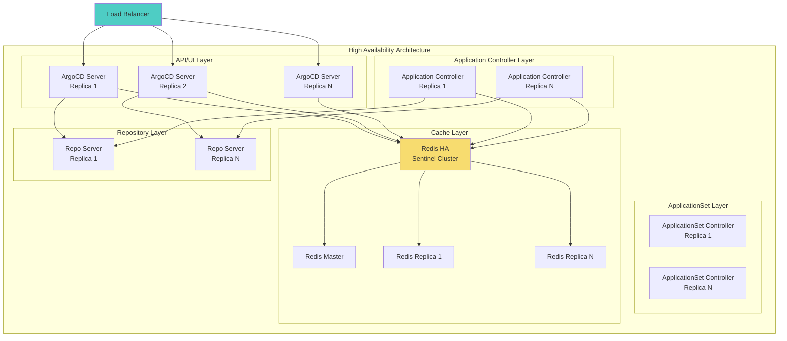
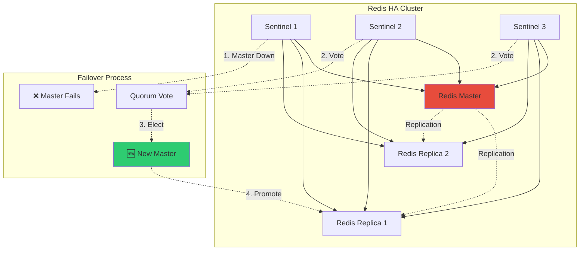
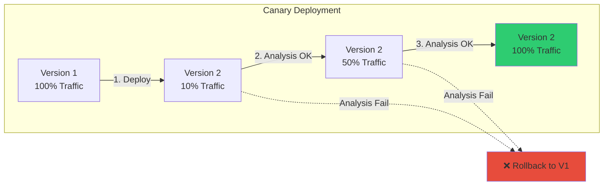
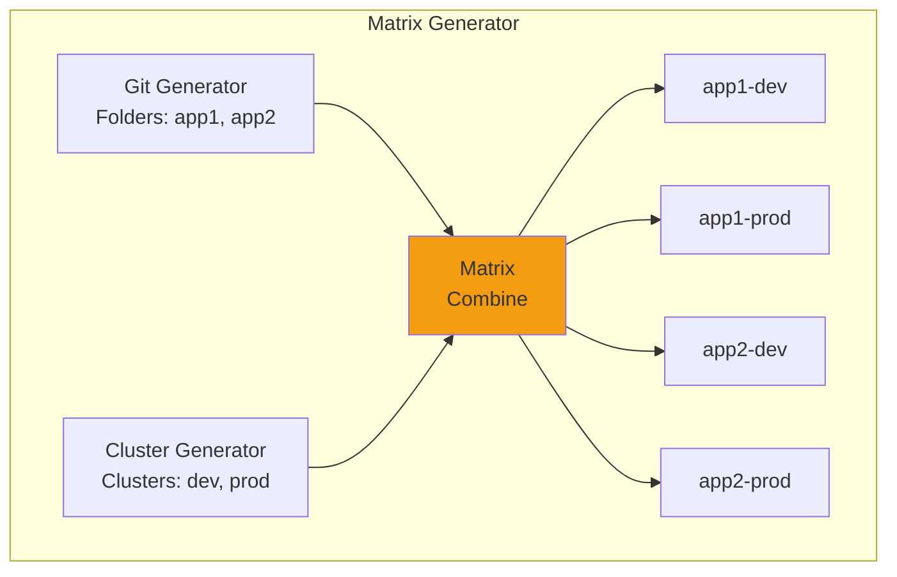
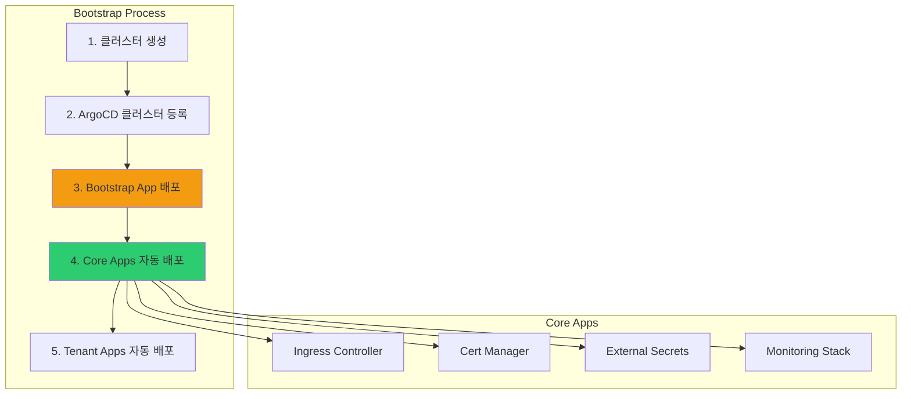
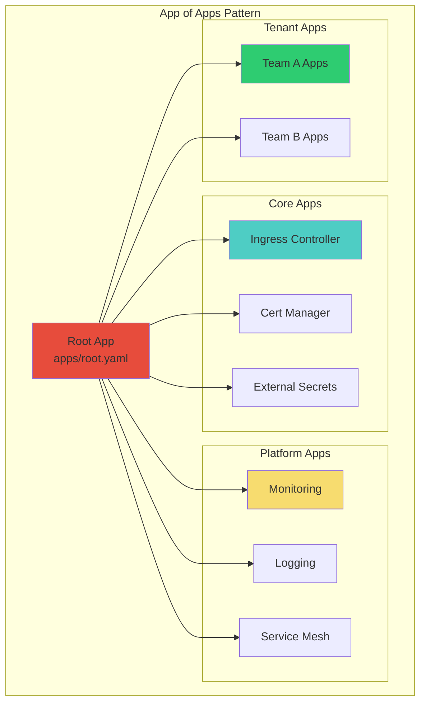
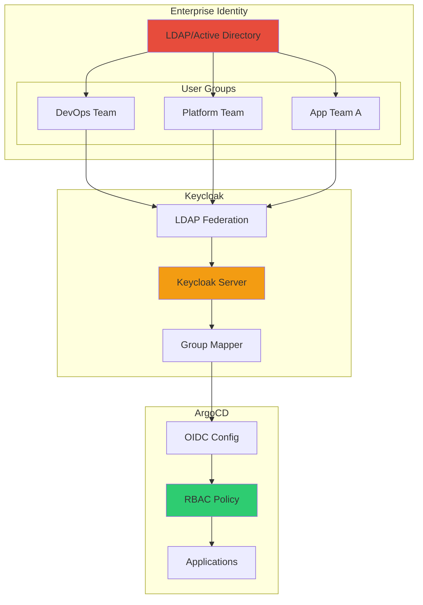
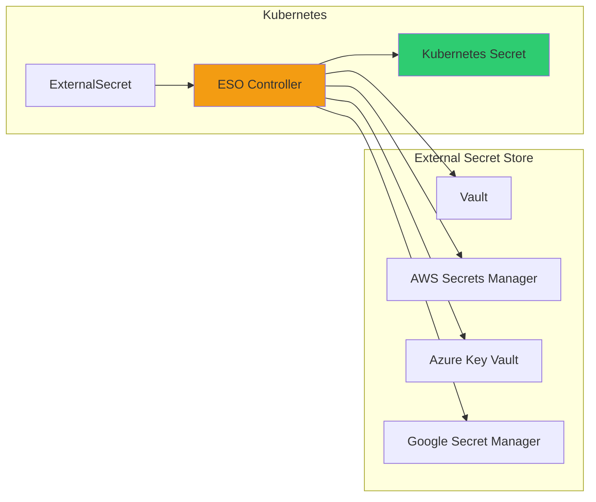
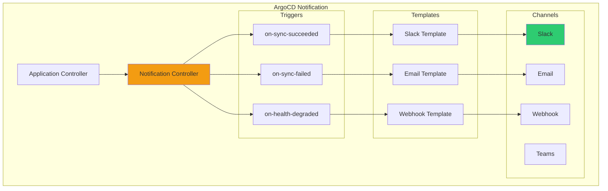

# 6주차 학습정리 - ArgoCD 완전 정복: 프로덕션 환경 구축과 고급 GitOps 패턴

## 📋 목차

1. [🏗️ ArgoCD 고가용성 구성](#️-argocd-고가용성-구성)
   - [고가용성 아키텍처](#1-고가용성-아키텍처)
   - [Redis HA 설정](#2-redis-ha-설정)
   - [ApplicationSet Controller 확장](#3-applicationset-controller-확장)

2. [🔄 고급 Sync 전략](#-고급-sync-전략)
   - [Sync Windows](#1-sync-windows)
   - [Progressive Delivery](#2-progressive-delivery)
   - [Automated Self-Healing](#3-automated-self-healing)

3. [📊 Resource Tracking](#-resource-tracking)
   - [Tracking Methods](#1-tracking-methods)
   - [Annotation vs Label](#2-annotation-vs-label)
   - [Best Practices](#3-best-practices)

4. [🎯 ApplicationSet 고급 활용](#-applicationset-고급-활용)
   - [Matrix Generator](#1-matrix-generator)
   - [Git File Generator](#2-git-file-generator)
   - [Pull Request Generator](#3-pull-request-generator)

5. [🚀 멀티 클러스터 관리](#-멀티-클러스터-관리)
   - [Cluster Bootstrap](#1-cluster-bootstrap)
   - [Cluster Credentials 관리](#2-cluster-credentials-관리)
   - [App of Apps 패턴](#3-app-of-apps-패턴)

6. [🔑 LDAP/Active Directory 통합](#-ldapactive-directory-통합)
   - [OpenLDAP 서버 구축](#1-openldap-서버-구축)
   - [Keycloak LDAP Federation](#2-keycloak-ldap-federation)
   - [ArgoCD RBAC with LDAP Groups](#3-argocd-rbac-with-ldap-groups)
   - [LDAP 동기화 및 캐싱](#4-ldap-동기화-및-캐싱)

7. [🔐 시크릿 관리 전략](#-시크릿-관리-전략)
   - [Sealed Secrets](#1-sealed-secrets)
   - [External Secrets Operator](#2-external-secrets-operator)
   - [HashiCorp Vault 통합](#3-hashicorp-vault-통합)

8. [📈 모니터링 및 관찰성](#-모니터링-및-관찰성)
   - [Prometheus Metrics](#1-prometheus-metrics)
   - [Notification 설정](#2-notification-설정)
   - [Audit Logging](#3-audit-logging)

9. [🎓 6주차 학습 정리](#-6주차-학습-정리)
   - [핵심 성취 목표](#1-핵심-성취-목표)
   - [프로덕션 체크리스트](#2-프로덕션-체크리스트)
   - [마무리 및 다음 단계](#3-마무리-및-다음-단계)

---

## 🏗️ ArgoCD 고가용성 구성

### 1. 고가용성 아키텍처

#### ArgoCD 컴포넌트별 확장 전략

**프로덕션 ArgoCD는 다음과 같은 고가용성 요구사항을 만족해야 합니다**:



**컴포넌트별 역할**:

| 컴포넌트 | 역할 | HA 요구사항 |
|---------|------|------------|
| **ArgoCD Server** | API/UI 제공, 인증/인가 | 2+ replicas + LoadBalancer |
| **Application Controller** | Git → K8s 동기화 수행 | Shard 분할 (default: 0, max: N) |
| **ApplicationSet Controller** | ApplicationSet 처리 | 2+ replicas + Leader Election |
| **Repo Server** | Git clone, Helm render | 2+ replicas (stateless) |
| **Redis HA** | 캐시, 세션 저장 | Sentinel 기반 자동 failover |

#### 고가용성 설치

```bash
# ArgoCD HA values 파일 생성
cat <<EOF > argocd-ha-values.yaml
# Redis HA 활성화
redis-ha:
  enabled: true
  haproxy:
    enabled: true
  replicas: 3

# Application Controller HA
controller:
  replicas: 2
  env:
    - name: ARGOCD_CONTROLLER_REPLICAS
      value: "2"
    - name: ARGOCD_CONTROLLER_SHARD
      valueFrom:
        fieldRef:
          fieldPath: metadata.name

# ArgoCD Server HA
server:
  replicas: 3
  autoscaling:
    enabled: true
    minReplicas: 2
    maxReplicas: 5
    targetCPUUtilizationPercentage: 70

# Repo Server HA
repoServer:
  replicas: 2
  autoscaling:
    enabled: true
    minReplicas: 2
    maxReplicas: 5

# ApplicationSet Controller HA
applicationSet:
  replicas: 2
  env:
    - name: ARGOCD_APPLICATIONSET_CONTROLLER_ENABLE_LEADER_ELECTION
      value: "true"
EOF

# ArgoCD HA 설치
helm upgrade --install argocd argo/argo-cd \
  --version 9.0.5 \
  -f argocd-ha-values.yaml \
  --namespace argocd
```

### 2. Redis HA 설정

#### Redis Sentinel 아키텍처

**Redis HA**는 **Sentinel**을 사용하여 자동 failover를 제공합니다.



**Sentinel 동작 방식**:
1. **정족수(Quorum)**: 최소 2개의 Sentinel이 Master 장애 합의
2. **투표(Vote)**: 과반수 Sentinel이 새 Master 선출
3. **승격(Promote)**: 선출된 Replica가 Master로 승격
4. **재구성(Reconfigure)**: 나머지 Replica들이 새 Master를 따르도록 재구성

#### Redis HA 확인

```bash
# Redis HA Pod 확인
kubectl get pod -n argocd | grep redis

# 출력 예시:
# argocd-redis-ha-haproxy-xxx        1/1   Running
# argocd-redis-ha-server-0           3/3   Running
# argocd-redis-ha-server-1           3/3   Running
# argocd-redis-ha-server-2           3/3   Running

# Redis Master 확인
kubectl exec -n argocd argocd-redis-ha-server-0 -c redis -- \
  redis-cli -p 26379 sentinel get-master-addr-by-name mymaster

# 출력 예시:
# 1) "10.244.0.15"
# 2) "6379"

# Sentinel 상태 확인
kubectl exec -n argocd argocd-redis-ha-server-0 -c sentinel -- \
  redis-cli -p 26379 sentinel masters
```

### 3. ApplicationSet Controller 확장

#### Leader Election 메커니즘

**ApplicationSet Controller**는 **Leader Election**을 사용하여 Active-Standby 고가용성을 제공합니다.

```mermaid
sequenceDiagram
    participant L as Leader Pod
    participant S as Standby Pod
    participant K as K8s API (Lease)
    participant G as Git Repo

    L->>K: 1. Acquire Lease (leader election)
    K->>L: 2. Lease granted (become leader)
    L->>G: 3. Process ApplicationSets

    Note over L,S: Leader is active

    S->>K: 4. Try acquire Lease
    K->>S: 5. Lease denied (leader exists)

    Note over L: ❌ Leader Pod crashes

    S->>K: 6. Detect Lease expired
    K->>S: 7. Lease granted (become leader)
    S->>G: 8. Take over processing

    style L fill:#2ECC71
    style S fill:#F39C12
```

**Leader Election 설정**:

```bash
# ApplicationSet Controller Leader Election 확인
kubectl get lease -n argocd argocd-applicationset-controller

# 출력 예시:
# NAME                                HOLDER                                      AGE
# argocd-applicationset-controller    argocd-applicationset-controller-xxx-yyy    5m

# Leader Pod 확인
kubectl describe lease -n argocd argocd-applicationset-controller
# Holder Identity: argocd-applicationset-controller-7d5f9b8c5-abc12
```

---

## 🔄 고급 Sync 전략

### 1. Sync Windows

#### Sync Window란?

**Sync Window**는 특정 시간대에만 동기화를 허용하거나 차단하는 기능입니다.

**사용 사례**:
- ✅ 업무 시간 외(야간)에만 프로덕션 배포
- ✅ 유지보수 시간대 자동 동기화 차단
- ✅ 주중/주말 배포 정책 분리

#### Sync Window 설정

```bash
# AppProject에 Sync Window 추가
cat <<EOF | kubectl apply -f -
apiVersion: argoproj.io/v1alpha1
kind: AppProject
metadata:
  name: production
  namespace: argocd
spec:
  syncWindows:
  # 평일 야간 (22:00-06:00) 배포 허용
  - kind: allow
    schedule: '0 22 * * 1-5'
    duration: 8h
    applications:
    - '*'
    namespaces:
    - production
    clusters:
    - https://kubernetes.default.svc

  # 주말 전체 배포 차단
  - kind: deny
    schedule: '0 0 * * 0,6'
    duration: 24h
    applications:
    - '*'

  # 긴급 패치 허용 (관리자만)
  - kind: allow
    schedule: '* * * * *'  # 항상 허용
    duration: 1h
    manualSync: true  # 수동 Sync만 허용
EOF
```

**Sync Window 옵션**:
- `schedule`: Cron 형식 시간표 (분 시 일 월 요일)
- `duration`: 윈도우 지속 시간
- `kind`: `allow` (허용) 또는 `deny` (차단)
- `manualSync`: `true`면 자동 Sync 차단, 수동만 허용

#### Sync Window 확인

```bash
# AppProject Sync Window 확인
argocd proj get production

# Application Sync 가능 여부 확인
argocd app get myapp | grep "Sync Windows"
```

### 2. Progressive Delivery

#### Argo Rollouts 통합

**Argo Rollouts**는 Blue-Green, Canary 배포 전략을 제공합니다.



#### Rollout 예시

```yaml
# Canary Rollout 정의
apiVersion: argoproj.io/v1alpha1
kind: Rollout
metadata:
  name: myapp
spec:
  replicas: 5
  strategy:
    canary:
      steps:
      - setWeight: 20      # 1단계: 20% 트래픽
      - pause: {duration: 5m}
      - setWeight: 40      # 2단계: 40% 트래픽
      - pause: {duration: 5m}
      - setWeight: 60      # 3단계: 60% 트래픽
      - pause: {duration: 5m}
      - setWeight: 80      # 4단계: 80% 트래픽
      - pause: {duration: 5m}
      # 분석 결과 OK면 100% 전환

      # Prometheus 기반 자동 분석
      analysis:
        templates:
        - templateName: success-rate
        args:
        - name: service-name
          value: myapp

      # 자동 Rollback 트리거
      antiAffinity:
        requiredDuringSchedulingIgnoredDuringExecution: {}

  revisionHistoryLimit: 3
  selector:
    matchLabels:
      app: myapp
  template:
    metadata:
      labels:
        app: myapp
    spec:
      containers:
      - name: myapp
        image: myapp:v2.0.0
        ports:
        - containerPort: 8080
```

#### AnalysisTemplate 정의

```yaml
# Prometheus 기반 성공률 분석
apiVersion: argoproj.io/v1alpha1
kind: AnalysisTemplate
metadata:
  name: success-rate
spec:
  args:
  - name: service-name
  metrics:
  - name: success-rate
    interval: 1m
    count: 5
    successCondition: result[0] >= 0.95
    failureLimit: 3
    provider:
      prometheus:
        address: http://prometheus:9090
        query: |
          sum(rate(
            http_requests_total{
              service="{{ args.service-name }}",
              status=~"2.."
            }[5m]
          )) /
          sum(rate(
            http_requests_total{
              service="{{ args.service-name }}"
            }[5m]
          ))
```

### 3. Automated Self-Healing

#### Self-Healing 설정

**Self-Healing**은 Git 상태와 클러스터 상태가 불일치할 때 자동으로 복구합니다.

```yaml
apiVersion: argoproj.io/v1alpha1
kind: Application
metadata:
  name: myapp
spec:
  # Self-Healing 활성화
  syncPolicy:
    automated:
      prune: true       # 삭제된 리소스 제거
      selfHeal: true    # Drift 자동 복구
      allowEmpty: false # 빈 매니페스트 거부

    # Sync 재시도 설정
    retry:
      limit: 5
      backoff:
        duration: 5s
        factor: 2
        maxDuration: 3m

  # IgnoreDifferences - 무시할 필드 지정
  ignoreDifferences:
  - group: apps
    kind: Deployment
    jsonPointers:
    - /spec/replicas  # HPA가 관리하는 replicas 무시

  - group: ""
    kind: Secret
    jqPathExpressions:
    - .data.token  # 동적으로 생성되는 토큰 무시
```

**IgnoreDifferences 사용 사례**:
- **HPA 관리 replicas**: HPA가 동적으로 조정하는 replicas 무시
- **Cluster Autoscaler annotations**: CA가 추가하는 annotation 무시
- **Istio sidecar injected fields**: Istio가 주입하는 필드 무시
- **동적 생성 Secret**: cert-manager가 생성하는 인증서 무시

---

## 📊 Resource Tracking

### 1. Tracking Methods

#### ArgoCD Resource Tracking 방식

ArgoCD는 **3가지 방식**으로 리소스를 추적합니다:

| 방식 | 설명 | 장점 | 단점 |
|-----|------|------|-----|
| **Label** | `app.kubernetes.io/instance` label 사용 | 기본값, 간단함 | Label 충돌 가능 |
| **Annotation** | `argocd.argoproj.io/tracking-id` annotation 사용 | Label 충돌 방지 | Annotation 크기 제한 |
| **Annotation+Label** | 둘 다 사용 | 호환성 최대화 | 약간의 오버헤드 |

#### Tracking Method 설정

```bash
# argocd-cm ConfigMap 수정
KUBE_EDITOR="nano" kubectl edit cm -n argocd argocd-cm

# data 섹션에 추가
# application.resourceTrackingMethod: annotation
# 또는
# application.resourceTrackingMethod: annotation+label

# ArgoCD Application Controller 재시작
kubectl rollout restart deployment argocd-application-controller -n argocd
```

### 2. Annotation vs Label

#### Annotation 방식 동작

**Annotation 기반 Tracking**은 `argocd.argoproj.io/tracking-id` 값을 사용합니다.

```yaml
# Annotation 기반 Tracking 예시
apiVersion: v1
kind: ConfigMap
metadata:
  name: myconfig
  annotations:
    # ArgoCD가 자동 추가
    argocd.argoproj.io/tracking-id: "myapp:v1:ConfigMap:default/myconfig"
data:
  key: value
```

**Tracking ID 구성**:
```
<app-name>:<app-namespace>:<group>:<kind>:<namespace>/<name>
```

**장점**:
- ✅ Label 충돌 없음
- ✅ 여러 ArgoCD 인스턴스 동시 사용 가능
- ✅ Helm Chart와 완벽히 호환

### 3. Best Practices

#### Resource Tracking 모범 사례

**프로덕션 권장 설정**:

```yaml
# argocd-cm ConfigMap
apiVersion: v1
kind: ConfigMap
metadata:
  name: argocd-cm
  namespace: argocd
data:
  # Annotation 기반 Tracking 사용
  application.resourceTrackingMethod: "annotation"

  # Resource Customization
  resource.customizations: |
    # Deployment의 replicas 필드 무시 (HPA 사용 시)
    apps/Deployment:
      ignoreDifferences: |
        jsonPointers:
        - /spec/replicas

    # Secret의 data 필드 무시 (External Secrets 사용 시)
    v1/Secret:
      ignoreDifferences: |
        jqPathExpressions:
        - .data

    # Service의 clusterIP 무시 (동적 할당)
    v1/Service:
      ignoreDifferences: |
        jsonPointers:
        - /spec/clusterIP
        - /spec/clusterIPs
```

---

## 🎯 ApplicationSet 고급 활용

### 1. Matrix Generator

#### Matrix Generator란?

**Matrix Generator**는 **2개의 Generator를 조합**하여 애플리케이션을 생성합니다.



#### Matrix Generator 예시

```yaml
apiVersion: argoproj.io/v1alpha1
kind: ApplicationSet
metadata:
  name: multi-env-apps
spec:
  generators:
  - matrix:
      generators:
      # Generator 1: Git 폴더
      - git:
          repoURL: https://github.com/example/apps.git
          revision: main
          directories:
          - path: apps/*

      # Generator 2: 클러스터
      - list:
          elements:
          - cluster: dev
            url: https://dev.example.com:6443
            namespace: dev
          - cluster: prod
            url: https://prod.example.com:6443
            namespace: prod

  template:
    metadata:
      # 조합된 이름: app1-dev, app1-prod, ...
      name: '{{path.basename}}-{{cluster}}'
    spec:
      project: default
      source:
        repoURL: https://github.com/example/apps.git
        targetRevision: main
        path: '{{path}}'
      destination:
        server: '{{url}}'
        namespace: '{{namespace}}'
      syncPolicy:
        automated:
          prune: true
          selfHeal: true
```

**결과**:
- `apps/app1` × `dev` → `app1-dev`
- `apps/app1` × `prod` → `app1-prod`
- `apps/app2` × `dev` → `app2-dev`
- `apps/app2` × `prod` → `app2-prod`

### 2. Git File Generator

#### Git File Generator란?

**Git File Generator**는 **Git 리포지토리의 JSON/YAML 파일**을 읽어 애플리케이션을 생성합니다.

**사용 사례**:
- ✅ 각 팀이 자신의 애플리케이션 목록 관리
- ✅ Self-Service 배포 플랫폼
- ✅ 중앙화된 설정 저장소

#### Git File Generator 예시

**Git 리포지토리 구조**:
```
apps-config/
├── team-a.yaml
├── team-b.yaml
└── team-c.yaml
```

**team-a.yaml**:
```yaml
# Team A의 애플리케이션 목록
applications:
- name: frontend
  repoURL: https://github.com/team-a/frontend.git
  path: k8s/overlays/prod
  namespace: team-a-frontend

- name: backend
  repoURL: https://github.com/team-a/backend.git
  path: k8s/overlays/prod
  namespace: team-a-backend
```

**ApplicationSet 정의**:
```yaml
apiVersion: argoproj.io/v1alpha1
kind: ApplicationSet
metadata:
  name: team-apps
spec:
  generators:
  - git:
      repoURL: https://github.com/example/apps-config.git
      revision: main
      files:
      - path: "*.yaml"

  template:
    metadata:
      name: '{{name}}'
    spec:
      project: default
      source:
        repoURL: '{{repoURL}}'
        targetRevision: main
        path: '{{path}}'
      destination:
        server: https://kubernetes.default.svc
        namespace: '{{namespace}}'
      syncPolicy:
        automated:
          prune: true
          selfHeal: true
```

### 3. Pull Request Generator

#### Pull Request Generator란?

**Pull Request Generator**는 **Git Pull Request**를 기반으로 preview 환경을 자동 생성합니다.

```mermaid
sequenceDiagram
    participant D as Developer
    participant G as GitHub/GitLab
    participant AS as ApplicationSet
    participant K as Kubernetes

    D->>G: 1. Create Pull Request
    G->>AS: 2. Webhook/Polling
    AS->>K: 3. Create preview namespace
    AS->>K: 4. Deploy PR branch
    AS->>G: 5. Comment with preview URL

    D->>D: 6. Test preview environment
    D->>G: 7. Merge PR

    G->>AS: 8. PR closed webhook
    AS->>K: 9. Delete preview namespace

    style AS fill:#F39C12
    style K fill:#2ECC71
```

#### Pull Request Generator 예시

```yaml
apiVersion: argoproj.io/v1alpha1
kind: ApplicationSet
metadata:
  name: pr-preview
spec:
  generators:
  - pullRequest:
      github:
        owner: example-org
        repo: myapp
        tokenRef:
          secretName: github-token
          key: token
        labels:
        - preview  # 'preview' 라벨이 있는 PR만

      # 필터
      requeueAfterSeconds: 60  # 1분마다 PR 확인

  template:
    metadata:
      name: 'preview-pr-{{number}}'
      finalizers:
      - resources-finalizer.argocd.argoproj.io  # PR 닫히면 리소스 삭제
    spec:
      project: default
      source:
        repoURL: 'https://github.com/example-org/myapp.git'
        targetRevision: '{{head_sha}}'  # PR의 최신 커밋
        path: k8s/overlays/preview
        kustomize:
          commonLabels:
            pr: 'pr-{{number}}'

      destination:
        server: https://kubernetes.default.svc
        namespace: 'preview-pr-{{number}}'

      syncPolicy:
        automated:
          prune: true
          selfHeal: true
        syncOptions:
        - CreateNamespace=true
```

**GitHub Token Secret 생성**:
```bash
kubectl create secret generic github-token \
  --from-literal=token=<GITHUB_PERSONAL_ACCESS_TOKEN> \
  -n argocd
```

---

## 🚀 멀티 클러스터 관리

### 1. Cluster Bootstrap

#### Bootstrap 프로세스

**새 Kubernetes 클러스터를 ArgoCD에 추가하는 전체 과정**:



#### 클러스터 등록

```bash
# ArgoCD CLI로 클러스터 추가
argocd cluster add <CONTEXT_NAME>

# 예시
argocd cluster add kind-prod-cluster \
  --name prod-cluster \
  --label env=production \
  --label region=ap-northeast-2

# 클러스터 목록 확인
argocd cluster list
# SERVER                          NAME            VERSION  STATUS   MESSAGE
# https://kubernetes.default.svc  in-cluster      1.28     Success
# https://prod.example.com:6443   prod-cluster    1.28     Success
```

### 2. Cluster Credentials 관리

#### ServiceAccount 기반 인증

**ArgoCD는 클러스터 접근을 위해 ServiceAccount Token을 사용합니다**:

```bash
# 대상 클러스터에서 ServiceAccount 생성
kubectl create namespace argocd
kubectl create serviceaccount argocd-manager -n argocd

# ClusterRole 생성
cat <<EOF | kubectl apply -f -
apiVersion: rbac.authorization.k8s.io/v1
kind: ClusterRole
metadata:
  name: argocd-manager-role
rules:
- apiGroups:
  - '*'
  resources:
  - '*'
  verbs:
  - '*'
- nonResourceURLs:
  - '*'
  verbs:
  - '*'
EOF

# ClusterRoleBinding 생성
kubectl create clusterrolebinding argocd-manager-binding \
  --clusterrole=argocd-manager-role \
  --serviceaccount=argocd:argocd-manager

# Secret Token 생성 (K8s 1.24+)
cat <<EOF | kubectl apply -f -
apiVersion: v1
kind: Secret
metadata:
  name: argocd-manager-token
  namespace: argocd
  annotations:
    kubernetes.io/service-account.name: argocd-manager
type: kubernetes.io/service-account-token
EOF

# Token 확인
kubectl get secret -n argocd argocd-manager-token -o jsonpath='{.data.token}' | base64 -d
```

### 3. App of Apps 패턴

#### App of Apps란?

**App of Apps**는 **하나의 Application이 다른 Application들을 관리**하는 패턴입니다.



#### App of Apps 구현

**Git 리포지토리 구조**:
```
gitops-repo/
├── apps/
│   ├── root.yaml                    # Root Application
│   ├── core/
│   │   ├── ingress-nginx.yaml
│   │   ├── cert-manager.yaml
│   │   └── external-secrets.yaml
│   ├── platform/
│   │   ├── monitoring.yaml
│   │   └── logging.yaml
│   └── tenants/
│       ├── team-a.yaml
│       └── team-b.yaml
└── manifests/
    ├── core/
    ├── platform/
    └── tenants/
```

**Root Application**:
```yaml
# apps/root.yaml
apiVersion: argoproj.io/v1alpha1
kind: Application
metadata:
  name: root
  namespace: argocd
  # Finalizer: Root App 삭제 시 모든 하위 앱도 삭제
  finalizers:
  - resources-finalizer.argocd.argoproj.io
spec:
  project: default
  source:
    repoURL: https://github.com/example/gitops-repo.git
    targetRevision: main
    path: apps/core  # Core Apps 먼저 배포
  destination:
    server: https://kubernetes.default.svc
    namespace: argocd
  syncPolicy:
    automated:
      prune: true
      selfHeal: true
    syncOptions:
    - CreateNamespace=true
```

**Child Application 예시**:
```yaml
# apps/core/ingress-nginx.yaml
apiVersion: argoproj.io/v1alpha1
kind: Application
metadata:
  name: ingress-nginx
  namespace: argocd
spec:
  project: default
  source:
    repoURL: https://kubernetes.github.io/ingress-nginx
    chart: ingress-nginx
    targetRevision: 4.8.0
    helm:
      values: |
        controller:
          service:
            type: LoadBalancer
  destination:
    server: https://kubernetes.default.svc
    namespace: ingress-nginx
  syncPolicy:
    automated:
      prune: true
      selfHeal: true
    syncOptions:
    - CreateNamespace=true
```

---

## 🔑 LDAP/Active Directory 통합

### 1. OpenLDAP 서버 구축

#### LDAP란?

**LDAP (Lightweight Directory Access Protocol)**는 사용자, 그룹, 권한 정보를 계층적으로 관리하는 디렉터리 서비스입니다.

**쉬운 비유**:
- **LDAP 서버** = 회사의 인사/보안부 (모든 직원 정보 중앙 관리)
- **디렉터리 구조** = 회사 조직도 (본사-부서-팀-직원)
- **인증(Authentication)** = 신분증 검사
- **권한 부여(Authorization)** = 출입증/권한 확인

#### LDAP 디렉터리 구조 (DIT)

```
dc=example,dc=org          # Base DN (Root DN)
├── ou=people              # Organizational Unit: 사용자
│   ├── uid=alice
│   │   ├── cn: Alice
│   │   ├── sn: Kim
│   │   └── mail: alice@example.org
│   └── uid=bob
│       ├── cn: Bob
│       ├── sn: Lee
│       └── mail: bob@example.org
└── ou=groups              # Organizational Unit: 그룹
    ├── cn=devs
    │   └── member: uid=bob,ou=people,dc=example,dc=org
    └── cn=admins
        └── member: uid=alice,ou=people,dc=example,dc=org
```

**주요 용어**:
- **DN (Distinguished Name)**: `uid=alice,ou=people,dc=example,dc=org`
- **RDN (Relative Distinguished Name)**: `uid=alice`
- **Base DN**: `dc=example,dc=org`
- **Entry**: 디렉터리의 기본 단위 (다수의 Attribute로 구성)
- **Attribute**: Entry의 각 속성 (cn, sn, uid, mail 등)

#### OpenLDAP 서버 배포

```bash
# OpenLDAP + phpLDAPadmin 배포
cat <<EOF | kubectl apply -f -
apiVersion: v1
kind: Namespace
metadata:
  name: openldap
---
apiVersion: apps/v1
kind: Deployment
metadata:
  name: openldap
  namespace: openldap
spec:
  replicas: 1
  selector:
    matchLabels:
      app: openldap
  template:
    metadata:
      labels:
        app: openldap
    spec:
      containers:
      # OpenLDAP Server
      - name: openldap
        image: osixia/openldap:1.5.0
        ports:
        - containerPort: 389
          name: ldap
        - containerPort: 636
          name: ldaps
        env:
        - name: LDAP_ORGANISATION
          value: "Example Org"
        - name: LDAP_DOMAIN
          value: "example.org"
        - name: LDAP_ADMIN_PASSWORD
          value: "admin"
        - name: LDAP_CONFIG_PASSWORD
          value: "admin"

      # phpLDAPadmin (Web UI)
      - name: phpldapadmin
        image: osixia/phpldapadmin:0.9.0
        ports:
        - containerPort: 80
          name: phpldapadmin
        env:
        - name: PHPLDAPADMIN_HTTPS
          value: "false"
        - name: PHPLDAPADMIN_LDAP_HOSTS
          value: "localhost"
---
apiVersion: v1
kind: Service
metadata:
  name: openldap
  namespace: openldap
spec:
  selector:
    app: openldap
  ports:
  - name: phpldapadmin
    port: 80
    targetPort: 80
    nodePort: 30000
  - name: ldap
    port: 389
    targetPort: 389
  - name: ldaps
    port: 636
    targetPort: 636
  type: NodePort
EOF

# 배포 확인
kubectl get deploy,pod,svc,ep -n openldap
```

#### OpenLDAP 초기 설정

**1. phpLDAPadmin 웹 UI 접속**:
```bash
# 브라우저에서 접속
open http://127.0.0.1:30000

# 로그인 정보:
# - Login DN: cn=admin,dc=example,dc=org
# - Password: admin
```

**2. OU (Organizational Unit) 생성**:
```bash
kubectl -n openldap exec -it deploy/openldap -c openldap -- bash

# ou=people, ou=groups 생성
cat <<EOF | ldapadd -x -D "cn=admin,dc=example,dc=org" -w admin
dn: ou=people,dc=example,dc=org
objectClass: organizationalUnit
ou: people

dn: ou=groups,dc=example,dc=org
objectClass: organizationalUnit
ou: groups
EOF
```

**3. 사용자 추가**:
```bash
# alice 사용자 추가
cat <<EOF | ldapadd -x -D "cn=admin,dc=example,dc=org" -w admin
dn: uid=alice,ou=people,dc=example,dc=org
objectClass: inetOrgPerson
objectClass: posixAccount
objectClass: shadowAccount
uid: alice
cn: Alice
sn: Kim
mail: alice@example.org
userPassword: password123
uidNumber: 10001
gidNumber: 10001
homeDirectory: /home/alice
EOF

# bob 사용자 추가
cat <<EOF | ldapadd -x -D "cn=admin,dc=example,dc=org" -w admin
dn: uid=bob,ou=people,dc=example,dc=org
objectClass: inetOrgPerson
objectClass: posixAccount
objectClass: shadowAccount
uid: bob
cn: Bob
sn: Lee
mail: bob@example.org
userPassword: password456
uidNumber: 10002
gidNumber: 10002
homeDirectory: /home/bob
EOF
```

**4. 그룹 생성 및 멤버 할당**:
```bash
# devs 그룹 생성
cat <<EOF | ldapadd -x -D "cn=admin,dc=example,dc=org" -w admin
dn: cn=devs,ou=groups,dc=example,dc=org
objectClass: groupOfNames
cn: devs
member: uid=bob,ou=people,dc=example,dc=org
EOF

# admins 그룹 생성
cat <<EOF | ldapadd -x -D "cn=admin,dc=example,dc=org" -w admin
dn: cn=admins,ou=groups,dc=example,dc=org
objectClass: groupOfNames
cn: admins
member: uid=alice,ou=people,dc=example,dc=org
EOF
```

**5. LDAP 검색 테스트**:
```bash
# 모든 사용자 조회
ldapsearch -x -H ldap://localhost:389 \
  -b "ou=people,dc=example,dc=org" \
  -D "cn=admin,dc=example,dc=org" \
  -w admin

# 특정 사용자 조회
ldapsearch -x -H ldap://localhost:389 \
  -b "dc=example,dc=org" \
  -D "cn=admin,dc=example,dc=org" \
  -w admin \
  "(uid=alice)"

# 모든 그룹 조회
ldapsearch -x -H ldap://localhost:389 \
  -b "ou=groups,dc=example,dc=org" \
  -D "cn=admin,dc=example,dc=org" \
  -w admin
```

---

### 2. Keycloak LDAP Federation

#### LDAP 연동 아키텍처

**Keycloak을 사용하여 OpenLDAP를 ArgoCD SSO에 통합**할 수 있습니다.



#### Keycloak LDAP 설정

```bash
# Keycloak Admin Console 접속
# http://keycloak.example.com/admin

# 1. User Federation → Add provider → ldap 선택

# LDAP 기본 설정:
# Edit Mode: READ_ONLY (LDAP 수정 불가)
# Vendor: Active Directory 또는 Other
# Connection URL: ldap://ldap.example.com:389
# Users DN: ou=users,dc=example,dc=com
# Bind DN: cn=admin,dc=example,dc=com
# Bind Credential: <LDAP_ADMIN_PASSWORD>

# 2. LDAP Group Mapper 생성
# Mappers → Create

# Name: group-mapper
# Mapper Type: group-ldap-mapper
# LDAP Groups DN: ou=groups,dc=example,dc=com
# Group Name LDAP Attribute: cn
# Group Object Classes: groupOfNames
# Membership LDAP Attribute: member
# Membership Attribute Type: DN
# Mode: READ_ONLY
```

### 3. ArgoCD RBAC with LDAP Groups

#### LDAP 그룹 기반 RBAC 정책

```yaml
# argocd-rbac-cm ConfigMap
apiVersion: v1
kind: ConfigMap
metadata:
  name: argocd-rbac-cm
  namespace: argocd
data:
  policy.csv: |
    # Platform Team (Full Admin)
    g, /Platform Team, role:admin

    # DevOps Team (Read-only Admin)
    g, /DevOps Team, role:readonly

    # App Team A (특정 프로젝트만)
    g, /App Team A, role:app-team-a
    p, role:app-team-a, applications, *, team-a/*, allow
    p, role:app-team-a, applications, get, */*, allow
    p, role:app-team-a, repositories, get, *, allow

    # App Team B (특정 프로젝트만)
    g, /App Team B, role:app-team-b
    p, role:app-team-b, applications, *, team-b/*, allow
    p, role:app-team-b, applications, get, */*, allow

  policy.default: role:readonly

  # LDAP 그룹 클레임 매핑
  scopes: '[groups, email]'
```

**그룹 클레임 설정**:
```yaml
# argocd-cm ConfigMap
apiVersion: v1
kind: ConfigMap
metadata:
  name: argocd-cm
  namespace: argocd
data:
  oidc.config: |
    name: Keycloak
    issuer: https://keycloak.example.com/realms/master
    clientID: argocd
    clientSecret: $oidc.keycloak.clientSecret
    requestedScopes:
    - openid
    - profile
    - email
    - groups
    # LDAP 그룹 클레임
    claimMapping:
      groups: groups
```

### 4. LDAP 동기화 및 캐싱

#### Keycloak User Storage SPI 최적화

```bash
# Keycloak Admin Console
# User Federation → ldap → Settings

# Cache Settings:
# Cache Policy: DEFAULT
# Eviction Day: 1
# Eviction Hour: 0
# Eviction Minute: 0
# Max Lifespan: 86400000 (24시간)

# Sync Settings:
# Periodic Full Sync: Enabled
# Full Sync Period: 604800 (7일)
# Periodic Changed Users Sync: Enabled
# Changed Users Sync Period: 86400 (1일)
```

#### LDAP 연결 풀 최적화

```yaml
# Keycloak StatefulSet 환경 변수
env:
- name: LDAP_CONNECTION_POOL_SIZE
  value: "20"
- name: LDAP_CONNECTION_POOL_TIMEOUT
  value: "5000"
- name: LDAP_READ_TIMEOUT
  value: "60000"
```

---

## 🔐 시크릿 관리 전략

### 1. Sealed Secrets

#### Sealed Secrets란?

**Sealed Secrets**는 암호화된 Secret을 **안전하게 Git에 저장**할 수 있게 합니다.

```mermaid
sequenceDiagram
    participant D as Developer
    participant K as kubeseal CLI
    participant SS as SealedSecret Controller
    participant KS as Kubernetes Secret

    D->>K: 1. kubeseal < secret.yaml > sealed-secret.yaml
    Note over K: Public Key로 암호화
    D->>D: 2. sealed-secret.yaml을 Git에 커밋

    D->>SS: 3. kubectl apply -f sealed-secret.yaml
    SS->>SS: 4. Private Key로 복호화
    SS->>KS: 5. 일반 Secret 생성

    style SS fill:#F39C12
    style KS fill:#2ECC71
```

#### Sealed Secrets 설치 및 사용

```bash
# Sealed Secrets Controller 설치
kubectl apply -f https://github.com/bitnami-labs/sealed-secrets/releases/download/v0.24.0/controller.yaml

# kubeseal CLI 설치 (macOS)
brew install kubeseal

# 기존 Secret 생성
kubectl create secret generic mysecret \
  --from-literal=username=admin \
  --from-literal=password=secret123 \
  --dry-run=client -o yaml > secret.yaml

# SealedSecret로 암호화
kubeseal < secret.yaml > sealed-secret.yaml \
  --controller-name=sealed-secrets-controller \
  --controller-namespace=kube-system

# Git에 커밋 가능 (암호화됨)
cat sealed-secret.yaml
# apiVersion: bitnami.com/v1alpha1
# kind: SealedSecret
# metadata:
#   name: mysecret
# spec:
#   encryptedData:
#     username: AgB8F3vZ...
#     password: AgC9K2xL...

# 배포
kubectl apply -f sealed-secret.yaml

# 복호화된 Secret 확인
kubectl get secret mysecret -o jsonpath='{.data.password}' | base64 -d
```

### 2. External Secrets Operator

#### External Secrets Operator란?

**External Secrets Operator (ESO)**는 **외부 Secret 저장소**와 Kubernetes를 동기화합니다.

**지원 백엔드**:
- AWS Secrets Manager
- Azure Key Vault
- Google Secret Manager
- HashiCorp Vault
- 1Password



#### External Secrets Operator 사용

```bash
# ESO 설치
helm repo add external-secrets https://charts.external-secrets.io
helm install external-secrets external-secrets/external-secrets \
  --namespace external-secrets-system \
  --create-namespace

# SecretStore 정의 (AWS Secrets Manager 예시)
cat <<EOF | kubectl apply -f -
apiVersion: external-secrets.io/v1beta1
kind: SecretStore
metadata:
  name: aws-secrets
  namespace: default
spec:
  provider:
    aws:
      service: SecretsManager
      region: ap-northeast-2
      auth:
        secretRef:
          accessKeyIDSecretRef:
            name: aws-credentials
            key: access-key-id
          secretAccessKeySecretRef:
            name: aws-credentials
            key: secret-access-key
EOF

# ExternalSecret 정의
cat <<EOF | kubectl apply -f -
apiVersion: external-secrets.io/v1beta1
kind: ExternalSecret
metadata:
  name: db-password
  namespace: default
spec:
  refreshInterval: 1h  # 1시간마다 동기화
  secretStoreRef:
    name: aws-secrets
    kind: SecretStore
  target:
    name: db-password  # 생성될 K8s Secret 이름
    creationPolicy: Owner
  data:
  - secretKey: password
    remoteRef:
      key: prod/db/password  # AWS Secrets Manager 경로
EOF

# 생성된 Secret 확인
kubectl get secret db-password -o jsonpath='{.data.password}' | base64 -d
```

### 3. HashiCorp Vault 통합

#### Vault External Secrets 설정

```yaml
# SecretStore - Vault
apiVersion: external-secrets.io/v1beta1
kind: SecretStore
metadata:
  name: vault-backend
spec:
  provider:
    vault:
      server: "https://vault.example.com"
      path: "secret"
      version: "v2"
      auth:
        # Kubernetes Auth Method
        kubernetes:
          mountPath: "kubernetes"
          role: "argocd"
          serviceAccountRef:
            name: vault-auth

---
# ExternalSecret - Vault에서 가져오기
apiVersion: external-secrets.io/v1beta1
kind: ExternalSecret
metadata:
  name: vault-secret
spec:
  refreshInterval: 10m
  secretStoreRef:
    name: vault-backend
    kind: SecretStore
  target:
    name: app-credentials
  data:
  - secretKey: api-key
    remoteRef:
      key: secret/data/prod/api
      property: key
  - secretKey: db-password
    remoteRef:
      key: secret/data/prod/database
      property: password
```

---

## 📈 모니터링 및 관찰성

### 1. Prometheus Metrics

#### ArgoCD Metrics 수집

**ArgoCD는 Prometheus 형식의 메트릭을 노출**합니다.

```bash
# argocd-metrics Service 확인
kubectl get svc -n argocd argocd-metrics

# Metrics 엔드포인트 확인
kubectl port-forward -n argocd svc/argocd-metrics 8082:8082
curl http://localhost:8082/metrics

# 주요 메트릭:
# argocd_app_info - Application 정보
# argocd_app_sync_total - Sync 횟수
# argocd_app_reconcile_count - Reconciliation 횟수
# argocd_git_request_total - Git 요청 횟수
# argocd_redis_request_total - Redis 요청 횟수
```

#### Prometheus ServiceMonitor 정의

```yaml
apiVersion: monitoring.coreos.com/v1
kind: ServiceMonitor
metadata:
  name: argocd-metrics
  namespace: argocd
spec:
  selector:
    matchLabels:
      app.kubernetes.io/name: argocd-metrics
  endpoints:
  - port: metrics
    interval: 30s
    path: /metrics
```

#### Grafana 대시보드

**ArgoCD 공식 Grafana 대시보드**:
- Dashboard ID: `14584` (ArgoCD)
- Dashboard ID: `19993` (ApplicationSet Controller)

```bash
# Grafana에서 Import
# 1. Dashboards → Import
# 2. Grafana.com Dashboard ID: 14584
# 3. Prometheus 데이터 소스 선택
```

### 2. Notification 설정

#### Notification 아키텍처



#### Slack Notification 설정

```bash
# argocd-notifications-secret 생성
kubectl create secret generic argocd-notifications-secret \
  --from-literal=slack-token=<SLACK_BOT_TOKEN> \
  -n argocd

# argocd-notifications-cm ConfigMap 수정
cat <<EOF | kubectl apply -f -
apiVersion: v1
kind: ConfigMap
metadata:
  name: argocd-notifications-cm
  namespace: argocd
data:
  # Slack 서비스 설정
  service.slack: |
    token: $slack-token

  # Trigger 정의
  trigger.on-sync-succeeded: |
    - when: app.status.operationState.phase in ['Succeeded']
      send: [app-sync-succeeded]

  trigger.on-sync-failed: |
    - when: app.status.operationState.phase in ['Error', 'Failed']
      send: [app-sync-failed]

  trigger.on-health-degraded: |
    - when: app.status.health.status == 'Degraded'
      send: [app-health-degraded]

  # Template 정의
  template.app-sync-succeeded: |
    message: |
      ✅ Application {{.app.metadata.name}} has been successfully synced.
      Repository: {{.app.spec.source.repoURL}}
      Revision: {{.app.status.sync.revision}}
    slack:
      attachments: |
        [{
          "title": "{{.app.metadata.name}}",
          "color": "good",
          "fields": [{
            "title": "Sync Status",
            "value": "{{.app.status.sync.status}}",
            "short": true
          }, {
            "title": "Health Status",
            "value": "{{.app.status.health.status}}",
            "short": true
          }]
        }]

  template.app-sync-failed: |
    message: |
      ❌ Application {{.app.metadata.name}} sync has failed.
      Error: {{.app.status.operationState.message}}
    slack:
      attachments: |
        [{
          "title": "{{.app.metadata.name}}",
          "color": "danger",
          "fields": [{
            "title": "Sync Status",
            "value": "{{.app.status.sync.status}}",
            "short": true
          }, {
            "title": "Error",
            "value": "{{.app.status.operationState.message}}",
            "short": false
          }]
        }]
EOF
```

#### Application에 Notification 적용

```yaml
apiVersion: argoproj.io/v1alpha1
kind: Application
metadata:
  name: myapp
  annotations:
    # Slack 채널 지정
    notifications.argoproj.io/subscribe.on-sync-succeeded.slack: argocd-notifications
    notifications.argoproj.io/subscribe.on-sync-failed.slack: argocd-alerts
    notifications.argoproj.io/subscribe.on-health-degraded.slack: argocd-alerts
spec:
  # ...
```

### 3. Audit Logging

#### Audit Log 활성화

```bash
# argocd-cmd-params-cm ConfigMap 수정
cat <<EOF | kubectl apply -f -
apiVersion: v1
kind: ConfigMap
metadata:
  name: argocd-cmd-params-cm
  namespace: argocd
data:
  # Server Audit Log
  server.log.level: debug
  server.log.format: json

  # Controller Audit Log
  controller.log.level: info
  controller.log.format: json

  # ApplicationSet Controller Audit Log
  applicationset.log.level: info
  applicationset.log.format: json
EOF

# ArgoCD Server 재시작
kubectl rollout restart deployment argocd-server -n argocd
```

#### Audit Log 확인

```bash
# Server 로그 확인
kubectl logs -n argocd deployment/argocd-server --tail=100 -f

# 로그 예시 (JSON 형식):
# {
#   "level": "info",
#   "msg": "finished unary call with code OK",
#   "grpc.code": "OK",
#   "grpc.method": "Get",
#   "grpc.service": "application.ApplicationService",
#   "grpc.start_time": "2024-01-01T00:00:00Z",
#   "grpc.time_ms": 5.123,
#   "span.kind": "server",
#   "system": "grpc"
# }
```

---

## 🎓 6주차 학습 정리

### 1. 핵심 성취 목표

**고가용성 및 확장성**
- ✅ Redis HA 및 Sentinel 구성
- ✅ Application Controller Sharding
- ✅ Server/Repo Server Auto-scaling
- ✅ ApplicationSet Controller Leader Election

**고급 배포 전략**
- ✅ Sync Windows (시간대별 배포 제어)
- ✅ Argo Rollouts (Canary/Blue-Green)
- ✅ Automated Self-Healing
- ✅ Progressive Delivery with Analysis

**멀티 클러스터 GitOps**
- ✅ Cluster Bootstrap 자동화
- ✅ App of Apps 패턴
- ✅ ApplicationSet Matrix Generator
- ✅ Pull Request Generator (Preview 환경)

**보안 및 시크릿 관리**
- ✅ OpenLDAP 서버 구축 및 DIT 설계
- ✅ LDAP 사용자/그룹 관리 (ldapadd, ldapsearch)
- ✅ Keycloak LDAP Federation 연동
- ✅ LDAP 그룹 기반 RBAC 정책
- ✅ Sealed Secrets
- ✅ External Secrets Operator
- ✅ Vault 통합
- ✅ Resource Tracking (Annotation)

**관찰성**
- ✅ Prometheus Metrics 수집
- ✅ Grafana 대시보드
- ✅ Slack/Email Notification
- ✅ Audit Logging

### 2. 프로덕션 체크리스트

#### 배포 전 확인사항

**고가용성**
- [ ] Redis HA 활성화 (Sentinel 3개 이상)
- [ ] Server replicas ≥ 2
- [ ] Repo Server replicas ≥ 2
- [ ] Application Controller Sharding 설정
- [ ] ApplicationSet Controller Leader Election 활성화

**보안**
- [ ] RBAC 정책 구성 완료
- [ ] SSO (Keycloak/OIDC) 연동
- [ ] LDAP/Active Directory 통합
  - [ ] OpenLDAP 서버 또는 AD 설정
  - [ ] DIT (Directory Information Tree) 설계
  - [ ] Keycloak LDAP Federation 연동
  - [ ] LDAP 그룹 매핑 및 동기화
- [ ] Service Account API Key 관리
- [ ] TLS/SSL 인증서 적용
- [ ] Network Policy 구성

**시크릿 관리**
- [ ] Git에 평문 Secret 없음
- [ ] Sealed Secrets 또는 ESO 사용
- [ ] Vault/AWS Secrets Manager 연동
- [ ] Secret Rotation 정책

**모니터링**
- [ ] Prometheus ServiceMonitor 설정
- [ ] Grafana 대시보드 구성
- [ ] Slack/Email Notification 설정
- [ ] Audit Log 활성화

**백업 및 복구**
- [ ] ArgoCD 백업 스크립트
- [ ] etcd 백업 (Kubernetes)
- [ ] Disaster Recovery 계획
- [ ] Runbook 문서화

**성능**
- [ ] Resource Requests/Limits 설정
- [ ] HPA (Horizontal Pod Autoscaler) 구성
- [ ] Redis 캐시 정책 최적화
- [ ] Git 리포지토리 크기 관리

### 3. 마무리 및 다음 단계

#### 6주간의 학습 여정

**Week 1-2: GitOps 기초**
- Docker 이미지 빌드 및 레지스트리
- Helm, Kustomize
- Tekton CI 파이프라인

**Week 3-4: ArgoCD 핵심**
- ArgoCD 기본 개념 및 설치
- Application, AppProject
- ApplicationSet, Sync Waves
- RBAC, Notifications

**Week 5: 보안 및 인증**
- ArgoCD 접근 제어
- Keycloak SSO 연동
- OAuth 2.0 & OIDC

**Week 6: 프로덕션 준비**
- 고가용성 구성
- 멀티 클러스터 관리
- 시크릿 관리
- 모니터링 및 관찰성

#### 실무 적용 로드맵

**Phase 1: Pilot (1-2개월)**
- [ ] 단일 클러스터 Dev 환경 구축
- [ ] 1-2개 팀 온보딩
- [ ] 기본 CI/CD 파이프라인 구축
- [ ] 모니터링 및 알림 설정

**Phase 2: Expansion (2-3개월)**
- [ ] Staging/Production 클러스터 추가
- [ ] 전사 팀 온보딩
- [ ] SSO 통합 (Keycloak + LDAP/AD)
- [ ] 그룹 기반 RBAC 정책 적용
- [ ] Self-Service 플랫폼 구축

**Phase 3: Optimization (3-6개월)**
- [ ] Multi-Region 배포
- [ ] Cost Optimization
- [ ] 고급 배포 전략 (Canary, Blue-Green)
- [ ] Platform Engineering (Backstage.io)

#### 추가 학습 자료

**공식 문서**
- [ArgoCD Documentation](https://argo-cd.readthedocs.io/)
- [Argo Rollouts Documentation](https://argoproj.github.io/argo-rollouts/)
- [ApplicationSet Documentation](https://argocd-applicationset.readthedocs.io/)

**커뮤니티**
- [ArgoCD Slack](https://argoproj.github.io/community/join-slack/)
- [GitHub Discussions](https://github.com/argoproj/argo-cd/discussions)
- [ArgoCD Blog](https://blog.argoproj.io/)

**고급 주제**
- [GitOps Working Group](https://github.com/gitops-working-group)
- [CNCF Flux vs ArgoCD](https://fluxcd.io/flux/gitops-toolkit/compare/argo-cd/)
- [Platform Engineering Best Practices](https://platformengineering.org/)

---

**🎉 6주차 학습 완료!**

6주간의 ArgoCD 학습을 통해 다음과 같은 역량을 갖추게 되었습니다:

1. **GitOps 철학 이해**: 선언적 배포, Git을 Single Source of Truth로
2. **ArgoCD 전문가**: 설치부터 고급 기능까지 완벽 이해
3. **프로덕션 준비**: HA, 보안, 모니터링, 멀티 클러스터
4. **실무 적용 능력**: 실제 엔터프라이즈 환경에 적용 가능한 수준

이제 **프로덕션급 GitOps 플랫폼을 구축하고 운영**할 수 있는 역량을 갖추게 되었습니다! 🚀

다음 단계로는:
- **플랫폼 엔지니어링**: Backstage.io, Internal Developer Portal
- **Service Mesh**: Istio, Linkerd와 GitOps 통합
- **Policy as Code**: OPA, Kyverno
- **FinOps**: 비용 최적화, Kubecost

계속해서 학습하고 발전해 나가시기 바랍니다! 💪
