# 7주차 학습정리 - HashiCorp Vault: 엔터프라이즈급 시크릿 관리와 CI/CD 통합

## 📋 목차

1. [🔏 Vault 개요와 시크릿 관리의 필요성](#-vault-개요와-시크릿-관리의-필요성)
   - [정보보안의 3요소 (CIA Triad)](#1-정보보안의-3요소-cia-triad)
   - [시크릿의 종류](#2-시크릿의-종류)
   - [Vault의 필요성](#3-vault의-필요성)

2. [🏗️ Vault 기본 구조와 동작 방식](#️-vault-기본-구조와-동작-방식)
   - [Vault의 핵심 워크플로우](#1-vault의-핵심-워크플로우)
   - [Vault의 4가지 핵심 요소](#2-vault의-4가지-핵심-요소)
   - [호텔 체크인에 비유한 동작 방식](#3-호텔-체크인에-비유한-동작-방식)

3. [☸️ Kubernetes에 Vault 설치](#️-kubernetes에-vault-설치)
   - [Helm을 사용한 Vault 배포](#1-helm을-사용한-vault-배포)
   - [Vault 초기화 및 Unseal](#2-vault-초기화-및-unseal)
   - [Shamir Secret Sharing (SSS) 방식](#3-shamir-secret-sharing-sss-방식)

4. [🤖 Vault Agent와 Sidecar 패턴](#-vault-agent와-sidecar-패턴)
   - [왜 Vault Agent가 필요한가](#1-왜-vault-agent가-필요한가)
   - [Vault Agent 동작 방식](#2-vault-agent-동작-방식)
   - [Kubernetes에서 Vault Agent 활용](#3-kubernetes에서-vault-agent-활용)

5. [🔨 Jenkins + Vault (CI 파이프라인)](#-jenkins--vault-ci-파이프라인)
   - [CI/CD 파이프라인 보안 고려사항](#1-cicd-파이프라인-보안-고려사항)
   - [Jenkins에서 KV 시크릿 사용](#2-jenkins에서-kv-시크릿-사용)
   - [동적(Dynamic) DB 시크릿](#3-동적dynamic-db-시크릿)

6. [🔐 암호화와 Vault Transit 엔진](#-암호화와-vault-transit-엔진)
   - [암호화 기본 개념](#1-암호화-기본-개념)
   - [Vault Transit vs Cloud KMS](#2-vault-transit-vs-cloud-kms)
   - [Transit 엔진 실습](#3-transit-엔진-실습)

7. [🚀 ArgoCD + Vault Plugin (CD 파이프라인)](#-argocd--vault-plugin-cd-파이프라인)
   - [ArgoCD Vault Plugin 소개](#1-argocd-vault-plugin-소개)
   - [AppRole 인증 설정](#2-approle-인증-설정)
   - [샘플 애플리케이션 배포](#3-샘플-애플리케이션-배포)

8. [⚙️ Vault Secrets Operator (VSO)](#️-vault-secrets-operator-vso)
   - [VSO란 무엇인가](#1-vso란-무엇인가)
   - [VSO 구성 요소](#2-vso-구성-요소)
   - [Static Secrets와 Dynamic Secrets](#3-static-secrets와-dynamic-secrets)

9. [🎓 7주차 학습 정리](#-7주차-학습-정리)
   - [핵심 성취 목표](#1-핵심-성취-목표)
   - [프로덕션 체크리스트](#2-프로덕션-체크리스트)
   - [마무리 및 다음 단계](#3-마무리-및-다음-단계)

---

## 🔏 Vault 개요와 시크릿 관리의 필요성

### 1. 정보보안의 3요소 (CIA Triad)

**정보보안의 기본 원칙**:

| 요소 | 영문 | 설명 | Vault 지원 |
|-----|------|------|-----------|
| **기밀성** | Confidentiality | 인가된 사용자만 정보에 접근 | ✅ 암호화, 접근 제어 |
| **무결성** | Integrity | 정보가 무단으로 변경되지 않음 | ✅ 감사 로그, 버전 관리 |
| **가용성** | Availability | 필요할 때 정보에 접근 가능 | ✅ HA 구성, 복제 |

**액세스 제어의 3단계 (AAA)**:
- **인증 (Authentication)**: 누구인가? (Who?)
- **인가 (Authorization)**: 무엇을 할 수 있는가? (What?)
- **감사 (Audit)**: 무엇을 했는가? (What did they do?)

### 2. 시크릿의 종류

#### A. 👤 사용자 및 시스템 접근 자격 증명

| 종류 | 설명 | 노출 시 위험 |
|-----|------|-------------|
| **비밀번호** | 개인 계정, 서버 접근, 설정 파일 암호 | 시스템 무단 접근, 데이터 유출, 계정 도용 |
| **SSH Key** | 서버에 안전하게 접속하기 위한 암호화된 키 쌍 | 서버 장악, 중요 데이터 탈취, 악성코드 배포 |
| **Database Credentials** | DB 접속을 위한 사용자 ID 및 암호 | 모든 데이터의 유출 및 변조 |

#### B. ☁️ 서비스 연동 및 자동화 키

| 종류 | 설명 | 노출 시 위험 |
|-----|------|-------------|
| **Cloud Credentials** | AWS Access Key, GCP Service Account Key 등 | 클라우드 자원 무단 사용 및 삭제, 대규모 요금 발생 |
| **API Key / Token** | GitHub, Slack, OpenAI 등 외부 서비스 인증 토큰 | 서비스 연한 계정의 권한 도용, 민감 정보 접근 |

**최근 트렌드**:
- **Vibe Coding 열풍**으로 AI 개발을 위한 API Key 관리 중요성 강화
- OpenAI, Anthropic, Gemini 등 AI API Key 유출 사고 증가

#### C. 🛡️ 보안 통신 및 암호화 자산

| 종류 | 설명 | 노출 시 위험 |
|-----|------|-------------|
| **인증서 (PKI/TLS)** | 웹사이트 신뢰성 보장 및 통신 암호화 | 중간자 공격(MITM), 웹사이트 위장, 통신 내용 도청 |
| **암호화 키** | 데이터베이스 또는 파일 시스템 암호화/복호화 키 | 암호화된 데이터 무력화, 민감 정보 유출 |

### 3. Vault의 필요성

#### IT 아키텍처의 진화와 시크릿 관리의 복잡성

**1) 메인프레임 / 모놀리식 시대**
- 중앙 집중식 관리
- 소수의 시크릿 (관리 용이)
- 물리적 보안에 의존

**2) 3-Tier / 클라이언트-서버 시대**
- 웹 서버, 애플리케이션 서버, 데이터베이스 서버 분리
- 시크릿 개수 증가 (각 계층별 인증 필요)
- 설정 파일에 하드코딩 문제 발생

**3) 현대 클라우드 / MSA / DevOps 시대**
- 수십~수백 개의 마이크로서비스
- 컨테이너 기반 동적 인프라 (수명: 분~시간)
- 멀티 클라우드, 하이브리드 환경
- **시크릿 스프롤 (Secret Sprawl)** 문제 심화

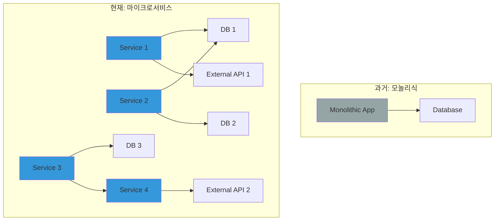

#### 제로 트러스트(Zero Trust) 보안 모델의 대두

**과거의 보안 모델**:
- **경계 기반 보안 (Perimeter Security)**: 성곽 모델
- 내부 네트워크는 신뢰, 외부는 차단
- VPN 접속 = 전체 네트워크 접근 가능

**현대의 제로 트러스트**:
- **Never Trust, Always Verify** (절대 신뢰하지 말고 항상 검증)
- 모든 요청에 대해 인증 및 인가 수행
- 최소 권한 원칙 (Least Privilege)
- 시크릿 관점: 사람뿐만 아니라 **머신(Machine) 신원** 확인

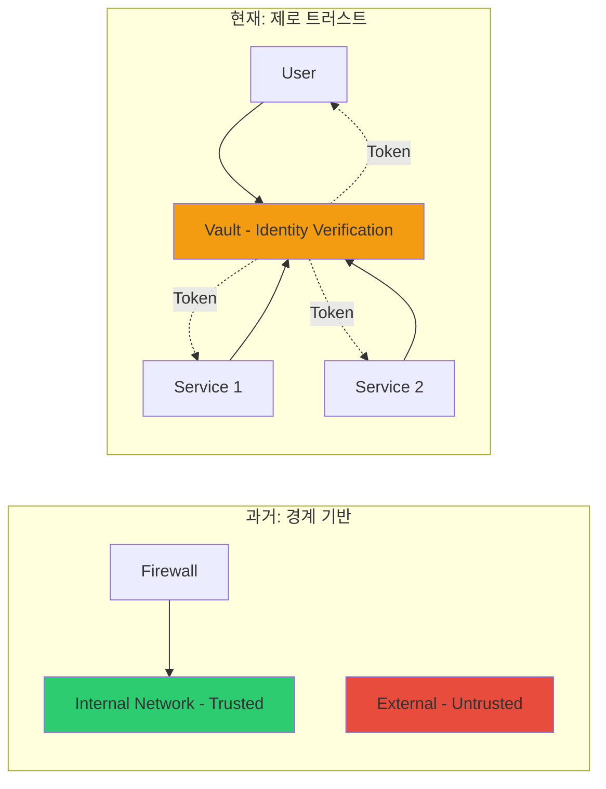

#### HashiCorp Vault가 해결하는 문제

**1. 시크릿 스프롤(분산) 문제 → 시크릿 중앙 저장소**
- 모든 시크릿을 Vault라는 하나의 안전한 저장소에 암호화하여 중앙 관리
- 코드나 설정 파일에 시크릿을 하드코딩할 필요 없음

**2. 동적 인프라 문제 → 동적 시크릿 (Dynamic Secrets)**
- 요청 시마다 실시간으로 시크릿 생성 (예: 10분짜리 DB 임시 계정)
- 사용 후 자동 폐기로 시크릿 생명주기 관리

**3. 제로 트러스트(신원 확인) → 신원 기반 접근 (Identity-Based Access)**
- 사람(LDAP, Okta) 및 머신(Kubernetes, AWS IAM, GCP) 신원 인증
- 인증된 신원에게만 정책(Policy)에 따라 정확한 시크릿 접근 권한 부여

**4. 감사 및 통제 → 감사 로그 (Audit Logs)**
- 누가(어떤 시스템이), 언제, 어떤 시크릿에 접근했는지 상세한 로그
- 강력한 통제와 추적성 확보

#### Vault vs GitHub Secrets 비교

| 특징 | HashiCorp Vault | GitHub Secrets |
|-----|----------------|----------------|
| **중앙 집중식 관리** | ✅ 조직 전체 시크릿 통합 관리 | ❌ Repository 종속적 |
| **동적 시크릿 생성** | ✅ DB, 클라우드 자격 증명 동적 생성 | ❌ 정적 시크릿만 지원 |
| **Secret Rotation** | ✅ 자동 갱신 및 Rotation 지원 | ❌ 수동 갱신 필요 |
| **접근 제어** | ✅ 세분화된 RBAC 및 정책 | ⚠️ Repository 수준만 가능 |
| **멀티 환경 지원** | ✅ 클라우드, 온프레미스, 하이브리드 | ❌ GitHub Actions만 지원 |
| **감사 로깅** | ✅ 상세한 접근 로그 및 추적 | ❌ 제한적 |
| **암호화** | ✅ 고급 암호화 표준 (Transit, Transform) | ⚠️ GitHub 보안 표준 |

---

## 🏗️ Vault 기본 구조와 동작 방식

### 1. Vault의 핵심 워크플로우

**Vault는 토큰(Token) 기반으로 작동**하며, 각 토큰은 클라이언트의 정책(Policy)과 연결됩니다.

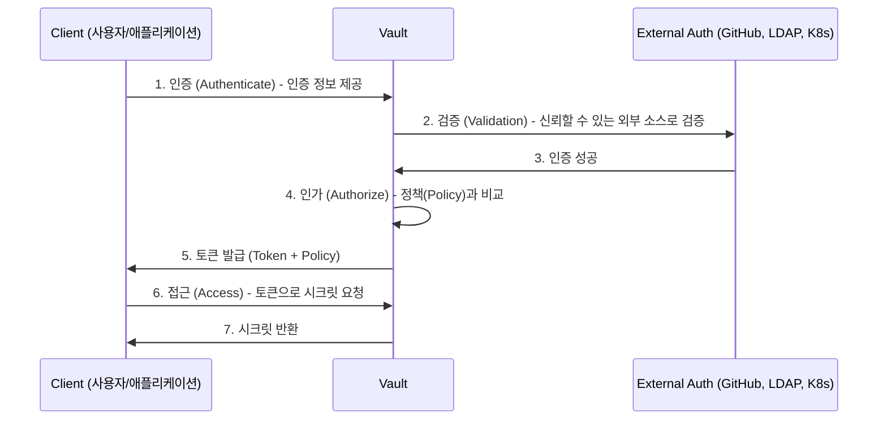

**4단계 워크플로우**:

1. **인증 (Authenticate)**: 클라이언트가 Vault에 자신이 누구인지 증명
2. **검증 (Validation)**: GitHub, LDAP, AppRole 등 신뢰할 수 있는 외부 소스를 통해 검증
3. **인가 (Authorize)**: 클라이언트를 Vault의 보안 정책과 비교
4. **접근 (Access)**: 정책 기반으로 토큰 발급 및 시크릿 접근 허용

### 2. Vault의 4가지 핵심 요소

Vault가 액세스를 제어하는 핵심 요소:

**1. 누가 (Who) - 인증 (Authentication)**
- LDAP, Active Directory
- Kubernetes Service Account
- AWS IAM, GCP IAM, Azure AD
- GitHub, GitLab
- AppRole (Machine-to-Machine)

**2. 무엇에 (What) - 대상 지정 (Target System)**
- KV Secrets (정적 시크릿)
- Database Credentials (동적 시크릿)
- Cloud Credentials (AWS, GCP, Azure)
- PKI Certificates
- SSH Keys

**3. 얼마 동안 (How Long) - 접근 시간 제어 (TTL)**
- Token TTL: 토큰 유효 기간
- Lease Duration: 시크릿 임대 기간
- Max TTL: 최대 허용 시간

**4. 라이프 사이클 (Lifecycle) - 자동화 (Automation)**
- 자동 갱신 (Renewal)
- 자동 폐기 (Revocation)
- Secret Rotation

### 3. 호텔 체크인에 비유한 동작 방식

**Vault ≈ 호텔 프론트 데스크**

| 단계 | 호텔 | Vault |
|-----|------|-------|
| **1. 인증** | 신분증 제시 | GitHub/LDAP/K8s SA로 인증 |
| **2. 검증** | 예약 확인 | 외부 인증 시스템 검증 |
| **3. 인가** | 객실 등급 확인 | Policy 확인 |
| **4. 접근** | 룸 키 발급 | Token 발급 |
| **5. 사용** | 객실 출입 | 시크릿 접근 |
| **6. 만료** | 체크아웃 시간 | TTL 만료 |

**사람을 위한 인증 방식**:
- LDAP/Active Directory
- OAuth 2.0 (GitHub, Google)
- SAML (Okta, Azure AD)

**애플리케이션(Machine)을 위한 인증 방식**:
- **AppRole**: RoleID + SecretID
- **Kubernetes**: Service Account Token
- **Cloud IAM**: AWS IAM, GCP SA, Azure Managed Identity

---

## ☸️ Kubernetes에 Vault 설치

### 1. Helm을 사용한 Vault 배포

#### 실습 환경 구성

**Kind 클러스터 배포** (이미 구성되어 있다면 생략):

```bash
# Kind 클러스터 생성
kind create cluster --name vault-demo --config - <<EOF
kind: Cluster
apiVersion: kind.x-k8s.io/v1alpha4
nodes:
- role: control-plane
  extraPortMappings:
  - containerPort: 30000
    hostPort: 30000
    protocol: TCP
EOF

# 확인
kubectl cluster-info
kubectl get nodes
```

#### Dev Mode 설치

**Dev Mode 특징**:
- **In-Memory Storage**: 메모리에 데이터 저장 (재시작 시 초기화)
- **Auto Unseal**: 자동으로 봉인 해제
- **Root Token**: 초기 루트 토큰이 `root`로 고정

```bash
# Vault Helm Repository 추가
helm repo add hashicorp https://helm.releases.hashicorp.com
helm repo update

# Namespace 생성
kubectl create namespace vault

# Vault Dev Mode 설치
helm install vault hashicorp/vault \
  --namespace vault \
  --set "server.dev.enabled=true" \
  --set "server.dev.devRootToken=root" \
  --set "ui.enabled=true" \
  --set "ui.serviceType=NodePort" \
  --set "ui.serviceNodePort=30000"

# 배포 확인
kubectl get pod,svc -n vault

# 출력 예시:
# NAME                                        READY   STATUS    RESTARTS   AGE
# pod/vault-0                                 1/1     Running   0          1m
# pod/vault-agent-injector-xxx                1/1     Running   0          1m
#
# NAME                               TYPE        CLUSTER-IP      EXTERNAL-IP   PORT(S)
# service/vault                      ClusterIP   10.96.100.10    <none>        8200/TCP,8201/TCP
# service/vault-ui                   NodePort    10.96.100.11    <none>        8200:30000/TCP
# service/vault-internal             ClusterIP   None            <none>        8200/TCP,8201/TCP
# service/vault-agent-injector-svc   ClusterIP   10.96.100.12    <none>        443/TCP
```

### 2. Vault 초기화 및 Unseal

**프로덕션 환경에서는 Vault가 봉인(Sealed) 상태로 시작**됩니다.

```bash
# Vault Pod에 접속
kubectl exec -it -n vault vault-0 -- sh

# Vault 초기화 (Unseal Key 5개 생성, Threshold 3)
vault operator init -key-shares=5 -key-threshold=3

# 출력 예시:
# Unseal Key 1: abc123...
# Unseal Key 2: def456...
# Unseal Key 3: ghi789...
# Unseal Key 4: jkl012...
# Unseal Key 5: mno345...
#
# Initial Root Token: s.xyz789...

# ⚠️ 중요: Unseal Key와 Root Token을 안전한 곳에 보관!
```

**Unseal 과정**:

```bash
# Vault Unseal (Threshold 3이므로 3번 수행)
vault operator unseal <Unseal Key 1>
vault operator unseal <Unseal Key 2>
vault operator unseal <Unseal Key 3>

# Unseal 상태 확인
vault status

# 출력 예시:
# Sealed: false  # ← Unsealed 상태!
# Key Shares: 5
# Key Threshold: 3
```

### 3. Shamir Secret Sharing (SSS) 방식

**SSS(Shamir Secret Sharing)란?**

마스터 키를 여러 조각으로 나누어 분산 저장하고, 일정 개수 이상의 조각이 모여야만 복원 가능한 암호학적 기법입니다.

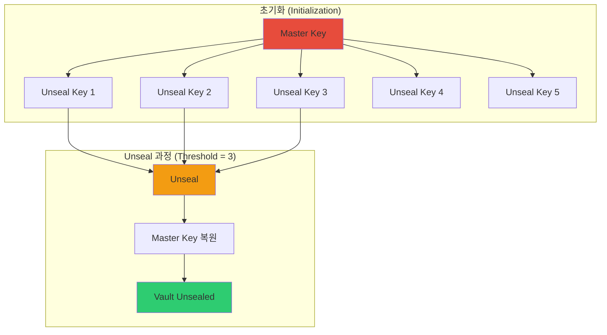

**SSS의 장점**:
- ✅ **보안성**: 단일 실패 지점(Single Point of Failure) 제거
- ✅ **유연성**: Key Shares와 Threshold를 조정 가능
- ✅ **책임 분산**: 여러 관리자가 Key를 분산 보관

**프로덕션 권장 설정**:
```bash
# 7개의 Key Shares, 4개의 Threshold
vault operator init -key-shares=7 -key-threshold=4
```

**자동 Unseal 방법** (프로덕션):
- AWS KMS Auto-Unseal
- GCP Cloud KMS Auto-Unseal
- Azure Key Vault Auto-Unseal
- Transit Auto-Unseal (다른 Vault 사용)

### 4. CLI 설정 및 UI 접속

#### CLI 설정 (macOS)

```bash
# Vault CLI 설치
brew tap hashicorp/tap
brew install hashicorp/tap/vault

# 환경 변수 설정
export VAULT_ADDR='http://127.0.0.1:30000'
export VAULT_TOKEN='root'

# .zshrc 또는 .bashrc에 추가
echo 'export VAULT_ADDR="http://127.0.0.1:30000"' >> ~/.zshrc
echo 'export VAULT_TOKEN="root"' >> ~/.zshrc

# 로그인 확인
vault login $VAULT_TOKEN

# 버전 확인
vault version
```

#### CLI 설정 (WSL 2 Ubuntu)

```bash
# Vault CLI 설치
wget -O- https://apt.releases.hashicorp.com/gpg | sudo gpg --dearmor -o /usr/share/keyrings/hashicorp-archive-keyring.gpg
echo "deb [signed-by=/usr/share/keyrings/hashicorp-archive-keyring.gpg] https://apt.releases.hashicorp.com $(lsb_release -cs) main" | sudo tee /etc/apt/sources.list.d/hashicorp.list
sudo apt update && sudo apt install vault

# 환경 변수 설정
export VAULT_ADDR='http://127.0.0.1:30000'
export VAULT_TOKEN='root'

# 로그인
vault login $VAULT_TOKEN
```

#### UI 접속 확인

```bash
# macOS
open http://127.0.0.1:30000

# Windows/Linux
# 브라우저에서 http://127.0.0.1:30000 접속
```

**UI 로그인**:
- Method: Token
- Token: `root`

---

## 🤖 Vault Agent와 Sidecar 패턴

### 1. 왜 Vault Agent가 필요한가?

#### 기존 방식: Direct Integration의 문제점

**애플리케이션이 Vault SDK를 직접 사용하는 경우**:

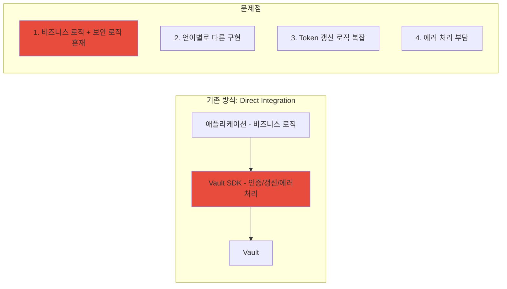

**개발자의 부담**:
- ❌ 비즈니스 로직 외에 보안 인프라 로직 구현
- ❌ 언어마다 구현 방식이 다름 (Java, Python, Go, Node.js 등)
- ❌ Token 갱신, Lease 관리, 에러 처리 등 복잡한 로직
- ❌ 보안 전문가가 아닌 개발자가 보안 코드 작성

### 2. Vault Agent 동작 방식

#### Vault Agent의 역할

**Vault Agent**는 애플리케이션과 Vault 사이에서 다음 작업을 대신 수행합니다:

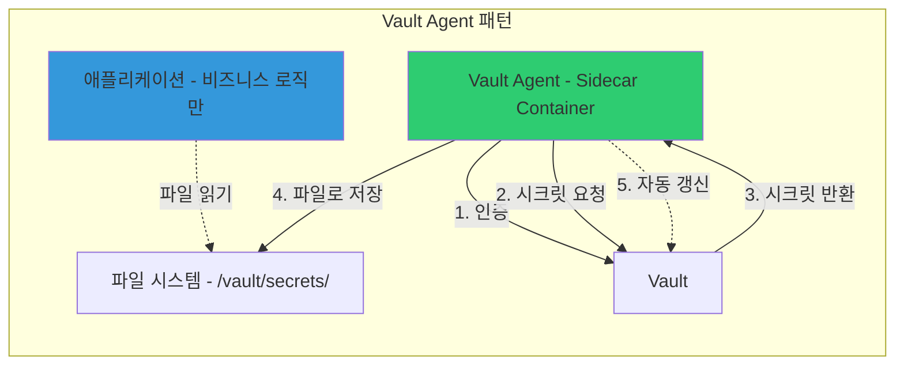

**Vault Agent가 제공하는 기능**:

1. **자동 인증 (Auto-Auth)**
   - Kubernetes Service Account Token으로 자동 인증
   - AppRole RoleID/SecretID로 인증
   - AWS IAM, GCP SA 등으로 인증

2. **시크릿 템플릿 렌더링 (Template)**
   - Vault에서 가져온 시크릿을 파일로 저장
   - 애플리케이션이 파일에서 읽기만 하면 됨

3. **자동 갱신 (Auto-Renewal)**
   - Token TTL 만료 전 자동 갱신
   - Lease 만료 전 시크릿 갱신

4. **캐싱 (Caching)**
   - Vault API 호출 결과를 로컬 캐싱
   - 네트워크 부하 감소

### 3. Kubernetes에서 Vault Agent 활용

#### Vault Agent Injector

**Vault Agent Injector**는 Kubernetes Admission Webhook을 사용하여 Pod에 자동으로 Vault Agent Sidecar를 주입합니다.

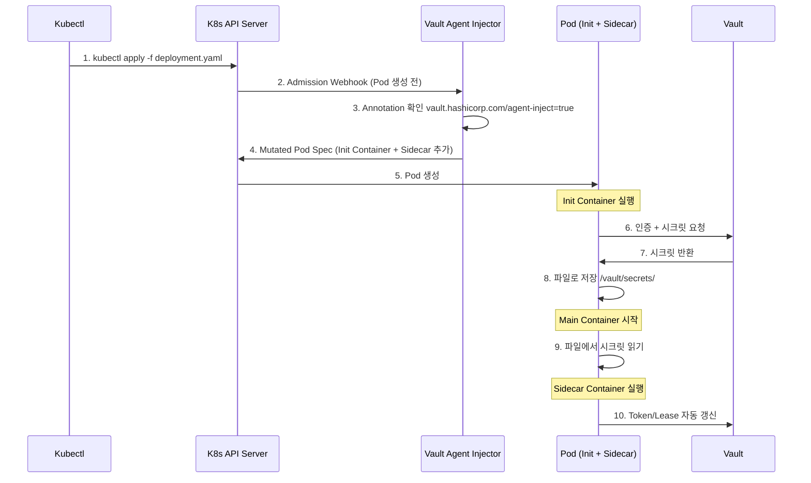

#### 실습: Vault Agent Injector 사용

**1. Kubernetes Auth Method 활성화**:

```bash
# Vault Pod에서 실행
kubectl exec -it -n vault vault-0 -- sh

# Kubernetes Auth 활성화
vault auth enable kubernetes

# Kubernetes API 주소 설정
vault write auth/kubernetes/config \
    kubernetes_host="https://$KUBERNETES_PORT_443_TCP_ADDR:443"

# Role 생성
vault write auth/kubernetes/role/myapp \
    bound_service_account_names=myapp \
    bound_service_account_namespaces=default \
    policies=myapp-policy \
    ttl=1h
```

**2. Policy 생성**:

```bash
# myapp-policy.hcl
vault policy write myapp-policy - <<EOF
path "secret/data/myapp/*" {
  capabilities = ["read"]
}
EOF
```

**3. 시크릿 저장**:

```bash
# KV v2 Secrets Engine 활성화
vault secrets enable -path=secret kv-v2

# 시크릿 저장
vault kv put secret/myapp/config \
    username='admin' \
    password='secret123'
```

**4. Deployment with Vault Agent Annotations**:

```yaml
apiVersion: v1
kind: ServiceAccount
metadata:
  name: myapp
  namespace: default
---
apiVersion: apps/v1
kind: Deployment
metadata:
  name: myapp
  namespace: default
spec:
  replicas: 1
  selector:
    matchLabels:
      app: myapp
  template:
    metadata:
      labels:
        app: myapp
      annotations:
        # Vault Agent Injector 활성화
        vault.hashicorp.com/agent-inject: "true"
        vault.hashicorp.com/role: "myapp"

        # 시크릿 템플릿 정의
        vault.hashicorp.com/agent-inject-secret-config.txt: "secret/data/myapp/config"
        vault.hashicorp.com/agent-inject-template-config.txt: |
          {{- with secret "secret/data/myapp/config" -}}
          USERNAME={{ .Data.data.username }}
          PASSWORD={{ .Data.data.password }}
          {{- end -}}
    spec:
      serviceAccountName: myapp
      containers:
      - name: myapp
        image: nginx:latest
        command:
        - sh
        - -c
        - |
          echo "Reading secrets from /vault/secrets/config.txt"
          cat /vault/secrets/config.txt
          sleep 3600
```

**5. 배포 및 확인**:

```bash
# 배포
kubectl apply -f myapp-deployment.yaml

# Pod 확인 (Init Container + Sidecar 확인)
kubectl get pod

# 시크릿 파일 확인
kubectl exec -it <POD_NAME> -c myapp -- cat /vault/secrets/config.txt

# 출력:
# USERNAME=admin
# PASSWORD=secret123
```

**Vault Agent Injector가 주입하는 Container**:

| Container | 역할 | 실행 시점 |
|-----------|------|----------|
| **vault-agent-init** | Init Container | Pod 시작 시 1회 실행, 초기 시크릿 가져옴 |
| **vault-agent** | Sidecar Container | Pod 생명주기 동안 실행, Token/Lease 자동 갱신 |

---

## 🔨 Jenkins + Vault (CI 파이프라인)

### 1. CI/CD 파이프라인 보안 고려사항

#### 하드코딩된 시크릿의 위험성

**CWE-259: Use of Hard-coded Password**

```python
# ❌ 잘못된 예시
db_pass = "admin123"
connection = mysql.connect(password=db_pass)
```

**CWE-798: Use of Hard-coded Credentials**

```bash
# ❌ 잘못된 예시
AWS_ACCESS_KEY_ID=AKIA...
AWS_SECRET_ACCESS_KEY=XXXX
slack_bot_token=xoxb-123...
```

**최근 공격 사례**:
- **CVE-2025-30066**: GitHub Actions `tj-actions/changed-files` 취약점
- 하드코딩된 GitHub Token 유출로 인한 공급망 공격

**CI/CD 보안 원칙**:
1. **최소 권한 (Least Privilege)**: 필요한 최소한의 권한만 부여
2. **최소 시간 (Least Time)**: 시크릿 유효 기간 최소화
3. **외부 분리 (External Separation)**: Vault와 같은 외부 시스템에 저장
4. **교체 자동화 (Automated Rotation)**: 주기적으로 자동 교체

### 2. Jenkins에서 KV 시크릿 사용

#### Jenkins Vault Plugin 설정

**1. Vault Plugin 설치**:
- Jenkins 관리 → 플러그인 관리 → Available plugins
- "HashiCorp Vault" 검색 및 설치

**2. AppRole 인증 설정**:

```bash
# Vault에서 AppRole 활성화
vault auth enable approle

# Policy 생성
vault policy write jenkins-policy - <<EOF
path "secret/data/jenkins/*" {
  capabilities = ["read"]
}
EOF

# AppRole 생성
vault write auth/approle/role/jenkins \
    token_policies="jenkins-policy" \
    token_ttl=1h \
    token_max_ttl=4h

# RoleID 확인
vault read auth/approle/role/jenkins/role-id

# SecretID 생성
vault write -f auth/approle/role/jenkins/secret-id

# 출력:
# role_id: 82f3322e-3909-9786-d650-8ef5211aae00
# secret_id: 52b3a1e9-c868-24d8-ce2b-e26ebd35239b
```

**3. Jenkins Vault 설정**:
- Jenkins 관리 → Configure System → Vault
- Vault URL: `http://vault.vault:8200`
- Auth Method: AppRole
- Role ID: `<위에서 생성한 role_id>`
- Secret ID: `<위에서 생성한 secret_id>`

#### Jenkins Pipeline 예시

```groovy
pipeline {
    agent any

    environment {
        // Vault에서 시크릿 가져오기
        VAULT_CREDENTIALS = credentials('vault-credentials')
    }

    stages {
        stage('Get Secrets from Vault') {
            steps {
                script {
                    // Vault에서 DB 자격 증명 가져오기
                    withVault([
                        vaultSecrets: [
                            [
                                path: 'secret/jenkins/database',
                                secretValues: [
                                    [envVar: 'DB_USERNAME', vaultKey: 'username'],
                                    [envVar: 'DB_PASSWORD', vaultKey: 'password']
                                ]
                            ],
                            [
                                path: 'secret/jenkins/aws',
                                secretValues: [
                                    [envVar: 'AWS_ACCESS_KEY', vaultKey: 'access_key'],
                                    [envVar: 'AWS_SECRET_KEY', vaultKey: 'secret_key']
                                ]
                            ]
                        ]
                    ]) {
                        sh '''
                            echo "DB Username: $DB_USERNAME"
                            echo "Connecting to database..."
                            # 실제 DB 연결 로직
                        '''
                    }
                }
            }
        }

        stage('Build') {
            steps {
                sh 'mvn clean package'
            }
        }

        stage('Deploy') {
            steps {
                sh '''
                    # AWS_ACCESS_KEY, AWS_SECRET_KEY 사용
                    aws s3 cp target/app.jar s3://my-bucket/
                '''
            }
        }
    }
}
```

### 3. 동적(Dynamic) DB 시크릿

#### 동적 시크릿의 장점

**정적 시크릿 vs 동적 시크릿**:

| 구분 | 정적 시크릿 (KV) | 동적 시크릿 (Database) |
|-----|----------------|----------------------|
| **생성 시점** | 사전에 생성 및 저장 | 요청 시마다 실시간 생성 |
| **유효 기간** | 수동 교체 필요 | TTL 만료 시 자동 폐기 |
| **권한** | 고정된 권한 | 최소 권한으로 제한 가능 |
| **보안** | 유출 시 수동 교체 | 유출 시 자동 만료 |

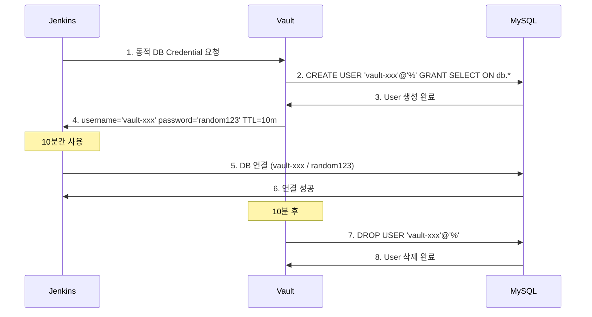

#### 실습: Vault Database Secrets Engine

**1. MySQL 배포**:

```bash
# MySQL Deployment
kubectl apply -f - <<EOF
apiVersion: v1
kind: Service
metadata:
  name: mysql
  namespace: default
spec:
  type: NodePort
  selector:
    app: mysql
  ports:
  - port: 3306
    targetPort: 3306
    nodePort: 30306
---
apiVersion: apps/v1
kind: Deployment
metadata:
  name: mysql
  namespace: default
spec:
  replicas: 1
  selector:
    matchLabels:
      app: mysql
  template:
    metadata:
      labels:
        app: mysql
    spec:
      containers:
      - name: mysql
        image: mysql:8.0
        env:
        - name: MYSQL_ROOT_PASSWORD
          value: "rootpassword"
        - name: MYSQL_DATABASE
          value: "mydb"
        ports:
        - containerPort: 3306
EOF
```

**2. Vault Database Secrets Engine 설정**:

```bash
# Database Secrets Engine 활성화
vault secrets enable database

# MySQL 연결 설정
vault write database/config/mysql \
    plugin_name=mysql-database-plugin \
    connection_url="{{username}}:{{password}}@tcp(mysql.default:3306)/" \
    allowed_roles="jenkins-role" \
    username="root" \
    password="rootpassword"

# Role 생성 (10분 TTL)
vault write database/roles/jenkins-role \
    db_name=mysql \
    creation_statements="CREATE USER '{{name}}'@'%' IDENTIFIED BY '{{password}}';GRANT SELECT ON mydb.* TO '{{name}}'@'%';" \
    default_ttl="10m" \
    max_ttl="1h"

# Policy 생성
vault policy write jenkins-db-policy - <<EOF
path "database/creds/jenkins-role" {
  capabilities = ["read"]
}
EOF
```

**3. Jenkins Pipeline에서 동적 DB Credential 사용**:

```groovy
pipeline {
    agent any

    stages {
        stage('Get Dynamic DB Credentials') {
            steps {
                script {
                    withVault([
                        vaultSecrets: [
                            [
                                path: 'database/creds/jenkins-role',
                                secretValues: [
                                    [envVar: 'DB_USERNAME', vaultKey: 'username'],
                                    [envVar: 'DB_PASSWORD', vaultKey: 'password']
                                ]
                            ]
                        ]
                    ]) {
                        sh '''
                            echo "Dynamic DB User: $DB_USERNAME"
                            echo "Connecting to MySQL..."
                            mysql -h mysql.default -u $DB_USERNAME -p$DB_PASSWORD -e "SELECT 1;"
                        '''
                    }
                }
            }
        }
    }
}
```

**4. 동적 Credential 확인**:

```bash
# Vault에서 동적 Credential 생성
vault read database/creds/jenkins-role

# 출력:
# Key                Value
# ---                -----
# lease_id           database/creds/jenkins-role/abc123
# lease_duration     10m
# lease_renewable    true
# username           v-approle-jenkins-role-xyz789
# password           A1b2C3d4E5f6

# MySQL에서 사용자 확인
kubectl exec -it <mysql-pod> -- mysql -u root -prootpassword -e "SELECT user FROM mysql.user WHERE user LIKE 'v-approle%';"

# 10분 후 자동으로 삭제됨
```

---

## 🔐 암호화와 Vault Transit 엔진

### 1. 암호화 기본 개념

#### 3가지 핵심 암호화 방식

**1. 대칭키 암호화 (Symmetric Encryption)**
- 암호화/복호화에 **동일한 키** 사용
- 빠른 속도, 대용량 데이터에 적합
- 예시: AES-256, ChaCha20

**2. 비대칭키 암호화 (Asymmetric Encryption)**
- 공개키(Public Key)로 암호화, 개인키(Private Key)로 복호화
- 느린 속도, 주로 키 교환 및 전자서명에 사용
- 예시: RSA, ECC

**3. 해시 함수 (Hash Function)**
- 단방향 암호화, 복호화 불가능
- 데이터 무결성 검증, 비밀번호 저장
- 예시: SHA-256, bcrypt, Argon2

#### 계층별 암호화 방안

| 계층 | 암호화 방식 | 예시 |
|-----|----------|------|
| **전송 계층** | TLS/SSL (통신 암호화) | HTTPS, gRPC over TLS |
| **애플리케이션 계층** | 컬럼 암호화, 파일 암호화 | Vault Transit, AWS KMS |
| **스토리지 계층** | 디스크 암호화 | LUKS, BitLocker, dm-crypt |

### 2. Vault Transit vs Cloud KMS

#### Vault가 지원하는 암호화 방식

**OSS (Open Source) 제공 기능**:
- **Transit Engine**: Encryption as a Service (EaaS)
- **PKI Engine**: 인증서 발급 및 관리
- **SSH Engine**: SSH 키 서명

**Enterprise 전용 기능**:
- **Transform Engine**: Format-Preserving Encryption (FPE)
  - 신용카드 번호: `1234-5678-9012-3456` → `9876-5432-1098-7654`
  - 주민등록번호: `123456-1234567` → `987654-9876543`

#### Cloud KMS vs Vault Transit 비교

| 비교 항목 | Cloud KMS (AWS/GCP/Azure) | Vault Transit (Self-hosted) |
|---------|---------------------------|----------------------------|
| **종속성** | 특정 클라우드 제공사(CSP)에 종속 | Cloud Agnostic (어디서든 동일한 API) |
| **키 제어권** | CSP가 관리하는 HSM에 키 존재 | 사용자가 키의 생성, 보관, 폐기를 완벽하게 제어 |
| **암호화 방식** | 주로 엔벨롭(Envelope) 암호화 | 직접 암호화 및 배치(Batch) 처리 지원 |
| **비용** | API 호출 횟수당 과금 (요청이 많으면 비쌈) | 인프라 비용 외 추가 API 비용 없음 |
| **확장성** | 리전별로 키가 분리되어 관리 복잡 | 복제(Replication) 기능으로 글로벌 클러스터 간 키 공유 |

**Vault Transit 사용이 적합한 경우**:
- ✅ 멀티 클라우드 환경 (AWS + GCP + Azure)
- ✅ 온프레미스 + 클라우드 하이브리드
- ✅ 대용량 암호화 트래픽 (API 호출 과금 회피)
- ✅ 키에 대한 완전한 통제권 필요

### 3. Transit 엔진 실습

#### Vault Transit 기본 동작 구조

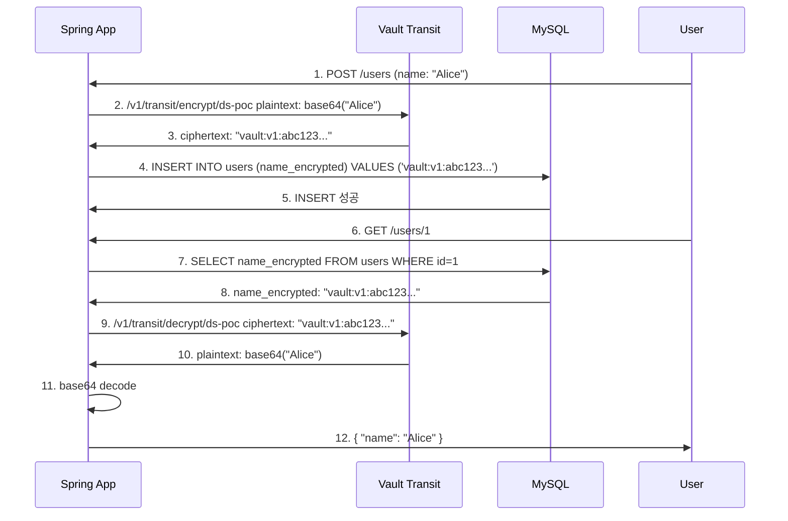

#### 실습: Transit 엔진 활성화 및 암호화/복호화

**1. Transit Engine 활성화**:

```bash
# Transit Secrets Engine 활성화
vault secrets enable transit

# 암호화 키 생성
vault write -f transit/keys/my-key

# 키 확인
vault read transit/keys/my-key

# 출력:
# latest_version    1
# type              aes256-gcm96
# supports_encryption    true
# supports_decryption    true
```

**2. 데이터 암호화**:

```bash
# 평문을 Base64로 인코딩
echo -n "my secret data" | base64
# bXkgc2VjcmV0IGRhdGE=

# 암호화
vault write transit/encrypt/my-key plaintext="bXkgc2VjcmV0IGRhdGE="

# 출력:
# ciphertext    vault:v1:8SDd3WHDOjf7mq69CyCqYjBXAiQQAVZRkFM96bKP4oOPxT0NjYHH

# 암호문 저장
CIPHERTEXT="vault:v1:8SDd3WHDOjf7mq69CyCqYjBXAiQQAVZRkFM96bKP4oOPxT0NjYHH"
```

**3. 데이터 복호화**:

```bash
# 복호화
vault write transit/decrypt/my-key ciphertext="$CIPHERTEXT"

# 출력:
# plaintext    bXkgc2VjcmV0IGRhdGE=

# Base64 디코딩
echo "bXkgc2VjcmV0IGRhdGE=" | base64 -d
# my secret data
```

**4. 키 Rotation**:

```bash
# 키 회전 (새로운 버전 생성)
vault write -f transit/keys/my-key/rotate

# 키 버전 확인
vault read transit/keys/my-key

# 출력:
# latest_version    2  # ← 버전 증가

# 새 버전으로 암호화
vault write transit/encrypt/my-key plaintext="bXkgc2VjcmV0IGRhdGE="

# 출력:
# ciphertext    vault:v2:xyz789...  # ← v2로 암호화

# 이전 버전(v1)으로 암호화된 데이터도 복호화 가능
vault write transit/decrypt/my-key ciphertext="$CIPHERTEXT"
```

**5. Batch 암호화**:

```bash
# 여러 데이터를 한 번에 암호화
vault write transit/encrypt/my-key \
    batch_input='[{"plaintext":"Zm9v"},{"plaintext":"YmFy"}]'

# 출력:
# batch_results    [{"ciphertext":"vault:v2:abc..."},{"ciphertext":"vault:v2:def..."}]
```

#### MySQL 컬럼 암호화 예시

**1. MySQL 테이블 생성**:

```sql
CREATE TABLE users (
    id INT AUTO_INCREMENT PRIMARY KEY,
    name VARCHAR(255),
    email_encrypted TEXT,
    created_at TIMESTAMP DEFAULT CURRENT_TIMESTAMP
);
```

**2. Spring Boot 애플리케이션에서 암호화**:

```java
@Service
public class VaultTransitService {

    @Value("${vault.transit.key-name}")
    private String keyName;

    @Autowired
    private VaultTemplate vaultTemplate;

    public String encrypt(String plaintext) {
        // Base64 인코딩
        String base64 = Base64.getEncoder().encodeToString(plaintext.getBytes());

        // Vault Transit으로 암호화
        VaultTransitContext context = VaultTransitContext.builder().build();
        Ciphertext ciphertext = vaultTemplate.opsForTransit()
            .encrypt(keyName, Plaintext.of(base64));

        return ciphertext.getCiphertext();
    }

    public String decrypt(String ciphertext) {
        // Vault Transit으로 복호화
        Plaintext plaintext = vaultTemplate.opsForTransit()
            .decrypt(keyName, Ciphertext.of(ciphertext));

        // Base64 디코딩
        return new String(Base64.getDecoder().decode(plaintext.getPlaintext()));
    }
}
```

**3. Controller에서 사용**:

```java
@RestController
@RequestMapping("/api/users")
public class UserController {

    @Autowired
    private VaultTransitService transitService;

    @PostMapping
    public User createUser(@RequestBody UserRequest request) {
        // 이메일 암호화
        String encryptedEmail = transitService.encrypt(request.getEmail());

        // DB에 저장
        User user = new User();
        user.setName(request.getName());
        user.setEmailEncrypted(encryptedEmail);
        userRepository.save(user);

        return user;
    }

    @GetMapping("/{id}")
    public UserResponse getUser(@PathVariable Long id) {
        User user = userRepository.findById(id).orElseThrow();

        // 이메일 복호화
        String decryptedEmail = transitService.decrypt(user.getEmailEncrypted());

        return new UserResponse(user.getId(), user.getName(), decryptedEmail);
    }
}
```

---

## 🚀 ArgoCD + Vault Plugin (CD 파이프라인)

### 1. ArgoCD Vault Plugin 소개

#### 왜 ArgoCD Vault Plugin이 필요한가?

**GitOps의 딜레마**:
- ✅ 모든 설정을 Git에 저장 (Infrastructure as Code)
- ❌ 시크릿은 Git에 평문으로 저장할 수 없음

**기존 해결 방법의 한계**:
- **Sealed Secrets**: 클러스터별로 암호화 키 관리 복잡
- **External Secrets Operator**: CRD 및 Operator 의존성
- **Kustomize Secret Generator**: 빌드 타임 시크릿 주입 어려움

**ArgoCD Vault Plugin의 장점**:
- ✅ CRD/Operator 없이 Vault와 통합
- ✅ Secret뿐만 아니라 Deployment, ConfigMap 등 모든 리소스에 사용 가능
- ✅ 기존 ArgoCD 워크플로우에 자연스럽게 통합

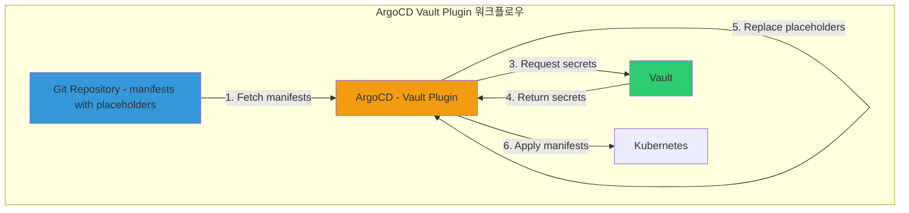

#### ArgoCD Vault Plugin 동작 방식

**Placeholder 문법**:

```yaml
# deployment.yaml (Git에 저장)
apiVersion: apps/v1
kind: Deployment
metadata:
  name: myapp
spec:
  template:
    spec:
      containers:
      - name: myapp
        image: myapp:latest
        env:
        - name: DB_USERNAME
          value: <path:secret/data/myapp/config#username>
        - name: DB_PASSWORD
          value: <path:secret/data/myapp/config#password>
        - name: API_KEY
          value: <path:secret/data/myapp/api#key>
```

**Placeholder 해석**:
```
<path:secret/data/myapp/config#username>
      ↑                         ↑
   Vault 경로                 필드명
```

### 2. AppRole 인증 설정

#### AppRole 생성 및 설정

**1. AppRole 활성화 (이미 활성화되어 있다면 생략)**:

```bash
vault auth enable approle
```

**2. Policy 생성**:

```bash
# ArgoCD가 접근할 경로 정의
vault policy write argocd-policy - <<EOF
path "secret/data/myapp/*" {
  capabilities = ["read"]
}
EOF
```

**3. AppRole 생성**:

```bash
vault write auth/approle/role/argocd \
    token_policies="argocd-policy" \
    token_ttl=1h \
    token_max_ttl=4h
```

**4. RoleID 및 SecretID 확인**:

```bash
# RoleID 확인
vault read auth/approle/role/argocd/role-id

# 출력:
# role_id    82f3322e-3909-9786-d650-8ef5211aae00

# SecretID 생성
vault write -f auth/approle/role/argocd/secret-id

# 출력:
# secret_id    52b3a1e9-c868-24d8-ce2b-e26ebd35239b
```

#### ArgoCD Vault Plugin 설치

**1. Vault Plugin Credentials Secret 생성**:

```bash
kubectl apply -f - <<EOF
apiVersion: v1
kind: Secret
metadata:
  name: argocd-vault-plugin-credentials
  namespace: argocd
type: Opaque
stringData:
  VAULT_ADDR: "http://vault.vault:8200"
  AVP_TYPE: "vault"
  AVP_AUTH_TYPE: "approle"
  AVP_ROLE_ID: "82f3322e-3909-9786-d650-8ef5211aae00"
  AVP_SECRET_ID: "52b3a1e9-c868-24d8-ce2b-e26ebd35239b"
EOF
```

**2. ArgoCD Repo Server에 Sidecar 추가**:

```bash
# ArgoCD Helm values.yaml 수정
cat <<EOF > argocd-values-with-vault.yaml
repoServer:
  # Vault Plugin Sidecar 추가
  volumes:
  - name: custom-tools
    emptyDir: {}
  - name: vault-plugin-credentials
    secret:
      secretName: argocd-vault-plugin-credentials

  initContainers:
  - name: download-tools
    image: alpine:latest
    command:
    - sh
    - -c
    - |
      wget -O argocd-vault-plugin https://github.com/argoproj-labs/argocd-vault-plugin/releases/download/v1.17.0/argocd-vault-plugin_1.17.0_linux_amd64
      chmod +x argocd-vault-plugin
      mv argocd-vault-plugin /custom-tools/
    volumeMounts:
    - name: custom-tools
      mountPath: /custom-tools

  extraContainers:
  - name: avp
    command:
    - /var/run/argocd/argocd-cmp-server
    image: quay.io/argoproj/argocd:latest
    securityContext:
      runAsNonRoot: true
      runAsUser: 999
    volumeMounts:
    - name: var-files
      mountPath: /var/run/argocd
    - name: plugins
      mountPath: /home/argocd/cmp-server/plugins
    - name: custom-tools
      mountPath: /usr/local/bin/argocd-vault-plugin
      subPath: argocd-vault-plugin
    - name: vault-plugin-credentials
      mountPath: /vault-plugin-credentials
    envFrom:
    - secretRef:
        name: argocd-vault-plugin-credentials
EOF

# ArgoCD 업그레이드
helm upgrade argocd argo/argo-cd \
  -f argocd-values-with-vault.yaml \
  --namespace argocd
```

### 3. 샘플 애플리케이션 배포

#### Git Repository 구조

```
myapp-gitops/
├── deployment.yaml
├── service.yaml
└── secret.yaml (Vault placeholders 포함)
```

**deployment.yaml**:

```yaml
apiVersion: apps/v1
kind: Deployment
metadata:
  name: myapp
  namespace: default
spec:
  replicas: 2
  selector:
    matchLabels:
      app: myapp
  template:
    metadata:
      labels:
        app: myapp
    spec:
      containers:
      - name: myapp
        image: nginx:latest
        env:
        - name: DB_USERNAME
          value: <path:secret/data/myapp/config#username>
        - name: DB_PASSWORD
          value: <path:secret/data/myapp/config#password>
        - name: API_KEY
          value: <path:secret/data/myapp/api#key>
        ports:
        - containerPort: 80
```

**Vault에 시크릿 저장**:

```bash
# myapp/config 시크릿
vault kv put secret/myapp/config \
    username='dbuser' \
    password='dbpassword123'

# myapp/api 시크릿
vault kv put secret/myapp/api \
    key='sk-1234567890abcdef'

# 확인
vault kv get secret/myapp/config
vault kv get secret/myapp/api
```

**ArgoCD Application 생성**:

```yaml
apiVersion: argoproj.io/v1alpha1
kind: Application
metadata:
  name: myapp
  namespace: argocd
spec:
  project: default
  source:
    repoURL: 'https://github.com/your-org/myapp-gitops.git'
    targetRevision: main
    path: .
    # Vault Plugin 활성화
    plugin:
      name: argocd-vault-plugin
  destination:
    server: 'https://kubernetes.default.svc'
    namespace: default
  syncPolicy:
    automated:
      prune: true
      selfHeal: true
    syncOptions:
    - CreateNamespace=true
```

```bash
# Application 배포
kubectl apply -f myapp-application.yaml

# ArgoCD UI에서 확인
open http://127.0.0.1:30002

# Sync 상태 확인
argocd app get myapp

# Pod에서 환경 변수 확인
kubectl exec -it <myapp-pod> -- env | grep DB_

# 출력:
# DB_USERNAME=dbuser
# DB_PASSWORD=dbpassword123
```

---

## ⚙️ Vault Secrets Operator (VSO)

### 1. VSO란 무엇인가?

**Vault Secrets Operator (VSO)**는 Vault의 시크릿을 Kubernetes Secret으로 자동 동기화하는 Operator입니다.

**VSO vs 다른 방법**:

| 방법 | 장점 | 단점 |
|-----|------|------|
| **Vault Agent Injector** | Init Container + Sidecar로 파일 주입 | Pod마다 Sidecar 필요 (리소스 오버헤드) |
| **ArgoCD Vault Plugin** | GitOps 친화적 | ArgoCD에 종속적 |
| **VSO** | Native Kubernetes Secret 사용, 기존 앱 수정 불필요 | CRD 및 Operator 의존성 |

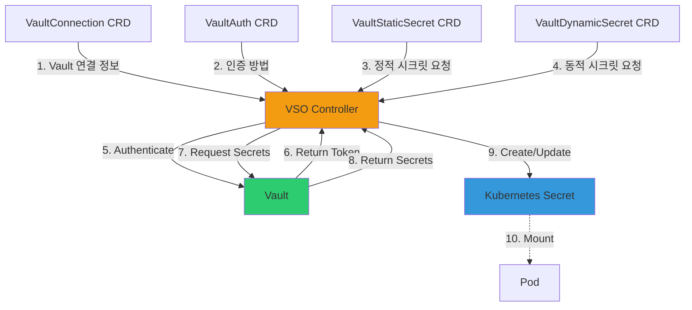

### 2. VSO 구성 요소

**VSO의 주요 CRD**:

| CRD | 역할 | 예시 |
|-----|------|------|
| **VaultConnection** | Vault 서버 연결 정보 | address, tls, caCert |
| **VaultAuth** | Vault 인증 방법 | kubernetes, appRole, jwt |
| **VaultStaticSecret** | 정적 시크릿 (KV) | secret/myapp/config |
| **VaultDynamicSecret** | 동적 시크릿 (Database, AWS) | database/creds/readonly |
| **VaultPKISecret** | PKI 인증서 | pki/issue/example-dot-com |

#### VSO 설치

**1. Helm을 사용한 VSO 설치**:

```bash
# Helm Repository 추가
helm repo add hashicorp https://helm.releases.hashicorp.com
helm repo update

# VSO 설치
helm install vault-secrets-operator hashicorp/vault-secrets-operator \
  --namespace vault-secrets-operator-system \
  --create-namespace

# 확인
kubectl get pod -n vault-secrets-operator-system
```

**2. VaultConnection 생성**:

```yaml
apiVersion: secrets.hashicorp.com/v1beta1
kind: VaultConnection
metadata:
  name: vault-connection
  namespace: default
spec:
  address: http://vault.vault:8200
  skipTLSVerify: true
```

**3. VaultAuth 생성 (Kubernetes Auth)**:

```bash
# Vault에서 Kubernetes Auth 활성화 (이미 활성화되어 있다면 생략)
kubectl exec -it -n vault vault-0 -- sh

vault auth enable kubernetes

vault write auth/kubernetes/config \
    kubernetes_host="https://$KUBERNETES_PORT_443_TCP_ADDR:443"

vault write auth/kubernetes/role/vso \
    bound_service_account_names=vso \
    bound_service_account_namespaces=default \
    policies=vso-policy \
    ttl=1h

# Policy 생성
vault policy write vso-policy - <<EOF
path "secret/data/myapp/*" {
  capabilities = ["read"]
}
path "database/creds/readonly" {
  capabilities = ["read"]
}
EOF
```

```yaml
# VaultAuth CRD
apiVersion: secrets.hashicorp.com/v1beta1
kind: VaultAuth
metadata:
  name: vault-auth
  namespace: default
spec:
  vaultConnectionRef: vault-connection
  method: kubernetes
  mount: kubernetes
  kubernetes:
    role: vso
    serviceAccount: vso
```

```bash
# ServiceAccount 생성
kubectl create serviceaccount vso -n default
```

### 3. Static Secrets와 Dynamic Secrets

#### Static Secrets (KV v2)

**VaultStaticSecret CRD**:

```yaml
apiVersion: secrets.hashicorp.com/v1beta1
kind: VaultStaticSecret
metadata:
  name: myapp-config
  namespace: default
spec:
  vaultAuthRef: vault-auth
  mount: secret
  type: kv-v2
  path: myapp/config

  # 생성될 Kubernetes Secret 이름
  destination:
    name: myapp-config-secret
    create: true

  # 갱신 주기
  refreshAfter: 30s
```

```bash
# Vault에 시크릿 저장
vault kv put secret/myapp/config \
    username='admin' \
    password='secret123' \
    api_key='sk-1234567890'

# VaultStaticSecret 배포
kubectl apply -f vaultstaticsecret.yaml

# Kubernetes Secret 확인
kubectl get secret myapp-config-secret -o yaml

# 출력:
# apiVersion: v1
# kind: Secret
# metadata:
#   name: myapp-config-secret
# data:
#   username: YWRtaW4=        # base64("admin")
#   password: c2VjcmV0MTIz    # base64("secret123")
#   api_key: c2stMTIzNDU2Nzg5MA==  # base64("sk-1234567890")
```

**Pod에서 Secret 사용**:

```yaml
apiVersion: v1
kind: Pod
metadata:
  name: myapp-pod
  namespace: default
spec:
  containers:
  - name: myapp
    image: nginx:latest
    env:
    - name: DB_USERNAME
      valueFrom:
        secretKeyRef:
          name: myapp-config-secret
          key: username
    - name: DB_PASSWORD
      valueFrom:
        secretKeyRef:
          name: myapp-config-secret
          key: password
    # 또는 볼륨으로 마운트
    volumeMounts:
    - name: secrets
      mountPath: /etc/secrets
      readOnly: true
  volumes:
  - name: secrets
    secret:
      secretName: myapp-config-secret
```

#### Dynamic Secrets (Database)

**VaultDynamicSecret CRD**:

```yaml
apiVersion: secrets.hashicorp.com/v1beta1
kind: VaultDynamicSecret
metadata:
  name: myapp-db-creds
  namespace: default
spec:
  vaultAuthRef: vault-auth
  mount: database
  path: creds/readonly

  destination:
    name: myapp-db-secret
    create: true

  # 갱신 설정
  renewalPercent: 67  # TTL의 67% 시점에 갱신
  revoke: true        # Secret 삭제 시 Vault에서도 Revoke
```

```bash
# Vault Database Secrets Engine 설정 (이미 설정했다면 생략)
vault secrets enable database

vault write database/config/mysql \
    plugin_name=mysql-database-plugin \
    connection_url="{{username}}:{{password}}@tcp(mysql.default:3306)/" \
    allowed_roles="readonly" \
    username="root" \
    password="rootpassword"

vault write database/roles/readonly \
    db_name=mysql \
    creation_statements="CREATE USER '{{name}}'@'%' IDENTIFIED BY '{{password}}';GRANT SELECT ON mydb.* TO '{{name}}'@'%';" \
    default_ttl="10m" \
    max_ttl="1h"

# VaultDynamicSecret 배포
kubectl apply -f vaultdynamicsecret.yaml

# Kubernetes Secret 확인
kubectl get secret myapp-db-secret -o yaml

# 출력:
# apiVersion: v1
# kind: Secret
# metadata:
#   name: myapp-db-secret
# data:
#   username: di1hcHByb2xlLXJlYWRvbmx5LXh5ejc4OQ==  # 동적 생성된 username
#   password: QTFiMkMzZDRFNWY2                      # 동적 생성된 password
```

**동작 흐름**:

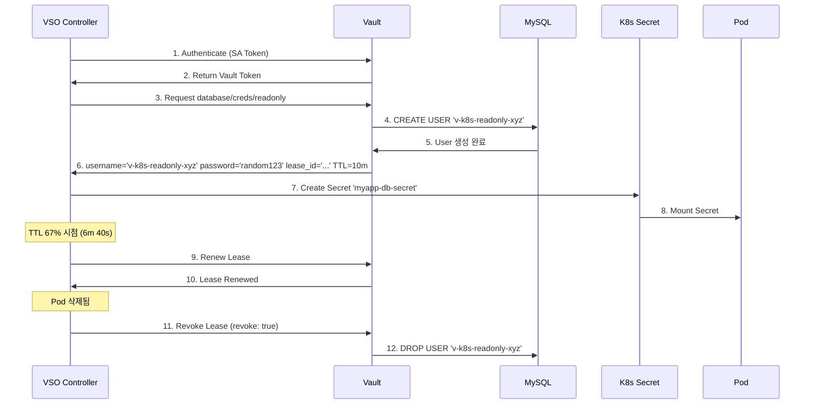

---

## 🎓 7주차 학습 정리

### 1. 핵심 성취 목표

**Vault 기초**
- ✅ 정보보안 3요소 (CIA Triad) 및 AAA 이해
- ✅ 시크릿의 종류와 노출 위험성 파악
- ✅ 제로 트러스트 보안 모델과 Vault의 필요성 이해

**Vault 설치 및 운영**
- ✅ Kubernetes에 Vault Helm 배포 (Dev/Production Mode)
- ✅ Vault 초기화 및 Unseal 과정 이해
- ✅ Shamir Secret Sharing (SSS) 방식 이해
- ✅ CLI 및 UI를 통한 Vault 기본 조작

**인증 및 접근 제어**
- ✅ Vault의 4단계 워크플로우 (인증→검증→인가→접근)
- ✅ 사람과 머신을 위한 다양한 인증 방법
- ✅ AppRole 인증 (RoleID + SecretID)
- ✅ Kubernetes Service Account 인증
- ✅ Policy 기반 접근 제어 (RBAC)

**Vault Agent & Sidecar 패턴**
- ✅ Vault Agent의 필요성 및 장점
- ✅ Vault Agent Injector를 통한 Sidecar 자동 주입
- ✅ Init Container + Sidecar Container 동작 방식
- ✅ 애플리케이션 코드 수정 없이 시크릿 주입

**CI/CD 통합**
- ✅ Jenkins + Vault (AppRole)
  - KV 정적 시크릿 사용
  - Database 동적 시크릿 사용
- ✅ ArgoCD + Vault Plugin
  - AppRole 인증 설정
  - Placeholder 문법 (`<path:...#key>`)
  - GitOps 워크플로우에 Vault 통합

**암호화 및 Transit Engine**
- ✅ 대칭키/비대칭키/해시 함수의 차이
- ✅ Vault Transit Engine 개념 및 사용법
- ✅ Cloud KMS vs Vault Transit 비교
- ✅ 데이터 암호화/복호화 및 키 Rotation

**Vault Secrets Operator (VSO)**
- ✅ VSO 개념 및 CRD 이해
- ✅ VaultConnection, VaultAuth 설정
- ✅ VaultStaticSecret (KV) 동기화
- ✅ VaultDynamicSecret (Database) 동기화
- ✅ Native Kubernetes Secret 활용

### 2. 프로덕션 체크리스트

#### 보안

**Vault 서버**
- [ ] TLS/SSL 인증서 적용 (HTTPS 통신)
- [ ] Root Token 안전하게 보관 및 제거
- [ ] Unseal Key를 여러 관리자에게 분산 보관 (SSS)
- [ ] Auto-Unseal 설정 (AWS KMS, GCP KMS, Azure Key Vault)
- [ ] Network Policy로 Vault 접근 제한

**인증 및 인가**
- [ ] Root Token 사용 금지 (정책 기반 Token 사용)
- [ ] 최소 권한 원칙 (Least Privilege) 적용
- [ ] Token TTL 설정 (1h~4h 권장)
- [ ] AppRole SecretID를 안전하게 관리 (Response Wrapping)
- [ ] Kubernetes ServiceAccount 기반 인증 사용

**감사 및 모니터링**
- [ ] Audit Log 활성화
  ```bash
  vault audit enable file file_path=/vault/logs/audit.log
  ```
- [ ] Prometheus Metrics 수집
- [ ] Grafana 대시보드 구성
- [ ] Alert 설정 (실패한 인증 시도, Token 만료 등)

#### 고가용성 (HA)

**Vault HA 구성**
- [ ] Raft Storage Backend 사용 (Consul 또는 Raft)
- [ ] Vault Server replicas ≥ 3 (Quorum 유지)
- [ ] LoadBalancer 또는 Ingress 설정
- [ ] Health Check 엔드포인트 설정

**백업 및 복구**
- [ ] Raft Snapshot 정기적으로 백업
  ```bash
  vault operator raft snapshot save backup.snap
  ```
- [ ] Disaster Recovery 계획 수립
- [ ] Backup 복원 테스트 (정기적)

#### 운영

**시크릿 관리**
- [ ] KV v2 Secrets Engine 사용 (버전 관리)
- [ ] Dynamic Secrets 우선 사용 (DB, AWS, GCP)
- [ ] Secret Rotation 정책 수립
- [ ] Lease 관리 전략 (자동 갱신 vs 재발급)

**성능**
- [ ] Vault Server Resource Requests/Limits 설정
- [ ] HPA (Horizontal Pod Autoscaler) 구성
- [ ] Cache 설정 최적화

**문서화**
- [ ] Runbook 작성 (Unseal, Backup, Restore 절차)
- [ ] Policy 문서화
- [ ] 각 애플리케이션별 Vault 연동 방법 문서화

### 3. 마무리 및 다음 단계

#### 7주간의 학습 여정

**Week 1-3: GitOps 기초 및 ArgoCD 핵심**
- Docker, Helm, Kustomize, Tekton
- ArgoCD 기본 개념, Application, AppProject, ApplicationSet

**Week 4-6: ArgoCD 고급 및 프로덕션 준비**
- Sync Waves, RBAC, Notifications, Argo Rollouts
- Keycloak SSO, LDAP 통합
- 고가용성, 멀티 클러스터, 모니터링

**Week 7: 시크릿 관리 (HashiCorp Vault)**
- Vault 기본 개념 및 설치
- 인증 방법 (AppRole, Kubernetes)
- Vault Agent & Sidecar 패턴
- CI/CD 통합 (Jenkins, ArgoCD)
- 암호화 (Transit Engine)
- Vault Secrets Operator (VSO)

#### 실무 적용 로드맵

**Phase 1: Pilot (1-2개월)**
- [ ] Dev 환경에 Vault 설치 (HA 구성)
- [ ] 1-2개 애플리케이션에 Vault Agent 적용
- [ ] Jenkins CI 파이프라인에 Vault 통합
- [ ] ArgoCD Vault Plugin 파일럿 테스트

**Phase 2: Expansion (2-3개월)**
- [ ] Staging/Production 환경 Vault 구축
- [ ] 모든 팀 애플리케이션 Vault 온보딩
- [ ] Dynamic Secrets 도입 (Database, Cloud Credentials)
- [ ] Vault Secrets Operator (VSO) 전사 적용

**Phase 3: Optimization (3-6개월)**
- [ ] Vault Enterprise 기능 평가 (Transform, HSM)
- [ ] Multi-Region Replication 구성
- [ ] 자동화 스크립트 개발 (Terraform, Ansible)
- [ ] Vault 교육 프로그램 운영

#### 추가 학습 자료

**공식 문서**
- [HashiCorp Vault Documentation](https://developer.hashicorp.com/vault/docs)
- [Vault on Kubernetes](https://developer.hashicorp.com/vault/docs/platform/k8s)
- [Vault Secrets Operator](https://developer.hashicorp.com/vault/docs/platform/k8s/vso)

**커뮤니티**
- [HashiCorp Community Forum](https://discuss.hashicorp.com/c/vault)
- [Vault GitHub](https://github.com/hashicorp/vault)
- [HashiCorp YouTube Channel](https://www.youtube.com/@HashiCorp)

**고급 주제**
- [Vault Enterprise Features](https://developer.hashicorp.com/vault/docs/enterprise)
- [Vault Performance Replication](https://developer.hashicorp.com/vault/docs/enterprise/replication)
- [Vault DR Replication](https://developer.hashicorp.com/vault/docs/enterprise/replication)
- [Vault Namespaces](https://developer.hashicorp.com/vault/docs/enterprise/namespaces)
- [Sentinel Policies](https://developer.hashicorp.com/vault/docs/enterprise/sentinel)

---

**🎉 7주차 학습 완료!**

7주간의 CI/CD 및 GitOps 학습을 통해 다음과 같은 역량을 갖추게 되었습니다:

1. **GitOps 철학**: Git을 Single Source of Truth로 사용하는 선언적 배포
2. **ArgoCD 전문가**: 설치부터 고급 기능, 프로덕션 운영까지
3. **시크릿 관리**: HashiCorp Vault를 사용한 엔터프라이즈급 시크릿 관리
4. **보안 강화**: 제로 트러스트 보안 모델 및 동적 시크릿 활용
5. **실무 적용**: 실제 엔터프라이즈 환경에 적용 가능한 수준

이제 **프로덕션급 GitOps + Vault 플랫폼을 구축하고 운영**할 수 있는 역량을 갖추게 되었습니다! 🚀

다음 단계로는:
- **플랫폼 엔지니어링**: Backstage.io, Internal Developer Portal
- **FinOps**: Kubecost, Cloud Cost Optimization
- **고급 보안**: OPA, Kyverno, Falco
- **Observability**: OpenTelemetry, Tempo, Loki

계속해서 학습하고 발전해 나가시기 바랍니다! 💪
