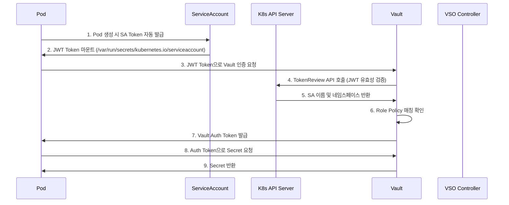
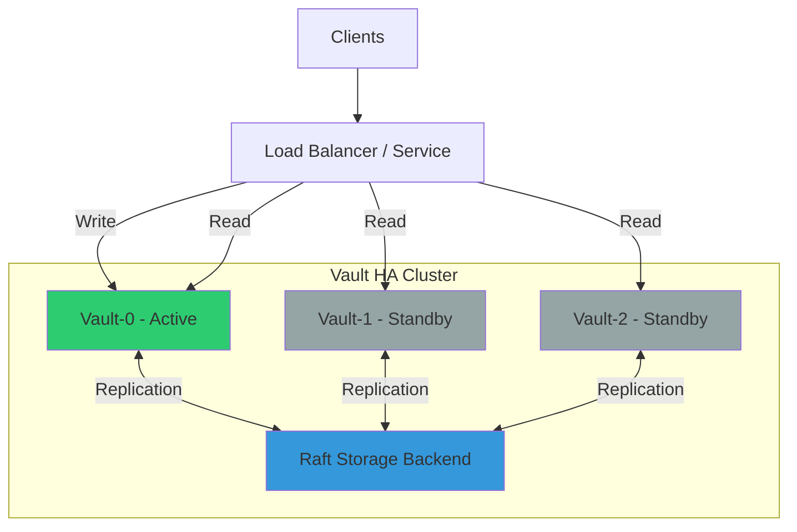
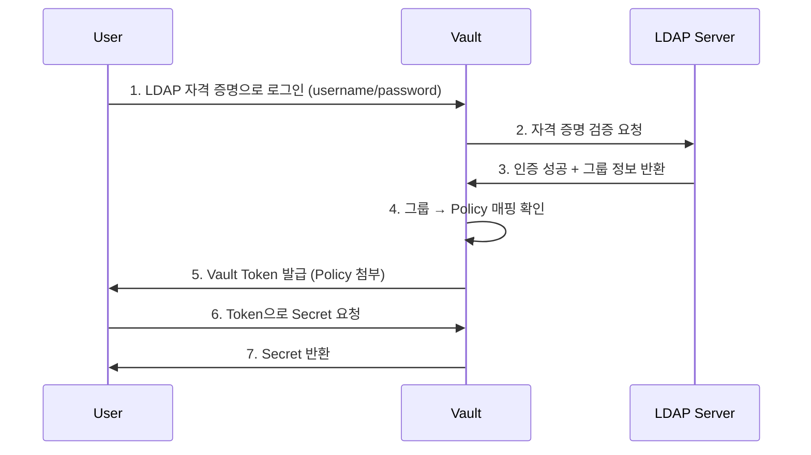
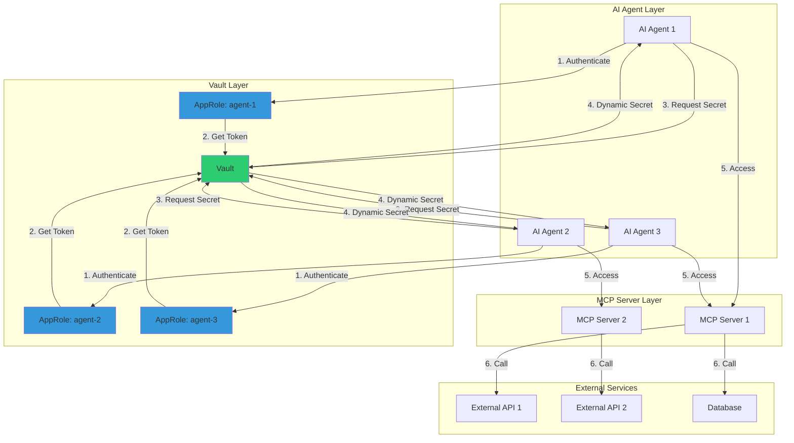

# 8주차 학습정리 - HashiCorp Vault: VSO와 프로덕션 구성

## 📋 목차

1. [⚙️ Vault Secrets Operator (VSO) 심화](#️-vault-secrets-operator-vso-심화)
   - [VSO 동작 원리 상세](#1-vso-동작-원리-상세)
   - [Kubernetes 인증 메커니즘](#2-kubernetes-인증-메커니즘)
   - [Service Account Token 이해](#3-service-account-token-이해)

2. [🔐 Vault on Kubernetes 실습](#-vault-on-kubernetes-실습)
   - [Kubernetes에 Vault 설치](#1-kubernetes에-vault-설치)
   - [Vault Unseal 과정](#2-vault-unseal-과정)
   - [Secret 생성 및 확인](#3-secret-생성-및-확인)

3. [🔑 Kubernetes 인증 설정](#-kubernetes-인증-설정)
   - [Policy 및 Role 구성](#1-policy-및-role-구성)
   - [Service Account 권한 확인](#2-service-account-권한-확인)
   - [Token Volume Projection](#3-token-volume-projection)

4. [🏗️ Vault HA (High Availability)](#️-vault-ha-high-availability)
   - [HA 아키텍처 이해](#1-ha-아키텍처-이해)
   - [Raft 스토리지 백엔드](#2-raft-스토리지-백엔드)
   - [HA 클러스터 구성 실습](#3-ha-클러스터-구성-실습)

5. [🔒 Vault with LDAP 인증](#-vault-with-ldap-인증)
   - [LDAP 인증 방식 이해](#1-ldap-인증-방식-이해)
   - [LDAP 인증 설정](#2-ldap-인증-설정)
   - [정책 매핑 및 테스트](#3-정책-매핑-및-테스트)

6. [🛡️ Vault TLS 보안 설정](#️-vault-tls-보안-설정)
   - [인증서 생성 및 적용](#1-인증서-생성-및-적용)
   - [Ingress SSL Passthrough](#2-ingress-ssl-passthrough)
   - [클라이언트 TLS 설정](#3-클라이언트-tls-설정)

7. [💡 MCP Server와 Vault](#-mcp-server와-vault)
   - [AI Agent Identity 관리](#1-ai-agent-identity-관리)
   - [Remote MCP 시크릿 관리](#2-remote-mcp-시크릿-관리)
   - [HashiCorp 권장 패턴](#3-hashicorp-권장-패턴)

8. [🎓 8주차 학습 정리](#-8주차-학습-정리)
   - [핵심 성취 목표](#1-핵심-성취-목표)
   - [프로덕션 체크리스트](#2-프로덕션-체크리스트)
   - [마무리 및 다음 단계](#3-마무리-및-다음-단계)

---

## ⚙️ Vault Secrets Operator (VSO) 심화

### 1. VSO 동작 원리 상세

**Vault Secrets Operator (VSO)**는 Kubernetes CRD를 사용하여 Vault의 시크릿을 Kubernetes Secret으로 자동 동기화하는 Operator입니다.

#### VSO의 핵심 워크플로우



**4단계 프로세스**:

1. **Vault에 Secret 요청 처리를 위한 사전 Role(Policy) 설정**
   - Vault에 Kubernetes 인증 메서드 활성화
   - Policy 생성 (어떤 경로에 어떤 권한 부여)
   - Role 생성 (ServiceAccount와 Policy 매핑)

2. **Pod 생성 시 ServiceAccount Token (JWT) 자동 생성**
   - Kubernetes Admission Controller가 자동으로 SA Token을 Pod에 마운트
   - Token은 `/var/run/secrets/kubernetes.io/serviceaccount/token` 경로에 위치

3. **Pod의 애플리케이션이 Vault에 로그인 과정**
   - 3-1) 애플리케이션은 JWT를 전달하여 Vault 로그인 요청
   - 3-2) Vault는 정보 확인을 위해 K8S API 서버에 TokenReview API 호출
   - 3-3) K8S API 서버는 ServiceAccount 이름과 네임스페이스 반환
   - 3-4) Vault는 'SA 이름, 네임스페이스'를 Vault 해당 시크릿 정책과 매칭 확인
   - 3-5) 확인 후 Vault는 Auth Token을 애플리케이션에게 반환

4. **Pod의 애플리케이션이 Vault에 Secret 요청 과정**
   - 4-1) 애플리케이션은 Auth Token으로 Vault 해당 시크릿 정보 요청
   - 4-2) Vault는 Auth Token 확인 및 매칭 정책 확인
   - 4-3) 확인 후 Vault는 최종적으로 해당 시크릿 정보 반환

### 2. Kubernetes 인증 메커니즘

#### Vault Kubernetes Auth 설정

**Vault에서 K8s Auth 인증 방식 이해**:

```yaml
# Vault Role 설정 예시
vault write auth/kubernetes/role/webapp \
    bound_service_account_names=vault \
    bound_service_account_namespaces=default \
    policies=webapp \
    ttl=24h \
    audience="https://kubernetes.default.svc.cluster.local"
```

**설정 구조**:
- **Kubernetes Auth Method** ← **Policy** (경로 및 권한) ← **Secret** (실제 데이터)

**Vault ServiceAccount 권한**:

```bash
# Vault가 K8S API와 통신하기 위한 권한
SUBJECT        | SUBJECT TYPE    | SCOPE       | NAMESPACE | ROLE                      | BINDING
vault          | ServiceAccount  | ClusterRole |           | system:auth-delegator     | vault-server-binding
```

**ClusterRole 권한 상세**:

| Resource | Verbs | 설명 |
|----------|-------|------|
| `subjectaccessreviews.authorization.k8s.io` | `create` | 사용자/그룹의 액션 수행 가능 여부 확인 |
| `tokenreviews.authentication.k8s.io` | `create` | K8S API 서버가 제시된 토큰의 유효성 확인 및 사용자 정보 획득 |

**확인 명령어**:

```bash
# Vault ServiceAccount 권한 확인
kubectl rbac-tool lookup vault
kubectl rolesum vault -n vault
```

### 3. Service Account Token 이해

#### ServiceAccount (SA) 개념

**ServiceAccount**는 Pod에서 실행되는 애플리케이션 프로세스에 대한 식별자를 제공합니다.

**주요 특징**:
- ✅ Pod 내부 애플리케이션 프로세스가 자신에게 부여된 SA 식별자로 K8S API 서버 인증
- ✅ kubelet이 kube-apiserver로부터 TokenRequest API를 통해 토큰 발급
- ✅ 토큰은 Pod 삭제 시 또는 수명 주기 이후 만료 (기본 1시간)
- ✅ 특정 Pod에 바인딩되며 kube-apiserver를 대상으로 함

#### Token Controller

**Token Controller**는 `kube-controller-manager`의 일부로 실행되며 비동기적으로 동작합니다.

**역할**:
1. ServiceAccount 삭제 감시 → 모든 SA Token Secret 삭제
2. SA Token Secret 추가 감시 → SA 존재 확인 및 토큰 추가
3. Secret 삭제 감시 → SA 참조 항목 제거

#### ServiceAccount Admission Controller

**Admission Controller**는 Pod 생성 시점에 다음 작업 수행:

1. **SA 이름 설정**
   - Pod에 `spec.serviceAccountName`이 미지정 시 → `default`로 설정

2. **SA 존재 확인**
   - 참조하는 SA 존재 여부 확인
   - 미존재 시 Pod 실행 거부

3. **Volume 추가**
   - `automountServiceAccountToken`이 `false`가 아니면:
     - API 접근 토큰을 포함하는 **Volume** 추가
     - 각 컨테이너에 **volumeMount** 추가
     - 리눅스: `/var/run/secrets/kubernetes.io/serviceaccount` 경로에 마운트

4. **imagePullSecrets 복사**
   - Pod spec에 `imagePullSecrets` 미지정 시
   - ServiceAccount의 `imagePullSecrets` 복사 추가

#### Service Account Token Volume Projection

**기존 방식의 문제점**:
- ❌ 기본 SA Token은 사용하기에 부족
- ❌ 토큰 대상(audience), 유효 기간(expiration) 등 속성 지정 불가

**Volume Projection 사용**:

```yaml
apiVersion: v1
kind: Pod
metadata:
  name: nginx
spec:
  containers:
  - image: nginx
    name: nginx
    volumeMounts:
    - mountPath: /var/run/secrets/tokens
      name: vault-token
  serviceAccountName: build-robot
  volumes:
  - name: vault-token
    projected:
      sources:
      - serviceAccountToken:
          path: vault-token
          expirationSeconds: 7200
          audience: "https://vault.vault:8200"
```

**장점**:
- ✅ **대상(audience)** 지정 가능: Vault 전용 토큰
- ✅ **유효 기간(expirationSeconds)** 설정: 보안 강화
- ✅ **자동 갱신**: kubelet이 만료 전 자동 갱신

---

## 🔐 Vault on Kubernetes 실습

### 1. Kubernetes에 Vault 설치

#### Kind 클러스터 배포

```bash
# Kind 클러스터 생성
kind create cluster --name vault-demo --config - <<EOF
kind: Cluster
apiVersion: kind.x-k8s.io/v1alpha4
nodes:
- role: control-plane
  extraPortMappings:
  - containerPort: 30000
    hostPort: 30000
    protocol: TCP
EOF

# 확인
kubectl cluster-info
kubectl get nodes
```

#### Helm을 사용한 Vault 배포

```bash
# Helm Repository 추가
helm repo add hashicorp https://helm.releases.hashicorp.com
helm repo update
helm search repo hashicorp/vault

# Namespace 생성
kubectl create namespace vault

# Vault Values 파일 생성
cat <<EOF > vault-values.yaml
global:
  enabled: true
  tlsDisable: true

server:
  standalone:
    enabled: true
    config: |
      ui = true
      listener "tcp" {
        address = "[::]:8200"
        cluster_address = "[::]:8201"
        tls_disable = 1
      }
      storage "file" {
        path = "/vault/data"
      }

  dataStorage:
    enabled: true
    size: "10Gi"
    mountPath: "/vault/data"

  auditStorage:
    enabled: true
    size: "10Gi"
    mountPath: "/vault/logs"

  service:
    enabled: true
    type: NodePort
    nodePort: 30000

ui:
  enabled: true

injector:
  enabled: false
EOF

# Vault 설치
helm upgrade vault hashicorp/vault \
  -n vault \
  -f vault-values.yaml \
  --install \
  --version 0.31.0

# 배포 확인
kubectl get sts,pods,svc,ep,pvc,cm -n vault
```

**초기 상태 확인**:

```bash
# vault-0 Pod는 초기 기동 시 Readiness Probe 실패 상태
kubectl get pods -n vault

# 출력:
# NAME       READY   STATUS    RESTARTS   AGE
# vault-0    0/1     Running   0          35s

# Vault Status 확인 (Sealed 상태)
kubectl exec -ti vault-0 -n vault -- vault status

# 출력:
# Key                Value
# ---                -----
# Seal Type          shamir
# Initialized        false
# Sealed             true
# ...

# Vault 로그 확인
kubectl stern -n vault -l app.kubernetes.io/name=vault

# 출력:
# vault-0 vault 2025-04-16T05:35:09.225Z [INFO] core: seal configuration missing, not initialized
```

### 2. Vault Unseal 과정

#### Vault 초기화 및 Unseal

**Vault 초기화**:

```bash
# Vault Pod에 접속
kubectl exec vault-0 -n vault -- vault operator init \
  -key-shares=1 \
  -key-threshold=1 \
  -format=json > cluster-keys.json

# cluster-keys.json 파일 확인
cat cluster-keys.json | jq

# 출력:
# {
#   "unseal_keys_b64": [
#     "VthosBSlObBJ1DSpenVby4wmxt+Dx2dWeldBK725ies="
#   ],
#   "root_token": "hvs.XXXXXXXXXXXXXXXXXXXX"
# }
```

**Unseal Key 추출 및 Unseal**:

```bash
# Unseal Key 변수 생성
VAULT_UNSEAL_KEY=$(jq -r ".unseal_keys_b64[]" cluster-keys.json)

# Vault Unseal 수행
kubectl exec vault-0 -n vault -- vault operator unseal $VAULT_UNSEAL_KEY

# 출력:
# Key                Value
# ---                -----
# Seal Type          shamir
# Initialized        true
# Sealed             false  ← Unsealed 성공!
# ...

# Pod 상태 확인 (Readiness Probe 성공)
kubectl get pod -n vault

# 출력:
# NAME       READY   STATUS    RESTARTS   AGE
# vault-0    1/1     Running   0          9m3s
```

**Root Token 확인**:

```bash
# Root Token 추출
jq -r ".root_token" cluster-keys.json
```

#### Vault CLI 설정 및 로그인

**macOS 설치**:

```bash
# Vault CLI 설치
brew tap hashicorp/tap
brew install hashicorp/tap/vault

# 버전 확인
vault --version

# 환경 변수 설정
export VAULT_ADDR='http://localhost:30000'

# Vault 상태 확인
vault status

# Root Token으로 로그인
vault login
# Token 입력: hvs.XXXXXXXXXXXXXXXXXXXX
```

**UI 접속**:

```bash
# macOS
open http://localhost:30000

# 로그인:
# - Method: Token
# - Token: hvs.XXXXXXXXXXXXXXXXXXXX
```

### 3. Secret 생성 및 확인

#### KV Secrets Engine 활성화

```bash
# KV v2 Secrets Engine 활성화
vault secrets enable -path=secret kv-v2

# 확인
vault secrets list -detailed
vault secrets list
```

#### Secret 생성

```bash
# Secret 생성
vault kv put secret/webapp/config \
    username="static-user" \
    password="static-password"

# Secret 확인
vault kv get secret/webapp/config

# 출력:
# ====== Secret Path ======
# secret/data/webapp/config
#
# ======= Metadata =======
# Key              Value
# ---              -----
# created_time     2025-04-15T12:50:53.565975884Z
# version          1
#
# ====== Data ======
# Key        Value
# ---        -----
# password   static-password
# username   static-user
```

#### API를 통한 Secret 확인

```bash
# Root Token 환경 변수 설정
export VAULT_ROOT_TOKEN=$(jq -r ".root_token" cluster-keys.json)

# curl로 Secret 조회
curl -s --header "X-Vault-Token: $VAULT_ROOT_TOKEN" \
  --request GET \
  http://127.0.0.1:30000/v1/secret/data/webapp/config | jq

# Web UI에서도 확인 가능
```

---

## 🔑 Kubernetes 인증 설정

### 1. Policy 및 Role 구성

#### Kubernetes Auth Method 활성화

```bash
# Kubernetes Auth 활성화
vault auth enable kubernetes

# 확인
vault auth list -detailed
vault auth list

# K8S API 서버 정보 설정
vault write auth/kubernetes/config \
    kubernetes_host="https://kubernetes.default.svc"

# 설정 정보 확인
vault read auth/kubernetes/config

# 출력:
# Key                     Value
# ---                     -----
# disable_iss_validation  true
# kubernetes_ca_cert      n/a
# kubernetes_host         https://kubernetes.default.svc
# ...
```

#### Policy 생성

```bash
# webapp Policy 생성
vault policy write webapp - <<EOF
path "secret/data/webapp/config" {
  capabilities = ["read"]
}
EOF
```

**Policy 설명**:
- **Path**: `secret/data/webapp/config` (KV v2는 `/data/` 경로 포함)
- **Capabilities**: `["read"]` (읽기 전용)

#### Role 생성

```bash
# Kubernetes Auth Role 생성
vault write auth/kubernetes/role/webapp \
    bound_service_account_names=vault \
    bound_service_account_namespaces=default \
    policies=webapp \
    ttl=24h \
    audience="https://kubernetes.default.svc.cluster.local"

# 출력:
# Success! Data written to: auth/kubernetes/role/webapp
```

**Role 설명**:
- **bound_service_account_names**: `vault` (허용할 SA 이름)
- **bound_service_account_namespaces**: `default` (허용할 네임스페이스)
- **policies**: `webapp` (적용할 정책)
- **ttl**: `24h` (토큰 유효 기간)
- **audience**: Vault 서버 주소

### 2. Service Account 권한 확인

#### Vault ServiceAccount 권한

```bash
# Vault SA가 가진 Role 확인
kubectl rbac-tool lookup vault

# 출력:
# SUBJECT | SUBJECT TYPE | SCOPE | NAMESPACE | ROLE | BINDING
# vault | ServiceAccount | ClusterRole | | system:auth-delegator | vault-server-binding

# Role 상세 확인
kubectl rolesum vault -n vault
```

**ClusterRole `system:auth-delegator` 권한**:

| Resource | Verbs | 설명 |
|----------|-------|------|
| `subjectaccessreviews.authorization.k8s.io` | `create` | 사용자 또는 그룹의 액션 수행 가능 여부 확인 |
| `tokenreviews.authentication.k8s.io` | `create` | K8S API 서버가 제시된 토큰의 유효성 확인 및 사용자 정보 획득 |

**중요**: Vault가 K8S SA Token의 유효성을 검증하기 위해서는 이 권한이 반드시 필요합니다!

### 3. Token Volume Projection

#### Projected Volume 사용 예시

**기존 방식 (Secret 기반)**:

```yaml
apiVersion: v1
kind: Pod
metadata:
  name: nginx
spec:
  serviceAccountName: default
  containers:
  - name: nginx
    image: nginx
    # SA Token이 자동으로 /var/run/secrets/kubernetes.io/serviceaccount에 마운트됨
```

**Projected Volume 방식**:

```yaml
apiVersion: v1
kind: Pod
metadata:
  name: nginx
spec:
  serviceAccountName: build-robot
  containers:
  - name: nginx
    image: nginx
    volumeMounts:
    - mountPath: /var/run/secrets/tokens
      name: vault-token
  volumes:
  - name: vault-token
    projected:
      sources:
      - serviceAccountToken:
          path: vault-token
          expirationSeconds: 7200  # 2시간
          audience: "https://vault.vault:8200"
```

**장점**:
1. **audience 지정**: Vault 전용 토큰 생성
2. **expiration 제어**: 보안을 위한 짧은 수명 주기
3. **자동 갱신**: kubelet이 자동으로 토큰 갱신

#### TokenRequest API

**TokenRequest API**는 ServiceAccount의 하위 리소스로, 일정 시간 동안 해당 SA에서 사용할 수 있는 토큰을 가져옵니다.

**특징**:
- ✅ 컨테이너 내에서 직접 호출 불필요 (kubelet이 자동 처리)
- ✅ Projected Volume을 통해 자동 설정
- ✅ 토큰 만료 전 자동 갱신

---

## 🏗️ Vault HA (High Availability)

### 1. HA 아키텍처 이해

#### Vault HA 모드 개요

**Vault HA (High Availability)**는 1대의 **Active** 서버와 나머지 **Standby** 서버로 구성됩니다.



**HA 동작 방식**:
- ✅ **Active**: 모든 쓰기 요청 처리, 읽기 요청도 처리 가능
- ✅ **Standby**: 읽기 요청만 처리 가능, Active 장애 시 자동 승격
- ✅ **Raft Consensus**: 리더 선출 및 데이터 복제 (최소 3대 권장)
- ✅ **자동 Failover**: Active 장애 시 Standby 중 하나가 자동으로 Active로 승격

### 2. Raft 스토리지 백엔드

#### Raft Consensus Algorithm

**Raft**는 분산 합의 알고리즘으로, Vault HA의 핵심 스토리지 백엔드입니다.

**Raft의 장점**:
- ✅ **외부 의존성 없음**: Consul 불필요 (Vault 자체에 내장)
- ✅ **강력한 일관성**: Leader-based consensus
- ✅ **자동 Failover**: Leader 장애 시 자동 선출
- ✅ **Snapshot 지원**: 백업 및 복구 용이

**Raft Quorum**:
- **3노드**: 1대 장애 허용
- **5노드**: 2대 장애 허용
- **7노드**: 3대 장애 허용

**권장 구성**: 3노드 또는 5노드 (홀수 권장)

#### Raft vs Consul Storage

| 특성 | Raft (Integrated) | Consul |
|-----|------------------|--------|
| **설치 복잡도** | ✅ Vault만 설치 | ❌ Vault + Consul 별도 설치 |
| **운영 복잡도** | ✅ 낮음 (단일 시스템) | ❌ 높음 (두 시스템 관리) |
| **성능** | ✅ 빠름 (네트워크 홉 감소) | ⚠️ 상대적으로 느림 |
| **의존성** | ✅ 없음 | ❌ Consul 클러스터 필수 |
| **권장 사용** | ✅ 대부분의 경우 권장 | ⚠️ 기존 Consul 환경 |

### 3. HA 클러스터 구성 실습

#### Kind 클러스터 배포 (Worker 3노드)

```bash
# Kind 클러스터 생성 (Worker 3노드 + Ingress-Nginx)
kind create cluster --name myk8s --image kindest/node:v1.32.8 --config - <<EOF
kind: Cluster
apiVersion: kind.x-k8s.io/v1alpha4
nodes:
- role: control-plane
  labels:
    ingress-ready: true
  extraPortMappings:
  - containerPort: 80
    hostPort: 80
    protocol: TCP
  - containerPort: 443
    hostPort: 443
    protocol: TCP
  - containerPort: 30000
    hostPort: 30000
  - containerPort: 30001
    hostPort: 30001
- role: worker
- role: worker
- role: worker
EOF

# NGINX Ingress 배포
kubectl apply -f https://raw.githubusercontent.com/kubernetes/ingress-nginx/main/deploy/static/provider/kind/deploy.yaml

# nodeSelector 지정
kubectl patch deployment ingress-nginx-controller -n ingress-nginx \
  --type='merge' \
  -p='{"spec":{"template":{"spec":{"nodeSelector":{"ingress-ready":"true"}}}}}'

# SSL Passthrough flag 활성화
kubectl get deployment ingress-nginx-controller -n ingress-nginx -o yaml \
  | sed '/- --publish-status-address=localhost/a\            - --enable-ssl-passthrough' \
  | kubectl apply -f -
```

#### Vault HA Helm Values

```yaml
# vault-ha-values.yaml
global:
  enabled: true
  tlsDisable: false  # TLS 활성화

server:
  ha:
    enabled: true
    replicas: 3
    raft:
      enabled: true
      setNodeId: true
      config: |
        ui = true

        listener "tcp" {
          address = "[::]:8200"
          cluster_address = "[::]:8201"
          tls_cert_file = "/vault/userconfig/vault-tls/tls.crt"
          tls_key_file  = "/vault/userconfig/vault-tls/tls.key"
        }

        storage "raft" {
          path = "/vault/data"

          retry_join {
            leader_api_addr = "https://vault-0.vault-internal:8200"
            leader_ca_cert_file = "/vault/userconfig/vault-tls/ca.crt"
          }
          retry_join {
            leader_api_addr = "https://vault-1.vault-internal:8200"
            leader_ca_cert_file = "/vault/userconfig/vault-tls/ca.crt"
          }
          retry_join {
            leader_api_addr = "https://vault-2.vault-internal:8200"
            leader_ca_cert_file = "/vault/userconfig/vault-tls/ca.crt"
          }
        }

  dataStorage:
    enabled: true
    size: "10Gi"
    storageClass: "standard"

  auditStorage:
    enabled: true
    size: "10Gi"

  service:
    enabled: true
    type: ClusterIP

  ingress:
    enabled: true
    ingressClassName: nginx
    annotations:
      nginx.ingress.kubernetes.io/ssl-passthrough: "true"
    hosts:
    - host: vault.example.com
      paths: ["/"]

ui:
  enabled: true
```

#### Vault HA 설치

```bash
# Namespace 생성
kubectl create namespace vault

# Vault HA 설치
helm upgrade vault hashicorp/vault \
  -n vault \
  -f vault-ha-values.yaml \
  --install \
  --version 0.31.0

# 배포 확인
kubectl get sts,pods,svc,pvc -n vault

# 출력:
# NAME                     READY   STATUS    RESTARTS   AGE
# pod/vault-0              0/1     Running   0          100s
# pod/vault-1              0/1     Running   0          100s
# pod/vault-2              0/1     Running   0          100s
#
# NAME                                STATUS   VOLUME                                     CAPACITY
# persistentvolumeclaim/data-vault-0  Bound    pvc-3df4e80d-b692-429a-aee9-368bd1297aa9   10Gi
# persistentvolumeclaim/data-vault-1  Bound    pvc-7a199dd9-53c5-4b63-9970-f8888e2c4e8c   10Gi
# persistentvolumeclaim/data-vault-2  Bound    pvc-6066c850-c7c0-46c5-9ea3-9ffce755c19a   10Gi
```

#### Vault-0 초기화 및 Unseal

```bash
# Vault-0 초기화
kubectl exec vault-0 -n vault -- vault operator init \
  -key-shares=5 \
  -key-threshold=3 \
  -format=json > cluster-keys.json

# Unseal Keys 추출
VAULT_UNSEAL_KEY_1=$(jq -r ".unseal_keys_b64[0]" cluster-keys.json)
VAULT_UNSEAL_KEY_2=$(jq -r ".unseal_keys_b64[1]" cluster-keys.json)
VAULT_UNSEAL_KEY_3=$(jq -r ".unseal_keys_b64[2]" cluster-keys.json)

# Vault-0 Unseal (3개 키 필요)
kubectl exec vault-0 -n vault -- vault operator unseal $VAULT_UNSEAL_KEY_1
kubectl exec vault-0 -n vault -- vault operator unseal $VAULT_UNSEAL_KEY_2
kubectl exec vault-0 -n vault -- vault operator unseal $VAULT_UNSEAL_KEY_3

# Vault-0 상태 확인
kubectl exec vault-0 -n vault -- vault status

# 출력:
# Key                Value
# ---                -----
# Seal Type          shamir
# Initialized        true
# Sealed             false
# HA Enabled         true
# HA Mode            active  ← Active 상태!
```

#### Vault-1, Vault-2 Join 및 Unseal

```bash
# Vault-1 Join
kubectl exec vault-1 -n vault -- vault operator raft join \
  https://vault-0.vault-internal:8200

# Vault-1 Unseal
kubectl exec vault-1 -n vault -- vault operator unseal $VAULT_UNSEAL_KEY_1
kubectl exec vault-1 -n vault -- vault operator unseal $VAULT_UNSEAL_KEY_2
kubectl exec vault-1 -n vault -- vault operator unseal $VAULT_UNSEAL_KEY_3

# Vault-2 Join
kubectl exec vault-2 -n vault -- vault operator raft join \
  https://vault-0.vault-internal:8200

# Vault-2 Unseal
kubectl exec vault-2 -n vault -- vault operator unseal $VAULT_UNSEAL_KEY_1
kubectl exec vault-2 -n vault -- vault operator unseal $VAULT_UNSEAL_KEY_2
kubectl exec vault-2 -n vault -- vault operator unseal $VAULT_UNSEAL_KEY_3
```

#### Raft Cluster 상태 확인

```bash
# Root Token으로 로그인
export VAULT_ROOT_TOKEN=$(jq -r ".root_token" cluster-keys.json)
kubectl exec vault-0 -n vault -- vault login $VAULT_ROOT_TOKEN

# Raft Peer 목록 확인
kubectl exec vault-0 -n vault -- vault operator raft list-peers

# 출력:
# Node                                    Address                        State       Voter
# ----                                    -------                        -----       -----
# vault-0                                 vault-0.vault-internal:8201    leader      true
# vault-1                                 vault-1.vault-internal:8201    follower    true
# vault-2                                 vault-2.vault-internal:8201    follower    true
```

#### HA Failover 테스트

```bash
# 현재 Leader 확인
kubectl exec vault-0 -n vault -- vault status | grep "HA Mode"

# Vault-0 (Leader) 삭제
kubectl delete pod vault-0 -n vault

# 새로운 Leader 확인 (자동 선출)
kubectl exec vault-1 -n vault -- vault status | grep "HA Mode"

# 출력:
# HA Mode            active  ← Vault-1이 새로운 Leader로 승격!

# Vault-0 재시작 후 Unseal 필요
kubectl wait --for=condition=Ready pod/vault-0 -n vault --timeout=60s
kubectl exec vault-0 -n vault -- vault operator unseal $VAULT_UNSEAL_KEY_1
kubectl exec vault-0 -n vault -- vault operator unseal $VAULT_UNSEAL_KEY_2
kubectl exec vault-0 -n vault -- vault operator unseal $VAULT_UNSEAL_KEY_3

# Vault-0 상태 확인
kubectl exec vault-0 -n vault -- vault status | grep "HA Mode"

# 출력:
# HA Mode            standby  ← Standby로 복귀
```

---

## 🔒 Vault with LDAP 인증

### 1. LDAP 인증 방식 이해

#### LDAP (Lightweight Directory Access Protocol) 개요

**LDAP**는 조직의 사용자 디렉터리 정보를 중앙에서 관리하는 프로토콜입니다.

**Vault LDAP 인증 워크플로우**:



**Vault Workflow (Secrets, Policy, Authentication)**:

**1. Secrets (시크릿)**
- 여러 유형의 비밀 관리
- 각 비밀 유형은 **Secrets Engine**이라는 독립된 구성 요소가 관리
- 데이터 저장, 생성 또는 암호화 수행

**2. Policy (정책)**
- 모든 작업은 **최소 하나의 정책에 의해 처리**
- **기본적으로 거부(Deny by Default)**
- **경로 기반(Path-based)**: 정책 작성 시 핵심 개념
- 전역 기반 유닉스 스타일 경로명 표현식 또는 명시적 경로 사용

**3. Authentication (인증)**
- 모든 작업이 **토큰(Token)**으로 보호
- 토큰은 **Vault 정책에 의해 할당**되어 액세스 권한 부여/거부
- 다양한 인증 방법 (LDAP, Kubernetes, AWS IAM, AppRole 등)

### 2. LDAP 인증 설정

#### LDAP Auth Method 활성화

```bash
# LDAP Auth Method 활성화
vault auth enable ldap

# LDAP 서버 설정
vault write auth/ldap/config \
    url="ldap://ldap.example.com" \
    userdn="ou=users,dc=example,dc=com" \
    groupdn="ou=groups,dc=example,dc=com" \
    binddn="cn=admin,dc=example,dc=com" \
    bindpass="adminpassword" \
    userattr="uid" \
    groupattr="cn"

# 설정 확인
vault read auth/ldap/config
```

**설정 파라미터**:
- **url**: LDAP 서버 주소
- **userdn**: 사용자 검색 Base DN
- **groupdn**: 그룹 검색 Base DN
- **binddn**: Vault가 LDAP에 연결할 때 사용할 DN
- **bindpass**: Bind Password
- **userattr**: 사용자 속성 (uid, sAMAccountName 등)
- **groupattr**: 그룹 속성 (cn, memberOf 등)

### 3. 정책 매핑 및 테스트

#### 그룹 정책 매핑

```bash
# developers 그룹에 dev-policy 매핑
vault write auth/ldap/groups/developers \
    policies=dev-policy

# admins 그룹에 admin-policy 매핑
vault write auth/ldap/groups/admins \
    policies=admin-policy

# 확인
vault list auth/ldap/groups
vault read auth/ldap/groups/developers
```

#### 사용자별 정책 매핑 (옵션)

```bash
# 특정 사용자에게 추가 정책 부여
vault write auth/ldap/users/alice \
    policies=alice-specific-policy

# 확인
vault read auth/ldap/users/alice
```

#### LDAP 로그인 테스트

```bash
# LDAP 사용자로 로그인
vault login -method=ldap username=alice

# Password 입력
# 성공 시 Token 반환

# Token 정보 확인
vault token lookup

# 출력:
# Key                 Value
# ---                 -----
# policies            [default dev-policy]
# ...
```

#### LDAP 인증 동작 확인

**사용자 alice가 developers 그룹 소속인 경우**:

1. Vault가 LDAP 서버에 alice 자격 증명 검증
2. LDAP 서버가 alice의 그룹 정보 반환 (developers)
3. Vault가 `auth/ldap/groups/developers` 매핑 확인
4. `dev-policy` 정책이 첨부된 Token 발급
5. alice는 `dev-policy`에서 허용하는 경로만 접근 가능

---

## 🛡️ Vault TLS 보안 설정

### 1. 인증서 생성 및 적용

#### Self-Signed Certificate 생성

```bash
# Private Key 생성
openssl genrsa -out vault-key.pem 2048

# CSR (Certificate Signing Request) 생성
openssl req -new -key vault-key.pem -out vault-csr.pem -subj "/CN=vault.example.com"

# Self-Signed Certificate 생성
openssl x509 -req -days 365 -in vault-csr.pem -signkey vault-key.pem -out vault-cert.pem

# CA Certificate (Self-Signed 경우 동일)
cp vault-cert.pem vault-ca.pem
```

#### Kubernetes Secret 생성

```bash
# TLS Secret 생성
kubectl create secret generic vault-tls \
  --from-file=tls.crt=vault-cert.pem \
  --from-file=tls.key=vault-key.pem \
  --from-file=ca.crt=vault-ca.pem \
  -n vault
```

#### Vault Server TLS 설정

**Helm Values 수정** (`vault-ha-values.yaml`):

```yaml
server:
  extraVolumes:
  - type: secret
    name: vault-tls

  ha:
    config: |
      listener "tcp" {
        address = "[::]:8200"
        cluster_address = "[::]:8201"
        tls_cert_file = "/vault/userconfig/vault-tls/tls.crt"
        tls_key_file  = "/vault/userconfig/vault-tls/tls.key"
        tls_min_version = "tls12"
      }
```

#### Vault 업그레이드

```bash
# Vault 업그레이드 (TLS 적용)
helm upgrade vault hashicorp/vault \
  -n vault \
  -f vault-ha-values.yaml

# Pod 재시작 대기
kubectl rollout status statefulset/vault -n vault
```

### 2. Ingress SSL Passthrough

#### Ingress-Nginx SSL Passthrough 활성화

**SSL Passthrough**는 Ingress가 TLS 종료를 하지 않고, 백엔드 서비스(Vault)로 TLS 트래픽을 그대로 전달하는 방식입니다.

```bash
# Ingress-Nginx Controller에 --enable-ssl-passthrough flag 추가
kubectl get deployment ingress-nginx-controller -n ingress-nginx -o yaml \
  | sed '/- --publish-status-address=localhost/a\            - --enable-ssl-passthrough' \
  | kubectl apply -f -
```

#### Vault Ingress 생성

```yaml
# vault-ingress.yaml
apiVersion: networking.k8s.io/v1
kind: Ingress
metadata:
  name: vault
  namespace: vault
  annotations:
    nginx.ingress.kubernetes.io/ssl-passthrough: "true"
    nginx.ingress.kubernetes.io/backend-protocol: "HTTPS"
spec:
  ingressClassName: nginx
  tls:
  - hosts:
    - vault.example.com
  rules:
  - host: vault.example.com
    http:
      paths:
      - path: /
        pathType: Prefix
        backend:
          service:
            name: vault
            port:
              number: 8200
```

```bash
# Ingress 적용
kubectl apply -f vault-ingress.yaml

# Ingress 확인
kubectl get ingress -n vault
```

### 3. 클라이언트 TLS 설정

#### Vault CLI TLS 설정

```bash
# 환경 변수 설정
export VAULT_ADDR='https://vault.example.com'
export VAULT_CACERT='/path/to/vault-ca.pem'
export VAULT_SKIP_VERIFY=false  # 프로덕션에서는 false 권장

# Vault 상태 확인
vault status

# 로그인
vault login $VAULT_ROOT_TOKEN
```

#### curl을 사용한 API 호출

```bash
# CA Certificate로 검증
curl --cacert vault-ca.pem \
  --header "X-Vault-Token: $VAULT_ROOT_TOKEN" \
  https://vault.example.com/v1/sys/health | jq

# 인증서 검증 스킵 (개발 환경만)
curl --insecure \
  --header "X-Vault-Token: $VAULT_ROOT_TOKEN" \
  https://vault.example.com/v1/sys/health | jq
```

#### 애플리케이션 TLS 설정

**Python 예시**:

```python
import hvac

client = hvac.Client(
    url='https://vault.example.com',
    token='hvs.xxx',
    verify='/path/to/vault-ca.pem'  # CA Certificate
)

# Secret 조회
secret = client.secrets.kv.v2.read_secret_version(
    path='webapp/config'
)

print(secret['data']['data'])
```

**Go 예시**:

```go
package main

import (
    "crypto/tls"
    "crypto/x509"
    "io/ioutil"
    "github.com/hashicorp/vault/api"
)

func main() {
    // CA Certificate 로드
    caCert, _ := ioutil.ReadFile("/path/to/vault-ca.pem")
    caCertPool := x509.NewCertPool()
    caCertPool.AppendCertsFromPEM(caCert)

    // TLS 설정
    tlsConfig := &tls.Config{
        RootCAs: caCertPool,
    }

    // Vault Client 생성
    config := &api.Config{
        Address: "https://vault.example.com",
    }
    config.HttpClient.Transport = &http.Transport{
        TLSClientConfig: tlsConfig,
    }

    client, _ := api.NewClient(config)
    client.SetToken("hvs.xxx")

    // Secret 조회
    secret, _ := client.Logical().Read("secret/data/webapp/config")
    fmt.Println(secret.Data)
}
```

---

## 💡 MCP Server와 Vault

### 1. AI Agent Identity 관리

#### MCP (Model Context Protocol) 개요

**MCP Server**는 AI Agent가 외부 시스템과 통신하기 위한 프로토콜입니다.

**주요 과제**:
- ❌ AI Agent별로 개별 시크릿(Token, Password) 관리 필요
- ❌ 시크릿 유출 시 범위가 넓어 보안 위험 증가
- ❌ 시크릿 Rotation 시 모든 Agent 재설정 필요

**Vault 기반 해결책**:
- ✅ **Identity-based Access**: 각 Agent마다 고유 Identity 부여
- ✅ **Dynamic Secrets**: 요청 시마다 임시 Credential 생성
- ✅ **Automatic Rotation**: TTL 만료 시 자동 폐기 및 갱신
- ✅ **Audit Logging**: 모든 접근 기록 추적

### 2. Remote MCP 시크릿 관리

#### HashiCorp 권장 패턴

**HashiCorp에서 제공하는 공식 가이드**:
- [AI Agent Identity with HashiCorp Vault](https://developer.hashicorp.com/validated-patterns/vault/ai-agent-identity-with-hashicorp-vault)

**아키텍처**:



### 3. HashiCorp 권장 패턴

#### Demo 코드 분석

**참고 리포지토리**: [mcp-remote-vault-demo](https://github.com/Great-Stone/mcp-remote-vault-demo)

**주요 구성 요소**:

**1. Agent별 AppRole 생성**:

```bash
# Agent-1 AppRole
vault write auth/approle/role/agent-1 \
    token_policies="agent-1-policy" \
    token_ttl=10m \
    token_max_ttl=1h

# Agent-2 AppRole
vault write auth/approle/role/agent-2 \
    token_policies="agent-2-policy" \
    token_ttl=10m \
    token_max_ttl=1h
```

**2. Policy 분리 (최소 권한 원칙)**:

```bash
# Agent-1 Policy
vault policy write agent-1-policy - <<EOF
path "secret/data/agents/agent-1/*" {
  capabilities = ["read"]
}
path "database/creds/agent-1-role" {
  capabilities = ["read"]
}
EOF

# Agent-2 Policy
vault policy write agent-2-policy - <<EOF
path "secret/data/agents/agent-2/*" {
  capabilities = ["read"]
}
path "database/creds/agent-2-role" {
  capabilities = ["read"]
}
EOF
```

**3. Dynamic Database Credentials**:

```bash
# Agent-1용 DB Role
vault write database/roles/agent-1-role \
    db_name=mysql \
    creation_statements="CREATE USER '{{name}}'@'%' IDENTIFIED BY '{{password}}';GRANT SELECT ON db1.* TO '{{name}}'@'%';" \
    default_ttl="10m" \
    max_ttl="1h"

# Agent-2용 DB Role
vault write database/roles/agent-2-role \
    db_name=mysql \
    creation_statements="CREATE USER '{{name}}'@'%' IDENTIFIED BY '{{password}}';GRANT SELECT,INSERT ON db2.* TO '{{name}}'@'%';" \
    default_ttl="10m" \
    max_ttl="1h"
```

**4. Agent 코드 예시 (Python)**:

```python
import hvac
import os

# AppRole 인증
client = hvac.Client(url='https://vault.example.com')

role_id = os.environ['VAULT_ROLE_ID']
secret_id = os.environ['VAULT_SECRET_ID']

# AppRole로 로그인
response = client.auth.approle.login(
    role_id=role_id,
    secret_id=secret_id
)

# Token 저장
client.token = response['auth']['client_token']

# Dynamic DB Credential 요청
db_creds = client.read('database/creds/agent-1-role')

# DB 연결
import mysql.connector
conn = mysql.connector.connect(
    host='mysql.example.com',
    user=db_creds['data']['username'],
    password=db_creds['data']['password'],
    database='db1'
)

# MCP Server 호출
# ...
```

**장점**:
- ✅ **각 Agent는 자신의 Identity만 관리** (RoleID + SecretID)
- ✅ **Dynamic Credentials**: 10분마다 자동 갱신
- ✅ **최소 권한**: Agent-1은 db1만, Agent-2는 db2만 접근
- ✅ **Audit Trail**: Vault가 모든 접근 기록

---

## 🎓 8주차 학습 정리

### 1. 핵심 성취 목표

**Vault Secrets Operator (VSO) 심화**
- ✅ VSO 동작 원리 및 4단계 워크플로우 이해
- ✅ Kubernetes 인증 메커니즘 (TokenReview API)
- ✅ ServiceAccount Token 생명주기 및 Volume Projection
- ✅ Token Controller, Admission Controller 역할 이해

**Vault on Kubernetes 실습**
- ✅ Helm을 사용한 Vault 설치 (Standalone/HA)
- ✅ Vault 초기화 및 Unseal 과정 실습
- ✅ KV Secrets Engine 사용 및 Secret 생성
- ✅ CLI 및 API를 통한 Vault 조작

**Kubernetes 인증 설정**
- ✅ Kubernetes Auth Method 활성화
- ✅ Policy 및 Role 구성 (bound SA, namespace)
- ✅ ServiceAccount 권한 확인 (RBAC)
- ✅ Token Volume Projection 활용

**Vault HA (High Availability)**
- ✅ Vault HA 아키텍처 이해 (Active/Standby)
- ✅ Raft 스토리지 백엔드 개념
- ✅ 3노드 HA 클러스터 구성 실습
- ✅ Raft Join 및 Unseal 과정
- ✅ Leader Failover 테스트

**Vault with LDAP 인증**
- ✅ LDAP 인증 방식 이해
- ✅ LDAP Auth Method 설정
- ✅ 그룹 및 사용자 정책 매핑
- ✅ LDAP 로그인 테스트

**Vault TLS 보안 설정**
- ✅ Self-Signed Certificate 생성
- ✅ Vault Server TLS 설정
- ✅ Ingress SSL Passthrough 구성
- ✅ 클라이언트 TLS 설정 (CLI, API, 애플리케이션)


**MCP Server와 Vault**
- ✅ AI Agent Identity 관리 개념
- ✅ Remote MCP 시크릿 관리 패턴
- ✅ HashiCorp 권장 패턴 이해
- ✅ AppRole 기반 Agent 인증 구현

### 2. 프로덕션 체크리스트

#### Vault HA 구성

**클러스터 구성**
- [ ] Raft 스토리지 백엔드 사용 (Consul 대신)
- [ ] 최소 3노드 구성 (5노드 권장)
- [ ] 각 노드에 충분한 리소스 할당 (CPU 2코어, 메모리 4GB+)
- [ ] PersistentVolume 사용 (Raft 데이터 영속성)
- [ ] Anti-Affinity 설정 (노드 장애 대비)

**Auto-Unseal 설정**
- [ ] AWS KMS Auto-Unseal 구성 (프로덕션 필수)
- [ ] GCP Cloud KMS Auto-Unseal 구성
- [ ] Azure Key Vault Auto-Unseal 구성
- [ ] Transit Auto-Unseal (Multi-Cloud)

**백업 및 복구**
- [ ] Raft Snapshot 자동 백업 (일 1회 이상)
  ```bash
  vault operator raft snapshot save backup-$(date +%Y%m%d).snap
  ```
- [ ] 백업 파일 외부 스토리지 보관 (S3, GCS, Azure Blob)
- [ ] DR 계획 수립 및 정기 복구 테스트
- [ ] Snapshot Restore 절차 문서화

#### TLS 및 보안

**TLS 설정**
- [ ] 프로덕션 인증서 사용 (Let's Encrypt, 내부 PKI)
- [ ] TLS 1.2 이상 강제
- [ ] Vault Server TLS 활성화
- [ ] Ingress SSL Passthrough 설정
- [ ] 클라이언트 TLS 검증 활성화

**네트워크 보안**
- [ ] Network Policy로 Vault 접근 제한
- [ ] Vault는 Private Network에만 노출
- [ ] Egress 트래픽 제한 (필요한 외부 서비스만)
- [ ] Ingress TLS Termination 또는 SSL Passthrough

**인증 및 인가**
- [ ] Root Token 사용 금지 (Break Glass 용도만)
- [ ] AppRole 또는 Kubernetes Auth 사용
- [ ] LDAP/AD 통합 (사용자 인증)
- [ ] 최소 권한 원칙 (Least Privilege) 적용
- [ ] Token TTL 설정 (1h~4h 권장)
- [ ] SecretID Response Wrapping 사용

#### 감사 및 모니터링

**Audit Logging**
- [ ] File Audit Device 활성화
  ```bash
  vault audit enable file file_path=/vault/logs/audit.log
  ```
- [ ] Syslog Audit Device 설정 (중앙 로그 수집)
- [ ] Audit Log 외부 저장소 전송 (S3, ELK)
- [ ] 정기적인 Audit Log 분석

**Monitoring**
- [ ] Prometheus Metrics 수집
- [ ] Grafana 대시보드 구성
- [ ] Alert 설정
  - Vault Sealed 상태
  - 실패한 인증 시도 증가
  - Token 만료율 증가
  - Raft Leader 변경
- [ ] Health Check 엔드포인트 모니터링

#### 운영

**Secret Management**
- [ ] KV v2 Secrets Engine 사용 (버전 관리)
- [ ] Dynamic Secrets 우선 사용 (DB, AWS, GCP)
- [ ] Secret Rotation 정책 수립
- [ ] Lease 자동 갱신 설정

**정책 관리**
- [ ] Policy as Code (Git 관리)
- [ ] 환경별 Policy 분리 (dev, staging, prod)
- [ ] 정기적인 Policy 리뷰
- [ ] Policy 변경 이력 추적

**문서화**
- [ ] Runbook 작성
  - Vault 초기화 절차
  - Unseal 절차 (Auto-Unseal 실패 시)
  - Backup/Restore 절차
  - Failover 절차
- [ ] Policy 문서화 (각 Role별 권한)
- [ ] 애플리케이션별 Vault 연동 가이드
- [ ] Troubleshooting 가이드

### 3. 마무리 및 다음 단계

#### 8주간의 학습 여정

**Week 1-3: GitOps 기초**
- Docker, Helm, Kustomize, Tekton
- ArgoCD 핵심 개념 및 실습

**Week 4-6: ArgoCD 고급**
- Sync Waves, RBAC, Notifications, Argo Rollouts
- Keycloak SSO, LDAP 통합
- HA, Multi-Cluster, Monitoring

**Week 7: Vault 기초**
- Vault 개념 및 설치
- 인증 방법 (AppRole, Kubernetes)
- Vault Agent, Transit Engine
- CI/CD 통합 (Jenkins, ArgoCD)
- VSO (Vault Secrets Operator)

**Week 8: Vault 프로덕션**
- VSO 심화 및 Kubernetes 인증
- Vault HA (Raft)
- LDAP 인증
- TLS 보안 설정
- MCP Server 시크릿 관리

#### 실무 적용 로드맵

**Phase 1: Pilot (1-2개월)**
- [ ] Dev 환경에 Vault HA 구성
- [ ] 1-2개 애플리케이션에 VSO 적용
- [ ] ArgoCD Vault Plugin 통합 테스트
- [ ] Dynamic Secrets (Database) 파일럿

**Phase 2: Expansion (2-3개월)**
- [ ] Staging/Production 환경 Vault 구축
- [ ] 전사 애플리케이션 Vault 온보딩
- [ ] LDAP/AD 통합 (사용자 인증)
- [ ] Auto-Unseal 구성 (AWS KMS)
- [ ] 모니터링 및 Alerting 구성

**Phase 3: Optimization (3-6개월)**
- [ ] Multi-Region Replication
- [ ] Vault Enterprise 기능 평가
- [ ] Terraform을 통한 Vault 자동화
- [ ] Security Audit 및 Compliance 검증
- [ ] Vault 교육 프로그램 운영

#### 추가 학습 자료

**공식 문서**
- [HashiCorp Vault Documentation](https://developer.hashicorp.com/vault/docs)
- [Vault on Kubernetes](https://developer.hashicorp.com/vault/docs/platform/k8s)
- [Vault HA with Raft](https://developer.hashicorp.com/vault/docs/configuration/storage/raft)
- [Vault Secrets Operator](https://developer.hashicorp.com/vault/docs/platform/k8s/vso)

**고급 주제**
- [Vault Enterprise Features](https://developer.hashicorp.com/vault/docs/enterprise)
- [Vault Performance Replication](https://developer.hashicorp.com/vault/docs/enterprise/replication)
- [Vault Namespaces](https://developer.hashicorp.com/vault/docs/enterprise/namespaces)
- [Sentinel Policies](https://developer.hashicorp.com/vault/docs/enterprise/sentinel)

**커뮤니티**
- [HashiCorp Community Forum](https://discuss.hashicorp.com/c/vault)
- [Vault GitHub](https://github.com/hashicorp/vault)
- [HashiCorp YouTube Channel](https://www.youtube.com/@HashiCorp)

**참고 리포지토리**
- [AI Agent Identity with Vault](https://developer.hashicorp.com/validated-patterns/vault/ai-agent-identity-with-hashicorp-vault)
- [MCP Remote Vault Demo](https://github.com/Great-Stone/mcp-remote-vault-demo)

---

**🎉 8주차 학습 완료!**

8주간의 CI/CD 및 GitOps 학습을 통해 다음과 같은 역량을 갖추게 되었습니다:

1. **GitOps 전문가**: ArgoCD를 활용한 선언적 배포 및 자동화
2. **시크릿 관리 전문가**: HashiCorp Vault를 사용한 엔터프라이즈급 시크릿 관리
3. **보안 강화**: 제로 트러스트 보안 모델 및 동적 시크릿 활용
4. **프로덕션 운영**: HA 구성, LDAP 통합, TLS 보안 설정
5. **실무 적용**: 실제 엔터프라이즈 환경에 적용 가능한 수준

이제 **엔터프라이즈급 GitOps + Vault 플랫폼을 구축하고 운영**할 수 있는 역량을 갖추게 되었습니다! 🚀

다음 단계로는:
- **플랫폼 엔지니어링**: Backstage.io, Internal Developer Portal
- **FinOps**: Kubecost, Cloud Cost Optimization
- **고급 보안**: OPA, Kyverno, Falco
- **Observability**: OpenTelemetry, Tempo, Loki

계속해서 학습하고 발전해 나가시기 바랍니다! 💪
