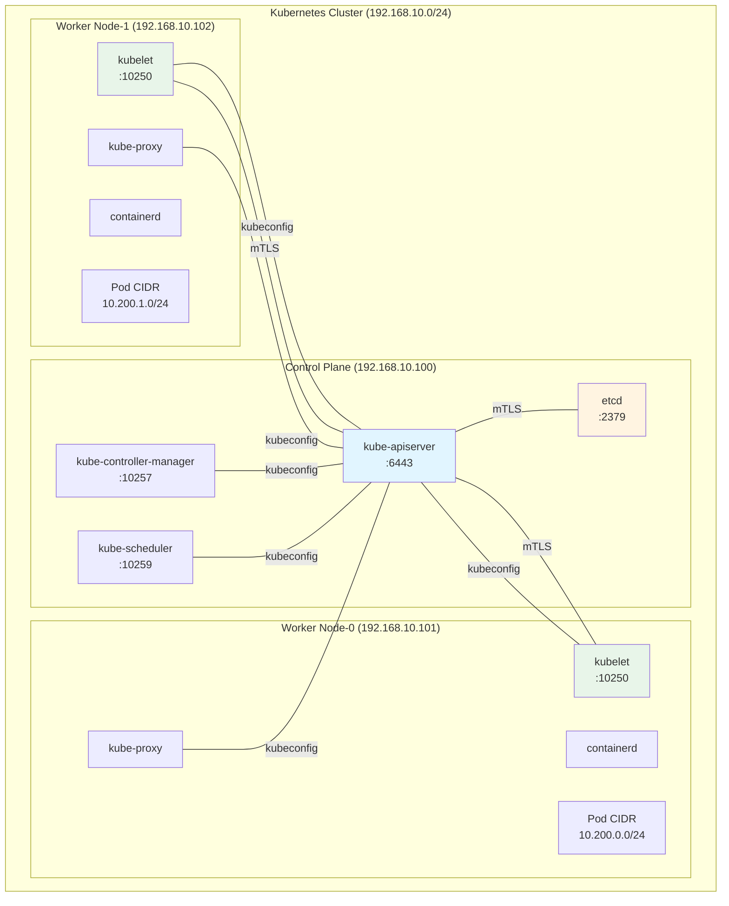
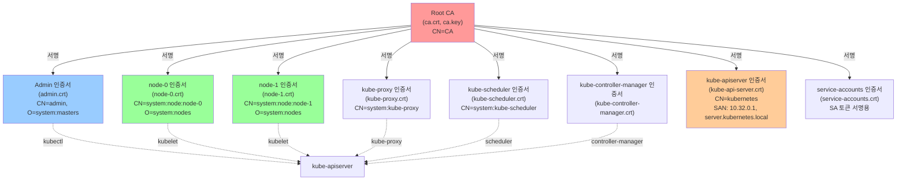
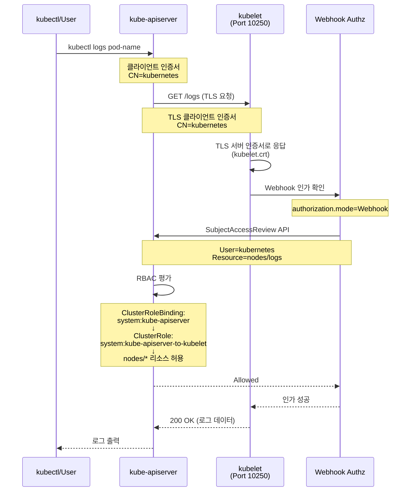
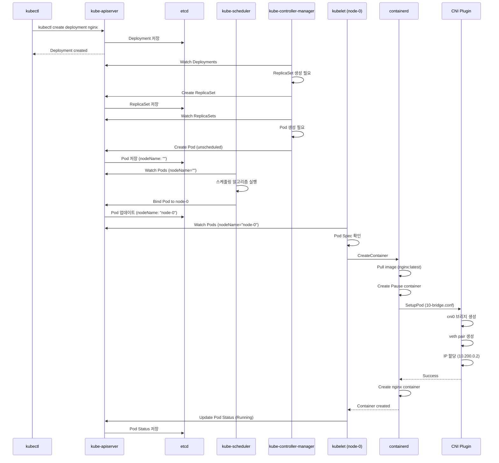
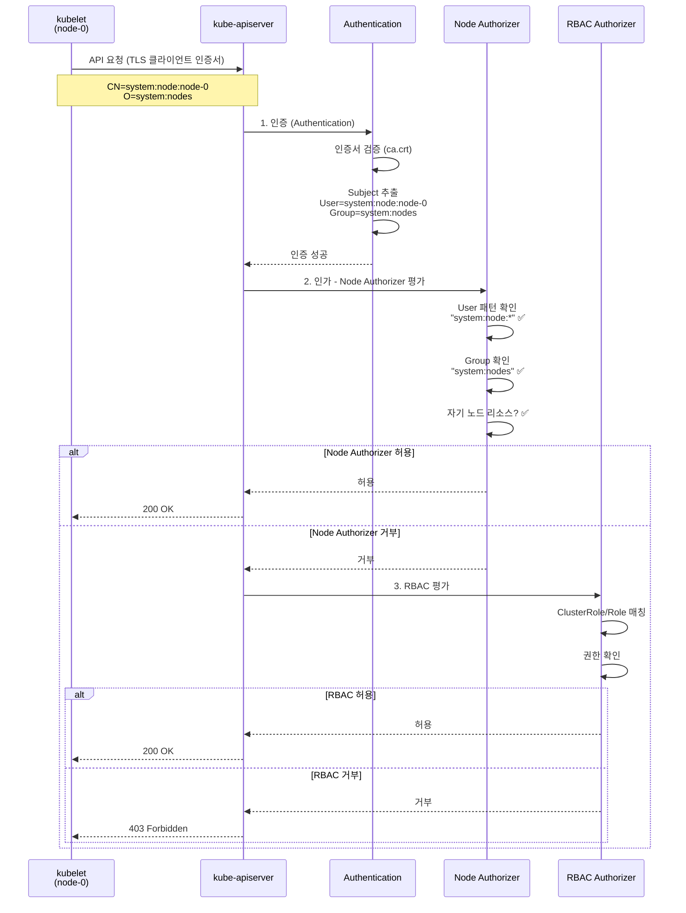
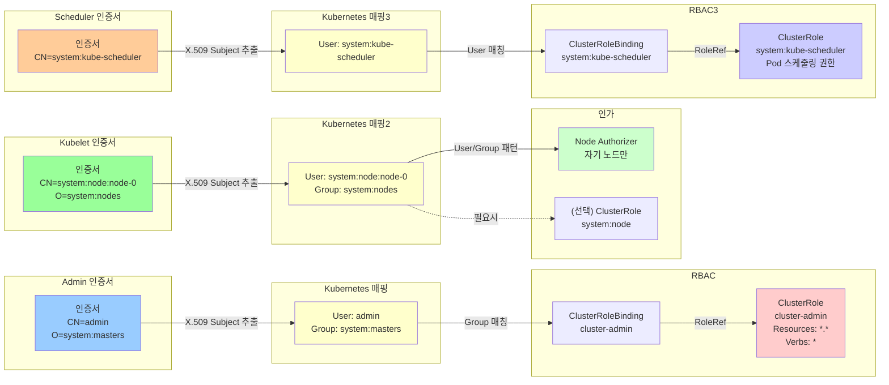

# [K8s-Deploy] Week 1 - Bootstrap Kubernetes The Hard Way

> **새로운 스터디 시작**: Kubernetes 클러스터를 처음부터 수동으로 구축하며 내부 동작 원리를 깊이 이해하는 K8s-Deploy 스터디의 첫 번째 주차입니다.

## 📋 목차

1. [🎯 K8s-Deploy 스터디 소개](#-k8s-deploy-스터디-소개)
   - [스터디 목표](#1-스터디-목표)
   - [Week 1 학습 목표](#2-week-1-학습-목표)
   - [실습 환경 구성](#3-실습-환경-구성)

2. [🔐 CA 및 TLS 인증서 구성](#-ca-및-tls-인증서-구성)
   - [Root CA 생성](#1-root-ca-생성)
   - [Admin 클라이언트 인증서](#2-admin-클라이언트-인증서)
   - [Node(Kubelet) 인증서](#3-nodekubelet-인증서)
   - [컴포넌트별 인증서 생성](#4-컴포넌트별-인증서-생성)
   - [API Server 인증서 특징](#5-api-server-인증서-특징)

3. [📝 Kubeconfig 파일 생성](#-kubeconfig-파일-생성)
   - [Kubeconfig 구조 이해](#1-kubeconfig-구조-이해)
   - [Kubelet용 Kubeconfig](#2-kubelet용-kubeconfig)
   - [컴포넌트별 Kubeconfig](#3-컴포넌트별-kubeconfig)

4. [🔒 Data Encryption at Rest](#-data-encryption-at-rest)
   - [ETCD 암호화 설정](#1-etcd-암호화-설정)
   - [암호화 Provider 이해](#2-암호화-provider-이해)
   - [암호화 검증](#3-암호화-검증)

5. [🏗️ Control Plane 구성](#️-control-plane-구성)
   - [ETCD 클러스터 구축](#1-etcd-클러스터-구축)
   - [Kube-APIServer 설정](#2-kube-apiserver-설정)
   - [Kube-Controller-Manager 설정](#3-kube-controller-manager-설정)
   - [Kube-Scheduler 설정](#4-kube-scheduler-설정)
   - [RBAC for Kubelet Authorization](#5-rbac-for-kubelet-authorization)

6. [⚙️ Worker Node 구성](#️-worker-node-구성)
   - [Container Runtime 설치](#1-container-runtime-설치)
   - [CNI 플러그인 구성](#2-cni-플러그인-구성)
   - [Kubelet 설정](#3-kubelet-설정)
   - [Kube-Proxy 설정](#4-kube-proxy-설정)

7. [🌐 Pod Network Routes](#-pod-network-routes)
   - [Pod CIDR 구성](#1-pod-cidr-구성)
   - [수동 라우팅 설정](#2-수동-라우팅-설정)
   - [네트워크 검증](#3-네트워크-검증)

8. [🧪 Smoke Test](#-smoke-test)
   - [Data Encryption 테스트](#1-data-encryption-테스트)
   - [Deployment 테스트](#2-deployment-테스트)
   - [Service 테스트](#3-service-테스트)

9. [💡 핵심 개념 정리](#-핵심-개념-정리)
   - [인증(Authentication) vs 인가(Authorization)](#1-인증authentication-vs-인가authorization)
   - [Node Authorizer 이해](#2-node-authorizer-이해)
   - [Certificate Subject와 RBAC 관계](#3-certificate-subject와-rbac-관계)

10. [🎓 Week 1 학습 정리](#-week-1-학습-정리)

---

## 🎯 K8s-Deploy 스터디 소개

### 1. 스터디 목표

**K8s-Deploy 스터디**는 Kubernetes 클러스터 배포와 운영에 대한 깊은 이해를 목표로 합니다.

### 2. Week 1 학습 목표

**Kubernetes The Hard Way**는 Kubernetes 클러스터를 kubeadm과 같은 자동화 도구 없이 처음부터 수동으로 구축하는 실습입니다.

**이번 주 핵심 학습 포인트**:
- ✅ Kubernetes 각 컴포넌트의 역할과 상호작용 이해
- ✅ mTLS(상호 TLS) 통신을 위한 CA 및 인증서 생성
- ✅ 인증서 Subject(CN, O)와 Kubernetes RBAC의 연관성
- ✅ Systemd를 사용한 각 컴포넌트 서비스 관리
- ✅ etcd에 저장되는 Secret 데이터 암호화
- ✅ CNI 없이 수동 라우팅으로 Pod 네트워크 구성

**왜 "The Hard Way"인가?**
- 자동화 도구가 숨기고 있는 내부 동작을 직접 경험
- 트러블슈팅 능력 향상
- 프로덕션 환경 운영에 필요한 깊은 이해

### 3. 실습 환경 구성

**가상머신 구성** (VirtualBox + Vagrant, Debian 12):

| 호스트명 | IP 주소 | 역할 | vCPU | Memory |
|---------|---------|------|------|--------|
| jumpbox | 192.168.10.10 | 관리 호스트 | 2 | 1.5GB |
| server | 192.168.10.100 | Control Plane | 2 | 2GB |
| node-0 | 192.168.10.101 | Worker Node | 2 | 2GB |
| node-1 | 192.168.10.102 | Worker Node | 2 | 2GB |

**네트워크 대역**:

| 항목 | 네트워크 대역 / IP |
|------|-------------------|
| Cluster CIDR | 10.200.0.0/16 |
| node-0 Pod CIDR | 10.200.0.0/24 |
| node-1 Pod CIDR | 10.200.1.0/24 |
| Service CIDR | 10.32.0.0/24 |
| kubernetes Service ClusterIP | 10.32.0.1 |

**컴포넌트 버전**:
- Kubernetes: v1.32.2
- etcd: v3.6.0
- containerd: v2.1.0
- runc: v1.3.0

**실습 아키텍처**:



---

## 🔐 CA 및 TLS 인증서 구성

### 1. Root CA 생성

Kubernetes 클러스터의 모든 인증서를 서명하는 **Root CA** 생성:

```bash
# CA 개인키 생성 (RSA 4096 bits)
openssl genrsa -out ca.key 4096

# CA 인증서 생성 (Self-Signed, 10년 유효기간)
openssl req -x509 -new -sha512 -noenc \
  -key ca.key -days 3653 \
  -config ca.conf \
  -out ca.crt
```

**CA 인증서 특징**:
- `basicConstraints = CA:TRUE` - CA 역할 가능
- `keyUsage = cRLSign, keyCertSign` - 다른 인증서를 서명 가능
- Kubernetes 모든 인증의 신뢰 루트(Root of Trust)

**ca.conf 주요 섹션**:
```ini
[ca_x509_extensions]
basicConstraints = CA:TRUE
keyUsage = cRLSign, keyCertSign

[req_distinguished_name]
C = US
ST = Washington
L = Seattle
CN = CA
```

**인증서 확인**:
```bash
openssl x509 -in ca.crt -text -noout
```

**인증서 체인 구조**:



### 2. Admin 클라이언트 인증서

kubectl을 사용할 관리자용 클라이언트 인증서:

```bash
# 개인키 생성
openssl genrsa -out admin.key 4096

# CSR 생성 (CN=admin, O=system:masters)
openssl req -new -key admin.key -sha256 \
  -config ca.conf -section admin \
  -out admin.csr

# CA가 서명한 인증서 생성
openssl x509 -req -days 3653 -in admin.csr \
  -copy_extensions copyall \
  -sha256 -CA ca.crt -CAkey ca.key \
  -CAcreateserial \
  -out admin.crt
```

**Admin 인증서의 중요 필드**:
```
Subject: CN=admin, O=system:masters
X509v3 Extended Key Usage: TLS Web Client Authentication
```

**핵심 포인트**:
- **CN = admin**: Kubernetes에서 **user**로 매핑
- **O = system:masters**: Kubernetes에서 **group**으로 매핑
- `system:masters` 그룹은 **인가를 우회하는 슈퍼유저 권한** 보유

**RBAC 확인**:
```bash
kubectl describe clusterrolebindings cluster-admin

# Subjects:
#   Kind   Name             Namespace
#   ----   ----             ---------
#   Group  system:masters
```

**system:masters 그룹의 특별함**:
- ClusterRole `cluster-admin`에 바인딩
- 모든 리소스(`*.*`)에 대한 모든 동작(`*`) 허용
- 인증 후 **인가를 우회**
- 프로덕션에서는 사용 제한 권장

### 3. Node(Kubelet) 인증서

Worker Node의 kubelet이 사용하는 인증서:

```bash
# node-0 인증서 생성
openssl genrsa -out node-0.key 4096

openssl req -new -key node-0.key -sha256 \
  -config ca.conf -section node-0 \
  -out node-0.csr

openssl x509 -req -days 3653 -in node-0.csr \
  -copy_extensions copyall \
  -sha256 -CA ca.crt -CAkey ca.key \
  -CAcreateserial \
  -out node-0.crt
```

**Node 인증서의 중요 필드**:
```
Subject: CN=system:node:node-0, O=system:nodes, C=US, ST=Washington, L=Seattle
X509v3 Extended Key Usage:
    TLS Web Client Authentication, TLS Web Server Authentication
X509v3 Subject Alternative Name:
    DNS:node-0, IP Address:127.0.0.1
```

**핵심 포인트**:
- **CN = system:node:node-0**: Node Authorizer가 요구하는 명명 규칙 (`system:node:<nodeName>`)
- **O = system:nodes**: Node Authorizer가 요구하는 그룹
- **EKU**:
  - `clientAuth`: kube-apiserver → kubelet 호출 시
  - `serverAuth`: kubelet HTTPS 서버 역할 시 (포트 10250)
- **SAN**: kubelet API 서버 접근을 위한 DNS/IP

**Node Authorizer**:
- Kubelet이 수행하는 API 요청에 대한 권한을 특별히 부여하는 특수 목적 권한 부여 모드
- `--authorization-mode=Node,RBAC`에서 Node가 먼저 평가됨
- `system:nodes` 그룹과 `system:node:<nodeName>` 사용자에게만 적용

### 4. 컴포넌트별 인증서 생성

**생성해야 할 인증서 목록**:

| 컴포넌트 | CN | O | 용도 |
|----------|----|----|------|
| kube-proxy | system:kube-proxy | system:node-proxier | 서비스 네트워크 제어 |
| kube-scheduler | system:kube-scheduler | system:kube-scheduler | Pod 스케줄링 전용 권한 |
| kube-controller-manager | system:kube-controller-manager | system:kube-controller-manager | 클러스터 상태 관리 (Node, ReplicaSet, SA 토큰 등) |
| kube-apiserver | kubernetes | - | API 서버 |
| service-accounts | service-accounts | - | SA 토큰 서명용 |

**일괄 생성 스크립트**:
```bash
certs=("node-0" "node-1" "kube-proxy" "kube-scheduler" \
       "kube-controller-manager" "kube-api-server" "service-accounts")

for i in ${certs[*]}; do
  # 개인키 생성
  openssl genrsa -out "${i}.key" 4096

  # CSR 생성
  openssl req -new -key "${i}.key" -sha256 \
    -config ca.conf -section ${i} \
    -out "${i}.csr"

  # CA 서명 인증서 생성
  openssl x509 -req -days 3653 -in "${i}.csr" \
    -copy_extensions copyall \
    -sha256 -CA ca.crt -CAkey ca.key \
    -CAcreateserial \
    -out "${i}.crt"
done
```

**인증서 검증**:
```bash
# kube-proxy 인증서 확인
openssl x509 -in kube-proxy.crt -text -noout
# Subject: CN=system:kube-proxy, O=system:node-proxier
# SAN: DNS:kube-proxy, IP:127.0.0.1

# kube-scheduler 인증서 확인
openssl x509 -in kube-scheduler.crt -text -noout
# Subject: CN=system:kube-scheduler, O=system:kube-scheduler
```

### 5. API Server 인증서 특징

**kube-apiserver 인증서는 특별합니다**:

```
Subject: CN=kubernetes, C=US, ST=Washington, L=Seattle
X509v3 Extended Key Usage:
    TLS Web Client Authentication, TLS Web Server Authentication
Netscape Cert Type:
    SSL Client, SSL Server
X509v3 Subject Alternative Name:
    IP Address:127.0.0.1,
    IP Address:10.32.0.1,           # kubernetes Service ClusterIP
    DNS:kubernetes,
    DNS:kubernetes.default,
    DNS:kubernetes.default.svc,
    DNS:kubernetes.default.svc.cluster,
    DNS:kubernetes.svc.cluster.local,
    DNS:server.kubernetes.local,
    DNS:api-server.kubernetes.local
```

**SAN(Subject Alternative Name)에 포함된 항목**:
- `127.0.0.1`: 로컬 접근
- `10.32.0.1`: Service CIDR의 첫 번째 IP (kubernetes Service의 ClusterIP)
- 모든 내부/외부 접근 주소를 포함하여 TLS 검증 통과

**Chrome 정책 변화 (2026년 6월 15일)**:
- TLS 인증서에 **서버 인증 EKU만** 포함 가능
- 클라이언트 인증 EKU 제거 예정
- Kind K8s는 이미 분리됨:
  - `apiserver.crt`: 서버 인증서 (EKU: serverAuth)
  - `apiserver-kubelet-client.crt`: 클라이언트 인증서 (EKU: clientAuth)
  - `apiserver-etcd-client.crt`: etcd 클라이언트 인증서

**인증서 배포**:
```bash
# Worker Node에 배포
for host in node-0 node-1; do
  ssh root@${host} mkdir /var/lib/kubelet/
  scp ca.crt root@${host}:/var/lib/kubelet/
  scp ${host}.crt root@${host}:/var/lib/kubelet/kubelet.crt
  scp ${host}.key root@${host}:/var/lib/kubelet/kubelet.key
done

# Control Plane에 배포
scp ca.key ca.crt \
    kube-api-server.key kube-api-server.crt \
    service-accounts.key service-accounts.crt \
    root@server:~/
```

---

## 📝 Kubeconfig 파일 생성

### 1. Kubeconfig 구조 이해

Kubeconfig는 Kubernetes API Server와 통신하기 위한 **클라이언트 인증 설정 파일**입니다.

**구성 요소**:
```yaml
clusters:
  - name: kubernetes-the-hard-way
    cluster:
      certificate-authority-data: <base64-encoded-ca.crt>
      server: https://server.kubernetes.local:6443

users:
  - name: admin
    user:
      client-certificate-data: <base64-encoded-admin.crt>
      client-key-data: <base64-encoded-admin.key>

contexts:
  - name: default
    context:
      cluster: kubernetes-the-hard-way
      user: admin

current-context: default
```

**4가지 주요 섹션**:
1. **clusters**: API Server 주소 및 CA 인증서
2. **users**: 클라이언트 인증 정보 (인증서 또는 토큰)
3. **contexts**: cluster + user 조합
4. **current-context**: 현재 사용 중인 context

### 2. Kubelet용 Kubeconfig

**node-0.kubeconfig 생성**:
```bash
# 1. Cluster 설정
kubectl config set-cluster kubernetes-the-hard-way \
  --certificate-authority=ca.crt \
  --embed-certs=true \
  --server=https://server.kubernetes.local:6443 \
  --kubeconfig=node-0.kubeconfig

# 2. Credentials 설정 (중요: user 이름이 인증서 CN과 일치)
kubectl config set-credentials system:node:node-0 \
  --client-certificate=node-0.crt \
  --client-key=node-0.key \
  --embed-certs=true \
  --kubeconfig=node-0.kubeconfig

# 3. Context 설정
kubectl config set-context default \
  --cluster=kubernetes-the-hard-way \
  --user=system:node:node-0 \
  --kubeconfig=node-0.kubeconfig

# 4. Current Context 설정
kubectl config use-context default \
  --kubeconfig=node-0.kubeconfig
```

**생성된 node-0.kubeconfig**:
```yaml
apiVersion: v1
kind: Config
clusters:
- cluster:
    certificate-authority-data: LS0tLS...  # base64 encoded ca.crt
    server: https://server.kubernetes.local:6443
  name: kubernetes-the-hard-way
users:
- name: system:node:node-0
  user:
    client-certificate-data: LS0tLS...  # base64 encoded node-0.crt
    client-key-data: LS0tLS...          # base64 encoded node-0.key
contexts:
- context:
    cluster: kubernetes-the-hard-way
    user: system:node:node-0
  name: default
current-context: default
```

**Node Authorizer와의 관계**:
- Kubelet의 클라이언트 인증서 CN은 **kubelet의 node 이름과 일치**해야 함
- 이를 통해 Node Authorizer가 Kubelet을 적절히 인가
- `system:node:node-0` 사용자는 node-0 관련 리소스만 접근 가능

### 3. 컴포넌트별 Kubeconfig

**생성해야 할 Kubeconfig 목록**:

| 파일명 | 사용 컴포넌트 | User | Server | 배포 위치 |
|--------|---------------|------|--------|-----------|
| node-0.kubeconfig | kubelet (node-0) | system:node:node-0 | https://server.kubernetes.local:6443 | /var/lib/kubelet/ |
| node-1.kubeconfig | kubelet (node-1) | system:node:node-1 | https://server.kubernetes.local:6443 | /var/lib/kubelet/ |
| kube-proxy.kubeconfig | kube-proxy | system:kube-proxy | https://server.kubernetes.local:6443 | /var/lib/kube-proxy/ |
| kube-controller-manager.kubeconfig | kube-controller-manager | system:kube-controller-manager | https://server.kubernetes.local:6443 | /var/lib/kubernetes/ |
| kube-scheduler.kubeconfig | kube-scheduler | system:kube-scheduler | https://server.kubernetes.local:6443 | /var/lib/kubernetes/ |
| admin.kubeconfig | kubectl | admin | https://127.0.0.1:6443 | ~/.kube/config |

**주의사항**:
- **admin.kubeconfig**는 server 주소가 `127.0.0.1`입니다 (로컬 접근)
- 나머지는 `server.kubernetes.local`로 원격 접근

**일괄 생성 예시 (kube-proxy)**:
```bash
kubectl config set-cluster kubernetes-the-hard-way \
  --certificate-authority=ca.crt \
  --embed-certs=true \
  --server=https://server.kubernetes.local:6443 \
  --kubeconfig=kube-proxy.kubeconfig

kubectl config set-credentials system:kube-proxy \
  --client-certificate=kube-proxy.crt \
  --client-key=kube-proxy.key \
  --embed-certs=true \
  --kubeconfig=kube-proxy.kubeconfig

kubectl config set-context default \
  --cluster=kubernetes-the-hard-way \
  --user=system:kube-proxy \
  --kubeconfig=kube-proxy.kubeconfig

kubectl config use-context default \
  --kubeconfig=kube-proxy.kubeconfig
```

**배포**:
```bash
# Worker Node에 배포
for host in node-0 node-1; do
  ssh root@${host} "mkdir -p /var/lib/{kube-proxy,kubelet}"
  scp kube-proxy.kubeconfig root@${host}:/var/lib/kube-proxy/kubeconfig
  scp ${host}.kubeconfig root@${host}:/var/lib/kubelet/kubeconfig
done

# Control Plane에 배포
scp admin.kubeconfig \
    kube-controller-manager.kubeconfig \
    kube-scheduler.kubeconfig \
    root@server:~/
```

---

## 🔒 Data Encryption at Rest

### 1. ETCD 암호화 설정

**문제점**: 기본적으로 Kubernetes Secret은 etcd에 **평문으로 저장**됩니다.

**스터디 멤버 투표 결과**:
- API-Server → ETCD Secret 암호화 적용 중: **1명**
- 평문 그대로 사용 중: **4명**
- 암호화 검토 및 적용 예정: **5명**

→ **대부분의 클러스터가 Secret을 평문으로 저장 중!** 🚨

**보안 위험**:
- etcd 백업 파일이 유출되면 모든 Secret 노출
- etcd 노드에 접근 권한을 가진 사람은 모든 Secret 조회 가능
- 규제 준수 이슈 (PCI-DSS, GDPR 등)

### 2. 암호화 Provider 이해

**encryption-config.yaml**:
```yaml
kind: EncryptionConfiguration
apiVersion: apiserver.config.k8s.io/v1
resources:
  - resources:
      - secrets  # 암호화 대상 리소스 (Secret만 암호화)
    providers:
      - aescbc:  # 첫 번째: 새 데이터 암호화 방식
          keys:
            - name: key1  # 키 식별자 (etcd 데이터에 기록됨)
              secret: ${ENCRYPTION_KEY}
      - identity: {}  # 두 번째: 평문 (하위 호환성)
```

**암호화 키 생성**:
```bash
export ENCRYPTION_KEY=$(head -c 32 /dev/urandom | base64)
echo $ENCRYPTION_KEY
# 예: JMnUP1PUUORZE9iadPdzYifnvPVIniSzOW6NUoMofVc=

# 환경 변수 치환하여 최종 파일 생성
envsubst < configs/encryption-config.yaml > encryption-config.yaml
```

**Provider 우선순위 전략**:
1. **aescbc**: 새로운 Secret 저장 시 AES-CBC 방식으로 암호화
2. **identity**: 기존에 평문으로 저장된 데이터도 읽을 수 있도록 하위 호환성 제공

**하위 호환성이 중요한 이유**:
- 암호화 설정 전에 생성된 Secret은 평문으로 저장됨
- identity provider가 없으면 기존 Secret을 읽을 수 없음
- "새로운 데이터는 무조건 암호화, 이전 평문 데이터도 읽기 가능" 전략

**etcd에 저장되는 형식**:
```
k8s:enc:aescbc:v1:key1:<ciphertext>
```
- `k8s:enc`: Kubernetes 암호화 마커
- `aescbc`: 암호화 알고리즘
- `v1`: Encryption Provider 버전
- `key1`: 사용된 암호화 키 이름
- 이후: 암호화된 데이터

**지원 암호화 Provider**:
| Provider | 설명 | 보안 수준 |
|----------|------|----------|
| **aescbc** | AES-CBC (권장) | 높음 |
| **aesgcm** | AES-GCM (더 빠름) | 높음 |
| **kms v2** | 외부 KMS 연동 (AWS KMS, Vault 등) | 매우 높음 |
| **secretbox** | NaCl Secretbox | 높음 |
| **identity** | 평문 (암호화 없음) | 낮음 |

### 3. 암호화 검증

**Secret 생성**:
```bash
kubectl create secret generic kubernetes-the-hard-way \
  --from-literal="mykey=mydata"
```

**Kubernetes API를 통한 확인 (여전히 복호화되어 보임)**:
```bash
kubectl get secret kubernetes-the-hard-way -o yaml
# data:
#   mykey: bXlkYXRh  (base64 인코딩)

kubectl get secret kubernetes-the-hard-way -o jsonpath='{.data.mykey}' | base64 -d
# mydata
```

**etcd에서 직접 확인** (암호화 확인):
```bash
ssh root@server \
  'etcdctl get /registry/secrets/default/kubernetes-the-hard-way | hexdump -C'
```

**출력 예시** (암호화 적용됨):
```
00000000  2f 72 65 67 69 73 74 72 79 2f 73 65 63 72 65 74  |/registry/secret|
00000010  73 2f 64 65 66 61 75 6c 74 2f 6b 75 62 65 72 6e  |s/default/kubern|
00000020  65 74 65 73 2d 74 68 65 2d 68 61 72 64 2d 77 61  |etes-the-hard-wa|
00000030  79 0a 6b 38 73 3a 65 6e 63 3a 61 65 73 63 62 63  |y.k8s:enc:aescbc|
00000040  3a 76 31 3a 6b 65 79 31 3a 44 61 dc 08 37 97 eb  |:v1:key1:Da..7..|
00000050  ...암호화된 데이터...
```

**검증 포인트**:
- ✅ `k8s:enc:aescbc:v1:key1:` 헤더 확인
- ✅ 이후 데이터가 암호화되어 있음 확인 (읽을 수 없는 바이너리)

**Kind K8s와 비교** (기본 평문):
```bash
# Kind K8s의 etcd 확인
docker exec -i myk8s-control-plane etcdctl get \
  /registry/secrets/default/kubernetes-the-hard-way | hexdump -C

# 출력에 k8s\x00 표시 (평문)
00000030  79 0a 6b 38 73 00 0a 0c 0a 02 76 31 12 06 53 65  |y.k8s.....v1..Se|
...
00000110  65 79 12 06 6d 79 64 61 74 61 1a 06 4f 70 61 71  |ey..mydata..Opaq|
```

**프로덕션 권장사항**:
- ✅ 암호화 설정 필수 적용
- ✅ 키 로테이션 주기적 실행
- ✅ KMS v2 사용 (AWS KMS, HashiCorp Vault 등)
- ✅ 기존 Secret 재암호화: `kubectl get secrets --all-namespaces -o json | kubectl replace -f -`

---

## 🏗️ Control Plane 구성

### 1. ETCD 클러스터 구축

**ETCD 설치 및 구성** (server 노드):

```bash
# Binary 설치
mv etcd etcdctl /usr/local/bin/

# 디렉토리 생성
mkdir -p /etc/etcd /var/lib/etcd
chmod 700 /var/lib/etcd

# 인증서 복사 (현재는 미사용, 향후 TLS 적용 시 사용)
cp ca.crt kube-api-server.key kube-api-server.crt /etc/etcd/
```

**Systemd 서비스 생성** (`/etc/systemd/system/etcd.service`):
```ini
[Unit]
Description=etcd
Documentation=https://github.com/etcd-io/etcd

[Service]
Type=notify
ExecStart=/usr/local/bin/etcd \
  --name server \
  --initial-advertise-peer-urls http://127.0.0.1:2380 \
  --listen-peer-urls http://127.0.0.1:2380 \
  --listen-client-urls http://127.0.0.1:2379 \
  --advertise-client-urls http://127.0.0.1:2379 \
  --initial-cluster-token etcd-cluster-0 \
  --initial-cluster server=http://127.0.0.1:2380 \
  --initial-cluster-state new \
  --data-dir=/var/lib/etcd
Restart=on-failure
RestartSec=5

[Install]
WantedBy=multi-user.target
```

**주요 플래그**:
| 플래그 | 설명 |
|--------|------|
| `--name` | etcd 멤버 이름 (클러스터 내 고유) |
| `--listen-peer-urls` | 다른 etcd 멤버와 통신할 주소 (2380) |
| `--listen-client-urls` | 클라이언트 요청을 받을 주소 (2379) |
| `--initial-cluster` | 초기 클러스터 구성원 목록 |
| `--data-dir` | 데이터 저장 경로 |

**⚠️ 주의**: 이 실습에서는 **HTTP 통신** 사용 (프로덕션에서는 HTTPS 필수!)

**서비스 시작 및 확인**:
```bash
systemctl daemon-reload
systemctl enable etcd
systemctl start etcd

# 상태 확인
systemctl status etcd

# 포트 확인
ss -tnlp | grep etcd
# LISTEN 127.0.0.1:2380  (peer)
# LISTEN 127.0.0.1:2379  (client)

# 멤버 확인
etcdctl member list -w table
# +------------------+---------+--------+------------------------+------------------------+------------+
# |        ID        | STATUS  |  NAME  |       PEER ADDRS       |      CLIENT ADDRS      | IS LEARNER |
# +------------------+---------+--------+------------------------+------------------------+------------+
# | 702b0a34e2cfd39  | started | server | http://127.0.0.1:2380 | http://127.0.0.1:2379 |      false |
# +------------------+---------+--------+------------------------+------------------------+------------+
```

### 2. Kube-APIServer 설정

**파일 준비**:
```bash
# Binary 및 설정 파일 배치
mkdir -p /var/lib/kubernetes/
mv kube-apiserver /usr/local/bin/

mv ca.crt ca.key \
   kube-api-server.key kube-api-server.crt \
   service-accounts.key service-accounts.crt \
   encryption-config.yaml \
   /var/lib/kubernetes/
```

**Systemd 서비스** (`/etc/systemd/system/kube-apiserver.service`):
```bash
ExecStart=/usr/local/bin/kube-apiserver \
  --allow-privileged=true \
  --apiserver-count=1 \
  --authorization-mode=Node,RBAC \
  --bind-address=0.0.0.0 \
  --client-ca-file=/var/lib/kubernetes/ca.crt \
  --enable-admission-plugins=NamespaceLifecycle,NodeRestriction,LimitRanger,ServiceAccount,DefaultStorageClass,ResourceQuota \
  --etcd-servers=http://127.0.0.1:2379 \
  --encryption-provider-config=/var/lib/kubernetes/encryption-config.yaml \
  --kubelet-certificate-authority=/var/lib/kubernetes/ca.crt \
  --kubelet-client-certificate=/var/lib/kubernetes/kube-api-server.crt \
  --kubelet-client-key=/var/lib/kubernetes/kube-api-server.key \
  --service-account-key-file=/var/lib/kubernetes/service-accounts.crt \
  --service-account-signing-key-file=/var/lib/kubernetes/service-accounts.key \
  --service-account-issuer=https://server.kubernetes.local:6443 \
  --service-cluster-ip-range=10.32.0.0/24 \
  --service-node-port-range=30000-32767 \
  --tls-cert-file=/var/lib/kubernetes/kube-api-server.crt \
  --tls-private-key-file=/var/lib/kubernetes/kube-api-server.key \
  --v=2
```

**핵심 플래그 설명**:

| 플래그 | 설명 |
|--------|------|
| `--allow-privileged=true` | Privileged 컨테이너 허용 (CNI, kube-proxy 등 시스템 파드 필수) |
| `--authorization-mode=Node,RBAC` | 인가 모드: Node Authorizer (kubelet 전용) → RBAC |
| `--bind-address=0.0.0.0` | 모든 인터페이스에서 6443 포트 수신 |
| `--client-ca-file` | X.509 클라이언트 인증서 검증용 CA |
| `--enable-admission-plugins` | Admission Controller 목록 |
| └ `NodeRestriction` | kubelet이 자기 노드/파드만 조작 가능하게 제한 |
| `--etcd-servers` | etcd 엔드포인트 (apiserver는 etcd의 클라이언트) |
| `--encryption-provider-config` | Secret 암호화 설정 파일 |
| `--kubelet-client-certificate` | apiserver → kubelet 호출 시 사용할 클라이언트 인증서 |
| `--service-account-key-file` | SA 토큰 검증용 공개키 |
| `--service-account-signing-key-file` | SA 토큰 서명용 개인키 |
| `--service-account-issuer` | SA 토큰 issuer (OIDC 호환) |
| `--service-cluster-ip-range` | Service ClusterIP 대역 |
| `--tls-cert-file` | kube-apiserver HTTPS 서버 인증서 |

**서비스 시작**:
```bash
systemctl daemon-reload
systemctl enable kube-apiserver
systemctl start kube-apiserver

# 확인
systemctl status kube-apiserver
ss -tlp | grep kube
# LISTEN *:6443 *:* users:(("kube-apiserver",pid=XXX,fd=3))

# API 버전 확인
curl -s -k --cacert /var/lib/kubernetes/ca.crt \
  https://server.kubernetes.local:6443/version | jq
```

### 3. Kube-Controller-Manager 설정

**Kube-Controller-Manager 역할**:
- 클러스터 상태 관리 (Desired State → Current State)
- Node, ReplicaSet, ServiceAccount 토큰 등 관리

**파일 준비**:
```bash
mv kube-controller-manager /usr/local/bin/
mv kube-controller-manager.kubeconfig /var/lib/kubernetes/
```

**Systemd 서비스**:
```bash
ExecStart=/usr/local/bin/kube-controller-manager \
  --bind-address=0.0.0.0 \
  --cluster-cidr=10.200.0.0/16 \
  --cluster-name=kubernetes \
  --cluster-signing-cert-file=/var/lib/kubernetes/ca.crt \
  --cluster-signing-key-file=/var/lib/kubernetes/ca.key \
  --kubeconfig=/var/lib/kubernetes/kube-controller-manager.kubeconfig \
  --root-ca-file=/var/lib/kubernetes/ca.crt \
  --service-account-private-key-file=/var/lib/kubernetes/service-accounts.key \
  --service-cluster-ip-range=10.32.0.0/24 \
  --use-service-account-credentials=true \
  --v=2
```

**핵심 플래그**:
- `--cluster-cidr`: Pod CIDR 전체 대역 (각 노드에 쪼개서 할당)
- `--service-account-private-key-file`: SA 토큰 서명용 개인키
- `--allocate-node-cidrs=true`: (필요시 추가) 각 노드에 Pod IP 대역 자동 할당

**트러블슈팅 팁**:
- Smoke Test에서 Pod IP가 정상적으로 할당되지 않으면 `--allocate-node-cidrs=true` 추가

**서비스 시작**:
```bash
systemctl enable kube-controller-manager
systemctl start kube-controller-manager
systemctl status kube-controller-manager
```

### 4. Kube-Scheduler 설정

**파일 준비**:
```bash
mv kube-scheduler /usr/local/bin/
mv kube-scheduler.kubeconfig /var/lib/kubernetes/
mkdir -p /etc/kubernetes/config/
mv kube-scheduler.yaml /etc/kubernetes/config/
```

**kube-scheduler.yaml**:
```yaml
apiVersion: kubescheduler.config.k8s.io/v1
kind: KubeSchedulerConfiguration
clientConnection:
  kubeconfig: "/var/lib/kubernetes/kube-scheduler.kubeconfig"
leaderElection:
  leaderElect: false  # HA가 아니므로 비활성화
```

**Systemd 서비스**:
```bash
ExecStart=/usr/local/bin/kube-scheduler \
  --config=/etc/kubernetes/config/kube-scheduler.yaml \
  --v=2
```

**서비스 시작**:
```bash
systemctl enable kube-scheduler
systemctl start kube-scheduler
systemctl status kube-scheduler
```

### 5. RBAC for Kubelet Authorization

**system:kube-apiserver-to-kubelet ClusterRole 생성**:

```yaml
# kube-apiserver-to-kubelet.yaml
apiVersion: rbac.authorization.k8s.io/v1
kind: ClusterRole
metadata:
  name: system:kube-apiserver-to-kubelet
  annotations:
    rbac.authorization.kubernetes.io/autoupdate: "true"
  labels:
    kubernetes.io/bootstrapping: rbac-defaults
rules:
  - apiGroups:
      - ""
    resources:
      - nodes/proxy    # apiserver → kubelet 프록시 통신
      - nodes/stats    # 노드/파드 리소스 통계 (cAdvisor)
      - nodes/log      # kubectl logs
      - nodes/spec
      - nodes/metrics  # metrics-server / top 명령
    verbs:
      - "*"
---
apiVersion: rbac.authorization.k8s.io/v1
kind: ClusterRoleBinding
metadata:
  name: system:kube-apiserver
  namespace: ""
roleRef:
  apiGroup: rbac.authorization.k8s.io
  kind: ClusterRole
  name: system:kube-apiserver-to-kubelet
subjects:
  - apiGroup: rbac.authorization.k8s.io
    kind: User
    name: kubernetes  # kube-api-server.crt의 CN
```

**적용**:
```bash
kubectl apply -f kube-apiserver-to-kubelet.yaml \
  --kubeconfig admin.kubeconfig
```

**API Server → Kubelet 호출 흐름**:



**검증**:
```bash
# ClusterRole 확인
kubectl describe clusterroles system:kube-apiserver-to-kubelet \
  --kubeconfig admin.kubeconfig

# ClusterRoleBinding 확인
kubectl describe clusterrolebindings system:kube-apiserver \
  --kubeconfig admin.kubeconfig
```

---

## ⚙️ Worker Node 구성

### 1. Container Runtime 설치

**설치 컴포넌트** (node-0, node-1):
- **runc**: OCI 런타임 (실제 컨테이너 프로세스 생성)
- **CNI 플러그인**: bridge, loopback
- **containerd**: CRI (Container Runtime Interface)
- **crictl**: CRI 디버깅 도구
- **kubelet**: Node Agent
- **kube-proxy**: Service 네트워크 구현

**디렉토리 구조**:
```bash
mkdir -p \
  /etc/cni/net.d \
  /opt/cni/bin \
  /var/lib/kubelet \
  /var/lib/kube-proxy \
  /var/lib/kubernetes \
  /var/run/kubernetes
```

**Binary 설치**:
```bash
# Worker 관련 바이너리
mv crictl kubelet kube-proxy runc /usr/local/bin/
chmod +x /usr/local/bin/{crictl,kubelet,kube-proxy,runc}

# containerd 압축 해제
tar -xvf containerd-2.1.0-linux-arm64.tar.gz -C /

# CNI 플러그인
tar -xvf cni-plugins-linux-arm64-v1.6.2.tgz -C /opt/cni/bin/
```

**containerd 설정** (`/etc/containerd/config.toml`):
```toml
version = 2

[plugins]
  [plugins."io.containerd.grpc.v1.cri"]
    [plugins."io.containerd.grpc.v1.cri".containerd]
      snapshotter = "overlayfs"
      [plugins."io.containerd.grpc.v1.cri".containerd.default_runtime]
        runtime_type = "io.containerd.runc.v2"
      [plugins."io.containerd.grpc.v1.cri".containerd.runtimes.runc]
        runtime_type = "io.containerd.runc.v2"
        [plugins."io.containerd.grpc.v1.cri".containerd.runtimes.runc.options]
          SystemdCgroup = true  # kubelet cgroupDriver와 일치 필수
```

**Systemd 서비스** (`/etc/systemd/system/containerd.service`):
```ini
[Unit]
Description=containerd container runtime
Documentation=https://containerd.io
After=network.target

[Service]
ExecStartPre=-/sbin/modprobe overlay
ExecStart=/bin/containerd
Restart=always
RestartSec=5
Delegate=yes
KillMode=process

[Install]
WantedBy=multi-user.target
```

**서비스 시작**:
```bash
systemctl daemon-reload
systemctl enable containerd
systemctl start containerd

# 확인
systemctl status containerd
crictl --runtime-endpoint unix:///var/run/containerd/containerd.sock version
```

### 2. CNI 플러그인 구성

**Bridge 플러그인 설정** (`/etc/cni/net.d/10-bridge.conf`):
```json
{
  "cniVersion": "1.0.0",
  "name": "bridge",
  "type": "bridge",
  "bridge": "cni0",
  "isGateway": true,  # cni0이 게이트웨이 역할
  "ipMasq": true,     # Pod → 외부 NAT
  "ipam": {
    "type": "host-local",
    "ranges": [
      [{"subnet": "10.200.0.0/24"}]  # node-0
      // node-1은 "10.200.1.0/24"
    ],
    "routes": [
      {"dst": "0.0.0.0/0"}  # 기본 라우트
    ]
  }
}
```

**Loopback 플러그인 설정** (`/etc/cni/net.d/99-loopback.conf`):
```json
{
  "cniVersion": "1.0.0",
  "name": "lo",
  "type": "loopback"
}
```

**CNI 동작 흐름**:
```
1. kubelet이 Pod 생성 요청 받음
2. containerd에 컨테이너 생성 요청
3. containerd가 CNI 플러그인 호출
   - /etc/cni/net.d/10-bridge.conf 실행
   - cni0 브리지 생성 (없으면)
   - veth pair 생성 (vethXXX ↔ Pod의 eth0)
   - Pod에 IP 할당 (10.200.0.2, 10.200.0.3, ...)
   - 라우팅 설정
4. /etc/cni/net.d/99-loopback.conf 실행
   - Pod 내부 loopback 인터페이스 설정
```

**확인**:
```bash
# Pod 생성 후
brctl show
# bridge name  bridge id        STP enabled  interfaces
# cni0         8000.xxx         no           vethXXX

ip addr show cni0
ip route
```

### 3. Kubelet 설정

**kubelet-config.yaml 주요 설정** (`/var/lib/kubelet/kubelet-config.yaml`):
```yaml
kind: KubeletConfiguration
apiVersion: kubelet.config.k8s.io/v1beta1
address: "0.0.0.0"  # kubelet HTTPS 서버 바인딩 주소
authentication:
  anonymous:
    enabled: false  # 익명 인증 비활성화
  webhook:
    enabled: true  # 인증 요청을 kube-apiserver에 위임 (SA 토큰, bootstrap 토큰 처리)
  x509:
    clientCAFile: "/var/lib/kubelet/ca.crt"  # kubelet에 접근하는 클라이언트 인증서 검증용 CA
authorization:
  mode: Webhook  # 인가 요청을 kube-apiserver에 위임 (Node Authorizer + RBAC)
cgroupDriver: systemd  # containerd와 일치 필수
containerRuntimeEndpoint: "unix:///var/run/containerd/containerd.sock"
enableServer: true  # kubelet API 서버 활성화 (false면 apiserver가 접근 불가)
failSwapOn: false
maxPods: 16
port: 10250  # kubelet HTTPS API 포트 (logs, exec, stats, metrics 접근)
resolvConf: "/etc/resolv.conf"  # 파드에 전달할 DNS 설정 파일
registerNode: true  # kubelet이 API 서버에 Node 객체 자동 등록
runtimeRequestTimeout: "15m"  # CRI 요청 최대 대기 시간 (이미지 pull, container start 등)
tlsCertFile: "/var/lib/kubelet/kubelet.crt"  # kubelet HTTPS 서버의 서버 인증서
tlsPrivateKeyFile: "/var/lib/kubelet/kubelet.key"
```

**Systemd 서비스** (`/etc/systemd/system/kubelet.service`):
```bash
ExecStart=/usr/local/bin/kubelet \
  --config=/var/lib/kubelet/kubelet-config.yaml \
  --container-runtime-endpoint=unix:///var/run/containerd/containerd.sock \
  --kubeconfig=/var/lib/kubelet/kubeconfig \
  --v=2
```

**주요 특징**:
- **Webhook 인증/인가**: kube-apiserver에 위임하여 SA 토큰, bootstrap 토큰 처리
- **TLS 서버**: apiserver가 kubelet API에 접근하기 위해 필요 (포트 10250)
- **cgroupDriver=systemd**: containerd와 일치시켜야 함 (불일치 시 Pod 생성 실패)

**서비스 시작**:
```bash
# Swap 비활성화 (Kubernetes 요구사항)
swapoff -a
sed -i '/swap/s/^/#/' /etc/fstab

systemctl daemon-reload
systemctl enable kubelet
systemctl start kubelet

# 확인
systemctl status kubelet
journalctl -u kubelet -f
```

### 4. Kube-Proxy 설정

**kube-proxy-config.yaml** (`/var/lib/kube-proxy/kube-proxy-config.yaml`):
```yaml
kind: KubeProxyConfiguration
apiVersion: kubeproxy.config.k8s.io/v1alpha1
clientConnection:
  kubeconfig: "/var/lib/kube-proxy/kubeconfig"
mode: "iptables"  # iptables 모드 (다른 옵션: ipvs, userspace)
clusterCIDR: "10.200.0.0/16"
```

**Systemd 서비스**:
```bash
ExecStart=/usr/local/bin/kube-proxy \
  --config=/var/lib/kube-proxy/kube-proxy-config.yaml
```

**서비스 시작**:
```bash
systemctl enable kube-proxy
systemctl start kube-proxy
systemctl status kube-proxy
```

**확인**:
```bash
# Kubelet API 포트 확인
ss -tnlp | grep kubelet
# LISTEN *:10250 *:* users:(("kubelet",pid=XXX,fd=18))

# iptables 규칙 확인 (Service 생성 후)
iptables -t nat -L KUBE-SERVICES
```

---

## 🌐 Pod Network Routes

### 1. Pod CIDR 구성

**machines.txt 파일**:
```
192.168.10.100 server.kubernetes.local  server
192.168.10.101 node-0.kubernetes.local  node-0  10.200.0.0/24
192.168.10.102 node-1.kubernetes.local  node-1  10.200.1.0/24
```

**네트워크 구조**:
```
Cluster CIDR: 10.200.0.0/16
├── node-0 Pod CIDR: 10.200.0.0/24
│   ├── cni0: 10.200.0.1 (브리지 게이트웨이)
│   └── Pods: 10.200.0.2, 10.200.0.3, ...
└── node-1 Pod CIDR: 10.200.1.0/24
    ├── cni0: 10.200.1.1 (브리지 게이트웨이)
    └── Pods: 10.200.1.2, 10.200.1.3, ...

Service CIDR: 10.32.0.0/24
└── kubernetes: 10.32.0.1 (첫 번째 Service)
```

### 2. 수동 라우팅 설정

**문제**: CNI가 없으므로 노드 간 Pod 통신을 위한 라우팅이 없음

**해결**: OS 커널에 직접 정적 라우팅 규칙 추가

```bash
# jumpbox에서 실행
SERVER_IP=$(grep server machines.txt | cut -d " " -f 1)
NODE_0_IP=$(grep node-0 machines.txt | cut -d " " -f 1)
NODE_0_SUBNET=$(grep node-0 machines.txt | cut -d " " -f 4)
NODE_1_IP=$(grep node-1 machines.txt | cut -d " " -f 1)
NODE_1_SUBNET=$(grep node-1 machines.txt | cut -d " " -f 4)

echo "SERVER_IP: $SERVER_IP"
echo "NODE_0_IP: $NODE_0_IP, SUBNET: $NODE_0_SUBNET"
echo "NODE_1_IP: $NODE_1_IP, SUBNET: $NODE_1_SUBNET"

# server 노드에 라우팅 추가
ssh root@server <<EOF
ip route add ${NODE_0_SUBNET} via ${NODE_0_IP}
ip route add ${NODE_1_SUBNET} via ${NODE_1_IP}
EOF

# node-0에 라우팅 추가 (node-1 Pod에 접근)
ssh root@node-0 <<EOF
ip route add ${NODE_1_SUBNET} via ${NODE_1_IP}
EOF

# node-1에 라우팅 추가 (node-0 Pod에 접근)
ssh root@node-1 <<EOF
ip route add ${NODE_0_SUBNET} via ${NODE_0_IP}
EOF
```

**라우팅 테이블 확인**:
```bash
ssh server ip route
# default via 10.0.2.2 dev eth0
# 10.0.2.0/24 dev eth0 proto kernel scope link src 10.0.2.15
# 10.200.0.0/24 via 192.168.10.101 dev eth1
# 10.200.1.0/24 via 192.168.10.102 dev eth1
# 192.168.10.0/24 dev eth1 proto kernel scope link src 192.168.10.100

ssh node-0 ip route
# 10.200.1.0/24 via 192.168.10.102 dev eth1

ssh node-1 ip route
# 10.200.0.0/24 via 192.168.10.101 dev eth1
```

### 3. 네트워크 검증

**Pod 생성 후 통신 테스트**:
```bash
kubectl get pod -owide
# NAME                     READY   STATUS    IP           NODE
# nginx-xxx-aaa           1/1     Running   10.200.0.2   node-0
# nginx-xxx-bbb           1/1     Running   10.200.1.2   node-1

# server 노드에서 Pod IP 접근 테스트
ssh server curl -s 10.200.0.2 | grep title
# <title>Welcome to nginx!</title>

ssh server curl -s 10.200.1.2 | grep title
# <title>Welcome to nginx!</title>

# node-0에서 node-1 Pod 접근
ssh node-0 curl -s 10.200.1.2 | grep title
# <title>Welcome to nginx!</title>

# node-1에서 node-0 Pod 접근
ssh node-1 curl -s 10.200.0.2 | grep title
# <title>Welcome to nginx!</title>
```

**⚠️ 주의사항**:
- 영구 설정이 아니므로 재부팅 시 라우팅 규칙 사라짐
- 프로덕션에서는 CNI 플러그인 필수 (Calico, Cilium, Flannel 등)
- BGP 기반 라우팅 또는 Overlay 네트워크 사용 권장

---

## 🧪 Smoke Test

### 1. Data Encryption 테스트

**Secret 생성**:
```bash
kubectl create secret generic kubernetes-the-hard-way \
  --from-literal="mykey=mydata"

kubectl get secret kubernetes-the-hard-way
# NAME                      TYPE     DATA   AGE
# kubernetes-the-hard-way   Opaque   1      10s
```

**Kubernetes API를 통한 확인** (복호화되어 보임):
```bash
kubectl get secret kubernetes-the-hard-way -o yaml
# apiVersion: v1
# data:
#   mykey: bXlkYXRh  # base64("mydata")
# kind: Secret
# ...

kubectl get secret kubernetes-the-hard-way -o jsonpath='{.data.mykey}' | base64 -d
# mydata
```

**etcd에서 암호화 확인**:
```bash
ssh root@server \
  'etcdctl get /registry/secrets/default/kubernetes-the-hard-way | hexdump -C'
```

**검증 포인트**:
- ✅ `k8s:enc:aescbc:v1:key1:` 헤더 확인
- ✅ 데이터가 암호화되어 있음 확인

**결론**: Secret이 etcd에 암호화되어 저장됨! 🔒

### 2. Deployment 테스트

**nginx Deployment 생성**:
```bash
kubectl create deployment nginx --image=nginx:latest
kubectl scale deployment nginx --replicas=2

kubectl get deployments
# NAME    READY   UP-TO-DATE   AVAILABLE   AGE
# nginx   2/2     2            2           30s

kubectl get pods -owide
# NAME                     READY   STATUS    IP           NODE
# nginx-54c98b4f84-pxp6c  1/1     Running   10.200.1.2   node-1
# nginx-54c98b4f84-qxpbn  1/1     Running   10.200.0.2   node-0
```

**Pod 생성 흐름**:



**Container Runtime 확인**:
```bash
# node-0에서 crictl로 컨테이너 확인
ssh node-0 crictl ps
# CONTAINER ID  IMAGE               CREATED         STATE    NAME    POD ID
# xxx           docker.io/nginx...  1 minute ago    Running  nginx   yyy

# 프로세스 트리 확인
ssh node-0 pstree -ap
# systemd(1)
#   ├─containerd(xxx)
#   │   ├─containerd-shim-runc-v2(yyy)
#   │   │   ├─pause(zzz)          # Pause 컨테이너
#   │   │   └─nginx(aaa)          # 실제 nginx 프로세스
#   │   │       └─nginx(bbb)      # nginx worker

# 브리지 인터페이스 확인
ssh node-0 brctl show
# bridge name  bridge id        STP enabled  interfaces
# cni0         8000.xxx         no           vethXXX

# veth 인터페이스 확인
ssh node-0 ip addr | grep veth
# vethXXX@if3: <BROADCAST,MULTICAST,UP,LOWER_UP>
```

**포트 포워딩 테스트**:
```bash
POD_NAME=$(kubectl get pods -l app=nginx -o jsonpath="{.items[0].metadata.name}")
echo $POD_NAME

kubectl port-forward $POD_NAME 8080:80 &
# Forwarding from 127.0.0.1:8080 -> 80

curl --head http://127.0.0.1:8080
# HTTP/1.1 200 OK
# Server: nginx/1.25.3
```

**로그 확인**:
```bash
kubectl logs $POD_NAME
# /docker-entrypoint.sh: /docker-entrypoint.d/ is not empty, will attempt to perform configuration
# ...
# 127.0.0.1 - - [17/Jan/2026:...] "HEAD / HTTP/1.1" 200 0 ...
```

**Exec 테스트**:
```bash
kubectl exec -ti $POD_NAME -- nginx -v
# nginx version: nginx/1.25.3

kubectl exec -ti $POD_NAME -- cat /etc/os-release
# PRETTY_NAME="Debian GNU/Linux 12 (bookworm)"
```

**포트 포워딩 종료**:
```bash
kill -9 $(pgrep kubectl)
```

### 3. Service 테스트

**NodePort Service 생성**:
```bash
kubectl expose deployment nginx --type=NodePort --port=80

kubectl get service,ep nginx
# NAME            TYPE       CLUSTER-IP    EXTERNAL-IP   PORT(S)
# service/nginx   NodePort   10.32.0.149   <none>        80:31410/TCP
#
# NAME              ENDPOINTS
# endpoints/nginx   10.200.0.2:80,10.200.1.2:80
```

**Service 상세 정보**:
```bash
kubectl describe service nginx
# Name:                     nginx
# Namespace:                default
# Selector:                 app=nginx
# Type:                     NodePort
# IP Family Policy:         SingleStack
# IP Families:              IPv4
# IP:                       10.32.0.149
# Port:                     <unset>  80/TCP
# TargetPort:               80/TCP
# NodePort:                 <unset>  31410/TCP
# Endpoints:                10.200.0.2:80,10.200.1.2:80
```

**NodePort 접근 테스트**:
```bash
NODE_PORT=$(kubectl get svc nginx --output=jsonpath='{range .spec.ports[0]}{.nodePort}')
echo $NODE_PORT
# 31410

# jumpbox에서 node-0로 접근
curl -s -I http://node-0:${NODE_PORT}
# HTTP/1.1 200 OK
# Server: nginx/1.25.3

# jumpbox에서 node-1로 접근
curl -s -I http://node-1:${NODE_PORT}
# HTTP/1.1 200 OK

# ClusterIP로 접근 (server 노드에서)
ssh server curl -s -I http://10.32.0.149
# HTTP/1.1 200 OK
```

**kube-proxy iptables 규칙 확인**:
```bash
ssh node-0 iptables -t nat -L KUBE-SERVICES | grep nginx
# KUBE-SVC-XXX  tcp  --  anywhere  10.32.0.149  tcp dpt:80
```

**검증 완료**! 🎉

---

## 💡 핵심 개념 정리

### 1. 인증(Authentication) vs 인가(Authorization)

**인증 (Authentication)**: "너는 누구냐?"
- 사용자/서비스의 신원 확인
- Kubernetes 인증 방식:
  - **X.509 클라이언트 인증서** (CN, O) ← 이번 실습에서 사용
  - ServiceAccount 토큰 (JWT)
  - Bootstrap 토큰 (node join 시)
  - OIDC 토큰 (외부 IdP 연동)
  - Webhook 토큰

**인가 (Authorization)**: "너는 무엇을 할 수 있냐?"
- 인증된 사용자가 특정 리소스에 접근할 권한이 있는지 확인
- Kubernetes 인가 방식:
  - **Node Authorizer** (Kubelet 전용)
  - **RBAC** (Role-Based Access Control)
  - ABAC, Webhook

**kube-apiserver 플래그**:
```bash
--authorization-mode=Node,RBAC
```
- 왼쪽부터 순서대로 평가
- Node Authorizer가 먼저 평가되어 Kubelet 요청 처리
- 거부되면 다음 RBAC로 전달

**인증/인가 흐름**:



### 2. Node Authorizer 이해

**Node Authorizer는 특수 목적 권한 부여 모드**:
- Kubelet이 수행하는 API 요청에 대한 권한을 **특별히** 부여
- 다른 사용자/서비스는 Node Authorizer에 해당하지 않음

**적용 조건** (모두 만족해야 함):
1. User: `system:node:<nodeName>` 패턴
2. Group: `system:nodes`
3. 인증서의 CN, O가 위 조건 충족

**Node Authorizer가 허용하는 작업**:

**1. Read Operations**:
| 리소스 | 범위 |
|--------|------|
| Services, Endpoints | 모든 네임스페이스 |
| Nodes | 모든 노드 |
| Pods | **자기 노드**에서 실행되는 Pod만 |
| PVC, PV | **자기 노드**의 Pod가 사용하는 것만 |
| Secrets, ConfigMaps | **자기 노드**의 Pod가 사용하는 것만 |

**2. Write Operations**:
| 리소스 | 범위 |
|--------|------|
| Nodes, Node Status | **자기 자신만** |
| Pods, Pod Status | **자기 노드**에서 실행되는 것만 |
| Events | **자기 노드** 관련만 |

**3. Auth-related Operations**:
| 리소스 | 용도 |
|--------|------|
| CertificateSigningRequests | kubelet 인증서 갱신 |
| TokenReviews | 토큰 검증 |
| SubjectAccessReviews | 권한 검증 |

**NodeRestriction Admission Controller**:
- Node Authorizer와 **함께** 작동
- kubelet이 **자기 노드/파드만** 조작 가능하게 제한
- 다른 노드의 Pod label 수정 방지
- `node-restriction.kubernetes.io/` 접두사 label 보호

**kube-apiserver 플래그**:
```bash
--enable-admission-plugins=...,NodeRestriction,...
```

**실습 예시**:
```bash
# node-0의 kubelet이 자기 노드 정보 수정 (허용)
# User: system:node:node-0, Group: system:nodes

# node-0의 kubelet이 node-1 정보 수정 시도 (거부)
# → NodeRestriction Admission Controller가 차단
```

### 3. Certificate Subject와 RBAC 관계

**인증서 Subject 필드가 Kubernetes에 매핑되는 방식**:

| 인증서 필드 | Kubernetes | 예시 |
|------------|------------|------|
| **CN** (Common Name) | **User** | `CN=admin` → User: admin |
| **O** (Organization) | **Group** | `O=system:masters` → Group: system:masters |

**Certificate → Kubernetes → RBAC 매핑**:



**예시 1: Admin**:
```
인증서:
  Subject: CN=admin, O=system:masters

Kubernetes 매핑:
  User: admin
  Group: system:masters

RBAC:
  ClusterRoleBinding: cluster-admin
  ├─ Subject: Group=system:masters
  └─ RoleRef: ClusterRole=cluster-admin

ClusterRole: cluster-admin
  Resources: *.*
  Verbs: *

결과: 인가 우회, 슈퍼유저 권한
```

**예시 2: Kubelet**:
```
인증서:
  Subject: CN=system:node:node-0, O=system:nodes

Kubernetes 매핑:
  User: system:node:node-0
  Group: system:nodes

인가:
  1. Node Authorizer 평가 (허용)
  2. (필요시) ClusterRole: system:node

결과: 자기 노드 관련 리소스만 접근 가능
```

**예시 3: Kube-Scheduler**:
```
인증서:
  Subject: CN=system:kube-scheduler, O=system:kube-scheduler

Kubernetes 매핑:
  User: system:kube-scheduler
  Group: system:kube-scheduler (사실 그룹은 안 쓰임)

RBAC:
  ClusterRoleBinding: system:kube-scheduler
  ├─ Subject: User=system:kube-scheduler
  └─ RoleRef: ClusterRole=system:kube-scheduler

ClusterRole: system:kube-scheduler
  - Pod 스케줄링 전용 권한 (Nodes, PVC binding 등)

결과: Pod 스케줄링에 필요한 권한만
```

**확인 방법**:
```bash
# 인증서 Subject 확인
openssl x509 -in admin.crt -text -noout | grep Subject
# Subject: CN=admin, O=system:masters

# RBAC 확인
kubectl describe clusterrolebindings cluster-admin
# Subjects:
#   Kind   Name             Namespace
#   ----   ----             ---------
#   Group  system:masters

# 사용자 권한 확인 (krew 플러그인)
kubectl rolesum -k User admin
kubectl rbac-tool lookup system:masters
```

**system:masters 그룹의 특별함**:
- Kubernetes 내장 슈퍼유저 그룹
- ClusterRole `cluster-admin`에 바인딩
- 모든 리소스(`*.*`)에 대한 모든 동작(`*`) 허용
- **인증 후 인가를 우회** (Built-in Authorizer)
- 프로덕션에서는 사용 제한 권장
  - 개인 사용자에게 admin 인증서 발급 금지
  - Break-glass 시나리오에만 사용
  - 감사 로그 필수

---

## 🎓 Week 1 학습 정리

### 핵심 성취 목표

✅ **Kubernetes 아키텍처 깊은 이해**
- Control Plane 컴포넌트 역할: apiserver (모든 통신 중심), etcd (상태 저장), scheduler (Pod 배치), controller-manager (상태 관리)
- Worker Node 컴포넌트 역할: kubelet (Node Agent), kube-proxy (Service 네트워크), containerd (CRI), CNI (Pod 네트워크)

✅ **보안 메커니즘 완전 이해**
- mTLS 기반 컴포넌트 간 통신 (모든 통신이 암호화 + 상호 인증)
- CA, TLS 인증서 생성 및 관리 (Root CA → 컴포넌트별 인증서)
- Certificate Subject(CN, O)와 Kubernetes User/Group 매핑
- RBAC 권한 모델 (Role, ClusterRole, RoleBinding, ClusterRoleBinding)

✅ **인증/인가 메커니즘**
- X.509 클라이언트 인증서 인증 (CN → User, O → Group)
- Node Authorizer vs RBAC (Node가 먼저, 거부되면 RBAC)
- Kubelet Webhook 인증/인가 (apiserver에 위임)
- system:masters 그룹의 슈퍼유저 권한 (인가 우회)

✅ **데이터 보안**
- etcd에 Secret 암호화 저장 (AES-CBC)
- encryption-config.yaml 설정 (aescbc → identity)
- 암호화 검증 방법 (etcd 직접 조회)

✅ **네트워킹 이해**
- Pod CIDR, Service CIDR 개념
- CNI 플러그인 동작 원리 (bridge, loopback)
- 수동 라우팅 설정 (OS 커널 라우팅 테이블)

✅ **Systemd 서비스 관리**
- 각 컴포넌트를 systemd 서비스로 관리
- Pod가 아닌 네이티브 프로세스로 실행
- 서비스 디버깅 (systemctl status, journalctl)

### 주요 학습 포인트

**1. 인증서가 모든 것의 기반**
- Kubernetes의 모든 통신은 mTLS 기반
- 인증서의 CN, O 필드가 User, Group으로 매핑되어 RBAC 평가
- SAN (Subject Alternative Name)으로 다중 접근 주소 지원

**2. Node Authorizer의 중요성**
- Kubelet 전용 특수 권한 부여 모드
- `system:node:<nodeName>`, `system:nodes` 필수
- NodeRestriction Admission Controller와 함께 동작

**3. API Server는 모든 것의 중심**
- 모든 컴포넌트가 apiserver와 통신
- apiserver만이 etcd와 직접 통신
- 인증/인가의 중앙 집중
- 수평 확장 가능 (--apiserver-count)

**4. etcd 암호화의 중요성**
- 기본적으로 Secret은 평문 저장 🚨
- 프로덕션에서는 반드시 암호화 설정 필요
- KMS v2 사용 권장 (AWS KMS, HashiCorp Vault)

**5. CNI의 필요성**
- 수동 라우팅은 학습용 (재부팅 시 사라짐)
- 프로덕션에서는 CNI 플러그인 필수 (Calico, Cilium, Flannel)
- BGP 기반 라우팅 또는 Overlay 네트워크

### 프로덕션 전환을 위한 체크리스트

**보안**:
- [ ] etcd TLS 통신 설정 (HTTP → HTTPS)
- [ ] etcd 클러스터 HA 구성 (3 또는 5 노드)
- [ ] Secret 암호화 활성화 (KMS v2 권장)
- [ ] 인증서 만료 모니터링 및 자동 갱신
- [ ] RBAC 최소 권한 원칙 적용
- [ ] system:masters 그룹 사용 제한
- [ ] Audit Log 활성화

**고가용성**:
- [ ] API Server HA 구성 (LoadBalancer)
- [ ] etcd 분산 클러스터 (Raft consensus)
- [ ] Controller-Manager Leader Election
- [ ] Scheduler Leader Election

**네트워킹**:
- [ ] CNI 플러그인 도입 (Calico, Cilium 권장)
- [ ] NetworkPolicy 활성화
- [ ] Service Mesh 고려 (Istio, Linkerd)

**운영**:
- [ ] Monitoring (Prometheus, Grafana)
- [ ] Logging (EFK/ELK Stack)
- [ ] Backup & DR 전략 (Velero)
- [ ] 자동화된 업그레이드 프로세스

### 참고 자료

**공식 문서**:
- [Kubernetes The Hard Way - GitHub](https://github.com/kelseyhightower/kubernetes-the-hard-way)
- [Kubernetes 공식 문서 - 인증](https://kubernetes.io/docs/reference/access-authn-authz/authentication/)
- [Kubernetes 공식 문서 - 인가](https://kubernetes.io/docs/reference/access-authn-authz/authorization/)
- [Kubernetes 공식 문서 - Node Authorization](https://kubernetes.io/docs/reference/access-authn-authz/node/)
- [Kubernetes 공식 문서 - Encrypting Data at Rest](https://kubernetes.io/docs/tasks/administer-cluster/encrypt-data/)

**커뮤니티 자료**:
- [멤버 상세 정리 (송이레님)](https://sirzzang.github.io/kubernetes/Kubernetes-Cluster-The-Hard-Way-00/)
- [Netpple K8s 딥다이브](https://netpple.github.io/docs/deepdive-into-kubernetes/)
- [리눅스 커널로 본 Containerd](https://tech-recipe.tistory.com/52)

**도구**:
- kubectl: Kubernetes CLI
- etcdctl: etcd CLI
- crictl: CRI 디버깅 도구
- openssl: 인증서 관리
- krew: kubectl 플러그인 매니저
  - kubectl rbac-tool
  - kubectl rolesum

---

**Week 1 학습을 마치며**: Kubernetes를 "처음부터 끝까지 손으로 만들어보는" 이 실습을 통해 Kubernetes의 내부 동작 원리, 보안 메커니즘, 컴포넌트 간 상호작용을 깊이 이해할 수 있었습니다. 자동화 도구(kubeadm, kops, EKS 등)에 가려져 있던 세부 사항들을 직접 다루면서 **진짜 Kubernetes**를 배웠습니다! 🚀

다음 주에는 프로덕션 환경에 더 가까운 고급 네트워킹을 다루며 계속 발전해나가겠습니다. K8s-Deploy 스터디, 화이팅! 💪
