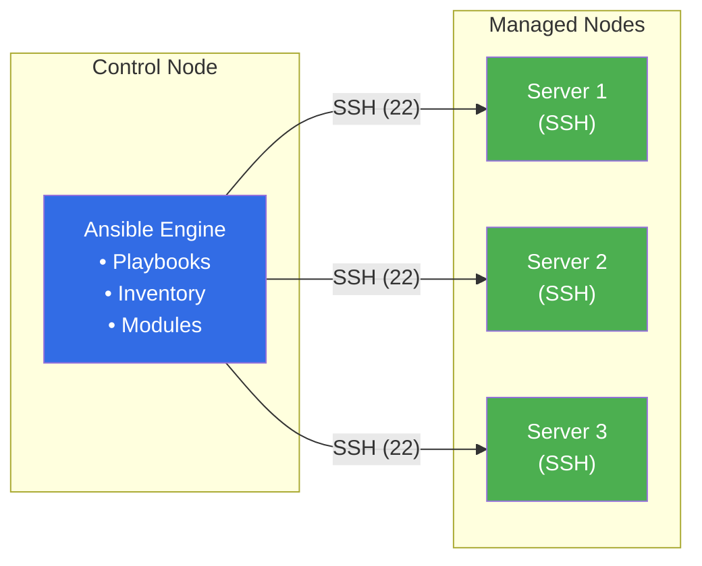
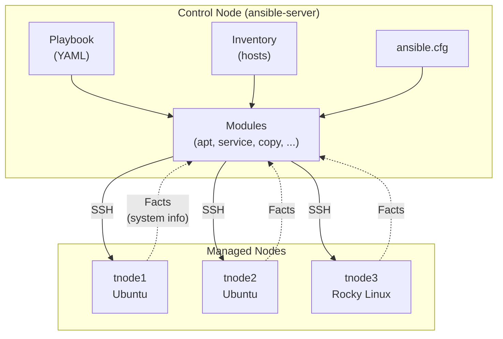
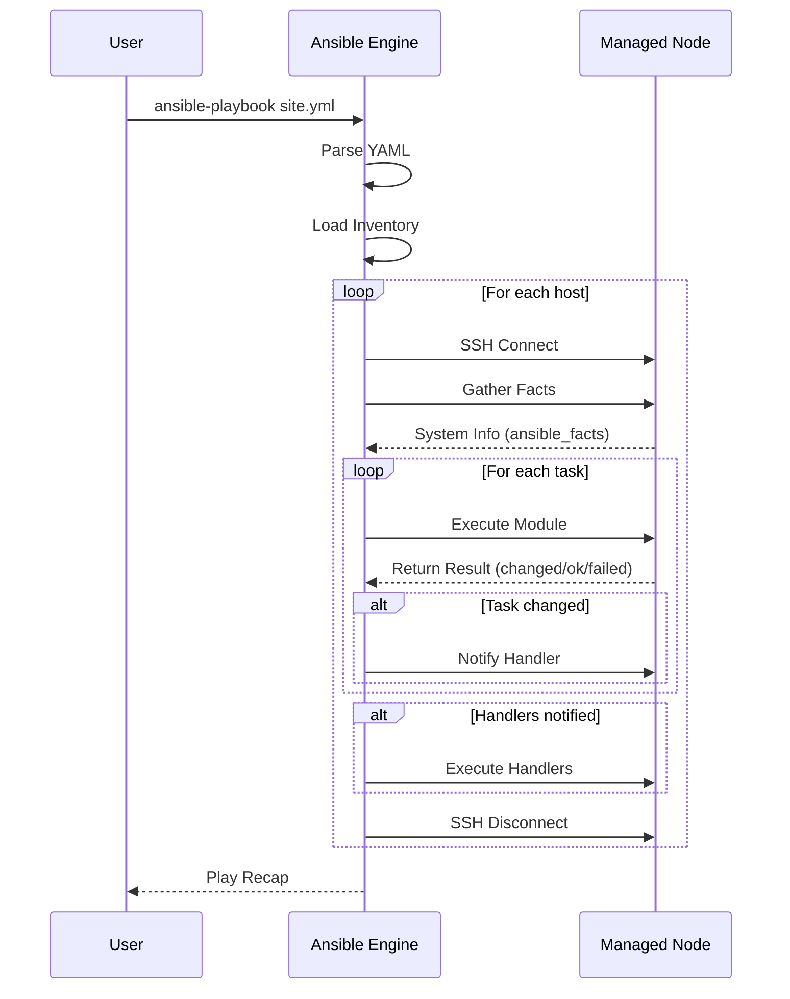
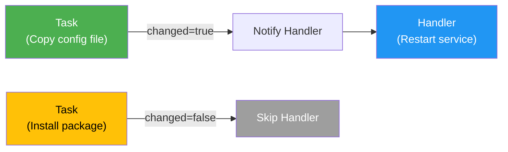
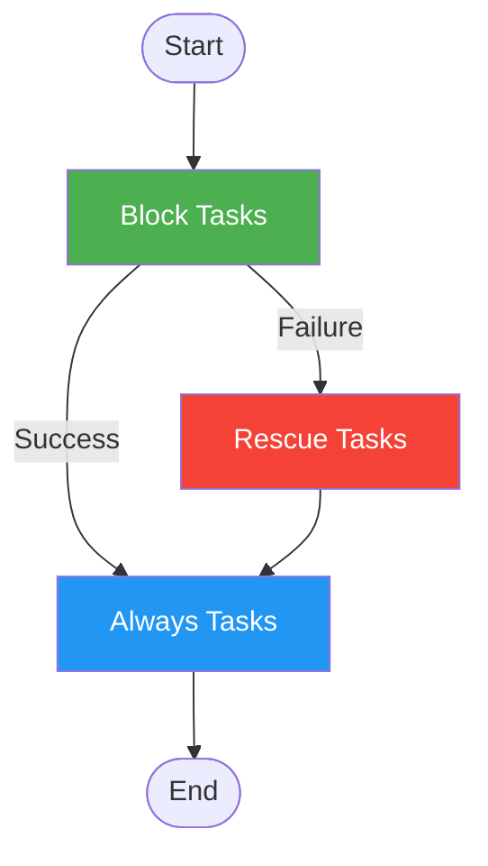
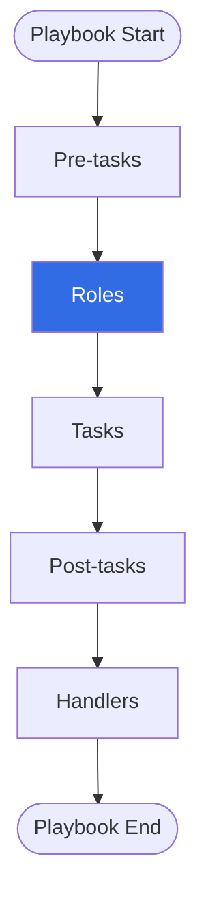
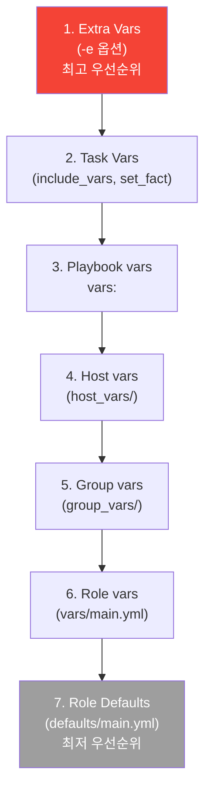

## 주차 소개

**Week 2**에서는 Ansible의 기초를 학습합니다. Ansible은 에이전트리스(Agentless) 아키텍처를 기반으로 SSH를 통해 서버를 관리하는 자동화 도구입니다. 선언적 문법(YAML)과 멱등성(Idempotency)을 통해 안전하고 재사용 가능한 인프라 자동화를 구현할 수 있습니다.

---

## 학습 목표

1. **Ansible 아키텍처 이해**: Control Node와 Managed Node의 관계 파악
2. **Inventory 구성**: 호스트 그룹 관리 및 변수 활용
3. **Playbook 작성**: Tasks, Variables, Facts, Handlers 활용
4. **제어 구조**: 반복문(loop), 조건문(when), 블록(block) 사용
5. **롤(Role) 구조**: 재사용 가능한 플레이북 모듈화

---

## Ansible 개요

### Ansible이란?

Ansible은 **오픈소스 자동화 도구**로, 서버 구성, 애플리케이션 배포, 태스크 자동화를 간편하게 수행할 수 있습니다.

**주요 특징**:
- **Agentless**: Managed Node에 에이전트 설치 불필요 (SSH 기반)
- **Idempotent**: 동일한 플레이북을 여러 번 실행해도 결과가 동일
- **Easy to Use**: YAML 문법으로 선언적 구성
- **Powerful**: 모듈과 플러그인을 통한 확장성



### Ansible vs 다른 도구

| 특징 | Ansible | Chef/Puppet | Terraform |
|------|---------|-------------|-----------|
| **아키텍처** | Agentless (SSH) | Agent 기반 | Agentless (API) |
| **언어** | YAML | Ruby/DSL | HCL |
| **주요 용도** | Configuration Management | Configuration Management | Infrastructure Provisioning |
| **학습 곡선** | 낮음 | 높음 | 중간 |
| **멱등성** | O | O | O |

---

## Ansible 아키텍처

### Control Node vs Managed Node



**Control Node**:
- Ansible이 설치된 관리 서버
- Playbook, Inventory, 설정 파일 보관
- Python 3.8 이상 필요

**Managed Node**:
- Ansible로 관리되는 대상 서버
- SSH 접근만 가능하면 됨
- Python 2.7 또는 3.5 이상 필요 (일부 모듈)

---

## Inventory 구성

### Inventory란?

Inventory는 Ansible이 관리할 호스트 목록을 정의한 파일입니다. 호스트를 그룹으로 묶고, 변수를 할당할 수 있습니다.

### 기본 Inventory 작성

```ini
# /etc/ansible/hosts 또는 ~/my-ansible/inventory

[web]
tnode1 ansible_host=192.168.10.101
tnode2 ansible_host=192.168.10.102

[db]
tnode3 ansible_host=192.168.10.103

[all:vars]
ansible_user=root
ansible_connection=ssh
```

### 그룹별 변수 설정

```ini
[web:vars]
http_port=80
max_clients=200

[db:vars]
db_port=3306
max_connections=100
```

### 계층 구조 (Children)

```ini
[webservers]
web1
web2

[databases]
db1
db2

[production:children]
webservers
databases
```

---

## Playbook 기초

### Playbook 구조

Playbook은 YAML 형식으로 작성되며, 하나 이상의 **Play**로 구성됩니다.

```yaml
---
- name: Install and Start Apache  # Play 이름
  hosts: web                       # 대상 호스트 그룹
  become: yes                      # root 권한 사용

  vars:                            # 변수 정의
    package_name: apache2

  tasks:                           # 실행할 작업 목록
    - name: Install Apache
      ansible.builtin.apt:
        name: "{{ package_name }}"
        state: present

    - name: Start Apache
      ansible.builtin.service:
        name: apache2
        state: started
        enabled: yes
```

### Playbook 실행 흐름



---

## 변수 (Variables)

### 변수 우선순위

Ansible은 다양한 곳에서 변수를 정의할 수 있으며, 우선순위가 있습니다.

**우선순위 (낮음 → 높음)**:
1. Role defaults (`defaults/main.yml`)
2. Inventory group_vars
3. Inventory host_vars
4. Playbook vars
5. Task vars (include_vars, set_fact)
6. Extra vars (`-e` 옵션)

```yaml
---
- hosts: web
  vars:
    app_name: myapp        # Playbook 변수
    app_port: 8080

  tasks:
    - name: Print variables
      ansible.builtin.debug:
        msg: "App {{ app_name }} runs on port {{ app_port }}"
```

### 변수 타입

```yaml
# 문자열
hostname: server1

# 숫자
port: 80

# 불린
enable_https: true

# 리스트
packages:
  - nginx
  - php-fpm
  - mysql-server

# 딕셔너리
user:
  name: ansible
  uid: 1001
  shell: /bin/bash
```

---

## Facts

### Facts란?

Facts는 Ansible이 Managed Node로부터 자동으로 수집하는 **시스템 정보**입니다.

**주요 Facts**:
- `ansible_facts['hostname']`: 호스트명
- `ansible_facts['os_family']`: OS 계열 (Debian, RedHat 등)
- `ansible_facts['distribution']`: 배포판 (Ubuntu, CentOS 등)
- `ansible_facts['distribution_version']`: 버전
- `ansible_facts['default_ipv4']['address']`: IP 주소
- `ansible_facts['memtotal_mb']`: 메모리 용량
- `ansible_facts['processor_cores']`: CPU 코어 수

### Facts 확인

```bash
# 특정 호스트의 모든 Facts 확인
ansible tnode1 -m ansible.builtin.setup

# 특정 Facts 필터링
ansible tnode1 -m ansible.builtin.setup -a "filter=ansible_distribution*"
```

### Facts 사용 예제

```yaml
---
- hosts: all
  tasks:
    - name: Print OS info
      ansible.builtin.debug:
        msg: >-
          OS: {{ ansible_facts['distribution'] }}
          Version: {{ ansible_facts['distribution_version'] }}
          IP: {{ ansible_facts['default_ipv4']['address'] }}
```

### Facts 캐싱

Facts는 매번 수집 시 시간이 소요되므로, 캐싱을 통해 성능을 향상시킬 수 있습니다.

```ini
# ansible.cfg
[defaults]
gathering = smart
fact_caching = jsonfile
fact_caching_connection = ./myfacts
fact_caching_timeout = 86400
```

**Gathering 정책** (DEFAULT_GATHERING):
- **implicit** (기본값): 모든 Play 시작 시 자동으로 Facts 수집
- **explicit**: `gather_facts: yes`로 명시한 경우에만 수집
- **smart**: 캐시가 유효하면 수집 생략, 만료 시에만 수집

### 커스텀 팩트 (Custom Facts)

사용자 정의 팩트를 생성하여 환경 설정이나 조건부 작업에 활용할 수 있습니다.

**생성 방법**:
1. Managed Node의 `/etc/ansible/facts.d/` 디렉터리 생성
2. `*.fact` 파일 생성 (INI, JSON, 또는 실행 가능한 스크립트)

```bash
# Managed Node에서 실행
mkdir -p /etc/ansible/facts.d

# INI 형식 팩트 파일 생성
cat <<EOT > /etc/ansible/facts.d/my-custom.fact
[packages]
web_package = httpd
db_package = mariadb-server

[users]
user1 = ansible
user2 = gasida
EOT
```

**사용 예제**:

```yaml
---
- hosts: all
  tasks:
    - name: Print custom facts
      ansible.builtin.debug:
        var: ansible_local.my-custom
```

**결과**:
```json
{
  "ansible_local": {
    "my-custom": {
      "packages": {
        "web_package": "httpd",
        "db_package": "mariadb-server"
      },
      "users": {
        "user1": "ansible",
        "user2": "gasida"
      }
    }
  }
}
```

---

## 반복문 (Loop)

### 기본 Loop

```yaml
---
- hosts: all
  tasks:
    - name: Install multiple packages
      ansible.builtin.apt:
        name: "{{ item }}"
        state: present
      loop:
        - nginx
        - vim
        - git
```

### 사전 목록 반복

```yaml
---
- hosts: all
  tasks:
    - name: Create log files
      ansible.builtin.file:
        path: "{{ item['log-path'] }}"
        mode: "{{ item['log-mode'] }}"
        state: touch
      loop:
        - log-path: /var/log/app1.log
          log-mode: '0644'
        - log-path: /var/log/app2.log
          log-mode: '0600'
```

### Loop와 Register 변수

```yaml
---
- hosts: localhost
  tasks:
    - name: Echo languages
      ansible.builtin.shell: "echo 'I can speak {{ item }}'"
      loop:
        - Korean
        - English
      register: result

    - name: Print results
      ansible.builtin.debug:
        msg: "{{ item.stdout }}"
      loop: "{{ result.results }}"
```

### 이전 앤서블 스타일 반복문 (Legacy)

Ansible 2.5 이전에는 `with_*` 접두사를 사용한 반복문을 사용했습니다. 현재는 권장되지 않지만, 기존 플레이북 분석 시 알아두면 유용합니다.

**주요 with_ 키워드**:

| 키워드 | 설명 | loop 대체 |
|--------|------|-----------|
| `with_items` | 단순 목록 반복 | `loop` |
| `with_file` | 파일 내용 반복 | `loop` + `lookup('file', ...)` |
| `with_sequence` | 숫자 시퀀스 생성 | `loop` + `range()` |

**예제 (참고용)**:

```yaml
---
# 이전 스타일 (비권장)
- hosts: localhost
  vars:
    users:
      - user0
      - user1
      - user2
  tasks:
    - name: with_items example
      ansible.builtin.debug:
        msg: "{{ item }}"
      with_items: "{{ users }}"

# 현재 권장 스타일
- hosts: localhost
  vars:
    users:
      - user0
      - user1
      - user2
  tasks:
    - name: loop example
      ansible.builtin.debug:
        msg: "{{ item }}"
      loop: "{{ users }}"
```

---

## 조건문 (Conditionals)

### when 기본 사용

```yaml
---
- hosts: all
  vars:
    run_task: true

  tasks:
    - name: This runs when true
      ansible.builtin.debug:
        msg: "Task executed"
      when: run_task
```

### 조건 연산자

| 연산자 | 설명 | 예시 |
|--------|------|------|
| `==` | 같음 | `ansible_facts['distribution'] == "Ubuntu"` |
| `!=` | 같지 않음 | `port != 80` |
| `>`, `>=` | 초과, 이상 | `memory_mb >= 2048` |
| `<`, `<=` | 미만, 이하 | `cpu_cores < 4` |
| `in` | 포함 | `"Ubuntu" in supported_os` |
| `is defined` | 변수 존재 | `my_var is defined` |
| `is not defined` | 변수 미존재 | `my_var is not defined` |

### OS별 분기 처리

```yaml
---
- hosts: all
  tasks:
    - name: Install Apache on Debian
      ansible.builtin.apt:
        name: apache2
        state: present
      when: ansible_facts['os_family'] == "Debian"

    - name: Install Apache on RedHat
      ansible.builtin.dnf:
        name: httpd
        state: present
      when: ansible_facts['os_family'] == "RedHat"
```

### 복합 조건문

```yaml
---
- hosts: all
  tasks:
    - name: Complex condition
      ansible.builtin.debug:
        msg: "This is Ubuntu 24.04"
      when:
        - ansible_facts['distribution'] == "Ubuntu"
        - ansible_facts['distribution_version'] == "24.04"
```

```yaml
# OR 조건
- name: Ubuntu or CentOS
  ansible.builtin.debug:
    msg: "Supported OS"
  when: >
    ansible_facts['distribution'] == "Ubuntu" or
    ansible_facts['distribution'] == "CentOS"
```

---

## 핸들러 (Handlers)

### Handlers란?

Handlers는 **작업이 변경(changed)될 때만 실행되는 특수한 작업**입니다. 주로 서비스 재시작, 설정 리로드에 사용됩니다.



### Handler 예제

```yaml
---
- hosts: web
  tasks:
    - name: Update nginx config
      ansible.builtin.copy:
        src: nginx.conf
        dest: /etc/nginx/nginx.conf
      notify:
        - Restart nginx

    - name: Update index.html
      ansible.builtin.copy:
        src: index.html
        dest: /var/www/html/index.html
      notify:
        - Reload nginx

  handlers:
    - name: Restart nginx
      ansible.builtin.service:
        name: nginx
        state: restarted

    - name: Reload nginx
      ansible.builtin.service:
        name: nginx
        state: reloaded
```

**특징**:
- 모든 Task 실행 후 마지막에 실행
- 여러 번 notify되어도 **1번만 실행**
- Task가 failed되면 Handler 실행 안 됨 (단, `force_handlers: yes` 사용 시 예외)

---

## 에러 처리

### ignore_errors

작업 실패를 무시하고 계속 진행합니다.

```yaml
---
- hosts: all
  tasks:
    - name: This might fail
      ansible.builtin.command: /bin/false
      ignore_errors: yes

    - name: This will run anyway
      ansible.builtin.debug:
        msg: "Previous task failed but ignored"
```

### force_handlers

작업 실패 시에도 notify된 Handler를 실행합니다.

```yaml
---
- hosts: web
  force_handlers: yes

  tasks:
    - name: Update config
      ansible.builtin.copy:
        src: app.conf
        dest: /etc/app/app.conf
      notify:
        - Restart app

    - name: This task might fail
      ansible.builtin.command: /bin/false

  handlers:
    - name: Restart app
      ansible.builtin.service:
        name: app
        state: restarted
```

### Block, Rescue, Always

`try-catch-finally`와 유사한 에러 처리 구조입니다.

```yaml
---
- hosts: all
  tasks:
    - name: Error handling example
      block:
        - name: Try to do something
          ansible.builtin.command: /bin/might_fail

        - name: Another task
          ansible.builtin.debug:
            msg: "This runs if previous succeeded"

      rescue:
        - name: Handle error
          ansible.builtin.debug:
            msg: "An error occurred, handling it"

      always:
        - name: Cleanup
          ansible.builtin.debug:
            msg: "This always runs"
```



---

## 롤 (Roles)

### 롤이란?

Role은 **플레이북을 기능 단위로 모듈화하여 재사용 가능하게 만드는 구조**입니다.

**장점**:
- 코드 재사용성 향상
- 구조화된 디렉터리 구조
- Ansible Galaxy를 통한 공유
- 대규모 프로젝트 관리 용이

### 롤 디렉터리 구조

```
my-role/
├── defaults/          # 기본 변수 (낮은 우선순위)
│   └── main.yml
├── files/             # 정적 파일
│   └── index.html
├── handlers/          # 핸들러
│   └── main.yml
├── meta/              # 롤 메타데이터
│   └── main.yml
├── tasks/             # 메인 작업
│   └── main.yml
├── templates/         # Jinja2 템플릿
│   └── config.j2
├── tests/             # 테스트
│   ├── inventory
│   └── test.yml
└── vars/              # 변수 (높은 우선순위)
    └── main.yml
```

### 롤 생성

```bash
# 롤 생성
ansible-galaxy role init my-role

# 롤 구조 확인
tree my-role/
```

### 롤 작성 예제

#### tasks/main.yml

```yaml
---
# tasks file for my-role
- name: Install Apache
  ansible.builtin.apt:
    name: "{{ item }}"
    state: latest
  loop: "{{ httpd_packages }}"
  when: ansible_facts['distribution'] in supported_distros

- name: Copy index.html
  ansible.builtin.copy:
    src: "{{ src_file_path }}"
    dest: "{{ dest_file_path }}"
  notify:
    - Restart Apache
```

#### handlers/main.yml

```yaml
---
# handlers file for my-role
- name: Restart Apache
  ansible.builtin.service:
    name: "{{ service_name }}"
    state: restarted
```

#### vars/main.yml

```yaml
---
# vars file for my-role
service_name: apache2
src_file_path: ../files/index.html
dest_file_path: /var/www/html
httpd_packages:
  - apache2
  - apache2-doc
supported_distros:
  - Ubuntu
```

#### defaults/main.yml

```yaml
---
# defaults file for my-role
service_title: "Apache Web Server"
```

### 롤 사용하기

#### import_role (정적)

```yaml
---
- hosts: web
  tasks:
    - name: Install web server
      ansible.builtin.import_role:
        name: my-role
```

#### include_role (동적)

```yaml
---
- hosts: web
  tasks:
    - name: Install web server
      ansible.builtin.include_role:
        name: my-role
      when: install_web is defined
```

#### roles 섹션

```yaml
---
- hosts: web
  roles:
    - my-role
    - my-role2

  tasks:
    - name: Additional task
      ansible.builtin.debug:
        msg: "Roles executed"
```

### 롤 실행 순서



---

## 주요 모듈

### 패키지 관리

```yaml
# apt (Debian/Ubuntu)
- name: Install nginx
  ansible.builtin.apt:
    name: nginx
    state: present
    update_cache: yes

# dnf (RedHat/Rocky/CentOS)
- name: Install httpd
  ansible.builtin.dnf:
    name: httpd
    state: latest
```

### 서비스 관리

```yaml
- name: Start and enable nginx
  ansible.builtin.service:
    name: nginx
    state: started
    enabled: yes
```

### 파일 관리

```yaml
# 파일 복사
- name: Copy file
  ansible.builtin.copy:
    src: /local/file
    dest: /remote/file
    mode: '0644'

# 파일 생성/수정
- name: Create file
  ansible.builtin.file:
    path: /tmp/test.txt
    state: touch
    mode: '0755'

# 템플릿 (Jinja2)
- name: Deploy config
  ansible.builtin.template:
    src: config.j2
    dest: /etc/app/config.conf
```

### 명령 실행

```yaml
# command (셸 기능 미사용)
- name: Run command
  ansible.builtin.command:
    cmd: ls -la /tmp

# shell (셸 기능 사용)
- name: Run shell
  ansible.builtin.shell:
    cmd: ps aux | grep nginx
```

---

## 실습 환경

### 가상머신 구성

| 호스트명 | IP | 역할 | OS |
|---------|-----|------|-----|
| ansible-server | 192.168.10.10 | Control Node | Ubuntu |
| tnode1 | 192.168.10.101 | Managed Node | Ubuntu 24.04 |
| tnode2 | 192.168.10.102 | Managed Node | Ubuntu 24.04 |
| tnode3 | 192.168.10.103 | Managed Node | Rocky Linux 9.6 |

### 주요 설정 파일

```ini
# ansible.cfg
[defaults]
inventory = ./inventory
remote_user = root
ask_pass = false
gathering = smart
fact_caching = jsonfile
fact_caching_connection = myfacts

[privilege_escalation]
become = true
become_method = sudo
become_user = root
become_ask_pass = false
```

---

## 모듈별 반환 값 (Return Values)

Ansible 모듈은 작업 실행 후 다양한 정보를 반환합니다.

| Return Value | 설명 |
|--------------|------|
| `changed` | 시스템 상태가 변경되었는지 (true/false) |
| `failed` | 작업 실패 여부 (true/false) |
| `msg` | 사용자 메시지 |
| `rc` | 명령 반환 코드 (0=성공) - 아래 상세 참조 |
| `stdout` | 표준 출력 |
| `stderr` | 표준 에러 |
| `stdout_lines` | 표준 출력 (라인별 배열) |
| `stderr_lines` | 표준 에러 (라인별 배열) |

### 반환 코드 (rc) 상세

| 반환 코드 | 의미 |
|-----------|------|
| 0 | 성공 |
| 1 | 일반 오류 |
| 2 | 잘못된 인자 |
| 126 | 실행 권한 없음 |
| 127 | 명령 없음 (Command not found) |
| 130 | Ctrl+C로 종료 |
| 137 | SIGKILL (강제 종료) |
| 139 | Segmentation fault |

```bash
# 반환 코드 확인 방법
echo $?  # 직전 명령의 반환 코드

# 예시
ls -al    # 성공
echo $?   # 0

ls abc    # 파일 없음
echo $?   # 2

aaa       # 명령 없음
echo $?   # 127
```

```yaml
---
- hosts: localhost
  tasks:
    - name: Run command
      ansible.builtin.shell: echo "Hello"
      register: result

    - name: Show result
      ansible.builtin.debug:
        msg: |
          Changed: {{ result.changed }}
          RC: {{ result.rc }}
          Stdout: {{ result.stdout }}
```

---

## 변수 우선순위 전체



---

## Ansible 명령어 정리

### Ad-hoc 명령

```bash
# Ping 테스트
ansible all -m ping

# 명령 실행
ansible all -m shell -a "uptime"

# Facts 확인
ansible tnode1 -m ansible.builtin.setup

# 패키지 설치
ansible web -m ansible.builtin.apt -a "name=nginx state=present" -b
```

### Playbook 실행

```bash
# 기본 실행
ansible-playbook site.yml

# Dry-run (체크 모드)
ansible-playbook site.yml --check

# 특정 호스트만
ansible-playbook site.yml --limit tnode1

# Extra vars 전달
ansible-playbook site.yml -e "env=production"

# Verbose 모드
ansible-playbook site.yml -vvv
```

### Ansible Galaxy

```bash
# 롤 생성
ansible-galaxy role init my-role

# 롤 검색
ansible-galaxy role search apache

# 롤 설치
ansible-galaxy role install geerlingguy.nginx

# 롤 목록
ansible-galaxy role list
```

---

## 실습 과제

### 도전과제 1: 반복문
Linux 사용자 user1~user10 (10명)을 반복문으로 생성 후 확인하고 삭제하기

### 도전과제 2: Loop + Sequence
`/var/log/test1` ~ `/var/log/test100` 100개 파일을 생성하고 삭제하기

### 도전과제 3: Facts
3개 서버의 '커널 버전'과 '운영체제 종류'를 출력하기

### 도전과제 4: 조건문
Ubuntu OS이면서 FQDN이 tnode1인 경우, OS 정보와 FQDN 출력하기

### 도전과제 5: Handlers
Apache2 패키지를 apt 모듈로 설치 시, Handler를 호출하여 재시작하기

### 도전과제 6: Block
block, rescue, always 키워드를 사용한 플레이북 작성하기

---

## Best Practices

### 1. 멱등성 유지
- 모듈 사용 시 `state: present/absent` 명시
- shell/command 대신 전용 모듈 사용 (apt, service 등)

### 2. 변수 네이밍
```yaml
# Good
web_server_port: 80
db_max_connections: 100

# Bad
port: 80
max: 100
```

### 3. 롤 구조화
```
roles/
├── common/
├── webserver/
├── database/
└── monitoring/
```

### 4. Vault로 민감 정보 암호화
```bash
# Vault 생성
ansible-vault create secrets.yml

# Vault 편집
ansible-vault edit secrets.yml

# Playbook 실행 시 Vault 비밀번호 입력
ansible-playbook site.yml --ask-vault-pass
```

### 5. Tags 활용
```yaml
- name: Install packages
  ansible.builtin.apt:
    name: nginx
  tags:
    - packages
    - nginx

- name: Configure firewall
  ansible.posix.firewalld:
    service: http
    state: enabled
  tags:
    - firewall
```

```bash
# 특정 tag만 실행
ansible-playbook site.yml --tags nginx

# 특정 tag 제외
ansible-playbook site.yml --skip-tags firewall
```

---

## 참고 자료

- [Ansible 공식 문서](https://docs.ansible.com/)
- [Ansible Galaxy](https://galaxy.ansible.com/)
- [Ansible Modules Index](https://docs.ansible.com/ansible/latest/collections/index_module.html)
- [Best Practices](https://docs.ansible.com/ansible/latest/tips_tricks/ansible_tips_tricks.html)
- [YAML Syntax](https://docs.ansible.com/ansible/latest/reference_appendices/YAMLSyntax.html)

---

**작성일**: 2026-01-17
**카테고리**: Kubernetes 운영 스터디 (K8s-Deploy)
**주차**: Week 2
