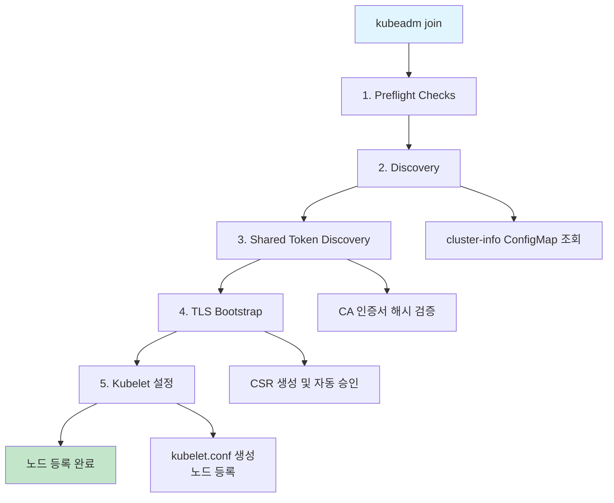
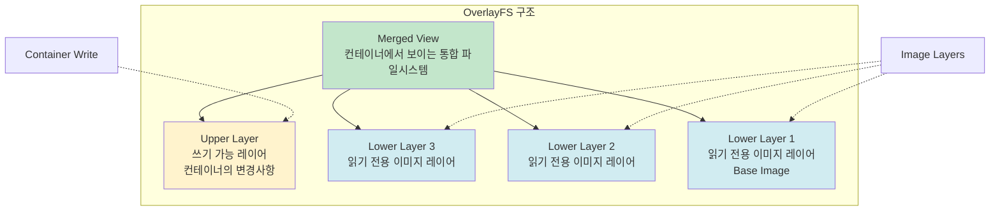
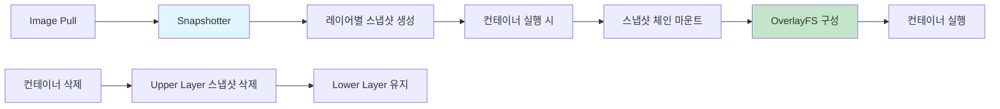
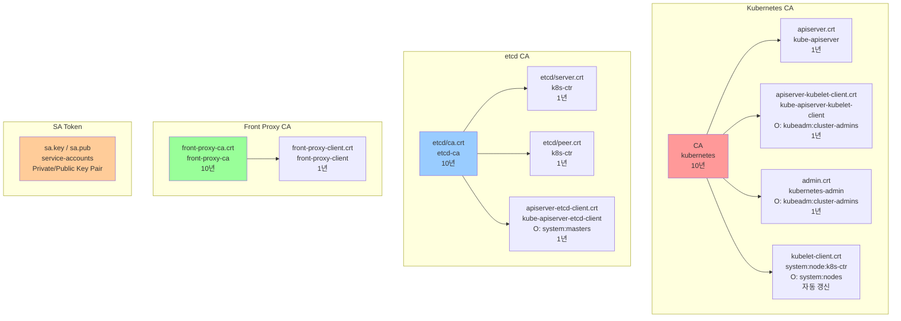
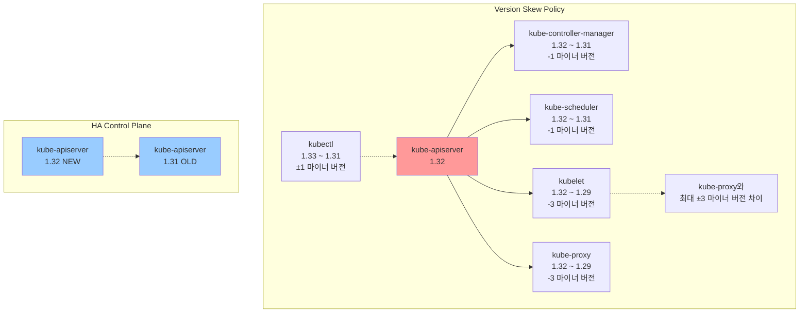
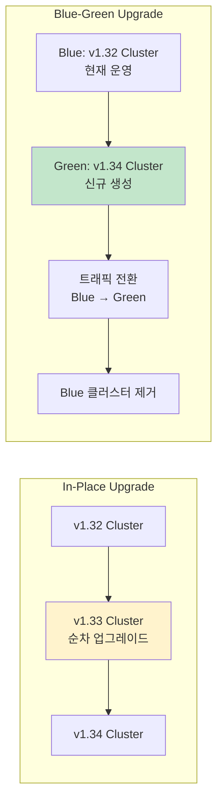
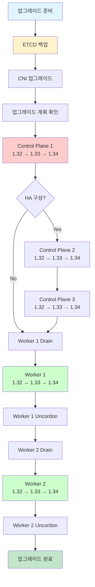

## 들어가며

Week 3에서는 **kubeadm**을 사용하여 Kubernetes 클러스터를 구축하고, 클러스터의 버전을 업그레이드하는 방법을 학습합니다.

Week 1에서 "The Hard Way"로 모든 컴포넌트를 수동 설치하며 K8s의 내부 동작을 이해했다면, 이번 주차에서는 프로덕션 환경에서 실제로 사용되는 kubeadm 도구를 통해 효율적인 클러스터 운영 방법을 익힙니다.

### 학습 목표

- kubeadm의 동작 원리 이해
- kubeadm을 사용한 클러스터 구축 실습
- 인증서 생성 및 관리 방법 학습
- Kubernetes 버전 업그레이드 전략 및 실습
- 프로덕션 환경을 위한 모니터링 설정

---

## 실습 환경

### 가상머신 구성

| 호스트명 | IP | 역할 | vCPU | Memory | OS |
|---------|-----|------|------|--------|-----|
| k8s-ctr | 192.168.10.100 | Control Plane | 4 | 3GB | Rocky Linux 10.0 |
| k8s-w1 | 192.168.10.101 | Worker | 2 | 2GB | Rocky Linux 10.0 |
| k8s-w2 | 192.168.10.102 | Worker | 2 | 2GB | Rocky Linux 10.0 |

### 네트워크 설정

- **Pod CIDR**: 10.244.0.0/16
- **Service CIDR**: 10.96.0.0/16
- **CNI**: Flannel v0.27.3 (VXLAN)

### 컴포넌트 버전

- **OS**: Rocky Linux 10.0 (Kernel 6.12)
- **Container Runtime**: containerd v2.1.5
- **Runc**: v1.3.3
- **Kubernetes**: v1.32.11
- **Helm**: v3.18.6

---

## Kubeadm Deep Dive

### Kubeadm이란?

**kubeadm**은 Kubernetes Cluster Lifecycle 프로젝트의 핵심 도구로, 클러스터의 생성부터 업그레이드, 관리까지 전체 라이프사이클을 담당합니다.

#### 주요 기능

- `kubeadm init`: Control Plane 노드 초기화
- `kubeadm join`: Worker 노드를 클러스터에 참여시킴
- `kubeadm upgrade`: 클러스터 버전 업그레이드
- `kubeadm reset`: kubeadm init/join으로 만든 변경사항 되돌리기

#### Kubeadm의 특징

1. **Control Plane as Static Pod**: Control Plane 컴포넌트를 Static Pod로 구성
2. **사전 설치 필요**: CRI(containerd)와 kubelet은 별도로 설치 필요
3. **광범위한 활용**: minikube, kind, ClusterAPI, kubespray 등에서 사용

#### Kubeadm이 배포하는 컴포넌트

**Static Pod로 배포**:
- etcd
- kube-apiserver
- kube-controller-manager
- kube-scheduler

**애드온으로 배포**:
- CoreDNS (Deployment)
- kube-proxy (DaemonSet)

---

## Kubeadm 실행 흐름

### Kubeadm Init 실행 단계

```mermaid
flowchart TD
    A[kubeadm init] --> B[1. Preflight Checks]
    B --> C[2. 인증서 생성]
    C --> D[3. Kubeconfig 생성]
    D --> E[4. Static Pod 매니페스트 생성]
    E --> F[5. Kubelet 시작 및 대기]
    F --> G[6. ClusterConfiguration 저장]
    G --> H[7. 노드 라벨링/태인트]
    H --> I[8. Bootstrap 토큰 생성]
    I --> J[9. 필수 애드온 설치]
    J --> K[클러스터 준비 완료]

    C --> C1[/etc/kubernetes/pki/]
    D --> D1[/etc/kubernetes/*.conf]
    E --> E1[/etc/kubernetes/manifests/]
    G --> G1[ConfigMap: kubeadm-config]
    H --> H1[control-plane 라벨<br/>NoSchedule 태인트]
    I --> I1[TLS Bootstrap 설정]
    J --> J1[CoreDNS<br/>kube-proxy]

    style A fill:#e1f5ff
    style K fill:#c3e6cb
```

#### 1. Preflight Checks

클러스터 구축 전 사전 점검:
- CRI(containerd) 연결 확인
- Root 권한 확인
- kubelet 버전 확인
- 필수 포트 사용 가능 여부
- 커널 모듈 및 파라미터 확인

#### 2. 인증서 생성

`/etc/kubernetes/pki/` 디렉터리에 다음 인증서들을 생성:

| 인증서 | 유효기간 | 용도 |
|--------|----------|------|
| ca.crt/ca.key | 10년 | Root CA |
| etcd/ca.crt/ca.key | 10년 | etcd CA |
| apiserver.crt | 1년 | API Server TLS |
| apiserver-kubelet-client.crt | 1년 | API → Kubelet 통신 |
| front-proxy-ca.crt | 10년 | Aggregation Layer CA |
| sa.key/sa.pub | - | Service Account 토큰 서명 |

#### 3. Kubeconfig 파일 생성

`/etc/kubernetes/` 디렉터리에 각 컴포넌트용 kubeconfig 생성:
- admin.conf (kubectl용)
- kubelet.conf
- controller-manager.conf
- scheduler.conf

#### 4. Static Pod 매니페스트 생성

`/etc/kubernetes/manifests/` 디렉터리에 Control Plane 컴포넌트 매니페스트 생성:
- etcd.yaml
- kube-apiserver.yaml
- kube-controller-manager.yaml
- kube-scheduler.yaml

#### 5. Kubelet 시작 및 API Server 헬스 체크 대기

kubelet이 Static Pod를 실행하고, API Server가 정상 동작할 때까지 대기합니다.

#### 6. ClusterConfiguration 저장

ConfigMap에 클러스터 설정 정보 저장:
- `kube-system/kubeadm-config`: 클러스터 설정
- `kube-system/kubelet-config`: kubelet 설정

#### 7. 노드 라벨링 및 태인트 설정

Control Plane 노드에 다음 설정 적용:
- 라벨: `node-role.kubernetes.io/control-plane=""`
- 태인트: `node-role.kubernetes.io/control-plane:NoSchedule`

#### 8. Bootstrap 토큰 생성

Worker 노드가 클러스터에 참여할 수 있도록 TLS Bootstrap 설정:
- Bootstrap 토큰 생성 (24시간 유효)
- RBAC 설정 (system:bootstrappers 그룹)

#### 9. 필수 애드온 설치

- **CoreDNS**: 클러스터 내부 DNS
- **kube-proxy**: 서비스 네트워킹

---

### Kubeadm Join 실행 단계



#### 1. Discovery 단계

Control Plane의 cluster-info ConfigMap을 조회하여 API Server 정보를 가져옵니다.

**Shared Token Discovery** 방식:
```bash
kubeadm join 192.168.10.100:6443 \
  --token abcdef.0123456789abcdef \
  --discovery-token-ca-cert-hash sha256:1234...
```

CA 인증서 해시를 검증하여 중간자 공격(MITM)을 방지합니다.

#### 2. TLS Bootstrap

kubelet이 자신의 인증서를 자동으로 발급받는 과정:

1. Bootstrap 토큰으로 CSR(Certificate Signing Request) 생성
2. API Server에 CSR 제출
3. kube-controller-manager가 자동으로 승인
4. 인증서 발급 및 kubelet.conf 생성

---

## 클러스터 구축 절차

### 1. 사전 설정 (모든 노드)

#### Time/NTP 설정

```bash
# KST 타임존 설정
timedatectl set-timezone Asia/Seoul

# Chrony NTP 설정
systemctl enable --now chronyd
```

#### SELinux 설정

```bash
# Permissive 모드로 변경
setenforce 0
sed -i 's/^SELINUX=enforcing$/SELINUX=permissive/' /etc/selinux/config
```

#### Firewalld 비활성화

```bash
systemctl disable --now firewalld
```

#### Swap 완전 비활성화

```bash
# 즉시 비활성화
swapoff -a

# 영구 비활성화
sed -i '/ swap / s/^\(.*\)$/#\1/g' /etc/fstab

# zram swap 비활성화
systemctl disable --now zram-swap.service
```

**Swap 비활성화 이유**:
1. **리소스 예측 불가능**: Pod가 메모리를 초과해도 죽지 않고 디스크를 사용하게 됨
2. **K8s 관리 철학 위배**: 메모리 부족 시 즉시 OOMKilled 후 재시작하는 것이 K8s 철학
3. **클러스터 성능 저하**: 스케줄링 판단에 오류 발생 가능

#### 커널 모듈 로드

```bash
cat <<EOF | tee /etc/modules-load.d/k8s.conf
overlay
br_netfilter
EOF

modprobe overlay
modprobe br_netfilter
```

**overlay**: OverlayFS 파일시스템 사용
**br_netfilter**: 브리지 네트워크 패킷 필터링 (iptables)

#### 커널 파라미터 설정

```bash
cat <<EOF | tee /etc/sysctl.d/k8s.conf
net.bridge.bridge-nf-call-iptables  = 1
net.bridge.bridge-nf-call-ip6tables = 1
net.ipv4.ip_forward                 = 1
EOF

sysctl --system
```

#### hosts 파일 설정

```bash
cat <<EOF >> /etc/hosts
192.168.10.100 k8s-ctr
192.168.10.101 k8s-w1
192.168.10.102 k8s-w2
EOF
```

---

### 2. Container Runtime 설치 (Containerd)

#### Docker CE Repository 추가

```bash
dnf config-manager --add-repo \
  https://download.docker.com/linux/centos/docker-ce.repo
```

#### Containerd 설치

```bash
dnf install -y containerd.io-2.1.5
```

#### Containerd 설정

```bash
# 기본 설정 파일 생성
mkdir -p /etc/containerd
containerd config default > /etc/containerd/config.toml

# SystemdCgroup 설정 변경 (매우 중요!)
sed -i 's/SystemdCgroup = false/SystemdCgroup = true/' \
  /etc/containerd/config.toml

# Containerd 시작
systemctl enable --now containerd

# Snapshotter 확인
ctr plugin ls | grep overlayfs
```

**SystemdCgroup 설정의 중요성**:
- kubelet과 containerd가 **동일한 cgroup driver**를 사용해야 함
- systemd init 시스템 사용 시 systemd cgroup 권장
- **cgroup v2 사용 시 필수**

---

### 3. Kubeadm, Kubelet, Kubectl 설치

#### Kubernetes Repository 추가

```bash
cat <<EOF | tee /etc/yum.repos.d/kubernetes.repo
[kubernetes]
name=Kubernetes
baseurl=https://pkgs.k8s.io/core:/stable:/v1.32/rpm/
enabled=1
gpgcheck=1
gpgkey=https://pkgs.k8s.io/core:/stable:/v1.32/rpm/repodata/repomd.xml.key
exclude=kubelet kubeadm kubectl cri-tools kubernetes-cni
EOF
```

**exclude 설정 이유**: 자동 업그레이드 방지 (명시적 버전 관리)

#### 설치

```bash
dnf install -y kubelet-1.32.11 kubeadm-1.32.11 kubectl-1.32.11 \
  --disableexcludes=kubernetes

systemctl enable --now kubelet
```

#### crictl 설정

```bash
cat <<EOF > /etc/crictl.yaml
runtime-endpoint: unix:///run/containerd/containerd.sock
image-endpoint: unix:///run/containerd/containerd.sock
timeout: 10
EOF
```

---

### 4. Control Plane 초기화 (k8s-ctr)

```bash
kubeadm init \
  --pod-network-cidr=10.244.0.0/16 \
  --service-cidr=10.96.0.0/16 \
  --apiserver-advertise-address=192.168.10.100
```

#### kubectl 설정

```bash
mkdir -p $HOME/.kube
cp -i /etc/kubernetes/admin.conf $HOME/.kube/config
chown $(id -u):$(id -g) $HOME/.kube/config
```

#### CNI 설치 (Flannel)

```bash
kubectl apply -f \
  https://github.com/flannel-io/flannel/releases/download/v0.27.3/kube-flannel.yml
```

---

### 5. Worker 노드 참여 (k8s-w1, k8s-w2)

Control Plane 초기화 후 출력된 join 명령어를 각 Worker 노드에서 실행:

```bash
kubeadm join 192.168.10.100:6443 \
  --token abcdef.0123456789abcdef \
  --discovery-token-ca-cert-hash sha256:1234...
```

#### 클러스터 확인

```bash
kubectl get nodes
```

---

## OverlayFS와 Snapshotter

### OverlayFS란?

**OverlayFS**는 여러 파일시스템 레이어를 하나로 겹쳐 보이게 하는 Union Filesystem 기술입니다.



**장점**:
- 디스크 공간 절약: 이미지 레이어 공유
- 빠른 컨테이너 시작: 레이어 재사용

**동작 방식**:
- **Lower Layer**: 읽기 전용 이미지 레이어 (여러 개 가능)
- **Upper Layer**: 쓰기 가능한 컨테이너 레이어
- **Merged View**: 사용자에게 보이는 통합된 파일시스템

### Snapshotter란?

**Snapshotter**는 컨테이너 이미지 레이어를 스냅샷 단위로 관리하는 컴포넌트입니다.



**Snapshotter 종류**:
- **overlayfs** (기본, 권장): OverlayFS 기반
- native: 심플한 디렉터리 복사
- btrfs: Btrfs 파일시스템 스냅샷
- zfs: ZFS 파일시스템 스냅샷
- devmapper: Device Mapper thin provisioning

**동작 시점**:
1. 이미지 pull 시: 레이어별 스냅샷 생성
2. 컨테이너 실행 시: 스냅샷 체인을 OverlayFS로 마운트
3. 컨테이너 삭제 시: Upper Layer 스냅샷만 삭제 (Lower Layer 유지)

---

## 인증서 관리

### 생성되는 인증서 목록

kubeadm init 시 `/etc/kubernetes/pki/` 디렉터리에 다음 인증서들이 생성됩니다:

| 인증서 | CN | O | 유효기간 | 용도 |
|--------|----|----|----------|------|
| ca.crt | kubernetes | - | 10년 | Root CA |
| etcd/ca.crt | etcd-ca | - | 10년 | etcd CA |
| apiserver.crt | kube-apiserver | - | 1년 | TLS Web Server |
| apiserver-kubelet-client.crt | kube-apiserver-kubelet-client | kubeadm:cluster-admins | 1년 | TLS Web Client |
| apiserver-etcd-client.crt | kube-apiserver-etcd-client | system:masters | 1년 | etcd 클라이언트 |
| front-proxy-ca.crt | front-proxy-ca | - | 10년 | Aggregation Layer CA |
| front-proxy-client.crt | front-proxy-client | - | 1년 | Aggregation Layer |
| sa.key / sa.pub | service-accounts | - | - | SA 토큰 서명 |

#### Kubelet 인증서

**Server 인증서** (TLS Web Server):
- CN: `<nodename>@<timestamp>`
- 유효기간: 1년
- 위치: `/var/lib/kubelet/pki/kubelet-server-*.crt`

**Client 인증서** (TLS Web Client):
- CN: `system:node:<nodename>`
- O: `system:nodes`
- 유효기간: 1년
- **자동 갱신**: kubelet이 만료 전 자동으로 갱신

---

### 인증서 확인

```bash
# 모든 인증서 만료일 확인
kubeadm certs check-expiration

# 특정 인증서 상세 확인
openssl x509 -in /etc/kubernetes/pki/apiserver.crt -text -noout
```

---

### 인증서 갱신 (Manual Renewal)

#### 갱신 명령어

```bash
# 특정 인증서 갱신
kubeadm certs renew apiserver

# 모든 인증서 갱신
kubeadm certs renew all
```

#### 갱신 영향도

**다운타임**:
- K8s API 요청: 수초~수십 초 중단
- kubectl: 일시적 실패 가능
- 워크로드: 영향 없음 (Pod는 계속 실행)

**재시작 필요**:
- Static Pod 재시작 필수 (새 인증서 로드)
- admin.conf kubeconfig 재적용 필요

**주의사항**:
- **CA는 갱신되지 않음** (10년 유효, 만료 시 클러스터 재구축 필요)
- HA 환경에서는 모든 Control Plane 노드에서 실행
- **kubelet 인증서는 자동 갱신**되므로 수동 갱신 불필요

#### Static Pod 재시작

```bash
# Static Pod 매니페스트 touch (자동 재시작)
touch /etc/kubernetes/manifests/kube-apiserver.yaml
touch /etc/kubernetes/manifests/kube-controller-manager.yaml
touch /etc/kubernetes/manifests/kube-scheduler.yaml

# 또는 kubelet 재시작
systemctl restart kubelet
```

#### admin.conf 재적용

```bash
cp -i /etc/kubernetes/admin.conf $HOME/.kube/config
```

---

### 인증서 체인 구조



---

## 모니터링 설정

### Metrics Server 설치

**Metrics Server**는 kubelet으로부터 메트릭을 수집하여 `kubectl top` 명령어를 사용할 수 있게 합니다.

```bash
helm repo add metrics-server https://kubernetes-sigs.github.io/metrics-server/

helm install metrics-server metrics-server/metrics-server \
  --set 'args[0]=--kubelet-insecure-tls' \
  -n kube-system
```

**`--kubelet-insecure-tls` 옵션**:
- kubelet의 서버 인증서를 검증하지 않음
- 테스트 환경에서 사용 (프로덕션에서는 적절한 인증서 설정 필요)

#### 확인

```bash
kubectl top nodes
kubectl top pods -A
```

---

### Kube-Prometheus-Stack 설치

**Kube-Prometheus-Stack**은 Prometheus, Grafana, Alertmanager를 포함한 완전한 모니터링 솔루션입니다.

```bash
helm repo add prometheus-community \
  https://prometheus-community.github.io/helm-charts

helm install kube-prometheus-stack \
  prometheus-community/kube-prometheus-stack \
  -n monitoring --create-namespace \
  --set prometheus.service.type=NodePort \
  --set prometheus.service.nodePort=30001 \
  --set grafana.service.type=NodePort \
  --set grafana.service.nodePort=30002
```

#### 접속 정보

- **Prometheus**: http://192.168.10.100:30001
- **Grafana**: http://192.168.10.100:30002
  - 사용자: admin
  - 비밀번호: prom-operator

#### 권장 Grafana 대시보드

- **15661**: Kubernetes Cluster Monitoring (Prometheus)
- **15757**: Kubernetes / Views / Global
- **13922**: x509 Certificate Exporter (인증서 만료 모니터링)

---

### Control Plane 메트릭 수집 설정

기본적으로 kube-controller-manager와 kube-scheduler는 localhost에서만 메트릭을 제공합니다. Prometheus가 수집할 수 있도록 bind-address를 변경합니다.

#### kube-controller-manager 설정

```bash
vi /etc/kubernetes/manifests/kube-controller-manager.yaml
```

```yaml
spec:
  containers:
  - command:
    - kube-controller-manager
    - --bind-address=0.0.0.0  # 127.0.0.1 → 0.0.0.0
```

#### kube-scheduler 설정

```bash
vi /etc/kubernetes/manifests/kube-scheduler.yaml
```

```yaml
spec:
  containers:
  - command:
    - kube-scheduler
    - --bind-address=0.0.0.0  # 127.0.0.1 → 0.0.0.0
```

#### etcd 메트릭 설정

```bash
vi /etc/kubernetes/manifests/etcd.yaml
```

```yaml
spec:
  containers:
  - command:
    - etcd
    - --listen-metrics-urls=http://127.0.0.1:2381,http://192.168.10.100:2381
```

#### 확인

```bash
# kube-controller-manager 메트릭
curl http://192.168.10.100:10257/metrics

# kube-scheduler 메트릭
curl http://192.168.10.100:10259/metrics

# etcd 메트릭
curl http://192.168.10.100:2381/metrics
```

---

### x509 Certificate Exporter 설치

인증서 만료를 모니터링하는 Prometheus Exporter입니다.

```bash
helm repo add enix https://charts.enix.io

helm install x509-certificate-exporter enix/x509-certificate-exporter \
  -n monitoring \
  --set hostPathsExporter.daemonSets.cp.nodeSelector."node-role\.kubernetes\.io/control-plane"="" \
  --set hostPathsExporter.daemonSets.cp.tolerations[0].effect=NoSchedule \
  --set hostPathsExporter.daemonSets.cp.tolerations[0].key=node-role.kubernetes.io/control-plane \
  --set hostPathsExporter.daemonSets.cp.watchDirectories={/etc/kubernetes/pki} \
  --set hostPathsExporter.daemonSets.nodes.watchDirectories={/var/lib/kubelet/pki}
```

**DaemonSet 2종류**:
- **cp**: Control Plane 노드 (`/etc/kubernetes/pki`)
- **nodes**: Worker 노드 (`/var/lib/kubelet/pki`)

#### Grafana 대시보드 13922

- **경고 레벨**:
  - Warning: 28일 이하
  - Critical: 14일 이하

---

## Kubernetes Version Skew Policy

### 버전 정책

Kubernetes는 **1년에 3개의 마이너 버전**을 출시하며, **최근 3개 버전**을 지원합니다.

- 현재 지원 버전 (예시): 1.35, 1.34, 1.33
- 버전 형식: **메이저.마이너.패치** (예: 1.32.11)

### 컴포넌트별 버전 호환성



#### kube-apiserver (HA 환경)

- 업그레이드 시 **NEW 버전과 OLD 버전이 동시 운영** 가능
- 예: 1.32 + 1.31 동시 운영

#### kubelet

- **apiserver보다 NEW 불가**
- apiserver보다 **최대 3개 마이너 버전 OLD** 가능
- 예: apiserver 1.32 → kubelet 1.32/1.31/1.30/1.29

#### kube-controller-manager, kube-scheduler, cloud-controller-manager

- **apiserver보다 NEW 불가**
- apiserver보다 **최대 1개 마이너 버전 OLD** 가능
- 예: apiserver 1.32 → kcm/scheduler 1.32/1.31

#### kube-proxy

- **apiserver보다 NEW 불가**
- apiserver보다 **최대 3개 마이너 버전 OLD** 가능
- **kubelet보다 최대 3개 마이너 버전 NEW/OLD** 가능

#### kubectl

- apiserver보다 **최대 1개 마이너 버전 NEW/OLD** 가능
- 예: apiserver 1.32 → kubectl 1.33/1.32/1.31

---

## Kubernetes 버전 업그레이드

### 업그레이드 전략

#### 1. In-Place Upgrade

기존 클러스터를 순차적으로 업그레이드하는 방식입니다.

**장점**:
- 리소스 절약 (추가 클러스터 불필요)
- Version Skew Policy 활용 가능

**단점**:
- 업그레이드 중 다운타임 발생 가능
- 롤백이 복잡함

**적합한 경우**:
- 리소스가 제한적인 환경
- 테스트/개발 환경

#### 2. Blue-Green Upgrade

신규 클러스터를 생성한 후 트래픽을 전환하는 방식입니다.

**장점**:
- 빠른 롤백 가능
- 다운타임 최소화
- 업그레이드 테스트 용이

**단점**:
- 2배의 리소스 필요
- 스토리지 마이그레이션 복잡

**적합한 경우**:
- 프로덕션 환경
- 무중단 업그레이드 필요



---

### 업그레이드 절차 (In-Place)

#### 예시: 1.32 → 1.34 업그레이드

**업그레이드 경로**: 1.32 → 1.33 → 1.34

**주의**: 한 번에 1개 마이너 버전씩만 업그레이드 가능

---

### 사전 준비

#### 1. ETCD 백업

```bash
ETCDCTL_API=3 etcdctl snapshot save /backup/etcd-snapshot.db \
  --endpoints=https://127.0.0.1:2379 \
  --cacert=/etc/kubernetes/pki/etcd/ca.crt \
  --cert=/etc/kubernetes/pki/etcd/server.crt \
  --key=/etc/kubernetes/pki/etcd/server.key
```

#### 2. CNI 업그레이드 (Flannel)

```bash
# Flannel 버전 확인
kubectl get ds -n kube-flannel kube-flannel-ds -o yaml | grep image:

# 최신 버전으로 업그레이드
kubectl apply -f \
  https://github.com/flannel-io/flannel/releases/latest/download/kube-flannel.yml
```

#### 3. 업그레이드 계획 확인

```bash
kubeadm upgrade plan
```

---

### Control Plane 업그레이드 (k8s-ctr)

#### 1단계: 1.32 → 1.33

```bash
# 1. OS/Kernel 업그레이드 (선택)
dnf update -y && reboot

# 2. Containerd 업그레이드 (선택)
dnf update containerd.io -y
systemctl restart containerd

# 3. kubeadm 1.33 설치
dnf install -y kubeadm-1.33.* --disableexcludes=kubernetes

# 4. 업그레이드 계획 확인
kubeadm upgrade plan

# 5. 업그레이드 실행
kubeadm upgrade apply v1.33.0

# 6. kubelet, kubectl 업그레이드
dnf install -y kubelet-1.33.* kubectl-1.33.* --disableexcludes=kubernetes
systemctl daemon-reload
systemctl restart kubelet

# 7. 확인
kubectl get nodes
```

#### 2단계: 1.33 → 1.34

```bash
# 1. kubeadm 1.34 설치
dnf install -y kubeadm-1.34.* --disableexcludes=kubernetes

# 2. 업그레이드 실행
kubeadm upgrade apply v1.34.0

# 3. kubelet, kubectl 업그레이드
dnf install -y kubelet-1.34.* kubectl-1.34.* --disableexcludes=kubernetes
systemctl daemon-reload
systemctl restart kubelet

# 4. 확인
kubectl get nodes
```

---

### Worker 노드 업그레이드 (k8s-w1, k8s-w2)

각 Worker 노드를 순차적으로 업그레이드합니다.

#### 1단계: 1.32 → 1.33

**Control Plane에서 실행** (k8s-ctr):

```bash
# 노드 Drain (파드 eviction)
kubectl drain k8s-w1 --ignore-daemonsets --delete-emptydir-data
```

**Worker 노드에서 실행** (k8s-w1):

```bash
# 1. OS/Kernel 업그레이드 (선택)
dnf update -y && reboot

# 2. Containerd 업그레이드 (선택)
dnf update containerd.io -y
systemctl restart containerd

# 3. kubeadm 1.33 설치
dnf install -y kubeadm-1.33.* --disableexcludes=kubernetes

# 4. 노드 업그레이드
kubeadm upgrade node

# 5. kubelet 업그레이드
dnf install -y kubelet-1.33.* --disableexcludes=kubernetes
systemctl daemon-reload
systemctl restart kubelet
```

**Control Plane에서 실행** (k8s-ctr):

```bash
# 노드 Uncordon (스케줄링 재개)
kubectl uncordon k8s-w1

# 확인
kubectl get nodes
```

#### 2단계: 1.33 → 1.34

위 단계를 반복하여 1.34로 업그레이드합니다.

```bash
# Drain
kubectl drain k8s-w1 --ignore-daemonsets --delete-emptydir-data

# Worker 노드에서
dnf install -y kubeadm-1.34.* --disableexcludes=kubernetes
kubeadm upgrade node
dnf install -y kubelet-1.34.* --disableexcludes=kubernetes
systemctl daemon-reload
systemctl restart kubelet

# Uncordon
kubectl uncordon k8s-w1
```

**k8s-w2 노드도 동일하게 진행**합니다.

---

### 업그레이드 흐름도



---

### 업그레이드 고려사항

#### 1. 호환성 확인

- **Addon 호환성**: CNI, CSI, 모니터링 도구 등
- **API 리소스 버전 변경**: Deprecated API 확인
- **OS/CRI/Kubelet 호환성**: 지원 매트릭스 확인

#### 2. 워크로드 영향

- **PodDisruptionBudget**: 최소 가용 Pod 수 설정
- **StatefulSet**: 순차적 업그레이드 보장
- **DaemonSet**: 노드 Drain 시 자동 재생성
- **Static Pod**: Control Plane 업그레이드 시 자동 재시작

#### 3. 데이터 백업

- **ETCD 백업**: 하위 호환성 유지 (복원 가능)
- **PersistentVolume**: 스토리지 백업
- **ConfigMap/Secret**: 중요 설정 백업

#### 4. 무중단 서비스 확인

- **LoadBalancer**: 트래픽 분산 확인
- **Readiness Probe**: Pod 준비 상태 체크
- **Liveness Probe**: Pod 헬스 체크
- **RollingUpdate**: 점진적 배포 설정

---

## 주요 개념 상세 설명

### Kubelet Sysctl 파라미터 변경

kubeadm은 kubelet 시작 시 특정 커널 파라미터를 변경합니다.

#### Kubelet 적용 파라미터

```bash
# Kernel Panic 발생 시 10초 후 재부팅
kernel.panic = 0 → 10

# Oops 발생 시 Panic 유도 (유지)
kernel.panic_on_oops = 1

# 메모리 오버커밋 허용
vm.overcommit_memory = 0 → 1

# OOM 시 Panic 방지 (유지)
vm.panic_on_oom = 0

# Root 사용자 최대 키 수 (유지)
kernel.keys.root_maxkeys = 1000000

# Root 사용자 키 최대 바이트 (유지)
kernel.keys.root_maxbytes = 25000000
```

#### Kube-proxy 적용 파라미터

```bash
# Connection Tracking 최대 수
net.nf_conntrack_max = 65536 → 131072

# TCP Close-Wait 타임아웃 (초)
net.netfilter.nf_conntrack_tcp_timeout_close_wait = 60 → 3600

# TCP Established 타임아웃 (초)
net.netfilter.nf_conntrack_tcp_timeout_established = 432000 → 86400
```

#### --protect-kernel-defaults 옵션

```bash
--protect-kernel-defaults=false  # 기본값과 다른 커널 파라미터 허용
```

- **false** (기본): kubeadm이 커널 파라미터 변경
- **true**: 기본값과 다르면 kubelet 시작 실패 (프로덕션 권장)

---

## 프로덕션 체크리스트

클러스터를 프로덕션 환경에 배포하기 전 다음 사항들을 확인하세요:

### 보안

- [ ] **인증서 자동 갱신 설정** (cert-manager)
- [ ] **인증서 만료 모니터링** (x509-certificate-exporter)
- [ ] **etcd TLS 통신** 설정 (HTTP → HTTPS)
- [ ] **Secret 암호화** (KMS v2)
- [ ] **Audit Log** 활성화
- [ ] **RBAC 최소 권한** 원칙 적용
- [ ] **NetworkPolicy** 활성화
- [ ] **Pod Security Standards** 적용

### 고가용성

- [ ] **HA Control Plane** 구성 (최소 3대)
- [ ] **etcd 클러스터** 구성 (3 또는 5대)
- [ ] **LoadBalancer** for API Server
- [ ] **Leader Election** (kcm, scheduler)

### 데이터 백업

- [ ] **ETCD 정기 백업** 자동화
- [ ] **PersistentVolume 백업** 전략
- [ ] **재해 복구 계획** (DR)
- [ ] **백업 복원 테스트**

### 모니터링 및 로깅

- [ ] **Prometheus/Grafana** 설치
- [ ] **Logging 스택** (EFK/Loki)
- [ ] **Alerting** 설정
- [ ] **메트릭 수집** (Control Plane, Node, Pod)

### 운영

- [ ] **업그레이드 전략** 수립
- [ ] **CI/CD 파이프라인** 구축
- [ ] **GitOps** 도입 (ArgoCD, Flux)
- [ ] **리소스 쿼터** 설정
- [ ] **LimitRange** 설정
- [ ] **HPA/VPA** 설정

---

## 참고 자료

### 공식 문서

- [kubeadm 공식 문서](https://kubernetes.io/docs/reference/setup-tools/kubeadm/)
- [Kubernetes Version Skew Policy](https://kubernetes.io/releases/version-skew-policy/)
- [Kubernetes Upgrade Guide](https://kubernetes.io/docs/tasks/administer-cluster/kubeadm/kubeadm-upgrade/)
- [Certificate Management](https://kubernetes.io/docs/tasks/administer-cluster/kubeadm/kubeadm-certs/)
- [etcd Backup and Restore](https://kubernetes.io/docs/tasks/administer-cluster/configure-upgrade-etcd/)

### 모니터링

- [Metrics Server](https://github.com/kubernetes-sigs/metrics-server)
- [Kube-Prometheus-Stack](https://github.com/prometheus-community/helm-charts/tree/main/charts/kube-prometheus-stack)
- [x509 Certificate Exporter](https://github.com/enix/x509-certificate-exporter)

### CNI

- [Flannel](https://github.com/flannel-io/flannel)
- [Calico](https://www.tigera.io/project-calico/)
- [Cilium](https://cilium.io/)

### 컨테이너 런타임

- [Containerd](https://containerd.io/)
- [CRI-O](https://cri-o.io/)
- [Container Runtime Interface (CRI)](https://kubernetes.io/docs/concepts/architecture/cri/)

---

## 마치며

Week 3에서는 kubeadm을 사용하여 Kubernetes 클러스터를 구축하고, 버전 업그레이드를 수행하는 방법을 학습했습니다.

**핵심 포인트**:

1. **kubeadm의 동작 원리**: init/join 프로세스의 각 단계 이해
2. **인증서 관리**: 생성, 확인, 갱신 절차
3. **모니터링**: Prometheus, Grafana, x509 Exporter 설정
4. **Version Skew Policy**: 컴포넌트별 버전 호환성
5. **업그레이드 전략**: In-Place vs Blue-Green
6. **프로덕션 체크리스트**: 보안, HA, 백업, 모니터링

Week 1에서 "The Hard Way"로 K8s의 내부를 깊이 이해했고, Week 3에서 kubeadm을 통해 실무에서 사용하는 효율적인 클러스터 운영 방법을 익혔습니다. 이제 프로덕션 환경에서 안정적으로 Kubernetes 클러스터를 운영할 수 있는 기반을 갖추었습니다! 🚀
