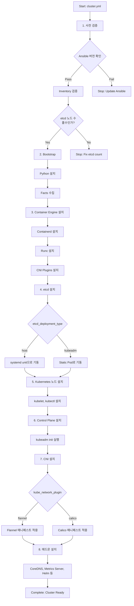
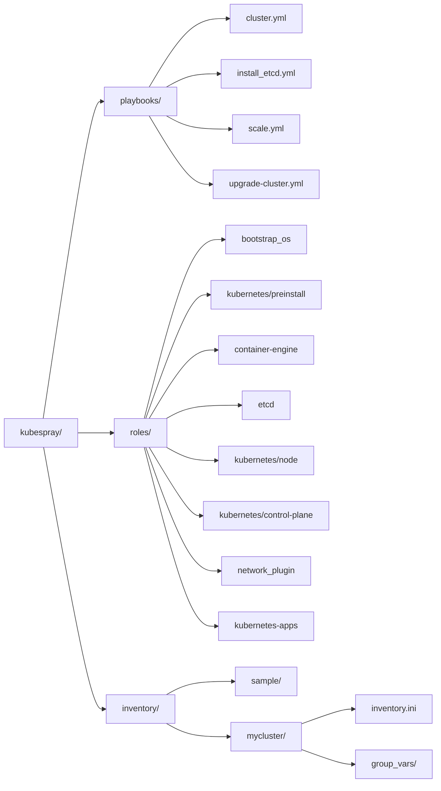
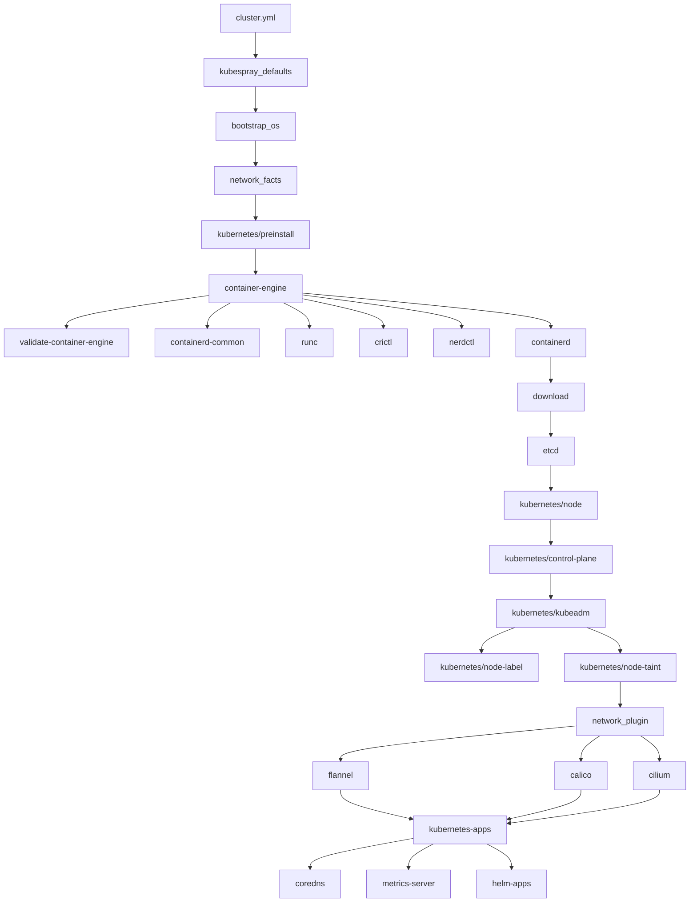
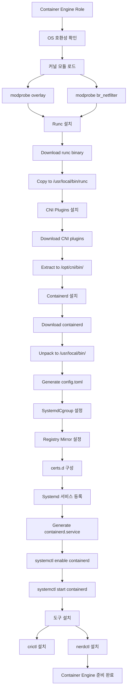
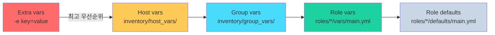

# [K8s-Deploy] Week 4 - Kubespray 배포 분석

> **Ansible 기반 K8s 배포 자동화**: Kubespray를 활용한 프로덕션급 Kubernetes 클러스터 배포 및 내부 동작 분석

## 📋 목차

1. [🎯 Kubespray 소개](#-kubespray-소개)
   - [Kubespray란?](#1-kubespray란)
   - [주요 특징](#2-주요-특징)
   - [Release Cycle](#3-release-cycle)
   - [실습 환경 구성](#4-실습-환경-구성)

2. [🏗️ Kubespray 아키텍처](#️-kubespray-아키텍처)
   - [전체 실행 흐름](#1-전체-실행-흐름)
   - [디렉터리 구조](#2-디렉터리-구조)
   - [Role 의존성](#3-role-의존성)

3. [📦 Container Engine 설치](#-container-engine-설치)
   - [Containerd 설치 과정](#1-containerd-설치-과정)
   - [Registry 미러 설정](#2-registry-미러-설정)
   - [Systemd Cgroup 설정](#3-systemd-cgroup-설정)

4. [🗄️ etcd 설치 및 구성](#️-etcd-설치-및-구성)
   - [etcd Deployment Type](#1-etcd-deployment-type)
   - [인증서 구성](#2-인증서-구성)
   - [Systemd Unit 설정](#3-systemd-unit-설정)

5. [☸️ Kubernetes 클러스터 배포](#️-kubernetes-클러스터-배포)
   - [Node 컴포넌트 설치](#1-node-컴포넌트-설치)
   - [Control Plane 구성](#2-control-plane-구성)
   - [CNI 플러그인 설치](#3-cni-플러그인-설치)
   - [애드온 설치](#4-애드온-설치)

6. [🔧 Kubespray 설정 분석](#-kubespray-설정-분석)
   - [Inventory 구조](#1-inventory-구조)
   - [주요 변수 설정](#2-주요-변수-설정)
   - [변수 우선순위](#3-변수-우선순위)

7. [🔐 인증서 자동 갱신](#-인증서-자동-갱신)
   - [Kubeadm Auto Renew](#1-kubeadm-auto-renew)
   - [Systemd Timer 설정](#2-systemd-timer-설정)
   - [갱신 스크립트 분석](#3-갱신-스크립트-분석)

8. [🌐 HA 환경 지원](#-ha-환경-지원)
   - [Control Plane HA](#1-control-plane-ha)
   - [etcd HA 클러스터](#2-etcd-ha-클러스터)
   - [Client-Side LoadBalancing](#3-client-side-loadbalancing)

9. [🔄 클러스터 운영](#-클러스터-운영)
   - [클러스터 업그레이드](#1-클러스터-업그레이드)
   - [노드 스케일링](#2-노드-스케일링)
   - [백업 및 복구](#3-백업-및-복구)

10. [💡 핵심 개념 정리](#-핵심-개념-정리)
    - [Kubespray vs Kubeadm](#1-kubespray-vs-kubeadm)
    - [Ansible Role 기반 구조](#2-ansible-role-기반-구조)
    - [퍼블릭 vs 폐쇄망 배포](#3-퍼블릭-vs-폐쇄망-배포)

11. [🎓 Week 4 학습 정리](#-week-4-학습-정리)

---

## 🎯 Kubespray 소개

### 1. Kubespray란?

**Kubespray**는 Ansible 기반의 Kubernetes 클러스터 배포 자동화 도구입니다.

**공식 저장소**: [kubernetes-sigs/kubespray](https://github.com/kubernetes-sigs/kubespray)

**핵심 특징**:
- ✅ **프로덕션급 클러스터 배포**: Best Practice 기반 설정
- ✅ **멀티 플랫폼 지원**: AWS, GCP, Azure, On-Premise, Bare-Metal
- ✅ **다양한 CNI 지원**: Calico, Flannel, Cilium, Weave 등
- ✅ **HA 구성 지원**: Control Plane과 etcd HA 자동 구성
- ✅ **폐쇄망 지원**: Air-Gap 환경에서도 배포 가능
- ✅ **클러스터 라이프사이클 관리**: 배포, 업그레이드, 스케일링, 백업/복구

### 2. 주요 특징

#### (1) 퍼블릭/폐쇄망 환경 지원

**퍼블릭 환경**:
```bash
# IaC(Terraform) + Kubespray 조합
terraform apply  # 인프라 프로비저닝
ansible-playbook -i inventory/mycluster/inventory.ini cluster.yml
```

**폐쇄망(Air-Gap) 환경**:
- 오프라인 설치 지원
- 필요한 바이너리/이미지 사전 다운로드
- Private Registry 미러 설정

#### (2) HA 환경 지원

**Control Plane HA**:
- 여러 Control Plane 노드 구성
- kube-apiserver LoadBalancing (Nginx 또는 외부 LB)
- Controller-Manager/Scheduler Leader Election

**etcd HA**:
- 홀수 개(3개 또는 5개) etcd 클러스터
- Raft consensus 기반 HA

**Client-Side LB**:
- Worker 노드에서 API Server로 분산 접속
- Nginx를 이용한 로컬 LoadBalancer

#### (3) 인증서 자동 갱신

- **kubeadm cert auto renew**: 매달 자동 갱신
- systemd timer를 통한 스케줄링
- 1년 유효기간 인증서 자동 관리

#### (4) 클러스터 운영 전반 지원

- 신규 클러스터 생성 (`cluster.yml`)
- 클러스터 업그레이드 (`upgrade-cluster.yml`)
- 노드 추가 (`scale.yml`)
- 노드 제거 (`remove-node.yml`)
- 백업/복구 (etcd snapshot)

### 3. Release Cycle

Kubespray는 Kubernetes 최신 3개 버전(N, N-1, N-2)을 지원합니다.

| Kubespray 버전 | 지원 K8s 버전 |
|---------------|--------------|
| 2.29.x | 1.31 ~ 1.33 (1.34) |
| 2.28.x | 1.30 ~ 1.32 |
| 2.27.x | 1.29 ~ 1.31 |

**운영 환경 버전 추천**:
- **개발(Dev) 환경**: Kubespray 최신 버전 + K8s N-1
- **운영(Prd) 환경**: Kubespray 최신-1 버전 + K8s N-2

### 4. 실습 환경 구성

**가상머신 구성**:

| 호스트명 | IP | 역할 | vCPU | Memory | OS |
|---------|-----|------|------|--------|-----|
| k8s-ctr | 192.168.10.10 | Control Plane + Worker | 4 | 4GB | Rocky Linux 10.0 |

**특징**: Single Node 클러스터 (Control Plane과 Worker 겸용)

**네트워크 설정**:
- Pod CIDR: `10.233.64.0/18`
- Service CIDR: `10.233.0.0/18`
- CNI: Flannel
- Kube Proxy Mode: iptables

**컴포넌트 버전**:
- OS: Rocky Linux 10.0 (Kernel 6.12.0)
- Kubernetes: v1.33.3
- Containerd: v2.1.5
- Runc: v1.3.4
- etcd: v3.5.25
- Ansible: v2.17.14
- Python: 3.12.9
- Helm: v3.18.4

---

## 🏗️ Kubespray 아키텍처

### 1. 전체 실행 흐름

Kubespray는 `cluster.yml` Playbook을 실행하면 총 **15개의 PLAY**와 **559개의 TASK**가 순차적으로 실행됩니다.



**주요 PLAY 목록**:

1. **Check Ansible version** - Ansible 버전 검증
2. **Inventory setup and validation** - 인벤토리 검증
3. **Install bastion ssh config** - Bastion 호스트 설정 (미사용 시 skip)
4. **Bootstrap hosts for Ansible** - Python 설치, 기본 패키지 설치
5. **Gather facts** - Ansible fact 수집
6. **Prepare for etcd install** - etcd 설치 전 사전 준비
7. **Add worker nodes to etcd play** - Worker + etcd 겸용 노드 지원
8. **Install etcd** - etcd 설치 (systemd unit으로 기동)
9. **Install Kubernetes nodes** - 모든 노드에 K8s 컴포넌트 설치
10. **Install the control plane** - Control Plane 노드 구성
11. **Invoke kubeadm and install a CNI** - kubeadm init/join 실행, CNI 설치
12. **Install Calico Route Reflector** - Calico BGP 사용 시
13. **Patch Kubernetes for Windows** - Windows 노드 사용 시
14. **Install Kubernetes apps** - 애드온 설치 (CoreDNS, metrics-server 등)
15. **Apply resolv.conf changes** - DNS 설정 최종 정리

### 2. 디렉터리 구조



**주요 디렉터리**:

- **`playbooks/`**: 메인 Playbook 파일들
  - `cluster.yml`: 클러스터 전체 배포
  - `upgrade-cluster.yml`: 클러스터 업그레이드
  - `scale.yml`: 노드 추가
  - `remove-node.yml`: 노드 제거
  - `reset.yml`: 클러스터 초기화

- **`roles/`**: Ansible Role 디렉터리
  - `bootstrap_os`: OS 사전 설정
  - `container-engine`: Containerd, Runc 설치
  - `etcd`: etcd 설치 및 구성
  - `kubernetes/node`: kubelet, kubectl 설치
  - `kubernetes/control-plane`: Control Plane 구성
  - `network_plugin`: CNI 플러그인 설치
  - `kubernetes-apps`: 애드온 설치

- **`inventory/`**: 인벤토리 설정
  - `sample/`: 샘플 인벤토리
  - `mycluster/`: 사용자 정의 인벤토리

### 3. Role 의존성



**Role 실행 순서**:

1. **kubespray_defaults**: 기본 변수 로드
2. **bootstrap_os**: OS 사전 설정 (패키지 업데이트, Python 설치)
3. **network_facts**: 네트워크 정보 수집
4. **kubernetes/preinstall**: K8s 설치 전 준비 (Swap 비활성화, 커널 파라미터)
5. **container-engine**: Containerd, Runc, CNI Plugins 설치
6. **download**: 필요한 바이너리/이미지 다운로드
7. **etcd**: etcd 클러스터 구성
8. **kubernetes/node**: kubelet, kubectl 설치
9. **kubernetes/control-plane**: kubeadm init 실행
10. **kubernetes/kubeadm**: kubeadm join 실행
11. **network_plugin**: CNI 플러그인 설치
12. **kubernetes-apps**: 애드온 설치

---

## 📦 Container Engine 설치

### 1. Containerd 설치 과정

Kubespray는 `container-engine` Role을 통해 Containerd를 설치합니다.



**설치 단계**:

1. **커널 모듈 로드**:
   ```bash
   modprobe overlay      # OverlayFS 지원
   modprobe br_netfilter # 브릿지 네트워크 필터링
   ```

2. **Runc 설치**:
   ```bash
   wget https://github.com/opencontainers/runc/releases/download/v1.3.4/runc.amd64
   install -m 755 runc.amd64 /usr/local/bin/runc
   ```

3. **CNI Plugins 설치**:
   ```bash
   wget https://github.com/containernetworking/plugins/releases/download/v1.6.2/cni-plugins-linux-amd64-v1.6.2.tgz
   mkdir -p /opt/cni/bin
   tar -C /opt/cni/bin -xzf cni-plugins-linux-amd64-v1.6.2.tgz
   ```

4. **Containerd 설치**:
   ```bash
   wget https://github.com/containerd/containerd/releases/download/v2.1.5/containerd-2.1.5-linux-amd64.tar.gz
   tar -C /usr/local -xzf containerd-2.1.5-linux-amd64.tar.gz
   ```

5. **Config 파일 생성**:
   ```bash
   mkdir -p /etc/containerd
   containerd config default > /etc/containerd/config.toml
   ```

### 2. Registry 미러 설정

Kubespray는 Containerd의 Registry 미러 기능을 활용하여 Private Registry 사용을 지원합니다.

```mermaid
graph TD
    A[Container Image Pull 요청<br>docker.io/flannel/flannel:v0.27.3] --> B{config.toml 확인}

    B --> C[plugins."io.containerd.cri.v1.images".registry<br>config_path: /etc/containerd/certs.d]

    C --> D{/etc/containerd/certs.d/<br>docker.io/hosts.toml 존재?}

    D -->|Yes| E[hosts.toml 읽기]
    E --> F[server = "https://docker.io"<br>host."https://registry-1.docker.io"]

    F --> G{미러 서버 설정?}
    G -->|Yes| H[1순위: mirror.example.com 시도]
    H -->|실패| I[2순위: registry-1.docker.io]
    G -->|No| I

    I --> J[TLS 검증<br>skip_verify: false]
    J --> K{CA 인증서 유효?}
    K -->|Yes| L[Image Pull 성공]
    K -->|No| M[Pull 실패]

    D -->|No| N[기본 동작: Docker Hub 직접 접속]
    N --> I
```

**Registry 미러 설정 예시**:

```toml
# /etc/containerd/certs.d/docker.io/hosts.toml
server = "https://docker.io"

[host."https://mirror.example.com"]
  capabilities = ["pull", "resolve"]
  skip_verify = false

[host."https://registry-1.docker.io"]
  capabilities = ["pull", "resolve"]
```

**설정 파일 구조**:

```
/etc/containerd/
├── config.toml
└── certs.d/
    ├── docker.io/
    │   ├── hosts.toml
    │   └── ca.crt (선택적)
    ├── gcr.io/
    │   └── hosts.toml
    └── quay.io/
        └── hosts.toml
```

**config.toml 핵심 설정**:

```toml
[plugins."io.containerd.cri.v1.images".registry]
  config_path = "/etc/containerd/certs.d"

[plugins."io.containerd.cri.v1.images"]
  sandbox_image = "registry.k8s.io/pause:3.10"
```

### 3. Systemd Cgroup 설정

**Systemd Cgroup 활성화**:

```toml
# /etc/containerd/config.toml
[plugins."io.containerd.grpc.v1.cri".containerd.runtimes.runc.options]
  SystemdCgroup = true
```

**중요성**:
- kubelet과 containerd가 동일한 cgroup driver 사용 필수
- cgroup v2 사용 시 systemd cgroup 권장
- 리소스 관리 안정성 향상

**검증**:

```bash
# Containerd cgroup driver 확인
crictl info | jq '.config.containerd.runtimes.runc.options.SystemdCgroup'

# Kubelet cgroup driver 확인
kubectl get cm kubelet-config -n kube-system -o yaml | grep cgroupDriver
```

---

## 🗄️ etcd 설치 및 구성

### 1. etcd Deployment Type

Kubespray는 두 가지 etcd 배포 방식을 지원합니다.

| Deployment Type | 설명 | 장점 | 단점 |
|----------------|------|------|------|
| **host** | systemd unit으로 etcd 실행 | etcd 독립 관리, kubeadm과 무관 | 수동 관리 필요 |
| **kubeadm** | Static Pod로 etcd 실행 | kubeadm이 관리 | kubeadm에 종속 |

**실습 환경 설정**:

```yaml
# inventory/mycluster/group_vars/all/etcd.yml
etcd_deployment_type: host  # systemd unit으로 실행
```

### 2. 인증서 구성

```mermaid
flowchart TD
    Start[etcd 설치 시작] --> A{노드 역할 확인}

    A -->|etcd 그룹| B[etcd 서버 설치]
    A -->|_kubespray_needs_etcd| C[etcd 클라이언트 인증서만]

    B --> B1[User/Group 생성<br>etcd:etcd]
    B1 --> B2[인증서 생성]
    B2 --> B2A[CA 생성<br>/etc/ssl/etcd/ssl/ca.pem]
    B2A --> B2B[Member 인증서<br>member-k8s-ctr.pem]
    B2B --> B2C[Admin 인증서<br>admin-k8s-ctr.pem]
    B2C --> B2D[Node 인증서<br>node-k8s-ctr.pem]

    B2D --> B3[etcd 바이너리 다운로드]
    B3 --> B4[etcd v3.5.25<br>/usr/local/bin/etcd]

    B4 --> B5[설정 파일 생성]
    B5 --> B5A[/etc/etcd.env]
    B5A --> B5B[systemd unit<br>/etc/systemd/system/etcd.service]

    B5B --> B6[etcd 시작]
    B6 --> B6A[systemctl start etcd]
    B6A --> B6B[Health Check]

    C --> C1[클라이언트 인증서 배포]
    C1 --> C1A[node-k8s-ctr.pem<br>node-k8s-ctr-key.pem]

    B6B --> End[etcd 설치 완료]
    C1A --> End
```

**etcd 인증서 목록**:

```
/etc/ssl/etcd/ssl/
├── ca.pem                    # etcd CA
├── ca-key.pem
├── member-k8s-ctr.pem        # etcd Member 인증서
├── member-k8s-ctr-key.pem
├── admin-k8s-ctr.pem         # Admin 인증서
├── admin-k8s-ctr-key.pem
├── node-k8s-ctr.pem          # Node 인증서 (API Server → etcd)
└── node-k8s-ctr-key.pem
```

**인증서 용도**:

| 인증서 | 용도 | 사용처 |
|--------|------|--------|
| ca.pem | etcd CA | 모든 etcd 통신 검증 |
| member-*.pem | etcd 서버 인증서 | etcd 클러스터 내부 통신 |
| admin-*.pem | etcd 관리자 인증서 | etcdctl 명령어 |
| node-*.pem | etcd 클라이언트 인증서 | kube-apiserver → etcd |

### 3. Systemd Unit 설정

**etcd.service 파일**:

```ini
# /etc/systemd/system/etcd.service
[Unit]
Description=etcd key-value store
Documentation=https://github.com/etcd-io/etcd
After=network.target

[Service]
User=etcd
Type=notify
EnvironmentFile=/etc/etcd.env
ExecStart=/usr/local/bin/etcd
Restart=always
RestartSec=10s
LimitNOFILE=65536

[Install]
WantedBy=multi-user.target
```

**etcd.env 설정**:

```bash
# /etc/etcd.env
ETCD_NAME=k8s-ctr
ETCD_DATA_DIR=/var/lib/etcd
ETCD_LISTEN_PEER_URLS=https://192.168.10.10:2380
ETCD_LISTEN_CLIENT_URLS=https://192.168.10.10:2379,https://127.0.0.1:2379
ETCD_INITIAL_ADVERTISE_PEER_URLS=https://192.168.10.10:2380
ETCD_ADVERTISE_CLIENT_URLS=https://192.168.10.10:2379
ETCD_INITIAL_CLUSTER=k8s-ctr=https://192.168.10.10:2380
ETCD_INITIAL_CLUSTER_STATE=new
ETCD_INITIAL_CLUSTER_TOKEN=etcd-cluster

# TLS 설정
ETCD_CERT_FILE=/etc/ssl/etcd/ssl/member-k8s-ctr.pem
ETCD_KEY_FILE=/etc/ssl/etcd/ssl/member-k8s-ctr-key.pem
ETCD_TRUSTED_CA_FILE=/etc/ssl/etcd/ssl/ca.pem
ETCD_CLIENT_CERT_AUTH=true
ETCD_PEER_CERT_FILE=/etc/ssl/etcd/ssl/member-k8s-ctr.pem
ETCD_PEER_KEY_FILE=/etc/ssl/etcd/ssl/member-k8s-ctr-key.pem
ETCD_PEER_TRUSTED_CA_FILE=/etc/ssl/etcd/ssl/ca.pem
ETCD_PEER_CLIENT_CERT_AUTH=true
```

**etcd 상태 확인**:

```bash
# systemd 상태 확인
systemctl status etcd

# etcdctl을 이용한 health check
ETCDCTL_API=3 etcdctl \
  --cacert=/etc/ssl/etcd/ssl/ca.pem \
  --cert=/etc/ssl/etcd/ssl/admin-k8s-ctr.pem \
  --key=/etc/ssl/etcd/ssl/admin-k8s-ctr-key.pem \
  --endpoints=https://192.168.10.10:2379 \
  endpoint health
```

---

## ☸️ Kubernetes 클러스터 배포

### 1. Node 컴포넌트 설치

**kubernetes/node Role**은 모든 노드(Control Plane + Worker)에 공통 컴포넌트를 설치합니다.

**설치 항목**:
- kubelet (v1.33.3)
- kubectl (v1.33.3)
- kubeadm (v1.33.3)

**kubelet 설정 파일**:

```yaml
# /etc/kubernetes/kubelet-config.yaml
apiVersion: kubelet.config.k8s.io/v1beta1
kind: KubeletConfiguration
cgroupDriver: systemd
clusterDNS:
  - 10.233.0.10
clusterDomain: cluster.local
containerRuntimeEndpoint: unix:///var/run/containerd/containerd.sock
cpuManagerPolicy: none
maxPods: 110
podCIDR: 10.233.64.0/18
resolvConf: /etc/resolv.conf
rotateCertificates: true
serverTLSBootstrap: true
tlsCertFile: /var/lib/kubelet/pki/kubelet.crt
tlsPrivateKeyFile: /var/lib/kubelet/pki/kubelet.key
```

**kubelet.service**:

```ini
# /etc/systemd/system/kubelet.service
[Unit]
Description=kubelet: The Kubernetes Node Agent
Documentation=https://kubernetes.io/docs/

[Service]
ExecStart=/usr/local/bin/kubelet \
  --config=/etc/kubernetes/kubelet-config.yaml \
  --hostname-override=k8s-ctr \
  --kubeconfig=/etc/kubernetes/kubelet.conf \
  --bootstrap-kubeconfig=/etc/kubernetes/bootstrap-kubelet.conf
Restart=always
RestartSec=10s

[Install]
WantedBy=multi-user.target
```

### 2. Control Plane 구성

**kubeadm init 실행**:

Kubespray는 `kubeadm init`을 통해 Control Plane을 구성합니다.

**kubeadm-config.yaml**:

```yaml
# /etc/kubernetes/kubeadm-config.yaml
apiVersion: kubeadm.k8s.io/v1beta4
kind: InitConfiguration
localAPIEndpoint:
  advertiseAddress: 192.168.10.10
  bindPort: 6443
nodeRegistration:
  criSocket: unix:///var/run/containerd/containerd.sock
  kubeletExtraArgs:
    node-ip: 192.168.10.10
  name: k8s-ctr
---
apiVersion: kubeadm.k8s.io/v1beta4
kind: ClusterConfiguration
apiServer:
  certSANs:
    - kubernetes
    - kubernetes.default
    - kubernetes.default.svc
    - kubernetes.default.svc.cluster.local
    - localhost
    - 127.0.0.1
    - 192.168.10.10
  extraArgs:
    enable-admission-plugins: NodeRestriction
    etcd-cafile: /etc/ssl/etcd/ssl/ca.pem
    etcd-certfile: /etc/ssl/etcd/ssl/node-k8s-ctr.pem
    etcd-keyfile: /etc/ssl/etcd/ssl/node-k8s-ctr-key.pem
    etcd-servers: https://192.168.10.10:2379
certificatesDir: /etc/kubernetes/pki
clusterName: cluster.local
controlPlaneEndpoint: localhost:6443
dns: {}
etcd:
  external:
    endpoints:
      - https://192.168.10.10:2379
    caFile: /etc/ssl/etcd/ssl/ca.pem
    certFile: /etc/ssl/etcd/ssl/node-k8s-ctr.pem
    keyFile: /etc/ssl/etcd/ssl/node-k8s-ctr-key.pem
imageRepository: registry.k8s.io
kubernetesVersion: v1.33.3
networking:
  dnsDomain: cluster.local
  podSubnet: 10.233.64.0/18
  serviceSubnet: 10.233.0.0/18
```

**kubeadm init 실행**:

```bash
kubeadm init --config=/etc/kubernetes/kubeadm-config.yaml --upload-certs
```

**생성되는 Static Pod 매니페스트**:

```
/etc/kubernetes/manifests/
├── kube-apiserver.yaml
├── kube-controller-manager.yaml
└── kube-scheduler.yaml
```

### 3. CNI 플러그인 설치

**Flannel CNI 설치**:

Kubespray는 선택한 CNI 플러그인(Flannel)의 매니페스트를 적용합니다.

**Flannel 설정**:

```yaml
# inventory/mycluster/group_vars/k8s_cluster/k8s-net-flannel.yml
flannel_backend_type: vxlan
flannel_network_cidr: 10.233.64.0/18
flannel_interface: eth0
```

**Flannel DaemonSet 적용**:

```bash
kubectl apply -f /etc/kubernetes/flannel.yaml
```

**주요 CNI 옵션**:

| CNI | 특징 | 네트워크 모드 |
|-----|------|-------------|
| **Flannel** | 간단한 설정, VXLAN | Overlay |
| **Calico** | NetworkPolicy 지원, BGP | Overlay or BGP |
| **Cilium** | eBPF 기반, 고성능 | Overlay or Native Routing |
| **Weave** | 암호화 지원 | Overlay |

### 4. 애드온 설치

**kubernetes-apps Role**은 다양한 애드온을 설치합니다.

**주요 애드온**:

```yaml
# inventory/mycluster/group_vars/k8s_cluster/addons.yml
helm_enabled: true
metrics_server_enabled: true
node_feature_discovery_enabled: true
ingress_nginx_enabled: false
cert_manager_enabled: false
```

**설치되는 애드온**:

1. **CoreDNS**: 클러스터 DNS (기본 설치)
2. **Metrics Server**: 리소스 메트릭 수집
3. **Node Feature Discovery**: 노드 하드웨어 정보 자동 라벨링
4. **Helm**: 패키지 관리자
5. **Ingress NGINX**: Ingress Controller (선택)
6. **Cert Manager**: 인증서 자동 관리 (선택)

**애드온 확인**:

```bash
# CoreDNS
kubectl get pods -n kube-system -l k8s-app=kube-dns

# Metrics Server
kubectl get pods -n kube-system -l k8s-app=metrics-server

# Node Feature Discovery
kubectl get pods -n node-feature-discovery
```

---

## 🔧 Kubespray 설정 분석

### 1. Inventory 구조

**Inventory 디렉터리 구조**:

```
inventory/mycluster/
├── inventory.ini           # 호스트 정의
└── group_vars/
    ├── all/
    │   ├── all.yml         # 모든 노드 공통 설정
    │   ├── containerd.yml  # Container Runtime 설정
    │   └── etcd.yml        # etcd 설정
    └── k8s_cluster/
        ├── k8s-cluster.yml         # K8s 클러스터 설정
        ├── addons.yml              # 애드온 설정
        ├── k8s-net-flannel.yml     # Flannel CNI 설정
        └── kube_control_plane.yml  # Control Plane 설정
```

**inventory.ini 예시**:

```ini
[all]
k8s-ctr ansible_host=192.168.10.10 ip=192.168.10.10

[kube_control_plane]
k8s-ctr

[etcd]
k8s-ctr

[kube_node]
k8s-ctr

[k8s_cluster:children]
kube_control_plane
kube_node
```

### 2. 주요 변수 설정

**k8s-cluster.yml**:

```yaml
# Container Runtime
container_manager: containerd

# CNI 플러그인
kube_network_plugin: flannel

# Kube-Proxy 모드
kube_proxy_mode: iptables

# 네트워크 대역
kube_service_addresses: 10.233.0.0/18
kube_pods_subnet: 10.233.64.0/18

# DNS
enable_nodelocaldns: false
dns_mode: coredns
cluster_name: cluster.local

# 인증서 자동 갱신
auto_renew_certificates: true

# Kubernetes 버전
kube_version: v1.33.3
```

**addons.yml**:

```yaml
helm_enabled: true
metrics_server_enabled: true
node_feature_discovery_enabled: true
ingress_nginx_enabled: false
cert_manager_enabled: false
```

**etcd.yml**:

```yaml
etcd_deployment_type: host
etcd_data_dir: /var/lib/etcd
etcd_events_cluster_enabled: false
```

**containerd.yml**:

```yaml
containerd_use_systemd_cgroup: true
containerd_registries_mirrors:
  - prefix: docker.io
    mirrors:
      - host: https://registry-1.docker.io
        capabilities: ["pull", "resolve"]
```

### 3. 변수 우선순위



**변수 우선순위 (높음 → 낮음)**:

1. **Extra vars** (`-e key=value`): 최고 우선순위
2. **Host vars** (`inventory/host_vars/<hostname>.yml`)
3. **Group vars** (`inventory/group_vars/<group>.yml`)
4. **Role vars** (`roles/*/vars/main.yml`)
5. **Role defaults** (`roles/*/defaults/main.yml`): 최저 우선순위

**예시**:

```bash
# Extra vars로 kube_version 변경
ansible-playbook -i inventory/mycluster/inventory.ini cluster.yml \
  -e kube_version="v1.33.3"
```

---

## 🔐 인증서 자동 갱신

### 1. Kubeadm Auto Renew

Kubespray는 **kubeadm cert auto renew** 기능을 활성화하여 인증서를 자동으로 갱신합니다.

**설정**:

```yaml
# inventory/mycluster/group_vars/k8s_cluster/k8s-cluster.yml
auto_renew_certificates: true
```

**자동 갱신 대상 인증서**:

| 인증서 | 유효기간 | 갱신 주기 |
|--------|---------|----------|
| apiserver.crt | 1년 | 매달 자동 갱신 |
| apiserver-kubelet-client.crt | 1년 | 매달 자동 갱신 |
| front-proxy-client.crt | 1년 | 매달 자동 갱신 |
| kubelet-client.crt | 1년 | 자동 갱신 (TLS Bootstrap) |

### 2. Systemd Timer 설정

Kubespray는 systemd timer를 사용하여 매달 인증서를 갱신합니다.

**k8s-certs-renew.timer**:

```ini
# /etc/systemd/system/k8s-certs-renew.timer
[Unit]
Description=Renew K8S control plane certificates

[Timer]
OnCalendar=monthly
Persistent=true

[Install]
WantedBy=timers.target
```

**k8s-certs-renew.service**:

```ini
# /etc/systemd/system/k8s-certs-renew.service
[Unit]
Description=Renew K8S control plane certificates
After=kubelet.service

[Service]
Type=oneshot
ExecStart=/usr/local/bin/k8s-certs-renew.sh
```

**Timer 상태 확인**:

```bash
# Timer 목록 확인
systemctl list-timers --all | grep k8s-certs-renew

# Timer 상태 확인
systemctl status k8s-certs-renew.timer

# 다음 실행 시간 확인
systemctl list-timers k8s-certs-renew.timer
```

### 3. 갱신 스크립트 분석

**k8s-certs-renew.sh**:

```bash
#!/bin/bash
# /usr/local/bin/k8s-certs-renew.sh

set -e

# 인증서 갱신
/usr/local/bin/kubeadm certs renew all

# Control Plane Static Pod 재시작
# (kubelet이 자동으로 감지하여 재시작)
find /etc/kubernetes/manifests/ -type f -exec touch {} \;

# Kubelet 재시작 (선택적)
systemctl restart kubelet
```

**수동 갱신**:

```bash
# 인증서 만료 확인
kubeadm certs check-expiration

# 모든 인증서 갱신
kubeadm certs renew all

# 특정 인증서만 갱신
kubeadm certs renew apiserver
kubeadm certs renew apiserver-kubelet-client

# Control Plane 재시작
systemctl restart kubelet
```

**인증서 만료 확인**:

```bash
# kubeadm으로 확인
kubeadm certs check-expiration

# openssl로 확인
openssl x509 -in /etc/kubernetes/pki/apiserver.crt -noout -dates
```

---

## 🌐 HA 환경 지원

### 1. Control Plane HA

Kubespray는 여러 Control Plane 노드를 구성하여 HA를 지원합니다.

**HA 구성 예시**:

```ini
# inventory.ini
[all]
k8s-ctr1 ansible_host=192.168.10.11 ip=192.168.10.11
k8s-ctr2 ansible_host=192.168.10.12 ip=192.168.10.12
k8s-ctr3 ansible_host=192.168.10.13 ip=192.168.10.13
k8s-w1 ansible_host=192.168.10.21 ip=192.168.10.21
k8s-w2 ansible_host=192.168.10.22 ip=192.168.10.22

[kube_control_plane]
k8s-ctr1
k8s-ctr2
k8s-ctr3

[etcd]
k8s-ctr1
k8s-ctr2
k8s-ctr3

[kube_node]
k8s-w1
k8s-w2
```

**HA 특징**:

- **kube-apiserver**: 모든 Control Plane 노드에서 실행 (Active-Active)
- **kube-controller-manager**: Leader Election (Active-Standby)
- **kube-scheduler**: Leader Election (Active-Standby)
- **etcd**: Raft consensus 기반 HA (홀수 개 권장)

### 2. etcd HA 클러스터

**etcd 클러스터 구성**:

| 노드 수 | Quorum | 허용 장애 노드 수 |
|--------|--------|-----------------|
| 1 | 1 | 0 |
| 3 | 2 | 1 |
| 5 | 3 | 2 |
| 7 | 4 | 3 |

**권장 사항**:
- **운영 환경**: 3개 또는 5개 etcd 노드
- **개발 환경**: 1개 etcd 노드
- **홀수 개**: Quorum 달성을 위해 반드시 홀수 개 구성

**etcd 클러스터 설정**:

```bash
# /etc/etcd.env
ETCD_INITIAL_CLUSTER=k8s-ctr1=https://192.168.10.11:2380,k8s-ctr2=https://192.168.10.12:2380,k8s-ctr3=https://192.168.10.13:2380
ETCD_INITIAL_CLUSTER_STATE=new
```

### 3. Client-Side LoadBalancing

Kubespray는 Worker 노드에 **Nginx 기반 LoadBalancer**를 구성하여 API Server에 분산 접속합니다.

**구성**:

```
Worker Node (k8s-w1)
├── kubelet
│   └── kubeconfig → localhost:6443
└── nginx (localhost:6443)
    └── upstream → k8s-ctr1:6443, k8s-ctr2:6443, k8s-ctr3:6443
```

**nginx.conf**:

```nginx
# /etc/nginx/nginx.conf
stream {
    upstream kube_apiserver {
        server 192.168.10.11:6443 max_fails=3 fail_timeout=10s;
        server 192.168.10.12:6443 max_fails=3 fail_timeout=10s;
        server 192.168.10.13:6443 max_fails=3 fail_timeout=10s;
    }

    server {
        listen 127.0.0.1:6443;
        proxy_pass kube_apiserver;
        proxy_timeout 10s;
        proxy_connect_timeout 1s;
    }
}
```

**kubelet kubeconfig**:

```yaml
# /etc/kubernetes/kubelet.conf
clusters:
- cluster:
    server: https://localhost:6443  # Nginx LoadBalancer
  name: cluster.local
```

**장점**:
- 외부 LoadBalancer 불필요
- API Server 장애 시 자동 failover
- Worker 노드별 독립적인 LB

---

## 🔄 클러스터 운영

### 1. 클러스터 업그레이드

**upgrade-cluster.yml Playbook 사용**:

```bash
# Kubernetes 버전 업그레이드
ansible-playbook -i inventory/mycluster/inventory.ini upgrade-cluster.yml \
  -e kube_version=v1.34.0
```

**업그레이드 순서**:

1. etcd 업그레이드 (필요 시)
2. Control Plane 노드 순차 업그레이드
3. Worker 노드 순차 업그레이드
4. CNI 플러그인 업그레이드 (필요 시)
5. 애드온 업그레이드

**업그레이드 주의사항**:

- **Version Skew Policy 준수**: K8s 버전 호환성 확인
- **백업 필수**: etcd snapshot 백업
- **순차 업그레이드**: 한 번에 하나의 마이너 버전씩
- **테스트**: Dev 환경에서 먼저 테스트

### 2. 노드 스케일링

**노드 추가**:

```bash
# inventory.ini에 새 노드 추가 후 실행
ansible-playbook -i inventory/mycluster/inventory.ini scale.yml \
  --limit=k8s-w3
```

**노드 제거**:

```bash
# 노드 drain
kubectl drain k8s-w1 --ignore-daemonsets --delete-emptydir-data

# 노드 제거 Playbook
ansible-playbook -i inventory/mycluster/inventory.ini remove-node.yml \
  -e node=k8s-w1
```

### 3. 백업 및 복구

**etcd 백업**:

```bash
# Snapshot 생성
ETCDCTL_API=3 etcdctl snapshot save /backup/etcd-snapshot.db \
  --cacert=/etc/ssl/etcd/ssl/ca.pem \
  --cert=/etc/ssl/etcd/ssl/admin-k8s-ctr.pem \
  --key=/etc/ssl/etcd/ssl/admin-k8s-ctr-key.pem \
  --endpoints=https://192.168.10.10:2379

# Snapshot 검증
ETCDCTL_API=3 etcdctl snapshot status /backup/etcd-snapshot.db
```

**etcd 복구**:

```bash
# etcd 중지
systemctl stop etcd

# 데이터 디렉터리 백업
mv /var/lib/etcd /var/lib/etcd.old

# Snapshot 복구
ETCDCTL_API=3 etcdctl snapshot restore /backup/etcd-snapshot.db \
  --data-dir=/var/lib/etcd

# 권한 설정
chown -R etcd:etcd /var/lib/etcd

# etcd 재시작
systemctl start etcd
```

**자동 백업 스크립트**:

```bash
#!/bin/bash
# /usr/local/bin/etcd-backup.sh

BACKUP_DIR="/backup/etcd"
DATE=$(date +%Y%m%d-%H%M%S)
SNAPSHOT="$BACKUP_DIR/etcd-snapshot-$DATE.db"

# Snapshot 생성
ETCDCTL_API=3 etcdctl snapshot save "$SNAPSHOT" \
  --cacert=/etc/ssl/etcd/ssl/ca.pem \
  --cert=/etc/ssl/etcd/ssl/admin-k8s-ctr.pem \
  --key=/etc/ssl/etcd/ssl/admin-k8s-ctr-key.pem \
  --endpoints=https://192.168.10.10:2379

# 7일 이상 된 백업 삭제
find "$BACKUP_DIR" -name "etcd-snapshot-*.db" -mtime +7 -delete
```

---

## 💡 핵심 개념 정리

### 1. Kubespray vs Kubeadm

| 항목 | Kubespray | Kubeadm |
|------|-----------|---------|
| **도구** | Ansible Playbook | CLI 도구 |
| **자동화 수준** | 전체 자동화 | 부분 자동화 |
| **사전 준비** | Ansible이 자동 수행 | 수동 설정 필요 |
| **멀티 노드 배포** | 자동 | 수동 (각 노드 접속) |
| **HA 구성** | 자동 | 수동 설정 필요 |
| **폐쇄망 지원** | 공식 지원 | 수동 구성 |
| **업그레이드** | Playbook 실행 | 각 노드에서 수동 실행 |
| **인증서 관리** | 자동 갱신 설정 | 수동 갱신 |
| **설정 관리** | Inventory 기반 | 각 노드별 설정 파일 |

**Kubespray 장점**:
- ✅ 프로덕션급 클러스터 빠른 배포
- ✅ Best Practice 자동 적용
- ✅ 멀티 노드 동시 배포
- ✅ IaC(Infrastructure as Code)
- ✅ 일관된 설정 관리

**Kubeadm 장점**:
- ✅ 간단한 사용법
- ✅ 공식 도구 (Kubernetes 프로젝트)
- ✅ 작은 클러스터에 적합

### 2. Ansible Role 기반 구조

Kubespray는 **Ansible Role**을 활용하여 모듈화된 구조를 제공합니다.

**Role 기반 구조의 장점**:

1. **재사용성**: Role을 다른 Playbook에서 재사용
2. **모듈화**: 각 Role이 독립적인 기능 수행
3. **유지보수성**: Role별로 코드 관리
4. **테스트 용이성**: Role 단위 테스트 가능

**Role 구조 예시**:

```
roles/container-engine/
├── defaults/
│   └── main.yml        # 기본 변수
├── tasks/
│   ├── main.yml        # 메인 Task
│   ├── containerd.yml  # Containerd 설치
│   ├── runc.yml        # Runc 설치
│   └── cni.yml         # CNI Plugins 설치
├── templates/
│   ├── config.toml.j2  # Containerd config
│   └── containerd.service.j2
├── handlers/
│   └── main.yml        # Handler (재시작 등)
└── vars/
    └── main.yml        # Role 변수
```

### 3. 퍼블릭 vs 폐쇄망 배포

**퍼블릭 환경 배포**:

```bash
# 인터넷 연결된 환경
ansible-playbook -i inventory/mycluster/inventory.ini cluster.yml
```

**폐쇄망(Air-Gap) 환경 배포**:

1. **바이너리 사전 다운로드**:
   ```bash
   ansible-playbook -i inventory/mycluster/inventory.ini cluster.yml \
     --tags download --skip-tags upload,upgrade
   ```

2. **이미지 사전 다운로드**:
   ```bash
   # 이미지 목록 생성
   ansible-playbook -i inventory/mycluster/inventory.ini cluster.yml \
     --tags download --skip-tags upload,upgrade \
     -e download_container=true
   ```

3. **Private Registry 구성**:
   ```yaml
   # group_vars/all/containerd.yml
   containerd_registries_mirrors:
     - prefix: docker.io
       mirrors:
         - host: https://registry.internal.com
           capabilities: ["pull", "resolve"]
   ```

4. **오프라인 배포 실행**:
   ```bash
   ansible-playbook -i inventory/mycluster/inventory.ini cluster.yml \
     -e download_run_once=false \
     -e download_localhost=true
   ```

**폐쇄망 배포 요구사항**:
- ✅ Private Registry (Harbor, Nexus 등)
- ✅ 바이너리 저장소 (HTTP 서버)
- ✅ Ansible Control Node (폐쇄망 내부)
- ✅ 사전 다운로드된 파일 목록

---

## 🎓 Week 4 학습 정리

### 핵심 학습 내용

**1. Kubespray 이해**:
- ✅ Ansible 기반 K8s 배포 자동화 도구
- ✅ 559개 Task를 통한 완전한 클러스터 구축
- ✅ 프로덕션급 Best Practice 자동 적용

**2. 전체 배포 흐름**:
- ✅ 15개 PLAY를 통한 단계별 배포
- ✅ Role 의존성 및 실행 순서 이해
- ✅ 사전 검증 → Bootstrap → Container Engine → etcd → K8s → CNI → 애드온

**3. Container Engine 설치**:
- ✅ Containerd, Runc, CNI Plugins 설치
- ✅ Registry 미러 설정 (certs.d 구조)
- ✅ Systemd Cgroup 활성화

**4. etcd 구성**:
- ✅ etcd_deployment_type: host (systemd) vs kubeadm (Static Pod)
- ✅ etcd 인증서 체계 (CA, Member, Admin, Node)
- ✅ systemd unit으로 etcd 관리

**5. Kubernetes 배포**:
- ✅ kubeadm init을 통한 Control Plane 구성
- ✅ External etcd 연동
- ✅ CNI 플러그인 설치 (Flannel)
- ✅ 애드온 설치 (CoreDNS, Metrics Server, Helm)

**6. 인증서 관리**:
- ✅ auto_renew_certificates 설정
- ✅ systemd timer를 통한 매달 자동 갱신
- ✅ kubeadm certs renew 명령어

**7. HA 환경**:
- ✅ Control Plane HA (Leader Election)
- ✅ etcd HA (Raft consensus, 홀수 개)
- ✅ Client-Side LoadBalancing (Nginx)

**8. 클러스터 운영**:
- ✅ 업그레이드 (upgrade-cluster.yml)
- ✅ 스케일링 (scale.yml, remove-node.yml)
- ✅ 백업/복구 (etcd snapshot)

### Kubespray vs Week 3 Kubeadm 비교

| 항목 | Week 3 (Kubeadm 수동) | Week 4 (Kubespray) |
|------|----------------------|-------------------|
| **배포 방식** | 수동 SSH 접속 후 명령어 실행 | Ansible Playbook 자동 실행 |
| **사전 준비** | 수동 설정 (SELinux, Firewall, Swap) | Ansible이 자동 수행 |
| **멀티 노드** | 각 노드 개별 접속 | 전체 노드 동시 배포 |
| **etcd 배포** | kubeadm init (Static Pod) | systemd unit (독립 관리) |
| **HA 구성** | 수동 설정 | 자동 구성 |
| **인증서 갱신** | 수동 galley (timer 직접 생성) | 자동 설정 (timer 자동 생성) |
| **업그레이드** | 각 노드에서 kubeadm upgrade | upgrade-cluster.yml 실행 |
| **설정 관리** | 각 노드별 파일 | Inventory 중앙 관리 |

### 실무 적용 포인트

**1. 프로덕션 배포**:
- Kubespray를 활용한 빠른 클러스터 구축
- Inventory 기반 IaC 구현
- Best Practice 설정 자동 적용

**2. 폐쇄망 환경**:
- Air-Gap 배포 전략 수립
- Private Registry 구성
- 바이너리/이미지 사전 다운로드

**3. HA 구성**:
- 3개 또는 5개 Control Plane 노드
- 홀수 개 etcd 클러스터
- Client-Side LoadBalancing

**4. 운영 자동화**:
- 인증서 자동 갱신 (systemd timer)
- etcd 자동 백업 스크립트
- 모니터링 스택 통합 (Prometheus, Grafana)

**5. 버전 관리 전략**:
- Dev: Kubespray 최신 + K8s N-1
- Prd: Kubespray 최신-1 + K8s N-2
- Version Skew Policy 준수

---

## 📚 참고 자료

- [Kubespray 공식 문서](https://kubespray.io/)
- [Kubespray GitHub](https://github.com/kubernetes-sigs/kubespray)
- [Kubespray Release Notes](https://github.com/kubernetes-sigs/kubespray/releases)
- [Ansible Best Practices](https://docs.ansible.com/ansible/latest/tips_tricks/ansible_tips_tricks.html)
- [Kubernetes Version Skew Policy](https://kubernetes.io/releases/version-skew-policy/)
- [etcd 공식 문서](https://etcd.io/docs/)
- [Containerd Registry 설정](https://github.com/containerd/containerd/blob/main/docs/hosts.md)
- [Kubeadm Certificate Management](https://kubernetes.io/docs/tasks/administer-cluster/kubeadm/kubeadm-certs/)

---

**작성일**: 2026-01-28
**스터디**: K8s-Deploy Week 4
