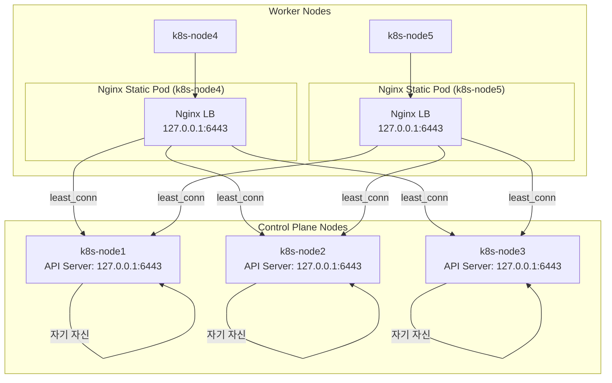
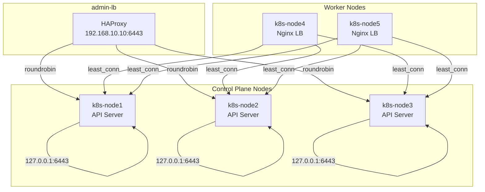
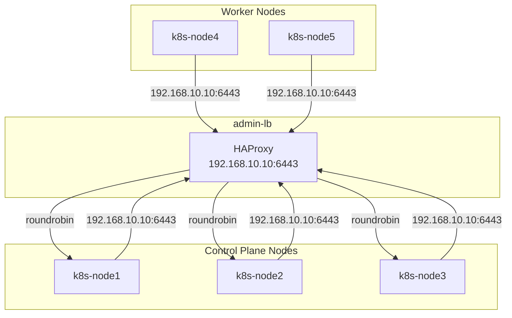
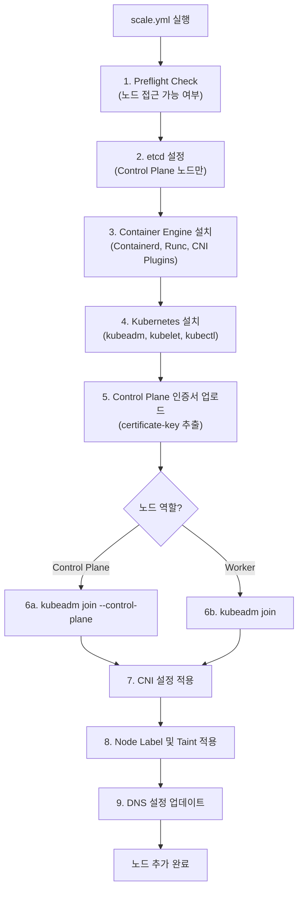
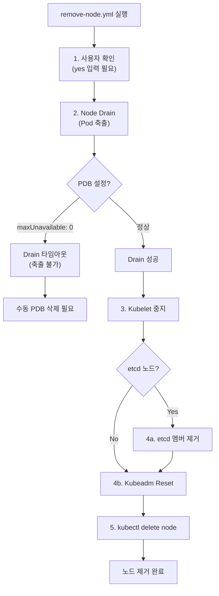
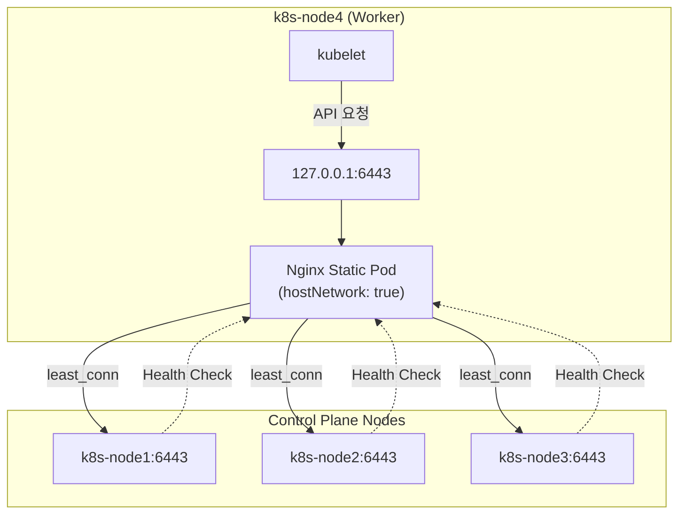
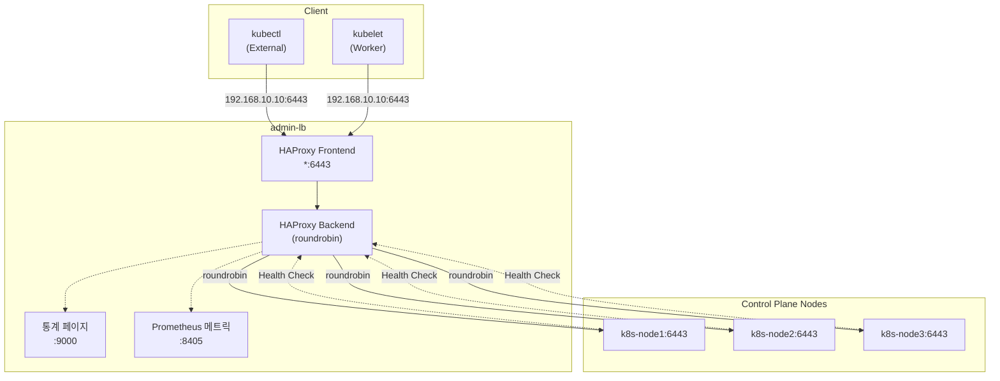
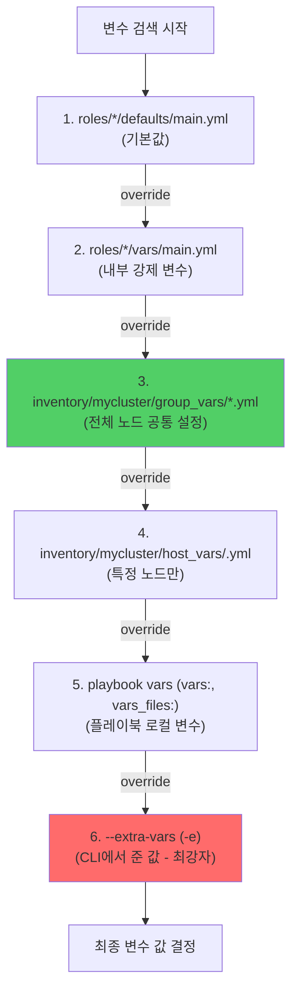

# [K8s-Deploy] Week 5 - Kubespray HA & Upgrade

> **고가용성 Kubernetes 클러스터 운영**: Kubespray를 활용한 HA 구성, API 엔드포인트 전략, 노드 관리 및 클러스터 업그레이드

## 📋 목차

1. [🎯 Week 5 학습 목표](#-week-5-학습-목표)
   - [핵심 주제](#1-핵심-주제)
   - [실습 환경](#2-실습-환경)

2. [🏗️ 실습 환경 구성](#️-실습-환경-구성)
   - [가상머신 구성](#1-가상머신-구성)
   - [초기화 스크립트 분석](#2-초기화-스크립트-분석)
   - [Kubespray 배포](#3-kubespray-배포)

3. [🌐 K8S API 엔드포인트 전략](#-k8s-api-엔드포인트-전략)
   - [Case 1: Client-Side LoadBalancing](#case-1-client-side-loadbalancing)
   - [Case 2: External LB + Client-Side LB](#case-2-external-lb--client-side-lb)
   - [Case 3: External LB Only](#case-3-external-lb-only)

4. [🔧 노드 관리](#-노드-관리)
   - [노드 추가 (scale.yml)](#1-노드-추가-scaleyml)
   - [노드 제거 (remove-node.yml)](#2-노드-제거-remove-nodeyml)
   - [비정상 노드 강제 삭제](#3-비정상-노드-강제-삭제)
   - [클러스터 리셋 (reset.yml)](#4-클러스터-리셋-resetyml)

5. [📊 모니터링 설정](#-모니터링-설정)
   - [kube-ops-view 설치](#1-kube-ops-view-설치)
   - [HAProxy 통계 페이지](#2-haproxy-통계-페이지)

6. [💡 핵심 개념 정리](#-핵심-개념-정리)
   - [Client-Side vs External LoadBalancing](#1-client-side-vs-external-loadbalancing)
   - [Kubespray 변수 우선순위](#2-kubespray-변수-우선순위)
   - [etcd Deployment Type](#3-etcd-deployment-type)
   - [PodDisruptionBudget과 Drain](#4-poddisruptionbudget과-drain)

7. [🐛 트러블슈팅](#-트러블슈팅)
   - [인증서 SAN 추가](#1-인증서-san-추가)
   - [Containerd rlimits 이슈](#2-containerd-rlimits-이슈)
   - [PDB로 인한 Drain 실패](#3-pdb로-인한-drain-실패)

8. [🎓 Week 5 학습 정리](#-week-5-학습-정리)

9. [📚 참고 자료](#-참고-자료)

---

## 🎯 Week 5 학습 목표

### 1. 핵심 주제

Week 5에서는 **Kubespray를 활용한 고가용성(HA) Kubernetes 클러스터 구성 및 운영**을 학습합니다.

**주요 학습 포인트**:
- ✅ **HA 클러스터 구성**: 3-Node Control Plane, 2-Node Worker
- ✅ **API 엔드포인트 전략**: Client-Side LB vs External LB
- ✅ **노드 라이프사이클 관리**: 추가(scale), 제거(remove-node), 리셋(reset)
- ✅ **장애 시나리오**: Control Plane 노드 장애 시 동작 확인
- ✅ **LoadBalancing**: HAProxy, Nginx, Kube-VIP 비교
- ✅ **모니터링**: kube-ops-view, HAProxy 통계

### 2. 실습 환경

**가상머신 구성** (Case2: External LB + HA Control Plane):

| 호스트명 | 역할 | CPU | RAM | IP 주소 |
|----------|------|-----|-----|----------|
| admin-lb | Kubespray 실행, API LB | 2 | 1GB | 192.168.10.10 |
| k8s-node1 | Control Plane | 4 | 2GB | 192.168.10.11 |
| k8s-node2 | Control Plane | 4 | 2GB | 192.168.10.12 |
| k8s-node3 | Control Plane | 4 | 2GB | 192.168.10.13 |
| k8s-node4 | Worker | 4 | 2GB | 192.168.10.14 |
| k8s-node5 | Worker | 4 | 2GB | 192.168.10.15 |

**소프트웨어 버전**:
- **OS**: Rocky Linux 10.0
- **Kubernetes**: v1.32.9
- **Kubespray**: v2.29.1
- **Containerd**: v2.1.5
- **etcd**: v3.5.25
- **Python**: 3.12.9

**네트워크 설정**:
- **Pod CIDR**: 10.233.64.0/18
- **Service CIDR**: 10.233.0.0/18
- **CNI**: Flannel
- **Kube Proxy Mode**: iptables

---

## 🏗️ 실습 환경 구성

### 1. 가상머신 구성

**Vagrant를 이용한 VM 생성**:

```bash
# 디렉터리 생성 및 파일 다운로드
mkdir k8s-ha-kubespary && cd k8s-ha-kubespary
curl -O https://raw.githubusercontent.com/gasida/vagrant-lab/refs/heads/main/k8s-ha-kubespary/Vagrantfile
curl -O https://raw.githubusercontent.com/gasida/vagrant-lab/refs/heads/main/k8s-ha-kubespary/admin-lb.sh
curl -O https://raw.githubusercontent.com/gasida/vagrant-lab/refs/heads/main/k8s-ha-kubespary/init_cfg.sh

# VM 생성 (약 5분 소요)
vagrant up

# 상태 확인
vagrant status

# admin-lb 접속
vagrant ssh admin-lb
```

**Vagrantfile 구조**:
```ruby
Vagrant.configure("2") do |config|
  config.vm.box = "rockylinux/10"

  # admin-lb 노드
  config.vm.define "admin-lb" do |cfg|
    cfg.vm.hostname = "admin-lb"
    cfg.vm.network "private_network", ip: "192.168.10.10"
    cfg.vm.provision "shell", path: "admin-lb.sh"
  end

  # k8s-node1~5 노드
  (1..5).each do |i|
    config.vm.define "k8s-node#{i}" do |cfg|
      cfg.vm.hostname = "k8s-node#{i}"
      cfg.vm.network "private_network", ip: "192.168.10.1#{i}"
      cfg.vm.provision "shell", path: "init_cfg.sh"
    end
  end
end
```

---

### 2. 초기화 스크립트 분석

#### (1) admin-lb.sh - Kubespray 실행 노드

**주요 작업**:

```bash
#!/bin/bash

# 1. Timezone 및 NTP 설정
timedatectl set-timezone Asia/Seoul
chronyc sources

# 2. Firewalld 및 SELinux 비활성화
systemctl stop firewalld && systemctl disable firewalld
setenforce 0
sed -i 's/^SELINUX=enforcing$/SELINUX=permissive/' /etc/selinux/config

# 3. HAProxy 설치 및 설정
dnf install -y haproxy
cat <<EOF > /etc/haproxy/haproxy.cfg
global
    log /dev/log local0
    stats socket /var/lib/haproxy/stats
    stats timeout 30s

defaults
    log global
    mode tcp
    option tcplog
    timeout connect 5000ms
    timeout client 50000ms
    timeout server 50000ms

# Kubernetes API Server LoadBalancing
frontend kube-apiserver
    bind *:6443
    mode tcp
    default_backend kube-apiserver-backend

backend kube-apiserver-backend
    mode tcp
    balance roundrobin
    server k8s-node1 192.168.10.11:6443 check
    server k8s-node2 192.168.10.12:6443 check
    server k8s-node3 192.168.10.13:6443 check

# HAProxy 통계 페이지
frontend stats
    bind *:9000
    mode http
    stats enable
    stats uri /haproxy_stats
    stats refresh 30s

# Prometheus 메트릭
frontend prometheus
    bind *:8405
    http-request use-service prometheus-exporter if { path /metrics }
EOF

systemctl enable --now haproxy

# 4. NFS Server 설치
dnf install -y nfs-utils
mkdir -p /srv/nfs/share
chmod 777 /srv/nfs/share
echo "/srv/nfs/share *(rw,sync,no_root_squash)" >> /etc/exports
systemctl enable --now nfs-server

# 5. SSH 키 생성 및 배포
ssh-keygen -t rsa -N "" -f /root/.ssh/id_rsa
for i in {1..5}; do
  sshpass -p 'qwe123' ssh-copy-id -o StrictHostKeyChecking=no root@192.168.10.1$i
done

# 6. Kubespray 클론
cd /root
git clone -b v2.29.1 https://github.com/kubernetes-sigs/kubespray.git

# 7. kubectl, k9s, kubecolor, helm 설치
curl -LO "https://dl.k8s.io/release/$(curl -L -s https://dl.k8s.io/release/stable.txt)/bin/linux/amd64/kubectl"
chmod +x kubectl && mv kubectl /usr/local/bin/

curl -L https://github.com/derailed/k9s/releases/latest/download/k9s_linux_amd64.rpm -o k9s.rpm
dnf install -y k9s.rpm

curl -L https://github.com/hidetatz/kubecolor/releases/latest/download/kubecolor_*_linux_amd64.tar.gz | tar xz
mv kubecolor /usr/local/bin/

curl -fsSL https://raw.githubusercontent.com/helm/helm/main/scripts/get-helm-3 | bash
```

**HAProxy 설정 포인트**:
- ✅ **Frontend**: `*:6443` - 모든 인터페이스에서 수신
- ✅ **Backend**: roundrobin 알고리즘으로 3개 Control Plane에 분산
- ✅ **Health Check**: `check` 옵션으로 장애 노드 자동 제외
- ✅ **통계 페이지**: `http://192.168.10.10:9000/haproxy_stats`
- ✅ **Prometheus 메트릭**: `http://192.168.10.10:8405/metrics`

---

#### (2) init-cfg.sh - K8s 노드 초기화

**주요 작업**:

```bash
#!/bin/bash

# 1. Swap 비활성화 및 파티션 삭제
swapoff -a
sed -i '/swap/d' /etc/fstab

# 2. 커널 모듈 로드
cat <<EOF > /etc/modules-load.d/k8s.conf
overlay
br_netfilter
EOF
modprobe overlay
modprobe br_netfilter

# 3. 커널 파라미터 설정
cat <<EOF > /etc/sysctl.d/k8s.conf
net.bridge.bridge-nf-call-iptables = 1
net.bridge.bridge-nf-call-ip6tables = 1
net.ipv4.ip_forward = 1
EOF
sysctl --system

# 4. SSH 설정
sed -i 's/^#PermitRootLogin yes/PermitRootLogin yes/' /etc/ssh/sshd_config
sed -i 's/^PasswordAuthentication no/PasswordAuthentication yes/' /etc/ssh/sshd_config
systemctl restart sshd
```

**설정 이유**:
- ✅ **Swap 비활성화**: Kubernetes는 메모리 예측 가능성을 위해 Swap 사용 금지
- ✅ **overlay**: OverlayFS 파일시스템 (Container 이미지 레이어링)
- ✅ **br_netfilter**: Bridge 트래픽이 iptables를 거치도록 설정
- ✅ **ip_forward**: Pod 간 통신을 위한 IP 포워딩

---

### 3. Kubespray 배포

#### (1) Inventory 설정

```bash
cd /root/kubespray/

# 기본 inventory 확인
cat inventory/mycluster/inventory.ini
```

**inventory.ini 구조**:
```ini
[all]
k8s-node1 ansible_host=192.168.10.11 ip=192.168.10.11
k8s-node2 ansible_host=192.168.10.12 ip=192.168.10.12
k8s-node3 ansible_host=192.168.10.13 ip=192.168.10.13
k8s-node4 ansible_host=192.168.10.14 ip=192.168.10.14
k8s-node5 ansible_host=192.168.10.15 ip=192.168.10.15

[kube_control_plane]
k8s-node1
k8s-node2
k8s-node3

[etcd]
k8s-node1
k8s-node2
k8s-node3

[kube_node]
k8s-node1
k8s-node2
k8s-node3
k8s-node4
k8s-node5

[k8s_cluster:children]
kube_control_plane
kube_node
```

**주요 그룹**:
- ✅ **kube_control_plane**: API Server, Scheduler, Controller-Manager
- ✅ **etcd**: etcd 클러스터 노드
- ✅ **kube_node**: kubelet, kube-proxy 실행 노드 (Control Plane도 포함)

---

#### (2) 변수 설정

```bash
# CNI 변경: Calico → Flannel
sed -i 's|kube_network_plugin: calico|kube_network_plugin: flannel|g' \
  inventory/mycluster/group_vars/k8s_cluster/k8s-cluster.yml

# Kube-Proxy 모드 변경: ipvs → iptables
sed -i 's|kube_proxy_mode: ipvs|kube_proxy_mode: iptables|g' \
  inventory/mycluster/group_vars/k8s_cluster/k8s-cluster.yml

# NodeLocalDNS 비활성화
sed -i 's|enable_nodelocaldns: true|enable_nodelocaldns: false|g' \
  inventory/mycluster/group_vars/k8s_cluster/k8s-cluster.yml

# DNS Autoscaler 비활성화
echo "enable_dns_autoscaler: false" >> \
  inventory/mycluster/group_vars/k8s_cluster/k8s-cluster.yml

# Flannel 인터페이스 설정
echo "flannel_interface: enp0s9" >> \
  inventory/mycluster/group_vars/k8s_cluster/k8s-net-flannel.yml

# Metrics Server 활성화
sed -i 's|metrics_server_enabled: false|metrics_server_enabled: true|g' \
  inventory/mycluster/group_vars/k8s_cluster/addons.yml
```

**설정 이유**:
- ✅ **Flannel**: 가볍고 간단한 CNI (VXLAN)
- ✅ **iptables**: ipvs보다 디버깅 용이
- ✅ **flannel_interface**: Vagrant Private Network 인터페이스 지정
- ✅ **NodeLocalDNS 비활성화**: 실습 환경 단순화

---

#### (3) 배포 실행

```bash
ANSIBLE_FORCE_COLOR=true ansible-playbook \
  -i inventory/mycluster/inventory.ini \
  -v cluster.yml \
  -e kube_version="1.32.9" \
  | tee kubespray_install.log
```

**소요 시간**: 약 8분

**배포 과정**:
1. **Preflight Check**: 사전 검증
2. **Container Engine 설치**: Containerd, Runc, CNI Plugins
3. **etcd 클러스터 구성**: systemd unit으로 3-Node 클러스터
4. **Kubernetes 설치**: kubeadm, kubelet, kubectl
5. **Control Plane 구성**: kubeadm init (첫 번째 노드) → join (나머지 노드)
6. **CNI 설치**: Flannel DaemonSet
7. **애드온 설치**: CoreDNS, Metrics Server

---

#### (4) 배포 확인

```bash
# kubeconfig 복사
mkdir /root/.kube
scp k8s-node1:/root/.kube/config /root/.kube/
sed -i 's/127.0.0.1/192.168.10.11/g' /root/.kube/config

# 노드 확인
kubectl get node -owide
```

**출력 예시**:
```
NAME         STATUS   ROLES           AGE   VERSION   INTERNAL-IP     OS-IMAGE
k8s-node1    Ready    control-plane   5m    v1.32.9   192.168.10.11   Rocky Linux 10.0
k8s-node2    Ready    control-plane   5m    v1.32.9   192.168.10.12   Rocky Linux 10.0
k8s-node3    Ready    control-plane   5m    v1.32.9   192.168.10.13   Rocky Linux 10.0
k8s-node4    Ready    <none>          5m    v1.32.9   192.168.10.14   Rocky Linux 10.0
k8s-node5    Ready    <none>          5m    v1.32.9   192.168.10.15   Rocky Linux 10.0
```

```bash
# etcd 클러스터 확인
ssh k8s-node1 etcdctl.sh member list -w table
```

**출력 예시**:
```
+------------------+---------+-----------+----------------------------+----------------------------+
|        ID        | STATUS  |   NAME    |         PEER ADDRS         |        CLIENT ADDRS        |
+------------------+---------+-----------+----------------------------+----------------------------+
| 8e9e05c52164694d | started | k8s-node1 | https://192.168.10.11:2380 | https://192.168.10.11:2379 |
| 2f98a53f33e3d3a4 | started | k8s-node2 | https://192.168.10.12:2380 | https://192.168.10.12:2379 |
| fd422379fda50e48 | started | k8s-node3 | https://192.168.10.13:2380 | https://192.168.10.13:2379 |
+------------------+---------+-----------+----------------------------+----------------------------+
```

```bash
# Control Plane Static Pod 확인
kubectl get pod -n kube-system -o wide | grep -E "node1|node2|node3"
```

**출력**:
```
kube-apiserver-k8s-node1            1/1   Running   k8s-node1
kube-controller-manager-k8s-node1   1/1   Running   k8s-node1
kube-scheduler-k8s-node1            1/1   Running   k8s-node1
kube-apiserver-k8s-node2            1/1   Running   k8s-node2
kube-controller-manager-k8s-node2   1/1   Running   k8s-node2
kube-scheduler-k8s-node3            1/1   Running   k8s-node3
```

---

## 🌐 K8S API 엔드포인트 전략

Kubernetes 클러스터에서 **API Server에 접근하는 방법**은 다음 3가지 Case로 구분됩니다.

---

### Case 1: Client-Side LoadBalancing

**구조**: HA Control Plane + Worker Client-Side LoadBalancing



**특징**:
- ✅ **Control Plane 노드**: 로컬 API Server 직접 접근 (`127.0.0.1:6443`)
- ✅ **Worker 노드**: Nginx Static Pod를 통한 Client-Side LB
- ✅ **외부 LB 불필요**: 각 노드가 독립적으로 LB 운영
- ✅ **장애 조치**: Nginx가 `least_conn` 알고리즘으로 자동 failover

**Nginx 설정** (`/etc/kubernetes/nginx-proxy.conf`):

```nginx
error_log stderr notice;

events {
    worker_connections 1024;
}

stream {
    upstream kube_apiserver {
        least_conn;
        server 192.168.10.11:6443;
        server 192.168.10.12:6443;
        server 192.168.10.13:6443;
    }

    server {
        listen        127.0.0.1:6443;
        proxy_pass    kube_apiserver;
        proxy_timeout 10m;
        proxy_connect_timeout 1s;
    }
}
```

**Nginx Static Pod Manifest** (`/etc/kubernetes/manifests/nginx-proxy.yaml`):

```yaml
apiVersion: v1
kind: Pod
metadata:
  name: nginx-proxy
  namespace: kube-system
spec:
  hostNetwork: true
  containers:
  - name: nginx-proxy
    image: docker.io/library/nginx:1.27.3-alpine
    command:
    - nginx
    - -c
    - /etc/nginx/nginx.conf
    - -g
    - daemon off;
    volumeMounts:
    - name: nginx-config
      mountPath: /etc/nginx/nginx.conf
      readOnly: true
  volumes:
  - name: nginx-config
    hostPath:
      path: /etc/kubernetes/nginx-proxy.conf
```

**kubelet 엔드포인트 확인**:

```bash
# Worker 노드에서 kubelet이 사용하는 API Server 엔드포인트
ssh k8s-node4 grep "server:" /etc/kubernetes/kubelet.conf
```

**출력**:
```yaml
server: https://127.0.0.1:6443
```

---

### Case 2: External LB + Client-Side LB

**구조**: External LB (HAProxy) + HA Control Plane + Worker Client-Side LB



**특징**:
- ✅ **External LB**: kubectl 등 외부 접근용
- ✅ **Control Plane**: 로컬 API Server 직접 접근
- ✅ **Worker**: Client-Side LB (Nginx Static Pod)
- ✅ **이중 장애 보호**: HAProxy + Nginx 모두 장애 대응

**설정 방법**:

```yaml
# inventory/mycluster/group_vars/all/all.yml
apiserver_loadbalancer_domain_name: "k8s-api-srv.admin-lb.com"
loadbalancer_apiserver:
  address: 192.168.10.10
  port: 6443

# 인증서 SAN에 External LB IP 추가
supplementary_addresses_in_ssl_keys: [192.168.10.10, k8s-api-srv.admin-lb.com]
```

**재배포** (Control Plane 인증서만):

```bash
ansible-playbook -i inventory/mycluster/inventory.ini -v cluster.yml \
  --tags "control-plane" \
  --limit kube_control_plane \
  -e kube_version="1.32.9"
```

**인증서 SAN 확인**:

```bash
ssh k8s-node1 openssl x509 -in /etc/kubernetes/ssl/apiserver.crt -text -noout | grep -A1 "Subject Alternative Name"
```

**출력**:
```
X509v3 Subject Alternative Name:
    DNS:k8s-api-srv.admin-lb.com, DNS:k8s-node1, DNS:kubernetes, DNS:kubernetes.default, DNS:kubernetes.default.svc, DNS:kubernetes.default.svc.cluster.local, IP Address:192.168.10.10, IP Address:192.168.10.11, IP Address:192.168.10.12, IP Address:192.168.10.13, IP Address:10.233.0.1
```

---

### Case 3: External LB Only

**구조**: 모든 노드가 External LB 단일 엔드포인트 사용



**특징**:
- ✅ **단일 엔드포인트**: 모든 노드가 HAProxy 사용
- ✅ **Client-Side LB 비활성화**: Nginx Static Pod 미배포
- ✅ **중앙 집중식 관리**: LB 설정 변경 용이
- ⚠️ **SPOF**: HAProxy 자체가 단일 장애점

**설정 방법**:

```yaml
# inventory/mycluster/group_vars/all/all.yml
apiserver_loadbalancer_domain_name: "k8s-api-srv.admin-lb.com"
loadbalancer_apiserver:
  address: 192.168.10.10
  port: 6443
loadbalancer_apiserver_localhost: false  # Client-Side LB 미사용
supplementary_addresses_in_ssl_keys: [192.168.10.10, k8s-api-srv.admin-lb.com]
```

**프로덕션 환경**:
- ✅ **HAProxy HA**: Keepalived + VIP로 HAProxy 자체 HA 구성
- ✅ **Cloud LB**: AWS ELB, GCP LB, Azure LB 사용

---

## 🔧 노드 관리

### 1. 노드 추가 (scale.yml)

**시나리오**: k8s-node5 Worker 노드를 클러스터에 추가

#### (1) scale.yml 실행 흐름



---

#### (2) 실습: k8s-node5 제거 후 재추가

**Step 1**: k8s-node5 제거 (테스트용)

```bash
ansible-playbook -i inventory/mycluster/inventory.ini -v remove-node.yml \
  -e node=k8s-node5
```

**Step 2**: inventory.ini 수정

```bash
vi inventory/mycluster/inventory.ini
```

```ini
# k8s-node5를 [kube_node] 그룹에 추가
[kube_node]
k8s-node1
k8s-node2
k8s-node3
k8s-node4
k8s-node5  # 추가
```

**Step 3**: scale.yml 실행

```bash
ANSIBLE_FORCE_COLOR=true ansible-playbook \
  -i inventory/mycluster/inventory.ini \
  -v scale.yml \
  --limit=k8s-node5 \
  -e kube_version="1.32.9"
```

**소요 시간**: 약 3분

**Step 4**: 노드 확인

```bash
kubectl get node
```

**출력**:
```
NAME         STATUS   ROLES           AGE
k8s-node1    Ready    control-plane   20m
k8s-node2    Ready    control-plane   20m
k8s-node3    Ready    control-plane   20m
k8s-node4    Ready    <none>          20m
k8s-node5    Ready    <none>          1m   # 새로 추가됨
```

---

#### (3) scale.yml 주요 Task 분석

**Task 1**: etcd 설정 (Control Plane 노드만)

```yaml
- name: Join etcd member
  command: |
    etcdctl member add k8s-node5 \
      --peer-urls=https://192.168.10.15:2380
  when: "'kube_control_plane' in group_names"
```

**Task 2**: Container Engine 설치

```yaml
- name: Install containerd
  import_role:
    name: container-engine/containerd
```

**Task 3**: kubeadm join 실행

```yaml
- name: Join node to cluster
  command: |
    kubeadm join 192.168.10.11:6443 \
      --token {{ bootstrap_token }} \
      --discovery-token-ca-cert-hash sha256:{{ ca_cert_hash }} \
      --node-name k8s-node5
```

**Task 4**: Node Label 적용

```yaml
- name: Label node as worker
  command: |
    kubectl label node k8s-node5 \
      node-role.kubernetes.io/worker=worker
  delegate_to: "{{ groups['kube_control_plane'][0] }}"
```

---

### 2. 노드 제거 (remove-node.yml)

**시나리오**: k8s-node5 Worker 노드를 클러스터에서 제거

#### (1) remove-node.yml 실행 흐름



---

#### (2) 실습: k8s-node5 제거

**Step 1**: remove-node.yml 실행

```bash
ansible-playbook -i inventory/mycluster/inventory.ini -v remove-node.yml \
  -e node=k8s-node5
```

**프롬프트**:
```
Are you sure you want to remove node k8s-node5? (yes/no)
> yes
```

**소요 시간**: 약 2분 (PDB 없을 경우 20초)

**Step 2**: 노드 확인

```bash
kubectl get node
```

**출력**:
```
NAME         STATUS   ROLES           AGE
k8s-node1    Ready    control-plane   25m
k8s-node2    Ready    control-plane   25m
k8s-node3    Ready    control-plane   25m
k8s-node4    Ready    <none>          25m
# k8s-node5 제거됨
```

---

#### (3) PodDisruptionBudget (PDB) 이슈

**문제**: `maxUnavailable: 0` 설정으로 Drain 타임아웃

**PDB 예시**:

```yaml
apiVersion: policy/v1
kind: PodDisruptionBudget
metadata:
  name: webpod
spec:
  maxUnavailable: 0  # Drain 시 축출 불가
  selector:
    matchLabels:
      app: webpod
```

**Drain 실패 로그**:

```
TASK [remove-node/pre-remove : Drain node] ****
fatal: [k8s-node5]: FAILED! => {
  "msg": "error: cannot delete Pods with local storage (use --delete-emptydir-data to override): default/webpod-xxx\nerror: unable to drain node \"k8s-node5\" due to error:cannot delete Pods with local storage (continuing command...)\nThere are pending nodes to be drained:\n k8s-node5\nerror: cannot delete DaemonSet-managed Pods (use --ignore-daemonsets to ignore): kube-system/kube-flannel-xxx"
}
```

**해결 방법**:

1. **PDB 삭제**:
```bash
kubectl delete pdb webpod
```

2. **PDB 설정 변경**:
```bash
kubectl edit pdb webpod
# maxUnavailable: 0 → 1로 변경
```

3. **강제 Drain**:
```bash
kubectl drain k8s-node5 \
  --ignore-daemonsets \
  --delete-emptydir-data \
  --force
```

---

### 3. 비정상 노드 강제 삭제

**시나리오**: NotReady 상태이며 SSH 접속 불가능한 노드 제거

#### (1) 문제 상황

```bash
# k8s-node5가 NotReady 상태
kubectl get node
```

**출력**:
```
NAME         STATUS     ROLES   AGE
k8s-node5    NotReady   <none>  10m
```

**SSH 접속 실패**:
```bash
ssh k8s-node5
# Connection refused
```

---

#### (2) 강제 삭제 명령어

```bash
ansible-playbook -i inventory/mycluster/inventory.ini -v remove-node.yml \
  -e node=k8s-node5 \
  -e reset_nodes=false \
  -e allow_ungraceful_removal=true \
  -e skip_confirmation=true
```

**파라미터 설명**:
- ✅ **reset_nodes=false**: 노드에 SSH 접속하여 kubeadm reset 수행 안 함
- ✅ **allow_ungraceful_removal=true**: Drain 실패 시에도 계속 진행
- ✅ **skip_confirmation=true**: 확인 프롬프트 스킵

---

#### (3) 수동 정리 (필요 시)

```bash
# etcd 멤버 제거 (Control Plane 노드였을 경우)
ssh k8s-node1 etcdctl.sh member list
ssh k8s-node1 etcdctl.sh member remove <member-id>

# Kubernetes 노드 삭제
kubectl delete node k8s-node5

# iptables 규칙 정리
ssh k8s-node1 iptables -t nat -D KUBE-SERVICES -d 192.168.10.15 -j REJECT
```

---

### 4. 클러스터 리셋 (reset.yml)

**경고**: ⚠️ **전체 클러스터를 설치 전 상태로 완전 제거 (복구 불가)**

#### (1) reset.yml 실행

```bash
ansible-playbook -i inventory/mycluster/inventory.ini -v reset.yml
```

**프롬프트**:
```
Are you sure you want to reset the entire cluster? (yes/no)
> yes
```

---

#### (2) reset.yml 주요 Task

```yaml
# 1. kubectl drain (모든 노드)
- name: Drain all nodes
  command: kubectl drain {{ inventory_hostname }} --ignore-daemonsets --delete-emptydir-data

# 2. kubeadm reset (모든 노드)
- name: Reset kubeadm
  command: kubeadm reset -f

# 3. etcd 데이터 삭제
- name: Remove etcd data
  file:
    path: /var/lib/etcd
    state: absent

# 4. Kubernetes 설정 삭제
- name: Remove Kubernetes config
  file:
    path: "{{ item }}"
    state: absent
  loop:
  - /etc/kubernetes
  - /var/lib/kubelet
  - /var/lib/dockershim
  - /var/run/kubernetes
  - /var/lib/cni
  - /etc/cni/net.d

# 5. Container Runtime 중지
- name: Stop containerd
  systemd:
    name: containerd
    state: stopped

# 6. iptables 규칙 삭제
- name: Flush iptables
  command: iptables -F && iptables -t nat -F && iptables -t mangle -F && iptables -X
```

---

#### (3) 재배포

```bash
# 다시 cluster.yml 실행
ANSIBLE_FORCE_COLOR=true ansible-playbook \
  -i inventory/mycluster/inventory.ini \
  -v cluster.yml \
  -e kube_version="1.32.9"
```

---

## 📊 모니터링 설정

### 1. kube-ops-view 설치

**kube-ops-view**: Kubernetes 클러스터를 실시간으로 시각화하는 도구

#### (1) Helm 설치

```bash
helm repo add geek-cookbook https://geek-cookbook.github.io/charts/
helm repo update

helm install kube-ops-view geek-cookbook/kube-ops-view \
  --version 1.2.2 \
  --set service.main.type=NodePort \
  --set service.main.ports.http.nodePort=30000 \
  --set env.TZ="Asia/Seoul" \
  --namespace kube-system \
  --set image.repository="abihf/kube-ops-view" \
  --set image.tag="latest"
```

---

#### (2) 접속

```bash
# 브라우저 열기
open "http://192.168.10.14:30000/#scale=1.5"
```

**화면 구성**:
- ✅ **노드별 Pod 배치**: 각 노드에 실행 중인 Pod 시각화
- ✅ **리소스 사용률**: CPU, Memory 사용률 표시
- ✅ **실시간 업데이트**: Pod 생성/삭제 실시간 반영

---

#### (3) 장애 시나리오 모니터링

**신규 터미널 1**: kube-ops-view 접속
```bash
open "http://192.168.10.14:30000/#scale=1.5"
```

**신규 터미널 2**: 노드 상태 모니터링
```bash
watch -d kubectl get node
```

**admin-lb**: k8s-node1 중지
```bash
ssh k8s-node1 poweroff
```

**결과**:
- ✅ k8s-node1 상태: Ready → NotReady (약 40초 후)
- ✅ k8s-node1 Pod 상태: Terminating → 다른 노드에서 재생성
- ✅ API Server 접근: 정상 (k8s-node2, k8s-node3로 자동 failover)

---

### 2. HAProxy 통계 페이지

**접속**:
```bash
open "http://192.168.10.10:9000/haproxy_stats"
```

**주요 지표**:
- ✅ **Backend Status**: k8s-node1~3의 Health Check 상태
- ✅ **Session Rate**: 초당 요청 수
- ✅ **Total Sessions**: 총 세션 수
- ✅ **Bytes In/Out**: 트래픽 통계

**Prometheus 메트릭**:
```bash
curl http://192.168.10.10:8405/metrics
```

**주요 메트릭**:
```
haproxy_backend_up{backend="kube-apiserver-backend"} 3
haproxy_server_up{server="k8s-node1"} 1
haproxy_server_up{server="k8s-node2"} 1
haproxy_server_up{server="k8s-node3"} 1
```

---

## 💡 핵심 개념 정리

### 1. Client-Side vs External LoadBalancing

#### (1) 비교표

| 항목 | Client-Side LB | External LB |
|------|----------------|-------------|
| **구현** | Nginx Static Pod (각 노드) | HAProxy, AWS ELB, GCP LB |
| **장점** | 외부 의존성 없음, 자동 failover | 중앙 집중식 관리, 모니터링 용이 |
| **단점** | 리소스 오버헤드, 설정 복잡 | SPOF, 인프라팀 협업 필요 |
| **적합 환경** | On-Premise, 소규모 클러스터 | Cloud, 대규모 프로덕션 |

---

#### (2) Client-Side LoadBalancing 동작 원리



**동작 과정**:
1. kubelet이 `127.0.0.1:6443`으로 API 요청
2. Nginx Static Pod가 요청 수신
3. `least_conn` 알고리즘으로 가장 적은 연결 수를 가진 API Server 선택
4. 선택된 API Server로 요청 전달
5. Health Check 실패 시 해당 노드 자동 제외

---

#### (3) External LoadBalancing (HAProxy)



**동작 과정**:
1. Client가 `192.168.10.10:6443`으로 요청
2. HAProxy Frontend가 요청 수신
3. `roundrobin` 알고리즘으로 순차적으로 API Server 선택
4. Health Check 실패 시 해당 노드 자동 제외
5. 통계 페이지 및 Prometheus 메트릭 제공

---

### 2. Kubespray 변수 우선순위



**실전 팁**:
- ✅ **99% 조절**: `inventory/mycluster/group_vars/`에서 조절
- ✅ **긴급 변경**: `-e` 옵션으로 CLI에서 즉시 override
- ✅ **특정 노드만**: `host_vars/` 사용
- ✅ **변수 검색**: `grep -Rn "변수명" inventory/ roles/ playbooks/`

**예시**:

```bash
# kube_version 변수 검색
grep -Rn "kube_version" inventory/mycluster/ roles/ playbooks/

# 우선순위 확인
# 1. roles/kubernetes/defaults/main.yml: kube_version: "1.32.0" (기본값)
# 2. inventory/mycluster/group_vars/k8s_cluster/k8s-cluster.yml: kube_version: "1.32.9" (사용자 설정)
# 3. CLI: -e kube_version="1.33.0" (최우선)
```

---

### 3. etcd Deployment Type

#### (1) host (systemd unit) - Kubespray 기본값

```yaml
# inventory/mycluster/group_vars/etcd.yml
etcd_deployment_type: host
```

**특징**:
- ✅ **독립 관리**: systemd unit으로 etcd 실행
- ✅ **kubeadm 독립**: kubeadm에 종속되지 않음
- ✅ **업그레이드 용이**: etcd만 별도 업그레이드 가능
- ✅ **백업/복구**: systemctl로 간편하게 관리

**etcd.service**:

```ini
[Unit]
Description=etcd
After=network.target

[Service]
Type=notify
ExecStart=/usr/local/bin/etcd \
  --name=k8s-node1 \
  --data-dir=/var/lib/etcd \
  --listen-client-urls=https://192.168.10.11:2379 \
  --advertise-client-urls=https://192.168.10.11:2379 \
  --listen-peer-urls=https://192.168.10.11:2380 \
  --initial-advertise-peer-urls=https://192.168.10.11:2380 \
  --cert-file=/etc/ssl/etcd/ssl/member-k8s-node1.pem \
  --key-file=/etc/ssl/etcd/ssl/member-k8s-node1-key.pem \
  --peer-cert-file=/etc/ssl/etcd/ssl/member-k8s-node1.pem \
  --peer-key-file=/etc/ssl/etcd/ssl/member-k8s-node1-key.pem \
  --trusted-ca-file=/etc/ssl/etcd/ssl/ca.pem \
  --peer-trusted-ca-file=/etc/ssl/etcd/ssl/ca.pem
Restart=on-failure

[Install]
WantedBy=multi-user.target
```

**관리 명령어**:

```bash
# etcd 상태 확인
systemctl status etcd

# etcd 재시작
systemctl restart etcd

# etcd 로그 확인
journalctl -u etcd -f

# etcd 멤버 확인
etcdctl member list -w table

# etcd 백업
etcdctl snapshot save /tmp/etcd-backup.db
```

---

#### (2) kubeadm (Static Pod)

```yaml
# inventory/mycluster/group_vars/etcd.yml
etcd_deployment_type: kubeadm
```

**특징**:
- ✅ **kubeadm 통합**: kubeadm이 etcd 관리
- ✅ **Static Pod**: `/etc/kubernetes/manifests/etcd.yaml`
- ⚠️ **종속성**: kubeadm에 의존적
- ⚠️ **업그레이드 복잡**: kubeadm upgrade 시 함께 업그레이드

**etcd Static Pod Manifest**:

```yaml
apiVersion: v1
kind: Pod
metadata:
  name: etcd
  namespace: kube-system
spec:
  containers:
  - name: etcd
    image: registry.k8s.io/etcd:3.5.25-0
    command:
    - etcd
    - --name=k8s-node1
    - --data-dir=/var/lib/etcd
    # ...
    volumeMounts:
    - name: etcd-data
      mountPath: /var/lib/etcd
  volumes:
  - name: etcd-data
    hostPath:
      path: /var/lib/etcd
      type: DirectoryOrCreate
```

---

#### (3) 비교표

| 항목 | host (systemd) | kubeadm (Static Pod) |
|------|----------------|----------------------|
| **관리 도구** | systemctl | kubectl |
| **업그레이드** | etcd만 별도 업그레이드 | kubeadm upgrade 필요 |
| **백업/복구** | systemctl stop → 백업 | 더 복잡 |
| **장애 복구** | systemctl restart | Pod 재시작 |
| **적합 환경** | 프로덕션, 운영 편의성 중요 | kubeadm 통합 관리 선호 |

---

### 4. PodDisruptionBudget과 Drain

#### (1) PDB 동작 원리

**PodDisruptionBudget (PDB)**:
- ✅ **목적**: 자발적 중단(Voluntary Disruption) 시 최소 가용 Pod 수 보장
- ✅ **자발적 중단**: 노드 Drain, 클러스터 업그레이드, Pod 삭제
- ⚠️ **비자발적 중단**: 노드 장애, OOM, 하드웨어 고장 (PDB 적용 안 됨)

**PDB 예시**:

```yaml
apiVersion: policy/v1
kind: PodDisruptionBudget
metadata:
  name: webpod
spec:
  maxUnavailable: 1  # 최대 1개 Pod만 동시 중단 가능
  selector:
    matchLabels:
      app: webpod
```

**또는**:

```yaml
spec:
  minAvailable: 2  # 최소 2개 Pod는 항상 Running
  selector:
    matchLabels:
      app: webpod
```

---

#### (2) Drain과 PDB 충돌

**시나리오**: 3개 Replica Pod + maxUnavailable: 0

```yaml
apiVersion: apps/v1
kind: Deployment
metadata:
  name: webpod
spec:
  replicas: 3
  selector:
    matchLabels:
      app: webpod
  template:
    metadata:
      labels:
        app: webpod
    spec:
      containers:
      - name: nginx
        image: nginx
---
apiVersion: policy/v1
kind: PodDisruptionBudget
metadata:
  name: webpod
spec:
  maxUnavailable: 0  # 어떤 Pod도 중단 불가
  selector:
    matchLabels:
      app: webpod
```

**Drain 실행**:

```bash
kubectl drain k8s-node4 --ignore-daemonsets
```

**결과**:
```
error: cannot evict pod as it would violate the pod's disruption budget.
evicting pod default/webpod-xxx
error: Cannot evict pod as it would violate the pod's disruption budget.
```

**타임아웃**: Drain이 무한 대기 (기본 타임아웃 없음)

---

#### (3) 해결 방법

**방법 1**: PDB 설정 변경

```bash
kubectl edit pdb webpod
# maxUnavailable: 0 → 1로 변경
```

**방법 2**: PDB 임시 삭제

```bash
kubectl delete pdb webpod

# Drain 실행
kubectl drain k8s-node4 --ignore-daemonsets

# PDB 재생성
kubectl apply -f pdb.yaml
```

**방법 3**: 강제 Drain (권장하지 않음)

```bash
kubectl drain k8s-node4 \
  --ignore-daemonsets \
  --delete-emptydir-data \
  --force \
  --grace-period=0
```

---

#### (4) Best Practice

**프로덕션 환경**:

```yaml
apiVersion: policy/v1
kind: PodDisruptionBudget
metadata:
  name: webpod
spec:
  minAvailable: 2  # Replica 3개 중 최소 2개 유지
  selector:
    matchLabels:
      app: webpod
```

**또는**:

```yaml
spec:
  maxUnavailable: 1  # 최대 1개만 동시 중단 가능
```

**이유**:
- ✅ **고가용성 유지**: 최소 2개 Pod가 항상 서비스
- ✅ **Drain 가능**: 1개씩 축출 가능
- ✅ **Rolling Update 가능**: 점진적 업데이트

---

## 🐛 트러블슈팅

### 1. 인증서 SAN 추가

#### (1) 문제 상황

**증상**: External LB(192.168.10.10) 사용 시 인증서 오류

```bash
kubectl --server=https://192.168.10.10:6443 get node
```

**에러**:
```
Unable to connect to the server: x509: certificate is valid for 192.168.10.11, 192.168.10.12, 192.168.10.13, 10.233.0.1, 127.0.0.1, localhost, kubernetes, kubernetes.default, kubernetes.default.svc, kubernetes.default.svc.cluster.local, not 192.168.10.10
```

---

#### (2) 원인

**API Server 인증서 SAN**에 External LB IP가 없음

```bash
ssh k8s-node1 openssl x509 -in /etc/kubernetes/ssl/apiserver.crt -text -noout | grep -A1 "Subject Alternative Name"
```

**출력**:
```
X509v3 Subject Alternative Name:
    DNS:k8s-node1, DNS:kubernetes, IP Address:192.168.10.11, IP Address:10.233.0.1
```

---

#### (3) 해결 방법

**Step 1**: 변수 추가

```yaml
# inventory/mycluster/group_vars/k8s_cluster/k8s-cluster.yml
supplementary_addresses_in_ssl_keys:
  - 192.168.10.10
  - k8s-api-srv.admin-lb.com
```

**Step 2**: Control Plane 재배포 (인증서만)

```bash
ansible-playbook -i inventory/mycluster/inventory.ini -v cluster.yml \
  --tags "control-plane" \
  --limit kube_control_plane \
  -e kube_version="1.32.9"
```

**Step 3**: 인증서 확인

```bash
ssh k8s-node1 openssl x509 -in /etc/kubernetes/ssl/apiserver.crt -text -noout | grep -A1 "Subject Alternative Name"
```

**출력**:
```
X509v3 Subject Alternative Name:
    DNS:k8s-api-srv.admin-lb.com, DNS:k8s-node1, IP Address:192.168.10.10, IP Address:192.168.10.11
```

---

### 2. Containerd rlimits 이슈

#### (1) 문제 상황

**증상**: Nginx Proxy Pod 로그에 에러

```bash
kubectl logs -n kube-system nginx-proxy-k8s-node4
```

**에러**:
```
2026/02/04 12:00:00 [alert] 1#1: setrlimit(RLIMIT_NOFILE, 130048) failed (1: Operation not permitted)
```

---

#### (2) 원인

**Containerd 기본 rlimit**이 65535로 설정되어 있음

```bash
ssh k8s-node4 cat /etc/containerd/config.toml | grep -A5 rlimits
```

**출력**:
```toml
[plugins."io.containerd.grpc.v1.cri".containerd.runtimes.runc.options]
  BinaryName = "/usr/local/bin/runc"
  SystemdCgroup = true

  # Default rlimits
  [plugins."io.containerd.grpc.v1.cri".containerd.runtimes.runc.options.rlimits]
    [plugins."io.containerd.grpc.v1.cri".containerd.runtimes.runc.options.rlimits.NOFILE]
      hard = 65535
      soft = 65535
```

---

#### (3) 해결 방법

**Step 1**: 변수 추가

```yaml
# inventory/mycluster/group_vars/all/containerd.yml
containerd_default_base_runtime_spec_patch:
  process:
    rlimits: []  # 빈 배열로 설정하여 제한 제거
```

**Step 2**: Containerd 재설정

```bash
ansible-playbook -i inventory/mycluster/inventory.ini -v cluster.yml \
  --tags "containerd" \
  --limit k8s-node4,k8s-node5 \
  -e kube_version="1.32.9"
```

**Step 3**: Nginx Proxy Pod 재시작

```bash
ssh k8s-node4 crictl rmp $(crictl pods --name nginx-proxy -q)
```

**Step 4**: 로그 확인

```bash
kubectl logs -n kube-system nginx-proxy-k8s-node4
```

**정상 출력**:
```
2026/02/04 12:05:00 [notice] 1#1: using the "epoll" event method
2026/02/04 12:05:00 [notice] 1#1: nginx/1.27.3
2026/02/04 12:05:00 [notice] 1#1: start worker processes
```

---

### 3. PDB로 인한 Drain 실패

#### (1) 문제 상황

**증상**: remove-node.yml 실행 시 Drain 타임아웃

```bash
ansible-playbook -i inventory/mycluster/inventory.ini -v remove-node.yml \
  -e node=k8s-node4
```

**에러**:
```
TASK [remove-node/pre-remove : Drain node] ****
fatal: [k8s-node4]: FAILED! => {
  "msg": "error: cannot evict pod as it would violate the pod's disruption budget."
}
```

---

#### (2) 원인 확인

```bash
# PDB 확인
kubectl get pdb
```

**출력**:
```
NAME     MIN AVAILABLE   MAX UNAVAILABLE   ALLOWED DISRUPTIONS   AGE
webpod   N/A             0                 0                     10m
```

```bash
# PDB 상세 확인
kubectl describe pdb webpod
```

**출력**:
```
Name:           webpod
Min available:  N/A
Max unavailable:  0
Selector:       app=webpod
Status:
  Allowed disruptions:  0
  Current:              3
  Desired:              3
  Total:                3
```

---

#### (3) 해결 방법

**방법 1**: PDB 삭제

```bash
kubectl delete pdb webpod
```

**방법 2**: PDB 설정 변경

```bash
kubectl edit pdb webpod
# maxUnavailable: 0 → 1로 변경
```

**방법 3**: 강제 제거 (비추천)

```bash
ansible-playbook -i inventory/mycluster/inventory.ini -v remove-node.yml \
  -e node=k8s-node4 \
  -e allow_ungraceful_removal=true \
  -e skip_confirmation=true
```

---

## 🎓 Week 5 학습 정리

### 1. 핵심 개념 요약

#### (1) Kubespray HA 구성

**3가지 API 엔드포인트 전략**:
- ✅ **Case 1**: Client-Side LB (Nginx Static Pod) - 외부 LB 불필요
- ✅ **Case 2**: External LB + Client-Side LB - 이중 장애 보호
- ✅ **Case 3**: External LB Only - 중앙 집중식 관리

**선택 기준**:
- **On-Premise**: Case 1 (Client-Side LB)
- **Cloud**: Case 3 (External LB - AWS ELB, GCP LB)
- **하이브리드**: Case 2 (이중 보호)

---

#### (2) 노드 라이프사이클 관리

**3가지 Playbook**:
- ✅ **scale.yml**: 노드 추가 (약 3분)
- ✅ **remove-node.yml**: 노드 제거 (약 2분, PDB 없을 시 20초)
- ✅ **reset.yml**: 클러스터 완전 삭제 (복구 불가)

**주의사항**:
- ⚠️ **첫 번째 Control Plane 노드 제거 불가**: 클러스터 파괴 위험
- ⚠️ **PDB 확인**: Drain 전 PodDisruptionBudget 설정 확인
- ⚠️ **etcd 백업**: 노드 제거 전 etcd 스냅샷 백업 권장

---

#### (3) Kubespray 변수 우선순위

**6단계 Override Flow**:
1. roles/*/defaults/main.yml (기본값)
2. roles/*/vars/main.yml (내부 강제 변수)
3. **inventory/mycluster/group_vars/*.yml** (99% 여기서 조절)
4. inventory/mycluster/host_vars/<node>.yml (특정 노드만)
5. playbook vars (플레이북 로컬 변수)
6. **--extra-vars (-e)** (최우선)

---

#### (4) etcd Deployment Type

**2가지 배포 방식**:
- ✅ **host (systemd unit)**: 독립 관리, 업그레이드 용이 (프로덕션 권장)
- ✅ **kubeadm (Static Pod)**: kubeadm 통합 관리

**프로덕션 권장**: `etcd_deployment_type: host`

---

### 2. 실습 환경

**가상머신 구성**:
- **Control Plane**: 3 Nodes (k8s-node1~3)
- **Worker**: 2 Nodes (k8s-node4~5)
- **External LB**: 1 Node (admin-lb - HAProxy)

**소프트웨어 버전**:
- Kubernetes: v1.32.9
- Kubespray: v2.29.1
- etcd: v3.5.25
- Containerd: v2.1.5

---

### 3. 주요 명령어

**배포**:
```bash
# 전체 배포
ansible-playbook -i inventory/mycluster/inventory.ini -v cluster.yml -e kube_version="1.32.9"

# 노드 추가
ansible-playbook -i inventory/mycluster/inventory.ini -v scale.yml --limit=k8s-node5

# 노드 제거
ansible-playbook -i inventory/mycluster/inventory.ini -v remove-node.yml -e node=k8s-node5

# 클러스터 리셋
ansible-playbook -i inventory/mycluster/inventory.ini -v reset.yml
```

**모니터링**:
```bash
# kube-ops-view
open "http://192.168.10.14:30000/#scale=1.5"

# HAProxy 통계
open "http://192.168.10.10:9000/haproxy_stats"
```

---

### 4. 트러블슈팅 체크리스트

**배포 전**:
- [ ] Swap 비활성화 확인
- [ ] 커널 모듈 로드 (overlay, br_netfilter)
- [ ] SSH Passwordless 설정
- [ ] Firewalld/SELinux 비활성화

**배포 중**:
- [ ] inventory.ini 그룹 설정 확인
- [ ] Flannel 인터페이스 설정 (flannel_interface)
- [ ] External LB 사용 시 SAN 추가

**배포 후**:
- [ ] 노드 상태 확인 (kubectl get node)
- [ ] etcd 클러스터 확인 (etcdctl member list)
- [ ] Control Plane Pod 확인 (kubectl get pod -n kube-system)
- [ ] CoreDNS 동작 확인 (nslookup kubernetes.default)

**노드 제거 시**:
- [ ] PDB 설정 확인 (kubectl get pdb)
- [ ] etcd 백업 (etcdctl snapshot save)
- [ ] 첫 번째 Control Plane 노드가 아닌지 확인

---

### 5. Next Steps

**Week 6 Preview** (예상):
- ✅ **Kubernetes Upgrade**: Kubespray를 통한 클러스터 업그레이드
- ✅ **etcd Backup & Restore**: 백업 및 복구 전략
- ✅ **Certificate Management**: 인증서 갱신 및 관리
- ✅ **프로덕션 전환**: Best Practice 및 보안 강화

---

## 📚 참고 자료

### 공식 문서
- [Kubespray GitHub](https://github.com/kubernetes-sigs/kubespray)
- [Kubespray HA Mode 문서](https://github.com/kubernetes-sigs/kubespray/blob/master/docs/operations/ha-mode.md)
- [Kubespray Node Management](https://github.com/kubernetes-sigs/kubespray/blob/master/docs/operations/nodes.md)
- [Kubeadm Reset Workflow](https://kubernetes.io/docs/reference/setup-tools/kubeadm/kubeadm-reset/)
- [PodDisruptionBudget 공식 문서](https://kubernetes.io/docs/tasks/run-application/configure-pdb/)

### 송이레님 블로그 시리즈
- [Kubespray 클러스터 구성 - 엔드포인트 구성](https://sirzzang.github.io/kubernetes/Kubernetes-Kubespray-05-00/)
- [Kubespray 클러스터 구성 - 노드 추가](https://sirzzang.github.io/kubernetes/Kubernetes-Kubespray-06-00-01/)
- [Kubespray 클러스터 구성 - 노드 제거](https://sirzzang.github.io/kubernetes/Kubernetes-Kubespray-06-00-02/)

### 추가 자료
- [HAProxy 공식 문서](http://www.haproxy.org/)
- [Nginx TCP/UDP LoadBalancing](https://docs.nginx.com/nginx/admin-guide/load-balancer/tcp-udp-load-balancer/)
- [kube-ops-view GitHub](https://github.com/hjacobs/kube-ops-view)
- [Vagrant 공식 문서](https://www.vagrantup.com/docs)

---

**스터디**: CloudNet@ 가시다님 주관 - Kubernetes Deploy 스터디
