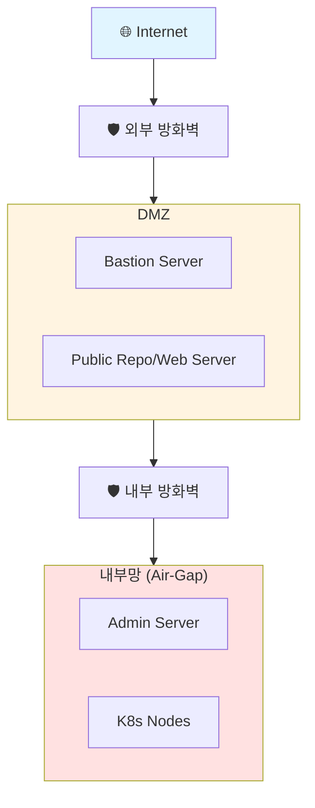
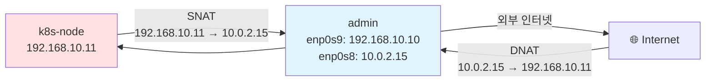
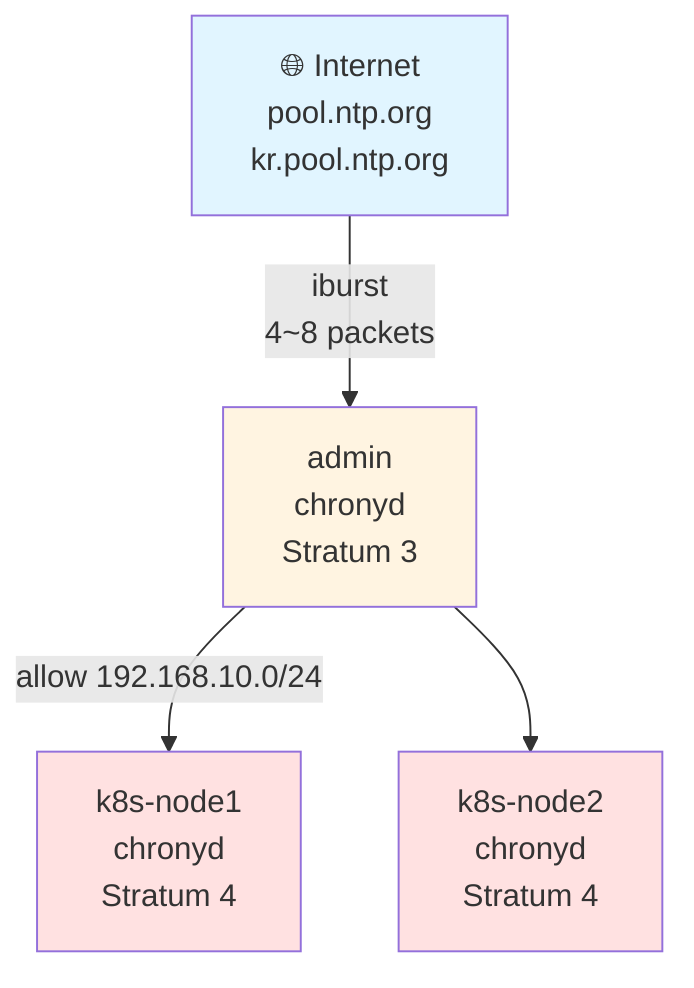
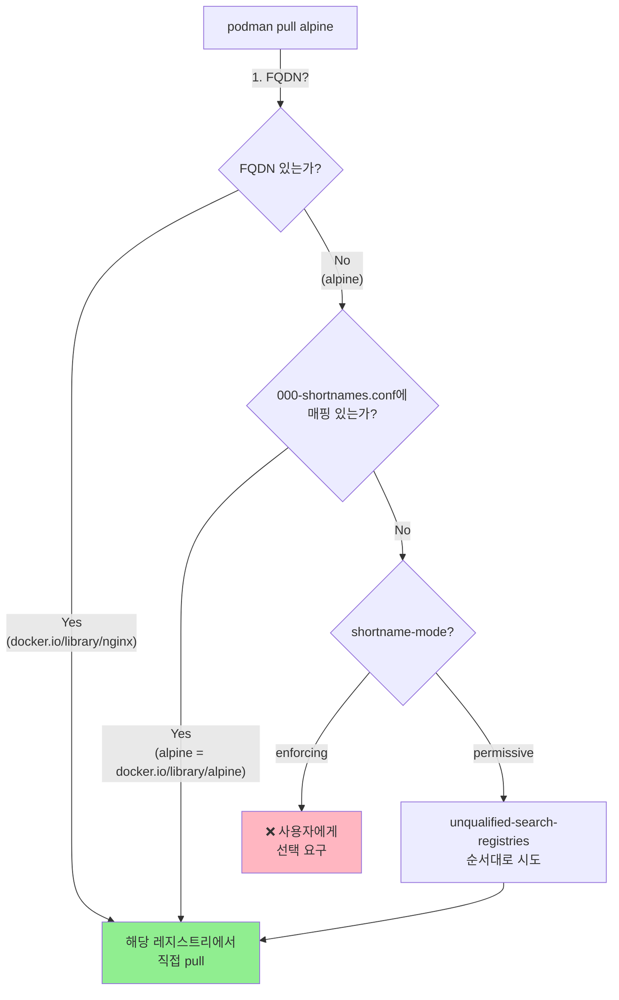
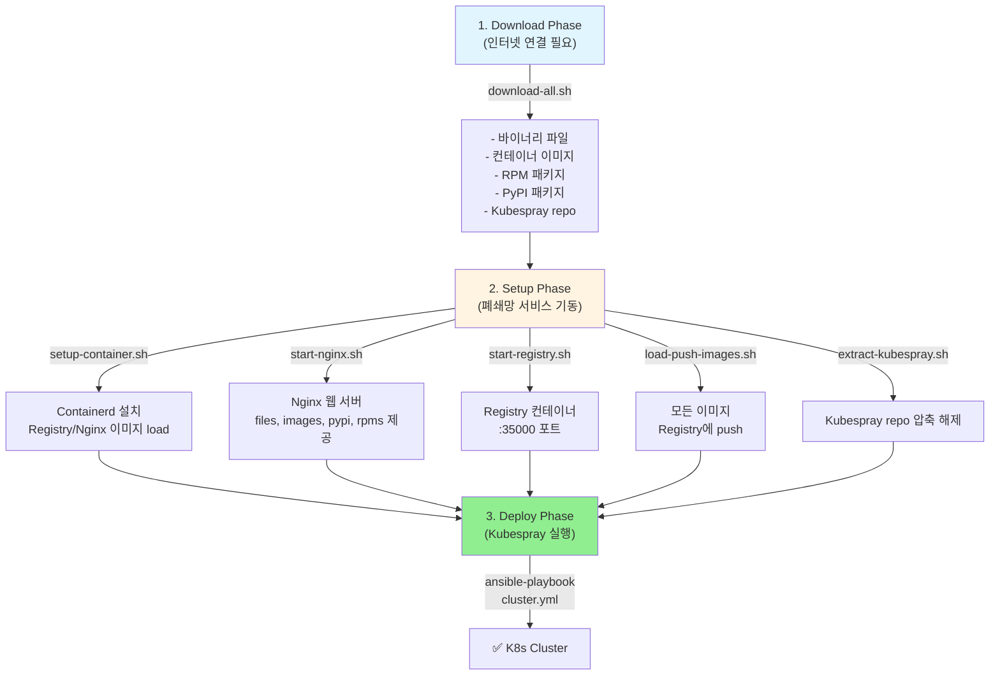
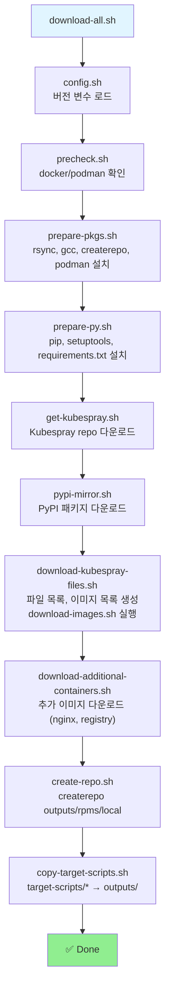
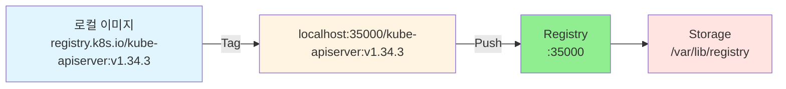
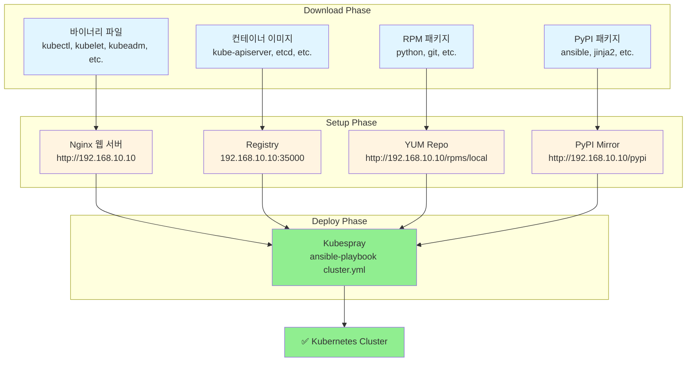

## 개요

**Week 6**에서는 **폐쇄망(Air-Gap) 환경**에서 Kubespray를 활용한 Kubernetes 클러스터 배포를 학습합니다.

### 학습 목표
- 폐쇄망 환경 아키텍처 이해
- 폐쇄망 서비스 구성 (NTP, DNS, Gateway, Registry, PyPI Mirror)
- kubespray-offline 도구를 활용한 오프라인 배포
- 프로덕션 환경 운영 노하우 습득

---

## 폐쇄망 환경 소개

### 보안이 요구되는 일반적인 기업망 구성



**특징**:
- 내부망에서는 **외부 인터넷 접속 불가**
- 필요 시 **방화벽 정책 승인 후 Bastion Server**를 통해 다운로드
- 보안 정책에 따라 모든 외부 연결 차단

### 폐쇄망에서 필요한 주요 구성요소

| 구성요소 | 용도 | 예시 도구 | 관리 주체 |
|----------|------|-----------|-----------|
| **Network Gateway** | IGW, NATGW 역할 | iptables, nftables | 네트워크팀 |
| **NTP Server** | 시간 동기화 | chrony | 인프라팀 (HA 구성) |
| **DNS Server** | 도메인 이름 해석 | bind | 인프라팀 (HA 구성) |
| **Local YUM/DNF Repo** | Linux 패키지 저장소 | reposync + createrepo | 시스템팀 |
| **Private Container Registry** | 컨테이너 이미지 저장소 | registry, Harbor | 플랫폼팀 |
| **Helm Artifact Repository** | 헬름 차트 저장소 | ChartMuseum, zot | 플랫폼팀 |
| **Private PyPI Mirror** | Python 패키지 저장소 | devpi | 플랫폼팀 |
| **Private Go Module Proxy** | Go 모듈 프록시 | Athens | 개발팀 |

---

## 실습 환경

### 가상머신 구성

| 호스트명 | 역할 | CPU | RAM | IP 주소 | 초기화 스크립트 |
|----------|------|-----|-----|----------|-----------------|
| **admin** | Kubespray 실행, 폐쇄망 서비스 제공 | 4 | 2GB | 192.168.10.10 | admin.sh |
| **k8s-node1** | Control Plane | 4 | 2GB | 192.168.10.11 | init_cfg.sh |
| **k8s-node2** | Worker | 4 | 2GB | 192.168.10.12 | init_cfg.sh |

**특징**:
- admin 서버: 120GB 용량 (외부 인터넷 O)
- k8s-node: 외부 인터넷 X (admin을 통해 패키지 다운로드)

### 네트워크 설정

- **Pod CIDR**: 10.233.64.0/18
- **Service CIDR**: 10.233.0.0/18
- **CNI**: Flannel
- **Kube Proxy Mode**: iptables

### 컴포넌트 버전

| 컴포넌트 | 버전 |
|----------|------|
| OS | Rocky Linux 10.0 (Kernel 6.12) |
| Kubernetes | v1.34.3 |
| Kubespray | v2.30.0 |
| Containerd | v2.2.1 |
| Runc | v1.3.4 |
| Nerdctl | v2.2.1 |
| CNI Plugins | v1.8.0 |
| etcd | v3.5.26 |
| Python | 3.12.9 |
| Helm | v3.18.4 |
| Nginx (웹 서버) | 1.29.4 |
| Registry (이미지 저장소) | 3.0.0 |

---

## 폐쇄망 서비스 구성

### 1. Network Gateway (IGW, NATGW)

#### [admin] NAT Gateway 설정 (iptables)

```bash
# IP Forwarding 활성화
sysctl -w net.ipv4.ip_forward=1
cat <<EOF | tee /etc/sysctl.d/99-ipforward.conf
net.ipv4.ip_forward = 1
EOF
sysctl --system

# NAT Masquerading 설정
iptables -t nat -A POSTROUTING -o enp0s8 -j MASQUERADE
iptables -t nat -S
iptables -t nat -L -n -v
```

#### [k8s-node] 네트워크 기본 설정

```bash
# enp0s8 연결 내리기 (외부 인터넷 차단)
nmcli connection down enp0s8
nmcli connection modify enp0s8 connection.autoconnect no

# enp0s9에 디폴트 라우팅 추가 (우선순위 200)
nmcli connection modify enp0s9 +ipv4.routes "0.0.0.0/0 192.168.10.10 200"
nmcli connection up enp0s9

# 라우팅 확인
ip route
```

#### NAT Gateway 동작 원리



**MASQUERADE 동작**:
1. k8s-node → admin: Source IP `192.168.10.11` → `10.0.2.15` (SNAT)
2. admin → Internet: `10.0.2.15`로 요청
3. Internet → admin: `10.0.2.15`로 응답
4. admin → k8s-node: Destination IP `10.0.2.15` → `192.168.10.11` (DNAT)

#### nftables로 NATGW 구현 (도전과제)

```bash
# iptables NAT 룰 제거
iptables -t nat -F POSTROUTING
iptables -t nat -S

# nftables MASQUERADE 설정
nft add table ip nat
nft add chain ip nat postrouting { type nat hook postrouting priority srcnat \; }
nft add rule ip nat postrouting oifname "enp0s8" masquerade
nft list ruleset

# 재부팅 후에도 정책 유지
nft list ruleset > /etc/sysconfig/nftables.conf
systemctl enable --now nftables.service
systemctl status nftables.service

# 재부팅 후 확인
reboot
nft list ruleset
```

#### podman0 forward 허용 (TS)

admin 서버에 podman으로 기동한 registry 컨테이너에 k8s-node에서 이미지 가져오기 실패 시:

```bash
# [admin] nftables rule 추가
sudo nft add rule ip filter forward iif "enp0s9" oif "podman0" accept
sudo nft add rule ip filter forward iif "podman0" oif "enp0s9" ct state established,related accept

# [k8s-node] 테스트
podman pull 192.168.10.10:5000/alpine:1.0
```

---

### 2. NTP Server - Client

#### [admin] NTP 서버 설정

```bash
# chrony 설정
cp /etc/chrony.conf /etc/chrony.bak
cat << EOF > /etc/chrony.conf
# 외부 한국 공용 NTP 서버 설정
server pool.ntp.org iburst
server kr.pool.ntp.org iburst

# 내부망(192.168.10.0/24)에서 이 서버에 접속하여 시간 동기화 허용
allow 192.168.10.0/24

# 외부망이 끊겼을 때도 로컬 시계를 기준으로 내부망에 시간 제공
local stratum 10

# 로그
logdir /var/log/chrony
EOF

systemctl restart chronyd.service
systemctl status chronyd.service

# 상태 확인
timedatectl status
chronyc sources -v
```

#### [k8s-node] NTP 클라이언트 설정

```bash
# chrony 설정
cp /etc/chrony.conf /etc/chrony.bak
cat << EOF > /etc/chrony.conf
server 192.168.10.10 iburst
logdir /var/log/chrony
EOF

systemctl restart chronyd.service

# 상태 확인
timedatectl status
chronyc sources -v
```

#### NTP 동기화 흐름



---

### 3. DNS Server - Client

#### [admin] DNS 서버(bind) 설정

```bash
# bind 설치
dnf install -y bind bind-utils

# named.conf 설정
cp /etc/named.conf /etc/named.bak
cat <<EOF > /etc/named.conf
options {
    listen-on port 53 { any; };
    listen-on-v6 port 53 { ::1; };
    directory "/var/named";
    allow-query { 127.0.0.1; 192.168.10.0/24; };
    allow-recursion { 127.0.0.1; 192.168.10.0/24; };
    forwarders { 168.126.63.1; 8.8.8.8; };
    recursion yes;
    dnssec-validation auto;
    managed-keys-directory "/var/named/dynamic";
    geoip-directory "/usr/share/GeoIP";
    pid-file "/run/named/named.pid";
    session-keyfile "/run/named/session.key";
    include "/etc/crypto-policies/backends/bind.config";
};

logging {
    channel default_debug {
        file "data/named.run";
        severity dynamic;
    };
};

zone "." IN {
    type hint;
    file "named.ca";
};

include "/etc/named.rfc1912.zones";
include "/etc/named.root.key";
EOF

# 문법 확인
named-checkconf /etc/named.conf

# 서비스 활성화
systemctl enable --now named

# DNS 설정 (자기 자신 사용)
echo "nameserver 192.168.10.10" > /etc/resolv.conf

# NetworkManager에서 DNS 관리 끄기
cat << EOF > /etc/NetworkManager/conf.d/99-dns-none.conf
[main]
dns=none
EOF
systemctl restart NetworkManager

# 확인
dig +short google.com @192.168.10.10
dig +short google.com
```

#### [k8s-node] DNS 클라이언트 설정

```bash
# NetworkManager에서 DNS 관리 끄기
cat << EOF > /etc/NetworkManager/conf.d/99-dns-none.conf
[main]
dns=none
EOF
systemctl restart NetworkManager

# DNS 서버 정보 설정
nmcli connection modify enp0s8 ipv4.dns "192.168.10.10"
nmcli connection up enp0s8
echo "nameserver 192.168.10.10" > /etc/resolv.conf

# 확인
dig +short google.com @192.168.10.10
dig +short google.com
```

---

### 4. Local (Mirror) YUM/DNF Repository

#### [admin] Linux 패키지 저장소 구성 (12분 소요)

```bash
# 패키지 설치
dnf install -y dnf-plugins-core createrepo nginx

# 미러 저장 디렉터리 생성
mkdir -p /data/repos/rocky/10
cd /data/repos/rocky/10

# BaseOS 동기화 (3분, 4.8GB)
dnf reposync --repoid=baseos --download-metadata -p /data/repos/rocky/10
du -sh /data/repos/rocky/10/baseos/

# AppStream 동기화 (9분, 13GB)
dnf reposync --repoid=appstream --download-metadata -p /data/repos/rocky/10
du -sh /data/repos/rocky/10/appstream/

# Extras 동기화 (67MB)
dnf reposync --repoid=extras --download-metadata -p /data/repos/rocky/10
du -sh /data/repos/rocky/10/extras/

# Nginx 웹 서버 설정
cat <<EOF > /etc/nginx/conf.d/repos.conf
server {
    listen 80;
    server_name repo-server;

    location /rocky/10/ {
        autoindex on;
        autoindex_exact_size off;
        autoindex_localtime on;
        root /data/repos;
    }
}
EOF

systemctl enable --now nginx
systemctl status nginx.service

# 접속 테스트
curl http://192.168.10.10/rocky/10/
open http://192.168.10.10/rocky/10/baseos/
```

#### [k8s-node] 로컬 레포 설정

```bash
# 기존 레포 백업
mkdir /etc/yum.repos.d/backup
mv /etc/yum.repos.d/*.repo /etc/yum.repos.d/backup/

# 로컬 레포 설정
cat <<EOF > /etc/yum.repos.d/internal-rocky.repo
[internal-baseos]
name=Internal Rocky 10 BaseOS
baseurl=http://192.168.10.10/rocky/10/baseos
enabled=1
gpgcheck=0

[internal-appstream]
name=Internal Rocky 10 AppStream
baseurl=http://192.168.10.10/rocky/10/appstream
enabled=1
gpgcheck=0

[internal-extras]
name=Internal Rocky 10 Extras
baseurl=http://192.168.10.10/rocky/10/extras
enabled=1
gpgcheck=0
EOF

# 확인
dnf clean all
dnf repolist
dnf install -y nfs-utils
dnf info nfs-utils | grep -i repo
```

---

### 5. Private Container Registry

#### [admin] Docker Registry 컨테이너 기동

```bash
# podman 설치 (기본 설치 완료)
dnf install -y podman
which podman
podman --version

# Registry 이미지 받기
podman pull docker.io/library/registry:latest
podman images

# 데이터 저장 디렉터리 준비
mkdir -p /data/registry
chmod 755 /data/registry

# Docker Registry 컨테이너 실행
podman run -d \
  --name local-registry \
  -p 5000:5000 \
  -v /data/registry:/var/lib/registry \
  --restart=always \
  docker.io/library/registry:latest

# 확인
podman ps
ss -tnlp | grep 5000
curl -s http://localhost:5000/v2/_catalog | jq
```

#### [admin] 이미지 push

```bash
# 이미지 다운로드 및 태그
podman pull alpine
podman tag alpine:latest 192.168.10.10:5000/alpine:1.0
podman images

# registries.conf 설정 (insecure registry)
cp /etc/containers/registries.conf /etc/containers/registries.bak
cat <<EOF >> /etc/containers/registries.conf
[[registry]]
location = "192.168.10.10:5000"
insecure = true
EOF
grep "^[^#]" /etc/containers/registries.conf

# 업로드
podman push 192.168.10.10:5000/alpine:1.0

# 확인
curl -s http://192.168.10.10:5000/v2/_catalog | jq
curl -s http://192.168.10.10:5000/v2/alpine/tags/list | jq
```

#### [k8s-node] 이미지 pull

```bash
# registries.conf 설정
cp /etc/containers/registries.conf /etc/containers/registries.bak
cat <<EOF >> /etc/containers/registries.conf
[[registry]]
location = "192.168.10.10:5000"
insecure = true
EOF
grep "^[^#]" /etc/containers/registries.conf

# 이미지 가져오기
podman pull 192.168.10.10:5000/alpine:1.0
podman images
```

#### Registry 이미지 해석 흐름



---

### 6. Private PyPI Mirror

#### [admin] devpi-server 설치 및 설정

```bash
# devpi 설치
pip install devpi-server devpi-client devpi-web
pip list | grep devpi

# 서버 데이터 디렉터리 초기화
devpi-init --serverdir /data/devpi_data
ls -al /data/devpi_data/

# devpi 서버 기동 (백그라운드)
nohup devpi-server --serverdir /data/devpi_data --host 0.0.0.0 --port 3141 > /var/log/devpi.log 2>&1 &

# 확인
ss -tnlp | grep devpi-server
tail -f /var/log/devpi.log
open http://192.168.10.10:3141
```

#### [admin] 패키지 업로드

```bash
# 서버 연결
devpi use http://192.168.10.10:3141

# 로그인 (기본 비번 없음)
devpi login root --password ""

# 폐쇄망에서 쓸 패키지 다운로드
pip download jmespath netaddr -d /tmp/pypi-packages
tree /tmp/pypi-packages/

# 인덱스 생성 (prod)
devpi index -c prod bases=root/pypi

# 인덱스 목록 확인
devpi index -l

# prod 인덱스로 전환 후 업로드
devpi use root/prod
devpi upload /tmp/pypi-packages/*

# 확인
tree /data/devpi_data/+files/
devpi list jmespath netaddr
```

#### [k8s-node] pip 설정 및 사용

```bash
# 전역 설정
cat <<EOF > /etc/pip.conf
[global]
index-url = http://192.168.10.10:3141/root/prod/+simple
trusted-host = 192.168.10.10
timeout = 60
EOF

# 패키지 설치
pip install jmespath
pip list | grep -i jmespath

pip install netaddr
pip list | grep -i netaddr
```

**+simple의 의미**:
- `/root/prod`: 사람용 웹 UI
- `/root/prod/+simple`: **pip 전용 API 엔드포인트** (PEP 503 Simple API)
- pip는 반드시 `+simple` 붙인 URL 사용해야 정상 동작

---

## kubespray-offline 설치

### kubespray-offline 개요



### kubespray-offline 지원 기능

| 기능 | 스크립트 | 용도 |
|------|----------|------|
| **파일 다운로드** | download-all.sh | 바이너리, 이미지, 패키지 다운로드 |
| **Containerd 설치** | install-containerd.sh | runc, containerd, nerdctl, CNI 설치 |
| **웹 서버 기동** | start-nginx.sh | files, images, pypi, rpms 제공 |
| **Registry 기동** | start-registry.sh | 프라이빗 이미지 저장소 |
| **이미지 로드** | load-push-all-images.sh | 모든 이미지 Registry에 push |

### 주요 변수 (target-scripts/config.sh)

```bash
#!/bin/bash
# Kubespray 버전
KUBESPRAY_VERSION=${KUBESPRAY_VERSION:-2.30.0}

# Containerd 관련 바이너리 버전
RUNC_VERSION=1.3.4
CONTAINERD_VERSION=2.2.1
NERDCTL_VERSION=2.2.1
CNI_VERSION=1.8.0

# 추가 컨테이너 버전
NGINX_VERSION=1.29.4
REGISTRY_VERSION=3.0.0

# Container registry port
REGISTRY_PORT=${REGISTRY_PORT:-35000}

# Additional container registry hosts
ADDITIONAL_CONTAINER_REGISTRY_LIST=${ADDITIONAL_CONTAINER_REGISTRY_LIST:-"myregistry.io"}

# Architecture
map_arch() {
    case "$1" in
        x86_64) echo "amd64" ;;
        aarch64) echo "arm64" ;;
        *) echo "$1" ;;
    esac
}
```

---

## 실습: kubespray-offline 배포

### [0] download-all.sh 실행 (17분 소요)

```bash
# git clone
git clone https://github.com/kubespray-offline/kubespray-offline
cd kubespray-offline/

# 변수 확인
source ./config.sh
echo -e "kubespray $KUBESPRAY_VERSION"
echo -e "runc $RUNC_VERSION"
echo -e "containerd $CONTAINERD_VERSION"
echo -e "nerdctl $NERDCTL_VERSION"
echo -e "cni $CNI_VERSION"
echo -e "nginx $NGINX_VERSION"
echo -e "registry $REGISTRY_VERSION"
echo -e "registry_port: $REGISTRY_PORT"
echo -e "cpu arch: $IMAGE_ARCH"

# 다운로드 실행 (17분 소요, 3.3GB)
./download-all.sh

# 결과 확인
du -sh outputs/
tree outputs/ -L 1
```

**download-all.sh 실행 흐름**:



### [1] setup-container.sh 실행

```bash
cd /root/kubespray-offline/outputs

# Containerd 설치, Nginx/Registry 이미지 load
./setup-container.sh

# 확인
which runc && runc --version
which containerd && containerd --version
which nerdctl && nerdctl --version
tree -ug /opt/cni/bin/

systemctl status containerd.service
nerdctl images
```

### [2] start-nginx.sh 실행

```bash
# Nginx 웹 서버 기동
./start-nginx.sh

# 확인
nerdctl ps
ss -tnlp | grep nginx
open http://192.168.10.10
```

**Nginx 디렉터리 목록 표시 설정**:

```bash
# nginx conf 파일 수정
cp nginx-default.conf nginx-default.bak
cat << EOF > nginx-default.conf
server {
    listen 80;
    listen [::]:80;
    server_name localhost;

    location / {
        root /usr/share/nginx/html;
        autoindex on;
        autoindex_exact_size off;
        autoindex_localtime on;
    }

    error_page 500 502 503 504 /50x.html;
    location = /50x.html {
        root /usr/share/nginx/html;
    }

    sendfile off;
}
EOF

# Nginx 컨테이너 재시작
./start-nginx.sh
```

### [3] setup-offline.sh 실행

```bash
# offline repo 설정, pypi mirror 전역 설정
./setup-offline.sh

# offline repo 확인
tree /etc/yum.repos.d/
cat /etc/yum.repos.d/offline.repo
dnf clean all
dnf repolist

# pip 설정 확인
cat ~/.config/pip/pip.conf
```

### [4] setup-py.sh 실행

```bash
# offline repo로부터 python${PY} 설치 시도
./setup-py.sh

# 확인
source pyver.sh
echo -e "python_version $python${PY}"
dnf info python3
tree rpms/local/ | grep -i python
```

### [5] start-registry.sh 실행

```bash
# Registry 컨테이너 기동
./start-registry.sh

# 확인
source config.sh
echo -e "registry_port: $REGISTRY_PORT"
nerdctl ps
ss -tnlp | grep registry

# tcp 5001 port: debug, metrics (참고)
curl 192.168.10.10:5001/metrics
curl 192.168.10.10:5001/debug/pprof/
```

### [6] load-push-images.sh 실행 (2분 소요)

```bash
# 모든 이미지 load 후 Registry에 push
./load-push-all-images.sh

# 로컬 이미지 확인
nerdctl images
nerdctl images | grep localhost
nerdctl images | grep localhost | wc -l  # 55개
nerdctl images | grep -v localhost | wc -l  # 56개

# Registry 카탈로그 확인
curl -s http://localhost:35000/v2/_catalog | jq
curl -s http://localhost:35000/v2/kube-apiserver/tags/list | jq

# Image Manifest 확인
curl -s http://localhost:35000/v2/kube-apiserver/manifests/v1.34.3 | jq

# 저장 디렉터리 확인
tree /var/lib/registry/ -L 5
```

**이미지 Registry push 흐름**:



### [7] extract-kubespray.sh 실행

```bash
# Kubespray repo 압축 해제
./extract-kubespray.sh

# 확인
tree kubespray-2.30.0/ -L 1
```

---

## Kubespray 클러스터 배포 (3분 소요)

### Ansible 환경 준비

```bash
cd /root/kubespray-offline/outputs/kubespray-2.30.0

# Python 버전 확인
python --version  # Python 3.12.12

# venv 디렉터리 이동 (이미 설치 완료)
python3.12 -m venv ~/.venv/3.12
source ~/.venv/3.12/bin/activate
which ansible

# pip 업데이트 및 Ansible 설치
pip install -U pip
pip install -r requirements.txt
```

### Inventory 설정

```bash
# offline.yml 파일 복사
cp ../../offline.yml .

# inventory 복사
cp -r inventory/sample inventory/mycluster

# 웹서버와 이미지 저장소 정보 수정
sed -i "s/YOUR_HOST/192.168.10.10/g" offline.yml
cat offline.yml | grep 192.168.10.10

# offline.yml을 inventory 디렉터리 내부로 복사
\cp -f offline.yml inventory/mycluster/group_vars/all/offline.yml

# inventory 파일 작성
cat <<EOF > inventory/mycluster/inventory.ini
[kube_control_plane]
k8s-node1 ansible_host=192.168.10.11 ip=192.168.10.11 etcd_member_name=etcd1

[etcd:children]
kube_control_plane

[kube_node]
k8s-node2 ansible_host=192.168.10.12 ip=192.168.10.12
EOF

# ansible 연결 확인
ansible -i inventory/mycluster/inventory.ini all -m ping
```

### offline-repo 설정 (k8s-node)

```bash
# offline-repo playbook 복사
mkdir offline-repo
cp -r ../playbook/ offline-repo/
tree offline-repo/

# offline-repo playbook 실행
ansible-playbook -i inventory/mycluster/inventory.ini offline-repo/playbook/offline-repo.yml

# k8s-node 확인
ssh k8s-node1 tree /etc/yum.repos.d/
ssh k8s-node1 dnf repolist

# 기존 repo 제거 (필수)
for i in rocky-addons rocky-devel rocky-extras rocky; do
  ssh k8s-node1 "mv /etc/yum.repos.d/$i.repo /etc/yum.repos.d/$i.repo.original"
  ssh k8s-node2 "mv /etc/yum.repos.d/$i.repo /etc/yum.repos.d/$i.repo.original"
done

ssh k8s-node1 dnf repolist
ssh k8s-node2 dnf repolist
```

### Group Vars 설정

```bash
# kubectl_localhost 설정 (admin-lb에 kubectl 다운로드)
echo "kubectl_localhost: true" >> inventory/mycluster/group_vars/k8s_cluster/k8s-cluster.yml

# kube_owner 설정 (root로 변경)
sed -i 's|kube_owner: kube|kube_owner: root|g' inventory/mycluster/group_vars/k8s_cluster/k8s-cluster.yml

# CNI: Flannel
sed -i 's|kube_network_plugin: calico|kube_network_plugin: flannel|g' inventory/mycluster/group_vars/k8s_cluster/k8s-cluster.yml

# Kube Proxy Mode: iptables
sed -i 's|kube_proxy_mode: ipvs|kube_proxy_mode: iptables|g' inventory/mycluster/group_vars/k8s_cluster/k8s-cluster.yml

# NodeLocalDNS: false
sed -i 's|enable_nodelocaldns: true|enable_nodelocaldns: false|g' inventory/mycluster/group_vars/k8s_cluster/k8s-cluster.yml

# DNS Autoscaler: false
echo "enable_dns_autoscaler: false" >> inventory/mycluster/group_vars/k8s_cluster/k8s-cluster.yml

# Flannel interface 지정
echo "flannel_interface: enp0s9" >> inventory/mycluster/group_vars/k8s_cluster/k8s-net-flannel.yml

# Helm: true
sed -i 's|helm_enabled: false|helm_enabled: true|g' inventory/mycluster/group_vars/k8s_cluster/addons.yml

# Metrics Server: true
sed -i 's|metrics_server_enabled: false|metrics_server_enabled: true|g' inventory/mycluster/group_vars/k8s_cluster/addons.yml
echo "metrics_server_requests_cpu: 25m" >> inventory/mycluster/group_vars/k8s_cluster/addons.yml
echo "metrics_server_requests_memory: 16Mi" >> inventory/mycluster/group_vars/k8s_cluster/addons.yml
```

### [macOS 사용자] etcd CPU arch 변수 수정 (TS)

```bash
# 실패 로그
# fatal: [k8s-node1]: FAILED! => {"attempts": 4, "changed": false, "dest": "/tmp/releases/etcd-3.5.26-linux-arm64.tar.gz", "elapsed": 0, "msg": "Request failed", "response": "HTTP Error 404: Not Found", "status_code": 404, "url": "http://192.168.10.10/files/kubernetes/etcd/etcd-v3.5.26-linux-amd64.tar.gz"}

# offline.yml 수정
cat inventory/mycluster/group_vars/all/offline.yml | grep amd64
sed -i 's/amd64/arm64/g' inventory/mycluster/group_vars/all/offline.yml
```

### Kubespray 배포 (3분 소요)

```bash
# Kubespray 배포
ansible-playbook -i inventory/mycluster/inventory.ini -v cluster.yml -e kube_version="1.34.3"
```

### kubectl 설정 및 확인

```bash
# kubectl 바이너리 복사
cp inventory/mycluster/artifacts/kubectl /usr/local/bin/
kubectl version --client=true

# kubeconfig 복사
mkdir /root/.kube
scp k8s-node1:/root/.kube/config /root/.kube/
sed -i 's/127.0.0.1/192.168.10.11/g' /root/.kube/config

# 자동완성 및 단축키 설정
source <(kubectl completion bash)
alias k=kubectl
complete -F __start_kubectl k
echo 'source <(kubectl completion bash)' >> /etc/profile
echo 'alias k=kubectl' >> /etc/profile
echo 'complete -F __start_kubectl k' >> /etc/profile

# k9s
k9s

# 이미지 저장소 확인
kubectl get deploy,sts,ds -n kube-system -owide
```

---

## Troubleshooting

### 1. Flannel 파드 최초 정상 기동을 위한 디폴트 라우팅 설정

**문제**:
```bash
TASK [network_plugin/flannel : Flannel | Wait for flannel subnet.env file presence]
fatal: [k8s-node1]: FAILED! => {"changed": false, "elapsed": 600, "msg": "Timeout when waiting for file /run/flannel/subnet.env"}
```

**원인**:
- Flannel은 기본적으로 노드의 **Default Route**가 설정된 인터페이스를 찾아서 VxLAN 엔드포인트로 사용
- 기본 라우팅이 없으면 Flannel이 어떤 인터페이스를 사용할지 결정하지 못해 실패

**해결**:

```bash
# [k8s-node] 디폴트 라우팅 추가
nmcli connection modify enp0s9 +ipv4.routes "0.0.0.0/0 192.168.10.10 200"
nmcli connection up enp0s9
ip route
```

### 2. podman0 forward 허용 (admin 서버 Registry 접근 실패)

**문제**:
```bash
# [k8s-node] admin 서버의 registry 접근 실패
podman pull 192.168.10.10:5000/alpine:1.0
```

**원인**:
- admin 서버에 nftables 적용 후 k8s-node → admin 서버 podman0 인터페이스로 회신 못함
- podman0 forward 룰 없음

**해결**:

```bash
# [admin] nftables rule 추가
sudo nft add rule ip filter forward iif "enp0s9" oif "podman0" accept
sudo nft add rule ip filter forward iif "podman0" oif "enp0s9" ct state established,related accept

# [k8s-node] 테스트
podman pull 192.168.10.10:5000/alpine:1.0
```

---

## 주요 개념

### 1. kubespray-offline vs contrib/offline

| 구분 | kubespray-offline | contrib/offline |
|------|-------------------|-----------------|
| **구현** | Shell Script | Ansible Playbook |
| **다운로드** | download-all.sh | manage-offline-files.sh |
| **이미지 관리** | load-push-all-images.sh | manage-offline-container-images.sh |
| **사용 편의성** | ⭐⭐⭐⭐⭐ | ⭐⭐⭐ |
| **커스터마이징** | Shell 수정 | Ansible 수정 |

### 2. Offline 배포 핵심 구성요소



### 3. Containerd Registry Mirror 설정

```bash
# [k8s-node] Containerd 설정 확인
tree /etc/containerd/
cat /etc/containerd/config.toml
cat /etc/containerd/certs.d/192.168.10.10:35000/hosts.toml
```

**hosts.toml**:

```toml
server = "https://192.168.10.10:35000"

[host."http://192.168.10.10:35000"]
  capabilities = ["pull","resolve"]
  skip_verify = true
  override_path = false
```

**동작 원리**:
1. kubelet → containerd: "192.168.10.10:35000/kube-apiserver:v1.34.3" 이미지 pull 요청
2. containerd → `/etc/containerd/certs.d/192.168.10.10:35000/hosts.toml` 읽기
3. containerd → `http://192.168.10.10:35000` 연결 (skip_verify: true)
4. containerd → 이미지 pull 성공

---

## 참고 자료

### Week 6: Kubespray Offline 설치

- [Kubespray Offline Environment 공식 문서](https://kubespray.io/#/docs/offline-environment)
- [kubespray-offline GitHub](https://github.com/kubespray-offline/kubespray-offline)
- [송이레님 - Kubespray Offline Overview](https://sirzzang.github.io/kubernetes/Kubernetes-Kubespray-08-00/)
- [송이레님 - Kubespray Offline 실습 환경 배포](https://sirzzang.github.io/kubernetes/Kubernetes-Kubespray-08-01-00/)
- [송이레님 - Network Gateway](https://sirzzang.github.io/kubernetes/Kubernetes-Kubespray-08-01-01/)
- [송이레님 - NTP / DNS](https://sirzzang.github.io/kubernetes/Kubernetes-Kubespray-08-01-02/)
- [송이레님 - Local Package Repository](https://sirzzang.github.io/kubernetes/Kubernetes-Kubespray-08-01-03/)
- [송이레님 - Private Container Registry](https://sirzzang.github.io/kubernetes/Kubernetes-Kubespray-08-01-04/)
- [송이레님 - Private PyPI Mirror](https://sirzzang.github.io/kubernetes/Kubernetes-Kubespray-08-01-05/)
- [송이레님 - Private Go Module Proxy](https://sirzzang.github.io/kubernetes/Kubernetes-Kubespray-08-01-06/)
- [박진형님 - kubespray-offline 설치 및 TS](https://sigridjin.medium.com/kubespray-ha-upgrade-a-hands-on-guide-from-v1-32-to-v1-34-43076ef54676)
- [박진형님 - kubespray-skills GitHub](https://github.com/sigridjineth/kubespray-skills)
- [Kubespray Download Optimization](https://kubespray.io/#/docs/download)
- [devpi 공식 문서](https://devpi.net/)
- [nftables 공식 문서](https://netfilter.org/projects/nftables/)

---

**최종 업데이트**: 2026-02-15
