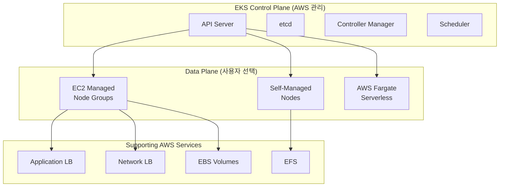
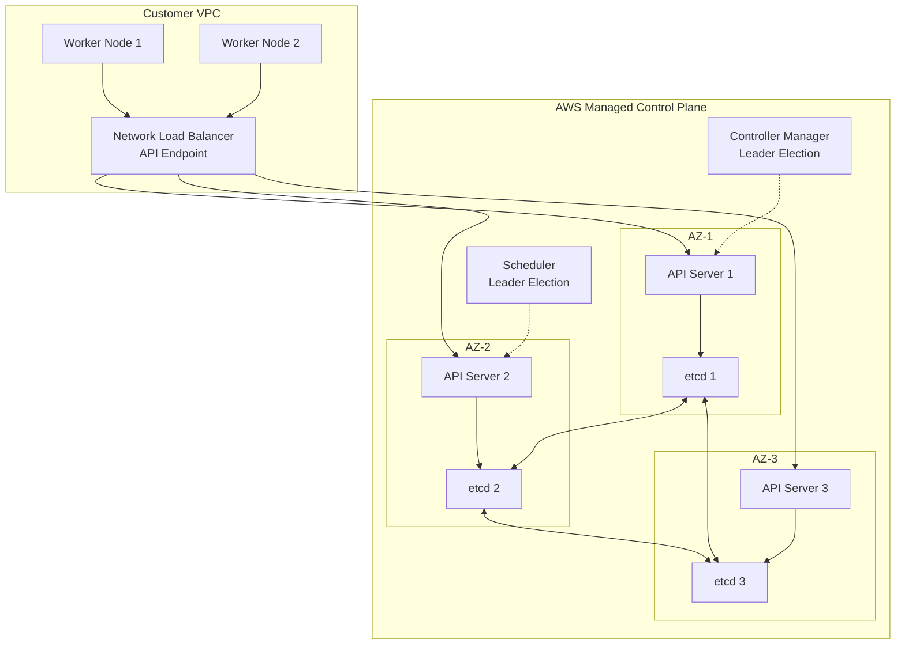
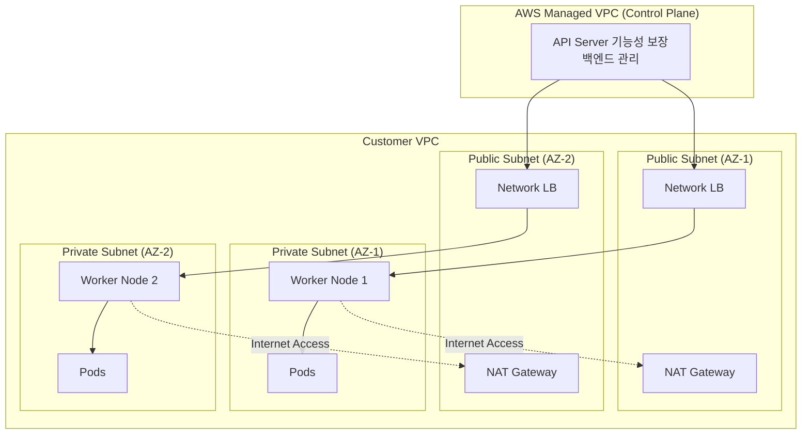
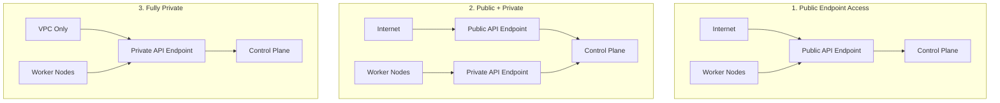
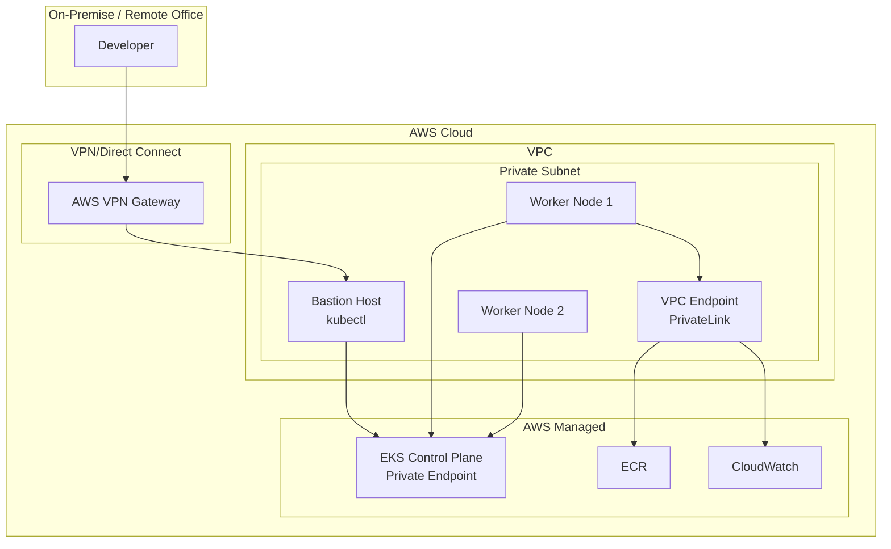
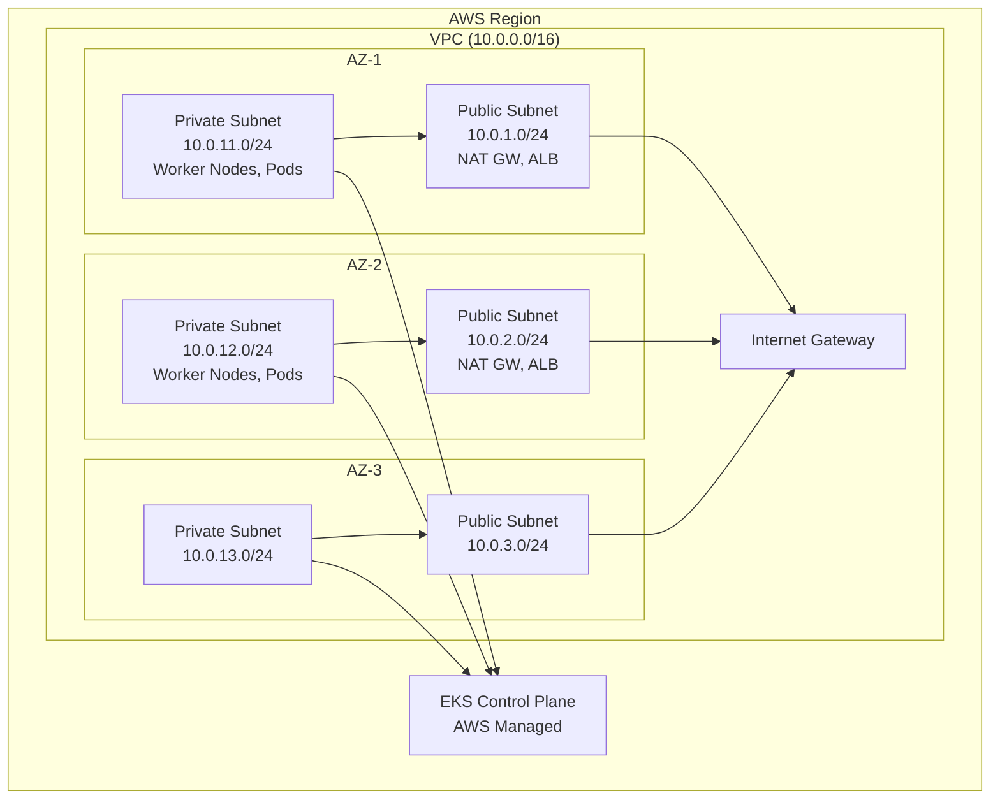
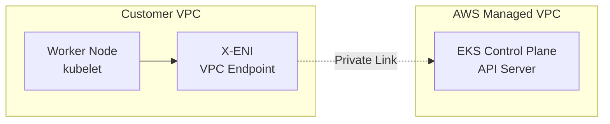
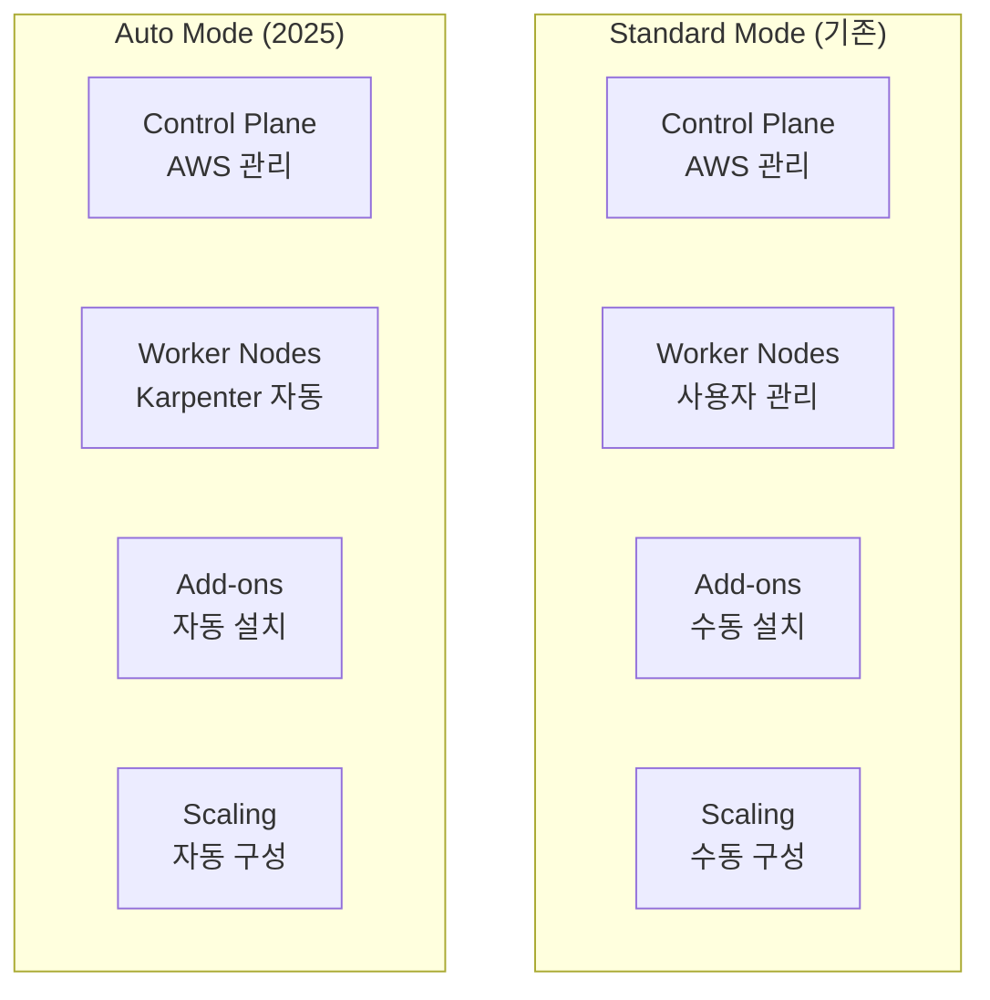

# [EKS] Week 1 - EKS 소개 및 배포

> **Week 1 학습 주제**: Amazon EKS의 기본 개념을 이해하고, eksctl, Terraform, CloudFormation을 활용한 다양한 배포 방법과 EKS Cluster Endpoint Access 전략을 학습합니다.

## 📋 목차

1. [🎯 Week 1 학습 목표](#-week-1-학습-목표)
   - [학습 목표](#1-학습-목표)
   - [실습 환경 준비](#2-실습-환경-준비)

2. [☁️ Amazon EKS 소개](#️-amazon-eks-소개)
   - [Amazon EKS란?](#1-amazon-eks란)
   - [EKS vs Vanilla Kubernetes](#2-eks-vs-vanilla-kubernetes)
   - [EKS 기능](#3-eks-기능)
   - [EKS 요금](#4-eks-요금)

3. [🏗️ EKS 아키텍처](#️-eks-아키텍처)
   - [Control Plane 관리](#1-control-plane-관리)
   - [Data Plane 선택](#2-data-plane-선택)
   - [네트워킹 구성](#3-네트워킹-구성)
   - [클러스터 구성 요소](#4-클러스터-구성-요소)

4. [⚙️ EKS 배포 방법](#️-eks-배포-방법)
   - [eksctl을 이용한 배포](#1-eksctl을-이용한-배포)
   - [Terraform을 이용한 배포](#2-terraform을-이용한-배포)
   - [CloudFormation을 이용한 배포](#3-cloudformation을-이용한-배포)
   - [AWS Management Console 배포](#4-aws-management-console-배포)

5. [🔐 EKS Cluster Endpoint Access](#-eks-cluster-endpoint-access)
   - [Endpoint Access 모드](#1-endpoint-access-모드)
   - [Public Cluster Endpoint Access](#2-public-cluster-endpoint-access)
   - [Public & Private Cluster Endpoint Access](#3-public--private-cluster-endpoint-access)
   - [Fully Private Cluster Endpoint Access](#4-fully-private-cluster-endpoint-access)

6. [🌐 EKS Best Practices 아키텍처](#-eks-best-practices-아키텍처)
   - [VPC 구성 권장사항](#1-vpc-구성-권장사항)
   - [서브넷 구성](#2-서브넷-구성)
   - [X-ENI (Cross-ENI)](#3-x-eni-cross-eni)
   - [보안 그룹 설정](#4-보안-그룹-설정)

7. [🚀 EKS Auto Mode](#-eks-auto-mode)
   - [Auto Mode 개요](#1-auto-mode-개요)
   - [Managed Capabilities](#2-managed-capabilities)
   - [Standard Mode vs Auto Mode](#3-standard-mode-vs-auto-mode)

8. [🆕 EKS 최신 기능](#-eks-최신-기능)
   - [Cluster Insights](#1-cluster-insights)
   - [Upgrade Insights](#2-upgrade-insights)
   - [Global Dashboard](#3-global-dashboard)
   - [Container Network Observability](#4-container-network-observability)

9. [💡 핵심 개념 정리](#-핵심-개념-정리)
   - [EKS의 장점](#1-eks의-장점)
   - [Control Plane vs Data Plane](#2-control-plane-vs-data-plane)
   - [Endpoint Access 전략 비교](#3-endpoint-access-전략-비교)

10. [🎓 Week 1 학습 정리](#-week-1-학습-정리)

---

## 🎯 Week 1 학습 목표

### 1. 학습 목표

**Week 1**에서는 Amazon EKS의 기본 개념과 다양한 배포 방법을 학습합니다.

**이번 주 핵심 학습 포인트**:
- ✅ Amazon EKS의 개념과 특징 이해
- ✅ EKS Control Plane과 Data Plane 구조
- ✅ eksctl, Terraform, CloudFormation을 통한 배포
- ✅ EKS Cluster Endpoint Access 전략 (Public, Private, Fully Private)
- ✅ EKS Best Practices 아키텍처 구성
- ✅ EKS Auto Mode와 최신 기능

**왜 EKS를 사용하는가?**
- **관리형 Control Plane**: AWS가 etcd, API Server, Scheduler 등을 관리
- **AWS 통합**: IAM, VPC, EBS, EFS, ECR, CloudWatch 등과 긴밀한 연동
- **보안 준수**: FIPS 140-2, PCI-DSS, SOC, HIPAA 인증
- **자동화**: AWS 클라우드와 완벽한 통합 및 자동화

### 2. 실습 환경 준비

#### 로컬 환경 설정 (macOS/Windows)

**필수 도구 설치**:

```bash
# [macOS] AWS CLI v2 설치
brew install awscli

# AWS 자격 증명 설정
aws configure
# AWS Access Key ID: <본인의 Access Key>
# AWS Secret Access Key: <본인의 Secret Key>
# Default region name: ap-northeast-2

# 자격 증명 확인
aws sts get-caller-identity

# kubectl 설치 (Kubernetes CLI)
brew install kubectl
kubectl version --client=true

# eksctl 설치 (EKS 클러스터 관리 도구)
brew install eksctl
eksctl version

# Helm 설치 (Kubernetes 패키지 매니저)
brew install helm
helm version

# k9s 설치 (Kubernetes TUI)
brew install k9s

# krew 설치 (kubectl 플러그인 매니저)
brew install krew

# Terraform 설치 (IaC 도구)
brew install tfenv
tfenv install 1.14.6
tfenv use 1.14.6
terraform version

# (선택) tfenv를 통한 Terraform 버전 관리
tfenv list-remote
tfenv install <version>
```

**[Windows WSL2] 환경 설정**:

```bash
# WSL2에서 Ubuntu 배포판 설치
wsl --install Ubuntu-24.04

# Ubuntu에서 패키지 업데이트
sudo apt update && sudo apt upgrade -y

# kubectl 설치
curl -LO "https://dl.k8s.io/release/$(curl -L -s https://dl.k8s.io/release/stable.txt)/bin/linux/amd64/kubectl"
sudo install -o root -g root -m 0755 kubectl /usr/local/bin/kubectl

# eksctl 설치
curl --silent --location "https://github.com/weaveworks/eksctl/releases/latest/download/eksctl_$(uname -s)_amd64.tar.gz" | tar xz -C /tmp
sudo mv /tmp/eksctl /usr/local/bin

# AWS CLI v2 설치
curl "https://awscli.amazonaws.com/awscli-exe-linux-x86_64.zip" -o "awscliv2.zip"
unzip awscliv2.zip
sudo ./aws/install

# Terraform 설치 (HashiCorp GPG 키 추가)
wget -O- https://apt.releases.hashicorp.com/gpg | sudo gpg --dearmor -o /usr/share/keyrings/hashicorp-archive-keyring.gpg
echo "deb [signed-by=/usr/share/keyrings/hashicorp-archive-keyring.gpg] https://apt.releases.hashicorp.com $(lsb_release -cs) main" | sudo tee /etc/apt/sources.list.d/hashicorp.list
sudo apt update && sudo apt install terraform
```

#### AWS 계정 준비사항

- **IAM 사용자**: EKS 클러스터 생성 권한
- **EC2 Key Pair**: EC2 워커 노드 접속용
- **VPC**: 기본 VPC 또는 커스텀 VPC
- **비용**: Control Plane $0.10/시간, Worker Node는 EC2 요금

---

## ☁️ Amazon EKS 소개

### 1. Amazon EKS란?

**Amazon EKS (Elastic Kubernetes Service)**

- AWS에서 제공하는 **관리형 Kubernetes 서비스**
- Kubernetes **Control Plane을 AWS가 완전 관리**
- **자동 업그레이드, 패치, 백업** 지원
- AWS 서비스와 **네이티브 통합**

**EKS 클러스터는 두 가지로 구성됩니다**:

1. **Managed Control Plane** (AWS 관리):
   - API Server instances (Multi-AZ HA)
   - etcd instances (자동 백업)
   - Controller Manager
   - Scheduler

2. **EC2 Managed Instances** (사용자 관리 또는 AWS 관리):
   - Self-managed Node Groups (사용자 직접 관리)
   - Managed Node Groups (AWS 관리)
   - Fargate (서버리스)



### 2. EKS vs Vanilla Kubernetes

| 항목 | Vanilla Kubernetes (k8s) | Amazon EKS |
|------|--------------------------|------------|
| **Control Plane 관리** | 사용자 직접 관리 | AWS 관리 (HA, 백업, 패치) |
| **업그레이드** | 수동 (kubeadm) | AWS 콘솔/CLI 원클릭 |
| **etcd 백업** | 수동 스크립트 | 자동 백업 (AWS 관리) |
| **HA 구성** | 수동 설정 (3 Control Plane) | 기본 Multi-AZ 구성 |
| **보안 패치** | 수동 적용 | AWS 자동 적용 |
| **AWS 통합** | 수동 설정 (IAM, VPC 등) | 네이티브 통합 |
| **비용** | 인프라 비용만 | Control Plane $0.10/시간 + 인프라 |
| **관리 복잡도** | 높음 | 낮음 (AWS가 관리) |

**EKS Auto Mode**:
- Control Plane뿐만 아니라 **Node, Storage, Load Balancing까지 자동 관리**
- Karpenter, EBS CSI Driver, AWS Load Balancer Controller 등 **자동 설치**
- **인프라 걱정 없이** Kubernetes API만 사용

### 3. EKS 기능

#### 3.1 관리 인터페이스

**EKS는 다양한 관리 방법을 제공합니다**:

- **AWS Management Console**: 웹 UI를 통한 클러스터 관리
- **Amazon EKS API/SDK**: 프로그래매틱 액세스
- **AWS CDK**: Infrastructure as Code (TypeScript, Python 등)
- **AWS CLI**: 명령줄 인터페이스
- **eksctl CLI**: EKS 전용 CLI 도구
- **AWS CloudFormation**: YAML/JSON 템플릿 기반 배포
- **Terraform**: HashiCorp의 IaC 도구

#### 3.2 액세스 제어

**Kubernetes 및 AWS Identity and Access Management(IAM) 통합**:

- **IAM 인증**: AWS IAM 사용자/역할로 Kubernetes 인증
- **RBAC**: Kubernetes 네이티브 권한 관리
- **IRSA (IAM Roles for Service Accounts)**: Pod에 IAM 역할 부여

#### 3.3 컴퓨팅 리소스

**다양한 컴퓨팅 옵션 제공**:

- **Amazon EC2 인스턴스**: Nitro, Graviton 등 다양한 인스턴스 타입
- **AWS Fargate**: 서버리스 컨테이너 실행
- **Spot Instances**: 저렴한 비용 (최대 90% 절감)
- **Karpenter**: 자동 스케일링 (EKS Auto Mode)
- **Bottlerocket OS**: 컨테이너 최적화 OS

#### 3.4 스토리지

**EKS Auto Mode는 다양한 스토리지 옵션을 자동 관리**:

- **Amazon EBS**: 블록 스토리지 (CSI Driver 자동 설치)
- **Amazon EFS**: 파일 시스템 (다중 AZ 공유)
- **Amazon FSx**: 고성능 파일 시스템
- **Amazon EBS CSI Driver**: Kubernetes PersistentVolume 지원

#### 3.5 모니터링 및 로깅

**관찰성 도구 통합**:

- **Prometheus, CloudWatch, Grafana**: 메트릭 수집 및 시각화
- **EKS 클러스터 로깅**: Control Plane 로그 CloudWatch로 전송
- **Container Insights**: 컨테이너 메트릭 및 로그 통합

#### 3.6 k8s 호환성 및 자동 업데이트

**Kubernetes 호환성**:

- 표준 Kubernetes API 완전 지원
- Upstream Kubernetes와 동일한 동작
- 커뮤니티 도구 및 플러그인 사용 가능

**버전 업데이트**:

- **최신 Kubernetes 버전** 지원 (약 14개월 지원)
- **Extended Support**: 추가 12개월 지원 (총 26개월)
- **In-place 업그레이드**: 클러스터 재생성 불필요
- **Managed Node Group**: 자동 롤링 업데이트

### 4. EKS 요금

**Amazon EKS 요금 구조**:

| 항목 | 비용 |
|------|------|
| **Control Plane** | $0.10/시간 (약 $73/월) |
| **EC2 Worker Nodes** | EC2 인스턴스 요금 (온디맨드/예약/Spot) |
| **Fargate** | vCPU/메모리 사용량 기반 |
| **EBS Volumes** | EBS 볼륨 요금 (GB당) |
| **Network LB** | NLB 요금 (시간당 + 데이터 전송) |
| **Application LB** | ALB 요금 (시간당 + LCU) |
| **Data Transfer** | VPC 간 데이터 전송 요금 |

**예시 계산** (Small 클러스터):
- Control Plane: $73/월
- 2x t3.medium (Worker): $60/월
- 100GB EBS: $10/월
- **Total**: 약 $143/월

---

## 🏗️ EKS 아키텍처

### 1. Control Plane 관리

**AWS가 관리하는 Control Plane 컴포넌트**:



**Control Plane 특징**:

- **Multi-AZ HA**: 3개 AZ에 분산 배치
- **Auto Scaling**: API Server 자동 스케일링
- **Automatic Backup**: etcd 자동 백업 (AWS S3)
- **Security Patching**: AWS가 보안 패치 자동 적용
- **Monitoring**: Control Plane 메트릭 CloudWatch 전송

### 2. Data Plane 선택

**EKS는 3가지 Data Plane 옵션을 제공합니다**:

#### 2.1 Self-Managed Node Groups

- **사용자가 직접 EC2 인스턴스 관리**
- **완전한 제어권** (Custom AMI, User Data 등)
- **업데이트 책임**: 사용자가 직접 업그레이드

#### 2.2 Managed Node Groups (권장)

- **AWS가 노드 라이프사이클 관리**
- **자동 업데이트**: Kubernetes 버전 업그레이드 시 자동 롤링 업데이트
- **ASG 통합**: Auto Scaling Group 자동 생성
- **Spot Instance** 지원

#### 2.3 AWS Fargate (서버리스)

- **서버리스 컨테이너 실행**
- **노드 관리 불필요**
- **Pod 단위 과금** (vCPU/메모리)
- **제한사항**: DaemonSet, HostNetwork, Privileged Container 불가

**비교표**:

| 특징 | Self-Managed | Managed Node Groups | Fargate |
|------|--------------|---------------------|---------|
| **관리 복잡도** | 높음 | 중간 | 낮음 |
| **제어권** | 완전 제어 | 부분 제어 | 제한적 |
| **자동 업데이트** | ❌ | ✅ | ✅ |
| **Spot 지원** | ✅ | ✅ | ❌ |
| **DaemonSet** | ✅ | ✅ | ❌ |
| **비용** | EC2 요금 | EC2 요금 | vCPU/메모리 요금 |

### 3. 네트워킹 구성

**EKS 클러스터 네트워크 구성**:



**네트워크 주요 개념**:

- **VPC**: Kubernetes 클러스터가 실행되는 격리된 네트워크
- **서브넷**: Public (NAT, LB) / Private (Worker 노드, Pod)
- **Security Group**: 노드 간 통신 제어
- **CNI 플러그인**: AWS VPC CNI (기본), Calico, Cilium 등

### 4. 클러스터 구성 요소

**EKS 클러스터를 구성하는 주요 컴포넌트**:

#### 4.1 Control Plane 컴포넌트 (AWS 관리)

- **API Server** (`kube-apiserver`):
  - Kubernetes API 노출
  - 모든 요청의 진입점
  - Network Load Balancer를 통해 접근

- **etcd**:
  - 클러스터 상태 저장 (Key-Value 스토어)
  - Multi-AZ 복제 (Raft consensus)
  - AWS가 자동 백업 관리

- **Controller Manager** (`kube-controller-manager`):
  - Deployment, ReplicaSet 등 리소스 관리
  - Leader Election (단일 active 인스턴스)

- **Scheduler** (`kube-scheduler`):
  - Pod를 적절한 노드에 스케줄링
  - Leader Election

#### 4.2 Data Plane 컴포넌트 (Worker 노드)

- **kubelet**:
  - 노드에서 실행되는 에이전트
  - API Server와 통신하여 Pod 관리

- **kube-proxy**:
  - 네트워크 프록시
  - Service IP to Pod IP 라우팅

- **Container Runtime**:
  - Docker (Deprecated), containerd (권장)
  - Kubernetes 1.24+는 dockershim 제거

#### 4.3 클러스터 Add-ons (선택적 설치)

- **CoreDNS**: 클러스터 내부 DNS
- **AWS VPC CNI**: Pod 네트워크 플러그인
- **kube-proxy**: Service 네트워크 프록시
- **AWS Load Balancer Controller**: ALB/NLB Ingress
- **Amazon EBS CSI Driver**: EBS 볼륨 지원 (EKS Auto Mode는 자동)
- **Cluster Autoscaler** / **Karpenter**: 노드 자동 스케일링

---

## ⚙️ EKS 배포 방법

### 1. eksctl을 이용한 배포

**eksctl**은 EKS 클러스터를 **가장 쉽게** 배포할 수 있는 CLI 도구입니다.

#### 1.1 기본 클러스터 생성

```bash
# 가장 간단한 클러스터 생성 (기본 설정)
eksctl create cluster \
  --name myeks \
  --region ap-northeast-2 \
  --version 1.34 \
  --nodegroup-name ng-1 \
  --node-type t3.medium \
  --nodes 2 \
  --nodes-min 2 \
  --nodes-max 4

# 클러스터 생성 확인
kubectl get nodes
kubectl get pods -A
```

**기본 생성 내용**:
- VPC 자동 생성 (192.168.0.0/16)
- Public/Private 서브넷 (각 3개 AZ)
- NAT Gateway (Public 서브넷)
- Managed Node Group (t3.medium 2대)

#### 1.2 YAML 파일을 이용한 클러스터 생성

```yaml
# cluster.yaml
apiVersion: eksctl.io/v1alpha5
kind: ClusterConfig

metadata:
  name: myeks
  region: ap-northeast-2
  version: "1.34"

# VPC 설정
vpc:
  cidr: 192.168.0.0/16
  nat:
    gateway: HighlyAvailable  # NAT Gateway HA 구성

# IAM OIDC Provider (IRSA 필수)
iam:
  withOIDC: true

# Managed Node Group
managedNodeGroups:
  - name: ng-1
    instanceType: t3.medium
    desiredCapacity: 2
    minSize: 2
    maxSize: 4
    volumeSize: 20
    ssh:
      allow: true
      publicKeyName: my-keypair
    labels:
      role: worker
    tags:
      nodegroup-name: ng-1
    iam:
      withAddonPolicies:
        imageBuilder: true
        autoScaler: true
        externalDNS: true
        certManager: true
        appMesh: true
        ebs: true
        efs: true
        albIngress: true
        cloudWatch: true

# CloudWatch 로깅 활성화
cloudWatch:
  clusterLogging:
    enableTypes: ["api", "audit", "authenticator", "controllerManager", "scheduler"]
```

```bash
# YAML 파일로 클러스터 생성
eksctl create cluster -f cluster.yaml

# 클러스터 정보 확인
eksctl get cluster
eksctl utils describe-stacks --region ap-northeast-2 --cluster myeks
```

#### 1.3 클러스터 삭제

```bash
# 클러스터 삭제 (VPC, Node Group 모두 삭제)
eksctl delete cluster --name myeks --region ap-northeast-2
```

### 2. Terraform을 이용한 배포

**Terraform**은 Infrastructure as Code 도구로 **재현 가능한** 클러스터 배포가 가능합니다.

#### 2.1 Terraform 코드 작성

```hcl
# main.tf
terraform {
  required_version = ">= 1.14.0"

  required_providers {
    aws = {
      source  = "hashicorp/aws"
      version = "~> 5.0"
    }
  }
}

provider "aws" {
  region = "ap-northeast-2"
}

# VPC 모듈 (terraform-aws-modules/vpc)
module "vpc" {
  source  = "terraform-aws-modules/vpc/aws"
  version = "5.0.0"

  name = "myeks-vpc"
  cidr = "10.0.0.0/16"

  azs             = ["ap-northeast-2a", "ap-northeast-2b", "ap-northeast-2c"]
  private_subnets = ["10.0.1.0/24", "10.0.2.0/24", "10.0.3.0/24"]
  public_subnets  = ["10.0.101.0/24", "10.0.102.0/24", "10.0.103.0/24"]

  enable_nat_gateway   = true
  single_nat_gateway   = true
  enable_dns_hostnames = true
  enable_dns_support   = true

  # EKS 태그 (필수)
  public_subnet_tags = {
    "kubernetes.io/role/elb" = "1"
  }

  private_subnet_tags = {
    "kubernetes.io/role/internal-elb" = "1"
  }

  tags = {
    Environment = "dev"
    Terraform   = "true"
  }
}

# EKS 모듈 (terraform-aws-modules/eks)
module "eks" {
  source  = "terraform-aws-modules/eks/aws"
  version = "~> 20.0"

  cluster_name    = "myeks"
  cluster_version = "1.34"

  cluster_endpoint_public_access  = true
  cluster_endpoint_private_access = false

  vpc_id     = module.vpc.vpc_id
  subnet_ids = module.vpc.private_subnets

  # Managed Node Group
  eks_managed_node_groups = {
    ng-1 = {
      name           = "ng-1"
      instance_types = ["t3.medium"]

      min_size     = 2
      max_size     = 4
      desired_size = 2

      disk_size = 20

      labels = {
        role = "worker"
      }

      tags = {
        NodeGroup = "ng-1"
      }
    }
  }

  # Cluster access entry
  enable_cluster_creator_admin_permissions = true

  tags = {
    Environment = "dev"
    Terraform   = "true"
  }
}

# Outputs
output "cluster_endpoint" {
  description = "Endpoint for EKS control plane"
  value       = module.eks.cluster_endpoint
}

output "cluster_name" {
  description = "Kubernetes Cluster Name"
  value       = module.eks.cluster_name
}
```

#### 2.2 Terraform 실행

```bash
# Terraform 초기화
terraform init

# 계획 확인
terraform plan

# 클러스터 배포
terraform apply -auto-approve

# kubeconfig 업데이트
aws eks update-kubeconfig --region ap-northeast-2 --name myeks

# 클러스터 확인
kubectl get nodes
kubectl get pods -A

# 클러스터 삭제
terraform destroy -auto-approve
```

### 3. CloudFormation을 이용한 배포

**AWS CloudFormation**은 AWS 네이티브 IaC 도구입니다.

#### 3.1 CloudFormation 템플릿

```yaml
# eks-cluster.yaml
AWSTemplateFormatVersion: '2010-09-09'
Description: 'EKS Cluster with CloudFormation'

Parameters:
  ClusterName:
    Type: String
    Default: myeks
    Description: EKS Cluster Name

  KubernetesVersion:
    Type: String
    Default: "1.34"
    Description: Kubernetes Version

Resources:
  # EKS Cluster IAM Role
  EKSClusterRole:
    Type: AWS::IAM::Role
    Properties:
      AssumeRolePolicyDocument:
        Version: '2012-10-17'
        Statement:
          - Effect: Allow
            Principal:
              Service: eks.amazonaws.com
            Action: 'sts:AssumeRole'
      ManagedPolicyArns:
        - arn:aws:iam::aws:policy/AmazonEKSClusterPolicy

  # EKS Cluster
  EKSCluster:
    Type: AWS::EKS::Cluster
    Properties:
      Name: !Ref ClusterName
      Version: !Ref KubernetesVersion
      RoleArn: !GetAtt EKSClusterRole.Arn
      ResourcesVpcConfig:
        SubnetIds:
          - subnet-xxx  # Private Subnet 1
          - subnet-yyy  # Private Subnet 2
        EndpointPublicAccess: true
        EndpointPrivateAccess: false

  # Node IAM Role
  NodeInstanceRole:
    Type: AWS::IAM::Role
    Properties:
      AssumeRolePolicyDocument:
        Version: '2012-10-17'
        Statement:
          - Effect: Allow
            Principal:
              Service: ec2.amazonaws.com
            Action: 'sts:AssumeRole'
      ManagedPolicyArns:
        - arn:aws:iam::aws:policy/AmazonEKSWorkerNodePolicy
        - arn:aws:iam::aws:policy/AmazonEC2ContainerRegistryReadOnly
        - arn:aws:iam::aws:policy/AmazonEKS_CNI_Policy

  # Managed Node Group
  NodeGroup:
    Type: AWS::EKS::Nodegroup
    Properties:
      ClusterName: !Ref EKSCluster
      NodegroupName: ng-1
      NodeRole: !GetAtt NodeInstanceRole.Arn
      Subnets:
        - subnet-xxx  # Private Subnet 1
        - subnet-yyy  # Private Subnet 2
      ScalingConfig:
        MinSize: 2
        MaxSize: 4
        DesiredSize: 2
      InstanceTypes:
        - t3.medium
      DiskSize: 20

Outputs:
  ClusterName:
    Description: EKS Cluster Name
    Value: !Ref EKSCluster

  ClusterEndpoint:
    Description: EKS Cluster Endpoint
    Value: !GetAtt EKSCluster.Endpoint
```

#### 3.2 CloudFormation 배포

```bash
# CloudFormation 스택 생성
aws cloudformation create-stack \
  --stack-name myeks-stack \
  --template-body file://eks-cluster.yaml \
  --capabilities CAPABILITY_IAM \
  --region ap-northeast-2

# 스택 생성 상태 확인
aws cloudformation describe-stacks \
  --stack-name myeks-stack \
  --region ap-northeast-2

# kubeconfig 업데이트
aws eks update-kubeconfig --region ap-northeast-2 --name myeks

# 스택 삭제
aws cloudformation delete-stack \
  --stack-name myeks-stack \
  --region ap-northeast-2
```

### 4. AWS Management Console 배포

**AWS 콘솔**을 통한 GUI 배포도 가능합니다.

#### 단계별 배포 과정:

1. **AWS Console → EKS → Clusters → Create cluster**
2. **Cluster 설정**:
   - Name: myeks
   - Kubernetes version: 1.34
   - Cluster service role: EKSClusterRole (미리 생성)
3. **Networking**:
   - VPC: 기존 VPC 선택
   - Subnets: Private 서브넷 선택 (최소 2개 AZ)
   - Security groups: Default
   - Cluster endpoint access: Public
4. **Logging**: Control Plane 로그 활성화 (선택)
5. **Review and create**
6. **Node Group 추가**:
   - Compute → Add node group
   - Name: ng-1
   - Node IAM role: NodeInstanceRole
   - Instance type: t3.medium
   - Scaling: Min 2, Max 4, Desired 2

---

## 🔐 EKS Cluster Endpoint Access

**EKS Cluster Endpoint Access**는 API Server에 접근하는 방식을 제어합니다.

### 1. Endpoint Access 모드

**EKS는 3가지 Endpoint Access 모드를 제공합니다**:



| 모드 | Public Access | Private Access | kubectl 위치 | Worker 노드 통신 |
|------|---------------|----------------|--------------|------------------|
| **Public** | ✅ | ❌ | 어디서나 | Public Endpoint |
| **Public + Private** | ✅ (CIDR 제한 가능) | ✅ | 어디서나 / VPC 내부 | Private Endpoint (VPC 내부) |
| **Fully Private** | ❌ | ✅ | VPC 내부만 | Private Endpoint |

### 2. Public Cluster Endpoint Access

**특징**:
- API Server가 **Public Endpoint**로 노출
- **인터넷**에서 kubectl 명령 실행 가능
- Worker 노드도 Public Endpoint 사용 (NAT Gateway 경유)

**장점**:
- 간단한 설정
- 외부에서 클러스터 관리 가능

**단점**:
- 보안 위험 (Public 노출)
- CIDR 화이트리스트 필수

**설정 방법**:

```bash
# eksctl로 Public 클러스터 생성
eksctl create cluster \
  --name myeks \
  --region ap-northeast-2 \
  --vpc-public-subnets subnet-xxx,subnet-yyy \
  --vpc-private-subnets subnet-aaa,subnet-bbb

# Terraform
cluster_endpoint_public_access  = true
cluster_endpoint_private_access = false
cluster_endpoint_public_access_cidrs = ["1.2.3.4/32"]  # IP 제한
```

### 3. Public & Private Cluster Endpoint Access (권장)

**특징**:
- **Public Endpoint**: 외부에서 kubectl 접근 (CIDR 제한 가능)
- **Private Endpoint**: Worker 노드는 VPC 내부 통신
- **최적의 보안과 편의성**

**장점**:
- Worker 노드는 Private Endpoint 사용 (VPC 내부 통신)
- 외부에서도 kubectl 사용 가능 (IP 제한)
- NAT Gateway 비용 절감

**단점**:
- Public Endpoint 노출 (IP 제한 필수)

**설정 방법**:

```bash
# eksctl
eksctl utils update-cluster-endpoint-access \
  --cluster=myeks \
  --region=ap-northeast-2 \
  --public-access=true \
  --private-access=true \
  --approve

# Terraform
cluster_endpoint_public_access  = true
cluster_endpoint_private_access = true
cluster_endpoint_public_access_cidrs = ["203.0.113.0/24"]
```

### 4. Fully Private Cluster Endpoint Access

**특징**:
- **Private Endpoint만 활성화**
- **외부 인터넷 접근 불가**
- **VPC 내부에서만** kubectl 접근
- **가장 높은 보안 수준**

**요구사항**:
- **VPN** 또는 **AWS Direct Connect**: VPC 접근 필수
- **VPC Endpoint** (PrivateLink): AWS 서비스 접근
- **Bastion Host**: VPC 내부에서 kubectl 실행

**장점**:
- 최고 수준의 보안
- 외부 공격 표면 최소화

**단점**:
- VPN/DX 필수
- 관리 복잡도 증가

**설정 방법**:

```bash
# eksctl
eksctl utils update-cluster-endpoint-access \
  --cluster=myeks \
  --region=ap-northeast-2 \
  --public-access=false \
  --private-access=true \
  --approve

# Terraform
cluster_endpoint_public_access  = false
cluster_endpoint_private_access = true
```

**Fully Private 클러스터 아키텍처**:



---

## 🌐 EKS Best Practices 아키텍처

### 1. VPC 구성 권장사항

**EKS Best Practices VPC 구성**:



**VPC 설계 권장사항**:

1. **최소 2개 AZ** (권장: 3개 AZ)
2. **Public 서브넷**: NAT Gateway, Load Balancer
3. **Private 서브넷**: Worker 노드, Pod
4. **CIDR 범위**: 최소 /16 (예: 10.0.0.0/16)
5. **서브넷 태그** (필수):
   ```bash
   # Public 서브넷
   kubernetes.io/role/elb = 1

   # Private 서브넷
   kubernetes.io/role/internal-elb = 1

   # Cluster 소유권
   kubernetes.io/cluster/<cluster-name> = shared
   ```

### 2. 서브넷 구성

**서브넷 크기 권장사항**:

- **Public 서브넷**: /24 (256 IP) - NAT Gateway, ALB/NLB용
- **Private 서브넷**: /19 ~ /17 (8,192 ~ 32,768 IP) - Worker 노드 + Pod IP

**Pod IP 계산**:
- t3.medium: 최대 17개 IP (1개 Primary ENI + 16개 Secondary IP)
- Pod 수 = (노드 수) × (노드당 Pod 수)
- 예: 100개 노드 × 17 Pod = 1,700개 IP 필요

### 3. X-ENI (Cross-ENI)

**X-ENI (Cross-Account Elastic Network Interface)**:

- EKS Control Plane (AWS 계정)과 Worker 노드 (Customer VPC) 간 통신
- **VPC Endpoint 방식으로 Private 연결**
- Worker 노드는 ENI를 통해 Control Plane에 접근



### 4. 보안 그룹 설정

**EKS 보안 그룹 구성**:

1. **Cluster Security Group** (AWS 자동 생성):
   - Control Plane ↔ Worker 노드 통신
   - 노드 간 통신 (Pod to Pod)

2. **Node Security Group** (사용자 관리):
   - SSH 접근 (22/tcp)
   - 추가 애플리케이션 포트

**권장 규칙**:

```bash
# Cluster Security Group (AWS 자동 생성)
Inbound:
  - 443/tcp: Worker 노드 → Control Plane (API 요청)
  - 10250/tcp: Control Plane → Worker 노드 (kubelet)

Outbound:
  - All Traffic: 허용

# Node Security Group
Inbound:
  - 22/tcp: Bastion Host에서 SSH
  - 1025-65535/tcp: Node to Node (Pod 통신)
  - NodePort 범위: 30000-32767/tcp

Outbound:
  - All Traffic: 허용 (인터넷, AWS 서비스 접근)
```

---

## 🚀 EKS Auto Mode

### 1. Auto Mode 개요

**EKS Auto Mode**는 **2025년 출시**된 새로운 클러스터 관리 모드입니다.

**주요 특징**:
- **완전 관리형**: Control Plane + **Data Plane + Add-ons**까지 자동 관리
- **Karpenter** 자동 설치: 노드 자동 스케일링
- **EBS CSI Driver** 자동 설치: 스토리지 자동 프로비저닝
- **AWS Load Balancer Controller** 자동 설치: ALB/NLB Ingress 자동 생성

**Standard Mode vs Auto Mode**:



### 2. Managed Capabilities

**Auto Mode가 자동으로 관리하는 항목**:

1. **Compute (Karpenter)**:
   - 노드 자동 프로비저닝
   - Spot/On-Demand 혼합 사용
   - 최적 인스턴스 타입 선택

2. **Storage**:
   - **EBS CSI Driver** 자동 설치
   - PersistentVolume 자동 생성
   - 스냅샷, 리사이즈 자동 지원

3. **Load Balancing**:
   - **AWS Load Balancer Controller** 자동 설치
   - Ingress → ALB 자동 생성
   - Service (LoadBalancer) → NLB 자동 생성

### 3. Standard Mode vs Auto Mode

| 항목 | Standard Mode | Auto Mode |
|------|---------------|-----------|
| **Control Plane** | AWS 관리 | AWS 관리 |
| **Worker Nodes** | 사용자 관리 (ASG, Managed Node Group) | Karpenter 자동 관리 |
| **Node Scaling** | 수동 (Cluster Autoscaler) | 자동 (Karpenter) |
| **Storage** | 수동 설치 (EBS CSI Driver) | 자동 설치 |
| **Load Balancer** | 수동 설치 (LB Controller) | 자동 설치 |
| **Add-ons** | 수동 설치 | 자동 설치 |
| **관리 복잡도** | 높음 | 낮음 |
| **비용** | Control Plane $0.10/시간 + 인프라 | 동일 |

**Auto Mode 활성화**:

```bash
# eksctl (Auto Mode 지원 예정)
eksctl create cluster \
  --name myeks-auto \
  --region ap-northeast-2 \
  --auto-mode

# AWS CLI
aws eks create-cluster \
  --name myeks-auto \
  --region ap-northeast-2 \
  --compute-config enabled=true \
  --storage-config enabled=true \
  --load-balancing-config enabled=true
```

---

## 🆕 EKS 최신 기능

### 1. Cluster Insights

**Cluster Insights**는 **업그레이드 가능 여부**를 분석하고 권장사항을 제공합니다.

**주요 기능**:
- **Deprecated API 감지**: Kubernetes 버전 업그레이드 시 제거되는 API 사용 여부 확인
- **호환성 검사**: 현재 클러스터에서 사용 중인 리소스가 다음 버전에서 호환되는지 확인
- **권장사항 제공**: 업그레이드 전 수정해야 할 사항 안내

**확인 방법**:

```bash
# AWS Console: EKS → Clusters → myeks → Upgrade insights
# CLI
aws eks list-insights \
  --region ap-northeast-2 \
  --cluster-name myeks
```

### 2. Upgrade Insights

**Upgrade Insights**는 **클러스터 업그레이드 시 발생할 수 있는 문제를 사전에 감지**합니다.

**감지 항목**:
- **Deprecated APIs**: v1.29에서 제거된 API 사용 여부
- **Pod Security Standards**: PSP → PSS 마이그레이션 필요 여부
- **Add-on 호환성**: CoreDNS, VPC CNI 등 버전 호환성

### 3. Global Dashboard

**EKS Global Dashboard**는 **모든 리전의 클러스터를 한눈에 확인**할 수 있습니다.

**주요 기능**:
- **Cross-Region 클러스터 목록**: 모든 리전의 클러스터 상태 확인
- **버전 분포**: Kubernetes 버전별 클러스터 수
- **업그레이드 상태**: 업그레이드 필요 클러스터 표시

### 4. Container Network Observability

**Enhanced Container Network Observability**는 **Pod 간 네트워크 흐름을 시각화**합니다.

**주요 기능**:
- **Pod-to-Pod 통신 흐름**: VPC Flow Monitor 통합
- **DNS 쿼리 추적**: 실패한 DNS 쿼리 분석
- **Network Performance**: 레이턴시, 패킷 드롭 모니터링
- **Service Map**: Pod 간 의존성 시각화

---

## 💡 핵심 개념 정리

### 1. EKS의 장점

**Amazon EKS를 사용하는 이유**:

1. **관리형 Control Plane**:
   - etcd, API Server 자동 관리 (HA, 백업)
   - 업그레이드 간소화 (원클릭)

2. **AWS 통합**:
   - IAM 인증/인가 (IRSA)
   - VPC 네이티브 네트워킹
   - EBS/EFS 스토리지
   - ECR, CloudWatch, X-Ray 통합

3. **보안 준수**:
   - FIPS 140-2, PCI-DSS, SOC, HIPAA
   - Secrets 암호화 (KMS)
   - VPC Private Endpoint

4. **자동화**:
   - Managed Node Groups
   - Auto Scaling (Karpenter)
   - Add-ons 자동 업데이트

### 2. Control Plane vs Data Plane

**Control Plane (AWS 관리)**:
- **API Server**: Kubernetes API 노출
- **etcd**: 클러스터 상태 저장
- **Controller Manager**: 리소스 관리
- **Scheduler**: Pod 스케줄링
- **관리**: AWS가 완전 관리 (HA, 백업, 패치)

**Data Plane (사용자 선택)**:
- **EC2 Worker Nodes**: 사용자 관리 또는 AWS Managed
- **Fargate**: 서버리스
- **kubelet, kube-proxy**: 노드에서 실행
- **관리**: 사용자 책임 (업데이트, 스케일링)

### 3. Endpoint Access 전략 비교

**권장사항**:

- **개발/테스트**: Public Endpoint (간편함)
- **프로덕션**: Public + Private (보안 + 편의성)
- **금융/의료**: Fully Private (최고 보안)

| 전략 | 보안 수준 | 관리 편의성 | 비용 | 추천 환경 |
|------|-----------|-------------|------|-----------|
| **Public** | ⭐⭐ | ⭐⭐⭐⭐⭐ | 낮음 | 개발/테스트 |
| **Public + Private** | ⭐⭐⭐⭐ | ⭐⭐⭐⭐ | 중간 | 프로덕션 (권장) |
| **Fully Private** | ⭐⭐⭐⭐⭐ | ⭐⭐ | 높음 (VPN/DX) | 금융, 의료, 정부 |

---

## 🎓 Week 1 학습 정리

### 학습 요약

**Week 1**에서는 Amazon EKS의 기본 개념과 배포 방법을 학습했습니다.

**주요 학습 내용**:

1. **Amazon EKS 개념**:
   - Managed Control Plane (AWS 관리)
   - Data Plane 선택 (EC2, Fargate)
   - AWS 서비스 통합 (IAM, VPC, ECR)

2. **EKS 배포 방법**:
   - **eksctl**: 가장 간단한 배포 도구
   - **Terraform**: Infrastructure as Code
   - **CloudFormation**: AWS 네이티브 IaC
   - **AWS Console**: GUI 배포

3. **EKS Cluster Endpoint Access**:
   - **Public**: 외부 접근 가능 (개발/테스트)
   - **Public + Private**: 권장 (프로덕션)
   - **Fully Private**: 최고 보안 (VPN 필수)

4. **EKS Best Practices**:
   - VPC 설계 (최소 2개 AZ, Public/Private 서브넷)
   - 서브넷 태그 (kubernetes.io/role/elb)
   - X-ENI를 통한 Private 통신

5. **EKS Auto Mode**:
   - Control Plane + Data Plane + Add-ons 자동 관리
   - Karpenter, EBS CSI, LB Controller 자동 설치

### 참고 자료

**공식 문서**:
- [Amazon EKS 공식 문서](https://docs.aws.amazon.com/eks/)
- [EKS Best Practices Guide](https://aws.github.io/aws-eks-best-practices/)
- [eksctl 공식 문서](https://eksctl.io/)
- [Terraform AWS EKS Module](https://registry.terraform.io/modules/terraform-aws-modules/eks/aws)

**블로그 및 튜토리얼**:
- [AWS re:Invent 2024 - EKS 최신 기능](https://www.youtube.com/watch?v=KUB201)
- [송이레님 - Kubernetes 상세 정리](https://sirzzang.github.io/kubernetes/)

**도구**:
- [k9s](https://k9scli.io/): Kubernetes TUI
- [krew](https://krew.sigs.k8s.io/): kubectl 플러그인 매니저
- [AWS Copilot](https://aws.github.io/copilot-cli/): 컨테이너 애플리케이션 배포

---

**최종 업데이트**: 2026-03-18
