# [EKS] Week 2 - EKS Networking

> **Week 2 학습 주제**: Amazon EKS의 네트워킹 구조를 깊이 이해하고, VPC CNI, Service, LoadBalancer, Ingress, ExternalDNS 등 네트워크 관련 핵심 기능을 학습합니다.

## 📋 목차

1. [🎯 Week 2 학습 목표](#-week-2-학습-목표)
   - [학습 목표](#1-학습-목표)
   - [실습 환경 배포](#2-실습-환경-배포)

2. [🌐 AWS VPC CNI 소개](#-aws-vpc-cni-소개)
   - [VPC CNI란?](#1-vpc-cni란)
   - [CNI Plugin 동작 원리](#2-cni-plugin-동작-원리)
   - [IP 주소 할당 모드](#3-ip-주소-할당-모드)
   - [보안 그룹 관리](#4-보안-그룹-관리)

3. [🔍 노드에서 기본 네트워크 정보 확인](#-노드에서-기본-네트워크-정보-확인)
   - [노드 접속 및 IP 조회](#1-노드-접속-및-ip-조회)
   - [네트워크 인터페이스 확인](#2-네트워크-인터페이스-확인)
   - [라우팅 테이블 확인](#3-라우팅-테이블-확인)

4. [📡 노드 간 파드 통신](#-노드-간-파드-통신)
   - [파드 통신 흐름](#1-파드-통신-흐름)
   - [Overlay Network vs AWS VPC CNI](#2-overlay-network-vs-aws-vpc-cni)
   - [NAT 동작 원리](#3-nat-동작-원리)

5. [🌍 파드에서 외부 통신](#-파드에서-외부-통신)
   - [외부 통신 흐름](#1-외부-통신-흐름)
   - [iptables SNAT 규칙](#2-iptables-snat-규칙)

6. [⚙️ AWS VPC CNI 설정 변경](#️-aws-vpc-cni-설정-변경)
   - [WARM_ENI_TARGET](#1-warm_eni_target)
   - [WARM_IP_TARGET](#2-warm_ip_target)
   - [MINIMUM_IP_TARGET](#3-minimum_ip_target)

7. [📊 노드에 파드 생성 갯수 제한](#-노드에-파드-생성-갯수-제한)
   - [Secondary IP mode](#1-secondary-ip-mode)
   - [Prefix Delegation mode](#2-prefix-delegation-mode)
   - [maxPods 계산 방법](#3-maxpods-계산-방법)

8. [🔧 Kubernetes Service](#-kubernetes-service)
   - [Service 개념](#1-service-개념)
   - [Service 종류](#2-service-종류)
   - [ClusterIP Service](#3-clusterip-service)
   - [NodePort Service](#4-nodeport-service)
   - [LoadBalancer Service](#5-loadbalancer-service)
   - [ExternalName Service](#6-externalname-service)

9. [🔀 kube-proxy 모드](#-kube-proxy-모드)
   - [User Space 모드](#1-user-space-모드)
   - [iptables 모드](#2-iptables-모드)
   - [IPVS 모드](#3-ipvs-모드)
   - [nftables 모드](#4-nftables-모드)
   - [eBPF/XDP 모드](#5-ebpfxdp-모드)

10. [⚖️ AWS LoadBalancer Controller](#️-aws-loadbalancer-controller)
    - [Instance mode vs IP mode](#1-instance-mode-vs-ip-mode)
    - [IRSA 설정](#2-irsa-설정)
    - [NLB 배포](#3-nlb-배포)

11. [🚪 Ingress (L7 HTTP)](#-ingress-l7-http)
    - [Ingress Controller](#1-ingress-controller)
    - [ALB Ingress Controller](#2-alb-ingress-controller)

12. [🌐 ExternalDNS](#-externaldns)
    - [ExternalDNS란?](#1-externaldns란)
    - [ExternalDNS 설정](#2-externaldns-설정)

13. [💡 핵심 개념 정리](#-핵심-개념-정리)
    - [VPC CNI vs Overlay CNI](#1-vpc-cni-vs-overlay-cni)
    - [Secondary IP vs Prefix Delegation](#2-secondary-ip-vs-prefix-delegation)
    - [kube-proxy 모드 비교](#3-kube-proxy-모드-비교)
    - [Service 종류 비교](#4-service-종류-비교)

14. [🎓 Week 2 학습 정리](#-week-2-학습-정리)

---

## 🎯 Week 2 학습 목표

### 1. 학습 목표

**Week 2**에서는 Amazon EKS의 네트워킹 구조와 핵심 개념을 학습합니다.

**이번 주 핵심 학습 포인트**:
- ✅ AWS VPC CNI 플러그인의 동작 원리 이해
- ✅ Secondary IP mode vs Prefix Delegation mode 비교
- ✅ Pod 간 통신 흐름 및 라우팅 메커니즘
- ✅ Kubernetes Service 종류 및 동작 원리
- ✅ kube-proxy 모드 (iptables, IPVS, eBPF/XDP) 이해
- ✅ AWS Load Balancer Controller 활용
- ✅ Ingress Controller와 ALB 연동
- ✅ ExternalDNS를 통한 DNS 자동화

**왜 EKS Networking이 중요한가?**
- **VPC Native**: Pod가 VPC IP를 직접 할당받아 AWS 서비스와 직접 통신
- **보안 그룹 지원**: Pod 단위로 AWS Security Group 적용 가능
- **성능**: Overlay Network 없이 직접 라우팅으로 낮은 Latency
- **AWS 통합**: ELB, Route53, CloudWatch와 완벽한 통합

### 2. 실습 환경 배포

#### Terraform을 이용한 EKS 클러스터 배포

```bash
# 코드 다운로드
git clone https://github.com/gasida/aews.git
cd aews/2w

# Terraform 변수 확인
cat <<EOF > terraform.tfvars
KeyName = "$AWS_KEY_PAIR"
MyIAMUser = "<본인 IAM 사용자명>"
SgIngressSshCidr = "$(curl -s ipinfo.io/ip)/32"
EOF

# Terraform 배포
terraform init
terraform apply -auto-approve

# kubeconfig 설정
aws eks update-kubeconfig --region ap-northeast-2 --name myeks --kubeconfig ~/.kube/config
```

#### 배포된 리소스 확인

```bash
# EKS 클러스터 확인
eksctl get cluster

# 노드 확인
kubectl get nodes -o wide

# VPC CNI 버전 확인
kubectl get ds aws-node -n kube-system -o json | jq -r '.spec.template.spec.containers[0].image'

# kube-proxy 버전 확인
kubectl get ds kube-proxy -n kube-system -o json | jq -r '.spec.template.spec.containers[0].image'
```

---

## 🌐 AWS VPC CNI 소개

### 1. VPC CNI란?

**AWS VPC CNI**는 EKS에서 기본으로 사용하는 Container Network Interface 플러그인입니다.

**주요 특징**:
- Pod에 VPC IP 주소를 직접 할당
- AWS Security Group for Pods 지원
- Overlay Network 없이 Native VPC 라우팅
- Secondary IP 또는 Prefix Delegation 모드 지원

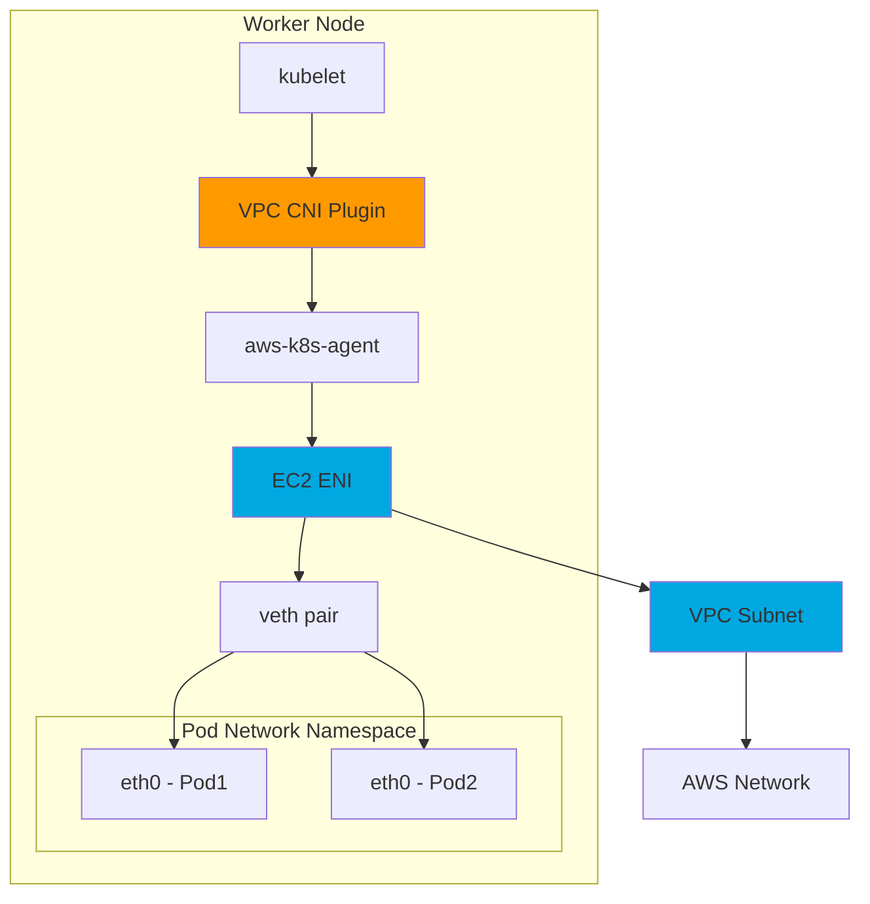
```mermaid
graph TB
    subgraph "Worker Node"
        A[kubelet] --> B[VPC CNI Plugin]
        B --> C[aws-k8s-agent]
        C --> D[EC2 ENI]

        subgraph "Pod Network Namespace"
            E[eth0 - Pod1]
            F[eth0 - Pod2]
        end

        D --> G[veth pair]
        G --> E
        G --> F
    end

    D --> H[VPC Subnet]
    H --> I[AWS Network]

    style B fill:#ff9900
    style D fill:#00a8e1
    style H fill:#00a8e1
```

**VPC CNI의 장점**:
1. **Native 성능**: Overlay Network Overhead 없음
2. **AWS 통합**: Security Group, NACLmichael 직접 적용
3. **간편한 관리**: VPC Flow Logs로 Pod 트래픽 모니터링
4. **보안**: Pod별 Security Group 적용 가능

### 2. CNI Plugin 동작 원리

**CNI Plugin 호출 시점**:
- Pod 생성 시: `ADD` 명령어
- Pod 삭제 시: `DEL` 명령어

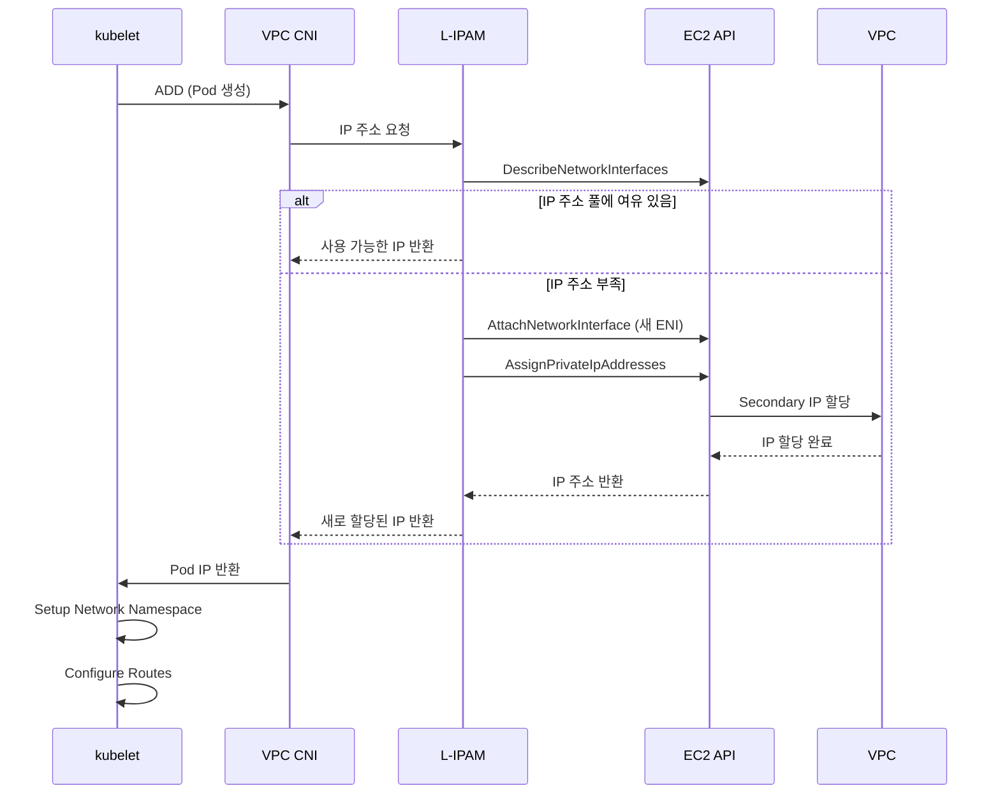
```mermaid
sequenceDiagram
    participant K as kubelet
    participant C as VPC CNI
    participant L as L-IPAM
    participant E as EC2 API
    participant V as VPC

    K->>C: ADD (Pod 생성)
    C->>L: IP 주소 요청
    L->>E: DescribeNetworkInterfaces
    alt IP 주소 풀에 여유 있음
        L-->>C: 사용 가능한 IP 반환
    else IP 주소 부족
        L->>E: AttachNetworkInterface (새 ENI)
        L->>E: AssignPrivateIpAddresses
        E->>V: Secondary IP 할당
        V-->>E: IP 할당 완료
        E-->>L: IP 주소 반환
        L-->>C: 새로 할당된 IP 반환
    end

    C->>K: Pod IP 반환
    K->>K: Setup Network Namespace
    K->>K: Configure Routes
```

**동작 흐름**:
1. **kubelet**이 Pod 스케줄링 시 CNI Plugin 호출
2. **VPC CNI**가 L-IPAM(Local IP Address Manager)에 IP 요청
3. **L-IPAM**이 사용 가능한 Secondary IP 확인
   - 여유 있으면 즉시 할당
   - 부족하면 EC2 API를 통해 새 ENI 연결 또는 Secondary IP 추가
4. **VPC CNI**가 veth pair 생성 및 Pod Network Namespace 설정
5. **iptables** NAT 규칙 설정
6. **Kernel API**를 통해 라우팅 업데이트

### 3. IP 주소 할당 모드

Amazon VPC CNI는 두 가지 IP 할당 모드를 지원합니다.

#### (1) Secondary IP mode (기본값)

**특징**:
- ENI에 연결된 각 **Secondary Private IP 주소**를 Pod에 개별 할당
- IP 주소 범위: `/16` CIDR (65,536개)

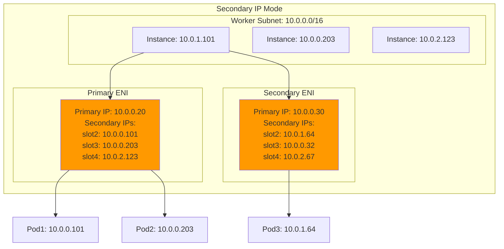
```mermaid
graph TB
    subgraph "Secondary IP Mode"
        subgraph "Worker Subnet: 10.0.0.0/16"
            A[Instance: 10.0.1.101]
            B[Instance: 10.0.0.203]
            C[Instance: 10.0.2.123]
        end

        subgraph "Primary ENI"
            A --> D["Primary IP: 10.0.0.20<br/>Secondary IPs:<br/>slot2: 10.0.0.101<br/>slot3: 10.0.0.203<br/>slot4: 10.0.2.123"]
        end

        subgraph "Secondary ENI"
            A --> E["Primary IP: 10.0.0.30<br/>Secondary IPs:<br/>slot2: 10.0.1.64<br/>slot3: 10.0.0.32<br/>slot4: 10.0.2.67"]
        end
    end

    D --> F[Pod1: 10.0.0.101]
    D --> G[Pod2: 10.0.0.203]
    E --> H[Pod3: 10.0.1.64]

    style D fill:#ff9900
    style E fill:#ff9900
```

**최대 Pod 수 계산**:
```
Max Pods = (ENI 당 IP 개수 - 1) × 2 + 2
```

예: m5.large (ENI 3개, ENI당 IP 10개)
```
Max Pods = (10 - 1) × 2 + 2 = 20개
```

#### (2) Prefix Delegation mode

**특징**:
- IP 주소를 개별이 아닌 **/28 Prefix** 단위로 할당
- IP 주소 범위: `/28` 블록 (16개 IP)
- 더 많은 Pod를 배치 가능

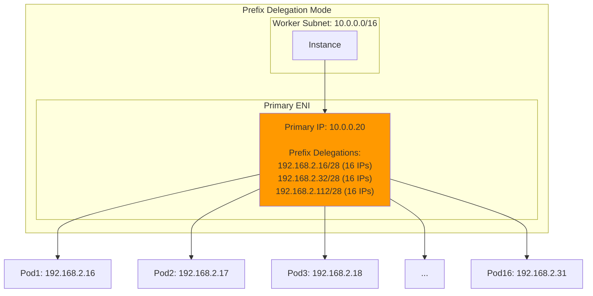
```mermaid
graph TB
    subgraph "Prefix Delegation Mode"
        subgraph "Worker Subnet: 10.0.0.0/16"
            A[Instance]
        end

        subgraph "Primary ENI"
            A --> B["Primary IP: 10.0.0.20<br/><br/>Prefix Delegations:<br/>192.168.2.16/28 (16 IPs)<br/>192.168.2.32/28 (16 IPs)<br/>192.168.2.112/28 (16 IPs)"]
        end
    end

    B --> C[Pod1: 192.168.2.16]
    B --> D[Pod2: 192.168.2.17]
    B --> E[Pod3: 192.168.2.18]
    B --> F[...]
    B --> G[Pod16: 192.168.2.31]

    style B fill:#ff9900
```

**최대 Pod 수 계산**:
```
Max Pods = ENI × (Prefix 당 IP 개수 - 1) × 16
```

예: m5.large (ENI 3개, ENI당 Prefix 10개)
```
New Max Pods = 3 × 10 × 16 = 480개
```

**Prefix Delegation 활성화**:

```bash
# eksctl로 활성화
kubectl set env daemonset aws-node -n kube-system ENABLE_PREFIX_DELEGATION=true

# 확인
kubectl get ds aws-node -n kube-system -o yaml | grep ENABLE_PREFIX_DELEGATION
```

### 4. 보안 그룹 관리

**Pod 단위 보안 그룹** (Security Groups for Pods):
- VPC CNI가 기본적으로 AWS VPC의 보안 그룹과 연동
- Pod별로 다른 보안 그룹 적용 가능
- Prefix Delegation 모드에서만 완벽하게 동작

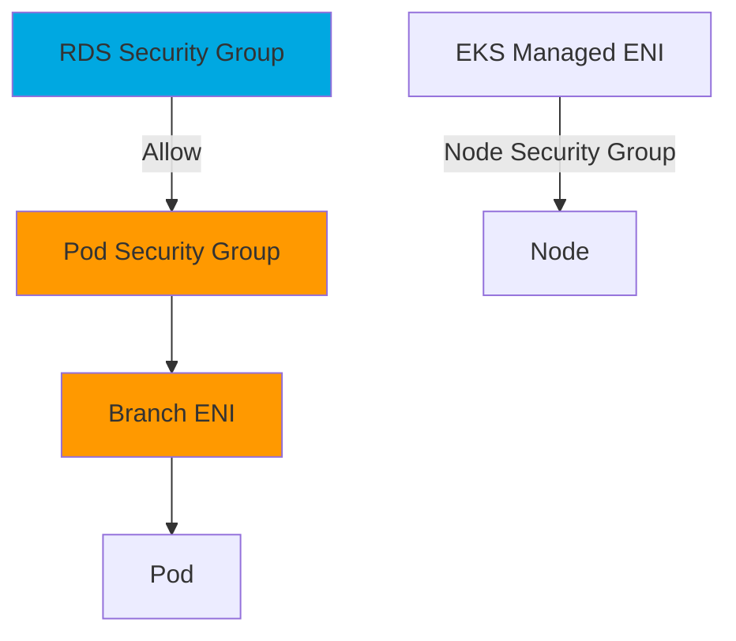
```mermaid
graph TB
    A[RDS Security Group] -->|Allow| B[Pod Security Group]
    B --> C[Branch ENI]
    C --> D[Pod]

    E[EKS Managed ENI] -->|Node Security Group| F[Node]

    style A fill:#00a8e1
    style B fill:#ff9900
    style C fill:#ff9900
```

**설정 방법**:

```yaml
apiVersion: v1
kind: Pod
metadata:
  name: my-pod
  annotations:
    vpc.amazonaws.com/security-groups: "sg-xxxxx"
spec:
  containers:
  - name: app
    image: nginx
```

---

## 🔍 노드에서 기본 네트워크 정보 확인

### 1. 노드 접속 및 IP 조회

```bash
# EC2 인스턴스 IP 조회
aws ec2 describe-instances --query "Reservations[*].Instances[*].[PublicIpAddress,PrivateIpAddress,InstanceName.Tags[?Key=='Name'].Value|[0]]" --output table

# 노드 정보 확인
kubectl get nodes -o custom-columns=NAME:.metadata.name,IP:.status.addresses[?(@.type=='InternalIP')].address,PODS:.status.capacity.pods

# 노드에 SSH 접속
ssh -i ~/.ssh/mykey.pem ec2-user@<NODE_IP>
```

### 2. 네트워크 인터페이스 확인

```bash
# 네트워크 인터페이스 목록
ip link show

# ENI 정보 확인
ip addr show

# 예시 출력
1: lo: <LOOPBACK,UP,LOWER_UP>
2: eth0@if3: <BROADCAST,MULTICAST,UP,LOWER_UP> (Primary ENI)
3: eni1@if4: <BROADCAST,MULTICAST,UP,LOWER_UP> (Secondary ENI)
```

**VPC CNI가 생성한 인터페이스**:
- `eth0`: Primary ENI (Node IP)
- `eniY@ifX`: Pod에 할당된 veth pair

```bash
# Pod IP 확인
kubectl get pod -o wide

# CNI log 확인
kubectl logs -n kube-system -l k8s-app=aws-node --tail=100
```

### 3. 라우팅 테이블 확인

```bash
# 라우팅 테이블 조회
ip route show

# 예시 출력
default via 192.168.1.1 dev eth0                     # 기본 게이트웨이
192.168.1.0/24 dev eth0 proto kernel scope link      # 노드 네트워크
192.168.1.64 dev eni1 scope link                     # Pod1 to ENI1
192.168.1.235 dev eni2 scope link                    # Pod2 to ENI2
```

**CNI 라우팅 규칙**:
- 각 Pod의 IP는 해당 veth pair의 ENI로 라우팅
- 노드가 Pod IP에 대한 직접 라우팅 보유
- AWS VPC 라우팅 테이블과 연동

---

## 📡 노드 간 파드 통신

### 1. 파드 통신 흐름

**동일 노드 내 Pod 간 통신**:
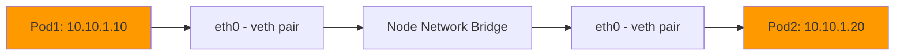
```mermaid
graph LR
    A[Pod1: 10.10.1.10] --> B[eth0 - veth pair]
    B --> C[Node Network Bridge]
    C --> D[eth0 - veth pair]
    D --> E[Pod2: 10.10.1.20]

    style A fill:#ff9900
    style E fill:#ff9900
```

**다른 노드 간 Pod 통신**:
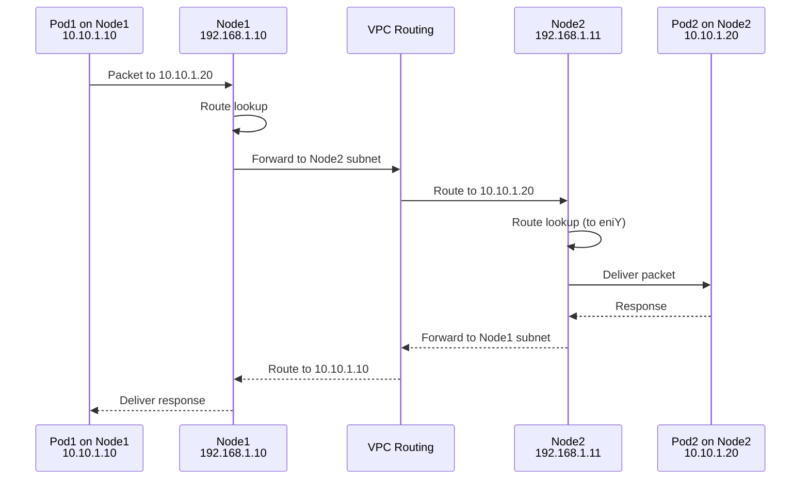
```mermaid
sequenceDiagram
    participant P1 as Pod1 on Node1<br/>10.10.1.10
    participant N1 as Node1<br/>192.168.1.10
    participant VPC as VPC Routing
    participant N2 as Node2<br/>192.168.1.11
    participant P2 as Pod2 on Node2<br/>10.10.1.20

    P1->>N1: Packet to 10.10.1.20
    N1->>N1: Route lookup
    N1->>VPC: Forward to Node2 subnet
    VPC->>N2: Route to 10.10.1.20
    N2->>N2: Route lookup (to eniY)
    N2->>P2: Deliver packet

    P2-->>N2: Response
    N2-->>VPC: Forward to Node1 subnet
    VPC-->>N1: Route to 10.10.1.10
    N1-->>P1: Deliver response
```

**흐름 설명**:
1. **Pod1 → Node1**: Pod1이 패킷을 eth0(veth pair)를 통해 전송
2. **Node1 라우팅**: Node1의 라우팅 테이블에서 목적지 확인
3. **VPC 라우팅**: VPC 라우팅 테이블을 통해 Node2 Subnet으로 전달
4. **Node2 라우팅**: Node2의 라우팅 테이블에서 Pod2의 ENI 확인
5. **Node2 → Pod2**: veth pair를 통해 Pod2로 전달

### 2. Overlay Network vs AWS VPC CNI

#### Overlay Network (e.g., Calico, Flannel VXLAN)

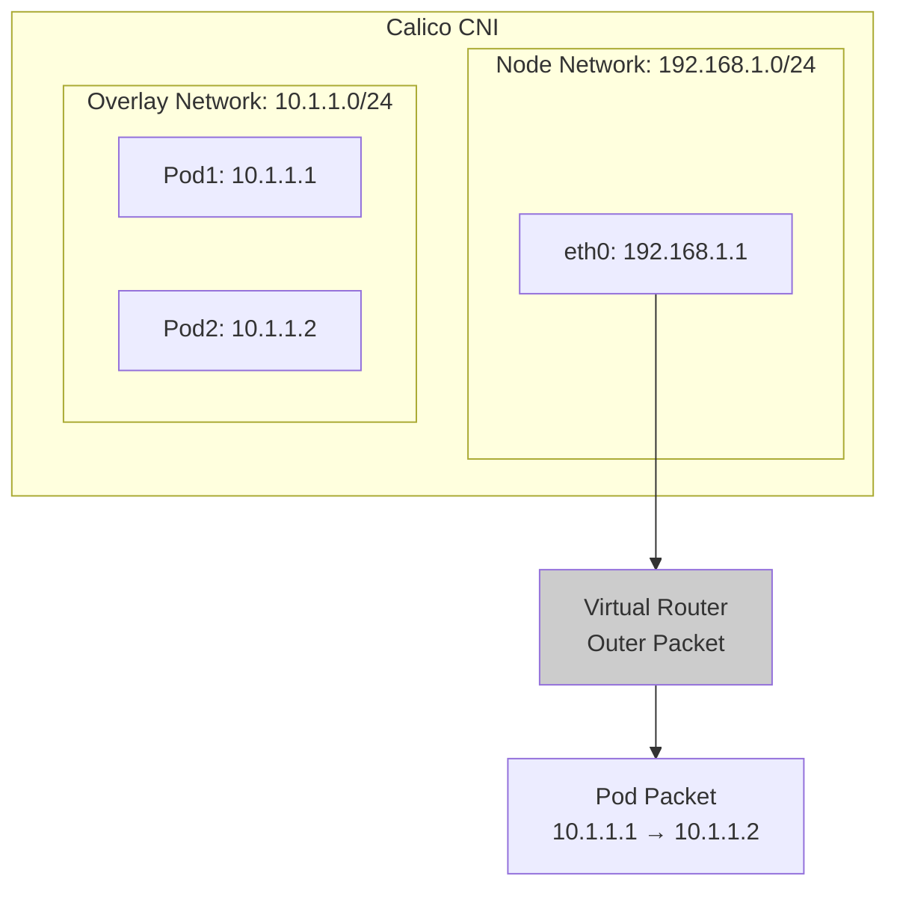
```mermaid
graph TB
    subgraph "Calico CNI"
        subgraph "Node Network: 192.168.1.0/24"
            A[eth0: 192.168.1.1]
        end

        subgraph "Overlay Network: 10.1.1.0/24"
            B[Pod1: 10.1.1.1]
            C[Pod2: 10.1.1.2]
        end
    end

    A --> D[Virtual Router<br/>Outer Packet]
    D --> E[Pod Packet<br/>10.1.1.1 → 10.1.1.2]

    style D fill:#cccccc
```

**특징**:
- Pod CIDR이 VPC 외부 대역 (e.g., 10.1.1.0/24)
- Encapsulation (VXLAN, IP-in-IP) 필요
- 추가 오버헤드 발생

#### AWS VPC CNI

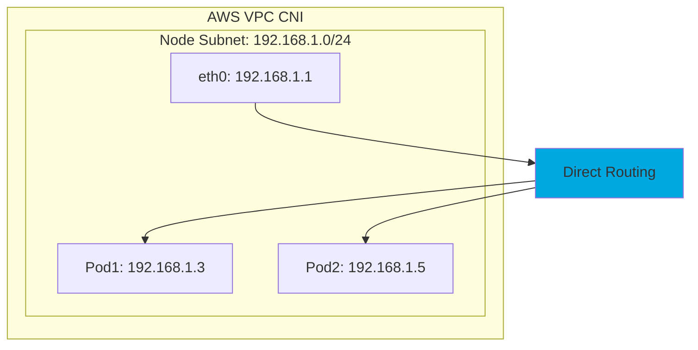
```mermaid
graph TB
    subgraph "AWS VPC CNI"
        subgraph "Node Subnet: 192.168.1.0/24"
            A[eth0: 192.168.1.1]
            B[Pod1: 192.168.1.3]
            C[Pod2: 192.168.1.5]
        end
    end

    A --> D[Direct Routing]
    D --> B
    D --> C

    style D fill:#00a8e1
```

**특징**:
- Pod IP가 VPC CIDR 내부 (e.g., 192.168.1.0/24)
- Encapsulation 불필요
- 낮은 Latency, 높은 성능

### 3. NAT 동작 원리

**Pod에서 외부로 통신 시 SNAT (Source NAT)**:

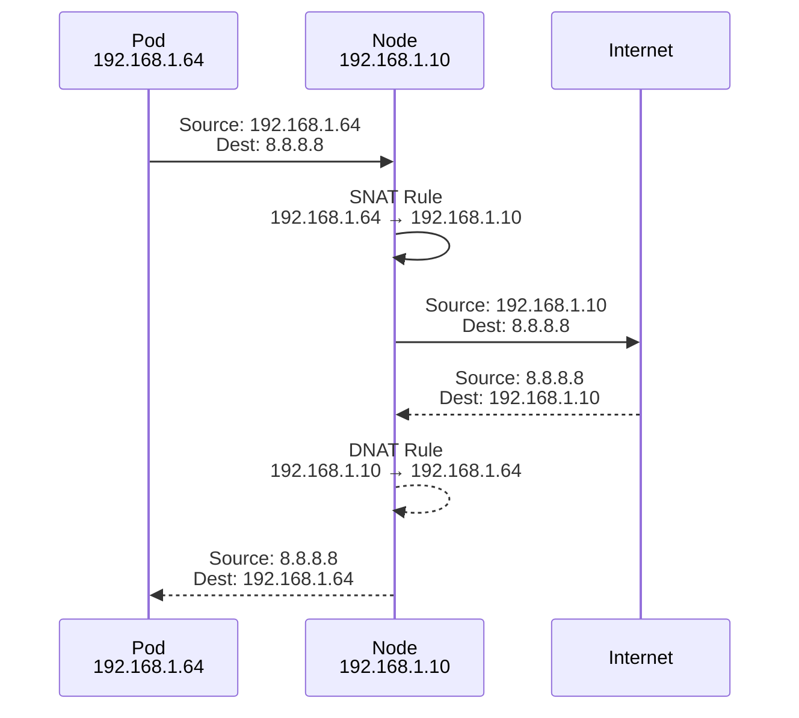
```mermaid
sequenceDiagram
    participant P as Pod<br/>192.168.1.64
    participant N as Node<br/>192.168.1.10
    participant I as Internet

    P->>N: Source: 192.168.1.64<br/>Dest: 8.8.8.8
    N->>N: SNAT Rule<br/>192.168.1.64 → 192.168.1.10
    N->>I: Source: 192.168.1.10<br/>Dest: 8.8.8.8

    I-->>N: Source: 8.8.8.8<br/>Dest: 192.168.1.10
    N-->>N: DNAT Rule<br/>192.168.1.10 → 192.168.1.64
    N-->>P: Source: 8.8.8.8<br/>Dest: 192.168.1.64
```

**iptables NAT 규칙 확인**:

```bash
# NAT 테이블 확인
sudo iptables -t nat -S

# AWS-SNAT-CHAIN 규칙
-A AWS-SNAT-CHAIN-0 ! -d 192.168.0.0/16 -m comment --comment "AWS, SNAT" -j SNAT --to-source 192.168.1.10
```

---

## 🌍 파드에서 외부 통신

### 1. 외부 통신 흐름

**Pod → Internet 통신 시**:

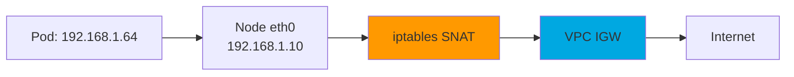
```mermaid
graph LR
    A[Pod: 192.168.1.64] --> B[Node eth0<br/>192.168.1.10]
    B --> C[iptables SNAT]
    C --> D[VPC IGW]
    D --> E[Internet]

    style C fill:#ff9900
    style D fill:#00a8e1
```

**단계별 흐름**:
1. Pod에서 패킷 생성 (Source: 192.168.1.64)
2. Node의 iptables NAT 규칙 적용
3. SNAT: 192.168.1.64 → 192.168.1.10 (Node IP)
4. VPC Internet Gateway를 통해 외부로 전송

### 2. iptables SNAT 규칙

**VPC CNI가 설정하는 iptables 규칙**:

```bash
# 파드에서 외부로 나가는 모든 트래픽에 SNAT 적용
iptables -t nat -A AWS-SNAT-CHAIN-0 ! -d <VPC_CIDR> -j SNAT --to-source <NODE_IP>

# 예시
iptables -t nat -A AWS-SNAT-CHAIN-0 ! -d 192.168.0.0/16 -j SNAT --to-source 192.168.1.10
```

**주요 규칙**:
- `! -d 192.168.0.0/16`: VPC CIDR 외부 트래픽만
- `-j SNAT --to-source 192.168.1.10`: Node IP로 변환

---

## ⚙️ AWS VPC CNI 설정 변경

AWS VPC CNI는 여러 환경 변수로 동작을 제어할 수 있습니다.

### 1. WARM_ENI_TARGET

**설명**: 미리 준비할 ENI 개수

```bash
# ENI를 1개 미리 준비
kubectl set env daemonset aws-node -n kube-system WARM_ENI_TARGET=1
```

**동작 방식**:
- 예약된 ENI를 미리 연결하여 Pod 생성 시 즉시 IP 할당
- Pod가 증가하면 ENI 개수 유지

**예시**:
- WARM_ENI_TARGET=1 → 항상 ENI 1개 여유 유지
- Pod 10개 → ENI 3개 (사용 2개 + 여유 1개)

### 2. WARM_IP_TARGET

**설명**: 미리 준비할 IP 주소 개수

```bash
# IP 주소를 10개 미리 준비
kubectl set env daemonset aws-node -n kube-system WARM_IP_TARGET=10
```

**동작 방식**:
- Secondary IP를 미리 할당하여 Pod 생성 속도 향상
- Pod 삭제 시에도 IP 유지 (재사용)

**주의사항**:
- WARM_ENI_TARGET과 함께 사용 불가
- IP 낭비 가능성 있음

### 3. MINIMUM_IP_TARGET

**설명**: 최소 유지할 IP 주소 개수

```bash
# 최소 30개 IP 주소 유지
kubectl set env daemonset aws-node -n kube-system MINIMUM_IP_TARGET=30
```

**동작 방식**:
- 노드 시작 시 최소 IP 개수 확보
- Scale-out 시 빠른 Pod 생성 보장

**사용 시나리오**:
- 대규모 Pod 배포 예상 시
- Pod 생성 Latency 최소화 필요 시

---

## 📊 노드에 파드 생성 갯수 제한

### 1. Secondary IP mode

**최대 Pod 수 계산**:

```
Max Pods = (ENI 수 × (ENI당 IP 개수 - 1)) + 2
```

**예시: m5.large (ENI 3개, IP 10개/ENI)**:

```
Max Pods = (3 × (10 - 1)) + 2 = 29개
```

**인스턴스별 최대 Pod 수**:

| Instance Type | ENI 개수 | IP/ENI | Max Pods (Secondary IP) |
|---------------|---------|--------|------------------------|
| t3.small      | 3       | 4      | 11                     |
| t3.medium     | 3       | 6      | 17                     |
| t3.large      | 3       | 12     | 35                     |
| m5.large      | 3       | 10     | 29                     |
| m5.xlarge     | 4       | 15     | 58                     |
| p3dn.24xlarge | 15      | 50     | 737                    |

### 2. Prefix Delegation mode

**최대 Pod 수 계산**:

```
New Max Pods = (ENI 수 × (ENI당 지원하는 IPv4 Prefix - 1)) × 16 + 2
```

**예시: m5.large (ENI 3개, Prefix 10개/ENI)**:

```
New Max Pods = (3 × (10 - 1)) × 16 + 2 = 434개
```

**Prefix Delegation 활성화**:

```bash
# Prefix Delegation 모드 활성화
kubectl set env daemonset aws-node -n kube-system ENABLE_PREFIX_DELEGATION=true

# 확인
kubectl get ds aws-node -n kube-system -o yaml | grep ENABLE_PREFIX_DELEGATION
```

**장점**:
- **대폭 증가한 Pod 수**: m5.large에서 29개 → 434개
- **IP 효율성**: /28 Prefix 단위 할당으로 IP 절약
- **빠른 스케일**: Prefix 단위 할당으로 속도 향상

### 3. maxPods 계산 방법

**kubelet의 maxPods 제한 확인**:

```bash
# kubelet 설정 확인
kubectl get node <NODE_NAME> -o json | jq .status.capacity.pods

# 또는
kubectl describe node <NODE_NAME> | grep pods
```

**maxPods 수동 조정** (t3.medium 예시):

```bash
# 기본 maxPods 변경
cat <<EOF | sudo tee /etc/kubernetes/kubelet/kubelet-config.json
{
  "maxPods": 50
}
EOF

# kubelet 재시작
sudo systemctl restart kubelet
```

**주의사항**:
- ENI 제한을 초과하면 Pod는 Pending 상태
- IP 부족 시 자동으로 ENI 추가되지만 시간 소요

---

## 🔧 Kubernetes Service

### 1. Service 개념

**Service**는 Pod 간 통신 시 고정된 IP 와 도메인 이름<Domain Name>을 제공합니다.

**문제점**:
- Pod IP는 재시작 시 변경됨
- 여러 Pod에 로드밸런싱 필요

**해결책**:
- Service가 고정 IP (ClusterIP) 제공
- Endpoint를 통해 Pod 목록 관리
- 레이블 Selector로 Pod 자동 등록

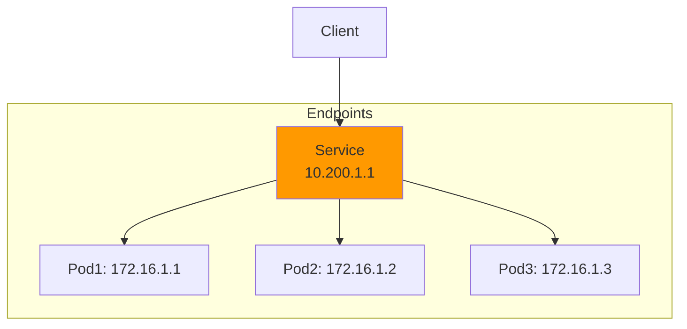
```mermaid
graph TB
    A[Client] --> B[Service<br/>10.200.1.1]

    subgraph "Endpoints"
        B --> C[Pod1: 172.16.1.1]
        B --> D[Pod2: 172.16.1.2]
        B --> E[Pod3: 172.16.1.3]
    end

    style B fill:#ff9900
```

### 2. Service 종류

Kubernetes에는 총 4가지 Service 종류가 있습니다.

| Service 종류 | 접근 범위 | 용도 |
|-------------|----------|------|
| **ClusterIP** | 클러스터 내부 | 기본 Service, 내부 통신만 |
| **NodePort** | 외부 클라이언트 | 노드 IP:NodePort로 접근 |
| **LoadBalancer** | 외부 클라이언트 (로드밸런서) | AWS ELB 등 외부 LB 연동 |
| **ExternalName** | 외부 서비스 | 외부 도메인 CNAME 매핑 |

### 3. ClusterIP Service

**기본 Service 타입**으로 클러스터 내부에서만 접근 가능합니다.

```yaml
apiVersion: v1
kind: Service
metadata:
  name: my-service
spec:
  type: ClusterIP
  selector:
    app: MyApp
  ports:
  - protocol: TCP
    port: 10200        # Service Port
    targetPort: 8080   # Pod Port
```

**동작 원리**:

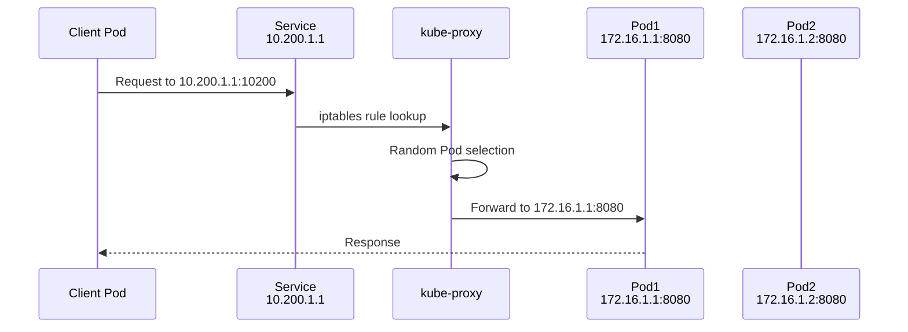
```mermaid
sequenceDiagram
    participant C as Client Pod
    participant S as Service<br/>10.200.1.1
    participant K as kube-proxy
    participant P1 as Pod1<br/>172.16.1.1:8080
    participant P2 as Pod2<br/>172.16.1.2:8080

    C->>S: Request to 10.200.1.1:10200
    S->>K: iptables rule lookup
    K->>K: Random Pod selection
    K->>P1: Forward to 172.16.1.1:8080
    P1-->>C: Response
```

**특징**:
- ClusterIP는 쿠버네티스 클러스터 내부에서만 접근
- 외부 클라이언트는 접근 불가

### 4. NodePort Service

**NodePort**는 모든 노드의 IP:`NodePort`로 외부에서 접근 가능합니다.

```yaml
apiVersion: v1
kind: Service
metadata:
  name: my-nodeport
spec:
  type: NodePort
  selector:
    app: MyApp
  ports:
  - protocol: TCP
    port: 10200
    targetPort: 8080
    nodePort: 30100   # 30000-32767 범위
```

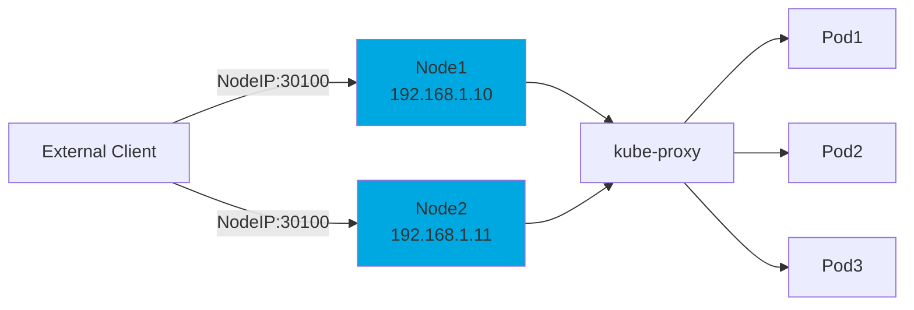
```mermaid
graph LR
    A[External Client] -->|NodeIP:30100| B[Node1<br/>192.168.1.10]
    A -->|NodeIP:30100| C[Node2<br/>192.168.1.11]

    B --> D[kube-proxy]
    C --> D

    D --> E[Pod1]
    D --> F[Pod2]
    D --> G[Pod3]

    style B fill:#00a8e1
    style C fill:#00a8e1
```

**특징**:
- 외부에서 `<NodeIP>:<NodePort>`로 접근
- 모든 노드에서 동일한 NodePort 사용
- 프로덕션에서는 LoadBalancer 사용 권장

### 5. LoadBalancer Service

**LoadBalancer**는 클라우드 제공업체의 외부 로드밸런서를 생성합니다.

```yaml
apiVersion: v1
kind: Service
metadata:
  name: my-loadbalancer
spec:
  type: LoadBalancer
  selector:
    app: MyApp
  ports:
  - protocol: TCP
    port: 80
    targetPort: 8080
```

**AWS에서 생성되는 리소스**:
- Classic Load Balancer (CLB) 또는
- Network Load Balancer (NLB, AWS Load Balancer Controller 사용 시)

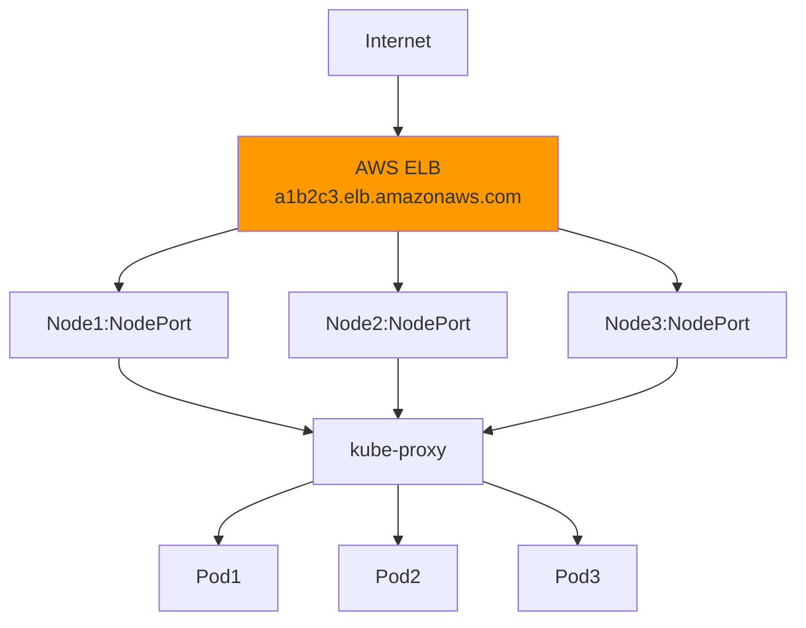
```mermaid
graph TB
    A[Internet] --> B[AWS ELB<br/>a1b2c3.elb.amazonaws.com]

    B --> C[Node1:NodePort]
    B --> D[Node2:NodePort]
    B --> E[Node3:NodePort]

    C --> F[kube-proxy]
    D --> F
    E --> F

    F --> G[Pod1]
    F --> H[Pod2]
    F --> I[Pod3]

    style B fill:#ff9900
```

**특징**:
- 외부에서 ELB DNS 이름으로 접근
- 자동으로 Health Check 설정
- AWS에서 비용 발생

### 6. ExternalName Service

**ExternalName**은 외부 서비스의 도메인 이름을 매핑합니다.

```yaml
apiVersion: v1
kind: Service
metadata:
  name: my-database
spec:
  type: ExternalName
  externalName: mydb.example.com
```

**특징**:
- CNAME 레코드로 외부 서비스 참조
- ClusterIP 없음
- 외부 데이터베이스 등 연동 시 사용

---

## 🔀 kube-proxy 모드

**kube-proxy**는 Service를 구현하는 핵심 컴포넌트로, 여러 모드를 지원합니다.

### 1. User Space 모드

**가장 초기 모드**로 kube-proxy가 직접 프록시 역할을 합니다.

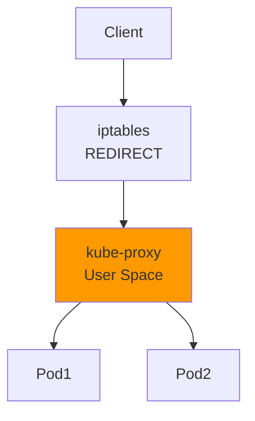
```mermaid
graph TB
    A[Client] --> B[iptables<br/>REDIRECT]
    B --> C[kube-proxy<br/>User Space]
    C --> D[Pod1]
    C --> E[Pod2]

    style C fill:#ff9900
```

**특징**:
- kube-proxy 프로세스가 직접 트래픽 처리
- User Space ↔ Kernel Space 전환으로 성능 저하
- **deprecated**, 사용 안 함

### 2. iptables 모드

**기본 모드**로 iptables 규칙으로 트래픽을 전달합니다.

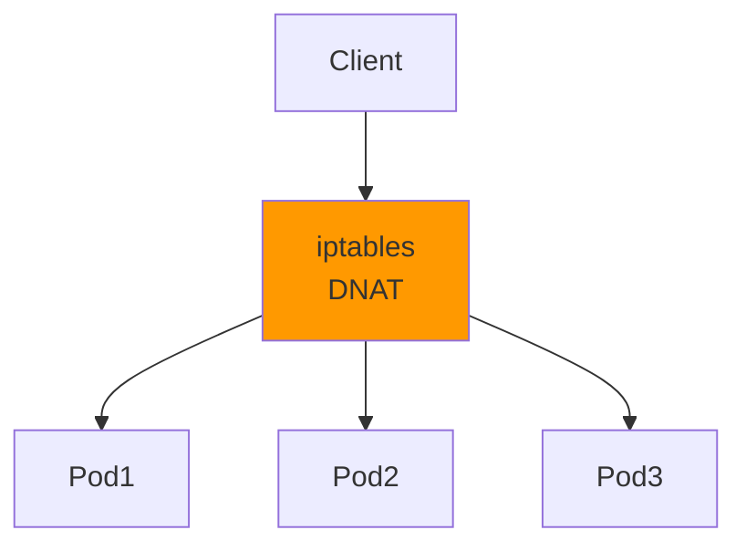
```mermaid
graph TB
    A[Client] --> B[iptables<br/>DNAT]
    B --> C[Pod1]
    B --> D[Pod2]
    B --> E[Pod3]

    style B fill:#ff9900
```

**동작 원리**:
1. kube-proxy가 iptables 규칙 생성
2. 패킷이 Service IP로 전송
3. iptables DNAT 규칙 적용
4. 랜덤하게 Pod 선택하여 포워딩

**장점**:
- Kernel Space에서 처리 (빠름)
- 안정적

**단점**:
- iptables 규칙 수가 많아지면 성능 저하
- 수천 개 Service 시 Latency 증가

### 3. IPVS 모드

**IPVS**(IP Virtual Server)는 Linux Kernel의 Layer 4 로드밸런서입니다.

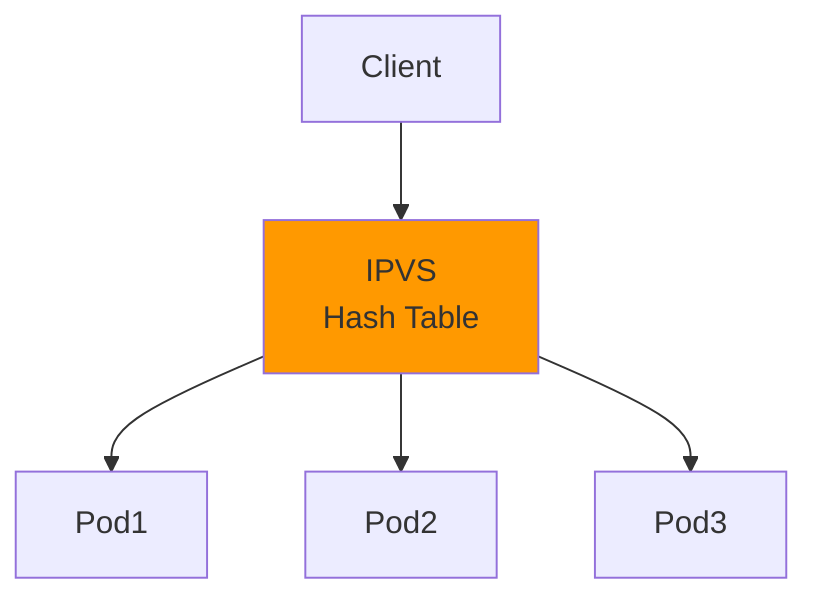
```mermaid
graph TB
    A[Client] --> B[IPVS<br/>Hash Table]
    B --> C[Pod1]
    B --> D[Pod2]
    B --> E[Pod3]

    style B fill:#ff9900
```

**특징**:
- **Hash Table** 기반으로 빠른 룩업
- iptables보다 훨씬 빠름
- 다양한 로드밸런싱 알고리즘 지원 (RoundRobin, LeastConnection 등)

**활성화 방법**:

```bash
# kube-proxy ConfigMap 수정
kubectl edit cm kube-proxy -n kube-system

# mode: ipvs 설정
data:
  config.conf: |
    mode: "ipvs"

# kube-proxy 재시작
kubectl delete pod -n kube-system -l k8s-app=kube-proxy
```

**장점**:
- **성능**: iptables보다 매우 빠름
- **확장성**: 수만 개 Service 처리 가능

**단점**:
- IPVS 커널 모듈 필요
- 설정 복잡

### 4. nftables 모드

**nftables**는 iptables의 후속 기술입니다.

**특징**:
- Linux Kernel 5.13 이상 필요
- iptables보다 성능 개선
- Kubernetes 1.31부터 지원 시작

### 5. eBPF/XDP 모드

**eBPF**(Extended Berkeley Packet Filter)는 Kernel Networking Layer를 우회합니다.

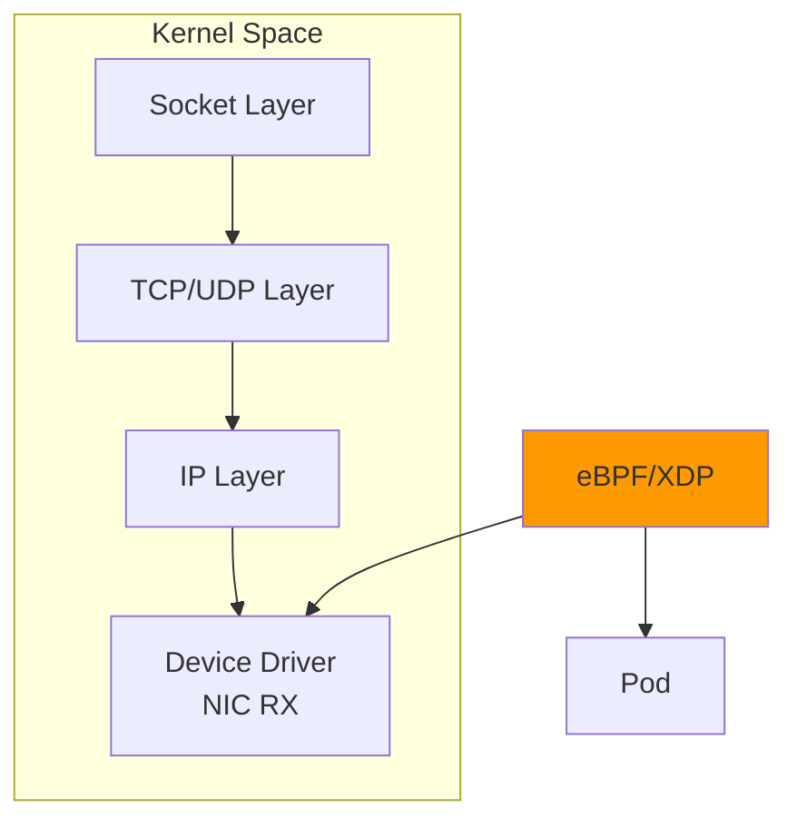
```mermaid
graph TB
    subgraph "Kernel Space"
        A[Socket Layer]
        B[TCP/UDP Layer]
        C[IP Layer]
        D[Device Driver<br/>NIC RX]

        A --> B
        B --> C
        C --> D
    end

    E[eBPF/XDP] --> D
    E --> F[Pod]

    style E fill:#ff9900
```

**동작 원리**:
- **eBPF**: Kernel 내부에서 프로그램 실행
- **XDP**: NIC 드라이버 레벨에서 패킷 처리

**특징**:
- **극한의 성능**: L3/L4 구간 우회
- **Cilium CNI** 등에서 사용
- Kernel 프로그래밍 필요

---

## ⚖️ AWS LoadBalancer Controller

**AWS Load Balancer Controller**는 Kubernetes Service를 AWS NLB/ALB와 연동합니다.

### 1. Instance mode vs IP mode

#### (1) Instance mode

**특징**:
- **NodePort** 사용
- ELB → NodeIP:NodePort → kube-proxy → Pod
- **externalTrafficPolicy: Cluster** (기본값)

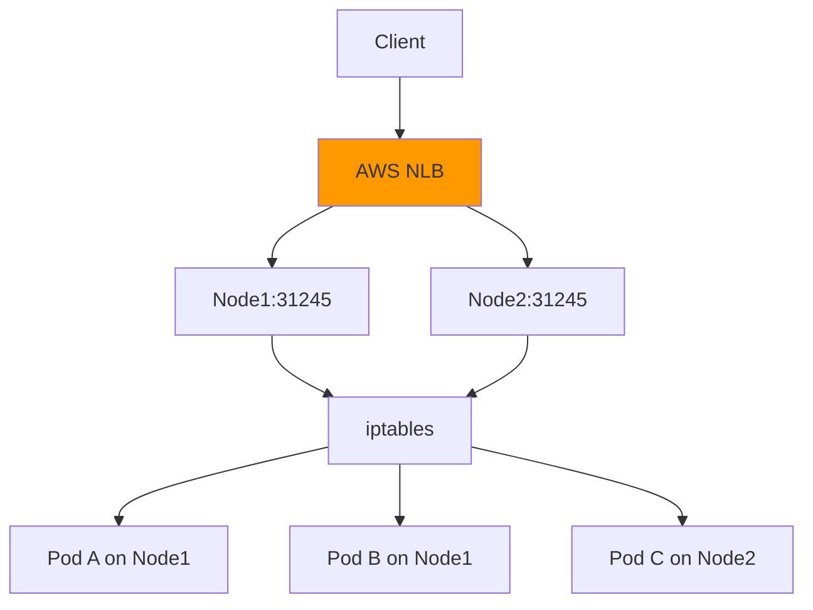
```mermaid
graph TB
    A[Client] --> B[AWS NLB]

    B --> C[Node1:31245]
    B --> D[Node2:31245]

    C --> E[iptables]
    D --> E

    E --> F[Pod A on Node1]
    E --> G[Pod B on Node1]
    E --> H[Pod C on Node2]

    style B fill:#ff9900
```

**장점**:
- 구현 간단
- 호환성 높음

**단점**:
- 2 hop (Node → Pod)
- 소스 IP 보존 안 됨

#### (2) IP mode

**특징**:
- **Pod IP** 직접 타겟 등록
- ELB → Pod IP 직접 통신
- **externalTrafficPolicy: Local** 권장

```mermaid
graph TB
    A[Client] --> B[AWS NLB<br/>IP Target Mode]

    B --> C[Pod A: 192.168.1.10]
    B --> D[Pod B: 192.168.1.20]
    B --> E[Pod C: 192.168.1.30]

    style B fill:#ff9900
```

**장점**:
- 1 hop (직접 연결)
- 소스 IP 보존
- 낮은 Latency

**단점**:
- Proxy Protocol v2 필요 (NLB만)
- 복잡한 설정

### 2. IRSA 설정

**AWS Load Balancer Controller**는 IRSA (IAM Roles for Service Accounts)를 사용합니다.

```bash
# (1) IAM OIDC Provider 생성
eksctl utils associate-iam-oidc-provider --cluster myeks --approve

# (2) IAM Policy 다운로드
curl -o iam_policy.json https://raw.githubusercontent.com/kubernetes-sigs/aws-load-balancer-controller/refs/heads/main/docs/install/iam_policy.json

# (3) IAM Policy 생성
aws iam create-policy \
  --policy-name AWSLoadBalancerControllerIAMPolicy \
  --policy-document file://iam_policy.json

# (4) Service Account 생성
eksctl create iamserviceaccount \
  --cluster=myeks \
  --namespace=kube-system \
  --name=aws-load-balancer-controller \
  --attach-policy-arn=arn:aws:iam::$ACCOUNT_ID:policy/AWSLoadBalancerControllerIAMPolicy \
  --override-existing-serviceaccounts \
  --approve

# (5) Service Account 확인
kubectl get sa aws-load-balancer-controller -n kube-system -o yaml
```

### 3. NLB 배포

**Helm으로 AWS Load Balancer Controller 설치**:

```bash
# Helm repo 추가
helm repo add eks https://aws.github.io/eks-charts
helm repo update

# 설치
helm install aws-load-balancer-controller eks/aws-load-balancer-controller \
  -n kube-system \
  --set clusterName=myeks \
  --set serviceAccount.create=false \
  --set serviceAccount.name=aws-load-balancer-controller \
  --set region=ap-northeast-2 \
  --set vpcId=vpc-xxxxxxxx

# 확인
kubectl get deploy -n kube-system aws-load-balancer-controller
```

**NLB Service 배포**:

```yaml
apiVersion: v1
kind: Service
metadata:
  name: echo-service-nlb
  annotations:
    service.beta.kubernetes.io/aws-load-balancer-type: "nlb"
    service.beta.kubernetes.io/aws-load-balancer-scheme: "internet-facing"
    service.beta.kubernetes.io/aws-load-balancer-nlb-target-type: "ip"
spec:
  type: LoadBalancer
  selector:
    app: echo
  ports:
  - port: 80
    targetPort: 8080
```

**확인**:

```bash
# Service 확인
kubectl get svc echo-service-nlb

# NLB DNS 확인
NLB_DNS=$(kubectl get svc echo-service-nlb -o jsonpath='{.status.loadBalancer.ingress[0].hostname}')
curl http://$NLB_DNS
```

---

## 🚪 Ingress (L7 HTTP)

### 1. Ingress Controller

**Ingress Controller**는 L7 HTTP/HTTPS 로드밸런싱을 제공합니다.

```mermaid
graph TB
    A[Client] --> B[ALB<br/>*.elb.amazonaws.com]

    B -->|/api| C[API Service]
    B -->|/web| D[Web Service]

    C --> E[API Pod 1]
    C --> F[API Pod 2]

    D --> G[Web Pod 1]
    D --> H[Web Pod 2]

    style B fill:#ff9900
```

**주요 Ingress Controller**:
- **AWS ALB Ingress Controller** (AWS Load Balancer Controller)
- **NGINX Ingress Controller**
- **Traefik**
- **Istio Gateway**

### 2. ALB Ingress Controller

**AWS Load Balancer Controller**를 사용하여 ALB를 생성합니다.

```yaml
apiVersion: networking.k8s.io/v1
kind: Ingress
metadata:
  name: my-ingress
  annotations:
    alb.ingress.kubernetes.io/scheme: internet-facing
    alb.ingress.kubernetes.io/target-type: ip
    alb.ingress.kubernetes.io/listen-ports: '[{"HTTP": 80}, {"HTTPS": 443}]'
    alb.ingress.kubernetes.io/certificate-arn: arn:aws:acm:...
spec:
  ingressClassName: alb
  rules:
  - host: api.example.com
    http:
      paths:
      - path: /
        pathType: Prefix
        backend:
          service:
            name: api-service
            port:
              number: 8080
  - host: web.example.com
    http:
      paths:
      - path: /
        pathType: Prefix
        backend:
          service:
            name: web-service
            port:
              number: 80
```

**동작 흐름**:

```mermaid
sequenceDiagram
    participant C as Client
    participant A as ALB
    participant I as Ingress Controller
    participant S as Service
    participant P as Pod

    C->>A: GET api.example.com/users
    A->>A: Host-based routing
    A->>S: Forward to api-service
    S->>P: kube-proxy routing
    P-->>S: Response
    S-->>A: Response
    A-->>C: Response
```

**특징**:
- **Host-based routing**: 도메인별 라우팅
- **Path-based routing**: URL 경로별 라우팅
- **TLS Termination**: ACM 인증서 연동

---

## 🌐 ExternalDNS

### 1. ExternalDNS란?

**ExternalDNS**는 Kubernetes Service/Ingress를 Route53에 자동 등록합니다.

```mermaid
graph LR
    A[Ingress/Service] --> B[ExternalDNS]
    B --> C[Route53]

    C --> D[DNS Record<br/>api.example.com]
    C --> E[DNS Record<br/>web.example.com]

    style B fill:#ff9900
    style C fill:#00a8e1
```

### 2. ExternalDNS 설정

**Helm으로 설치**:

```bash
# Helm repo 추가
helm repo add bitnami https://charts.bitnami.com/bitnami
helm repo update

# 설치
helm install external-dns bitnami/external-dns \
  --set provider=aws \
  --set aws.region=ap-northeast-2 \
  --set txtOwnerId=myeks \
  --set domainFilters[0]=example.com \
  --set policy=sync

# 확인
kubectl get deploy external-dns
```

**Service에 Annotation 추가**:

```yaml
apiVersion: v1
kind: Service
metadata:
  name: my-service
  annotations:
    external-dns.alpha.kubernetes.io/hostname: api.example.com
spec:
  type: LoadBalancer
  selector:
    app: api
  ports:
  - port: 80
```

**Route53 레코드 자동 생성 확인**:

```bash
# Route53 레코드 조회
aws route53 list-resource-record-sets --hosted-zone-id <ZONE_ID> --query "ResourceRecordSets[?Name=='api.example.com.']"
```

---

## 💡 핵심 개념 정리

### 1. VPC CNI vs Overlay CNI

| 항목 | VPC CNI | Overlay CNI (Calico, Flannel) |
|------|---------|-------------------------------|
| **Pod IP** | VPC CIDR 내부 | VPC 외부 대역 (10.x.x.x) |
| **Encapsulation** | 없음 | VXLAN, IP-in-IP |
| **성능** | 높음 (직접 라우팅) | 낮음 (Overhead) |
| **AWS 통합** | Security Group, NACLs 지원 | 지원 안 함 |
| **라우팅** | VPC Route Table | Overlay Route Table |
| **IP 제약** | VPC CIDR 크기 제한 | 제약 없음 |

### 2. Secondary IP vs Prefix Delegation

| 항목 | Secondary IP mode | Prefix Delegation mode |
|------|------------------|------------------------|
| **IP 할당 단위** | 개별 IP | /28 Prefix (16개) |
| **Max Pods (m5.large)** | 29개 | 434개 |
| **IP 효율성** | 낮음 | 높음 |
| **스케일 속도** | 느림 | 빠름 |
| **Subnet 크기** | /16 이상 권장 | /28 이상 권장 |

**언제 Prefix Delegation을 사용해야 하나?**
- 노드당 많은 Pod 필요 (30개 이상)
- IP 주소 절약 필요
- 빠른 Pod 생성 속도 필요

### 3. kube-proxy 모드 비교

| 모드 | 성능 | 확장성 | 복잡도 | Kernel 요구사항 |
|------|------|--------|--------|----------------|
| **userspace** | ⭐ | ⭐ | ⭐⭐ | - |
| **iptables** | ⭐⭐⭐ | ⭐⭐ | ⭐⭐ | iptables |
| **IPVS** | ⭐⭐⭐⭐ | ⭐⭐⭐⭐⭐ | ⭐⭐⭐ | IPVS 모듈 |
| **nftables** | ⭐⭐⭐⭐ | ⭐⭐⭐⭐ | ⭐⭐⭐ | nftables (5.13+) |
| **eBPF/XDP** | ⭐⭐⭐⭐⭐ | ⭐⭐⭐⭐⭐ | ⭐⭐⭐⭐⭐ | eBPF (4.8+) |

**권장사항**:
- **소규모 클러스터** (< 100 Service): iptables
- **대규모 클러스터** (> 1000 Service): IPVS
- **극한 성능 필요**: eBPF/XDP (Cilium)

### 4. Service 종류 비교

```mermaid
graph TB
    subgraph "Service Types"
        A[ClusterIP<br/>Internal Only]
        B[NodePort<br/>NodeIP:Port]
        C[LoadBalancer<br/>External LB]
        D[ExternalName<br/>CNAME]
    end

    E[Internal Clients] --> A

    F[External Clients] --> B
    F --> C

    A --> G[Pods]
    B --> G
    C --> G

    D --> H[External Service<br/>db.example.com]

    style A fill:#00a8e1
    style B fill:#ff9900
    style C fill:#ff9900
    style D fill:#cccccc
```

**선택 기준**:
- **내부 통신만**: ClusterIP
- **간단한 외부 접근**: NodePort
- **프로덕션 외부 접근**: LoadBalancer
- **외부 서비스 참조**: ExternalName

---

## 🎓 Week 2 학습 정리

### 이번 주 핵심 요약

**1. AWS VPC CNI**
- EKS는 VPC CNI를 기본 사용
- Pod가 VPC IP를 직접 할당받아 Native 성능
- Secondary IP mode vs Prefix Delegation mode

**2. IP 주소 관리**
- WARM_ENI_TARGET, WARM_IP_TARGET, MINIMUM_IP_TARGET 설정
- maxPods 계산: ENI × (IP/ENI - 1) + 2
- Prefix Delegation 시 최대 16배 증가

**3. Service 종류**
- ClusterIP: 내부 통신
- NodePort: 외부 접근 (NodeIP:Port)
- LoadBalancer: AWS ELB 연동
- ExternalName: 외부 도메인 참조

**4. kube-proxy 모드**
- iptables: 기본 모드, 안정적
- IPVS: 대규모 클러스터, Hash Table 기반
- eBPF/XDP: 극한 성능, Kernel 우회

**5. AWS LoadBalancer Controller**
- Instance mode vs IP mode
- IRSA (IAM Roles for Service Accounts)
- NLB/ALB 자동 생성

**6. Ingress & ExternalDNS**
- ALB Ingress Controller로 L7 라우팅
- ExternalDNS로 Route53 자동 등록

### 다음 주 예고

**Week 3 학습 주제** (예정):
- EKS Storage (EBS, EFS, FSx)
- StatefulSet과 Persistent Volume
- CSI Driver
- Snapshot과 Backup

---

**마지막 업데이트**: 2026-03-25
