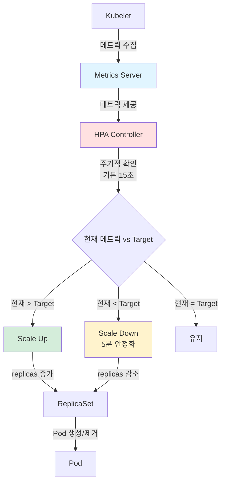
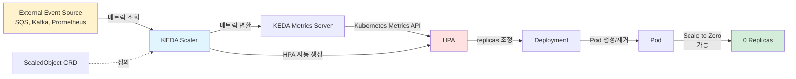
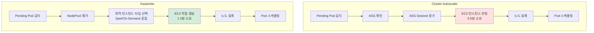
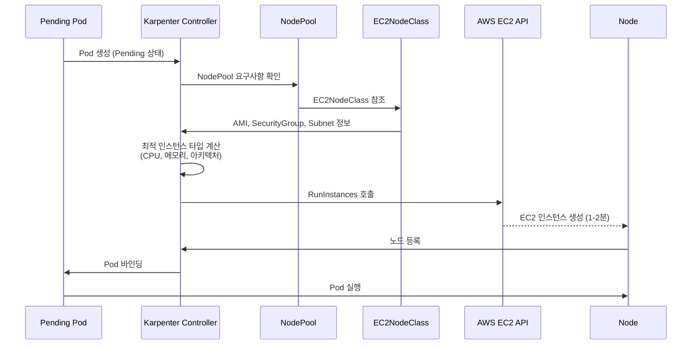
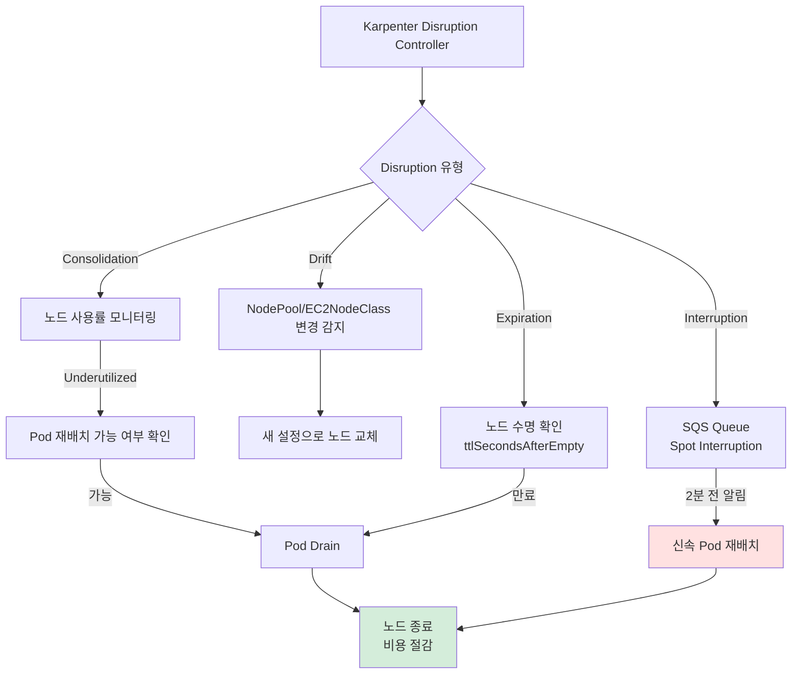
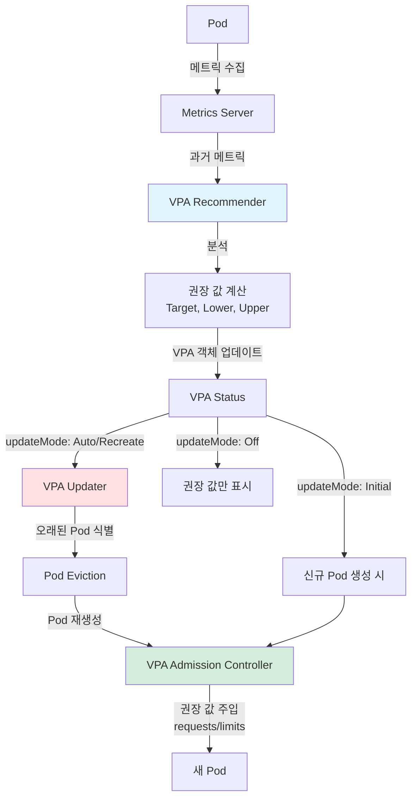
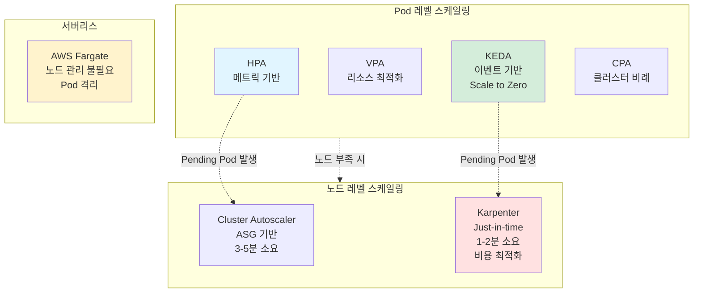

## 들어가며

Week 3에서는 **Amazon EKS 환경에서의 다양한 Auto Scaling 메커니즘**을 학습합니다.

Week 1에서 EKS 클러스터 배포와 기본 구성을 익히고, Week 2에서 네트워킹을 이해했다면, 이번 주차에서는 **워크로드 변화에 따른 자동 확장/축소**를 통해 비용 최적화와 성능을 동시에 달성하는 방법을 배웁니다.

### 학습 목표

- **Pod 레벨 스케일링**: HPA, VPA, KEDA, CPA
- **노드 레벨 스케일링**: Cluster Autoscaler, Karpenter
- **서버리스 컴퓨팅**: AWS Fargate
- 각 스케일링 메커니즘의 동작 원리 및 적용 시나리오 이해
- 실전 환경에서의 Auto Scaling 전략 수립

---

## 실습 환경

### 가상머신 및 인프라 구성

| 리소스 | 사양 | 용도 |
|--------|------|------|
| **myeks-bastion-EC2** | t3.medium | 관리 호스트 (kubectl, eksctl, awscli) |
| **EKS Cluster** | myeks | Kubernetes 클러스터 (v1.31) |
| **VPC** | 192.168.0.0/16 | 전용 네트워크 환경 |
| **Public Subnet** | 3개 (각 AZ) | 퍼블릭 리소스 배치 |
| **Private Subnet** | 3개 (각 AZ) | EKS 노드 배치 |
| **NAT Gateway** | 3개 (각 AZ) | 프라이빗 서브넷 인터넷 통신 |

### EKS 노드 그룹

| 노드 그룹 | 인스턴스 타입 | 용량 | 용도 |
|-----------|---------------|------|------|
| **myeks-nodegroup** | t3.medium | 3대 (고정) | 초기 워커 노드 |
| **Karpenter Provisioner** | 다양 (동적) | 필요 시 자동 생성 | Just-in-time 노드 프로비저닝 |

### 네트워크 설정

- **VPC CIDR**: 192.168.0.0/16
- **Pod CIDR**: AWS VPC CNI 사용 (VPC 서브넷 IP 직접 할당)
- **Service CIDR**: 10.100.0.0/16
- **DNS**: CoreDNS (ClusterIP: 10.100.0.10)

### 주요 애드온

| 애드온 | 버전 | 용도 |
|--------|------|------|
| **VPC CNI** | v1.18.x | Pod 네트워킹 (ENI 기반) |
| **kube-proxy** | v1.31.x | Service 네트워킹 (iptables) |
| **CoreDNS** | v1.11.x | 클러스터 DNS |
| **AWS Load Balancer Controller** | v2.x | Ingress/Service LoadBalancer 관리 |
| **Metrics Server** | v0.7.x | 리소스 메트릭 수집 (HPA/VPA 필수) |
| **KEDA** | v2.16.x | 이벤트 기반 스케일링 |
| **Cluster Autoscaler** | v1.31.x | 노드 자동 확장 |
| **Karpenter** | v1.1.x | 고급 노드 프로비저닝 |
| **Vertical Pod Autoscaler** | v1.2.x | Pod 리소스 자동 조정 |

### 컴포넌트 버전

- **Kubernetes**: v1.31
- **eksctl**: v0.x
- **kubectl**: v1.31
- **AWS CLI**: v2.x
- **Helm**: v3.x
- **Terraform**: v1.x

---

## 핵심 개념 정리

### 1. HPA (Horizontal Pod Autoscaler)

**정의**: CPU, 메모리, 커스텀 메트릭 기반으로 Pod 수를 자동 조정

**주요 특징**:
- Metrics Server 필수 (resource metrics)
- Target 메트릭 도달 시 ReplicaSet 조정
- **ScaleUp**: 즉시 실행
- **ScaleDown**: 5분 안정화 후 실행
- 최소/최대 Replica 수 지정 가능

**동작 원리**:
1. Metrics Server가 kubelet으로부터 Pod CPU/메모리 메트릭 수집
2. HPA Controller가 주기적으로 메트릭 확인 (기본 15초)
3. 현재 메트릭 값과 Target 비교
4. Desired Replicas = ceil[현재 Replicas × (현재 메트릭 / Target 메트릭)]
5. Deployment/ReplicaSet의 replicas 필드 업데이트

**설정 예시**:
```yaml
apiVersion: autoscaling/v2
kind: HorizontalPodAutoscaler
metadata:
  name: php-apache
spec:
  scaleTargetRef:
    apiVersion: apps/v1
    kind: Deployment
    name: php-apache
  minReplicas: 1
  maxReplicas: 10
  metrics:
  - type: Resource
    resource:
      name: cpu
      target:
        type: Utilization
        averageUtilization: 50
```

**사용 사례**:
- 웹 애플리케이션 트래픽 변동 대응
- API 서버 부하 분산
- 배치 작업 동적 병렬 처리

### 2. VPA (Vertical Pod Autoscaler)

**정의**: Pod의 CPU/메모리 requests/limits를 자동으로 조정

**주요 컴포넌트**:
- **Recommender**: 과거 메트릭 분석, 권장 값 계산
- **Updater**: 오래된 Pod 제거 (재생성 트리거)
- **Admission Controller**: 새 Pod 생성 시 권장 값 주입

**Update Mode**:
- `Off`: 권장 값만 계산 (적용 안 함)
- `Initial`: Pod 생성 시에만 적용
- `Recreate`: 실시간 조정 (Pod 재시작)
- `Auto`: Recreate와 동일

**설정 예시**:
```yaml
apiVersion: autoscaling.k8s.io/v1
kind: VerticalPodAutoscaler
metadata:
  name: hamster-vpa
spec:
  targetRef:
    apiVersion: apps/v1
    kind: Deployment
    name: hamster
  updatePolicy:
    updateMode: "Auto"
  resourcePolicy:
    containerPolicies:
    - containerName: hamster
      minAllowed:
        cpu: 100m
        memory: 50Mi
      maxAllowed:
        cpu: 1
        memory: 500Mi
```

**주의 사항**:
- HPA와 동일 리소스 메트릭 대상 시 충돌 (함께 사용 지양)
- Pod 재시작 발생 (Recreate/Auto 모드)
- StatefulSet 지원 제한적

### 3. KEDA (Kubernetes Event-driven Autoscaling)

**정의**: 외부 이벤트 소스 메트릭 기반 Pod 스케일링 (0 → N, N → 0 지원)

**주요 컴포넌트**:
- **Metrics Server**: 외부 메트릭을 Kubernetes Metrics API로 변환
- **Controller**: ScaledObject/ScaledJob CRD 관리
- **Admission Webhooks**: 리소스 검증

**지원 Scaler (60+ 종류)**:
- AWS SQS, CloudWatch, Kinesis
- Kafka, RabbitMQ, Redis
- Prometheus, Datadog
- Cron (시간 기반)
- MySQL, PostgreSQL

**설정 예시** (SQS):
```yaml
apiVersion: keda.sh/v1alpha1
kind: ScaledObject
metadata:
  name: aws-sqs-queue-scaledobject
spec:
  scaleTargetRef:
    name: keda-aws-sqs-queue-deployment
  minReplicaCount: 0
  maxReplicaCount: 10
  triggers:
  - type: aws-sqs-queue
    metadata:
      queueURL: https://sqs.ap-northeast-2.amazonaws.com/123456789/keda-test
      queueLength: "5"
      awsRegion: "ap-northeast-2"
      identityOwner: operator
```

**차별점**:
- **Scale to Zero 지원**: 이벤트 없을 시 Pod 완전 제거
- 외부 이벤트 소스 직접 통합
- HPA와 함께 동작 (HPA를 자동 생성/관리)

### 4. CPA (Cluster Proportional Autoscaler)

**정의**: 클러스터 크기(노드/코어 수)에 비례하여 Deployment/ReplicaSet Replica 수 조정

**사용 사례**:
- CoreDNS Pod 수 조정 (노드 증가 시 DNS 쿼리 증가 대응)
- 로깅/모니터링 에이전트 (노드당 일정 비율 유지)

**설정 모드**:
- **Linear**: `replicas = max(ceil(cores × coresPerReplica), ceil(nodes × nodesPerReplica), min)`
- **Ladder**: 구간별 고정 Replica 수 지정

### 5. Cluster Autoscaler (CAS)

**정의**: AWS Auto Scaling Group과 연동하여 노드 수 자동 조정

**주요 동작**:
- **Scale Up**: Pending Pod 발생 시 노드 추가 (약 3~5분 소요)
- **Scale Down**: 노드 사용률 낮을 시 제거 (10분 안정화 후)

**필수 설정**:
- Auto Scaling Group 태그: `k8s.io/cluster-autoscaler/enabled`, `k8s.io/cluster-autoscaler/myeks`
- IAM 권한: `autoscaling:DescribeAutoScalingGroups`, `autoscaling:SetDesiredCapacity`, `ec2:DescribeInstanceTypes`

**제약 사항**:
- 노드 추가 시간 지연 (EC2 인스턴스 부팅)
- 단일 노드 그룹 환경에서 비효율적
- Spot Instance 관리 제한적

### 6. Karpenter

**정의**: AWS 네이티브 Kubernetes 노드 오토스케일러, Just-in-time 노드 프로비저닝

**핵심 차별점 (vs Cluster Autoscaler)**:
- **속도**: 노드 기동 시간 단축 (사전 준비된 Launch Template 활용)
- **유연성**: Pod 요구사항에 맞춘 최적 인스턴스 타입 자동 선택
- **비용 최적화**: Spot/On-Demand 혼합, 다양한 인스턴스 타입 활용
- **통합 관리**: Auto Scaling Group 불필요, Karpenter가 EC2 직접 관리

**주요 CRD**:
- **NodePool**: 노드 프로비저닝 정책 정의
- **EC2NodeClass**: AWS 인프라 설정 (AMI, UserData, Security Group 등)

**NodePool 예시**:
```yaml
apiVersion: karpenter.sh/v1
kind: NodePool
metadata:
  name: default
spec:
  template:
    spec:
      nodeClassRef:
        group: karpenter.k8s.aws
        kind: EC2NodeClass
        name: default
      requirements:
      - key: karpenter.sh/capacity-type
        operator: In
        values: ["spot", "on-demand"]
      - key: node.kubernetes.io/instance-type
        operator: In
        values: ["t3.medium", "t3.large", "t3a.medium"]
  limits:
    cpu: 1000
    memory: 1000Gi
  disruption:
    consolidationPolicy: WhenEmptyOrUnderutilized
    consolidateAfter: 1m
```

**Disruption 메커니즘**:
- **Consolidation**: 노드 통합으로 비용 절감
- **Drift**: NodePool/EC2NodeClass 변경 시 노드 교체
- **Expiration**: 노드 수명 만료 시 자동 교체
- **Interruption**: Spot Interruption 대응

### 7. AWS Fargate

**정의**: 서버리스 컨테이너 컴퓨팅 엔진, Pod별 격리된 실행 환경 제공

**주요 특징**:
- **노드 관리 불필요**: EC2 인스턴스 없이 Pod 직접 실행
- **보안 격리**: 각 Pod가 독립된 microVM에서 실행
- **자동 스케일링**: Pod 수만큼 컴퓨팅 리소스 자동 할당

**제약 사항**:
- Daemonset 사용 불가
- Privileged Container 지원 안 함
- HostNetwork, HostPort 사용 제한
- EBS 볼륨 미지원 (EFS 사용 가능)
- GPU 미지원

**비용**:
- vCPU 및 메모리 사용량 기준 과금
- 최소 과금 단위: vCPU 0.25, 메모리 0.5GB

---

## Mermaid 다이어그램

### 1. HPA 동작 흐름



### 2. KEDA 아키텍처



### 3. Cluster Autoscaler vs Karpenter



### 4. Karpenter Provisioning 워크플로우



### 5. Karpenter Disruption 메커니즘



### 6. VPA 컴포넌트 상호작용



### 7. EKS Auto Scaling 전체 구조



---

## 주요 실습 절차

### 1. 실습 환경 구축

```bash
# CloudFormation Stack 생성
aws cloudformation deploy \
  --template-file eks-scaling-stack.yaml \
  --stack-name myeks \
  --parameter-overrides KeyName=mykey \
  --capabilities CAPABILITY_NAMED_IAM

# Bastion SSH 접속
BASTION_IP=$(aws cloudformation describe-stacks \
  --stack-name myeks \
  --query "Stacks[0].Outputs[?OutputKey=='BastionPublicIp'].OutputValue" \
  --output text)
ssh -i ~/.ssh/mykey.pem ec2-user@$BASTION_IP

# kubeconfig 설정
aws eks update-kubeconfig --region ap-northeast-2 --name myeks
kubectl get nodes
```

### 2. Metrics Server 설치

```bash
kubectl apply -f https://github.com/kubernetes-sigs/metrics-server/releases/latest/download/components.yaml

# 확인
kubectl get deployment metrics-server -n kube-system
kubectl top nodes
kubectl top pods -A
```

### 3. HPA 실습

```bash
# PHP-Apache 배포
kubectl apply -f https://k8s.io/examples/application/php-apache.yaml

# HPA 생성
kubectl autoscale deployment php-apache --cpu-percent=50 --min=1 --max=10

# 부하 생성
kubectl run -i --tty load-generator --rm --image=busybox:1.28 --restart=Never -- \
  /bin/sh -c "while sleep 0.01; do wget -q -O- http://php-apache; done"

# 모니터링
kubectl get hpa -w
```

### 4. KEDA 설치 및 SQS 스케일링

```bash
# KEDA Helm 설치
helm repo add kedacore https://kedacore.github.io/charts
helm install keda kedacore/keda --namespace keda --create-namespace

# SQS Queue 생성
aws sqs create-queue --queue-name keda-test

# IRSA 생성
eksctl create iamserviceaccount \
  --name keda-operator \
  --namespace keda \
  --cluster myeks \
  --attach-policy-arn arn:aws:iam::aws:policy/AmazonSQSFullAccess \
  --approve \
  --override-existing-serviceaccounts

# ScaledObject 적용
cat <<EOF | kubectl apply -f -
apiVersion: keda.sh/v1alpha1
kind: ScaledObject
metadata:
  name: aws-sqs-queue-scaledobject
spec:
  scaleTargetRef:
    name: keda-deployment
  minReplicaCount: 0
  maxReplicaCount: 10
  triggers:
  - type: aws-sqs-queue
    metadata:
      queueURL: https://sqs.ap-northeast-2.amazonaws.com/123456789/keda-test
      queueLength: "5"
      awsRegion: "ap-northeast-2"
      identityOwner: operator
EOF

# 메시지 전송
for i in {1..100}; do 
  aws sqs send-message \
    --queue-url https://sqs.ap-northeast-2.amazonaws.com/123456789/keda-test \
    --message-body "Hello KEDA $i"
done

# Pod 스케일링 확인
kubectl get pods -w
```

### 5. VPA 설치

```bash
# VPA 설치
git clone https://github.com/kubernetes/autoscaler.git
cd autoscaler/vertical-pod-autoscaler/
./hack/vpa-up.sh

# Hamster 애플리케이션 배포
kubectl apply -f examples/hamster.yaml

# VPA 상태 확인
kubectl get vpa
kubectl describe vpa hamster-vpa

# 권장 값 확인
kubectl get vpa hamster-vpa -o jsonpath='{.status.recommendation.containerRecommendations[0]}'
```

### 6. Karpenter 설치

```bash
# 환경 변수 설정
export KARPENTER_VERSION="1.1.0"
export CLUSTER_NAME="myeks"
export AWS_DEFAULT_REGION="ap-northeast-2"
export AWS_ACCOUNT_ID="$(aws sts get-caller-identity --query Account --output text)"

# CloudFormation으로 IAM Role 생성
curl -fsSL https://raw.githubusercontent.com/aws/karpenter-provider-aws/v${KARPENTER_VERSION}/website/content/en/preview/getting-started/getting-started-with-karpenter/cloudformation.yaml > karpenter-iam.yaml

aws cloudformation deploy \
  --stack-name "Karpenter-${CLUSTER_NAME}" \
  --template-file karpenter-iam.yaml \
  --capabilities CAPABILITY_NAMED_IAM \
  --parameter-overrides "ClusterName=${CLUSTER_NAME}"

# IRSA 생성
eksctl create iamserviceaccount \
  --cluster "${CLUSTER_NAME}" \
  --name karpenter \
  --namespace kube-system \
  --role-name "${CLUSTER_NAME}-karpenter" \
  --attach-policy-arn "arn:aws:iam::${AWS_ACCOUNT_ID}:policy/KarpenterControllerPolicy-${CLUSTER_NAME}" \
  --role-only \
  --approve

# Helm으로 Karpenter 설치
helm upgrade --install karpenter oci://public.ecr.aws/karpenter/karpenter \
  --version "${KARPENTER_VERSION}" \
  --namespace kube-system \
  --create-namespace \
  --set "settings.clusterName=${CLUSTER_NAME}" \
  --set controller.resources.requests.cpu=1 \
  --set controller.resources.requests.memory=1Gi \
  --wait

# EC2NodeClass 생성
cat <<EOF | kubectl apply -f -
apiVersion: karpenter.k8s.aws/v1
kind: EC2NodeClass
metadata:
  name: default
spec:
  amiFamily: AL2023
  role: "KarpenterNodeRole-${CLUSTER_NAME}"
  subnetSelectorTerms:
  - tags:
      karpenter.sh/discovery: "${CLUSTER_NAME}"
  securityGroupSelectorTerms:
  - tags:
      karpenter.sh/discovery: "${CLUSTER_NAME}"
  amiSelectorTerms:
  - alias: al2023@latest
EOF

# NodePool 생성
cat <<EOF | kubectl apply -f -
apiVersion: karpenter.sh/v1
kind: NodePool
metadata:
  name: default
spec:
  template:
    spec:
      nodeClassRef:
        group: karpenter.k8s.aws
        kind: EC2NodeClass
        name: default
      requirements:
      - key: "karpenter.sh/capacity-type"
        operator: In
        values: ["spot", "on-demand"]
      - key: "node.kubernetes.io/instance-type"
        operator: In
        values: ["t3.medium", "t3.large", "t3a.medium"]
  limits:
    cpu: 1000
  disruption:
    consolidationPolicy: WhenEmptyOrUnderutilized
    consolidateAfter: 1m
EOF

# 테스트
kubectl scale deployment inflate --replicas=5
kubectl logs -f -n kube-system -l app.kubernetes.io/name=karpenter
```

### 7. Fargate Profile 생성

```bash
# Fargate Profile 생성
eksctl create fargateprofile \
  --cluster myeks \
  --name fg-1 \
  --namespace default \
  --labels env=fargate

# Fargate Pod 배포
cat <<EOF | kubectl apply -f -
apiVersion: v1
kind: Pod
metadata:
  name: fargate-pod
  labels:
    env: fargate
spec:
  containers:
  - name: nginx
    image: nginx
    resources:
      requests:
        cpu: 500m
        memory: 1Gi
EOF

# Fargate 노드 확인
kubectl get nodes -l eks.amazonaws.com/compute-type=fargate
kubectl get pod fargate-pod -o wide
```

---

## 트러블슈팅

### 1. HPA CPU 메트릭 `<unknown>` 표시

**증상**:
```bash
kubectl get hpa
# TARGETS: <unknown>/50%
```

**원인**:
- Metrics Server 미설치
- Pod의 CPU requests 미설정

**해결**:
```bash
# Metrics Server 설치 확인
kubectl get deployment metrics-server -n kube-system

# Deployment에 CPU requests 추가
kubectl set resources deployment <deployment-name> --requests=cpu=200m
```

### 2. KEDA Scale to Zero 안 됨

**원인**: `minReplicaCount` 설정이 0이 아님

**해결**:
```yaml
spec:
  minReplicaCount: 0  # 0으로 설정
  maxReplicaCount: 10
```

### 3. Cluster Autoscaler 노드 추가 안 됨

**원인**:
- Auto Scaling Group 태그 누락
- IAM 권한 부족
- ASG Max Capacity 초과

**해결**:
```bash
# ASG 태그 확인
aws autoscaling describe-auto-scaling-groups \
  --auto-scaling-group-names <asg-name> \
  --query "AutoScalingGroups[0].Tags"

# Cluster Autoscaler 로그 확인
kubectl logs -f -n kube-system deployment/cluster-autoscaler
```

### 4. Karpenter 노드 프로비저닝 실패

**원인**:
- IAM 권한 부족
- Subnet/SecurityGroup 태그 누락
- Instance Profile 미연결

**해결**:
```bash
# Subnet 태그 확인
aws ec2 describe-subnets \
  --filters "Name=tag:karpenter.sh/discovery,Values=myeks" \
  --query "Subnets[*].[SubnetId, Tags]"

# EC2NodeClass 확인
kubectl get ec2nodeclass default -o yaml
```

### 5. Fargate Pod Pending 상태

**원인**:
- Fargate Profile Selector 불일치
- Subnet 가용 IP 부족

**해결**:
```bash
# Fargate Profile 확인
eksctl get fargateprofile --cluster myeks

# Pod Label 확인 및 수정
kubectl label pod fargate-pod env=fargate

# Pod Events 확인
kubectl describe pod fargate-pod
```

---

## 참고 자료

### 공식 문서
- [Amazon EKS User Guide](https://docs.aws.amazon.com/eks/)
- [Kubernetes HPA](https://kubernetes.io/docs/tasks/run-application/horizontal-pod-autoscale/)
- [Kubernetes VPA](https://github.com/kubernetes/autoscaler/tree/master/vertical-pod-autoscaler)
- [KEDA Documentation](https://keda.sh/)
- [Karpenter Documentation](https://karpenter.sh/)
- [AWS Fargate](https://docs.aws.amazon.com/eks/latest/userguide/fargate.html)

### GitHub
- [Cluster Autoscaler](https://github.com/kubernetes/autoscaler/tree/master/cluster-autoscaler)
- [Karpenter](https://github.com/aws/karpenter-provider-aws)
- [KEDA](https://github.com/kedacore/keda)
- [Metrics Server](https://github.com/kubernetes-sigs/metrics-server)
- [AWS Load Balancer Controller](https://github.com/kubernetes-sigs/aws-load-balancer-controller)

### 관련 블로그
- [Karpenter vs Cluster Autoscaler](https://aws.amazon.com/blogs/containers/karpenter-vs-cluster-autoscaler/)
- [EKS Best Practices](https://aws.github.io/aws-eks-best-practices/)

---

**최종 업데이트**: 2026-03-25  
**작업자**: Claude (Sonnet 4.5)
