## 들어가며

Week 4에서는 **Amazon EKS 환경에서의 Identity and Access Management**를 학습합니다.

Week 1에서 EKS 클러스터 배포, Week 2에서 네트워킹, Week 3에서 Auto Scaling을 익혔다면, 이번 주차에서는 **"누가(Authentication) 무엇을(Authorization) 할 수 있는가"**를 제어하는 보안의 핵심을 배웁니다.

### 학습 목표

- **Authentication (인증)**: K8S API 접근 주체 확인
- **Authorization (인가)**: RBAC 기반 권한 관리
- **Admission Control**: 요청 검증 및 변경
- **IRSA (IAM Roles for Service Accounts)**: Pod에 AWS 권한 부여
- **EKS Pod Identity**: 차세대 Pod 인증 메커니즘
- **OIDC (OpenID Connect)**: 외부 IdP 연동
- **OAuth 2.0**: 위임 인증 프로토콜 이해

---

## 실습 환경

### 가상머신 및 인프라 구성

| 리소스 | 사양 | 용도 |
|--------|------|------|
| **myeks-bastion-EC2** | t3.medium | 관리 호스트 (kubectl, eksctl, awscli) |
| **EKS Cluster** | myeks | Kubernetes 클러스터 (v1.31) |
| **VPC** | 192.168.0.0/16 | 전용 네트워크 환경 |
| **OIDC Provider** | - | EKS ↔ AWS IAM Trust Relationship |

### EKS 노드 그룹

| 노드 그룹 | 인스턴스 타입 | 용량 | IAM Role |
|-----------|---------------|------|----------|
| **myeks-nodegroup** | t3.medium | 3대 | Node IAM Role (EC2 Instance Profile) |

### 네트워크 설정

- **VPC CIDR**: 192.168.0.0/16
- **Service CIDR**: 10.100.0.0/16
- **DNS**: CoreDNS (ClusterIP: 10.100.0.10)

### 컴포넌트 버전

- **Kubernetes**: v1.31
- **AWS CLI**: v2.x
- **kubectl**: v1.31
- **eksctl**: v0.x

---

## 핵심 개념 정리

### 1. K8S Identity and Access Management 개요

Kubernetes는 **3단계 접근 제어**를 거칩니다:

1. **Authentication (인증)**: "너는 누구냐?" → 신원 확인
2. **Authorization (인가)**: "너는 무엇을 할 수 있냐?" → 권한 확인
3. **Admission Control**: "이 요청이 유효한가?" → 검증 및 변경

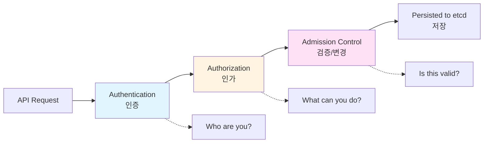

#### Authentication Methods (인증 방법)

| 방법 | 주체 | EKS 사용 | 설명 |
|------|------|----------|------|
| **X.509 Client Certificates** | User, Node | ✅ | kubelet 인증 (Node Authorizer) |
| **Service Account Tokens** | Pod | ✅ | Pod 내부 애플리케이션 인증 (JWT) |
| **Bootstrap Tokens** | Node | ❌ | kubeadm 전용 |
| **Static Token File** | User | ❌ | 비권장 (보안 취약) |
| **OIDC Tokens** | User | ✅ | 외부 IdP 연동 (Google, Keycloak 등) |
| **Webhook Token Authentication** | User | ✅ | **AWS IAM Authenticator** (EKS 기본) |

#### Authorization Methods (인가 방법)

| 방법 | EKS 기본 설정 | 설명 |
|------|---------------|------|
| **Node Authorization** | ✅ Enabled | kubelet 전용 (system:node:xxx) |
| **RBAC** | ✅ Enabled | Role-Based Access Control |
| **ABAC** | ❌ Disabled | Attribute-Based (레거시) |
| **Webhook** | ❌ Disabled | 외부 인가 서버 연동 |

---

### 2. EKS 인증 메커니즘

#### 2.1. AWS IAM Authenticator

**정의**: EKS에서 **AWS IAM → K8S User/Group 매핑**을 담당하는 인증 메커니즘

**동작 흐름**:

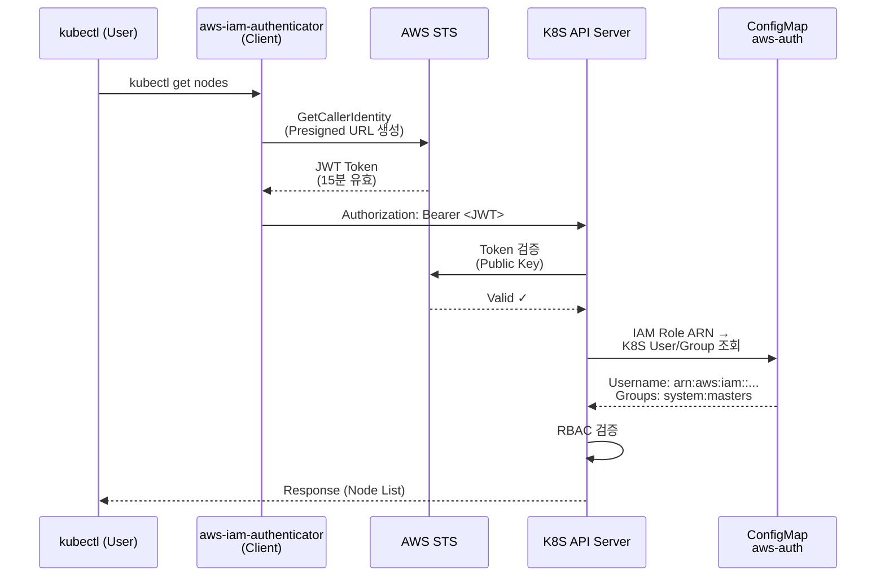

**핵심 포인트**:
- **Client-side**: `aws-iam-authenticator` (kubectl 플러그인)
- **Server-side**: `aws-iam-authenticator server` (Webhook)
- **Token 형식**: JWT (JSON Web Token), Presigned STS GetCallerIdentity URL
- **유효 기간**: 15분 (Refresh Token 없음)
- **ConfigMap**: `kube-system/aws-auth` (IAM → K8S 매핑)

**aws-auth ConfigMap 예시**:
```yaml
apiVersion: v1
kind: ConfigMap
metadata:
  name: aws-auth
  namespace: kube-system
data:
  mapRoles: |
    - rolearn: arn:aws:iam::123456789012:role/myeks-managed-node-groups
      username: system:node:{{EC2PrivateDNSName}}
      groups:
        - system:bootstrappers
        - system:nodes
  mapUsers: |
    - userarn: arn:aws:iam::123456789012:user/admin
      username: admin
      groups:
        - system:masters
```

#### 2.2. OIDC (OpenID Connect) Provider

**정의**: **OAuth 2.0 기반**의 인증 레이어, ID Token을 통해 사용자 신원 확인

**EKS OIDC Provider 역할**:
- **IRSA (IAM Roles for Service Accounts) 활성화**
- Pod의 ServiceAccount → AWS IAM Role Trust Relationship
- **Web Identity 토큰** 교환 메커니즘

**OIDC Provider 등록**:
```bash
# EKS 클러스터 생성 시 자동 생성
eksctl utils associate-iam-oidc-provider --cluster myeks --approve

# 확인
aws iam list-open-id-connect-providers
# https://oidc.eks.ap-northeast-2.amazonaws.com/id/EXAMPLED539D4633E53DE1B716D3041E
```

**OIDC Discovery 문서**:
```bash
curl https://oidc.eks.ap-northeast-2.amazonaws.com/id/EXAMPLED539D4633E53DE1B716D3041E/.well-known/openid-configuration
```

**OIDC Core Components**:
- **End User**: OAuth 2.0의 Resource Owner (최종 사용자)
- **Relying Party (RP)**: 신뢰 당사자 (애플리케이션, Client)
- **OpenID Provider (OP)**: 사용자 인증 주체 (Keycloak, Google 등)

#### 2.3. Service Account

**정의**: Pod 내부 애플리케이션이 K8S API Server에 접근할 때 사용하는 **Non-human Account**

**자동 생성**:
- 모든 Namespace에 `default` ServiceAccount 자동 생성
- Pod에 명시하지 않으면 `default` SA 사용

**Token 자동 마운트**:
```yaml
apiVersion: v1
kind: Pod
metadata:
  name: nginx
spec:
  serviceAccountName: dev-k8s
  containers:
  - name: nginx
    image: nginx
    volumeMounts:
    - name: kube-api-access
      mountPath: /var/run/secrets/kubernetes.io/serviceaccount
      readOnly: true
  volumes:
  - name: kube-api-access
    projected:
      sources:
      - serviceAccountToken:
          path: token
          expirationSeconds: 3607
      - configMap:
          name: kube-root-ca.crt
          items:
          - key: ca.crt
            path: ca.crt
      - downwardAPI:
          items:
          - path: namespace
            fieldRef:
              fieldPath: metadata.namespace
```

**Projected Volume 구조**:
```
/var/run/secrets/kubernetes.io/serviceaccount/
├── token          # JWT (Bound Service Account Token, 1시간 TTL)
├── ca.crt         # K8S API Server CA 인증서
└── namespace      # Pod가 속한 Namespace
```

**Bound Service Account Token (BSAT)**:
- **Kubernetes v1.22+** 기본 활성화
- **Audience**: `vault-token` (검증용)
- **Expiration**: 기본 3607초 (약 1시간)
- **Pod 삭제 시 자동 무효화** (보안 강화)

---

### 3. IRSA (IAM Roles for Service Accounts)

**정의**: **Pod(ServiceAccount)**에 **AWS IAM Role** 권한을 부여하는 메커니즘

**기존 방식 문제점**:
- Node IAM Role 공유 → 모든 Pod가 동일한 AWS 권한 (과도한 권한)
- 세밀한 권한 제어 불가

**IRSA 장점**:
- **Pod별 최소 권한 부여** (Least Privilege)
- **임시 자격 증명** 사용 (AWS STS AssumeRoleWithWebIdentity)
- **자격 증명 노출 방지** (하드코딩 불필요)

#### IRSA vs EKS Pod Identity 비교

| 항목 | IRSA (기존) | EKS Pod Identity (신규) |
|------|-------------|------------------------|
| **신뢰 엔터티** | OIDC 기반 (ID 파라미터 포함) | EKS 전용 Trust Policy (깔끔) |
| **성능 부하** | 높음 (OIDC 검증) | 낮음 (EKS 플러그인 통합) |
| **SDK 지원** | 대부분 SDK 필요 | 최신 버전 SDK 필요 |
| **복잡성** | 중간 (Annotation 필요) | 낮음 (단순) |

#### IRSA 동작 흐름

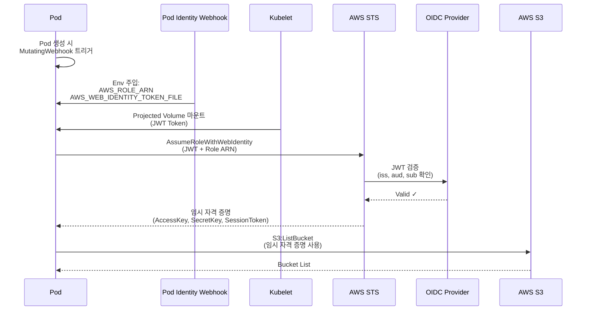

#### IRSA 구성 단계

**1. OIDC Provider 등록**:
```bash
eksctl utils associate-iam-oidc-provider --cluster myeks --approve
```

**2. IAM Role 생성 (Trust Policy)**:
```json
{
  "Version": "2012-10-17",
  "Statement": [
    {
      "Effect": "Allow",
      "Principal": {
        "Federated": "arn:aws:iam::123456789012:oidc-provider/oidc.eks.ap-northeast-2.amazonaws.com/id/EXAMPLED539D4633E53DE1B716D3041E"
      },
      "Action": "sts:AssumeRoleWithWebIdentity",
      "Condition": {
        "StringEquals": {
          "oidc.eks.ap-northeast-2.amazonaws.com/id/EXAMPLED539D4633E53DE1B716D3041E:sub": "system:serviceaccount:dev-team:dev-k8s",
          "oidc.eks.ap-northeast-2.amazonaws.com/id/EXAMPLED539D4633E53DE1B716D3041E:aud": "sts.amazonaws.com"
        }
      }
    }
  ]
}
```

**3. ServiceAccount Annotation**:
```yaml
apiVersion: v1
kind: ServiceAccount
metadata:
  name: dev-k8s
  namespace: dev-team
  annotations:
    eks.amazonaws.com/role-arn: arn:aws:iam::123456789012:role/dev-k8s-s3-read
```

**4. Pod에서 사용**:
```yaml
apiVersion: v1
kind: Pod
metadata:
  name: aws-cli
  namespace: dev-team
spec:
  serviceAccountName: dev-k8s
  containers:
  - name: aws-cli
    image: amazon/aws-cli
    command: ["sleep", "3600"]
```

**5. 확인**:
```bash
kubectl exec -it aws-cli -n dev-team -- aws s3 ls
# 2024-01-01 12:00:00 my-bucket
```

#### IRSA 주의사항

❌ **IRSA가 동작하지 않는 경우**:
- OIDC Provider 미등록
- Trust Policy의 `sub` 조건 불일치 (Namespace/SA 이름 확인)
- IAM Role ARN Annotation 누락
- Pod에 `serviceAccountName` 미지정

⚠️ **성능 이슈**:
- IRSA는 **매 API 호출마다 Token Refresh** 가능 → 과도한 STS 호출
- **해결책**: boto3 Session 재사용, Credential Caching

---

### 4. Authorization (RBAC)

**정의**: **Role-Based Access Control**, K8S 리소스에 대한 권한을 Role/RoleBinding으로 관리

#### RBAC 구성 요소

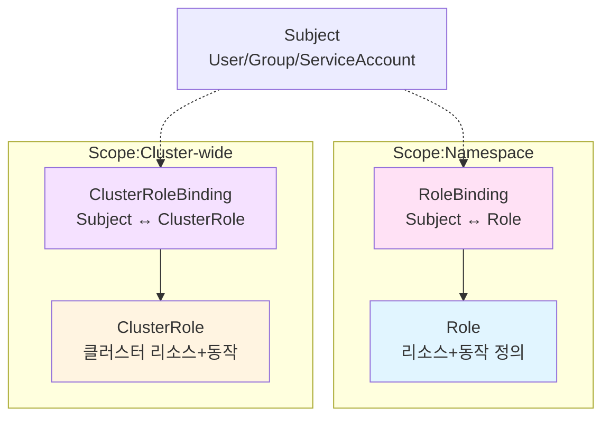

#### Role vs ClusterRole

| 항목 | Role | ClusterRole |
|------|------|-------------|
| **Scope** | Namespace | Cluster-wide |
| **대상 리소스** | Namespaced 리소스 (Pod, Deployment 등) | 모든 리소스 + Cluster 리소스 (Node, PV 등) |
| **Binding** | RoleBinding | ClusterRoleBinding (전체) / RoleBinding (특정 NS) |

#### RBAC 예시

**Role 생성**:
```yaml
apiVersion: rbac.authorization.k8s.io/v1
kind: Role
metadata:
  namespace: dev-team
  name: pod-viewer
rules:
- apiGroups: [""]
  resources: ["pods"]
  verbs: ["get", "list", "watch"]
```

**RoleBinding 생성**:
```yaml
apiVersion: rbac.authorization.k8s.io/v1
kind: RoleBinding
metadata:
  name: pod-viewer-binding
  namespace: dev-team
subjects:
- kind: ServiceAccount
  name: dev-k8s
  namespace: dev-team
roleRef:
  kind: Role
  name: pod-viewer
  apiGroup: rbac.authorization.k8s.io
```

**권한 확인**:
```bash
kubectl auth can-i get pods --as=system:serviceaccount:dev-team:dev-k8s -n dev-team
# yes

kubectl auth can-i delete pods --as=system:serviceaccount:dev-team:dev-k8s -n dev-team
# no
```

#### 표준 ClusterRole

| ClusterRole | 권한 범위 |
|-------------|----------|
| **view** | 대부분 리소스 읽기 (Secret/Role/RoleBinding 제외) |
| **edit** | 대부분 리소스 읽기/쓰기 (Role/RoleBinding 제외) |
| **admin** | Namespace 내 모든 리소스 (Role/RoleBinding 포함) |
| **cluster-admin** | 클러스터 전체 슈퍼유저 권한 |

---

### 5. Admission Control

**정의**: API 요청이 **etcd에 저장되기 전** 검증(Validate) 및 변경(Mutate)

#### Admission Controller 종류

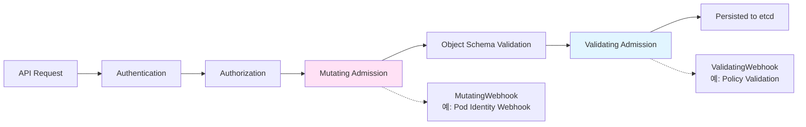

**주요 Admission Controllers**:
- **MutatingAdmissionWebhook**: 요청 변경 (Pod Env 주입 등)
- **ValidatingAdmissionWebhook**: 요청 검증 (Policy 위반 차단)
- **PodSecurityAdmission**: Pod 보안 정책 강제
- **ResourceQuota**: Namespace 리소스 쿼터 강제
- **LimitRanger**: Container 리소스 기본값/한도 설정

**IRSA MutatingWebhook 예시**:
```bash
kubectl get mutatingwebhookconfigurations pod-identity-webhook -o yaml
```

---

### 6. OAuth 2.0 & OIDC 이론

#### OAuth 2.0 개요

**정의**: **위임 인증(Delegated Authorization)** 프로토콜

**핵심 개념**:
- **인증 ≠ 인가**: OAuth 2.0은 **인가(Authorization)** 프로토콜
- **권한 위임**: 사용자가 직접 자격 증명을 주지 않고, 제한된 권한 부여

**OAuth 2.0 Role**:

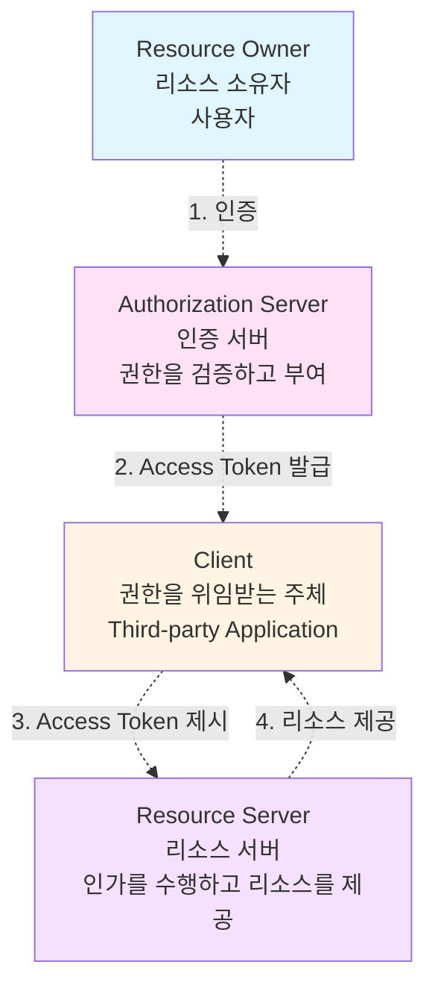

#### OAuth 2.0 Authorization Code Flow

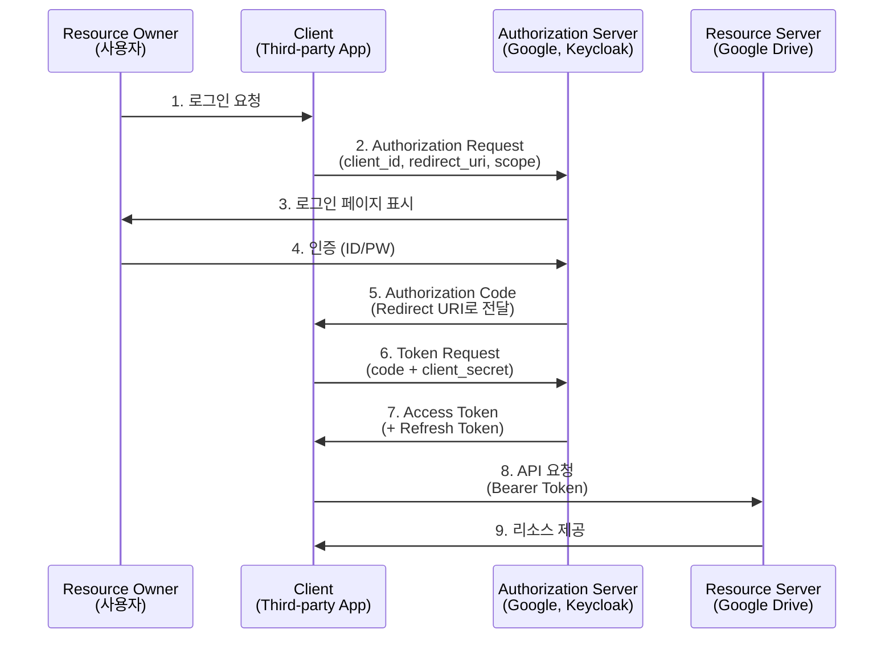

#### OIDC (OpenID Connect)

**정의**: **OAuth 2.0 위에 구축된 인증 레이어**, **ID Token (JWT)** 추가

**OAuth 2.0 vs OIDC**:
- **OAuth 2.0**: "이 사용자가 접근 권한을 줬어?" (인가)
- **OIDC**: "이 사용자가 누구야?" (인증)

**OIDC 추가 요소**:
- **ID Token**: JWT 형식, 사용자 신원 정보 포함 (sub, email, name 등)
- **UserInfo Endpoint**: 추가 사용자 정보 조회
- **scope=openid**: OIDC 활성화 필수

**OIDC Authorization Code Flow**:
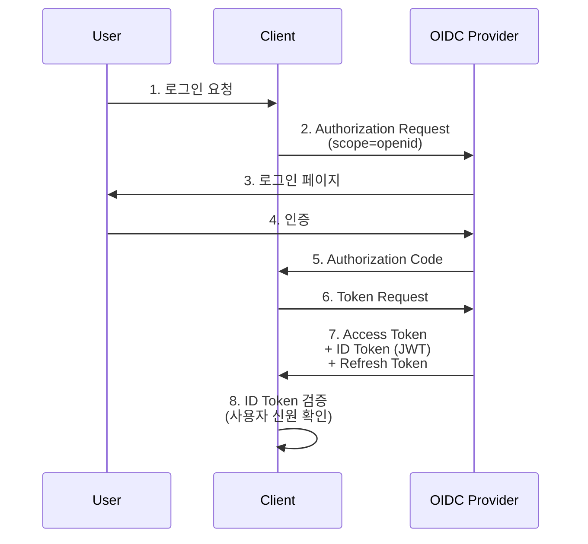

---

### 7. JWT (JSON Web Token)

**정의**: **Base64 URL-safe** 인코딩된 JSON, **서명(Signature)**을 통해 무결성 보장

**JWT 구조**:

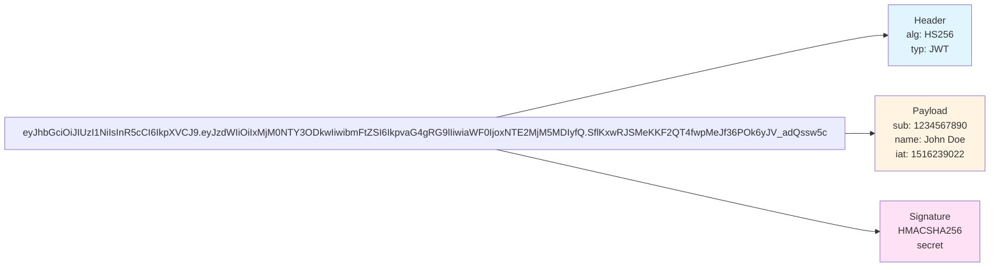

**JWT 검증 흐름**:
1. Header + Payload를 Base64 디코딩
2. 서버의 Secret Key (또는 Public Key)로 Signature 검증
3. `exp` (만료 시간) 확인
4. `aud` (대상), `iss` (발급자) 확인

**X.509 Certificate vs JWT**:

| 항목 | X.509 | JWT |
|------|-------|-----|
| 형식 | binary (DER) / PEM | Base64 URL-safe JSON |
| 서명 | CA Private Key | HMAC (대칭) / RSA (비대칭) |
| 검증 | CA Public Key | Secret Key / Public Key |
| 유효 기간 | 1년~10년 | 수분~수시간 |
| 용도 | TLS, kubelet 인증 | API 인증, OIDC ID Token |

---

## Mermaid 다이어그램 모음

### 1. K8S API 접근 제어 흐름

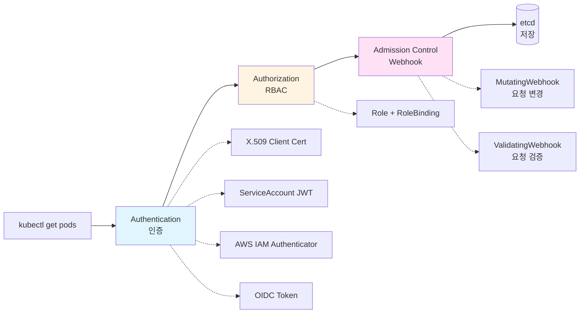

### 2. IRSA (IAM Roles for Service Accounts) 전체 흐름

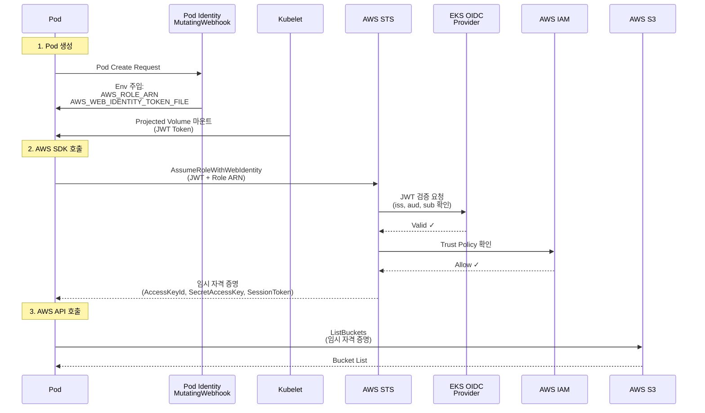

### 3. EKS kubectl 인증 흐름 (AWS IAM Authenticator)

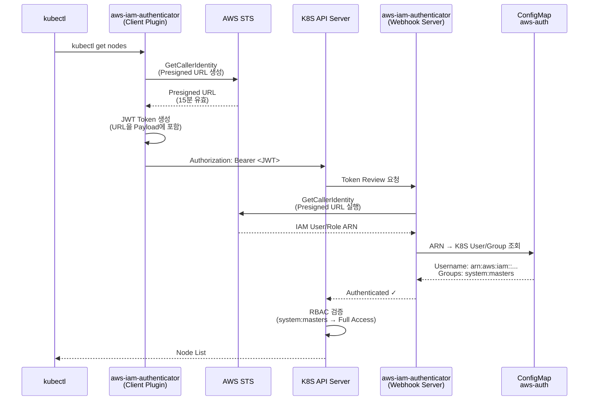

### 4. Namespace별 ServiceAccount 분리 실습

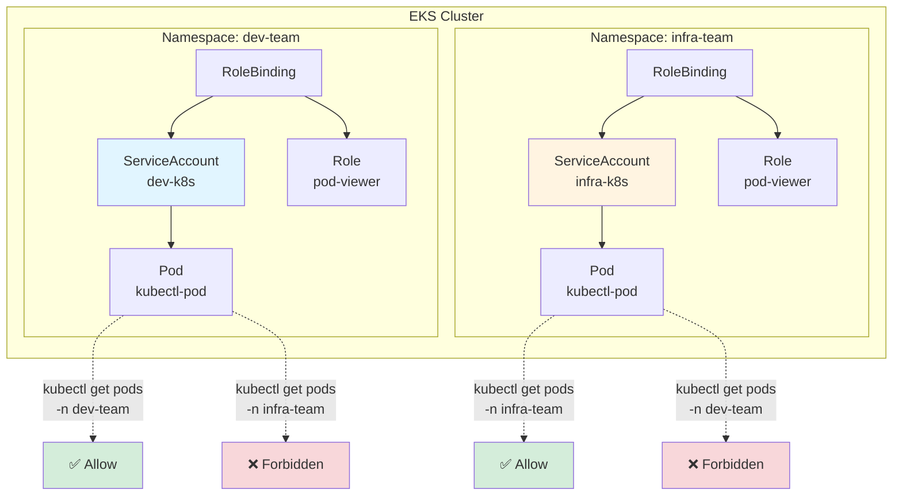

### 5. Bearer Token (JWT) 동작 원리

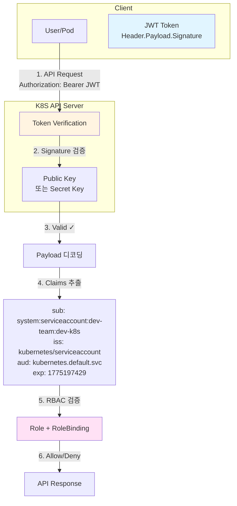

### 6. OIDC Authorization Code Flow (상세)

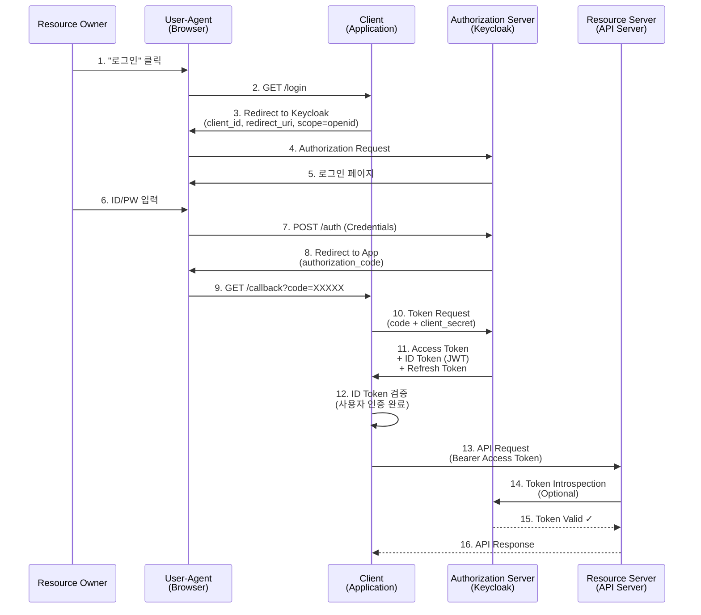

### 7. OAuth 2.0 vs OIDC vs IRSA 비교

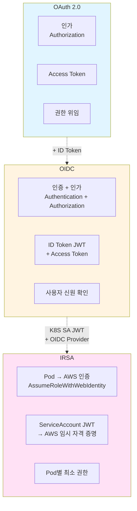

---

## 실습 내용 요약

### 실습 1: Namespace별 ServiceAccount 분리

**목표**: 각 팀이 자신의 Namespace만 접근하도록 RBAC 설정

```bash
# Namespace 생성
kubectl create namespace dev-team
kubectl create namespace infra-team

# ServiceAccount 생성
kubectl create sa dev-k8s -n dev-team
kubectl create sa infra-k8s -n infra-team

# Role 생성 (pod-viewer)
cat <<EOF | kubectl apply -f -
apiVersion: rbac.authorization.k8s.io/v1
kind: Role
metadata:
  namespace: dev-team
  name: pod-viewer
rules:
- apiGroups: [""]
  resources: ["pods"]
  verbs: ["get", "list", "watch"]
EOF

# RoleBinding 생성
kubectl create rolebinding pod-viewer-binding \
  --role=pod-viewer \
  --serviceaccount=dev-team:dev-k8s \
  -n dev-team

# 테스트 Pod 생성
kubectl run kubectl-pod \
  --image=bitnami/kubectl \
  --serviceaccount=dev-k8s \
  -n dev-team \
  -- sleep 3600

# 권한 확인
kubectl exec -it kubectl-pod -n dev-team -- kubectl get pods -n dev-team
# ✅ Allow

kubectl exec -it kubectl-pod -n dev-team -- kubectl get pods -n infra-team
# ❌ Error: Forbidden (User cannot list pods in namespace "infra-team")
```

### 실습 2: IRSA 설정

**목표**: Pod에 S3 ReadOnly 권한 부여

```bash
# 1. OIDC Provider 등록
eksctl utils associate-iam-oidc-provider --cluster myeks --approve

# 2. IAM Policy 생성
aws iam create-policy \
  --policy-name AmazonS3ReadOnlyAccess \
  --policy-document '{
    "Version": "2012-10-17",
    "Statement": [
      {
        "Effect": "Allow",
        "Action": ["s3:GetObject", "s3:ListBucket"],
        "Resource": "*"
      }
    ]
  }'

# 3. ServiceAccount + IAM Role 생성 (eksctl 자동화)
eksctl create iamserviceaccount \
  --name dev-k8s \
  --namespace dev-team \
  --cluster myeks \
  --attach-policy-arn arn:aws:iam::123456789012:policy/AmazonS3ReadOnlyAccess \
  --approve

# 4. Pod 생성
cat <<EOF | kubectl apply -f -
apiVersion: v1
kind: Pod
metadata:
  name: aws-cli
  namespace: dev-team
spec:
  serviceAccountName: dev-k8s
  containers:
  - name: aws-cli
    image: amazon/aws-cli
    command: ["sleep", "3600"]
EOF

# 5. 확인
kubectl exec -it aws-cli -n dev-team -- aws s3 ls
# 2024-01-01 12:00:00 my-bucket
```

### 실습 3: ConfigMap vs EKS API (인증/인가 비교)

**목표**: `aws-auth` ConfigMap과 EKS API의 차이 이해

| 항목 | ConfigMap (aws-auth) | EKS API (Cluster Access Entry) |
|------|----------------------|-------------------------------|
| **관리 방법** | kubectl edit | AWS Console/CLI |
| **사용자 타입** | IAM User/Role | IAM Principal |
| **권한 부여** | K8S RBAC (mapRoles/mapUsers) | EKS Access Policy |
| **에러 처리** | YAML 문법 오류 시 전체 실패 | 개별 Entry 관리 |

**ConfigMap 방식**:
```yaml
apiVersion: v1
kind: ConfigMap
metadata:
  name: aws-auth
  namespace: kube-system
data:
  mapUsers: |
    - userarn: arn:aws:iam::123456789012:user/admin
      username: admin
      groups:
        - system:masters
```

**EKS API 방식**:
```bash
# Access Entry 생성
aws eks create-access-entry \
  --cluster-name myeks \
  --principal-arn arn:aws:iam::123456789012:user/admin \
  --type STANDARD

# Access Policy 연결
aws eks associate-access-policy \
  --cluster-name myeks \
  --principal-arn arn:aws:iam::123456789012:user/admin \
  --policy-arn arn:aws:eks::aws:cluster-access-policy/AmazonEKSClusterAdminPolicy \
  --access-scope type=cluster
```

### 실습 4: OIDC Identity Provider (Keycloak 연동)

**목표**: Keycloak을 통해 사용자 인증

```bash
# Keycloak Helm 설치
helm install keycloak bitnami/keycloak \
  --set auth.adminUser=admin \
  --set auth.adminPassword=password

# OIDC Issuer URL 확인
kubectl get svc keycloak -o jsonpath='{.status.loadBalancer.ingress[0].hostname}'
# http://a1b2c3d4.ap-northeast-2.elb.amazonaws.com

# EKS API Server에 OIDC 설정 (eksctl)
eksctl utils associate-oidc-provider \
  --cluster myeks \
  --issuer-url http://a1b2c3d4.ap-northeast-2.elb.amazonaws.com/realms/master \
  --approve

# kubeconfig에 OIDC 설정
kubectl config set-credentials oidc-user \
  --exec-command=kubectl \
  --exec-api-version=client.authentication.k8s.io/v1beta1 \
  --exec-arg=oidc-login \
  --exec-arg=get-token \
  --exec-arg=--oidc-issuer-url=http://a1b2c3d4.ap-northeast-2.elb.amazonaws.com/realms/master \
  --exec-arg=--oidc-client-id=kubernetes \
  --exec-arg=--oidc-client-secret=xxxxxxxx
```

---

## 핵심 개념 비교표

### Authentication Method 비교

| 방법 | 주체 | Token 형식 | 유효 기간 | EKS 사용 | 용도 |
|------|------|------------|-----------|----------|------|
| X.509 Client Cert | User, Node | PEM/DER | 1년 | ✅ | kubelet 인증 (Node Authorizer) |
| ServiceAccount JWT | Pod | JWT (Projected Volume) | 1시간 (기본) | ✅ | Pod 내 애플리케이션 → K8S API |
| AWS IAM Authenticator | User | JWT (Presigned STS URL) | 15분 | ✅ | kubectl → K8S API (EKS 기본) |
| OIDC Token | User | JWT (ID Token) | IdP 설정 | ✅ | 외부 IdP (Google, Keycloak) 연동 |
| Bootstrap Token | Node | secret.token | 24시간 | ❌ | kubeadm 전용 (TLS Bootstrap) |
| Static Token File | User | Plain Text | 무제한 | ❌ | 비권장 (보안 취약) |

### IRSA vs EKS Pod Identity 비교

| 항목 | IRSA | EKS Pod Identity |
|------|------|------------------|
| 출시 시기 | 2019년 | 2023년 |
| 신뢰 메커니즘 | OIDC Provider (Web Identity) | EKS 전용 Trust Policy |
| Trust Policy 복잡도 | 높음 (OIDC Endpoint ID 포함) | 낮음 (깔끔) |
| 성능 | 중간 (OIDC 검증 오버헤드) | 높음 (EKS 네이티브) |
| SDK 요구 사항 | 대부분 SDK 지원 | 최신 SDK 필요 (2023+) |
| Annotation | `eks.amazonaws.com/role-arn` | 불필요 (EKS Console 설정) |
| 호환성 | 모든 K8S 클러스터 (OIDC 지원 시) | EKS 전용 |
| 권장 환경 | 기존 클러스터, 멀티 클러스터 | 신규 EKS 클러스터 |

### OAuth 2.0 Grant Type 비교

| Grant Type | 용도 | Client Secret 필요 | Refresh Token | EKS/OIDC 사용 |
|------------|------|---------------------|---------------|---------------|
| Authorization Code | Server-side Web App | ✅ | ✅ | ✅ (OIDC 기본) |
| Implicit | SPA (레거시) | ❌ | ❌ | ❌ (보안 취약, 비권장) |
| Resource Owner Password | Trusted First-party App | ✅ | ✅ | ❌ (비권장) |
| Client Credentials | Machine-to-Machine | ✅ | ❌ | ❌ |
| Refresh Token | Token 갱신 | ✅ | - | ✅ |

### K8S RBAC Verbs 정리

| Verb | HTTP Method | 설명 |
|------|-------------|------|
| get | GET | 단일 리소스 조회 |
| list | GET | 리소스 목록 조회 |
| watch | GET (Stream) | 리소스 변경 감지 (실시간) |
| create | POST | 리소스 생성 |
| update | PUT | 리소스 전체 업데이트 |
| patch | PATCH | 리소스 부분 업데이트 |
| delete | DELETE | 단일 리소스 삭제 |
| deletecollection | DELETE | 여러 리소스 일괄 삭제 |

---

## 트러블슈팅 가이드

### 1. IRSA가 동작하지 않을 때

**증상**:
```
An error occurred (AccessDenied) when calling the ListBuckets operation: User: arn:aws:sts::123456789012:assumed-role/eksctl-myeks-nodegroup-xxx is not authorized to perform: s3:ListAllMyBuckets
```

**원인**:
- ❌ OIDC Provider 미등록
- ❌ ServiceAccount Annotation 누락
- ❌ Trust Policy 불일치
- ❌ Pod에 `serviceAccountName` 미지정

**해결**:
```bash
# 1. OIDC Provider 확인
aws iam list-open-id-connect-providers

# 2. ServiceAccount Annotation 확인
kubectl get sa dev-k8s -n dev-team -o yaml
# annotations:
#   eks.amazonaws.com/role-arn: arn:aws:iam::123456789012:role/dev-k8s-s3-read

# 3. Trust Policy 확인
aws iam get-role --role-name dev-k8s-s3-read --query 'Role.AssumeRolePolicyDocument'

# 4. Pod 환경 변수 확인
kubectl exec -it aws-cli -n dev-team -- env | grep AWS
# AWS_ROLE_ARN=arn:aws:iam::123456789012:role/dev-k8s-s3-read
# AWS_WEB_IDENTITY_TOKEN_FILE=/var/run/secrets/eks.amazonaws.com/serviceaccount/token

# 5. JWT Token 확인
kubectl exec -it aws-cli -n dev-team -- cat /var/run/secrets/eks.amazonaws.com/serviceaccount/token
# eyJhbGciOiJSUzI1NiIsInR5cCI6IkpXVCJ9...
```

### 2. kubectl 인증 실패 (AWS IAM Authenticator)

**증상**:
```
error: You must be logged in to the server (Unauthorized)
```

**원인**:
- ❌ `aws-auth` ConfigMap에 IAM User/Role 미등록
- ❌ AWS CLI 자격 증명 만료
- ❌ `aws-iam-authenticator` 미설치

**해결**:
```bash
# 1. aws-auth ConfigMap 확인
kubectl get configmap aws-auth -n kube-system -o yaml

# 2. IAM User/Role 추가
eksctl create iamidentitymapping \
  --cluster myeks \
  --arn arn:aws:iam::123456789012:user/admin \
  --username admin \
  --group system:masters

# 3. AWS CLI 자격 증명 확인
aws sts get-caller-identity

# 4. aws-iam-authenticator 설치
curl -Lo aws-iam-authenticator https://github.com/kubernetes-sigs/aws-iam-authenticator/releases/download/v0.6.11/aws-iam-authenticator_0.6.11_linux_amd64
chmod +x aws-iam-authenticator
sudo mv aws-iam-authenticator /usr/local/bin/
```

### 3. RBAC Forbidden 에러

**증상**:
```
Error from server (Forbidden): pods is forbidden: User "system:serviceaccount:dev-team:dev-k8s" cannot list resource "pods" in API group "" in the namespace "infra-team"
```

**원인**:
- ❌ RoleBinding이 다른 Namespace를 참조
- ❌ ClusterRole 대신 Role 사용 (Cluster-wide 리소스 접근 시)

**해결**:
```bash
# 1. RoleBinding 확인
kubectl get rolebinding -n dev-team

# 2. 권한 확인
kubectl auth can-i list pods --as=system:serviceaccount:dev-team:dev-k8s -n dev-team
# yes

kubectl auth can-i list pods --as=system:serviceaccount:dev-team:dev-k8s -n infra-team
# no

# 3. ClusterRole + ClusterRoleBinding 사용 (Cluster-wide 권한 필요 시)
kubectl create clusterrolebinding dev-k8s-cluster-view \
  --clusterrole=view \
  --serviceaccount=dev-team:dev-k8s
```

---

## 보안 Best Practices

### 1. Least Privilege 원칙

- ✅ **Pod별 ServiceAccount 분리**: `default` SA 사용 금지
- ✅ **IRSA로 최소 권한 부여**: Node IAM Role 공유 금지
- ✅ **Namespace별 RBAC 설정**: ClusterRole은 꼭 필요할 때만 사용
- ❌ **system:masters 그룹 사용 금지**: 슈퍼유저 권한 (인가 우회)

### 2. Token 보안

- ✅ **Bound Service Account Token 사용**: Kubernetes v1.22+ 기본 활성화
- ✅ **Token 유효 기간 설정**: `expirationSeconds: 3600` (1시간)
- ✅ **Pod 삭제 시 Token 자동 무효화**: BSAT 장점
- ❌ **Static Token File 사용 금지**: 보안 취약

### 3. IRSA 보안

- ✅ **Trust Policy에 `sub` 조건 추가**: `system:serviceaccount:<namespace>:<sa-name>`
- ✅ **`aud` 조건 추가**: `sts.amazonaws.com`
- ✅ **IAM Policy 최소 권한**: S3 Bucket ARN 명시, Resource `*` 지양
- ❌ **Node IAM Role에 과도한 권한 부여 금지**

### 4. Admission Control

- ✅ **PodSecurityAdmission 활성화**: Pod 보안 정책 강제
- ✅ **ValidatingWebhook로 Policy 검증**: OPA Gatekeeper, Kyverno
- ✅ **MutatingWebhook로 보안 강화**: Sidecar Injection, Env 주입

---

## 참고 자료

### 공식 문서

- [Kubernetes Authentication](https://kubernetes.io/docs/reference/access-authn-authz/authentication/)
- [Kubernetes Authorization](https://kubernetes.io/docs/reference/access-authn-authz/authorization/)
- [Kubernetes RBAC](https://kubernetes.io/docs/reference/access-authn-authz/rbac/)
- [Kubernetes Admission Controllers](https://kubernetes.io/docs/reference/access-authn-authz/admission-controllers/)
- [EKS IAM Roles for Service Accounts](https://docs.aws.amazon.com/eks/latest/userguide/iam-roles-for-service-accounts.html)
- [EKS Pod Identity](https://docs.aws.amazon.com/eks/latest/userguide/pod-identities.html)
- [AWS IAM Authenticator](https://github.com/kubernetes-sigs/aws-iam-authenticator)
- [OAuth 2.0 RFC 6749](https://datatracker.ietf.org/doc/html/rfc6749)
- [OpenID Connect Core 1.0](https://openid.net/specs/openid-connect-core-1_0.html)
- [JWT RFC 7519](https://datatracker.ietf.org/doc/html/rfc7519)

### 실습 가이드

- [EKS Workshop - Security](https://www.eksworkshop.com/docs/security/)
- [AWS Securing Kubernetes workloads in Amazon EKS](https://catalog.workshops.aws/eks-security-immersionday/en-US)
- [The Hacker's Guide to Kubernetes - Patrycja Wegrzynowicz](https://www.youtube.com/watch?v=xxxxx)
- [K8S Security Best Practices - Ian Lewis](https://www.youtube.com/watch?v=xxxxx)

### 블로그

- [Understanding IRSA - AWS Blog](https://aws.amazon.com/blogs/containers/diving-into-iam-roles-for-service-accounts/)
- [OAuth 2.0 Simplified - Aaron Parecki](https://aaronparecki.com/oauth-2-simplified/)
- [JWT.io - JWT Debugger](https://jwt.io/)

---

## 마무리

Week 4에서는 EKS 환경에서의 **Identity and Access Management**를 학습했습니다.

### 핵심 요약

1. **Authentication (인증)**:
   - AWS IAM Authenticator (EKS 기본)
   - ServiceAccount JWT (Pod 내부)
   - OIDC (외부 IdP 연동)

2. **Authorization (인가)**:
   - RBAC (Role + RoleBinding)
   - K8S API 구조 이해

3. **Pod Identity**:
   - IRSA (IAM Roles for Service Accounts)
   - EKS Pod Identity (차세대)

4. **Admission Control**:
   - MutatingWebhook (요청 변경)
   - ValidatingWebhook (요청 검증)

5. **OAuth 2.0 & OIDC**:
   - 위임 인증 프로토콜
   - ID Token (JWT)
