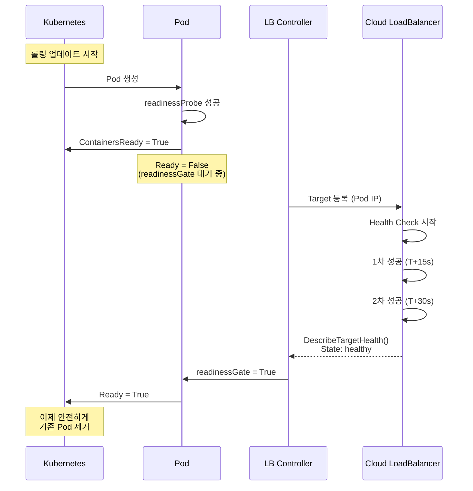

## 개요

Kubernetes 롤링 업데이트 중 발생하는 간헐적 502/503 에러는 대부분의 클라우드 환경에서 공통적으로 관찰되는 문제입니다. 이 글에서는 EKS와 GKE 환경에서 **Kubernetes Pod 라이프사이클과 클라우드 LoadBalancer 라이프사이클 간 불일치**를 분석하고, Pod Readiness Gates를 통한 해결 방법을 비교합니다.

### 핵심 질문
- 왜 Pod는 Ready인데 사용자는 502를 받는가?
- Kubernetes와 클라우드 LoadBalancer는 어떻게 다른 시간축에서 움직이는가?
- Pod Readiness Gates는 어떻게 두 시스템을 동기화하는가?
- EKS와 GKE의 구현은 어떻게 다른가?

---

## 1. 문제 정의: 라이프사이클 불일치

### 1.1 관찰된 증상

**환경 구성**:
- Frontend: Cloud LoadBalancer (AWS ALB / GCP GCLB)
- Backend: Kubernetes Service → Pods

**롤링 업데이트 시퀀스**:

```bash
$ kubectl set image deployment/my-app app=my-app:v2

# Kubernetes Event Log
my-app-v2-abc   0/1   ContainerCreating   0   0s
my-app-v2-abc   0/1   Running             0   5s
my-app-v2-abc   1/1   Running             0   10s   ← Pod Ready
my-app-v1-xyz   1/1   Terminating         0   5m    ← 기존 Pod 종료 시작
```

**동시에 관찰되는 에러 로그**:

```
[2026-04-08 02:34:15] ALB Target 10.0.1.50:8080 - State: initial
[2026-04-08 02:34:15] HTTP GET /api/users - 502 Bad Gateway
[2026-04-08 02:34:18] HTTP POST /api/orders - 502 Bad Gateway
[2026-04-08 02:34:25] HTTP GET /api/products - 502 Bad Gateway
[2026-04-08 02:34:43] ALB Target 10.0.1.50:8080 - State: healthy
[2026-04-08 02:34:44] HTTP GET /api/users - 200 OK
```

**에러 지속 시간**: 평균 28~40초

### 1.2 근본 원인: 두 개의 다른 시간축

| 시점 | Kubernetes | Cloud LoadBalancer | 사용자 영향 |
|------|-----------|-------------------|----------|
| T+0s | 신규 Pod 생성 | - | - |
| T+10s | **Pod Ready** (readinessProbe 성공) | Target 등록 시작 (initial) | - |
| T+11s | **기존 Pod 삭제 시작** | Health Check 시작 | - |
| T+12s~T+40s | 신규 Pod Ready 유지 | Target: initial (트래픽 불가) | **502 에러 발생** |
| T+40s | 신규 Pod Ready | **Target: healthy** | 정상화 |

**문제의 핵심**:
- Kubernetes는 `readinessProbe` 성공 즉시 Pod를 Ready로 판정
- Cloud LoadBalancer는 **연속 2회 Health Check 성공** 후 healthy 판정 (30~40초 소요)
- 이 갭 동안 Kubernetes는 기존 Pod를 제거하지만, 신규 Pod는 아직 트래픽을 받을 수 없는 상태

---

## 2. 해결책: Pod Readiness Gates

### 2.1 개념

Pod Readiness Gates는 **Kubernetes의 Pod Ready 판정 조건에 외부 시스템의 상태를 추가**하는 메커니즘입니다.

**기본 Ready 조건**:

```yaml
Pod Ready = ContainersReady
```

**Readiness Gates 적용 시**:

```yaml
Pod Ready = ContainersReady AND All ReadinessGates True
```

### 2.2 동작 원리



---

## 3. EKS vs GKE 구현 비교

### 3.1 EKS: AWS Load Balancer Controller

#### 3.1.1 활성화 방법

**단일 명령으로 활성화**:

```bash
kubectl label namespace production \
  elbv2.k8s.aws/pod-readiness-gate-inject=enabled
```

AWS Load Balancer Controller의 **Mutating Webhook**이 자동으로 readinessGates를 주입합니다.

#### 3.1.2 주입된 구조 및 동작 흐름

Namespace label을 추가하면 AWS Load Balancer Controller가 **Mutating Webhook**을 통해 Pod 생성 시점에 `spec.readinessGates`를 자동으로 주입합니다.

```yaml
spec:
  readinessGates:
  - conditionType: "target-health.alb.ingress.k8s.aws/my-app-tgb"
```

**Ready 판정 로직 변경**:
- 기존: `Pod Ready = ContainersReady`
- 변경 후: `Pod Ready = ContainersReady AND target-health condition = True`

**상태 전이 과정**:

1. **T+10s (컨테이너 준비 완료)**:
   - `ContainersReady: True` (readinessProbe 성공)
   - `target-health: False` (ALB에서 아직 initial 상태)
   - `Ready: False` ← Kubernetes가 기다림

2. **T+40s (ALB Health Check 완료)**:
   - `ContainersReady: True`
   - `target-health: True` (ALB에서 healthy 확인)
   - `Ready: True` ← 이제 안전하게 기존 Pod 제거

이 메커니즘을 통해 **Kubernetes는 ALB가 준비될 때까지 기다리게** 되므로, 트래픽을 받을 수 없는 Pod로 기존 Pod를 교체하는 상황을 방지합니다.

#### 3.1.3 컨트롤러 동작 원리

AWS Load Balancer Controller는 **두 가지 핵심 컴포넌트**로 동작합니다:

**1. Pod Mutator (주입 단계)**

Pod 생성 시 Mutating Webhook이 호출되어 readinessGates를 자동 주입합니다.

```go
// pkg/inject/pod_readiness_gate.go (핵심 로직)
func (m *podMutator) Mutate(ctx context.Context, pod *corev1.Pod) error {
    // Namespace label 확인 → Service 매칭 → TargetGroupBinding 조회
    // → readinessGates 주입
    pod.Spec.ReadinessGates = append(pod.Spec.ReadinessGates,
        corev1.PodReadinessGate{ConditionType: conditionType})
}
```

**주입 조건**:
- Namespace에 `elbv2.k8s.aws/pod-readiness-gate-inject=enabled` label 존재
- Pod의 label이 Service selector와 매칭
- Service에 연결된 TargetGroupBinding 존재

**2. Target Health Reconciler (동기화 단계)**

주기적으로 (기본 15초) ALB Target Health 상태를 조회하여 Pod Condition을 업데이트합니다.

```go
// pkg/backend/target_health_reconciler.go (핵심 로직)
func (r *targetHealthReconciler) Reconcile(...) error {
    // ALB Target Health 조회
    health := DescribeTargetHealth(targetGroupArn)

    // Pod Condition 업데이트
    pod.Status.Conditions.Update(
        Type: "target-health.alb.ingress.k8s.aws/...",
        Status: health == "healthy" ? True : False
    )
}
```

**동기화 흐름**:
1. ALB Target Group에서 각 Pod IP의 Health 상태 조회 (`initial` / `healthy` / `unhealthy`)
2. Pod의 `status.conditions`에서 해당 conditionType 찾기
3. ALB 상태가 `healthy`면 `True`, 아니면 `False`로 업데이트
4. Kubernetes는 모든 readinessGates가 `True`일 때만 Pod를 `Ready`로 판정

이 두 컴포넌트의 협업으로 **Kubernetes와 AWS ALB의 상태가 실시간 동기화**됩니다.

#### 3.1.4 기존 해결책 vs Pod Readiness Gates

**예전 방식: minReadySeconds (추측 기반 대기)**

```yaml
apiVersion: apps/v1
kind: Deployment
spec:
  minReadySeconds: 30  # ALB HC interval(15s) × threshold(2) = 30s
```

**문제점**:
- **고정된 시간 대기**: ALB Health Check가 20초 만에 끝나도 무조건 30초 대기
- **추측 기반 설정**: ALB Health Check 설정이 변경되면 minReadySeconds도 수동 변경 필요
- **간접적 해결**: ALB 상태를 직접 확인하지 않고 "충분히 기다렸을 것"이라고 가정
- **비효율**: Health Check가 빨리 완료되어도 남은 시간 낭비

**새 방식: Pod Readiness Gates (실시간 동기화)**

```bash
kubectl label namespace production \
  elbv2.k8s.aws/pod-readiness-gate-inject=enabled
```

**장점**:
- **동적 대기**: ALB가 healthy 되는 **정확한 순간**에 Ready 전환
- **자동 동기화**: ALB Health Check 설정 변경 시 자동 반영
- **직접 확인**: ALB Target Health API를 직접 조회하여 실제 상태 확인
- **효율적**: Health Check가 25초 만에 완료되면 25초만 대기

**비교**:

| 항목 | minReadySeconds | Pod Readiness Gates |
|------|----------------|---------------------|
| 대기 방식 | 고정 시간 (30초) | 동적 (ALB 상태 기반) |
| 정확성 | 추측 | 실시간 확인 |
| 설정 복잡도 | 중간 (계산 필요) | 낮음 (label 1줄) |
| 유지보수 | ALB 설정 변경 시 수동 업데이트 | 자동 동기화 |
| 배포 시간 | 항상 30초 추가 | 실제 필요한 만큼만 (평균 25~40초) |

**결론**: Pod Readiness Gates는 minReadySeconds의 "추측"을 "확인"으로 바꾸어, 더 정확하고 효율적인 해결책을 제공합니다.

#### 3.1.5 필수 설정

```yaml
apiVersion: networking.k8s.io/v1
kind: Ingress
metadata:
  annotations:
    alb.ingress.kubernetes.io/target-type: ip  # 필수!
    alb.ingress.kubernetes.io/healthcheck-interval-seconds: '15'
    alb.ingress.kubernetes.io/healthy-threshold-count: '2'
```

**제약사항**:
- `target-type: ip`만 지원 (`instance` 모드 불가)
- AWS Load Balancer Controller v2.4.0 이상 필요

---

### 3.2 GKE: NEG (Network Endpoint Group)

#### 3.2.1 활성화 방법

GKE에서는 **Container-native load balancing (NEG)을 사용하면 Pod Readiness Gates가 자동으로 활성화**됩니다.

**방법 1: Ingress를 통한 자동 활성화** (권장)

```yaml
apiVersion: v1
kind: Service
metadata:
  name: my-app
  annotations:
    cloud.google.com/neg: '{"ingress": true}'  # NEG 활성화
spec:
  type: ClusterIP
  ports:
  - port: 80
    targetPort: 8080
---
apiVersion: networking.k8s.io/v1
kind: Ingress
metadata:
  name: my-app
spec:
  rules:
  - host: my-app.example.com
    http:
      paths:
      - path: /
        pathType: Prefix
        backend:
          service:
            name: my-app
            port:
              number: 80
```

**GKE 1.17+ 버전**에서는 Ingress 생성 시 자동으로 NEG가 사용되며, Pod Readiness Gates (`cloud.google.com/load-balancer-neg-ready`)가 자동으로 주입됩니다.

**별도의 Namespace annotation이나 readiness gate annotation은 필요하지 않습니다.**

#### 3.2.2 주입된 구조 및 동작 흐름

Ingress를 생성하면 GKE Ingress Controller가 자동으로 `spec.readinessGates`를 주입합니다.

```yaml
spec:
  readinessGates:
  - conditionType: "cloud.google.com/load-balancer-neg-ready"
```

**Ready 판정 로직 변경**:
- 기존: `Pod Ready = ContainersReady`
- 변경 후: `Pod Ready = ContainersReady AND load-balancer-neg-ready = True`

**상태 전이 과정**:

1. **T+10s (컨테이너 준비 완료)**:
   - `ContainersReady: True` (readinessProbe 성공)
   - `load-balancer-neg-ready: False` (NEG endpoint 아직 GCLB에 미연결)
   - `Ready: False` ← Kubernetes가 기다림

2. **T+40s (GCLB Health Check 완료)**:
   - `ContainersReady: True`
   - `load-balancer-neg-ready: True` (NEG endpoint가 GCLB에서 healthy)
   - `Ready: True` ← 이제 안전하게 기존 Pod 제거

**NEG Controller의 역할**:
- NEG (Network Endpoint Group)에 Pod IP를 endpoint로 등록
- GCLB Health Check 상태를 모니터링
- Health Check 통과 시 Pod Condition을 `True`로 업데이트
- 이를 통해 **GCLB가 트래픽을 보낼 준비가 된 후에만** Pod가 Ready 상태로 전환

#### 3.2.3 GKE의 추가 고려사항: Drain Latency

GKE NEG는 Pod Readiness Gates를 지원하지만, **Pod 종료 시 Drain Latency 문제**가 존재합니다:

**Drain Latency**: NEG API에서 endpoint를 분리하는 데 걸리는 시간 (평균 5~15초)

**권장 설정** (GKE 공식 문서):

```yaml
apiVersion: v1
kind: Service
metadata:
  annotations:
    cloud.google.com/backend-config: '{"default": "my-backendconfig"}'
---
apiVersion: cloud.google.com/v1
kind: BackendConfig
metadata:
  name: my-backendconfig
spec:
  connectionDraining:
    drainingTimeoutSec: 60  # Backend Service Drain Timeout
---
apiVersion: apps/v1
kind: Deployment
spec:
  template:
    spec:
      containers:
      - name: app
        lifecycle:
          preStop:
            exec:
              command: ["/bin/sh", "-c", "sleep 120"]  # Drain + Latency
      terminationGracePeriodSeconds: 210  # preStop + shutdown
```

**타이밍 공식**:

```
preStop >= Backend Drain Timeout + Drain Latency
terminationGracePeriodSeconds >= preStop + App Shutdown Time
```

#### 시나리오별 문제 및 해결 과정

**시나리오 1: Backend Service Drain Timeout 미설정**


- **문제**: `drainingTimeoutSec` 설정 없음
- **결과**: Pod 종료 시 GCLB가 즉시 트래픽 차단하지 못함
- **증상**: 502/503 에러 발생 (평균 5~10초)
- **원인**: NEG endpoint 분리 + GCLB 동기화 시간

**시나리오 2: Backend Service Drain Timeout 설정**


- **적용**: `drainingTimeoutSec: 60`
- **개선**: GCLB가 60초간 기존 연결 유지
- **한계**: Drain Latency는 여전히 존재
- **증상**: 502/503 에러 감소했으나 완전히 제거되지 않음 (평균 2~5초)

**시나리오 3: preStop Hook 사용 (완전 해결)**


- **적용**: `drainingTimeoutSec: 60` + `preStop sleep 120`
- **동작**: Pod 종료 시작 → 120초 대기 → 실제 종료
- **결과**: NEG endpoint 분리 + GCLB 동기화 완료 후 종료
- **증상**: 502/503 에러 완전 제거 (0%)
- **핵심**: preStop이 Backend Drain + Drain Latency보다 길어야 함

---

### 3.3 비교 분석

| 항목 | EKS (AWS LB Controller) | GKE (NEG) |
|------|------------------------|-----------|
| **활성화 방법** | Namespace label 1줄 | Ingress 생성 시 자동 (NEG 사용) |
| **자동 주입** | Mutating Webhook | GKE Ingress Controller (자동) |
| **conditionType** | `target-health.alb.ingress.k8s.aws/<TGB>` | `cloud.google.com/load-balancer-neg-ready` |
| **Health 체크 주기** | 15~30초 (설정 가능) | GCLB 기본값 (변경 가능) |
| **Ready 전환 시간** | 30~45초 | 30~45초 |
| **종료 시 추가 고려** | preStop 15초 권장 | preStop 120초 권장 (Drain Latency) |
| **Target Type 제약** | `ip` 모드만 가능 | NEG 사용 시 자동 IP 모드 |
| **컨트롤러 의존성** | AWS LB Controller 필수 | GKE 내장 (Ingress Controller) |
| **설정 복잡도** | 낮음 (label 1줄) | 낮음 (Ingress 생성 시 자동) |
| **멀티 클라우드** | AWS 전용 | GCP 전용 |

**EKS의 특징**:
- Namespace label 추가로 활성화 (명시적 설정)
- 종료 시 타이밍 조정이 덜 복잡함 (preStop 15초)
- AWS Load Balancer Controller 설치 필요

**GKE의 특징**:
- Ingress 생성 시 자동 활성화 (암묵적 설정)
- GKE 내장 기능 (별도 컨트롤러 불필요)
- 종료 시 Drain Latency 추가 고려 필요 (preStop 120초)
- BackendConfig로 세밀한 튜닝 가능

---

## 4. EKS 구현 상세

### 4.1 타임라인 비교

#### Before (Pod Readiness Gates 없음)

| 시간 | 이벤트 | Pod 상태 | 사용자 영향 |
|------|--------|----------|----------|
| T+0s | 신규 Pod(v2) 생성 | - | - |
| T+10s | readinessProbe 성공 | Ready ✅ | - |
| T+10s | Kubernetes: Pod Ready 판정 | Ready ✅ | - |
| T+11s | **기존 Pod(v1) 삭제 시작** | Terminating | - |
| T+12s | v1 Endpoint 제거 | - | - |
| T+13s | ALB: v2 Target 등록 | initial ⏳ | - |
| T+15s | ALB: v1 Target 제거 | draining | - |
| **T+15s ~ T+43s** | **문제 구간 (28초)** | **v1: 제거됨<br>v2: initial** | **502 Error 💀** |
| T+43s | ALB: v2 Target healthy | healthy ✅ | - |
| T+43s | 정상화 | Ready ✅ | 200 OK |

**결과**: 28초간 서비스 불가, 모든 요청 502 에러

---

#### After (Pod Readiness Gates 적용)

| 시간 | 이벤트 | Pod 상태 | 사용자 영향 |
|------|--------|----------|----------|
| T+0s | 신규 Pod(v2) 생성 | - | - |
| T+10s | readinessProbe 성공 | ContainersReady ✅ | - |
| T+10s | readinessGate 확인 시작 | **Ready ❌** (대기 중) | - |
| T+11s | ALB에 v2 Target 등록 | initial ⏳ | - |
| **T+12s ~ T+42s** | **안전한 대기 구간** | **v1: 트래픽 처리 ✅<br>v2: Health Check 진행** | **200 OK ✅** |
| T+42s | ALB: v2 Health Check 2회 성공 | healthy ✅ | - |
| T+43s | LBC: v2 readinessGate = True | - | - |
| T+44s | Kubernetes: Pod Ready 판정 | **Ready ✅** | - |
| T+45s | v2 Endpoint 추가 | - | - |
| T+45s | **이제 v1 안전하게 제거** | v1 Terminating | - |
| T+45s 이후 | 완벽한 전환 | v2 healthy ✅ | 200 OK |

**결과**: 에러 0초, Zero Downtime 달성 🎉

### 4.2 Deployment 구성 요소 설명

Pod Readiness Gates와 함께 사용할 때 중요한 Deployment 설정들:

**1. 롤링 업데이트 전략**

```yaml
spec:
  strategy:
    rollingUpdate:
      maxUnavailable: 0  # 필수: 항상 최소 replica 유지
      maxSurge: 1
```

- `maxUnavailable: 0`은 **필수**입니다. 이 설정이 없으면 기존 Pod를 먼저 제거하고 신규 Pod를 생성하여, Pod Readiness Gates의 효과가 사라집니다.
- `maxSurge: 1`로 신규 Pod를 먼저 생성한 후 Ready 확인 후 기존 Pod 제거

**2. Readiness Probe (필수)**

```yaml
readinessProbe:
  httpGet:
    path: /health
    port: 8080
  periodSeconds: 5
  successThreshold: 1
```

- **ContainersReady 조건을 판정**하는 첫 번째 관문
- ALB Health Check와는 **별개**로 동작 (Kubernetes 내부 체크)
- 이 Probe가 성공해야 `ContainersReady: True`가 되고, 그 후 readinessGate 확인 시작

**3. Graceful Shutdown (종료 시 안전성)**

```yaml
lifecycle:
  preStop:
    exec:
      command: ["/bin/sh", "-c", "sleep 15"]
terminationGracePeriodSeconds: 30
```

- **preStop Hook**: Pod 종료 시작 시 15초 대기하여 진행 중인 요청 완료 대기
- ALB Deregistration Delay (30초)보다 짧게 설정하여 ALB가 먼저 트래픽 차단
- **타이밍**: Deregistration Delay (30s) > preStop (15s) 권장

### 4.3 Ingress Annotation 설명

**1. 필수 설정**

```yaml
annotations:
  alb.ingress.kubernetes.io/target-type: ip  # 필수!
```

- **Pod Readiness Gates는 `ip` 모드에서만 동작**
- `instance` 모드는 Node를 Target으로 사용하므로 Pod 단위 추적 불가

**2. Health Check 설정**

```yaml
annotations:
  alb.ingress.kubernetes.io/healthcheck-interval-seconds: '15'
  alb.ingress.kubernetes.io/healthy-threshold-count: '2'
```

- **interval × threshold = Ready 전환 시간**
- 예: 15초 × 2회 = 최소 30초 후 Ready
- 이 값들이 변경되어도 Pod Readiness Gates가 **자동으로 동기화**됨 (minReadySeconds는 수동 계산 필요)

**3. Deregistration Delay (종료 시)**

```yaml
annotations:
  alb.ingress.kubernetes.io/target-group-attributes: |
    deregistration_delay.timeout_seconds=30
```

- Pod 종료 시 ALB가 트래픽 전송을 중지한 후 대기하는 시간
- **이 값이 preStop보다 커야** 진행 중인 요청이 완료됨
- 권장: Deregistration Delay (30s) > preStop (15s)

### 4.4 검증 방법

#### Step 1: Pod 상태 확인

```bash
$ kubectl get pod -n production

NAME            READY   STATUS    RESTARTS   AGE   READINESS GATES
my-app-v2-abc   0/1     Running   0          30s   0/1
                ^^^                                 ^^^
              아직 Ready 아님                  조건 미충족
```

#### Step 2: 상세 조건 확인

```bash
$ kubectl get pod my-app-v2-abc -n production -o yaml | grep -A20 conditions

status:
  conditions:
  - type: ContainersReady
    status: "True"
    lastTransitionTime: "2026-04-08T02:34:10Z"

  - type: target-health.alb.ingress.k8s.aws/my-app-tgb
    status: "False"
    message: "Target is in 'initial' state"
    lastTransitionTime: "2026-04-08T02:34:11Z"

  - type: Ready
    status: "False"
    lastTransitionTime: "2026-04-08T02:34:11Z"
```

**30초 후**:

```yaml
status:
  conditions:
  - type: ContainersReady
    status: "True"

  - type: target-health.alb.ingress.k8s.aws/my-app-tgb
    status: "True"
    message: "Target is healthy"

  - type: Ready
    status: "True"  # 이제 진짜 Ready!
```

#### Step 3: ALB Target Health 확인

```bash
$ aws elbv2 describe-target-health \
  --target-group-arn arn:aws:elasticloadbalancing:...

{
  "TargetHealthDescriptions": [
    {
      "Target": {
        "Id": "10.0.1.50",
        "Port": 8080
      },
      "TargetHealth": {
        "State": "healthy",
        "Reason": "Target.ResponseCodeMismatch"
      }
    }
  ]
}
```

---

## 5. 주의사항

### 5.1 target-type 제약

```yaml
# EKS: 필수 설정
annotations:
  alb.ingress.kubernetes.io/target-type: ip

# GKE: NEG 사용 시 자동 IP 모드
```

## 6. 참고 자료

### EKS
- [AWS Load Balancer Controller - Pod Readiness Gates](https://kubernetes-sigs.github.io/aws-load-balancer-controller/v2.9/deploy/pod_readiness_gate/)
- [EKS Best Practices - Load Balancing](https://aws.github.io/aws-eks-best-practices/networking/loadbalancing/)

### GKE
- [GKE - Container-native load balancing](https://cloud.google.com/kubernetes-engine/docs/concepts/container-native-load-balancing)
- [GKE - Container-native load balancing through Ingress](https://docs.cloud.google.com/kubernetes-engine/docs/how-to/container-native-load-balancing)
- [GKE - Standalone zonal NEGs](https://docs.cloud.google.com/kubernetes-engine/docs/how-to/standalone-neg)
- [GKE - Troubleshooting 500-series errors](https://cloud.google.com/kubernetes-engine/docs/troubleshooting/troubleshooting-500-series-errors)
- [OneUptime - NEG Health Check Troubleshooting (2026-02-17)](https://oneuptime.com/blog/post/2026-02-17-how-to-fix-network-endpoint-group-health-check-returning-unhealthy-for-gke-pods/view)

### Kubernetes
- [Pod Lifecycle](https://kubernetes.io/docs/concepts/workloads/pods/pod-lifecycle/)
- [Container Probes](https://kubernetes.io/docs/tasks/configure-pod-container/configure-liveness-readiness-startup-probes/)

### 기타
- [Zero-downtime Deployments in Kubernetes](https://learnk8s.io/graceful-shutdown)
- [EKS 배포는 초록불인데, 고객은 왜 502를 맞는가?](https://medium.com/@yonghyun-kim)

---

## 요약

### 문제
- 롤링 업데이트 시 Kubernetes와 Cloud LoadBalancer 라이프사이클 불일치
- Pod는 Ready인데 LoadBalancer는 아직 healthy 아님
- 결과: 28~40초간 502 에러 발생

### 해결
**Pod Readiness Gates로 두 시스템 동기화**

**EKS**:
```bash
kubectl label namespace production \
  elbv2.k8s.aws/pod-readiness-gate-inject=enabled
```

**GKE**:
```yaml
# Container-native load balancing (NEG) 사용 시 자동 활성화
apiVersion: v1
kind: Service
metadata:
  annotations:
    cloud.google.com/neg: '{"ingress": true}'  # NEG 활성화
---
# Ingress 생성 시 Pod Readiness Gates 자동 주입
apiVersion: networking.k8s.io/v1
kind: Ingress
metadata:
  name: my-app
```

### 핵심 개념
- **Pod Readiness Gates**: Kubernetes Ready 조건에 외부 시스템 상태 추가
- **EKS**: AWS Load Balancer Controller가 ALB Target Health 동기화 (명시적 설정)
- **GKE**: Ingress Controller가 GCLB Endpoint 동기화 (자동 설정)
- **결과**: Zero Downtime 배포 달성

### 플랫폼별 특징
- **EKS**: Namespace label로 명시적 활성화, 종료 타이밍 덜 복잡 (`preStop: 15s`)
- **GKE**: Ingress 생성 시 자동 활성화, 종료 시 Drain Latency 고려 필요 (`preStop: 120s`)

---

**최종 업데이트**: 2026-04-08
