# [EKS] Week 7 - EKS Cluster In-place Upgrades (1.30 → 1.31)

> **Week 7 학습 주제**: EKS 클러스터를 안전하게 업그레이드하는 전략과 실습. Control Plane, Add-on, Nodes를 순차적으로 업그레이드하며 HA 전략(PDB, TopologySpread)을 적용합니다.

## 📋 목차

1. [🎯 Week 7 학습 목표](#-week-7-학습-목표)
   - [학습 목표](#1-학습-목표)
   - [실습 환경 구성](#2-실습-환경-구성)

2. [📝 실습 메모](#-실습-메모)
   - [Preparing for Cluster Upgrades](#1-preparing-for-cluster-upgrades)
   - [In-place Cluster Upgrades](#2-in-place-cluster-upgrades-130--131)
   - [도전 과제](#3-도전-과제)

3. [🚀 Getting Started](#-getting-started)
   - [실습 환경 정보 확인](#1-실습-환경-정보-확인)
   - [Sample Application 배포](#2-sample-application-배포)
   - [EKS API/ConfigMap, IRSA 정보 확인](#3-eks-apiconfigmap-irsa-정보-확인)

4. [🔍 EKS Upgrade Insights](#-eks-upgrade-insights)
   - [Upgrade Insights 개요](#1-upgrade-insights-개요)
   - [Insights 확인](#2-insights-확인)

5. [🛡️ HA 전략 (High Availability Strategies)](#️-ha-전략-high-availability-strategies)
   - [PodDisruptionBudgets (PDB)](#1-poddisruptionbudgets-pdb)
   - [TopologySpreadConstraints](#2-topologyspreadconstraints)

6. [⬆️ Control Plane 업그레이드](#️-control-plane-업그레이드)
   - [업그레이드 방법 1: eksctl](#1-업그레이드-방법-1-eksctl)
   - [업그레이드 방법 2: AWS 관리 콘솔](#2-업그레이드-방법-2-aws-관리-콘솔)
   - [업그레이드 방법 3: AWS CLI](#3-업그레이드-방법-3-aws-cli)
   - [업그레이드 방법 4: Terraform (권장)](#4-업그레이드-방법-4-terraform-권장)

7. [🔧 Add-on 업그레이드](#-add-on-업그레이드)
   - [CoreDNS](#1-coredns)
   - [kube-proxy](#2-kube-proxy)
   - [VPC CNI](#3-vpc-cni)
   - [EBS CSI Driver](#4-ebs-csi-driver)

8. [🖥️ Nodes 업그레이드](#️-nodes-업그레이드)
   - [관리형 노드그룹 (Managed Node Group)](#1-관리형-노드그룹-managed-node-group)
   - [카펜터 노드 (Karpenter)](#2-카펜터-노드-karpenter)
   - [셀프 노드그룹 (Self-managed)](#3-셀프-노드그룹-self-managed)
   - [파게이트 프로파일 (Fargate)](#4-파게이트-프로파일-fargate)

9. [💡 핵심 개념 정리](#-핵심-개념-정리)
   - [EKS 업그레이드 순서](#1-eks-업그레이드-순서)
   - [In-Place vs Blue-Green](#2-in-place-vs-blue-green)
   - [업그레이드 Best Practices](#3-업그레이드-best-practices)

10. [🎓 Week 7 학습 정리](#-week-7-학습-정리)

---

## 🎯 Week 7 학습 목표

### 1. 학습 목표

**Week 7**에서는 EKS 클러스터를 안전하게 업그레이드하는 전략과 실습을 진행합니다.

**이번 주 핵심 학습 포인트**:
- ✅ EKS Upgrade Insights로 업그레이드 사전 점검
- ✅ Control Plane → Add-on → Nodes 순차 업그레이드
- ✅ 관리형 노드그룹 업그레이드 (In-Place vs Blue-Green)
- ✅ Karpenter 노드 자동 업그레이드
- ✅ PodDisruptionBudgets(PDB)로 가용성 보장
- ✅ TopologySpreadConstraints로 Pod 분산 배치
- ✅ ArgoCD GitOps로 샘플 애플리케이션 배포

**왜 EKS 업그레이드를 배우는가?**
- **보안**: Kubernetes 버전별 취약점 패치 필수
- **기능**: 신규 API 및 기능 사용 (Deprecated API 제거)
- **지원**: AWS EKS는 최신 3개 버전만 지원 (n, n-1, n-2)

### 2. 실습 환경 구성

#### EKS 클러스터 정보

| 항목 | 값 |
|------|-----|
| **리전** | us-west-2 (오리건) |
| **Kubernetes 버전** | 1.30 → 1.31 업그레이드 |
| **노드 OS** | Amazon Linux 2023 |
| **커널** | 6.1 |
| **Container Runtime** | containerd 2.2.1 |

#### 노드 구성

| 노드 타입 | 이름 | 설명 |
|----------|------|------|
| **관리형 노드그룹** | blue-mng (initial) | 초기 노드그룹 |
| **셀프 노드그룹** | default-selfmng | 수동 관리 노드그룹 |
| **파게이트 프로파일** | fp-profile | 서버리스 컴퓨팅 |
| **카펜터 노드** | default-spot | Spot 인스턴스 자동 프로비저닝 |

#### 주요 컴포넌트

- **kube-ops-view**: 클러스터 시각화 도구
- **ArgoCD**: GitOps 기반 배포 도구
- **Sample Application**: UI, Orders, Checkout, Carts, Catalog, Assets
- **AWS CodeCommit**: GitOps 저장소

---

## 📝 실습 메모

### 1. Preparing for Cluster Upgrades

**EKS 클러스터 업그레이드 준비사항**:


**중요 사항**:
- ✅ **kube-ops-view** 또는 **ui-web**을 통한 실시간 모니터링
- ✅ **노드그룹별** 업그레이드 전략 수립 (관리형 vs 셀프 vs 카펜터)
- ✅ **다양한 방법** 비교: eksctl, AWS 콘솔, AWS CLI, Terraform
- ⚠️ **주의**: 업그레이드는 **되돌릴 수 없음** (Rollback 불가)

### 2. In-place Cluster Upgrades: 1.30 → 1.31

**업그레이드 순서** (총 **약 1시간** 소요):

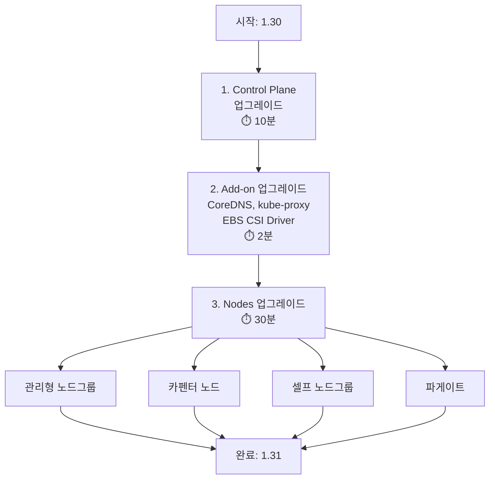

**실습 순서**:
1. **EKS Control Plane** Upgrade (10분 소요): 1.30 → 1.31
2. **EKS Add-on** Upgrade (2분 소요): 1.31에 적합한 Add-on 버전으로 업그레이드
   - CoreDNS
   - kube-proxy
   - EBS CSI Driver
3. **EKS Nodes** Upgrade
   - **관리형 노드그룹 업그레이드** (30분 소요): 1.30 → 1.31
     - **In-Place** Managed Node group Upgrade
     - **Blue-Green** approach for Managed node group update (30분 소요): 1.30 → 1.31
   - **카펜터 노드 업그레이드**: 1.30 → 1.31
   - **셀프 노드그룹 업그레이드**: 1.30 → 1.31
   - **파게이트 노드 업그레이드**: 1.30 → 1.31

**⇒ 최종 모든 노드가 1.31 버전임을 확인**

### 3. 도전 과제

**실습 과제**: 모든 직접 수행은 대략 코드 변경 후 apply 로 실행, 해당 과정에서 apps 영향도 등 파악해보기

---

## 🚀 Getting Started

### 1. 실습 환경 정보 확인

#### 1.1 실습 환경 배포 (CloudFormation)

**IDE-Server 배포**:
- AWS CloudFormation Stack으로 배포
- AWS EKS는 Terraform으로 배포

```bash
# CloudFormation Stack 출력 확인
# IdePassword: 워크샵 IDE 접속 암호
# IdeUrl: https://{random}.cloudfront.net (code-server)
```

**code-server 접속**:
- UI-web을 통한 시각화 도구 제공

#### 1.2 EKS 클러스터 정보 확인

```bash
# 실습 환경 변수 설정
export AWS_DEFAULT_REGION=us-west-2
cd /home/ec2-user/environment
export role/workshop-stack-IdleIdeRoleD654ADD4-PpmNR7nYVBT0/i-00d9a1ac022bd4f29

# EKS 클러스터 정보
eksctl get cluster
# NAME       REGION    EKSCTL  CREATED
# eksworkshop-eksctl  us-west-2  False   ...

# 노드그룹 정보
eksctl get nodegroup --cluster $CLUSTER_NAME
# NODEGROUP    NODEPOOL    STATUS  CREATED  MIN SIZE  MAX SIZE  DESIRED  CAPACITY  INSTANCE TYPE
# blue-mng     ...         ACTIVE  ...      2         6         4        4         m5.large
# initial      ...         ACTIVE  ...      2         6         4        4         m5.large

# 노드 확인
kubectl get nodes
# NAME                                        STATUS  ROLES   AGE  VERSION
# ip-10-0-13-152.us-west-2.compute.internal  Ready   <none>  1d   v1.30.14-eks-f69f56f
# ip-10-0-18-209.us-west-2.compute.internal  Ready   <none>  1d   v1.30.14-eks-f69f56f
# ...
```

**노드 레이블 및 Taint 확인**:

```bash
# 커스텀 레이블 확인
kubectl get nodes -o custom-columns=\
'NODE:.metadata.name,TAINTS:.spec.taints[*].key,VALUES:.spec.taints[*].value'

# JSON 출력으로 상세 확인
kubectl get nodes -o json | jq '.items[] | {
  "name": .metadata.name,
  "labels": .metadata.labels,
  "taints": .spec.taints
}'
```

**노드 상세 정보**:

```bash
# 노드 인스턴스 정보
kubectl get node --label-columns=\
node.kubernetes.io/instance-type,\
kubernetes.io/arch,\
kubernetes.io/os,\
topology.kubernetes.io/zone

# 예시 출력:
# NAME            INSTANCE-TYPE  ARCH    OS      ZONE
# ip-10-0-47-39   m5.large       amd64   linux   us-west-2c
# ip-10-0-13-152  m5.large       amd64   linux   us-west-2c
# ...
```

**노드 Taints 정보**:

```bash
# 노드별 Taint 확인 (dedicated, OrdersApp 등)
kubectl get nodes -o custom-columns=\
'NODE:.metadata.name,TAINTS:.spec.taints[*].key,VALUES:.spec.taints[*].value'

# 예시:
# - dedicated: OrdersApp (eks.amazonaws.com/nodegroup, karpenter.sh/nodepool)
# - default 노드는 Taint 없음
```

### 2. Sample Application 배포

#### 2.1 Sample Application 아키텍처

**애플리케이션 구조**:

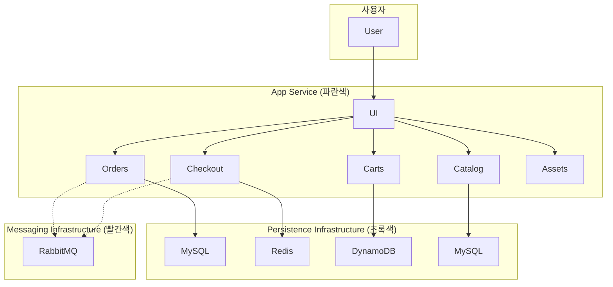

**컴포넌트 설명**:

| Component | Description |
|-----------|-------------|
| **UI** | 프론트엔드 사용자 인터페이스, 각 API 호출 집계 |
| **Catalog** | 상품 목록 및 상세 정보 API |
| **Cart** | 고객 쇼핑 카트 API |
| **Checkout** | 결제 프로세스 오케스트레이션 API |
| **Orders** | 고객 주문 수신 및 처리 API |
| **Static assets** | 상품 카탈로그 관련 이미지 제공 |

#### 2.2 이미지 저장소

- **ECR (Elastic Container Registry)**: 공개 저장소 정보 제공

#### 2.3 ArgoCD를 사용한 GitOps 배포

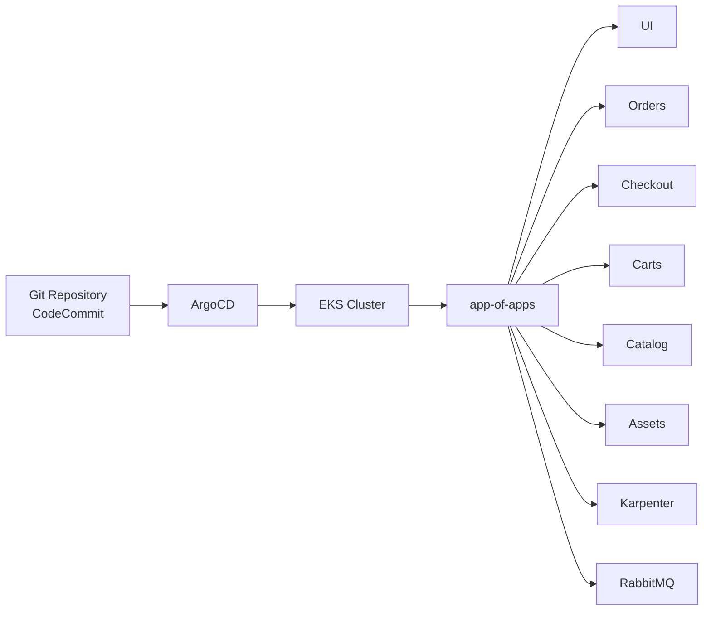

**ArgoCD 저장소 클론**:

```bash
# CodeCommit 저장소 클론
cd ~/environment
git clone codecommit::${REGION}:://eks-gitops-repo

# 디렉터리 구조
tree eks-gitops-repo/ -L 2
# eks-gitops-repo/
# ├── app-of-apps
# │   ├── Chart.yaml
# │   └── templates
# ├── apps
# │   ├── assets
# │   ├── carts
# │   ├── catalog
# │   ├── checkout
# │   ├── karpenter
# │   ├── kustomization.yaml
# │   ├── orders
# │   ├── other
# │   └── rabbitmq
# └── values.yaml
```

**ArgoCD 접속**:

```bash
# ArgoCD URL 확인
kubectl get svc argo-cd-argocd-server -n argocd -o json | \
  jq --raw-output '.status.loadBalancer.ingress[0].hostname'

# ArgoCD 로그인 정보
echo "ArgoCD URL: http://${ARGOCD_SERVER}"
export ARGOCD_USER="admin"
export ARGOCD_PWD=$(kubectl -n argocd get secret argocd-initial-admin-secret \
  -o jsonpath="{.data.password}" | base64 -d)
echo "Username: admin"
echo "Password: ${ARGOCD_PWD}"
```

**ArgoCD CLI 확인**:

```bash
# ArgoCD CLI로 애플리케이션 확인
argocd app list

# 출력 예시:
# NAME      SYNC STATUS  HEALTH STATUS
# apps      Synced      Healthy
# assets    Synced      Healthy
# carts     Synced      Healthy
# catalog   Synced      Healthy
# checkout  Synced      Healthy
# karpenter Synced      Healthy
# orders    Synced      Healthy
# rabbitmq  Synced      Healthy
# ui        Synced      Healthy
```

#### 2.4 UI 접속을 위한 NLB 설정

**UI 서비스 확인**:

```bash
# UI 서비스 LoadBalancer 주소
kubectl get svc -n ui
# NAME  TYPE          CLUSTER-IP    EXTERNAL-IP                          PORT(S)    AGE
# ui    LoadBalancer  172.20.97.57  k8s-argocd-argocar-...elb.us-west-2.amazonaws.com  80:31331/TCP

# UI 접속
kubectl get targetgroupbindings -n argocd
```

### 3. EKS API/ConfigMap, IRSA 정보 확인

#### 3.1 EKS API 확인

```bash
# EKS API Access Entries
aws eks list-access-entries \
  --cluster-name $CLUSTER_NAME

# 출력 예시:
# {
#   "accessEntries": [
#     "arn:aws:iam::964061878287:role/aws-service-role/eks.amazonaws.com/AWSServiceRoleForAmazonEKS",
#     "arn:aws:iam::964061878287:role/blue-mng-eks-node-group-20260422091459286500000000f",
#     "arn:aws:iam::964061878287:role/default-selfmng-node-group-20260422091459194400000000d",
#     "arn:aws:iam::964061878287:role/fp-profile-20260422092539725700000001f",
#     "arn:aws:iam::964061878287:role/initial-eks-node-group-20260422091459209900000000e",
#     "arn:aws:iam::964061878287:role/karpenter-eksworkshop-eksctl",
#     "arn:aws:iam::964061878287:role/workshop-stack-IdleIdeRoleD654ADD4-PpmNR7nYVBT0"
#   ]
# }
```

**IAM Identity Mapping 확인**:

```bash
# eksctl로 IAM Identity Mapping 확인
eksctl get iamidentitymapping --cluster $CLUSTER_NAME

# 출력:
# GROUPS                  ACCOUNT
# arn:aws:iam::964061878287:role/WSParticipantRole  admin  system:masters
# arn:aws:iam::964061878287:role/blue-mng-eks-node-group-...  system:node:{{EC2PrivateDNSName}}  system:bootstrappers, system:nodes
# ...
```

#### 3.2 AWS 관리 콘솔 확인

**추가 설명**: AWS 관리 콘솔에서 `964061878287:role/workshop-stack-IdleIdeRoleD654ADD4-PpmNR7nYVBT0` admin 권한 확인.

**주요 컴포넌트별 서비스 어카운트**:
- `kube-system`: `aws-load-balancer-controller`, `ebs-csi-controller`, `aws-efs-csi-driver` 등 사용

#### 3.3 IRSA (IAM Roles for Service Accounts) 확인

**실습 과제를 통한 IRSA 패턴 확인**:
- Role(관리 콘솔) 확인 해보기
- 신뢰관계 "Action": "sts:AssumeRoleWithWebIdentity" 등

```bash
# ServiceAccount 확인
kubectl describe sa -n system aws-load-balancer-controller-sa

# Annotations 확인:
# eks.amazonaws.com/role-arn:
# arn:aws:iam::964061878287:role/alb-controller-20260422093008180700000003a

# kube-system에서 AWS EFS CSI Driver ServiceAccount 확인
kubectl describe sa -n kube-system aws-efs-csi-driver-sa

# eksworkshop-eksctl-ebs-csi-202604220925108197000001d
kubectl describe sa -n kube-system karpenter

# karpenter ServiceAccount
# arn:aws:iam::964061878287:role/karpenter-20260422093008166
```

**OIDC Provider 확인**:

```bash
# EKS API Endpoint
aws eks describe-cluster --name $CLUSTER_NAME | \
  jq -r '.cluster.endpoint'

# OIDC Issuer URL
aws eks describe-cluster --name $CLUSTER_NAME | \
  jq -r '.cluster.identity.oidc.issuer'

# 출력:
# https://oidc.eks.us-west-2.amazonaws.com/id/B852364D70EA6D62672481D278A15059

# OpenID Connect Providers 확인
aws iam list-open-id-connect-providers | jq
```

---

## 🔍 EKS Upgrade Insights

### 1. Upgrade Insights 개요

**EKS Upgrade Insights**는 Kubernetes 버전 업그레이드 전 **잠재적 문제점**을 사전에 파악할 수 있는 도구입니다.

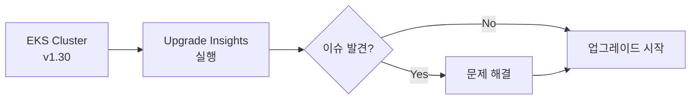

**점검 항목** (6가지):
1. **kube-proxy version skew**: kube-proxy 버전이 Control Plane 버전과 일치하는지 확인
2. **Cluster health issues**: 클러스터 헬스 체크 (Node NotReady 등)
3. **EKS add-ons compatibility**: 설치된 EKS Add-on이 새 버전과 호환되는지 확인
4. **Amazon Linux expiration**: AL 노드가 2025년 11월 26일 이후 지원 종료 (AL2023으로 마이그레이션 필요)
5. **kubelet version skew**: Worker 노드의 kubelet 버전이 Kubernetes kubelet version skew policy를 준수하는지 확인
6. **Deprecated APIs**: v1.32에서 제거될 예정인 Deprecated API 사용 여부 확인

### 2. Insights 확인

```bash
# Insights for Kubernetes v1.31
aws eks list-insights --region ${AWS_REGION} \
  --cluster-name $CLUSTER_NAME \
  --filter kubernetesVersions=1.31

# 출력 예시:
# {
#   "insights": [
#     {
#       "id": "676cc9cf-5241-4366-a024-3235ac1854b5",
#       "name": "kube-proxy version skew",
#       "category": "UPGRADE_READINESS",
#       "kubernetesVersion": "1.31",
#       "lastRefreshTime": "2026-04-22T09:38:46+00:00",
#       "lastTransitionTime": "2026-04-22T09:37:45+00:00",
#       "description": "Checks version of kube-proxy in cluster to see if upgrade would cause non compliance with supported Kubernetes kube-proxy version skew policy.",
#       "insightStatus": {
#         "status": "PASSING",
#         "reason": "kube-proxy versions match the cluster control plane version."
#       }
#     },
#     ...
#   ]
# }
```

**AWS 콘솔에서 확인**:
- EKS 클러스터 → **Upgrade** 탭 → **Upgrade Insights** 섹션

---

## 🛡️ HA 전략 (High Availability Strategies)

### 1. PodDisruptionBudgets (PDB)

**PDB (Pod Disruption Budgets)**는 **계획된 중단**(Voluntary Disruption) 시 **최소 가용 Pod 수** 또는 **최대 중단 Pod 수**를 보장합니다.

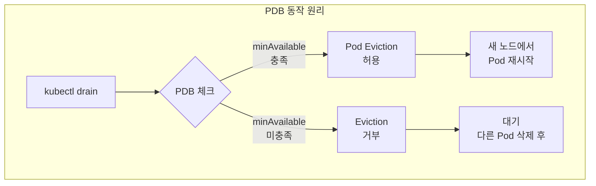

#### 1.1 PDB 설정 예시

**orders 애플리케이션에 PDB 추가**:

```yaml
# apps/orders/pdb.yaml
apiVersion: policy/v1
kind: PodDisruptionBudget
metadata:
  name: orders-pdb
  namespace: orders
spec:
  minAvailable: 1  # 최소 1개 Pod는 항상 Running
  selector:
    matchLabels:
      app.kubernetes.io/component: service
      app.kubernetes.io/instance: orders
```

**GitOps로 배포**:

```bash
# Git 저장소에서 PDB 추가
cd ~/environment/eks-gitops-repo/apps/orders
cat << EOF > kustomization.yaml
resources:
  - ~/environment/eks-gitops-repo/apps/orders/kustomization.yaml
  - pdb.yaml
EOF

# Git Commit & Push
git add apps/orders/pdb.yaml
git commit -m "Add PDB to orders"
argocd app sync orders
```

#### 1.2 PDB 검증

```bash
# PDB 확인
kubectl get pdb -A

# NAMESPACE  NAME        MIN AVAILABLE  MAX UNAVAILABLE  ALLOWED DISRUPTIONS  AGE
# orders     orders-pdb  1              N/A              1                    6h36m

# orders 애플리케이션 Pod 확인
kubectl get pod -n orders

# NAME                      READY  STATUS   RESTARTS  AGE
# orders-788b566b87-qgm72   1/1    Running  0         6h
```

**PDB가 없는 경우 vs PDB가 있는 경우**:

```bash
# PDB 없이 drain 시도 (모든 Pod 즉시 삭제)
kubectl drain $nodeName --ignore-daemonsets --force --delete-emptydir-data

# PDB 있는 경우
# ⚠️ error when evicting pods/"orders-5b97745747-j2h8d" -n orders:
# Cannot evict pod as it would violate the pod's disruption budget.

# 해결: 다른 노드에서 새로운 Pod가 먼저 시작된 후 삭제
```

#### 1.3 노드 Drain 시 동작

```bash
# 노드 Unschedulable 설정
kubectl describe node $nodeName | grep -i taint
# Taints: node.kubernetes.io/unschedulable:NoSchedule

# PDB 상태 확인 후 Pod Eviction
kubectl get pdb -n orders
# ALLOWED DISRUPTIONS: 1 (최소 가용성 유지)

# 새 노드에서 Pod 시작 후 기존 Pod 삭제
kubectl get pod -n orders -o wide
```

### 2. TopologySpreadConstraints

**TopologySpreadConstraints**는 **Pod를 여러 가용 영역(AZ)**에 분산 배치하여 장애 시 가용성을 보장합니다.

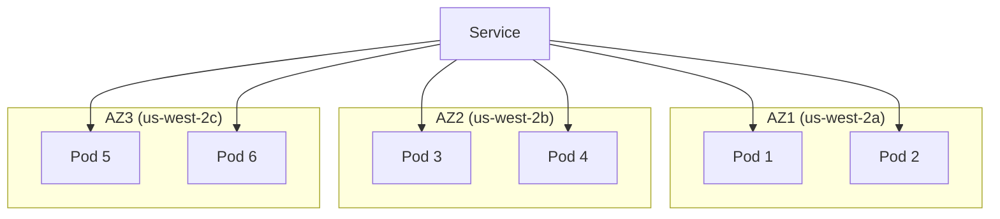

**Deployment에 TopologySpreadConstraints 추가**:

```yaml
apiVersion: apps/v1
kind: Deployment
metadata:
  name: orders
spec:
  replicas: 6
  template:
    spec:
      topologySpreadConstraints:
        - maxSkew: 1
          topologyKey: topology.kubernetes.io/zone
          whenUnsatisfiable: DoNotSchedule
          labelSelector:
            matchLabels:
              app.kubernetes.io/name: orders
```

**설정 설명**:
- `maxSkew: 1`: 각 영역 간 Pod 개수 차이 최대 1
- `topologyKey: topology.kubernetes.io/zone`: 가용 영역 기준 분산
- `whenUnsatisfiable: DoNotSchedule`: 조건 미충족 시 스케줄링 차단

---

## ⬆️ Control Plane 업그레이드

### 1. 업그레이드 방법 1: eksctl

**가장 간단한 방법** (단, 실행 시 자동으로 진행되어 세밀한 제어 불가)

```bash
# eksctl로 Control Plane 업그레이드
eksctl upgrade cluster --name $EKS_CLUSTER_NAME --approve
```

**주의사항**:
- ⚠️ **이래 실행하지 않음!** (명령어만 참고)
- 현재 버전보다 **한 버전 더 높은 버전**만 업그레이드 가능
- 절대 두 개 이상의 Kubernetes 버전 업그레이드는 **지원되지 않음**

### 2. 업그레이드 방법 2: AWS 관리 콘솔

**AWS 콘솔을 통한 업그레이드** (skip, 이래 실행하지 않음!)

**단계**:
1. AWS EKS 콘솔 → 클러스터 선택
2. **Upgrade** 버튼 클릭
3. **Kubernetes version** 선택: `1.26` (또는 원하는 버전)
4. "confirm" 입력 후 **Upgrade** 클릭

**업그레이드 진행 확인**:
- EKS가 자동으로 이슈 확인 후 업그레이드 시작
- "Upgrading the Kubernetes version cannot be reversed."

### 3. 업그레이드 방법 3: AWS CLI

**AWS CLI로 Control Plane 업그레이드** (이래 실행하지 않음!)

```bash
# Control Plane 업그레이드
aws eks update-cluster-version \
  --region ${AWS_REGION} \
  --name $EKS_CLUSTER_NAME \
  --kubernetes-version 1.31

# 출력:
# {
#   "update": {
#     "id": "b5f0ba18-9a87-4450-b5a0-825e6e84496f",
#     "status": "InProgress",
#     "params": [
#       { "type": "Version", "value": "1.31" },
#       { "type": "PlatformVersion", "value": "eks.x" }
#     ],
#     ...
#   }
# }

# 업그레이드 상태 확인
aws eks describe-update \
  --region ${AWS_REGION} \
  --name $EKS_CLUSTER_NAME \
  --update-id b5f0ba18-9a87-4450-b5a0-825e6e84496f

# Successful 상태가 되면 업그레이드 완료
```

### 4. 업그레이드 방법 4: Terraform (권장)

**Terraform을 사용한 실제 업그레이드 실행!**

이 랩에서는 **Terraform**을 사용하여 클러스터를 업그레이드합니다. EKS 클러스터는 이미 Terraform을 통해 이 랩에 프로비저닝되었습니다.

```bash
# Terraform 상태 확인
cd ~/environment/terraform
terraform state list
```

**모니터링을 위한 작업 추가**:

```bash
# 현재 버전 확인 (파일에 반영 전)
kubectl get pods --all-namespaces \
  -o jsonpath="{.items[*].spec.containers[*].image}" | tr -s '[[:space:]]' '\n' | \
  sort | uniq -c | grep -c '602401143452.dkr.ecr.us-west-2.amazonaws.com'

# UI_WEB 확인 (1분마다 갱신)
export UI_WEB=$(kubectl get svc -n ui-web -o jsonpath='{.status.loadBalancer.ingress[0].hostname}')
while true; do curl -s $UI_WEB/actuator/health/liveness | jq '.status' && sleep 1; done
```

**cluster_version 변수 업데이트**:

```bash
# variable.tf의 cluster_version 변수를 1.30 → 1.31로 변경
cd ~/environment/terraform
# (variables.tf 파일 편집)
```

**variables.tf 수정**:

```hcl
variable "cluster_version" {
  description = "Kubernetes cluster version"
  type        = string
  default     = "1.31"  # 1.30에서 변경
}
```

**Terraform Plan 실행**:

```bash
# 기본 정보 확인
aws eks describe-cluster --name $CLUSTER_NAME | \
  egrep 'version|endpoint|issuer|platformVersion'

# Terraform Plan 확인
terraform plan -no-color > plan-output.txt

# IDE에서 열어보기
```

**Terraform Plan 요약**:
- 클러스터 버전을 변경하면 Terraform이 어떤 변경을 하는지 볼 수 있습니다.
- **AMI나 태그만 변경**, 관리 노드 그룹 및 애드온 등과 같은 관련 리소스를 업데이트하기 쉽습니다.
- **10분 소요** (Control Plane 1.31 업그레이드)

**Terraform Apply 실행**:

```bash
# Terraform Apply (자동 승인)
terraform apply -auto-approve

# 10분 소요 (eks control plane 1.31 업그레이드)
aws eks describe-cluster --name $EKS_CLUSTER_NAME | \
  jq '.cluster.endpoint'
```

**업그레이드 완료 확인**:

```bash
# Control Plane 버전 확인
aws eks describe-cluster --name eksworkshop-eksctl

# 기본 정보만 확인
echo "Version:" $(aws eks describe-cluster --name $CLUSTER_NAME | jq -r '.cluster.version')
echo "Platform:" $(aws eks describe-cluster --name $CLUSTER_NAME | jq -r '.cluster.platformVersion')

# 모든 컨테이너 이미지 확인 (AGE 정보 확인, 재생성된 파드 확인!)
kubectl get pod -A --sort-by='.metadata.creationTimestamp'

# 1.30.txt vs 1.31.txt 비교 (동일할 것)
kubectl get pods --all-namespaces \
  -o jsonpath="{.items[*].spec.containers[*].image}" | tr -s '[[:space:]]' '\n' | \
  sort | uniq -c > 1.31.txt

# 파드 AGE 정보 확인
kubectl get pod -A ...
```

---

## 🔧 Add-on 업그레이드

### 1. Add-on 업그레이드 개요

**EKS 1.30의 기존 애드온을 보려면**: 기능한 업그레이드 버전 정보 확인!

```bash
# 가능한 업그레이드 버전 확인
eksctl get addon --cluster $CLUSTER_NAME

# NAME      VERSION  STATUS  ISSUES  IAMROLE  UPDATE AVAILABLE  CONFIGURATION  VALUES
# aws-ebs-csi-driver  v1.58.0-eksbuild.1  ACTIVE  0  ...  v1.x
```

**eksctl을 사용하여 EKS 1.30의 기존 애드온을 보려면**:

1. **CoreDNS** (역기서 호환성을 확인할 수 있습니다)
2. **kube-proxy** (역기서 호환성을 확인할 수 있습니다)
3. **VPC CNI** (역기서 호환성을 확인할 수 있습니다)
4. **(옵션) EBS CSI Driver**

### 2. CoreDNS

**CoreDNS 업그레이드** (소프트웨어에 영향 없이 업그레이드 가능):

```bash
# 가능한 업그레이드 버전 확인
eksctl get addon --cluster $CLUSTER_NAME

# CoreDNS 업그레이드 (예: v1.x)
# (실제 업그레이드는 EKS Control Plane 업그레이드 시 자동 진행되는 경우도 있음)
```

### 3. kube-proxy

**kube-proxy 업그레이드**:

```bash
# kube-proxy 현재 버전 확인
kubectl get ds kube-proxy -n kube-system -o yaml | grep image:

# 업그레이드 (필요 시)
# eksctl로 자동 업그레이드 또는 Terraform 변수 변경
```

### 4. VPC CNI

**VPC CNI 업그레이드**:

```bash
# VPC CNI 버전 확인
kubectl get ds aws-node -n kube-system -o yaml | grep image:

# 업그레이드 (필요 시)
```

### 5. EBS CSI Driver

**EBS CSI Driver 업그레이드** (옵션):

```bash
# EBS CSI Driver 확인
eksctl get addon --cluster $CLUSTER_NAME | grep ebs

# 업그레이드
# (Terraform에서 관리하는 경우 자동 업그레이드)
```

---

## 🖥️ Nodes 업그레이드

### 1. 관리형 노드그룹 (Managed Node Group)

#### 1.1 In-Place 업그레이드

**In-Place Managed Node group Upgrade**:

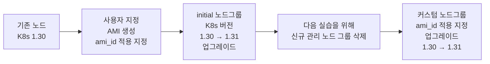

**사전 준비**: 사용자 지정 AMI를 사용하여 신규 관리 노드 그룹에 기본 AMI와 custom 노드그룹(ami_id 적용 지정) 업그레이드: 1.30 → 1.31

**[사전 준비] 카펜터 기본 정보 확인**:

```bash
# nodepool, ec2nodeclass 확인
kubectl get nodepool
kubectl get ec2nodeclass

# checkout 파드 10개 증설 → 카펜터 노드를 통해 신규 노드 프로비저닝 저장
# (이후 1.30 기준 노드는 삭제)
```

**[사전 준비] 셀프 노드그룹 정보 확인**:

```bash
# 셀프 노드그룹 정보
# 셀프 노드그룹에 ami 업데이트 후 적용을 확인하여 1.31 버전 EC2 생성되고, 이후 1.30 EC2는 삭제
```

**[사전 준비] 파게이트 노드 업그레이드**:

```bash
# 파게이트 노드를 통해 1.31 ami를 사용하는 신규 노드 배포되고, 1.30 기준 노드는 삭제
```

#### 1.2 Blue-Green 업그레이드

**Blue-Green approach for Managed node group update** (30분 소요): 1.30 → 1.31

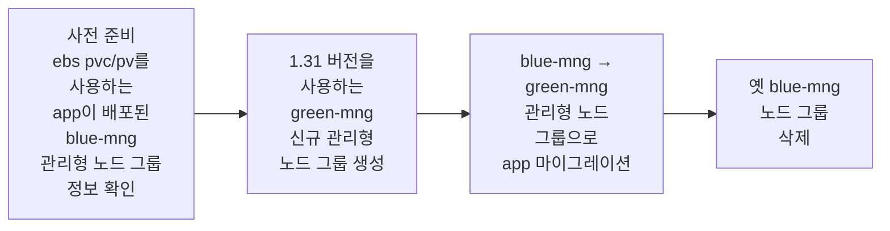

**[사전 준비] ebs pvc/pv를 사용하는 app이 배포된 blue-mng 관리형 노드 그룹 정보 확인**:

```bash
# blue-mng 노드 확인
kubectl get nodes -l eks.amazonaws.com/nodegroup=blue-mng
```

**1.31 버전을 사용하는 green-mng 신규 관리형 노드 그룹 생성**:

```bash
# Terraform으로 green-mng 생성
# (또는 eksctl로 생성 가능)
```

**blue-mng → green-mng 관리형 노드 그룹으로 app 마이그레이션**:

```bash
# blue-mng 노드 Cordon & Drain
kubectl drain $nodeName --ignore-daemonsets --force --delete-emptydir-data

# green-mng로 Pod 이동 확인
kubectl get pod -n orders -o wide
```

**옛 blue-mng 노드 그룹 삭제**:

```bash
# blue-mng 삭제
eksctl delete nodegroup --cluster $CLUSTER_NAME --name blue-mng
```

### 2. 카펜터 노드 (Karpenter)

**카펜터 노드 업그레이드**: 1.30 → 1.31

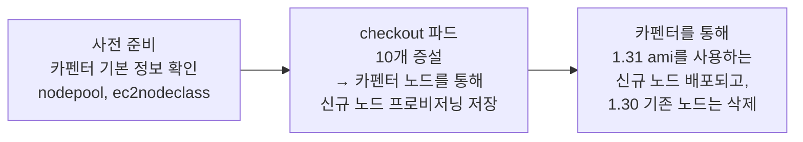

**카펜터 NodePool 업데이트**:

```bash
# 카펜터를 통해 1.31 ami를 사용하는 신규 노드 배포
# (자동으로 1.30 노드 삭제)
```

### 3. 셀프 노드그룹 (Self-managed)

**셀프 노드그룹 업그레이드**: 1.30 → 1.31

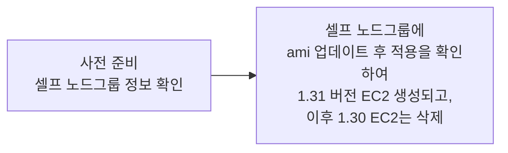

**ASG (Auto Scaling Group) Launch Template 업데이트**:

```bash
# Launch Template에서 AMI 업데이트 (1.31 버전)
# 이후 1.30 EC2는 종료되고, 1.31 EC2가 생성됨
```

### 4. 파게이트 프로파일 (Fargate)

**파게이트 노드 업그레이드**: 1.30 → 1.31

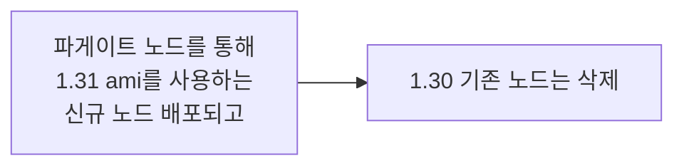

**파게이트 업그레이드**:

```bash
# 파게이트 프로파일은 Control Plane 업그레이드 후 자동으로 새 버전 사용
# Pod를 재시작하여 1.31 버전 적용
kubectl rollout restart deployment -n <namespace>
```

---

## 💡 핵심 개념 정리

### 1. EKS 업그레이드 순서

**전체 업그레이드 흐름**:

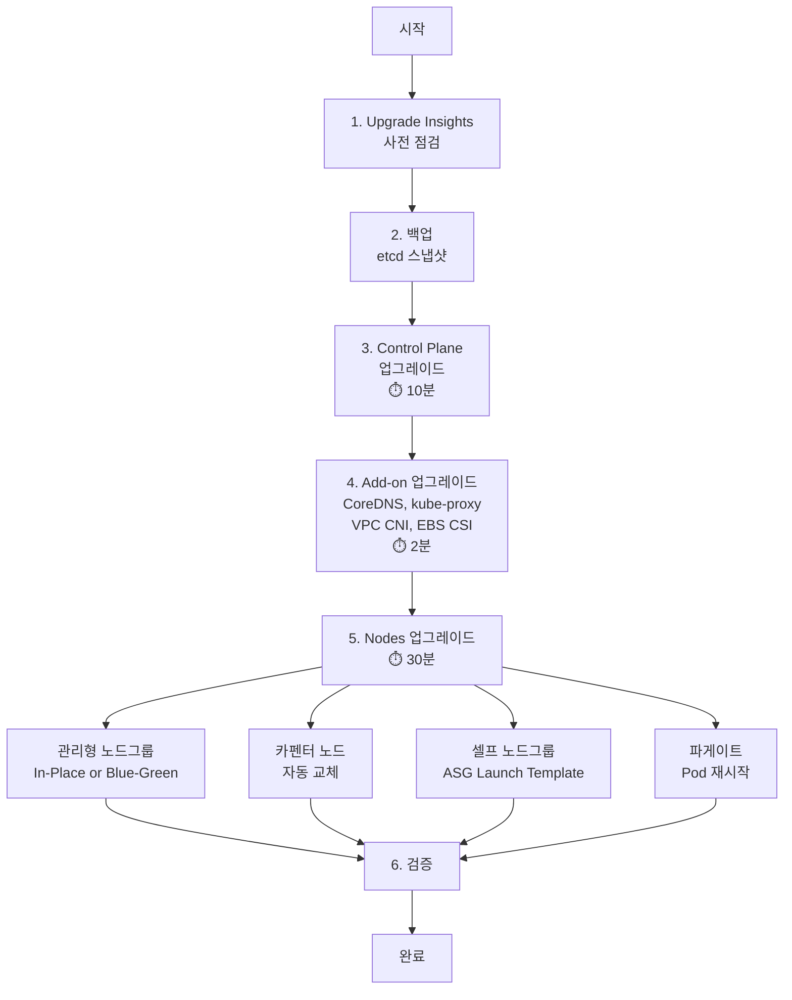

**⇒ 최종 모든 노드가 1.31 버전임을 확인**

### 2. In-Place vs Blue-Green

| 항목 | In-Place | Blue-Green |
|------|----------|------------|
| **업그레이드 방식** | 기존 노드 교체 (한 번에 1개씩) | 새 노드그룹 생성 후 마이그레이션 |
| **다운타임** | PDB로 최소화 | 없음 (병렬 실행) |
| **리소스 비용** | 기존 노드만 사용 | 2배 (일시적) |
| **롤백** | 어려움 | 쉬움 (이전 노드그룹 유지) |
| **적용 대상** | 일반 워크로드 | 중요 프로덕션 워크로드 |
| **PVC/PV** | 자동 이동 (EBS 재연결) | 수동 마이그레이션 필요 |

### 3. 업그레이드 Best Practices

**업그레이드 체크리스트**:

1. ✅ **Upgrade Insights 사전 점검** (kube-proxy, Add-on, Deprecated API 등)
2. ✅ **백업 생성** (etcd 스냅샷, PV 스냅샷)
3. ✅ **PDB 설정** (minAvailable로 가용성 보장)
4. ✅ **TopologySpreadConstraints 적용** (AZ 분산 배치)
5. ✅ **모니터링 도구 활성화** (kube-ops-view, CloudWatch)
6. ✅ **순차 업그레이드** (Control Plane → Add-on → Nodes)
7. ✅ **한 버전씩 업그레이드** (1.30 → 1.31, 두 버전 점프 불가)
8. ✅ **업그레이드 후 검증** (Pod 상태, 애플리케이션 헬스 체크)
9. ✅ **Terraform 사용 권장** (IaC로 재현 가능한 업그레이드)

**주의사항**:
- ⚠️ **업그레이드는 되돌릴 수 없음** (Rollback 불가)
- ⚠️ **Deprecated API 사전 확인 필수** (v1.32에서 제거되는 API)
- ⚠️ **Amazon Linux 노드는 2025년 11월 26일 지원 종료** (AL2023으로 마이그레이션)

---

## 🎓 Week 7 학습 정리

### 학습한 내용

**EKS Cluster Upgrades**:
1. ✅ EKS Upgrade Insights로 사전 점검 (6가지 항목)
2. ✅ Control Plane 업그레이드 (eksctl, AWS 콘솔, AWS CLI, Terraform)
3. ✅ Add-on 업그레이드 (CoreDNS, kube-proxy, VPC CNI, EBS CSI Driver)
4. ✅ 관리형 노드그룹 업그레이드 (In-Place vs Blue-Green)
5. ✅ 카펜터 노드 자동 업그레이드
6. ✅ 셀프 노드그룹 업그레이드 (ASG Launch Template)
7. ✅ 파게이트 프로파일 업그레이드 (Pod 재시작)
8. ✅ PodDisruptionBudgets(PDB)로 가용성 보장
9. ✅ TopologySpreadConstraints로 Pod 분산 배치
10. ✅ ArgoCD GitOps로 샘플 애플리케이션 배포

**HA 전략**:
1. ✅ PDB로 계획된 중단 시 최소 가용 Pod 수 보장
2. ✅ TopologySpreadConstraints로 AZ 분산 배치
3. ✅ kube-ops-view로 실시간 모니터링

### 실습 성과

**Control Plane 업그레이드**:
- Terraform을 사용하여 EKS 1.30 → 1.31 업그레이드 (10분 소요)
- Upgrade Insights로 사전 점검 완료

**Add-on 업그레이드**:
- CoreDNS, kube-proxy, VPC CNI, EBS CSI Driver 업그레이드 (2분 소요)

**Nodes 업그레이드**:
- 관리형 노드그룹 In-Place 업그레이드
- 관리형 노드그룹 Blue-Green 업그레이드 (30분 소요)
- 카펜터 노드 자동 업그레이드
- 셀프 노드그룹 ASG Launch Template 업데이트
- 파게이트 프로파일 Pod 재시작

**HA 전략 적용**:
- orders 애플리케이션에 PDB 설정 (minAvailable: 1)
- TopologySpreadConstraints로 Pod AZ 분산 배치

### 핵심 개념

**EKS 업그레이드의 핵심**:
- **순차 업그레이드**: Control Plane → Add-on → Nodes
- **한 버전씩**: 1.30 → 1.31 (두 버전 점프 불가)
- **되돌릴 수 없음**: 업그레이드 전 충분한 검증 필수
- **Terraform 권장**: IaC로 재현 가능한 업그레이드

**HA 전략의 핵심**:
- **PDB**: 최소 가용 Pod 수 보장 (계획된 중단 시)
- **TopologySpreadConstraints**: AZ 분산 배치 (장애 대응)
- **모니터링**: kube-ops-view, CloudWatch로 실시간 확인

### 마무리

**Week 7**에서는 EKS 클러스터를 안전하게 업그레이드하는 전략과 실습을 진행했습니다.

**핵심 요약**:
- **Upgrade Insights**로 사전 점검하여 잠재적 문제 파악
- **Control Plane → Add-on → Nodes** 순차 업그레이드
- **PDB + TopologySpreadConstraints**로 가용성 보장
- **Terraform**으로 재현 가능한 업그레이드 구현
- **In-Place vs Blue-Green** 전략 이해 및 실습

**실무 적용**:
- 프로덕션 EKS 클러스터 업그레이드 시 본 실습의 HA 전략 적용
- Terraform을 사용하여 업그레이드 자동화
- Upgrade Insights를 활용한 사전 점검 필수
- PDB와 TopologySpreadConstraints로 무중단 업그레이드 구현

---

**작성일**: 2026-04-29
**학습 주제**: EKS Cluster In-place Upgrades (1.30 → 1.31)
**실습 환경**: AWS EKS, us-west-2, Amazon Linux 2023, Terraform
