---
tags:
  - AI Datacenter Network
  - AI Infrastructure
  - InfiniBand
  - RDMA
  - RoCEv2
---

# AI 모델 생명주기와 RDMA 네트워크

> 훈련/추론/에이전틱 AI 단계와 메모리·네트워크 병목, 그리고 서버 간 GPU 통신을 떠받치는 RDMA(InfiniBand·RoCEv2) 네트워크를 정리한다.

## 개요

AI 시스템은 크게 세 단계로 이해할 수 있다. 훈련(Training)과 추론(Inference)은 모델 생명주기의 단계이고, 에이전틱 AI(Agentic AI)는 그 모델을 사용하는 애플리케이션 구조다.

- **AI 훈련(Training)**: 데이터로부터 모델의 가중치, 즉 "지능 자체"를 만드는 과정이다.

- **AI 추론(Inference)**: 학습이 끝난 모델에 입력을 넣어 예측이나 답변을 생성하는 과정이다. 한자 그대로 '근거를 미루어 헤아려(推) 결론을 이끌어 낸다(論)'는 의미다.

- **에이전틱 AI(Agentic AI)**: 추론 모델을 두뇌로 사용하면서 계획 → 도구 실행 → 결과 확인 → 재계획을 반복해 실제 목표를 완수하는 시스템 아키텍처다.

에이전틱 AI 내부에서는 보통 여러 번의 추론이 수행된다. 따라서 에이전트가 추론 호출 수·토큰 수·컨텍스트 상태를 폭발적으로 증가시키고, 이로 인해 HBM과 KV Cache, 네트워크, 스케줄링, 스토리지, 전력 등에서 병목이 발생한다.

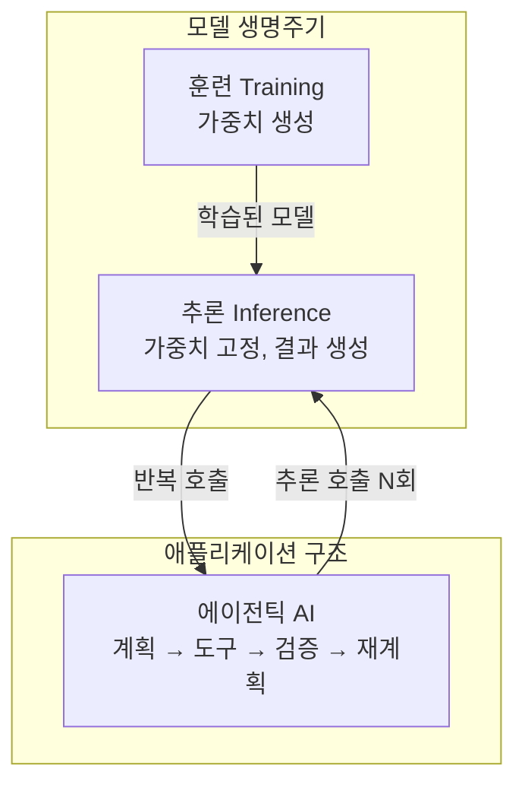

훈련은 모델의 능력을 만들고, 추론은 그 능력을 한 번 사용하며, 에이전틱 AI는 그 능력을 여러 번 사용하면서 도구와 시스템을 조작하여 실제 목표를 달성한다. 이 문서는 이 생명주기와 병목을 먼저 살펴본 뒤, 서버 간 GPU 통신을 가능하게 하는 RDMA 네트워크를 InfiniBand와 RoCEv2 순서로 정리한다.

## AI 모델 생명주기와 병목

### AI 인프라 흐름

#### 추론 워크로드의 확산

AI의 다음 물결은 하이퍼스케일 데이터센터의 추론이다. 훈련은 방대한 배치 데이터를 병렬로 처리하여 한 번만 수행되지만, 추론은 모든 요청마다 실행되므로 운영 비용의 대부분을 차지한다. 이 때문에 GPU 노드의 업무가 학습 중심에서 추론 중심으로 빠르게 확산되고 있다.

#### AI Fabric 진화

GPU 클러스터의 통신 패브릭은 단계적으로 확장되어 왔다.

- **Scale-Up**: NVLink, NVSwitch 인터커넥트 패브릭을 통해 노드 내부 GPU 간 속도/대역폭을 보장한다. GB200 NVL72 시스템은 노드 내부는 NVLink로, 노드 간은 랙의 Spine을 통해 NVLink Switch로 1hop 통신한다.

- **Scale-Out**: Rack 간 Leaf-Switch 네트워크 장비를 통한 RDMA(Remote Direct Memory Access) 통신이다. InfiniBand, RoCEv2, UEC 등이 사용된다.

- **Scale-Across**: Scale-Up과 Scale-Out을 넘어, 여러 클러스터·리전을 통합하는 방향이다.

> 메모리 장벽은 최대한 Scale-Up 시스템으로 해결하고, 더 큰 규모에서는 Scale-Out으로 확장하는 것이 기본 전략이다. 다만 병렬화가 불가능한 순차적 부분에 의해 전체 성능이 제한되는 암달의 법칙(Amdahl's Law)을 고려해야 한다.

#### 네오클라우드 vs 하이퍼스케일러

네오클라우드는 오로지 GPU 서비스에 특화된 전문 클라우드 기업, 즉 GPUaaS(GPU as a Service)를 제공한다. 네오클라우드가 하이퍼스케일러와의 경쟁에서 입지를 확보하는 가장 큰 무기는 가격 경쟁력이다. DGX H100 동급 인프라 기준으로 네오클라우드 평균 시간당 34달러, 하이퍼스케일러 평균 98달러로 약 65% 비용 절감이 가능하다.

| 구분 | 네오클라우드 | 하이퍼스케일러 |
|------|-------------|---------------|
| 서비스 모델 | 베어메탈 GPU 직접 접근, GPUaaS | 멀티 테넌트 IaaS/PaaS/SaaS |
| 제품(서비스) 라인업 | 수십 개 | 수백~수천 개 |
| 프로비저닝 | 높은 가용성(수 분 ~ 수십 분) | 대기 리스트(~ 수 주) |
| 과금 방식 | GPU 중심 단순 구조 | 복잡, 예측 어려움 |
| 컴플라이언스 | 대체로 미비 | 대체로 완비(FedRAMP 등) |

네오클라우드를 떠받치는 핵심 기술은 다음과 같다.

- **NVLink 도메인**: 노드/랙 내에서 초고속 GPU 간 데이터 전송을 지원한다. 낮은 지연 시간, 높은 처리량을 제공하며 PCIe 병목 없이 모델 병렬 학습과 집합 연산을 수행한다.

- **InfiniBand 대역**: RDMA 및 적응형 라우팅을 지원하는 무손실·저지연 패브릭이다. 대규모 분산 학습을 위한 SHARP(Scalable Hierarchical Aggregation and Reduction Protocol)를 제공한다.

- **RoCE(RDMA over Converged Ethernet)**: 이더넷에서 RDMA 성능을 끌어올려 InfiniBand 수준의 동작으로 하이브리드 및 멀티 클라우드 전반에 걸쳐 AI 네트워킹을 확장한다.

- **쿠버네티스**: 대부분의 네오클라우드는 사실상의 표준인 쿠버네티스를 기본 OS처럼 사용한다. 컨테이너화된 AI 모델을 쉽게 배포·관리하고 특정 클라우드에 종속되지 않는 이식성을 확보한다.

- **GPU 분할(GPU Fractioning) 및 동적 할당**: 고성능 GPU 하나를 다수 사용자가 나누어 쓰거나, 반대로 다수 GPU를 동적으로 묶어 쓰는 기술이다. 대표적으로 NVIDIA Run:ai가 있다.


### CPU vs GPU

AI 워크로드 연산에 CPU 대신 GPU를 쓰는 이유는 딥러닝의 핵심 연산이 대규모 병렬 행렬 연산이기 때문이다.

GPU 내부의 연산 코어(Compute Core) 처리 능력은 세대마다 기하급수적으로 증가해 왔다. 이 능력은 FLOPS(Floating-Point Operations Per Second), 즉 1초에 처리할 수 있는 부동소수점 연산 횟수로 측정한다.

- **행렬 곱셈 누산(MAC/GEMM)**: 딥러닝의 핵심은 행렬 곱셈 누산 처리다. 쉽게 말해 거대한 계산기다. GPU의 텐서 코어는 이 연산을 대규모로 병렬 처리하도록 설계됐다.

- **산술 강도(Arithmetic Intensity)**: 메모리에서 1byte를 가져왔을 때 그 데이터로 몇 번의 연산을 할 수 있는지 나타내는 효율성 지표다. 같은 데이터로 더 많은 연산을 할수록 효율이 높다.

트랜스포머(Transformer) 아키텍처 기반 거대 언어 모델의 어텐션(Attention) 메커니즘이 사실상 모든 메모리 문제의 시작점이다.


### 메모리 장벽

#### 데이터 기아

GPU 연산 코어는 충분히 빠른데, 정작 메모리에서 데이터를 가져오는 단계에서 병목이 발생한다. 이렇게 코어가 데이터를 받지 못해 굶주리는 상태를 '데이터 기아'라고 부른다.

근본 원인은 GPU 내부 메모리 계층 간 대역폭 차이다. GPU 내부의 SRAM은 HBM(High Bandwidth Memory)보다 훨씬 빠르다.

| 메모리 | 대역폭 | 특성 |
|--------|--------|------|
| SRAM (GPU 내부) | 약 19 TB/s | 매우 빠름, 용량 작음 |
| HBM (H100 기준) | 약 3.35 TB/s | 상대적으로 느림, 용량 큼 |

이처럼 빠른 연산기와 느린 메모리 사이의 전송 속도 차이로 성능이 저하되는 현상을 폰노이만 병목(Von Neumann Bottleneck)이라고 한다.

#### The Memory Wall

2026년 1월, 구글의 샤오위 마와 튜링상 수상자 데이비드 패터슨이 발표한 논문은 이 격차를 수치로 제시했다.

- GPU 연산 능력은 2012년부터 2022년까지 **80배** 증가했다.

- 같은 기간 메모리 대역폭은 **17배**만 증가했다.

- 80 ÷ 17 ≈ 4.7 이므로, 연산 성능과 메모리 공급 능력 사이의 상대적 불균형이 약 **4.7배** 확대됐다.

이 4.7배 격차를 "메모리 장벽(The Memory Wall)"이라고 부르며, 이 현상은 나아지기는커녕 계속 악화되고 있다. LLM 학습과 Prefill은 연산 성능이 중요하지만, 토큰을 한 개씩 만드는 Decode는 GPU FLOPS보다 메모리 대역폭과 인터커넥트 지연시간에 더 크게 제한된다.

#### Prefill과 Decode

LLM에 질문을 넣으면 모델은 두 가지 작업을 순서대로 수행한다. 입력을 이해하는 Prefill 단계와 응답을 만드는 Decode 단계다. 이 두 단계는 완전히 다른 병목 특성을 가진다.

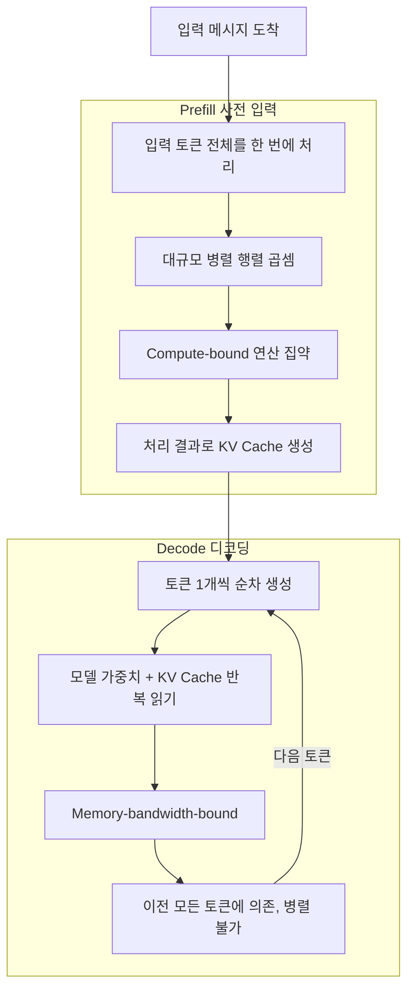

1만 개 토큰 프롬프트는 H100 GPU에서 200~400밀리초 만에 Prefill이 끝난다. 반면 Decode는 모든 단계에서 모델 가중치(FP16 기준 70B 모델은 약 140GB)와 KV Cache를 메모리에서 불러와 아주 간단한 연산을 한 뒤 다시 저장하는 과정을 반복한다. 이때 GPU 코어는 대부분 데이터를 기다리며 유휴 상태로 남는다.

이것이 모든 주요 API 제공업체에서 출력 토큰 가격이 입력 토큰 가격보다 3~10배 비싼 이유다. 입력 토큰은 빠르고 병렬적인 Prefill에서, 출력 토큰은 느리고 순차적인 Decode에서 처리되기 때문이다.

#### KV Cache 비용

LLM은 텍스트를 생성할 때 셀프 어텐션(Self-Attention)을 사용한다. 각 새로운 토큰은 이전의 모든 토큰을 참조하여 다음 토큰을 결정한다. 캐싱이 없다면 모든 생성 단계에서 이전 토큰의 키(Key)와 값(Value)을 다시 계산해야 하므로 비용이 제곱에 비례한다.

KV(Key-Value) Cache는 이전에 계산된 키·값 벡터를 저장해 재사용함으로써 이 문제를 해결한다. 각 토큰의 K와 V를 한 번만 계산해 저장하고 이후 단계에서 조회한다. 다만 절충점이 있다.

- 32,000개 토큰 컨텍스트를 처리하는 70B 모델은 140GB의 가중치 외에 KV Cache에만 약 8GB의 메모리가 추가로 필요하다.

- 배치 크기가 32일 경우 KV Cache만으로도 메모리 사용량이 모델 가중치를 초과할 수 있다.

- 토큰을 생성할 때마다 전체 KV Cache를 읽어야 하고, 캐시 크기는 컨텍스트 길이에 비례하여 증가한다.

따라서 대화가 길어질수록 토큰당 메모리 읽기 횟수가 늘고 대역폭 대기 시간이 길어져, 속도는 느려지고 비용은 증가한다.

#### 추론 비용의 4요소

추론 비용의 핵심은 단순 연산량이 아니라 메모리 이동 비용이다. 결국 추론 비용은 다음 네 요소가 크게 좌우한다.

```
모델 가중치 읽기 + KV Cache 읽기 + GPU 대기 시간 + 전력 소비
```

| 요소 | 설명 |
|------|------|
| 모델 가중치 읽기 | 모든 출력 토큰마다 수십억 개 숫자로 된 가중치를 메모리에서 전체 읽어야 한다 |
| KV Cache 읽기 | 대화에 포함된 모든 토큰 기록을 저장한 것으로, 대화가 길수록 토큰당 읽을 데이터가 늘어난다 |
| GPU 대기 시간 | 컴퓨팅 코어가 다음 데이터를 받기 위해 아무것도 못 하고 대기하는 유휴 시간이다 |
| 전력 소비 | 유휴 상태인 코어를 포함해 전체 하드웨어를 가동하는 전기 요금이다 |

네 요소 중 세 개(가중치 읽기·KV Cache 읽기·GPU 대기)는 결국 메모리가 GPU에 충분한 속도로 데이터를 공급하지 못하는 하나의 원인으로 수렴한다. 나머지 하나(전력)는 유휴 상태를 포함한 전기 요금이다. 추론 비용은 2022년 말 이후 약 280배 감소했지만, 여전히 AI 분야에서 가장 큰 비용 항목이다.


### 딥러닝과 트랜스포머

#### 신경망 기본 원리

신경망은 입력값에 가중치를 곱하고 더한 값이 역치(Threshold)를 넘으면 특정 결과를 출력하는 구조다. 예를 들어 키와 몸무게에 가중치를 곱해 더한 값이 역치를 넘으면 어른(1), 아니면 아이(0)로 판단하는 식이다.

처음 가중치는 랜덤이므로 잘못된 값이 나온다. 컴퓨터는 출력 오차가 사라질 때까지 가중치를 계속 변경하며 최적의 가중치를 찾는다. 최적의 가중치를 찾으면 이후부터는 어떤 데이터를 넣어도 분류가 가능하다.

신경 하나가 아니라 층을 더 깊게 쌓아 복잡한 데이터를 처리하는 것이 딥(Deep)러닝이다. 데이터는 입력층 → 은닉층 → 출력층으로 전파된다. 출력값에 오차가 생기면 출력에 가까운 가중치부터 거꾸로 수정하는데, 이것이 역전파(Backpropagation)다. 가중치 수정이 끝나면 다시 앞으로 전파해 계산하고, 오차가 생기면 또 뒤로 전파하는 과정을 반복한다.

딥러닝의 강점은 스스로 학습해 특징을 추출한다는 점이다. 예를 들어 숫자 인식에서 직선·곡선 인식 필터를 사용하면 1은 직선 출력값이, 2는 곡선 출력값이 높아진다. 추출된 특징을 배열해 결국 어떤 숫자인지 확률적으로 예측한다.

#### 트랜스포머 아키텍처

2017년 이전에는 언어를 순차적으로 처리했으나, 2017년 구글의 논문 "Attention Is All You Need"가 발표되면서 병렬 처리가 가능해졌다. 핵심은 어텐션(주의) 메커니즘으로, 각 단어가 주변 맥락에 따라 의미를 조절할 수 있게 해준다.

GPT-2 같은 모델은 임베딩, 트랜스포머 블록, 확률의 세 부분으로 구성된다.

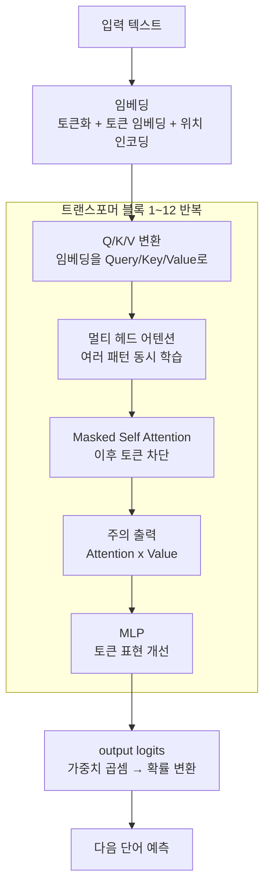

각 구성 요소의 역할은 다음과 같다.

- **임베딩(Embedding)**: 문장을 LLM이 이해할 수 있도록 의미와 맥락을 담은 숫자 벡터로 변환한다. 토큰화 후 토큰 임베딩과 위치 인코딩을 더한다.

- **셀프 어텐션 / Q, K, V**: 각 단어를 Query, Key, Value 벡터로 변환한 뒤, 단어들이 서로를 참조해 맥락을 반영한다. 예를 들어 같은 "눈"이라도 내리는 눈과 사람 눈을 맥락으로 구분한다.

- **멀티 헤드(Multi-Head)**: 여러 개의 헤드가 서로 다른 패턴(주의 관계)을 동시에 학습한다.

- **Masked Self Attention**: 다음 단어를 예측할 때 아직 등장하지 않은 미래 토큰을 참조하지 못하도록 가린다.

- **MLP(Multi-Layer Perceptron)**: 어텐션을 거친 토큰 표현을 개선하고 더 많은 언어 패턴을 저장한다.

- **output logits → 확률**: 마지막 출력 임베딩을 최종 계층의 학습된 가중치로 곱해 다음에 올 단어의 확률 분포로 변환한다.

여러 레이어를 거치면서 각 단어는 점점 더 맥락을 이해하고, 마지막 단계에서 전체 문맥을 반영한 벡터로 다음 단어의 확률 분포를 예측한다.


### 훈련 vs 추론 vs 에이전틱

훈련은 데이터를 이용해 가중치 자체를 학습·변경하는 과정이고, 추론은 가중치를 고정한 채 입력을 받아 결과를 생성하는 과정이다. 에이전틱 AI는 별도의 단계가 아니라 LLM 추론을 여러 번 호출하면서 계획·도구 사용·메모리·상태 관리·결과 검증을 반복하는 시스템 아키텍처다.

| 구분 | AI 훈련 | AI 추론 | 에이전틱 AI |
|------|---------|---------|------------|
| 핵심 목적 | 모델이 패턴을 학습 | 학습된 모델로 결과 생성 | 목표 달성을 위해 여러 행동 수행 |
| 모델 가중치 | 계속 변경됨 | 고정됨 | 고정된 모델을 반복 호출 |
| 기본 입력 | 학습 데이터셋 | 프롬프트, 이미지, 음성 등 | 목표, 상태, 도구 결과, 기억 |
| 기본 출력 | 모델 체크포인트 | 예측 또는 생성 토큰 | 실제 업무 결과와 변경된 환경 |
| 주요 연산 | Forward + Backward + Optimizer | Forward 중심 | 다수의 추론 + 도구 호출 |
| 처리 형태 | 대규모 배치 작업 | 요청 기반 온라인·배치 처리 | 상태를 가진 장시간 다단계 처리 |
| 주요 지표 | 학습 시간, 품질, MFU, Goodput | TTFT, TPOT, 처리량, 비용/토큰 | 성공률, 완료시간, 비용/결과, 도구 오류율 |
| 주요 자원 | GPU/TPU 연산, 네트워크 | HBM, KV Cache, 메모리 대역폭 | 추론 인프라 + DB/API/스토리지/보안 |
| 주요 위험 | 학습 실패, 데이터 문제 | 지연, 비용, 환각 | 연쇄 오류, 잘못된 행동, 권한 남용 |

#### Prefill과 Decode 특성

추론은 크게 Prefill과 Decode 단계로 나뉘며 자원 특성이 다르다.

| 단계 | 특성 |
|------|------|
| Prefill | 입력 프롬프트 전체를 처리, 대규모 행렬 연산이 많음, 상대적으로 Compute-bound, 긴 입력일수록 TTFT 증가, 처리 결과로 KV Cache 생성 |
| Decode | 토큰을 한 개씩 순차 생성, 이전 토큰 KV Cache를 계속 읽음, 작은 연산 반복 + 많은 메모리 접근, 상대적으로 Memory-bandwidth-bound, 출력 길이가 길수록 지연·비용 증가 |

#### 추론 핵심 지표

| 지표 | 설명 |
|------|------|
| TTFT (Time To First Token) | 첫 번째 토큰까지 걸리는 시간 |
| TPOT (Time Per Output Token) | 출력 토큰 한 개당 시간 |
| Tokens/sec | 초당 생성 토큰 수 |
| Requests/sec | 초당 처리 요청 수 |
| P95/P99 latency | 상위 지연 요청의 응답시간 |
| Cost per token | 토큰당 비용 |
| KV Cache hit ratio | KV Cache 적중률 |

KV Cache 크기는 대략 다음에 비례하여 증가한다.

```
KV Cache 크기 ∝ 배치 크기 × 레이어 수 × 컨텍스트 길이 × Hidden 크기
```

동시 사용자가 많거나 컨텍스트가 길어지면 GPU HBM이 빠르게 소진된다. vLLM의 PagedAttention은 운영체제의 페이지 방식처럼 KV Cache 메모리를 블록 단위로 관리하여 메모리 낭비를 줄이고 처리량을 높인다.

에이전틱 AI 시대의 핵심 지표는 단순한 Tokens/sec가 아니라 비용 대비 완료된 업무 수, 즉 Cost per Successful Outcome으로 이동하고 있다.


### 에이전틱 AI가 만드는 병목

에이전트는 추론 호출 수와 토큰 수, 컨텍스트 상태를 폭발적으로 증가시킨다. 그 결과 GPU 연산뿐 아니라 메모리·네트워크·스토리지·전력·보안이 동시에 병목이 된다.

| 병목 | 설명 |
|------|------|
| 추론 호출 폭발 | 단일 챗봇 요청은 보통 1회 호출이지만, 에이전트 요청은 `사용자 요청 수 × 단계 수 × 에이전트 수 × 분기 수 × 재시도 수 × 단계별 토큰 수`로 확장되어 한 업무에 수십 회 호출이 발생한다 |
| HBM과 KV Cache | 긴 시스템 프롬프트·대화 기록·반복 도구 결과로 KV Cache 사용량이 크다. 같은 Prefix를 재사용하는 Write Once, Read Many 패턴 때문에 캐시 위치를 추적해 동일 Prefix 요청을 해당 GPU로 보내는 캐시 인식 라우팅이 중요하다 |
| Prefill/Decode 자원 분리 | Prefill은 연산 중심, Decode는 메모리 대역폭 중심이라 한 GPU Pool에서 모두 처리하면 자원이 낭비된다. NVIDIA Dynamo는 Prefill/Decode 분리, 캐시 인식 라우팅, KV Cache 계층화를 제시하고, NIXL은 이기종 메모리·스토리지 간 데이터 이동을 추상화한다 |
| 네트워크가 추론의 일부 | 대규모 에이전틱 추론은 여러 GPU·노드에 걸쳐 실행된다. Tensor Parallel 통신, MoE Expert 간 All-to-All, Prefill→Decode KV Cache 전송, GPU→Host 오프로딩 등이 네트워크를 사용한다. 네트워크가 느리면 GPU는 통신을 기다리며 연산하지 못한다 |
| 스토리지 Hot Path 계층화 | 대화·장기 메모리, KV Cache 오프로딩, 도구 결과, 감사 로그, 벡터 검색에 스토리지가 계속 쓰인다. `GPU HBM → Host DRAM → Local NVMe → Distributed Storage` 계층화가 필요하며, 아래 계층으로 내릴수록 비용은 줄지만 다시 읽는 지연이 커져 배치 정책이 중요하다 |
| 지연 vs 사용률 충돌 | 부하 분산을 위해 빈 GPU로 보내고 싶은 목표와, 캐시 재사용을 위해 기존 KV Cache가 있는 GPU로 보내고 싶은 목표가 충돌한다. 이것이 에이전틱 추론 스케줄링의 대표적 난제다 |
| 전력과 냉각 | 유휴 상태 코어를 포함해 전체 하드웨어를 가동하는 전력과 냉각 비용이 누적된다 |
| 상태 서비스 장애 처리 | 에이전트는 상태를 가진 장시간 세션을 유지하므로, 세션·메모리·체크포인트 등 상태 서비스의 장애 처리와 복구가 어려워진다 |
| 평가/관측성 | 비결정적 다단계 실행을 검증·기록하려면 Evaluator/Critic과 Trace/Observability가 필요하다. 단순 정적 벤치마크로는 측정이 어렵다 |
| 보안/권한 | 도구 실행과 외부 시스템 조작이 늘면서 권한 남용·연쇄 오류 위험이 커진다. Policy/Guardrail과 Human Approval로 허용·금지 행동을 통제해야 한다 |

요청마다 입력 길이, 예상 출력 길이, 모델 크기, 캐시 적중 여부, 현재 대기열, 사용자별 SLO, 사용할 도구 수가 모두 다르다. 따라서 일반적인 쿠버네티스 CPU·메모리 기반 오토스케일링만으로는 충분하지 않다.


### 2조 파라미터 학습

#### 메모리 제약

거대 모델은 가중치를 담는 것부터 단일 GPU의 한계를 넘는다. 2조 파라미터 모델은 약 32TB의 메모리가 필요하며, 이는 80GB HBM을 가진 H100 GPU 약 400개에 해당한다. 따라서 하나의 모델을 여러 GPU에 나누어 올리는 병렬화가 필수다.

#### 5가지 병렬화

| 병렬화 | 분할 방식 |
|--------|----------|
| Data Parallelism | 여러 GPU가 서로 다른 데이터 배치를 처리 |
| Tensor Parallelism | 하나의 행렬 연산을 여러 GPU에 분할 |
| Pipeline Parallelism | 모델 레이어를 여러 GPU에 분할 |
| Expert Parallelism | MoE 모델의 Expert를 여러 GPU에 분산 |
| Context/Sequence Parallelism | 긴 시퀀스를 여러 장치에 분산 |

병렬화된 GPU들은 학습 결과를 공유·동기화해야 하며, 이때 Ring All-Reduce 방식으로 각 GPU의 그래디언트를 링 형태로 주고받으며 합산한다. 이 동기화 통신의 대역폭과 지연시간이 학습 속도를 좌우한다.

#### 하드웨어 장애

대규모 학습에서는 하드웨어 장애가 일상이다. Llama3 학습은 16,384개 GPU로 54일간 진행됐는데, 평균 약 3시간마다 장애가 발생했다. 전체 419건의 중단 중 사람이 직접 개입한 것은 3건뿐이고 나머지는 자동 복구됐다. 노드·NIC·가속기 장애는 피할 수 없으므로, 주기적으로 체크포인트를 저장해 장애 시 가까운 시점부터 재시작한다.

> 대규모 훈련에서는 네트워크 정지나 체크포인트 재시작으로 손실되는 1%의 시간이 실제로는 며칠의 학습 지연으로 이어질 수 있다. 그래서 실제 유효 연산 시간인 Goodput이 중요한 지표가 된다.

#### 훈련 전체 과정

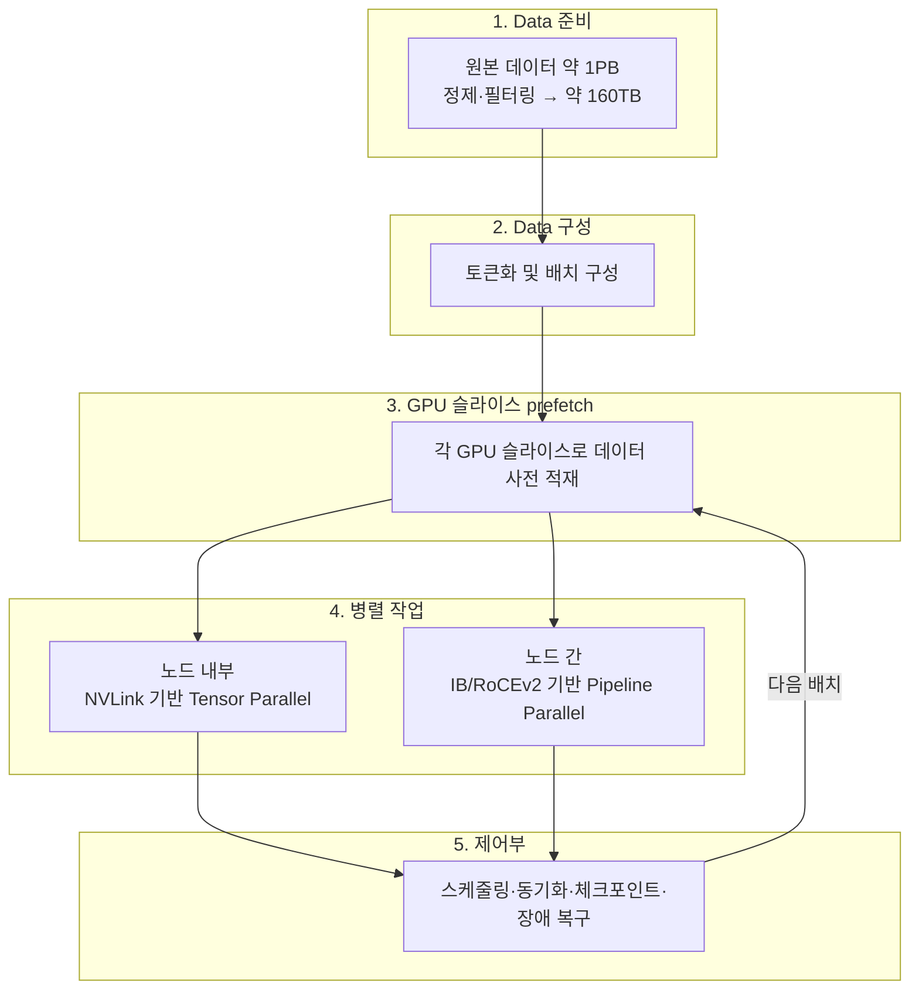

훈련 초기에는 GPU의 행렬 연산 성능이 중요하지만, 규모가 커질수록 GPU 간 All-Reduce·All-to-All 통신, 데이터셋 읽기·전처리, 체크포인트 저장 속도, 노드·NIC 장애, 전력·냉각이 더 중요해진다. 이때 노드 내부는 NVLink 기반 Tensor Parallel로, 노드 간은 InfiniBand/RoCEv2 기반 Pipeline Parallel로 통신을 분리한다. GB200 NVL72는 72개 GPU를 full 대역폭으로 묶어 노드 내부와 노드 간 통신 격차를 줄인다.

## InfiniBand & RDMA

### 개요

GPU 클러스터에서 데이터가 이동하는 경로는 통신 거리에 따라 성격이 완전히 다르다. 같은 서버 내부의 GPU끼리는 NVLink/NVSwitch 인터커넥트 페브릭으로 직결되어 수백 GB/s 대역폭과 수 ns 지연으로 통신한다. 반면 서버와 서버 사이는 랙 간 Leaf-Switch 같은 네트워크 장비를 거쳐야 하므로, 이 구간이 분산 학습의 병목이 된다.

| 구분 | 서버 내(Scale-Up) | 서버 간(Scale-Out) |
|------|-------------------|--------------------|
| 경로 | NVLink, NVSwitch 직결 | Leaf-Switch 등 네트워크 장비 |
| 통신 기술 | NVLink 페브릭 | RDMA over IB / RoCEv2 / UEC |
| 특성 | 초저지연, 초고대역폭 | CPU 개입 최소화가 관건 |

서버 간 통신에서 일반 네트워크 스택을 그대로 쓰면 CPU와 커널을 여러 번 거치며 데이터가 반복 복사된다. 각 GPU가 학습 결과를 서로 공유하고 동기화해야 하는 분산 학습에서는 이 오버헤드가 전체 성능을 좌우한다. RDMA(Remote Direct Memory Access)는 이 경로에서 CPU 개입을 제거해 원격 서버의 메모리에 직접 접근한다.

NVLink/NVSwitch/InfiniBand 하드웨어 세대별 스펙은 [GPU 인터커넥트](../gpu/infiniband-nvlink-nvswitch.md) 문서에서 다룬다. 이 문서는 RDMA의 동작 원리와 NCCL 집합 통신, 그리고 실제 데이터 경로에 집중한다.

### RDMA란

RDMA를 이해하려면 먼저 일반 Linux 프로세스가 데이터를 다루는 과정과 비교해야 한다.

**일반 Linux 프로세스**:

- CPU가 명령을 실행하며 데이터는 주로 Disk → RAM → CPU Cache/Register 순서로 이동한다.

- 파일을 읽는 과정에는 OS 커널과 Page Cache가 개입한다.

- 데이터 이동마다 CPU와 커널이 관여하므로 복사 횟수와 컨텍스트 전환이 누적된다.

**DMA(Direct Memory Access) 사용**:

- CPU가 데이터를 한 바이트씩 복사하지 않는다.

- CPU는 DMA 장치에 "어디에서 어디로 옮길지"만 지시한다.

- 실제 데이터 이동은 디스크 컨트롤러, NIC, GPU DMA 엔진이 수행한다.

DMA는 데이터 이동 주체를 CPU에서 전용 엔진으로 옮긴다. RDMA는 여기서 한 걸음 더 나아가, 이 직접 접근을 원격 서버까지 확장한다.

**RDMA**:

- 일반 네트워크에서는 데이터가 CPU와 커널을 여러 번 거친다.

- RDMA는 RNIC(RDMA-capable NIC)가 원격 서버의 등록된 메모리에 직접 데이터를 읽거나 쓴다.

- 송신 측 CPU는 전송을 지시할 뿐 데이터 자체를 만지지 않고, 수신 측 CPU와 커널은 데이터 경로에서 완전히 빠진다.

RDMA가 빠른 이유는 세 가지 개념으로 정리된다.

| 개념 | 의미 |
|------|------|
| OS Bypass | 데이터 전송 시 OS 커널을 거치지 않고 유저 공간에서 직접 RNIC에 작업을 등록한다 |
| Kernel Bypass | 커널의 네트워크 스택(소켓, 프로토콜 처리)을 우회해 컨텍스트 전환과 인터럽트 오버헤드를 제거한다 |
| Zero-copy | 커널 버퍼로의 중간 복사 없이 애플리케이션이 등록한 메모리에서 직접 송수신한다 |

아래 다이어그램은 CPU 기반 통신과 RDMA 기반 통신의 경로 차이를 보여준다.

```mermaid
graph TB
    subgraph "CPU 기반 통신"
        A1[App 메모리] --> A2[커널 소켓 버퍼]
        A2 --> A3[CPU + 네트워크 스택]
        A3 --> A4[NIC]
        A4 --> A5[Network]
        A5 --> A6[NIC]
        A6 --> A7[CPU + 네트워크 스택]
        A7 --> A8[커널 소켓 버퍼]
        A8 --> A9[원격 App 메모리]
    end

    subgraph "RDMA 기반 통신"
        B1[App 등록 메모리] --> B2[RNIC]
        B2 --> B3[Network]
        B3 --> B4[RNIC]
        B4 --> B5[원격 App 등록 메모리]
    end
```

### GPUDirect RDMA

RDMA가 원격 메모리에 직접 접근한다면, 그 메모리가 GPU의 VRAM이 되면 어떻게 될까. GPUDirect RDMA는 RNIC가 host RAM을 거치지 않고 GPU VRAM을 직접 read/write 하도록 해, GPU VRAM ↔ RNIC ↔ Network ↔ RNIC ↔ GPU VRAM 경로를 만든다.

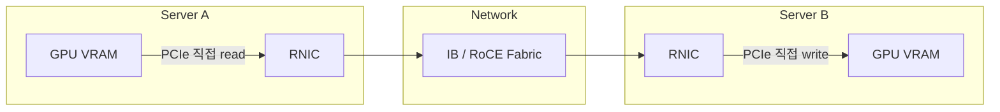

GPUDirect RDMA가 가능하려면 NIC와 GPU가 토폴로지상 충분히 가까워야 한다. NCCL은 둘이 같은 PCIe switch 아래(또는 그 안의 multiple bridge, 기본 임계값 `PATH_PXB`)에 있을 때 GPUDirect RDMA를 활성화한다. 이 게이트는 `ncclTopoCheckGdr`(`src/graph/paths.cc`)가 판정하며, `NCCL_NET_GDR_LEVEL` 환경변수로 override 할 수 있다.

조건을 만족하면 중간 버퍼가 GPU VRAM에 그대로 올라가고 NIC가 GPU 메모리를 직접 read/write 한다. 조건을 만족하지 못하면 host pinned memory를 거치는 staging이 필요하다.

| 구분 | GPUDirect RDMA 가능 | 불가능 (host staging) |
|------|---------------------|------------------------|
| 중간 버퍼 위치 | GPU VRAM | host pinned memory |
| 데이터 경로 | GPU VRAM → RNIC → Network → RNIC → GPU VRAM | GPU → host copy → NIC RDMA → 반대편 host → GPU copy |
| PCIe 통과 | 최소 | 양쪽에서 PCIe를 두 번 더 건넘 |

host staging 경로는 GPU와 host RAM 사이 복사가 송신·수신 양쪽에 추가되므로, PCIe를 두 번 더 건너는 만큼 지연과 대역폭 손실이 발생한다.

### InfiniBand

InfiniBand는 RDMA를 1급 시민으로 설계한 fabric이다. 서버에는 HCA(Host Channel Adapter)가 장착되는데, 이는 RDMA 엔진을 내장한 RNIC로서 전송·수신 작업을 CPU 대신 처리한다.

InfiniBand fabric의 핵심 특성은 다음과 같다.

- **무손실(lossless)**: 링크 레벨 흐름 제어로 패킷 드롭 없이 전송해, 손실·재전송으로 인한 지터를 제거한다.

- **저지연**: 전용 전송 프로토콜과 하드웨어 오프로드로 마이크로초 수준 지연을 유지한다.

- **RDMA 엔진 내장**: HCA가 OS Bypass / Zero-copy 경로를 하드웨어로 지원한다.

InfiniBand는 SHARP(Scalable Hierarchical Aggregation and Reduction Protocol)도 지원한다. 이는 스위치 내부에서 reduce 연산을 수행해 집합 통신의 일부를 네트워크가 직접 처리하도록 하는 in-network computing 기능이다.

이더넷 기반 RDMA인 RoCEv2(RDMA over Converged Ethernet v2)는 별도 문서에서 다룬다. NDR 400Gbps 같은 하드웨어 세대별 스펙은 [GPU 인터커넥트](../gpu/infiniband-nvlink-nvswitch.md) 문서를 참조한다.

### NCCL과 집합 통신

NCCL(NVIDIA Collective Communications Library)은 GPU 간 집합 통신(collective communication)을 구현한 라이브러리로, 위에서 본 NVLink·PCIe·SHM·RDMA 경로를 추상화해 AllReduce 같은 연산을 제공한다. 분산 학습 프레임워크는 NCCL을 통해 GPU들의 gradient와 parameter를 주고받는다.

집합 통신은 기본 4패턴의 조합으로 구성된다.

| 패턴 | 방향 | 데이터 형태 | 대표 용도 |
|------|------|------------|-----------|
| Broadcast | root → all | 같은 값 복제 | 초기 weight/buffer 동기화 |
| Scatter | root → all | 서로 다른 chunk | 배치/파티션 분배 |
| Gather | all → root | concat | 결과 수집 |
| Reduce | all → root | element-wise op (sum/max/…) | loss/gradient 집계 |

이 넷을 조합하면 실제로 자주 쓰는 collective가 만들어진다.

- **AllGather** = Gather + Broadcast. all ranks의 chunk를 all ranks가 갖는다.

- **AllReduce** = Reduce + Broadcast. reduce 결과를 all ranks에 전달한다. Reduce + Broadcast로 짜도 되고 ReduceScatter + AllGather로 짜도 되는데, 후자가 MPICH/NCCL의 Rabenseifner / Ring 방식이다. 같은 의미라도 구현 방식에 따라 성능이 갈린다.

- **ReduceScatter** = Reduce + Scatter. 합친 뒤 rank별 chunk로 배포한다.

- **AllToAll** = 각 rank가 각각 다른 대상에게 각각 다른 데이터를 보내는 Scatter × N의 전치 버전이다.

NCCL이 제공하는 Collective 8종과 ML 용도는 다음과 같다.

| 이름 | 의미 | ML 용도 |
|------|------|---------|
| ncclAllReduce | all ranks의 값을 element-wise reduce, all ranks가 결과 | DDP gradient sync |
| ncclBroadcast | root 값을 all ranks에 복제 | init param sync |
| ncclReduce | all ranks의 값을 reduce, root만 결과 | norm 집계 |
| ncclAllGather | 각자의 chunk를 all ranks가 concat | ZeRO-3 / FSDP param |
| ncclReduceScatter | reduce 후 rank별 chunk로 분배 | FSDP gradient |
| ncclGather | all ranks의 chunk를 root에 concat | 결과 취합 |
| ncclScatter | root의 chunk를 rank별로 배포 | 배치 분배 |
| ncclAlltoAll | 각 rank가 각 rank에게 chunk 교환 | MoE token dispatch |

아래 다이어그램은 가장 널리 쓰이는 AllReduce를 Ring 방식(ReduceScatter + AllGather)으로 분해한 흐름이다.

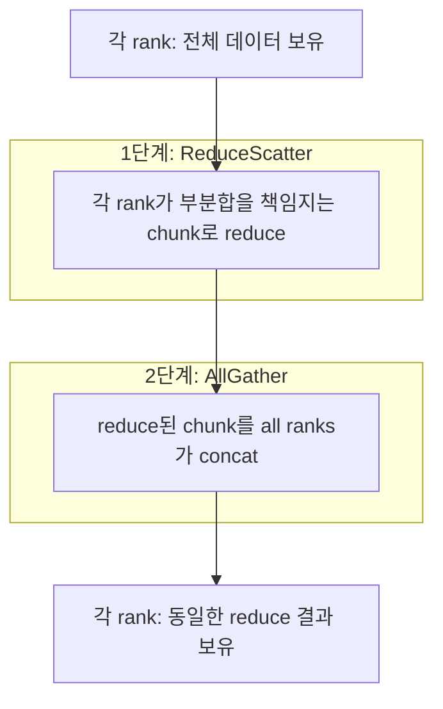

### Intra-node vs Inter-node 데이터 경로

NCCL은 통신하는 두 GPU의 위치에 따라 transport를 다르게 고른다. 같은 노드 안인지, 노드 사이인지에 따라 경로가 완전히 달라진다.

#### Intra-node (같은 노드 안의 GPU 사이)

NCCL은 다음 우선순위로 경로를 선택한다.

| 우선순위 | 경로 | 조건 |
|---------|------|------|
| 1 | P2P over NVLink | NVLink 직결 |
| 2 | P2P over PCIe | NVLink 없을 때 |
| 3 | SHM (host memory 경유) | P2P 불가능하거나 inter-socket P2P가 비효율적일 때 |
| 4 | NIC loopback | multi-socket + GPU마다 local NIC, GPUDirect RDMA 가능 |

같은 process 안의 rank끼리는 `P2P_DIRECT`가 활성화되어 staging FIFO를 우회한다. SHM transport(Shared Memory)는 같은 노드 안에서도 두 GPU가 직접 P2P 하지 못할 때(서로 다른 PCIe root complex / NUMA socket 등) host RAM을 공유 버퍼로 두고 만나는 fallback이다. GPU A가 host pinned memory에 write하고 GPU B가 같은 영역에서 read하는 방식이라, 네트워크는 타지 않으므로 inter-node보다 빠르지만 GPU 직접 P2P보다는 느리다.

#### Inter-node (노드 사이)

노드를 넘는 통신은 CPU proxy thread가 NIC 작업을 orchestration 한다.

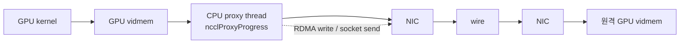

GPU kernel이 buffer를 채우면 CPU의 `ncclProxyProgress` thread(`src/proxy.cc`)가 NIC의 RDMA write 또는 socket send를 post 한다. CPU가 데이터 자체를 만지지는 않지만 NIC 작업 orchestration은 host thread의 일이다. NCCL은 proxy를 두 thread로 분리해 두는데, 역할이 다르다.

| 구분 | thread | 역할 |
|------|--------|------|
| Control plane | ncclProxyService | setup / connect 같은 제어 메시지 처리 |
| Data progress | ncclProxyProgress | 실제 데이터 전송 진행 |

GPUDirect RDMA가 가능하면 intermediate buffer가 GPU vidmem에 올라가고 NIC가 GPU memory를 직접 read/write 한다. 불가능하면 host pinned memory에 staging 한다(GPU → host copy → NIC RDMA → 반대편 host → GPU copy). 어느 경로든 실제 데이터 전송 앞에는 양쪽이 buffer readiness를 합의하는 rendezvous가 깔린다.

## RoCEv2

### 개요

AI 데이터센터에서 GPU 노드 간 Scale-Out 통신은 RDMA(Remote Direct Memory Access)를 통해 이루어진다. CPU 개입 없이 원격 노드의 메모리에 직접 접근하므로 분산 학습의 동기화 구간에서 지연 시간과 대역폭이 결정적이다. RDMA 동작 자체는 별도 문서에서 다루며, 이 문서는 RDMA를 **이더넷 위에서** 실현하는 방식에 집중한다.

Scale-Out RDMA를 구현하는 패브릭 옵션은 크게 세 가지다.

- **InfiniBand(IB)**: RDMA 전용 패브릭. 무손실과 저지연이 내장되어 있으나 전용 스위치/HCA와 별도 운영 체계를 요구한다.

- **RoCEv2(RDMA over Converged Ethernet v2)**: 표준 이더넷 위에서 RDMA를 구현한다. 기존 이더넷 인프라와 운영 경험을 재사용할 수 있다.

- **UEC(Ultra Ethernet Consortium)**: AI/HPC 워크로드를 겨냥해 이더넷을 개선하려는 차세대 표준 흐름.

InfiniBand 대신 이더넷 위에서 RDMA를 구현하려는 동기는 명확하다. 데이터센터 운영자는 이미 이더넷 기반 스위칭, 모니터링, 자동화 도구와 운영 인력을 보유하고 있다. 전용 패브릭 도입 비용과 학습 곡선을 피하면서, 동일한 L3 라우팅 인프라로 하이브리드/멀티 클라우드 전반에 RDMA를 확장할 수 있다는 점이 RoCEv2의 핵심 가치다.

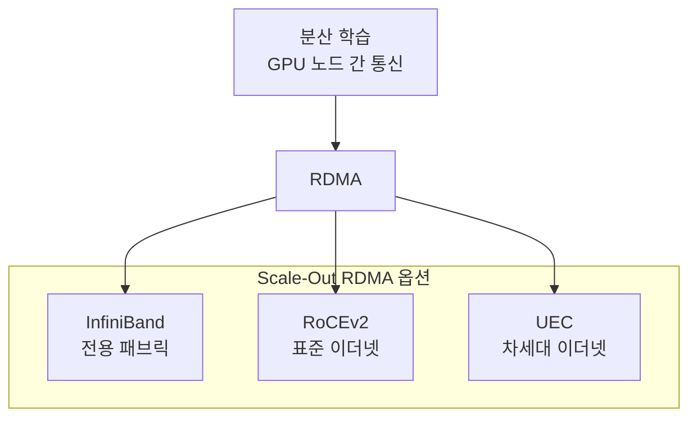

### RoCE란

RoCE는 RDMA over Converged Ethernet의 약자로, 이더넷 위에서 RDMA 성능을 제공해 InfiniBand 수준의 동작을 구현하는 기술이다. 핵심 아이디어는 RDMA 통신을 담당하는 **InfiniBand의 transport 계층을 그대로 이더넷 위에 올리는 것**이다.

InfiniBand는 자체 링크/네트워크/transport 계층을 가진 독립 스택이다. RoCE는 이 스택 중 transport 계층(BTH 기반 큐 페어, 신뢰성 연결 등)을 재사용하고, 하위 전송 경로만 이더넷으로 교체한다. 따라서 애플리케이션은 동일한 RDMA verbs API를 사용하며, 전송 매체가 InfiniBand인지 이더넷인지에 무관하게 동작한다.

"Converged"는 데이터센터 브리징(DCB) 기술로 스토리지/RDMA/일반 트래픽을 하나의 이더넷 패브릭에 수렴(converge)시킨다는 의미에서 붙었다.

### RoCE v1 vs RoCEv2

RoCE는 캡슐화 계층에 따라 두 버전으로 나뉜다.

| 구분 | RoCE v1 | RoCEv2 |
|------|---------|--------|
| 캡슐화 계층 | L2 (이더넷 위 InfiniBand 네트워크 계층) | L3/L4 (UDP 위) |
| 식별자 | Ethertype `0x8915` | UDP 목적지 포트 `4791` |
| 라우팅 | 불가 (같은 브로드캐스트 도메인 내) | 가능 (IP routable) |
| 확장 범위 | 단일 L2 서브넷 | 멀티 서브넷 / 멀티 라우터 |
| IP 헤더 | 없음 | 있음 (IPv4/IPv6) |

RoCE v1은 InfiniBand 네트워크 계층을 이더넷 프레임에 직접 실어 Ethertype `0x8915`로 식별한다. IP 헤더가 없으므로 라우터를 넘지 못하고 동일 브로드캐스트 도메인 안에서만 통신한다.

RoCEv2는 RDMA 페이로드를 UDP/IP로 캡슐화하고 목적지 포트 `4791`을 사용한다. IP 헤더가 존재하므로 일반 IP 라우터를 통해 서브넷을 넘어 라우팅된다. 대규모 데이터센터는 L3 Leaf-Spine 토폴로지로 구성되므로, IP 라우팅이 가능한 RoCEv2가 사실상의 표준으로 자리잡았다. 이후 "RoCE"는 일반적으로 RoCEv2를 가리킨다.

### 패킷 구조

RoCEv2 패킷은 기존 이더넷/IP/UDP 헤더 안에 InfiniBand transport 헤더와 RDMA 페이로드를 캡슐화한다. UDP 목적지 포트 `4791`이 해당 패킷을 RoCEv2 트래픽으로 식별하는 표지다.

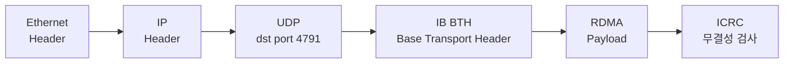

각 헤더의 역할은 다음과 같다.

| 필드 | 역할 |
|------|------|
| Ethernet Header | L2 전송. 우선순위 표시를 위한 802.1Q 태그 포함 가능 |
| IP Header | L3 라우팅. 서브넷 간 전달과 ECN 표시에 사용 |
| UDP (port 4791) | RoCEv2 식별. 출발지 포트는 ECMP 해싱 엔트로피로 활용 |
| IB BTH | InfiniBand transport 정보 (큐 페어, opcode, 시퀀스 번호) |
| RDMA Payload | 실제 전송 데이터 |
| ICRC | 종단 간 무결성을 검증하는 InfiniBand CRC |

UDP 출발지 포트를 흐름별로 다르게 설정하면 스위치의 ECMP(Equal-Cost Multi-Path) 해싱이 여러 경로로 트래픽을 분산할 수 있다.

### 무손실 이더넷(Lossless Ethernet)

RDMA transport는 본래 손실이 거의 없는 InfiniBand 패브릭을 전제로 설계되었다. 일반 이더넷은 혼잡 시 패킷을 폐기하며, RDMA는 패킷 손실에 매우 취약해 손실이 발생하면 재전송 비용과 성능 저하가 급격히 커진다. 따라서 RoCEv2는 **무손실에 가까운 이더넷**을 요구하며, 이를 위해 다음 메커니즘을 사용한다.

#### PFC (Priority Flow Control)

PFC는 IEEE 802.1Qbb 표준으로, 우선순위 큐(traffic class)별로 PAUSE 프레임을 보내 송신을 일시 중단시킨다. 수신측 버퍼가 오버플로에 도달하기 직전에 상류 장비에게 "해당 우선순위 트래픽을 잠시 멈추라"고 알려 패킷 폐기를 방지한다.

PFC는 무손실을 보장하지만 부작용도 명확하다.

- **Head-of-Line Blocking**: PAUSE는 우선순위 큐 단위로 동작하므로, 한 흐름의 혼잡이 같은 큐를 공유하는 다른 흐름까지 멈추게 한다.

- **PFC Deadlock**: 순환 의존성을 가진 PAUSE가 서로를 기다리며 패브릭 전체가 정지하는 교착 상태가 발생할 수 있다.

이 때문에 PFC 단독 사용은 권장되지 않으며, 종단 간 혼잡 제어와 결합해 PFC를 최후의 안전장치로만 작동시키는 설계가 일반적이다.

#### ECN (Explicit Congestion Notification)

ECN은 혼잡이 발생했을 때 패킷을 폐기하는 대신 IP 헤더의 ECN 비트에 혼잡을 표시하는 방식이다. 스위치 큐가 임계치를 넘으면 통과하는 패킷에 혼잡 표시(CE)를 찍고, 이를 수신한 종단이 송신측에 통보한다. 송신측은 폐기 없이 전송 속도를 조절할 수 있다.

#### DCQCN (Data Center Quantized Congestion Notification)

DCQCN은 PFC와 ECN을 결합한 RoCEv2의 대표 혼잡 제어 알고리즘이다. ECN으로 혼잡을 조기에 감지해 송신 속도를 점진적으로 낮추고, PFC는 버퍼 오버플로 직전의 최후 방어선으로만 동작하게 한다. ECN 기반 종단 간 제어가 주된 흐름을 담당하므로 PFC PAUSE 발동 빈도가 줄어들고, Head-of-Line Blocking과 Deadlock 위험을 완화한다.

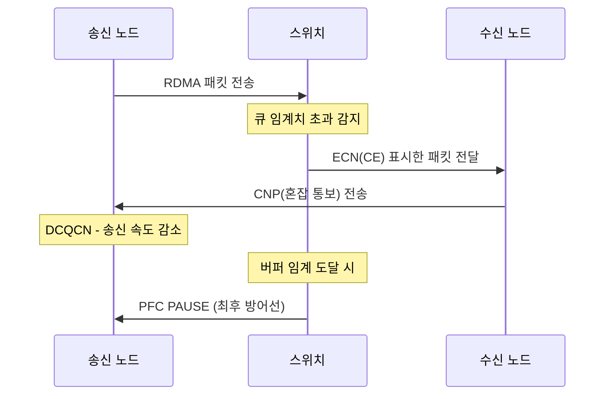

### InfiniBand vs RoCEv2

두 방식 모두 RDMA를 제공하지만 전송 매체와 무손실 구현 방식, 운영 특성이 다르다.

| 구분 | InfiniBand | RoCEv2 |
|------|-----------|--------|
| 전송 매체 | 전용 IB 패브릭 | 표준 이더넷 |
| 라우팅 | IB 서브넷 관리자(SM) 기반 | IP 라우팅 (L3) |
| 무손실 방식 | Credit-based flow control 내장 | PFC/ECN/DCQCN 별도 구성 필요 |
| 스위치 장비 | 전용 IB 스위치/HCA | 범용 이더넷 스위치/NIC |
| 운영 난이도 | 별도 운영 체계 학습 필요 | 기존 이더넷 운영 경험 재사용 |
| 생태계 | NVIDIA 중심 | 다수 벤더 / 개방형 |
| 비용 | 상대적으로 높음 | 기존 인프라 재사용으로 절감 |
| 대표 사용처 | 초대규모 HPC/AI 전용 클러스터 | 하이브리드/멀티 클라우드, 범용 데이터센터 |

InfiniBand는 무손실과 저지연이 링크 계층에 credit-based flow control로 내장되어 별도 튜닝 없이 안정적인 RDMA를 제공한다. 그 대가로 전용 장비와 별도 운영 체계가 필요하다.

RoCEv2는 범용 이더넷을 재사용하므로 도입과 확장이 유연하지만, 무손실을 위해 PFC/ECN/DCQCN을 정밀하게 구성하고 튜닝해야 한다. 잘못 설정하면 Head-of-Line Blocking이나 Deadlock으로 성능이 크게 흔들린다. 어느 쪽이 우월한 것이 아니라 운영 역량, 규모, 비용, 기존 인프라에 따른 트레이드오프다.

### UEC (Ultra Ethernet Consortium)

UEC는 AI/HPC 워크로드를 위한 차세대 이더넷 표준을 정의하는 컨소시엄이다. RoCEv2는 엄격한 무손실(PFC)을 전제로 하고 DCQCN 기반 혼잡 제어가 대규모 인캐스트(incast) 상황에서 한계를 보이는데, UEC는 이런 제약을 개선하는 것을 목표로 한다.

UEC는 손실을 허용하는 전송, 다중 경로 활용, 향상된 혼잡 제어와 같은 방향으로 이더넷을 AI 패브릭에 맞게 확장하려 한다. RoCEv2의 운영 경험과 이더넷 생태계를 계승하면서 대규모 AI 클러스터의 요구를 충족하려는 흐름으로 이해하면 충분하다.

## 마무리

- AI 시스템은 가중치를 만드는 훈련, 능력을 한 번 쓰는 추론, 능력을 여러 번 쓰며 목표를 완수하는 에이전틱 AI로 구성되며, 성능을 좌우하는 것은 연산 능력보다 메모리와 네트워크다.

- 연산 능력은 80배 늘었지만 메모리 대역폭은 17배만 늘어 약 4.7배의 메모리 장벽이 생겼고, 추론 비용은 모델 가중치 읽기·KV Cache 읽기·GPU 대기 시간·전력이 좌우한다.

- 에이전틱 AI는 추론 호출과 토큰을 폭발적으로 늘려 HBM·KV Cache·네트워크·스토리지·전력·보안을 동시에 병목으로 만든다.

- 서버 간 GPU 통신은 RDMA로 CPU 개입을 제거하며, GPUDirect RDMA가 이를 GPU VRAM까지 확장한다. NCCL이 집합 통신을, Intra/Inter-node 경로가 실제 데이터 전송을 담당한다.

- RDMA 패브릭은 무손실이 내장된 전용 InfiniBand와 범용 이더넷에 PFC/ECN/DCQCN을 결합한 RoCEv2로 나뉘며, UEC가 차세대 흐름이다. 규모·운영 역량·비용에 따른 트레이드오프다.

## 참고

- [Why is inference slow and expensive? - The AI Engineer](https://theaiengineer.substack.com/p/why-is-inference-slow-and-expensive)
- [Why does AI need a GPU? - The AI Engineer](https://theaiengineer.substack.com/p/why-does-ai-need-a-gpu)
- [What is a GPU? - The AI Engineer](https://theaiengineer.substack.com/p/what-is-a-gpu)
- [Attention Is All You Need - arXiv](https://arxiv.org/abs/1706.03762)
- [Transformer Explainer: Interactive Learning of Text-Generative Models - arXiv](https://arxiv.org/abs/2408.04619)
- [Transformer Explainer (Interactive Site)](https://poloclub.github.io/transformer-explainer/)
- [HBM - 나무위키](https://namu.wiki/w/HBM)
- [Efficient Memory Management for LLM Serving with PagedAttention (vLLM) - arXiv](https://arxiv.org/abs/2309.06180)
- [NVIDIA NCCL Documentation](https://docs.nvidia.com/deeplearning/nccl/user-guide/docs/index.html)
- [NVIDIA NCCL User Guide - Collective Operations](https://docs.nvidia.com/deeplearning/nccl/user-guide/docs/usage/collectives.html)
- [Network Engineers' Introductory Guide to NCCL](https://www.juniper.net/documentation/us/en/software/nce/network-engineers-guide-nccl/)
- What AI training parallelism actually means for your network fabric - APNIC Blog
- [NVIDIA GPUDirect RDMA](https://docs.nvidia.com/cuda/gpudirect-rdma/index.html)
- RFC 768 - User Datagram Protocol (UDP)
- IEEE 802.1Qbb - Priority-based Flow Control (PFC)
- IEEE 802.1Qaz - Enhanced Transmission Selection (ETS) / Data Center Bridging
- RFC 3168 - The Addition of Explicit Congestion Notification (ECN) to IP
- InfiniBand Trade Association (IBTA) - RoCE / RoCEv2 사양: <https://www.infinibandta.org/>
- Ultra Ethernet Consortium: <https://ultraethernet.org/>
- [GPU 인터커넥트](../gpu/infiniband-nvlink-nvswitch.md)
