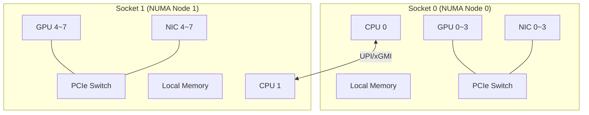
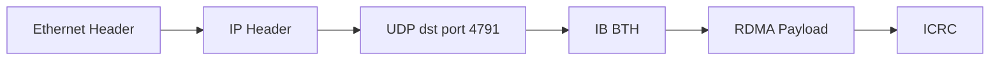
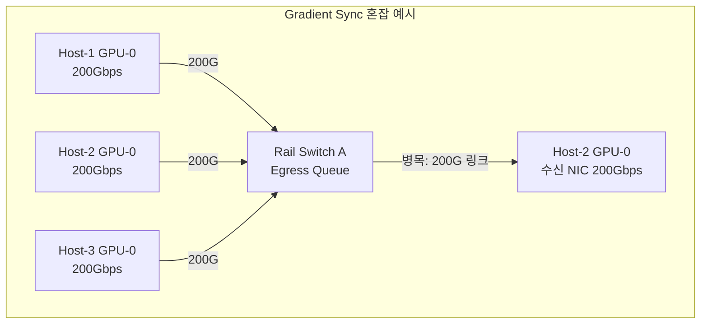
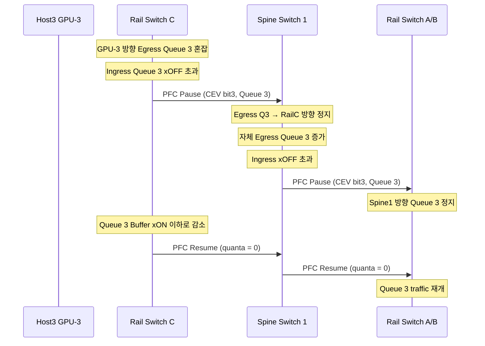
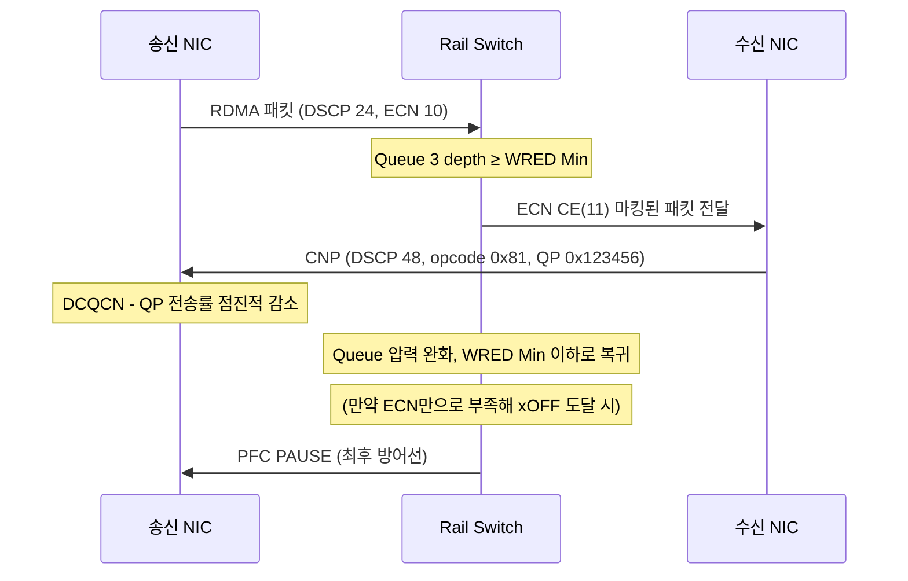
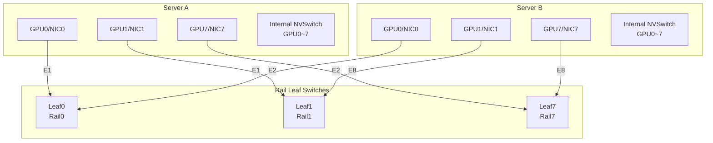
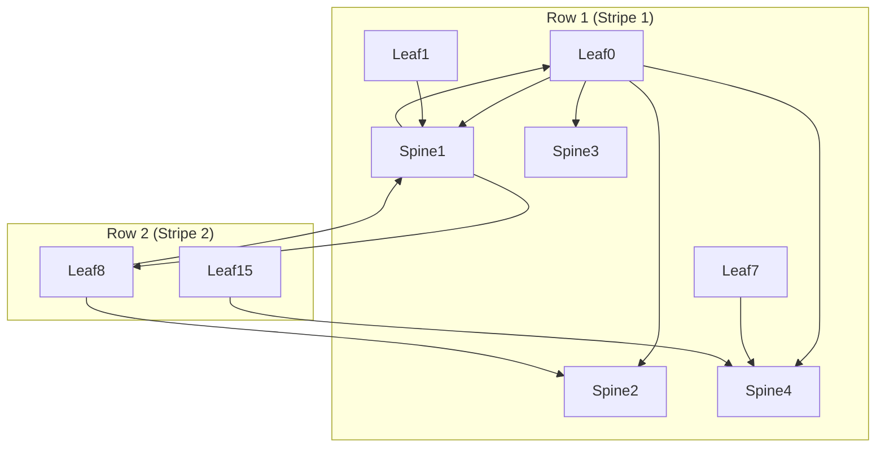

---
tags:
  - AI Datacenter Network
  - InfiniBand
  - RoCEv2
  - RDMA
  - NCCL
  - NUMA
  - GPU Cluster
  - ROD
  - Rail-Optimized Design
---

# IB, RoCEv2 & GPU 클러스터 네트워크 설계

> InfiniBand와 RoCEv2의 동작 원리, RoCEv2 혼잡 제어, 그리고 AI GPU 클러스터를 위한 Rail-Optimized Network 설계를 정리한다.

## NCCL과 집합 통신 심화

### 알고리즘 선택 원리

1주차에서 NCCL이 AllReduce 등 집합 통신을 제공한다고 다뤘다. NCCL은 같은 AllReduce라도 조건에 따라 완전히 다른 알고리즘을 선택한다.

NCCL은 호출마다 알고리즘 7종 × 프로토콜 3종 = **21칸 비용표**를 만들고, 예상 실행 시간이 가장 짧은 조합을 고른다.

| Algorithm | 핵심 구조 | 적용 범위 |
|-----------|-----------|-----------|
| Ring | 이웃 간 파이프라인 | 거의 모든 Collective |
| Tree | Double Binary Tree | AllReduce 전용 |
| CollNetDirect / CollNetChain | IB SHARP (in-network reduce) | IB SHARP NIC 필요 |
| NVLS | NVSwitch multicast + reduce | Hopper+, NVSwitch 필요 |
| NVLSTree | NVLS + 멀티노드 트리 | AllReduce |
| PAT | Bruck 변형 | AllGather, ReduceScatter (1 GPU/노드) |

| Protocol | Cache line | Data 효율 | 적합 |
|----------|-----------|----------|------|
| LL | 8B (4B data + 4B flag) | 50% | 짧은 메시지, latency |
| LL128 | 128B (120B data + 8B flag) | 93.75% | NVLink intra-node |
| Simple | full data + 별도 fence | ~100% | 큰 메시지, throughput |

LL/LL128은 data 옆에 flag를 붙여 receiver가 단일 word load로 ready 폴링이 가능하다. Simple은 효율은 높지만 별도 fence가 필요하다.

### NCCL P2P 레벨

`nvidia-smi topo -m`으로 GPU 간 연결 등급을 확인할 수 있다.

| 등급 | 의미 | P2P 품질 |
|------|------|---------|
| NV# | NVLink # 개 묶음 경유 | 최상 |
| PIX | 단일 PCIe 브리지 (같은 스위치) | P2P 최적 |
| PXB | 다중 PCIe 브리지 (Host Bridge 미경유) | 양호 |
| PHB | PCIe + Host Bridge (CPU) 경유 | 저하 시작 |
| NODE | 같은 NUMA 노드 내 Host Bridge 간 | 저하 |
| SYS | NUMA 노드 간 SMP 인터커넥트 경유 | 최악 |

`NCCL_P2P_LEVEL` 환경변수로 P2P 사용 거리 기준을 직접 설정할 수 있다.

## NUMA와 멀티 GPU 토폴로지

### NUMA 등장 배경

과거 SMP(Symmetric Multi-Processing) 구조에서는 모든 CPU가 단일 메모리 버스를 공유했다. CPU 수가 늘어날수록 메모리 버스 병목이 커졌다.

NUMA(Non-Uniform Memory Access)는 CPU마다 로컬 메모리를 두어 병목을 줄인 구조다.

- 각 CPU Socket이 하나의 NUMA Node를 구성한다.
- 로컬 메모리는 빠르고, 다른 소켓의 원격 메모리는 UPI/xGMI를 경유하므로 느리다.
- Intel은 QPI → UPI, AMD는 HyperTransport → Infinity Fabric(xGMI)을 사용한다.

### 멀티 GPU 환경에서 NUMA의 중요성

GPU와 NIC가 서로 다른 CPU 소켓에 붙으면 모든 통신이 소켓 간 링크(UPI/xGMI)를 거쳐야 한다.

```
GPUDirect RDMA가 불가능하거나 SYS 등급으로 성능이 극히 제한될 수 있다.
```

실무 배치 원칙:

- **GPU와 해당 NIC를 같은 PCIe 스위치 하위(PIX)에 배치**한다.
- **GPU, NIC, 메모리를 같은 NUMA 노드에 고정(pin)** 한다.
- **PCIe ACS는 꺼야** 한다. 켜져 있으면 같은 스위치 P2P도 루트 컴플렉스까지 끌려가 무력화된다.



### 멀티 GPU 연결 스펙트럼

같은 서버에 GPU 8개가 있어도 연결 구조에 따라 성능이 완전히 다르다.

| 구성 | Interconnect | Point-to-Point BW | 특성 |
|------|-------------|------------------|------|
| PCIe Gen5 only | PCIe | 128 GB/s bidirectional | GPU 간 직접 링크 없음, 독립 서비스에 적합 |
| H100 NVL (2-card bridge) | PCIe + NVLink | 600 GB/s bidirectional | pair 내부 빠름, pair 간은 PCIe/UPI |
| H200 NVL (4-way bridge) | PCIe + NVLink | 1.8 TB/s aggregate | 4-GPU 단위 모델 실행에 좋은 기준 |
| HGX H100/H200 SXM | NVSwitch | 900 GB/s per GPU to fabric | 8-GPU 전체 균일 fabric |
| HGX B200 SXM | NVSwitch | 1.8 TB/s per GPU to fabric | 최고 균일 성능 |

NVSwitch는 non-blocking 방식이라 어떤 GPU도 contention 없이 통신할 수 있다. MoE처럼 token routing이 자주 발생하는 모델에서 특히 유리하다.

**NVIDIA Fabric Manager**: NVSwitch 기반 HGX에서 topology 탐지, routing table 구성, GPU partition 정의를 담당한다. 물리 NVSwitch 위에 논리 partition을 만들어 VM/워크로드가 topology-aware하게 GPU를 묶어 쓰도록 한다.

## InfiniBand 심화

### 등장 배경

PCI/PCI-X 공유 버스는 모든 장치가 같은 대역폭을 나눠 쓰고, 장치가 늘수록 각 장치 대역폭이 줄었다. InfiniBand는 스위치 기반 포인트투포인트 패브릭으로 이 한계를 극복했다.

핵심 가치는 **"Bandwidth Out of the Box"**: CPU 근처에 갇혀 있던 높은 대역폭을 서버 외부, 클러스터, 스토리지 경계까지 확장한다.

### IB 계층 구조

InfiniBand는 자체 계층 스택을 가진다.

```
[LRH] [GRH optional] [BTH] [Extended Transport Header] [Payload] [ICRC] [VCRC]
```

| 계층 | 역할 |
|------|------|
| Physical | 케이블, 커넥터, 핫스왑 |
| Link | 패킷 구조, LID 주소, QoS(Virtual Lane), 흐름 제어(credit-based), CRC |
| Network | 서브넷 간 라우팅, IPv6 기반 GRH |
| Transport | 순서 보장, 재조립, QP, 전송 서비스 |
| Upper | Verbs 인터페이스 |

- **LRH(Local Route Header)**: 같은 서브넷 내 local forwarding에 사용한다.
- **GRH(Global Route Header)**: 서브넷을 넘을 때 사용하며, 128-bit IPv6 형식 주소를 담는다.

### IB 전송 서비스 (QP Type)

| 타입 | 신뢰성 | 연결성 | RDMA Read/Atomic | 비유 |
|------|--------|--------|-----------------|------|
| RC (Reliable Connection) | O | O | O | TCP |
| UC (Unreliable Connection) | X | O | X | - |
| UD (Unreliable Datagram) | X | X | X | UDP |
| DC (Dynamic Connection) | O | 동적 | O | 대규모용 |

NCCL, UCX, MPI 등 대부분의 라이브러리가 RC를 쓰는 이유는 RDMA Read와 Atomic이 RC에서만 동작하기 때문이다.

### IB BTH (Base Transport Header)

BTH는 InfiniBand transport 계층의 공통 헤더다. 어떤 RDMA 작업인지(opcode), 어느 QP로 가야 하는지, 패킷 순서가 무엇인지를 담는다.

| BTH 필드 | 의미 |
|---------|------|
| OpCode | SEND / RDMA WRITE / RDMA READ / ATOMIC / ACK / CNP |
| Destination QP | 목적지 Queue Pair 번호 |
| PSN | Packet Sequence Number - 패킷 순서 및 재전송 기준 |
| P_Key | Partition Key - InfiniBand 논리적 격리/partition 식별자 |
| AckReq | ACK 요청 여부 |

RDMA WRITE에는 BTH 뒤에 **RETH(RDMA Extended Transport Header)**가 따라온다. RETH에는 원격 메모리 주소(Virtual Address), rkey, 길이가 담긴다.

### RDMA 통신 패러다임

| 연산 | responder CPU 개입 | 용도 |
|------|-------------------|------|
| Send/Recv | O | 제어 메시지, 메타데이터 교환 |
| RDMA Write | X | 일방적 데이터 전달 (NCCL 기본) |
| RDMA Read | X | pull 패턴, KV cache 회수 |
| Atomic | X | 분산 락, counter |

RDMA Write가 빠른 이유: 데이터를 한 방향으로 보내고 작은 ACK만 반환한다. RDMA Read는 요청 전송 후 데이터 수신 round-trip이 필요하다. 그래서 NCCL과 NIXL은 Write 중심 구조다.

### RDMA Write 패킷 시퀀스: First / Middle / Last / Only

하나의 RDMA Write 작업이 여러 패킷으로 나뉠 때 각 패킷의 역할이 다르다.

```
Host1 GPU-0 Memory → [RDMA Write First (RETH 포함, PSN 1)] → Host2 GPU-0 Memory [위치 2C에 write]
                   → [RDMA Write Middle (PSN 2)]          → [이전 offset 다음인 2D에 write]
                   → [RDMA Write Last (PSN 3)]             → [2E에 write]
```

- **RDMA Write First**: RETH 포함. 수신 RNIC가 원격 메모리 주소(VA), R_Key, 길이를 이 패킷에서 파악한다.
- **RDMA Write Middle / Last**: RETH 없음. First에서 받은 context와 PSN 순서에만 의존한다.

**문제**: Middle/Last는 First의 context에 의존하므로 패킷이 out-of-order로 도착하면 수신 NIC가 버퍼링해야 한다. 고속 환경에서 buffer pressure와 packet drop 위험이 커진다.

**RDMA Write Only**: NVIDIA ConnectX-5 이후 NIC가 지원하는 방식으로, **모든 패킷이 각자 RETH를 포함**한다. 각 패킷이 destination address를 직접 알고 있어 다른 경로로 분산돼도 정상 처리가 가능하다. 이 구조가 Packet Spraying을 가능하게 한다.

| 방식 | RETH 위치 | 순서 의존성 | Packet Spraying |
|------|----------|-----------|----------------|
| Write First/Middle/Last | First만 포함 | Middle/Last가 First에 의존 | 어려움 (out-of-order 위험) |
| Write Only | 모든 패킷 포함 | 각 패킷 self-contained | 가능 |

### IB vs RoCEv2 코드 레벨 차이

libibverbs API, QP, MR, RC/UC/UD semantics는 IB와 RoCEv2가 동일하다. 차이는 wire 전송 방식 하나다.

```
IB:     is_global = 0, dlid = peer->lid (LID 기반 routing)
RoCEv2: is_global = 1, GRH.dgid = peer->gid (IP 기반 routing)
```

`show_gids` 명령으로 RoCEv2용 GID 인덱스(IPv4 mapped + v2)를 확인해야 한다. 잘못 선택하면 RoCEv1으로 동작해 라우팅이 실패한다.

## RoCEv2와 무손실 이더넷

### RoCEv1 vs RoCEv2

| 구분 | RoCE v1 | RoCEv2 |
|------|---------|--------|
| 캡슐화 계층 | L2 (Ethertype `0x8915`) | L3/L4 (UDP 위) |
| 라우팅 | 불가 (같은 브로드캐스트 도메인) | 가능 (IP routable) |
| 확장 범위 | 단일 L2 서브넷 | 멀티 서브넷 / 멀티 라우터 |

RoCEv2는 L3 Leaf-Spine 토폴로지와 함께 사실상의 표준으로 자리잡았다.



UDP 출발지 포트를 흐름별로 다르게 설정하면 스위치 ECMP 해싱이 여러 경로로 트래픽을 분산한다. RoCEv2에는 IB Subnet Manager가 불필요하다. 대신 이더넷 스위치 설정의 중요도가 올라간다.

### IB vs RoCEv2 비교

| 구분 | InfiniBand | RoCEv2 |
|------|-----------|--------|
| 전송 매체 | 전용 IB 패브릭 | 표준 이더넷 |
| 무손실 방식 | Credit-based flow control 내장 | PFC/ECN/DCQCN 별도 구성 필요 |
| 스위치 | 전용 IB 스위치/HCA | 범용 이더넷 스위치/NIC |
| 운영 난이도 | 별도 운영 체계 학습 필요 | 기존 이더넷 운영 경험 재사용 |
| 생태계 | NVIDIA 중심 | 다수 벤더 / 개방형 |
| 대표 사용처 | 초대규모 HPC/AI 전용 클러스터 | 하이브리드/멀티 클라우드, 범용 데이터센터 |

## RoCEv2 혼잡 제어

### 혼잡이 발생하는 이유

"무오버서브스크립션" 구조라도 실제 혼잡은 발생한다.

- 여러 서버가 동시에 같은 목적지로 보낸다.
- ECMP 해시 결과 여러 flow가 같은 링크를 선택한다.
- AI/ML 트래픽은 소수의 **Elephant Flow**가 많아 특정 링크에 몰리기 쉽다.
- RoCEv2는 UDP 기반이라 TCP처럼 손실 복구와 혼잡 제어가 자동으로 동작하지 않는다.

### 혼잡 지점 (Congestion Points)

| 혼잡 위치 | 발생 상황 |
|-----------|----------|
| Local Leaf Link | 같은 Leaf에 붙은 여러 서버가 같은 목적지로 몰림 |
| Leaf → Spine | ECMP 해시 결과 여러 flow가 같은 uplink 선택 |
| Spine → Leaf | 여러 source에서 온 트래픽이 같은 Spine→Leaf downlink로 집중 |
| Leaf → Server | 최종 NIC 대역폭보다 수신 트래픽이 큰 Incast |
| Spine → Super Spine | 5-stage Clos 구조에서 상향 링크 혼잡 |

**Incast**: 여러 송신자가 동일 수신자나 동일 출력 링크로 동시에 보내는 패턴이다. AllReduce/AllGather, Checkpoint 저장, 데이터 로딩에서 자주 발생한다.



### ECN (Explicit Congestion Notification)

스위치 큐가 WRED 임계값에 도달하면 패킷을 버리지 않고 IP 헤더에 **혼잡 표시(CE)**를 찍는다.

**WRED 임계값 동작**:

| 큐 깊이 | 동작 |
|--------|------|
| < WRED Min | 정상 전달 (ECN 마킹 없음) |
| WRED Min ≤ depth < WRED Max | 일부 패킷에 ECN CE(11) 마킹 시작 |
| ≥ WRED Max | 모든 패킷에 ECN CE(11) 마킹 |
| ≥ Drop Threshold | ECN 마킹으로 버티지 못하고 packet drop 발생 |

```
혼잡 발생 → 스위치가 ECN 마킹 → 패킷이 수신자에게 도달
→ 수신 NIC가 CNP(Congestion Notification Packet, IBTH opcode 0x81, DSCP 48) 생성
→ CNP가 strict priority queue(Queue 7)로 전달 (data traffic Queue 3보다 우선)
→ 송신 NIC가 해당 QP의 전송 속도 감소
```

**DSCP 분류**:

| 트래픽 | DSCP | QoS Group | Queue |
|--------|------|-----------|-------|
| RoCEv2 data | 24 | 3 | Queue 3 (ECN/WRED 적용) |
| CNP feedback | 48 | 7 | Queue 7 (strict priority) |

CNP는 congestion feedback이므로 data traffic 뒤에 밀리면 sender rate control도 늦어진다. strict priority 처리가 필수다.

- ECN은 **Flow 단위**로 제어한다.
- 단점: CNP 왕복 지연 동안 큐가 계속 찰 수 있다. 패킷 손실을 완전히 막지는 못한다(Lossy Queue).

### PFC (Priority Flow Control)

IEEE 802.1Qbb. 혼잡 시 패킷을 버리기 전에 상위 장비에 **PAUSE Frame(XOFF)**을 보내 해당 Priority Class 트래픽을 일시 중단시킨다.

AI Fabric은 L3 routed fabric을 사용하므로 전통적인 L2 PCP 기반 PFC만으로는 부족하다. IP 헤더의 **DSCP 값을 기준으로 traffic class를 식별하는 DSCP-based PFC**를 사용한다.

```
큐 → XOFF Threshold 초과 → Pause Frame (Ethertype 0x8808, CEV 비트 3 세트)
                         → upstream 장비가 Priority Queue 3 트래픽 일시 정지
큐 → XON Threshold 이하 → quanta = 0인 PFC Frame → 전송 재개
```

**Quanta 필드**: 400Gbps 인터페이스에서 1 quanta = 512 bit-time ≈ 1.28ns. 최대값 0xFFFF(65535)이면 약 83.9μs 정지.

**Buffer Headroom**: XOFF pause가 upstream에 도달하기 전 in-flight traffic을 흡수할 여유 버퍼. Headroom이 부족하면 pause를 보내도 packet drop이 발생할 수 있다.

#### PFC Cascade 전파 흐름

혼잡이 한 지점에서 시작해 upstream으로 단계적으로 전파된다.



PFC는 **Traffic Class 전체**를 멈추기 때문에 두 가지 문제가 있다.

- **Head-of-Line Blocking**: 혼잡을 만든 flow 외의 정상 flow도 같이 멈춘다.
- **PFC Storm**: Pause가 upstream으로 계속 전파되어 네트워크 전체가 멈추는 교착 상태.

**PFC Watchdog**은 PFC Storm을 감지하면 Drop 또는 Forward 방식으로 완화한다. 일반적으로 Drop 방식을 쓴다(일부 패킷 손실을 감수하더라도 Storm 확산을 끊는다).

**LLDP/DCBX**: PFC 협상은 LLDP의 IEEE DCBXv2(802.1Qbb/802.1Qaz) TLV로 수행된다. 양단 장비의 DSCP-to-priority mapping이 맞지 않으면 의도한 queue가 pause되지 않거나 CNP가 우선 처리되지 않는다.

### DCQCN (Data Center Quantized Congestion Notification)

ECN의 반응 지연과 PFC의 Class 단위 영향 문제를 함께 해결하는 RoCEv2 표준 혼잡 제어 알고리즘이다.

#### 임계값 순서

```
xON < WRED Min < WRED Max < xOFF
```

| Threshold | 역할 |
|-----------|------|
| xON | PFC resume 기준 (queue가 여기 이하면 전송 재개) |
| WRED Min | ECN marking 시작 |
| WRED Max | 모든 packet에 ECN CE(11) marking |
| xOFF | PFC pause 시작 (ECN으로 못 막았을 때 최후 방어) |

ECN이 먼저 동작해야 하는 이유: 송신 NIC가 CNP feedback을 받고 전송률을 점진적으로 줄이면 queue가 xOFF까지 차기 전에 안정화된다. **xOFF가 WRED Max보다 먼저 오면** 갑작스러운 PFC pause → HOL Blocking → xON 이하 → resume → 다시 burst → 다시 xOFF의 **stop-and-go 진동**이 반복된다.



#### 스위치 설정 6단계

```
Step 1. DSCP 분류
  DSCP 24 → class ROCEv2   (RoCEv2 data)
  DSCP 48 → class CNP      (congestion feedback)

Step 2. 내부 QoS group marking
  ROCEv2 → qos-group 3
  CNP    → qos-group 7  (strict priority)
  default → qos-group 0

Step 3. Egress queue scheduling + WRED/ECN threshold
  Queue 7: CNP strict priority (data traffic 뒤에 밀리지 않도록)
  Queue 3: RoCEv2 data, bandwidth 보장, WRED Min/Max 설정, ecn 옵션 활성화
  # ecn 옵션이 없으면 WRED threshold에서 packet drop → RDMA에 치명적

Step 4. PFC + Network QoS
  Queue 3 클래스: MTU 9216 (Jumbo frame), PFC CoS 3 활성화
  PFC Watchdog 활성화

Step 5. system QoS policy 적용
  network-qos policy bind
  egress queuing policy bind

Step 6. Interface 적용
  PFC auto negotiation
  PFC watchdog
  ingress QoS classification policy
```

**설계 원칙**:

1. Threshold 순서: `xON < WRED Min < WRED Max < xOFF` 관계가 깨지면 stop-and-go 진동 발생
2. CNP strict priority: congestion feedback이 늦으면 sender rate control도 늦어진다
3. WRED에 `ecn` 옵션 필수: 없으면 packet drop 방식으로 동작
4. PFC는 backup: 평상시 ECN/CNP rate control이 담당하고, PFC는 drop 직전 보호 장치
5. 설정 일관성: classification → marking → queueing → network-qos → system qos → interface 모두 연결돼야 DCQCN이 동작

**모니터링 항목**:

- ECN CE-marked packet count, CNP sent/received
- Queue 3 buffer occupancy, WRED marking count
- PFC xOFF/xON event, PFC pause duration, PFC watchdog trigger
- RoCE retransmission/timeout, GPU step-time jitter, NCCL allreduce latency

### SFC (Source Flow Control)

ECN의 왕복 지연과 PFC의 Class 단위 영향을 줄이기 위해 제안된 차세대 방식이다.

혼잡이 발생한 **스위치가 직접 송신자에게** Flow 단위 제어 신호를 보낸다. 혼잡 패킷의 Source/Destination IP를 뒤집어 원래 송신자로 신호를 전달하고, payload는 trim한다.

| 방식 | 혼잡 알림 방향 | 제어 단위 | 주요 문제 |
|------|-------------|---------|---------|
| ECN | 스위치 → 목적지 → 송신자 | Flow | CNP 왕복 지연 |
| PFC | 스위치 → 이전 Hop → upstream | Traffic Class 전체 | HOL Blocking, PFC Storm |
| SFC | 혼잡 스위치 → 송신자 직접 | Flow | NIC/스위치 지원 필요 |

## GPU 클러스터 네트워크 설계

### 서버 내부 구조: Shared NIC vs Dedicated NIC

모델 크기에 따라 필요한 GPU 수가 달라지고, GPU 수가 늘면 서버 간 backend network가 critical path가 된다.

| 모델 크기 | 필요 메모리 | 필요 GPU 수 | 통신 범위 |
|----------|-----------|-----------|---------|
| 8B | ~16GB | 단일 GPU | - |
| 70B | ~140GB | 최소 2 GPU | 서버 내 NVLink |
| 405B | ~810GB | 여러 서버 | intra-host NVLink + inter-host network |

**Shared NIC 구조**: 8개 GPU가 PCIe switch를 통해 소수의 ConnectX-7 NIC를 공유한다.

```
[GPU 0~7] → [NVSwitch baseboard] → [PCIe Gen5 switch] → [ConnectX-7 200GbE NIC]
                                                          ↑
                                               PCIe bandwidth ~128 GB/s
                                               NIC bandwidth  ~25 GB/s  ← 병목
```

- 장점: 비용 낮음, 구조 단순, 개발/소규모에 적합
- 단점: 여러 GPU가 동시에 RDMA traffic을 발생시키면 shared NIC가 병목

**Dedicated NIC per GPU**: GPU마다 전용 ConnectX-7 200GbE NIC를 붙이는 방식.

```
GPU 0 → NIC 0 (200GbE) → Rail 1
GPU 1 → NIC 1 (200GbE) → Rail 2
...
GPU 7 → NIC 7 (200GbE) → Rail 8
```

- 장점: GPU별 network bandwidth 분리, RDMA 성능 안정적, Rail-optimized topology 구성 쉬움
- 단점: NIC·switch port·cable·전력 비용 증가

대규모 production AI cluster에서는 dedicated NIC per GPU가 일반적이다.

### 네트워크 Fabric 종류

AI GPU 서버는 목적별로 포트가 나뉜다.

```
┌──────────────────────────── GPU Server ────────────────────────────┐
│ [GPU0]─[NIC0]──→ Training Fabric / Rail0                           │
│ [GPU1]─[NIC1]──→ Training Fabric / Rail1                           │
│ ...                                                                │
│ [GPU7]─[NIC7]──→ Training Fabric / Rail7                           │
│ [CPU NIC]────────→ Frontend / Inference / Management Network       │
│ [NVMe NIC]───────→ Storage Fabric / NVMe-oF                        │
└────────────────────────────────────────────────────────────────────┘
```

| Fabric | 용도 | 특성 |
|--------|------|------|
| Training Fabric | GPU 간 AllReduce, Gradient Sync | 초고대역폭, RDMA, lossless 필수 |
| Inference Fabric | 사용자 요청 처리 | 프론트엔드 네트워크, 일반 TCP/IP |
| Storage Fabric | 학습 데이터 로딩, Checkpoint | NVMe-oF, RoCEv2/IB |
| Management Fabric | SSH, Kubernetes control plane | 저속 관리 네트워크 |

### AI Fabric 설계 도전

#### Egress 혼잡

Gradient Sync 중 여러 GPU가 동시에 동일 목적지로 RDMA Write를 보내면 Rail Switch의 특정 egress 포트에 트래픽이 집중된다.

3개 Host가 각 200Gbps로 동시에 Host-2 GPU-0으로 보내면 Rail Switch A의 Host-2 방향 egress에 최대 **800Gbps**가 몰려 혼잡이 발생한다.

#### NIC/PCIe 수준 HOL Blocking

Rail switch 수준뿐 아니라 서버 내부에서도 HOL Blocking이 발생한다. NCCL이 GPU-0의 gradient를 GPU-1을 경유해 다른 서버로 전달하는 topology를 구성했을 때, GPU-1이 자신의 gradient 전송 중에 GPU-0의 forwarding까지 맡으면 **PCIe/NIC 대역폭 경쟁**이 발생한다.

```
GPU-1 자신의 gradient 200Gbps 전송 중
+ GPU-0 gradient 200Gbps forwarding 요청
→ PCIe/NIC 병목 → queueing delay → collective completion 지연
```

#### ECMP Hash Polarization

GPU 간 하나의 QP를 통해 수백 MB~수 GB의 gradient를 전송하면 네트워크는 이를 **하나의 큰 Elephant Flow**로 본다. ECMP 5-tuple hash 결과 여러 flow가 동일 uplink를 선택하면 한 spine 링크는 과부하, 다른 링크는 유휴 상태가 된다.

```
정상: Flow A → Spine 1 / Flow B → Spine 2 (균등 분산)
편극: Flow A → Spine 1 / Flow B → Spine 1 (Spine 1 혼잡, Spine 2 유휴)
```

**설계 시사점**:

- Topology-aware 설계: GPU index ↔ NIC interface ↔ rail switch 연결이 일치해야 한다
- Congestion-aware 설계: collective phase에서 fan-in/fan-out 패턴을 미리 계산해야 한다
- Failure domain 최소화: rail switch 하나가 많은 GPU subset을 고립시키지 않도록 redundancy 설계
- Flow 분산 개선: ECMP hash만 믿지 말고 adaptive routing / packet spraying / NCCL topology tuning 검토

### 설계 핵심 목표

세 가지 요소가 핵심이다.

**High-radix**: 스위치 포트 수가 많을수록 적은 계층으로 더 많은 장비를 연결한다. 계층이 늘수록 장비 수·케이블 수·latency·장애 지점이 함께 늘어난다.

**Oversubscription ratio 1:1**: 서버 방향(downlink) 총 대역폭 = Spine 방향(uplink) 총 대역폭. 서버들이 동시에 최대 속도로 보내도 fabric이 막히지 않는다.

```
64포트 400G 스위치 예시:
  서버 방향: 32포트 × 400G = 12.8Tbps
  Spine 방향: 32포트 × 400G = 12.8Tbps
  Oversubscription = 1:1 (non-blocking)
```

**Proactive congestion management**: 혼잡이 생긴 뒤 대응하는 것이 아니라, ECMP로 처음부터 트래픽을 여러 경로로 분산해 혼잡을 예방한다.

### 로드 밸런싱: Elephant Flow 분산

AI workload의 GPU-to-GPU RDMA 트래픽은 line-rate에 가까운 Elephant Flow다. 기존 flow-based ECMP는 이 특성에 취약하다.

#### Flow-based ECMP 한계

```
5-tuple hash (src IP, dst IP, src port, dst port, protocol) → 하나의 flow는 항상 같은 path
AI backend: 소수의 큰 flow가 같은 uplink 선택 → hash polarization → 특정 링크 혼잡
```

#### Flowlet-based Adaptive Routing

하나의 flow를 더 작은 burst 단위인 **flowlet**으로 나눠, congestion 상태에 따라 다른 path로 보낸다.

```
초기: flowlet → Spine-1
Rail-1 ↔ Spine-1 utilization이 threshold 초과
→ adaptive routing이 감지
→ 일부 flowlet → Spine-2로 전환
```

- 장점: 여러 path를 고르게 사용, reordering 위험이 packet spraying보다 낮다
- flowlet 내부 packet 순서는 유지되므로 RDMA 호환성 좋다

#### Packet Spraying

같은 flow 안의 개별 packet을 여러 equal-cost path로 분산한다. 링크 활용률을 가장 세밀하게 균등화할 수 있다.

```
Packet 1 → Spine-1
Packet 2 → Spine-2
Packet 3 → Spine-1
Packet 4 → Spine-2
```

단, RDMA Write First/Middle/Last 구조에서는 out-of-order 도착 시 수신 NIC가 buffering해야 하므로 문제가 발생한다. **RDMA Write Only**를 사용하면 각 패킷이 RETH를 포함하므로 packet spraying과 호환된다.

| 방식 | 단위 | 장점 | AI Fabric 관점 |
|------|------|------|--------------|
| Flow-based ECMP | Flow | 순서 보장, 구현 단순 | Elephant flow hash polarization에 취약 |
| Flowlet Adaptive Routing | Flowlet | link utilization 개선, reordering 낮음 | 가장 균형 잡힌 개선책 |
| Packet Spraying | Packet | 경로 분산 가장 세밀 | RDMA Write Only 같은 self-contained packet 구조 필요 |

## Rail-Optimized Design (ROD)

### Rail 개념

8-GPU 서버에는 GPU마다 NIC가 대응된다.

```
GPU0 ↔ NIC0
GPU1 ↔ NIC1
...
GPU7 ↔ NIC7
```

**Rail**: 같은 GPU 번호끼리 묶은 외부 네트워크 경로다. 8-GPU 서버 클러스터에는 Rail 0~7, 총 8개의 논리 네트워크가 생긴다.

```
Rail 0 = 모든 서버의 GPU0/NIC0 → Leaf0
Rail 1 = 모든 서버의 GPU1/NIC1 → Leaf1
...
Rail 7 = 모든 서버의 GPU7/NIC7 → Leaf7
```

NCCL 같은 라이브러리는 GPU/NIC topology를 고려해 all-reduce ring이나 tree를 구성한다. rail 구조가 명확하면 통신 경로가 예측 가능해져 최적화가 쉬워진다.



### Intra-rail vs Inter-rail 통신

| 구분 | 의미 | 경로 | Latency |
|------|------|------|---------|
| Intra-rail | 같은 rail 안 통신 (GPU0 ↔ GPU0) | Leaf 하나만 거침 | 최소 (1-hop) |
| Inter-rail | 서로 다른 rail 간 통신 (GPU0 ↔ GPU3) | Leaf → Spine → Leaf | ~2배 latency |

서버 A의 GPU0와 서버 B의 GPU0은 같은 Leaf0에 연결되어 있으므로 Spine 없이 직접 통신한다. 반면 서버 A의 GPU0와 서버 B의 GPU3은 다른 rail이므로 Spine을 경유해야 한다.

### Rail Switch 설계 변형

**Single Rail Switch**: 하나의 스위치에 여러 host의 GPU NIC를 직접 연결하고, port group을 rail별 VLAN으로 나눈다.

- 장점: 구조 단순, 비용 낮음, 같은 switch 내부라 latency 낮음
- 단점: 스위치 1대가 단일 장애 지점(Single Point of Failure), 확장성 제한, HA 미흡

**Dual Rail Switch**: GPU마다 dual-port NIC를 붙이고 두 개의 Rail Switch에 연결한다.

```
GPU-0 ─ NIC (port1) → Rail Switch A
       ─ NIC (port2) → Rail Switch B
```

- 장점: Rail switch 장애 시에도 나머지 경로로 통신 가능, HA/운영 환경에 적합
- 단점: NIC 포트 수, switch 수, 케이블 수, 비용 증가

운영/상용 환경에서는 Dual Rail Switch가 사실상 표준이다.

### ROD 클러스터 규모별 구성

**256 GPU 클러스터 (Spine 없이 동작 가능)**

```
32 servers × 8 GPUs = 256 GPUs
8 leaf switches (Leaf0~Leaf7), 각 32 downlinks × 400G
Leaf0: 32대 서버의 GPU0 = 32개 연결
...
Leaf7: 32대 서버의 GPU7 = 32개 연결
```

**512 GPU 클러스터 (Spine 없이 효율적 동작)**

```
64 servers × 8 GPUs = 512 GPUs
8 leaf switches, 각 64 downlinks × 400G
같은 rail 안에서는 Spine 없이 Leaf 하나로 직접 통신
```

**512 GPU 이상 확장: 3-stage Clos**



- 8 Leaf + 4 Spine (1 Row) → 32 servers = 256 GPUs
- 16 Leaf + 8 Spine (2 Rows) → 64 servers = 512 GPUs
- Row/Stripe를 추가하면 수평 확장이 가능하다.

**8개 leaf 스위치 묶음 = 1 Row / 1 Stripe**: 동일 GPU 번호 집합을 커버하는 leaf 8개가 하나의 Row를 구성한다. Row를 추가하면 더 많은 서버를 같은 rail 번호 체계로 수용한다.

## 마무리

- NCCL은 알고리즘 7종 × 프로토콜 3종 비용표로 매 호출마다 최적 조합을 선택한다. NVSwitch 환경에서는 NVLS로 switch 내부에서 reduce를 처리해 AllReduce 트래픽을 A100 대비 약 2배 줄인다.

- NUMA는 CPU 소켓마다 로컬 메모리를 두어 중앙 버스 병목을 제거한다. GPU, NIC, 메모리를 같은 NUMA 노드에 고정해야 GPUDirect RDMA 성능을 최대화할 수 있다.

- IB와 RoCEv2는 libibverbs API와 RC QP semantics를 공유하며 차이는 wire 포맷 하나다. IB는 credit-based lossless fabric이 내장되고, RoCEv2는 PFC/ECN/DCQCN으로 무손실에 가까운 환경을 구성한다.

- DCQCN의 핵심은 임계값 순서다. `xON < WRED Min < WRED Max < xOFF`를 유지해야 ECN이 먼저 부드럽게 속도를 줄이고, PFC가 최후 방어선으로 동작한다. 이 순서가 깨지면 stop-and-go 진동이 반복된다.

- AI Fabric에서 Elephant Flow의 ECMP Hash Polarization을 해결하려면 Flowlet Adaptive Routing 또는 Packet Spraying이 필요하다. Packet Spraying은 RDMA Write Only 구조와 함께 써야 out-of-order 문제를 피할 수 있다.

- Rail-Optimized Design은 같은 GPU 번호끼리 동일 Leaf에 연결해 intra-rail 통신을 1-hop으로 줄이는 설계다. Dual Rail Switch로 HA를 확보하고, Row(Stripe) 단위로 수평 확장한다.

## 참고

- [AI for Network Engineers: Challenges in AI Fabric Design - Nektimes](https://nektimes.com)
- [Congestion Avoidance in AI Fabric - Nektimes](https://nektimes.com)
- [Understanding Flow, Flowlet, and Packet-Based Load Balancing - Nektimes](https://nektimes.com)
- [Backend Network Topologies for AI Fabrics - Nektimes](https://nektimes.com)
- [Rail-Optimized Networking for AI Training Workloads - Juniper](https://www.juniper.net/documentation/us/en/software/jvd/jvd-ai-dc-apstra-nvidia-weka/solution_architecture.html)
- [NCCL 알고리즘 - hhoikoo.github.io](https://hhoikoo.github.io/study/aidcnw/week1-ai-model-lifecycle/rdma-hands-on/)
- [RDMA Read/Write 실전 입문 - hhoikoo.github.io](https://hhoikoo.github.io/study/aidcnw/week1-ai-model-lifecycle/rdma-hands-on/)
- [Understanding Multi-GPU Topologies Within a Single Host - frankdenneman.ai](https://frankdenneman.ai/2026-03-16-why-multi-gpu-requires-topology-aware/)
- [NUMA Deep Dive - frankdenneman.ai](https://frankdenneman.ai/2016-07-08-numa-deep-dive-part-2-system-architecture/)
- [NVSwitch SHARP - NVIDIA Blog](https://blogs.nvidia.com/blog/nvlink-nvswitch-3rd-generation/)
- [GPU 인터커넥트](../gpu/infiniband-nvlink-nvswitch.md)
- [AI 모델 생명주기와 RDMA 네트워크](./week1-ai-lifecycle-rdma.md)
