---
tags:
  - AI Datacenter Network
  - Data Center
  - PUE
  - Liquid Cooling
  - Load Balancing
  - ECMP
  - Consistent Hashing
  - NCCL
  - AllReduce
---

# 데이터센터 인프라, 로드 밸런싱 & NCCL AllReduce

> 데이터센터 전원·냉각 인프라, 라우터 로드 밸런싱의 내부 동작과 AI Fabric에서의 SLB/DLB/GLB/TELB 진화, 그리고 NCCL Ring AllReduce의 단계별 동작을 정리한다.

## 데이터센터 전원 인프라

### 부지 확보와 전력 확보

데이터센터 부지 선정에서 가장 먼저 따지는 조건은 전기를 안정적으로 확보할 수 있는 땅인지다. 국내에서 데이터센터로 들어오는 전기는 대부분 초고압인 22,900V('투투나인') 또는 154,000V('밀오사')이고, 전력 케이블은 보통 지중에 매립하기 때문에 변전소와의 거리가 멀수록 공사비가 늘어난다. 통신선로 역시 이중화가 기본이라 고객은 통상 3개 이상의 POE(Point of Entrance)를 요구한다. 여기에 침수 피해가 없는 지역, 가스충전소 같은 폭발 위험 시설이 없는 지역, 민원 발생 가능성이 낮은 지역이라는 조건까지 겹치다 보니 부지 선정 자체가 꽤 까다로운 작업이 된다.

### 데이터센터 용량 산정

데이터센터의 용량은 서버가 쓰는 전력의 총합, 즉 IT 전력량으로 정의한다. 랙밀도(rack density)는 랙 하나에 설치된 서버 전력의 합이다.

| 서버 유형 | 랙당 전력 |
|----------|----------|
| 일반 서버 | 약 15kW |
| AI 서버 | 약 72kW |

```
일반 서버력 1200랙 + AI 서버력 100랙 설치 시
(15kW × 1200) + (72kW × 100) = 18,000kW + 7,200kW = 25,200kW = 25.2MW
```

건물 연면적은 대략 MW당 300평 정도가 필요하다고 보므로, 25.2MW라면 약 7,560평의 연면적이 필요하다는 계산이 나온다. 물론 실제 건축 계획에 따라 이 값은 달라질 수 있다.

### 전력계통과 UPS/EDG

전력계통(power grid)은 발전소에서 만든 전기를 변전소와 전력케이블을 거쳐 소비자에게 전달하는 네트워크다. 어느 한 발전소나 변전소가 고장 나도 서비스가 끊기지 않도록, 2개 이상의 발전소와 2개 이상의 변전소를 서로 연결해두는 게 기본이다.

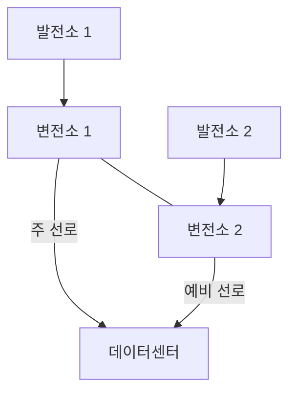

이렇게 이중화된 인입 선로가 데이터센터 안으로 들어오면, 그 다음은 변압 → UPS/배터리 → 서버로 이어지는 무정전 체계가 받는다.

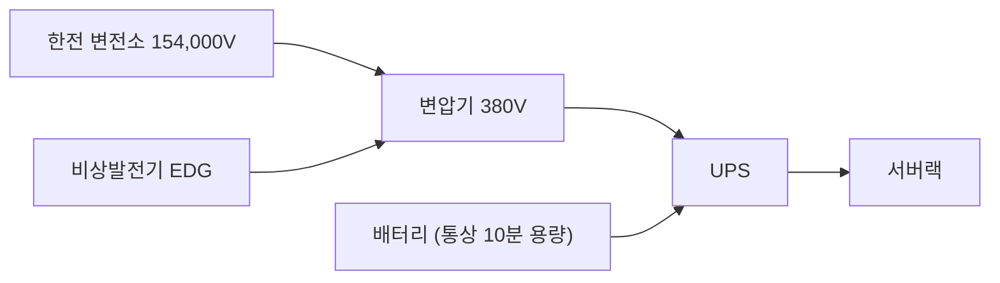

| 구성요소 | 역할 |
|---------|------|
| 변압기(Transformer) | 한전으로부터 받은 초고압 전기를 실제 사용 전압으로 변환 |
| UPS(Uninterrupted Power Supply) | 정전 시 배터리 전력으로 빠르게 서버에 전기 공급 |
| BAT(Battery) | 평소 충전(통상 10분 용량), 정전 시 UPS에 전기 공급 |
| EDG(Emergency Diesel Generator) | 정전 시 경유를 연료로 전기를 생산 |

한전이 굳이 초고압으로 전기를 보내는 이유는 송전 효율 때문이다. 전력은 `P = V × I` 관계를 가지고, 전선 손실은 전류 제곱에 비례(`손실 ∝ I²R`)한다. 같은 전력을 보낼 때 전압을 높이면 전류를 낮출 수 있으니 손실이 줄고, 케이블도 더 얇은 걸 쓸 수 있어 경제적이다.

서버 입장에서는 정전 후 약 20ms 안에 전기가 다시 들어오면 문제가 없다. UPS는 통상 3~5ms 안에 배터리 전기 공급을 시작하고, 그와 동시에 EDG가 가동을 시작한다. 다만 EDG는 정격 용량에 도달하는 데 시간이 걸리는데(요즘 기준 통상 15~30초), 그 사이를 UPS 배터리가 버텨준다.

### PUE

`PUE(Power Usage Effectiveness)`는 데이터센터가 전력을 얼마나 효율적으로 쓰는지 나타내는 지표다.

```
PUE = 데이터센터 전체 전력 소비 / IT 장비 전력 소비
```

IT 장비가 10MW를 쓰고 데이터센터 전체가 15MW를 쓴다면 PUE는 1.5다. 이상적인 값은 1.0으로, 냉각·UPS·조명 같은 오버헤드가 전혀 없는 상태를 뜻한다. 현실에서는 이런 손실이 항상 존재하므로 1.0보다는 높게 나온다. AI/ML 클러스터는 IT 장비 전력 자체가 워낙 크기 때문에, PUE를 조금만 낮춰도 절감되는 전력 비용이 상당하다.

## 데이터센터 냉각 인프라

### 공랭 기본 원리

서버는 전면의 차가운 공기(Cold Aisle)를 자체 냉각팬으로 빨아들여 내부를 식히고, 후면(Hot Aisle)으로 더워진 공기를 뱉어낸다.

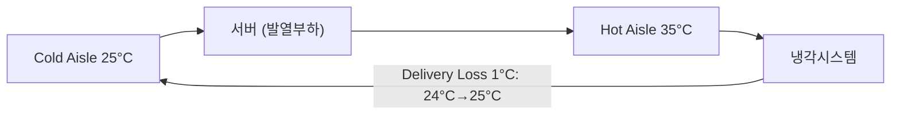

서버가 쓰는 전력은 거의 그대로 열로 바뀌기 때문에, 냉각 계산에서는 서버 전력 1kW를 약 860kcal/h의 발열부하로 환산해서 쓴다.

```
냉방부하(kcal/h) = 0.29 × 공기의 온도차(℃) × 풍량(m³/h)
```

이 식에서 냉방부하가 고정돼 있다면 온도차를 키워 풍량을 줄이거나, 반대로 풍량을 키워 온도차를 줄일 수 있다. 랙밀도 10kW인 랙을 예로 계산해 보면 다음과 같다.

```
랙당 발열량 = 10kW × 860kcal/h = 8,600kcal/h
Cold/Hot Aisle 온도차 10℃ 가정 시 필요 풍량 = 8,600 / (0.29 × 10) ≈ 2,965 m³/h ≈ 49.4 m³/min
```

일반적으로 서버는 kW당 4.5m³/min 이상의 풍량을 요구한다. 그래서 서버 입장에서는 사실 온도차보다 풍량, 즉 흡입되는 공기의 절대량이 더 중요하다.

### CRAH와 냉각 계통

`CRAH(Computer Room Air Handler)`는 서버 주변에서 직접 냉각을 담당하는 핵심 장비로, 과거 전산실의 항온항습기 역할을 대신한다고 보면 된다. `FWU(Fan Wall Unit)`는 CRAH의 한 형태인데, 바닥부터 천장까지를 벽체 형태로 통째로 만들어 냉각 용량을 최대한 끌어올린 구조다.

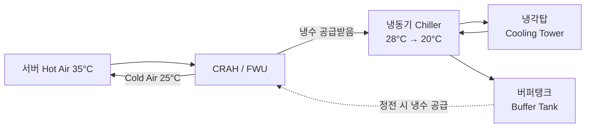

냉동기(Chiller)는 Hot Air로부터 넘겨받아 데워진 냉수(약 28℃)를 다시 약 20℃로 낮추는 장비다. 정전이 나면 냉동기도 함께 멈추기 때문에, 비상발전기가 정격 용량에 도달하기 전까지 버퍼탱크(Buffer Tank)에 미리 저장해둔 냉수를 FWU로 공급해 냉방시설의 연속성을 지킨다. 냉각탑(Cooling Tower)은 이렇게 서버가 만들어낸 열을 최종적으로 건물 밖으로 내보내는 장비라 옥상이나 실외에 설치한다.

### AI 서버의 랙밀도 문제

AI 서버는 전력밀도가 유별나게 높다. NVIDIA DGX H200은 8U 크기에 최대 10.2kW를 요구하는데, 이걸 랙 하나에 4대만 넣어도 랙밀도가 40.8kW/랙까지 치솟는다. 국내 일반적인 코로케이션 랙밀도가 8~12kW 수준인 것과 비교하면 3~5배다.

```
40.8kW/랙 × 4.5 m³/min/kW = 필요 풍량 183.6 m³/min
```

기존 15kW 랙밀도라면 FWU 높이 4.5m 정도로 충분했지만, 40.8kW/랙에서는 풍량을 2.7배 늘려야 하니 FWU 면적도 2.7배 키워야 한다. 그런데 층고를 물리적으로 그만큼 높이기가 쉽지 않고, 설령 가능하다 해도 서버 내부 냉각팬을 그만큼 키우는 것도 한정된 서버 섀시 안에서는 만만치 않다. 게다가 냉각팬을 키우면 팬 자체 소비전력이 늘어서 그걸 식힐 냉기가 또 필요해지는, 다소 답답한 순환이 생긴다.

왜 결국 액체로 넘어가는지는 물성치를 보면 명확해진다.

| 항목 | 공기 | 물 |
|------|------|-----|
| 밀도 | 약 1.2 kg/m³ | 약 1,000 kg/m³ |
| 비열 | 약 1.0 kJ/kg·K | 약 4.18 kJ/kg·K |
| 열전도율 | 약 0.026 W/m·K | 약 0.6 W/m·K |

열량은 `Q = 질량유량 × 비열 × 온도차`로 정해지는데, 밀도와 비열이 모두 압도적으로 높은 물은 같은 부피 기준으로 공기보다 3,000배 이상 많은 열을 옮길 수 있다.

### 액체 냉각: DLC

`DLC(Direct Liquid Cooling to Chip)`는 D2C(Direct-to-Chip)라고도 부르며, 발열이 가장 심한 GPU/CPU chip 위에 냉각패드(cold plate)를 바로 맞붙여 냉각하는 방식이다.

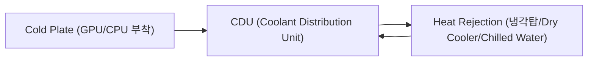

발열이 심한 부품은 cold plate로, 상대적으로 덜한 부품은 여전히 공랭으로 처리하기 때문에 `Hybrid cooling`(공냉 Air + 액냉 Liquid)이라고도 부른다. CDU는 모든 랙에 적당한 양의 냉수를 공급해야 하고, 열 순환을 위해 상단에 1.5m 이상의 여유 공간이 필요하다. NVIDIA의 최신 AI 서버는 45℃ 고온 액체 냉각을 적용해 물 사용량을 거의 제로에 가깝게 줄이고, 완전 액체 냉각(100% Liquid Cooling) 구조에서는 팬리스(Fanless) 설계로 소음과 공간까지 함께 개선한다.

| 구분 | 기존 데이터센터 | AI 데이터센터 |
|------|---------------|--------------|
| 랙밀도 | 4~15kW | 20~130kW+ |
| 냉각 방식 | Air Cooling only | Air Cooling + Liquid Cooling |
| 규모 | 대/중/소 | 대규모(50MW+) |
| 구동 방식 | 프로그램 구동 | ML, 추론 등 AI 서비스 |

### AI 랙의 발열과 네트워크 장비 열 설계

AI 클러스터에서는 GPU 서버만 열을 내는 게 아니다. 고속 스위치와 400G/800G optics도 만만치 않은 열과 전력을 낸다.

| 항목 | 소비 전력 |
|------|----------|
| DGX H100 4+2 redundancy | 4 × 3.3kW = 13.2kW |
| 64×400G 스위치 | 약 3kW |
| QSFP28 광모듈 | 약 3.2W |
| QSFP56-DD 광모듈 | 최대 약 12W |
| OSFP 광모듈 | 최대 약 15W |

64포트 스위치에 OSFP 64개가 꽂히면 광모듈만으로 `64 × 15W = 960W`가 나온다. 하나하나는 작아 보여도 포트 수가 수십 개를 넘어가면 광모듈 전력과 발열을 랙 설계에서 무시할 수 없는 이유다. 일반적인 데이터센터 랙 전력 예산(10~25kW)은 AI 서버 한 대가 스위치·optics와 함께 붙는 순간 거의 다 채워질 수 있는 수준이다.

데이터센터 전체 전력 소비에서 냉각 시스템은 IT 장비 다음으로 큰 비중(약 35~40%)을 차지한다.

| 영역 | 전력 소비 비중 |
|------|--------------|
| IT 장비 | 40~45% |
| 냉각 시스템 | 35~40% |
| 전력 분배, UPS, 조명, 기타 | 나머지 |

AI 랙을 설계할 때는 airflow 방향도 미리 정해야 한다.

| 방식 | 공기 흐름 | 장점 | 단점 |
|------|----------|------|------|
| Front-to-Back | 앞 → 뒤 | optics를 먼저 냉각, 일반적으로 선호 | 랙 전체 장비 방향 통일 필요 |
| Back-to-Front | 뒤 → 앞 | PSU를 먼저 냉각 | optics가 마지막에 식어 추가 heat sink 필요 가능 |
| Bidirectional Fan | 양방향 전환 가능 | 유연성 높음 | 장비 설계 복잡, 비용 높음 |

결국 GPU 서버, 고속 스위치, 400G/800G optics가 한꺼번에 열을 쏟아내는 AI 랙에서는 "몇 U가 남았는가"보다 "몇 kW와 몇 kW의 열을 감당할 수 있는가"가 먼저 확인해야 할 질문이 된다.

## 라우터 Load Balancing 내부 동작

### Load Balancing의 기본 위치

라우터는 RIB(Routing Information Base)에서 계산된 경로를 FIB(Forwarding Information Base)로 내리지만, 실제로 packet을 어디로 보낼지는 control plane이 아니라 PFE(Packet Forwarding Engine)나 forwarding ASIC 같은 dataplane component가 결정한다. ECMP(Equal Cost Multi-Path) destination이 있을 때 control plane이 하는 일은 next-hop 후보 여러 개를 설치하는 것까지고, packet 한 개 한 개를 어느 경로로 보낼지는 ASIC의 hash 로직이 정한다.

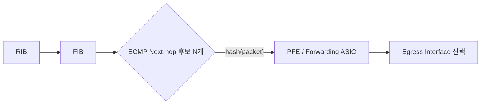

routing protocol은 목적지까지 비용이 같은 경로 여러 개가 있다는 것만 알려줄 뿐, 매 packet의 egress interface를 직접 고르지는 않는다.

### Router 내부 처리 Pipeline

라우터의 load balancing 동작은 아래 pipeline으로 추상화할 수 있다.

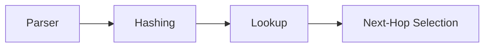

| 단계 | 역할 |
|------|------|
| Parser | packet header에서 route lookup에 사용할 field를 추출 |
| Hashing | 추출한 field로 고정 크기 hash key를 계산 |
| Lookup | packet field 또는 policy 기반으로 route를 검색 |
| Next-Hop Selection | 가능한 next-hop 목록 중 하나를 선택 |

Parser는 기본적으로 5-tuple(Source IP, Destination IP, Source Port, Destination Port, Protocol)을 뽑아낸다. 문제는 어떤 field를 기본으로 쓰고 어떤 field를 추가/제거할 수 있는지가 vendor, platform, OS 버전마다 제각각이라는 점이다. AI/RDMA 환경에서는 이 5-tuple만으로 entropy가 부족해질 수 있어, RoCEv2의 BTH(Base Transport Header)나 QP(Queue Pair) 정보를 추가로 넣는 경우가 많다.

Hashing 단계에서는 이렇게 뽑은 field를 CRC 계열 hash로 변환해 selector table의 index로 쓴다.

### Next-Hop Object와 Selector Table

Next-hop object는 단순 interface 하나가 아니라 여러 형태로 존재한다.

| Next-hop 종류 | 의미 |
|--------------|------|
| Unicast/direct/final next-hop | 특정 interface로 직접 전송 |
| Aggregate next-hop | LAG/ECMP member를 묶은 next-hop |
| Composite/hierarchical next-hop | 여러 forwarding decision을 계층화 |
| Indirect next-hop | route recursion 또는 tunnel/overlay와 연결 |

Selector table은 hash 결과를 실제 next-hop index로 매핑하는 table이다. 여기서 문제가 하나 생기는데, ECMP member 수가 바뀌면 이 table이 다시 계산되면서 멀쩡히 잘 돌던 flow가 갑자기 다른 path로 튀어버릴 수 있다는 점이다.

### Static LB의 한계와 Consistent Hashing

4개 path 중 하나가 down되면 selector table의 bucket이 대거 재배치되고, 그 여파로 기존 flow 상당수가 엉뚱한 interface로 옮겨간다. packet loss로 이어지지는 않지만, flow reorder나 stateful service의 session path 변화 같은 부작용이 남는다.

```mermaid
graph LR
    subgraph "일반 재계산: intf3 down"
        B1a[Bucket1] --> I1a[intf1]
        B2a[Bucket2] --> I2a[intf2]
        B3a[Bucket3] -.x.-> I3a[intf3 down]
        B3a --> I1a
        B4a[Bucket4] -->|재배치| I2a
    end
```

`consistent hashing`은 이 재배치 범위를 down된 interface를 가리키던 bucket으로만 좁힌다.

```mermaid
graph LR
    subgraph "Consistent Hashing: intf3 down"
        B1b[Bucket1] --> I1b[intf1]
        B2b[Bucket2] --> I2b[intf2]
        B3b[Bucket3] -.x.-> I3b[intf3 down]
        B3b -->|이 bucket만 재배치| I1b
        B4b[Bucket4] --> I4b[intf4]
    end
```

같은 down 상황에서도 Bucket4처럼 원래 intf4를 가리키던 bucket은 그대로 유지된다는 점이 핵심 차이다. link flap이나 ECMP member 변화가 잦은 환경에서는 이 차이가 flow churn을 크게 줄여준다.

### Symmetric Load Balancing

Stateful service 앞단에서는 흔히 이런 사고가 난다. client → firewall → server 방향 traffic과 server → firewall → client 방향 return traffic이 서로 다른 firewall instance를 지나가면, return packet을 받은 쪽 firewall은 해당 session을 만든 적이 없으니 state를 모른 채 drop해버린다.

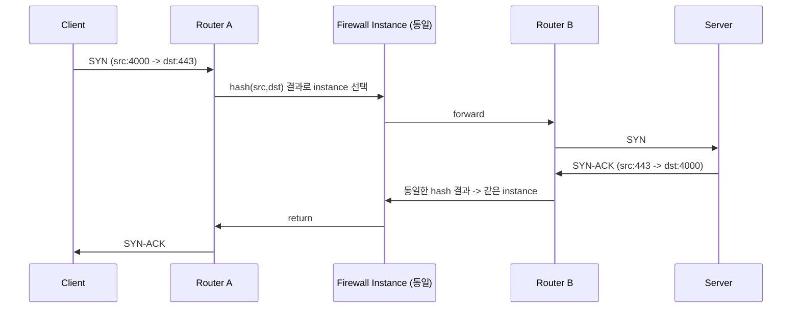

Symmetric LB는 양방향 traffic이 항상 같은 service instance를 지나도록 hash input과 next-hop sorting을 맞추는 방식이다. 이를 위해서는 양쪽 router의 selector/index ordering이 일관돼야 하고, IP address처럼 방향에 상관없이 값이 같은 stable value로 next-hop을 정렬할 수 있어야 하며, hashing에 쓰는 field도 forward/return 양방향에서 같은 결과가 나오도록 제한해야 한다.

### TLB와 CSDS: Service-Aware Load Balancing

**TLB(Traffic Load Balancer)**는 MX 라우터의 기능으로, Anycast service 앞단에서 service health를 확인하고 selector table과 forwarding 정책을 조정해 traffic을 정상 service node로만 보낸다. **CSDS(Centralized Service Delivery System)**는 여기서 한 단계 더 나아가 health check와 service steering을 함께 본다. MX Routing Engine이 SRX health checking을 수행하고, 그 결과를 바탕으로 source/destination hash로 계산한 session을 정상 SRX group에만 분산시키는 식이다. 둘 다 단순 ECMP라기보다는 service-aware load balancing에 가깝다.

### Platform별 차이

같은 vendor 제품군 안에서도 기본 동작은 서로 다르다.

| 구분 | MX Series | PTX Series | ACX Series | QFX Series |
|------|-----------|-----------|-----------|-----------|
| Default 동작 | No LB per prefix | Per Flow | No LB per prefix | No LB per prefix, layer2-payload 모드 |
| Default per-flow mode | ingress interface 설정에 의존 | 모든 field 사용 가능 | 기본 field 없음, 별도 설정 필요 | 5-tuple 기반 |
| Advanced feature | Consistent Hashing, Symmetric LB, ALB, Random, TLB/RE | Consistent Hashing, ALB, ECMP, Random Profile | Consistent Hashing | (s)DLB/RLB, Spray/Flowlet, GLB, QP hashing |

그래서 실무에서 load balancing 문제를 다룰 때 "ECMP가 켜져 있다"까지만 확인하면 절반만 본 셈이다. 해당 platform이 어떤 field를 hashing에 쓰는지, selector table과 next-hop object 구조가 어떤지, 어떤 advanced feature를 지원하는지까지 봐야 원인을 좁힐 수 있다.

## AI Fabric에서의 Load Balancing: SLB → DLB → GLB → TELB

### AI Fabric 트래픽이 일반 데이터센터와 다른 이유

일반 데이터센터 traffic은 수많은 user와 application이 만들어내는 짧은 flow가 대부분이다. flow 다양성이 크고 entropy가 높다 보니 전통적인 SLB(Static Load Balancing, 5-tuple 기반 ECMP)만으로도 웬만하면 여러 path에 고르게 흩어진다.

AI/ML RoCEv2 fabric은 정반대다. GPU 간 동기화 traffic이 대부분이라 flow 수는 적고, source/destination pair는 고정돼 있으며, 그 대신 하나하나가 덩치 큰 elephant flow다.

| 구분 | 일반 데이터센터 | AI backend fabric |
|------|---------------|-------------------|
| Flow 수 | 많음 | 적음 |
| Flow entropy | 높음 | 낮음 |
| Flow 지속시간 | 짧음 | 김(medium/long-lived) |
| Traffic 패턴 | 다수의 작은 flow | 소수의 elephant flow, 동기화된 burst |
| Traffic 특성 | 일반 TCP | RoCEv2/RDMA 중심 |

fabric 전체 capacity는 충분한데도 하필 몇 개 안 되는 flow가 hash 결과로 같은 spine, 같은 uplink에 몰리면 그 링크만 혼잡해지고 GPU 간 동기화가 지연된다. 이게 `hash polarization` 문제다. 그래서 AI fabric의 load balancing은 spine을 몇 대 더 놓느냐의 문제가 아니라, hash entropy, RoCEv2 BTH/QP 정보, local/remote link quality, flowlet gap, packet reordering, tenant/job orchestration을 한꺼번에 고려해야 풀리는 문제가 된다.

### SLB의 한계와 Enhanced/QP 기반 Hashing

기본 ECMP는 Source/Destination IP, Source/Destination Port, Protocol의 5-tuple로 hash key를 계산한다. RoCEv2/RDMA traffic은 UDP 5-tuple만 보면 서로 비슷한 flow가 많아지기 쉬운데, 여기에 QP 정보를 hashing 입력으로 추가하면 path 선택의 variability가 늘어나 여러 link에 더 고르게 퍼진다.

| 구분 | 기본 ECMP | QP 기반 Enhanced Hashing |
|------|-----------|--------------------------|
| Hash 입력 | 5-tuple | 5-tuple + QP 관련 정보 |
| AI RDMA flow에서의 entropy | 부족할 수 있음 | 개선 |
| 정적 ECMP 환경에서의 hash polarization | 위험 존재 | 완화 |

### DLB: Dynamic Load Balancing

`DLB(Dynamic Load Balancing)`는 static hash 결과만 보는 대신, local switch link의 실제 quality를 함께 본다. uplink queue depth, bandwidth utilization, member loading 같은 값을 보고 그 순간 더 나은 egress link를 고른다.

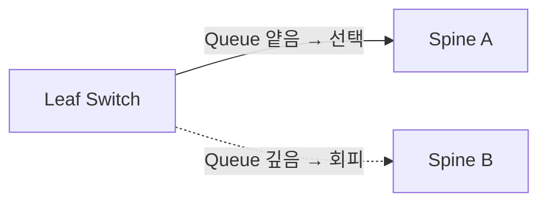

DLB가 하는 일은 ECMP member별 flow 수가 아니라 실제 link load를 보는 것, 혼잡한 uplink로 새 flow가 계속 몰리는 것을 막는 것, 그리고 AI/ML elephant flow가 특정 spine에 쏠리는 상황을 local 관점에서 완화하는 것이다. QFX 계열은 Broadcom ASIC의 DLB 기능을 사용하는데, Tomahawk/Trident 계열 ASIC이 ingress port link utilization, virtual output queue depth, port quality metric, flowlet gap 또는 packet spray mode 정보를 실시간으로 모니터링해 이 판단에 활용한다.

### DLB Flowlet Mode

`Flowlet mode`는 하나의 flow를 packet 단위로 쪼개지 않고, burst 사이의 idle gap을 기준으로 조금 더 큰 단위인 flowlet으로 나눈다. flow가 일정 시간 이상 멈추면 다음 flowlet은 다른 path로 보낼 수 있다는 아이디어다.

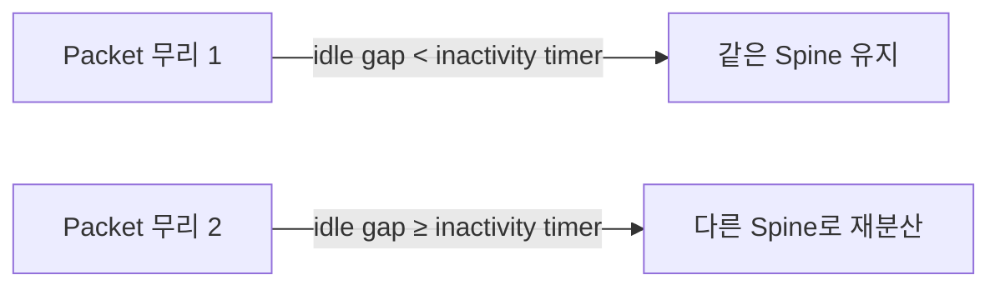

여기서 튜닝 포인트는 `inactivity timer` 하나다. 너무 짧으면 같은 burst 내부 packet도 다른 path로 갈 수 있어 out-of-order 위험이 커지고, 너무 길면 path를 바꿀 기회 자체가 줄어 load balancing 효과가 약해진다. packet spraying보다 reordering 위험이 낮고 per-flow ECMP보다는 link utilization이 나아서, AI fabric에서 현실적인 절충안으로 많이 쓰인다. link 상태가 나빠졌을 때 이후 flowlet만 다른 path로 옮기는 reactive rebalancing에도 그대로 쓸 수 있다.

### GLB: Global Load Balancing

DLB는 local 장비가 보는 link quality까지만 안다는 한계가 있다. `GLB(Global Load Balancing)`는 neighbor가 광고하는 dynamic metric을 받아서 spine 이후 구간의 remote congestion까지 반영하려는 접근이다.

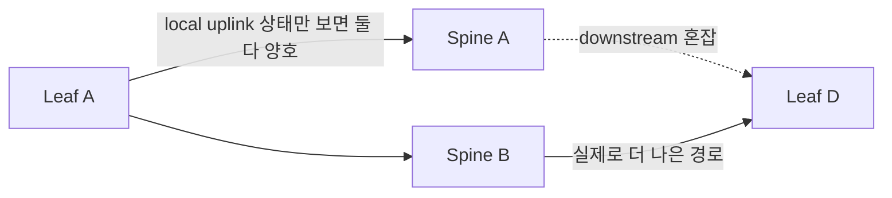

LeafA 입장에서는 SpineA와 SpineB 둘 다 좋아 보일 수 있지만, SpineA에서 LeafD로 가는 구간이 혼잡하다면 실제 end-to-end 품질은 SpineB가 낫다. 이걸 판단하려면 local uplink queue depth와 utilization뿐 아니라 spine 이후 remote link quality, next-hop 너머의 next-next-hop 정보, path quality heartbeat나 telemetry까지 필요하다. leaf가 단순히 next-hop spine만 아는 구조로는 부족하기 때문에, BGP `NNHN(Next-Next-Hop Nodes)` capability가 이 정보를 실어 나르는 방법으로 언급된다.

### TELB: Traffic Engineering 기반 배치

`TELB(Traffic Engineering-Based Load Balancing)`는 traffic을 ECMP hash에 맡기지 않고, tenant·GPU·QPAIR·UDP port range·workload 정보를 근거로 특정 path 또는 path color에 아예 의도적으로 꽂아 넣는 방식이다.

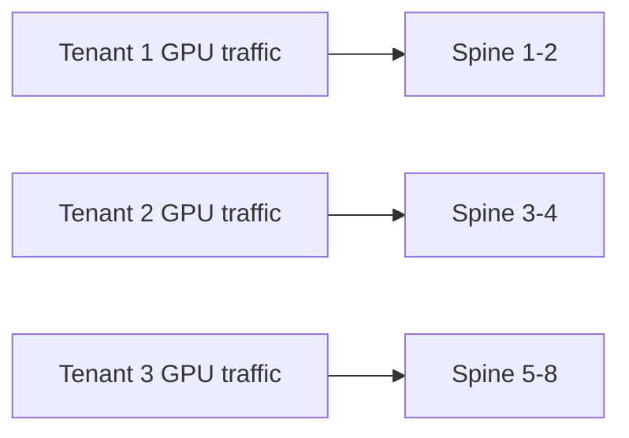

```
SLB   : hash가 알아서 분산
DLB   : 덜 바쁜 local uplink로 분산
GLB   : spine 이후 원격 link 품질까지 보고 분산
TELB  : workload/tenant/GPU 특성을 알고 특정 path로 의도적으로 배치
```

multi-tenant ROD(Rail-Optimized Design)/RoCEv2 fabric에서는 tenant별 job 성능이 얼마나 예측 가능한지가 중요해진다. 특정 tenant traffic을 하나의 spine이나 제한된 path set으로 몰아줄 수는 있지만, 너무 강하게 고정(pinning)하면 그 tenant의 job이 bursty할 때 오히려 congestion이 재발한다. 그래서 GPU traffic을 여러 QPAIR나 UDP port range로 쪼개고, 각 range를 서로 다른 spine/path/color에 배치하는 절충이 쓰인다.

Controller 기반 TELB는 leaf/spine link utilization, queue depth, congestion signal, ECN/PFC/DCQCN 지표, tenant/job 정보, GPU allocation 같은 fabric 전체 telemetry를 모아 path를 계산한다. 전체 상태와 workload 정보를 함께 보고 정교하게 배치할 수 있다는 게 장점이지만, controller·orchestrator·switch policy를 다 엮어야 해서 운영 복잡도는 확실히 올라간다.

### Per-Packet Load Balancing과 Packet Spraying

`Per-packet load balancing`은 하나의 flow 안에서도 packet 개별 단위로 여러 ECMP path에 흩뿌리는 방식이다. link 활용률만 놓고 보면 가장 강력하지만, path별 queue 상태와 latency가 다르면 목적지에 도착하는 순서가 뒤섞인다.

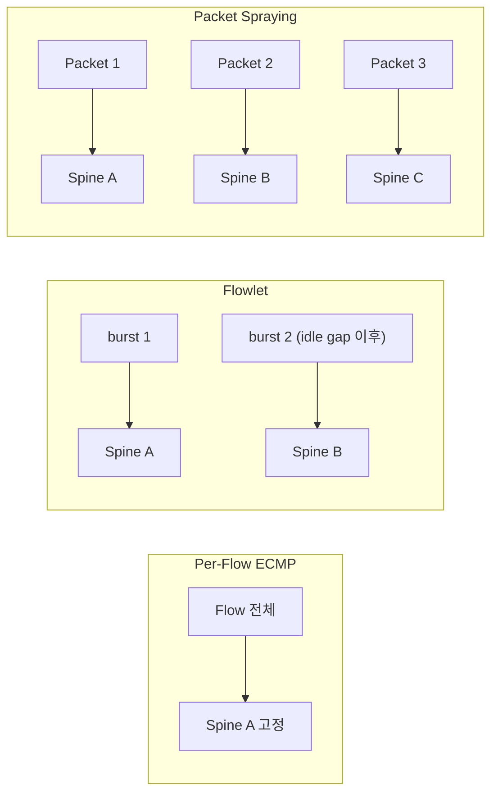

세 방식은 분산 단위가 flow → flowlet → packet 순으로 잘게 쪼개지고, 그만큼 link 활용은 좋아지지만 reordering 위험도 함께 커진다. 수신 NIC는 이 out-of-order packet을 처리하기 위해 buffer 저장 → sequence 확인 → 누락 packet 확인 → 순서 재정렬 → application/RDMA engine 전달 과정을 거쳐야 한다.

| 방식 | 설명 | 장점 | 주의점 |
|------|------|------|--------|
| Random/Round-robin Spray | packet을 단순히 여러 ECMP port에 뿌림 | 구현 단순, link 분산 효과 큼 | path 품질을 보지 않아 reordering/혼잡 위험 |
| DLB Per-Packet Mode | packet 단위로 보내되 link quality를 참고 | random spray보다 지능적 | NIC reordering 지원 필요 |
| Selective Packet Spraying | 특정 traffic에만 packet spraying 적용 | 위험 traffic을 제한하고 elephant flow에 집중 | RoCEv2 opcode/ACL/TCAM match 필요 |

RDMA Write First/Middle/Last 구조는 out-of-order 도착 시 수신 NIC가 buffering을 해야 해서 packet spraying과 궁합이 나쁘다. 반면 NVIDIA ConnectX-5 이후가 지원하는 `RDMA Write Only`는 모든 packet이 RETH(RDMA Extended Transport Header)를 담고 있어 self-contained하기 때문에 packet spraying과도 잘 맞는다. 최근 AI/ML용 고성능 NIC가 RDMA write opcode traffic 일부에 대해 reordering을 처리할 수 있게 되면서, packet spraying이 다시 현실적인 선택지로 검토되는 흐름이다.

### 종합 비교

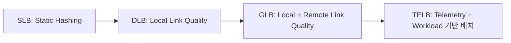

| 메커니즘 | 판단 범위 | 분산 단위 | 장점 | 한계 |
|---------|----------|----------|------|------|
| SLB | packet header/hash | flow | 단순, 일반 DC traffic에 적합 | low entropy AI flow에 취약 |
| Weighted ECMP | hash + weight | flow | link capacity 차이 반영 가능 | 실제 congestion 상태 반영은 제한적 |
| DLB Assigned-Flow | local link quality | flow | local uplink 혼잡 완화 | remote path 품질은 모름 |
| DLB Flowlet | local link quality + idle gap | flowlet | reordering 위험과 분산 효과 균형 | inactivity timer tuning 필요 |
| DLB Per-Packet | local link quality | packet | link utilization 우수 | NIC reordering 필요 |
| GLB | local + remote link quality | flow/flowlet | end-to-end path 품질 반영 | BGP/heartbeat/telemetry 연동 필요 |
| TELB | telemetry + workload/tenant 정보 | policy/path color | 예측 가능한 tenant/job 성능 설계 가능 | orchestration과 운영 복잡도 증가 |

정리하면 spine 수를 늘리는 것만으로는 부족하고, flow가 실제로 여러 path에 흩어지는지가 관건이다. RoCEv2 entropy를 5-tuple까지만 볼지 BTH/QP까지 넣을지부터 점검해야 하고, DLB는 static ECMP보다 AI burst traffic에 잘 맞는 기본 개선책이다. flowlet mode는 순서 보존과 재분산 사이의 안정적인 절충점이고, per-packet은 NIC의 reordering 능력이 먼저 확인돼야 의미가 있다. GLB는 local link만으로는 안 보이는 downstream congestion까지 잡아낼 때 유리하고, TELB는 orchestrator가 tenant·GPU·QPAIR·UDP port range를 이미 알고 있는 multi-tenant/job-aware fabric에서 효과가 크다.

## NCCL 통신 그룹 구성과 AllReduce 상세 동작

### NCCL Unique ID 배포: Rendezvous

여러 노드의 GPU가 분산 학습 중 통신하려면 먼저 누가 참여하고 데이터를 어떻게 교환할지 정의하는 공유 컨텍스트, 즉 communicator에 합의해야 한다. NCCL은 이 합의를 위해 `NCCL Unique ID`라는 식별자를 쓰는데, 지정된 master process가 한 번 생성해서 학습 작업의 다른 모든 process에 뿌린다.

훈련 작업이 `torchrun` 명령으로 시작되면 PyTorch의 분산 프레임워크는 각 노드에서 GPU당 하나씩 process를 띄운다. 이 process들은 global rank ID로 구분되고, 보통 rank 0에 master 역할이 주어진다.

```
global rank = node_rank * nproc_per_node + local_rank
```

| 항목 | 계산 | 결과 |
|------|------|------|
| Host A, GPU 0 | 0 × 4 + 0 | Rank 0 (master) |
| Host A, GPU 1 | 0 × 4 + 1 | Rank 1 |
| Host A, GPU 2 | 0 × 4 + 2 | Rank 2 |
| Host A, GPU 3 | 0 × 4 + 3 | Rank 3 |
| Host B, GPU 0 | 1 × 4 + 0 | Rank 4 |
| Host B, GPU 1 | 1 × 4 + 1 | Rank 5 |
| Host B, GPU 2 | 1 × 4 + 2 | Rank 6 |
| Host B, GPU 3 | 1 × 4 + 3 | Rank 7 |

Host A의 GPU 0(global rank 0)이 master가 되어 `--master_addr`, `--master_port` 값으로 TCP listener를 연다. 나머지 rank는 이 master와 handshake를 시작하는데, 같은 host라면 loopback(127.0.0.1)을, 다른 host라면 master의 실제 IP를 목적지로 쓴다.

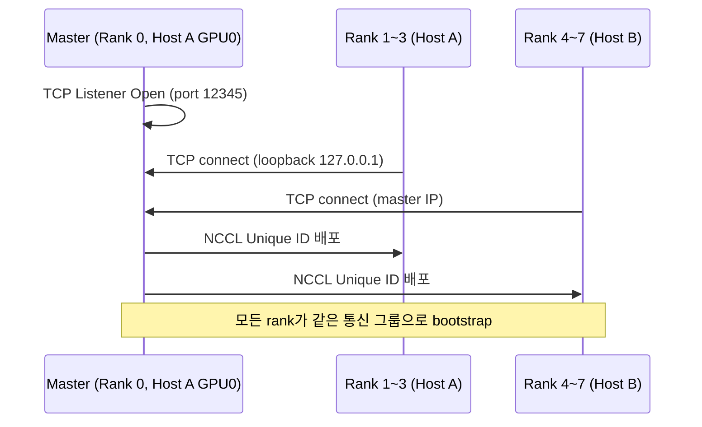

이 과정이 rendezvous다. Layer 3 multicast의 Rendezvous Point(RP)와 느슨하게 닮은 구석이 있는데, 둘 다 여러 참여자가 하나의 공유 지점을 거쳐 조정된다는 점에서 그렇다. NCCL Unique ID는 작업 단위의 namespace 역할을 해서, 같은 노드 집합에서 여러 학습 작업이 동시에 돌아가도 서로 다른 작업의 process끼리 섞이지 않게 막아준다.

### Broadcast로 모델 파라미터 동기화

모든 rank가 master와 TCP 연결을 맺고 나면, NCCL은 tree topology를 구성해 master가 가진 모델 파라미터를 나머지 GPU 전체로 뿌린다. 이때 쓰는 collective가 `Broadcast`다.

같은 host 안의 GPU끼리는 NVLink를 통한 direct memory copy(DMA)로 처리되어 CPU나 OS 개입 없이 매우 빠르게 끝난다. 반면 서로 다른 host의 GPU는 QP(Queue Pair)를 통해 RoCEv2 기반 백엔드 네트워크(routed Layer 3 Clos fabric)를 거쳐야 한다. 이 시점에서 각 process는 이미 모델의 로컬 복사본을 갖고 있고, 모든 GPU가 동기화된 학습을 시작할 준비를 마친 상태가 된다.

### Ring AllReduce = ReduceScatter + AllGather

forward pass에서 각 GPU가 gradient를 계산하고 나면, 클러스터 전체 GPU의 gradient를 하나로 합쳐야 한다. 단방향 ring topology에서 AllReduce collective는 `ReduceScatter`와 `AllGather` 두 단계로 나뉜다.

예시 환경은 Host A, Host B 각각 GPU 2개(global rank 0~3)로 구성한 4-rank ring이다. 각 GPU는 1024개의 gradient를 4개의 chunk(A/B/C/D, 각 256개)로 쪼갠다. host 내부는 NVLink, host 사이는 RoCEv2로 연결된다.

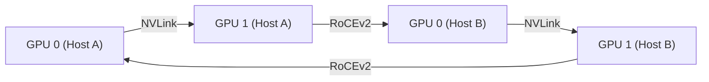

### ReduceScatter 단계

각 rank는 자신이 맡은 chunk를 ring의 다음 rank로 보내고, 이전 rank로부터 받은 chunk를 자신의 로컬 chunk에 더한다(reduce). 4-GPU ring에서는 이 과정이 3번 반복된다.

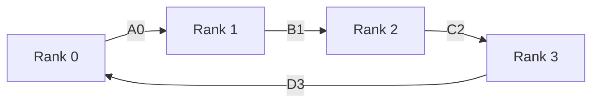

| Iteration | 전송 내용 | 결과 |
|-----------|----------|------|
| 1 | Rank 0→1: chunk A0, Rank 1→2: chunk B1, Rank 2→3: chunk C2, Rank 3→0: chunk D3 | 각 rank가 인접 rank의 chunk 하나를 받아 로컬 chunk와 합산 (1차 부분 축소) |
| 2 | Rank 0→1: D3+D0, Rank 1→2: A0+A1, Rank 2→3: B1+B2, Rank 3→0: C2+C3 | 각 rank가 2차 부분 축소된 chunk를 보유 |
| 3 | Rank 0→1: C2+C3+C0, Rank 1→2: D3+D0+D1, Rank 2→3: A0+A1+A2, Rank 3→0: B1+B2+B3 | ReduceScatter 완료: 각 rank가 4개 GPU 전체의 기여를 포함한 완전히 축소된 chunk 하나를 보유 |

3번째 iteration이 끝나면 각 rank는 완전히 축소된 chunk를 하나씩 갖게 되는데, 재미있게도 그게 원래 자기가 담당하던 chunk가 아니다.

| Rank | 보유한 완전 축소 chunk |
|------|----------------------|
| Rank 0 | B = B0+B1+B2+B3 |
| Rank 1 | C = C0+C1+C2+C3 |
| Rank 2 | D = D0+D1+D2+D3 |
| Rank 3 | A = A0+A1+A2+A3 |

### AllGather 단계

이제부터가 AllGather다. 목표는 이 완전히 축소된 chunk를 모든 GPU에 다시 뿌려서, 각 GPU가 A/B/C/D 4개 chunk 모두의 완전한 복사본을 갖게 만드는 것이다. reduce(합산)는 더 이상 필요 없고 그냥 전달만 하면 되지만, ring을 한 바퀴 다 돌아야 하므로 역시 3번의 iteration이 걸린다.

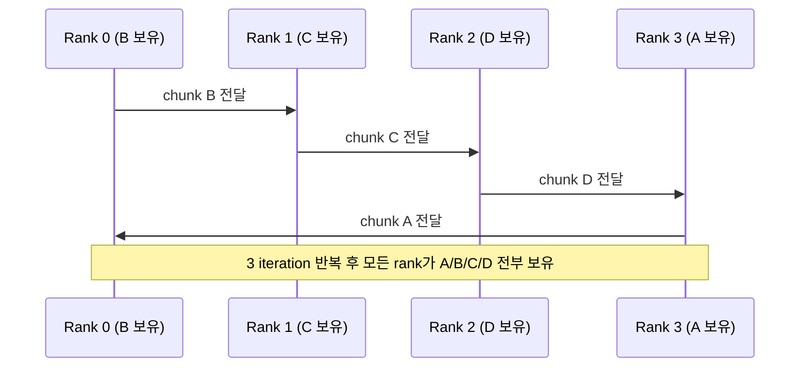

3번의 iteration이 끝나면 모든 GPU가 A, B, C, D 4개 chunk의 완전히 축소된 버전을 전부 갖게 되어 AllReduce가 완료된다.

```
ReduceScatter (N-1 iteration) : 각 rank가 정확히 하나의 완전 축소 chunk 보유
AllGather (N-1 iteration)     : 완전 축소된 chunk를 모든 rank에 복제
= AllReduce 완료: 모든 GPU가 동일한 완전 축소 gradient 세트 보유
```

이후 각 GPU는 이 동일한 gradient로 로컬 모델 weight를 업데이트하고 다음 iteration으로 넘어간다.

## 마무리

- 데이터센터 전력계통은 초고압 수전 → 변압 → UPS/배터리/EDG로 이어지는 무정전 체계이고, PUE는 이 과정에서 생기는 냉각·전력분배 오버헤드를 보여주는 핵심 지표다.

- 공랭은 냉방부하(kcal/h) = 0.29 × 온도차 × 풍량 공식으로 설계되지만, AI 서버의 랙밀도(40kW대 이상)는 이 공식의 물리적 한계를 넘어선다. 물의 열용량이 공기보다 3,000배 이상 높기 때문에, AI 데이터센터는 DLC 같은 액체 냉각을 공랭과 병행하는 하이브리드 구조로 옮겨가고 있다.

- 라우터의 load balancing은 Parser → Hashing → Lookup → Next-hop Selection pipeline 위에서 동작한다. selector table 재계산 문제는 consistent hashing으로, 양방향 세션 일관성 문제는 symmetric LB로 풀어낸다.

- AI Fabric은 flow 수가 적고 elephant flow가 많아 5-tuple 기반 SLB만으로는 hash polarization에 취약하다. DLB는 local link quality를, GLB는 spine 이후 remote link quality까지, TELB는 tenant/workload 정보까지 반영하며 점점 더 많은 상태와 의도를 끌어다 쓴다.

- NCCL의 Ring AllReduce는 ReduceScatter(N-1 iteration으로 각 rank가 완전 축소된 chunk 하나씩 보유)와 AllGather(N-1 iteration으로 그 chunk들을 모든 rank에 복제)로 구성된다. host 내부는 NVLink DMA, host 사이는 RoCEv2 QP를 타므로 같은 collective 안에서도 통신 경로가 완전히 다르다.

## 참고

- [All About Load Balancing in your Routers - Juniper](https://www.juniper.net)
- [Efficient Load Balancing in AI/ML RoCEv2 Fabric - gasidaseo.notion.site](https://gasidaseo.notion.site/Efficient-Load-Balancing-38d50aec5edf8085aeadc7d2ea91d468)
- [Analysis of Flow Engineering and Balancing Options on AI Fabrics - OCP Global Summit 2025](https://www.youtube.com/watch?v=pP46fT1EN8U)
- [Nektimes: NCCL - GPU Cluster Communication Model](https://nektimes.com)
- [AI DC에서의 딥러닝 여정 - adcs.restack.tech](https://adcs.restack.tech/deep-learning-for-network-engineers/week04/)
- [AI시대에 난생처음 들어보는 데이터센터 이야기 - 책]
- [NVIDIA, AI 서버 냉각 혁신으로 물 사용량 제로 달성 - devday.kr](https://devday.kr/article/nvidia-45c-liquid-cooling-near-zero-water-use)
- [Understanding Direct-to-Chip Cooling in HPC Infrastructure - Vertiv](https://www.vertiv.com/en-us/insights/articles/educational-articles/understanding-direct-to-chip-cooling-in-hpc-infrastructure-a-deep-dive-into-liquid-cooling/)
- [Energy demand from AI - IEA](https://www.iea.org/reports/energy-and-ai/energy-demand-from-ai)
- [IB, RoCEv2 & GPU 클러스터 네트워크 설계](./week2-ib-roce-gpu-cluster-network.md)
