---
tags:
  - AI Datacenter Network
  - Failure Recovery
  - Streaming Telemetry
  - gNMI
  - IFA
  - Storage Network
  - NVMe-oF
  - Scale-Up
  - UALink
  - SUE-T
  - UEC
  - Ultra Ethernet
---

# AI DC 장애 대응, 모니터링, 스토리지 & Scale-Up, UEC

> 대규모 GPU 클러스터의 장애 통계와 복구 전략, SNMP를 넘어서는 streaming telemetry와 IFA 기반 모니터링, AI 특화 스토리지 설계, 그리고 Scale-up(UALink/SUE-T)과 UEC(Ultra Ethernet)로 이어지는 차세대 AI Fabric 기술을 정리한다.

## AI DC 장애

### 대규모 학습에서 장애는 예외가 아니라 전제다

Meta가 Llama3를 학습시킨 사례를 보면 장애의 규모가 드러난다. GPU 16,384개를 동원한 54일간의 학습 기간 동안 **419건의 장애가 발생했다. 평균 3시간마다 1건꼴**이다. 원인 비율은 GPU/NVLink 30%, HBM memory 17%, network와 software 합쳐 53%로, 네트워크와 소프트웨어 스택이 장애의 절반 이상을 차지한다.

이 정도 규모에서 학습을 지속하려면 사람이 매번 개입할 수 없다. Meta가 쓴 방어 수단은 **Recovery Checkpointing**이다. Llama3 405B 기준 체크포인트 하나의 전체 크기는 6.5TB에 달하고, 저장 주기도 계층별로 나눠 관리한다. 메모리 레벨은 5분마다, 로컬 스토리지는 30분마다, 원격 스토리지는 몇 시간마다 저장하는 다단계 전략이다. 장애가 발생하면 마지막 저장 지점(last save)으로 롤백해서 이어서 학습한다.

여기에 사람이 끼어들지 않는 **Automated Recovery Pipeline**이 붙는다.

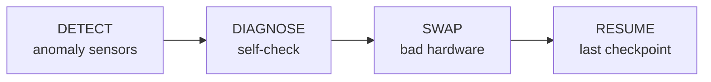

419건의 장애 중 사람이 개입한 것은 단 3건이었다. 54일 중 48일이 effective training이었고, 나머지 6일은 장애 대응에 소비됐다. 즉 장애 자체를 없애는 것이 아니라, 장애가 나더라도 사람 없이 빠르게 감지·진단·교체·재개하는 파이프라인이 대규모 학습의 실질적인 가용성을 결정한다.

### 10만 GPU 클러스터의 장애 유형 분석

Meta의 운영 경험을 바탕으로 한 발표는 장애를 컴포넌트 단위로 세분화한다. Pre-training 단계에서 수집한 장애 원인 분포는 다음과 같다.

| Component | Count | 비율 |
|---|---|---|
| GPU HBM3 Memory | 155 | 22.9% |
| PCIe Device | 122 | 18.0% |
| NCCL Watchdog Timeouts | 61 | 9.0% |
| Faulty GPU Compute | 50 | 7.4% |
| Software Bug | 48 | 7.1% |
| Host Maintenance | 42 | 6.2% |
| Kernel Fault | 39 | 5.8% |
| System Reboot | 38 | 5.6% |
| Numerics/Silent Data Corruption | 37 | 5.5% |
| Network Switch/Cable | 36 | 5.3% |
| SSD | 30 | 4.4% |
| GPU SRAM Memory | 8 | 1.2% |
| Unknown | 7 | 1.0% |
| System Memory | 2 | 0.3% |
| System Cooling | 2 | 0.3% |
| GPU Thermal Interface + Sensor | 1 | 0.2% |

약 10만 GPU 규모에서는 **18분마다 장애가 발생하고, 재시작에 약 10분이 걸려 실제 유효 학습 시간은 8분밖에 남지 않는다**는 수치가 제시된다. 전체 가동 시간의 상당 부분이 학습이 아니라 복구에 소비된다는 뜻이다.

항목별로 보면 성격이 다르다.

- **GPU HBM3 Memory(22.9%, 최다)**: 모델 파라미터·activation·gradient·optimizer state를 계속 읽고 쓰는 초고속 메모리다. 일부는 ECC로 교정되고, 일부는 Xid error나 GPU reset으로 이어지며, 일부는 계산 결과가 조용히 틀려지는 silent data corruption으로 번질 수 있다.
- **PCIe Device(18.0%)**: GPU·NIC·NVMe SSD가 CPU와 연결되는 고속 버스다. 경로가 불안정하면 GPU가 사라지거나 리셋되고, NIC link error나 NVMe timeout으로 나타난다. NCCL timeout의 실제 원인이 특정 서버의 PCIe device reset인 경우가 많아 실무에서 원인 추적이 까다롭다.
- **NCCL Watchdog Timeout(9.0%)**: NCCL 통신이 정해진 시간 안에 끝나지 않았다는 신호일 뿐, 원인은 특정 GPU 정지, NIC 문제, RoCE 패킷 손실/재전송, 스위치 링크 오류, PFC pause storm, PCIe device reset, OS kernel hang 등 다양하다.
- **Faulty GPU Compute(7.4%)**: GPU 계산 유닛 자체 문제로 GPU reset, CUDA error, Xid error가 나타난다. correctness와 직결되기 때문에 반복되는 GPU는 즉시 격리하고 교체 대상으로 분류한다.
- **Software Bug(7.1%)**: 학습 코드, 프레임워크, 드라이버, 분산 학습 라이브러리, 스케줄러의 버그를 포함한다.
- **Kernel Fault/System Reboot(5.8%/5.6%)**: 커널 panic, driver crash, soft lockup, OOM 등이며, 동기식 학습에서는 노드 하나의 재부팅만으로도 전체 Job이 실패할 수 있다.
- **Numerics/Silent Data Corruption(5.5%)**: NaN, Inf, overflow, gradient explosion 같은 수치 문제다. Silent Data Corruption은 명시적 오류 없이 계산 결과가 잘못되는 경우라 추적이 특히 어렵다.
- **Network Switch/Cable(5.3%)**: 비율은 낮아 보이지만 영향 범위가 크다. GPU HBM/PCIe 문제는 개별 노드에 국한되지만, Spine/ToR 스위치나 광모듈 문제는 여러 서버, 여러 Job에 동시에 영향을 준다. 포트 하나의 symbol error는 포트가 완전히 다운되지 않고 Up 상태로 남아 있으면 찾기 어렵다.
- **SSD(4.4%)**: 데이터 로딩 지연, checkpoint 실패로 이어진다. checkpoint 파일이 워낙 크기 때문에 스토리지 경로가 불안정하면 복구 시간도 함께 늘어난다.
- **System Cooling/Thermal(0.3%/0.2%)**: 비율은 낮지만 냉각이 부족하면 GPU가 thermal throttling으로 클럭을 낮추고, 이렇게 느려진 GPU가 NCCL collective에서 straggler가 되어 전체 Job을 늦춘다.

NCCL Watchdog Timeout이 발생했을 때의 실무 진단 흐름은 다음과 같이 정리할 수 있다.

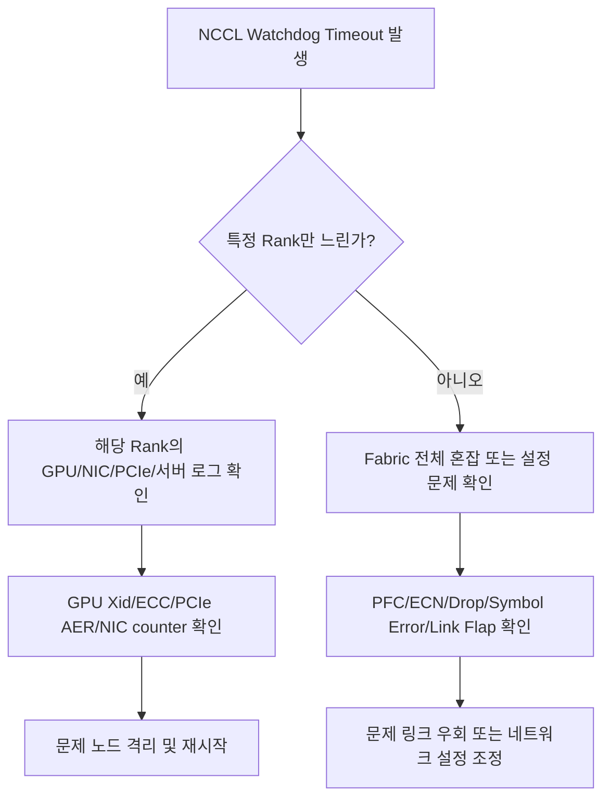

초심자가 흔히 빠지는 오해는 NCCL timeout을 무조건 네트워크 문제로 단정하는 것이다. 실제로는 느린 GPU 하나가 전체 collective 통신을 막아서 발생하는 경우도 많다.

### 네트워크 장애와 OCP MRC: OpenAI의 Multipath Reliable Connection

OpenAI는 대규모 학습 클러스터의 네트워크 혼잡·장애·라우팅 복잡도를 줄이기 위해 **MRC(Multipath Reliable Connection)**라는 GPU 네트워킹 프로토콜을 새로 설계했다. 이 기술은 OCP(Open Compute Project) 커뮤니티에서도 10만 GPU 클러스터에 적용된 사례로 소개된다.

AI 학습은 보통 synchronous training이다. 모든 GPU가 함께 계산하고, 중간 결과와 gradient를 동기화하며, 가장 늦은 GPU나 가장 늦은 전송을 기다린다. 그래서 AI 학습 네트워크에서 중요한 것은 평균 throughput만이 아니라 **tail latency와 outlier transfer**다. 하나의 전송이 늦게 도착하면 나머지 GPU가 idle 상태로 대기하면서 전체 iteration time이 늘어난다. 이런 특성 때문에 작은 네트워크 장애도 학습 성능에 크게 증폭되어 나타나는데, 이를 **failure amplifier**라고 표현한다.

| 문제 | AI 학습에 미치는 영향 |
|---|---|
| Network congestion | 특정 링크에 트래픽이 몰려 GPU가 대기 |
| Link failure | 경로 재계산 또는 Job failure로 이어질 수 있음 |
| Switch failure | 대규모 flow 중단 가능 |
| Routing convergence delay | 수초~수십초 stall 가능 |
| Link flap | synchronous job 전체에 영향 확대 |

전통적인 RoCE 기반 AI 네트워크는 하나의 flow를 보통 하나의 경로에 고정한다. 이 방식은 GPU pair가 고정되고 flow entropy가 낮은 AI 트래픽 특성상 몇 개의 링크에 트래픽이 쏠리는 문제를 만든다.

| 기존 방식의 문제 | 설명 |
|---|---|
| 경로 층화 | 서로 다른 flow가 같은 병목 경로를 통과 |
| Low entropy | GPU pair가 고정되어 flow 선택이 반복됨 |
| Elephant flow | 하나의 flow 크기가 매우 큼 |
| Plane 활용 부족 | flow 하나가 여러 plane을 쓰지 못함 |
| 장애 취약성 | 경로 재계산에 route convergence 시간이 필요 |
| 운영 복잡도 | 동적 라우팅/BGP 문제 발생 |

MRC는 이 문제를 세 가지 축으로 해결한다.

| 핵심 기술 | 설명 | 효과 |
|---|---|---|
| Multi-plane network | 800G NIC를 여러 100G 링크(plane)로 쪼개 병렬 네트워크 구성 | 2-tier만으로 10만+ GPU 확장, 전력/장비 수 감소 |
| Adaptive packet spraying | 하나의 전송을 수백 개 경로로 packet 단위 분산 | core congestion 감소, flow 간 지연 편차 감소 |
| SRv6 source routing | 송신자가 packet 경로를 직접 지정 | 동적 라우팅 복잡도 감소, 장애 경로 빠른 우회 |

MRC의 multi-plane 구조는 2-tier(Tier0/Tier1)만으로 8개 plane을 구성하고, **512개의 Tier0 스위치 x 256 GPU = 131,072 GPU**까지 확장할 수 있는 규모를 제시한다. 여기서 segment는 패킷이 거쳐야 할 특정 지점이나 동작을 의미하며, SRv6에서는 이를 IPv6 주소 형태로 표현한다(예: Segment1=Switch A, Segment2=Switch B, Segment3=Switch C, Destination GPU). MRC는 단순한 스위치 기능이 아니라 NIC, 프로토콜, 토폴로지, 라우팅 방식까지 함께 바꾼 end-to-end AI 네트워크 설계라는 점이 핵심이다.

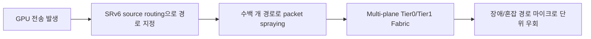

## AI DC 네트워크 모니터링

### SNMP Polling의 한계

1988년에 설계된 SNMP는 폴링 기반 관리 프로토콜이다. 관리 시스템이 60~300초 주기로 장비에 질의하는 이 방식은 저속 네트워크에는 충분했지만, AI 데이터센터의 800G Fabric이나 실시간 서비스망에서 발생하는 짧은 혼잡·상태 변화를 놓치기 쉽다.

AI/고속 네트워크에서 SNMP가 약한 이유는 다섯 가지로 정리된다.

1. **폴링 granularity 한계**: 1분 단위로 공격적으로 폴링해도 초 단위 이벤트는 사라진다. 800G Fabric에서는 큐가 100ms 이하로 차고 빠질 수 있다.
2. **장비 CPU overhead**: 인터페이스와 장비 수가 많아질수록 매 폴링 주기마다 예측 가능한 CPU 부하가 생긴다.
3. **이벤트 의미론 부족**: 특정 시점의 카운터나 상태만 읽을 뿐, 무엇이 언제 바뀌었고 어떤 원인과 연결되는지 전달하지 못한다.
4. **Counter wrap 문제**: 400G 인터페이스에서 32-bit SNMP counter는 7초 이내에 wrap될 수 있다. 대부분 64-bit counter를 쓰지만, 고속 환경에서 카운터 기반 모니터링의 빈틈은 여전히 운영 리스크로 남는다.
5. **AI Fabric 특화 이벤트 포착 실패**: PFC pause frame storm, ECN marking, RoCEv2 retransmission burst처럼 짧고 순간적인 이벤트는 SNMP 폴링에 잘 보이지 않지만, GPU 통신과 학습 효율에는 직접적인 영향을 준다.

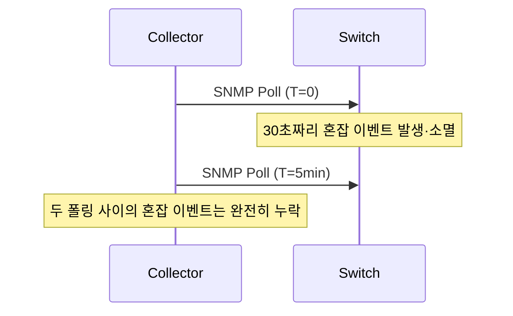

### gNMI Streaming Telemetry로의 전환

gNMI는 모니터링 모델을 뒤집는다. 관리 시스템이 계속 물어보는 대신, 장비가 컬렉터에 변화를 스스로 push한다. 구독 방식은 두 가지다.

| 구독 방식 | 동작 | 적합한 대상 |
|---|---|---|
| On-Change | 값이 바뀔 때만 push | 인터페이스 up/down, BGP session state, route table change |
| Sample | 설정한 주기마다 push | queue depth, byte counter 같은 정기 샘플링 카운터 |

운영적으로는 상태 이벤트는 on-change로, 성능 카운터는 sample로 나누는 것이 자연스럽다. 예를 들어 인터페이스 오퍼레이션 상태는 값이 바뀔 때만 즉시 알리면 되지만, 계속 증가하는 트래픽 카운터를 on-change로 구독하면 사실상 매 순간 전송되는 것과 다를 바 없어 오히려 sample이 낫다.

```yaml
subscriptions:
  srl-if-oper-state:
    mode: stream
    stream-mode: on-change
    paths:
      - /interface[name=ethernet-1/*]/oper-state
  srl-if-stats:
    mode: stream
    stream-mode: sample
    sample-interval: 5s
    paths:
      - /interface[name=ethernet-1/*]/statistics
      - /interface[name=ethernet-1/*]/traffic-rate
```

SONiC 진영에서 소개하는 **HFST(High Frequency Streaming Telemetry)**는 backend 스위치에서 512 포트급 large radix, bursty traffic 환경을 겨냥한다. ASIC이 IPFIX 포맷으로 텔레메트리를 push하면 OpenTelemetry Collector가 netlink 메시지로 수신해 등록된 IPFIX 템플릿으로 파싱하고, InfluxDB나 Prometheus로 내보낸다.

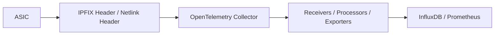

전통적인 polling 방식(30~60초 간격, 평균 사용률 확인)은 짧은 microburst, PFC Pause, ECN 순간 증가를 놓칠 수 있다. AI 네트워크 트래픽은 "평균"보다 "순간 피크"가 중요하기 때문에, 밀리초~초 단위 고해상도 수집이 필요하다.

| 항목 | SNMP Polling | Streaming Telemetry |
|---|---|---|
| 동작 방식 | Collector가 주기적으로 pull | 장비가 collector로 push |
| 시간 해상도 | 초/분 단위가 일반적 | 더 짧은 주기 가능 |
| 데이터 모델 | MIB 중심 | gNMI/gRPC, structured data |
| 실시간성 | 낮음 | 높음 |
| AI Fabric 적합성 | 기본 상태 확인 | queue/buffer/latency 분석에 유리 |
| On-change 지원 | 제한적 | 가능 |

### NVIDIA Spectrum-X 사례로 보는 실전 트러블슈팅

NVIDIA Spectrum-X Ethernet은 스위치, BlueField-3/ConnectX-8 SuperNIC, GPU, NetQ, Cumulus Linux를 통합해 AI 패브릭 관점의 텔레메트리를 제공한다. RDMA/RoCE는 CPU 개입 없이 직접 메모리 접근으로 지연을 줄이지만, 손실 없는 네트워크와 안정적인 패브릭 상태에 강하게 의존하기 때문에 순간적인 이상이 학습 성능 저하로 바로 이어질 수 있다.

**사례 1 — LLM 워크로드 대역폭 저하 원인 추적**: NVIDIA 엔지니어들이 Israel-1 슈퍼컴퓨터에서 실제 AI 워크로드로 스트레스 테스트를 하던 중, Grafana 대시보드에서 effective bandwidth가 불규칙하게 급락하는 현상을 관찰했다. NetQ로 BlueField-3 DTS 지표를 확인하자 `roce_adp_retrans` 카운터가 급증해 RoCE 패킷 재전송이 발생하고 있음을 확인했고, 스위치 텔레메트리에서 특정 spine switch의 `swp11s1` 포트에 symbol error가 발생하는 것을 특정했다. 해당 포트를 비활성화하자 effective bandwidth가 정상으로 복귀했다.

**사례 2 — Fabric Misconfiguration 탐지**: 건강한 Spectrum-X 패브릭에서는 RoCE 트래픽이 spine/leaf 링크에 균형 있게 분산되어야 한다. NetQ의 세밀한 텔레메트리로 패킷 분포가 균형을 이루지 못하는 스위치를 발견해, leaf switch 간 설정 불일치를 좁혀낼 수 있었다.

두 사례 모두 핵심은 같다. "대역폭이 떨어졌다"는 증상만으로는 원인을 알 수 없고, **AI 워크로드 지표, SuperNIC의 RoCE 재전송 지표, 스위치 포트 오류 지표를 서로 연결해야** 실제 원인을 좁힐 수 있다. Spectrum-X가 OpenTelemetry와 gNMI를 지원한다는 점도 중요한데, 특정 벤더 도구에 갇히지 않고 기존 관측성 스택(PromQL/Grafana 등)과 연동할 수 있기 때문이다.

### Streaming Telemetry 실습: Nokia SR Linux & Arista EOS

Nokia SR Linux Streaming Telemetry Lab은 컨테이너로 실행되는 SR Linux 스위치로 구성한 Clos 패브릭에 gnmic, Prometheus, Grafana로 구성된 스트리밍 텔레메트리 스택을 붙인 실습이다.

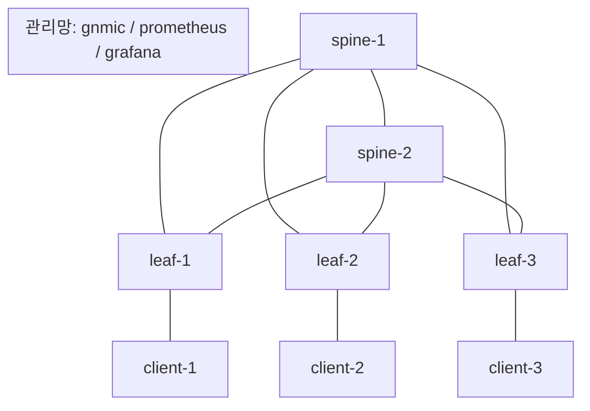

패브릭의 언더레이는 eBGP, 오버레이는 iBGP를 사용하며 리프 사이에 Layer 2 EVPN 서비스를 실행한다. `show network-instance default protocols bgp neighbor`로 확인하면 4개의 neighbor 모두 established 상태다.

텔레메트리 파이프라인은 다음과 같이 흐른다.


gnmic는 Get/Set/Subscribe/Collect를 지원하는 gNMI 수집기다.

```bash
# Capabilities
gnmic -a 10.1.0.11:57400 -u admin -p admin --insecure capabilities

# Get
gnmic -a 10.1.0.11:57400 -u admin -p admin --insecure get --path /state/system/platform

# Set
gnmic -a 10.1.0.11:57400 -u admin -p admin --insecure set --update-path /configure/system/name --update-value gnmic_demo

# Subscribe
gnmic -a 10.1.0.11:57400 -u admin -p admin --insecure sub --path "/state/port[port-id=1/1/c1/1]/statistics/in-packets"
```

`traffic.sh` 스크립트로 클라이언트 간 부하를 발생시키면 Grafana의 DC Fabric 대시보드(Routing Stats, BGP Peer stats, Throughput, CPU/Memory Utilization)에서 실시간으로 변화가 반영된다. Arista EOS Telemetry Lab도 같은 구성(Prometheus=저장, gNMIc=수집, Grafana=시각화)을 cEOS 장비로 재현하며, eBGP로 연결된 두 장비 사이에 iperf3 부하(8개 병렬 TCP stream)를 걸어 트래픽 그래프의 변화를 관찰한다. Logging 스택은 Alloy가 syslog를 받아 Loki로 전달하고 Grafana Explore에서 조회하는 구조다.

### IFA(In-Band Flow Analyzer)로 보는 per-hop 지연 분석

기존 카운터나 폴링은 "포트가 몇 % 찼는지"까지만 알려준다. AI Fabric에서 정말 필요한 것은 "몇 번째 hop의 어떤 queue에서 지연이 생겼는가"다. IFA는 실제 데이터 패킷 또는 복제된 probe packet에 metadata를 붙여서, 패킷이 지나가는 각 hop의 정보를 쌓는 방식으로 이 질문에 답한다.

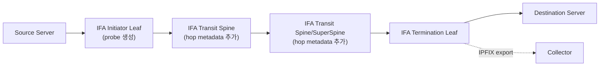

IFA 헤더는 IP 헤더 뒤에 추가되기 때문에 MTU 여유가 필요하다. 데이터센터에서는 보통 9000바이트 이상의 jumbo MTU를 쓰기 때문에 큰 문제는 아니지만, overlay나 tunnel이 추가된 환경에서는 반드시 확인해야 한다. IFA metadata stack에 담기는 핵심 정보는 다음과 같다.

| 정보 | 의미 |
|---|---|
| Device ID | 어떤 장비인지 |
| Ingress/Egress Port | 들어온/나간 포트 |
| Queue ID | 어느 queue를 사용했는지 |
| RX Timestamp | 수신 시각 |
| Residence Time | 해당 hop 안에 머문 시간 |
| Congestion Notification | congestion 경험 여부 |
| Egress port speed | 나가는 포트 속도 |

AI 데이터센터에서는 특히 congestion bit, residence time, queue ID, egress port 값이 중요한데, 이 값들로 어느 hop 어느 queue에서 latency가 늘어났는지 좁혀볼 수 있기 때문이다.

Drop된 패킷을 다루는 방식도 두 갈래다. Drop counter는 "몇 개가 drop됐는지"만 알려주지만, **Mirroring on Drop**은 drop된 패킷 자체를 복제해 collector로 보내 "무슨 패킷이 왜 drop됐는지"까지 확인할 수 있게 한다. AI Fabric에서 packet drop이 항상 나쁜 신호는 아니다. 낮은 priority queue drop이나 control-plane 보호처럼 의도적인 drop도 있기 때문에, 원인을 ACL/보안 drop인지 queue congestion drop인지 구분하는 것이 중요하다.

문제가 감지된 뒤 취할 수 있는 조치는 상황에 따라 다르다.

| 문제 상황 | 가능한 조치 |
|---|---|
| 특정 서버가 congestion 원인 | 해당 서버 shutdown 또는 traffic 차단 |
| 학습 job이 네트워크 편향으로 비정상 | scheduler 레벨에서 job 재시작 |
| 데이터센터 전체 capacity 부족 | 여유 있는 위치로 job 이동 |
| 특정 spine 과부하 | traffic engineering으로 일부 flow 이동 |
| 보안 공격 의심 | source block, ACL 적용 |

### AI Agent 기반 운영으로의 전환

아무리 모니터링을 잘해도 모든 문제를 즉시 해결할 수는 없다. microsecond 단위 congestion은 모니터링 스테이션이 정확히 캡처하기 어려울 수 있고, oversubscription ratio나 load-balancing 방식 자체가 잘못 설계됐다면 모니터링만으로는 해결되지 않는다. 먼저 올바른 capacity planning과 topology 설계가 있어야 모니터링이 제 역할을 한다.

그 위에서 조치의 자동화는 단계적으로 진행된다.

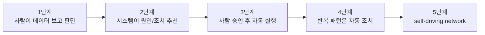

과거 telemetry 데이터와 조치 결과를 계속 연결하고 효과를 측정하면서, 반복되는 패턴은 점차 사람의 승인 없이도 처리되는 방향으로 발전한다. 정리하면 AI/ML 데이터센터 모니터링은 SNMP·Syslog 기반의 상태 감시에서 streaming telemetry와 IFA 기반의 per-hop 실시간 분석으로 진화하고 있으며, 최종 목표는 switch·server·scheduler 데이터를 상관분석해 GPU 학습 성능 저하를 예측하고 조치하는 자율형 네트워크 운영이다.

## AI DC 스토리지

### 전통적 스토리지 vs AI 특화 스토리지

전통적인 스토리지 솔루션은 "업무 데이터를 안정적으로 저장·공유·백업·복구하는 것"을 목표로 설계됐다. 반면 AI 특화 스토리지 솔루션의 핵심 목표는 **"GPU가 데이터를 기다리지 않게 하는 것"**이다. 전통 스토리지의 중심 질문이 "데이터를 안전하게 저장하고 여러 사용자가 접근할 수 있는가"라면, AI 스토리지의 중심 질문은 "수백~수만 개 GPU가 동시에 읽고 쓰고 checkpoint를 저장해도 GPU utilization이 떨어지지 않는가"다.

| 구분 | 전통적인 스토리지 솔루션 | AI 특화 스토리지 솔루션 |
|---|---|---|
| 핵심 목적 | 데이터를 안전하게 저장하고 공유 | GPU가 데이터를 기다리지 않게 지속 공급 |
| 주요 사용자 | 업무 시스템, VM, DB, 파일 공유, 백업 | AI 학습, fine-tuning, 추론, 데이터 파이프라인 |
| 대표 워크로드 | 문서, DB, VM 이미지, 로그, 백업 | 대규모 데이터셋, checkpoint, model artifact, KV Cache |
| 성능 기준 | IOPS, throughput, latency, 가용성 | GPU utilization, epoch time, checkpoint/restore time |
| 접근 패턴 | 비교적 예측 가능, 업무별 분리 | 수천 worker의 동시 read/write, checkpoint storm |
| 아키텍처 | SAN, NAS, object storage | NVMe 기반 scale-out, parallel file system, tiered storage |
| 네트워크 | FC, iSCSI, NFS, SMB | 100~800G Ethernet, InfiniBand, NVMe-oF, RDMA |
| 장애 대응 | RAID, snapshot, replication, backup | checkpoint/restart 최적화, job-aware recovery |
| 대표 위험 | 디스크/컨트롤러 장애, 백업 실패 | GPU idle, checkpoint 병목, metadata 폭주 |

전통 스토리지는 "데이터를 보관하는 창고"에 가깝고, AI 특화 스토리지는 "GPU 공장에 원자재를 끊기지 않고 공급하는 초고속 물류 시스템"에 가깝다. 전통 스토리지에서 "느린 스토리지"는 파일을 조금 늦게 여는 문제일 수 있지만, AI 데이터센터에서 "느린 스토리지"는 수천 개의 비싼 GPU가 동시에 대기하는 비용 문제다. GPUDirect Storage는 스토리지에서 읽은 데이터가 CPU 메모리를 거치지 않고 GPU 메모리로 직접 이동하도록 최적화하는 기술이다. TERAIO 연구는 GPUDirect Storage로 GPU-SSD 간 tensor migration을 수행해 여러 LLM에서 평균 1.47배 학습 성능 향상을 보였다고 설명하는데, 다만 NIC·GPU·드라이버·PCIe topology가 모두 맞아야 하고 전처리가 CPU에 많이 의존하면 여전히 병목이 남는다.

### Local Storage vs Network Storage, 그리고 학습 Life Cycle

서버 내부 NVMe SSD를 PCIe로 직접 붙이는 **Local PCIe Storage**는 지연이 매우 낮지만, 용량 확장이 어렵고 여러 GPU 서버가 같은 데이터셋을 공유하기 힘들다. 대규모 LLM 학습에는 이 한계가 치명적이다. 그래서 전용 스토리지 네트워크로 원격 스토리지를 연결하는 **Network-connected Storage**가 필요해진다.

| 방식 | 지연 | 확장성/공유성 | 특징 |
|---|---|---|---|
| Local PCIe Storage | 매우 낮음 | 낮음 | 서버 장애 시 데이터 접근성 저하 |
| Network Storage | 상대적으로 높음 | 높음 | Fabric A/B, replication, backup 설계 가능 |

AI 학습 Life Cycle에서 스토리지의 역할은 단계마다 다르다.

| 단계 | 스토리지 역할 | 중요한 요구사항 |
|---|---|---|
| Data Ingestion | 원천 데이터 수집 | 큰 용량, 병렬 쓰기 |
| Processing/Curation | 정제·변환 | 랜덤 I/O, 메타데이터 처리 |
| Training | GPU에 batch 공급 | 높은 read throughput, 낮은 지연 |
| Checkpoint | 중간 모델 상태 저장 | 빠른 write, 안정성 |
| Model Storage | 최종 모델 보관 | 내구성, 복제, 비용 효율 |
| Inference/RAG | 최신 정보 검색 | 응답 지연, 지역 분산 |

이 중 어느 단계에서든 스토리지가 느리면 GPU는 기다린다. 특히 checkpoint 저장은 학습 투자 보호와 직결된다. 10일짜리 학습이 8일째에 장애로 중단됐다고 가정하면, checkpoint가 없으면 처음부터 다시 학습해야 하고, checkpoint가 있으면 마지막 저장 지점부터 이어서 학습할 수 있다.

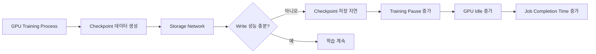

### Training Network와 Storage Network의 분리

AI 서버에는 보통 두 종류의 NIC이 함께 배치된다.

| NIC | 역할 |
|---|---|
| GPU/Training NIC | GPU 간 통신, AllReduce, RoCEv2 training fabric |
| Storage NIC | 데이터셋 로딩, checkpoint 저장, 원격 스토리지 접근 |

checkpoint write burst가 학습용 RoCE 트래픽과 같은 Fabric을 공유하면 NCCL latency에 영향을 줄 수 있다. 그래서 대규모 클러스터에서는 로컬 스토리지만으로 충분하지 않을 때 Parallel NFS나 NVMe-oF 기반의 **전용 스토리지 네트워크**(보통 최소 100G/200G NIC)를 별도로 구축하는 경우가 많다.

### Storage Network 설계 유형

AI 데이터센터 스토리지 네트워크는 "빠른 성능"보다 먼저 **경로 이중화(A/B Path Diversity)**를 보장하도록 설계된다. Active Storage A에 장애가 나거나 용량이 줄어도 Backup Storage B가 동일한 IOPS·대역폭·지연을 제공해야 한다는 목표다.

| 설계 유형 | 핵심 의미 |
|---|---|
| Physical Fab A/B | 스토리지 Fabric A와 B를 물리적으로 완전 분리 — 가장 안정적이지만 비용이 큼 |
| Logical Fab A/B | 같은 물리 Fabric 위에서 논리적으로 A/B 분리 — 비용 절감, 운영 복잡도 증가 |
| Collapsed Fab A/B | 소규모/분산 사이트용 2대 스위치 기반 구조 |
| Hybrid Cloud Redundancy | 온프레미스 + 클라우드 백업 |
| Inter-site Replication | 사이트 간 데이터 복제(DR/백업/지역 분산) |

논리적 분리는 EVPN-VXLAN overlay, RT5 EVPN IP VRF, MAC-VRF, Fibre Channel zoning, 스토리지 NIC driver multipath 같은 수단으로 구현된다. 사이트 간 복제(Inter-site Replication)에서는 전송 방식 선택이 중요한데, **RoCEv2/RDMA는 로컬에서는 낮은 지연을 제공하지만 40km 이상의 장거리에서는 완전한 lossless fabric을 보장하기 어려워 인터사이트 RDMA는 드물다.** NVMe-o-TCP는 TCP가 신뢰성·재전송·흐름 제어를 담당하기 때문에 장거리 lossy IP core network에서도 동작할 수 있어 더 현실적이다.

| 구분 | 학습용(Training) | 추론용(Inference) |
|---|---|---|
| 주요 목적 | 데이터셋 적재, checkpoint write | 최신 데이터 검색, RAG/Agentic RAG |
| 요구사항 | 높은 처리량, 빠른 write | 낮은 응답 지연, 지역 분산 |

### Block, Object, File Storage

AI/ML 스토리지는 접근 방식에 따라 세 갈래로 나뉜다. Block Storage는 원시 디스크를 빌려 쓰는 느낌, File Storage는 공유 폴더를 쓰는 느낌, Object Storage는 API로 파일 덩어리를 저장·조회하는 느낌으로 이해하면 쉽다.

| 구분 | 설명 | AI/ML 예시 |
|---|---|---|
| Block Storage | 디스크 블록 단위 접근 | NVMe-oF, SAN, DB, 고성능 volume |
| File Storage | 파일 경로/POSIX API 기반 | NFS, Lustre, WekaFS, VAST, BeeGFS |
| Object Storage | 객체/API 기반 접근 | S3, 모델 아카이브, cold data, cloud backup |

세 방식은 실제 클러스터에서 섞여 사용된다. 저지연이 필요한 volume은 NVMe-oF, 공유가 필요한 대규모 데이터셋과 checkpoint는 병렬 파일시스템(Lustre, GPFS, BeeGFS, WekaFS, VAST 등), cold data와 클라우드 백업은 Object Storage가 맡는 식이다.

### NVMe-oF: TCP vs RDMA vs FC

NVMe-oF(NVMe over Fabrics)는 원격 Flash/NVMe 스토리지를 네트워크 너머에서 "로컬 NVMe처럼" 빠르게 쓰기 위한 block-level 기술이다. PCIe 버스의 한계를 넘어 대규모 AI 클러스터의 스토리지 확장성을 제공한다.

| 방식 | Transport | CPU 사용량 | 지연 | 특징 |
|---|---|---|---|---|
| NVMe-o-TCP | TCP/IP | 상대적으로 높음 | RDMA보다 높을 수 있음 | 구축 쉬움, 저렴, lossy IP 가능 |
| NVMe-o-RDMA | RoCEv2/InfiniBand/iWARP | 낮음 | 낮음 | CPU offload, lossless 튜닝 필요 |
| NVMe-o-FC | Fibre Channel | 낮음 | 낮음/안정적 | 기존 FC SAN 활용, 확장 유연성/비용 제약 |

NVMe-o-TCP는 host CPU의 TCP stack 처리가 늘어나는 대신 전용 FC SAN이나 RDMA NIC 없이도 배포할 수 있어 비용 경쟁력이 높다. 세션은 TCP 3-way handshake, 필요 시 TLS handshake, NVMe/TCP IC Req/Response PDU, NVMe Connect Request/Response, Capsule Command/Response 교환, Data PDU 전송 순으로 초기화된다. **PDU**(Protocol Data Unit)는 TCP payload 안에 담기는 NVMe/TCP 메시지 단위이고, **Capsule**은 그 안에 담기는 NVMe 명령이나 응답 상자다. Read는 Opcode `0x02`, Write는 `0x01`로 구분되며, NSID(Namespace ID)로 어느 논리 볼륨을 다룰지, PRP/SGL로 host memory의 어느 위치를 읽고 쓸지 지정한다. 여러 PDU를 하나의 TCP segment에 담기 위해 dedicated storage fabric에서는 약 9000바이트 수준의 jumbo frame을 쓰는 경우가 많다.

NVMe-o-RDMA/RoCEv2는 RDMA 경로로 NVMe command와 data를 처리해 CPU 개입 없이 낮은 지연을 얻는 방향이지만, PFC/ECN/DCQCN 같은 lossless fabric 튜닝이 필요하다는 점에서 학습용 RoCEv2 트래픽과 같은 고려사항을 공유한다. AI 스토리지에서는 스토리지와 네트워크가 분리된 영역이 아니라 **하나의 성능 경로**로 다뤄야 한다.

## Scale-Up: NVLink에 맞서는 UALink와 SUE-T

### Scale-up이 필요해진 이유

AI 데이터센터는 GPU 서버 여러 대를 Ethernet/RoCEv2, InfiniBand, UEC 같은 **Scale-out** Fabric으로 연결해 수평 확장해왔다. 이 방식은 수천~수십만 GPU까지 확장하기 좋지만, GPU 간 통신이 IP/UDP/NIC/스위치 계층을 거치기 때문에 지연이 커진다. 반대로 **Scale-up**은 랙 내부 또는 최대 몇 개 랙 안에서 GPU/xPU를 NVLink, UALink, SUE-T 같은 초저지연 interconnect로 직접 연결해, 수십~수백~최대 약 1,000개 xPU를 하나의 "virtual super-accelerator"처럼 쓰려는 구조다.

| 구분 | Scale-Up | Scale-Out |
|---|---|---|
| 대표 Protocol | NVLink, UALink | InfiniBand, UEC |
| Form Factor | GPU 직접 연결 | External NIC Cards |
| 통신 알고리즘 | TP, EP | DP, PP |
| Traffic 특성 | 극도로 delay-sensitive | large block, bandwidth sensitive |
| Semantics | Memory load/store/atomic/DMA | RDMA |
| 대역폭 | TB/s 수준 | 수백 GB/s 수준 |
| Domain 크기 | 1~수개 Rack | Cluster 전체 |

Scale-up이 필요한 이유 중 하나는 RDMA가 scale-up fabric에는 적합하지 않다는 점이다. RDMA는 MAC/IP/UDP/RDMA WQE를 구성해야 하고, 비동기 Doorbell 메커니즘을 쓰며, 복잡한 프로토콜이 칩 면적을 소모하고, 많은 interrupt가 GPU의 IO tax를 늘린다. Scale-up 인터커넥트가 노리는 4가지 요구는 **native memory semantics**(unified memory load/store), **거대한 bandwidth**(단일 칩 10Tb+), **극저 latency**(수백 나노초, near-native HBM), **높은 신뢰성**(point-to-point reliable retransmission)이다.

### PCIe, CXL, NVLink의 역할 차이

세 기술은 서로 대체재가 아니라 계층이 다른 역할을 맡는다.

| 구분 | PCIe | CXL | NVLink |
|---|---|---|---|
| 정체 | 범용 장치 연결 인터페이스 | PCIe 기반 cache/memory coherent interconnect | NVIDIA GPU 중심 고속 인터커넥트 |
| 주 목적 | CPU-GPU/NIC/NVMe 연결 | 메모리 확장·풀링, CPU-장치 coherency | GPU-GPU 고속 통신 |
| AI에서 역할 | GPU/NIC/NVMe 기본 연결 | memory expansion, KV Cache/데이터 처리 성능 | multi-GPU 확장 성능 핵심 |
| 강점 | 범용성, 생태계 | coherency, memory pooling | 매우 높은 GPU 간 대역폭 |
| 약점 | GPU 간 통신에는 병목 가능 | 생태계 성숙 중 | vendor 종속 |

정량적으로 보면 PCIe 6.0 x16이 약 128Gbps 양방향 수준인 반면 NVLink 5.0은 1.8Tbps 양방향 수준이고, latency도 NVLink가 100~300ns인 데 비해 PCIe 5.0은 500ns~1μs 수준이다. AI 모델이 커지고 GPU 간 메모리 교환이 늘어날수록 PCIe가 병목이 되고, 이 격차를 NVLink·UALink·SUE-T가 메운다.

CXL은 메모리 확장·풀링 축을 담당한다. Yole Intelligence 자료 기준 CXL 시장은 2022년 170만 달러에서 2028년 158억 달러 규모로(약 750% 성장) 전망된다. Alibaba Panjiu의 CXL Memory Pool 사례에서는 64B~16KB 범위의 데이터 전송에서 CXL이 RDMA보다 훨씬 낮은 지연을 보였다.

| Size | Write RDMA | Write CXL | Read RDMA | Read CXL |
|---|---|---|---|---|
| 64B | 4.48μs | 0.78μs | 4.55μs | 0.75μs |
| 1KB | 4.77μs | 0.88μs | 4.91μs | 1.07μs |
| 16KB | 6.12μs | 1.68μs | 7.13μs | 2.46μs |

PolarDB의 PolarCXLMem 아키텍처는 CXL Memory Pool 위에 데이터베이스 buffer pool을 구성해, RDMA 기반 대비 최대 330% 처리량 개선과 4.74~11.53배 빠른 오류 복구를 보였다고 소개된다. Micron이 소개하는 **famfs**는 disaggregated CXL memory를 scale-out 파일시스템처럼 다루게 해주는 오픈소스로, storage보다 100배 가까이 빠른 random access를 제공하면서도 여러 서버가 공유할 수 있는 "JBOM(Just a Bunch Of Memory)" 개념을 구현한다.

### Scale-up 시스템의 물리 구성과 Single-hop 토폴로지

Scale-up 시스템은 vendor가 랙 단위로 사전 구성하는 rack-driven design이다. 네 개의 포드로 구성된 예시에서는 각 포드가 OOB Management Switch → Power Shelf → Compute → Accelerator → Interconnect Point(ESUN/UALink/NVL switch) → Accelerator → Compute → Storage(NVMe-oF) → Power Shelf 순으로 스택된다.

핵심은 **single-hop** 구조다. xPU가 scale-up switch를 단 한 번만 거쳐 다른 xPU와 통신한다.

| 항목 | Scale-Out | Scale-Up |
|---|---|---|
| 연결 단위 | 서버 NIC ↔ Leaf/Spine | xPU ↔ Scale-up Switch |
| 계층 | Leaf-Spine, 3~5-stage | 보통 single-hop |
| Latency | μs 단위 | ns~sub-μs 목표 |
| Memory | 분산 memory | shared/coherent 또는 PGAS |
| 확장성 | 수천~수십만 GPU | 랙/Pod 내부 수십~1,000 xPU |

Scale-up이 Scale-out을 대체하는 것은 아니다. Scale-up은 Pod 내부의 초저지연 통신을 담당하고, Pod와 Pod, Rack과 Rack 사이는 여전히 Scale-out Fabric이 연결한다. 이때 NIC은 보통 400G/800G급 **multi-plane**으로 외부 Fabric에 연결해, 한 plane에 장애가 나도 나머지 plane으로 통신을 유지한다.

### UALink: Open Accelerator Interconnect

UALink(Ultra Accelerator Link)는 NVLink 같은 vendor-specific 구조의 lock-in을 줄이려는 개방형 scale-up interconnect 표준이다. Alibaba, Apple, Synopsys 등이 참여했고, 2024년 5월 Promoter Group 발표, 2024년 10월 멤버십 공개, 2025년 1월 UALink 200 1.0 스펙 발표로 이어졌다. 목표는 최대 약 1,000개 accelerator scale-up domain으로, 200Gbps 레인 4개를 묶어 하나의 station을 구성하고 xPU당 최대 8 station(32 lane × 200Gbps ≈ 6.4Tbps)까지 지원한다.

프로토콜 스택은 4계층이다.

| 계층 | 역할 |
|---|---|
| Protocol Layer | read/write/atomic 명령 |
| Transaction Layer(TL) | 64-byte flit packing, ordering |
| Data Link Layer(DL) | 640-byte flit, CRC, replay, credit |
| Physical Layer(PL) | 200Gbps/lane Ethernet PHY |

**UPLI(UALink Protocol Level Interface)**가 originator와 completer 사이의 request/response channel을 제공한다. Accelerator A가 Read/Write/Atomic 요청을 만들면 TL 64-byte flit → DL 640-byte flit으로 패킹되어 200G 레인을 통해 직렬화되고, UALink Switch를 거쳐 목적지 accelerator에서 디코딩된 뒤 Read/Write Response로 회신된다.

메모리 접근을 위한 주소 체계는 세 단계로 변환된다.

| 주소 | 의미 | 더 쉬운 설명 |
|---|---|---|
| GVA(Guest Virtual Address) | source accelerator가 보는 가상 주소 | 프로그램이 보는 주소 |
| NPA(Network Physical Address) | UALink fabric에서 쓰는 주소 | 네트워크가 이해하는 원격 메모리 주소 |
| SPA(System Physical Address) | destination의 local physical address | 목적지 xPU의 실제 로컬 메모리 주소 |

source xPU의 MMU가 GVA를 NPA로 변환하고, destination의 link MMU가 NPA를 local SPA로 다시 변환한다. Memory coherence 모델도 NVLink와 다르다. NVLink/NVSwitch는 Home Agent/Directory와 snoop message로 하드웨어가 cache consistency를 보장하는 **hardware coherence**를 쓰지만, UALink는 runtime·driver·라이브러리가 RMA_FENCE/NOTIFY/RMA_SYNC 같은 동기화 시점을 제어하는 **software coherence**에 초점을 둔다. 하드웨어 coherence는 매우 빠르지만 수십 개 노드를 넘어 확장하기 어렵고, 소프트웨어 coherence는 더 많은 xPU로 확장하기 쉽고 vendor-neutral 구현에 유리하다.

### SUE-T: OCP의 Scale-Up Ethernet Transport

SUE-T(Scale-Up Ethernet Transport)는 OCP ESUN(Ethernet for Scale-up Networking) 프레임워크에서 제안된, Ethernet PHY를 그대로 활용하는 scale-up transport다. 기존 RoCEv2나 UET 패킷 포맷을 쓰지 않고, **AFH(AI Fabric Header)**와 **RH(Reliability Header)**라는 새로운 헤더를 쓴다.

| Header | 역할 |
|---|---|
| AFH | source/destination xPU 정보, forwarding 지원 |
| RH | sequence, ACK, VC, partition 등 reliability 정보 |

RH에는 xPU ID, VC(Virtual Channel), NSPN(패킷 시퀀스 번호), ASPN(확인응답 시퀀스 번호), partition 정보가 담긴다. Reliability는 링크 레벨에서 두 가지 메커니즘으로 관리된다.

- **LLR(Link Layer Retry)**: 손실이 발생한 링크 세그먼트에서 빠르게 재전송한다. xPU1이 frame seq=10을 보내고 ACK를 받은 뒤, seq=11이 손실되면 NACK을 받아 즉시 재전송한다.
- **CBFC(Credit-Based Flow Control)**: receiver의 buffer credit이 있을 때만 전송한다. Credit이 부족하면 해당 VC queue에서 대기한다.

SUE-T는 xPU와 SUE 모듈 사이 인터페이스로 FIFO와 AXI 4.0 두 가지를 지원한다. FIFO는 xPU가 명령과 데이터를 직접 SUE에 쓰는 단순한 스트리밍 방식이고, AXI 4.0은 읽기 주소·읽기 데이터·쓰기 주소·쓰기 데이터·쓰기 응답의 5개 독립 채널을 갖춘 고성능 on-chip interconnect다. AXI 방식은 inter-xPU memory synchronization에 더 유리하고, CBFC credit 상태가 AXI scheduler에 전달되어 queue service 여부를 결정한다. SUE-T 전송 블록은 외부 NIC 카드 없이 가속기 칩에 직접 내장(on-die)될 수 있다는 점도 특징이다.

### 세 기술 비교와 한계

| 항목 | SUE-T/SUE | UALink 1.0 | NVLink/NVSwitch |
|---|---|---|---|
| 성격 | OCP 기반 Ethernet scale-up framework | Open accelerator interconnect spec | NVIDIA proprietary |
| Wire/PHY | Ethernet PHY | 802.3 계열 PHY 기반 | NVIDIA proprietary link |
| Memory 모델 | One-sided, PGAS-style | PGAS, load/store/atomic/fence | Hardware coherent shared memory |
| Coherence | Software-managed | Software-managed | Hardware-managed |
| Latency | sub-μs 목표 | 수백 ns~sub-μs 목표 | 수십~수백 ns급 |
| Openness | Open/OCP | Open consortium spec | Proprietary |
| 생태계 성숙도 | 초기 framework | 비교적 상세한 spec | 가장 성숙한 상용 구현 |

Scale-up 시스템의 강점은 초저지연·초고대역폭과 여러 xPU HBM을 하나의 논리 공간처럼 다룰 수 있다는 점이지만, 물리적으로 랙/Pod 내부에 묶여 있고 전력·냉각 부담이 크며 UALink/SUE-T 같은 개방형 표준은 아직 도입 초기다. 결국 운영 관점에서는 Scale-up Pod 내부는 초저지연 interconnect가, Pod 간 연결은 기존 Scale-out Fabric이 담당하는 하이브리드 구조로 굳어질 가능성이 높다.

## UEC: AI를 위해 다시 짠 이더넷 전송

### UEC 등장 배경과 목표

기존 AI 데이터센터는 InfiniBand 또는 RoCEv2/DCQCN 기반 Ethernet을 주로 써왔다. RoCEv2는 Ethernet/IP 위에서 RDMA를 쓸 수 있게 하지만, 실제 운영에서는 PFC, ECN, DCQCN, 버퍼 임계값, NIC별 reordering 기능을 계속 튜닝해야 하는 부담이 있다. AI 클러스터가 10만 GPU를 넘어 100만 GPU급 규모를 바라보는 상황에서, 이 튜닝 부담은 감당하기 어려워진다. **UEC(Ultra Ethernet Consortium)**는 이 문제를 표준 레벨에서 풀기 위해 등장했다.

| 목표 | 설명 |
|---|---|
| 성능 | 낮은 latency, 높은 throughput, 빠른 session ramp-up |
| 확장성 | 100K GPU를 넘어 1M GPU급 scale-out 목표 |
| 운영 단순화 | RoCEv2/DCQCN/PFC 튜닝 부담을 줄이고 plug-and-play 지향 |
| Full-stack 통합 | NIC, switch, Libfabric, NCCL/RCCL, collective manager까지 연동 |

UEC는 여러 Working Group으로 나뉘어 물리 계층부터 소프트웨어 API까지 표준화를 진행한다. 이 중 **Link Layer WG**(LLR, CBFC), **Transport WG**(UET, NSCC/RCCC, packet trimming), **Software WG**(Libfabric, INC/CCL 연동)가 UEC를 이해하는 핵심이다.

### UET가 RoCEv2와 다른 점

RoCEv2는 Ethernet → IP → UDP → BTH(QPair 중심) → IB Payload 순으로 캡슐화한다. UET는 이 구조를 버리고 Ethernet → IP → UDP(또는 Raw IP) → **PDS**(Packet Delivery Sublayer) → **SES**(Semantic Sublayer) → Payload 순으로 캡슐화한다.

| 계층 | 역할 |
|---|---|
| SES | JobID, PIDonFEP, Resource Index 등 workload 의미 정보 |
| PDS | packet delivery 방식, PSN, ACK/NACK 관리 |

즉 RoCEv2는 QPair 기반으로 load-balancing과 memory mapping을 판단하지만, UET는 JobID·PIDonFEP·Resource Index·Entropy 같은 AI workload 의미 정보를 transport에 직접 담는다. Encapsulation은 두 가지 방식을 지원한다.

- **UDP 기반**: Ethernet | IP | UDP(Dst Port 49150, Src Port=Entropy) | PDS | SES | Payload 순서. 기존 IP Fabric에 가장 쉽게 도입할 수 있다.
- **Raw IP(IP-only)**: UDP 계층 없이 IP protocol 필드에 UET(253)를 지정하고 바로 PDS/SES가 온다. 더 lightweight하지만 두 endpoint가 사전에 같은 encapsulation을 쓰도록 조율돼야 한다.

두 FEP(Fabric Endpoint)가 통신하려면 PDC(Packet Delivery Context)를 만들고 profile, delivery mode, congestion control 방식을 협상해야 한다.

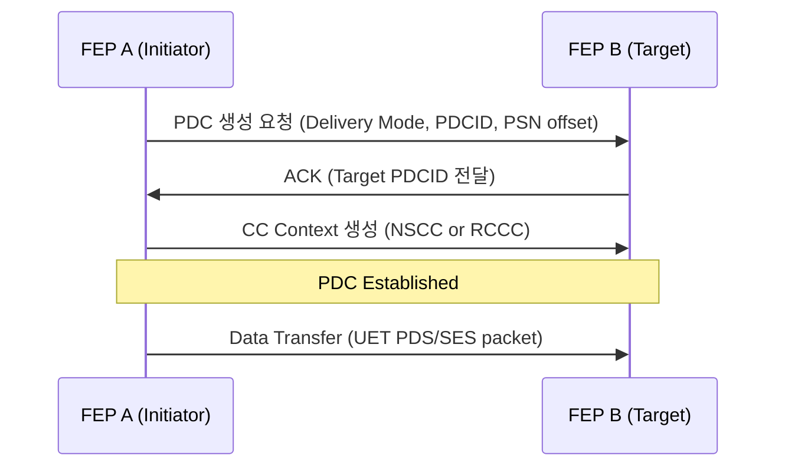

### Packet Delivery Mode 4가지

UEC의 중요한 장점은 애플리케이션 요구사항에 맞춰 전달 모드를 고를 수 있다는 점이다.

| Mode | 의미 | 적합한 예 |
|---|---|---|
| ROD | Reliable Ordered Delivery | HPC, MPI, 순서가 중요한 control flow |
| RUD | Reliable Unordered Delivery | AI model parallelism, bulk data |
| RUDI | Reliable Unordered Delivery Idempotent | RMA write, gradient update |
| UUD | Unreliable Unordered Delivery | telemetry, fire-and-forget |

ROD, RUD, RUDI는 신뢰성 있는 전송이고 UUD만 best-effort다. AI training에서는 모든 패킷이 반드시 순서대로 도착해야 하는 것은 아니다. 서로 다른 GPU memory 영역에 쓰는 데이터라면 순서가 바뀌어 도착해도 정확한 위치에 배치할 수 있다. ROD는 순서가 맞을 때까지 reordering buffer에서 기다리느라 latency가 늘어날 수 있지만, **RUD는 out-of-order 상태로도 각 packet을 지정된 memory 위치에 직접 배치**할 수 있어 latency를 줄이고 packet spraying과도 잘 맞는다. AI workload에서는 "무조건 순서대로"보다 "정확한 메모리 위치에 빠르게 배치"가 더 중요한 경우가 많다는 점을 UEC는 transport mode 선택으로 표현한다.

### Congestion Management: NSCC, RCCC, CBFC, LLR, Packet Trimming

UEC의 혼잡 제어는 두 계층으로 나뉜다.

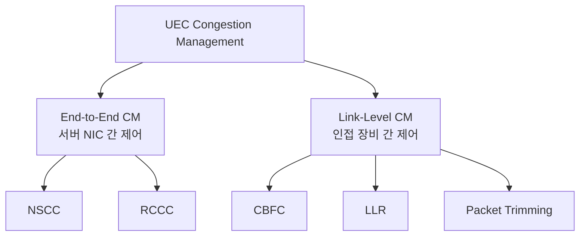

- **NSCC(Network Signal Congestion Control)**: 송신자가 congestion window를 유지하는 방식이다. ACK, SACK, NACK, ECN flag, RTT, out-of-order packet count를 보고 window를 조절한다.
- **RCCC(Receiver Credit Congestion Control)**: 수신자가 credit을 나눠주고 송신자는 credit이 있을 때만 전송한다. 여러 sender가 하나의 receiver로 몰릴 때, receiver가 자신의 buffer 상태를 가장 잘 알기 때문에 전체 credit을 조절해 수신 측 congestion을 줄일 수 있다.
- **CBFC(Credit-Based Flow Control)**: 인접한 두 장비 사이의 link-level credit 제어다. 기존 Ethernet PFC가 "이 priority class를 잠시 멈춰라"라고 pause를 보내는 반대로, CBFC는 받을 공간이 있을 때만 credit을 부여해 보내게 한다. UEC는 port당 최대 32개 VC를 지원해 PFC보다 많은 lossless class와 더 나은 스케줄링을 목표로 한다.
- **LLR(Link Layer Reliability)**: 패킷 손실이 나면 end-to-end 재전송을 기다리지 않고 해당 링크 세그먼트에서 즉시 재전송한다. ASIC 레벨에서 구현돼야 segment-level retry가 end-to-end 통신을 늦추지 않는다.
- **Packet Trimming**: 극심한 혼잡으로 buffer가 부족할 때, 중간 스위치가 패킷 전체를 drop하는 대신 payload를 잘라내고 목적지로 보낸다. 목적지는 이 trimmed packet을 GPU memory에 쓰지 않고, 어떤 패킷을 재전송해야 하는지 빠르게 판단해 fast retransmission을 요청한다.

### INC: In-Network Collectives

AI training에서는 AllReduce, AllGather, ReduceScatter 같은 collective communication이 핵심이다. 기존에는 NCCL/RCCL/MPI 같은 라이브러리가 GPU 간 통신을 전담하고, 네트워크는 단순히 패킷만 전달했다. UEC Software WG가 제안하는 **INC(In-Network Collectives)**는 fabric 자체가 collective 통신을 도와주는 구조다.

GPU-server1이 로컬 계산 결과를 GPU-server2와 GPU-server3에 동기화해야 한다고 하면, 중복 복사본을 두 번 보내는 대신 INC tree의 root로 선택된 fabric 최상단(spine)에 한 번만 전송하고, 이를 해당 collective group에 속한 나머지 스위치가 배포한다. Libfabric 수준에서 어떤 GPU group이 어떤 collective 연산에 참여하는지 정의되고, INC manager가 out-of-band(gRPC) 채널로 switch INC agent에게 최적화 정보를 전달해 특정 목적지로 flow를 aggregate한다. 이렇게 하면 leaf-to-spine bandwidth를 절약하고, GPU 간 collective latency를 모든 서버에 걸쳐 균일하게 만들 수 있다.

### InfiniBand, RoCEv2, UET 비교와 공존 전략

| 항목 | InfiniBand | RoCEv2 | UET |
|---|---|---|---|
| 목표 규모 | 100K 미만 중심 | 100K 이상 가능 | 1M endpoint 목표 |
| 혼잡제어 | Credit 기반 | DCQCN, ECN, PFC | NSCC, RCCC, CBFC, packet trimming |
| 전달모드 | RC 중심 | RC, unordered 일부 | RUD, ROD, RUDI, UUD |
| INC/CCL | 가능 | 기본 없음 | optional 지원 |
| 생태계 | NIC/switch vendor 제한 | Ethernet 생태계 넓음 | 초기에는 낮지만 표준화 지향 |

UEC는 InfiniBand의 credit·collective·plug-and-play 장점과 Ethernet/IP의 개방성·멀티벤더 생태계를 결합하려는 방향이다. 그리고 기존 Ethernet을 완전히 버리는 구조가 아니다. 초기 UEC는 기존 Ethernet/IP 스위치 위에서도 AI Base profile 정도는 동작하도록 설계되고, 스위치는 UET packet을 parsing해 source UDP port·JobID·Resource Index 같은 정보를 load-balancing에 활용할 수 있어야 한다. brownfield 환경에서는 UEC-ready NIC과 기존 RoCEv2 서버가 같은 ToR에 공존할 수 있지만, PFC와 CBFC/LLR을 같은 링크에서 병행하면 복잡도가 커지기 때문에 greenfield 배포가 더 적합할 수 있다.

정리하면, 초기에는 기존 Ethernet/IP Clos 위에서 UDP 기반 UET가 먼저 자리를 잡고, Raw IP UET와 CBFC·LLR·PHY 최적화는 더 성숙한 greenfield 환경에서 본격화될 것으로 전망된다.

## SRv6 uSID 실습: AI 워크로드를 위한 경로 지정

SRv6 uSID(마이크로 세그먼트)는 IPv6 주소 안에 여러 세그먼트를 압축해 넣어, 별도의 SRH(Segment Routing Header) 확장 없이도 source routing을 구현하는 방식이다. [brokenpackets/clab_Topos](https://github.com/brokenpackets/clab_Topos/tree/main/srv6_uSID) 저장소는 AI 워크로드에 대한 SRv6 uSID 사용 사례를 테스트하기 위한 단순화된 containerlab 토폴로지를 제공한다. 실제 프로덕션 환경에서는 전용 컨트롤러가 필요하고 GPU NIC이 터널 엔드포인트가 되어야 한다는 점에 유의해야 한다.

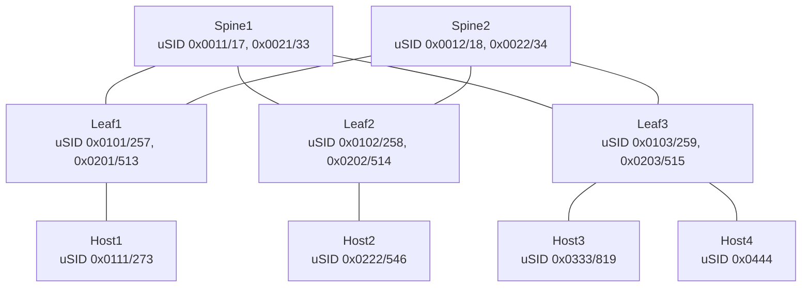

각 노드는 두 가지 uSID(16진수 표기와 10진수 표기)를 함께 갖는다. 이 값들이 segment-list의 각 hop을 가리키는 마이크로 세그먼트다. Host1에서 Host3로 향하는 경로를 지정한 ping 테스트는 다음과 같다.

```bash
# host1에서 segment-list로 경로를 직접 지정해 ping
ping srv6 sid fc00:1:333:: via segment-list fc00:1:101:11:103:: source lo100
```

컨테이너 접속과 검증은 Docker 명령으로 진행한다.

```bash
# host1 컨테이너 이름 확인
docker ps | grep -i host1
# → clab-srv6_uSID-host1

# host3의 IPv6 주소 확인
docker exec -it clab-srv6_uSID-host3 ip -br -c -6 addr

# host1 접속 후 라우팅 확인 및 테스트
docker exec -it clab-srv6_uSID-host1 bash
hostnamectl
ip -br -c -6 addr
Cli enable
show version
show ipv6 route
ping srv6 sid fc00:1:333:: via segment-list fc00:1:101:11:103::

# 각 구간에서 tcpdump로 세그먼트 소진 과정 확인
docker exec -it clab-srv6_uSID-host1 tcpdump -i any
```

tcpdump/Wireshark로 패킷을 캡처하면 SRv6가 세그먼트 목록의 홉을 하나씩 소진해가는 과정이 그대로 보인다. 출발지에서는 `2001:db8:1::21 → fc00:1:101:11:103:333::`처럼 남은 segment-list 전체가 목적지 주소에 담겨 있고, 중간 홉을 지날 때마다 이미 지나간 세그먼트가 제거된다. 최종적으로 host3에 도착하면 `2001:db8:1::21 → fc00:1:333::`으로, 실제 목적지 payload만 남은 형태를 확인할 수 있다. 이 방식이 바로 OCP MRC가 대규모 GPU Fabric에서 활용하는 SRv6 source routing의 축소판이다 — 송신자가 segment-list로 경로를 직접 지정하고, 네트워크는 그 경로를 홉 단위로 소진시켜 나간다.

## 마무리

- 대규모 GPU 클러스터에서 장애는 예외가 아니라 전제다. Meta의 사례처럼 수만 GPU 규모에서는 몇 시간~몇십 분마다 장애가 발생하고, 이를 견디는 것은 checkpoint와 자동화된 DETECT-DIAGNOSE-SWAP-RESUME 파이프라인이다. OpenAI의 MRC는 여기서 한 걸음 더 나가 multi-plane 네트워크, packet spraying, SRv6 source routing으로 네트워크 계층의 failure amplifier 효과 자체를 줄인다.

- AI DC 모니터링은 SNMP polling의 한계(초/분 단위 granularity, counter wrap, AI Fabric 이벤트 포착 실패)를 넘어 gNMI 기반 streaming telemetry, HFST, IFA per-hop 분석으로 진화하고 있다. NVIDIA Spectrum-X 사례가 보여주듯 핵심은 GPU·NIC·스위치 지표를 상관분석해 원인을 좁히는 것이다.

- AI 특화 스토리지는 "GPU가 데이터를 기다리지 않게 하는 것"이 목표다. Training Network와 Storage Network를 분리하고, Fabric A/B로 경로를 이중화하며, NVMe-oF(TCP/RDMA/FC)와 GPUDirect Storage로 GPU까지의 데이터 경로를 최적화한다.

- Scale-up은 Scale-out만으로 부족해진 GPU 간 초저지연 통신을 랙/Pod 내부에서 해결하는 축이다. NVLink가 성숙한 proprietary 구현이라면, UALink와 SUE-T는 이를 개방형 표준으로 풀어내려는 시도이고, CXL은 메모리 확장·풀링이라는 별도의 축을 담당한다.

- UEC는 RoCEv2의 튜닝 부담을 줄이면서 100만 GPU급 규모를 목표로 하는 차세대 Ethernet 전송 표준이다. PDS/SES 기반 UET, RUD 중심의 packet delivery, NSCC/RCCC/CBFC/LLR의 이중 혼잡 제어, INC까지가 하나의 full-stack으로 묶인다.

- SRv6 uSID는 IPv6 주소 하나에 여러 세그먼트를 압축해 넣어 source routing을 구현하는 방식으로, OCP MRC가 대규모 GPU Fabric에서 packet spraying과 함께 쓰는 경로 지정 기법의 축소판을 실습으로 확인할 수 있다.

## 참고

- The Engineering Behind Training a 2 Trillion Parameter LLM - Youtube
- 메타 규모 AI 클러스터에서 GPU 통신 라이브러리: 운영 경험을 바탕으로 장애 유형 소개 - Youtube
- [OpenAI] Supercomputer networking to accelerate large scale AI training - OpenAI Blog
- SONiC High Frequency Streaming Telemetry - Youtube
- NVIDIA Spectrum-X Ethernet 기반 차세대 AI Factory Telemetry - NVIDIA Blog
- 조원준님 velog: gNMI 프로토콜 직접 찔러보기(https://velog.io/@victorjo/gNMI-프로토콜-직접-찔러보기)
- Nokia SR Linux Streaming Telemetry Lab - Github(srl-labs/srl-telemetry-lab)
- Arista EOS Telemetry Lab - Github
- [elice] AI 학습용 병렬 스토리지 5종(DDN·Weka·VAST·IBM) PoC
- Large CXL Memory Expansion Systems and Workloads - Youtube
- Server Scale Up Interconnect Technologies: UALink SuperNode and CXL Memory Pool - Youtube
- [NANOG] Keynote: Networking for AI and HPC, and Ultra Ethernet(2024.10.21) - Youtube, PDF
- OCP OpenAI MRC 기술 분석 - minsungjang.substack.com, uccl-project.github.io
- SRv6 uSID AI 워크로드 실습 토폴로지 - [brokenpackets/clab_Topos](https://github.com/brokenpackets/clab_Topos/tree/main/srv6_uSID)
- [데이터센터 인프라, 로드 밸런싱 & NCCL AllReduce](./week3-loadbalancing-nccl-datacenter.md)
