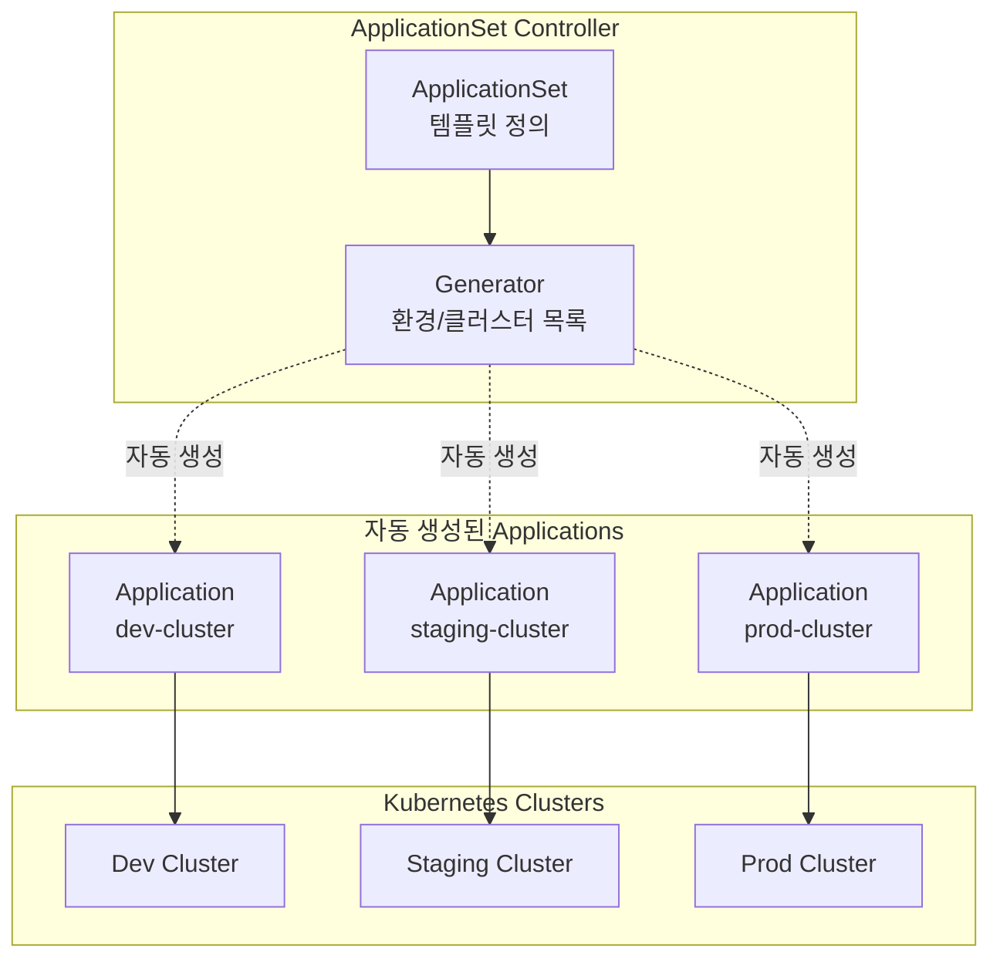
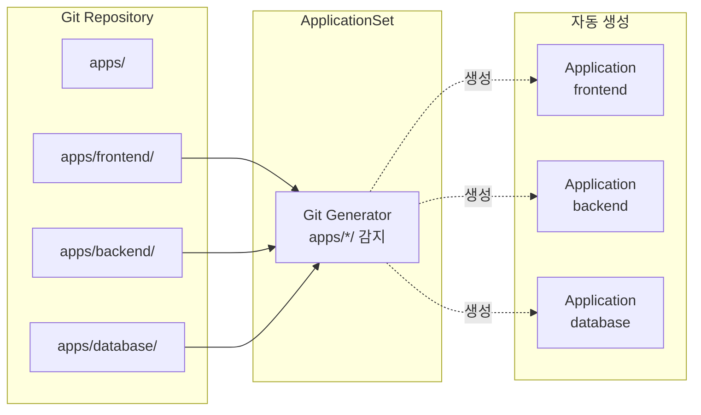
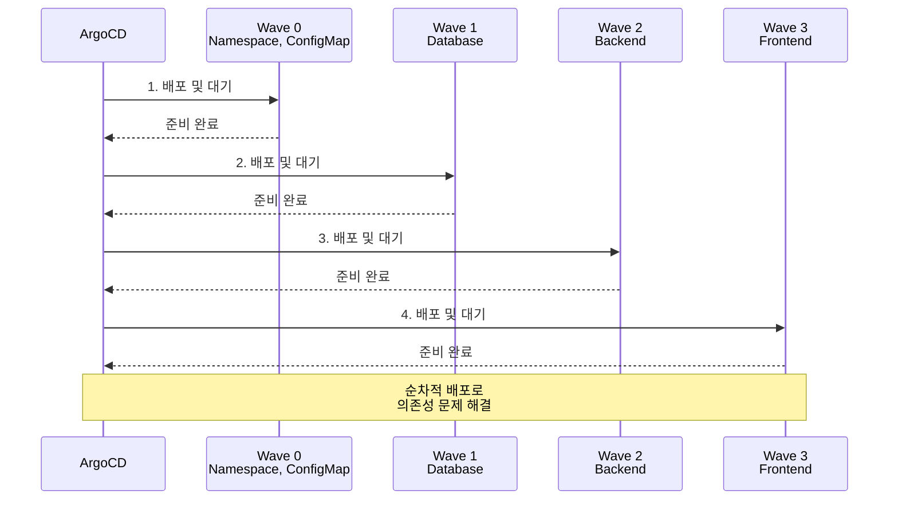
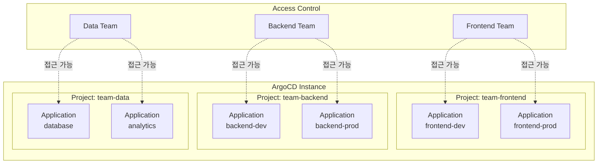
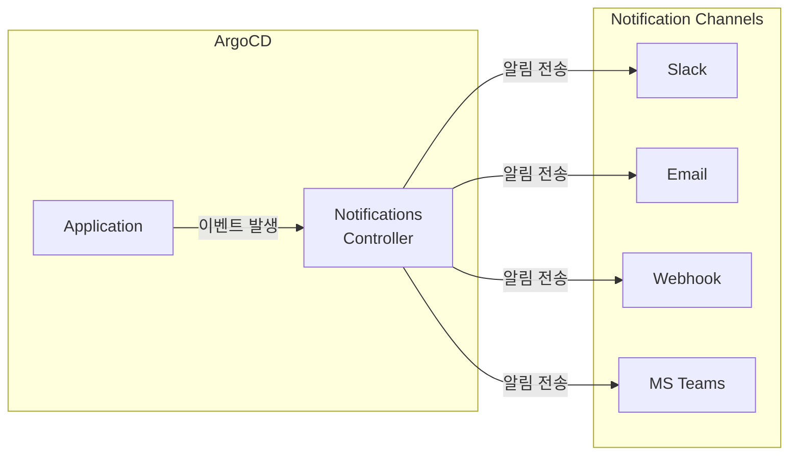
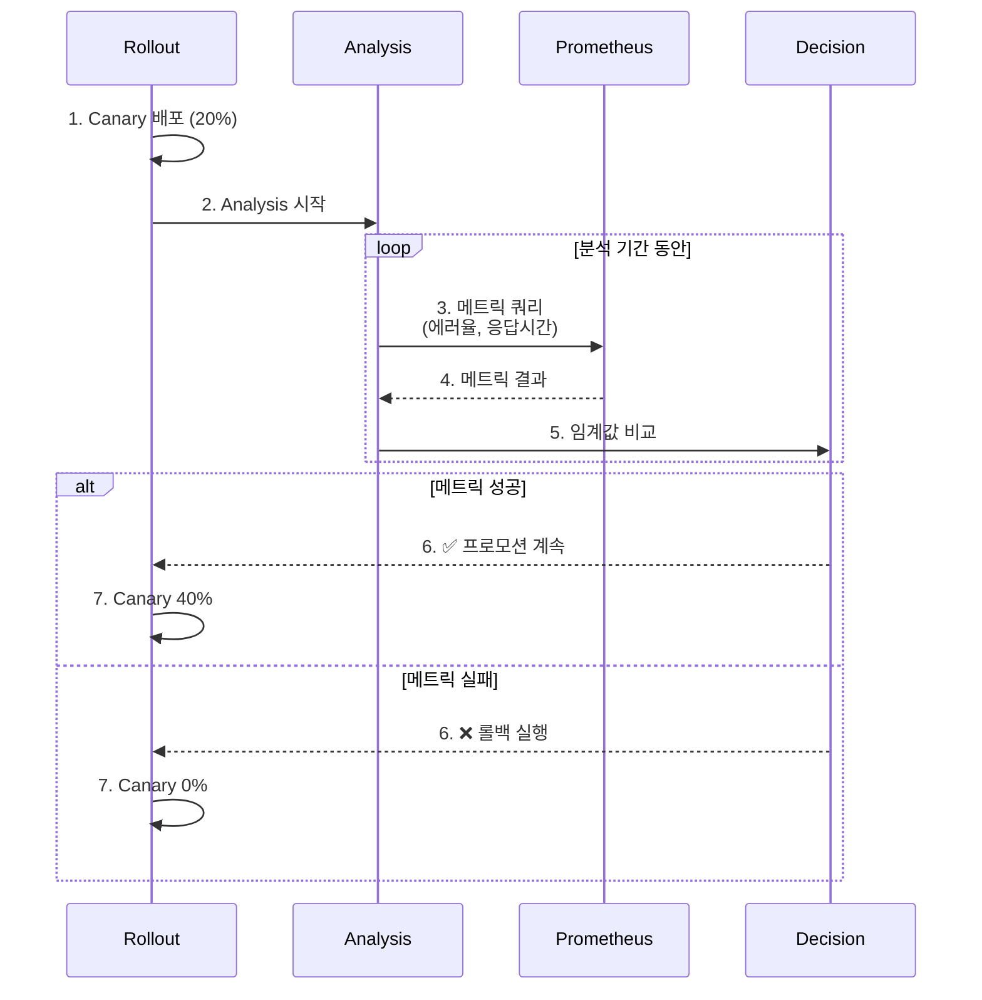

# 4주차 학습정리 - ArgoCD 심화: ApplicationSet, Sync Waves, RBAC로 완성하는 엔터프라이즈 GitOps

> ArgoCD ApplicationSet, Sync Waves, RBAC, Notifications를 학습합니다.

---

## 🚀 ArgoCD ApplicationSet

### 1. ApplicationSet 소개

#### ApplicationSet이란?

**ApplicationSet**은 ArgoCD의 **Application 생성을 자동화**하는 CRD(Custom Resource Definition)입니다. 하나의 템플릿으로 **여러 환경, 클러스터, 테넌트**에 동일한 애플리케이션을 배포할 수 있습니다.



**ApplicationSet의 이점**:
- ✅ **자동화**: 새 환경/클러스터 추가 시 자동으로 Application 생성
- ✅ **일관성**: 모든 환경에 동일한 템플릿 적용
- ✅ **확장성**: 수십~수백 개의 Application 관리 가능
- ✅ **유지보수성**: 중앙 집중식 템플릿 관리

#### Generator 종류

| Generator | 설명 | 사용 사례 |
|-----------|------|-----------|
| **List** | 하드코딩된 환경/클러스터 목록 | dev, staging, prod 환경 배포 |
| **Cluster** | ArgoCD에 등록된 모든 클러스터 | 멀티 클러스터 자동 배포 |
| **Git** | Git 저장소 구조 기반 자동 생성 | 모노레포의 각 앱 자동 배포 |
| **Matrix** | 여러 Generator 조합 | 복잡한 멀티 차원 배포 |
| **Merge** | Generator 결과 병합 | 공통 설정 + 환경별 설정 |
| **SCM Provider** | GitHub/GitLab Organization | 모든 저장소 자동 배포 |

### 2. List Generator로 멀티 환경 배포

#### ops-deploy 저장소 구조 준비

```bash
# ops-deploy 저장소 이동
cd ~/cicd-labs/ops-deploy

# 환경별 디렉토리 생성
mkdir -p environments/{dev,staging,prod}

# dev 환경 values
cat << 'EOF' > environments/dev/values.yaml
replicaCount: 1
environment: development
resources:
  limits:
    memory: "128Mi"
    cpu: "100m"
ingress:
  host: dev.example.com
EOF

# staging 환경 values
cat << 'EOF' > environments/staging/values.yaml
replicaCount: 2
environment: staging
resources:
  limits:
    memory: "256Mi"
    cpu: "200m"
ingress:
  host: staging.example.com
EOF

# prod 환경 values
cat << 'EOF' > environments/prod/values.yaml
replicaCount: 3
environment: production
resources:
  limits:
    memory: "512Mi"
    cpu: "500m"
ingress:
  host: prod.example.com
EOF

# Git push
git add environments/
git commit -m "Add environment-specific values"
git push
```

#### ApplicationSet 생성 (List Generator)

```bash
cat << 'EOF' | kubectl apply -f -
apiVersion: argoproj.io/v1alpha1
kind: ApplicationSet
metadata:
  name: nginx-multi-env
  namespace: argocd
spec:
  generators:
  - list:
      elements:
      - env: dev
        namespace: dev-nginx
        replicaCount: "1"
      - env: staging
        namespace: staging-nginx
        replicaCount: "2"
      - env: prod
        namespace: prod-nginx
        replicaCount: "3"

  template:
    metadata:
      name: 'nginx-{{env}}'
    spec:
      project: default
      source:
        repoURL: http://192.168.254.124:3000/devops/ops-deploy
        targetRevision: HEAD
        path: nginx-chart
        helm:
          valueFiles:
          - ../environments/{{env}}/values.yaml
      destination:
        server: https://kubernetes.default.svc
        namespace: '{{namespace}}'
      syncPolicy:
        automated:
          prune: true
          selfHeal: true
        syncOptions:
        - CreateNamespace=true
EOF

# ApplicationSet 확인
kubectl get applicationset -n argocd
kubectl get applications -n argocd

# 자동 생성된 Application 확인
kubectl get applications -n argocd -l app.kubernetes.io/instance=nginx-multi-env

# 각 환경별 배포 확인
kubectl get all -n dev-nginx
kubectl get all -n staging-nginx
kubectl get all -n prod-nginx
```

**동작 원리**:
1. ApplicationSet Controller가 List Generator의 elements를 읽음
2. 각 element에 대해 template을 렌더링하여 Application 생성
3. `{{env}}`, `{{namespace}}` 같은 변수가 치환됨
4. 생성된 Application들이 자동으로 동기화됨

### 3. Git Generator로 자동 앱 생성

#### Git Generator 개념

Git 저장소의 **디렉토리 구조**를 기반으로 자동으로 Application을 생성합니다.



#### 모노레포 구조 준비

```bash
# ops-deploy에 apps 디렉토리 생성
cd ~/cicd-labs/ops-deploy
mkdir -p apps/{frontend,backend,database}

# frontend app
cat << 'EOF' > apps/frontend/deployment.yaml
apiVersion: apps/v1
kind: Deployment
metadata:
  name: frontend
spec:
  replicas: 2
  selector:
    matchLabels:
      app: frontend
  template:
    metadata:
      labels:
        app: frontend
    spec:
      containers:
      - name: frontend
        image: nginx:1.26.1
        ports:
        - containerPort: 80
EOF

# backend app
cat << 'EOF' > apps/backend/deployment.yaml
apiVersion: apps/v1
kind: Deployment
metadata:
  name: backend
spec:
  replicas: 2
  selector:
    matchLabels:
      app: backend
  template:
    metadata:
      labels:
        app: backend
    spec:
      containers:
      - name: backend
        image: python:3.12-slim
        command: ["python", "-m", "http.server", "8080"]
        ports:
        - containerPort: 8080
EOF

# database app
cat << 'EOF' > apps/database/deployment.yaml
apiVersion: apps/v1
kind: Deployment
metadata:
  name: database
spec:
  replicas: 1
  selector:
    matchLabels:
      app: database
  template:
    metadata:
      labels:
        app: database
    spec:
      containers:
      - name: postgres
        image: postgres:16
        env:
        - name: POSTGRES_PASSWORD
          value: "password"
        ports:
        - containerPort: 5432
EOF

# Git push
git add apps/
git commit -m "Add monorepo apps structure"
git push
```

#### Git Generator ApplicationSet

```bash
cat << 'EOF' | kubectl apply -f -
apiVersion: argoproj.io/v1alpha1
kind: ApplicationSet
metadata:
  name: monorepo-apps
  namespace: argocd
spec:
  generators:
  - git:
      repoURL: http://192.168.254.124:3000/devops/ops-deploy
      revision: HEAD
      directories:
      - path: apps/*

  template:
    metadata:
      name: '{{path.basename}}'
    spec:
      project: default
      source:
        repoURL: http://192.168.254.124:3000/devops/ops-deploy
        targetRevision: HEAD
        path: '{{path}}'
      destination:
        server: https://kubernetes.default.svc
        namespace: '{{path.basename}}'
      syncPolicy:
        automated:
          prune: true
          selfHeal: true
        syncOptions:
        - CreateNamespace=true
EOF

# ApplicationSet 확인
kubectl get applicationset -n argocd monorepo-apps

# 자동 생성된 Application 확인
kubectl get applications -n argocd -l app.kubernetes.io/instance=monorepo-apps

# 배포 확인
kubectl get all -n frontend
kubectl get all -n backend
kubectl get all -n database
```

**Git Generator 변수**:
- `{{path}}`: 전체 경로 (예: `apps/frontend`)
- `{{path.basename}}`: 디렉토리명 (예: `frontend`)
- `{{path[0]}}`, `{{path[1]}}`: 경로 세그먼트

**자동화 효과**:
- `apps/` 디렉토리에 새 앱 추가 시 자동으로 Application 생성
- 디렉토리 삭제 시 자동으로 Application 삭제
- Git이 Single Source of Truth

### 4. Matrix Generator로 복잡한 패턴 구성

#### Matrix Generator 개념

**여러 Generator를 조합**하여 복잡한 배포 패턴을 구성합니다.

```
Matrix Generator = List(environments) × Git(apps)
→ 각 앱을 모든 환경에 배포
```

#### Matrix Generator ApplicationSet

```bash
cat << 'EOF' | kubectl apply -f -
apiVersion: argoproj.io/v1alpha1
kind: ApplicationSet
metadata:
  name: matrix-apps-envs
  namespace: argocd
spec:
  generators:
  - matrix:
      generators:
      # Generator 1: 환경 목록
      - list:
          elements:
          - env: dev
            server: https://kubernetes.default.svc
          - env: staging
            server: https://kubernetes.default.svc
          - env: prod
            server: https://kubernetes.default.svc

      # Generator 2: 앱 디렉토리
      - git:
          repoURL: http://192.168.254.124:3000/devops/ops-deploy
          revision: HEAD
          directories:
          - path: apps/*

  template:
    metadata:
      name: '{{path.basename}}-{{env}}'
    spec:
      project: default
      source:
        repoURL: http://192.168.254.124:3000/devops/ops-deploy
        targetRevision: HEAD
        path: '{{path}}'
      destination:
        server: '{{server}}'
        namespace: '{{env}}-{{path.basename}}'
      syncPolicy:
        automated:
          prune: true
          selfHeal: true
        syncOptions:
        - CreateNamespace=true
EOF

# 생성된 Application 확인
kubectl get applications -n argocd -l app.kubernetes.io/instance=matrix-apps-envs

# 3개 앱 × 3개 환경 = 9개 Application 생성
# frontend-dev, frontend-staging, frontend-prod
# backend-dev, backend-staging, backend-prod
# database-dev, database-staging, database-prod

# 네임스페이스 확인
kubectl get ns | grep -E "(dev|staging|prod)-(frontend|backend|database)"
```

---

## 🎯 Sync Waves와 Resource Hooks

### 1. Sync Waves 개념 및 활용

#### Sync Waves란?

**Sync Waves**는 ArgoCD가 리소스를 **순서대로 배포**하도록 제어하는 기능입니다. 숫자가 낮은 Wave부터 순차적으로 배포됩니다.



**Sync Wave 적용 예시**:

```yaml
metadata:
  annotations:
    argocd.argoproj.io/sync-wave: "0"  # 가장 먼저 배포
```

**일반적인 Wave 순서**:
- **Wave -5**: PreSync Hook (DB 백업)
- **Wave 0**: Namespace, ConfigMap, Secret
- **Wave 1**: Database, PVC
- **Wave 2**: Backend Services
- **Wave 3**: Frontend Services
- **Wave 4**: Ingress
- **Wave 5**: PostSync Hook (헬스체크)

#### 실습: 의존성 있는 앱 배포

```bash
cd ~/cicd-labs/ops-deploy
mkdir -p sync-waves-demo

# Wave 0: Namespace (가장 먼저)
cat << 'EOF' > sync-waves-demo/namespace.yaml
apiVersion: v1
kind: Namespace
metadata:
  name: sync-demo
  annotations:
    argocd.argoproj.io/sync-wave: "0"
EOF

# Wave 1: ConfigMap
cat << 'EOF' > sync-waves-demo/configmap.yaml
apiVersion: v1
kind: ConfigMap
metadata:
  name: app-config
  namespace: sync-demo
  annotations:
    argocd.argoproj.io/sync-wave: "1"
data:
  DATABASE_URL: "postgres://db:5432/myapp"
  LOG_LEVEL: "info"
EOF

# Wave 2: Database
cat << 'EOF' > sync-waves-demo/database.yaml
apiVersion: apps/v1
kind: Deployment
metadata:
  name: postgres
  namespace: sync-demo
  annotations:
    argocd.argoproj.io/sync-wave: "2"
spec:
  replicas: 1
  selector:
    matchLabels:
      app: postgres
  template:
    metadata:
      labels:
        app: postgres
    spec:
      containers:
      - name: postgres
        image: postgres:16
        env:
        - name: POSTGRES_PASSWORD
          value: "password"
---
apiVersion: v1
kind: Service
metadata:
  name: db
  namespace: sync-demo
  annotations:
    argocd.argoproj.io/sync-wave: "2"
spec:
  selector:
    app: postgres
  ports:
  - port: 5432
EOF

# Wave 3: Backend (DB에 의존)
cat << 'EOF' > sync-waves-demo/backend.yaml
apiVersion: apps/v1
kind: Deployment
metadata:
  name: backend
  namespace: sync-demo
  annotations:
    argocd.argoproj.io/sync-wave: "3"
spec:
  replicas: 2
  selector:
    matchLabels:
      app: backend
  template:
    metadata:
      labels:
        app: backend
    spec:
      containers:
      - name: backend
        image: python:3.12-slim
        command: ["python", "-m", "http.server", "8080"]
        envFrom:
        - configMapRef:
            name: app-config
---
apiVersion: v1
kind: Service
metadata:
  name: backend
  namespace: sync-demo
  annotations:
    argocd.argoproj.io/sync-wave: "3"
spec:
  selector:
    app: backend
  ports:
  - port: 8080
EOF

# Wave 4: Frontend (Backend에 의존)
cat << 'EOF' > sync-waves-demo/frontend.yaml
apiVersion: apps/v1
kind: Deployment
metadata:
  name: frontend
  namespace: sync-demo
  annotations:
    argocd.argoproj.io/sync-wave: "4"
spec:
  replicas: 2
  selector:
    matchLabels:
      app: frontend
  template:
    metadata:
      labels:
        app: frontend
    spec:
      containers:
      - name: frontend
        image: nginx:1.26.1
---
apiVersion: v1
kind: Service
metadata:
  name: frontend
  namespace: sync-demo
  annotations:
    argocd.argoproj.io/sync-wave: "4"
spec:
  type: NodePort
  selector:
    app: frontend
  ports:
  - port: 80
    nodePort: 30004
EOF

# Git push
git add sync-waves-demo/
git commit -m "Add sync waves demo"
git push
```

#### Application 생성

```bash
cat << 'EOF' | kubectl apply -f -
apiVersion: argoproj.io/v1alpha1
kind: Application
metadata:
  name: sync-waves-demo
  namespace: argocd
spec:
  project: default
  source:
    repoURL: http://192.168.254.124:3000/devops/ops-deploy
    targetRevision: HEAD
    path: sync-waves-demo
  destination:
    server: https://kubernetes.default.svc
    namespace: sync-demo
  syncPolicy:
    automated:
      prune: true
      selfHeal: true
    syncOptions:
    - CreateNamespace=true
EOF

# Sync 진행 과정 관찰
kubectl get applications -n argocd sync-waves-demo -w

# ArgoCD UI에서 각 Wave별 배포 순서 확인
# 또는 CLI로 확인
argocd app get sync-waves-demo --show-operation
```

### 2. Resource Hooks로 배포 제어

#### Resource Hooks 종류

ArgoCD는 **5가지 Hook**을 제공하여 배포 전후에 작업을 실행할 수 있습니다.

| Hook | 실행 시점 | 사용 사례 |
|------|----------|-----------|
| **PreSync** | Sync 시작 전 | DB 백업, 사전 검증 |
| **Sync** | 일반 리소스와 동시 | 일반적으로 사용 안 함 |
| **Skip** | Sync하지 않음 | 수동 관리 리소스 |
| **PostSync** | Sync 완료 후 | 헬스체크, 알림 전송 |
| **SyncFail** | Sync 실패 시 | 롤백, 에러 알림 |

**Hook 적용 방법**:

```yaml
metadata:
  annotations:
    argocd.argoproj.io/hook: PreSync
    argocd.argoproj.io/hook-delete-policy: HookSucceeded
```

**Hook 삭제 정책**:
- `HookSucceeded`: 성공 시 삭제
- `HookFailed`: 실패 시 삭제
- `BeforeHookCreation`: 새 Hook 생성 전 이전 Hook 삭제

#### PreSync Hook: DB 백업

```bash
cat << 'EOF' > sync-waves-demo/presync-backup.yaml
apiVersion: batch/v1
kind: Job
metadata:
  name: db-backup-presync
  namespace: sync-demo
  annotations:
    argocd.argoproj.io/hook: PreSync
    argocd.argoproj.io/hook-delete-policy: HookSucceeded
    argocd.argoproj.io/sync-wave: "-5"
spec:
  template:
    spec:
      containers:
      - name: backup
        image: postgres:16
        command:
        - /bin/sh
        - -c
        - |
          echo "=========================================="
          echo "PreSync Hook: Database backup started"
          echo "Timestamp: $(date)"
          echo "=========================================="
          sleep 5
          echo "Backup completed successfully"
      restartPolicy: Never
  backoffLimit: 1
EOF

git add sync-waves-demo/presync-backup.yaml
git commit -m "Add PreSync hook for DB backup"
git push
```

#### PostSync Hook: 헬스체크

```bash
cat << 'EOF' > sync-waves-demo/postsync-healthcheck.yaml
apiVersion: batch/v1
kind: Job
metadata:
  name: healthcheck-postsync
  namespace: sync-demo
  annotations:
    argocd.argoproj.io/hook: PostSync
    argocd.argoproj.io/hook-delete-policy: HookSucceeded
    argocd.argoproj.io/sync-wave: "5"
spec:
  template:
    spec:
      containers:
      - name: healthcheck
        image: curlimages/curl:latest
        command:
        - /bin/sh
        - -c
        - |
          echo "=========================================="
          echo "PostSync Hook: Health check started"
          echo "=========================================="

          # Backend 헬스체크
          if curl -f http://backend.sync-demo:8080/ ; then
            echo "✅ Backend is healthy"
          else
            echo "❌ Backend health check failed"
            exit 1
          fi

          # Frontend 헬스체크
          if curl -f http://frontend.sync-demo/ ; then
            echo "✅ Frontend is healthy"
          else
            echo "❌ Frontend health check failed"
            exit 1
          fi

          echo "=========================================="
          echo "All health checks passed!"
          echo "=========================================="
      restartPolicy: Never
  backoffLimit: 3
EOF

git add sync-waves-demo/postsync-healthcheck.yaml
git commit -m "Add PostSync hook for health check"
git push
```

### 3. 실전 예제: 데이터베이스 마이그레이션

실제 프로덕션 환경에서 DB 스키마 변경 시 사용하는 패턴입니다.

```bash
mkdir -p sync-waves-demo/migration

# PreSync: DB 백업
cat << 'EOF' > sync-waves-demo/migration/backup.yaml
apiVersion: batch/v1
kind: Job
metadata:
  name: db-migration-backup
  namespace: sync-demo
  annotations:
    argocd.argoproj.io/hook: PreSync
    argocd.argoproj.io/hook-delete-policy: BeforeHookCreation
    argocd.argoproj.io/sync-wave: "-1"
spec:
  template:
    spec:
      containers:
      - name: pg-dump
        image: postgres:16
        command:
        - /bin/sh
        - -c
        - |
          echo "Creating database backup before migration..."
          PGPASSWORD=password pg_dump -h db -U postgres -Fc myapp > /backup/myapp-$(date +%Y%m%d-%H%M%S).dump
          echo "Backup completed"
        volumeMounts:
        - name: backup-storage
          mountPath: /backup
      volumes:
      - name: backup-storage
        emptyDir: {}
      restartPolicy: Never
EOF

# Sync: DB 마이그레이션 실행
cat << 'EOF' > sync-waves-demo/migration/migrate.yaml
apiVersion: batch/v1
kind: Job
metadata:
  name: db-migration-execute
  namespace: sync-demo
  annotations:
    argocd.argoproj.io/sync-wave: "0"
spec:
  template:
    spec:
      containers:
      - name: flyway
        image: flyway/flyway:latest
        command:
        - /bin/sh
        - -c
        - |
          echo "Running database migrations..."
          # flyway -url=jdbc:postgresql://db:5432/myapp -user=postgres -password=password migrate
          echo "CREATE TABLE IF NOT EXISTS users (id SERIAL PRIMARY KEY, name VARCHAR(100));"
          sleep 3
          echo "Migrations completed successfully"
      restartPolicy: Never
EOF

# PostSync: 마이그레이션 검증
cat << 'EOF' > sync-waves-demo/migration/verify.yaml
apiVersion: batch/v1
kind: Job
metadata:
  name: db-migration-verify
  namespace: sync-demo
  annotations:
    argocd.argoproj.io/hook: PostSync
    argocd.argoproj.io/hook-delete-policy: HookSucceeded
    argocd.argoproj.io/sync-wave: "1"
spec:
  template:
    spec:
      containers:
      - name: verify
        image: postgres:16
        command:
        - /bin/sh
        - -c
        - |
          echo "Verifying database schema..."
          PGPASSWORD=password psql -h db -U postgres -c "\dt"
          echo "Schema verification completed"
      restartPolicy: Never
EOF

git add sync-waves-demo/migration/
git commit -m "Add DB migration with hooks"
git push
```

**배포 플로우**:
1. **PreSync Hook (Wave -1)**: DB 백업
2. **Sync (Wave 0)**: 마이그레이션 스크립트 실행
3. **PostSync Hook (Wave 1)**: 스키마 검증
4. **Sync (Wave 2)**: 애플리케이션 업데이트

---

## 🔐 ArgoCD RBAC 및 프로젝트 관리

### 1. 프로젝트 기반 멀티테넌시

#### ArgoCD 프로젝트란?

**프로젝트(AppProject)**는 여러 팀이 하나의 ArgoCD를 공유할 때 **격리와 권한 관리**를 제공합니다.



**프로젝트 제약 사항**:
- 허용된 Git 저장소만 사용 가능
- 허용된 클러스터/네임스페이스만 배포 가능
- 허용된 리소스 종류만 생성 가능

#### 팀별 프로젝트 생성

```bash
# Frontend 팀 프로젝트
cat << 'EOF' | kubectl apply -f -
apiVersion: argoproj.io/v1alpha1
kind: AppProject
metadata:
  name: team-frontend
  namespace: argocd
spec:
  description: Frontend team applications

  # 소스 저장소 제한
  sourceRepos:
  - 'http://192.168.254.124:3000/devops/ops-deploy'

  # 배포 대상 제한
  destinations:
  - namespace: 'frontend-*'
    server: https://kubernetes.default.svc
  - namespace: 'dev-nginx'
    server: https://kubernetes.default.svc
  - namespace: 'prod-nginx'
    server: https://kubernetes.default.svc

  # 허용된 리소스 종류
  clusterResourceWhitelist:
  - group: ''
    kind: Namespace

  namespaceResourceWhitelist:
  - group: 'apps'
    kind: Deployment
  - group: ''
    kind: Service
  - group: ''
    kind: ConfigMap
  - group: ''
    kind: Secret

  # Orphaned 리소스 경고
  orphanedResources:
    warn: true
EOF

# Backend 팀 프로젝트
cat << 'EOF' | kubectl apply -f -
apiVersion: argoproj.io/v1alpha1
kind: AppProject
metadata:
  name: team-backend
  namespace: argocd
spec:
  description: Backend team applications

  sourceRepos:
  - 'http://192.168.254.124:3000/devops/ops-deploy'

  destinations:
  - namespace: 'backend-*'
    server: https://kubernetes.default.svc
  - namespace: 'default'
    server: https://kubernetes.default.svc

  clusterResourceWhitelist:
  - group: ''
    kind: Namespace

  namespaceResourceWhitelist:
  - group: 'apps'
    kind: Deployment
  - group: 'apps'
    kind: StatefulSet
  - group: ''
    kind: Service
  - group: ''
    kind: ConfigMap
  - group: ''
    kind: Secret
  - group: ''
    kind: PersistentVolumeClaim
EOF

# 프로젝트 확인
kubectl get appprojects -n argocd
kubectl describe appproject -n argocd team-frontend
```

#### 프로젝트에 Application 할당

```bash
# Frontend 프로젝트용 Application
cat << 'EOF' | kubectl apply -f -
apiVersion: argoproj.io/v1alpha1
kind: Application
metadata:
  name: frontend-app
  namespace: argocd
spec:
  project: team-frontend  # 프로젝트 지정
  source:
    repoURL: http://192.168.254.124:3000/devops/ops-deploy
    targetRevision: HEAD
    path: apps/frontend
  destination:
    server: https://kubernetes.default.svc
    namespace: frontend-dev
  syncPolicy:
    automated:
      prune: true
      selfHeal: true
    syncOptions:
    - CreateNamespace=true
EOF

# Backend 프로젝트용 Application
cat << 'EOF' | kubectl apply -f -
apiVersion: argoproj.io/v1alpha1
kind: Application
metadata:
  name: backend-app
  namespace: argocd
spec:
  project: team-backend  # 프로젝트 지정
  source:
    repoURL: http://192.168.254.124:3000/devops/ops-deploy
    targetRevision: HEAD
    path: apps/backend
  destination:
    server: https://kubernetes.default.svc
    namespace: backend-dev
  syncPolicy:
    automated:
      prune: true
      selfHeal: true
    syncOptions:
    - CreateNamespace=true
EOF
```

### 2. RBAC 정책 구성

#### ArgoCD RBAC 개념

ArgoCD는 **역할 기반 접근 제어(RBAC)**를 통해 사용자/그룹별 권한을 관리합니다.

**기본 역할**:
- `role:readonly`: 읽기 전용
- `role:admin`: 전체 관리자

**RBAC 정책 형식**:
```
p, <주체>, <리소스>, <동작>, <객체>, <effect>
```

#### argocd-rbac-cm ConfigMap 수정

```bash
# 현재 RBAC 설정 확인
kubectl get cm argocd-rbac-cm -n argocd -o yaml

# RBAC 정책 추가
cat << 'EOF' | kubectl apply -f -
apiVersion: v1
kind: ConfigMap
metadata:
  name: argocd-rbac-cm
  namespace: argocd
data:
  policy.default: role:readonly

  policy.csv: |
    # Frontend 팀 정책
    p, role:team-frontend, applications, get, team-frontend/*, allow
    p, role:team-frontend, applications, create, team-frontend/*, allow
    p, role:team-frontend, applications, update, team-frontend/*, allow
    p, role:team-frontend, applications, delete, team-frontend/*, allow
    p, role:team-frontend, applications, sync, team-frontend/*, allow
    p, role:team-frontend, applications, override, team-frontend/*, deny

    # Backend 팀 정책
    p, role:team-backend, applications, get, team-backend/*, allow
    p, role:team-backend, applications, create, team-backend/*, allow
    p, role:team-backend, applications, update, team-backend/*, allow
    p, role:team-backend, applications, delete, team-backend/*, allow
    p, role:team-backend, applications, sync, team-backend/*, allow

    # 개발자 역할: Sync만 가능
    p, role:developer, applications, get, */*, allow
    p, role:developer, applications, sync, */*, allow
    p, role:developer, applications, create, */*, deny
    p, role:developer, applications, delete, */*, deny

    # 그룹 매핑 (예: SSO 그룹)
    g, frontend-team, role:team-frontend
    g, backend-team, role:team-backend
    g, developers, role:developer
EOF

# ArgoCD API Server 재시작 (RBAC 적용)
kubectl rollout restart deployment argocd-server -n argocd
```

**RBAC 리소스 종류**:
- `applications`: Application 관리
- `clusters`: 클러스터 관리
- `repositories`: Git 저장소 관리
- `projects`: AppProject 관리
- `accounts`: 사용자 계정 관리
- `certificates`: 인증서 관리
- `logs`: 로그 조회

**RBAC 동작**:
- `get`: 조회
- `create`: 생성
- `update`: 수정
- `delete`: 삭제
- `sync`: 동기화
- `override`: 강제 동기화

### 3. 팀별 권한 분리 실습

#### Local 사용자 생성

```bash
# argocd-cm에 사용자 추가
cat << 'EOF' | kubectl apply -f -
apiVersion: v1
kind: ConfigMap
metadata:
  name: argocd-cm
  namespace: argocd
data:
  accounts.frontend-dev: apiKey, login
  accounts.backend-dev: apiKey, login
  accounts.readonly-user: login
EOF

# 사용자 비밀번호 설정
kubectl exec -n argocd deployment/argocd-server -- argocd account update-password \
  --account frontend-dev \
  --new-password frontend123 \
  --current-password $(kubectl -n argocd get secret argocd-initial-admin-secret -o jsonpath="{.data.password}" | base64 -d)

kubectl exec -n argocd deployment/argocd-server -- argocd account update-password \
  --account backend-dev \
  --new-password backend123 \
  --current-password $(kubectl -n argocd get secret argocd-initial-admin-secret -o jsonpath="{.data.password}" | base64 -d)

# 사용자 목록 확인
kubectl exec -n argocd deployment/argocd-server -- argocd account list
```

#### 사용자별 RBAC 매핑

```bash
cat << 'EOF' | kubectl apply -f -
apiVersion: v1
kind: ConfigMap
metadata:
  name: argocd-rbac-cm
  namespace: argocd
data:
  policy.default: role:readonly

  policy.csv: |
    # Frontend 개발자
    p, frontend-dev, applications, *, team-frontend/*, allow
    g, frontend-dev, role:team-frontend

    # Backend 개발자
    p, backend-dev, applications, *, team-backend/*, allow
    g, backend-dev, role:team-backend

    # Readonly 사용자
    p, readonly-user, applications, get, */*, allow
    p, readonly-user, projects, get, *, allow
EOF

kubectl rollout restart deployment argocd-server -n argocd
```

#### 권한 테스트

```bash
# ArgoCD CLI 로그인 (frontend-dev)
argocd login 127.0.0.1:30002 --username frontend-dev --password frontend123 --insecure

# Frontend 프로젝트 Application 조회 (성공)
argocd app list --project team-frontend

# Backend 프로젝트 Application 조회 (실패 - 권한 없음)
argocd app list --project team-backend
# Error: permission denied

# Frontend Application Sync (성공)
argocd app sync frontend-app

# Backend Application Sync (실패 - 권한 없음)
argocd app sync backend-app
# Error: permission denied
```

---

## 📢 ArgoCD Notifications

### 1. Notifications 아키텍처

#### ArgoCD Notifications란?

**ArgoCD Notifications**는 배포 이벤트를 **Slack, Email, Webhook** 등으로 전송하는 기능입니다.



**주요 구성 요소**:
- **Trigger**: 언제 알림을 보낼지 (예: on-sync-failed)
- **Template**: 알림 메시지 형식
- **Service**: 알림 채널 (Slack, Email 등)
- **Subscription**: Application과 알림 연결

### 2. Slack 연동 설정

#### Slack Webhook URL 발급

1. Slack 워크스페이스 → **Apps** → **Incoming Webhooks** 추가
2. 채널 선택 (예: `#argocd-notifications`)
3. Webhook URL 복사 (예: `https://hooks.slack.com/services/T00/B00/XXX`)

#### argocd-notifications-secret 생성

```bash
# Slack Webhook URL을 Secret으로 저장
kubectl create secret generic argocd-notifications-secret \
  --from-literal=slack-token=https://hooks.slack.com/services/T00/B00/XXX \
  --namespace argocd

# 또는 YAML로 생성
cat << 'EOF' | kubectl apply -f -
apiVersion: v1
kind: Secret
metadata:
  name: argocd-notifications-secret
  namespace: argocd
stringData:
  slack-token: https://hooks.slack.com/services/T00/B00/XXX
type: Opaque
EOF
```

#### argocd-notifications-cm 설정

```bash
cat << 'EOF' | kubectl apply -f -
apiVersion: v1
kind: ConfigMap
metadata:
  name: argocd-notifications-cm
  namespace: argocd
data:
  # Slack 서비스 정의
  service.slack: |
    token: $slack-token

  # 템플릿: 배포 성공
  template.app-deployed: |
    message: |
      ✅ Application {{.app.metadata.name}} has been successfully deployed!
      - Sync Status: {{.app.status.sync.status}}
      - Health Status: {{.app.status.health.status}}
      - Repository: {{.app.spec.source.repoURL}}
      - Revision: {{.app.status.sync.revision}}

  # 템플릿: 배포 실패
  template.app-sync-failed: |
    message: |
      ❌ Application {{.app.metadata.name}} sync failed!
      - Sync Status: {{.app.status.sync.status}}
      - Error: {{.app.status.operationState.message}}

  # 템플릿: OutOfSync 감지
  template.app-out-of-sync: |
    message: |
      ⚠️ Application {{.app.metadata.name}} is out of sync!
      - Git has changes that are not deployed yet.

  # 트리거: 배포 성공 시
  trigger.on-deployed: |
    - when: app.status.operationState.phase in ['Succeeded'] and app.status.health.status == 'Healthy'
      send: [app-deployed]

  # 트리거: 배포 실패 시
  trigger.on-sync-failed: |
    - when: app.status.operationState.phase in ['Error', 'Failed']
      send: [app-sync-failed]

  # 트리거: OutOfSync 감지 시
  trigger.on-out-of-sync: |
    - when: app.status.sync.status == 'OutOfSync'
      send: [app-out-of-sync]

  # 기본 구독 설정
  subscriptions: |
    - recipients:
      - slack
      triggers:
      - on-deployed
      - on-sync-failed
      - on-out-of-sync
EOF
```

#### Application에 알림 구독 추가

```bash
# Annotation으로 알림 구독
cat << 'EOF' | kubectl apply -f -
apiVersion: argoproj.io/v1alpha1
kind: Application
metadata:
  name: frontend-app
  namespace: argocd
  annotations:
    notifications.argoproj.io/subscribe.on-deployed.slack: ""
    notifications.argoproj.io/subscribe.on-sync-failed.slack: ""
spec:
  project: team-frontend
  source:
    repoURL: http://192.168.254.124:3000/devops/ops-deploy
    targetRevision: HEAD
    path: apps/frontend
  destination:
    server: https://kubernetes.default.svc
    namespace: frontend-dev
  syncPolicy:
    automated:
      prune: true
      selfHeal: true
EOF
```

### 3. 트리거 및 템플릿 커스터마이징

#### 고급 트리거: 프로덕션 배포만 알림

```yaml
# argocd-notifications-cm에 추가
trigger.on-prod-deployed: |
  - when: app.metadata.name == 'nginx-prod' and app.status.operationState.phase in ['Succeeded']
    send: [app-deployed]
```

#### 커스텀 템플릿: 상세 배포 정보

```yaml
template.app-deployed-detailed: |
  message: |
    🚀 **Deployment Successful**

    **Application:** {{.app.metadata.name}}
    **Project:** {{.app.spec.project}}
    **Namespace:** {{.app.spec.destination.namespace}}

    **Sync Status:** {{.app.status.sync.status}}
    **Health Status:** {{.app.status.health.status}}

    **Source:**
    - Repository: {{.app.spec.source.repoURL}}
    - Path: {{.app.spec.source.path}}
    - Revision: {{.app.status.sync.revision}}

    **Deployed Resources:**
    {{range .app.status.resources}}
    - {{.kind}}/{{.name}} ({{.status}})
    {{end}}

    **View in ArgoCD:** https://argocd.example.com/applications/{{.app.metadata.name}}
```

#### 조건부 알림: 특정 리소스만

```yaml
trigger.on-deployment-updated: |
  - when: app.status.operationState.phase in ['Succeeded']
    oncePer: app.status.sync.revision
    send: [app-deployed]
    # Deployment가 변경된 경우만
    condition: |
      any(app.status.resources, {
        .kind == 'Deployment' and .status == 'Synced'
      })
```

---

## 🎨 Argo Rollouts 심화 전략

### 1. Blue-Green 배포 전략

#### Blue-Green with Argo Rollouts

3주차에서 Jenkins로 구현한 Blue-Green을 Argo Rollouts로 자동화합니다.

```bash
cd ~/cicd-labs/ops-deploy
mkdir -p rollouts-bluegreen

# Blue-Green Rollout
cat << 'EOF' > rollouts-bluegreen/rollout.yaml
apiVersion: argoproj.io/v1alpha1
kind: Rollout
metadata:
  name: bluegreen-demo
spec:
  replicas: 3
  revisionHistoryLimit: 2
  selector:
    matchLabels:
      app: bluegreen-demo

  template:
    metadata:
      labels:
        app: bluegreen-demo
    spec:
      containers:
      - name: app
        image: argoproj/rollouts-demo:blue
        ports:
        - containerPort: 8080
        resources:
          requests:
            memory: "64Mi"
            cpu: "100m"
          limits:
            memory: "128Mi"
            cpu: "200m"

  strategy:
    blueGreen:
      # Active Service (프로덕션 트래픽)
      activeService: bluegreen-demo-active

      # Preview Service (새 버전 테스트용)
      previewService: bluegreen-demo-preview

      # 자동 프로모션 설정
      autoPromotionEnabled: false

      # 새 버전이 Ready되면 자동으로 PreviewService에 연결
      autoPromotionSeconds: 30

      # 구버전 ReplicaSet 유지 시간 (롤백 대비)
      scaleDownDelaySeconds: 30

      # 구버전 완전 삭제 전 대기 시간
      scaleDownDelayRevisionLimit: 1
EOF

# Active Service (프로덕션)
cat << 'EOF' > rollouts-bluegreen/service-active.yaml
apiVersion: v1
kind: Service
metadata:
  name: bluegreen-demo-active
spec:
  type: NodePort
  ports:
  - port: 80
    targetPort: 8080
    protocol: TCP
    nodePort: 30005
  selector:
    app: bluegreen-demo
EOF

# Preview Service (테스트)
cat << 'EOF' > rollouts-bluegreen/service-preview.yaml
apiVersion: v1
kind: Service
metadata:
  name: bluegreen-demo-preview
spec:
  type: NodePort
  ports:
  - port: 80
    targetPort: 8080
    protocol: TCP
    nodePort: 30006
  selector:
    app: bluegreen-demo
EOF

git add rollouts-bluegreen/
git commit -m "Add Blue-Green rollout"
git push
```

#### Blue-Green Rollout 배포

```bash
# Application 생성
cat << 'EOF' | kubectl apply -f -
apiVersion: argoproj.io/v1alpha1
kind: Application
metadata:
  name: bluegreen-rollout
  namespace: argocd
spec:
  project: default
  source:
    repoURL: http://192.168.254.124:3000/devops/ops-deploy
    targetRevision: HEAD
    path: rollouts-bluegreen
  destination:
    server: https://kubernetes.default.svc
    namespace: default
  syncPolicy:
    automated:
      prune: true
      selfHeal: true
EOF

# Rollout 상태 확인
kubectl argo rollouts get rollout bluegreen-demo --watch

# Active Service 접속 (프로덕션)
curl http://127.0.0.1:30005
# 결과: Blue 버전

# Preview Service 접속 (아직 없음)
curl http://127.0.0.1:30006
# 결과: Blue 버전 (Preview도 동일)
```

#### 새 버전 배포 및 Blue-Green 전환

```bash
# 이미지를 yellow로 변경
cd ~/cicd-labs/ops-deploy
sed -i '' 's/image: argoproj\/rollouts-demo:blue/image: argoproj\/rollouts-demo:yellow/' rollouts-bluegreen/rollout.yaml

git add rollouts-bluegreen/rollout.yaml
git commit -m "Update to yellow version"
git push

# ArgoCD가 자동 Sync (3분 이내)
# 또는 수동 Sync
kubectl argo rollouts get rollout bluegreen-demo --watch

# Preview Service에서 새 버전 확인
curl http://127.0.0.1:30006
# 결과: Yellow 버전 (새 버전)

# Active Service는 여전히 구버전
curl http://127.0.0.1:30005
# 결과: Blue 버전 (구버전)

# 수동 프로모션 (새 버전을 프로덕션으로)
kubectl argo rollouts promote bluegreen-demo

# Active Service가 새 버전으로 전환됨
curl http://127.0.0.1:30005
# 결과: Yellow 버전
```

**Blue-Green 플로우**:
1. 새 버전(Yellow) ReplicaSet 생성
2. Preview Service가 Yellow를 가리킴
3. 테스트 완료 후 Promote
4. Active Service가 Yellow를 가리킴
5. 구버전(Blue) ReplicaSet은 일정 시간 유지 (롤백 대비)
6. scaleDownDelaySeconds 후 구버전 삭제

### 2. Analysis Template과 메트릭 분석

#### AnalysisTemplate이란?

**AnalysisTemplate**은 **배포 중 메트릭을 수집하고 분석**하여 자동으로 프로모션/롤백을 결정합니다.



**AnalysisTemplate 구성 요소**:
- **metrics**: 측정할 메트릭 정의
- **provider**: 메트릭 소스 (Prometheus, Datadog 등)
- **successCondition**: 성공 조건
- **failureCondition**: 실패 조건

#### HTTP 헬스체크 기반 Analysis

```bash
mkdir -p rollouts-analysis

# 간단한 HTTP 헬스체크 AnalysisTemplate
cat << 'EOF' > rollouts-analysis/analysis-template.yaml
apiVersion: argoproj.io/v1alpha1
kind: AnalysisTemplate
metadata:
  name: http-health-check
spec:
  metrics:
  - name: http-success-rate
    interval: 10s
    count: 5
    successCondition: result == "200"
    failureCondition: result != "200"
    provider:
      web:
        url: "http://bluegreen-demo-preview/"
        headers:
        - key: "User-Agent"
          value: "ArgoCD-Analysis"
        jsonPath: "{$.statusCode}"
EOF

git add rollouts-analysis/
git commit -m "Add HTTP health check analysis"
git push
```

### 3. Prometheus 기반 자동 롤백

#### Prometheus 설치 (간소화 버전)

```bash
# Prometheus용 네임스페이스
kubectl create ns monitoring

# kube-prometheus-stack 설치 (Prometheus + Grafana)
helm repo add prometheus-community https://prometheus-community.github.io/helm-charts

cat << 'EOF' > prometheus-values.yaml
prometheus:
  prometheusSpec:
    serviceMonitorSelectorNilUsesHelmValues: false
  service:
    type: NodePort
    nodePort: 30007

grafana:
  service:
    type: NodePort
    nodePort: 30008
  adminPassword: admin123
EOF

helm install prometheus prometheus-community/kube-prometheus-stack \
  --version 51.0.0 \
  -f prometheus-values.yaml \
  --namespace monitoring

# Prometheus 접속
echo "Prometheus: http://127.0.0.1:30007"
echo "Grafana: http://127.0.0.1:30008 (admin/admin123)"
```

#### Prometheus 메트릭 기반 AnalysisTemplate

```bash
cat << 'EOF' > rollouts-analysis/prometheus-analysis.yaml
apiVersion: argoproj.io/v1alpha1
kind: AnalysisTemplate
metadata:
  name: prometheus-metrics
spec:
  metrics:
  # 메트릭 1: HTTP 에러율
  - name: http-error-rate
    interval: 30s
    count: 5
    successCondition: result < 0.05  # 5% 미만
    failureLimit: 3
    provider:
      prometheus:
        address: http://prometheus-kube-prometheus-prometheus.monitoring:9090
        query: |
          sum(rate(http_requests_total{status=~"5..", app="canary-demo"}[2m]))
          /
          sum(rate(http_requests_total{app="canary-demo"}[2m]))

  # 메트릭 2: 평균 응답 시간
  - name: http-latency
    interval: 30s
    count: 5
    successCondition: result < 500  # 500ms 미만
    failureLimit: 3
    provider:
      prometheus:
        address: http://prometheus-kube-prometheus-prometheus.monitoring:9090
        query: |
          histogram_quantile(0.95,
            sum(rate(http_request_duration_seconds_bucket{app="canary-demo"}[2m])) by (le)
          ) * 1000

  # 메트릭 3: CPU 사용률
  - name: cpu-usage
    interval: 30s
    count: 5
    successCondition: result < 80  # 80% 미만
    provider:
      prometheus:
        address: http://prometheus-kube-prometheus-prometheus.monitoring:9090
        query: |
          sum(rate(container_cpu_usage_seconds_total{pod=~"canary-demo-.*"}[2m]))
          /
          sum(container_spec_cpu_quota{pod=~"canary-demo-.*"}) * 100
EOF
```

#### Analysis를 사용한 Canary Rollout

```bash
cat << 'EOF' > rollouts-analysis/rollout-with-analysis.yaml
apiVersion: argoproj.io/v1alpha1
kind: Rollout
metadata:
  name: canary-with-analysis
spec:
  replicas: 5
  selector:
    matchLabels:
      app: canary-demo

  template:
    metadata:
      labels:
        app: canary-demo
    spec:
      containers:
      - name: app
        image: argoproj/rollouts-demo:blue
        ports:
        - containerPort: 8080

  strategy:
    canary:
      steps:
      # Step 1: 20% Canary
      - setWeight: 20
      - pause: {duration: 30s}

      # Step 2: Analysis 실행 (30초 * 5회 = 2.5분)
      - analysis:
          templates:
          - templateName: prometheus-metrics

      # Step 3: Analysis 성공 시 40%
      - setWeight: 40
      - pause: {duration: 30s}

      # Step 4: 60%
      - setWeight: 60
      - pause: {duration: 30s}

      # Step 5: 80%
      - setWeight: 80
      - pause: {duration: 30s}

      # Step 6: 100% (완전 전환)
---
apiVersion: v1
kind: Service
metadata:
  name: canary-demo
spec:
  type: NodePort
  ports:
  - port: 80
    targetPort: 8080
    nodePort: 30009
  selector:
    app: canary-demo
EOF

git add rollouts-analysis/
git commit -m "Add Canary with Prometheus analysis"
git push
```

**자동 롤백 동작**:
1. Canary 20% 배포
2. AnalysisRun 생성 및 메트릭 수집 시작
3. **에러율 > 5%** 또는 **응답시간 > 500ms** 감지
4. `failureLimit` (3회) 초과 시 자동 롤백
5. Canary ReplicaSet 스케일다운
6. Stable 버전으로 트래픽 100% 복구

---

## 📊 GitOps 베스트 프랙티스

### 1. 저장소 구조 전략

#### 전략 1: 모노레포 (Monorepo)

**하나의 저장소에 모든 애플리케이션 포함**

```
ops-deploy/
├── apps/
│   ├── frontend/
│   │   ├── base/          # 공통 리소스
│   │   ├── overlays/
│   │   │   ├── dev/
│   │   │   ├── staging/
│   │   │   └── prod/
│   ├── backend/
│   └── database/
├── infrastructure/
│   ├── monitoring/
│   ├── logging/
│   └── ingress/
└── platform/
    ├── argocd/
    └── cert-manager/
```

**장점**:
- ✅ 단일 진실 공급원
- ✅ 크로스 앱 변경 용이
- ✅ 일관된 버전 관리

**단점**:
- ❌ 대규모 조직에서 권한 관리 복잡
- ❌ Git 성능 저하 (대규모 시)

#### 전략 2: 앱별 저장소 (App per Repo)

**각 애플리케이션마다 별도 저장소**

```
frontend-deploy/
├── k8s/
│   ├── base/
│   └── overlays/

backend-deploy/
├── k8s/
│   ├── base/
│   └── overlays/

database-deploy/
├── k8s/
│   ├── base/
│   └── overlays/
```

**장점**:
- ✅ 팀별 권한 분리 명확
- ✅ 독립적인 배포 주기
- ✅ 작은 저장소 크기

**단점**:
- ❌ 크로스 앱 변경 복잡
- ❌ 일관성 유지 어려움

#### 전략 3: 환경별 저장소 (Env per Repo)

**환경마다 별도 저장소**

```
prod-deploy/
├── frontend/
├── backend/
└── database/

staging-deploy/
├── frontend/
├── backend/
└── database/
```

**장점**:
- ✅ 프로덕션 보호 강화
- ✅ 환경별 권한 관리 용이

**단점**:
- ❌ 환경 간 동기화 복잡
- ❌ 코드 중복

### 2. 환경별 설정 관리

#### Kustomize 활용

```bash
cd ~/cicd-labs/ops-deploy
mkdir -p kustomize-demo/{base,overlays/{dev,staging,prod}}

# Base (공통 리소스)
cat << 'EOF' > kustomize-demo/base/deployment.yaml
apiVersion: apps/v1
kind: Deployment
metadata:
  name: myapp
spec:
  replicas: 1
  selector:
    matchLabels:
      app: myapp
  template:
    metadata:
      labels:
        app: myapp
    spec:
      containers:
      - name: myapp
        image: nginx:1.26.1
        resources:
          requests:
            memory: "64Mi"
            cpu: "100m"
EOF

cat << 'EOF' > kustomize-demo/base/kustomization.yaml
apiVersion: kustomize.config.k8s.io/v1beta1
kind: Kustomization
resources:
- deployment.yaml
EOF

# Dev overlay (개발 환경)
cat << 'EOF' > kustomize-demo/overlays/dev/kustomization.yaml
apiVersion: kustomize.config.k8s.io/v1beta1
kind: Kustomization
namespace: dev
namePrefix: dev-
commonLabels:
  env: dev

bases:
- ../../base

replicas:
- name: myapp
  count: 1

images:
- name: nginx
  newTag: 1.26.1
EOF

# Prod overlay (프로덕션 환경)
cat << 'EOF' > kustomize-demo/overlays/prod/kustomization.yaml
apiVersion: kustomize.config.k8s.io/v1beta1
kind: Kustomization
namespace: prod
namePrefix: prod-
commonLabels:
  env: prod

bases:
- ../../base

replicas:
- name: myapp
  count: 3

images:
- name: nginx
  newTag: 1.26.1

# 프로덕션 리소스 제한 패치
patchesStrategicMerge:
- |-
  apiVersion: apps/v1
  kind: Deployment
  metadata:
    name: myapp
  spec:
    template:
      spec:
        containers:
        - name: myapp
          resources:
            requests:
              memory: "128Mi"
              cpu: "200m"
            limits:
              memory: "256Mi"
              cpu: "500m"
EOF

git add kustomize-demo/
git commit -m "Add Kustomize structure"
git push
```

#### ApplicationSet으로 환경별 자동 배포

```bash
cat << 'EOF' | kubectl apply -f -
apiVersion: argoproj.io/v1alpha1
kind: ApplicationSet
metadata:
  name: myapp-all-envs
  namespace: argocd
spec:
  generators:
  - list:
      elements:
      - env: dev
      - env: staging
      - env: prod

  template:
    metadata:
      name: 'myapp-{{env}}'
    spec:
      project: default
      source:
        repoURL: http://192.168.254.124:3000/devops/ops-deploy
        targetRevision: HEAD
        path: 'kustomize-demo/overlays/{{env}}'
      destination:
        server: https://kubernetes.default.svc
        namespace: '{{env}}'
      syncPolicy:
        automated:
          prune: true
          selfHeal: true
        syncOptions:
        - CreateNamespace=true
EOF
```

### 3. 보안 및 시크릿 관리

#### Sealed Secrets 활용

**Sealed Secrets**는 암호화된 Secret을 Git에 안전하게 저장하는 도구입니다.

```bash
# Sealed Secrets Controller 설치
helm repo add sealed-secrets https://bitnami-labs.github.io/sealed-secrets

helm install sealed-secrets sealed-secrets/sealed-secrets \
  --namespace kube-system \
  --version 2.13.0

# kubeseal CLI 설치 (macOS)
brew install kubeseal

# Public Key 가져오기
kubeseal --fetch-cert > pub-cert.pem

# 일반 Secret 생성 (Git에 저장하면 안 됨)
kubectl create secret generic db-credentials \
  --from-literal=username=admin \
  --from-literal=password=super-secret \
  --dry-run=client \
  -o yaml > secret.yaml

# Sealed Secret으로 암호화
kubeseal --cert pub-cert.pem \
  --format yaml < secret.yaml > sealed-secret.yaml

# Git에 안전하게 저장 가능
cat sealed-secret.yaml
```

**sealed-secret.yaml**:
```yaml
apiVersion: bitnami.com/v1alpha1
kind: SealedSecret
metadata:
  name: db-credentials
spec:
  encryptedData:
    username: AgBy3i4OJSWK+PiT... (암호화된 데이터)
    password: AgBy3i4OJSWK+PiT... (암호화된 데이터)
```

**장점**:
- ✅ Git에 Secret을 안전하게 커밋
- ✅ GitOps 워크플로우 완성
- ✅ Public Key 암호화 (Private Key는 클러스터만 보유)

#### External Secrets Operator

클라우드 시크릿 관리 서비스(AWS Secrets Manager, HashiCorp Vault)와 연동:

```yaml
apiVersion: external-secrets.io/v1beta1
kind: ExternalSecret
metadata:
  name: db-credentials
spec:
  refreshInterval: 1h
  secretStoreRef:
    name: aws-secrets-manager
    kind: SecretStore
  target:
    name: db-credentials
  data:
  - secretKey: username
    remoteRef:
      key: prod/database/credentials
      property: username
  - secretKey: password
    remoteRef:
      key: prod/database/credentials
      property: password
```

---

**🎉 4주차 학습 완료!**

4주차에서는 ArgoCD의 고급 기능인 ApplicationSet, Sync Waves, RBAC, Notifications을 학습하고, Argo Rollouts의 Blue-Green 및 Prometheus 기반 자동 롤백을 실습했습니다. 이제 **엔터프라이즈급 GitOps 파이프라인**을 구축할 수 있는 역량을 갖추게 되었습니다.

GitOps의 핵심은 **Git을 Single Source of Truth로 사용**하여 인프라와 애플리케이션의 모든 변경사항을 추적하고, 자동화된 배포를 통해 일관성과 안정성을 확보하는 것입니다.

다음 단계에서는 Service Mesh, Observability, Security를 추가하여 프로덕션 수준의 플랫폼을 완성하는 것을 목표로 합니다! 🚀
