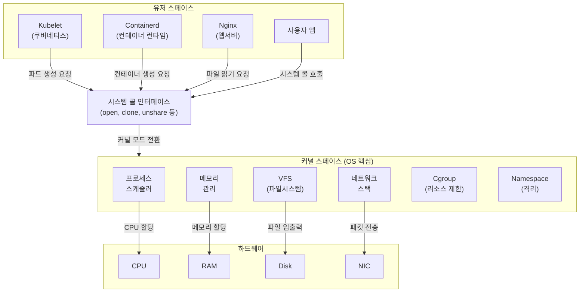
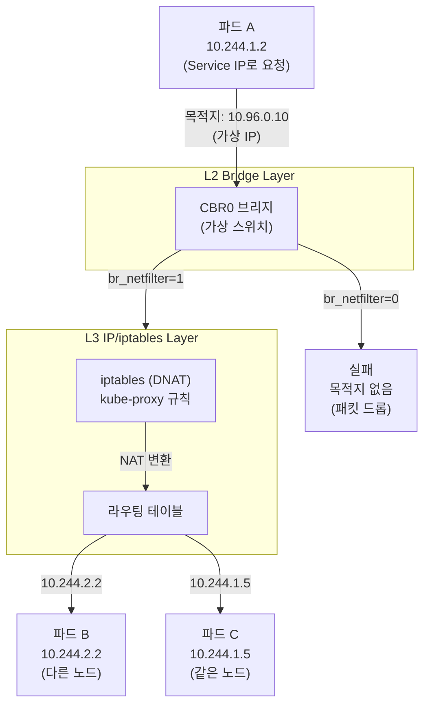
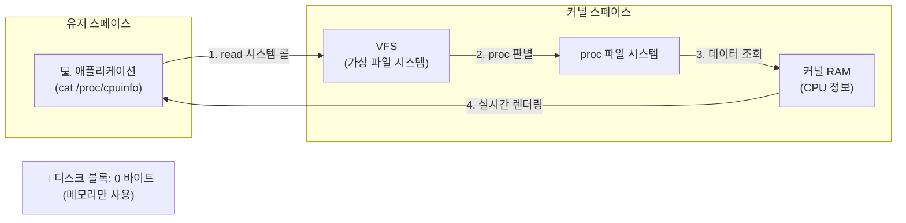

# 리눅스 커널과 컨테이너

> 컨테이너를 가능하게 하는 리눅스 커널의 핵심 구조와 동작 원리를 정리한다.

쿠버네티스는 지시자이고, 리눅스 커널은 실행자다. OOMD나 CPU 스로틀링 같은 장애는 모두 리눅스 커널이 내린 결정의 결과물이다. 쿠버네티스를 깊이 있게 다루려면 커널 내부에서 자원이 어떻게 관리되고 명령이 어떻게 수행되는지 이해해야 한다.

## 핵심 질문

**다섯 가지 핵심 질문**:

1. 커널은 메모리를 왜 그리고 어떻게 나누는가?
2. 유저 스페이스 프로그램이 커널에 어떻게 요청하는가?
3. 쿠버네티스 모든 컴포넌트는 커널 위에서 어떻게 동작하는가?
4. 컨테이너가 동작하려면 커널에 무엇이 준비되어야 하는가?
5. `/proc` 가상 파일 시스템은 디스크에 없는데도 왜 파일처럼 보이는가?

## 리눅스와 쿠버네티스 의존 관계

쿠버네티스는 리눅스에 의존한다:

- **Kubelet**: 리눅스 시스템 데몬
- **Pod**: 네임스페이스와 cgroup으로 만들어진 격리 공간
- **Service**: iptables 또는 eBPF로 구현된 트래픽 분산

리눅스 커널의 본질을 이해해야 쿠버네티스 동작 방식을 정확히 파악할 수 있다.

## 유저 스페이스 vs 커널 스페이스

리눅스 운영 체제는 메모리를 두 영역으로 나눈다.



### 유저 스페이스

Kubelet, Containerd, Nginx, 사용자 앱 등이 모두 여기서 동작한다.

### 커널 스페이스

OS의 핵심이 사는 곳:

- 프로세스 스케줄러
- 메모리 관리
- 파일 시스템
- 네트워크 스택
- Cgroup, Namespace

### 시스템 콜 인터페이스

유저 스페이스에서 커널 스페이스로 넘어가는 유일한 문이다. Kubelet이나 Containerd 같은 프로그램은 시스템 콜을 통해서만 커널에 요청을 전달할 수 있다.

### 메모리를 나누는 이유

**보안**:

- 유저 스페이스 프로그램이 직접 하드웨어를 조작하면 다른 프로세스 메모리를 읽거나 디스크를 파괴할 수 있음
- 커널이 중간에서 허용된 작업만 대행

**안정성**:

- Nginx가 크래시되면 해당 프로세스만 다운
- 커널이 크래시되면 전체 시스템 다운 (커널 패닉)
- 쿠버네티스 프로덕션 환경에서 커널 패닉 발생 시 노드 전체가 NotReady 상태로 전환되고 파드들이 다른 노드로 재스케줄링됨

## 시스템 콜

유저 스페이스 프로그램이 커널에게 "이거 해 줘"라고 요청하는 공식 인터페이스다.

### 주요 시스템 콜

| 시스템 콜 | 용도 | 예시 |
|----------|------|------|
| `open` | 파일 열기 | 파일 읽기 준비 |
| `sendto` | 네트워크 데이터 전송 | TCP/UDP 패킷 전송 |
| `clone` | 새 프로세스 생성 | 컨테이너 프로세스 생성 |
| `unshare` | 프로세스 격리 | 컨테이너 격리 공간 생성 |

최신 리눅스 커널 기준 약 460개의 시스템 콜이 존재한다.

### 쿠버네티스 맥락

Kubelet이 파드 생성 요청:

1. Kubelet이 직접 파드를 생성하지 않음
2. 시스템 콜을 통해 커널에 요청
3. 커널이 네임스페이스 생성 및 cgroup 설정

Containerd도 동일:

1. 컨테이너 시작 요청을 받음
2. runc (저수준 런타임)가 시스템 콜로 커널에 프로세스 생성 및 격리 요청
3. `strace`로 확인하면 `clone`, `unshare` 같은 시스템 콜이 호출됨

### 보안 위협

파드 내 컨테이너가 460개 시스템 콜을 모두 호출할 수 있으면:

- 해커가 Nginx 취약점을 뚫고 커널 모듈 조작 또는 권한 상승
- 파드 하나가 털리는 게 아니라 노드 전체 통제권 탈취 (컨테이너 이스케이프)

**대응책**: Seccomp 보안 프로필 적용 (쿠버네티스 보안 챕터에서 상세 다룸)

## 커널 스페이스 내부 - 코어 영역

커널은 시스템 부팅 시 필수적인 **코어 서브시스템**과 필요할 때 동적으로 붙이는 **커널 모듈**로 구성된다.

코어 영역은 커널 컴파일 시 바이너리에 완전히 내장되는 뼈대다. `modprobe`로 로드할 수 없고, 하나라도 누락되면 부팅이 되지 않는다.

### 프로세스 스케줄러

CPU를 누구에게 줄지 결정하는 시스템이다.

**동작 원리**:

- 서버에 프로세스 100개, CPU 2개인 경우
- 스케줄러가 CPU 시간을 잘게 쪼개서 순서대로 나눠줌
- Kubelet, Containerd, Nginx 등 모든 프로세스가 동시에 돌아가는 이유

**쿠버네티스 연동**:

Pod YAML의 `resources.requests.cpu: 500m` 설정:

- CPU 코어 한 개 절반(50%)을 보장
- `m`은 밀리 단위 (1코어 = 1000m)
- 커널 cgroup의 `cpu.weight`로 전달되어 가중치로 사용

Pod YAML의 `resources.limits.cpu: 1000m` 설정:

- CPU가 남아돌아도 1코어 이상 사용 불가
- cgroup의 `cpu.max`로 전달되어 절대 상한선 유지
- 초과 시 커널이 CPU 사용률을 일시 정지 → **CPU 스로틀링**

### 메모리 관리

프로세스들에게 한정된 RAM을 적절히 나누어 주고 회수하는 역할이다.

**OOM Killer**:

- 시스템 전체 메모리 부족 시 동작
- 프로세스를 강제 종료시켜 메모리 확보

**쿠버네티스 연동**:

Pod YAML의 `resources.limits.memory: 512Mi` 설정:

- 파드가 512MiB까지만 사용 가능
- 커널 cgroup의 `memory.max`에 기록
- 512MiB 초과 시 OOM Killer가 해당 프로세스 즉시 종료
- `kubectl describe pod` 결과: `OOMKilled` 메시지

**중요**: 파드를 죽인 것은 커널이고, 쿠버네티스는 그 결과를 `OOMKilled` 상태로 보고할 뿐이다.

**메모리 단위**:

| 단위 | 크기 | 차이 |
|------|------|------|
| 메가바이트 (MB) | 1,000,000 바이트 | 10진법 |
| 메비바이트 (MiB) | 1,048,576 바이트 | 2진법 (4.8% 큼) |

쿠버네티스는 오차를 없애기 위해 메비바이트(MiB) 표기 사용.

### VFS (Virtual File System)

서로 다른 파일 시스템을 통일된 인터페이스로 제공하는 계층이다.

**지원 파일 시스템**:

- **EXT4**: 일반 하드디스크 포맷
- **OverlayFS**: 컨테이너 이미지 레이어 겹치기
- **proc**: 메모리 홀로그램

**동작 원리**:

- 프로그램이 `open()`, `read()`, `write()` 시스템 콜만 호출
- VFS가 경로를 보고 적절한 파일 시스템으로 요청 전달
- 물리 디스크인지, 컨테이너인지, 메모리인지 신경 쓸 필요 없음

"리눅스에서는 모든 것이 파일이다"라는 말이 가능한 이유가 VFS 덕분이다.

### 네트워크 스택

쿠버네티스 네트워킹은 리눅스 커널의 기존 네트워크 스택에 의존한다.

**패킷 흐름**:

1. 앱이 소켓을 열어서 데이터 전송
2. 커널 앱으로 진입
3. 전송 계층 (TCP/UDP)에서 처리
4. 네트워크 계층 (IP)에서 목적지 결정
5. 하드웨어를 통해 물리 네트워크로 전송

**쿠버네티스 적용**:

- **파드 간 통신**: 커널 네트워크 스택 흐름을 그대로 사용
- **서비스**: Netfilter (kube-proxy가 심어둔 iptables 규칙)에 의해 목적지 IP 변환

### IPC (Inter-Process Communication)

같은 서버 안 프로세스끼리 데이터를 주고받는 빠른 통신 방식이다.

**방식**:

- 공유 메모리
- 세마포어
- 네트워크 스택을 거치지 않고 메모리 단에서 직접 통신

**쿠버네티스 적용**:

- 같은 파드 안 컨테이너들은 IPC 네임스페이스를 서로 공유
- 컨테이너 A와 B가 한 파드에 묶여 있으면 네트워크 망을 타지 않고 커널 공유 메모리로 직접 통신
- 파드가 다르면 IPC 공간이 완벽하게 격리됨 (같은 노드 안에 있어도 격리)

### 보안 체계

리눅스 커널 보안은 두 축으로 나뉜다.

**LSM (Linux Security Module)**:

- SELinux, AppArmor
- 문지기 역할
- 프로세스가 파일이나 리소스에 접근해도 되는지 통제

**Seccomp (Secure Computing)**:

- 시스템 콜 단위로 제어
- 위험한 시스템 콜을 허용해도 되는지 판단
- 프로세스 행동 자체를 틀어막음

**쿠버네티스 적용**:

Pod YAML의 `securityContext` 섹션에서 제어:

- 권한 상승 막기
- 루트가 아닌 일반 사용자로 실행 강제
- 기본 Seccomp 프로파일 적용

CKS (Certified Kubernetes Security Specialist) 시험의 핵심 주제다.

### 블록 레이어

디스크에 데이터를 읽고 쓸 때 IO 요청을 정리하고 스케줄링하는 계층이다.

- VFS는 어떤 파일 시스템인지 판단
- 블록 레이어는 디스크에 실제로 어떻게 쓸 건지 처리

**쿠버네티스 적용**: CSI 드라이버가 블록 레이어를 통해 PV를 파드에 마운트

### 디바이스 모델

GPU 같은 하드웨어 장치를 소프트웨어적으로 관리하는 체계다.

- `/sys` 가상 파일 시스템을 통해 장치 정보 노출
- 쿠버네티스 Dynamic Resource Allocation으로 GPU 같은 특수 장치를 파드에 할당

### Namespace

프로세스에게 독립된 세계를 보여준다.

**격리 범위**:

- **PID**: 컨테이너 내부에서는 PID 1번, 호스트에서는 수백~수천대 프로세스 번호
- **Network**: 네트워크 인터페이스 격리
- **Mount**: 파일 시스템 격리
- **Hostname**: 호스트 이름 격리

네임스페이스는 커널 소스에 컴파일로 내장되어 있어서 `modprobe`로 로드되지 않는다. 커널과 한 몸이다.

### Cgroup

네임스페이스가 "무엇을 볼 수 있는가"를 격리했다면, cgroup은 "얼마나 쓸 수 있는가" 제한에 초점을 맞춘다.

**쿠버네티스 적용**:

- CPU request, memory limit 등이 모두 cgroup을 통해 커널에 전달
- 파드 생성 시: Kubelet → Containerd → runc → cgroup 설정 → 커널이 제한 적용

쿠버네티스 1.35부터 cgroup v2가 필수다.

## 커널 모듈 - 확장 영역

코어가 커널과 한 몸인 뼈대라면, 모듈은 필요할 때 붙이고 떼는 확장 기능이다.

**특징**:

- 부팅 시 무조건 올라오지 않음
- 앱이 기능을 필요로 하면 그때 메모리에 로드
- `modprobe <모듈명>`: 모듈 로드
- `lsmod`: 현재 로드된 모듈 확인

### Overlay

컨테이너 이미지 레이어를 겹겹이 쌓아서 하나의 파일 시스템처럼 보여주는 역할이다.

**동작 원리**:

- 우분투 레이어 + 라이브러리 레이어 + 앱 레이어 = 하나의 파일 시스템
- Containerd가 컨테이너 시작 시 overlay 사용하여 이미지 레이어 합성

**중요**: 이 모듈이 없으면 레이어를 합칠 수 없어서 컨테이너 자체가 만들어지지 않음

쿠버네티스 노드 세팅 시 `modprobe overlay` 명령을 가장 먼저 실행하는 이유다.

### Bridge Netfilter

CNI 브리지 통신을 위한 모듈이다.

**패킷의 두 갈래 운명**:



**br_netfilter 비활성화 (0)**:

- 패킷이 L2 브리지를 직진
- 서비스 IP (가상 IP)는 실체가 없어서 목적지 도달 불가
- 통신 실패

**br_netfilter 활성화 (1)**:

- L2 브리지를 지나는 모든 패킷을 L3 iptables로 강제 경유
- kube-proxy가 미리 작성한 iptables 규칙에 따라 DNAT (목적지 NAT) 수행
- 서비스 IP → 실제 파드 IP로 변환
- 라우팅을 거쳐 다시 L2 브리지로 내려와서 실제 파드에 도착

**핵심**: br_netfilter가 없으면 서비스 IP가 변환되지 않아서 파드 간 통신 실패

## /proc 가상 파일 시스템

디스크에 저장된 진짜 파일이 아니라 RAM에 띄운 가상 파일 시스템이다.

### 디스크 사용량 확인

```bash
# /etc 디렉터리 (실제 디스크)
du -sh /etc
# 출력: 6.6M

# /proc 디렉터리 (가상 파일 시스템)
du -sh /proc
# 출력: 0 (디스크 공간 0바이트)
```

`/proc`은 실제 파일처럼 보이지만 디스크에는 존재하지 않는다.

### 동작 원리



**일반 파일 vs /proc**:

- **일반 파일** (`/etc/hosts`): VFS → EXT4 → 블록 레이어 → 디스크 (실제 블록 점유)
- **`/proc` 파일**: VFS → proc → 커널 RAM → 실시간 렌더링 (디스크 블록 0)

`cat /proc/cpuinfo` 엔터를 치는 순간 커널이 RAM 내부 데이터를 텍스트로 변환해서 전달한다.

### CPU 정보 확인

```bash
cat /proc/cpuinfo | grep -E 'processor|cpu cores|siblings'
```

**출력 예시**:

- `processor : 0`, `processor : 1` → 프로세서 2개
- `cpu cores : 1` → 물리 CPU 코어 1개
- `siblings : 2` → 논리 CPU 2개 (하이퍼스레딩)

**하이퍼스레딩**: 물리 CPU 코어 1개를 OS에게 논리 코어 2개처럼 보이게 만드는 기술. 약 15~30% 성능 향상.

**CPU 플래그**:

- `ht`: 하이퍼스레딩 지원
- `aes`: 암호화 지원
- `hypervisor`: 가상 머신 위에서 동작 중 (물리 서버 아님)

### 메모리 정보 확인

```bash
# 물리 RAM 크기 (DMI 정보)
dmidecode -t memory | grep Size
# 출력: 4096 MB (4 GiB)

# OS가 관리하는 RAM
cat /proc/meminfo | head -1
# 출력: MemTotal: 3920000 kB (약 3.74 GiB)
```

**차이 원인**: 커널이 부팅 시 자신의 생존 공간을 미리 영구적으로 확보 (약 0.26 GiB)

**메모리 항목**:

- `MemTotal`: OS가 일반 프로그램에게 빌려줄 수 있는 RAM 총량
- `MemFree`: 현재 완전히 비어 있는 메모리
- `MemAvailable`: 캐시를 회수하면 확보할 수 있는 메모리까지 포함
- `SwapTotal: 0`: 스왑 꺼짐 (쿠버네티스는 예측 가능성을 위해 스왑 항상 off)

Kubelet은 `MemAvailable`을 기준으로 메모리 부족 판단. `MemFree`가 적어도 `MemAvailable`이 충분하면 즉시 파드를 종료(eviction)하지 않음.

## 커널 파라미터

쿠버네티스 클러스터가 정상 동작하려면 세 가지 핵심 커널 파라미터가 모두 활성화되어야 한다.

### 필수 모듈 로드

```bash
lsmod | grep -E 'overlay|br_netfilter'
```

출력이 나오면 로드된 상태, 없으면 미로드 상태.

**overlay 미로드 시**:

- Containerd가 컨테이너 이미지 레이어 합성 불가
- 파드 생성 시 `CreateContainerError` 발생

**br_netfilter 미로드 시**:

- `/proc/sys/net/bridge/` 디렉터리 자체가 존재하지 않음
- 브리지 iptables 파라미터 설정 불가

### IP Forward

노드가 다른 노드의 파드 패킷을 포워딩할 수 있는지 결정한다.

```bash
cat /proc/sys/net/ipv4/ip_forward
# 출력: 1 (활성화)
```

**0 (비활성화) 시**:

- 목적지가 자신의 IP가 아니면 패킷 즉시 폐기
- 노드 1의 파드 A → 노드 2의 파드 B 통신 실패

**1 (활성화) 시**:

- 목적지 IP가 자신이 아니어도 라우팅 테이블 참조하여 다음 경로 찾음
- 리눅스 서버가 트래픽 중계 라우터 역할
- CNI가 작성한 라우팅 테이블에 따라 파드 네트워크 대역 패킷 정상 포워딩

### Bridge iptables

브리지 트래픽이 iptables를 경유할 수 있는지 결정한다.

```bash
cat /proc/sys/net/bridge/bridge-nf-call-iptables
# 출력: 1 (활성화)
```

**0 (비활성화) 시**:

- 패킷이 브리지를 통과하지만 iptables를 무시
- 서비스 IP (가상 IP) 변환 없이 그대로 통과
- 가상 IP는 실체가 없어서 라우팅 테이블에서 목적지 찾을 수 없음
- 패킷 버려지고 통신 실패

**1 (활성화) 시**:

- 패킷이 브리지를 지날 때 강제로 iptables 경유
- DNAT 규칙 적용: 클러스터 IP → 실제 파드 IP 변환
- 변환된 실제 IP로 정상 라우팅
- 패킷이 실제 목적지에 무사히 도착

### Bridge ip6tables

IPv6 트래픽에 대한 iptables 경유 여부를 결정한다.

```bash
cat /proc/sys/net/bridge/bridge-nf-call-ip6tables
# 출력: 1 (활성화)
```

동작 원리는 `bridge-nf-call-iptables`와 동일하며, IPv6 환경을 위한 설정이다.

## 실습 검증

### 시스템 콜 추적

```bash
strace cat /proc/cpuinfo 2>&1 | grep -E 'open|read|write'
```

**주요 시스템 콜**:

1. `openat(..., "/proc/cpuinfo", ...) = 3`: 파일 열기, 파일 디스크립터 3번 반환
2. `read(3, ..., 131072) = 2360`: 3번 통로에서 2360바이트 읽기 (커널이 RAM 상태를 텍스트로 생성)
3. `write(1, ..., 2360) = 2360`: 1번 통로(stdout)로 2360바이트 출력
4. `read(3, ..., 131072) = 0`: 더 이상 읽을 데이터 없음

무심코 입력하는 `cat` 명령어 하나도 내부적으로는 정교한 시스템 콜 통신으로 완성된다.

### 코어 vs 모듈 구분

```bash
# Cgroup (코어)
lsmod | grep cgroup
# 출력 없음 (커널 코어에 내장, modprobe로 로드/해제 불가)

mount | grep cgroup
# 출력: cgroup2 on /sys/fs/cgroup type cgroup2 (rw,...)
# cgroup v2 사용 중

# Overlay (모듈)
lsmod | grep overlay
# 출력: overlay 151552 29
# 현재 29개 컨테이너가 overlay 파일 시스템 마운트 포인트 사용 중

modinfo overlay
# filename: /lib/modules/.../overlay.ko.xz (물리 파일 경로 확인)
```

**참조 횟수**: `29`는 현재 이 노드에서 overlay를 사용하는 컨테이너 개수. 참조 횟수가 0보다 크면 강제로 모듈을 내릴 수 없음.

### 필수 조건 확인

```bash
# 1. 모듈 로드 확인
lsmod | grep -E 'overlay|br_netfilter'

# 2. IP Forward 활성화
cat /proc/sys/net/ipv4/ip_forward
# 출력: 1

# 3. Bridge iptables 활성화
cat /proc/sys/net/bridge/bridge-nf-call-iptables
# 출력: 1

# 4. Bridge ip6tables 활성화
cat /proc/sys/net/bridge/bridge-nf-call-ip6tables
# 출력: 1
```

이 네 가지 중 하나라도 누락되거나 0으로 설정되면 컨테이너 생성 에러 발생 또는 파드 간 통신이 막히는 치명적 장애 발생.

## 핵심 질문 답변

**1. 커널은 메모리를 왜 그리고 어떻게 나누는가?**

- 보안과 안정성을 위해 유저 스페이스와 커널 스페이스로 분리
- 유저 스페이스 프로그램이 직접 하드웨어를 조작하면 다른 프로세스 메모리 읽거나 디스크 파괴 가능
- 커널 크래시 시 전체 시스템 다운이므로 일반 프로그램과 격리

**2. 유저 스페이스 프로그램이 커널에 어떻게 요청하는가?**

- 시스템 콜 인터페이스를 통해 요청
- `open`, `read`, `write`, `clone`, `unshare` 등 약 460개 시스템 콜 사용

**3. 쿠버네티스 모든 컴포넌트는 커널 위에서 어떻게 동작하는가?**

- Kubelet, Containerd 등 모든 컴포넌트는 유저 스페이스에서 동작
- 시스템 콜을 통해 커널에 요청
- 커널이 실제 작업 수행 (네임스페이스 생성, cgroup 설정 등)

**4. 컨테이너가 동작하려면 커널에 무엇이 준비되어야 하는가?**

- 커널 모듈: overlay, br_netfilter 로드
- 커널 파라미터: ip_forward=1, bridge-nf-call-iptables=1, bridge-nf-call-ip6tables=1
- 네임스페이스 및 cgroup 코어 기능 (커널 내장)

**5. `/proc` 가상 파일 시스템은 디스크에 없는데도 왜 파일처럼 보이는가?**

- VFS 계층에서 디스크로 내려가지 않음
- 커널이 RAM 내부 데이터 구조를 `read` 시스템 콜 시점에 실시간 텍스트로 렌더링
- 디스크 블록을 점유하지 않아서 `du` 명령어로 0바이트 표시

## 참고

- [Linux Kernel Documentation](https://www.kernel.org/doc/html/latest/)
- [System Call Table](https://man7.org/linux/man-pages/man2/syscalls.2.html)
- [cgroup v2 Documentation](https://www.kernel.org/doc/html/latest/admin-guide/cgroup-v2.html)
- [Linux Namespaces](https://man7.org/linux/man-pages/man7/namespaces.7.html)
- [[Ch-01] Kubernetes 왜 필요한가? 결국 Linux까지 내려가야 이해된다!](https://www.youtube.com/watch?v=XsgYsvgA0Ow)
- [[Ch-02] 단순 kubectl 명령어 그만! 쿠버네티스 엔지니어가 리눅스 커널을 반드시 알아야 하는 이유](https://www.youtube.com/watch?v=OjoUal1JPcM&t=6331s)
