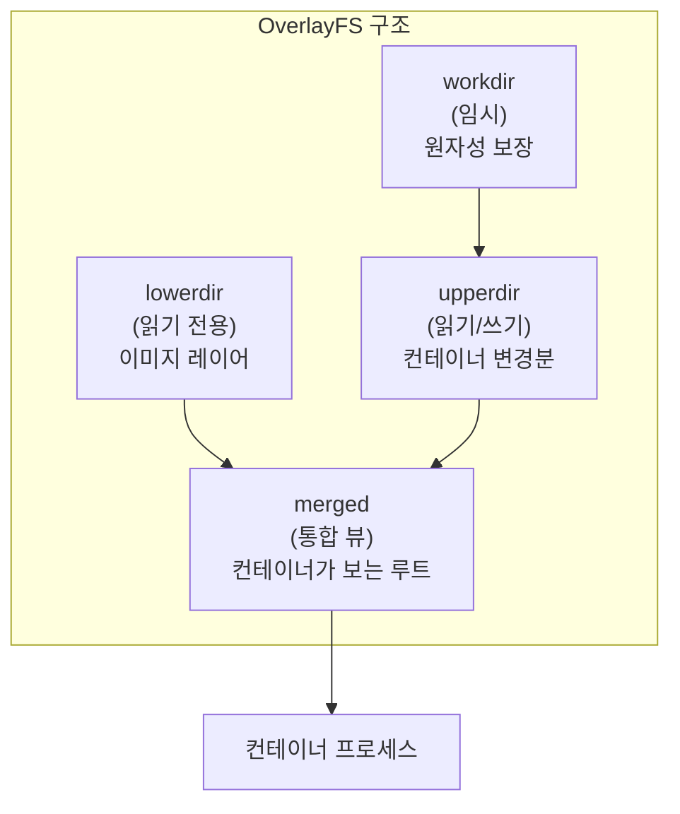
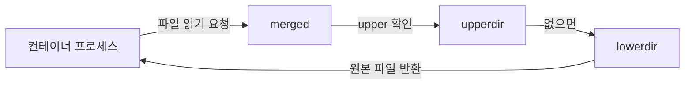
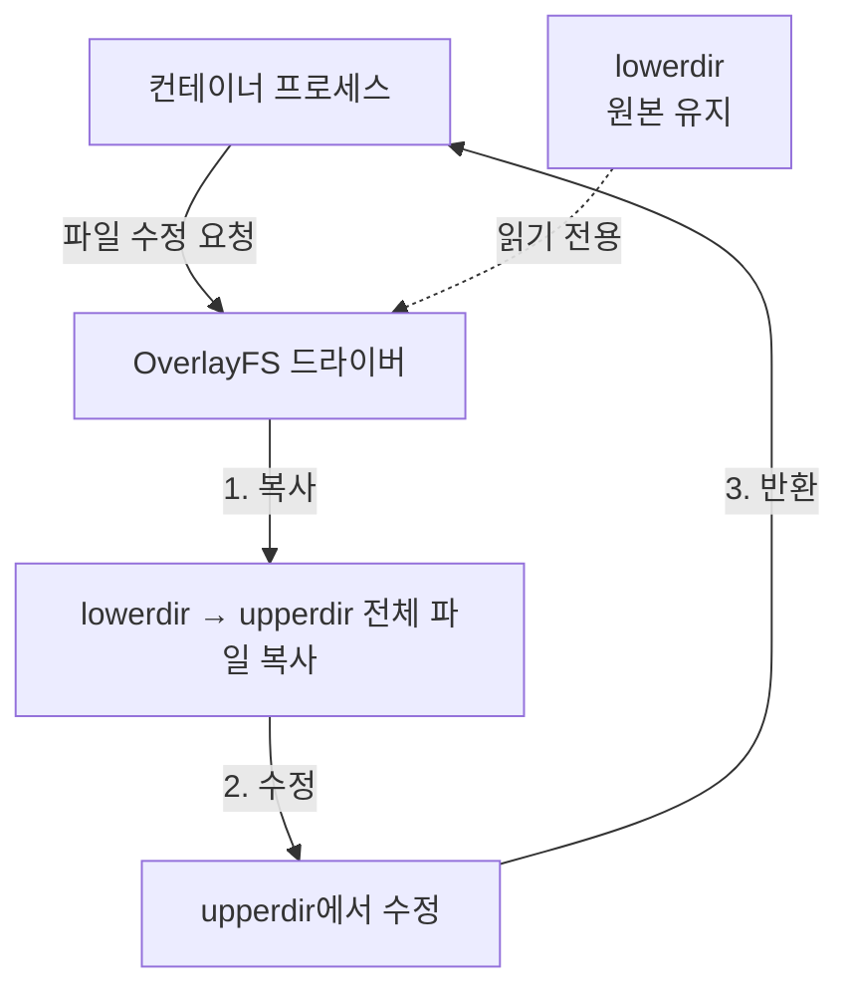
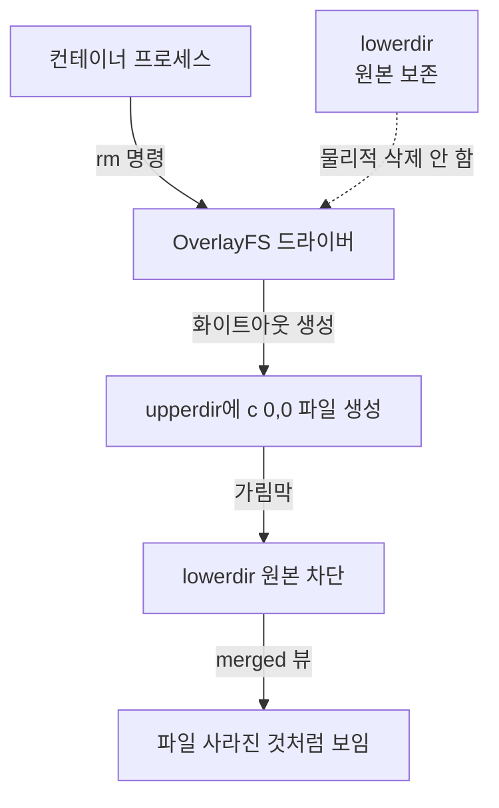

# OverlayFS와 컨테이너 이미지 레이어

> 컨테이너 이미지를 구성하는 레이어 구조와 OverlayFS 파일 시스템의 동작 원리를 정리한다.

컨테이너는 단일 기술이 아니라 리눅스 커널의 세 가지 기능을 조합한 결과물이다. 프로세스를 격리하는 Namespace, 자원을 제한하는 Cgroup, 그리고 파일 시스템을 담당하는 OverlayFS다. OverlayFS는 여러 레이어로 구성된 이미지를 컨테이너에게 하나의 루트 파일 시스템으로 보여주는 메커니즘이다.

## 넷플릭스 사례: 대규모 마운트 병목

### 문제 상황

넷플릭스가 2015년 기술 블로그에서 공개한 사례다. User Namespace와 ID 맵을 도입해 보안을 강화했지만, 예상치 못한 성능 문제가 발생했다.

**환경**:

- 노드: AWS R5 메탈 인스턴스 (48 물리 코어, 96 논리 프로세서)
- 트리거 조건: 컨테이너 100개 이상, 각 컨테이너마다 이미지 레이어 50개 이상

**장애 증상**:

- 노드가 30초 이상 멈추는 스톨(Stall) 현상
- kubelet과 containerd 간 통신 단절
- 노드 전체가 NotReady 상태로 전환

### 원인 분석

**마운트 폭발**:

```
컨테이너 1개당 마운트 횟수 = 레이어 50개 × 2회 (조립 + 해제) + 1회 (OverlayFS 병합) = 101회
컨테이너 뒤에 작업 = 메타데이터 조회 + 실제 구동 = 2배
총 마운트 횟수 = 101 × 2 × 100개 = 20,200번
```

**글로벌 락 병목**:

- 마운트 테이블은 시스템 전역 자원 → 단일 락(Mount Lock)으로 보호
- 한 번에 1개 CPU만 통과 가능
- 나머지 45개 CPU는 스핀락(Spin Lock) 대기 → CPU 연산력 100% 낭비

**스핀락 vs 뮤텍스**:

| 구분 | 스핀락 | 뮤텍스 |
|------|--------|--------|
| 대기 방식 | CPU 점유하며 무한 반복 확인 | 대기 상태로 잠들기 |
| 문맥 교환 비용 | 0 | 수십 마이크로초 |
| CPU 낭비 | 높음 | 낮음 |
| 적합한 경우 | 작업 시간이 매우 짧을 때 (1마이크로초) | 작업 시간이 길 때 |

커널은 마운트 작업이 원래 1마이크로초 내외로 끝나기 때문에 스핀락을 선택했다. 문맥 교환 비용(수십 마이크로초)이 작업 시간보다 훨씬 크기 때문이다.

**하드웨어 요인**:

1. **NUMA (Non-Uniform Memory Access)**: 락 정보가 다른 CPU 소켓 메모리에 있으면 QPI 통로를 거쳐야 함 → 지연 발생
2. **하이퍼스레딩**: 2개 논리 CPU가 공유 연산 회로를 스핀락으로 점유 → 코어 전체 마비
3. **LLC 캐시 구조**: 중앙 집중형 단일 캐시 → 대규모 스핀 경합 시 캐시 동기화 트래픽 폭주

### 해결 방법

**리눅스 커널 6.3 - Recursive Bind Mount**:

| 구분 | 기존 방식 | 개선 방식 |
|------|----------|----------|
| 마운트 방식 | 50장 서류에 일일이 도장 찍기 | 서류철 겉면에 도장 한 번 찍기 |
| 레이어별 처리 | 레이어 50개 → 마운트 50회 | 상위 디렉토리 한 번 → 하위 레이어 자동 상속 |
| 컨테이너 100개 시 | 20,200번 | 600번 |
| 효과 | - | 33배 감소 |

**장애 흐름 요약**:

1. **보안 강화**: User Namespace + ID 맵 도입
2. **부작용 발생**: 레이어마다 ID 맵 적용 → 마운트 호출 증가
3. **마운트 폭발**: 컨테이너 100개 × 레이어 50개 × 2회 = 20,200번
4. **글로벌 락 병목**: 단일 락에 요청 몰림 → 45개 CPU 스핀락 대기
5. **노드 마비**: CPU 고갈 → 헬스 체크 타임아웃 → NotReady

## OverlayFS 아키텍처

OverlayFS는 네 가지 영역으로 구성된다.



**네 가지 영역**:

| 영역 | 권한 | 역할 | 생명주기 |
|------|------|------|----------|
| **lowerdir** | 읽기 전용 | 이미지 레이어 (불변) | 이미지 삭제 전까지 유지 |
| **upperdir** | 읽기/쓰기 | 컨테이너 변경분 | 컨테이너와 함께 삭제 |
| **workdir** | 내부 전용 | 원자적 연산 임시 공간 | upperdir와 동일 파일 시스템 필수 |
| **merged** | 통합 뷰 | lowerdir + upperdir 합성 결과 | 컨테이너가 보는 루트 파일 시스템 |

**workdir의 역할**:

- 파일 수정 중 크래시 발생 시 파일 손상 방지
- 임시 파일 생성 → 작업 완료 → upperdir로 rename (원자적 연산)
- upperdir와 반드시 같은 파일 시스템에 위치해야 함

## 이미지 레이어 구조

### Dockerfile과 레이어 생성

Dockerfile 명령어 한 줄이 실행될 때마다 하나의 독립된 레이어가 생성된다.

**예시**:

```dockerfile
FROM ubuntu:22.04        # 레이어 1: 70MB (베이스 OS)
RUN apt-get install nginx   # 레이어 2: 20MB (패키지)
COPY nginx.conf /etc/nginx/ # 레이어 3: 1KB (설정 파일)
COPY app /app               # 레이어 4: 5MB (애플리케이션)
```

모든 레이어는 **read-only** 속성을 가진다. 한번 빌드가 끝난 이미지 레이어는 누구도 수정할 수 없다.

### 레이어를 나누는 이유

**1. 레이어 공유**:

```
Nginx 이미지:  [ Ubuntu 22.04 ][ Nginx ]
Node.js 이미지: [ Ubuntu 22.04 ][ Node.js ]
                      ↑
                 동일 SHA256 해시
                 → 디스크에 한 번만 저장
```

동일한 베이스 이미지를 사용하는 컨테이너 100개를 띄워도 베이스 레이어는 디스크에 단 1개만 존재한다.

**2. 캐시 효율**:

- 소스 코드 수정 → 레이어 4만 재빌드
- 레이어 1~3은 해시값이 동일 → 캐시에서 즉시 재사용
- 전체 95MB 이미지가 아닌 5MB만 빌드 → CI/CD 빌드 시간 단축

**3. 불변성 (보안)**:

- 각 레이어는 SHA256 해시로 식별
- 1비트라도 변조되면 해시값 즉시 변경 → 공급망 보안 보장
- 레지스트리에서 다운로드한 이미지가 빌드 시점 원본과 동일함을 수학적으로 증명

## 레이어 저장 경로

### 이미지 저장소

**경로**: `/var/lib/containerd/io.containerd.snapshotter.v1.overlayfs`

**구성 요소**:

- `metadata.db`: 볼트(Bolt) DB - 스냅샷 ID와 해시값 매핑
- `snapshots/`: 실제 레이어 파일 저장 (숫자 폴더)

**스냅샷 폴더 명명 규칙**:

- 이름: 1, 7, 8, 100, 101, 107... (순차 발급, 재사용 안 함)
- 이유: SHA256 해시(64자)를 경로에 쓰면 마운트 옵션 문자열이 4KB(1 페이지) 초과 → 커널 마운트 거부
- 해결: 짧은 정수 ID로 치환 → metadata.db에서 매핑 관리

**스냅샷 종류**:

| 종류 | 역할 | 공유 여부 | 디스크 경고 시 조치 |
|------|------|----------|---------------------|
| **커밋된 스냅샷** | lowerdir 이미지 원본 | 여러 컨테이너 공유 | 가비지 컬렉션 (인프라 팀) |
| **액티브 스냅샷** | upperdir/workdir 컨테이너 전용 | 특정 컨테이너 전용 | 로그/임시 파일 생성 파드 식별 (개발 팀) |

**스냅샷 하위 구조**:

- `fs/`: 실제 파일 저장
- `work/`: 이미지 다운로드 시 임시 사용 (이후 비워짐)

### 컨테이너 마운트 포인트

**경로**: `/run/containerd/io.containerd.runtime.v2.task/k8s.io/<container-id>/rootfs`

- 각 컨테이너 ID별로 폴더 생성
- `rootfs/`: OverlayFS의 merged 영역 (컨테이너가 보는 루트 파일 시스템)

## OverlayFS 동작 방식

### 읽기 (Read)



**흐름**:

1. upperdir 먼저 확인 (수정된 파일 있는지)
2. 없으면 lowerdir에서 원본 직접 읽기
3. 복사 없음 → **제로 코스트**

**효율성**:

- 같은 이미지로 컨테이너 100개 띄워도 디스크에 이미지 원본 1개만 존재
- 모든 컨테이너가 lowerdir 공유해서 읽기

### 쓰기 (Write) - Copy-on-Write



**Copy-on-Write (COW) 메커니즘**:

1. **복사**: lowerdir 원본 파일을 upperdir로 통째로 복사
2. **수정**: upperdir 복사본만 수정 (원본 보존)
3. **병합**: merged에서는 upperdir 수정본이 lowerdir 원본을 가림

**주의사항**:

- 1바이트 수정해도 파일 전체 복사 발생
- 100MB 파일의 글자 하나 수정 → 100MB 전체 복사
- 대용량 파일 빈번 수정 시 디스크 I/O 폭증

**실무 권장**:

- DB처럼 대용량 파일 빈번 수정 → OverlayFS 우회
- Persistent Volume 또는 EmptyDir 마운트 → 네이티브 파일 시스템 사용

### 삭제 (Delete) - Whiteout



**Whiteout 파일**:

- 형식: Character Device 파일 (`c 0,0`)
- 역할: lowerdir 원본을 가리는 표식
- 결과: merged에서는 파일이 삭제된 것처럼 보임

**특징**:

- lowerdir 원본은 물리적으로 보존
- 같은 이미지 사용하는 다른 컨테이너는 영향 없음
- upperdir의 가림막만 제거하면 원본 다시 보임

## 실무 질문 5가지

**Q1. 똑같은 Nginx 컨테이너 100개 띄우면 디스크 용량도 100배 필요할까?**

아니다. 100개 컨테이너가 lowerdir 원본 1개를 공유한다. 각 컨테이너의 변경분(upperdir)만 개별 저장된다.

**Q2. 컨테이너에서 시스템 파일을 `rm`으로 지우면 원본 이미지까지 삭제될까?**

아니다. upperdir에 whiteout 파일(가림막)만 생성된다. lowerdir 원본은 물리적으로 영구 보존된다.

**Q3. 수정한 파일이 옆 컨테이너에 영향을 줄 수 있을까?**

없다. Copy-on-Write로 내 컨테이너 upperdir에 복사본을 만들어 수정한다. 각 컨테이너의 upperdir는 완벽히 격리된다.

**Q4. DB처럼 파일 수정이 빈번한 서비스를 OverlayFS에 그대로 두면?**

1바이트 수정해도 전체 파일 복사 → 성능 저하 발생. Persistent Volume이나 EmptyDir 마운트로 OverlayFS 우회해야 한다.

**Q5. 파드 삭제 시 데이터는 어떻게 될까?**

- upperdir: 영구 삭제
- lowerdir 이미지 원본: 보존
- Persistent Volume: 보존
- EmptyDir: 삭제

## 참고

- [Netflix Tech Blog: Linux Performance Analysis in 60,000 Milliseconds](https://netflixtechblog.com/linux-performance-analysis-in-60-000-milliseconds-accc10403c55)
- [Linux Kernel OverlayFS Documentation](https://www.kernel.org/doc/html/latest/filesystems/overlayfs.html)
- [containerd snapshotter](https://github.com/containerd/containerd/tree/main/docs/snapshotters)
- [OverlayFS 상세 강의 영상](https://www.youtube.com/watch?v=dhGW3ETfrnk&t=4808s)
