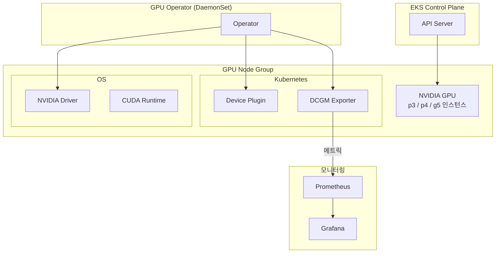

---
tags:
  - EKS
  - GPU
  - NVIDIA
---

# GPU on EKS

> EKS에서 NVIDIA GPU 노드를 구성하고, GPU Operator로 드라이버를 관리하며, DCGM으로 모니터링하는 전체 운영 경험을 정리한다.

---

## 아키텍처 개요



---

## 1. GPU 노드 구성

### GPU 인스턴스 타입 선택

| 인스턴스 | GPU | GPU 메모리 | 주요 용도 |
|---------|-----|-----------|---------|
| `g4dn.xlarge` | 1x T4 | 16GB | 추론, 개발 |
| `g5.xlarge` | 1x A10G | 24GB | 추론, 파인튜닝 |
| `p3.2xlarge` | 1x V100 | 16GB | 학습 |
| `p3.8xlarge` | 4x V100 | 64GB | 분산 학습 |
| `p4d.24xlarge` | 8x A100 | 320GB | 대규모 학습 |
| `p5.48xlarge` | 8x H100 | 640GB | LLM 학습 |

### 노드 그룹 생성 (eksctl)

```yaml
# gpu-nodegroup.yaml
apiVersion: eksctl.io/v1alpha5
kind: ClusterConfig
metadata:
  name: my-cluster
  region: ap-northeast-2

managedNodeGroups:
- name: gpu-ng
  instanceType: g5.xlarge
  minSize: 0
  maxSize: 10
  desiredCapacity: 2
  amiFamily: AmazonLinux2
  # GPU 드라이버를 GPU Operator로 관리할 경우 아래 AMI 사용
  # amiFamily: Bottlerocket
  labels:
    workload: gpu
  taints:
  - key: nvidia.com/gpu
    value: "true"
    effect: NoSchedule
  iam:
    attachPolicyARNs:
    - arn:aws:iam::aws:policy/AmazonEKSWorkerNodePolicy
    - arn:aws:iam::aws:policy/AmazonEC2ContainerRegistryReadOnly
    - arn:aws:iam::aws:policy/AmazonEKS_CNI_Policy
```

```bash
eksctl create nodegroup -f gpu-nodegroup.yaml
```

**Taint 설정 이유**: GPU 노드에 `nvidia.com/gpu=true:NoSchedule` taint를 설정하면 GPU를 명시적으로 요청하지 않은 일반 워크로드가 GPU 노드에 스케줄링되는 것을 막는다. GPU 인스턴스는 비용이 높으므로 GPU 워크로드에만 사용하는 것이 중요하다.

### GPU 드라이버 설치 방식 비교

**방법 1 - GPU 최적화 AMI**: AWS가 제공하는 AMI(`Amazon Linux 2 with GPU support`)에 드라이버가 사전 설치되어 있다. 별도 설치 없이 바로 사용 가능하지만, 드라이버 버전 관리가 어렵다.

**방법 2 - NVIDIA GPU Operator (권장)**: Kubernetes Operator가 드라이버·Device Plugin·DCGM 등을 자동으로 설치하고 관리한다. 드라이버 버전을 코드로 관리할 수 있고 업그레이드가 편리하다.

---

## 2. NVIDIA GPU Operator

GPU Operator는 NVIDIA가 제공하는 Kubernetes Operator로, GPU 관련 소프트웨어 스택을 자동으로 설치·관리한다.

### 설치 구성 요소

| 컴포넌트 | 역할 |
|---------|------|
| **NVIDIA Driver** | GPU 드라이버 (컨테이너로 설치) |
| **CUDA** | NVIDIA CUDA 런타임 |
| **Device Plugin** | GPU 리소스를 Kubernetes에 등록 |
| **Container Toolkit** | 컨테이너에서 GPU 접근 허용 |
| **DCGM Exporter** | GPU 메트릭 수집 |
| **GFD (GPU Feature Discovery)** | 노드 레이블 자동 추가 |
| **MIG Manager** | MIG 파티셔닝 관리 |

### 설치

```bash
# Helm 레포 추가
helm repo add nvidia https://helm.ngc.nvidia.com/nvidia
helm repo update

# GPU Operator 설치
helm install gpu-operator nvidia/gpu-operator \
  --namespace gpu-operator \
  --create-namespace \
  --set driver.enabled=true \
  --set toolkit.enabled=true \
  --set devicePlugin.enabled=true \
  --set dcgmExporter.enabled=true \
  --set gfd.enabled=true
```

AWS GPU 최적화 AMI를 사용한다면 드라이버가 이미 설치되어 있으므로 `driver.enabled=false`로 설정한다.

### 설치 확인

```bash
# GPU Operator Pod 상태 확인
kubectl get pods -n gpu-operator

# 노드에 GPU 레이블 확인 (GFD가 자동 추가)
kubectl get nodes -l nvidia.com/gpu.present=true -o json \
  | jq '.items[].metadata.labels | with_entries(select(.key | startswith("nvidia")))'

# GPU 리소스 등록 확인
kubectl describe node <gpu-node> | grep nvidia.com/gpu
# 출력 예시:
# nvidia.com/gpu: 1
# nvidia.com/gpu: 1
```

---

## 3. MIG (Multi-Instance GPU)

MIG는 A100, H100 같은 Ampere 이상 아키텍처의 GPU를 물리적으로 분할하는 기능이다. 하나의 GPU를 독립된 여러 인스턴스로 나눠 여러 워크로드가 완전히 격리된 환경에서 GPU를 사용하도록 한다.

### MIG 파티션 프로파일 (A100 80GB 기준)

| 프로파일 | 인스턴스 수 | 메모리 | 주요 용도 |
|---------|-----------|--------|---------|
| `1g.10gb` | 최대 7개 | 10GB | 경량 추론 |
| `2g.20gb` | 최대 3개 | 20GB | 중형 추론 |
| `3g.40gb` | 최대 2개 | 40GB | 대형 추론 |
| `7g.80gb` | 1개 | 80GB | 전체 GPU |

### MIG 설정 (GPU Operator)

```yaml
# MIG 전략 설정
apiVersion: v1
kind: ConfigMap
metadata:
  name: default-mig-parted-config
  namespace: gpu-operator
data:
  config.yaml: |
    version: v1
    mig-configs:
      all-1g.10gb:
        - devices: all
          mig-enabled: true
          mig-devices:
            1g.10gb: 7
      all-3g.40gb:
        - devices: all
          mig-enabled: true
          mig-devices:
            3g.40gb: 2
```

노드에 레이블을 추가하면 MIG Manager가 자동으로 프로파일을 적용한다.

```bash
kubectl label node <gpu-node> nvidia.com/mig.config=all-1g.10gb
```

### MIG 리소스 요청

```yaml
resources:
  limits:
    nvidia.com/mig-1g.10gb: 1  # MIG 인스턴스 요청
```

---

## 4. Time-slicing (시간 분할)

Time-slicing은 MIG를 지원하지 않는 GPU(T4, V100, A10G 등)에서 소프트웨어 방식으로 GPU를 공유하는 방법이다. MIG와 달리 메모리 격리는 없고 GPU 시간만 분할한다.

### 설정

```yaml
# time-slicing-config.yaml
apiVersion: v1
kind: ConfigMap
metadata:
  name: time-slicing-config
  namespace: gpu-operator
data:
  any: |-
    version: v1
    flags:
      migStrategy: none
    sharing:
      timeSlicing:
        resources:
        - name: nvidia.com/gpu
          replicas: 4  # GPU 1개를 4개처럼 노출
```

```bash
helm upgrade gpu-operator nvidia/gpu-operator \
  --namespace gpu-operator \
  --set devicePlugin.config.name=time-slicing-config
```

Time-slicing 활성화 후 노드의 `nvidia.com/gpu` 용량이 `1` → `4`로 증가하며, 최대 4개 Pod가 동시에 GPU를 사용한다.

**주의사항**: Time-slicing은 메모리 격리가 없으므로 여러 Pod가 GPU 메모리를 공유한다. OOM이 발생하면 다른 Pod도 영향을 받을 수 있다.

---

## 5. GPU 모니터링 (DCGM)

DCGM(Data Center GPU Manager)은 NVIDIA의 GPU 관리 라이브러리로, DCGM Exporter가 Prometheus 형식으로 메트릭을 노출한다.

### 주요 메트릭

| 메트릭 | 설명 |
|--------|------|
| `DCGM_FI_DEV_GPU_UTIL` | GPU 사용률 (%) |
| `DCGM_FI_DEV_MEM_COPY_UTIL` | 메모리 대역폭 사용률 (%) |
| `DCGM_FI_DEV_FB_USED` | 사용 중인 GPU 메모리 (MB) |
| `DCGM_FI_DEV_FB_FREE` | 남은 GPU 메모리 (MB) |
| `DCGM_FI_DEV_GPU_TEMP` | GPU 온도 (°C) |
| `DCGM_FI_DEV_POWER_USAGE` | 전력 소비량 (W) |
| `DCGM_FI_DEV_SM_CLOCK` | SM 클럭 (MHz) |
| `DCGM_FI_PROF_GR_ENGINE_ACTIVE` | GPU 엔진 활성 비율 |

### Prometheus 수집 설정

GPU Operator로 DCGM Exporter를 설치하면 자동으로 ServiceMonitor가 생성된다. kube-prometheus-stack과 함께 사용할 경우:

```bash
helm upgrade gpu-operator nvidia/gpu-operator \
  --namespace gpu-operator \
  --set dcgmExporter.serviceMonitor.enabled=true \
  --set dcgmExporter.serviceMonitor.honorLabels=true
```

### 유용한 PromQL 쿼리

**GPU 사용률 per Pod**:
```promql
DCGM_FI_DEV_GPU_UTIL * on (namespace, pod) group_left()
kube_pod_info{namespace="ml-workloads"}
```

**GPU 메모리 사용량**:
```promql
DCGM_FI_DEV_FB_USED / (DCGM_FI_DEV_FB_USED + DCGM_FI_DEV_FB_FREE) * 100
```

**GPU 온도 임계값 알림**:
```yaml
- alert: GPUHighTemperature
  expr: DCGM_FI_DEV_GPU_TEMP > 85
  for: 5m
  labels:
    severity: warning
  annotations:
    summary: "GPU {{ $labels.gpu }} 온도가 {{ $value }}°C"
```

### Grafana 대시보드

NVIDIA DCGM Exporter 공식 대시보드 ID **12239**를 Grafana에서 Import해 사용한다. GPU 사용률, 메모리, 온도, 전력을 한눈에 확인할 수 있다.

---

## 6. GPU 워크로드 배포

### 기본 GPU Job

```yaml
apiVersion: batch/v1
kind: Job
metadata:
  name: gpu-test
spec:
  template:
    spec:
      restartPolicy: Never
      tolerations:
      - key: nvidia.com/gpu
        operator: Exists
        effect: NoSchedule
      containers:
      - name: cuda-test
        image: nvidia/cuda:12.1.0-base-ubuntu22.04
        command: ["nvidia-smi"]
        resources:
          limits:
            nvidia.com/gpu: 1
```

### nodeSelector vs nodeAffinity

**nodeSelector** (단순): GFD가 추가한 레이블로 특정 GPU 타입 선택.

```yaml
nodeSelector:
  nvidia.com/gpu.product: NVIDIA-A10G
```

**nodeAffinity** (복잡한 조건):

```yaml
affinity:
  nodeAffinity:
    requiredDuringSchedulingIgnoredDuringExecution:
      nodeSelectorTerms:
      - matchExpressions:
        - key: nvidia.com/gpu.memory
          operator: Gt
          values: ["20000"]  # 20GB 이상
```

### 분산 학습 (PyTorch DDP)

```yaml
apiVersion: batch/v1
kind: Job
metadata:
  name: ddp-training
spec:
  completions: 4
  parallelism: 4
  template:
    spec:
      tolerations:
      - key: nvidia.com/gpu
        operator: Exists
        effect: NoSchedule
      containers:
      - name: trainer
        image: pytorch/pytorch:2.1.0-cuda12.1-cudnn8-runtime
        command:
        - torchrun
        - --nproc_per_node=1
        - --nnodes=4
        - --node_rank=$(JOB_COMPLETION_INDEX)
        - --master_addr=$(MASTER_ADDR)
        - --master_port=29500
        - train.py
        env:
        - name: JOB_COMPLETION_INDEX
          valueFrom:
            fieldRef:
              fieldPath: metadata.annotations['batch.kubernetes.io/job-completion-index']
        resources:
          limits:
            nvidia.com/gpu: 1
```

### GPU 리소스 요청 패턴

**단일 GPU**: 일반적인 추론 또는 단일 GPU 학습.
```yaml
resources:
  limits:
    nvidia.com/gpu: 1
```

**분수 GPU (Time-slicing 활성화 시)**:
```yaml
resources:
  limits:
    nvidia.com/gpu: 1  # time-slicing이면 실제로는 1/N 용량
```

**MIG 인스턴스**:
```yaml
resources:
  limits:
    nvidia.com/mig-3g.40gb: 1
```

---

## 7. 운영 시 주의사항

**노드 드레인**: GPU 워크로드가 실행 중인 노드를 드레인할 때는 학습 중인 Job이 체크포인트를 저장할 시간을 확보해야 한다. `terminationGracePeriodSeconds`를 충분히 설정하고 SIGTERM 시그널 처리를 구현한다.

**Spot 인스턴스 활용**: p3/g4dn 인스턴스를 Spot으로 사용하면 비용을 70~90% 절감할 수 있다. 단, 인터럽트 가능성이 있으므로 체크포인트 저장 로직이 필수다. Karpenter의 `consolidationPolicy` 또는 AWS Node Termination Handler를 함께 사용한다.

**GPU 메모리 OOM**: CUDA OOM은 Pod가 OOMKilled 대신 에러 코드로 종료된다. `DCGM_FI_DEV_FB_USED` 메트릭으로 사전에 메모리 사용량을 모니터링하고, 컨테이너의 `--shm-size`를 충분히 설정한다(PyTorch DataLoader 멀티프로세싱 사용 시 /dev/shm 필요).

**드라이버 버전 관리**: GPU Operator를 사용하면 `values.yaml`의 `driver.version`으로 드라이버 버전을 코드로 관리한다. CUDA 버전과 드라이버 버전의 호환성을 사전에 검증한다.

---

## 참고

- [NVIDIA GPU Operator 문서](https://docs.nvidia.com/datacenter/cloud-native/gpu-operator/latest/)
- [DCGM Exporter GitHub](https://github.com/NVIDIA/dcgm-exporter)
- [EKS GPU 노드 공식 문서](https://docs.aws.amazon.com/eks/latest/userguide/gpu-ami.html)
- [NVIDIA MIG 사용자 가이드](https://docs.nvidia.com/datacenter/tesla/mig-user-guide/)
- [Grafana DCGM 대시보드 (ID: 12239)](https://grafana.com/grafana/dashboards/12239)
