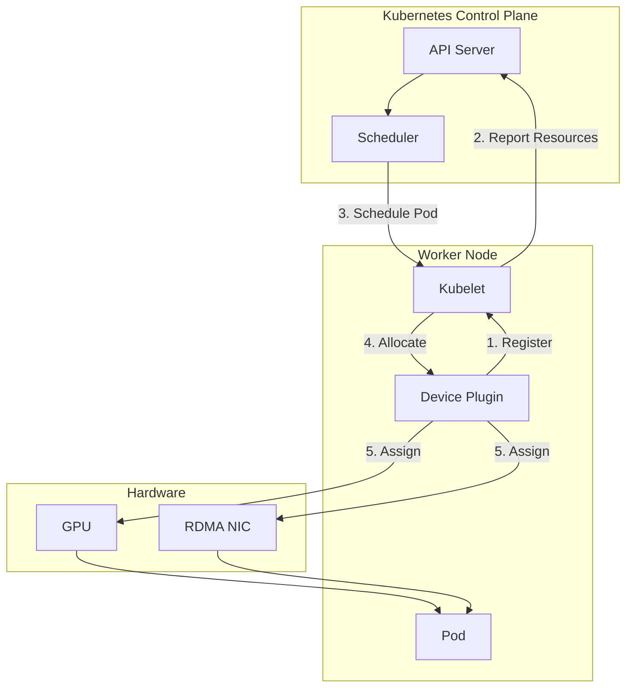
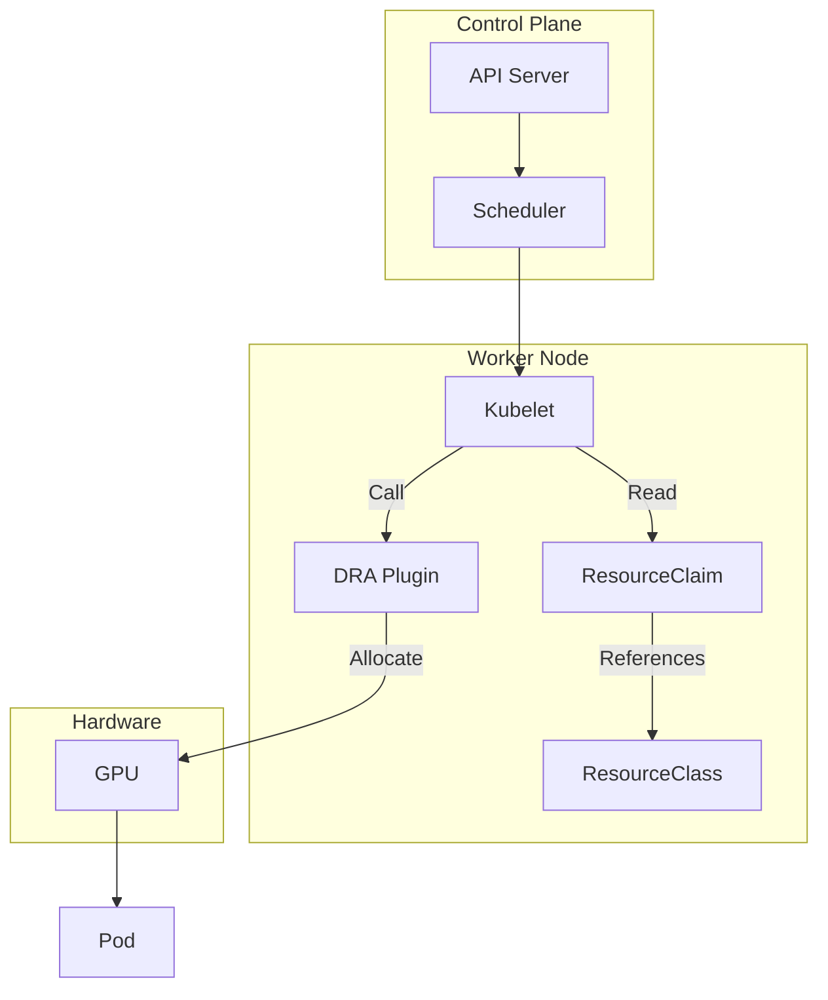
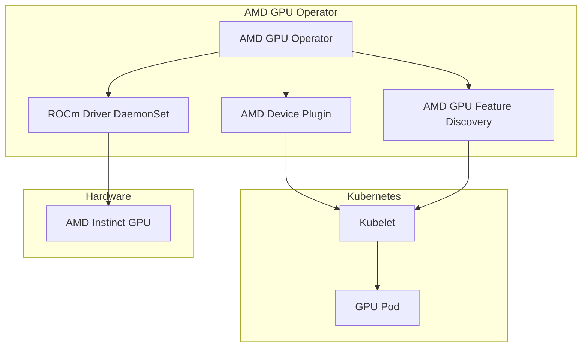
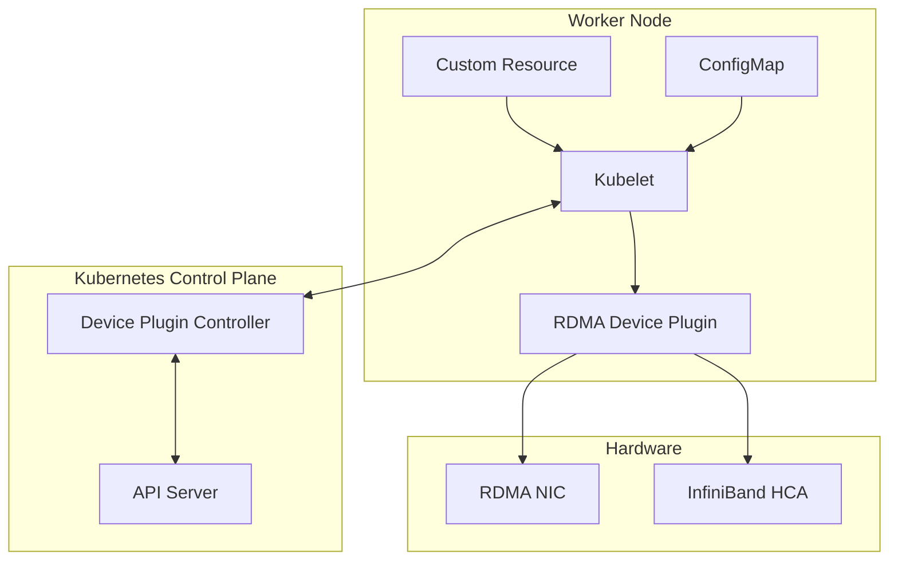

# Device Plugin & DRA

> Kubernetes에서 GPU, RDMA 등 특수 하드웨어 리소스를 관리하는 메커니즘

## 개요

Kubernetes는 기본적으로 CPU, 메모리, 스토리지만 관리한다. GPU, RDMA NIC, FPGA 같은 특수 하드웨어는 **외부 플러그인**을 통해 통합한다.

**리소스 관리 진화**:
```
Device Plugin (K8s 1.8+)
  ↓
Dynamic Resource Allocation (DRA, K8s 1.26+ Alpha)
```

**주요 플러그인**:

| 플러그인 | 대상 리소스 | 벤더 |
|---------|------------|------|
| NVIDIA GPU Operator | GPU (A100, H100 등) | NVIDIA |
| AMD GPU Operator | GPU (MI250X, MI300X 등) | AMD |
| RDMA Device Plugin | InfiniBand HCA, RoCE NIC | Mellanox/NVIDIA |
| Intel GPU Device Plugin | GPU (Flex, Max 등) | Intel |

## Device Plugin 메커니즘

### 개념

**Device Plugin**은 Kubernetes 외부 하드웨어를 Pod에 할당하는 표준 인터페이스다.

**아키텍처**:


### 동작 과정

**1. Device Plugin 등록**:
```bash
# Device Plugin이 Worker Node에서 실행
# /var/lib/kubelet/device-plugins/ 디렉터리에 Unix 소켓 생성
```

**2. Kubelet에 등록**:
- Device Plugin → Kubelet: `Register` gRPC 호출
- 사용 가능한 디바이스 목록 전달

**3. 리소스 광고**:
```yaml
# Node 리소스에 추가됨
status:
  capacity:
    nvidia.com/gpu: "8"
    rdma/hca: "2"
```

**4. Pod 요청**:
```yaml
apiVersion: v1
kind: Pod
spec:
  containers:
  - name: gpu-app
    resources:
      limits:
        nvidia.com/gpu: 1
        rdma/hca: 1
```

**5. Allocate 호출**:
- Kubelet → Device Plugin: `Allocate(deviceIDs)` 호출
- Device Plugin → Pod: 환경 변수, 장치 경로 전달

### Device Plugin의 한계

| 한계 | 설명 |
|------|------|
| **정적 할당** | Pod 생성 시 한 번만 할당, 실행 중 변경 불가 |
| **단순 카운팅** | "GPU 1개" 요청만 가능, "VRAM 16GB GPU" 같은 세밀한 요구사항 불가 |
| **네트워크 토폴로지 무시** | GPU 간 NVLink 연결, NUMA 노드 고려 불가 |
| **공유 불가** | 하나의 GPU를 여러 Pod가 나눠 쓸 수 없음 (MIG 제외) |
| **재시작 시 재할당** | Pod 재시작 시 다른 GPU 할당될 수 있음 |

## DRA (Dynamic Resource Allocation)

### 개념

**DRA**는 Device Plugin의 한계를 극복하기 위한 Kubernetes 1.26+ 신규 메커니즘이다.

**핵심 특징**:

| 특징 | Device Plugin | DRA |
|------|---------------|-----|
| **할당 시점** | Pod 생성 시 (정적) | Pod 실행 중에도 가능 (동적) |
| **리소스 표현** | 단순 카운팅 (`gpu: 1`) | 구조화된 파라미터 (`vram: 16Gi`, `compute: A100`) |
| **토폴로지 인식** | 없음 | NVLink, PCIe, NUMA 고려 |
| **공유** | 불가 (MIG 제외) | 가능 (Time-slicing, MPS 등) |
| **라이프사이클** | Pod 종료 시 해제 | 명시적 해제 가능 |

### DRA 아키텍처



### DRA 사용 예시

**ResourceClass 정의**:
```yaml
apiVersion: resource.k8s.io/v1alpha2
kind: ResourceClass
metadata:
  name: gpu-a100-80gb
driverName: gpu.nvidia.com
parameters:
  gpu:
    product: A100-SXM4-80GB
    memory: "80Gi"
    architecture: ampere
```

**ResourceClaim 요청**:
```yaml
apiVersion: resource.k8s.io/v1alpha2
kind: ResourceClaim
metadata:
  name: my-gpu-claim
spec:
  resourceClassName: gpu-a100-80gb
  parametersRef:
    kind: GpuClaimParameters
    name: high-perf-gpu
---
apiVersion: gpu.nvidia.com/v1alpha1
kind: GpuClaimParameters
metadata:
  name: high-perf-gpu
spec:
  count: 2
  nvlink: required  # NVLink로 연결된 GPU 2개 요구
```

**Pod에서 사용**:
```yaml
apiVersion: v1
kind: Pod
spec:
  containers:
  - name: training
    resources:
      claims:
      - name: my-gpu-claim
```

## NVIDIA GPU Operator

### 개요

**NVIDIA GPU Operator**는 Kubernetes에서 NVIDIA GPU를 자동으로 관리하는 Operator다.

**자동화 범위**:
- GPU 드라이버 설치
- CUDA Toolkit 배포
- Device Plugin 배포
- GPU Feature Discovery
- DCGM (Data Center GPU Manager) Exporter
- MIG (Multi-Instance GPU) 관리

### 아키텍처

```mermaid
graph TB
    subgraph "NVIDIA GPU Operator"
        OPERATOR[GPU Operator]
        DRIVER[NVIDIA Driver DaemonSet]
        TOOLKIT[NVIDIA Container Toolkit]
        DEVICE_PLUGIN[NVIDIA Device Plugin]
        GFD[GPU Feature Discovery]
        DCGM[DCGM Exporter]
    end
    
    subgraph "Kubernetes"
        KUBELET[Kubelet]
        POD[GPU Pod]
    end
    
    subgard "Hardware"
        GPU[NVIDIA GPU]
    end
    
    OPERATOR --> DRIVER
    OPERATOR --> TOOLKIT
    OPERATOR --> DEVICE_PLUGIN
    OPERATOR --> GFD
    OPERATOR --> DCGM
    
    DRIVER --> GPU
    TOOLKIT --> KUBELET
    DEVICE_PLUGIN --> KUBELET
    GFD --> KUBELET
    DCGM --> GPU
    KUBELET --> POD
```

### 설치

```bash
# Helm으로 설치
helm repo add nvidia https://helm.ngc.nvidia.com/nvidia
helm install gpu-operator nvidia/gpu-operator \
  --namespace gpu-operator \
  --create-namespace \
  --set driver.enabled=true
```

### 리소스 광고

설치 후 Node에 자동으로 리소스 추가됨:
```yaml
status:
  capacity:
    nvidia.com/gpu: "8"
  allocatable:
    nvidia.com/gpu: "8"
  labels:
    nvidia.com/gpu.product: NVIDIA-A100-SXM4-80GB
    nvidia.com/gpu.memory: "81920"
    nvidia.com/cuda.driver.major: "12"
    nvidia.com/cuda.driver.minor: "2"
```

### MIG (Multi-Instance GPU) 지원

**MIG**는 A100, H100 GPU를 여러 독립 인스턴스로 분할하는 기능이다.

**MIG 프로필**:

| 프로필 | GPU Slice | 메모리 | Compute |
|--------|-----------|--------|---------|
| 1g.10gb | 1/7 | 10GB | 1/7 |
| 2g.20gb | 2/7 | 20GB | 2/7 |
| 3g.40gb | 3/7 | 40GB | 3/7 |
| 7g.80gb | 7/7 | 80GB | 7/7 |

**MIG 활성화**:
```bash
# GPU Operator ConfigMap 수정
kubectl patch configmap gpu-operator-mig-config \
  -n gpu-operator \
  --type merge \
  -p '{"data":{"config.yaml":"version: v1\nmig-configs:\n  all-1g.10gb:\n    - devices: [0,1,2,3,4,5,6,7]\n      mig-enabled: true\n      mig-devices:\n        \"1g.10gb\": 7"}}'
```

## AMD GPU Operator

### 개요

**AMD GPU Operator**는 AMD Instinct GPU (MI250X, MI300X 등)를 Kubernetes에서 관리한다.

**구성 요소**:
- ROCm (AMD GPU 소프트웨어 스택) 드라이버
- AMD Device Plugin
- AMD GPU Feature Discovery

### 아키텍처



### 설치

```bash
# Helm으로 설치
helm repo add amd-gpu-operator https://amd.github.io/amd-gpu-operator
helm install amd-gpu-operator amd-gpu-operator/amd-gpu-operator \
  --namespace kube-amd-gpu \
  --create-namespace
```

### 리소스 광고

```yaml
status:
  capacity:
    amd.com/gpu: "8"
  allocatable:
    amd.com/gpu: "8"
  labels:
    amd.com/gpu.device-id: "740f"  # MI300X
    amd.com/gpu.vram: "196608"     # 192GB HBM3
    amd.com/gpu.compute-units: "304"
```

### Pod 요청 예시

```yaml
apiVersion: v1
kind: Pod
spec:
  containers:
  - name: rocm-app
    image: rocm/pytorch:latest
    resources:
      limits:
        amd.com/gpu: 1
```

## RDMA Device Plugin (DRANET)

### 개요

**RDMA Device Plugin**은 InfiniBand HCA, RoCE NIC를 Pod에 할당한다.

**DRANET (DRA Network)**은 RDMA Device Plugin을 DRA 기반으로 마이그레이션한 버전이다.

### 리소스 계층

```
RDMA (Remote Direct Memory Access)
  ↓
InfiniBand / RoCE
  ↓
NIC (Network Interface Card - HCA)
  ↓
Kubernetes Device Plugin / DRA
  ↓
Kubelet
  ↓
Controller (리소스 가용성 관리)
```

### 아키텍처



### Device Plugin 방식

**ConfigMap 정의**:
```yaml
apiVersion: v1
kind: ConfigMap
metadata:
  name: rdma-devices
  namespace: kube-system
data:
  config.json: |
    {
      "resourceName": "rdma/hca",
      "rdmaHcaMax": 1000,
      "devices": []
    }
```

**Pod 요청**:
```yaml
apiVersion: v1
kind: Pod
spec:
  containers:
  - name: rdma-app
    resources:
      limits:
        rdma/hca: 1
    volumeMounts:
    - name: rdma
      mountPath: /dev/infiniband
  volumes:
  - name: rdma
    hostPath:
      path: /dev/infiniband
```

### DRANET (DRA 방식)

**기존 (Device Plugin)**:
- 정적 리소스 할당
- Pod 재시작 시 리소스 재할당 필요
- 단순 카운팅 (`rdma/hca: 1`)

**DRANET (DRA)**:
- 동적 리소스 할당
- 영구적 ResourceClaim 가능
- 세밀한 요구사항 (`bandwidth: 200Gbps`, `numa-node: 0`)

**DRANET ResourceClass**:
```yaml
apiVersion: resource.k8s.io/v1alpha2
kind: ResourceClass
metadata:
  name: rdma-hca-cx7
driverName: rdma.network.nvidia.com
parameters:
  device:
    vendor: "0x15b3"  # Mellanox/NVIDIA
    model: "ConnectX-7"
    speed: "400Gbps"
    protocol: ["InfiniBand", "RoCEv2"]
```

**Pod에서 사용**:
```yaml
apiVersion: v1
kind: Pod
spec:
  containers:
  - name: mpi-job
    resources:
      claims:
      - name: rdma-claim
---
apiVersion: resource.k8s.io/v1alpha2
kind: ResourceClaim
metadata:
  name: rdma-claim
spec:
  resourceClassName: rdma-hca-cx7
```

## 벤더별 비교

### GPU Operator 비교

| 항목 | NVIDIA GPU Operator | AMD GPU Operator |
|------|---------------------|------------------|
| **대상 GPU** | A100, H100, L40S, RTX 등 | MI250X, MI300X, MI350X 등 |
| **소프트웨어 스택** | CUDA Toolkit 12.x | ROCm 6.x |
| **드라이버** | NVIDIA Driver 535+ | ROCm Kernel Driver |
| **리소스 이름** | `nvidia.com/gpu` | `amd.com/gpu` |
| **MIG/파티셔닝** | MIG (Multi-Instance GPU) | 미지원 |
| **모니터링** | DCGM (GPU 전용) | ROCm SMI |
| **AI 프레임워크** | PyTorch, TensorFlow (CUDA) | PyTorch, TensorFlow (ROCm) |
| **Kubernetes 지원** | 1.20+ | 1.23+ |

### Device Plugin vs DRA

| 항목 | Device Plugin | DRA |
|------|---------------|-----|
| **Kubernetes 버전** | 1.8+ (GA) | 1.26+ (Alpha), 1.30+ (Beta) |
| **할당 방식** | 정적 (Pod 생성 시) | 동적 (실행 중 가능) |
| **리소스 표현** | 단순 카운팅 | 구조화된 파라미터 |
| **토폴로지 인식** | 없음 | NVLink, NUMA, PCIe 고려 |
| **공유** | 불가 (MIG 제외) | 가능 |
| **재시작 시** | 재할당 (다른 GPU 가능) | 동일 GPU 유지 가능 |
| **사용 사례** | 단순 GPU 할당 | 멀티 GPU 학습, RDMA 네트워크 |

## 실전 예시

### NVIDIA GPU + RDMA 멀티 GPU 학습

```yaml
# DRA 기반 멀티 GPU + RDMA 구성
apiVersion: v1
kind: Pod
metadata:
  name: distributed-training
spec:
  containers:
  - name: trainer
    image: nvcr.io/nvidia/pytorch:24.03-py3
    command: ["torchrun"]
    args:
    - "--nproc_per_node=8"
    - "train.py"
    resources:
      claims:
      - name: gpu-claim
      - name: rdma-claim
---
apiVersion: resource.k8s.io/v1alpha2
kind: ResourceClaim
metadata:
  name: gpu-claim
spec:
  resourceClassName: gpu-a100-nvlink
---
apiVersion: gpu.nvidia.com/v1alpha1
kind: GpuClaimParameters
metadata:
  name: nvlink-params
spec:
  count: 8
  nvlink: required  # NVLink로 연결된 GPU 8개
  sharing: exclusive
---
apiVersion: resource.k8s.io/v1alpha2
kind: ResourceClaim
metadata:
  name: rdma-claim
spec:
  resourceClassName: rdma-hca-cx7
```

### AMD GPU + ROCm

```yaml
apiVersion: v1
kind: Pod
metadata:
  name: rocm-training
spec:
  containers:
  - name: trainer
    image: rocm/pytorch:latest
    resources:
      limits:
        amd.com/gpu: 8
    env:
    - name: ROCR_VISIBLE_DEVICES
      value: "0,1,2,3,4,5,6,7"
    - name: HIP_VISIBLE_DEVICES
      value: "0,1,2,3,4,5,6,7"
```

## 핵심 요약

**Kubernetes 하드웨어 리소스 관리 진화**:
1. **Device Plugin (1.8+)**: 단순 카운팅, 정적 할당
2. **DRA (1.26+)**: 동적 할당, 토폴로지 인식, 세밀한 제어

**GPU 벤더별 접근**:
- **NVIDIA**: GPU Operator + CUDA + DCGM + MIG
- **AMD**: GPU Operator + ROCm + AMD SMI

**RDMA 네트워크**:
- **Device Plugin**: ConfigMap 기반, 단순 할당
- **DRANET (DRA)**: ResourceClass 기반, 대역폭/프로토콜 지정 가능

**실전 권장**:
- 단순 GPU 사용: Device Plugin (안정적)
- 멀티 GPU 학습 (NVLink 필요): DRA + NVIDIA GPU Operator
- RDMA 고성능 네트워크: DRANET (DRA 방식)
- AMD GPU: AMD GPU Operator + Device Plugin

## 참고 자료

- [Kubernetes Device Plugins](https://kubernetes.io/docs/concepts/extend-kubernetes/compute-storage-net/device-plugins/)
- [Dynamic Resource Allocation (DRA)](https://kubernetes.io/docs/concepts/scheduling-eviction/dynamic-resource-allocation/)
- [NVIDIA GPU Operator](https://docs.nvidia.com/datacenter/cloud-native/gpu-operator/latest/)
- [AMD GPU Operator](https://github.com/amd/amd-gpu-operator)
- [RDMA Device Plugin](https://github.com/Mellanox/k8s-rdma-shared-dev-plugin)
