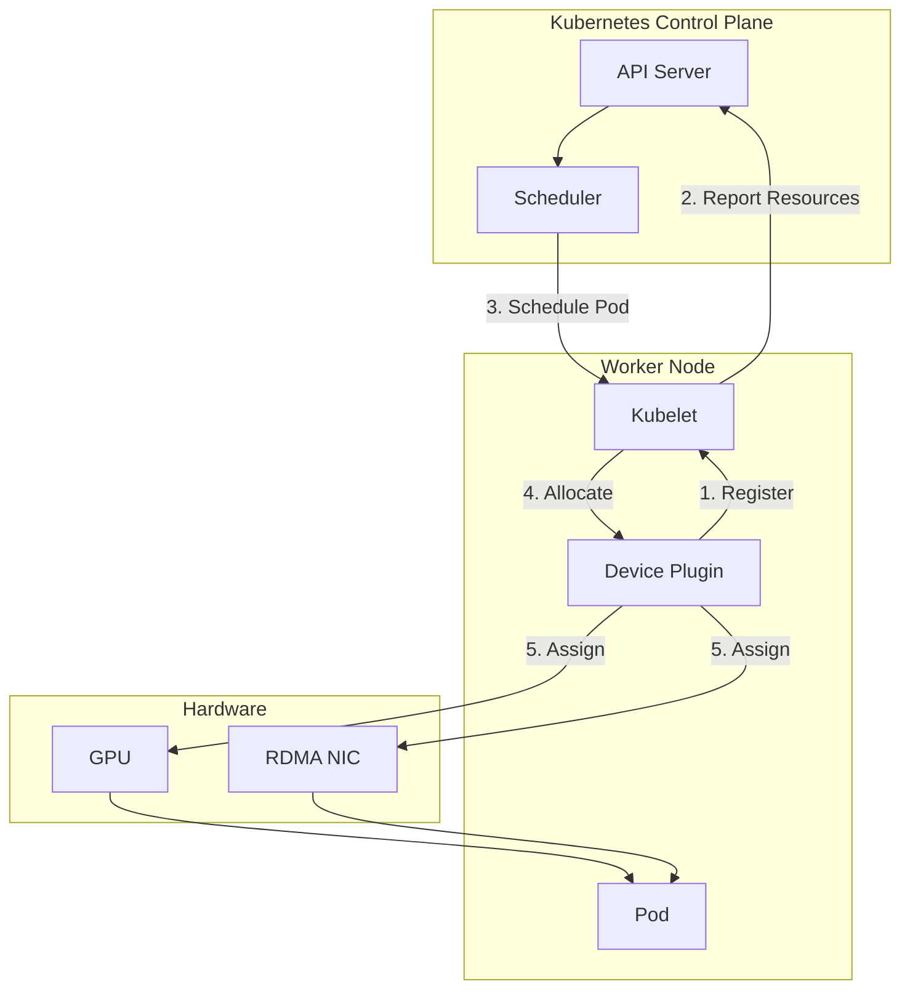
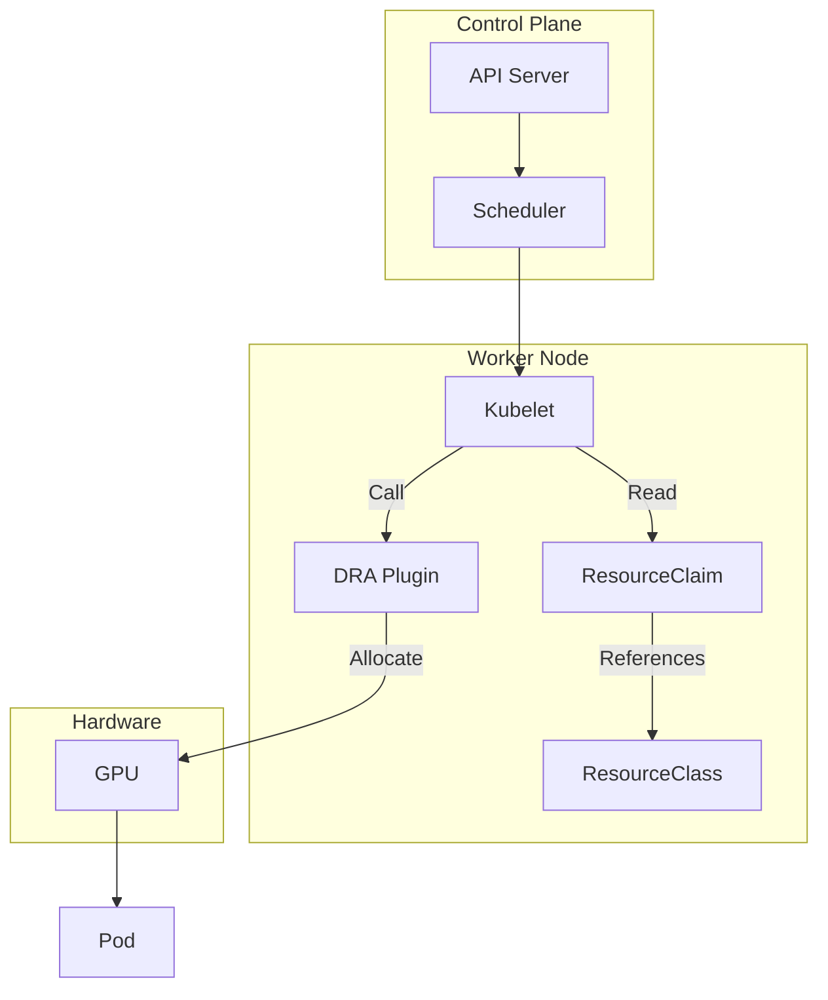
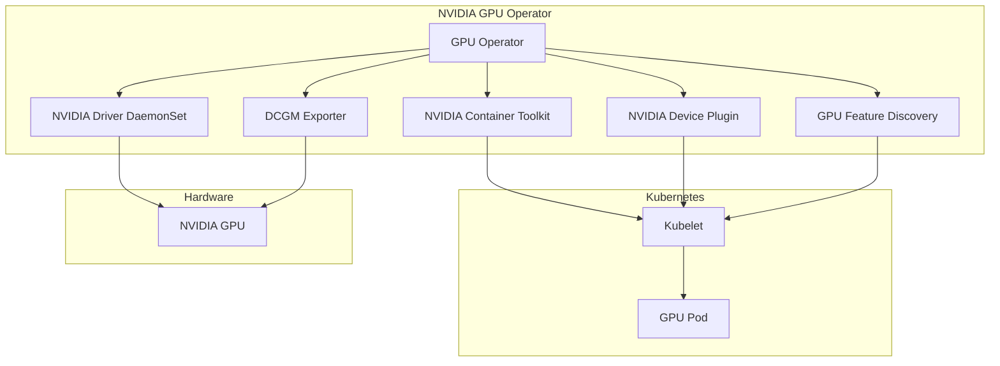
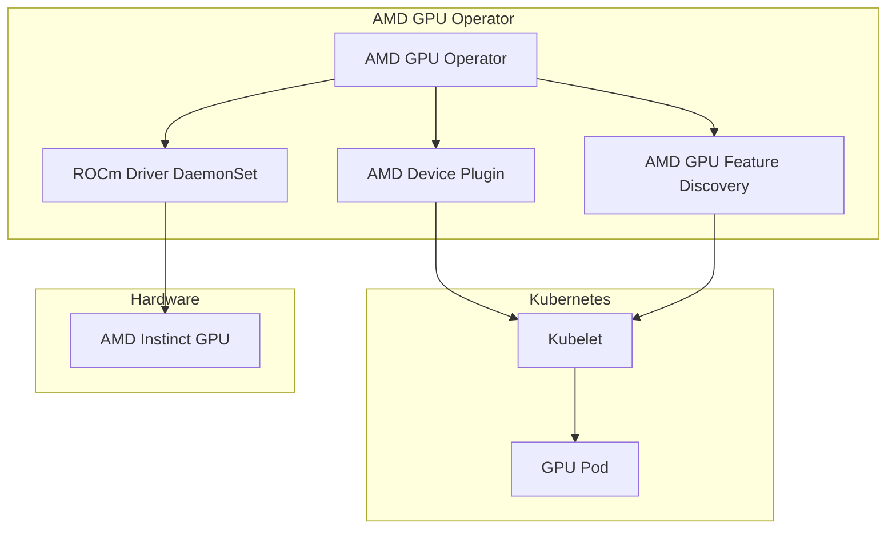
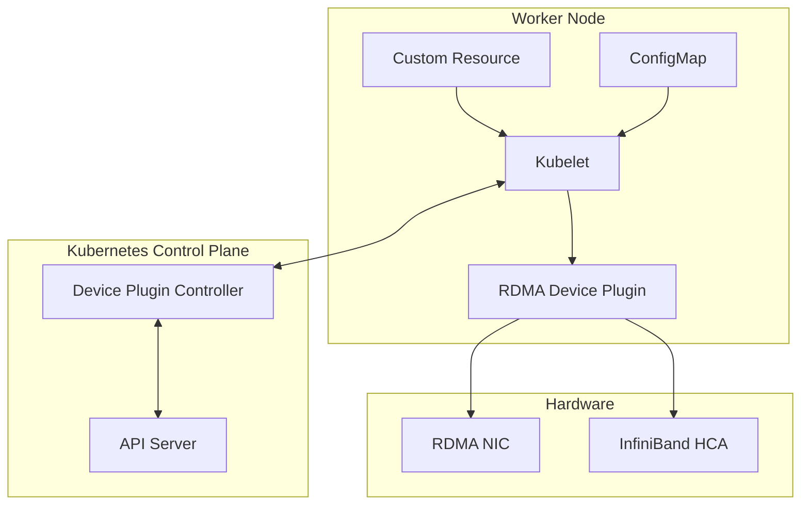
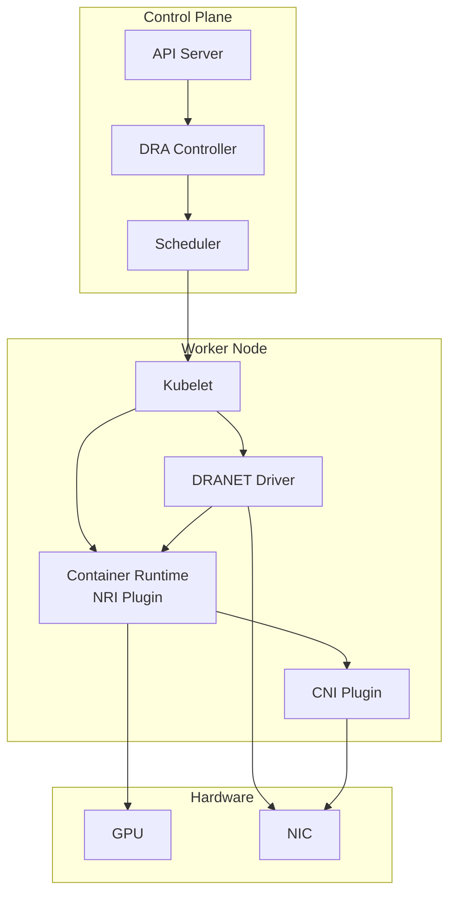

---
tags:
  - GPU
  - Kubernetes
---

# Device Plugin & DRA

> Kubernetes에서 GPU, RDMA 등 특수 하드웨어 리소스를 관리하는 메커니즘

## 개요

Kubernetes는 기본적으로 CPU, 메모리, 스토리지만 관리한다. GPU, RDMA NIC, FPGA 같은 특수 하드웨어는 **외부 플러그인**을 통해 통합한다.

**리소스 관리 진화**:
```
Device Plugin (K8s 1.8+)
  ↓
Dynamic Resource Allocation (DRA, K8s 1.26+ Alpha)
```

**주요 플러그인**:

| 플러그인 | 대상 리소스 | 벤더 |
|---------|------------|------|
| NVIDIA GPU Operator | GPU (A100, H100 등) | NVIDIA |
| AMD GPU Operator | GPU | AMD |
| RDMA Device Plugin | InfiniBand HCA, RoCE NIC | Mellanox/NVIDIA |
| Intel GPU Device Plugin | GPU | Intel |

## Device Plugin 메커니즘

### 개념

**Device Plugin**은 Kubernetes 외부 하드웨어를 Pod에 할당하는 표준 인터페이스다.

**아키텍처**:


### 동작 과정

**1. Device Plugin 등록**:
```bash
# Device Plugin이 Worker Node에서 실행
# /var/lib/kubelet/device-plugins/ 디렉터리에 Unix 소켓 생성
```

**2. Kubelet에 등록**:
- Device Plugin → Kubelet: `Register` gRPC 호출
- 사용 가능한 디바이스 목록 전달

**3. 리소스 광고**:
```yaml
# Node 리소스에 추가됨
status:
  capacity:
    nvidia.com/gpu: "8"
    rdma/hca: "2"
```

**4. Pod 요청**:
```yaml
apiVersion: v1
kind: Pod
spec:
  containers:
  - name: gpu-app
    resources:
      limits:
        nvidia.com/gpu: 1
        rdma/hca: 1
```

**5. Allocate 호출**:
- Kubelet → Device Plugin: `Allocate(deviceIDs)` 호출
- Device Plugin → Pod: 환경 변수, 장치 경로 전달

### Device Plugin의 한계

**주요 제약사항**:

| 한계 | 설명 |
|------|------|
| **정적 할당** | Pod 생성 시 한 번만 할당, 실행 중 변경 불가 |
| **단순 카운팅** | "GPU 1개" 요청만 가능, "VRAM 16GB GPU" 같은 세밀한 요구사항 불가 |
| **네트워크 토폴로지 무시** | GPU 간 NVLink 연결, NUMA 노드 고려 불가 |
| **공유 제한적** | Time-slicing, MPS, MIG 가능하지만 ConfigMap 설정 필요 |
| **재시작 시 재할당** | Pod 재시작 시 다른 GPU 할당될 수 있음 |

## DRA (Dynamic Resource Allocation)

### 개념

**DRA**는 Device Plugin의 한계를 극복하기 위한 Kubernetes 1.26+ 신규 메커니즘이다.

**핵심 특징**:

| 특징 | Device Plugin | DRA |
|------|---------------|-----|
| **할당 시점** | Pod 생성 시 (정적) | Pod 실행 중에도 가능 (동적) |
| **리소스 표현** | 단순 카운팅 (`gpu: 1`) | 구조화된 파라미터 (`vram: 16Gi`, `compute: A100`) |
| **토폴로지 인식** | 없음 | NVLink, PCIe, NUMA 고려 |
| **공유** | 가능 (Time-slicing, MPS, MIG) | 가능 (더 세밀한 제어) |
| **라이프사이클** | Pod 종료 시 해제 | 명시적 해제 가능 |

### DRA 아키텍처



### DRA 사용 예시

**ResourceClass 정의**:
```yaml
apiVersion: resource.k8s.io/v1alpha2
kind: ResourceClass
metadata:
  name: gpu-a100-80gb
driverName: gpu.nvidia.com
parameters:
  gpu:
    product: A100-SXM4-80GB
    memory: "80Gi"
    architecture: ampere
```

**ResourceClaim 요청**:
```yaml
apiVersion: resource.k8s.io/v1alpha2
kind: ResourceClaim
metadata:
  name: my-gpu-claim
spec:
  resourceClassName: gpu-a100-80gb
  parametersRef:
    kind: GpuClaimParameters
    name: high-perf-gpu
---
apiVersion: gpu.nvidia.com/v1alpha1
kind: GpuClaimParameters
metadata:
  name: high-perf-gpu
spec:
  count: 2
  nvlink: required  # NVLink로 연결된 GPU 2개 요구
```

**Pod에서 사용**:
```yaml
apiVersion: v1
kind: Pod
spec:
  containers:
  - name: training
    resources:
      claims:
      - name: my-gpu-claim
```

## NVIDIA GPU Operator

### 개요

**NVIDIA GPU Operator**는 Kubernetes에서 NVIDIA GPU를 자동으로 관리하는 Operator다.

**자동화 범위**:
- GPU 드라이버 설치
- CUDA Toolkit 배포
- Device Plugin 배포
- GPU Feature Discovery
- DCGM (Data Center GPU Manager) Exporter
- MIG (Multi-Instance GPU) 관리

### 아키텍처



### 설치 및 리소스 광고

**Helm 설치**:
```bash
helm repo add nvidia https://helm.ngc.nvidia.com/nvidia
helm install gpu-operator nvidia/gpu-operator \
  --namespace gpu-operator \
  --create-namespace \
  --set driver.enabled=true
```

**리소스 광고** (설치 후 Node에 자동 추가):
```yaml
status:
  capacity:
    nvidia.com/gpu: "8"
  allocatable:
    nvidia.com/gpu: "8"
  labels:
    nvidia.com/gpu.product: NVIDIA-A100-SXM4-80GB
    nvidia.com/gpu.memory: "81920"
    nvidia.com/cuda.driver.major: "12"
    nvidia.com/cuda.driver.minor: "2"
```

### MIG 지원

**MIG**는 A100, H100 GPU를 여러 독립 인스턴스로 분할하는 기능이다.

**MIG 프로필**:

| 프로필 | GPU Slice | 메모리 | Compute |
|--------|-----------|--------|---------|
| 1g.10gb | 1/7 | 10GB | 1/7 |
| 2g.20gb | 2/7 | 20GB | 2/7 |
| 3g.40gb | 3/7 | 40GB | 3/7 |
| 7g.80gb | 7/7 | 80GB | 7/7 |

**MIG 활성화**:
```bash
# GPU Operator ConfigMap 수정
kubectl patch configmap gpu-operator-mig-config \
  -n gpu-operator \
  --type merge \
  -p '{"data":{"config.yaml":"version: v1\nmig-configs:\n  all-1g.10gb:\n    - devices: [0,1,2,3,4,5,6,7]\n      mig-enabled: true\n      mig-devices:\n        \"1g.10gb\": 7"}}'
```

### GPU 공유 전략

**NVIDIA GPU Operator는 세 가지 GPU 공유 방식을 지원한다.**

#### Time-slicing

**GPU를 시간 단위로 나눠서 여러 Pod가 번갈아 사용한다.**

**ConfigMap 설정**:
```yaml
apiVersion: v1
kind: ConfigMap
metadata:
  name: device-plugin-config
  namespace: gpu-operator
data:
  config: |
    version: v1
    flags:
      migStrategy: none
    sharing:
      timeSlicing:
        replicas: 4  # GPU 1개를 4개 Pod가 공유
```

**Pod 요청**:
```yaml
apiVersion: v1
kind: Pod
spec:
  containers:
  - name: app
    resources:
      limits:
        nvidia.com/gpu: 1  # 실제로는 1/4 GPU 할당
```

**특징**:

| 항목 | 설명 |
|------|------|
| **격리** | 메모리는 공유 (서로 영향 가능) |
| **성능** | Context switching 오버헤드 발생 |
| **사용 사례** | 추론 워크로드, 개발/테스트 |

#### MPS (Multi-Process Service)

**여러 프로세스가 동시에 GPU를 사용하며, CUDA Context를 공유한다.**

**ConfigMap 설정**:
```yaml
apiVersion: v1
kind: ConfigMap
metadata:
  name: device-plugin-config
  namespace: gpu-operator
data:
  config: |
    version: v1
    flags:
      migStrategy: none
    sharing:
      mps:
        replicas: 4
        defaultActiveThreadPercentage: 50  # 각 클라이언트가 사용할 최대 스레드 비율
```

**특징**:

| 항목 | 설명 |
|------|------|
| **격리** | 메모리 공유 (격리 없음) |
| **성능** | Time-slicing보다 오버헤드 적음 |
| **제한** | Volta (V100) 이상 GPU 필요 |
| **사용 사례** | 소규모 배치 추론, 경량 워크로드 |

#### 공유 전략 비교

| 전략 | 격리 수준 | 성능 오버헤드 | 메모리 보호 | GPU 요구사항 |
|------|----------|------------|-----------|------------|
| **MIG** | 높음 (하드웨어) | 없음 | O | A100, H100 |
| **MPS** | 낮음 | 낮음 | X | Volta+ |
| **Time-slicing** | 중간 | 중간 | X | 모든 GPU |

## AMD GPU Operator

### 개요

**AMD GPU Operator**는 AMD Instinct GPU를 Kubernetes에서 관리한다.

**구성 요소**:
- ROCm (AMD GPU 소프트웨어 스택) 드라이버
- AMD Device Plugin
- AMD GPU Feature Discovery

### 아키텍처



### 설치 및 리소스 광고

**Helm 설치**:
```bash
helm repo add amd-gpu-operator https://amd.github.io/amd-gpu-operator
helm install amd-gpu-operator amd-gpu-operator/amd-gpu-operator \
  --namespace kube-amd-gpu \
  --create-namespace
```

**리소스 광고**:
```yaml
status:
  capacity:
    amd.com/gpu: "8"
  allocatable:
    amd.com/gpu: "8"
  labels:
    amd.com/gpu.device-id: "740f"  # MI300X
    amd.com/gpu.vram: "196608"     # 192GB HBM3
    amd.com/gpu.compute-units: "304"
```

### Pod 요청 예시

```yaml
apiVersion: v1
kind: Pod
spec:
  containers:
  - name: rocm-app
    image: rocm/pytorch:latest
    resources:
      limits:
        amd.com/gpu: 1
```

## RDMA Device Plugin

### 개요

**RDMA Device Plugin**은 InfiniBand HCA, RoCE NIC를 Pod에 할당한다.

### 리소스 계층

```
RDMA (Remote Direct Memory Access)
  ↓
InfiniBand / RoCE
  ↓
NIC (Network Interface Card - HCA)
  ↓
Kubernetes Device Plugin / DRA
  ↓
Kubelet
  ↓
Controller (리소스 가용성 관리)
```

### 아키텍처



### Device Plugin 방식

**ConfigMap 정의**:
```yaml
apiVersion: v1
kind: ConfigMap
metadata:
  name: rdma-devices
  namespace: kube-system
data:
  config.json: |
    {
      "resourceName": "rdma/hca",
      "rdmaHcaMax": 1000,
      "devices": []
    }
```

**Pod 요청**:
```yaml
apiVersion: v1
kind: Pod
spec:
  containers:
  - name: rdma-app
    resources:
      limits:
        rdma/hca: 1
    volumeMounts:
    - name: rdma
      mountPath: /dev/infiniband
  volumes:
  - name: rdma
    hostPath:
      path: /dev/infiniband
```

## DRANET (DRA Kubernetes Network Driver)

### 개요

**DRANET** (DRA Kubernetes Network Driver)는 Google이 개발한 DRA 기반 네트워크 드라이버로, Kubecon NA 2025에서 Kubernetes 조직에 기증되어 현재 Kubernetes SIG가 관리한다.

**목적**: AI/ML 분산 학습 시 GPU ↔ NIC 간 데이터 전송 성능 최적화

**핵심 특징**:

| 특징 | 설명 |
|------|------|
| **토폴로지 인식 스케줄링** | GPU와 NIC를 같은 PCIe 루트 컴플렉스에 배치하여 대역폭 최대화 |
| **분산 학습 성능 향상** | All-Gather: 100 GB/s → 159.6 GB/s (+59.6%)<br/>All-Reduce: 80 GB/s → 126.5 GB/s (+58.1%) |
| **CNI 호환성** | Calico, Cilium 등 기존 CNI 플러그인과 함께 작동 |
| **Container Runtime 통합** | NRI (Node Resource Interface)를 통해 CRI와 통합 |
| **성능 향상 원리** | GPU ↔ NIC 간 PCIe 최단거리 배치<br/>Cross-NUMA 트래픽 제거<br/>GPU 통신 대역폭 증가 |

**AI/ML 분산 학습 용어**:

| 용어 | 설명 | 예시 |
|------|------|------|
| **All-Gather** | 모든 GPU가 각자의 데이터를 모아서 전체 GPU에 복사 | GPU 8개가 각자 1GB → 각 GPU가 8GB 보유 |
| **All-Reduce** | 모든 GPU의 Gradient를 합산하여 전체 GPU에 분배 | GPU 8개의 gradient 평균 → 각 GPU에 결과 전달 |
| **All-to-All** | 각 GPU가 다른 모든 GPU에 서로 다른 데이터 전송 | GPU 0 → GPU 1,2,3,4,5,6,7 (각각 다른 데이터) |

### 아키텍처



### 토폴로지 인식 스케줄링

**토폴로지 최적화**:

| 항목 | 설명 |
|------|------|
| **문제** | GPU와 NIC가 서로 다른 NUMA 노드에 있으면 PCIe 대역폭 저하 |
| **DRANET 해결** | GPU와 NIC를 같은 PCIe 루트 컴플렉스에 배치<br/>NUMA 노드 인식으로 cross-NUMA 트래픽 최소화<br/>토폴로지 정보를 DRA ResourceClaim에 포함 |

**ResourceClass 예시**:
```yaml
apiVersion: resource.k8s.io/v1alpha2
kind: ResourceClass
metadata:
  name: high-perf-network
driverName: dranet.networking.k8s.io
parameters:
  bandwidth: "200Gbps"
  latency: "low"
  topology:
    gpu-affinity: required  # GPU와 같은 PCIe 루트에 배치
    numa-node: same         # 같은 NUMA 노드
```

**Pod 요청**:
```yaml
apiVersion: v1
kind: Pod
spec:
  containers:
  - name: training
    resources:
      claims:
      - name: gpu-claim
      - name: network-claim
---
apiVersion: resource.k8s.io/v1alpha2
kind: ResourceClaim
metadata:
  name: network-claim
spec:
  resourceClassName: high-perf-network
```

### 성능 향상

**벤치마크 결과** (NVIDIA NCCL, 8x A100 GPU 분산 학습):

| 작업 (Collective Operation) | 기존 (CNI only) | DRANET | 향상 |
|----------------------------|----------------|--------|------|
| **All-Gather**<br/>(데이터 수집 및 복사) | 100 GB/s | 159.6 GB/s | +59.6 GB/s |
| **All-Reduce**<br/>(Gradient 합산 및 분배) | 80 GB/s | 126.5 GB/s | +46.5 GB/s |
| **All-to-All**<br/>(GPU 간 교차 통신) | 90 GB/s | 140 GB/s | +50 GB/s |

**성능 향상 원인**:

| 요소 | 설명 |
|------|------|
| **PCIe 경로 최적화** | GPU ↔ NIC를 같은 PCIe Root Complex에 배치 |
| **Cross-NUMA 제거** | NUMA 노드 간 이동 최소화 |
| **토폴로지 인식 할당** | DRA ResourceClass로 토폴로지 정보 활용 |

### RDMA Shared Device Plugin vs DRANET

**RDMA Shared Device Plugin** (Mellanox/NVIDIA):
- DaemonSet: `rdma-shared-dp-ds`
- Device Plugin 방식
- RDMA NIC 할당 (InfiniBand, RoCE)

**비교표**:

| 항목 | RDMA Shared Device Plugin | DRANET |
|------|---------------------------|--------|
| **개발** | Mellanox/NVIDIA | Google (현재 K8s SIG) |
| **메커니즘** | Device Plugin (정적) | DRA (동적) |
| **대상 리소스** | RDMA NIC만 | NIC + GPU 통합 |
| **토폴로지 인식** | X | O (GPU-NIC affinity) |
| **NUMA 인식** | X | O |
| **할당 방식** | ConfigMap (rdma/hca) | ResourceClass (구조화) |
| **GPU 친화성** | X | O (same PCIe root) |
| **성능 최적화** | 없음 | 분산 학습 대역폭 +59.6% |
| **사용 사례** | RDMA 네트워크 (일반) | AI/ML 분산 학습 (GPU 통신) |
| **DaemonSet** | `rdma-shared-dp-ds` | `dranet-*` |
| **리소스 이름** | `rdma/hca`, `rdma/roce` | DRA ResourceClaim |

**RDMA Shared Device Plugin 설정 예시**:
```yaml
apiVersion: v1
kind: ConfigMap
metadata:
  name: rdma-devices
  namespace: kube-system
data:
  config.json: |
    {
      "periodicUpdateInterval": 300,
      "configList": [{
        "resourceName": "rdma_shared_device_a",
        "rdmaHcaMax": 63,
        "selectors": {
          "vendors": ["15b3"],
          "deviceIDs": ["1017"]
        }
      }]
    }
```

**Pod 요청 비교**:

```yaml
# RDMA Shared Device Plugin 방식
apiVersion: v1
kind: Pod
spec:
  containers:
  - name: rdma-app
    resources:
      limits:
        rdma/hca: 1
    volumeMounts:
    - name: rdma
      mountPath: /dev/infiniband
  volumes:
  - name: rdma
    hostPath:
      path: /dev/infiniband

---
# DRANET 방식 (GPU + NIC 토폴로지 인식)
apiVersion: v1
kind: Pod
spec:
  containers:
  - name: training
    resources:
      claims:
      - name: gpu-claim
      - name: network-claim  # GPU와 같은 PCIe root에 배치
```

**선택 기준**

RDMA 네트워크 접속만 필요하거나 MPI, UCX 등 기존 워크로드를 그대로 사용하는 경우 **RDMA Shared Device Plugin**이 적합하다. 설정이 단순하고 검증된 방식이다.

GPU와 NIC 간 토폴로지 최적화가 필요하거나 NCCL 기반 AI/ML 분산 학습을 수행하는 경우, 또는 DRA의 동적 할당 기능이 필요한 경우에는 **DRANET**을 선택한다.

## 벤더별 비교

### GPU Operator 비교

**NVIDIA GPU Operator**는 NVIDIA GPU를 대상으로 CUDA 기반으로 동작한다. 리소스는 `nvidia.com/gpu`로 표현하며, MIG를 통한 GPU 파티셔닝과 DCGM 기반 상세 모니터링을 지원한다.

**AMD GPU Operator**는 AMD GPU를 대상으로 ROCm 스택 위에서 동작한다. 리소스는 `amd.com/gpu`로 표현하며, 파티셔닝은 현재 미지원이고 모니터링은 ROCm SMI를 사용한다.

두 Operator 모두 PyTorch, TensorFlow를 지원하지만 NVIDIA는 CUDA, AMD는 ROCm 백엔드를 사용한다.

### Device Plugin vs DRA

**Device Plugin**은 Kubernetes 1.8부터 GA로 사용 가능한 전통적인 방식이다. Pod 생성 시점에 정적으로 GPU를 할당하며, 리소스를 단순 카운팅으로 표현한다. 토폴로지 인식 기능이 없어 NVLink, NUMA, PCIe 구성을 고려하지 않지만, Time-slicing, MPS, MIG를 통한 GPU 공유가 가능하다. Pod 재시작 시 다른 GPU에 재할당될 수 있다.

**DRA**는 Kubernetes 1.26(Alpha)에서 도입되어 1.30(Beta)부터 안정화 중인 방식이다. 구조화된 파라미터로 리소스를 표현하며, NVLink, NUMA, PCIe 토폴로지를 고려한 할당이 가능하다. Pod 재시작 시에도 동일 GPU를 유지할 수 있어 멀티 GPU 학습이나 RDMA 네트워크처럼 복잡한 리소스 요구사항에 적합하다.

## 실전 예시

### NVIDIA GPU + RDMA 멀티 GPU 학습

```yaml
# DRA 기반 멀티 GPU + RDMA 구성
apiVersion: v1
kind: Pod
metadata:
  name: distributed-training
spec:
  containers:
  - name: trainer
    image: nvcr.io/nvidia/pytorch:24.03-py3
    command: ["torchrun"]
    args:
    - "--nproc_per_node=8"
    - "train.py"
    resources:
      claims:
      - name: gpu-claim
      - name: rdma-claim
---
apiVersion: resource.k8s.io/v1alpha2
kind: ResourceClaim
metadata:
  name: gpu-claim
spec:
  resourceClassName: gpu-a100-nvlink
---
apiVersion: gpu.nvidia.com/v1alpha1
kind: GpuClaimParameters
metadata:
  name: nvlink-params
spec:
  count: 8
  nvlink: required  # NVLink로 연결된 GPU 8개
  sharing: exclusive
---
apiVersion: resource.k8s.io/v1alpha2
kind: ResourceClaim
metadata:
  name: rdma-claim
spec:
  resourceClassName: rdma-hca-cx7
```

### AMD GPU + ROCm

```yaml
apiVersion: v1
kind: Pod
metadata:
  name: rocm-training
spec:
  containers:
  - name: trainer
    image: rocm/pytorch:latest
    resources:
      limits:
        amd.com/gpu: 8
    env:
    - name: ROCR_VISIBLE_DEVICES
      value: "0,1,2,3,4,5,6,7"
    - name: HIP_VISIBLE_DEVICES
      value: "0,1,2,3,4,5,6,7"
```

## 핵심 요약

**Kubernetes 하드웨어 리소스 관리 진화**:

| 단계 | 메커니즘 | 특징 |
|------|----------|------|
| **1단계 (1.8+)** | Device Plugin | 단순 카운팅, 정적 할당 |
| **2단계 (1.26+)** | DRA | 동적 할당, 토폴로지 인식, 세밀한 제어 |

**벤더별 GPU 관리**:

| 벤더 | 구성 요소 |
|------|----------|
| **NVIDIA** | GPU Operator + CUDA + DCGM + MIG |
| **AMD** | GPU Operator + ROCm + AMD SMI |

**네트워크 리소스**:

| 도구 | 용도 | 성능 |
|------|------|------|
| **RDMA Device Plugin** | RDMA NIC 할당 (InfiniBand, RoCE) | 기본 성능 |
| **DRANET (DRA)** | GPU + NIC 토폴로지 최적화 | 분산 학습 대역폭 159.6 GB/s (+59.6%) |

**실전 권장**:

| 사용 사례 | 권장 도구 |
|----------|----------|
| 단순 GPU 사용 | Device Plugin (안정적) |
| 멀티 GPU 학습 (NVLink) | DRA + NVIDIA GPU Operator |
| GPU + NIC 토폴로지 최적화 | DRANET + DRA |
| RDMA 네트워크 (기본) | RDMA Device Plugin |
| AMD GPU | AMD GPU Operator + Device Plugin |

## 참고 자료 {: .no-toc }

- [Kubernetes Device Plugins](https://kubernetes.io/docs/concepts/extend-kubernetes/compute-storage-net/device-plugins/)
- [Dynamic Resource Allocation (DRA)](https://kubernetes.io/docs/concepts/scheduling-eviction/dynamic-resource-allocation/)
- [NVIDIA GPU Operator](https://docs.nvidia.com/datacenter/cloud-native/gpu-operator/latest/)
- [AMD GPU Operator](https://github.com/amd/amd-gpu-operator)
- [RDMA Device Plugin](https://github.com/Mellanox/k8s-rdma-shared-dev-plugin)
- [DRANET](https://github.com/kubernetes-sigs/dranet)
