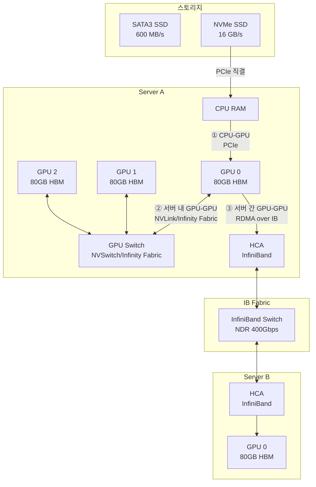
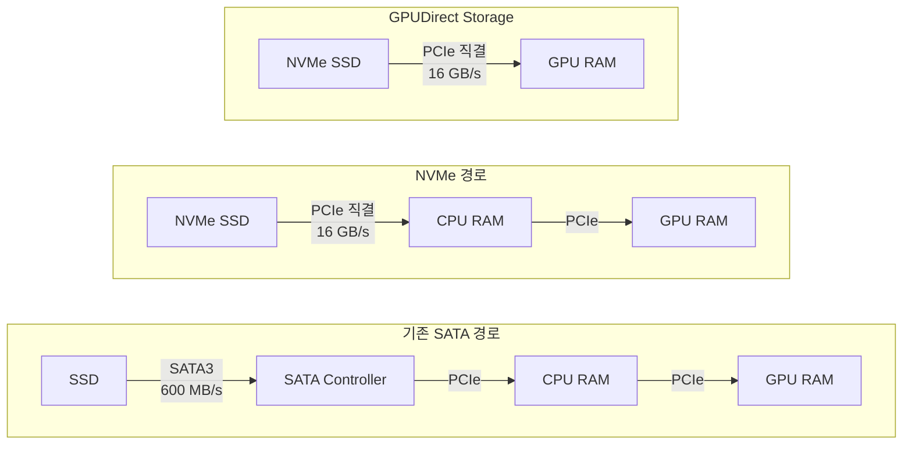
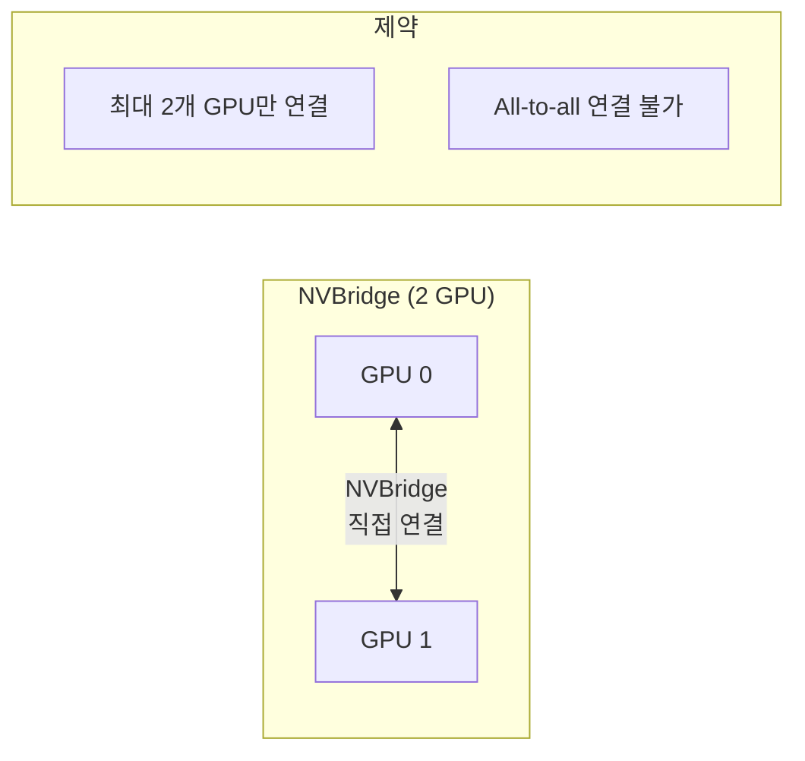
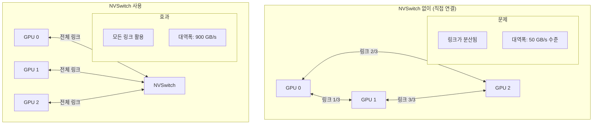
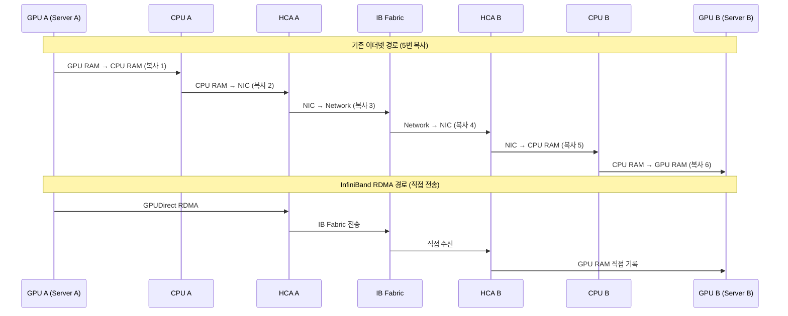
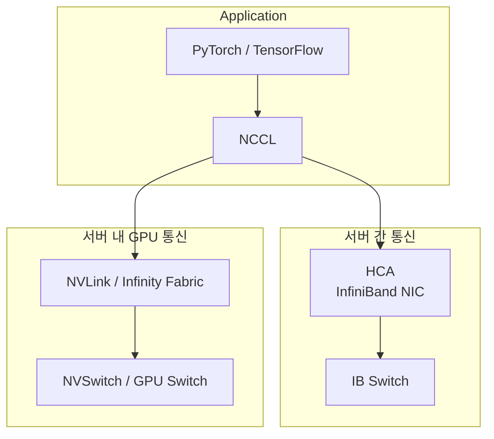

---
tags:
  - GPU
  - InfiniBand
---

# GPU 인터커넥트

> GPU 클러스터의 고성능 통신 기술 - PCIe, NVLink, Infinity Fabric, InfiniBand, RDMA

## 개요

GPU 클러스터에서 데이터가 이동하는 경로는 크게 세 가지다.

1. **CPU ↔ GPU 통신**: PCIe, NVMe SSD (공통)
2. **서버 내 GPU ↔ GPU 통신**: NVLink/NVSwitch (NVIDIA), Infinity Fabric (AMD)
3. **서버 간 GPU ↔ GPU 통신**: InfiniBand, RDMA (공통)

아래 다이어그램은 GPU 클러스터에서 세 가지 데이터 경로가 실제로 어떻게 구성되는지 보여준다.



---

## CPU ↔ GPU 통신

### 1. PCIe와 병목

GPU 메모리(HBM)는 GPU당 80GB(H100 기준)로 제한된다. 학습 데이터는 매번 스토리지 → CPU RAM → GPU RAM 경로로 이동한다.

기존 SATA3 SSD는 PCIe 대역폭에 비해 너무 느리다.

| 구간 | 인터페이스 | 대역폭 |
|------|-----------|--------|
| 스토리지 → CPU | SATA3 | ~600 MB/s |
| CPU → GPU | PCIe 5.0 x16 | ~64 GB/s |

SATA3는 PCIe 대비 약 **106배 느리다**. 60GB 데이터 이동 시 약 100초가 소요되어 GPU가 idle 상태로 대기하게 된다.

### 2. NVMe SSD 해결책

NVMe(Non-Volatile Memory Express)는 PCIe 버스에 직접 연결되어 SATA 컨트롤러를 우회한다.


> **GPUDirect Storage (NVIDIA) / GPU Direct GDS (AMD)**: CPU RAM을 완전히 우회하여 NVMe SSD에서 GPU RAM으로 직접 전송한다. 중간 복사 단계가 제거되어 최대 성능을 낼 수 있다.

---

## 서버 내 GPU ↔ GPU 통신

같은 서버 내 GPU들이 통신할 때 PCIe는 여러 장치가 대역폭을 공유하므로 GPU당 실제로 사용 가능한 대역폭이 50~60GB/s 수준으로 제한된다.

### 1. NVIDIA NVLink

NVIDIA GPU 전용 고속 인터커넥트로, PCIe와 완전히 별도의 물리적 링크다.

| 세대 | 적용 GPU | 양방향 대역폭 | 지연시간 |
|------|----------|--------------|---------|
| NVLink 1.0 | Pascal (P100) | 160 GB/s | - |
| NVLink 2.0 | Volta (V100) | 300 GB/s | - |
| NVLink 3.0 | Ampere (A100) | 600 GB/s | - |
| **NVLink 4.0** | **Hopper (H100)** | **900 GB/s** | **5~10 ns** |
| NVLink 5.0 | Blackwell (B100) | 1,800 GB/s | - |

| 항목 | PCIe 5.0 | NVLink 4.0 |
|------|----------|------------|
| 대역폭 | ~64 GB/s | 900 GB/s |
| 지연시간 | 100~200 ns | 5~10 ns |
| GPU 전용 여부 | (공유) | (GPU 전용) |
| 추후 추가 가능 | | (칩 내장) |

> NVLink는 GPU 칩셋에 내장되어 있어 서버 구매 시 사전 결정이 필수다. 나중에 추가할 수 없다.

### 2. AMD Infinity Fabric

AMD GPU 전용 고속 인터커넥트로, GPU 간 데이터 전송을 담당한다.

| 세대 | 적용 GPU | 양방향 대역폭 |
|------|----------|--------------|
| Infinity Fabric 2.0 | MI200 (MI250X) | 400 GB/s |
| Infinity Fabric 3.0 | MI300X | 896 GB/s |
| **Infinity Fabric 4.0** | **MI350X** | **1,120 GB/s** |

| 항목 | PCIe 5.0 | Infinity Fabric 4.0 |
|------|----------|---------------------|
| 대역폭 | ~64 GB/s | 1,120 GB/s |
| GPU 전용 여부 | (공유) | (GPU 전용) |
| 추후 추가 가능 | | (칩 내장) |

> Infinity Fabric도 GPU 칩셋에 내장되어 있어 나중에 추가할 수 없다.

### 3. NVIDIA NVBridge

2개의 PCIe 형태 GPU를 1:1로 직접 연결하는 **외부 브릿지 장치**다.


- **용도**: RTX/Quadro 계열 워크스테이션 GPU (소규모)
- **한계**: 3개 이상 GPU의 All-to-all 연결 불가

### 4. NVIDIA NVSwitch - SXM vs PCIe

NVSwitch는 NVLink 포트를 가진 **스위칭 칩**으로, 모든 GPU가 최대 대역폭으로 All-to-all 통신이 가능하다.


SXM과 PCIe 폼팩터의 주요 차이점은 다음과 같다.

| 항목 | SXM (서버 전용) | PCIe (범용) |
|------|----------------|------------|
| 연결 방식 | 보드 직접 납땜 | PCIe 슬롯 삽입 |
| NVLink 포트 수 | 최대 (H100: 18개) | 절반 이하 |
| 전력 | 700W (H100 SXM) | 350W (H100 PCIe) |
| NVSwitch 연결 | 가능 | 제한적 |
| 유연성 | 낮음 (교체 어려움) | 높음 (슬롯 교체) |
| 대상 | DGX, HGX 서버 | 범용 서버 |

> **DGX H100**: 8개 H100 SXM GPU + 4개 NVSwitch 탑재. 서버 내 총 NVLink 대역폭: 3.6 TB/s

---

## 서버 간 GPU ↔ GPU 통신

### 1. InfiniBand란?

서버 간 GPU 통신에서 일반 이더넷을 쓰면 데이터가 **5번 복사**된다.

```
GPU RAM → CPU RAM → NIC → 네트워크 → NIC → CPU RAM → GPU RAM

```
InfiniBand는 **RDMA(Remote Direct Memory Access)** 를 통해 CPU 개입 없이 GPU 메모리 간 직접 전송을 지원한다.


### 2. 세대별 속도 (EDR → HDR → NDR)

InfiniBand는 세대마다 약 2배씩 대역폭이 증가한다.

| 세대 | 이름 | 포트당 속도 | 출시 연도 | 주요 사용처 |
|------|------|------------|---------|-----------|
| EDR | Enhanced Data Rate | 100 Gb/s | 2014 | 레거시 HPC |
| HDR | High Data Rate | 200 Gb/s | 2019 | AI/ML 클러스터 |
| **NDR** | **Next Data Rate** | **400 Gb/s** | **2022** | **최신 LLM 학습** |
| XDR | Extended Data Rate | 800 Gb/s | 2025-2026 | 차세대 |

> NDR 스위치는 포트 수에 따라 64포트(QM9700)가 일반적이며, 400Gbps × 64포트 = 25.6 Tbps 스위칭 용량을 제공한다.

### 3. 핵심 컴포넌트

**핵심 컴포넌트**:

| 컴포넌트 | 설명 |
|---------|------|
| **HCA (Host Channel Adapter)** | 서버에 장착되는 InfiniBand NIC<br/>주요 제품: Mellanox ConnectX-7 (NDR, 400Gbps)<br/>RDMA 엔진 내장, GPUDirect 지원 |
| **Switch** | 여러 HCA를 연결하는 InfiniBand 스위치<br/>Mellanox QM9700 (NDR 64포트)<br/>Fat-Tree 토폴로지로 구성 |

## 핵심 개념 정리

### 전체 기술 스택 한눈에 보기


### 핵심 용어

| 용어 | 벤더 | 설명 |
|------|------|------|
| **HCA** | 공통 | Host Channel Adapter - 서버용 InfiniBand NIC |
| **NVLink** | NVIDIA | GPU 간 전용 고속 인터커넥트 (900 GB/s) |
| **NVSwitch** | NVIDIA | NVLink 스위칭 칩 (All-to-all 연결) |
| **Infinity Fabric** | AMD | GPU 간 전용 고속 인터커넥트 (1,120 GB/s) |
| **SXM** | NVIDIA | Server eXtended Module - GPU 고성능 폼팩터 |
| **RDMA** | 공통 | Remote Direct Memory Access - CPU 우회 직접 메모리 접근 |

### 의사결정 가이드

```
GPU 클러스터에서 통신 병목이 발생한다면?

Q1: 데이터 로딩이 느린가? (GPU Utilization < 50%)
  → YES: NVMe SSD + GPUDirect Storage 도입

Q2: 같은 서버 내 GPU 간 통신이 느린가? (AllReduce 병목)
  → YES (NVIDIA): NVLink + NVSwitch 지원 GPU (SXM 폼팩터) 도입
  → YES (AMD): Infinity Fabric 지원 GPU (MI300X, MI350X) 도입

Q3: 서버 간 GPU 통신이 느린가? (분산 학습 스케일이 안 됨)
  → YES: InfiniBand NDR (400Gbps) + GPUDirect RDMA 도입

```

---


GPU 클러스터의 성능은 계산 능력(FLOPS)만큼이나 **통신 대역폭**이 중요하다.

- **CPU ↔ GPU**: PCIe, NVMe SSD, GPUDirect Storage (NVIDIA/AMD 공통)
- **서버 내 GPU ↔ GPU**: NVLink/NVSwitch (NVIDIA), Infinity Fabric (AMD)
- **서버 간 GPU ↔ GPU**: InfiniBand NDR (400Gbps), RDMA

워크로드 프로파일링으로 병목 구간을 먼저 파악한 뒤 해당 구간에 맞는 기술을 도입하는 것이 핵심이다.

---


- [토스증권 - 고성능 GPU 클러스터 도입기 #2](https://toss.tech/article/securities_llm_2)
