# InfiniBand & GPU 인터커넥트 완전 정리 - HCA, NVLink, NVSwitch, Fabric

> LLM 학습 등 고성능 컴퓨팅 환경에서 GPU 간 통신을 최적화하는 핵심 기술을 다룬다. CPU-GPU, 서버 내 GPU-GPU, 서버 간 GPU-GPU 통신 경로와 각각의 핵심 기술(NVLink, NVSwitch, InfiniBand)을 정리한다.

## GPU 클러스터의 3가지 통신 유형

LLM 학습처럼 대규모 GPU 클러스터를 운영할 때 데이터가 이동하는 경로는 크게 세 가지다.

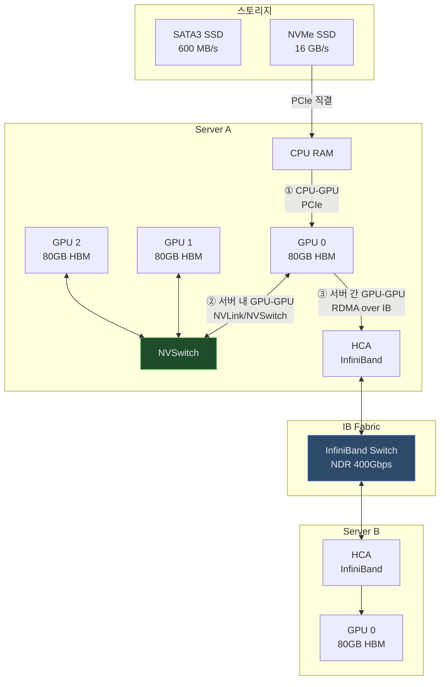
| 통신 유형 | 경로 | 핵심 기술 | 대역폭 |
|-----------|------|-----------|--------|
| **CPU ↔ GPU** | 스토리지 → CPU RAM → GPU | PCIe, NVMe | ~64 GB/s |
| **서버 내 GPU ↔ GPU** | GPU → NVSwitch → GPU | NVLink 4.0 | 900 GB/s |
| **서버 간 GPU ↔ GPU** | GPU → HCA → IB Switch → HCA → GPU | InfiniBand RDMA | 400 Gbps |

---

## CPU ↔ GPU 통신

### 1. PCIe와 병목

GPU 메모리(HBM)는 GPU당 80GB(H100 기준)로 제한된다. 학습 데이터는 매번 스토리지 → CPU RAM → GPU RAM 경로로 이동한다.

기존 SATA3 SSD는 PCIe 대역폭에 비해 너무 느리다.

| 구간 | 인터페이스 | 대역폭 |
|------|-----------|--------|
| 스토리지 → CPU | SATA3 | ~600 MB/s |
| CPU → GPU | PCIe 5.0 x16 | ~64 GB/s |

SATA3는 PCIe 대비 약 **106배 느리다**. 60GB 데이터 이동 시 약 100초가 소요되어 GPU가 idle 상태로 대기하게 된다.

### 2. NVMe SSD 해결책

NVMe(Non-Volatile Memory Express)는 PCIe 버스에 직접 연결되어 SATA 컨트롤러를 우회한다.

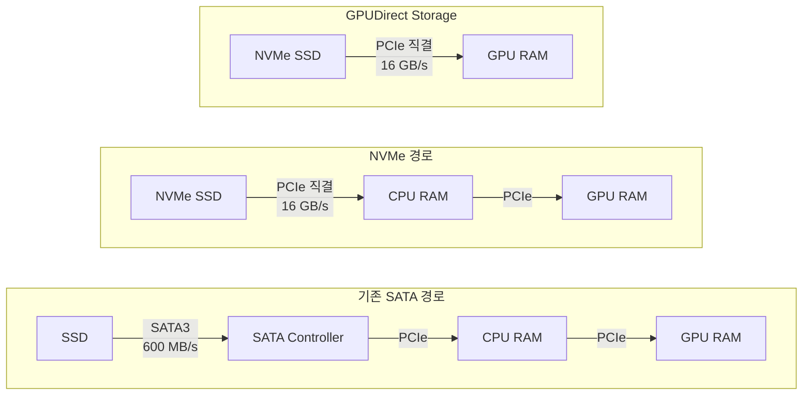
> **GPUDirect Storage**: NVIDIA의 기술로 CPU RAM을 완전히 우회하여 NVMe SSD에서 GPU RAM으로 직접 전송한다. 중간 복사 단계가 제거되어 최대 성능을 낼 수 있다.

---

## 서버 내 GPU ↔ GPU 통신

같은 서버 내 GPU들이 통신할 때 PCIe는 여러 장치가 대역폭을 공유하므로 GPU당 실제로 사용 가능한 대역폭이 50~60GB/s 수준으로 제한된다.

### 1. NVLink

NVIDIA GPU 전용 고속 인터커넥트로, PCIe와 완전히 별도의 물리적 링크다.

| 세대 | 적용 GPU | 양방향 대역폭 | 지연시간 |
|------|----------|--------------|---------|
| NVLink 1.0 | Pascal (P100) | 160 GB/s | - |
| NVLink 2.0 | Volta (V100) | 300 GB/s | - |
| NVLink 3.0 | Ampere (A100) | 600 GB/s | - |
| **NVLink 4.0** | **Hopper (H100)** | **900 GB/s** | **5~10 ns** |
| NVLink 5.0 | Blackwell (B100) | 1,800 GB/s | - |

PCIe와 NVLink를 수치로 비교하면 차이가 명확하다.

| 항목 | PCIe 5.0 | NVLink 4.0 |
|------|----------|------------|
| 대역폭 | ~64 GB/s | 900 GB/s |
| 지연시간 | 100~200 ns | 5~10 ns |
| GPU 전용 여부 | (공유) | (GPU 전용) |
| 추후 추가 가능 | | (칩 내장) |

> NVLink는 GPU 칩셋에 내장되어 있어 서버 구매 시 사전 결정이 필수다. 나중에 추가할 수 없다.

### 2. NVBridge

2개의 PCIe 형태 GPU를 1:1로 직접 연결하는 **외부 브릿지 장치**다.

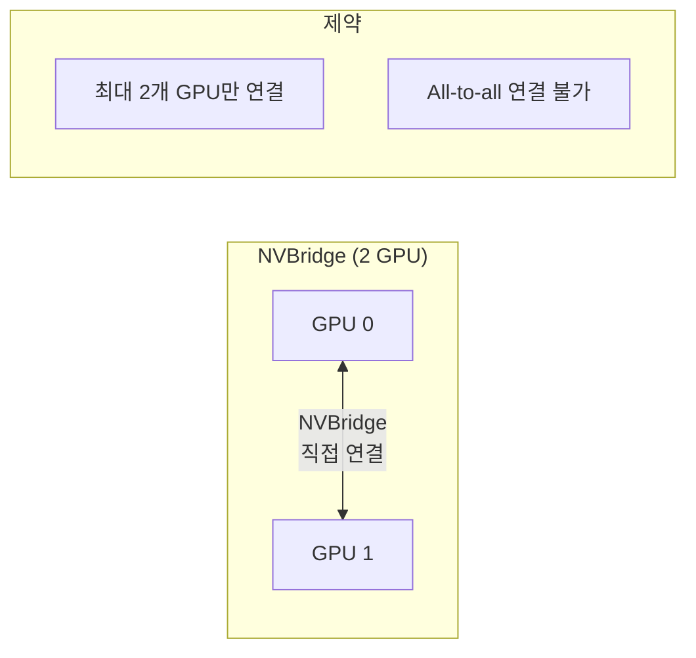
- **용도**: RTX/Quadro 계열 워크스테이션 GPU (소규모)
- **한계**: 3개 이상 GPU의 All-to-all 연결 불가

### 3. NVSwitch - SXM vs PCIe

NVSwitch는 NVLink 포트를 가진 **스위칭 칩**으로, 모든 GPU가 최대 대역폭으로 All-to-all 통신이 가능하다.

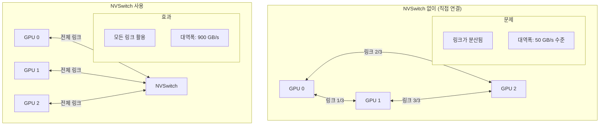
SXM과 PCIe 폼팩터의 주요 차이점은 다음과 같다.

| 항목 | SXM (서버 전용) | PCIe (범용) |
|------|----------------|------------|
| 연결 방식 | 보드 직접 납땜 | PCIe 슬롯 삽입 |
| NVLink 포트 수 | 최대 (H100: 18개) | 절반 이하 |
| 전력 | 700W (H100 SXM) | 350W (H100 PCIe) |
| NVSwitch 연결 | 가능 | 제한적 |
| 유연성 | 낮음 (교체 어려움) | 높음 (슬롯 교체) |
| 대상 | DGX, HGX 서버 | 범용 서버 |

> **DGX H100**: 8개 H100 SXM GPU + 4개 NVSwitch 탑재. 서버 내 총 NVLink 대역폭: 3.6 TB/s

---

## 서버 간 GPU ↔ GPU 통신 - InfiniBand

### 1. InfiniBand란?

서버 간 GPU 통신에서 일반 이더넷을 쓰면 데이터가 **5번 복사**된다.

```
GPU RAM → CPU RAM → NIC → 네트워크 → NIC → CPU RAM → GPU RAM

```
InfiniBand는 **RDMA(Remote Direct Memory Access)** 를 통해 CPU 개입 없이 GPU 메모리 간 직접 전송을 지원한다.

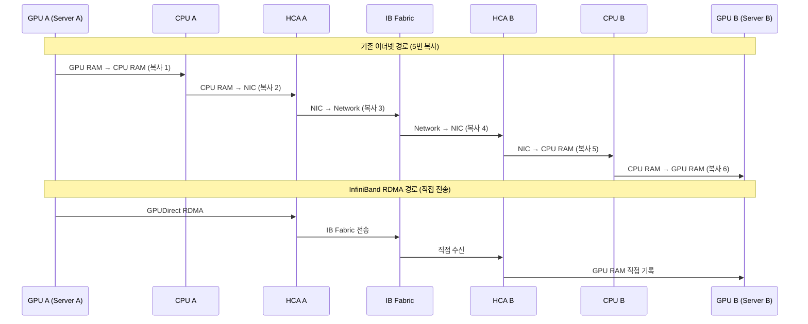
### 2. 세대별 속도 (EDR → HDR → NDR)

InfiniBand는 세대마다 약 2배씩 대역폭이 증가한다.

| 세대 | 이름 | 포트당 속도 | 출시 연도 | 주요 사용처 |
|------|------|------------|---------|-----------|
| EDR | Enhanced Data Rate | 100 Gb/s | 2014 | 레거시 HPC |
| HDR | High Data Rate | 200 Gb/s | 2019 | AI/ML 클러스터 |
| **NDR** | **Next Data Rate** | **400 Gb/s** | **2022** | **최신 LLM 학습** |
| XDR | Extended Data Rate | 800 Gb/s | 2025 예정 | 차세대 |

> NDR 스위치는 포트 수에 따라 64포트(QM9700)가 일반적이며, 400Gbps × 64포트 = 25.6 Tbps 스위칭 용량을 제공한다.

### 3. 핵심 컴포넌트 (HCA, Switch, Cable, Fabric)

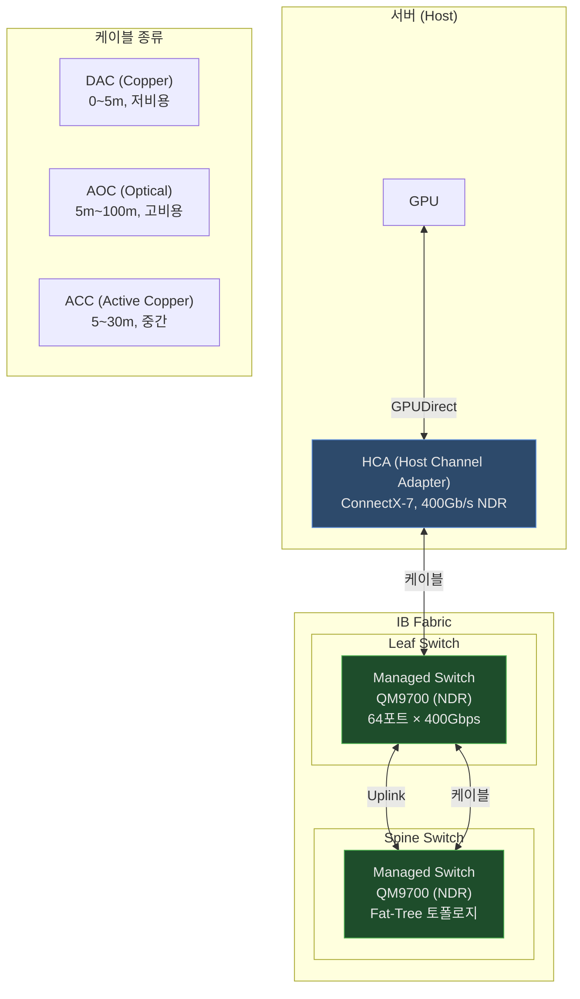
**HCA (Host Channel Adapter)**:
- 서버에 장착되는 InfiniBand NIC (이더넷의 NIC에 해당)
- 주요 제품: Mellanox ConnectX-7 (NDR, 400Gbps)
- PCIe 슬롯에 장착, RDMA 엔진 내장
- 서버당 GPU 2개에 HCA 1개 배치가 권장 구성 (2:1 ratio)

**Switch (Managed Switch)**:
- 여러 HCA를 연결하는 InfiniBand 스위치
- Mellanox QM9700 (NDR 64포트), QM8790 (HDR 40포트)
- Unmanaged Switch: 기본 포워딩만 (소규모)
- Managed Switch: MLNX_OS 탑재, Subnet Manager 내장, 모니터링/설정 가능

**Cable**:
- **DAC (Direct Attach Copper)**: 구리선, 0~5m, 가장 저렴. 짧은 랙 내 연결
- **AOC (Active Optical Cable)**: 광케이블, 5m~100m. 랙 간 장거리 연결
- **ACC (Active Copper Cable)**: 5~30m, 중간 거리
- 케이블 길이는 미리 정확히 측정해야 한다. 재단이 불가능하므로 여분을 미리 주문해두는 것이 안전하다.

**Fabric**:
- HCA + Switch + Cable 전체를 합친 InfiniBand 네트워크를 **Fabric**이라 부름
- **Fat-Tree 토폴로지**: Leaf-Spine 구조, 오버서브스크립션 없는 Full Bisection Bandwidth 제공

---

## InfiniBand 소프트웨어 스택

### 1. MLNX_OFED (호스트 드라이버)

**Mellanox OpenFabrics Enterprise Distribution** - 서버 호스트에 설치하는 InfiniBand/RoCE 드라이버 패키지.

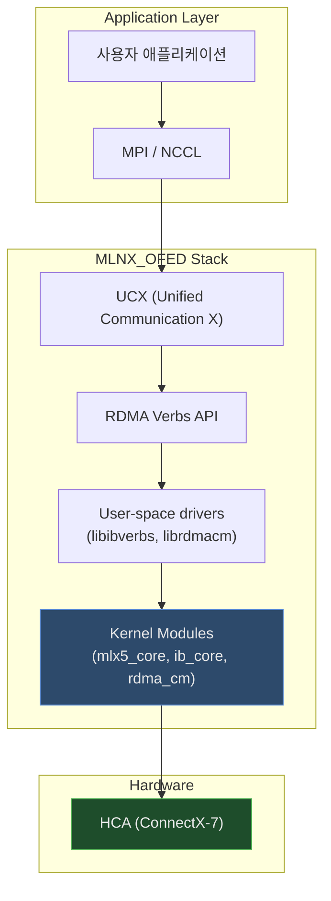
주요 구성 요소는 다음과 같다.

| 컴포넌트 | 역할 |
|---------|------|
| `mlx5_core` | Mellanox ConnectX HCA 커널 드라이버 |
| `ib_core` | InfiniBand 코어 서브시스템 |
| `rdma_cm` | RDMA 연결 관리 |
| `libibverbs` | RDMA Verbs 사용자 공간 라이브러리 |
| `UCX` | MPI/NCCL이 사용하는 고성능 통신 프레임워크 |

설치 후 다음 명령으로 상태를 확인할 수 있다.

```bash
# OFED 버전 확인
ofed_info -s

# IB 포트 상태 확인
ibstat

# IB 링크 상태 확인
ibstatus

# HCA 정보 확인
ibv_devinfo

```
### 2. MLNX_OS (스위치 OS)

Managed InfiniBand 스위치에 탑재되는 **Mellanox 전용 운영체제**.

```bash
# MLNX_OS 접속 (SSH)
ssh admin@<switch-ip>

# 스위치 버전 확인
show version

# 포트 상태 확인
show interfaces ib <port-id>

# 스위치 포트 속도 확인
show interfaces ib status

# 팬/전원 상태
show environment

```
주요 기능은 다음과 같다.

| 기능 | 설명 |
|------|------|
| Subnet Manager | 스위치에 내장된 SM 활성화 가능 |
| 포트 관리 | 포트별 활성화/비활성화, 속도 설정 |
| SNMP/Syslog | 모니터링 에이전트 연동 |
| 펌웨어 업그레이드 | 스위치 ASIC 펌웨어 관리 |
| Partition 관리 | P_Key 테이블 설정 |

### 3. Subnet Manager

InfiniBand Fabric의 **핵심 관리 컴포넌트**. Ethernet의 스패닝 트리 + DHCP 서버와 유사한 역할을 한다.

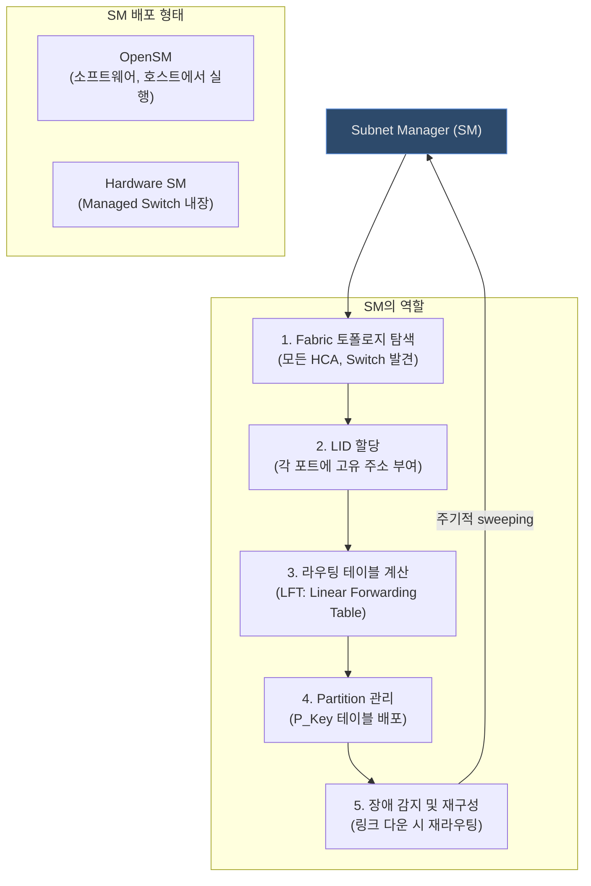
**SM 이중화 (Active-Standby)**:
- Fabric에는 반드시 SM이 1개 이상 동작해야 한다
- 여러 SM이 있을 경우 Priority가 높은 SM이 **Master**가 되고 나머지는 **Standby**로 대기
- Master 장애 시 Standby가 자동으로 Master로 전환된다

```bash
# OpenSM 실행 (호스트에서)
opensm --priority 10 --daemon

# SM 상태 확인
sminfo

# Fabric 라우팅 확인
ibtracert <src_lid> <dst_lid>

# SM이 할당한 LID 확인
iblinkinfo

```
---

## InfiniBand 네트워크 식별자

### 1. GUID (Global Unique Identifier)

**64비트 영구 식별자** - 이더넷의 MAC 주소에 해당한다.

```
GUID 형식: 0x248a0703007c4f28

구성:
- 상위 24비트: OUI (Organizationally Unique Identifier) - 제조사 식별
- 하위 40비트: 제조사가 부여하는 고유 번호

```
GUID는 용도에 따라 세 가지로 구분된다.

| 종류 | 대상 | 설명 |
|------|------|------|
| **Node GUID** | HCA 카드 | 카드 자체의 고유 ID |
| **Port GUID** | HCA 포트 | 포트별 고유 ID (멀티포트 카드는 포트마다 다름) |
| **System Image GUID** | 서버/스위치 | 전체 시스템을 나타내는 ID |

```bash
# GUID 확인
ibstat | grep -i guid

# 특정 HCA의 GUID 확인
ibv_devinfo | grep node_guid

```
### 2. LID (Local Identifier)

**16비트 임시 식별자** - IP 주소에 해당한다. Subnet Manager가 Fabric 초기화 시 동적으로 할당한다.

```
LID 범위:
- 0x0000: 예약
- 0x0001 ~ 0xBFFF: 유니캐스트 LID (호스트/스위치 포트)
- 0xC000 ~ 0xFFFE: 멀티캐스트 LID
- 0xFFFF: 예약

```
GUID와 LID의 차이점을 정리하면 다음과 같다.

| 항목 | GUID | LID |
|------|------|-----|
| 길이 | 64비트 | 16비트 |
| 영속성 | 영구 (하드웨어 고정) | 임시 (SM이 재시작 시 변경 가능) |
| 역할 | 고유 식별 (MAC 유사) | 라우팅 주소 (IP 유사) |
| 할당 주체 | 제조사 | Subnet Manager |
| 패킷 헤더 사용 | (초기 연결 시) | (실제 패킷 라우팅) |

```bash
# LID 확인
ibstat | grep -i "Base lid"

# Fabric의 모든 LID 목록
ibnodes

# LID로 경로 추적
ibtracert 1 5  # LID 1에서 LID 5로의 경로

```
### 3. Partition (P_Key)

이더넷의 **VLAN**에 해당하는 InfiniBand의 논리적 네트워크 분리 기술.

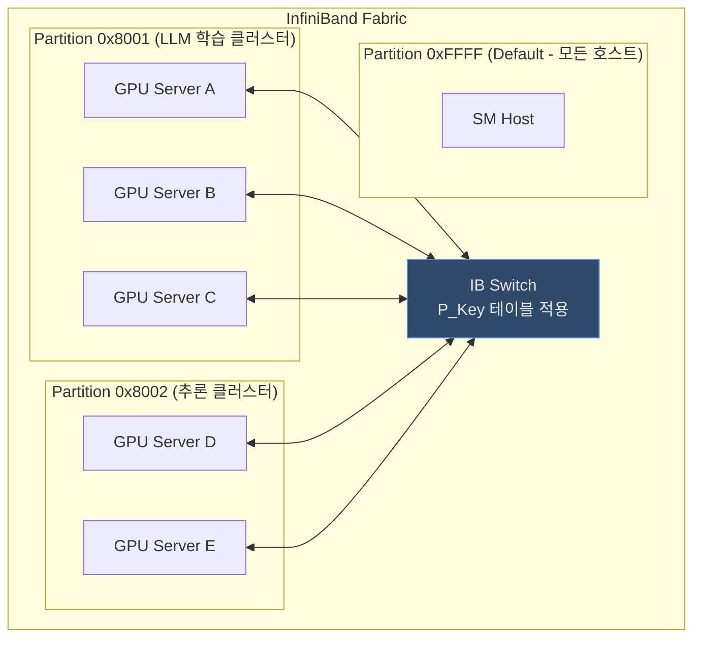
P_Key는 16비트로 구성된다.

```
P_Key = 16비트

[15번 비트] Membership 비트:
  - 1: Full Member (통신 가능)
  - 0: Limited Member (Full Member와만 통신, Limited끼리 불가)

[14:0 비트] Partition Index (0x0000 ~ 0x7FFF)

예시:
  - 0xFFFF: Default Partition Full Member
  - 0x8001: Partition 1 Full Member
  - 0x0001: Partition 1 Limited Member

```
```bash
# 호스트의 P_Key 확인
cat /sys/class/infiniband/mlx5_0/ports/1/pkeys/0

# SM에서 Partition 설정 (opensm.conf 또는 partitions.conf)
# /etc/opensm/partitions.conf
Default=0xffff, ipoib : ALL, ALL=full;
LLM=0x0001, ipoib : node1, node2, node3=full;
Inference=0x0002, ipoib : node4, node5=full;

```
---

## GPU 클러스터 설계 고려사항

### HCA 배치 전략

토스증권 도입기에서도 언급된 **2:1 구조** (GPU 2개당 HCA 1개)가 일반적인 권장 구성이다.

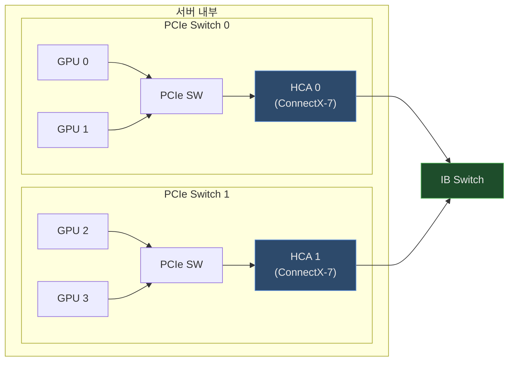
GPU와 HCA는 같은 PCIe 스위치에 연결되어야 NUMA 친화적 통신이 가능하다. 다른 PCIe 스위치를 거치면 CPU를 통해 우회하게 되어 지연시간이 늘어난다.

### 병목 지점별 해결책 요약

| 병목 위치 | 증상 | 해결책 |
|---------|------|--------|
| 스토리지 → CPU | 데이터 로딩 속도 느림 | NVMe SSD 교체 |
| CPU → GPU | 전처리 속도 느림 | GPUDirect Storage 적용 |
| 서버 내 GPU 간 | AllReduce 느림 | NVLink + NVSwitch (SXM GPU) |
| 서버 간 GPU 간 | 분산 학습 느림 | InfiniBand NDR + GPUDirect RDMA |

### 케이블 선택 기준

| 거리 | 권장 케이블 | 비용 | 비고 |
|------|-----------|------|------|
| 0~3m | DAC (Passive Copper) | 최저 | 같은 랙 내 |
| 3~7m | DAC (Active Copper) | 낮음 | 인접 랙 |
| 7~100m | AOC (Active Optical) | 높음 | 랙 간, 장거리 |
| 100m+ | 광트랜시버 + 광케이블 | 최고 | 건물 간 |

> InfiniBand 케이블은 길이를 미리 정확히 측정해야 한다. 재단이 불가능하며 여분을 미리 주문해두는 것이 안전하다.

---

## 핵심 개념 정리

### 전체 기술 스택 한눈에 보기

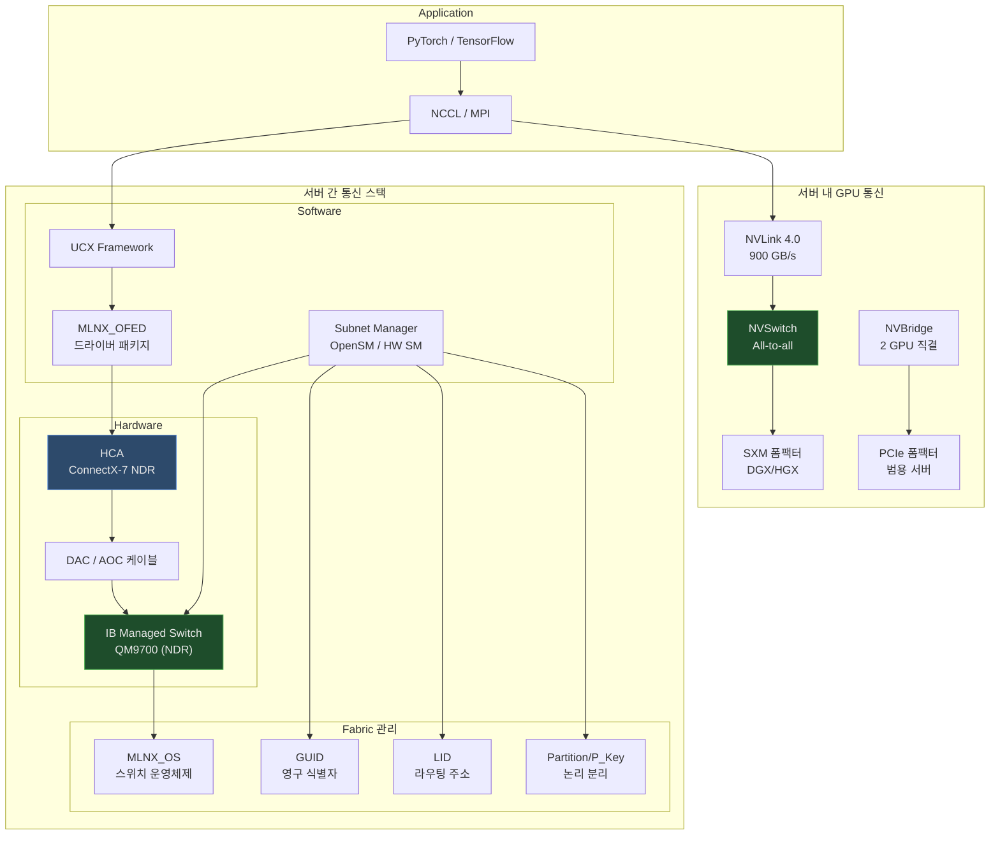
### 용어 정리 표

| 용어 | 풀네임 | 역할 | 이더넷 유사 개념 |
|------|--------|------|----------------|
| **HCA** | Host Channel Adapter | 서버용 IB NIC | NIC |
| **MLNX_OFED** | Mellanox OpenFabrics Enterprise Distribution | 호스트 드라이버 | NIC 드라이버 |
| **MLNX_OS** | Mellanox OS | 스위치 운영체제 | NX-OS / EOS |
| **SM** | Subnet Manager | Fabric 관리/라우팅 | STP + DHCP |
| **GUID** | Global Unique Identifier | 64비트 영구 ID | MAC 주소 |
| **LID** | Local Identifier | 16비트 라우팅 주소 | IP 주소 |
| **Partition** | - | 논리 네트워크 분리 | VLAN |
| **P_Key** | Partition Key | Partition 식별자 | VLAN ID |
| **Fabric** | - | IB 전체 네트워크 | L2 도메인 |
| **NVLink** | - | GPU간 전용 인터커넥트 | - |
| **NVSwitch** | - | NVLink 스위칭 칩 | - |
| **NVBridge** | - | 2 GPU 직결 브릿지 | - |
| **SXM** | Server eXtended Module | GPU 고성능 폼팩터 | - |
| **RDMA** | Remote Direct Memory Access | 제로카피 원격 메모리 접근 | - |

### 의사결정 가이드

```
GPU 클러스터에서 통신 병목이 발생한다면?

Q1: 데이터 로딩이 느린가? (GPU Utilization < 50%)
  → YES: NVMe SSD + GPUDirect Storage 도입

Q2: 같은 서버 내 GPU 간 통신이 느린가? (AllReduce 병목)
  → YES: NVLink + NVSwitch 지원 GPU (SXM 폼팩터) 도입

Q3: 서버 간 GPU 통신이 느린가? (분산 학습 스케일이 안 됨)
  → YES: InfiniBand NDR (400Gbps) + GPUDirect RDMA 도입

```
---

## 마무리

GPU 클러스터의 성능은 계산 능력(FLOPS)만큼이나 **통신 대역폭**이 중요하다.

- **CPU-GPU**: NVMe SSD로 스토리지 병목 제거, GPUDirect Storage로 CPU 우회
- **서버 내 GPU-GPU**: NVLink(칩 내장) + NVSwitch(All-to-all) → SXM 폼팩터 필수
- **서버 간 GPU-GPU**: InfiniBand(NDR 400Gbps) + RDMA → 복사 없는 직접 전송
- **InfiniBand 관리**: SM이 GUID/LID/Partition을 관리, MLNX_OFED/MLNX_OS로 운영
- **케이블**: 거리에 따라 DAC(단거리) vs AOC(장거리) 선택, 사전 측정 필수

워크로드 프로파일링으로 병목 구간을 먼저 파악한 뒤 해당 구간에 맞는 기술을 도입하는 것이 핵심이다.

---

## 참고 자료

- [토스증권 - 고성능 GPU 클러스터 도입기 #2](https://toss.tech/article/securities_llm_2)
