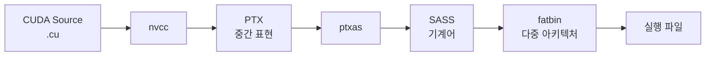
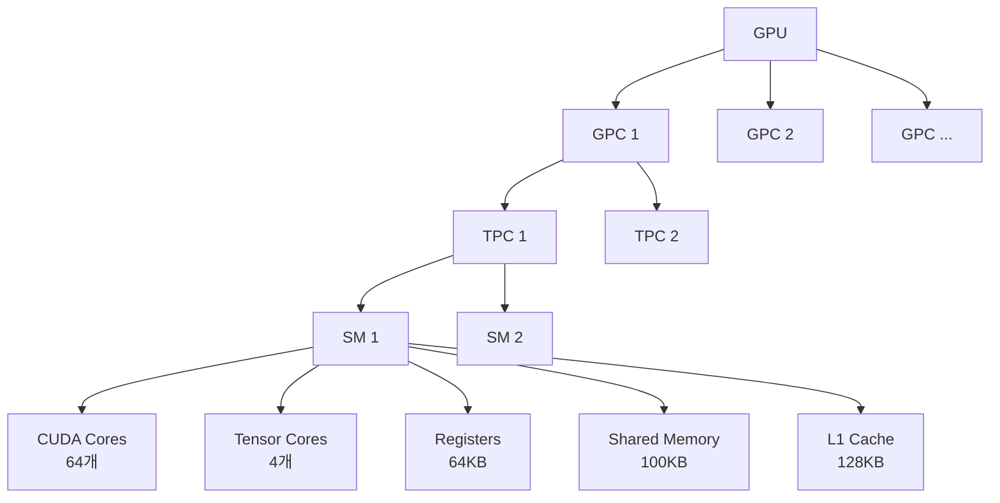
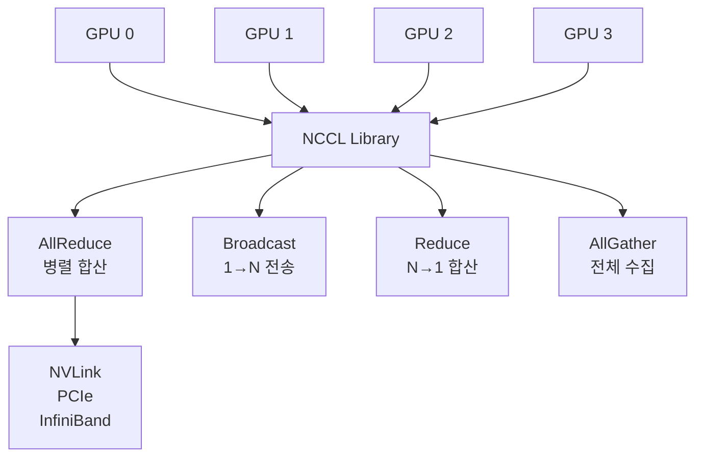
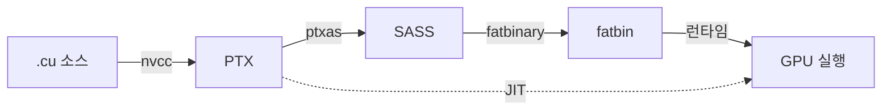

---
tags:
  - GPU
  - CUDA
---

# NVIDIA CUDA 아키텍처

> CUDA 컴파일 파이프라인(nvcc, PTX, SASS), GPU 아키텍처(SM, Warp), 메모리 계층, NCCL 다중 GPU 통신을 다룬다.

---

## CUDA 컴파일 과정


### 1. nvcc (NVIDIA CUDA Compiler)

nvcc는 CUDA C/C++ 소스 코드를 컴파일하는 컴파일러 드라이버로, 여러 단계의 컴파일러를 조율한다.

**nvcc의 역할**:

| 단계 | 설명 |
|------|------|
| **코드 분리** | Host 코드(CPU) → GCC/Clang, Device 코드(GPU) → PTX |
| **최적화** | `-O3`, `-use_fast_math` 등 옵션 적용 |
| **아키텍처 타겟팅** | `-arch=sm_XX` 플래그로 특정 GPU 타겟 |

**컴파일 예시**:

```bash
# 단일 아키텍처 컴파일 (Ampere - SM 8.0)
nvcc -arch=sm_80 -o myapp myapp.cu

# 다중 아키텍처 컴파일 (fatbin 생성)
nvcc -gencode arch=compute_70,code=sm_70 \
     -gencode arch=compute_80,code=sm_80 \
     -gencode arch=compute_90,code=sm_90 \
     -o myapp myapp.cu

# PTX만 생성 (JIT 컴파일용)
nvcc -arch=compute_80 -code=compute_80 -ptx myapp.cu

```
**nvcc 옵션 정리**:

| 옵션 | 설명 |
|------|------|
| `-arch=sm_XX` | 특정 GPU 아키텍처 타겟 (예: sm_80 = Ampere) |
| `-code=sm_XX` | SASS 코드 생성 (바로 실행 가능) |
| `-code=compute_XX` | PTX 코드 생성 (JIT 컴파일) |
| `-gencode` | 다중 아키텍처 코드 생성 |
| `-use_fast_math` | 빠른 수학 함수 사용 (정확도 ↓, 속도 ↑) |
| `-lineinfo` | 디버깅 정보 포함 |

---

### 2. PTX (Parallel Thread Execution)

PTX는 CUDA의 **중간 표현(IR, Intermediate Representation)**
- 가상의 GPU 명령어 집합 (LLVM IR과 유사)
- 아키텍처 독립적 (portable across GPU architectures)

**PTX의 역할**:

| 역할 | 설명 |
|------|------|
| **포워드 호환성** | 새로운 GPU에서 JIT(Just-In-Time) 컴파일로 SASS 생성<br/>예: SM 8.0 PTX → SM 9.0 GPU에서 자동 컴파일 |
| **최적화 기회** | 드라이버가 런타임에 GPU별 최적화 적용 |
| **인라인 어셈블리** | CUDA 커널에서 `asm()` 구문으로 PTX 직접 작성 가능 |

**PTX 예시**:

```ptx
// C++ CUDA 코드:
// __global__ void add(int *a, int *b, int *c) {
//     int i = threadIdx.x;
//     c[i] = a[i] + b[i];
// }

.version 7.0
.target sm_80
.address_size 64

.visible .entry add(
    .param .u64 add_param_0,  // int *a
    .param .u64 add_param_1,  // int *b
    .param .u64 add_param_2   // int *c
) {
    .reg .s32 %r<4>;          // 레지스터 선언
    .reg .u64 %rd<10>;

    // threadIdx.x 로드
    mov.u32 %r1, %tid.x;

    // 포인터 로드
    ld.param.u64 %rd1, [add_param_0];
    ld.param.u64 %rd2, [add_param_1];
    ld.param.u64 %rd3, [add_param_2];

    // a[i], b[i] 로드
    ld.global.s32 %r2, [%rd1+%r1*4];
    ld.global.s32 %r3, [%rd2+%r1*4];

    // 덧셈 수행
    add.s32 %r4, %r2, %r3;

    // c[i] 저장
    st.global.s32 [%rd3+%r1*4], %r4;

    ret;
}

```
**PTX vs SASS 비교**:

| 항목 | PTX | SASS |
|------|-----|------|
| **수준** | 고수준 중간 표현 | 저수준 기계어 |
| **호환성** | 아키텍처 독립적 | 특정 GPU 아키텍처 전용 |
| **가독성** | 높음 (어셈블리와 유사) | 낮음 (16진수 인코딩) |
| **최적화** | 런타임 JIT 최적화 | 컴파일 타임 최적화 |
| **크기** | 큼 (텍스트 형식) | 작음 (바이너리) |

---

### 3. SASS (Shader ASSembler)

SASS는 GPU의 **실제 기계어 코드** (native machine code)
- 특정 Compute Capability에 특화된 명령어
- PTX보다 **성능 최적화**, 하지만 **포팅 불가**

**SASS의 특징**:

| 특징 | 설명 |
|------|------|
| **아키텍처 종속성** | SM 8.0 SASS ≠ SM 9.0 SASS |
| **최대 성능** | GPU의 모든 하드웨어 기능 활용 (Tensor Core, RT Core 등) |
| **디버깅 어려움** | 16진수 인코딩, 공식 문서 없음 (역공학 필요) |

**SASS 예시** (cuobjdump로 추출):

```sass
// PTX와 동일한 add 커널의 SASS
  /* 0x001c4400c0001c04 */  MOV R1, c[0x0][0x28]         // threadIdx.x 로드
  /* 0x001c4800c0009de4 */  S2R R3, SR_TID.X
  /* 0x001c5000c0019c04 */  LDG.E R4, [R8]               // a[i] 로드
  /* 0x001c5400c0021c04 */  LDG.E R5, [R10]              // b[i] 로드
  /* 0x001c5c00c0029c03 */  IADD3 R6, R4, R5, RZ         // 덧셈
  /* 0x001c6400c0031c04 */  STG.E [R12], R6              // c[i] 저장
  /* 0x001c6c00c0039de7 */  EXIT                         // 종료

```
**SASS 분석 방법**:

```bash
# cuobjdump로 SASS 추출
cuobjdump -sass myapp

# Nsight Compute로 SASS 프로파일링
ncu --set full --target-processes all myapp

```

---

### 4. fatbin (Fat Binary)

fatbin이는 **다중 아키텍처** SASS + PTX를 하나의 바이너리에 포함
- 런타임에 현재 GPU에 맞는 코드 선택 실행

**fatbin 구조**:

```
┌─────────────────────────────────┐
│       Fat Binary (.fatbin)      │
├─────────────────────────────────┤
│  SM 7.0 SASS (Volta)            │
│  SM 8.0 SASS (Ampere)           │
│  SM 9.0 SASS (Hopper)           │
│  PTX 8.0 (fallback)             │
└─────────────────────────────────┘
         ↓ (런타임 선택)
    현재 GPU: SM 8.6 (RTX 3090)
         ↓
    SM 8.0 SASS 실행

```
**fatbin 생성 예시**:

```bash
# 3개 아키텍처 + PTX fallback
nvcc -gencode arch=compute_70,code=sm_70 \    # Volta
     -gencode arch=compute_80,code=sm_80 \    # Ampere
     -gencode arch=compute_90,code=sm_90 \    # Hopper
     -gencode arch=compute_90,code=compute_90 \ # PTX fallback
     -o myapp myapp.cu

```
**fatbin 분석**:

```bash
# fatbin 내용 확인
cuobjdump -lelf myapp
# 출력 예시:
# ELF file 1: sm_70
# ELF file 2: sm_80
# ELF file 3: sm_90
# PTX file 1: compute_90

# 특정 아키텍처 SASS 추출
cuobjdump -arch sm_80 -sass myapp

```
**fatbin 장단점**:

| 장점 | 단점 |
|------|------|
| 다양한 GPU 지원 (하나의 바이너리) | 파일 크기 증가 (각 아키텍처별 중복) |
| 배포 편의성 (사용자 GPU 모름) | 컴파일 시간 증가 |
| PTX fallback으로 미래 호환성 | 최신 GPU에서는 JIT 오버헤드 |

---

### 5. cuobjdump (CUDA Object Dump)

cuobjdump는 CUDA 바이너리 분석 도구 (objdump의 CUDA 버전)
- fatbin 내부 구조, PTX, SASS 추출 가능

```bash
# 1. fatbin 아키텍처 목록 확인
cuobjdump -lelf myapp
# 출력:
# ELF file 1: sm_70
# ELF file 2: sm_80

# 2. PTX 추출
cuobjdump -ptx myapp > kernel.ptx

# 3. SASS 추출 (특정 아키텍처)
cuobjdump -arch sm_80 -sass myapp > kernel.sass

# 4. 심볼 테이블 확인
cuobjdump -symbols myapp

# 5. 레지스터 사용량 확인
cuobjdump -res-usage myapp
# 출력:
# Function : _Z3addPiS_S_
# .text : 0x180 bytes
# .reg : 24 registers
# .shared : 0 bytes

```
**cuobjdump 활용 예시**:

```bash
# 커널 레지스터 압력 분석
cuobjdump -res-usage myapp | grep "Function\|.reg"
# → 레지스터 32개 이상 사용 시 occupancy 감소

# 다중 아키텍처 코드 크기 비교
for arch in sm_70 sm_80 sm_90; do
    echo "=== $arch ==="
    cuobjdump -arch $arch -sass myapp | wc -l
done

```

---

## GPU 아키텍처


### 1. SM (Streaming Multiprocessor)

SM이는 GPU의 **핵심 연산 유닛** (CPU의 코어와 유사)
- 독립적으로 warp(32 threads)를 실행

**SM 구성 요소** (Ampere 아키텍처 기준):

| 구성 요소 | 개수/크기 | 역할 |
|----------|----------|------|
| **CUDA Core (FP32)** | 64개 | 단정밀도 연산 |
| **CUDA Core (INT32)** | 64개 | 정수 연산 |
| **Tensor Core (Gen3)** | 4개 | 혼합 정밀도 행렬 연산 |
| **LD/ST Unit** | 32개 | 메모리 로드/스토어 |
| **SFU (Special Function Unit)** | 16개 | 초월 함수 (sin, cos, exp 등) |
| **Warp Scheduler** | 4개 | 스레드 블록 스케줄링 |
| **Register File** | 64KB | 스레드별 레지스터 |
| **Shared Memory** | 100KB (L1과 공유) | 블록 내 공유 메모리 |
| **L1 Cache** | 128KB | 메모리 캐시 |

**SM 표기법**:
- `SM 8.0` = Compute Capability 8.0 (Ampere 아키텍처)
- `SM 8.6` = Compute Capability 8.6 (Ampere GA102, RTX 30 시리즈)
- `SM 9.0` = Compute Capability 9.0 (Hopper 아키텍처, H100)

**예시: RTX 3090 (GA102)**
- Compute Capability: **SM 8.6**
- SM 개수: **82개**
- CUDA Core: 82 SM × 128 cores = **10,496개**
- Tensor Core: 82 SM × 4 = **328개**

---

### 2. Compute Capability

Compute Capability는 GPU의 **기능 세트 버전** (하드웨어 기능 정의)
- `major.minor` 형식 (예: 8.0, 8.6, 9.0)

**Compute Capability 버전 체계**:

| 버전 | 아키텍처 | 대표 GPU | 주요 기능 |
|------|----------|----------|----------|
| **7.0** | Volta | V100 | Tensor Core (Gen1), 독립 Thread Scheduling |
| **7.5** | Turing | RTX 20 시리즈 | Tensor Core (Gen2), RT Core (Ray Tracing) |
| **8.0** | Ampere (Data Center) | A100 | Tensor Core (Gen3), MIG (Multi-Instance GPU) |
| **8.6** | Ampere (Consumer) | RTX 30 시리즈 | Tensor Core (Gen3), RT Core (Gen2) |
| **8.9** | Ada Lovelace | RTX 40 시리즈 | Tensor Core (Gen4), RT Core (Gen3) |
| **9.0** | Hopper | H100 | Tensor Core (Gen4), Transformer Engine, FP8 |

**Compute Capability 확인 방법**:

```bash
# 1. nvidia-smi로 GPU 모델 확인
nvidia-smi --query-gpu=name --format=csv,noheader
# 출력: NVIDIA A100-SXM4-40GB

# 2. CUDA 샘플로 확인
/usr/local/cuda/samples/1_Utilities/deviceQuery/deviceQuery
# 출력:
# CUDA Capability Major/Minor version number: 8.0

# 3. Python으로 확인
python3 -c "import torch; print(torch.cuda.get_device_capability())"
# 출력: (8, 0)

```
**Compute Capability와 nvcc 플래그**:

```bash
# SM 8.0 타겟 (A100)
nvcc -arch=sm_80 myapp.cu

# SM 8.6 타겟 (RTX 3090)
nvcc -arch=sm_86 myapp.cu

# PTX만 생성 (compute_XX)
nvcc -arch=compute_80 -code=compute_80 myapp.cu

```

---

### 3. 아키텍처 세대별 특징

#### Volta (SM 7.0) - 2017년

| 주요 기능 | 설명 |
|----------|------|
| **Tensor Core 1세대** | 혼합 정밀도 행렬 연산 |
| **독립 Thread Scheduling** | warp 내 개별 스레드 독립 실행 |
| **NVLink 2.0** | 300GB/s GPU 간 통신 |

#### Turing (SM 7.5) - 2018년

| 주요 기능 | 설명 |
|----------|------|
| **RT Core** | 실시간 Ray Tracing |
| **Tensor Core 2세대** | INT8/INT4 지원 |
| **Mesh Shading** | 기하 처리 최적화 |

#### Ampere (SM 8.0/8.6) - 2020년

| 주요 기능 | 설명 |
|----------|------|
| **Tensor Core 3세대** | TF32 (AI 학습 가속), BF16, FP64 |
| **MIG** | A100을 최대 7개 GPU로 분할 |
| **NVLink 3.0** | 600GB/s |
| **Sparse Tensor Core** | 2:4 구조화 희소성 지원 |

```python
# PyTorch에서 TF32 활성화 (Ampere 전용)
import torch
torch.backends.cuda.matmul.allow_tf32 = True
torch.backends.cudnn.allow_tf32 = True

```
#### Hopper (SM 9.0) - 2022년

| 주요 기능 | 설명 |
|----------|------|
| **Transformer Engine** | FP8 지원 (8bit 학습) |
| **Tensor Core 4세대** | FP8, FP16, BF16, TF32, FP64 |
| **Thread Block Clusters** | 여러 SM에 걸친 스레드 블록 협업 |
| **NVLink 4.0** | 900GB/s |
| **DPX Instructions** | Dynamic Programming 가속 |

```python
# PyTorch 2.0+ Transformer Engine (Hopper 전용)
import transformer_engine.pytorch as te

# FP8 학습
with te.fp8_autocast(enabled=True):
    output = model(input)

```

---

## NCCL (NVIDIA Collective Communications Library)


### 1. NCCL 개요

NCCL이는 **다중 GPU 통신 최적화 라이브러리**
- MPI (Message Passing Interface)의 GPU 버전
- PyTorch, TensorFlow의 분산 학습 백엔드로 사용

**NCCL의 역할**:

| 역할 | 설명 |
|------|------|
| **GPU 간 통신** | NVLink, PCIe, InfiniBand 자동 선택 |
| **Topology 최적화** | GPU 물리 배치에 따른 최적 경로 계산 |
| **중복 제거** | 네트워크 대역폭 최대화 |

**NCCL vs 대안**:

| 라이브러리 | 속도 | 범위 | 사용처 |
|-----------|------|------|--------|
| **NCCL** | 매우 빠름 | GPU only | 딥러닝 학습 |
| **MPI** | 보통 | CPU+GPU | 과학 계산 |
| **Gloo** | 느림 | CPU+GPU | PyTorch CPU fallback |

---

### 2. libnccl.so

libnccl.so는 NCCL의 **공유 라이브러리 파일** (Shared Object)
- PyTorch/TensorFlow가 런타임에 로드

**libnccl.so 위치 확인**:

```bash
# 1. 시스템 라이브러리 경로
ls /usr/lib/x86_64-linux-gnu/libnccl*
# 출력:
# /usr/lib/x86_64-linux-gnu/libnccl.so.2 -> libnccl.so.2.18.5

# 2. CUDA 라이브러리 경로
ls /usr/local/cuda/lib64/libnccl*

# 3. Conda 환경
ls $CONDA_PREFIX/lib/libnccl*

# 4. PyTorch가 사용 중인 NCCL 확인
python3 -c "import torch; print(torch.cuda.nccl.version())"
# 출력: (2, 18, 5)

```
**libnccl.so 링킹**:

```bash
# 컴파일 시 NCCL 링크
nvcc -o myapp myapp.cu -lnccl

# 런타임 경로 설정
export LD_LIBRARY_PATH=/usr/local/cuda/lib64:$LD_LIBRARY_PATH

```
**NCCL 버전 호환성**:

| NCCL 버전 | CUDA 버전 | 주요 기능 |
|----------|-----------|----------|
| **2.18** | 12.x | Hopper 최적화 |
| **2.15** | 11.8+ | Ampere 최적화 |
| **2.10** | 11.0+ | A100 MIG 지원 |

---

### 3. NCCL Operations

#### AllReduce

```python
# PyTorch DDP (Distributed Data Parallel)
import torch.distributed as dist

# 모든 GPU에서 그래디언트 합산 → 평균
dist.all_reduce(tensor, op=dist.ReduceOp.SUM)
tensor /= world_size

```
#### Broadcast

```python
# GPU 0의 모델 가중치를 모든 GPU에 복사
dist.broadcast(tensor, src=0)

```
#### AllGather

```python
# 각 GPU의 배치를 전체 GPU에 수집
output_tensors = [torch.zeros_like(tensor) for _ in range(world_size)]
dist.all_gather(output_tensors, tensor)

```
**NCCL 성능 측정**:

```bash
# NCCL Tests (공식 벤치마크)
git clone https://github.com/NVIDIA/nccl-tests.git
cd nccl-tests
make MPI=1

# 4 GPU AllReduce 성능 테스트
mpirun -np 4 ./build/all_reduce_perf -b 8 -e 1G -f 2
# 출력 예시:
# Size(B) Time(us) AlgBW(GB/s) BusBW(GB/s)
# 1GB 2500 400 600

```

---

## Ray와 CUDA 통합

Ray는 **분산 컴퓨팅 프레임워크** (병렬 처리, Actor 모델)
- GPU 리소스 스케줄링 지원

**Ray에서 GPU 사용**:

```python
import ray

# Ray 초기화 (4 GPU 사용)
ray.init(num_gpus=4)

# GPU 1개 요청하는 Task
@ray.remote(num_gpus=1)
def train_model(data):
    import torch
    device = torch.device("cuda")
    model = MyModel().to(device)
    # ... 학습 코드 ...
    return model

# 4개 GPU에 병렬 실행
futures = [train_model.remote(data) for _ in range(4)]
results = ray.get(futures)

```
**Ray + NCCL 통합**:

```python
# Ray Train (분산 학습)
from ray.train.torch import TorchTrainer
from ray.train import ScalingConfig

trainer = TorchTrainer(
    train_func,
    scaling_config=ScalingConfig(
        num_workers=4,  # 4 GPU
        use_gpu=True,
        backend="nccl"  # NCCL 백엔드 사용
    )
)

```

---

## 핵심 개념 정리

### 1. CUDA 컴파일 흐름 요약



| 단계 | 형식 | 호환성 | 용도 |
|------|------|--------|------|
| **PTX** | 텍스트 (어셈블리) | 아키텍처 독립 | JIT 컴파일, 포팅 |
| **SASS** | 바이너리 (기계어) | 특정 SM 전용 | 최대 성능 |
| **fatbin** | 다중 SASS+PTX | 다중 아키텍처 | 배포 편의성 |

---

### 2. GPU 아키텍처 계층 구조

```
GPU
 └─ GPC (Graphics Processing Cluster)
     └─ TPC (Texture Processing Cluster)
         └─ SM (Streaming Multiprocessor)
             ├─ CUDA Cores (64~128개)
             ├─ Tensor Cores (4~8개)
             ├─ Registers (64KB)
             ├─ Shared Memory (100KB)
             └─ L1 Cache (128KB)

```
**예시: A100 (SM 8.0)**
- 108 SM × 64 CUDA Cores = **6,912 CUDA Cores**
- 108 SM × 4 Tensor Cores = **432 Tensor Cores**

---

### 3. Compute Capability 선택 가이드

```bash
# 특정 GPU만 지원 (최소 크기)
nvcc -arch=sm_80 app.cu

# 여러 GPU 지원 (큰 크기)
nvcc -gencode arch=compute_70,code=sm_70 \
     -gencode arch=compute_80,code=sm_80 \
     -gencode arch=compute_90,code=sm_90 \
     app.cu

# 미래 GPU 지원 (PTX fallback 포함)
nvcc -gencode arch=compute_80,code=sm_80 \
     -gencode arch=compute_90,code=compute_90 \  # PTX
     app.cu

```

---

### 4. NCCL 통신 패턴

| 연산 | 입력 | 출력 | 사용 사례 |
|------|------|------|----------|
| **AllReduce** | 각 GPU: 그래디언트 | 모든 GPU: 합산 그래디언트 | DDP 학습 |
| **Broadcast** | GPU 0: 가중치 | 모든 GPU: 동일 가중치 | 모델 동기화 |
| **Reduce** | 각 GPU: 로스 | GPU 0: 평균 로스 | 메트릭 집계 |
| **AllGather** | 각 GPU: 배치 데이터 | 모든 GPU: 전체 데이터 | 샘플 공유 |

---

---

**참고 자료**
- [CUDA C++ Programming Guide](https://docs.nvidia.com/cuda/cuda-c-programming-guide/)
- [PTX ISA Guide](https://docs.nvidia.com/cuda/parallel-thread-execution/)
- [NCCL Documentation](https://docs.nvidia.com/deeplearning/nccl/)
- [cuobjdump User Manual](https://docs.nvidia.com/cuda/cuda-binary-utilities/)
- [Nsight Compute](https://developer.nvidia.com/nsight-compute)
- [NCCL Tests](https://github.com/NVIDIA/nccl-tests)
