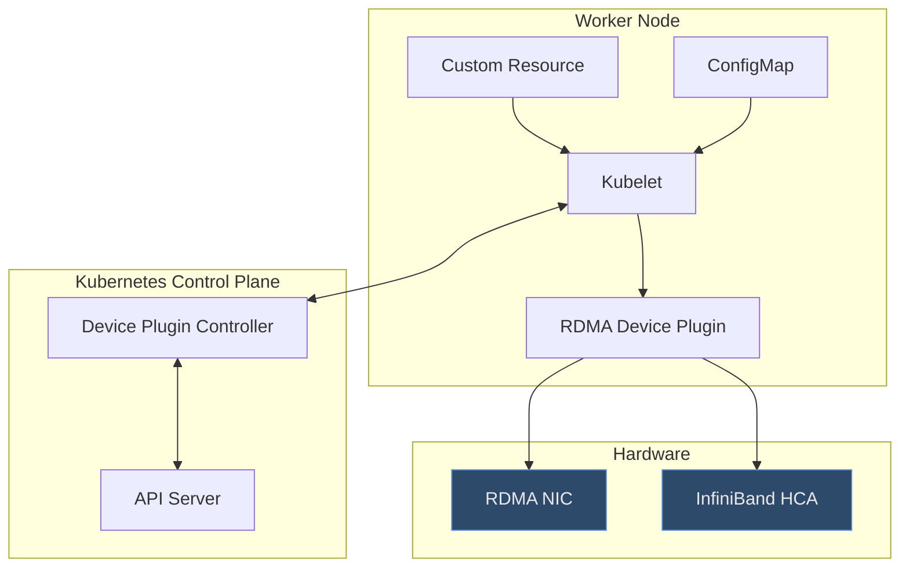

# RDMA Device Plugin (DRANET)

> Kubernetes에서 RDMA NIC를 Pod에 할당하는 Device Plugin 메커니즘

## 개요

**DRANET (DRA Network)**는 RDMA → DRA(Dynamic Resource Allocation) 기반으로 마이그레이션되는 Kubernetes Device Plugin입니다.

**목적**: Kubernetes 외부에 있는 하드웨어 리소스(RDMA NIC)를 Kubernetes 내부로 통합하여 Pod에서 사용할 수 있게 함

## 아키텍처



## 동작 원리

### 1. 디바이스 정보 전달

**CustomResource (CR) & ConfigMap**:
- RDMA NIC 정보를 CR/ConfigMap으로 정의
- Kubelet이 CR/ConfigMap을 읽어 디바이스 정보 파악

**Kubelet → Controller**:
- Kubelet이 Device Plugin을 통해 디바이스 정보 수집
- Controller에 리소스 가용성 보고
- Scheduler가 Pod 배치 시 참고

### 2. RDMA 리소스 계층

```
RDMA (Remote Direct Memory Access)
  ↓
InfiniBand (IB)
  ↓
NIC (Network Interface Card - HCA)
  ↓
Kubernetes Device Plugin (CR, ConfigMap)
  ↓
Kubelet
  ↓
Controller (리소스 가용성 관리)
```

## Device Plugin 등록 과정

1. **Device Plugin 시작**:
   - RDMA Device Plugin이 Worker Node에서 실행
   - `/var/lib/kubelet/device-plugins/` 디렉터리에 소켓 생성

2. **Kubelet 등록**:
   - Device Plugin이 Kubelet에 등록 요청
   - 사용 가능한 디바이스 목록 전달

3. **리소스 광고**:
   - Kubelet이 Node 리소스에 `rdma/hca` 추가
   - Scheduler가 이 정보 기반으로 Pod 배치

4. **Pod 할당**:
   - Pod spec에 `resources.limits.rdma/hca: 1` 요청
   - Kubelet이 Device Plugin에 할당 요청
   - Device Plugin이 특정 RDMA NIC를 Pod에 할당

## RDMA → DRANET 마이그레이션

**기존 (RDMA Device Plugin)**:
- Static resource allocation
- 재시작 시 리소스 재할당 필요

**DRANET (Dynamic Resource Allocation)**:
- 동적 리소스 할당
- 더 유연한 리소스 관리
- GPU, RDMA 같은 특수 하드웨어 통합 개선

## 참고 자료

- [Kubernetes Device Plugins](https://kubernetes.io/docs/concepts/extend-kubernetes/compute-storage-net/device-plugins/)
- [Dynamic Resource Allocation](https://kubernetes.io/docs/concepts/scheduling-eviction/dynamic-resource-allocation/)
