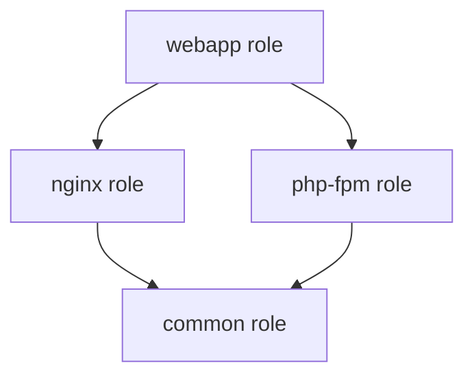

# Ansible

> 에이전트 없이 SSH로 인프라를 코드로 관리하는 자동화 도구다.

## 소개

Ansible은 Red Hat이 개발한 오픈소스 IT 자동화 도구로, 서버 구성 관리, 애플리케이션 배포, 오케스트레이션을 지원한다. Python 기반으로 작성되었으며, 에이전트 설치 없이 SSH를 통해 원격 노드를 관리한다.

### Terraform vs Ansible

| 항목 | Terraform | Ansible |
|------|-----------|---------|
| 용도 | 인프라 프로비저닝 | 구성 관리 및 배포 |
| 접근 방식 | 선언적(Declarative) | 절차적(Procedural) + 선언적 |
| 상태 관리 | State 파일 관리 | Stateless (멱등성으로 보장) |
| 통신 방식 | API 호출 | SSH (에이전트 불필요) |
| 주요 사용처 | 클라우드 리소스 생성 | OS 설정, 패키지 설치, 앱 배포 |

**함께 사용하는 패턴**:
- Terraform으로 VM 생성 → Ansible로 소프트웨어 설치 및 구성
- Terraform에서 Dynamic Inventory 생성 → Ansible에서 자동 적용

## 설치

### Control Node 요구사항

| 항목 | 내용 |
|------|------|
| OS | Linux, macOS (Windows는 WSL2 필요) |
| Python | 3.9 이상 |
| SSH 클라이언트 | OpenSSH |

### 설치 방법

**pip 설치** (권장):
```bash
pip install ansible
ansible --version
```

**패키지 관리자**:
```bash
# Ubuntu/Debian
sudo apt update
sudo apt install ansible

# RHEL/CentOS
sudo dnf install ansible

# macOS
brew install ansible
```

### Managed Node 요구사항

- Python 2.7 또는 3.5 이상
- SSH 서버 실행 중
- 필요 시 sudo 권한

## Inventory

Inventory는 Ansible이 관리할 호스트 목록을 정의하는 파일이다. INI 또는 YAML 형식으로 작성한다.

### INI 형식

```ini
# inventory.ini
[webservers]
web1.example.com
web2.example.com

[databases]
db1.example.com
db2.example.com

[production:children]
webservers
databases

[production:vars]
ansible_user=admin
ansible_ssh_private_key_file=~/.ssh/prod.pem
```

### YAML 형식

```yaml
# inventory.yml
all:
  children:
    webservers:
      hosts:
        web1.example.com:
        web2.example.com:
    databases:
      hosts:
        db1.example.com:
        db2.example.com:
    production:
      children:
        webservers:
        databases:
      vars:
        ansible_user: admin
        ansible_ssh_private_key_file: ~/.ssh/prod.pem
```

### 동적 인벤토리

클라우드 환경에서는 동적 인벤토리를 사용한다:

```bash
# AWS 동적 인벤토리
ansible-inventory -i aws_ec2.yml --graph

# 스크립트 기반
ansible-playbook -i ./dynamic_inventory.py site.yml
```

**AWS 동적 인벤토리 예시** (`aws_ec2.yml`):
```yaml
plugin: aws_ec2
regions:
  - us-west-2
filters:
  tag:Environment: production
keyed_groups:
  - key: tags.Role
    prefix: role
```

## Playbook

Playbook은 Ansible 작업을 정의하는 YAML 파일이다. 여러 Play로 구성되며, 각 Play는 호스트 그룹과 Task로 구성된다.

### 기본 구조

```yaml
# site.yml
---
- name: Configure webservers
  hosts: webservers
  become: yes
  vars:
    http_port: 80
    max_clients: 200
  
  tasks:
    - name: Install nginx
      apt:
        name: nginx
        state: present
        update_cache: yes
    
    - name: Start nginx service
      service:
        name: nginx
        state: started
        enabled: yes
```

### Task 조건부 실행

```yaml
tasks:
  - name: Install Apache (Ubuntu)
    apt:
      name: apache2
      state: present
    when: ansible_distribution == "Ubuntu"
  
  - name: Install Apache (CentOS)
    yum:
      name: httpd
      state: present
    when: ansible_distribution == "CentOS"
```

### Loop

```yaml
tasks:
  - name: Install multiple packages
    apt:
      name: "{{ item }}"
      state: present
    loop:
      - nginx
      - git
      - vim
  
  - name: Create users
    user:
      name: "{{ item.name }}"
      state: present
      groups: "{{ item.groups }}"
    loop:
      - { name: 'alice', groups: 'wheel' }
      - { name: 'bob', groups: 'developers' }
```

### Handler

Handler는 변경이 발생했을 때만 실행되는 Task다:

```yaml
tasks:
  - name: Update nginx config
    template:
      src: nginx.conf.j2
      dest: /etc/nginx/nginx.conf
    notify:
      - Restart nginx
      - Reload systemd

handlers:
  - name: Restart nginx
    service:
      name: nginx
      state: restarted
  
  - name: Reload systemd
    systemd:
      daemon_reload: yes
```

### Block 및 에러 처리

```yaml
tasks:
  - name: Handle deployment
    block:
      - name: Deploy application
        copy:
          src: app.jar
          dest: /opt/app/
      
      - name: Start application
        service:
          name: myapp
          state: started
    
    rescue:
      - name: Rollback deployment
        command: /opt/app/rollback.sh
      
      - name: Send alert
        mail:
          subject: "Deployment failed"
          to: ops@example.com
    
    always:
      - name: Log deployment attempt
        lineinfile:
          path: /var/log/deployments.log
          line: "{{ ansible_date_time.iso8601 }}: Deployment attempted"
```

## 변수

### 변수 정의 위치

| 우선순위 | 위치 | 예시 |
|---------|------|------|
| 1 (최고) | Extra vars | `ansible-playbook -e "version=1.2.3"` |
| 2 | Task vars | `vars:` 섹션 |
| 3 | Block vars | `block:` 내 `vars:` |
| 4 | Role vars | `roles/myrole/vars/main.yml` |
| 5 | Play vars | `vars:` 섹션 |
| 6 | Host vars | `host_vars/hostname.yml` |
| 7 | Group vars | `group_vars/groupname.yml` |
| 8 (최저) | Role defaults | `roles/myrole/defaults/main.yml` |

### 변수 사용

```yaml
# group_vars/webservers.yml
---
http_port: 80
max_clients: 200
app_version: "1.0.0"

# Playbook에서 사용
tasks:
  - name: Deploy application
    template:
      src: app.conf.j2
      dest: /etc/app/app.conf
    vars:
      custom_var: "{{ app_version }}-{{ ansible_hostname }}"
```

### Facts

Facts는 Ansible이 자동으로 수집하는 시스템 정보다:

```yaml
tasks:
  - name: Print OS info
    debug:
      msg: "{{ ansible_distribution }} {{ ansible_distribution_version }}"
  
  - name: Install package based on OS
    package:
      name: "{{ 'httpd' if ansible_os_family == 'RedHat' else 'apache2' }}"
      state: present
```

**Facts 수집 비활성화** (성능 개선):
```yaml
- hosts: all
  gather_facts: no
  tasks:
    - name: Simple task without facts
      ping:
```

## Role

Role은 Playbook을 재사용 가능한 구조로 조직화하는 방법이다.

### 디렉터리 구조

```
roles/
└── nginx/
    ├── defaults/
    │   └── main.yml         # 기본 변수
    ├── files/
    │   └── nginx.conf       # 정적 파일
    ├── handlers/
    │   └── main.yml         # Handler
    ├── meta/
    │   └── main.yml         # 의존성 정의
    ├── tasks/
    │   └── main.yml         # Task 목록
    ├── templates/
    │   └── nginx.conf.j2    # Jinja2 템플릿
    ├── tests/
    │   └── test.yml         # 테스트 Playbook
    └── vars/
        └── main.yml         # Role 변수
```

### Role 생성

```bash
# nginx role 생성
ansible-galaxy init nginx

# 생성된 구조 확인
tree nginx/
```

### Role 사용

```yaml
# site.yml
---
- name: Setup webservers
  hosts: webservers
  roles:
    - role: nginx
      vars:
        nginx_port: 8080
    - role: php-fpm
    - role: mysql
```

### Role 의존성

```yaml
# roles/webapp/meta/main.yml
---
dependencies:
  - role: nginx
    vars:
      nginx_port: 80
  - role: php-fpm
```



## 주요 모듈

### 패키지 관리

| 모듈 | 설명 | 예시 |
|------|------|------|
| `apt` | Debian/Ubuntu 패키지 | `apt: name=nginx state=present` |
| `yum` | RHEL/CentOS 패키지 (YUM) | `yum: name=httpd state=latest` |
| `dnf` | RHEL/CentOS 패키지 (DNF) | `dnf: name=nginx state=present` |
| `package` | OS 자동 감지 | `package: name=git state=present` |

### 파일 관리

| 모듈 | 설명 | 예시 |
|------|------|------|
| `copy` | 파일 복사 | `copy: src=app.conf dest=/etc/app/` |
| `template` | Jinja2 템플릿 렌더링 | `template: src=nginx.j2 dest=/etc/nginx/nginx.conf` |
| `file` | 파일/디렉터리 속성 | `file: path=/var/log/app state=directory mode=0755` |
| `lineinfile` | 파일 내 특정 줄 수정 | `lineinfile: path=/etc/hosts line='192.168.1.10 server1'` |

### 서비스 관리

```yaml
- name: Manage service
  service:
    name: nginx
    state: started     # started, stopped, restarted, reloaded
    enabled: yes       # 부팅 시 자동 시작
```

### 명령 실행

| 모듈 | 멱등성 | 사용처 |
|------|--------|--------|
| `command` | ❌ | 단순 명령 실행 (셸 기능 미지원) |
| `shell` | ❌ | 셸 기능 필요 시 (파이프, 리다이렉트) |
| `raw` | ❌ | Python 미설치 시 (부트스트랩) |
| `script` | ❌ | 로컬 스크립트 업로드 후 실행 |

```yaml
# 멱등성 보장 예시
- name: Check if app installed
  command: /usr/local/bin/myapp --version
  register: app_check
  ignore_errors: yes
  changed_when: false

- name: Install app if not present
  command: /tmp/install_app.sh
  when: app_check.rc != 0
```

## 베스트 프랙티스

### 디렉터리 구조

```
ansible/
├── ansible.cfg              # Ansible 설정
├── inventory/
│   ├── production/
│   │   ├── hosts.yml
│   │   └── group_vars/
│   │       ├── all.yml
│   │       └── webservers.yml
│   └── staging/
│       ├── hosts.yml
│       └── group_vars/
├── roles/
│   ├── common/
│   ├── nginx/
│   └── mysql/
├── playbooks/
│   ├── site.yml
│   ├── webservers.yml
│   └── databases.yml
└── files/
    └── scripts/
```

### 변수 관리

**민감 정보는 Ansible Vault로 암호화**:

```bash
# 파일 암호화
ansible-vault encrypt group_vars/production/vault.yml

# 암호화된 변수 사용
ansible-playbook site.yml --ask-vault-pass

# 암호 파일 사용
echo "mypassword" > .vault_pass
ansible-playbook site.yml --vault-password-file .vault_pass
```

**암호화된 변수 파일 예시**:
```yaml
# group_vars/production/vault.yml (암호화 전)
---
vault_db_password: "supersecret123"
vault_api_key: "abc123xyz"

# group_vars/production/vars.yml (암호화 안 함)
---
db_password: "{{ vault_db_password }}"
api_key: "{{ vault_api_key }}"
```

### 멱등성 보장

```yaml
# ❌ 멱등성 없음
- name: Add user
  command: useradd alice

# ✅ 멱등성 보장
- name: Add user
  user:
    name: alice
    state: present
```

### 태그 활용

```yaml
- name: Deploy application
  hosts: webservers
  tasks:
    - name: Install dependencies
      apt:
        name: "{{ item }}"
      loop:
        - nginx
        - git
      tags:
        - packages
        - dependencies
    
    - name: Deploy code
      git:
        repo: https://github.com/myapp/repo.git
        dest: /var/www/app
      tags:
        - deploy
    
    - name: Restart service
      service:
        name: nginx
        state: restarted
      tags:
        - deploy
        - restart
```

**태그로 실행**:
```bash
# deploy 태그만 실행
ansible-playbook site.yml --tags deploy

# packages 태그 제외
ansible-playbook site.yml --skip-tags packages
```

### Check Mode와 Diff

```bash
# Dry-run (변경 없이 시뮬레이션)
ansible-playbook site.yml --check

# 변경 사항 표시
ansible-playbook site.yml --diff

# 둘 다 사용
ansible-playbook site.yml --check --diff
```

### Ansible Lint

```bash
# ansible-lint 설치
pip install ansible-lint

# Playbook 검증
ansible-lint playbooks/site.yml

# 모든 Playbook 검증
ansible-lint playbooks/
```

### CI/CD 통합

```yaml
# .gitlab-ci.yml
stages:
  - validate
  - deploy

validate:
  stage: validate
  script:
    - ansible-lint playbooks/
    - ansible-playbook playbooks/site.yml --syntax-check

deploy_staging:
  stage: deploy
  script:
    - ansible-playbook -i inventory/staging playbooks/site.yml
  only:
    - develop

deploy_production:
  stage: deploy
  script:
    - ansible-playbook -i inventory/production playbooks/site.yml
  only:
    - main
  when: manual
```

## 참고

- [Ansible 공식 문서](https://docs.ansible.com/)
- [Ansible Galaxy](https://galaxy.ansible.com/)
- [Ansible Best Practices](https://docs.ansible.com/ansible/latest/user_guide/playbooks_best_practices.html)
- [Ansible Lint Rules](https://ansible.readthedocs.io/projects/lint/rules/)
