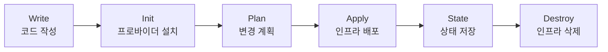

# Terraform 기초

> Infrastructure as Code를 위한 선언적 프로비저닝 도구

## 1. Terraform이란?

### 1-1. 개념

**Terraform**은 HashiCorp에서 개발한 오픈소스 IaC (Infrastructure as Code) 도구다.

**핵심 특징**:

- **선언적 문법**: 원하는 최종 상태를 선언하면 Terraform이 자동으로 리소스 생성 순서를 결정
- **멀티 클라우드**: AWS, GCP, Azure, Kubernetes 등 다양한 프로바이더 지원
- **상태 관리**: terraform.tfstate 파일로 실제 인프라 상태를 추적
- **변경 계획**: `terraform plan`으로 실제 적용 전 변경사항 미리 확인
- **의존성 자동 해결**: 리소스 간 의존성을 자동으로 파악하여 순서대로 생성/삭제

### 1-2. Terraform vs 다른 IaC 도구

| 도구 | 방식 | 언어 | 클라우드 |
|------|------|------|----------|
| **Terraform** | 선언적 | HCL | 멀티 클라우드 |
| **CloudFormation** | 선언적 | JSON/YAML | AWS 전용 |
| **Ansible** | 절차적 | YAML | 멀티 클라우드 |
| **Pulumi** | 선언적 | Python/TS/Go | 멀티 클라우드 |

### 1-3. Terraform 워크플로우



**주요 명령어**:

- `terraform init`: 프로바이더 플러그인 설치 및 백엔드 초기화
- `terraform plan`: 실행 계획 생성 (Dry-run)
- `terraform apply`: 인프라 변경 적용
- `terraform destroy`: 인프라 삭제
- `terraform state`: 상태 파일 관리

---

## 2. 설치 및 환경 구성

### 2-1. Terraform 설치

**macOS**:
```bash
brew tap hashicorp/tap
brew install hashicorp/tap/terraform

# 버전 확인
terraform version
```

**Linux**:
```bash
wget -O- https://apt.releases.hashicorp.com/gpg | sudo gpg --dearmor -o /usr/share/keyrings/hashicorp-archive-keyring.gpg
echo "deb [signed-by=/usr/share/keyrings/hashicorp-archive-keyring.gpg] https://apt.releases.hashicorp.com $(lsb_release -cs) main" | sudo tee /etc/apt/sources.list.d/hashicorp.list
sudo apt update && sudo apt install terraform
```

### 2-2. AWS 자격증명 설정

```bash
# AWS CLI 설치
brew install awscli  # macOS
sudo apt install awscli  # Linux

# 자격증명 설정
aws configure
# AWS Access Key ID: AKIA...
# AWS Secret Access Key: ...
# Default region: ap-northeast-2
# Default output format: json

# 확인
aws sts get-caller-identity
```

---

## 3. HCL 기본 문법

### 3-1. 블록 구조

**기본 형식**:
```hcl
<BLOCK_TYPE> "<BLOCK_LABEL>" "<BLOCK_LABEL>" {
  # Block body
  <IDENTIFIER> = <EXPRESSION>
}
```

**주요 블록 타입**:

| 블록 | 설명 | 예시 |
|------|------|------|
| `terraform` | Terraform 설정 | `required_version`, `backend` |
| `provider` | 프로바이더 설정 | `aws`, `google`, `azurerm` |
| `resource` | 리소스 생성 | `aws_instance`, `aws_s3_bucket` |
| `data` | 데이터 소스 조회 | `aws_ami`, `aws_vpc` |
| `variable` | 입력 변수 정의 | `instance_type`, `region` |
| `output` | 출력 값 정의 | `instance_id`, `public_ip` |
| `module` | 모듈 호출 | `vpc`, `ec2` |
| `locals` | 로컬 변수 | 중간 계산 값 저장 |

### 3-2. 변수 (Variable)

**variables.tf**:
```hcl
variable "region" {
  description = "AWS Region"
  type        = string
  default     = "ap-northeast-2"
}

variable "instance_type" {
  description = "EC2 Instance Type"
  type        = string
  default     = "t3.micro"
}

variable "instance_count" {
  description = "Number of instances"
  type        = number
  default     = 1
}

variable "enable_monitoring" {
  description = "Enable detailed monitoring"
  type        = bool
  default     = false
}

variable "tags" {
  description = "Resource tags"
  type        = map(string)
  default = {
    Environment = "dev"
    Team        = "platform"
  }
}
```

**변수 타입**:

- `string`: 문자열
- `number`: 숫자
- `bool`: 불린
- `list(type)`: 리스트
- `map(type)`: 맵
- `object({...})`: 객체
- `any`: 모든 타입

### 3-3. 출력 (Output)

**outputs.tf**:
```hcl
output "instance_id" {
  description = "EC2 Instance ID"
  value       = aws_instance.web.id
}

output "public_ip" {
  description = "Public IP address"
  value       = aws_instance.web.public_ip
}

output "private_ip" {
  description = "Private IP address"
  value       = aws_instance.web.private_ip
  sensitive   = true  # 출력 시 마스킹
}
```

### 3-4. 로컬 변수 (Locals)

**locals.tf**:
```hcl
locals {
  # 공통 태그
  common_tags = {
    Environment = var.environment
    ManagedBy   = "Terraform"
    Project     = "demo"
  }

  # 리소스 이름 프리픽스
  name_prefix = "${var.environment}-${var.project}"

  # 조건부 값
  instance_type = var.environment == "prod" ? "t3.medium" : "t3.micro"
}

resource "aws_instance" "web" {
  ami           = data.aws_ami.ubuntu.id
  instance_type = local.instance_type

  tags = merge(
    local.common_tags,
    {
      Name = "${local.name_prefix}-web"
    }
  )
}
```

---

## 4. 리소스 정의

### 4-1. EC2 인스턴스

**main.tf**:
```hcl
terraform {
  required_version = ">= 1.0"

  required_providers {
    aws = {
      source  = "hashicorp/aws"
      version = "~> 5.0"
    }
  }
}

provider "aws" {
  region = var.region
}

# Ubuntu AMI 조회
data "aws_ami" "ubuntu" {
  most_recent = true
  owners      = ["099720109477"]  # Canonical

  filter {
    name   = "name"
    values = ["ubuntu/images/hvm-ssd/ubuntu-jammy-22.04-amd64-server-*"]
  }

  filter {
    name   = "virtualization-type"
    values = ["hvm"]
  }
}

# Security Group
resource "aws_security_group" "web" {
  name        = "${var.name_prefix}-web-sg"
  description = "Security group for web server"

  ingress {
    from_port   = 22
    to_port     = 22
    protocol    = "tcp"
    cidr_blocks = ["0.0.0.0/0"]
  }

  ingress {
    from_port   = 80
    to_port     = 80
    protocol    = "tcp"
    cidr_blocks = ["0.0.0.0/0"]
  }

  egress {
    from_port   = 0
    to_port     = 0
    protocol    = "-1"
    cidr_blocks = ["0.0.0.0/0"]
  }

  tags = {
    Name = "${var.name_prefix}-web-sg"
  }
}

# EC2 Instance
resource "aws_instance" "web" {
  ami           = data.aws_ami.ubuntu.id
  instance_type = var.instance_type

  vpc_security_group_ids = [aws_security_group.web.id]

  user_data = <<-EOF
              #!/bin/bash
              apt-get update
              apt-get install -y nginx
              echo "Hello from Terraform!" > /var/www/html/index.html
              systemctl start nginx
              systemctl enable nginx
              EOF

  tags = {
    Name = "${var.name_prefix}-web"
  }
}
```

### 4-2. S3 버킷

```hcl
resource "aws_s3_bucket" "static" {
  bucket = "${var.name_prefix}-static-bucket"

  tags = {
    Name = "${var.name_prefix}-static"
  }
}

resource "aws_s3_bucket_versioning" "static" {
  bucket = aws_s3_bucket.static.id

  versioning_configuration {
    status = "Enabled"
  }
}

resource "aws_s3_bucket_server_side_encryption_configuration" "static" {
  bucket = aws_s3_bucket.static.id

  rule {
    apply_server_side_encryption_by_default {
      sse_algorithm = "AES256"
    }
  }
}

resource "aws_s3_bucket_public_access_block" "static" {
  bucket = aws_s3_bucket.static.id

  block_public_acls       = true
  block_public_policy     = true
  ignore_public_acls      = true
  restrict_public_buckets = true
}
```

---

## 5. 상태 관리

### 5-1. 로컬 상태 파일

**기본 동작**:

- `terraform.tfstate`: 현재 인프라 상태 저장
- `terraform.tfstate.backup`: 이전 상태 백업
- **주의**: `.tfstate` 파일은 Git에 커밋하면 안 됨 (민감 정보 포함)

**.gitignore**:
```
# Terraform
.terraform/
*.tfstate
*.tfstate.*
.terraform.lock.hcl
```

### 5-2. 원격 백엔드 (S3)

**backend.tf**:
```hcl
terraform {
  backend "s3" {
    bucket         = "my-terraform-state-bucket"
    key            = "dev/terraform.tfstate"
    region         = "ap-northeast-2"
    encrypt        = true
    dynamodb_table = "terraform-lock"
  }
}
```

**S3 백엔드 초기 설정**:
```bash
# S3 버킷 생성
aws s3api create-bucket \
  --bucket my-terraform-state-bucket \
  --region ap-northeast-2 \
  --create-bucket-configuration LocationConstraint=ap-northeast-2

# 버전 관리 활성화
aws s3api put-bucket-versioning \
  --bucket my-terraform-state-bucket \
  --versioning-configuration Status=Enabled

# DynamoDB 락 테이블 생성
aws dynamodb create-table \
  --table-name terraform-lock \
  --attribute-definitions AttributeName=LockID,AttributeType=S \
  --key-schema AttributeName=LockID,KeyType=HASH \
  --billing-mode PAY_PER_REQUEST \
  --region ap-northeast-2

# Terraform 초기화
terraform init
```

### 5-3. 상태 명령어

```bash
# 상태 목록 조회
terraform state list

# 특정 리소스 상태 확인
terraform state show aws_instance.web

# 리소스 이름 변경
terraform state mv aws_instance.web aws_instance.app

# 리소스 제거 (실제 리소스는 유지)
terraform state rm aws_instance.web

# 상태 파일 가져오기
terraform state pull > terraform.tfstate.backup

# 상태 파일 올리기
terraform state push terraform.tfstate.backup
```

---

## 6. 모듈

### 6-1. 모듈 구조

```
modules/
└── ec2/
    ├── main.tf       # 리소스 정의
    ├── variables.tf  # 입력 변수
    ├── outputs.tf    # 출력 값
    └── README.md     # 모듈 설명
```

### 6-2. 모듈 작성

**modules/ec2/variables.tf**:
```hcl
variable "instance_name" {
  description = "Instance name"
  type        = string
}

variable "instance_type" {
  description = "Instance type"
  type        = string
  default     = "t3.micro"
}

variable "ami_id" {
  description = "AMI ID"
  type        = string
}

variable "subnet_id" {
  description = "Subnet ID"
  type        = string
}

variable "security_group_ids" {
  description = "Security group IDs"
  type        = list(string)
}
```

**modules/ec2/main.tf**:
```hcl
resource "aws_instance" "this" {
  ami           = var.ami_id
  instance_type = var.instance_type
  subnet_id     = var.subnet_id

  vpc_security_group_ids = var.security_group_ids

  tags = {
    Name = var.instance_name
  }
}
```

**modules/ec2/outputs.tf**:
```hcl
output "instance_id" {
  description = "Instance ID"
  value       = aws_instance.this.id
}

output "private_ip" {
  description = "Private IP"
  value       = aws_instance.this.private_ip
}

output "public_ip" {
  description = "Public IP"
  value       = aws_instance.this.public_ip
}
```

### 6-3. 모듈 사용

**main.tf**:
```hcl
module "web_server" {
  source = "./modules/ec2"

  instance_name       = "web-server"
  instance_type       = "t3.small"
  ami_id              = data.aws_ami.ubuntu.id
  subnet_id           = aws_subnet.public.id
  security_group_ids  = [aws_security_group.web.id]
}

module "app_server" {
  source = "./modules/ec2"

  instance_name       = "app-server"
  instance_type       = "t3.medium"
  ami_id              = data.aws_ami.ubuntu.id
  subnet_id           = aws_subnet.private.id
  security_group_ids  = [aws_security_group.app.id]
}

# 모듈 출력 참조
output "web_server_ip" {
  value = module.web_server.public_ip
}

output "app_server_ip" {
  value = module.app_server.private_ip
}
```

### 6-4. 공개 모듈 사용

**Terraform Registry 모듈**:
```hcl
# VPC 모듈
module "vpc" {
  source  = "terraform-aws-modules/vpc/aws"
  version = "5.1.0"

  name = "my-vpc"
  cidr = "10.0.0.0/16"

  azs             = ["ap-northeast-2a", "ap-northeast-2c"]
  private_subnets = ["10.0.1.0/24", "10.0.2.0/24"]
  public_subnets  = ["10.0.101.0/24", "10.0.102.0/24"]

  enable_nat_gateway = true
  enable_vpn_gateway = false

  tags = {
    Terraform   = "true"
    Environment = "dev"
  }
}
```

---

## 7. 프로바이더

### 7-1. 멀티 프로바이더

```hcl
# AWS 프로바이더 (기본 리전)
provider "aws" {
  region = "ap-northeast-2"
}

# AWS 프로바이더 (서울 리전)
provider "aws" {
  alias  = "seoul"
  region = "ap-northeast-2"
}

# AWS 프로바이더 (버지니아 리전)
provider "aws" {
  alias  = "virginia"
  region = "us-east-1"
}

# 서울 리전에 S3 버킷 생성
resource "aws_s3_bucket" "seoul" {
  provider = aws.seoul
  bucket   = "my-seoul-bucket"
}

# 버지니아 리전에 S3 버킷 생성 (CloudFront용)
resource "aws_s3_bucket" "virginia" {
  provider = aws.virginia
  bucket   = "my-virginia-bucket"
}
```

### 7-2. Kubernetes 프로바이더

```hcl
terraform {
  required_providers {
    kubernetes = {
      source  = "hashicorp/kubernetes"
      version = "~> 2.23"
    }
  }
}

provider "kubernetes" {
  config_path = "~/.kube/config"
}

resource "kubernetes_namespace" "app" {
  metadata {
    name = "my-app"
  }
}

resource "kubernetes_deployment" "nginx" {
  metadata {
    name      = "nginx"
    namespace = kubernetes_namespace.app.metadata[0].name
  }

  spec {
    replicas = 3

    selector {
      match_labels = {
        app = "nginx"
      }
    }

    template {
      metadata {
        labels = {
          app = "nginx"
        }
      }

      spec {
        container {
          image = "nginx:1.25"
          name  = "nginx"

          port {
            container_port = 80
          }
        }
      }
    }
  }
}
```

---

## 8. 실무 Best Practices

### 8-1. 디렉토리 구조

```
project/
├── environments/
│   ├── dev/
│   │   ├── main.tf
│   │   ├── variables.tf
│   │   ├── outputs.tf
│   │   └── terraform.tfvars
│   ├── staging/
│   │   └── ...
│   └── prod/
│       └── ...
├── modules/
│   ├── vpc/
│   ├── ec2/
│   └── rds/
└── .gitignore
```

### 8-2. 변수 파일 관리

**terraform.tfvars** (환경별):
```hcl
# dev/terraform.tfvars
region          = "ap-northeast-2"
instance_type   = "t3.micro"
instance_count  = 1
enable_monitoring = false
```

**secrets.tfvars** (민감 정보, Git 제외):
```hcl
db_password = "super-secret-password"
api_key     = "AKIA..."
```

```bash
# 변수 파일 지정
terraform apply -var-file="terraform.tfvars" -var-file="secrets.tfvars"
```

### 8-3. 코드 포맷팅 및 검증

```bash
# 코드 포맷팅
terraform fmt -recursive

# 문법 검증
terraform validate

# 보안 검사 (tfsec)
brew install tfsec
tfsec .

# 정적 분석 (checkov)
pip install checkov
checkov -d .
```

### 8-4. Plan 파일 활용

```bash
# Plan 파일 생성
terraform plan -out=tfplan

# Plan 파일 확인
terraform show tfplan

# Plan 파일로 적용 (재검증 없이 바로 적용)
terraform apply tfplan
```

### 8-5. 워크스페이스

```bash
# 워크스페이스 생성
terraform workspace new dev
terraform workspace new prod

# 워크스페이스 목록
terraform workspace list

# 워크스페이스 전환
terraform workspace select dev

# 현재 워크스페이스
terraform workspace show
```

**워크스페이스 활용**:
```hcl
locals {
  environment = terraform.workspace

  instance_type = terraform.workspace == "prod" ? "t3.large" : "t3.micro"
}

resource "aws_instance" "web" {
  ami           = data.aws_ami.ubuntu.id
  instance_type = local.instance_type

  tags = {
    Name        = "web-${local.environment}"
    Environment = local.environment
  }
}
```

---

## 참고

- [Terraform 공식 문서](https://developer.hashicorp.com/terraform/docs)
- [Terraform AWS Provider](https://registry.terraform.io/providers/hashicorp/aws/latest/docs)
- [Terraform Registry](https://registry.terraform.io/)
- [Terraform Best Practices](https://www.terraform-best-practices.com/)
