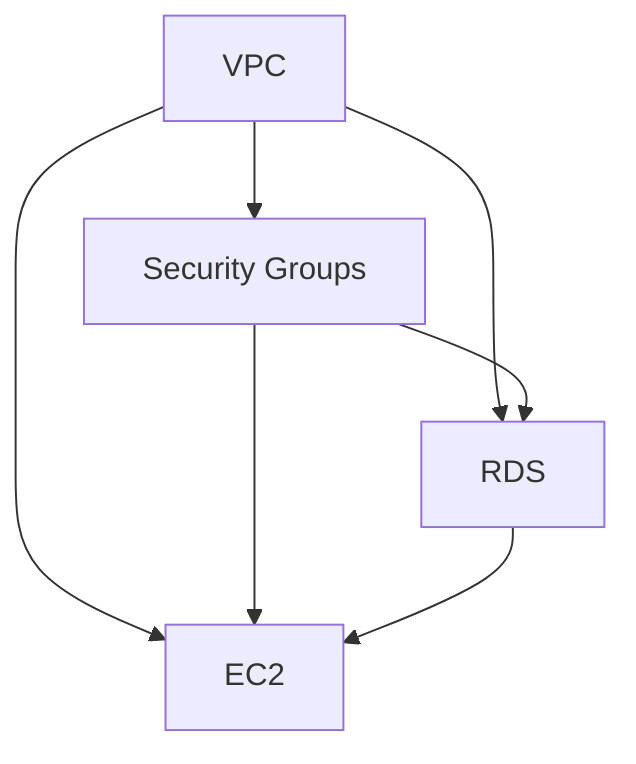
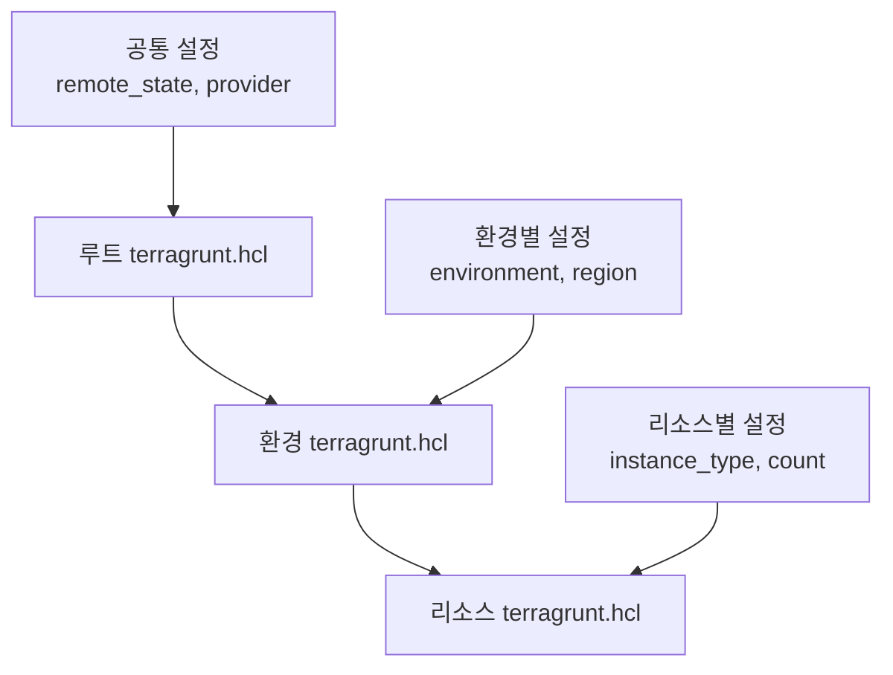

# Terragrunt 고급 활용

> Terraform의 DRY 원칙 구현과 대규모 인프라 관리

## 1. Terragrunt란?

### 1-1. 개념

**Terragrunt**는 Terraform의 얇은 래퍼(thin wrapper)로, Terraform 코드의 중복을 줄이고 대규모 인프라를 효율적으로 관리하기 위한 도구다.

**핵심 기능**:

- **DRY (Don't Repeat Yourself)**: 공통 설정을 한 곳에 정의
- **원격 백엔드 자동 설정**: S3 버킷 및 DynamoDB 테이블 자동 생성
- **의존성 관리**: 모듈 간 의존성 정의 및 순차 실행
- **환경별 변수 관리**: 계층적 변수 상속
- **Before/After Hooks**: 실행 전후 커스텀 명령 실행

### 1-2. Terraform vs Terragrunt

**Terraform만 사용할 때의 문제점**:

```
terraform/
├── dev/
│   ├── vpc/
│   │   ├── backend.tf      # 중복
│   │   ├── provider.tf     # 중복
│   │   └── main.tf
│   └── ec2/
│       ├── backend.tf      # 중복
│       ├── provider.tf     # 중복
│       └── main.tf
└── prod/
    ├── vpc/
    │   ├── backend.tf      # 중복
    │   ├── provider.tf     # 중복
    │   └── main.tf
    └── ec2/
        ├── backend.tf      # 중복
        ├── provider.tf     # 중복
        └── main.tf
```

**Terragrunt 사용 시**:

```
terragrunt/
├── terragrunt.hcl          # 루트 설정 (공통)
├── dev/
│   ├── terragrunt.hcl      # 환경 설정
│   ├── vpc/
│   │   └── terragrunt.hcl  # 모듈 호출
│   └── ec2/
│       └── terragrunt.hcl
└── prod/
    ├── terragrunt.hcl
    ├── vpc/
    │   └── terragrunt.hcl
    └── ec2/
        └── terragrunt.hcl
```

### 1-3. 설치

```bash
# macOS
brew install terragrunt

# Linux
wget https://github.com/gruntwork-io/terragrunt/releases/download/v0.54.0/terragrunt_linux_amd64
chmod +x terragrunt_linux_amd64
sudo mv terragrunt_linux_amd64 /usr/local/bin/terragrunt

# 버전 확인
terragrunt --version
```

---

## 2. 기본 구조

### 2-1. 디렉토리 구조

```
project/
├── terragrunt.hcl                    # 루트 설정
├── _modules/                         # Terraform 모듈
│   ├── vpc/
│   │   ├── main.tf
│   │   ├── variables.tf
│   │   └── outputs.tf
│   └── ec2/
│       ├── main.tf
│       ├── variables.tf
│       └── outputs.tf
└── environments/
    ├── dev/
    │   ├── terragrunt.hcl            # 환경 설정
    │   ├── vpc/
    │   │   └── terragrunt.hcl        # 리소스 설정
    │   └── ec2/
    │       └── terragrunt.hcl
    ├── staging/
    │   └── ...
    └── prod/
        └── ...
```

### 2-2. 루트 terragrunt.hcl

**terragrunt.hcl** (루트):
```hcl
# 원격 백엔드 설정
remote_state {
  backend = "s3"

  generate = {
    path      = "backend.tf"
    if_exists = "overwrite_terragrunt"
  }

  config = {
    bucket         = "my-terraform-state-${get_aws_account_id()}"
    key            = "${path_relative_to_include()}/terraform.tfstate"
    region         = "ap-northeast-2"
    encrypt        = true
    dynamodb_table = "terraform-lock"
  }
}

# 공통 프로바이더 설정
generate "provider" {
  path      = "provider.tf"
  if_exists = "overwrite_terragrunt"
  contents  = <<EOF
provider "aws" {
  region = var.aws_region

  default_tags {
    tags = {
      ManagedBy   = "Terragrunt"
      Environment = var.environment
    }
  }
}
EOF
}

# 공통 변수
inputs = {
  aws_region = "ap-northeast-2"
}
```

### 2-3. 환경별 terragrunt.hcl

**environments/dev/terragrunt.hcl**:
```hcl
# 루트 설정 상속
include "root" {
  path = find_in_parent_folders()
}

# 환경별 변수
inputs = {
  environment   = "dev"
  instance_type = "t3.micro"
}
```

### 2-4. 리소스별 terragrunt.hcl

**environments/dev/vpc/terragrunt.hcl**:
```hcl
# 루트 설정 상속
include "root" {
  path = find_in_parent_folders()
}

# 환경 설정 상속
include "env" {
  path = find_in_parent_folders("terragrunt.hcl")
}

# 모듈 소스
terraform {
  source = "../../../_modules//vpc"
}

# 리소스별 변수
inputs = {
  vpc_name = "dev-vpc"
  vpc_cidr = "10.0.0.0/16"

  azs             = ["ap-northeast-2a", "ap-northeast-2c"]
  private_subnets = ["10.0.1.0/24", "10.0.2.0/24"]
  public_subnets  = ["10.0.101.0/24", "10.0.102.0/24"]

  enable_nat_gateway = true
  single_nat_gateway = true  # dev는 비용 절감
}
```

---

## 3. 의존성 관리

### 3-1. dependency 블록

**environments/dev/ec2/terragrunt.hcl**:
```hcl
include "root" {
  path = find_in_parent_folders()
}

include "env" {
  path = find_in_parent_folders("terragrunt.hcl")
}

terraform {
  source = "../../../_modules//ec2"
}

# VPC에 대한 의존성 정의
dependency "vpc" {
  config_path = "../vpc"

  # VPC가 아직 생성되지 않았을 때 사용할 mock 값
  mock_outputs = {
    vpc_id         = "vpc-00000000"
    public_subnets = ["subnet-00000000"]
  }

  mock_outputs_allowed_terraform_commands = ["validate", "plan"]
}

# VPC 출력 값 사용
inputs = {
  instance_name = "dev-web"
  vpc_id        = dependency.vpc.outputs.vpc_id
  subnet_id     = dependency.vpc.outputs.public_subnets[0]
}
```

### 3-2. dependencies 블록 (순서 지정)

**environments/dev/rds/terragrunt.hcl**:
```hcl
include "root" {
  path = find_in_parent_folders()
}

terraform {
  source = "../../../_modules//rds"
}

# 여러 의존성 정의
dependencies {
  paths = [
    "../vpc",
    "../security-groups"
  ]
}

dependency "vpc" {
  config_path = "../vpc"
}

dependency "sg" {
  config_path = "../security-groups"
}

inputs = {
  vpc_id            = dependency.vpc.outputs.vpc_id
  subnet_ids        = dependency.vpc.outputs.database_subnets
  security_group_id = dependency.sg.outputs.rds_sg_id
}
```

### 3-3. 의존성 그래프



```bash
# 의존성 순서대로 모든 리소스 적용
terragrunt run-all apply

# 의존성 역순으로 모든 리소스 삭제
terragrunt run-all destroy
```

---

## 4. 변수 계층 구조

### 4-1. 계층적 변수 상속



**변수 우선순위** (높은 순서부터):

1. 리소스별 `terragrunt.hcl`의 `inputs`
2. 환경별 `terragrunt.hcl`의 `inputs`
3. 루트 `terragrunt.hcl`의 `inputs`
4. Terraform 모듈의 `default` 값

### 4-2. 환경별 변수 파일

**environments/common.hcl**:
```hcl
locals {
  aws_region = "ap-northeast-2"
  
  common_tags = {
    ManagedBy = "Terragrunt"
    Team      = "Platform"
  }
}
```

**environments/dev/env.hcl**:
```hcl
locals {
  environment   = "dev"
  instance_type = "t3.micro"
  instance_count = 1
}
```

**environments/dev/vpc/terragrunt.hcl**:
```hcl
include "root" {
  path = find_in_parent_folders()
}

# 공통 변수 로드
locals {
  common_vars = read_terragrunt_config(find_in_parent_folders("common.hcl"))
  env_vars    = read_terragrunt_config(find_in_parent_folders("env.hcl"))
}

terraform {
  source = "../../../_modules//vpc"
}

inputs = merge(
  local.common_vars.locals,
  local.env_vars.locals,
  {
    vpc_name = "${local.env_vars.locals.environment}-vpc"
    vpc_cidr = "10.0.0.0/16"
  }
)
```

---

## 5. 고급 기능

### 5-1. Before/After Hooks

```hcl
terraform {
  source = "../../../_modules//vpc"

  # 실행 전 훅
  before_hook "validate_aws_creds" {
    commands = ["apply", "plan"]
    execute  = ["aws", "sts", "get-caller-identity"]
  }

  # 실행 후 훅
  after_hook "notify_slack" {
    commands     = ["apply"]
    execute      = ["./scripts/notify-slack.sh", "VPC created successfully"]
    run_on_error = false
  }
}
```

### 5-2. Extra Arguments

```hcl
# 루트 terragrunt.hcl
terraform {
  extra_arguments "common_vars" {
    commands = get_terraform_commands_that_need_vars()

    arguments = [
      "-var-file=${get_terragrunt_dir()}/../../common.tfvars"
    ]
  }

  extra_arguments "disable_input" {
    commands = [
      "init",
      "apply",
      "destroy",
      "plan"
    ]

    arguments = [
      "-input=false"
    ]
  }

  extra_arguments "auto_approve" {
    commands = ["apply"]

    # CI/CD 환경에서만 자동 승인
    arguments = get_env("CI", "") != "" ? ["-auto-approve"] : []
  }
}
```

### 5-3. 조건부 블록

```hcl
locals {
  environment = "prod"
}

# 프로덕션에서만 백업 활성화
inputs = {
  enable_backup = local.environment == "prod" ? true : false
  backup_retention_days = local.environment == "prod" ? 30 : 7

  # 프로덕션에서만 Multi-AZ
  multi_az = local.environment == "prod" ? true : false
}
```

### 5-4. 동적 블록 생성

```hcl
# S3 버킷 자동 생성
generate "s3_bucket" {
  path      = "s3_bucket.tf"
  if_exists = "overwrite_terragrunt"
  contents  = <<EOF
resource "aws_s3_bucket" "terraform_state" {
  bucket = "terraform-state-${get_aws_account_id()}"

  lifecycle {
    prevent_destroy = true
  }

  tags = {
    Name = "Terraform State Bucket"
  }
}

resource "aws_s3_bucket_versioning" "terraform_state" {
  bucket = aws_s3_bucket.terraform_state.id

  versioning_configuration {
    status = "Enabled"
  }
}
EOF
}
```

---

## 6. 멀티 환경 관리

### 6-1. 환경별 설정

```
environments/
├── dev/
│   ├── terragrunt.hcl          # environment = "dev"
│   ├── vpc/
│   ├── ec2/
│   └── rds/
├── staging/
│   ├── terragrunt.hcl          # environment = "staging"
│   ├── vpc/
│   ├── ec2/
│   └── rds/
└── prod/
    ├── terragrunt.hcl          # environment = "prod"
    ├── vpc/
    ├── ec2/
    └── rds/
```

### 6-2. 환경별 리소스 크기 조정

**environments/prod/terragrunt.hcl**:
```hcl
include "root" {
  path = find_in_parent_folders()
}

inputs = {
  environment = "prod"

  # 프로덕션 스펙
  instance_type  = "t3.large"
  instance_count = 3

  db_instance_class = "db.r6g.large"
  db_allocated_storage = 100

  enable_monitoring = true
  enable_backup     = true
  backup_retention  = 30

  multi_az = true
}
```

**environments/dev/terragrunt.hcl**:
```hcl
include "root" {
  path = find_in_parent_folders()
}

inputs = {
  environment = "dev"

  # 개발 환경 (비용 절감)
  instance_type  = "t3.micro"
  instance_count = 1

  db_instance_class = "db.t4g.micro"
  db_allocated_storage = 20

  enable_monitoring = false
  enable_backup     = false
  backup_retention  = 7

  multi_az = false
}
```

---

## 7. 실무 패턴

### 7-1. run-all 명령어

```bash
# 모든 모듈 초기화
cd environments/dev
terragrunt run-all init

# 모든 모듈 Plan
terragrunt run-all plan

# 모든 모듈 Apply (의존성 순서대로)
terragrunt run-all apply

# 모든 모듈 Destroy (의존성 역순으로)
terragrunt run-all destroy

# 특정 모듈만 적용
cd environments/dev/vpc
terragrunt apply
```

### 7-2. 상태 관리

```bash
# 상태 목록
terragrunt state list

# 상태 Pull
terragrunt state pull

# 리소스 Import
terragrunt import aws_instance.web i-1234567890abcdef0

# 모든 모듈 상태 확인
terragrunt run-all state list
```

### 7-3. 출력 값 확인

```bash
# 단일 모듈 출력
terragrunt output

# 모든 모듈 출력
terragrunt run-all output

# JSON 형식
terragrunt output -json

# 다른 모듈의 출력 참조
terragrunt output -json -state=../vpc/.terragrunt-cache/.../terraform.tfstate
```

### 7-4. 디버깅

```bash
# 디버그 로그 활성화
export TERRAGRUNT_LOG_LEVEL=debug
terragrunt apply

# Terraform 로그도 함께
export TF_LOG=DEBUG
export TERRAGRUNT_LOG_LEVEL=debug
terragrunt apply

# 실행 계획만 확인 (apply 안함)
terragrunt plan --terragrunt-non-interactive
```

---

## 8. Best Practices

### 8-1. 모듈 버전 관리

```hcl
terraform {
  # Git 태그로 버전 고정
  source = "git::https://github.com/myorg/terraform-modules.git//vpc?ref=v1.2.3"

  # 또는 브랜치
  source = "git::https://github.com/myorg/terraform-modules.git//vpc?ref=main"

  # 로컬 모듈 (개발 시)
  source = "../../../_modules//vpc"
}
```

### 8-2. 민감 정보 관리

```hcl
# AWS Secrets Manager에서 값 가져오기
inputs = {
  db_password = run_cmd(
    "aws", "secretsmanager", "get-secret-value",
    "--secret-id", "prod/db/password",
    "--query", "SecretString",
    "--output", "text"
  )
}

# 또는 환경 변수 사용
inputs = {
  db_password = get_env("DB_PASSWORD", "")
}
```

### 8-3. Atlantis 통합

**atlantis.yaml**:
```yaml
version: 3
projects:
- name: dev-vpc
  dir: environments/dev/vpc
  workflow: terragrunt
  autoplan:
    when_modified:
    - "**/*.hcl"
    - "**/*.tf"
  apply_requirements:
  - approved

workflows:
  terragrunt:
    plan:
      steps:
      - run: terragrunt plan -input=false -out=$PLANFILE
    apply:
      steps:
      - run: terragrunt apply $PLANFILE
```

### 8-4. CI/CD 파이프라인

**GitHub Actions**:
```yaml
name: Terragrunt Apply

on:
  push:
    branches:
      - main
    paths:
      - 'environments/**'

jobs:
  terragrunt:
    runs-on: ubuntu-latest

    steps:
    - uses: actions/checkout@v3

    - name: Setup Terraform
      uses: hashicorp/setup-terraform@v2
      with:
        terraform_version: 1.6.0

    - name: Setup Terragrunt
      run: |
        wget https://github.com/gruntwork-io/terragrunt/releases/download/v0.54.0/terragrunt_linux_amd64
        chmod +x terragrunt_linux_amd64
        sudo mv terragrunt_linux_amd64 /usr/local/bin/terragrunt

    - name: Configure AWS Credentials
      uses: aws-actions/configure-aws-credentials@v2
      with:
        aws-access-key-id: ${{ secrets.AWS_ACCESS_KEY_ID }}
        aws-secret-access-key: ${{ secrets.AWS_SECRET_ACCESS_KEY }}
        aws-region: ap-northeast-2

    - name: Terragrunt Plan
      working-directory: environments/dev
      run: terragrunt run-all plan

    - name: Terragrunt Apply
      working-directory: environments/dev
      run: terragrunt run-all apply -auto-approve
```

---

## 9. 트러블슈팅

### 9-1. 캐시 문제

```bash
# Terragrunt 캐시 삭제
find . -type d -name ".terragrunt-cache" -prune -exec rm -rf {} \;

# Terraform 캐시 삭제
find . -type d -name ".terraform" -prune -exec rm -rf {} \;

# 전체 재초기화
terragrunt run-all init -reconfigure
```

### 9-2. 의존성 순환 참조

```bash
# 에러: Cycle detected
# 해결: dependency 블록 제거 또는 데이터 소스 사용

# 잘못된 예
# vpc -> security-group -> ec2 -> vpc (순환!)

# 올바른 예
# vpc -> security-group -> ec2
```

### 9-3. 상태 파일 충돌

```bash
# DynamoDB 락 테이블 확인
aws dynamodb scan --table-name terraform-lock

# 강제 락 해제 (주의!)
terragrunt force-unlock <LOCK_ID>
```

---

## 참고

- [Terragrunt 공식 문서](https://terragrunt.gruntwork.io/docs/)
- [Terragrunt GitHub](https://github.com/gruntwork-io/terragrunt)
- [Gruntwork Library](https://gruntwork.io/repos/)
- [Terragrunt Best Practices](https://blog.gruntwork.io/terragrunt-how-to-keep-your-terraform-code-dry-and-maintainable-f61ae06959d8)
