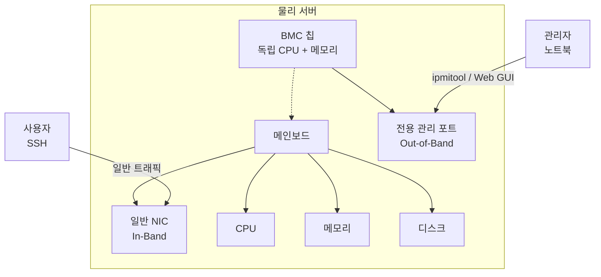
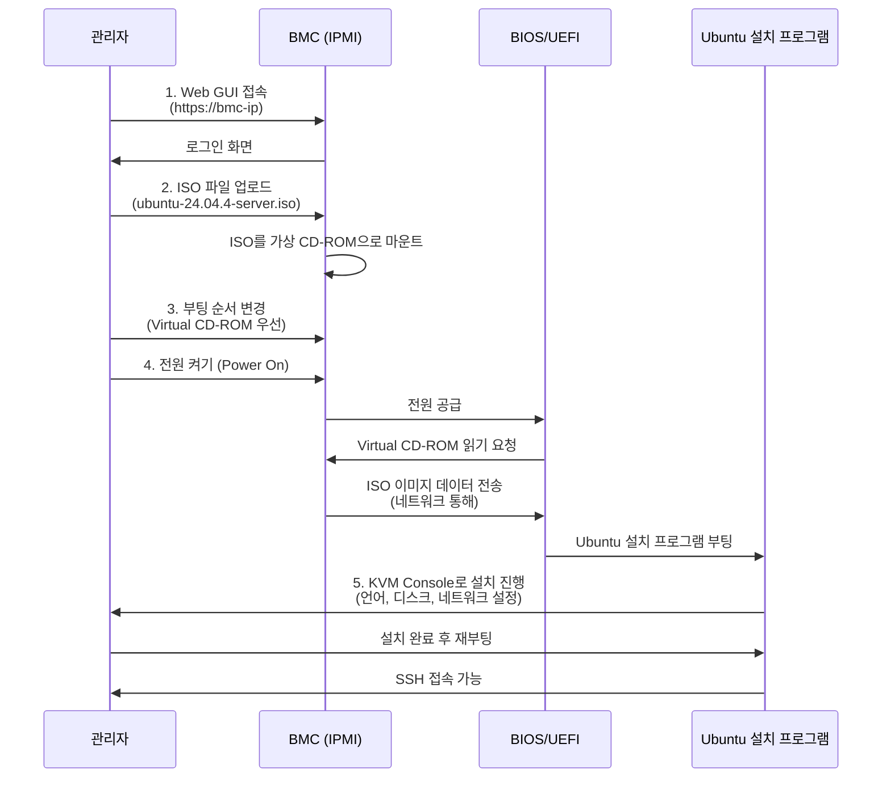
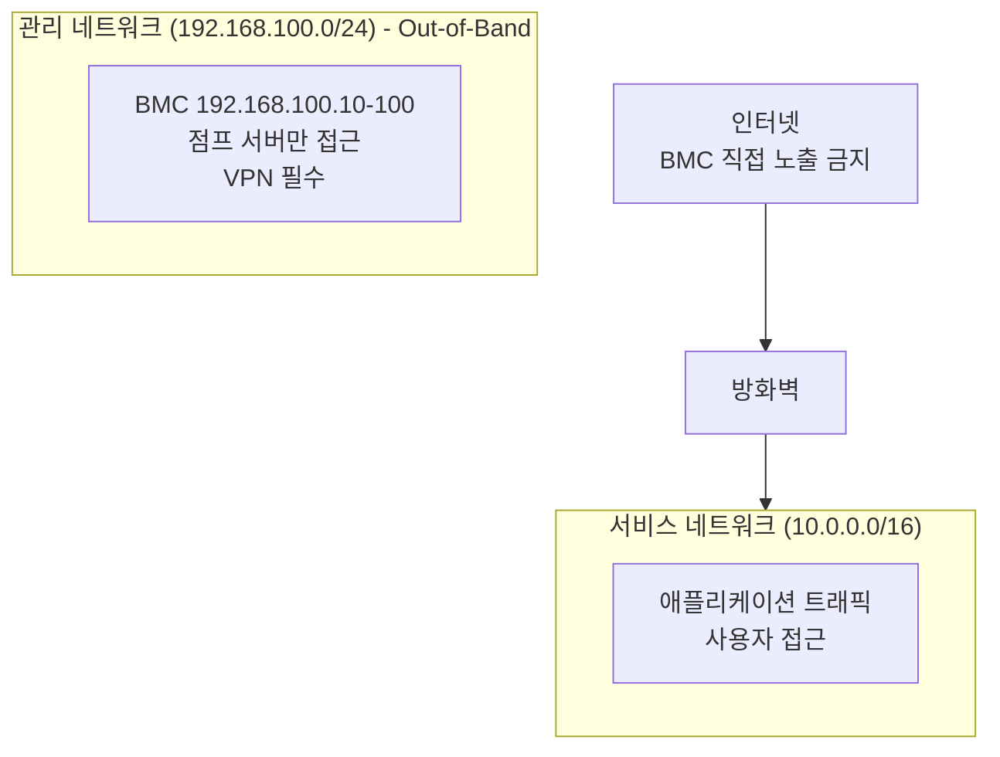
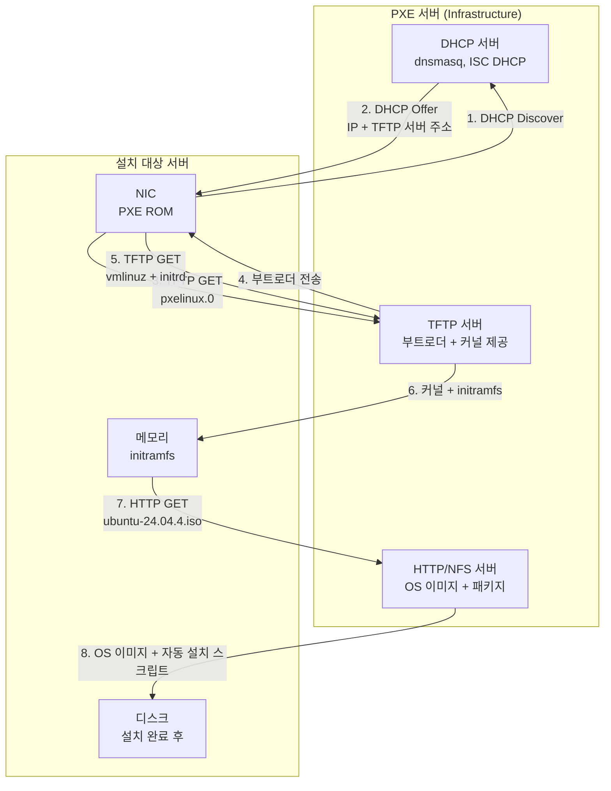
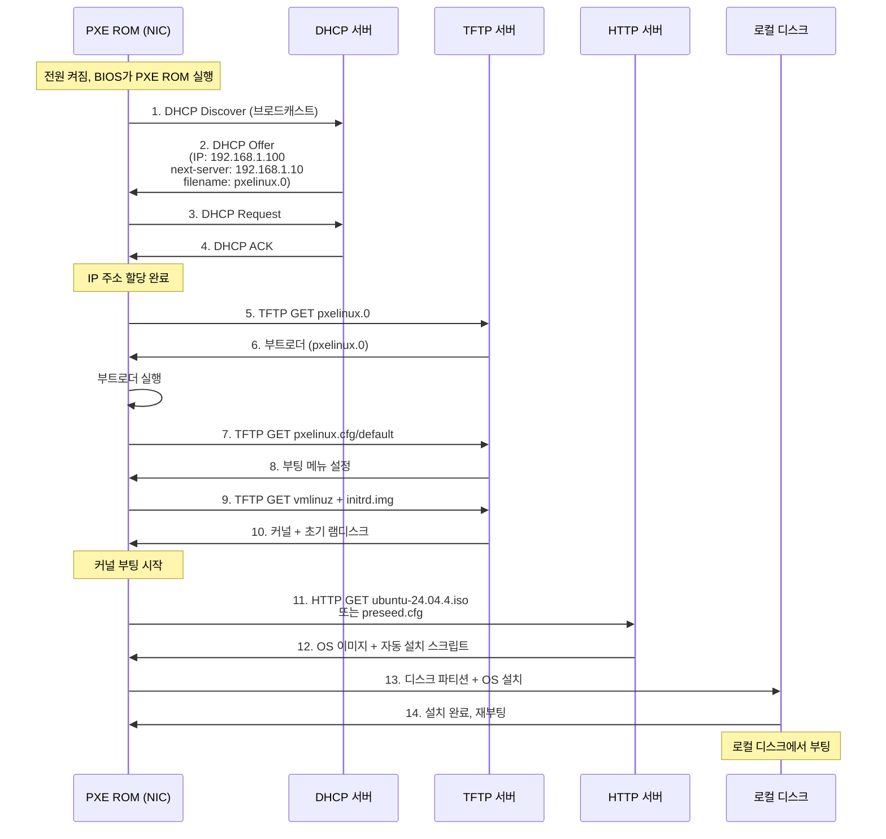

---
tags:
  - Infrastructure
  - Bare Metal
---

# IPMI & PXE

> IPMI를 활용한 원격 베어메탈 서버 관리와 PXE 부팅을 통한 대량 OS 자동 설치 방법을 정리한다.

## 개요

베어메탈 서버를 원격으로 관리하고 대량으로 프로비저닝하기 위한 두 가지 핵심 기술이다. IPMI는 개별 서버의 하드웨어 제어와 원격 설치를 담당하며, PXE는 네트워크 부팅을 통해 수십~수백 대 서버를 자동으로 배포한다.

## IPMI (Intelligent Platform Management Interface)

### 배경 및 필요성

**문제 상황**:
- 데이터센터에 수백 대의 서버가 물리적으로 떨어진 위치에 있음
- 서버 장애 시 현장 방문 없이 전원 재시작, 콘솔 접근, 펌웨어 업데이트 필요
- OS가 부팅 안 되거나 네트워크 장애 시에도 서버 제어 필요

**해결책**:
- BMC(Baseboard Management Controller) - 메인보드에 독립적으로 붙어 있는 전용 칩
- 대기 전원만 들어오면 동작 (서버 꺼져 있어도 OK)
- 전용 관리 포트로 원격 접속 가능

### 아키텍처



**Out-of-Band vs In-Band**:

| 구분 | Out-of-Band (OOB) | In-Band |
|------|-------------------|---------|
| **물리 포트** | 전용 관리 포트 (IPMI) | 일반 NIC (eth0, eth1) |
| **네트워크** | 관리 전용 VLAN | 서비스 네트워크 |
| **OS 의존성** | OS 부팅 전부터 동작 | OS가 떠야 동작 |
| **장애 격리** | OS/네트워크 장애 시에도 접근 가능 | OS/네트워크 장애 시 접근 불가 |

### 주요 기능

| 기능 | 설명 | 사용 시나리오 |
|------|------|--------------|
| **원격 전원 제어** | Power On/Off, Reset, 전원 상태 확인 | 서버 응답 없을 때 강제 재시작 |
| **KVM over IP** | 키보드/비디오/마우스 원격 제어 | BIOS 설정, 부팅 화면 확인 |
| **가상 미디어** | ISO/USB 이미지를 네트워크로 마운트 | OS 설치, 복구 모드 부팅 |
| **센서 모니터링** | 온도, 팬 속도, 전압, 전력 소비 | 하드웨어 이상 징후 감지 |
| **이벤트 로그** | 하드웨어 이벤트 기록 (SEL - System Event Log) | 장애 원인 분석 |
| **펌웨어 업데이트** | BIOS, BMC 펌웨어 원격 업데이트 | 보안 패치, 기능 개선 |

### BMC 상세

**BMC가 서버 꺼져 있어도 동작하는 이유**:

| 구성 요소 | 설명 |
|----------|------|
| **독립 칩** | 메인보드에 별도로 붙어 있는 ARM 기반 SoC (시스템 온 칩) |
| **전용 메모리** | BMC 전용 RAM (보통 512MB~1GB) - 메인 시스템 메모리와 무관 |
| **전용 스토리지** | 펌웨어 저장용 플래시 메모리 (128MB~256MB) |
| **대기 전원** | 서버 전원이 꺼져 있어도 PSU(전원 공급 장치)가 BMC에 5V 대기 전원 공급 |
| **전용 NIC** | 관리 포트에 연결된 독립 이더넷 컨트롤러 |

**전원 상태별 동작**:

| 전원 상태 | 메인 시스템 | BMC | 가능한 작업 |
|----------|------------|-----|------------|
| **AC 전원 연결됨** | OFF | ON (대기 전원) | 전원 켜기, 센서 확인, 이벤트 로그 |
| **서버 부팅 중** | ON (부팅) | ON | KVM 콘솔, BIOS 설정 |
| **OS 실행 중** | ON | ON | 전체 기능 사용 가능 |
| **AC 전원 차단** | OFF | OFF | 아무것도 안 됨 |

**벤더별 BMC 구현체**:

| 벤더 | 이름 | 웹 포트 | 주요 특징 |
|------|------|---------|----------|
| Supermicro | BMC | 443, 5900 (VNC) | 표준 IPMI 준수, MegaRAC 기반 (신형 모델) |
| Gigabyte | MegaRAC SP-X | 443 | HTML5 KVM, Redfish 지원, AMI 기반 |
| Lenovo | XClarity Controller | 443 | Lenovo XClarity 통합 관리 |

### IPMI 동작 흐름 - ISO 마운트 설치



**핵심 과정**:

| 단계 | 동작 | 네트워크 경로 |
|------|------|--------------|
| 1 | BMC Web GUI 접속 | 관리자 PC → 관리 네트워크 → BMC |
| 2 | ISO 업로드 | 관리자 PC → BMC 메모리/스토리지 |
| 3 | Virtual CD-ROM 마운트 | BMC 내부 동작 |
| 4 | 서버 부팅 | BIOS → BMC |
| 5 | OS 설치 | KVM Console (BMC 경유) |

### BMC 접근 방법

**실무에서 사용하는 방법 (우선순위 순)**:

| 방법 | 사용 비중 | 장점 | 사용 시나리오 |
|------|----------|------|--------------|
| **BMC Web GUI** | 90% | 직관적, 그래픽 콘솔, 클릭만으로 모든 기능 | 일상적인 서버 관리, OS 설치, 트러블슈팅 |
| **Redfish API** | 8% | 자동화 가능, JSON 응답, 표준화 | 대량 서버 관리, Ansible/Terraform 통합 |
| **ipmitool CLI** | 2% | 가볍고 빠름 | 레거시 서버, 스크립트 자동화 (Redfish 미지원 시) |

**BMC Web GUI 주요 기능**:

- **Remote Console (KVM)**: 서버 화면을 브라우저에서 원격 제어
- **Virtual Media**: ISO 파일 업로드 및 마운트 (드래그 앤 드롭)
- **전원 제어**: Power On/Off/Reset 버튼 클릭
- **센서 모니터링**: 온도/팬/전압 그래프로 실시간 확인
- **BIOS 설정**: 재부팅 없이 BIOS 설정 변경 가능 (일부 BMC)
- **펌웨어 업데이트**: 웹에서 파일 업로드만으로 업데이트

**ipmitool 명령어 (참고용 - 레거시 서버 또는 스크립트 자동화)**:

```bash
# 서버 전원 켜기
ipmitool -I lanplus -H <bmc-ip> -U admin -P <password> power on

# 센서 정보 확인
ipmitool -I lanplus -H <bmc-ip> -U admin -P <password> sdr list

# 이벤트 로그 확인
ipmitool -I lanplus -H <bmc-ip> -U admin -P <password> sel list
```

**권장**: 신규 서버는 Redfish API 사용, 구형 서버만 ipmitool 사용

### IPMI 보안 취약점 및 대응

**주요 보안 위험**:

| 취약점 | 설명 | 공격 시나리오 |
|--------|------|--------------|
| **기본 계정** | admin/admin, root/calvin (Dell) 등 벤더별 기본 패스워드 | 브루트포스 공격으로 즉시 탈취 가능 |
| **약한 암호화** | IPMI v1.5는 MD5 해시만 사용 (평문 전송) | 네트워크 스니핑으로 패스워드 획득 |
| **CVE 취약점** | Supermicro BMC RCE (CVE-2019-6260 등) | 인증 없이 원격 코드 실행 |
| **네트워크 노출** | 인터넷에 BMC 포트 노출 | Shodan으로 검색 가능, 전 세계에서 접근 |
| **물리 접근** | 서버실 출입 시 관리 포트 직접 연결 | OS 우회하고 서버 완전 제어 |

**보안 모범 사례**:

| 항목 | 권장 설정 | 이유 |
|------|----------|------|
| **네트워크 분리** | BMC 전용 VLAN (Out-of-Band 관리망) | 서비스 네트워크와 격리, VPN/점프 서버를 통해서만 접근 |
| **방화벽** | BMC IP는 관리자 IP에서만 접근 허용 | 0.0.0.0/0 차단 |
| **강력한 패스워드** | 16자 이상, 특수문자 포함 | 브루트포스 방어 |
| **IPMI v2.0** | v1.5 비활성화, RMCP+ 사용 | AES 암호화, SHA-1 인증 |
| **펌웨어 업데이트** | 최신 BMC 펌웨어 유지 | 알려진 CVE 패치 |
| **감사 로그** | BMC 로그인 시도, 전원 변경 이벤트 기록 | 침입 탐지 |

**네트워크 분리 예시**:



**실습 - 보안 설정**:

**권장**: BMC Web GUI에서 설정하는 것이 훨씬 쉽고 직관적이다.

- **패스워드 변경**: Configuration → Users → 계정 선택 → Change Password
- **사용자 관리**: User Management 메뉴에서 클릭만으로 추가/삭제
- **이벤트 로그**: Logs → System Event Log (필터링 및 정렬 기능 제공)

**CLI 참고용** (스크립트 자동화 시):

```bash
# 기본 계정 패스워드 변경
ipmitool -I lanplus -H 192.168.100.10 -U admin -P admin user set password 2 'NewStrongPassword!123'

# 이벤트 로그 확인 (로그인 실패 시도)
ipmitool -I lanplus -H 192.168.100.10 -U admin -P <password> sel list | grep -i fail
```

### Redfish - IPMI의 후속 표준

**IPMI의 한계 및 Redfish 등장 배경**:

| IPMI 문제점 | Redfish 해결책 |
|------------|---------------|
| 바이너리 프로토콜 (사람이 읽기 어려움) | JSON 기반 RESTful API (가독성 높음) |
| UDP 기반 (상태 비저장, 신뢰성 낮음) | HTTP/HTTPS (상태 저장, TLS 암호화) |
| 제한적인 데이터 모델 (벤더 확장 난립) | 표준화된 스키마 (OEM 확장 가능) |
| CLI 도구 의존 (ipmitool) | 웹 브라우저/Postman으로 즉시 테스트 가능 |
| 자동화 어려움 (파싱 복잡) | Ansible/Terraform 등 IaC 도구 쉽게 통합 |

**IPMI vs Redfish 비교**:

| 구분 | IPMI | Redfish |
|------|------|---------|
| **프로토콜** | RMCP (UDP 623) | HTTP/HTTPS |
| **데이터 형식** | 바이너리 | JSON |
| **인증** | MD5/SHA-1 (약함) | OAuth 2.0, Session Token (강함) |
| **표준화 기구** | Intel (1998년) | DMTF (2014년) |
| **벤더 지원** | 모든 서버 | 2016년 이후 서버 (Dell 14세대+, HP Gen10+) |
| **자동화** | 복잡 (파싱 필요) | 쉬움 (JSON, API) |

**Redfish API 예시**:

```bash
# 시스템 정보 조회
curl -k -u admin:password https://192.168.100.10/redfish/v1/Systems/System.Embedded.1

# 응답 (JSON):
{
  "Id": "System.Embedded.1",
  "Name": "System",
  "Model": "PowerEdge R760",
  "Manufacturer": "Dell Inc.",
  "PowerState": "On",
  "Status": {
    "Health": "OK",
    "State": "Enabled"
  },
  "ProcessorSummary": {
    "Count": 2,
    "Model": "Intel Xeon Gold 6430"
  },
  "MemorySummary": {
    "TotalSystemMemoryGiB": 512
  }
}

# 전원 켜기 (POST 요청)
curl -k -u admin:password -X POST \
  https://192.168.100.10/redfish/v1/Systems/System.Embedded.1/Actions/ComputerSystem.Reset \
  -H "Content-Type: application/json" \
  -d '{"ResetType": "On"}'

# 센서 정보 조회 (온도)
curl -k -u admin:password https://192.168.100.10/redfish/v1/Chassis/System.Embedded.1/Thermal

# 펌웨어 버전 확인
curl -k -u admin:password https://192.168.100.10/redfish/v1/UpdateService/FirmwareInventory
```

**대량 서버 자동화 예시 (Ansible)**:

```yaml
# playbook.yml
- name: 100대 서버 전원 켜기
  hosts: all
  tasks:
    - name: Power On via Redfish
      uri:
        url: "https://{{ inventory_hostname }}/redfish/v1/Systems/System.Embedded.1/Actions/ComputerSystem.Reset"
        method: POST
        user: admin
        password: "{{ bmc_password }}"
        body_format: json
        body:
          ResetType: "On"
        validate_certs: no
      delegate_to: localhost

# 실행
ansible-playbook -i inventory.ini playbook.yml

# 100대 서버가 동시에 부팅됨 (10초 내 완료)
```

**Redfish vs IPMI 자동화 비교**:

```bash
# IPMI (복잡, 에러 처리 어려움)
for ip in 192.168.100.{10..110}; do
  ipmitool -I lanplus -H $ip -U admin -P password power on 2>&1 | grep -v "Error"
done

# Redfish (간단, HTTP 상태 코드로 에러 확인)
for ip in 192.168.100.{10..110}; do
  curl -k -u admin:password -X POST \
    https://$ip/redfish/v1/Systems/System.Embedded.1/Actions/ComputerSystem.Reset \
    -d '{"ResetType": "On"}' -w "HTTP %{http_code}\n"
done
```

**Redfish 장점 요약**:

| 시나리오 | IPMI | Redfish |
|----------|------|---------|
| **수동 테스트** | ipmitool 명령 외우기 | 브라우저로 JSON 탐색 |
| **자동화** | 파싱 복잡, Ansible 모듈 제한적 | uri 모듈 직접 사용, Terraform 지원 |
| **대량 작업** | 순차 실행 (느림) | 병렬 HTTP 요청 (빠름) |
| **에러 처리** | 바이너리 응답 파싱 | HTTP 상태 코드 (200/404/500) |
| **보안** | MD5 해시 | OAuth 2.0, TLS 1.3 |

**현재 상황**:
- 신규 서버: Redfish + IPMI 병행 지원 (하위 호환)
- 레거시 서버: IPMI만 지원
- 권장: Redfish API 우선 사용, 구형 서버만 ipmitool 사용

## PXE (Preboot Execution Environment)

### 배경 및 필요성

**문제 상황**:
- GPU 클러스터 구축 시 동일한 OS 이미지를 100대 서버에 설치해야 함
- IPMI로 서버마다 ISO 마운트 + 수동 설치 = 며칠 소요
- 설치 후 서버마다 설정이 미묘하게 다르면 (패키지 버전, 커널 파라미터) 디버깅 지옥

**해결책**:
- PXE 부팅: 로컬 디스크 없이 네트워크에서 부트로더/커널/초기 파일시스템 다운로드
- 중앙화된 이미지 배포: DHCP + TFTP + HTTP 서버 조합
- 자동화: Kickstart/Preseed로 무인 설치 (사람 개입 없음)

### 아키텍처



### PXE 부팅 흐름



**단계별 상세**:

| 단계 | 프로토콜 | 전송 내용 | 크기 | 설명 |
|------|----------|-----------|------|------|
| 1-4 | DHCP | IP 주소 + TFTP 서버 정보 | ~500 bytes | PXE ROM이 네트워크 설정 받음 |
| 5-6 | TFTP | pxelinux.0 (부트로더) | ~40 KB | SYSLINUX 기반 부트로더 |
| 7-8 | TFTP | pxelinux.cfg/default | ~1 KB | 부팅 메뉴 (커널 경로, 파라미터) |
| 9-10 | TFTP | vmlinuz + initrd.img | ~100 MB | Linux 커널 + 초기 램디스크 |
| 11-12 | HTTP/NFS | ubuntu-24.04.4.iso | ~2 GB | OS 이미지 전체 (TFTP는 너무 느림) |
| 13 | 로컬 | 디스크 쓰기 | ~10 GB | 실제 OS 설치 |

### DHCP Option 66, 67

**PXE 부팅에 필수적인 DHCP 옵션**:

| DHCP Option | 이름 | 값 예시 | 역할 |
|-------------|------|---------|------|
| **Option 66** | TFTP Server Name | 192.168.1.10 또는 pxe.example.com | TFTP 서버 주소 (next-server 대체) |
| **Option 67** | Bootfile Name | pxelinux.0 (Legacy) 또는 grubx64.efi (UEFI) | 부트로더 파일명 |

**DHCP Offer 패킷 구조**:

```
DHCP Offer 예시:
Message type: Boot Reply
Your IP: 192.168.1.100           ← 클라이언트에게 할당할 IP
DHCP Server: 192.168.1.10
Option 53: DHCP Offer
Option 54: Server Identifier (192.168.1.10)
Option 66: TFTP Server (192.168.1.10)  ← PXE ROM이 이 주소로 접속
Option 67: pxelinux.0                   ← 이 파일 다운로드
```

**dnsmasq 설정 예시**:

```bash
# Option 66 (next-server)
dhcp-boot=pxelinux.0,pxeserver,192.168.1.10
#          ↑ Option 67  ↑ 서버명    ↑ Option 66

# 또는 명시적으로
dhcp-option=66,192.168.1.10
dhcp-option=67,pxelinux.0
```

**ISC DHCP 설정 예시**:

```bash
subnet 192.168.1.0 netmask 255.255.255.0 {
  range 192.168.1.100 192.168.1.200;
  option subnet-mask 255.255.255.0;
  option routers 192.168.1.1;
  next-server 192.168.1.10;          # Option 66
  filename "pxelinux.0";             # Option 67
}
```

### UEFI PXE vs Legacy PXE

**차이점**:

| 구분 | Legacy PXE (BIOS) | UEFI PXE |
|------|-------------------|----------|
| **펌웨어** | BIOS (1980년대) | UEFI (2000년대 이후) |
| **부트로더** | pxelinux.0 (SYSLINUX) | grubx64.efi (GRUB2) |
| **아키텍처** | 16비트 리얼 모드 | 64비트 프로텍티드 모드 |
| **파티션 방식** | MBR (2TB 제한) | GPT (무제한) |
| **보안 부팅** | 미지원 | Secure Boot 지원 |
| **네트워크 스택** | PXE ROM (느림) | UEFI HTTP Boot (빠름) |
| **부팅 속도** | 느림 (BIOS POST) | 빠름 |
| **Option 67** | pxelinux.0 | grubx64.efi 또는 shimx64.efi |

**UEFI HTTP Boot (iPXE)**:

```
UEFI PXE는 TFTP 대신 HTTP로 직접 부팅 가능:
1. DHCP → IP 할당 + HTTP 서버 주소
2. HTTP GET http://192.168.1.10/grubx64.efi
3. HTTP GET http://192.168.1.10/ubuntu-24.04.4.iso
→ TFTP보다 10배 이상 빠름
```

**최신 서버 동향**:

| 서버 세대 | 기본 부팅 모드 | 비고 |
|----------|---------------|------|
| 2015년 이전 | Legacy BIOS | Dell 12세대, HP Gen8 이하 |
| 2015-2020 | UEFI | Dell 13-14세대, HP Gen9-Gen10 |
| 2020년 이후 | UEFI Only (Legacy 제거) | Dell 15세대+, HP Gen10+ |

**PXE 서버 설정 (UEFI + Legacy 동시 지원)**:

```bash
# dnsmasq - 클라이언트 아키텍처에 따라 다른 부트로더 제공
dhcp-match=set:efi-x86_64,option:client-arch,7   # UEFI x64
dhcp-match=set:efi-x86_64,option:client-arch,9   # UEFI x64 (HTTP)
dhcp-match=set:bios,option:client-arch,0         # Legacy BIOS

dhcp-boot=tag:efi-x86_64,grubx64.efi,pxeserver,192.168.1.10
dhcp-boot=tag:bios,pxelinux.0,pxeserver,192.168.1.10
```

**TFTP 디렉터리 구조 (UEFI + Legacy)**:

```
/var/lib/tftpboot/
├── pxelinux.0                    # Legacy 부트로더
├── ldlinux.c32
├── grubx64.efi                   # UEFI 부트로더
├── shimx64.efi                   # Secure Boot용 Shim
├── pxelinux.cfg/
│   └── default                   # Legacy 부팅 메뉴
└── grub/
    └── grub.cfg                  # UEFI 부팅 메뉴
```

### PXE 서버 구성 예시

**DHCP 설정 (dnsmasq)**:
```bash
# /etc/dnsmasq.conf
interface=eth0
dhcp-range=192.168.1.100,192.168.1.200,12h
dhcp-boot=pxelinux.0,pxeserver,192.168.1.10
enable-tftp
tftp-root=/var/lib/tftpboot
```

**TFTP 디렉터리 구조**:
```
/var/lib/tftpboot/
├── pxelinux.0                    # SYSLINUX 부트로더
├── ldlinux.c32                   # 라이브러리
├── pxelinux.cfg/
│   └── default                   # 부팅 메뉴 설정
└── ubuntu-24.04/
    ├── vmlinuz                   # Linux 커널
    └── initrd.img                # 초기 램디스크
```

**부팅 메뉴 (pxelinux.cfg/default)**:
```
DEFAULT ubuntu-install
LABEL ubuntu-install
    KERNEL ubuntu-24.04/vmlinuz
    APPEND initrd=ubuntu-24.04/initrd.img ip=dhcp url=http://192.168.1.10/ubuntu-24.04.4-server.iso autoinstall ds=nocloud-net;s=http://192.168.1.10/preseed/
```

**자동 설치 (Preseed/Cloud-init)**:
```yaml
# /var/www/html/preseed/user-data
#cloud-config
autoinstall:
  version: 1
  locale: en_US.UTF-8
  keyboard:
    layout: us
  storage:
    layout:
      name: lvm
  identity:
    hostname: gpu-node-01
    username: ubuntu
    password: $6$hashed_password
  ssh:
    install-server: true
  packages:
    - nvidia-driver-550
    - cuda-toolkit-12-4
    - docker.io
  late-commands:
    - echo "GRUB_CMDLINE_LINUX_DEFAULT=\"quiet splash intel_iommu=on iommu=pt\"" > /target/etc/default/grub
    - curtin in-target --target=/target -- update-grub
```

## IPMI vs PXE 비교

| 구분 | IPMI | PXE |
|------|--------------------------------------------------|-------------------------------------|
| **목적** | 서버 하드웨어 원격 관리 및 제어 | 네트워크 부팅을 통한 OS 설치/배포 |
| **동작 계층** | BMC - 독립적인 칩 | BIOS/UEFI 펌웨어 기능 |
| **네트워크** | 전용 관리 포트 (Out-of-Band) | 일반 NIC (In-Band) |
| **전원 상태** | 서버 꺼져 있어도 동작 (대기 전원만 필요) | 서버 켜져 있어야 함 (부팅 시점) |
| **사용 사례** | 서버 전원 제어, 콘솔 접근, 센서 모니터링, ISO 마운트 | 대량 서버 자동 설치, 디스크리스 부팅 |
| **확장성** | 서버 1대당 1개 BMC (1:1) | DHCP/TFTP 서버 1개로 수백 대 관리 (1:N) |
| **의존성** | 독립 동작 (OS 무관) | DHCP, TFTP, HTTP/NFS 서버 필요 |
| **대표 구현** | Supermicro IPMI, MegaRAC (AMI), XClarity (Lenovo) | MAAS, Cobbler, Foreman, Ironic |

## 실습: Ubuntu 24.04.4 설치

### 실습 1: IPMI ISO 마운트 설치

**환경**:

- 서버: Supermicro (BMC: IPMI 2.0)

- OS: Ubuntu 24.04.4 LTS Server

- 네트워크: 관리 포트 192.168.100.10

**과정**:

| 단계 | 동작 |
|------|------|
| 1 | https://192.168.100.10 접속 (BMC Web GUI) |
| 2 | Virtual Console 실행 (HTML5 KVM) |
| 3 | Virtual Media → Connect Virtual Media |
| 4 | Map CD/DVD → ubuntu-24.04.4-live-server-amd64.iso 선택 |
| 5 | Boot Sequence → Virtual CD/ROM 1순위 → Apply |
| 6 | Power On 또는 Reset |
| 7 | GRUB 메뉴 → "Install Ubuntu Server" 선택 |
| 8 | 언어, 키보드, 네트워크, 디스크 파티션 설정 |
| 9 | 사용자 계정 생성, OpenSSH 설치 선택 |
| 10 | 설치 완료 후 재부팅 |

**설치 후 검증**:
```bash
ssh ubuntu@192.168.1.100
uname -a
# Linux gpu-node-01 6.8.0-51-generic x86_64 Ubuntu 24.04.4 LTS
```

### 실습 3: PXE 재설치

**환경**:

- PXE 서버: 192.168.1.10 (DHCP + TFTP + HTTP)

- 설치 대상: 동일 서버 (IPMI로 설치했던 것)

- 자동화: Cloud-init autoinstall

**과정**:

| 단계 | 동작 |
|------|------|
| 1 | BIOS 진입 (F2 또는 Del) → Boot Sequence 변경 |
| 2 | Network Boot (PXE IPv4) → 1순위로 이동 → Save & Exit |
| 3 | 재부팅 → PXE ROM 실행 |
| 4 | DHCP → IP 할당 받음 (192.168.1.150) |
| 5 | TFTP → pxelinux.0 다운로드 |
| 6 | TFTP → vmlinuz + initrd 다운로드 |
| 7 | 커널 부팅 → HTTP에서 ISO + preseed 받아서 자동 설치 |
| 8 | 10분 후 설치 완료, 재부팅 |
| 9 | 로컬 디스크에서 부팅 (PXE 건너뜀) |

**자동 설치 검증**:
```bash
ssh ubuntu@192.168.1.150
cat /etc/hostname
# gpu-node-01

dpkg -l | grep nvidia-driver
# nvidia-driver-550

cat /proc/cmdline
# ... intel_iommu=on iommu=pt ...
```

## 핵심 요약

| 구분 | IPMI | PXE |
|------|------|-----|
| **한 줄 정의** | 서버 하드웨어를 원격으로 제어하는 독립 칩 | 네트워크에서 부팅해서 OS를 자동 설치하는 메커니즘 |
| **언제 쓰나** | 서버 1~10대, 긴급 복구, OS 없이 제어 | 대규모 클러스터 구축, 동일 이미지 대량 배포 |
| **필수 조건** | BMC 관리 포트 + 대기 전원 | DHCP/TFTP/HTTP 서버 + 네트워크 부팅 활성화 |
| **장점** | 간단, OS 무관, 하드웨어 직접 제어 | 자동화, 확장성, 설정 일관성 |
| **단점** | 확장성 없음, 수동 작업 | 인프라 복잡도, 네트워크 의존성 |

**실전 조합**:

1. IPMI로 100대 서버 전원 켜기 (스크립트로 자동화)

2. PXE로 동시에 Ubuntu 24.04.4 + NVIDIA 드라이버 설치

3. 설치 완료 후 Ansible로 추가 설정 (K8s, DOCA-OFED, ROCm)

4. 문제 생기면 IPMI로 개별 서버 디버깅

## 참고 자료 {: .no-toc }

- [IPMI Specification v2.0](https://www.intel.com/content/www/us/en/products/docs/servers/ipmi/ipmi-second-gen-interface-spec-v2-rev1-1.html)
- [PXE Specification](http://www.pix.net/software/pxeboot/archive/pxespec.pdf)
- [Ubuntu Server Autoinstall](https://ubuntu.com/server/docs/install/autoinstall)
- [MAAS (Metal as a Service)](https://maas.io/)
