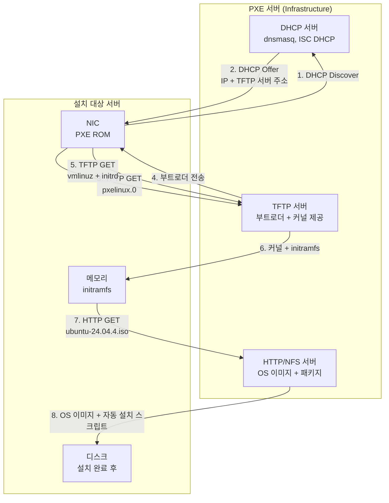
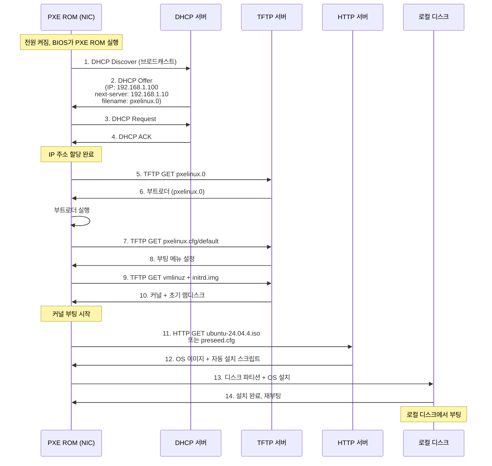

---
tags:
  - Infrastructure
  - Bare Metal
---

# PXE (Preboot Execution Environment)

> PXE 부팅을 통한 대량 OS 자동 설치 방법을 정리한다.

네트워크 부팅을 통해 수십~수백 대 서버를 자동으로 배포한다. DHCP + TFTP + HTTP 서버 조합으로 중앙화된 이미지를 배포하며, Kickstart/Preseed로 무인 설치가 가능하다.

## 배경 및 필요성

**문제 상황**:
- GPU 클러스터 구축 시 동일한 OS 이미지를 100대 서버에 설치해야 함
- IPMI로 서버마다 ISO 마운트 + 수동 설치 = 며칠 소요
- 설치 후 서버마다 설정이 미묘하게 다르면 (패키지 버전, 커널 파라미터) 디버깅 지옥

**해결책**:
- PXE 부팅: 로컬 디스크 없이 네트워크에서 부트로더/커널/초기 파일시스템 다운로드
- 중앙화된 이미지 배포: DHCP + TFTP + HTTP 서버 조합
- 자동화: Kickstart/Preseed로 무인 설치 (사람 개입 없음)

## 아키텍처



## PXE 부팅 흐름



**단계별 상세**:

| 단계 | 프로토콜 | 전송 내용 | 크기 | 설명 |
|------|----------|-----------|------|------|
| 1-4 | DHCP | IP 주소 + TFTP 서버 정보 | ~500 bytes | PXE ROM이 네트워크 설정 받음 |
| 5-6 | TFTP | pxelinux.0 (부트로더) | ~40 KB | SYSLINUX 기반 부트로더 |
| 7-8 | TFTP | pxelinux.cfg/default | ~1 KB | 부팅 메뉴 (커널 경로, 파라미터) |
| 9-10 | TFTP | vmlinuz + initrd.img | ~100 MB | Linux 커널 + 초기 램디스크 |
| 11-12 | HTTP/NFS | ubuntu-24.04.4.iso | ~2 GB | OS 이미지 전체 (TFTP는 너무 느림) |
| 13 | 로컬 | 디스크 쓰기 | ~10 GB | 실제 OS 설치 |

## DHCP Option 66, 67

**PXE 부팅에 필수적인 DHCP 옵션**:

| DHCP Option | 이름 | 값 예시 | 역할 |
|-------------|------|---------|------|
| **Option 66** | TFTP Server Name | 192.168.1.10 또는 pxe.example.com | TFTP 서버 주소 (next-server 대체) |
| **Option 67** | Bootfile Name | pxelinux.0 (Legacy) 또는 grubx64.efi (UEFI) | 부트로더 파일명 |

**DHCP Offer 패킷 구조**:

```
DHCP Offer 예시:
Message type: Boot Reply
Your IP: 192.168.1.100           ← 클라이언트에게 할당할 IP
DHCP Server: 192.168.1.10
Option 53: DHCP Offer
Option 54: Server Identifier (192.168.1.10)
Option 66: TFTP Server (192.168.1.10)  ← PXE ROM이 이 주소로 접속
Option 67: pxelinux.0                   ← 이 파일 다운로드
```

**dnsmasq 설정 예시**:

```bash
# Option 66 (next-server)
dhcp-boot=pxelinux.0,pxeserver,192.168.1.10
#          ↑ Option 67  ↑ 서버명    ↑ Option 66

# 또는 명시적으로
dhcp-option=66,192.168.1.10
dhcp-option=67,pxelinux.0
```

**ISC DHCP 설정 예시**:

```bash
subnet 192.168.1.0 netmask 255.255.255.0 {
  range 192.168.1.100 192.168.1.200;
  option subnet-mask 255.255.255.0;
  option routers 192.168.1.1;
  next-server 192.168.1.10;          # Option 66
  filename "pxelinux.0";             # Option 67
}
```

## UEFI PXE vs Legacy PXE

**차이점**:

| 구분 | Legacy PXE (BIOS) | UEFI PXE |
|------|-------------------|----------|
| **펌웨어** | BIOS (1980년대) | UEFI (2000년대 이후) |
| **부트로더** | pxelinux.0 (SYSLINUX) | grubx64.efi (GRUB2) |
| **아키텍처** | 16비트 리얼 모드 | 64비트 프로텍티드 모드 |
| **파티션 방식** | MBR (2TB 제한) | GPT (무제한) |
| **보안 부팅** | 미지원 | Secure Boot 지원 |
| **네트워크 스택** | PXE ROM (느림) | UEFI HTTP Boot (빠름) |
| **부팅 속도** | 느림 (BIOS POST) | 빠름 |
| **Option 67** | pxelinux.0 | grubx64.efi 또는 shimx64.efi |

**UEFI HTTP Boot (iPXE)**:

```
UEFI PXE는 TFTP 대신 HTTP로 직접 부팅 가능:
1. DHCP → IP 할당 + HTTP 서버 주소
2. HTTP GET http://192.168.1.10/grubx64.efi
3. HTTP GET http://192.168.1.10/ubuntu-24.04.4.iso
→ TFTP보다 10배 이상 빠름
```

**최신 서버 동향**:

| 서버 세대 | 기본 부팅 모드 | 비고 |
|----------|---------------|------|
| 2015년 이전 | Legacy BIOS | Dell 12세대, HP Gen8 이하 |
| 2015-2020 | UEFI | Dell 13-14세대, HP Gen9-Gen10 |
| 2020년 이후 | UEFI Only (Legacy 제거) | Dell 15세대+, HP Gen10+ |

**PXE 서버 설정 (UEFI + Legacy 동시 지원)**:

```bash
# dnsmasq - 클라이언트 아키텍처에 따라 다른 부트로더 제공
dhcp-match=set:efi-x86_64,option:client-arch,7   # UEFI x64
dhcp-match=set:efi-x86_64,option:client-arch,9   # UEFI x64 (HTTP)
dhcp-match=set:bios,option:client-arch,0         # Legacy BIOS

dhcp-boot=tag:efi-x86_64,grubx64.efi,pxeserver,192.168.1.10
dhcp-boot=tag:bios,pxelinux.0,pxeserver,192.168.1.10
```

**TFTP 디렉터리 구조 (UEFI + Legacy)**:

```
/var/lib/tftpboot/
├── pxelinux.0                    # Legacy 부트로더
├── ldlinux.c32
├── grubx64.efi                   # UEFI 부트로더
├── shimx64.efi                   # Secure Boot용 Shim
├── pxelinux.cfg/
│   └── default                   # Legacy 부팅 메뉴
└── grub/
    └── grub.cfg                  # UEFI 부팅 메뉴
```

## PXE 서버 구성 예시

**DHCP 설정 (dnsmasq)**:

```bash
# /etc/dnsmasq.conf
interface=eth0
dhcp-range=192.168.1.100,192.168.1.200,12h
dhcp-boot=pxelinux.0,pxeserver,192.168.1.10
enable-tftp
tftp-root=/var/lib/tftpboot
```

**TFTP 디렉터리 구조**:

```
/var/lib/tftpboot/
├── pxelinux.0                    # SYSLINUX 부트로더
├── ldlinux.c32                   # 라이브러리
├── pxelinux.cfg/
│   └── default                   # 부팅 메뉴 설정
└── ubuntu-24.04/
    ├── vmlinuz                   # Linux 커널
    └── initrd.img                # 초기 램디스크
```

**부팅 메뉴 (pxelinux.cfg/default)**:

```
DEFAULT ubuntu-install
LABEL ubuntu-install
    KERNEL ubuntu-24.04/vmlinuz
    APPEND initrd=ubuntu-24.04/initrd.img ip=dhcp url=http://192.168.1.10/ubuntu-24.04.4-server.iso autoinstall ds=nocloud-net;s=http://192.168.1.10/preseed/
```

**자동 설치 (Preseed/Cloud-init)**:

```yaml
# /var/www/html/preseed/user-data
#cloud-config
autoinstall:
  version: 1
  locale: en_US.UTF-8
  keyboard:
    layout: us
  storage:
    layout:
      name: lvm
  identity:
    hostname: gpu-node-01
    username: ubuntu
    password: $6$hashed_password
  ssh:
    install-server: true
  packages:
    - nvidia-driver-550
    - cuda-toolkit-12-4
    - docker.io
  late-commands:
    - echo "GRUB_CMDLINE_LINUX_DEFAULT=\"quiet splash intel_iommu=on iommu=pt\"" > /target/etc/default/grub
    - curtin in-target --target=/target -- update-grub
```

## IPMI vs PXE 비교

| 구분 | IPMI | PXE |
|------|--------------------------------------------------|-------------------------------------|
| **목적** | 서버 하드웨어 원격 관리 및 제어 | 네트워크 부팅을 통한 OS 설치/배포 |
| **동작 계층** | BMC - 독립적인 칩 | BIOS/UEFI 펌웨어 기능 |
| **네트워크** | 전용 관리 포트 (Out-of-Band) | 일반 NIC (In-Band) |
| **전원 상태** | 서버 꺼져 있어도 동작 (대기 전원만 필요) | 서버 켜져 있어야 함 (부팅 시점) |
| **사용 사례** | 서버 전원 제어, 콘솔 접근, 센서 모니터링, ISO 마운트 | 대량 서버 자동 설치, 디스크리스 부팅 |
| **확장성** | 서버 1대당 1개 BMC (1:1) | DHCP/TFTP 서버 1개로 수백 대 관리 (1:N) |
| **의존성** | 독립 동작 (OS 무관) | DHCP, TFTP, HTTP/NFS 서버 필요 |
| **대표 구현** | Supermicro IPMI, MegaRAC (AMI), XClarity (Lenovo) | MAAS, Cobbler, Foreman, Ironic |

## 실습: PXE 재설치

**환경**:

- PXE 서버: 192.168.1.10 (DHCP + TFTP + HTTP)

- 설치 대상: 동일 서버 (IPMI로 설치했던 것)

- 자동화: Cloud-init autoinstall

**과정**:

- **1**: BIOS 진입 (F2 또는 Del) → Boot Sequence 변경
- **2**: Network Boot (PXE IPv4) → 1순위로 이동 → Save & Exit
- **3**: 재부팅 → PXE ROM 실행
- **4**: DHCP → IP 할당 받음 (192.168.1.150)
- **5**: TFTP → pxelinux.0 다운로드
- **6**: TFTP → vmlinuz + initrd 다운로드
- **7**: 커널 부팅 → HTTP에서 ISO + preseed 받아서 자동 설치
- **8**: 10분 후 설치 완료, 재부팅
- **9**: 로컬 디스크에서 부팅 (PXE 건너뜀)

**자동 설치 검증**:

```bash
ssh ubuntu@192.168.1.150
cat /etc/hostname
# gpu-node-01

dpkg -l | grep nvidia-driver
# nvidia-driver-550

cat /proc/cmdline
# ... intel_iommu=on iommu=pt ...
```

## 핵심 요약

| 구분 | IPMI | PXE |
|------|------|-----|
| **한 줄 정의** | 서버 하드웨어를 원격으로 제어하는 독립 칩 | 네트워크에서 부팅해서 OS를 자동 설치하는 메커니즘 |
| **언제 쓰나** | 서버 1~10대, 긴급 복구, OS 없이 제어 | 대규모 클러스터 구축, 동일 이미지 대량 배포 |
| **필수 조건** | BMC 관리 포트 + 대기 전원 | DHCP/TFTP/HTTP 서버 + 네트워크 부팅 활성화 |
| **장점** | 간단, OS 무관, 하드웨어 직접 제어 | 자동화, 확장성, 설정 일관성 |
| **단점** | 확장성 없음, 수동 작업 | 인프라 복잡도, 네트워크 의존성 |

**실전 조합**:

1. IPMI로 100대 서버 전원 켜기 (스크립트로 자동화)

2. PXE로 동시에 Ubuntu 24.04.4 + NVIDIA 드라이버 설치

3. 설치 완료 후 Ansible로 추가 설정 (K8s, DOCA-OFED, ROCm)

4. 문제 생기면 IPMI로 개별 서버 디버깅

## 참고

- [PXE Specification](http://www.pix.net/software/pxeboot/archive/pxespec.pdf)
- [Ubuntu Server Autoinstall](https://ubuntu.com/server/docs/install/autoinstall)
- [MAAS (Metal as a Service)](https://maas.io/)
- [IPMI Specification v2.0](https://www.intel.com/content/www/us/en/products/docs/servers/ipmi/ipmi-second-gen-interface-spec-v2-rev1-1.html)
