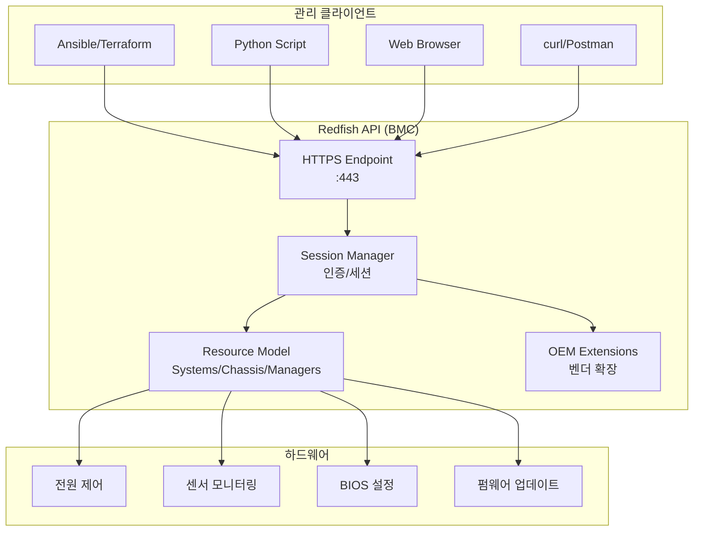

---
tags:
  - Infrastructure
  - Bare Metal
  - API
---

# Redfish

> RESTful API 기반 차세대 서버 하드웨어 관리 표준이다.

IPMI의 후속 표준으로, JSON 기반 RESTful API를 통해 서버 하드웨어를 관리한다. HTTP/HTTPS를 사용하며, 자동화 도구와의 통합이 쉽고 보안성이 강화되었다.

## 배경 및 필요성

**IPMI의 한계**:

| IPMI 문제점 | 영향 |
|------------|------|
| 바이너리 프로토콜 | 사람이 읽기 어려움, 디버깅 복잡 |
| UDP 기반 (RMCP) | 상태 비저장, 신뢰성 낮음, 방화벽 통과 어려움 |
| 제한적인 데이터 모델 | 벤더별 확장 난립, 표준화 부족 |
| CLI 도구 의존 (ipmitool) | 스크립트 파싱 복잡, 자동화 어려움 |
| 약한 보안 | MD5/SHA-1 인증, 평문 전송 위험 |

**Redfish 해결책**:

| Redfish 특징 | 장점 |
|-------------|------|
| JSON 기반 RESTful API | 가독성 높음, 웹 브라우저/Postman으로 즉시 테스트 |
| HTTP/HTTPS | 상태 저장, TLS 암호화, 방화벽 친화적 |
| 표준화된 스키마 | DMTF 표준, 벤더 간 일관성, OEM 확장 가능 |
| API 우선 설계 | Ansible/Terraform 등 IaC 도구 쉽게 통합 |
| OAuth 2.0, Session Token | 강력한 인증, 세션 관리 |

## IPMI vs Redfish 비교

| 구분 | IPMI | Redfish |
|------|------|---------|
| **프로토콜** | RMCP (UDP 623) | HTTP/HTTPS (포트 443) |
| **데이터 형식** | 바이너리 | JSON |
| **인증** | MD5/SHA-1 (약함) | OAuth 2.0, Session Token (강함) |
| **암호화** | 선택 사항 (IPMI v2.0에서 AES) | TLS 1.2/1.3 기본 |
| **표준화 기구** | Intel (1998년) | DMTF (2014년) |
| **벤더 지원** | 모든 서버 | 2016년 이후 서버 (Dell 14세대+, HP Gen10+, Supermicro X11+) |
| **자동화** | 복잡 (파싱 필요) | 쉬움 (JSON, REST API) |
| **상태 모델** | Stateless | Stateful (세션 기반) |
| **에러 처리** | 바이너리 응답 | HTTP 상태 코드 (200/404/500) |

## 아키텍처



## Redfish 리소스 모델

**핵심 엔드포인트**:

| 리소스 | URI | 설명 |
|--------|-----|------|
| **Service Root** | `/redfish/v1/` | API 진입점, 버전 정보 |
| **Systems** | `/redfish/v1/Systems/` | 서버 시스템 (CPU, 메모리, 부팅) |
| **Chassis** | `/redfish/v1/Chassis/` | 물리 섀시 (전원, 온도, 팬) |
| **Managers** | `/redfish/v1/Managers/` | BMC 자체 (펌웨어, 네트워크) |
| **SessionService** | `/redfish/v1/SessionService/` | 세션 관리 (로그인/로그아웃) |
| **UpdateService** | `/redfish/v1/UpdateService/` | 펌웨어 업데이트 |
| **AccountService** | `/redfish/v1/AccountService/` | 사용자 계정 관리 |

**계층 구조**:

```
/redfish/v1/
├── Systems/
│   └── System.Embedded.1/
│       ├── Processors/
│       ├── Memory/
│       ├── EthernetInterfaces/
│       ├── Storage/
│       └── Actions/
│           └── ComputerSystem.Reset
├── Chassis/
│   └── System.Embedded.1/
│       ├── Power/
│       ├── Thermal/
│       └── Sensors/
└── Managers/
    └── iDRAC.Embedded.1/
        ├── NetworkProtocol/
        ├── VirtualMedia/
        └── LogServices/
```

## Redfish API 사용법

### 1. 인증 및 세션

**기본 인증** (Basic Auth):

```bash
curl -k -u admin:password https://192.168.100.10/redfish/v1/Systems
```

**세션 기반 인증** (권장):

```bash
# 1. 세션 생성
curl -k -X POST https://192.168.100.10/redfish/v1/SessionService/Sessions \
  -H "Content-Type: application/json" \
  -d '{"UserName": "admin", "Password": "password"}' \
  -D headers.txt

# 응답 헤더에서 X-Auth-Token 추출
# X-Auth-Token: 1a2b3c4d5e6f...

# 2. 세션 토큰으로 요청
curl -k https://192.168.100.10/redfish/v1/Systems \
  -H "X-Auth-Token: 1a2b3c4d5e6f..."

# 3. 세션 종료
curl -k -X DELETE https://192.168.100.10/redfish/v1/SessionService/Sessions/1a2b3c4d \
  -H "X-Auth-Token: 1a2b3c4d5e6f..."
```

### 2. 시스템 정보 조회

**시스템 목록**:

```bash
curl -k -u admin:password https://192.168.100.10/redfish/v1/Systems

# 응답:
{
  "@odata.type": "#ComputerSystemCollection.ComputerSystemCollection",
  "Members": [
    {
      "@odata.id": "/redfish/v1/Systems/System.Embedded.1"
    }
  ],
  "Members@odata.count": 1
}
```

**시스템 상세 정보**:

```bash
curl -k -u admin:password https://192.168.100.10/redfish/v1/Systems/System.Embedded.1

# 응답:
{
  "Id": "System.Embedded.1",
  "Name": "System",
  "SystemType": "Physical",
  "Model": "PowerEdge R760",
  "Manufacturer": "Dell Inc.",
  "SKU": "1234567",
  "SerialNumber": "ABCD123",
  "PowerState": "On",
  "Status": {
    "Health": "OK",
    "State": "Enabled"
  },
  "ProcessorSummary": {
    "Count": 2,
    "Model": "Intel Xeon Gold 6430"
  },
  "MemorySummary": {
    "TotalSystemMemoryGiB": 512
  },
  "Boot": {
    "BootSourceOverrideEnabled": "Once",
    "BootSourceOverrideTarget": "Pxe"
  }
}
```

### 3. 전원 제어

**전원 상태 확인**:

```bash
curl -k -u admin:password https://192.168.100.10/redfish/v1/Systems/System.Embedded.1 \
  | jq '.PowerState'

# 출력: "On" 또는 "Off"
```

**전원 켜기**:

```bash
curl -k -u admin:password -X POST \
  https://192.168.100.10/redfish/v1/Systems/System.Embedded.1/Actions/ComputerSystem.Reset \
  -H "Content-Type: application/json" \
  -d '{"ResetType": "On"}'
```

**전원 끄기 (Graceful Shutdown)**:

```bash
curl -k -u admin:password -X POST \
  https://192.168.100.10/redfish/v1/Systems/System.Embedded.1/Actions/ComputerSystem.Reset \
  -H "Content-Type: application/json" \
  -d '{"ResetType": "GracefulShutdown"}'
```

**강제 재시작**:

```bash
curl -k -u admin:password -X POST \
  https://192.168.100.10/redfish/v1/Systems/System.Embedded.1/Actions/ComputerSystem.Reset \
  -H "Content-Type: application/json" \
  -d '{"ResetType": "ForceRestart"}'
```

**ResetType 옵션**:

| 값 | 설명 | 사용 시나리오 |
|----|------|--------------|
| `On` | 전원 켜기 | 서버 시작 |
| `ForceOff` | 강제 전원 끄기 | 응답 없는 서버 강제 종료 |
| `GracefulShutdown` | OS 정상 종료 | 안전한 종료 (OS가 살아 있을 때) |
| `ForceRestart` | 강제 재시작 | 빠른 재부팅 (응답 없을 때) |
| `GracefulRestart` | OS 정상 재시작 | 안전한 재부팅 |
| `Nmi` | NMI 신호 전송 | 커널 덤프 수집 |

### 4. 센서 모니터링

**온도 센서**:

```bash
curl -k -u admin:password https://192.168.100.10/redfish/v1/Chassis/System.Embedded.1/Thermal

# 응답:
{
  "Temperatures": [
    {
      "Name": "CPU1 Temp",
      "ReadingCelsius": 45,
      "UpperThresholdCritical": 95,
      "Status": {
        "Health": "OK",
        "State": "Enabled"
      }
    },
    {
      "Name": "Inlet Temp",
      "ReadingCelsius": 22,
      "UpperThresholdCritical": 42,
      "Status": {
        "Health": "OK",
        "State": "Enabled"
      }
    }
  ],
  "Fans": [
    {
      "Name": "Fan1",
      "Reading": 4200,
      "ReadingUnits": "RPM",
      "Status": {
        "Health": "OK",
        "State": "Enabled"
      }
    }
  ]
}
```

**전력 소비**:

```bash
curl -k -u admin:password https://192.168.100.10/redfish/v1/Chassis/System.Embedded.1/Power

# 응답:
{
  "PowerControl": [
    {
      "PowerConsumedWatts": 350,
      "PowerCapacityWatts": 800,
      "PowerMetrics": {
        "AverageConsumedWatts": 320,
        "MaxConsumedWatts": 450
      }
    }
  ]
}
```

### 5. 부팅 순서 변경

**현재 부팅 설정 확인**:

```bash
curl -k -u admin:password https://192.168.100.10/redfish/v1/Systems/System.Embedded.1 \
  | jq '.Boot'

# 출력:
{
  "BootSourceOverrideEnabled": "Disabled",
  "BootSourceOverrideTarget": "None",
  "BootSourceOverrideTarget@Redfish.AllowableValues": [
    "None", "Pxe", "Cd", "Usb", "Hdd", "BiosSetup", "Utilities"
  ]
}
```

**PXE 부팅 설정** (1회만):

```bash
curl -k -u admin:password -X PATCH \
  https://192.168.100.10/redfish/v1/Systems/System.Embedded.1 \
  -H "Content-Type: application/json" \
  -d '{
    "Boot": {
      "BootSourceOverrideEnabled": "Once",
      "BootSourceOverrideTarget": "Pxe"
    }
  }'
```

### 6. 펌웨어 관리

**펌웨어 인벤토리 조회**:

```bash
curl -k -u admin:password https://192.168.100.10/redfish/v1/UpdateService/FirmwareInventory

# 응답:
{
  "Members": [
    {
      "@odata.id": "/redfish/v1/UpdateService/FirmwareInventory/BIOS"
    },
    {
      "@odata.id": "/redfish/v1/UpdateService/FirmwareInventory/BMC"
    }
  ]
}

# BIOS 버전 확인
curl -k -u admin:password https://192.168.100.10/redfish/v1/UpdateService/FirmwareInventory/BIOS

# 응답:
{
  "Id": "BIOS",
  "Name": "BIOS",
  "Version": "2.18.1",
  "Updateable": true,
  "Status": {
    "Health": "OK",
    "State": "Enabled"
  }
}
```

## Ansible 자동화

### 대량 서버 전원 제어

```yaml
# power_on.yml
- name: 100대 서버 전원 켜기
  hosts: all
  gather_facts: no
  vars:
    bmc_username: admin
    bmc_password: "{{ vault_bmc_password }}"
  
  tasks:
    - name: Power On via Redfish
      uri:
        url: "https://{{ inventory_hostname }}/redfish/v1/Systems/System.Embedded.1/Actions/ComputerSystem.Reset"
        method: POST
        user: "{{ bmc_username }}"
        password: "{{ bmc_password }}"
        body_format: json
        body:
          ResetType: "On"
        validate_certs: no
        status_code: [200, 204]
      delegate_to: localhost

# 실행
ansible-playbook -i inventory.ini power_on.yml

# 100대 서버가 동시에 부팅됨 (10초 내 완료)
```

### 센서 모니터링

```yaml
# check_temperature.yml
- name: 서버 온도 확인
  hosts: all
  gather_facts: no
  
  tasks:
    - name: Get Thermal Data
      uri:
        url: "https://{{ inventory_hostname }}/redfish/v1/Chassis/System.Embedded.1/Thermal"
        method: GET
        user: admin
        password: "{{ bmc_password }}"
        return_content: yes
        validate_certs: no
      register: thermal_data
      delegate_to: localhost
    
    - name: Check CPU Temperature
      debug:
        msg: "CPU 온도: {{ item.ReadingCelsius }}°C"
      loop: "{{ thermal_data.json.Temperatures }}"
      when: "'CPU' in item.Name"
    
    - name: Alert if over 80°C
      fail:
        msg: "경고: {{ item.Name }} 온도가 {{ item.ReadingCelsius }}°C로 너무 높습니다!"
      loop: "{{ thermal_data.json.Temperatures }}"
      when: item.ReadingCelsius > 80
```

### PXE 부팅 자동화

```yaml
# pxe_boot.yml
- name: PXE 부팅 설정 및 재부팅
  hosts: new_servers
  gather_facts: no
  
  tasks:
    - name: Set PXE Boot Once
      uri:
        url: "https://{{ inventory_hostname }}/redfish/v1/Systems/System.Embedded.1"
        method: PATCH
        user: admin
        password: "{{ bmc_password }}"
        body_format: json
        body:
          Boot:
            BootSourceOverrideEnabled: "Once"
            BootSourceOverrideTarget: "Pxe"
        validate_certs: no
      delegate_to: localhost
    
    - name: Reboot Server
      uri:
        url: "https://{{ inventory_hostname }}/redfish/v1/Systems/System.Embedded.1/Actions/ComputerSystem.Reset"
        method: POST
        user: admin
        password: "{{ bmc_password }}"
        body_format: json
        body:
          ResetType: "ForceRestart"
        validate_certs: no
      delegate_to: localhost
```

## Python 자동화

```python
# redfish_power_control.py
import requests
import json
from requests.auth import HTTPBasicAuth

class RedfishClient:
    def __init__(self, host, username, password):
        self.base_url = f"https://{host}/redfish/v1"
        self.auth = HTTPBasicAuth(username, password)
        self.session = requests.Session()
        self.session.verify = False  # 프로덕션에서는 인증서 검증 필요
    
    def get_system_info(self):
        """시스템 정보 조회"""
        response = self.session.get(
            f"{self.base_url}/Systems/System.Embedded.1",
            auth=self.auth
        )
        return response.json()
    
    def power_on(self):
        """전원 켜기"""
        response = self.session.post(
            f"{self.base_url}/Systems/System.Embedded.1/Actions/ComputerSystem.Reset",
            auth=self.auth,
            headers={"Content-Type": "application/json"},
            data=json.dumps({"ResetType": "On"})
        )
        return response.status_code == 204
    
    def get_temperature(self):
        """온도 센서 조회"""
        response = self.session.get(
            f"{self.base_url}/Chassis/System.Embedded.1/Thermal",
            auth=self.auth
        )
        data = response.json()
        temps = []
        for sensor in data.get("Temperatures", []):
            temps.append({
                "name": sensor["Name"],
                "reading": sensor["ReadingCelsius"],
                "status": sensor["Status"]["Health"]
            })
        return temps

# 사용 예시
if __name__ == "__main__":
    client = RedfishClient("192.168.100.10", "admin", "password")
    
    # 시스템 정보
    info = client.get_system_info()
    print(f"모델: {info['Model']}")
    print(f"전원 상태: {info['PowerState']}")
    
    # 온도 확인
    temps = client.get_temperature()
    for temp in temps:
        print(f"{temp['name']}: {temp['reading']}°C ({temp['status']})")
    
    # 전원 켜기
    if info['PowerState'] == 'Off':
        if client.power_on():
            print("서버 전원 켜기 성공")
```

## Redfish vs IPMI 실무 비교

| 시나리오 | IPMI | Redfish |
|----------|------|---------|
| **수동 테스트** | ipmitool 명령 외우기 | 브라우저로 JSON 탐색 (https://bmc-ip/redfish/v1) |
| **자동화** | 파싱 복잡, Ansible 모듈 제한적 | uri 모듈 직접 사용, Terraform 지원 |
| **대량 작업** | 순차 실행 (느림) | 병렬 HTTP 요청 (빠름) |
| **에러 처리** | 바이너리 응답 파싱 | HTTP 상태 코드 (200/404/500) |
| **보안** | MD5 해시 | OAuth 2.0, TLS 1.3 |
| **디버깅** | tcpdump로 바이너리 분석 | 브라우저 개발자 도구, Postman |
| **문서화** | 벤더별 명령어 문서 | OpenAPI 스키마 제공 |

**권장 사용 전략**:

| 서버 연식 | 1순위 | 2순위 | 비고 |
|----------|------|------|------|
| **2016년 이후** | Redfish API | BMC Web GUI | ipmitool 사용 안 함 |
| **2010~2015년** | BMC Web GUI | ipmitool | Redfish 미지원 가능 |
| **2010년 이전** | ipmitool | BMC Web GUI | 레거시 서버 |

## 보안 모범 사례

| 항목 | 권장 설정 | 이유 |
|------|----------|------|
| **HTTPS 필수** | TLS 1.2 이상 활성화 | 중간자 공격 방지 |
| **인증서 검증** | 자체 서명 인증서 대신 CA 발급 인증서 사용 | 프로덕션 환경에서 검증 필수 |
| **세션 타임아웃** | 30분 이내 | 유휴 세션 자동 종료 |
| **OAuth 2.0** | 가능하면 OAuth 사용 | Basic Auth보다 안전 |
| **API Rate Limiting** | BMC에서 지원 시 활성화 | 브루트포스 공격 방지 |
| **감사 로그** | API 호출 로그 수집 | 누가 무엇을 했는지 추적 |

## 참고

- [Redfish Specification](https://www.dmtf.org/standards/redfish)
- [Redfish API Emulator](https://github.com/DMTF/Redfish-Interface-Emulator)
- [Dell iDRAC Redfish API](https://www.dell.com/support/manuals/en-us/idrac9-lifecycle-controller-v5.x-series/idrac9_5.00.00.00_redfishapiguide/)
- [HP iLO 5 Redfish API](https://hewlettpackard.github.io/ilo-rest-api-docs/)
