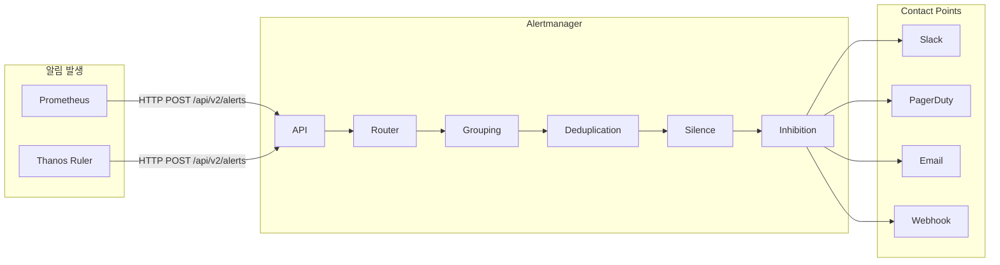

---
tags:
  - Monitoring
  - Alertmanager
---

# Alertmanager

> Prometheus에서 발생한 알림을 수신해 그룹핑·라우팅·중복 제거 후 실제 알림 채널로 전달하는 컴포넌트다.

---

## 개요

Alertmanager는 Prometheus의 알림 전송을 전담하는 독립 컴포넌트다. Prometheus는 Rule을 평가해 알림을 발생시키는 역할만 하고, 알림을 누구에게 어떻게 전달할지는 Alertmanager가 처리한다. 중복 알림 제거, 알림 그룹핑, 일시 중단(Silence), 억제(Inhibition) 기능을 제공한다.

---

## 아키텍처



---

## 핵심 기능

**Grouping (그룹핑)**: 유사한 알림을 하나의 알림으로 묶어 전송한다. 클러스터 장애 시 수백 개의 알림이 동시에 발생해도 `alertname`, `cluster`, `namespace` 단위로 묶어 하나의 메시지로 보낸다.

**Deduplication (중복 제거)**: 동일한 알림이 반복 전송될 때 중복을 제거한다. Prometheus HA 구성 시 복수의 Prometheus가 동일한 알림을 보내더라도 한 번만 전달된다.

**Routing (라우팅)**: 알림 레이블을 기반으로 수신자를 결정한다. `severity=critical`은 PagerDuty로, `severity=warning`은 Slack으로, 팀별 레이블에 따라 담당 채널로 각각 전달한다.

**Silence (묵음)**: 유지보수 기간 동안 특정 알림을 일시적으로 차단한다. 레이블 매처로 대상을 지정하고 기간을 설정한다.

**Inhibition (억제)**: 상위 레벨 알림이 발생하면 하위 알림을 억제한다. 클러스터 전체 장애 알림이 발생하면 개별 노드 알림을 억제해 알림 홍수를 방지한다.

---

## 설정 파일 구조

```yaml
global:
  resolve_timeout: 5m
  slack_api_url: 'https://hooks.slack.com/services/...'

route:
  # 기본 그룹핑 키
  group_by: ['alertname', 'cluster', 'namespace']
  group_wait: 30s        # 그룹 첫 알림 대기 시간 (추가 알림 수집)
  group_interval: 5m     # 동일 그룹 재알림 간격
  repeat_interval: 12h   # 해소되지 않은 알림 재전송 간격
  receiver: 'slack-default'

  routes:
  # Critical 알림은 PagerDuty로
  - match:
      severity: critical
    receiver: 'pagerduty-critical'
    group_wait: 10s

  # 특정 팀은 별도 채널로
  - match_re:
      team: 'infra|platform'
    receiver: 'slack-infra'

receivers:
- name: 'slack-default'
  slack_configs:
  - channel: '#alerts'
    title: '{{ .GroupLabels.alertname }}'
    text: '{{ range .Alerts }}{{ .Annotations.description }}{{ end }}'

- name: 'pagerduty-critical'
  pagerduty_configs:
  - routing_key: '<integration-key>'

- name: 'slack-infra'
  slack_configs:
  - channel: '#infra-alerts'

inhibit_rules:
- source_match:
    severity: 'critical'
  target_match:
    severity: 'warning'
  equal: ['alertname', 'cluster', 'namespace']
```

---

## Prometheus Alerting Rule

Alertmanager는 Prometheus Rule에서 생성된 알림을 수신한다.

```yaml
groups:
- name: kubernetes.rules
  rules:
  - alert: PodCrashLooping
    expr: rate(kube_pod_container_status_restarts_total[15m]) > 0
    for: 15m
    labels:
      severity: warning
      team: platform
    annotations:
      summary: "Pod {{ $labels.pod }} is crash looping"
      description: "Pod {{ $labels.namespace }}/{{ $labels.pod }} has restarted {{ $value }} times in 15m"

  - alert: NodeMemoryPressure
    expr: node_memory_MemAvailable_bytes / node_memory_MemTotal_bytes < 0.1
    for: 5m
    labels:
      severity: critical
    annotations:
      summary: "Node {{ $labels.instance }} memory < 10%"
```

`for` 필드는 조건이 지속되어야 하는 시간이다. 순간적인 스파이크로 인한 알림 오발을 방지한다.

---

## HA 구성

Alertmanager는 Gossip 프로토콜(memberlist)로 클러스터를 구성한다. 복수의 Alertmanager 인스턴스가 동일한 알림을 수신하더라도 클러스터 내에서 협의해 한 번만 전송한다.

```bash
alertmanager \
  --cluster.listen-address=0.0.0.0:9094 \
  --cluster.peer=alertmanager-1:9094 \
  --cluster.peer=alertmanager-2:9094
```

Prometheus는 모든 Alertmanager 인스턴스에 동시에 알림을 전송하고, Alertmanager 클러스터가 중복 제거를 처리한다.

---

## Kubernetes 설치

kube-prometheus-stack에 기본 포함된다. 별도 설치 시:

```bash
helm install alertmanager prometheus-community/alertmanager \
  --namespace monitoring \
  --set config.global.slack_api_url='https://hooks.slack.com/...'
```

---

## 참고

- [Alertmanager 공식 문서](https://prometheus.io/docs/alerting/latest/alertmanager/)
- [Alertmanager 설정 레퍼런스](https://prometheus.io/docs/alerting/latest/configuration/)
- [알림 라우팅 시각화 도구](https://prometheus.io/webtools/alerting/routing-tree-editor/)
