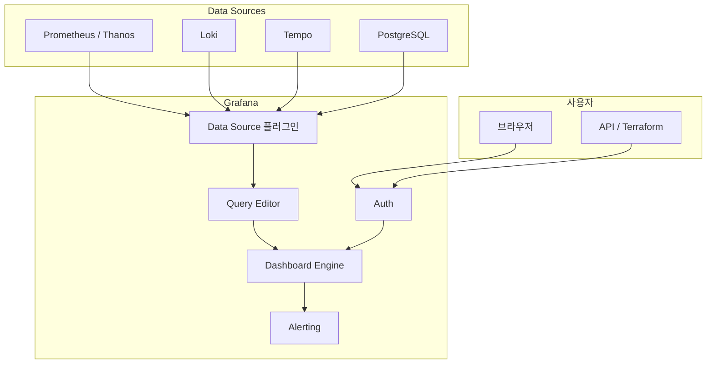

---
tags:
  - Monitoring
  - Grafana
---

# Grafana

> 다양한 데이터 소스를 연결해 메트릭·로그·트레이스를 시각화하는 오픈소스 관측성 플랫폼이다.

---

## 개요

Grafana는 Prometheus, Loki, InfluxDB, Elasticsearch 등 50개 이상의 데이터 소스를 지원하는 시각화 플랫폼이다. 대시보드와 패널을 통해 메트릭·로그·트레이스를 한 화면에서 통합 조회할 수 있으며, Kubernetes 모니터링 생태계의 사실상 표준 시각화 도구다.

---

## 아키텍처



---

## 핵심 개념

**Data Source**: Grafana가 데이터를 읽어오는 외부 시스템이다. Prometheus, Thanos, Loki, Tempo, InfluxDB, CloudWatch 등을 설정하면 각 Data Source의 쿼리 언어(PromQL, LogQL, TraceQL)로 데이터를 조회한다.

**Dashboard**: 여러 패널을 배치한 시각화 화면이다. JSON 형식으로 코드로 관리(GitOps)할 수 있으며 Grafana.com의 대시보드 라이브러리에서 커뮤니티 대시보드를 가져다 사용할 수 있다.

**Panel**: 대시보드 내 개별 시각화 단위다. Time Series, Stat, Gauge, Table, Heatmap, Logs 등 다양한 패널 타입을 제공한다. 각 패널은 독립적인 쿼리와 시각화 설정을 갖는다.

**Variable**: 대시보드 상단에 드롭다운으로 표시되는 동적 변수다. `$namespace`, `$pod` 같은 변수를 쿼리에 삽입하면 사용자가 UI에서 값을 선택해 대시보드 전체를 동적으로 필터링할 수 있다.

**Alerting**: 패널 쿼리 결과를 기반으로 알림 규칙을 설정한다. Prometheus Alertmanager와 별개로 Grafana 자체 Alerting을 사용하거나 Alertmanager를 Contact Point로 연동할 수 있다.

---

## Grafana Stack (LGTM)

Grafana Labs는 Grafana를 중심으로 한 완전한 관측성 스택을 제공한다.

| 컴포넌트 | 역할 | 쿼리 언어 |
|---------|------|---------|
| **Loki** | 로그 수집·저장 (인덱스 없이 레이블만 사용) | LogQL |
| **Grafana** | 시각화 플랫폼 | - |
| **Tempo** | 분산 트레이싱 저장·조회 | TraceQL |
| **Mimir** | Prometheus 호환 장기 메트릭 스토리지 | PromQL |

이 네 가지를 합쳐 **LGTM Stack**이라 부른다. 각 컴포넌트는 독립적으로 사용하거나 함께 사용할 수 있다.

---

## Loki

Loki는 Grafana Labs가 개발한 로그 집계 시스템이다. Elasticsearch와 달리 로그 내용을 전문 인덱싱하지 않고 레이블만 인덱싱하므로 스토리지 비용이 낮다. Promtail 또는 Alloy가 로그를 수집해 Loki로 전송한다.

```
{namespace="monitoring", pod=~"prometheus.*"} |= "error"
```

LogQL은 PromQL과 유사한 구조를 가지며, 파이프(`|`)로 필터·파서·집계를 체이닝한다.

---

## Tempo

Tempo는 Grafana Labs의 분산 트레이싱 백엔드다. Jaeger, Zipkin, OpenTelemetry 형식을 모두 수신한다. Object Storage에 트레이스 데이터를 저장하며, Grafana에서 Loki 로그나 Prometheus 메트릭과 트레이스를 연결(Exemplar, TraceID 기반)해 조회할 수 있다.

---

## 대시보드 코드 관리 (GitOps)

Grafana 대시보드는 JSON으로 정의되므로 Git으로 버전 관리가 가능하다. Kubernetes 환경에서는 ConfigMap이나 Grafana Operator를 사용해 대시보드를 코드로 배포한다.

```yaml
apiVersion: v1
kind: ConfigMap
metadata:
  name: my-dashboard
  namespace: monitoring
  labels:
    grafana_dashboard: "1"  # kube-prometheus-stack sidecar가 자동 감지
data:
  my-dashboard.json: |
    { ... }
```

kube-prometheus-stack은 `grafana.sidecar.dashboards.enabled: true` 설정 시 `grafana_dashboard: "1"` 레이블이 붙은 ConfigMap을 자동으로 감지해 대시보드로 로드한다.

---

## 유용한 커뮤니티 대시보드

| 대시보드 | ID | 설명 |
|---------|-----|------|
| **Kubernetes Cluster** | 7249 | 클러스터 전체 리소스 현황 |
| **Node Exporter Full** | 1860 | 노드 하드웨어·OS 메트릭 |
| **Kubernetes / Pods** | 6781 | 파드별 CPU·메모리·네트워크 |
| **Loki Dashboard** | 13639 | Loki 로그 조회 대시보드 |

Grafana UI에서 Dashboards → Import → ID 입력으로 바로 가져올 수 있다.

---

## Kubernetes 설치

kube-prometheus-stack에 Grafana가 포함된다. 별도 설치 시:

```bash
helm repo add grafana https://grafana.github.io/helm-charts
helm repo update

helm install grafana grafana/grafana \
  --namespace monitoring \
  --set adminPassword=admin \
  --set persistence.enabled=true \
  --set persistence.size=10Gi
```

Prometheus Data Source를 자동 설정하려면:

```yaml
datasources:
  datasources.yaml:
    apiVersion: 1
    datasources:
    - name: Prometheus
      type: prometheus
      url: http://kube-prometheus-stack-prometheus:9090
      isDefault: true
    - name: Thanos
      type: prometheus
      url: http://thanos-query:9090
```

---

## 참고

- [Grafana 공식 문서](https://grafana.com/docs/grafana/latest/)
- [Loki 공식 문서](https://grafana.com/docs/loki/latest/)
- [Tempo 공식 문서](https://grafana.com/docs/tempo/latest/)
- [Grafana 대시보드 라이브러리](https://grafana.com/grafana/dashboards/)
