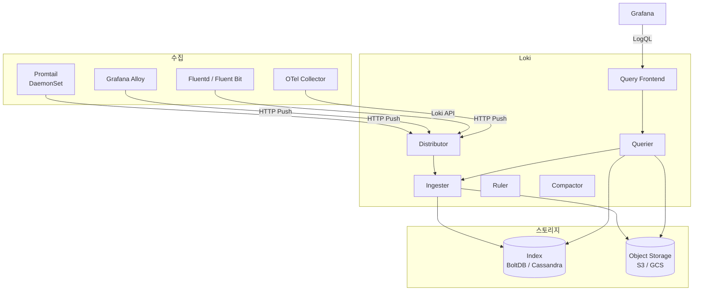

---
tags:
  - Monitoring
  - Loki
  - Logging
---

# Loki

> 로그를 인덱싱 없이 레이블만으로 저장·조회하는 Grafana Labs의 경량 로그 집계 시스템이다.

---

## 개요

Loki는 Prometheus의 설계 철학을 로그에 적용한 로그 집계 시스템이다. Elasticsearch와 달리 로그 내용을 전문 인덱싱하지 않고 레이블(label)만 인덱싱한다. 로그 본문은 압축된 청크로 Object Storage에 저장하므로 스토리지 비용이 Elasticsearch 대비 수십 배 저렴하다. Grafana와 긴밀하게 통합되며, Prometheus와 동일한 레이블 체계를 사용해 메트릭과 로그를 함께 분석하기 쉽다.

---

## 아키텍처



**Distributor**: 수집 요청을 수신해 유효성을 검사하고 Ingester로 분산한다. 레이블 유효성, 레이블 수 제한, 최대 라인 크기 등을 검증한다.

**Ingester**: 로그를 메모리에서 스트림별로 청크(Chunk)로 묶는다. 청크가 가득 차거나 일정 시간이 지나면 Object Storage에 플러시한다.

**Querier**: LogQL 쿼리를 실행한다. 인제스터의 인메모리 데이터와 Object Storage의 청크를 함께 조회한다.

**Compactor**: Object Storage의 인덱스 파일을 압축·정리한다. 보존 기간이 지난 데이터를 삭제한다.

---

## 데이터 모델

Loki의 데이터 단위는 **로그 스트림(Log Stream)** 이다. 스트림은 레이블 집합으로 고유하게 식별된다.

```
{namespace="production", app="frontend", pod="frontend-7d4f8-xk9pl"}
```

동일 레이블 집합의 로그가 하나의 스트림을 구성한다. 레이블 수가 많을수록 스트림 수가 증가해 성능에 영향을 준다. 로그 내용(URL, 사용자 ID 등)은 레이블이 아닌 쿼리 시 필터로 사용한다.

---

## LogQL

LogQL은 Loki의 쿼리 언어다. PromQL에서 영감을 받았으며 스트림 선택자와 파이프라인으로 구성된다.

**로그 조회 (Log Query)**:
```logql
# 특정 네임스페이스의 에러 로그
{namespace="production"} |= "error"

# JSON 파싱 후 특정 필드 필터
{app="api"} | json | status >= 500

# 정규식 필터
{app="nginx"} |~ "GET /api/.*" != "health"
```

**메트릭 쿼리 (Metric Query)**: 로그에서 메트릭을 추출한다.
```logql
# 분당 에러 로그 수
sum(rate({namespace="production"} |= "error" [1m])) by (app)

# HTTP 500 에러율
sum(rate({app="api"} | json | status=~"5.." [5m])) by (status)
  /
sum(rate({app="api"} | json [5m])) by (status)
```

---

## 수집 에이전트

**Promtail**: Loki 전용 로그 수집 에이전트다. Kubernetes DaemonSet으로 배포해 노드의 모든 Pod 로그를 수집한다. Kubernetes 레이블을 자동으로 Loki 레이블로 변환한다.

**Grafana Alloy**: Promtail의 후속으로 OTel Collector와 Promtail 기능을 통합한 에이전트다. 메트릭·로그·트레이스를 단일 에이전트로 수집할 수 있다.

**Fluent Bit**: 경량 로그 프로세서다. 기존에 Fluent Bit를 사용 중이라면 Loki 출력 플러그인으로 전환할 수 있다.

---

## Kubernetes 설치

```bash
helm repo add grafana https://grafana.github.io/helm-charts
helm repo update

# Loki + Promtail 함께 설치
helm install loki grafana/loki-stack \
  --namespace monitoring \
  --set grafana.enabled=false \
  --set loki.persistence.enabled=true \
  --set loki.persistence.size=20Gi
```

프로덕션 환경에서는 `loki-distributed` 차트로 컴포넌트별 확장이 가능한 분산 구성을 사용한다.

---

## 레이블 설계 원칙

**낮은 카디널리티(Low Cardinality)**: 레이블 값의 종류가 많을수록 스트림 수가 증가해 성능이 저하된다. `pod` 이름은 레이블로 적합하지 않다(수천 개의 Pod). `namespace`, `app`, `env` 수준으로 유지한다.

**Prometheus와 동일한 레이블 사용**: `namespace`, `app`, `env` 레이블을 Prometheus와 동일하게 맞추면 Grafana에서 메트릭과 로그를 연결해 조회하기 쉽다.

**로그 내용은 필터로**: IP 주소, 사용자 ID, 요청 경로 등은 레이블이 아닌 LogQL 필터(`|=`, `|json`, `|regexp`)로 조회한다.

---

## Grafana 연동

Grafana Data Source에 Loki를 추가하면 Explore 탭에서 LogQL 쿼리가 가능하다. Prometheus Exemplar와 Trace ID를 공유하면 메트릭 이상 탐지 → 관련 로그 조회 → 트레이스 확인의 워크플로우가 가능하다.

---

## 참고

- [Loki 공식 문서](https://grafana.com/docs/loki/latest/)
- [LogQL 레퍼런스](https://grafana.com/docs/loki/latest/query/)
- [Loki 레이블 설계 가이드](https://grafana.com/docs/loki/latest/get-started/labels/)
