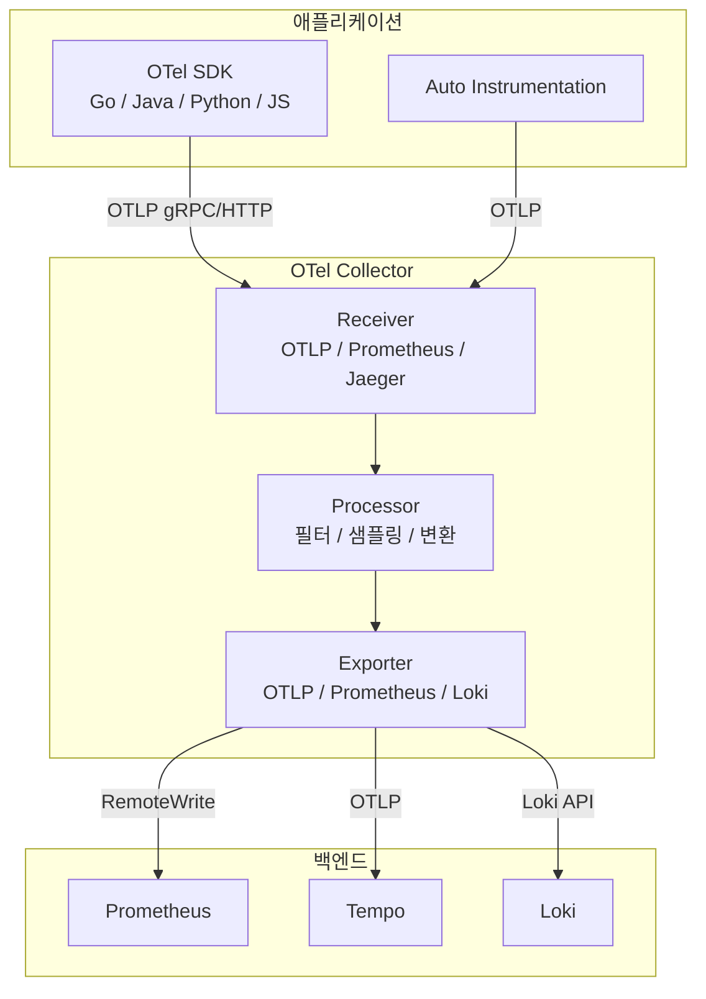

---
tags:
  - Monitoring
  - OpenTelemetry
  - Observability
---

# OpenTelemetry

> 메트릭·로그·트레이스를 벤더 중립적으로 계측·수집·전송하는 CNCF 관측성 표준이다.

---

## 개요

OpenTelemetry(OTel)는 CNCF의 관측성 프레임워크로, 애플리케이션 계측(Instrumentation) 표준을 제공한다. OpenCensus와 OpenTracing이 합쳐져 탄생했으며, 현재 Prometheus·Jaeger·Zipkin·Datadog·Grafana 등 대부분의 관측성 도구가 OTel 데이터를 수신한다. 벤더에 종속되지 않고 한 번의 계측으로 모든 백엔드에 데이터를 전송할 수 있다.

---

## 관측성의 세 기둥

| 신호 | 설명 | 대표 백엔드 |
|------|------|-----------|
| **Metrics** | 시간에 따른 수치 데이터 (Counter, Gauge, Histogram) | Prometheus, Mimir |
| **Logs** | 이벤트의 타임스탬프 기록 | Loki, Elasticsearch |
| **Traces** | 요청의 분산 실행 경로 | Tempo, Jaeger, Zipkin |

OTel은 세 신호를 하나의 SDK로 통합 계측하고, Trace ID를 공유해 메트릭·로그·트레이스를 서로 연결(Correlation)한다.

---

## 아키텍처



**OTel SDK**: 애플리케이션 코드에 삽입되는 계측 라이브러리다. Go, Java, Python, JavaScript, .NET 등 주요 언어를 지원한다. 자동 계측(Auto Instrumentation)을 사용하면 코드 수정 없이 HTTP, gRPC, DB 쿼리 등을 자동으로 추적한다.

**OTel Collector**: 에이전트 또는 게이트웨이로 배포하는 데이터 파이프라인이다. 다양한 형식의 텔레메트리를 수신(Receiver)하고, 필터링·샘플링·변환(Processor)을 거쳐 여러 백엔드로 전송(Exporter)한다. 애플리케이션과 백엔드 사이의 버퍼 역할도 한다.

**OTLP**: OpenTelemetry Protocol의 약자로 OTel의 네이티브 전송 프로토콜이다. gRPC와 HTTP/Protobuf를 지원하며, 메트릭·로그·트레이스를 단일 프로토콜로 전송한다.

---

## OTel Collector 설정

```yaml
receivers:
  otlp:
    protocols:
      grpc:
        endpoint: 0.0.0.0:4317
      http:
        endpoint: 0.0.0.0:4318
  prometheus:
    config:
      scrape_configs:
      - job_name: 'my-app'
        static_configs:
        - targets: ['my-app:8080']

processors:
  batch:
    timeout: 10s
  memory_limiter:
    limit_mib: 512
  resource:
    attributes:
    - key: cluster
      value: production
      action: insert

exporters:
  prometheusremotewrite:
    endpoint: http://prometheus:9090/api/v1/write
  otlp/tempo:
    endpoint: http://tempo:4317
    tls:
      insecure: true
  loki:
    endpoint: http://loki:3100/loki/api/v1/push

service:
  pipelines:
    metrics:
      receivers: [otlp, prometheus]
      processors: [memory_limiter, batch, resource]
      exporters: [prometheusremotewrite]
    traces:
      receivers: [otlp]
      processors: [memory_limiter, batch]
      exporters: [otlp/tempo]
    logs:
      receivers: [otlp]
      processors: [batch]
      exporters: [loki]
```

---

## 애플리케이션 계측 (Go 예시)

```go
// OTel 초기화
func initTracer() (*sdktrace.TracerProvider, error) {
    exporter, _ := otlptracehttp.New(ctx,
        otlptracehttp.WithEndpoint("otel-collector:4318"),
        otlptracehttp.WithInsecure(),
    )
    tp := sdktrace.NewTracerProvider(
        sdktrace.WithBatcher(exporter),
        sdktrace.WithResource(resource.NewWithAttributes(
            semconv.SchemaURL,
            semconv.ServiceNameKey.String("my-service"),
        )),
    )
    otel.SetTracerProvider(tp)
    return tp, nil
}

// 트레이스 생성
tracer := otel.Tracer("my-component")
ctx, span := tracer.Start(ctx, "operation-name")
defer span.End()

span.SetAttributes(attribute.String("user.id", userID))
```

---

## Kubernetes Auto Instrumentation

OTel Operator를 사용하면 Pod 어노테이션만으로 자동 계측이 가능하다.

```yaml
apiVersion: apps/v1
kind: Deployment
metadata:
  name: my-app
spec:
  template:
    metadata:
      annotations:
        instrumentation.opentelemetry.io/inject-java: "true"
```

OTel Operator가 Init Container를 주입해 Java Agent를 자동으로 설치하고 OTLP 엔드포인트를 설정한다. Java, Python, Node.js, .NET을 지원한다.

---

## Kubernetes 설치

```bash
# OTel Operator 설치
helm repo add open-telemetry https://open-telemetry.github.io/opentelemetry-helm-charts
helm install opentelemetry-operator open-telemetry/opentelemetry-operator \
  --namespace opentelemetry-operator-system \
  --create-namespace

# OTel Collector DaemonSet 배포
kubectl apply -f - <<EOF
apiVersion: opentelemetry.io/v1alpha1
kind: OpenTelemetryCollector
metadata:
  name: otel
  namespace: monitoring
spec:
  mode: daemonset
  config: |
    receivers:
      otlp:
        protocols:
          grpc:
          http:
    exporters:
      otlp/tempo:
        endpoint: http://tempo:4317
        tls:
          insecure: true
    service:
      pipelines:
        traces:
          receivers: [otlp]
          exporters: [otlp/tempo]
EOF
```

---

## 참고

- [OpenTelemetry 공식 문서](https://opentelemetry.io/docs/)
- [OTel Collector GitHub](https://github.com/open-telemetry/opentelemetry-collector)
- [OTel Operator GitHub](https://github.com/open-telemetry/opentelemetry-operator)
- [언어별 SDK 문서](https://opentelemetry.io/docs/languages/)
