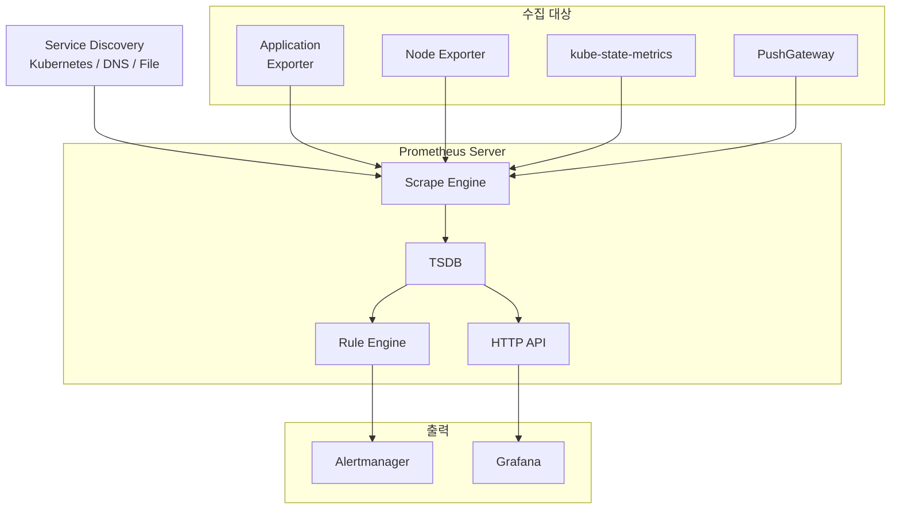

---
tags:
  - Monitoring
  - Prometheus
---

# Prometheus

> Pull 방식의 오픈소스 모니터링 시스템으로, 시계열 데이터를 수집·저장·조회한다.

---

## 개요

Prometheus는 SoundCloud에서 시작해 현재 CNCF 졸업 프로젝트로 관리되는 오픈소스 모니터링 시스템이다. Kubernetes 생태계의 사실상 표준 모니터링 솔루션이며, Pull 방식으로 메트릭을 수집하고 자체 시계열 데이터베이스(TSDB)에 저장한다.

---

## 아키텍처



**Prometheus Server**: 핵심 컴포넌트다. Scrape Engine이 설정된 주기(기본 15초)마다 타겟에서 메트릭을 Pull하고 TSDB에 저장한다. Rule Engine은 recording rule과 alerting rule을 주기적으로 평가한다.

**Exporter**: 모니터링 대상 시스템의 메트릭을 Prometheus 형식으로 노출하는 어댑터다. Node Exporter(하드웨어/OS), kube-state-metrics(Kubernetes 오브젝트 상태), Blackbox Exporter(HTTP/TCP 엔드포인트) 등이 대표적이다.

**PushGateway**: Batch Job처럼 짧게 실행되고 종료되는 프로세스는 Pull 방식으로 수집할 수 없다. 이런 경우 PushGateway에 메트릭을 Push하면 Prometheus가 PushGateway를 Pull한다.

**Alertmanager**: Prometheus Rule Engine에서 발생한 알림을 수신해 그룹핑, 라우팅, 중복 제거 후 Slack·PagerDuty·이메일 등으로 전달한다.

**Service Discovery**: 정적 설정 대신 Kubernetes API, DNS, Consul 등을 통해 스크랩 타겟을 동적으로 발견한다.

---

## 데이터 모델

Prometheus는 모든 데이터를 **시계열(Time Series)** 로 저장한다. 시계열은 메트릭 이름과 레이블(key=value 쌍) 조합으로 고유하게 식별된다.

```
http_requests_total{method="GET", status="200", handler="/api/v1"}
```

레이블을 활용하면 하나의 메트릭 이름으로 다차원 데이터를 표현할 수 있다. `method`, `status`, `handler` 레이블 조합마다 별도의 시계열이 생성된다.

---

## 메트릭 타입

| 타입 | 설명 | 예시 |
|------|------|------|
| **Counter** | 단조 증가하는 누적 값. 재시작 시 0으로 초기화 | `http_requests_total`, `errors_total` |
| **Gauge** | 증감이 자유로운 현재 값 | `memory_usage_bytes`, `temperature` |
| **Histogram** | 관측값을 구간(bucket)별로 누적 집계 | `http_request_duration_seconds` |
| **Summary** | 클라이언트 사이드에서 분위수(quantile) 계산 | `rpc_duration_seconds` |

**Histogram vs Summary**: Histogram은 서버 사이드에서 PromQL로 분위수를 계산하므로 여러 인스턴스 집계가 가능하다. Summary는 클라이언트가 직접 분위수를 계산해 집계가 불가능하므로 Histogram을 권장한다.

---

## PromQL

PromQL(Prometheus Query Language)은 시계열 데이터를 조회·집계하는 함수형 쿼리 언어다.

**주요 함수**:

**`rate()`**: Counter의 초당 평균 증가율을 계산한다. HTTP 요청률 등 속도 계산에 사용한다.
```promql
rate(http_requests_total[5m])
```

**`increase()`**: 지정 기간 동안 Counter의 증가량을 반환한다.
```promql
increase(http_requests_total[1h])
```

**`histogram_quantile()`**: Histogram 데이터에서 특정 분위수를 계산한다.
```promql
histogram_quantile(0.95, rate(http_request_duration_seconds_bucket[5m]))
```

**집계 연산자**: `sum`, `avg`, `min`, `max`, `count` 등으로 레이블 기준 집계가 가능하다.
```promql
sum(rate(http_requests_total[5m])) by (handler)
```

---

## 저장소 구조 (TSDB)

Prometheus TSDB는 로컬 디스크에 블록 단위로 데이터를 저장한다. 각 블록은 2시간 분량의 데이터를 포함하며, 시간이 지나면 압축(Compaction)을 통해 더 큰 블록으로 합쳐진다.

기본 보존 기간은 15일이며 `--storage.tsdb.retention.time`으로 조정한다. 단일 서버 구조이므로 장기 보존이나 다중 Prometheus 통합이 필요하면 Thanos나 Cortex 같은 솔루션을 사용한다.

---

## Kubernetes에서의 설치

Prometheus Operator 또는 kube-prometheus-stack Helm 차트를 사용하는 것이 일반적이다.

```bash
helm repo add prometheus-community https://prometheus-community.github.io/helm-charts
helm repo update

helm install kube-prometheus-stack \
  prometheus-community/kube-prometheus-stack \
  --namespace monitoring \
  --create-namespace
```

kube-prometheus-stack은 Prometheus Operator, Grafana, Alertmanager, Node Exporter, kube-state-metrics를 함께 설치한다.

**ServiceMonitor**: Prometheus Operator가 제공하는 CRD로, 서비스 디스커버리 설정을 선언적으로 관리한다.

```yaml
apiVersion: monitoring.coreos.com/v1
kind: ServiceMonitor
metadata:
  name: my-app
  namespace: monitoring
spec:
  selector:
    matchLabels:
      app: my-app
  endpoints:
  - port: metrics
    interval: 15s
```

---

## 한계

단일 Prometheus 서버는 수평 확장이 불가능하다. 수집 타겟이 많아지면 단일 인스턴스의 메모리·CPU 한계에 도달하고, 장기 스토리지나 글로벌 뷰(여러 클러스터 통합 조회)도 기본 지원하지 않는다. 이런 한계를 해결하기 위해 Thanos나 Cortex, Mimir 같은 솔루션과 함께 사용한다.

---

## 참고

- [Prometheus 공식 문서](https://prometheus.io/docs/)
- [kube-prometheus-stack Helm 차트](https://github.com/prometheus-community/helm-charts/tree/main/charts/kube-prometheus-stack)
- [PromQL 치트시트](https://promlabs.com/promql-cheat-sheet/)
