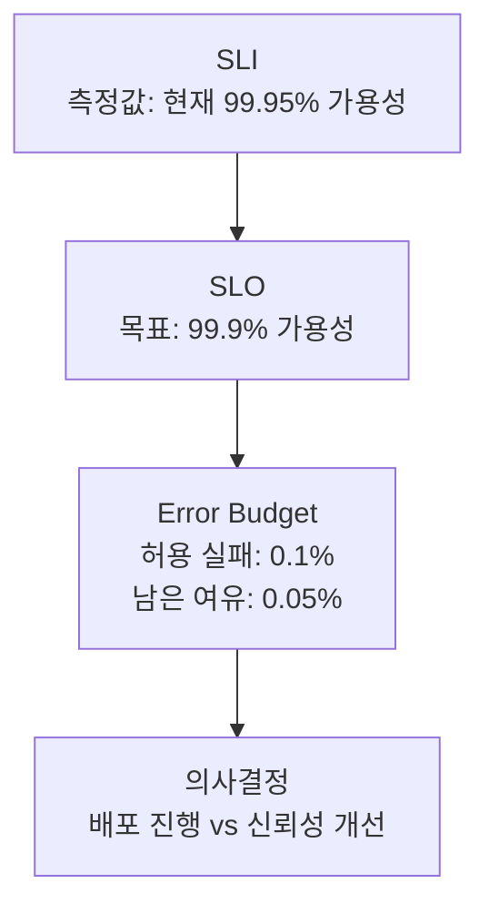
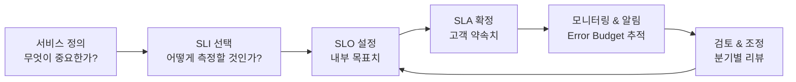

---
tags:
  - Monitoring
  - SRE
  - SLO
---

# SLO / SLI / Error Budget

> 서비스 신뢰성을 정량적으로 측정하고 운영 의사결정의 기준으로 삼는 SRE의 핵심 개념이다.

---

## 개요

SLI(Service Level Indicator), SLO(Service Level Objective), Error Budget은 Google SRE에서 제안한 신뢰성 관리 프레임워크다. "시스템이 얼마나 잘 동작하는가?"를 수치로 정의하고, 그 수치를 기반으로 개발 속도와 안정성 사이의 균형을 맞춘다. 알림 피로(Alert Fatigue)를 줄이고 의미 있는 알림만 발생시키는 기반이 된다.

---

## 개념 정의

**SLI (Service Level Indicator)**: 서비스 품질을 측정하는 지표다. 좋은 요청 수 / 전체 요청 수처럼 비율로 표현하는 경우가 많다.

**SLO (Service Level Objective)**: SLI가 달성해야 하는 목표치다. "월간 99.9% 가용성"처럼 SLI의 목표 비율과 기간으로 정의한다.

**SLA (Service Level Agreement)**: SLO를 기반으로 고객과 맺는 계약이다. SLO를 위반하면 환불·크레딧 등의 패널티가 발생한다.

**Error Budget**: SLO에서 허용되는 실패 여유분이다. 99.9% SLO라면 0.1%가 Error Budget이다. 남은 Error Budget이 있으면 기능 배포를 진행하고, 소진되면 신뢰성 개선에 집중한다.

---

## 관계



---

## SLA (Service Level Agreement)

SLA는 서비스 제공자와 고객 사이에 맺는 공식 계약이다. SLO를 위반했을 때 어떤 보상을 제공하는지를 명시한다. SLO가 내부 목표라면 SLA는 외부 약속이다.

**SLO vs SLA 차이**:

SLO는 내부적으로 달성하려는 목표치이고, SLA는 고객에게 공개적으로 약속하는 최소 보장치다. 운영 여유를 확보하기 위해 SLO는 SLA보다 엄격하게 설정하는 것이 일반적이다. 예를 들어 SLA가 99.9%라면 내부 SLO는 99.95%로 설정해 여유 Buffer를 둔다.

```
SLA (고객 약속) < SLO (내부 목표) ≤ 실제 서비스 품질
예: SLA 99.9% < SLO 99.95% ≤ 실제 99.97%
```

**주요 클라우드 SLA 예시**:

| 서비스 | SLA | 위반 시 크레딧 |
|--------|-----|--------------|
| AWS EC2 | 99.99% | 10~30% 크레딧 |
| AWS EKS | 99.95% | 10~30% 크레딧 |
| GKE | 99.95% | 10~50% 크레딧 |
| Azure AKS | 99.95% (Uptime SLA 옵션) | 10~30% 크레딧 |

**SLA 구성 요소**:

**범위 (Scope)**: 어떤 서비스에 적용되는지 명시한다. 특정 API 엔드포인트인지, 전체 플랫폼인지, 특정 지역인지를 정의한다.

**측정 방법 (Measurement)**: SLI를 어떻게 측정하는지 정의한다. 측정 주체(제공자 vs 독립 기관), 측정 간격, 집계 방법을 명시한다.

**패널티 (Penalty)**: SLA 위반 시 보상 기준을 정한다. 일반적으로 서비스 크레딧 형태로 제공하며, 위반 심각도에 따라 크레딧 비율이 달라진다.

**예외 (Exclusions)**: SLA 적용에서 제외되는 상황을 명시한다. 예정된 유지보수, 고객 측 원인, 불가항력(Force Majeure) 등이 포함된다.

**SLA 설계 시 고려사항**:

고객이 실제로 인지하는 장애만 SLA에 포함한다. 내부 배치 작업, 비동기 처리 등 사용자에게 직접 영향이 없는 부분은 제외한다. SLA에 정의된 측정 방법이 실제 고객 경험과 일치하는지 검증한다. SLA 위반 판단을 위한 모니터링 데이터는 독립적으로 보관해야 분쟁 시 근거로 활용할 수 있다.

---

## SLI → SLO → SLA 설계 흐름



---

## SLI 종류

**가용성 (Availability)**: 성공한 요청의 비율이다.

```
가용성 SLI = 성공 요청 수 / 전체 요청 수
```

**지연 시간 (Latency)**: 요청의 몇 퍼센트가 특정 시간 이내에 응답하는지 측정한다.

```
지연 SLI = 200ms 이내 응답 요청 수 / 전체 요청 수
```

**에러율 (Error Rate)**: 5xx 에러가 아닌 요청의 비율이다.

```
에러율 SLI = (전체 요청 - 5xx 응답) / 전체 요청
```

**포화도 (Saturation)**: CPU·메모리·큐 등 리소스의 사용률이다.

---

## Error Budget 계산

99.9% SLO를 월 기준으로 적용하면:

| 기간 | 허용 다운타임 |
|------|-------------|
| 일 | 1분 26초 |
| 주 | 10분 4초 |
| 월 | 43분 12초 |
| 연 | 8시간 41분 |

Error Budget이 남아 있으면 개발팀은 새 기능을 자유롭게 배포할 수 있다. Error Budget이 소진되면 신규 배포를 중단하고 신뢰성 개선에 집중한다.

---

## Prometheus로 SLO 측정

**가용성 SLI**:
```promql
# 5분간 성공 요청 비율
sum(rate(http_requests_total{status!~"5.."}[5m]))
/
sum(rate(http_requests_total[5m]))
```

**지연 SLI (200ms 이내 응답 비율)**:
```promql
sum(rate(http_request_duration_seconds_bucket{le="0.2"}[5m]))
/
sum(rate(http_request_duration_seconds_count[5m]))
```

**남은 Error Budget**:
```promql
# 30일 기준 남은 Error Budget 비율
1 - (
  1 - sum(rate(http_requests_total{status!~"5.."}[30d]))
      / sum(rate(http_requests_total[30d]))
) / (1 - 0.999)
```

---

## Burn Rate 기반 알림

단순 임계값 알림 대신 **Burn Rate(소진 속도)** 기반 알림을 사용하면 알림 피로를 줄일 수 있다. Burn Rate 1.0은 Error Budget을 SLO 기간(예: 30일) 안에 정확히 소진하는 속도다.

**빠른 소진 감지** (1시간 내 대응 필요):
```promql
# 1시간 Burn Rate > 14.4 → 1시간 안에 2시간치 Error Budget 소진
(
  sum(rate(http_requests_total{status=~"5.."}[1h]))
  / sum(rate(http_requests_total[1h]))
) / (1 - 0.999) > 14.4
```

**느린 소진 감지** (하루 내 대응 필요):
```promql
# 6시간 Burn Rate > 6
(
  sum(rate(http_requests_total{status=~"5.."}[6h]))
  / sum(rate(http_requests_total[6h]))
) / (1 - 0.999) > 6
```

| 알림 창 | Burn Rate 임계값 | Error Budget 소진 시점 | 심각도 |
|--------|----------------|----------------------|--------|
| 1시간 | 14.4 | 2시간 | Critical |
| 6시간 | 6 | 5시간 | Critical |
| 1일 | 3 | 10일 | Warning |
| 3일 | 1 | 30일 | Warning |

---

## Pyrra / Sloth

SLO 관리를 자동화하는 도구들이 있다. Prometheus Alerting Rule을 수동으로 작성하는 대신 SLO 선언만으로 필요한 Rule을 자동 생성한다.

**Sloth** 예시:
```yaml
apiVersion: sloth.slok.dev/v1
kind: PrometheusServiceLevel
metadata:
  name: my-service-slo
spec:
  service: my-service
  slos:
  - name: requests-availability
    objective: 99.9
    sli:
      events:
        errorQuery: sum(rate(http_requests_total{status=~"5.."}[{{.window}}]))
        totalQuery: sum(rate(http_requests_total[{{.window}}]))
    alerting:
      pageAlert:
        labels:
          severity: critical
      ticketAlert:
        labels:
          severity: warning
```

Sloth가 이 선언에서 Burn Rate 기반 Prometheus Alerting Rule과 Grafana 대시보드를 자동으로 생성한다.

---

## 참고

- [Google SRE Book - SLO 챕터](https://sre.google/sre-book/service-level-objectives/)
- [Sloth GitHub](https://github.com/slok/sloth)
- [Pyrra GitHub](https://github.com/pyrra-dev/pyrra)
- [SLO 알림 설계 가이드](https://sre.google/workbook/alerting-on-slos/)
