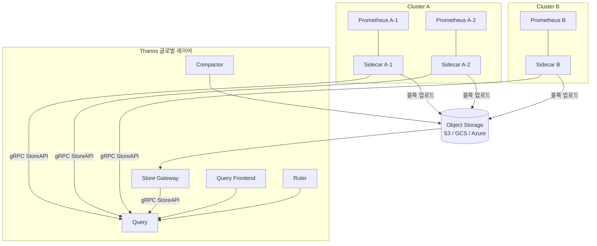

---
tags:
  - Monitoring
  - Thanos
---

# Thanos

> Prometheus의 확장성·고가용성·장기 스토리지 한계를 해결하는 오픈소스 솔루션이다.

---

## 개요

Thanos는 Prometheus 위에 얹어 사용하는 오픈소스 프로젝트다. 단일 Prometheus 서버의 세 가지 핵심 한계인 **확장성 부재**, **장기 스토리지 미지원**, **다중 클러스터 통합 조회 불가**를 해결한다. Object Storage(S3, GCS 등)를 활용해 사실상 무제한 메트릭 보존이 가능하며, 여러 Prometheus 인스턴스를 단일 글로벌 뷰로 통합한다.

---

## Prometheus의 한계와 Thanos의 해결

**확장성**: 단일 Prometheus는 수평 확장이 불가능하다. Thanos는 여러 Prometheus 인스턴스를 병렬로 운영하고 Query 레이어에서 통합 조회한다.

**장기 스토리지**: Prometheus TSDB는 로컬 디스크에 저장되므로 보존 기간에 한계가 있다. Thanos Sidecar가 완성된 블록을 Object Storage로 업로드해 수년치 데이터를 보관한다.

**고가용성**: 동일한 Prometheus를 복수로 운영하면 중복 데이터가 발생한다. Thanos Query는 자동 중복 제거(Deduplication)를 수행해 정확한 결과를 반환한다.

**글로벌 뷰**: 클러스터마다 별도의 Prometheus가 있으면 통합 조회가 불가능하다. Thanos Query는 모든 클러스터의 데이터를 단일 엔드포인트로 제공한다.

---

## 아키텍처



---

## 핵심 컴포넌트

**Sidecar**: Prometheus 파드 옆에 사이드카로 배포된다. 두 가지 역할을 수행한다. 첫째로 Prometheus의 실시간 데이터를 gRPC StoreAPI로 Query에 노출한다. 둘째로 TSDB에서 완성된 2시간 블록을 Object Storage에 업로드한다.

**Query**: 여러 StoreAPI 엔드포인트(Sidecar, Store Gateway 등)에서 데이터를 Fan-out 조회하고 병합한다. PromQL을 완전히 지원하며, `--query.replica-label` 설정으로 중복 데이터를 자동 제거한다. Prometheus와 동일한 HTTP API를 제공하므로 Grafana Data Source 교체만으로 전환 가능하다.

**Query Frontend**: Query 앞에 위치하는 캐싱·분산 레이어다. 긴 범위 쿼리를 작은 단위로 분할(sharding)해 병렬 처리하고 결과를 캐싱한다. 대규모 환경에서 Query의 부하를 줄인다.

**Store Gateway**: Object Storage에 저장된 블록에 대해 StoreAPI를 제공한다. 블록 메타데이터를 인덱싱해 필요한 데이터만 효율적으로 읽는다. 실제 블록 파일은 Object Storage에 있으므로 Store Gateway는 무상태(stateless)로 운영 가능하다.

**Compactor**: Object Storage의 블록을 Prometheus와 동일한 방식으로 압축(Compaction)한다. 여러 Prometheus 레플리카의 중복 데이터도 이 단계에서 제거한다. 단일 인스턴스로만 실행해야 한다(다중 실행 시 데이터 충돌 발생).

**Ruler**: Prometheus의 Recording Rule과 Alerting Rule을 Thanos 환경에서 글로벌로 실행한다. Sidecar가 각 Prometheus의 로컬 데이터만 참조하는 것과 달리, Ruler는 Query를 통해 전체 데이터를 참조해 Rule을 평가한다.

**Receiver**: Prometheus의 Remote Write를 수신해 Thanos TSDB에 저장한다. Sidecar 방식 대신 Push 방식으로 데이터를 수집할 때 사용한다. 방화벽 등으로 Sidecar 노출이 어려운 환경에 적합하다.

---

## 배포 방식 비교

**Sidecar 방식 (권장)**: Prometheus에 Sidecar를 추가하는 방식이다. Prometheus를 그대로 유지하면서 점진적으로 Thanos를 도입할 수 있다. 대부분의 프로덕션 환경에서 사용한다.

**Receiver 방식**: Prometheus의 Remote Write 기능으로 Thanos Receiver에 데이터를 전송한다. Prometheus를 직접 노출할 수 없거나, 완전 중앙집중식 구조가 필요할 때 사용한다.

---

## Deduplication (중복 제거)

HA를 위해 동일한 설정의 Prometheus를 2개 이상 운영하면 동일 메트릭이 중복 수집된다. Thanos Query는 `--query.replica-label=prometheus_replica` 설정으로 레플리카 레이블을 기준으로 중복 시계열을 자동 병합해 하나의 결과로 반환한다.

---

## Object Storage 설정

Thanos는 `objstore.yaml` 파일로 Object Storage를 설정한다.

```yaml
type: S3
config:
  bucket: thanos-metrics
  endpoint: s3.ap-northeast-2.amazonaws.com
  region: ap-northeast-2
  # IAM 역할 사용 시 access_key/secret_key 생략 가능
```

---

## Kubernetes 설치 (Helm)

```bash
helm repo add bitnami https://charts.bitnami.com/bitnami
helm repo update

helm install thanos bitnami/thanos \
  --namespace monitoring \
  --set query.enabled=true \
  --set storegateway.enabled=true \
  --set compactor.enabled=true \
  --set objstoreConfig="$(cat objstore.yaml)"
```

Sidecar는 Prometheus Pod 스펙에 직접 추가하거나 kube-prometheus-stack의 `prometheus.prometheusSpec.thanos` 설정을 활용한다.

---

## 참고

- [Thanos 공식 문서](https://thanos.io/tip/thanos/getting-started.md/)
- [Thanos GitHub](https://github.com/thanos-io/thanos)
- [Thanos vs Cortex vs Mimir 비교](https://thanos.io/tip/thanos/comparisons.md/)
