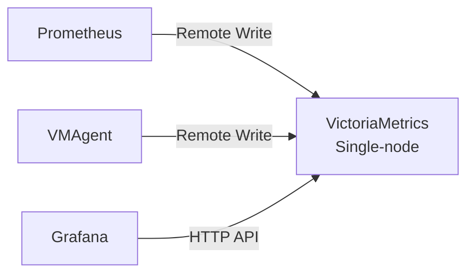
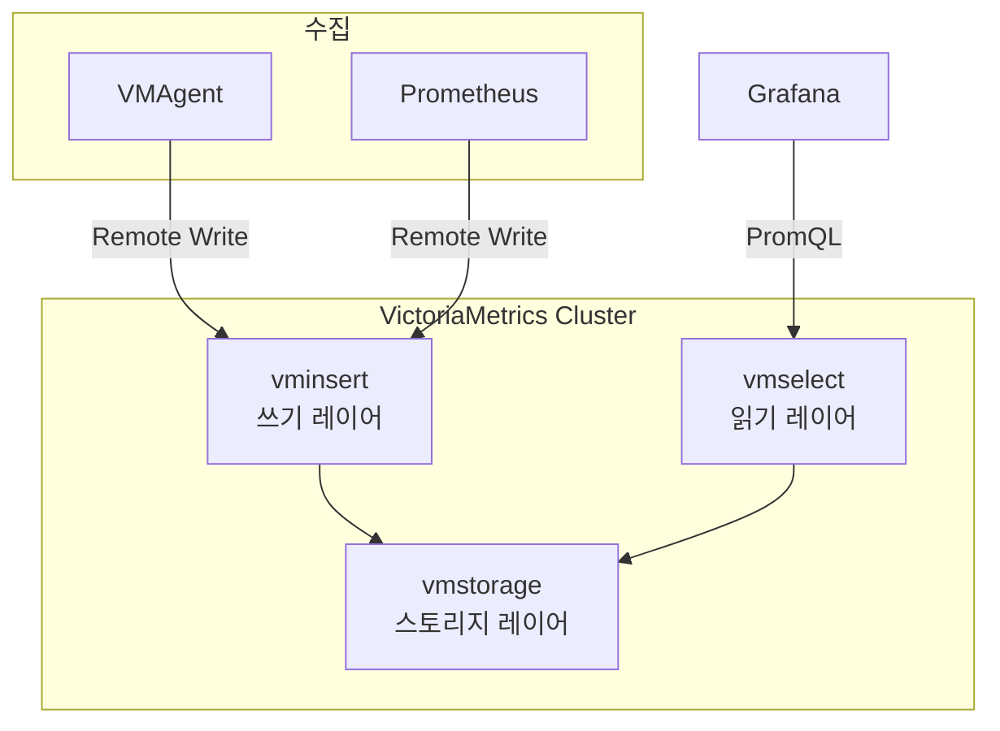

---
tags:
  - Monitoring
  - VictoriaMetrics
---

# VictoriaMetrics

> Prometheus 호환 고성능 시계열 데이터베이스로, 단순한 운영과 낮은 리소스 사용이 특징이다.

---

## 개요

VictoriaMetrics는 Prometheus와 완전 호환되는 오픈소스 시계열 데이터베이스다. 단일 바이너리(Single-node)와 분산 구성(Cluster) 모두 지원하며, Thanos나 Cortex 대비 운영 복잡도가 낮고 압축률이 높다. Prometheus Remote Write로 데이터를 수신하거나 스스로 스크랩하는 방식 모두 지원한다.

---

## Thanos vs VictoriaMetrics

| 항목 | Thanos | VictoriaMetrics |
|------|--------|----------------|
| **구조** | Prometheus 위에 추가 | 독립 TSDB (Prometheus 대체 가능) |
| **운영 복잡도** | 높음 (다수 컴포넌트) | 낮음 (단일 바이너리 가능) |
| **장기 스토리지** | Object Storage | 로컬 디스크 또는 Object Storage |
| **PromQL 호환** | 완전 호환 | 완전 호환 + MetricsQL 확장 |
| **압축률** | 보통 | 매우 높음 (Prometheus 대비 약 7배) |
| **수평 확장** | Thanos Query로 통합 | Cluster 모드 |
| **글로벌 뷰** | 지원 | Cluster 모드에서 지원 |

---

## 아키텍처

### 단일 노드 (Single-node)

소규모 환경에 적합하다. 단일 바이너리로 모든 기능을 제공한다.



### 클러스터 (Cluster)

대규모 환경을 위한 분산 구성이다.



**vminsert**: 쓰기 요청을 수신해 vmstorage에 분산 저장한다. 수평 확장이 가능하다.

**vmstorage**: 실제 데이터를 디스크에 저장한다. 샤딩 방식으로 데이터를 분산한다.

**vmselect**: PromQL/MetricsQL 쿼리를 처리한다. 모든 vmstorage에서 데이터를 Fan-out 조회해 병합한다.

---

## VMAgent

VMAgent는 VictoriaMetrics의 경량 스크랩 에이전트다. Prometheus보다 메모리 사용량이 적으며, 수집한 데이터를 Remote Write로 VictoriaMetrics 또는 다른 Prometheus 호환 백엔드에 전송한다.

```yaml
apiVersion: operator.victoriametrics.com/v1beta1
kind: VMAgent
metadata:
  name: vmagent
spec:
  replicaCount: 2
  remoteWrite:
  - url: http://vmsingle:8428/api/v1/write
  selectAllByDefault: true
  scrapeInterval: 15s
```

---

## MetricsQL

VictoriaMetrics는 PromQL을 완전히 지원하면서 MetricsQL이라는 확장 문법을 추가로 제공한다.

**`default_rollup()`**: 누락된 데이터 포인트를 이전 값으로 자동 채운다.

**`outlierIQR()`**: 이상치 감지를 위한 함수다.

**`aggr_over_time()`**: 특정 기간의 집계를 단일 함수로 처리한다.

기존 PromQL 쿼리는 그대로 동작하므로 Grafana 대시보드를 수정할 필요가 없다.

---

## Kubernetes 설치

Victoria Metrics Operator를 사용하면 Prometheus Operator와 유사한 CRD 방식으로 관리할 수 있다.

```bash
helm repo add vm https://victoriametrics.github.io/helm-charts
helm repo update

# 단일 노드
helm install vmsingle vm/victoria-metrics-single \
  --namespace monitoring \
  --set server.persistentVolume.enabled=true \
  --set server.persistentVolume.size=50Gi \
  --set server.retentionPeriod=3

# Operator 설치
helm install vmoperator vm/victoria-metrics-operator \
  --namespace monitoring
```

`retentionPeriod`는 월 단위로 지정한다 (`3` = 3개월).

---

## Prometheus와 통합

기존 Prometheus를 유지하면서 VictoriaMetrics를 장기 스토리지로 사용하는 방식이다.

```yaml
# prometheus.yml
remote_write:
- url: http://victoriametrics:8428/api/v1/write
  queue_config:
    max_samples_per_send: 10000
    max_shards: 30
```

이 방식은 Thanos Sidecar와 동일한 역할을 더 단순하게 구현한다.

---

## VMAlert & VMAlertmanager

VictoriaMetrics는 자체 알림 컴포넌트도 제공한다.

**VMAlert**: Prometheus Alerting Rule 형식을 그대로 지원하는 알림 평가 엔진이다.

**VMAlertmanager**: Prometheus Alertmanager 호환 컴포넌트다.

---

## 참고

- [VictoriaMetrics 공식 문서](https://docs.victoriametrics.com/)
- [VictoriaMetrics GitHub](https://github.com/VictoriaMetrics/VictoriaMetrics)
- [Thanos vs VictoriaMetrics 비교](https://docs.victoriametrics.com/articles/why-victoriametrics/)
