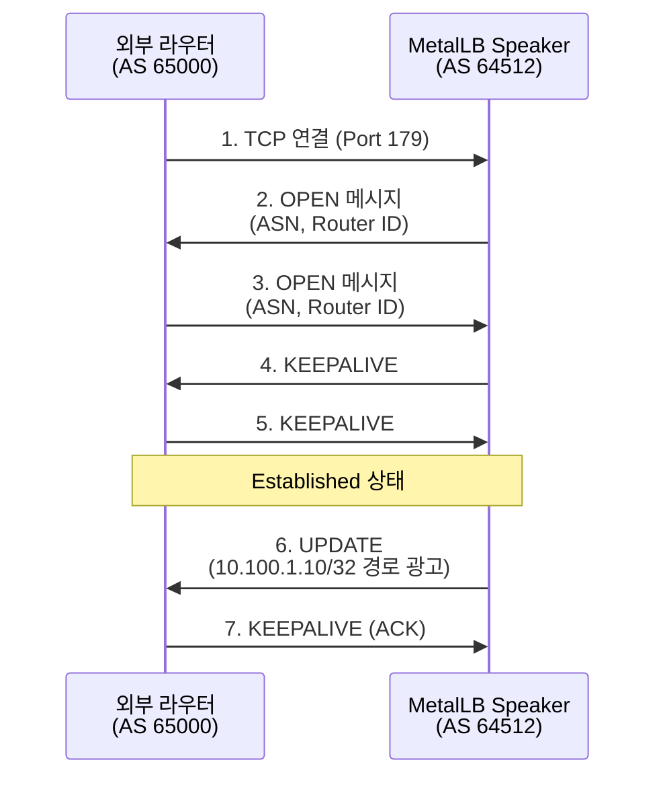
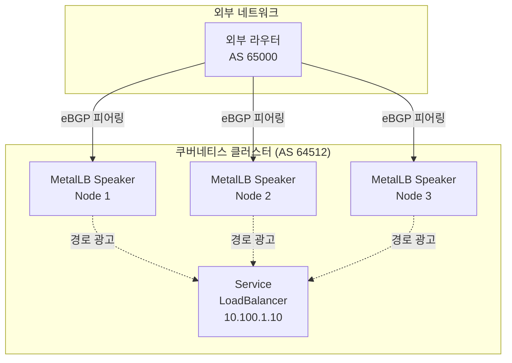
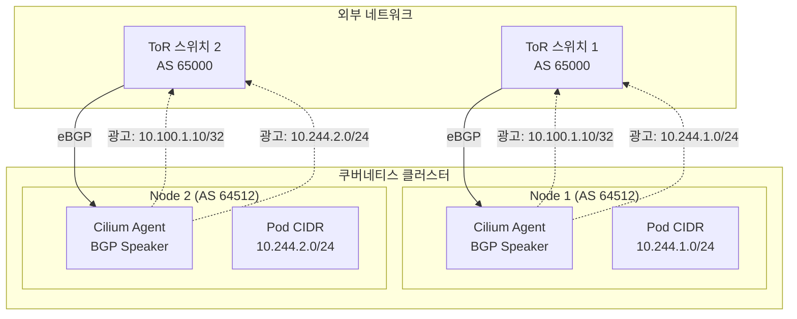

# BGP (Border Gateway Protocol)

> 인터넷의 핵심 라우팅 프로토콜인 BGP의 동작 원리와 쿠버네티스 환경에서의 활용 방법을 정리한다.

BGP는 인터넷을 구성하는 자율 시스템(AS) 간의 라우팅 정보를 교환하는 프로토콜이다. 온프레미스 쿠버네티스 환경에서는 MetalLB, Cilium BGP Control Plane과 함께 사용되어 외부 네트워크와 통신하는 핵심 역할을 수행한다.

## BGP가 필요한 이유

### 클라우드 vs 온프레미스

**클라우드 환경 (AWS/GCP/Azure)**:

- LoadBalancer 타입 Service 생성 → 자동으로 ELB/NLB/ALB 프로비저닝
- 클라우드 제공자가 외부 IP 할당 및 라우팅 처리
- BGP 설정 불필요

**온프레미스 환경**:

- LoadBalancer 타입 Service 생성 → 외부 IP 없음 (Pending 상태)
- 외부 라우터에게 "이 IP로 오는 트래픽은 우리 쿠버네티스 노드로 보내라"고 알려야 함
- BGP를 통해 외부 라우터와 경로 정보 교환 필요

### 해결 방법 비교

| 방법 | 설정 난이도 | 확장성 | HA | 사용 사례 |
|------|------------|--------|----|----|
| **NodePort** | 낮음 | 낮음 | 수동 | 개발/테스트 환경 |
| **MetalLB (Layer 2)** | 중간 | 중간 | GARP 기반 | 단일 L2 네트워크 |
| **MetalLB (BGP)** | 높음 | 높음 | ECMP | 멀티 라우터, 대규모 |
| **Cilium BGP** | 높음 | 매우 높음 | ECMP | CNI 통합, eBPF 활용 |

BGP를 사용하면 외부 라우터가 자동으로 쿠버네티스 Service IP로 가는 경로를 학습하고, ECMP(Equal-Cost Multi-Path)를 통해 여러 노드로 트래픽을 분산할 수 있다.

## BGP 핵심 개념

### AS (Autonomous System)

**정의**:

- 단일 라우팅 정책으로 관리되는 IP 네트워크 집합
- 고유한 AS 번호(ASN)로 식별

**ASN 범위**:

| 범위 | 용도 |
|------|------|
| 1 ~ 64,511 | Public ASN (IANA 할당) |
| 64,512 ~ 65,534 | Private ASN (내부 네트워크 전용) |
| 65,535 | 예약 |

**온프레미스 쿠버네티스 환경**:

- Private ASN 사용 (예: 64512)
- 외부 라우터 AS와 피어링

### eBGP vs iBGP

| 구분 | eBGP (External BGP) | iBGP (Internal BGP) |
|------|---------------------|---------------------|
| **사용 목적** | AS 간 라우팅 | AS 내부 라우팅 |
| **AS 번호** | 서로 다름 | 동일 |
| **TTL** | 1 (직접 연결) | 255 (멀티 홉 가능) |
| **Next-Hop** | 변경됨 | 유지됨 |
| **쿠버네티스 사용** | MetalLB ↔ 외부 라우터 | 노드 간 경로 동기화 |

**쿠버네티스 환경에서의 구성**:

```
[외부 라우터 AS 65000] 
       ↕ eBGP
[MetalLB AS 64512]
       ↕ iBGP
[Node 1] [Node 2] [Node 3]
```

## BGP 동작 원리

### BGP 피어링 과정



**BGP 메시지 타입**:

- **OPEN**: 피어링 시작, ASN 및 Router ID 교환
- **UPDATE**: 경로 정보 광고 또는 철회
- **KEEPALIVE**: 연결 유지 (기본 60초마다)
- **NOTIFICATION**: 에러 발생 시 연결 종료

### 경로 선택 알고리즘

BGP는 여러 경로 중 최적 경로를 선택할 때 다음 순서를 따른다.

**우선순위 (높은 순)**:

1. **Weight** (시스코 전용, 로컬 라우터에서만 유효)
2. **Local Preference** (AS 내부에서 선호하는 경로)
3. **AS Path Length** (짧을수록 우선)
4. **Origin Type** (IGP > EGP > Incomplete)
5. **MED (Multi-Exit Discriminator)** (낮을수록 우선)
6. **eBGP > iBGP**
7. **IGP Metric** (Next-Hop까지 비용)
8. **Router ID** (낮을수록 우선)

**쿠버네티스 환경에서 중요한 속성**:

- **Local Preference**: 특정 노드를 선호하도록 설정 (Active-Standby)
- **AS Path Prepending**: AS 번호를 반복해서 경로 길이 증가 (우선순위 낮춤)

### ECMP (Equal-Cost Multi-Path)

**개념**:

- 동일한 비용의 여러 경로가 있을 때 트래픽을 분산
- 외부 라우터가 여러 노드로 트래픽 로드 밸런싱

**동작 방식**:

```
외부 클라이언트
    ↓
외부 라우터 (ECMP 활성화)
    ↓ ↓ ↓ (트래픽 분산)
Node 1  Node 2  Node 3
(10.100.1.10 광고)
```

3개 노드가 모두 동일한 Service IP(10.100.1.10)를 BGP로 광고하면, 외부 라우터는 ECMP를 통해 세 노드로 트래픽을 분산한다.

## MetalLB BGP 모드

### 아키텍처



### 설정 예시

**MetalLB ConfigMap (BGP 모드)**:

```yaml
apiVersion: v1
kind: ConfigMap
metadata:
  namespace: metallb-system
  name: config
data:
  config: |
    peers:
    - peer-address: 192.168.1.1  # 외부 라우터 IP
      peer-asn: 65000              # 외부 라우터 ASN
      my-asn: 64512                # MetalLB ASN
    address-pools:
    - name: default
      protocol: bgp
      addresses:
      - 10.100.1.10-10.100.1.20    # Service IP 대역
```

**외부 라우터 설정 (Cisco 예시)**:

```
router bgp 65000
  neighbor 192.168.1.10 remote-as 64512  ! Node 1
  neighbor 192.168.1.11 remote-as 64512  ! Node 2
  neighbor 192.168.1.12 remote-as 64512  ! Node 3
  maximum-paths 3                        ! ECMP 3개 경로
```

### 동작 흐름

**Service 생성 시**:

1. LoadBalancer 타입 Service 생성
2. MetalLB Controller가 IP Pool에서 IP 할당 (예: 10.100.1.10)
3. 모든 노드의 MetalLB Speaker가 외부 라우터에 BGP UPDATE 메시지로 경로 광고
4. 외부 라우터가 ECMP를 통해 3개 노드로 트래픽 분산

**트래픽 흐름**:

```
외부 클라이언트 (10.100.1.10:80 요청)
    ↓
외부 라우터 (ECMP 선택: Node 2)
    ↓
Node 2의 kube-proxy (iptables/IPVS)
    ↓
Service Endpoint Pod (Node 1/2/3 중 하나)
```

## Cilium BGP Control Plane

### MetalLB vs Cilium BGP

| 구분 | MetalLB BGP | Cilium BGP |
|------|-------------|------------|
| **CNI 의존성** | 독립형 (모든 CNI 호환) | Cilium CNI 필수 |
| **구현 방식** | Go 표준 라이브러리 | GoBGP 라이브러리 |
| **eBPF 활용** | 없음 | kube-proxy 대체 가능 |
| **확장성** | 중간 | 높음 |
| **고급 기능** | 제한적 | Service LB, Pod CIDR 광고 |

### Cilium BGP 아키텍처



### CiliumBGPPeeringPolicy 설정

```yaml
apiVersion: cilium.io/v2alpha1
kind: CiliumBGPPeeringPolicy
metadata:
  name: rack1
spec:
  nodeSelector:
    matchLabels:
      rack: rack1
  virtualRouters:
  - localASN: 64512
    exportPodCIDR: true          # Pod CIDR 광고
    neighbors:
    - peerAddress: 192.168.1.1/32  # ToR 스위치
      peerASN: 65000
```

**주요 기능**:

- **Service LoadBalancer IP 광고**: MetalLB와 동일
- **Pod CIDR 광고**: 외부에서 Pod IP로 직접 접근 가능 (Overlay 우회)
- **노드 단위 정책**: 랙별로 다른 BGP 설정 적용

## 실무 트러블슈팅

### BGP 피어링 실패

**증상**:

```bash
kubectl logs -n metallb-system speaker-xxx
# "connection refused" 또는 "BGP FSM in Idle state"
```

**원인 및 해결**:

| 원인 | 확인 방법 | 해결 방법 |
|------|----------|----------|
| 방화벽 차단 | `telnet 192.168.1.1 179` | TCP 179 포트 허용 |
| ASN 불일치 | 라우터 설정 확인 | ConfigMap ASN 수정 |
| Router ID 중복 | `show ip bgp summary` | 각 노드마다 고유 IP 사용 |

### 경로가 광고되지 않음

**증상**:

```bash
# 외부 라우터에서
show ip bgp
# 10.100.1.10 경로 없음
```

**확인 방법**:

```bash
# MetalLB Speaker 로그
kubectl logs -n metallb-system speaker-xxx | grep UPDATE

# Service IP 할당 확인
kubectl get svc my-service
# EXTERNAL-IP가 <pending>이면 IP Pool 부족
```

### ECMP 트래픽 불균형

**증상**:

- 특정 노드로만 트래픽 집중
- 다른 노드는 트래픽 없음

**원인**:

- 외부 라우터 ECMP 비활성화
- 경로의 Local Preference 차이

**해결**:

```bash
# 라우터에서 ECMP 활성화
maximum-paths 3

# MetalLB에서 모든 노드 동일한 Local Preference 사용
# (기본값 사용, 별도 설정 불필요)
```

### BGP Session Flapping

**증상**:

```bash
# 라우터 로그
%BGP-5-ADJCHANGE: neighbor 192.168.1.10 Down
%BGP-5-ADJCHANGE: neighbor 192.168.1.10 Up
```

**원인**:

- KEEPALIVE/Hold Timer 불일치
- 네트워크 지연 (패킷 손실)

**해결**:

```yaml
# MetalLB ConfigMap
peers:
- peer-address: 192.168.1.1
  peer-asn: 65000
  my-asn: 64512
  hold-time: 180s  # 기본 90초 → 180초로 증가
```

## 참고

- [BGP RFC 4271](https://datatracker.ietf.org/doc/html/rfc4271)
- [MetalLB BGP Documentation](https://metallb.universe.tf/configuration/)
- [Cilium BGP Control Plane](https://docs.cilium.io/en/stable/network/bgp-control-plane/)
- [GoBGP](https://osrg.github.io/gobgp/)
