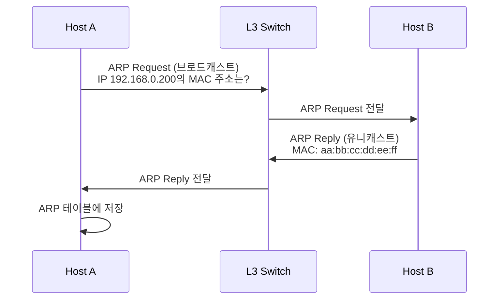

# L2/L3 스위치 & ARP 트러블슈팅

> 네트워크 스위치와 ARP 문제 해결 실전 가이드

## 네트워크 레이어 기본

### L2 Switch (Data Link Layer)

**MAC Learning**:
- 스위치가 어떤 포트로 프레임을 전달할지 결정
- MAC 주소 테이블 자동 학습
- 출발지 MAC 주소를 보고 포트 매핑

**동작 방식**:
```
1. 프레임 수신 → 출발지 MAC 주소 기록 (포트 번호와 함께)
2. 목적지 MAC 주소 확인
   - 테이블에 있음 → 해당 포트로 전달 (Unicast)
   - 테이블에 없음 → 모든 포트로 전달 (Flooding)
```

### L3 Switch (Network Layer)

**기능**:
- IP 주소 기반 라우팅
- VLAN 간 통신
- ARP를 통한 MAC ↔ IP 매핑

**VLAN (Virtual LAN)**:
- IP 대역을 논리적으로 분리
- 브로드캐스트 도메인 격리
- 목적: 네트워크 세그먼테이션, 보안, 트래픽 관리

## ARP (Address Resolution Protocol)

### 기본 개념

**역할**: MAC 주소 ↔ IP 주소 매핑

**프로세스**:


### ARP 테이블

**확인 방법**:
```bash
# Linux/macOS
arp -a

# Windows
arp -a

# 출력 예시
Internet  192.168.0.100         0   b8:27:eb:12:34:56      ARPA
Internet  192.168.0.200         0   Incomplete             ARPA
```

**상태 설명**:

| 상태 | 의미 | 원인 |
|------|------|------|
| **정상 MAC 주소** | ARP 응답 받음 | 정상 통신 중 |
| **Incomplete** | ARP 응답 없음 | 1) 대상 호스트 다운<br/>2) 네트워크 단절<br/>3) 방화벽 차단<br/>4) **ARP 테이블 만료** |

**ARP 테이블 특징**:
- ⏱️ **TTL (Time To Live)**: 일정 시간 후 자동 만료
- 📦 **지속 조건**: 패킷이 지속적으로 지나가야 유지
- 🔄 **갱신 주기**: 일반적으로 60초~240초 (OS/스위치마다 다름)

## 트러블슈팅 사례

### 사례 1: ARP Incomplete 문제

**증상**:
```bash
$ arp -a
Internet  192.168.0.200         0   Incomplete      ARPA
```

**원인 분석**:
1. ✅ **대상 호스트 확인**: `ping 192.168.0.200` → 응답 없음
2. ✅ **네트워크 경로 확인**: L3 스위치까지는 정상
3. ❌ **ARP 브로드캐스트 전달 실패**: 스위치에서 응답 없음

**원인**: L3 스위치가 ARP Request를 브로드캐스트했으나 응답 없음 → 대상 호스트 문제 가능성 70%

**해결 과정**:
1. 스위치 설정 확인 (변경 이력 없음)
2. **케이블 확인** (물리 계층)
3. **호스트 네트워크 설정 확인**

### 사례 2: VIP 설정 시 커널 무시 문제

**증상**:
- VIP(Virtual IP)로 들어오는 패킷을 커널이 무시

**원인**:
- Linux 커널 파라미터 `rp_filter` (Reverse Path Filtering)
- 기본값 = 1 (Strict mode)
- **자신의 인터페이스에 바인딩된 IP가 아니면 패킷 무시**

**해결**:
```bash
# rp_filter 확인
sysctl net.ipv4.conf.all.rp_filter
sysctl net.ipv4.conf.eth0.rp_filter

# rp_filter 비활성화 (VIP 허용)
sysctl -w net.ipv4.conf.all.rp_filter=0
sysctl -w net.ipv4.conf.eth0.rp_filter=0

# 영구 적용 (/etc/sysctl.conf)
net.ipv4.conf.all.rp_filter = 0
net.ipv4.conf.eth0.rp_filter = 0
```

**rp_filter 값**:

| 값 | 모드 | 동작 |
|---|------|------|
| 0 | Disabled | 모든 패킷 허용 (VIP 사용 가능) |
| 1 | Strict | 바인딩된 IP만 허용 (기본값) |
| 2 | Loose | 라우팅 가능하면 허용 |

### 사례 3: arping으로 스위치 MAC 테이블 갱신

**문제**:
- VIP 설정 후에도 스위치가 패킷을 전달하지 않음

**원인**:
- 스위치의 MAC 주소 테이블이 구 호스트를 가리킴
- VIP가 새 호스트로 이동했지만 스위치가 아직 학습 안 됨

**해결: arping**:
```bash
# arping: ARP 레벨에서 Gratuitous ARP 전송
# 목적: 스위치에 "내 MAC이 이거임" 알림
arping -U -I eth0 192.168.0.100

# 옵션 설명:
# -U: Gratuitous ARP (요청 없이 자발적으로 보냄)
# -I: 인터페이스 지정
```

**동작 원리**:
1. Gratuitous ARP를 브로드캐스트
2. 스위치가 ARP 패킷 출발지 MAC 주소 학습
3. **스위치 MAC 테이블 업데이트**: VIP → 새 호스트 MAC
4. 이후 패킷이 정상적으로 새 호스트로 전달됨

## 스위치 설정 (Cisco 예시)

### 기본 명령어

```bash
# 스위치 접속
ssh admin@<switch-ip>

# enable 모드 진입 (항상 필수!)
enable

# 설정 모드
configure terminal

# VLAN 확인
show vlan

# MAC 주소 테이블 확인
show mac address-table

# ARP 테이블 확인
show ip arp

# 특정 포트 상태 확인
show interface GigabitEthernet1/0/1
```

**중요**: `enable` 명령은 항상 실행해야 설정 권한을 얻음

### 스위치 설정 변경 주의사항

**스위치 설정은 자주 변경하지 않음**:
- 새로운 망 추가가 아니면 거의 변경 없음
- 변경 시 영향 범위가 크므로 신중히 계획

**트러블슈팅 시 우선순위**:
1. **노드 문제** (70%): 호스트 네트워크 설정, 케이블, NIC
2. **ARP 테이블 만료** (20%): arping으로 갱신
3. **스위치 설정** (10%): 설정 변경 이력 확인

## 트러블슈팅 체크리스트

### 1단계: 기본 확인
```bash
# Ping 테스트
ping <target-ip>

# ARP 테이블 확인
arp -a

# 라우팅 테이블 확인
ip route
```

### 2단계: 물리 계층
- [ ] 케이블 연결 상태
- [ ] NIC LED 상태
- [ ] 스위치 포트 LED

### 3단계: 네트워크 계층
- [ ] IP 주소 설정 (`ip addr`)
- [ ] 서브넷 마스크
- [ ] 게이트웨이 설정
- [ ] rp_filter 설정 (VIP 사용 시)

### 4단계: 스위치 레벨
- [ ] MAC 주소 테이블 (`show mac address-table`)
- [ ] ARP 테이블 (`show ip arp`)
- [ ] VLAN 설정 (`show vlan`)
- [ ] 포트 설정 (`show interface`)

### 5단계: ARP 갱신
```bash
# Gratuitous ARP 전송
arping -U -I eth0 <vip>

# ARP 캐시 삭제 후 재학습
arp -d <ip>
ping <ip>
```

## 핵심 개념 정리

| 계층 | 프로토콜/장비 | 주요 역할 |
|------|------------|---------|
| L2 | MAC, Switch | MAC Learning, 포트 전달 |
| L3 | IP, ARP, Router/L3 Switch | IP 라우팅, MAC ↔ IP 매핑 |

**ARP 트러블슈팅 핵심**:
1. ARP 테이블은 TTL이 있어 주기적으로 만료됨
2. VIP 설정 시 `rp_filter=0` 필요
3. arping으로 스위치 MAC 테이블 강제 갱신
4. 문제의 70%는 노드(호스트) 문제

## 참고 자료

- [Cisco Switch 기본 설정](https://www.cisco.com/c/en/us/support/docs/switches/catalyst-2900-xl-series-switches/24048-146.html)
- [Linux ARP 관리](https://linux.die.net/man/8/arp)
- [arping 사용법](https://linux.die.net/man/8/arping)
