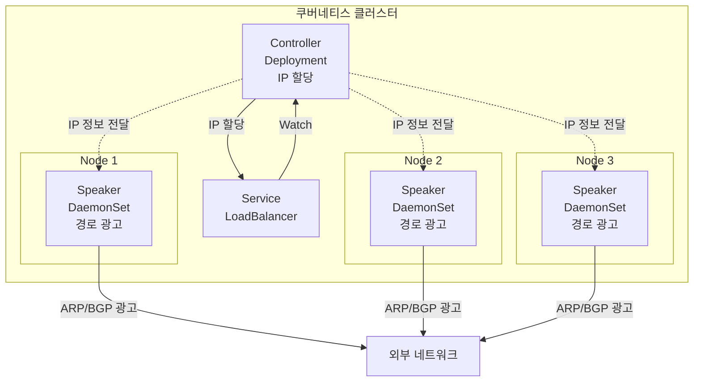
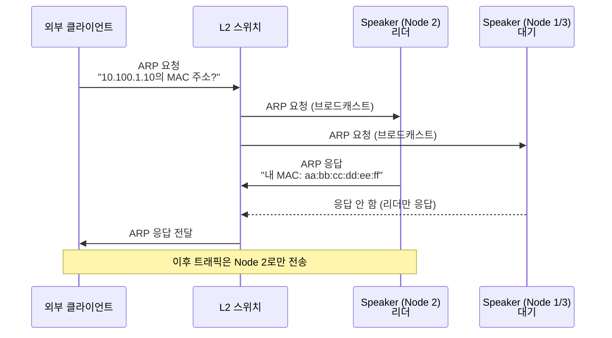
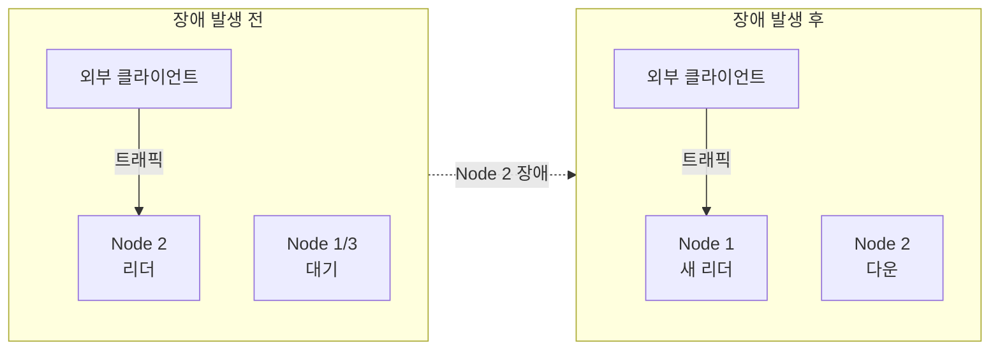

# MetalLB

> 온프레미스 쿠버네티스 환경에서 LoadBalancer 타입 Service를 지원하는 네트워크 로드 밸런서를 정리한다.

MetalLB는 클라우드 환경 없이도 LoadBalancer 타입 Service를 사용할 수 있게 해주는 오픈소스 프로젝트다. Layer 2 모드와 BGP 모드 두 가지 방식으로 동작하며, 온프레미스 및 베어메탈 환경에서 필수적인 컴포넌트다.

## MetalLB가 필요한 이유

### 클라우드 vs 온프레미스

**클라우드 환경 (EKS/GKE/AKS)**:

```yaml
apiVersion: v1
kind: Service
metadata:
  name: my-service
spec:
  type: LoadBalancer  # 자동으로 ELB/NLB 생성
  ports:
  - port: 80
```

클라우드에서는 LoadBalancer 타입 Service 생성 시 자동으로 외부 로드 밸런서(ELB, NLB, Cloud Load Balancer)가 프로비저닝되고 External IP가 할당된다.

**온프레미스 환경 (MetalLB 없음)**:

```bash
kubectl get svc my-service
NAME         TYPE           EXTERNAL-IP   PORT(S)
my-service   LoadBalancer   <pending>     80:30123/TCP
```

LoadBalancer 타입을 지원하는 컨트롤러가 없어서 External IP가 할당되지 않고 Pending 상태로 남는다.

**온프레미스 환경 (MetalLB 설치 후)**:

```bash
kubectl get svc my-service
NAME         TYPE           EXTERNAL-IP    PORT(S)
my-service   LoadBalancer   10.100.1.10    80:30123/TCP
```

MetalLB가 IP Pool에서 IP를 할당하고 외부 네트워크에 경로를 광고한다.

### 대안 방법 비교

| 방법 | 장점 | 단점 | 사용 사례 |
|------|------|------|-----------|
| **NodePort** | 설정 간단 | 포트 범위 제한(30000-32767)<br/>노드 IP 변경 시 재설정 | 개발/테스트 |
| **HostPort** | 특정 포트 사용 가능 | 노드당 1개 Pod만 배포 가능 | Static 워크로드 |
| **Ingress Controller** | HTTP(S) 라우팅 | L7만 지원, TCP/UDP 제한적 | 웹 애플리케이션 |
| **MetalLB** | LoadBalancer 네이티브 지원<br/>모든 프로토콜 지원 | 네트워크 설정 필요 | 프로덕션 환경 |

## 아키텍처

MetalLB는 두 가지 컴포넌트로 구성된다.



### Controller

**역할**:

- LoadBalancer 타입 Service 감시
- IP Pool에서 사용 가능한 IP 선택 및 할당
- Service의 `.status.loadBalancer.ingress` 필드 업데이트

**실행 방식**:

- Deployment (리더 선출 방식, 단일 인스턴스만 Active)
- kube-controller-manager처럼 동작

### Speaker

**역할**:

- 할당된 IP를 외부 네트워크에 광고
- Layer 2 모드: ARP/NDP 응답
- BGP 모드: BGP 피어링 및 경로 광고

**실행 방식**:

- DaemonSet (모든 노드에서 실행)
- 리더 선출 (Layer 2 모드에서만)

## Layer 2 모드

### 동작 원리

Layer 2 모드에서는 한 노드의 Speaker가 리더로 선출되어 Service IP에 대한 ARP 요청에 응답한다.



**특징**:

- 리더 노드만 Service IP에 대한 ARP 응답
- 모든 트래픽이 리더 노드로 집중
- GARP(Gratuitous ARP)를 통한 페일오버

### 페일오버 (Failover)



**페일오버 과정**:

1. 리더 노드(Node 2) 다운
2. 대기 노드 중 하나(Node 1)가 새 리더로 선출 (10초 이내)
3. 새 리더가 GARP(Gratuitous ARP) 전송: "10.100.1.10은 이제 내 MAC 주소다"
4. L2 스위치의 MAC 테이블 갱신
5. 이후 트래픽은 새 리더(Node 1)로 전송

**GARP (Gratuitous ARP)**:

- 요청하지 않았는데도 보내는 ARP 응답
- 네트워크의 모든 장비에게 "내 IP의 MAC 주소가 바뀌었다"고 알림
- 페일오버 시간 단축 (수초 이내)

### 설정 예시

**IPAddressPool 생성**:

```yaml
apiVersion: metallb.io/v1beta1
kind: IPAddressPool
metadata:
  name: default-pool
  namespace: metallb-system
spec:
  addresses:
  - 10.100.1.10-10.100.1.20  # 사용할 IP 대역
```

**L2Advertisement 생성**:

```yaml
apiVersion: metallb.io/v1beta1
kind: L2Advertisement
metadata:
  name: default
  namespace: metallb-system
spec:
  ipAddressPools:
  - default-pool
```

**Service 생성**:

```yaml
apiVersion: v1
kind: Service
metadata:
  name: nginx
spec:
  type: LoadBalancer
  selector:
    app: nginx
  ports:
  - port: 80
    targetPort: 80
```

**결과 확인**:

```bash
kubectl get svc nginx
NAME    TYPE           EXTERNAL-IP    PORT(S)
nginx   LoadBalancer   10.100.1.10    80:31234/TCP

# 리더 노드 확인
kubectl logs -n metallb-system speaker-xxxxx | grep leader
# "became leader for 10.100.1.10"
```

### 장단점

**장점**:

- 설정 간단 (외부 라우터 설정 불필요)
- 동일 L2 네트워크에서 즉시 사용 가능
- ARP 기반이라 대부분의 네트워크 장비 호환

**단점**:

- 단일 노드로 트래픽 집중 (로드 밸런싱 불가)
- L2 브로드캐스트 도메인 내에서만 동작
- 페일오버 시 일시적인 트래픽 손실 (수초)
- 대규모 환경에서 ARP 스톰 위험

## BGP 모드

BGP 모드에서는 모든 노드의 Speaker가 외부 라우터와 BGP 피어링을 맺고 Service IP를 광고한다. 외부 라우터는 ECMP를 통해 여러 노드로 트래픽을 분산한다.

**상세 내용은 [BGP 문서](bgp.md#metallb-bgp-모드)를 참고한다.**

### Layer 2 vs BGP 비교

| 구분 | Layer 2 | BGP |
|------|---------|-----|
| **외부 라우터 설정** | 불필요 | 필수 (BGP 피어링) |
| **로드 밸런싱** | 불가 (단일 노드) | 가능 (ECMP) |
| **네트워크 범위** | 동일 L2 세그먼트 | L3 라우팅 가능 |
| **페일오버 시간** | 수초 (GARP) | 수초 (BGP Keepalive) |
| **확장성** | 낮음 | 높음 |
| **설정 복잡도** | 낮음 | 높음 |

**선택 기준**:

- **Layer 2 모드**: 단일 L2 네트워크, 간단한 설정, 소규모 환경
- **BGP 모드**: 멀티 라우터, 대규모 트래픽, 여러 데이터센터

## 설치

### Helm을 통한 설치

```bash
# Helm 차트 추가
helm repo add metallb https://metallb.github.io/metallb
helm repo update

# 설치
helm install metallb metallb/metallb -n metallb-system --create-namespace

# 설치 확인
kubectl get pods -n metallb-system
NAME                          READY   STATUS
controller-xxx                1/1     Running
speaker-xxx                   1/1     Running  # 각 노드마다 1개
```

### Manifest를 통한 설치

```bash
kubectl apply -f https://raw.githubusercontent.com/metallb/metallb/v0.14.0/config/manifests/metallb-native.yaml
```

**확인**:

```bash
kubectl get all -n metallb-system
NAME                              READY   STATUS
pod/controller-xxx                1/1     Running
pod/speaker-xxx (DaemonSet)       1/1     Running

NAME                         TYPE        CLUSTER-IP
service/webhook-service      ClusterIP   10.96.xxx.xxx
```

## IP 할당 방식

### Auto Assign

**기본 방식**: Service에 특별한 annotation 없으면 첫 번째 IPAddressPool에서 자동 할당

```yaml
apiVersion: v1
kind: Service
metadata:
  name: nginx
spec:
  type: LoadBalancer  # IP Pool에서 자동 할당
```

### 특정 Pool 지정

```yaml
apiVersion: v1
kind: Service
metadata:
  name: nginx
  annotations:
    metallb.universe.tf/address-pool: production-pool
spec:
  type: LoadBalancer
```

### 특정 IP 지정

```yaml
apiVersion: v1
kind: Service
metadata:
  name: nginx
spec:
  type: LoadBalancer
  loadBalancerIP: 10.100.1.15  # 특정 IP 요청
```

**주의**: `loadBalancerIP`는 Kubernetes v1.24부터 deprecated되었지만 MetalLB는 여전히 지원한다.

### IP 공유 (Shared IP)

여러 Service가 동일한 IP를 공유하되, 포트는 달라야 한다.

```yaml
apiVersion: v1
kind: Service
metadata:
  name: dns-tcp
  annotations:
    metallb.universe.tf/allow-shared-ip: dns
spec:
  type: LoadBalancer
  loadBalancerIP: 10.100.1.10
  ports:
  - port: 53
    protocol: TCP
---
apiVersion: v1
kind: Service
metadata:
  name: dns-udp
  annotations:
    metallb.universe.tf/allow-shared-ip: dns  # 동일한 그룹
spec:
  type: LoadBalancer
  loadBalancerIP: 10.100.1.10  # 동일한 IP
  ports:
  - port: 53
    protocol: UDP
```

**사용 사례**:

- DNS 서버 (TCP + UDP 포트 53)
- 게임 서버 (여러 프로토콜 조합)

## 실무 트러블슈팅

### External IP가 Pending 상태

**증상**:

```bash
kubectl get svc my-service
NAME         TYPE           EXTERNAL-IP   PORT(S)
my-service   LoadBalancer   <pending>     80:30123/TCP
```

**원인 및 해결**:

| 원인 | 확인 방법 | 해결 방법 |
|------|----------|----------|
| IP Pool 없음 | `kubectl get ipaddresspool -n metallb-system` | IPAddressPool 생성 |
| IP Pool 고갈 | Pool의 addresses 범위 확인 | 범위 확장 또는 사용하지 않는 Service 삭제 |
| Controller 미실행 | `kubectl get pods -n metallb-system` | Controller Pod 재시작 |
| loadBalancerIP 범위 밖 | Service YAML 확인 | IP를 Pool 범위 내로 수정 |

**디버깅**:

```bash
# Controller 로그 확인
kubectl logs -n metallb-system deployment/controller

# 일반적인 에러 메시지
# "no available IPs" → IP Pool 고갈
# "IP not in any pool" → loadBalancerIP가 범위 밖
```

### Layer 2 모드에서 트래픽이 도달하지 않음

**증상**:

- External IP는 할당됨
- 외부에서 해당 IP로 접근 불가

**확인 방법**:

```bash
# 1. 리더 노드 확인
kubectl logs -n metallb-system speaker-xxx | grep leader
# "became leader for 10.100.1.10"

# 2. 외부 클라이언트에서 ARP 테이블 확인
arp -a | grep 10.100.1.10
# 10.100.1.10 at aa:bb:cc:dd:ee:ff on eth0

# 3. 리더 노드에서 Service Endpoint 확인
kubectl get endpoints my-service
NAME         ENDPOINTS
my-service   10.244.1.5:80,10.244.2.3:80
```

**원인 및 해결**:

| 원인 | 해결 방법 |
|------|----------|
| L2Advertisement 없음 | L2Advertisement 리소스 생성 |
| 네트워크 방화벽 차단 | Service 포트 허용 |
| Pod가 Ready 상태 아님 | `kubectl get pods` 확인 및 수정 |
| Service selector 불일치 | `kubectl describe svc` 확인 |

### BGP 피어링 문제

**BGP 모드 관련 트러블슈팅은 [BGP 문서](bgp.md#실무-트러블슈팅)를 참고한다.**

### IP 충돌

**증상**:

```bash
kubectl logs -n metallb-system speaker-xxx
# "IP 10.100.1.10 is already in use"
```

**원인**:

- MetalLB IP Pool과 다른 시스템이 동일한 IP 사용
- DHCP 서버가 동일 범위에서 IP 할당

**해결**:

1. IP Pool 범위를 DHCP와 겹치지 않게 설정
2. 네트워크 관리자와 IP 할당 대역 조율
3. `arping` 명령으로 IP 사용 여부 확인

```bash
# 외부 노드에서
arping -c 3 10.100.1.10
# 응답이 있으면 이미 사용 중
```

### Speaker Pod CrashLoopBackOff

**증상**:

```bash
kubectl get pods -n metallb-system
NAME          READY   STATUS             RESTARTS
speaker-xxx   0/1     CrashLoopBackOff   5
```

**확인**:

```bash
kubectl logs -n metallb-system speaker-xxx
# "failed to create layer2 announcer: permission denied"
```

**원인**:

- Speaker가 네트워크 인터페이스 접근 권한 없음
- securityContext 설정 누락

**해결**:

Speaker는 `privileged: true` 및 `hostNetwork: true` 필요

```yaml
# Helm values.yaml
speaker:
  securityContext:
    runAsUser: 0
    privileged: true
```

## 참고

- [MetalLB Official Documentation](https://metallb.universe.tf/)
- [MetalLB GitHub](https://github.com/metallb/metallb)
- [BGP 모드 상세](bgp.md)
