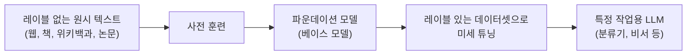
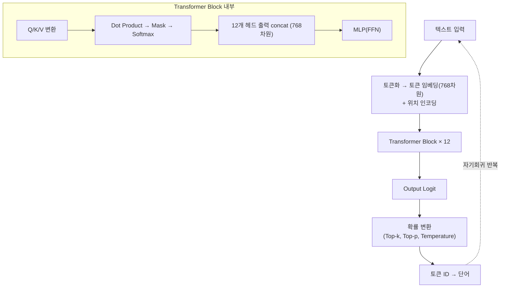
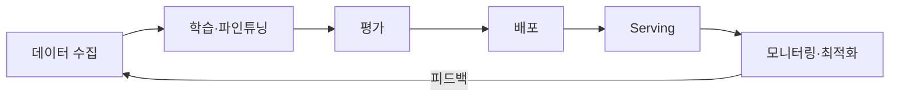
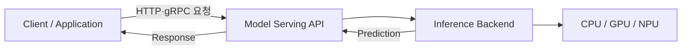
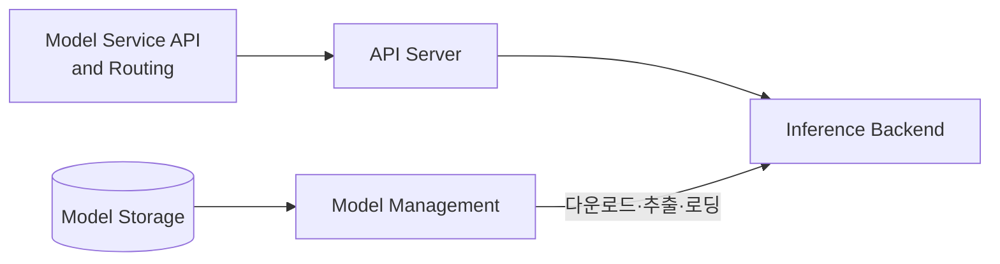
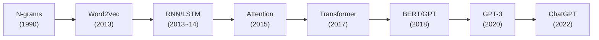
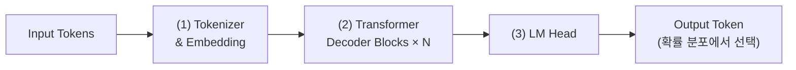
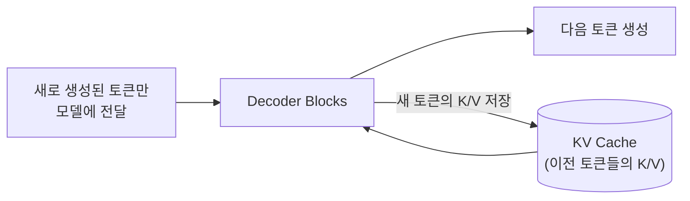
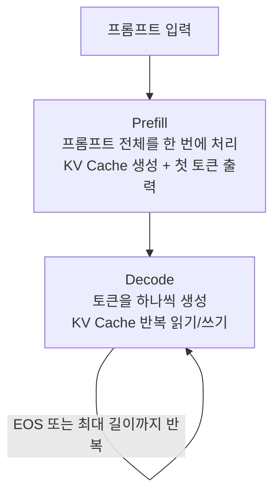
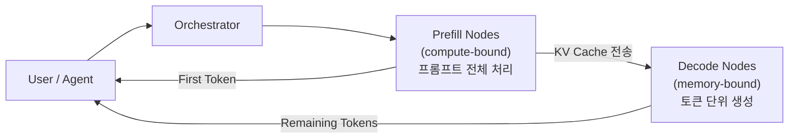

---
tags:
  - vLLM
  - LLM
  - Transformer
  - Model Serving
  - KV Cache
  - PagedAttention
  - Prefill
  - Decode
---

# LLM 기초 & Model Serving

> 퍼셉트론에서 트랜스포머까지 LLM의 동작 원리를 이해하고, 모델 서빙의 개념과 방안(On-Device, Single-model, Multi-model), 그리고 KV Cache·Prefill/Decode·PagedAttention으로 이어지는 LLM 서빙 최적화의 핵심을 정리한다.

## 인공지능 기초

### 퍼셉트론과 가중치 학습

인공신경망의 최소 단위인 퍼셉트론은 입력에 가중치(Weight)를 곱해 더하고, 그 합이 역치(threshold)를 넘으면 1, 아니면 0을 출력한다. 키와 몸무게로 아이/어른을 분류하는 예시로 학습 과정을 살펴본다.

| 키 | 몸무게 | 정답 |
|----|--------|------|
| 0.7 | 0.8 | 어른(1) |
| 0.8 | 0.6 | 어른(1) |
| 0.3 | 0.2 | 아이(0) |
| 0.6 | 0.7 | 어른(1) |
| 0.3 | 0.4 | 아이(0) |

처음 가중치는 랜덤 값(키 0.3, 몸무게 0.2)으로 시작한다. 어른 데이터 (0.7, 0.8)을 넣으면 0.7 × 0.3 + 0.8 × 0.2 = 0.37로 역치 0.5를 넘지 못해 "아이"로 잘못 판정된다. 가중치를 0.5로 올리면 0.7 × 0.5 + 0.8 × 0.5 = 0.75 > 0.5가 되어 정답을 맞춘다.

**컴퓨터는 이렇게 가중치를 변경해가면서 오차가 없어질 때까지 반복 계산하여 최적의 가중치를 찾는다.** 이것이 학습이다. 최적의 가중치를 찾고 나면 어떤 새로운 데이터를 넣어도 분류할 수 있다.

전통 프로그래밍과 머신러닝의 차이는 공식으로 정리된다.

- 전통 프로그래밍: **입력 + 규칙 → 결과**

- 머신러닝: **입력(충분한 데이터) + 결과(정답) → 모델(규칙)**

### 딥러닝으로의 확장

단일 퍼셉트론은 직선 하나로 나눌 수 있는 문제만 풀 수 있다. 층을 더 많이 쌓아 복잡한 데이터를 처리하는 것이 딥러닝이다.

- **순전파**: 데이터가 입력층 → 은닉층 → 출력층으로 전파되며 계산된다

- **역전파**: 출력값에 오차가 생기면 출력에 가까운 쪽부터 역방향으로 가중치를 수정한다

- 가중치 수정이 끝나면 다시 순전파로 계산하고, 오차가 생기면 다시 역전파하는 과정을 반복한다

언어를 처리할 때는 한 번의 예측으로 끝나지 않는다. 앞 단어의 결과와 가중치가 다음 단어 예측에 재사용되는 유연한 구조가 필요하다. **가중치는 모델의 두뇌와 같은 역할**을 하며, 학습된 가중치가 모델의 동작을 결정한다.

### GPU가 병렬 연산에 강한 이유

GPU는 행렬 연산 중심으로 설계됐다. Core/ALU가 여러 개면 한꺼번에 계산할 수 있는데, 단 각 계산이 독립적이어야 한다. 그래픽 픽셀은 독립적으로 계산되므로 GPU가 발전했고, 이를 일반 데이터 처리에 활용한 것이 CUDA다.

| 구분 | 설명 |
|------|------|
| SIMD | Single Instruction Multiple Data. 하나의 명령으로 여러 데이터를 처리. 100개 Core에 스레드를 하나씩 할당 |
| SIMT | Single Instruction Multiple Threading. 스레드 중심 처리 방식. 스레드와 Core를 그룹으로 묶어 배치 |
| Warp | 스레드를 일정 개수씩 묶은 그룹. 하나의 warp 안의 스레드가 각각 하나의 코어에 할당되어 연산 |
| Latency Hiding | warp 작업 중 메모리 지연이 발생하면 바로 다음 warp를 수행해 연산이 끊기지 않게 함 |

RTX 3090에는 1만 개가 넘는 코어가 들어가 있고, 코어는 128개씩 그룹으로 묶여 있다. GPU 내부는 여러 SM(Streaming Multiprocessor)으로 구성되며, 각 SM 안에 Tensor Core와 L1 캐시가 있고 L2 캐시는 공유된다. 이 병렬 구조가 이후 다룰 트랜스포머의 행렬 연산, 그리고 서빙 시 정밀도(dtype)·양자화 선택과 직결된다.

## LLM 기초

### 인공지능 분야의 계층 관계

AI ⊃ 머신러닝 ⊃ 딥러닝 ⊃ LLM의 관계다. LLM(Large Language Model)은 사람의 텍스트를 해석하고 생성하는 심층 신경망이며, 생성형 AI(GenAI)는 딥러닝과 LLM에 걸쳐 있다.

### 사전 훈련과 미세 튜닝



- **사전 훈련(pretraining)**: 수조 개 단어 규모의 레이블 없는 텍스트로 첫 번째 훈련을 수행해 파운데이션 모델을 얻는다

- **미세 튜닝(fine-tuning)**: 사전 훈련된 모델을 레이블 있는 데이터셋에서 추가 훈련해 특정 작업에 맞춘다

ChatGPT 초기 버전의 베이스 모델인 GPT-3의 사전 훈련 데이터셋 규모는 다음과 같다.

| 데이터셋 | 설명 | 토큰 개수 |
|----------|------|----------|
| CommonCrawl(필터링됨) | 웹 크롤 데이터 | 4,100억 개 |
| WebText2 | 웹 크롤 데이터 | 190억 개 |
| Books1 | 인터넷 기반 도서 말뭉치 | 120억 개 |
| Books2 | 인터넷 기반 도서 말뭉치 | 550억 개 |
| 위키백과 | 고품질 텍스트 | 30억 개 |

### 트랜스포머 아키텍처

2017년 구글 논문 "Attention Is All You Need"에서 소개된 구조로, 인코더(encoder)와 디코더(decoder) 두 서브모듈로 구성된다.

- **인코더**: 입력 텍스트를 처리해 문맥 정보를 포착하는 수치 표현(벡터)으로 인코딩한다

- **디코더**: 인코딩된 벡터를 받아 출력 텍스트를 생성한다

인코더와 디코더 모두 **셀프 어텐션(self-attention) 메커니즘**으로 연결된 많은 층으로 구성된다. 셀프 어텐션은 시퀀스 안의 서로 다른 토큰에 상대적인 가중치를 부여해, 긴 범위에 걸친 의존성과 맥락 관계를 포착할 수 있게 한다.

같은 트랜스포머를 기반으로 하지만 BERT와 GPT는 훈련 방식이 다르다.

| 구분 | BERT | GPT |
|------|------|-----|
| 사용 모듈 | 인코더 | 디코더 |
| 훈련 방식 | 랜덤하게 단어를 마스킹한 입력을 받아 누락된 단어를 예측 | 불완전한 텍스트를 받아 다음 단어를 생성 |
| 문맥 처리 | 양방향 | 단방향(왼쪽에서 오른쪽) |
| 주 용도 | 텍스트 분류 | 텍스트 생성 |

### GPT의 자기회귀 생성

GPT는 원본 트랜스포머의 디코더 부분만 사용하며, 이전 라운드의 출력이 다음 라운드의 입력으로 사용된다. 한 번에 한 단어씩 예측하며 텍스트를 생성하는 **자기회귀 모델(autoregressive model)** 이다.


재훈련이나 구조 변경 없이 입력만으로 다양한 작업을 해결할 수 있다.

| 작업 유형 | 입력 | 출력 |
|-----------|------|------|
| 텍스트 완성 | "Breakfast is the" | "most important meal of..." |
| 제로-샷 | "Translate English to German: breakfast =>" | "Frühstück" |
| 퓨-샷 | "gaot => goat / sheo => shoe / pohne =>" | "phone" |

- **제로-샷(zero-shot)**: 구체적인 예시 없이 지시만으로 작업을 수행한다

- **퓨-샷(few-shot)**: 프롬프트 안에 몇 개의 예시를 제공하면 그 패턴을 참고해 답을 생성한다. 가중치는 업데이트되지 않고 프롬프트 문맥 안에서만 참고한다

기존 머신러닝은 새 태스크마다 별도 미세 튜닝이 필요했지만, 대규모 모델은 학습 없이 프롬프트만으로 적응한다. 이는 규모 확대의 결과로 나타난 창발적 능력(emergent ability)이다. 파라미터 규모는 GPT-1 1.17억 개 → GPT-3 1,750억 개 → DeepSeek R1 6,710억 개로 커졌다.

### GPT-2 Small 구조

트랜스포머 내부를 구체적인 숫자로 이해하기 위한 기준 모델이다.

| 항목 | 값 |
|------|-----|
| 파라미터 수 | 124M (약 1.2억 개) |
| 모델 구조 | Decoder-only Transformer |
| Context Length | 1024 |
| 임베딩 차원 | 768 (각 토큰이 768개의 숫자로 표현됨) |
| Transformer Block | 12개 |
| Attention Head | 블록당 12개 |
| Attention 방식 | Masked Self-Attention (미래 단어를 미리 볼 수 없음) |
| FFN(MLP) 크기 | 3,072차원 |
| Weight 공유 | 토큰 임베딩과 마지막 출력층의 Weight를 공유 (weight tying) |

### 다음 단어 예측 파이프라인

Transformer Explainer(GPT-2 small 기준)로 확인한 전체 흐름이다.



- **Q, K, V 임베딩**: 셀프 어텐션 수행을 위해 토큰 임베딩을 서로 다른 가중치와 편향으로 Query/Key/Value로 변환한다

- **멀티-헤드 셀프 어텐션**: 12개 헤드가 각기 다른 패턴(문법, 의미, 관계 등)으로 주의를 파악하며, GPU에서 병렬 연산된다. 반면 12개 블록은 이전 블록의 출력을 입력으로 받으므로 순차 연산이다

- **Masked Attention**: Query와 Key의 유사도를 내적(Dot Product)으로 계산하고, Mask를 적용한 뒤 Softmax로 가중치화한다

- **MLP(FFN)**: 각 토큰의 정보를 한 번 더 깊게 가공하는 작은 신경망이다

- **Residual Connection**: Attention이나 MLP의 결과에 원래 입력을 다시 더해 입력 정보를 보존한다

- **Layer Normalization**: 토큰 벡터 안의 숫자 크기를 일정하게 정리한다

## Model Serving 개요

### 모델의 구성 요소

모델은 가중치 파일 하나가 아니라 **데이터·구조·실행 코드가 합쳐진 실행 가능한 소프트웨어**다.

| 구성 요소 | 내용 |
|-----------|------|
| 모델 데이터 | 학습으로 얻은 Weight, Bias, Configuration. 배치 크기, 입출력 텐서, 임베딩 등 실행 메타데이터 포함 |
| 모델 아키텍처 | 레이어 구조, 연결 방식, 연산 정의. LLM이라면 Embedding → Transformer Block → Attention → FFN → Output head |
| 모델 실행 코드 | 아키텍처 초기화 → Weight 로드 → 추론 모드 설정 → 입력 전달 → 예측 결과 생성 |

서빙 시 실행 코드는 다음과 같이 단순하다.

```python
model = TheModelClass(*args, **kwargs)
model.load_state_dict(torch.load("model_weights.pt", weights_only=True))
model.eval()
pred = model(inputs)
```

아키텍처와 Weight를 분리해 저장하면 버전 변경, 부분 로딩, 미세 튜닝, 레이어 추가 같은 운영 시나리오에 유연하다. 실제 모델 저장소에는 여러 종류의 파일이 함께 존재한다.

| 파일 | 역할 |
|------|------|
| `config.json` | 모델 아키텍처 정보 (레이어 수, hidden size, 어텐션 헤드 수 등). 이 파일만으로 모델 구조 재구성 가능 |
| `generation_config.json` | 텍스트 생성 기본 파라미터 (max_length, temperature, top_p 등) |
| `pytorch_model.bin` | PyTorch 전통 가중치 포맷 (pickle 기반) |
| `model.safetensors` | 최신 표준 포맷. 임의 코드 실행 위험이 없고 로딩이 더 빠름 |
| `tokenizer.json` | Fast tokenizer용 통합 파일 (vocab + merge rules + 설정) |

### 모델 생명주기와 서빙



모델 서빙은 학습된 모델이 실제 요청을 받아 예측 결과를 반환하는 운영 단계다. 훈련과 서빙은 관점이 다르다.

| 구분 | 훈련 | 서빙 |
|------|------|------|
| 핵심 지표 | 정확도, 학습 효율 | 지연 시간, 처리량, 안정성, 비용, 보안, 모니터링 |

서빙의 기본 구조는 클라이언트가 HTTP/gRPC로 요청을 보내면, Model Serving API가 요청을 받아 Inference Backend가 CPU/GPU/NPU에서 모델을 실행하고 결과를 반환하는 흐름이다.



전체 추론 스택은 두 계층으로 나뉜다.

- **Runtime 계층**: Batching, Caching, Quantization, Speculation, Parallelism, Disaggregation 같은 모델 성능 기법과 서빙 엔진(vLLM, SGLang, TensorRT-LLM), 그 아래 PyTorch → CUDA

- **Infrastructure 계층**: Routing/Load Balancing, Autoscaling, Multi-Cloud Capacity Management, GPU·스토리지·네트워킹

### 왜 서빙 최적화가 필수인가

LLM은 별도 최적화 없이 서빙하면 실사용자가 몰릴 때 빠르게 문제가 생긴다.

- 부하가 걸리면 지연 시간(latency)이 증가한다

- 처리량(throughput)이 하드웨어 성능보다 훨씬 낮은 수준에서 정체된다

- 사용량이 늘수록 비용이 선형 이상으로 증가한다

Alphabet 회장 John Hennessy는 2023년 인터뷰에서 "LLM 요청 1건 처리 비용이 전통적인 키워드 검색보다 10배 비쌀 수 있다"고 언급했다. 데모 단계에서 잘 작동하던 시스템이 실제 유저가 유입되면 경제적으로 감당 불가능해지는 경우가 많다. LLM에서 최적화는 선택이 아니라 필수다.

모델 서빙 최적화의 목표는 다음과 같다.

- 낮은 latency, 안정적인 tail latency

- 높은 throughput, 높은 GPU 활용률

- 낮은 cost per request, 효율적인 메모리 사용

핵심 메시지는 **"모든 상황에 맞는 하나의 서빙 솔루션은 없다"**는 것이다. 모델 크기, 트래픽 패턴, 보안 요구사항, 비용 구조, 지연 시간 목표에 따라 다른 설계가 필요하다. 서빙의 기본기를 알아야 새 기술이 나왔을 때 장단점을 판단하고, 특정 프레임워크나 벤더에 종속되지 않은 선택을 할 수 있다.

### vLLM 소개

vLLM은 high-throughput, low-latency LLM 서빙을 위해 설계된 대표적인 오픈소스 추론/서빙 엔진이다. 핵심 혁신은 다섯 가지다.

| 기법 | 내용 |
|------|------|
| PagedAttention | KV Cache를 가상 메모리처럼 고정 크기 블록(페이지)으로 분할 관리. 메모리 파편화 감소, 동시 요청 증가 |
| Continuous Batching | 다른 요청이 생성 중이어도 새 요청을 즉시 배치에 추가. GPU 유휴 시간 제거 |
| KV Cache 관리 | KV 블록을 요청 간 재사용, 드물게 쓰는 블록 evict. 더 긴 컨텍스트와 높은 처리량 |
| Tensor Parallelism | 단일 GPU에 들어가지 않는 큰 모델을 여러 GPU에 분산 |
| OpenAI-Compatible API | OpenAI API와 호환되는 형태로 자체 LLM 배포·연동 |

OpenAI 호환 API 서버는 명령 한 줄로 띄울 수 있다.

```bash
vllm serve Qwen/Qwen3-7B-Instruct \
  --trust-remote-code \
  --dtype bfloat16 \
  --max-model-len 32768 \
  --gpu-memory-utilization 0.8
```

vLLM 시스템 아키텍처의 주요 컴포넌트는 다음과 같다.

| 컴포넌트 | 역할 |
|----------|------|
| LLMEngine | 사용자 API와 engine core 사이의 orchestration 계층 |
| EngineCore | Scheduler, KV Cache Manager, Model Executor를 조율 |
| Scheduler | 요청을 어떤 iteration에 넣을지 결정 |
| ModelExecutor | Worker 프로세스 관리와 분산 실행 담당 |
| GPUWorker / GPUModelRunner | GPU에서 실제 model forward 수행 |

설정값 하나하나가 성능에 큰 영향을 미친다.

```bash
# gpt-oss 20B 모델, H100 80GB GPU
python -m vllm.entrypoints.openai.api_server \
  --model openai/gpt-oss-20b \
  --dtype bf16 \
  --gpu-memory-utilization 0.9 \
  --max-num-seqs 16 \
  --max-num-batched-tokens 16384 \
  --tensor-parallel-size 2
```

| 옵션 | 의미 |
|------|------|
| `--dtype bf16` | 모델 계산 정밀도 |
| `--gpu-memory-utilization 0.9` | GPU 메모리 90% 사용 목표 |
| `--max-num-seqs 16` | 최대 동시 시퀀스 수 (배치 크기) |
| `--max-num-batched-tokens` | 한 배치의 최대 토큰 수 |
| `--tensor-parallel-size 2` | GPU 2개에 모델 분할 |

vLLM 팀의 2023년 벤치마크에서 요청당 출력 1개 기준 처리량(req/min)은 다음과 같다.

| 환경 | HF Transformers | TGI | vLLM |
|------|-----|-----|------|
| LLaMA-13B, A100-40GB | 6.4 | 61.8 | 154.2 |
| LLaMA-7B, A10G | 8.3 | 50.4 | 112.2 |

vLLM은 HF 대비 최대 24배, TGI 대비 최대 3.5배 높은 처리량을 보였다. 책 저자들의 DeepSeek R1 실험에서는 FP8 MLA 커널 활성화와 배치 크기 증가, 단 두 가지 설정 변경만으로 38 TPS → 600 TPS로 15배 향상됐다. GPU는 비싼 자원이므로, 추가 인프라 투자 없이 설정 최적화만으로 이런 개선을 얻을 수 있다는 점이 중요하다.

## 모델 서빙 방안

주요 서빙 방식은 네 가지로 구분된다.

| 방식 | 핵심 특징 | 적합한 상황 |
|------|----------|------------|
| On-Device | 단말 안에서 직접 실행 | 초저지연, 오프라인, 개인정보 |
| Single-model | 컨테이너 하나에 모델 하나 | 높은 성능, 독립적 확장 |
| Multi-model | 컨테이너 하나에 여러 모델 | 모델 수가 많고 트래픽이 낮거나 불규칙 |
| Serving Platform | 여러 앱·모델·워크플로 통합 | 대규모 조직, 복잡한 AI 서비스 |

### On-Device (Edge) Serving

모델을 서버가 아니라 스마트폰, 드론, 카메라, 로봇 같은 사용자 기기에서 직접 실행하는 방식이다.

핵심 구성 요소는 두 가지다.

- **모델 런타임(Model Runtime)**: 다양한 하드웨어와 OS에서 모델을 효율적으로 실행하도록 추상화하는 소프트웨어 계층. GPU 같은 전용 하드웨어로 연산을 넘기는 delegate 기능도 지원한다. 대표적으로 LiteRT, ONNX Runtime, Core ML

- **모델 래퍼(Model Wrapper)**: 개발자가 구현하는 컴포넌트로, 입력 전처리 → 모델 로딩 → 실행 → 출력 후처리 등 런타임과의 상호작용을 캡슐화한다

배포 워크플로우는 변환(Convert, 예: PyTorch → .tflite) → 정확도 검증(서버와 기기에서 동일 입력 출력 비교) → 성능 측정 → 패키징·배포 순이다.

적합한 경우는 다음과 같다.

- 생체 인증, 건강 데이터 등 원본 데이터가 기기 밖으로 나가면 안 되는 프라이버시 우선 워크로드

- 제스처 인식, 로봇 제어, AR/VR 등 밀리초 단위가 중요한 초저지연 애플리케이션

- 산업 장비, 원격 센서, 차량, 드론 등 연결이 불안정한 환경

제약도 명확하다.

| 제약 | 내용 |
|------|------|
| 연산·저장 공간 | CPU/GPU/메모리가 제한적이라 대형 모델 실행이 어려움 (Gemma 3 270M 같은 경량 모델은 예외) |
| 전력 소모 | 배터리를 빠르게 소모함 |
| 업데이트 어려움 | 모델 개선 시 모든 기기에 개별적으로 업데이트 배포 필요 |
| 하드웨어 불일치 | 기기마다 NPU 지원이 달라, iPhone Neural Engine 최적화 모델이 Android에선 비효율적일 수 있음 |

### Single-model Service

모델 하나(또는 버전 하나)를 전용 서비스로 배포하는, 클라우드 서빙에서 가장 널리 쓰이는 패턴이다. 표준 마이크로서비스 구조를 따르며 HTTP/gRPC로 예측 API를 노출한다.

서빙 컨테이너는 세 가지 요소로 구성된다.



- **API Server**: HTTP/gRPC로 추론 기능을 외부에 노출한다

- **Model Management**: 모델 다운로드 → 로컬 저장소 추출 → 추론 백엔드 로딩. 신규 모델을 감지해 자동 갱신한다

- **Inference Backend**: 실제 모델 실행 담당 (TensorFlow Serving, TorchServe, vLLM, TensorRT-LLM 등)

**라우팅 전략**: 단순 라운드로빈은 요청마다 처리 시간이 다르기 때문에 한계가 있다 (5,000토큰 요청 vs 100토큰 요청). 가중 라운드로빈, 최소 연결 수, 최소 응답시간, 실시간 지표 기반 동적 로드 밸런싱 등이 쓰이며, LLM에서는 각 인스턴스의 KV Cache 보유 내용에 따라 요청을 배분하는 **Cache-Aware Routing**도 활용된다.

**스케일링 방식**:

- **수평 확장(Scale Out)**: 트래픽 증가 시 같은 모델 컨테이너를 추가. Kubernetes HPA 같은 오토스케일링으로 자동 조정

- **수직 확장(Scale Up)**: 모델이 GPU 1개 메모리에 들어가지 않을 때 더 큰 GPU를 쓰거나 여러 GPU에 분산. vLLM은 `--tensor-parallel-size` 옵션으로 이를 지원

```bash
python -m vllm.entrypoints.api_server \
  --model meta-llama/Llama-2-13b-hf \
  --tensor-parallel-size 4
```

여러 GPU에 분산할 때 중요한 원칙이 있다. 가능하면 여러 머신에 분산(inter-node)하기보다 **한 머신 안의 여러 GPU(intra-node)로 구성하는 것이 낫다**. 노드 내 NVLink 4.0은 900GB/s인 반면 노드 간 InfiniBand 400Gbps는 50GB/s로 **18배 차이**가 나기 때문이다.

Kubernetes 환경에서는 GPU 파편화 완화를 위해 **Bin Packing 스케줄링**을 고려한다. 기본 스케줄러는 Pod을 노드에 골고루 분산하지만, Bin Packing은 노드를 빈틈없이 채워 GPU 리소스 사용률을 극대화한다.

Single-model이 기본 선택지인 이유는 명확하다.

- 리소스 경쟁이 없어 최고 성능과 최저 지연 시간을 보장한다

- 모델별로 독립적 확장이 가능하다

- 로그·지표·업데이트가 격리되어 배포와 디버깅이 쉽다

- 한 모델이 죽어도 다른 모델에 영향이 없다

한계는 자원 효율성이다. 고객 100명이 각자 모델 10개씩 배포하는 플랫폼이라면 총 1,000개의 개별 서비스를 운영해야 하고, 실제로 쓰이지 않는 모델도 자원을 점유한다.

### Multi-model Service

하나의 서빙 컨테이너 안에 여러 모델을 함께 호스팅하고, GPU/CPU/메모리를 모델들이 공유하며, 트래픽에 따라 동적으로 모델을 로드/언로드하는 방식이다. 모든 모델을 항상 GPU에 올리지 않고 요청이 올 때만 로드해 인프라 비용을 크게 절감한다.

컨테이너 디자인의 핵심은 두 가지다.

- **Model Server Inference Backend**: 프레임워크(TensorFlow, ONNX, PyTorch)가 달라도 통합된 예측 API로 처리하는 역할. 대표 오픈소스로 NVIDIA Triton Inference Server가 있다

- **Model Cache Management**: 저장소에서 모델을 다운로드해 백엔드에 로드하고, 자원 사용량이 임계치(예: 80%)를 넘으면 LRU(Least Recently Used) 캐시 정책으로 가장 안 쓰인 모델을 언로드해 메모리를 확보한다

Multi-model에는 두 가지 어려움이 있다.

- **라우팅 문제**: 모델이 아무 컨테이너에나 있을 수 있어서, 이미 해당 모델이 로드된 컨테이너로 요청을 보내야 한다. 그렇지 않으면 콜드 스타트(모델 로딩 대기)나 모델 스와핑으로 지연이 생긴다

- **모델별 스케일링 문제**: 모델마다 트래픽이 달라 인기 있는(hot) 모델은 더 많은 인스턴스가 필요하다

해결책은 라우팅 계층에 두 가지 기능을 추가하는 것이다.

- **Replica 속성**: 각 모델을 몇 개 인스턴스로 호스팅할지 정의한다. 모델 A의 replica가 2라면 라우터가 컨테이너 2개에 모델 A를 배치하고 요청을 균등 분배한다

- **Route Map**: 어떤 모델이 어떤 컨테이너에 있는지 추적하는 맵이다. 트래픽 변화에 따라 replica 수를 실시간 조정한다

최근에는 Envoy AI Gateway, LiteLLM 같은 AI Gateway 제품군이 이 역할을 담당한다.

## LLM Serving 내부 동작

### LLM 발전 과정



RNN 계열은 입력을 한 스텝씩 순차 처리해야 해서 GPU 병렬화가 어렵고 장거리 의존성에 취약했다. 트랜스포머는 순환 레이어를 셀프 어텐션과 위치 인코딩으로 대체해 병렬 처리를 가능하게 하면서 장거리 의존성을 효율적으로 포착했다. LLM의 역사를 아는 것은 모델 설계 선택과 실행 동작을 이해하는 기반이 되며, 곧 추론과 최적화 작업의 기반이다.

### Decoder-only 아키텍처의 3대 구성요소

GPT, Llama, Qwen 등 대부분의 생성형 LLM은 디코더 전용(decoder-only) 구조를 사용한다.



- **토크나이저 & 임베딩**: 텍스트를 고정 어휘 기준으로 토큰 분리 → 토큰 ID 변환 → 임베딩 레이어로 벡터 매핑

- **Transformer(디코더) 블록**: 실제 대부분의 연산이 일어나는 핵심부. 각 블록은 셀프 어텐션 레이어와 FFN(Feed Forward Network)으로 구성된다. 출력은 [N, d] 형태의 hidden state이며, 보통 마지막 토큰의 hidden state만 다음 토큰 예측에 사용한다

- **LM Head**: hidden state를 어휘 전체에 대한 확률분포(logits)로 매핑한다

실습에 사용한 Qwen2.5-0.5B의 실제 config는 다음과 같다.

| 항목 | 값 |
|------|-----|
| Hidden size | 896 |
| 레이어 수 | 24 |
| 어텐션 헤드 수 | 14 |
| Intermediate size | 4,864 |
| Vocabulary size | 151,936 |
| 최대 시퀀스 길이 | 32,768 |
| 총 파라미터 | 약 4.94억 개 |

모델 config를 미리 확인하면 필요한 GPU 메모리 추정, 서빙 전략 선택(양자화, 배치), 성능 최적화 계획(병렬화, 샤딩)에 도움이 된다.

### 어텐션이 문맥을 포착하는 방식

"I saw a dog chasing a squirrel, and it climbed up the tree"에서 문맥 없이는 "it"이 개인지 다람쥐인지 알 수 없다. 셀프 어텐션은 시퀀스 내 각 토큰이 다른 토큰들을 바라보며 자신의 표현을 계산할 때 그 관련성을 반영한다.

계산 원리는 각 토큰마다 Query(Q), Key(K), Value(V) 세 벡터를 만들고 다음 순서로 진행된다.

1. 어떤 토큰의 Query와 시퀀스 내 모든 토큰의 Key를 내적한다

2. 결과를 스케일링한다

3. Softmax를 적용해 가중치로 변환한다

4. 이 가중치로 Value 벡터들의 가중합을 계산한다

멀티헤드 어텐션은 각기 다른 Q/K/V 프로젝션을 가진 여러 헤드가 병렬로 어텐션을 계산해, 문법적·위치적·의미적 관계를 동시에 포착한다. 모든 헤드 출력은 concat 후 선형 레이어를 거쳐 최종 출력이 된다.

서빙 관점에서 중요한 것은 수식이 아니라 두 가지 사실이다.

- **어텐션은 연산량이 매우 크다** (특히 Prefill 단계)

- **메모리·지연 시간 비용이 입력 시퀀스 길이에 비례해 증가한다**

### 토큰 생성 과정 뜯어보기: KV Cache 없이

Hugging Face pipeline이 내부에서 하는 일을 AutoModelForCausalLM으로 직접 구현하면 생성 루프가 드러난다.

```python
idx = tokenizer(prompt, return_tensors="pt").input_ids.to(model.device)

for _ in range(max_new_tokens):
    idx_cond = idx                        # (A) 현재까지의 시퀀스 전체를 컨텍스트로
    with torch.no_grad():
        outputs = model(idx_cond)         # (B) forward pass로 logits 획득
    logits = outputs.logits[:, -1, :]     # (C) 마지막 토큰의 logits만 사용
    probas = torch.softmax(logits, dim=-1)
    idx_next = torch.multinomial(probas, num_samples=1)  # 확률적 샘플링
    idx = torch.cat((idx, idx_next), dim=1)  # (D) 새 토큰을 시퀀스에 append
    if idx_next.item() == tokenizer.eos_token_id:  # (E) EOS면 종료
        break
```

실행 결과에서 중요한 패턴이 관찰된다. 100개 토큰 생성에 총 12.87초가 걸렸고, **첫 토큰 이후 토큰이 생성될수록 생성 시간이 점점 늘어난다**.

이유는 명확하다. 매 스텝마다 시퀀스 전체를 모델에 통째로 다시 입력하기 때문에, 이미 계산했던 이전 토큰들의 어텐션까지 매번 처음부터 재계산한다. 새 토큰 1개를 얻기 위해 이전 토큰 전체의 Q/K/V와 어텐션을 반복 재계산하는 명백한 중복이다. 여기서 "이미 계산된 이전 토큰의 어텐션은 재사용하고, 새로 추가된 토큰만 계산하면 되지 않을까?"라는 질문이 KV Cache로 이어진다.

### KV Cache

KV Cache는 이전 토큰들에 대해 계산한 Key/Value를 저장해두고 다음 decode step에서 재사용하는 기법이다. 새 토큰 생성 시 전체 시퀀스를 다시 계산하지 않고 **새 토큰에 대해서만 증분(incremental) 계산**한다.



이것이 가능한 이유는 세 가지다.

- Query는 이전 샘플에 의존하지 않는다

- LLM 출력은 맨 마지막 토큰의 hidden state만 사용한다

- Key/Value는 전체 시퀀스가 필요하지만, 이전 토큰들의 K/V는 캐시에 저장된 값을 그대로 쓰면 된다

코드에서는 세 가지가 바뀐다.

```python
past_key_values = None
for _ in range(num_iterations):
    with torch.no_grad():
        outputs = model(
            input_ids=input_ids,
            past_key_values=past_key_values,  # (2) 이전 스텝의 KV Cache 전달
            use_cache=True,
        )
    past_key_values = outputs.past_key_values  # (3) 캐시 갱신
    logits = outputs.logits[:, -1, :]
    probas = torch.softmax(logits, dim=-1)
    generated_token_id = torch.multinomial(probas, num_samples=1)
    input_ids = generated_token_id  # (1) 방금 생성한 토큰 하나만 다음 입력으로
```

**성능 비교 (100토큰 생성)**:

| 구분 | Without KV Cache | With KV Cache |
|------|------------------|---------------|
| 생성 시간 | 9.12초 | 3.14초 (약 3배 빠름) |
| 토큰별 시간 | 점점 증가 (0.07 → 0.11초) | 안정적 유지 (약 0.03초) |
| Compute 복잡도 | O(t²) | O(t) |
| 메모리 사용 | O(1) | O(t) |

KV Cache는 **메모리를 더 쓰는 대신 연산량을 크게 절약하는 트레이드오프**다. 캐시 자체가 GPU 메모리를 사용하므로, 서빙에서는 KV Cache 메모리 관리가 throughput, latency, concurrency를 결정하는 핵심 요소가 된다. KV Cache는 추론에서만 사용되며, 훈련 단계에서는 모든 정보가 필요해 사용할 수 없다.

KV Cache 메모리 크기는 다음 공식으로 계산한다.

```
Bytes = 2 × b × s × l × h × d × 2
        │   │   │   │   │   │   └ 16-bit 정밀도 (2 Bytes)
        │   │   │   │   │   └ 헤드당 차원
        │   │   │   │   └ Attention Head 수
        │   │   │   └ 레이어 수
        │   │   └ Sequence Length
        │   └ Batch Size
        └ Key와 Value 2개
```

GPT-3(175B, 96레이어/96헤드/128차원)에 100K context를 적용하면 KV Cache만 **약 471.9GB**로, 모델 가중치(350GB)보다 크다. GPU 메모리는 모델 가중치 + KV Cache + 임시 텐서(activation)로 나뉘므로, KV Cache 공간 확보가 서빙 설계의 중심이 된다.

### Prefill과 Decode

LLM 추론은 Prefill + Decode(반복)로 구성된다.



| 구분 | Prefill | Decode |
|------|---------|--------|
| 처리 대상 | 입력 프롬프트 전체를 한 번에 | 토큰을 하나씩 순차 생성 |
| 연산 특성 | 시퀀스 길이에 대해 2차(quadratic) 복잡도, 병렬화 잘 됨 | 순차 의존성이 강하고 KV Cache를 계속 읽고 씀 |
| 병목 | **Compute-bound** (GPU 연산 유닛) | **Memory-bound** (GPU 메모리 대역폭) |
| 관련 지표 | TTFT(Time To First Token) | ITL(Inter-Token Latency), token throughput |

토큰별 생성 시간 그래프에서 첫 번째 막대(약 0.12초)가 나머지(약 0.03초)보다 압도적으로 긴 것이 Prefill이다. 프롬프트 전체를 한 번에 처리해야 하기 때문이다.

이 구분이 중요한 이유는 **병목이 어느 단계에서 발생하는지에 따라 최적화 전략이 완전히 달라지기 때문**이다.

- 긴 프롬프트 (예: 500페이지 PDF 처리): Prefill이 병목 → 프롬프트 처리 속도 최적화가 중요하다

- 짧은 프롬프트 + 긴 생성 (예: 챗봇, 스토리 생성): Decode가 병목 → 토큰 생성 속도와 메모리 관리가 중요하다

KV Cache는 계산 병목을 줄이지만 문제를 메모리 저장/조회 병목으로 옮긴다. 또한 출력 길이를 미리 알 수 없어 KV Cache 크기를 정확히 예측하기 어렵다. GPU utilization이 낮다고 GPU가 남는 것이 아니다 — 메모리 대역폭이 병목이면 연산 유닛이 놀아도 전체 성능이 제한된다.

### Prefill-Decode Disaggregation

Prefill과 Decode를 **서로 다른 하드웨어 리소스에서 실행**하는 서빙 아키텍처다.



같은 GPU에 두 단계를 함께 배치하면 문제가 생긴다. 여러 요청이 동시에 들어올 때 GPU가 연산 집약적인 Prefill에 바쁘면 Decode가 대기해 ITL이 증가하고, 그 반대도 마찬가지다. Prefill은 TTFT를, Decode는 ITL을 결정하므로 같은 위치에서는 두 지표를 동시에 최적화하기 어렵다.

분리 시 장점은 세 가지다.

- **전용 리소스 할당**: 각 단계를 서로 다른 하드웨어에서 독립적으로 예약·확장한다. 다중 턴 대화나 에이전트 워크플로처럼 프롬프트 중복이 많으면 KV Cache 재사용으로 Prefill 요구가 줄어, Decode에 더 많은 리소스를 배정할 수 있다

- **병렬 실행**: 두 단계가 서로 간섭하지 않아 동시성과 처리량이 향상되고, 단일 Prefill 작업이 뒤의 모든 Decode 요청을 지연시켜 P95/P99가 튀는 테일 레이턴시 문제가 개선된다

- **독립적인 튜닝**: TTFT/ITL 목표에 맞춰 각 단계에 다른 최적화 기법(텐서 병렬, 파이프라인 병렬)을 적용할 수 있다

단, P/D 분리가 항상 만능 해결책은 아니다. vLLM, SGLang, NVIDIA Dynamo, llm-d 등이 이 아키텍처를 지원한다.

### FlashAttention

표준 어텐션 구현은 중간 결과(S = QK^T, P = softmax(S))를 매번 HBM(High Bandwidth Memory)에 쓰고 다시 읽는 왕복이 많다. FlashAttention은 Q, K, V를 블록 단위로 SRAM에 복사한 뒤, **QK 행렬곱 → Softmax → V 곱까지 SRAM 안에서 한 번에(fused kernel) 수행**해 HBM 왕복 횟수를 줄인다. GPT-2 어텐션 기준 PyTorch 구현 약 15ms가 fused kernel로 약 2ms 수준까지 단축된다.

### PagedAttention

vLLM의 핵심 기법으로, KV Cache 메모리 낭비 문제를 운영체제의 가상 메모리 페이징으로 해결한다.

**기존 방식의 문제**: 출력 길이를 미리 알 수 없어, 2023년 이전 시스템들은 각 요청에 대해 도달 가능한 최대 시퀀스 길이만큼 연속된 HBM 영역을 예약했다.

- **내부 단편화**: 4,096토큰을 예약하고 실제 200토큰만 쓰면 나머지 3,896 슬롯이 요청 완료까지 빈 채로 낭비된다

- **외부 단편화**: 길이가 다른 예약들 사이의 여유 공간이 낭비되고, 새 요청이 들어갈 연속된 빈 공간이 없을 수 있다

vLLM 팀 측정 기준 KV Cache의 실제 사용률은 **20.4~38.2%(평균 32.6%)** 에 불과했다.

**PagedAttention의 해법**: KV Cache를 16 또는 32토큰 단위의 고정 크기 블록으로 나누고, OS 페이징 개념을 그대로 적용한다.

| OS 가상 메모리 | PagedAttention |
|----------------|----------------|
| Virtual Page | Logical Block |
| Page Table | Block Table |
| Physical Frame | HBM Block |
| Process | Request |

논리 블록은 연속이지만 물리 블록은 비연속으로 배치되며, Block Table이 매핑을 관리한다. 이로써 메모리 파편화가 사라지고 같은 GPU에서 더 많은 동시 요청을 처리할 수 있다.

### 서빙 프레임워크를 쓰는 이유

지금까지의 밑바닥 구현은 내부 동작 이해에 유용하지만, 실제 프로덕션에서는 vLLM, SGLang 같은 서빙 프레임워크를 사용한다. 서빙 프레임워크는 단순 추론 실행을 넘어 다음을 제공한다.

- KV Cache 재사용을 통한 효율적인 디코딩 (직접 구현한 개념이 최적화되어 내장)

- 요청 스케줄링 (배치/마이크로배치 처리)

- 다중 사용자 동시 처리(concurrency) 지원

- 토큰 스트리밍, 요청 취소·중단 처리

vLLM Python API는 복잡한 부분을 추상화한다.

```python
from vllm import LLM, SamplingParams

llm = LLM(model="Qwen/Qwen2.5-0.5B", dtype="float16")
inference_params = SamplingParams(temperature=0.8, top_p=0.95, max_tokens=128)
outputs = llm.generate([prompt], inference_params)
```

Colab T4 환경의 vLLM 초기화 로그에서 메모리 배분을 확인할 수 있다. 전체 GPU 메모리 14.56GiB × gpu_memory_utilization 0.9 = 13.11GiB 중 모델 가중치 0.93GiB, activation 1.44GiB를 제외한 **10.63GiB가 KV Cache용으로 예약**된다. 이 공간으로 32,768토큰 요청 기준 최대 28.35배의 동시성을 확보한다. 초기화 시 CUDA graph 캡처(약 37초)도 수행된다.

같은 GPU·모델·프롬프트에서 Hugging Face pipeline과 비교하면 **1.12초 vs 19.58초로 약 17배** 차이가 난다. 이유는 추론 엔진 구조 자체가 다르기 때문이다.

- **PagedAttention**: HF generate()는 시퀀스마다 연속 메모리를 통째로 할당하지만, vLLM은 페이지 단위로 관리한다

- **CUDA Graph 캡처**: vLLM은 실행 그래프를 미리 캡처해 커널 실행 오버헤드를 없앤다. HF는 매 토큰마다 Python 레벨 eager 모드로 순회한다

- **최적화된 커널**: FlashAttention 등 저수준 커널을 직접 사용한다

- **pipeline 오버헤드**: 전/후처리, 텐서 변환 등 편의성 레이어가 매 호출마다 추가 비용을 만든다

- **Continuous Batching**: 동시 요청이 늘어날수록 vLLM은 요청을 동적으로 배치에 끼워 넣어 GPU를 계속 바쁘게 유지하는 반면, HF는 요청 단위로 순차 처리해 격차가 더 커진다

실무 접근은 단순하게 시작한 뒤 병목을 측정하며 최적화하는 것이다. 처음부터 복잡한 분산 서빙을 설계하기보다, 단일 모델/단일 GPU에서 기준 성능을 측정하고 KV Cache, batching, precision, parallelism을 단계적으로 조정한다.

## 마무리

- 모델은 데이터·아키텍처·실행 코드로 구성된 실행 가능한 소프트웨어이며, 서빙은 이를 API로 제공하고 지연 시간·처리량·비용을 관리하는 시스템 엔지니어링 영역이다.

- LLM은 자기회귀 방식으로 토큰을 하나씩 생성하므로, 요청 하나가 여러 decode step의 연속이며 생성 길이가 길수록 GPU 점유 시간이 길어진다.

- KV Cache는 이전 토큰의 Key/Value를 재사용해 연산 복잡도를 O(t²)에서 O(t)로 낮추는 대신 메모리를 소비하며, 이 메모리 관리가 서빙 성능을 결정한다.

- Prefill은 compute-bound, Decode는 memory-bound다. 병목이 어디에 있는지에 따라 최적화 전략이 완전히 달라지며, P/D Disaggregation은 두 단계를 서로 다른 하드웨어로 분리한다.

- vLLM은 PagedAttention, Continuous Batching, CUDA Graph, FlashAttention 커널로 HF Transformers 대비 최대 24배의 처리량을 달성하며, 설정값 튜닝만으로도 큰 성능 개선이 가능하다.

## 참고

- [Attention Is All You Need (2017)](https://arxiv.org/abs/1706.03762)
- [Transformer Explainer - GPT-2 시각화](https://poloclub.github.io/transformer-explainer/)
- [vLLM 공식 문서](https://docs.vllm.ai/)
- [vLLM: Easy, Fast, and Cheap LLM Serving with PagedAttention](https://blog.vllm.ai/2023/06/20/vllm.html)
- [밑바닥부터 만들면서 배우는 LLM](https://github.com/rickiepark/llms-from-scratch)
- [orca3/llm-model-inference 실습 노트북](https://github.com/orca3/llm-model-inference)
- [bRd 3D] 인공지능의 작동방식 / CPU·GPU 동작 원리 (YouTube)
- [딥러닝 큐레이터 임커밋] KV Cache / FlashAttention / PagedAttention (YouTube)
