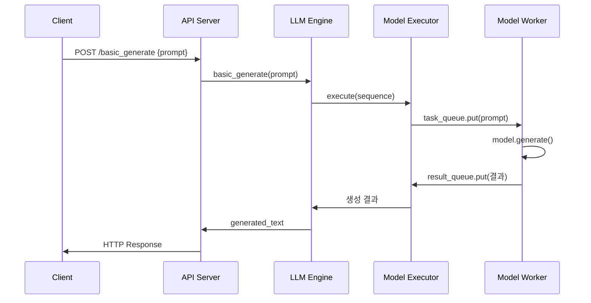
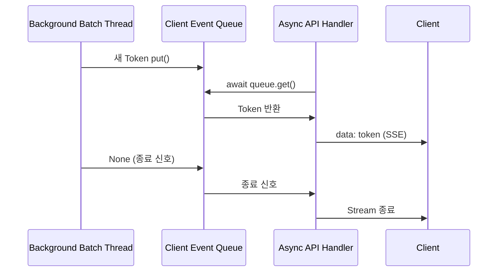
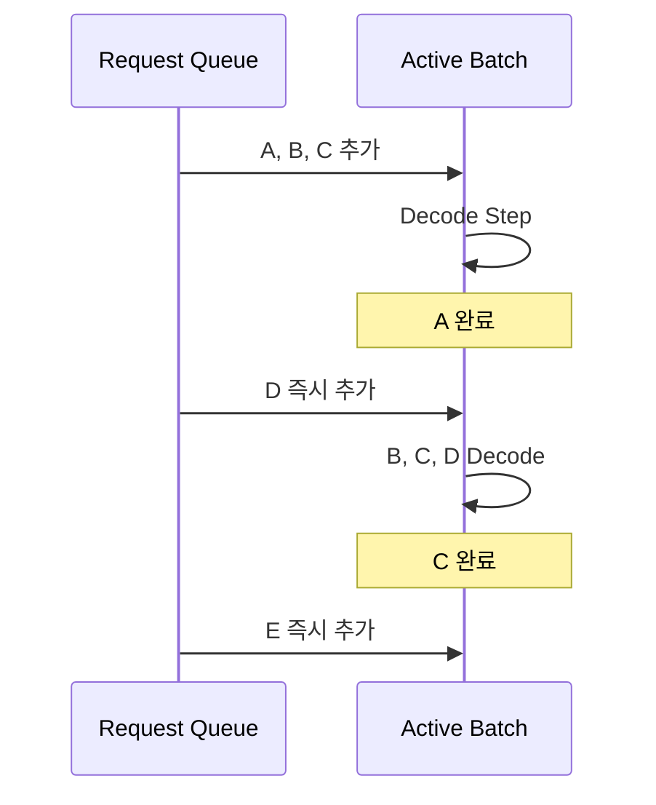
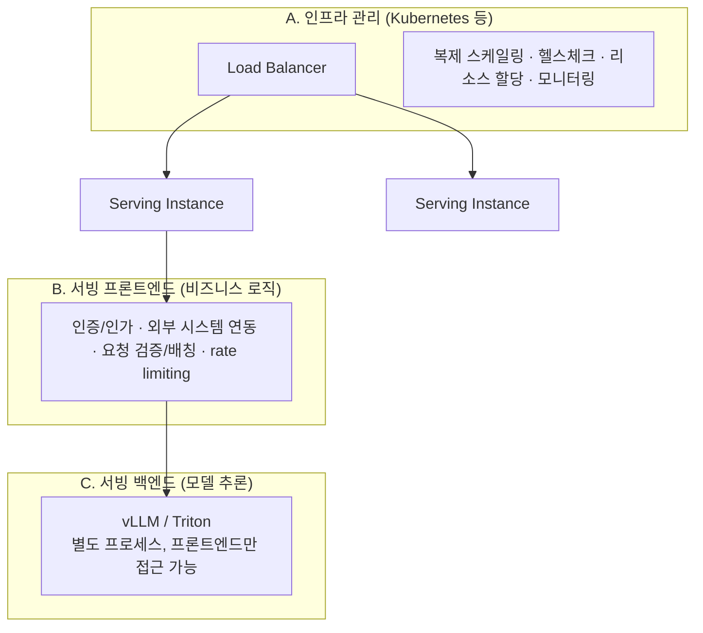
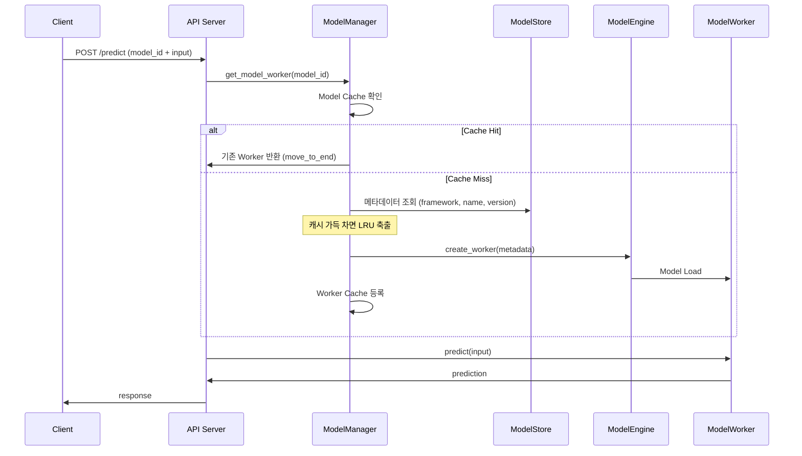
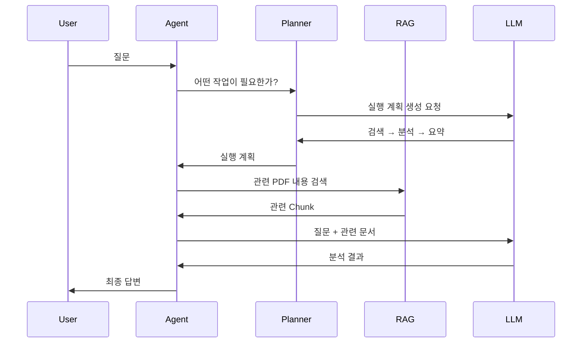
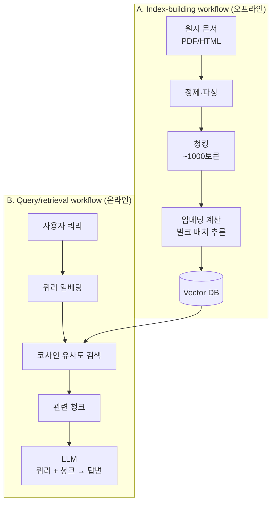
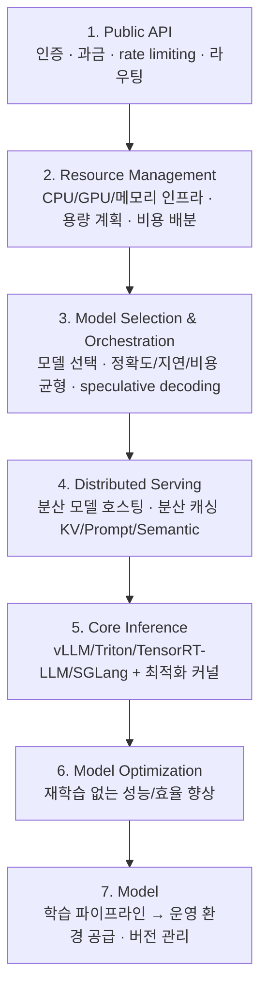

---
tags:
  - vLLM
  - LLM
  - Model Serving
  - Ray Serve
  - Batching
  - Streaming
  - RAG
---

# Model Serving System Design & Best Practices

> LLM 서빙 시스템을 밑바닥부터 직접 구현하며 배칭·스트리밍·멀티 모델 서빙의 설계 원리를 이해하고, 에이전트 워크로드 시대의 엔터프라이즈 계층형 서빙 아키텍처와 오픈소스/클라우드 구축 전략을 정리한다.

## 개요

vLLM, Triton 같은 서빙 프레임워크를 바로 다루기보다, from first principles로 서빙 시스템을 직접 만들어보면서 원리를 체득하는 것이 목표다. 오픈소스 서빙 프레임워크가 워낙 많아 선택이 어렵지만, 기본 원리를 알면 합리적인 판단을 할 수 있다.

- **Single-model serving**: 하나의 서비스가 하나의 모델을 전용으로 실행한다. batching + streaming을 지원하는 단일 모델 서빙 서비스부터 만들고, 일반화한 설계 패턴과 실무적 제약을 짚는다.

- **Multi-model serving**: 하나의 서비스가 여러 모델을 필요할 때 로드하고 공유 자원에서 실행한다. 비용 효율 최적화와 레이턴시/스케일러빌리티 최적화 버전을 다룬다.

- **에이전트 시대의 서빙**: 실제 LLM 앱은 단순 request-response 한 번으로 끝나지 않고 에이전트 워크플로우 안에 내장되기 때문에, 모델 서빙은 순수 추론 문제가 아니라 시스템 아키텍처 문제가 된다.

- **엔터프라이즈 아키텍처와 구축 전략**: 계층형 레퍼런스 아키텍처를 이해하고, 오픈소스 스택(Kubernetes + Ray Serve + vLLM)과 클라우드 벤더(Bedrock, SageMaker) 사이의 스펙트럼에서 선택하는 기준을 배운다.

한 줄 요약: 모델 서빙은 단순히 모델의 `generate()` 함수를 호출하는 것이 아니라, API 처리·요청 추적·배치·스트리밍·프로세스 격리·메모리 관리·라우팅·확장·장애 복구를 함께 설계하는 시스템 엔지니어링이다.

## 단일 모델 LLM 서빙 시스템 설계

### 서비스 아키텍처

단일 모델 서빙 서비스는 6가지 구성 요소로 이루어진다.


그림 가운데를 가로지르는 점선이 Main process와 Worker process의 경계다. Input queue와 Result queue가 그 경계를 넘나드는 유일한 통로라는 점이 이 설계의 핵심이다.

| 구성 요소 | 역할 |
|-----------|------|
| API server | HTTP 요청/응답 처리 (배칭, 스트리밍 엔드포인트) |
| LLM engine | 전체를 지휘하는 오케스트레이터, 다른 컴포넌트들을 초기화하고 조율 |
| Workload manager | 요청 큐잉과 배치 구성 관리, "언제 어떤 요청들을 묶어서 배치로 보낼지" 결정하는 스케줄링 |
| Model executor | 모델 워커 프로세스를 초기화·관리하고, 프로세스 간 통신으로 추론을 트리거 |
| Model worker | 실제 모델 추론을 자신의 별도 프로세스에서 실행 |
| Model manager | 모델과 토크나이저를 로드하고 캐싱 |

### 왜 프로세스를 분리하는가

Model worker를 별도 프로세스로 격리하는 것이 이 설계의 핵심 포인트다.

- GPU는 비싸고, 놀리면 손해다.

- 토크나이징, 전/후처리 같은 CPU 작업이 GPU와 같은 프로세스/스레드에서 돌면 GPU가 그 작업이 끝날 때까지 기다리게 된다.

- 그래서 Model worker = GPU 전용 프로세스로 격리하고, API server/LLM engine = CPU에서 오케스트레이션만 담당하도록 분리한다. GPU는 계산에만 집중, CPU는 요청 관리에만 집중해 GPU 활용률(utilization)을 극대화한다.

- 부모(API 서버)와 자식(model worker) 프로세스는 직접 함수를 호출할 수 없으므로 `task_queue` / `result_queue`(multiprocessing.Queue)로 프로세스 간 통신(IPC)을 구현한다. 모델 크래시가 API 프로세스를 죽이지 않도록 하는 격리 효과도 있다.

이 구조는 작은 예제에 비해 "과한" 설계처럼 보이지만, 실제 프로덕션 GPU 서빙 시스템의 표준 패턴을 그대로 반영한 것이다.

### 단일 요청 처리

가장 단순한 형태는 prompt 하나를 받아 결과 전체를 반환하는 방식이다.



동작 흐름은 다음과 같다.

1. FastAPI 엔드포인트가 prompt를 받아 `LLMEngine.basic_generate()`를 호출한다.

2. LLMEngine이 요청을 고유 ID를 가진 Sequence 객체로 감싸 ModelExecutor에 전달한다.

3. ModelExecutor가 `task_queue.put()`으로 자식 프로세스에 전달하고 `result_queue.get()`으로 블로킹 대기한다.

4. ModelWorker는 자식 프로세스에서 무한 `while True` 루프를 돌며 `task_queue.get()`으로 대기하다가, 요청이 오면 추론 후 `result_queue.put()`으로 결과를 반환한다.

**문제점**: GPU가 한 번에 하나의 Prompt만 처리하므로 처리량이 낮다. Prompt 1 처리 완료 → Prompt 2 처리 → Prompt 3 처리 순서로 직렬 실행된다.

### 배칭 (Batching)

여러 prompt를 묶어 한 번에 model worker로 보내 GPU utilization을 높이는 방식이다. 서버는 사용자 요청 경계를 그대로 따르지 않고 Prompt들을 다시 묶을 수 있다.

```
Request 1: Prompt A, Prompt B
Request 2: Prompt C, Prompt D, Prompt E

→ Batch 1: A, B, C, D  (batch_size=4 상한)
→ Batch 2: E
```

배칭을 구현하려면 두 가지 핵심 과제를 해결해야 한다.

- **배치 구성**: 서로 다른 요청들의 프롬프트를 배치로 합쳐 LLM이 요청별이 아니라 큰 배치 단위로 실행하게 해야 자원 활용도를 극대화할 수 있다.

- **응답 매핑**: 생성된 출력물을 원래 요청과 정확히 연결해 올바른 사용자에게 결과를 돌려줘야 한다. 여러 요청의 Prompt를 섞어서 실행하려면 생성 결과가 어느 요청의 것인지 반드시 기억해야 한다.

이를 위해 각 Prompt를 **Sequence 객체**로 감싼다.

```
Sequence
├─ 고유 ID
├─ Prompt
├─ 생성 결과
├─ 완료 여부
├─ 토큰 수
└─ Streaming Queue
```

이 구조가 중요한 이유는 웹 요청과 실제 GPU 실행 순서를 분리할 수 있기 때문이다. 덕분에 Dynamic Batching, Priority Scheduling, Continuous Batching 같은 최적화를 적용할 수 있다.


위 그림은 요청 2건(프롬프트 5개)이 들어와 Workload manager가 배치를 구성하고, 생성된 텍스트가 다시 원래 웹 요청으로 매핑되기까지의 6단계 흐름을 보여준다. Workload manager가 관리하는 세 자료구조(`incoming_queue`, `active_sequence`, `sequence_map`)가 이 매핑의 핵심이다.

**WorkloadManager의 배치 스케줄링**:

```python
# workload_manager.py 핵심 로직
class WorkloadManager:
    self.batch_size = 4  # 한 번에 최대 4개 시퀀스 처리

    def add_request(self, prompt: str) -> str:
        request_id = str(uuid.uuid4())
        sequence = Sequence(request_id, prompt, None, None)
        self.incoming_queue.put(sequence)          # FIFO 대기 큐
        self.sequence_map[request_id] = sequence   # ID로 결과 찾기의 핵심
        return request_id

    def get_next_batch(self) -> List[Sequence]:
        while len(self.active_sequences) < self.batch_size \
                and not self.incoming_queue.empty():
            self.active_sequences.append(self.incoming_queue.get())
        return self.active_sequences
```

- 선입선출(FIFO) 전략으로 다음 배치에 들어갈 프롬프트를 결정한다.

- 최대 배치 크기(4)를 제한해 이미 실행 중인 배치에 빈 자리가 생겨야 다음 프롬프트가 들어간다. 즉 정적 배칭에 가깝다.

**실습 로그로 확인한 동작** (프롬프트 5개를 `/generate`로 전송):

1. 첫 배치: batch_size 상한 때문에 5개 중 앞의 4개만 `active_sequences`에 채워진다. `torch.Size([4, 5])` — 토크나이저가 `padding=True`로 4개 프롬프트를 한 텐서에 묶은 결과다. 서로 다른 요청이 하나의 GPU forward pass에 섞여 들어간 것이 배칭의 핵심이다.

2. 결과에 `request_id`가 딸려 나온다. 배치로 섞여 들어갔어도 각 결과가 어느 프롬프트 것인지 잃지 않는다.

3. 두 번째 배치: 첫 배치가 끝나 `active_sequences`가 비워지고 나서야 대기 중이던 5번째 프롬프트가 단독 배치(`torch.Size([1, 6])`)로 실행된다.

**트레이드오프**: 배칭은 일부 요청이 대기해야 하므로 개별 요청에 지연이 발생할 수 있지만, 전체 서비스 처리량을 크게 향상시킨다. Production에서는 max batch size, max batched tokens, timeout, request priority를 함께 봐야 한다.

### 스트리밍 (Streaming with Batching)

배치 API는 모든 프롬프트가 완전히 처리될 때까지 결과를 반환하지 않아 상당한 지연이 발생한다. LLM은 한 번에 한 토큰씩 생성하므로, 토큰이 생성되는 즉시 사용자에게 전송하면 체감 지연시간이 크게 줄어든다.

**Batching과 Streaming은 반대 개념이 아니다.** 서버 내부에서는 여러 요청을 묶어 계산하고, 외부 사용자에게는 요청별로 토큰을 따로 전송할 수 있다.



핵심 설계 변경 사항은 다음과 같다.

- generation API가 비동기로 전환되어 토큰이 생성되는 즉시 사용자가 업데이트를 받는다.

- ModelWorker는 전체 출력을 한 번에 생성하는 대신, 추론 단계마다 하나의 토큰만 생성한다(`outputs.logits[:, -1, :]`로 다음 토큰 하나만 샘플링).

- WorkloadManager는 부분 출력을 추적하고, 각 프롬프트를 실시간으로 새 토큰으로 업데이트한다.

- 각 프롬프트는 자체 이벤트 큐(`asyncio.Queue`)를 가지며, 백그라운드 배치 스레드(`requests_processing_loop`)가 GPU 배치 실행을 담당하고 API 코루틴이 사용자 연결을 담당한다. 큐가 두 실행 영역을 연결한다.

- 응답 형식은 SSE(Server-Sent Events): `data: {"token":" a","sequence_id":"..."}\n\n`


그림에서 보듯 백그라운드 배치 처리 스레드가 `[prompt1, prompt2]`를 한 번에 모델에 넣고 `[token1, token2]`를 받아오지만, 각 토큰은 자기 이벤트 큐를 거쳐 서로 다른 SSE 스트림으로 나간다. 내부는 배치, 외부는 요청별 스트림이라는 구조가 그대로 드러난다.

**토큰 단위 배치 슬라이딩 윈도우** — 시간에 따른 배치 변화:

| 시간 | 이벤트 | Backend batch |
|------|--------|---------------|
| T0 | User A의 Prompt1 도착 | [Prompt1] |
| T1 | User B의 Prompt2 도착 | [Prompt1, Prompt2] |
| T2 | User C의 Prompt3 도착 | [Prompt1, Prompt2, Prompt3] |
| T3 | Prompt1 완료(EOS), Prompt4 합류 | [Prompt2, Prompt3, Prompt4] |

프롬프트가 max_tokens 도달 또는 EOS가 나오면 `active_streaming_sequences`에서 빠지고, 그 빈자리에 대기 중이던 새 프롬프트가 채워진다. 배치 슬롯이 고정 크기라 완료된 자리만큼만 새 요청이 들어오는 메커니즘은 `/generate`와 동일하지만, 토큰 단위로 훨씬 빠르게 회전한다.

**실습 로그로 확인한 동시 2개 스트리밍 요청**:

- 두 요청이 거의 동시에 들어와 첫 배치 스텝부터 곧바로 합쳐졌다: `torch.Size([2, 4])` → `[2, 5]` → ... → `[2, 25]` (총 22스텝, 배치 크기 2 유지)

- 매 스텝마다 한 번의 배치 forward에서 두 시퀀스의 다음 토큰을 동시에 생성한다. 각자 독립적으로 모델을 두 번 호출한 게 아니라 GPU에서 한 번에 처리됐다.

- 각 토큰이 정확히 원래 자신의 이벤트 큐(client_stream)로 라우팅되어, 두 문장이 섞이지 않고 각각 온전하게 재구성됐다.

### vLLM 통합

직접 구현한 batching/streaming 로직은 학습에는 좋지만 production에서는 복잡도가 높다. vLLM은 batching, scheduling, KV cache 관리 등을 내부에서 처리한다.

| 구분 | 수동 구현 | vLLM 구현 |
|------|-----------|-----------|
| 배치 구성 | WorkloadManager FIFO + 고정 batch_size=4 | vLLM 내부 스케줄러 (continuous batching) |
| 토큰 생성 | 별도 프로세스에서 한 스텝씩 forward (use_cache=False로 매번 전체 재계산, O(n²) 비효율) | PagedAttention + KV 캐시로 최적화 |
| 결과 매핑 | sequence_map, request_id 수동 추적 | `LLM.generate()`가 입력 순서 그대로 outputs 반환 |
| 스트리밍 | asyncio.Queue + 백그라운드 스레드 직접 구현 | vLLM이 내부적으로 처리 |
| 코드량 | 약 300줄 (3개 파일) | 약 20줄 |

```python
# vLLM 통합: 10줄로 배치 추론 활성화
class LLMEngine:
    def __init__(self):
        self.vllm_model = VLLM(model="facebook/opt-125m")

    def generate_vllm(self, prompts: List[str]) -> List[str]:
        sampling_params = SamplingParams(temperature=0.7, top_p=0.95, max_tokens=self.max_tokens)
        outputs = self.vllm_model.generate(prompts, sampling_params)
        return [output.outputs[0].text for output in outputs]
```

LLMEngine의 backend를 vLLM으로 교체하면 application API는 유지하면서 serving engine만 바꿀 수 있다.

**Continuous Batching 개념**:



- **Static Batch**: A, B, C 시작 → 모두 끝날 때까지 새 요청 진입 불가

- **Continuous Batch**: A, B, C 시작 → A가 끝남 → 빈 자리에 D 즉시 추가. GPU의 빈 슬롯을 줄이고 처리량을 높인다.

프레임워크가 복잡성을 추상화하더라도 내부 원리를 알아야 최대 동시 Sequence 수, Batch Token 수, GPU Memory Utilization, KV Cache 크기, Chunked Prefill, Scheduling 정책 같은 설정을 올바르게 튜닝할 수 있다.

**실습에서 확인한 주의점**: vLLM을 동기 API(`vllm.LLM`)로 통합하면 Uvicorn이 단일 이벤트 루프로 동작하고 `generate_vllm`이 await 없는 동기 호출이라, 2개 이상 동시 요청 시 순차 처리된다. 하나의 실행 배치에 섞으려면 `vllm.AsyncLLMEngine`(비동기 엔진) 설정이 필요하다. 또한 vLLM은 기본 `gpu_memory_utilization=0.9`로 KV 캐시용 GPU 메모리를 미리 통째로 예약한다 — 모델 가중치가 0.24GiB뿐이어도 VRAM 13.7GB를 선점했다. 리소스 효율은 모델 크기가 아니라 설정값 튜닝에 달려 있다.

### 단일 모델 서빙의 일반 설계

**일반 서빙 요구사항**:

| 요구사항 | 설명 |
|----------|------|
| Low latency | 추론을 신속히 완료하고 지연 없이 결과 반환. 같은 처리량이라도 스트리밍이 체감 지연을 크게 줄인다 |
| High throughput | QPS/TPS 최대화. 배칭이 핵심 수단 |
| Scalability | 트래픽 변동에 따른 수평 확장. 여러 워커 프로세스/여러 GPU 노드로 확장 필요 |
| Reliability & availability | 높은 가용성과 장애 허용성 |
| Resource efficiency | GPU 등 하드웨어의 효율적 활용으로 쿼리당 비용 관리 |
| Observability | 지연 시간·처리량·오류율 등 KPI 추적, 병목 파악과 SLO 달성 |

**LLM 특화 요구사항**:

- 큰 모델 크기와 메모리 사용량: 수십~수백 GB 메모리, GPU 자원과 메모리 할당의 신중한 관리

- KV cache 관리: 긴 컨텍스트 윈도우와 상태 기반 디코딩을 위해 여러 요청/세션에 걸친 KV 캐시 관리

- 스트리밍 응답: 인터랙티브 애플리케이션의 필수 요소

- 가변 길이 워크로드의 동시성·배칭: 입출력 길이가 다양한 이기종 워크로드의 지능적 배치와 스케줄링

핵심 설계 아이디어는 서빙 요구사항을 세 영역으로 분리하는 것이다.



- **Service infrastructure management**: 확장성, 가용성, 모니터링, 자원 할당. Docker/Kubernetes 같은 재현 가능한 단위로 캡슐화해 분산 컴퓨팅 시스템에 위임한다.

- **Business logic handling**: 인증/인가, 외부 시스템 통합, 요청 검증·정규화·배칭, 속도 제한.

- **Model serving performance**: LLM 특화 성능(지연·처리량·최적화). vLLM, Triton 같은 프레임워크가 담당한다.


(A) 분산 컴퓨팅 인프라(AWS/GCP/Kubernetes)가 스케일링·장애 허용·모니터링을 담당하고, (B) Serving frontend가 Web API·인증·트래픽 스로틀링을, (C) Serving backend(vLLM, SGLang, TRT-LLM)가 모델 추론과 최적화를 담당하는 구조다.

LLM 서빙 요구사항은 모델 아키텍처와 함께 자주 변하므로, 변화하는 구성 요소를 안정적인 인프라와 분리하는 것이 중요하다.

## 멀티 모델 서빙 서비스

### 왜 필요한가

애플리케이션이 커지면 감성 분석, 이미지 분류, 텍스트 생성, 임베딩 등 여러 모델을 동시에 제공해야 한다. 모델마다 별도의 서버를 배포하면 일부 GPU는 놀고 어떤 서버는 과부하가 되는 자원 불균형이 생긴다.

```
Server A → Model A → GPU 사용률 10%
Server B → Model B → GPU 사용률 20%
Server C → Model C → GPU 사용률 5%
Server D → Model D → GPU 사용률 80%
```

멀티 모델 서비스는 공유 인프라 내 여러 모델에 대한 요청을 동적으로 관리·라우팅한다. 수많은 소형/미세 조정 모델을 서비스할 때 하드웨어 활용도를 높이고 운영 부담을 줄인다.

**설계 목표 3가지**:

1. **Cross-framework support**: PyTorch, ONNX 등 다양한 프레임워크·아키텍처(NLP, Vision)의 모델을 하나의 통합 시스템에서 호스팅

2. **Unified API interface**: `POST /predict` + `{"model_id": ..., "input_data": ...}` 형태의 일관된 웹 인터페이스

3. **Resource management**: 지연 로딩(lazy loading)과 LRU(Least Recently Used) 기반 모델 제거로 제한된 컴퓨팅 자원 관리

### 아키텍처와 워크플로우



| 구성 요소 | 역할 |
|-----------|------|
| API server | HTTP 엔드포인트 노출, 요청/응답 처리. model_id로 워커를 찾을 뿐 프레임워크는 알지 못함 |
| Model manager | 모델 캐시 관리와 워커 라이프사이클 조정. "어떤 모델을 메모리에 올려둘 것인가" 결정 |
| Model store | 모델 메타데이터 저장·조회 (실제 환경에서는 원격 DB나 메타데이터 서비스) |
| Model engine | 메타데이터 기반으로 프레임워크별 ModelWorker 인스턴스를 생성하는 워커 팩토리 |
| Model worker | 모델을 메모리에 로드하고 추론 실행 (TransformerWorker, TorchVisionWorker, TritonWorker) |


**ModelManager의 LRU 캐시** — 이 설계에서 가장 중요한 컴포넌트다:

```python
# manager.py 핵심 로직
class ModelManager:
    def __init__(self, model_store, max_models: int = 2):
        self.model_cache = OrderedDict()  # model_id -> worker

    def get_model_worker(self, model_id):
        if model_id in self.model_cache:
            self.model_cache.move_to_end(model_id)   # 최근 사용 순서 갱신
            return self.model_engine.get_worker(model_id)
        model_metadata = self.model_store.get_model(model_id)
        if len(self.model_cache) >= self.max_models:
            id, _ = self.model_cache.popitem(last=False)  # 가장 오래 안 쓴 모델 축출
            self.model_engine.delete_worker(id)
        self.model_cache[model_id] = self.model_engine.create_worker(model_metadata)
        return self.model_cache[model_id]
```

- 캐시 히트: `move_to_end()`로 최근 사용 순서를 갱신하고 워커를 반환한다.

- 캐시 미스: 메타데이터 조회 → 캐시가 max_models를 넘으면 `popitem(last=False)`로 가장 오래 안 쓴 모델을 메모리에서 제거 → 새 워커를 생성해 캐시에 넣는다.

- 실제 서빙 시스템(Triton, TorchServe 등)의 모델 리포지토리 관리를 단순화해 흉내낸 것이다.

**ModelWorker 추상화**: `ModelWorker(ABC)`는 `_load_model()`과 `predict()` 두 개의 추상 메서드만 강제한다. 다형성 덕분에 ModelManager/ModelEngine은 어떤 구체 워커인지 몰라도 동일한 `predict()` 인터페이스로 다룰 수 있다. 새로운 프레임워크를 추가하고 싶다면 Worker를 추가하는 형태로 확장한다.

- TransformerWorker: AutoModelForSequenceClassification + AutoTokenizer로 텍스트 분류 모델 로드/추론

- TorchVisionWorker: mobilenet_v2 로드, transforms로 이미지 전처리 후 추론

- TritonWorker: 로컬 로드 대신 HTTP로 Triton 서버의 모델 리포지토리 API를 호출해 원격 로드/언로드, tritonclient로 추론

전처리(입력 준비)와 후처리(출력 해석)의 책임은 클라이언트에게 넘어간다. 클라이언트가 자신이 호출하는 모델을 이해한다고 가정하기 때문이다.

## 에이전트 시대의 모델 서빙

### 에이전트가 서빙 요구사항을 바꾸는 방식

2~3장에서는 모델을 독립적인 예측 엔진(요청 하나에 추론 한 번)으로 다뤘지만, 모델이 에이전트 시스템 안에 내장되면 이 전제가 깨진다. 모델이 제어 루프(control loop) 안에서 반복 호출되며, 정보 검색·중간 추론·도구 실행·출력 다듬기를 거쳐야 최종 답변이 나온다.

사용자 상호작용 한 번이 다음을 촉발할 수 있다.

- 다중 LLM 호출

- 더 긴 컨텍스트 윈도우

- 검색 연산 (RAG)

- 메모리 재사용 (CAG)

이 모든 것이 토큰 사용량을 늘리고, 체인으로 연결된 호출들에서 tail latency를 증폭시키고, 트래픽 패턴을 더 동적으로 만든다. 결과적으로 서빙은 모델을 효율적으로 실행하는 것을 넘어, 오케스트레이션·메모리 관리·시스템 레벨 조정까지 지원해야 한다.

**에이전트의 정의** — 다음이 가능한 자율적인 LLM 기반 시스템:

1. 상위 수준 목표를 이해

2. 그 목표를 달성할 방법을 추론

3. 외부 도구나 데이터 소스를 선택·호출

4. 중간 결과를 바탕으로 적응·반복

5. 사람 개입을 최소화하며 최종 결과물 산출

전통적 시스템(규칙 기반 챗봇)과의 차이의 본질은 **자율성**이다. "무엇을 어떻게 할지"까지 시스템 스스로 판단한다.

### Knowledge Agent 사례

PDF 파일들을 질의·분석하는 지식 에이전트를 통해 서빙 관점의 영향을 확인한다. OpenAI API(LLM 추론 + 임베딩)를 쓰고 모든 정보는 인메모리에 저장하는 이식성 우선 설계다.



- **Agent (orchestrator)**: 모든 구성 요소를 조정하는 중앙 컨트롤러. `process_query()`가 플래닝 → 액션 실행 → 최종 응답까지 지휘

- **RAG system**: PDF 처리(청킹), 임베딩 생성, 벡터 검색 수행 — text-embedding-3-small 사용

- **Planner**: LLM을 활용해 지능형 실행 계획(JSON) 수립 — gpt-4.1-nano 사용

- **Actions (executor)**: 질의/요약/분석 등 구체적 작업을 순차 실행하며 앞 결과를 다음 컨텍스트로 체이닝

**실습에서 확인한 핵심 사실 — 질문 1건에 API 호출 4회**:

| 호출 | 횟수 |
|------|------|
| chat/completions (플래닝) | 1 |
| embeddings (쿼리 검색) | 1 |
| chat/completions (요약) | 1 |
| chat/completions (분석) | 1 |

"What is 5-level paging?"이라는 질문 하나에 LLM 호출 3번 + 임베딩 1번이 연쇄적으로 일어났다. 이것이 "단일 사용자 상호작용이 다중 LLM 호출·토큰 사용량 증가를 촉발한다"는 서술의 실제 사례이자, tail latency가 체인 호출마다 누적되는 이유다.

또한 LLM 플래너는 키워드 기반 폴백 규칙("what/how" → RAG 1스텝)과 다른 독자적 판단(요약 → 분석 2스텝)을 내렸고, 2단계 분석은 원본 문서를 재검색하지 않고 1단계 요약 결과를 컨텍스트로 재사용(컨텍스트 체이닝)했다.

### RAG (Retrieval-Augmented Generation)

LLM 단독의 3가지 한계(고정된 지식, 환각, 도메인 특화 지식 갭)를 쿼리 시점에 외부 지식을 검색해 주입함으로써 완화한다.

기본 RAG 시스템은 두 가지 워크플로우로 구성된다.



- **인덱스 빌딩 (오프라인)**: 문서 정제/파싱 → 청킹 → 청크별 임베딩 대량 사전 계산 → 벡터 DB 저장. 주기적으로 실행되도록 예약된다.

- **질의/검색 (온라인)**: 쿼리 임베딩 → 코사인 유사도로 최근접 벡터 검색 → 관련 청크를 쿼리와 함께 LLM에 전달해 답변 생성.


두 워크플로우가 같은 임베딩 모델을 공유한다는 점이 중요하다. 인덱싱 시점과 질의 시점의 임베딩 모델이 다르면 벡터 공간이 달라져 검색이 의미를 잃는다.

**청킹이 필요한 이유**: LLM은 입출력 합산 토큰 수에 상한(컨텍스트 윈도우)이 있어, 문서 전체가 아니라 가장 관련성 높은 청크 몇 개만 골라 보내야 한다.

- 작은 청크: 검색 정밀도 ↑, 문맥 손실 위험

- 큰 청크: 문맥 풍부, 관련 없는 내용이 섞여 정밀도 ↓ (dilution)

- 최적값은 도메인과 LLM 컨텍스트 윈도우에 따라 달라진다

**LLM 입장에서 RAG는 prompt가 길어진 것일 뿐이다.** 검색된 문서가 LLM 내부 행렬에 주입되는 것이 아니라, 검색된 텍스트를 프롬프트에 이어붙인 뒤 평소와 똑같은 self-attention으로 처리된다. 비유하자면 RAG는 오픈북 시험(매 요청마다 외부 DB에서 찾아 첨부)이고, Fine-tuning은 암기(가중치에 지식 내재화)다.

### CAG (Cache-Augmented Generation)

RAG의 한계(검색 단계로 인한 추가 지연, 문서 선택 오류 위험, 임베딩·인덱스·벡터 DB 유지 부담)를 배경으로, 컨텍스트 윈도우가 100만 토큰 수준으로 커지면서 등장한 접근이다.

CAG는 쿼리 시점에 검색하는 대신, 지식을 미리 LLM의 KV 캐시에 프리로드해두고 추론 시 캐시된 컨텍스트로 바로 답한다. 검색 지연을 없애고 시스템 복잡도를 줄이면서도 외부 지식 기반 응답은 유지한다. 대가로 큰 컨텍스트 윈도우 + 캐시 관리에 따른 메모리/연산 요구량이 늘어난다.


RAG는 임베딩 모델·인덱스·벡터 DB라는 별도 시스템 일체가 쿼리 경로에 놓이는 반면, CAG는 지식을 LLM 내부 knowledge cache에 미리 적재(preload)해두어 쿼리 경로에서 그 시스템들이 사라진다.

| 구분 | RAG | CAG |
|------|-----|-----|
| 지식 주입 시점 | 쿼리마다 동적 검색 | 사전에 KV 캐시에 로드 |
| 지연 시간 | 검색 단계만큼 추가 | 검색 지연 없음 |
| 시스템 복잡도 | 임베딩·인덱스·벡터 DB 필요 | 검색 시스템 불필요 |
| 강점 | 동적 검색·최신성 | 반복 쿼리·고정 knowledge set의 지연 감소 |
| 개선 대상 | 답변 품질 (지식 접지·최신성) | 서빙 효율 (지연·처리량·비용) |

RAG vs CAG는 양자택일이 아니다. RAG로 입력을 보강하고, CAG로 실행을 최적화하는 조합이 가능하다.

### 도구 호출과 MCP

현대 에이전트의 핵심 기능인 도구 호출은 네 단계로 이루어진다.

1. LLM이 사용자 요청과 사용 가능한 도구들을 놓고 추론

2. 선택한 도구에 필요한 입력을 인코딩한 구조화된 출력(보통 JSON) 생성

3. 에이전트가 그 도구 호출을 실제로 실행

4. 결과를 다시 LLM에 넣고, 작업이 끝날 때까지 반복

MCP(Model Context Protocol)는 도구 사용의 대표적 표준화 접근법이다. LLM이 사용 가능한 도구를 발견(discover)하고, 구조화된 입력으로 호출(call)하고, 결과를 추론 과정에 반영하는 일관된 인터페이스를 제공한다. 도구 정의를 에이전트 핵심 로직과 분리해 ad-hoc 프롬프트 엔지니어링의 취약성 문제를 완화한다.

이 모든 모델·도구는 결국 HTTP/gRPC API 같은 모델 서빙 서비스를 통해 온디맨드로 호출된다. 고성능·저지연·비용 효율적인 서빙이 에이전트 애플리케이션 성공의 핵심 조건이다.

## 엔터프라이즈 LLM 서빙 아키텍처

"모델 실행"과 "엔터프라이즈 서빙"은 다른 문제다. 지금까지 만든 것들은 "모델을 호스팅하고 실행한다"는 좁은 의미의 서빙이었고, 실제 대규모 프로바이더는 인증, 과금, 리소스 관리, 네트워킹, 최적화, A/B 테스트, 관측성, 온콜 지원까지 감당해야 한다.

아키텍처링이 어려운 이유는 기술보다 조직에 가깝다. 서로 다른 책임을 가진 여러 팀이 병목 없이 하나의 진화하는 시스템에 동시에 기여할 수 있도록, "어떤 레이어를 누가 소유하고 레이어 간 경계를 어떻게 긋는가"를 설계하는 문제이기도 하다.



| 레이어 | 역할 | 핵심 난제 |
|--------|------|-----------|
| Public API | 고객/개발자/내부 서비스의 외부 인터페이스. 네트워킹·인증·과금·rate limiting·라우팅 | 수백만 동시 연결, 쿼터/어뷰징 방지, 저지연 글로벌 접근, 보안·테넌트 격리 |
| Resource Management | CPU/GPU/메모리/디스크/네트워킹 인프라를 리전 전반에서 관리 | 용량 계획, 이기종 GPU 풀 고가동률, 고객 우선순위 스케줄링 |
| Model Selection & Orchestration | 요청마다 어떤 모델을 쓸지 결정, 정확도/지연/비용 균형 | 비용-품질 트레이드오프(모든 질문에 최대 모델은 불필요), 로드 밸런싱, 지연 민감 케이스 |
| Distributed Serving | 대형 모델의 분산 호스팅 + 분산 캐싱(KV/Prompt/Semantic)으로 중복 연산 감소 | 단일 GPU 메모리 초과 모델, 멀티GPU/멀티노드 코디네이션, 캐시 인식 라우팅 |
| Core Inference | 모델이 실제 실행되는 곳. 서빙 프레임워크 + FlashAttention/PagedAttention 커널 | Cold start latency, hot model scaling, 모델별 dependency 차이 |
| Model Optimization | 재학습 없이 성능/효율 향상 (양자화, speculative decoding 등) | 모델별 최적화 기법 선택 |
| Model | 학습된 모델을 서빙 시스템에 공급, 분류·추적·버전 관리 | 모델 진화에 따른 버전 관리 |


새로운 모델과 기술이 시스템 설계를 재편하더라도, 관심사를 분리하는 계층형 아키텍처 패턴은 여전히 필수적이다. 서로 다른 역할의 팀들이 독립적으로 혁신하면서도 통합된 플랫폼에 기여할 수 있게 한다.

## 오픈소스 스택으로 구축


설계의 근간은 Kubernetes다. 배포/스케일링/관리 자동화라는 핵심 기능과, 그 위에 쌓인 메트릭·로깅·네트워킹·인가·하드웨어 관리 생태계 덕분에 클라우드 프로바이더와 파운데이션 모델 벤더 모두의 백본으로 채택됐다. Kubernetes 한 층이 레이어 1(Public API)의 라우팅/네트워킹과 레이어 2(Resource Management) 전체를 실제 오픈소스 컴포넌트로 구현해주는 기반 계층 역할을 한다.

### Public API 구현

FastAPI + Kubernetes로 Public API 레이어의 4가지 난제를 구현한다.

- **인증**: JWT 또는 API 키. JWT 경로는 RSA 공개키로 서명 검증 후 클레임에서 tenant 추출, API 키 경로는 Redis에서 tenant를 역참조한다. 두 방식 모두 "테넌트 식별"로 수렴하는 것이 핵심이다 — 이후의 쿼터 강제, 트래픽 라우팅, 모델 선택이 전부 tenant 값에 의존한다.

- **고동시성 대응**: Kubernetes HPA(HorizontalPodAutoscaler)로 평균 CPU 사용률 70% 초과 시 3개 → 최대 15개 파드로 수평 확장.

- **Rate limiting은 이중 방어(defense in depth)**:

    1. Ingress 레벨 (`nginx.ingress.kubernetes.io/limit-rps: "50"`): 애플리케이션 코드에 도달하기 전에 대량 어뷰징/DDoS성 트래픽을 값싸게 필터링

    2. 애플리케이션 레벨 (`rate_limit(tenant)`): 테넌트별 계약(쿼터)을 정교하게 강제

### 모델 선택 구현

모델 선택 로직은 Public API, 별도 미들웨어 서비스, 정적 라우팅 설정 어디에든 둘 수 있다. 예시는 채팅 엔드포인트에 "기초 분류기"를 구현한다.

- `max_new_tokens > 1024`(긴 출력) + 모델이 draft를 지원하면 → **speculative decoding**: 빠르고 저렴한 드래프트 모델이 여러 토큰을 미리 생성하고, 느리지만 정확한 타겟 모델이 한꺼번에 검증한다. 두 모델을 동시에 돌리는 오버헤드가 있어, 생성 토큰 수가 많을수록 이득이 커지므로 출력 길이로 분기하는 것이 합리적인 휴리스틱이다.

- 그 외 → 선택된 엔드포인트로 단순 pass-through 스트리밍.

`choose_endpoint()`의 라우팅 정책 우선순위:

1. 모델/별칭 조회 (없으면 404)

2. 가중치 기반 카나리 라우팅 — 테넌트 오버라이드보다 먼저 실행되어, 카나리 배포가 특정 고객군에 편향되지 않고 대표성 있는 샘플을 확보한다

3. 테넌트별 오버라이드 (전용 파인튜닝 모델, 전용 용량)

4. 기본 라우트로 폴백

### Ray Serve로 모델 호스팅

인스턴스 서빙의 확장성과 네트워크 관리가 부담스럽다면, 확장 가능하고 프레임워크에 구애받지 않는 모델 서빙 라이브러리인 Ray Serve를 사용할 수 있다.

**단일 모델 호스팅**: `__init__`에서 vLLM의 AsyncLLMEngine을 한 번 초기화하고 `__call__`이 HTTP 요청 진입점 역할을 한다. 3장의 ModelWorker와 개념적으로 동일한 패턴이지만, 수동 배칭/큐잉을 vLLM의 AsyncLLMEngine에 통째로 위임한다.

```python
@serve.deployment(
    name="qwen_vllm",
    num_replicas=3,                                   # 서비스 인스턴스 3개
    ray_actor_options={"num_cpus": 0.5, "num_gpus": 1},  # 인스턴스당 GPU 1개
)
class QwenVLLM: ...
```

Kubernetes HPA YAML이 하던 일을 데코레이터 한 줄로 대체한다. 리소스 프로비저닝과 배포를 Ray가 자동으로 처리한다.

**멀티 모델 호스팅 (model multiplexing)**: 3장에서 직접 만든 것과 Ray Serve의 대응 기능 비교:

| 직접 만든 것 (ch03) | Ray Serve의 대응 기능 |
|---------------------|----------------------|
| ModelManager (OrderedDict LRU, max_models=2) | `@serve.multiplexed(max_num_models_per_replica=2)` — 프레임워크가 LRU 캐싱/축출 대신 관리 |
| ModelEngine.create_worker() — 요청 시점 lazy load | `load_model(model_id)` |
| config/models.json (model_id → 모델명 매핑) | MODEL_REGISTRY dict (model_id → HF repo) |
| body의 model_id 필드로 라우팅 | HTTP 헤더 `ray_serve_multiplexed_model_id` |

직접 손으로 짠 ModelManager 로직을 Ray가 프레임워크 기능으로 내장해 제공하는 셈이다. Ray가 백엔드에서 트래픽 라우팅, 부하 분산, 자원 관리를 담당한다.

나만의 서빙 스택을 만드는 것은 어렵지 않다. 인프라 관리는 Kubernetes, 모델 호스팅은 Ray Serve 또는 Triton, 분산 LLM 서비스와 최적화는 vLLM을 활용하고, 가벼운 맞춤 미들웨어만 추가하면 엔터프라이즈급 서빙 솔루션을 직접 구축할 수 있다.

### 실습: KubeRay로 vLLM 서빙 (Ray Serve on K8s)

**Ray 구성**: Ray는 Python/AI 애플리케이션을 단일 머신에서 클러스터로 자동 확장하는 분산 컴퓨팅 프레임워크다. Ray Core(분산 실행) 위에 Ray Data/Train/Tune/Serve/RLlib이 올라간다. Ray Cluster는 Head Node 1개(Autoscaler, GCS, 드라이버) + Worker Node N개(순수 연산)로 구성된다.

**KubeRay**: Kubernetes 위에서 Ray 클러스터를 운영하는 공식 권장 방식(Operator)이다. Ray 헤드/워커 노드를 Kubernetes 파드로 관리한다.

| CRD | 용도 |
|-----|------|
| RayCluster | Head/Worker 파드로 구성된 Ray 클러스터 자체의 생명주기 관리 (기본 단위) |
| RayJob | RayCluster를 생성해 단일 Job을 실행하고 완료되면 정리하는 배치 작업용 |
| RayService | RayCluster 위에 Ray Serve 애플리케이션을 얹어 운영 — 무중단 업그레이드, 헬스체크 기반 고가용성 |
| RayCronJob | RayJob을 크론 스케줄로 반복 실행 |

vLLM을 서빙해 OpenAI 호환 엔드포인트를 노출하는 목표에는 RayService가 적합하다. RayCluster만 쓰면 Serve 앱을 직접 `serve run`으로 올리고 파드가 죽었을 때 재배포도 수동으로 챙겨야 하지만, RayService는 무중단 업데이트/헬스체크를 컨트롤러가 대신해 `kubectl apply` 한 번으로 모델 교체나 replica 수 변경이 가능하다.

**배포 구성** (Qwen/Qwen2.5-7B-Instruct-AWQ, 물리 GPU 1장):

```yaml
apiVersion: ray.io/v1
kind: RayService
metadata:
  name: vllm-service
spec:
  serveConfigV2: |
    applications:
      - name: llms
        import_path: ray.serve.llm:build_openai_app
        args:
          llm_configs:
            - model_loading_config:
                model_id: qwen2.5-7b-instruct-awq
                model_source: Qwen/Qwen2.5-7B-Instruct-AWQ
              engine_kwargs:
                quantization: awq
                max_model_len: 4096
                gpu_memory_utilization: 0.85
```

공식 예제 대비 조정 포인트:

- AWQ 양자화 모델을 사용해 가중치가 4~5GB뿐이라, `gpu_memory_utilization: 0.85`로 KV 캐시용 메모리를 넉넉히 확보하고 `max_model_len`을 1024 → 4096으로 상향

- 물리 GPU 1장에 맞게 `nvidia.com/gpu: 1`, `max_replicas: 1`로 축소

- HuggingFace 토큰은 Kubernetes Secret으로 주입 (`HUGGING_FACE_HUB_TOKEN`)

배포 후 `kubectl get rayservice`로 applicationStatuses가 HEALTHY/RUNNING이 될 때까지 대기하고, NodePort로 노출한 OpenAI 호환 엔드포인트(`/v1/chat/completions`)에 curl로 요청하면 응답을 받는다. Prometheus PodMonitor와 KubeRay 공식 Grafana 대시보드로 관측을 구성한다.

**부하 테스트 결과** (동시 8요청, 5분, max_tokens 64):

| 지표 | 값 |
|------|-----|
| 총 요청 | 1,177건 |
| 성공/실패 | 1,177 / 0 (100%) |
| 평균 지연시간 | 2.05s |
| p50 / p95 / p99 | 2.02s / 2.10s / 2.10s |
| 처리량 | 3.92 req/s |
| GPU (부하 중) | 사용률 99%, 201.5W, 66°C |

p50~p99 편차가 거의 없어 동시 8요청 수준에서는 큐잉 지연 없이 안정적으로 처리됐다. 처리량(3.92 req/s)이 "동시성 8 ÷ 평균지연 2.05s"와 정확히 맞아떨어져, GPU가 병목점 역할을 하며 예측 가능한 속도로 요청을 소화하고 있음을 보여준다.

## 클라우드 벤더로 구축

오픈소스 스택을 직접 조립하는 것과 대비해, 완전 관리형 클라우드를 사용하는 접근이다. AWS SageMaker를 예시로 퍼블릭 클라우드에서 모델 서빙 시스템을 만드는 6가지 방법이 있으며, 완전 관리형에서 가장 커스터마이징 가능한 방식 순으로 배열된다.

| 단계 | 방식 | 자유도 | 운영 부담 |
|------|------|--------|-----------|
| 1 | Bedrock | 낮음 | 매우 낮음 |
| 2 | SageMaker JumpStart | 조금 높음 | 낮음 |
| 3 | Bring Your Own Model | 중간 | 중간 |
| 4 | Bring Your Own Code | 높음 | 높음 |
| 5 | Bring Your Own Serving Image | 매우 높음 | 매우 높음 |
| 6 | Build Your Own Infrastructure | 최고 | 최고 |

SageMaker는 하나의 구체적 예시일 뿐이며, 클라우드 벤더들이 서빙 옵션을 설계하는 근본 논리를 이해하면 다른 벤더(GCP Vertex AI, Azure ML 등)의 유사한 스펙트럼도 스스로 판단할 수 있다.

**Option 1: Amazon Bedrock (완전 관리형 파운데이션 모델 서빙)**

- 간단한 API로 파운데이션 모델(Amazon Titan, Anthropic Claude, Stable Diffusion 등)을 제공하는 완전 관리형 서비스다. 커스터마이징은 가장 적지만 사용하기는 가장 쉽다.

- pay-as-you-go 가격 모델로, 시간 단위가 아니라 요청 수나 출력 토큰 수에 따라 과금된다. 계정 내에서 서버를 직접 운영하지 않으며 AWS가 내부적으로 확장과 컴퓨팅 자원을 관리한다.

- DevOps 부담이 전혀 없는 대신, AWS가 제공하는 모델과 구성에 제한을 받는다. 모델 아키텍처나 학습 방식을 변경할 수 없고, 중간 정도의 미세 조정이나 프롬프트 맞춤화만 가능하다.

- 사용 절차: API 키 생성 → 모델 카탈로그에서 모델 선택(Anthropic 모델은 최초 사용 시 사용 사례 제출 필요) → API 호출.

## 마무리

- 모델 서빙은 `generate()` 호출이 아니라 API 처리·배치·스트리밍·프로세스 격리·라우팅·확장을 함께 설계하는 시스템 엔지니어링이다. GPU 전용 프로세스 격리와 큐 기반 IPC가 단일 모델 서빙의 기본 골격이다.

- 배칭(처리량)과 스트리밍(체감 지연)은 반대 개념이 아니다. Sequence 객체로 웹 요청과 GPU 실행을 분리하면 내부에서는 배치로 계산하고 외부에는 요청별 토큰 스트림을 제공할 수 있다.

- 직접 구현한 FIFO 고정 배치와 vLLM의 continuous batching + PagedAttention을 비교하면, 프레임워크가 추상화하는 지점과 튜닝해야 할 설정(max_num_seqs, gpu_memory_utilization 등)이 보인다.

- 멀티 모델 서빙의 핵심은 lazy loading + LRU 캐시로 "어떤 모델을 메모리에 올려둘 것인가"를 통제하는 것이며, Ray Serve의 model multiplexing이 이를 프레임워크 기능으로 제공한다.

- 에이전트 워크로드는 질문 1건이 다중 LLM 호출을 촉발해(실측 4회) 토큰 사용량과 tail latency를 증폭시킨다. RAG로 입력을 보강하고 CAG로 실행을 최적화하는 조합이 가능하다.

- 엔터프라이즈 서빙은 Public API부터 Model까지 7개 레이어의 관심사 분리가 핵심이며, 이는 기술 문제이자 조직 설계 문제다. Kubernetes + Ray Serve(KubeRay) + vLLM 조합으로 오픈소스 스택을 직접 구축할 수도, Bedrock 같은 완전 관리형부터 자체 인프라까지의 스펙트럼에서 선택할 수도 있다.

## 참고

- [vLLM](https://github.com/vllm-project/vllm)
- [Ray Serve Docs](https://docs.ray.io/en/latest/serve/index.html)
- [Ray Serve - Serving LLMs](https://docs.ray.io/en/latest/serve/llm/serving-llms.html)
- [KubeRay Docs](https://docs.ray.io/en/latest/cluster/kubernetes/index.html)
- [Serve a Large Language Model using Ray Serve LLM on Kubernetes](https://docs.ray.io/en/latest/cluster/kubernetes/examples/rayserve-llm-example.html)
- [NVIDIA Triton Inference Server](https://github.com/triton-inference-server/server)
- [Model Context Protocol](https://modelcontextprotocol.io/)
- [Amazon Bedrock](https://aws.amazon.com/bedrock/)
- [KubeCon 2025 - Simplifying Advanced AI Model Serving on Kubernetes Using Helm Charts](https://www.youtube.com/results?search_query=Simplifying+Advanced+AI+Model+Serving+on+Kubernetes)
