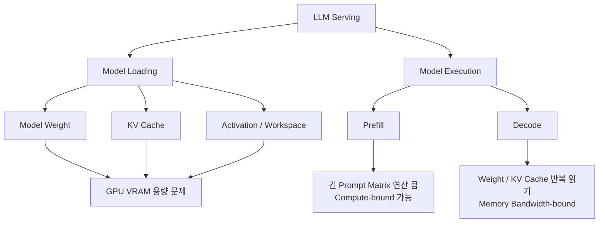
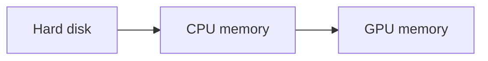
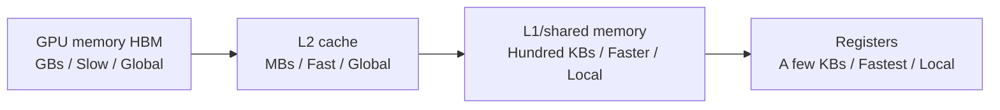
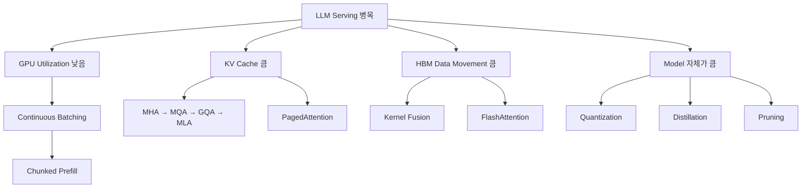
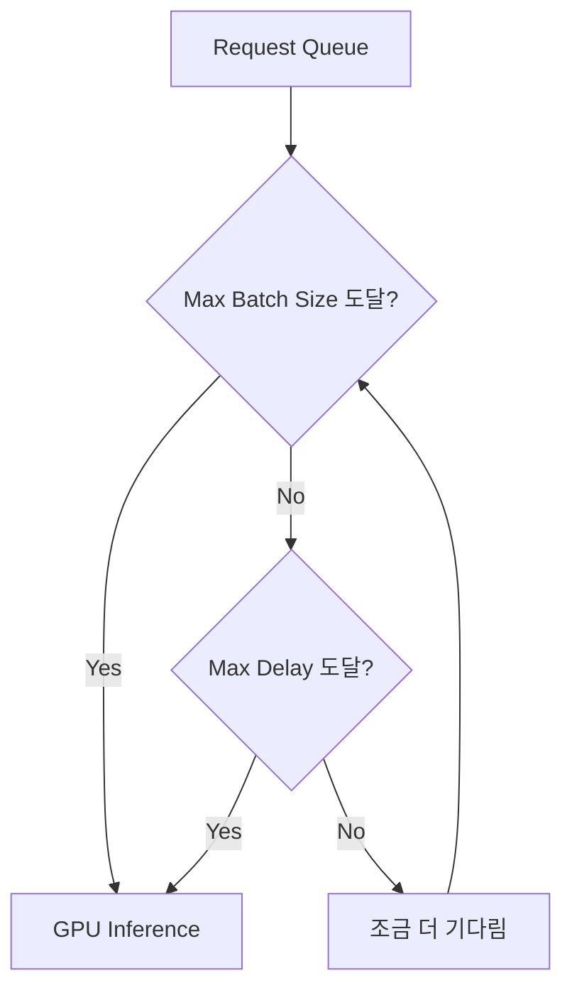
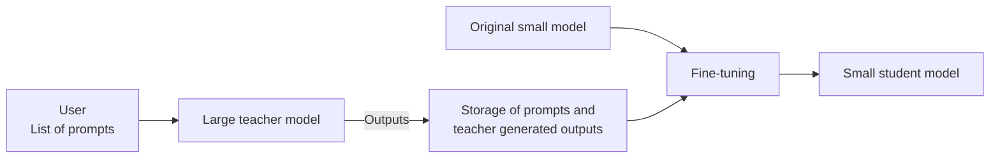
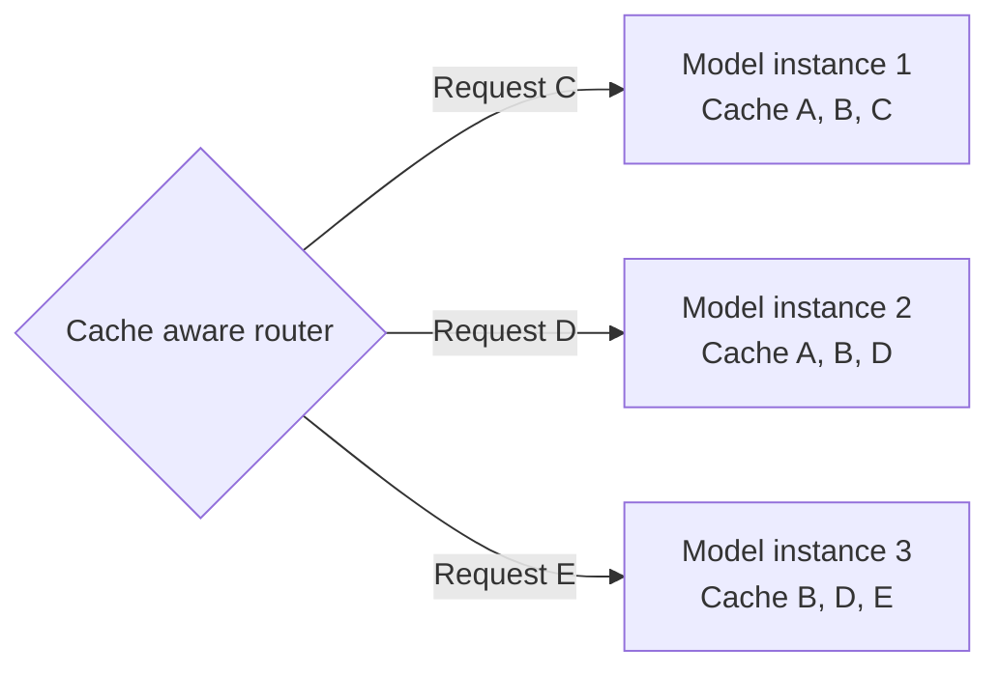

---
tags:
  - vLLM
  - LLM
  - GPU
  - KV Cache
  - Continuous Batching
  - FlashAttention
  - PagedAttention
  - Quantization
  - Prefix Caching
---

# LLM 서빙의 병목과 필수 최적화 기법

> LLM 서빙이 어디서 느려지는지를 GPU 스펙·모델 로딩·산술 강도 관점에서 분석하고, 이를 해결하는 4대 필수 최적화 기법(요청 배칭/스케줄링, 어텐션/커널 최적화, 모델 압축, 프리픽스 캐싱)을 정리한다.

## 개요

일반적인 모델 서빙 개념에서 벗어나, LLM 서빙 최적화라는 빠르게 성장하는 분야를 본격적으로 다룬다. ChatGPT 등장(2022년 말) 이후 LLM이 실무에 널리 쓰이게 됐지만, 모델 크기·연산량·서빙 요구사항이 기존 모델과는 차원이 달라 vLLM, FlashAttention, MLA 같은 새로운 도전 과제가 쏟아지고 있다.

핵심 질문은 세 가지다.

- "TFLOPS가 높은 GPU = 좋은 LLM 서빙 GPU인가?"

- 우리 워크로드는 지금 GPU 연산력을 다 쓰고 있는가, 아니면 메모리 대역폭이 병목인가?

- 같은 하드웨어로, 같은 지연시간·처리량을 유지하면서 비용/품질을 어떻게 더 유리하게 바꿀 수 있는가?

LLM Serving은 항상 GPU 계산 성능(TFLOPS)이 부족해서 느린 것이 아니다. 병목은 단계별로 다르다.



- 모델을 올릴 때는 GPU VRAM 용량이 중요하다.

- Prefill은 입력이 길어지면 Compute-bound가 될 수 있다.

- Decode는 대체로 Memory Bandwidth-bound다.

- 긴 Context/동시 사용자 증가는 KV Cache 메모리가 큰 문제다.

- Multi-GPU에서는 NVLink/NVSwitch/RDMA 같은 Interconnect도 중요하다.

즉 GPU를 고를 때 단순히 "TFLOPS 높은 GPU = 좋은 LLM GPU"라고 판단하면 안 되며, Compute(산술 강도) + VRAM 용량 + Memory Bandwidth + GPU Interconnect에 모델 크기, precision, KV cache, prefill/decode 비율까지 함께 봐야 한다.

## LLM 서빙 최적화가 중요한 이유

ML 모델을 운영 환경에 배포할 때 기능적으로 잘 작동하게 만드는 것과 별개로, 실제 운영 환경에서 빠르고 효율적으로 작동하게 하는 것이 중요하다. 특히 하드웨어의 막대한 연산 능력과 메모리를 필요로 하는 LLM에서는 이 영향을 세 가지 측면으로 분류할 수 있다.

### 고객 체험 (Customer Experience)

지연시간(latency)과 고객 만족도는 반비례 관계지만, 그 영향은 비선형적이다. 첫 토큰까지 20초 이상 기다려야 하는 상황을 1초로 줄이면 만족도가 극적으로 개선되지만, 0.1초를 0.01초로 줄이는 것은 인간의 인식에 거의 느껴지지 않는다.

- 이미 충분히 빠른 상황에서는 지연시간을 조금 늘리는 대신 처리량(throughput)을 높이는 트레이드오프가 비용 효율 측면에서 더 유리할 수 있다.

- 모델 품질도 고객 경험의 중요한 축이다. 같은 계열(예: Llama-3)에서는 파라미터 수가 클수록(8B → 70B) 벤치마크 성능이 우수하다.

- 서빙 시스템을 최적화하면, 동일한 하드웨어·지연시간·처리량 조건에서도 더 큰 모델(8B → 32B/70B)을 사용할 수 있어 응답 품질이 크게 향상된다.

결국 서빙 최적화는 단순히 "더 빠르게"가 아니라, 지연시간·처리량·모델 크기(품질) 사이의 트레이드오프를 상황에 맞게 조율하는 문제다.

### 비용 효율성 (Cost Efficiency)

AI 시스템은 아무리 강력해도 운영 비용이 너무 크면 사업적으로 성립할 수 없으며, AI 비용 구조에서 가장 큰 비중을 차지하는 것은 (많은 사람들의 예상과 달리) 훈련이 아니라 추론(inference)이다.

- GPT-4 같은 모델의 훈련 비용이 5천만 달러 이상이라는 보도로 훈련이 더 비싸 보이지만, 실제로는 추론용 하드웨어 소비가 이미 훈련을 넘어섰고 격차는 계속 커지는 추세다(2024~2034 전망 기준 AI 칩 매출의 추론 비중 62.7% → 67.2%).

- 훈련은 대부분 일회성 선투자인 반면, 추론은 배포 후 모든 쿼리·상호작용마다 지속적으로 비용이 발생하고 사용량이 늘수록 누적된다.

- 실제 비즈니스에서 LLM을 쓰는 대다수 기업은 처음부터 훈련하기보다 기존 모델을 파인튜닝하거나 RAG 같은 기법으로 보강하는 방식을 택한다.

- AI 에이전트/복잡한 워크플로우는 하나의 워크플로우 안에서 여러 LLM·임베딩 모델 호출을 필요로 해 추론 비용을 더욱 가중시킨다.

AI 비용의 진짜 승부처는 지속적으로 발생하는 추론 비용이며, 효율적인 모델 서빙(같은 하드웨어로 더 높은 처리량, 또는 더 저렴한 하드웨어로 동등한 성능)이 AI 비즈니스의 재무적 생존을 좌우하는 핵심 과제다.

### 확장성, 최대 부하 처리, 실현 가능성

프로덕션에 배포된 모델은 고객 증가에 따라 GPU 수요가 함께 확장되며, 최적화된 추론 솔루션은 GPU 공급이 제한된 상황에서 시스템이 트래픽 급증에도 효율적으로 확장될 수 있는지를 좌우한다.

- 평소 안정적인 트래픽을 처리하던 LLM 기반 영업 에이전트도 블랙프라이데이 같은 시기엔 수요가 400% 이상 급증할 수 있다. 최적화가 부족한 시스템은 이런 급증을 감당하지 못해 병목, 지연시간 악화, 요청 실패로 이어진다.

- LLM serving은 평균 traffic보다 peak traffic에서 문제가 드러난다. Peak load를 처리하려면 model replica, GPU memory, queueing, autoscaling, cold start 시간을 함께 고려해야 한다.

- 최적화된 모델은 저사양 칩에서도 구동 가능해 유연성이 커진다. 주요 클라우드를 이용해도 모든 리전에서 고사양 GPU를 항상 구할 수 있는 것은 아니기 때문에, 특정 고급 GPU에 종속되지 않고 더 넓은 범위의 하드웨어에서 모델을 구동할 수 있는 능력은 신규 시장 확장 시 핵심 요인이 된다.

## LLM 서빙에서 가속기 칩의 역할

적절한 가속기(GPU) 구성 선택은 LLM 서빙에서 가장 중요한 결정 중 하나인데, 하드웨어 제약이 메모리 용량·연산 성능·효율성을 결정하기 때문이다. 2026년 초 현재 NVIDIA의 GPGPU 솔루션이 여전히 시장을 지배하고 있어 NVIDIA GPU에 초점을 맞춘다.

### GPU 스펙 읽기: Compute, Memory, Interconnect, Power

LLM serving에 영향을 주는 GPU 스펙은 크게 네 그룹이다.

| 스펙 그룹 | 의미 | LLM 서빙에서의 역할 |
|-----------|------|---------------------|
| Compute | FLOPS, Tensor Core 성능, 지원 precision | Matrix multiplication과 attention/MLP 연산 처리량 결정. 단, decode는 항상 compute-bound가 아님 |
| Memory | VRAM 용량, memory bandwidth | 용량은 모델 weight와 KV cache 수용 여부, 대역폭은 weight/activation을 읽는 속도 결정 |
| Interconnect | PCIe, NVLink, NVSwitch, InfiniBand 등 GPU 간/노드 간 통신 대역폭 | Tensor parallelism 시 GPU 간 activation·partial result·synchronization traffic 처리 |
| Power | TDP(Thermal Design Power) 기준 지속 전력 | 와트당 성능이 데이터센터 처리량·냉각·비용을 좌우 |

GPU를 피자 가게에 비유하면 이해가 쉽다.

| GPU 요소 | 식당 비유 | LLM에서 의미 |
|----------|-----------|--------------|
| TFLOPS | 오븐 성능 | 계산 속도 |
| VRAM | 냉장고 크기 | Model/KV Cache 저장 |
| Memory Bandwidth | 재료 운반 속도 | GPU 연산기로 데이터 전달 |
| NVLink/RDMA | 주방 간 통로 | GPU 간 데이터 전달 |

세 요소의 상호작용은 다음과 같다.

1. 냉장고(메모리 용량)가 작으면 → 반죽을 다 저장 못해 고객이 굶주림 = 모델 자체를 로드할 수 없음(OOM)

2. 오븐(연산력)은 강력한데 반죽 공급(대역폭)이 느리면 → 오븐이 놀고 있음 = GPU 연산력 낭비

3. 반죽 공급(대역폭)은 빠른데 오븐(연산력)이 약하면 → 굽는 데 시간이 오래 걸려 고객이 대기 = GPU 연산력 병목

결론적으로 워크로드에 맞게 연산력·메모리 용량·대역폭 사이의 균형을 찾는 것이 중요하다.

### H100 SXM vs H100 NVL 스펙 분석

| 항목 | H100 SXM | H100 NVL |
|------|----------|----------|
| FP64 | 34 teraFLOPS | 30 teraFLOPS |
| FP32 | 67 teraFLOPS | 60 teraFLOPS |
| BFLOAT16 Tensor Core | 1979 teraFLOPS | 1671 teraFLOPS |
| FP8 Tensor Core | 3958 teraFLOPS | 3341 teraFLOPS |
| GPU Memory | 80 GB | 94 GB |
| GPU Memory Bandwidth | 3.35 TB/s | 3.9 TB/s |
| Form Factor | SXM | PCIe dual-slot air-cooled |
| Interconnect | NVLink 900GB/s + PCIe Gen5 128GB/s | NVLink 600GB/s + PCIe Gen5 128GB/s |

- teraFLOPS는 GPU의 이론적 연산 성능 지표로, FLOPS(Floating-point Operations Per Second)는 1초에 수행 가능한 부동소수점 연산 횟수를 의미한다. FP8은 FP16의 절반 비트를 사용해 같은 시간에 약 2배의 연산이 가능하다.

- H100 SXM은 FLOPS가 더 높아 연산(GPU 연산) 속도에서 앞서지만, H100 NVL이 더 뛰어난 메모리 용량(94GB > 80GB)과 대역폭(3.9TB/s > 3.35TB/s)을 가진다.

- 즉 "연산력 우위 vs 메모리 우위"의 선택이며, 이것이 곧 "모든 용도에 좋은 GPU는 없다"는 뜻이다.

### GPU 인터커넥트

GPU 인터커넥트는 하나의 노드 내(intra-node) 또는 여러 노드 간(inter-node)에서 여러 GPU 사이의 고속 데이터 전송을 가능하게 한다. 예전에는 훈련에만 중요했지만, 모델이 커지면서 하나의 GPU로는 모델을 다 담지 못하거나 지연시간 요구사항을 맞추기 위해 여러 GPU가 협력해야 하는 경우가 늘어 서빙(추론)에서도 점점 중요해지고 있다.

**Intra-node 인터커넥트 (노드 내부)**:

폼팩터는 GPU의 물리적 크기, 전력 요구사항, 냉각 설계를 결정하며 서버에 어떻게 장착되는지를 좌우한다.

- SXM: 메인보드의 전용 소켓에 직접 장착 → 더 빠른 연결, 더 나은 전력 공급, 향상된 냉각 → 멀티 GPU 고강도 워크로드에 유리

- PCIe (H100 PCIe, H100 NVL): 일반 PCIe 슬롯에 장착 → 호환성 좋고 비용 저렴하지만 성능은 다소 떨어짐

구성별 GPU 간 대역폭은 다음과 같다.

| 구성 | 인터커넥트 | GPU 간 대역폭 | 특징 |
|------|-----------|---------------|------|
| H100 PCIe | PCIe만 | 128 GB/s | 가장 저렴. GPU 간 고속 통신이 필요 없는 독립 소형 모델 서빙에 적합 |
| H100 NVL | NVLink Bridge | 600 GB/s | GPU 2개까지만 연결 가능. 4-GPU 구성 시 브리지 밖 GPU 쌍은 여전히 128GB/s PCIe. 비용/성능 절충안 |
| H100 SXM | NVLink point-to-point | 각 연결당 128 GB/s (900÷7) | 최대 8 GPU. 각 GPU의 총 900GB/s를 7개의 점대점 연결로 분할 |
| H100 SXM + NVSwitch | NVLink + NVSwitch | 모든 GPU 쌍 900 GB/s | 별도의 고가 고대역폭 스위치로 all-to-all 통신. 최고 성능이지만 GPU 간 통신이 적은 워크로드에는 과잉 |

**Inter-node 인터커넥트 (노드 간)**:

- 한 노드에 담을 수 있는 GPU 수는 물리적 제약, 전력, 냉각, 소프트웨어 지원 등으로 보통 최대 8개로 제한된다.

- Inter-node serving은 intra-node serving보다 latency와 운영 복잡도가 커지므로 가능하면 한 노드 안에서 먼저 최적화하는 것이 좋다.

- 모델이 더 커지면 여러 노드에 걸쳐 모델을 샤딩(sharding)해야 하며, 이때 InfiniBand, RoCE 같은 네트워크 성능이 중요해진다. 대표 솔루션은 InfiniBand(IB) 또는 RoCEv2 + GPUDirect RDMA(Remote Direct Memory Access)다.

H100 기준 통신 속도를 비교하면 노드 간 통신이 노드 내 대비 얼마나 느린지 드러난다.

| Setup | Bandwidth |
|-------|-----------|
| GPU-to-GPU within node with NVLink/NVSwitch | 900 GB/s |
| GPU-to-GPU within node with NVLink Bridge | 600 GB/s |
| GPU-to-GPU within node with PCIe | 128 GB/s |
| GPU-to-GPU across node (NDR 400G InfiniBand) | 50 GB/s |

최근 연구에서는 서로 다른 GPU 간에 프리필 단계와 디코딩 단계를 분리하는 방안을 모색하고 있으며, DeepSeek V3/R1 같은 MoE(Mixture-of-Experts) 아키텍처를 사용하는 대형 모델의 경우 전문가 병렬 처리와 데이터 병렬 처리 같은 기법이 노드 간에도 적용된다.

### GPU 전력 소비

전력 소비는 눈에 잘 안 띄지만 근본적인 GPU 지표다. 최신 데이터센터 GPU는 수백 와트에서 700W 이상까지 다양하며, 전력 예산이 클수록 연산 밀도와 메모리 대역폭이 높아지지만 그만큼 냉각·전력 공급·시스템 통합에 대한 요구사항도 엄격해진다.

배포 환경별로 중요도가 다르다.

1. 일반 클라우드 사용자: 전력은 대부분 추상화되어 있다. 인스턴스 타입을 선택하고 사용량/시간 기준으로 과금되며, 전력은 가격·가용성·성능 등급에 암묵적으로 반영될 뿐 직접 관리하지 않는다.

2. 클라우드 제공업체/프라이빗 데이터센터: 전력은 1급 설계 제약이다. 랙당/시설당 배치 가능한 GPU 수를 전력·냉각 용량이 제한하므로, 와트당 성능(performance per watt)이 고정된 인프라 예산 하에서 처리량을 극대화하는 핵심 지표가 된다.

3. 엣지/온디바이스 시스템: 전력이 시스템 전체를 규정하는 제약이다. 배터리, 발열, 폼팩터의 엄격한 한계로 인해 모델 아키텍처, 정밀도 선택, 실행 전략이 최고 성능이 아니라 전력 효율성 중심으로 결정된다.

### 인기 GPU 스펙 비교와 사례별 선택

일반적으로 더 강력한 GPU는 항상 더 비싸다. 따라서 GPU 선택은 결국 "서빙하려는 모델이 그 GPU의 향상된 성능이나 특정 기능(예: FP8 지원, NVLink)으로부터 실제로 이득을 보는가?"에 달려 있다.

| 항목 | H200 SXM | H100 SXM | A100 SXM | L40S | A10 |
|------|----------|----------|----------|------|-----|
| GPU memory size (GB) | 141 | 80 | 80 | 48 | 24 |
| FP16/BF16 TeraFLOPS (Tensor Core) | 1979 | 1979 | 312 | 362 | 125 |
| GPU memory bandwidth (TB/s) | 4.8 | 3.35 | 1.935 | 0.864 | 0.6 |
| FP8 지원 | Yes | Yes | No | Yes | No |
| NVLink/NVSwitch | Yes | Yes | Yes | No | No |
| 시간당 온디맨드 비용/GPU | ~$6.3 | ~$6.2 | ~$2.7 | ~$2.25 | <$1.25 |

사례별 분석은 다음과 같다.

1. **소형 모델 (Small model)**: 특정 use case용으로 파인튜닝한 Llama-3-8B, 지연시간이 그리 중요하지 않은 경우. A10이 괜찮은 선택이다. 모델을 로드·실행하기에 충분한 메모리를 보유하고, 표에서 가장 저렴하며, 구세대 칩이라 가용성이 높다(구하기 쉬움).

2. **중형 모델 (Mid-sized model)**: DeepSeek-R1-Distill-Qwen-14B(Llama-3-8B의 거의 2배 파라미터). L40S로 한 단계 업그레이드하는 것이 좋은 선택이다. 특히 FP8 정밀도 지원이 크게 유리하게 작용하고, 여러 GPU로 나눠 서빙할 때 생기는 오버헤드를 피할 수 있으며(단일 GPU로 충분), 긴 입력 컨텍스트·긴 출력 생성·높은 배치 크기를 감당할 만큼 메모리 여유가 있다.

3. **대형 모델 (Large model)**: DeepSeek-R1(671B 파라미터). 이 경우 NVLink Switch가 필수적인 기능이 된다. 모델이 너무 커서 단일 H200 한 대로도 로드 불가하고 속도도 부족하므로, H200 GPU 8개를 하나의 머신에서 NVLink로 연결하고 FP8 정밀도로 운영하는 구성이 유력하다. DeepSeek 모델은 MoE 아키텍처를 사용해 여러 GPU 또는 여러 노드에 전문가(expert)를 분산 배치하는 추가 최적화도 가능하다.

이 분야는 기술 변화가 매우 빠르다. 오늘 가장 핫한 칩이 내일이면 신형으로 교체될 수 있지만, 지금 배우는 기초 개념과 판단 기준(intuition)은 변하지 않는다.

## 모델 로딩의 병목

### 모델 로딩 프로세스

모델 로딩은 storage에서 model weight를 읽고, CPU memory를 거쳐 GPU memory에 복사한 뒤, runtime이 실행 가능한 형태로 준비하는 과정이다.



병목은 원격 storage에서 weight 다운로드, Disk I/O, CPU memory copy, CPU to GPU transfer, GPU memory allocation, model initialization 및 compilation/warmup 등 여러 지점에서 생긴다. 한 번 로드되면 가중치는 GPU 메모리에 캐싱된 상태로 유지되어 들어오는 요청을 즉시 처리할 준비가 된다.

"그냥 CPU 메모리에 캐싱하거나, 요청 들어올 때마다 로드하면 안 되나?"라는 질문의 답은 데이터 전송 속도 때문에 안 된다는 것이다.

| Hard disk (SSD) bandwidth | CPU memory bandwidth | GPU memory bandwidth |
|---------------------------|----------------------|----------------------|
| 0.5 to 14 GB/s | 50 to 200 GB/s | 300 GB/s to 3 TB/s |

- CPU 메모리는 일반적으로 DRAM으로 용량과 범용 접근성에 최적화된 반면, GPU 메모리는 HBM(High-Bandwidth Memory)으로 대규모 병렬 데이터 이동에 최적화됐다.

- 모델 가중치는 반드시 GPU 메모리에 캐싱되어야 GPU 연산을 활용할 수 있다. 가중치가 CPU 메모리에만 있다면 매번 GPU 메모리로 전송하는 추가 단계가 필요해지고, 이는 실시간 서빙에 용납할 수 없는 지연을 초래한다.

이것이 곧 "GPU 메모리 용량이 왜 그렇게 중요한 제약인가"를 설명하는 핵심 근거다.

### 모델 크기 추정하기

모델의 메모리 사용량(footprint)을 계산할 때 핵심 변수는 두 가지다.

1. **파라미터 개수 (parameter count)**: Hugging Face의 모델은 이름 자체에 파라미터 개수가 드러나는 경우가 많다. 예를 들어 Llama-2-7b는 약 70억(7 billion) 개의 파라미터를 가진 모델이다.

2. **파라미터의 데이터 타입 (정밀도, precision)**: Hugging Face 리포지토리의 config.json 파일에서 확인 가능하며, 특히 `torch_dtype` 속성이 모델 가중치에 사용된 정밀도를 알려준다. 예를 들어 `"torch_dtype": "float16"`이면 가중치 저장·연산에 16비트 부동소수점을 사용한다.

정밀도란 파라미터 하나를 저장하는 데 필요한 비트 수와 그에 대응하는 메모리 크기를 의미한다. 일반적으로 정밀도를 낮출수록(FP32 → FP16 → INT8/FP8) 정확도는 다소 희생되지만 모델 크기는 줄고 서빙 성능은 향상된다.

| 정밀도 | 비트 수 | 바이트 크기 |
|--------|---------|-------------|
| FP32 (단정밀도, single precision) | 32 | 4 바이트 |
| FP16 (반정밀도, half precision) / BF16 | 16 | 2 바이트 |
| INT8 / FP8 (1/4 정밀도, quarter precision) | 8 | 1 바이트 |

계산 예시(Llama-2-7b, BF16): ~7 billion parameters × 2 bytes/parameter = 14 billion bytes = **14 GB**. 실제 모델 파일(pytorch_model*.bin) 크기를 확인하면 총 약 13GB(9.98 + 3.5GB)로 추정치와 거의 일치한다.

요지: 모델의 GPU 메모리 요구량은 "파라미터 개수 × 파라미터당 바이트 수(정밀도에 따라 결정)"라는 간단한 공식으로 추정할 수 있다.

### KV 캐시 크기 추정하기

"모델만 담기면 충분하지 않을까?" Llama-2-7b가 약 14GB이니 16GB GPU라면 로딩은 문제없고 짧은 요청 하나는 잘 돌아간다. 하지만 모델을 겨우 담을 정도의 메모리만 있는 GPU는 이상적이지 않다. 바로 KV 캐시 때문이다.

KV 캐시는 GPU 메모리 일부를 희생해 훨씬 빠른 서빙 성능을 얻는 최적화 기법으로, 중간 계산 결과를 캐싱해두면 다음 토큰을 디코딩할 때 재계산 없이 재사용할 수 있다. GPU 메모리는 모델 가중치, KV cache, 기타 임시 텐서(activations)가 함께 자리 잡는(co-locate) 구조이며, KV 캐시용 여유 공간이 너무 작으면 배치 크기(batch size)와 컨텍스트 길이가 심하게 제한된다.

토큰당 KV 캐시 크기 계산 공식은 다음과 같다.

```
토큰당 KV 캐시 크기 = 2 × 층 수 × 어텐션 헤드 수 × 헤드 차원 × 데이터 타입 크기
```

Llama-2-7b 예시(기본 MHA 방식): 어텐션 레이어 32개, 어텐션 헤드 32개, 헤드 차원 128(=4096/32), half precision(토큰당 2바이트)을 대입하면:

```
토큰당 KV 캐시 크기 = 2 × 32 × 32 × 128 × 2 = 524,288 bytes = 0.5MB
```

전체 KV 캐시는 토큰당 크기에 캐시에 저장된 최대 토큰 수를 곱한 값이다.

```
전체 KV 캐시 = 토큰당 KV 캐시 크기 × (최대 배치 크기 × 최대 시퀀스 길이)
```

최대 시퀀스 길이 4,096, 배치 크기 16이라면 총 KV 캐시 = 0.5MB × 4,096 × 16 = **32GB**로, 모델 자체 용량인 14GB보다도 크다.

실전 GPU 비교(최대 시퀀스 길이 4,096 기준):

| GPU / 메모리 | 모델 로드 후 남은 메모리 | 최대 배치 크기 | 시간당 비용(AWS 온디맨드) |
|--------------|--------------------------|----------------|---------------------------|
| A10 24 GB | 10 GB (24 − 14) | 4 (10 × 1024/(0.5 × 4096) = 5) | $2 |
| L40S 48 GB | 34 GB (48 − 14) | 16 (34 × 1024/(0.5 × 4096) = 17) | $3.75 |

A10은 병렬 요청 4개만 처리 가능하지만 L40S는 16개를 처리할 수 있다. L40S가 더 비싸지만 결과적으로 비용 효율은 더 좋다(동시 처리량이 4배 늘어난 데 비해 비용은 약 2배만 증가). 단, 계산식으로 나온 이론적 최대 배치 크기를 실제로는 온전히 다 쓸 수 없다. 활성화(activation), 즉 중간 계산 단계에서 생성되는 텐서를 위한 공간도 GPU 안에 따로 확보해둬야 하기 때문이다.

### GPU 메모리 사용량의 변화: Idle → Execution

- 모델 가중치: 로딩 시 캐싱, 고정.

- KV 캐시: 실행 중 시퀀스 길이가 늘어날수록 계속 증가(Prefill 시 Context KV가 한 번에 오르고, Decode 동안 Generational/incremental KV가 점진 증가).

- 생성이 끝나는 시점의 피크 메모리 사용량을 넘어서는 여유분을 반드시 확보해야 OOM(out-of-memory) 에러를 피할 수 있다.

Serving에서 흔한 문제는 weight는 GPU에 올라가지만, 높은 concurrency와 긴 context에서 KV cache가 memory를 초과하는 상황이다. 따라서 `max_num_seqs`, `max_model_len`, `max_num_batched_tokens`, GPU memory utilization 같은 설정이 중요하다.

일반적인 경험칙(rule of thumb): GPU 메모리 요구량을 추정할 때 **모델 크기의 약 2배 정도의 GPU 메모리를 확보하는 것을 시작점으로 권장**한다. 이렇게 하면 더 나은 병렬성을 얻고 GPU 성능을 더 잘 끌어낼 수 있으며, prefix caching 같은 기법들이 요구하는 추가 메모리도 수용할 수 있다.

## 모델 실행의 병목

모델이 GPU 메모리에 완전히 로드되어 서빙 준비가 끝났다면, 이제 근본적인 질문을 던질 차례다. 모델 서빙은 GPU 연산(compute FLOPS)에 의해 제한되는가, 아니면 GPU 메모리 대역폭(memory bandwidth)에 의해 제한되는가? 피자 주방 비유로 말하면, 더 빨리 굽는 큰 오븐이 필요한가, 아니면 재료와 반죽을 더 빨리 준비하는 게 필요한가를 분석하는 것이다.

### 산술 강도 (Arithmetic Intensity)

산술 강도는 알고리즘이 수행한 연산 수와 접근한 바이트 수의 비율을 의미한다.

```
산술 강도 = FLOPS 수 / 데이터 이동량(바이트)
```

- 산술 강도가 낮음: 연산은 적게 필요하지만 데이터 읽기/쓰기가 많은 워크로드

- 산술 강도가 높음: 데이터는 적게 읽고 쓰지만 그 위에서 많은 연산을 수행하는 워크로드

### 데이터 이동 (Data Movement)

데이터 이동은 모델 실행 시점에 일어나는 것으로, 모델 가중치가 이미 GPU 메모리(off-chip HBM)에 있는 상태에서 발생한다(모델 로딩과는 다른 개념이다).



- 온칩(on-chip) 메모리: L2 캐시, L1 캐시, 공유 메모리 → SRAM으로 구성. 용량은 작고 비싸지만 훨씬 빠르며 연산 유닛 바로 옆에 위치한다.

- HBM: 속도를 희생하고 용량을 확보한다. SRAM은 저지연 연산을 지원하고, HBM은 모델 가중치 같은 대용량 데이터 저장을 담당한다.

왜 GPU "메모리 대역폭"을 기준으로 삼는가? 서빙 중 모델 가중치와 모든 중간 결과가 계속 레지스터로 읽혀 들어가는데, 이 경로에서 가장 느린 구간이 GPU 메모리(HBM)이기 때문에 GPU 메모리 대역폭이 데이터 이동의 기준 지표가 된다. (예외: 가중치나 출력이 충분히 작아서 FlashAttention처럼 온칩 캐시에 영리하게 담기는 경우는 다소 다르다.)

### 루프라인 모델 (Roofline Model)

루프라인 모델은 시스템의 연산 능력과 메모리 대역폭을 함께 나타내어, 애플리케이션이 compute-bound(연산 제한)인지 memory-bound(메모리 대역폭 제한)인지 판별하는 시각적 성능 모델이다.

L40S 스펙(FP16 Tensor Core 362.05 TFLOPS, Memory Bandwidth 864 GB/s)만으로 칩의 이론적 산술 강도를 계산할 수 있다.

```
362 TeraFLOPS / 864 GB/s = (362 × 10^12 FLOPS) / (864 × 10^9 B) ≈ 419 FLOPS/B
```

워크로드의 산술 강도가 419 FLOPS/B보다 낮으면 memory-bound(대역폭이 병목), 높으면 compute-bound(연산이 병목)다. LLM 서빙에서는 이 경계가 prefill과 decode의 서로 다른 병목을 설명한다.

- **Prefill**: 입력 프롬프트의 토큰들을 병렬로 처리해 높은 산술 강도를 달성한다 → compute-bound 워크로드

- **Decode**: 자기회귀적(autoregressive) 특성 때문에 토큰 하나를 생성하기 위해 수십억 개 파라미터 전체를 훑어야 하므로 memory bandwidth-bound다 → GPU 메모리 대역폭 관점에서 매우 비효율적

## 요청 배칭과 스케줄링 최적화

여기서부터는 앞서 파악한 병목을 해결하는 4대 필수 최적화 기법을 다룬다.



| 기법 | 목적 |
|------|------|
| Batching and scheduling | GPU idle time을 줄이고 throughput을 높인다 |
| Attention and kernel optimization | Attention 계산과 memory movement를 줄인다 (KV Cache와 HBM↔SRAM 데이터 이동 축소) |
| Model compression | 모델 자체를 작고 빠르게 만든다. Quantization, distillation, pruning으로 memory footprint와 연산 비용을 줄인다 |
| Prefix caching | 이전 Prompt 계산 결과를 재사용한다. 반복 prefix를 재사용해 prefill 비용을 줄인다 |

최적화는 하나의 설정으로 끝나지 않는다. TTFT(Time To First Token), TPOT/ITL, throughput, GPU memory, accuracy, operational complexity 사이의 trade-off를 함께 측정해야 한다.

### 실시간 서빙에서 배칭이 왜 필요한가

오프라인 서빙은 요청들이 이미 다 확보된 상태라 하나로 배칭해서 큰 텐서 입력으로 만들어 한꺼번에 모델에 투입할 수 있지만, 실시간 온라인 서빙은 사용자가 보내는 대로 요청이 하나씩 들어온다.

배칭의 핵심 원리는 **"모델 가중치를 한 번 읽을 때 그 대가로 최대한 많은 연산(토큰 생성)을 뽑아내는 것"**이다.

- 여러 요청을 배치로 묶으면 → 행렬의 M 차원(배치 크기)이 커짐 → 산술 강도가 올라감 → GPU 연산 유닛을 더 잘 활용(포화)할 수 있게 됨 → 동일한 GPU로 훨씬 더 많은 토큰/요청 처리 가능

- **Prefill에는 효과가 제한적**이다. 이미 입력 토큰 전체를 병렬로 처리하고 있어서, 입력 프롬프트가 아주 작지 않은 이상(대략 1,024 토큰 미만이 아닌 이상) prefill 자체만으로도 GPU 연산 능력을 이미 포화시킨다.

- **Decode에 특히 효과적**이다. 한 번에 토큰 하나씩만 생성하는 구조이므로, 여러 요청을 묶으면 모델 가중치는 여전히 한 번만 읽되 그 한 번의 읽기로 더 많은 토큰을 생성하게 되어 전체 처리량이 상승하고 GPU FLOPS 활용률이 개선된다.

### 동적 배칭 (Dynamic Batching)

Static Batching은 Max Batch가 10이라고 해서 무조건 10개가 찰 때까지 기다린다. Request 1~9는 바로 도착했는데 Request 10이 5분 후 도착하면 앞의 9개가 5분이나 기다릴 수 있다. 오프라인 사용 사례에는 적합하지만 온라인 추론에는 부적합하다.

그래서 Dynamic Batching은 두 개를 함께 사용한다 — **Max Batch Size + Max Delay Time(최대 대기 시간)**. "10명이 차면 바로 출발하고, 10명이 안 차더라도 5분이 지나면 출발한다."



파라미터 튜닝 방향(목표: 지연시간 SLA를 지키는 선에서 배치 크기를 최대한 높게 유지):

- 배치 크기(max batch size): 너무 높이면 처리 지연시간 증가 + GPU/CPU 메모리 사용량 증가 → 결국 OOM 위험

- 최대 지연 시간(max delay time): 너무 길게 설정 + 높은 배치 크기 조합 → 이미 도착한 요청들이 오래 대기. 너무 짧게 설정 → 배치를 제때 채우지 못해 실제 처리되는 배치 크기가 줄어듦(배칭 효과 반감)

하지만 LLM에서는 이것만으로도 부족하다. Traditional inference에서는 효과적이지만, LLM은 request마다 output 길이가 달라 batch 내부의 sequence가 서로 다른 시점에 끝난다.

### 연속 배칭 (Continuous Batching)

동적 배칭은 대부분의 전통적인 ML 서빙에는 잘 작동하지만, LLM은 입력·출력 길이가 요청마다 크게 달라 배치 안 요청들이 처리 완료까지 걸리는 시간이 제각각이다. 동적 배칭에서는 배치의 전체 완료 시간이 가장 길고 느린 요청에 의해 결정되므로, 짧은 요청들이 가장 긴 요청 하나가 끝날 때까지 대기하며 큰 GPU 유휴 시간(idle time)이 발생한다.

연속 배칭(inflight batching, iterative batching이라고도 불림)은 정해진 배치 크기·시간을 기다리지 않고, 요청을 백엔드 모델에 즉시 추가하고 그때그때 유동적으로 그룹핑한다. 핵심 동작은 **배치 내 실행 중인 요청 하나가 끝나는 즉시 → 대기열에 있던 요청이 바로 그 자리에 추가**되는 것이다.

- 처음에 요청 1, 2, 3이 처리 시작 → 요청 1이 끝나면 새로 도착한 요청 4가 즉시 추가 → 요청 2가 끝나면 요청 5 추가 → 요청 5가 끝나면 요청 6 추가. (동적 배칭이었다면 4, 5, 6 모두 요청 3이 끝날 때까지 대기해야 했을 것)

- 나룻배 비유: "10인승 배 1척"이 아니라 "1인승 배 10척". 사람이 도착하는 즉시 배 한 척이 바로 출발하고, 목적지(거리)가 제각각이어도 낭비 없이 데려다주고 돌아오면 바로 다음 사람을 태운다.

- 연속 배칭은 이 책을 쓰는 시점 기준, 몇 년간 프로덕션 LLM 서빙의 업계 표준이다.

연속 배칭에서는 max delay time을 더 이상 인위적으로 설정할 필요가 없지만(동적 배칭과의 차이점), 최대 배치 크기는 여전히 관리·튜닝이 필요하다. LLM 요청은 입력 길이가 천차만별이기 때문에("20토큰짜리 요청 10개"와 "100,000토큰짜리 요청 2개"는 완전히 다른 워크로드) 토큰 레벨의 더 세밀한 제어인 최대 배칭 토큰 수도 필요하다.

| 파라미터 | 의미 | vLLM 옵션 |
|----------|------|-----------|
| max batch size | 한 번에 배치로 함께 처리할 수 있는 최대 요청 개수 (절대 상한선 역할) | `--max-num-seqs` |
| max model length | 요청 하나의 토큰 길이가 넘을 수 없는 모델 자체의 컨텍스트 상한 | `--max-model-len` |
| max number of tokens | 스케줄러가 배치 전체에서 허용하는 총 토큰 수의 상한. 이 한도에 빨리 도달하면 새 요청을 배치에 추가하지 않음 | `--max-num-batched-tokens` |

```bash
vllm serve Qwen/Qwen2.5-7B-Instruct \
  --max-num-batched-tokens 4096 \
  --max-num-seqs 128 \
  --max-model-len 1024
```

단계별 실제 제약 조건: Prefill 단계는 입력이 훨씬 길기 때문에 최대 토큰 수(max number of tokens)가 핵심 제약이고, Decode 단계의 병렬성은 보통 최대 배치 크기(max batch size)에 의해 제한된다. 최대 토큰 수를 너무 낮게 설정하면 prefill 단계에서 GPU에 충분한 토큰을 병렬로 공급하지 못해 GPU 연산력을 다 포화시키지 못한다.

### 청크 프리필 (Chunked Prefill)

연속 배칭은 요청마다 길이가 다른 문제는 해결했지만, LLM 서빙의 또 다른 독특한 측면을 간과하고 있다. Prefill(산술 강도가 높아 배칭의 도움을 크게 필요로 하지 않음)과 Decode(산술 강도가 낮아 배칭의 이득을 크게 받음)는 서로 완전히 다른 성격의 워크로드다.

요청 1이 이미 decode 중인데 요청 2가 도착해 prefill을 시작하고 싶다면? 두 가지 방안이 있다.

- **방안 1: Prefill과 Decode를 함께 배칭하지 않음**. 보통 prefill을 우선한다(prefill이 TTFT를 결정하는 중요한 지연시간 지표이기 때문). 하지만 요청 2·3의 prefill을 처리하는 동안 요청 1은 완전히 유휴(idle) 상태로 대기하며, 요청 2·3의 프롬프트가 길면 요청 1의 종단 지연시간(end-to-end latency)과 토큰 간 지연시간(inter-token latency)에 큰 타격을 준다.

- **방안 2: Prefill과 Decode를 함께 배칭**. 그래도 큰 도움은 안 된다. 토큰 하나를 디코딩하는 것은 prefill을 끝내는 것보다 훨씬 빠르기 때문에, 특히 입력 프롬프트가 길 경우 지연이 여전히 두드러진다.

해법이 **청크 프리필**이다. 긴 입력 프롬프트를 더 작은 청크(chunk)로 나누어, 긴 prefill을 여러 chunk로 쪼개 decode와 interleave할 수 있게 한다. 기존 요청은 계속 decode를 진행하고, 새 요청은 자신만의 작은 청크 단위 prefill을 시작한다.

효과와 트레이드오프(결국 use case와 SLA 요구사항에 따라 선택해야 하는 트레이드오프):

- ITL(토큰 간 지연시간): 개선됨 — decode가 더 이상 긴 prefill에 막혀 대기하지 않음

- TTFT(첫 토큰까지 시간): 악화됨 — prefill 단계에 더 많은 작업(오버헤드)이 추가됨

- 종단 지연시간: 개선 안 됨, 오히려 여러 작은 prefill 스텝을 계산하는 오버헤드로 약간 악화되는 경우가 많음

- 처리량(throughput): 보통 개선됨 — 유휴 시간의 빈틈을 채워 배치 효율성이 좋아지고 GPU를 더 잘 활용

튜닝 파라미터는 청크 크기(얼마나 잘게 쪼갤 것인가)다. 극단적으로 크면(예: max model length까지) 사실상 청킹을 전혀 안 하는 것과 같고, 극단적으로 작으면 오버헤드 증가로 한 iteration에서 충분한 토큰을 배칭하지 못해 GPU 연산력을 포화시키지 못한다. vLLM에서는 별도의 "청크 크기" 전용 파라미터 없이 `--max-num-batched-tokens` 값 자체가 청크 크기를 결정하며, `--enable-chunked-prefill`(기본값 True)로 기능을 켜고 끈다. 긴 prefill을 이 값 이하 단위로 잘라서 여러 iteration에 걸쳐 처리하는 방식이다.

더 고급 기법으로 prefill과 decode 작업을 완전히 다른 GPU, 심지어 다른 노드로 분리하는 **Prefill-Decode 분리(disaggregation)**가 있다.

## 어텐션 확장과 GPU 커널 최적화

트랜스포머 블록의 두 가지 주요 구성요소(어텐션 레이어, 피드포워드 레이어) 중 어텐션 측면을 어떻게 확장(scale)하는지에 집중한다. 세 가지 큰 흐름이 있다.

1. 어텐션 알고리즘 자체의 변형(MQA/GQA/MLA)으로 KV 캐시 크기를 줄이고,

2. GPU 커널 최적화(커널 퓨전, FlashAttention 등)로 어텐션 연산·메모리 접근 효율을 높이고,

3. PagedAttention으로 KV 캐시의 GPU 메모리 저장 방식 자체를 재설계한다.

### 어텐션의 진화: MHA → MQA → GQA → MLA

Decode 단계에서는 매 iteration마다 KV 캐시가 HBM에서 온칩 레지스터·공유 메모리로 계속 전송된다. KV 캐시가 작을수록 GPU 메모리 대역폭 부담이 줄어들고, GPU 메모리 공간을 덜 차지해 더 큰 배치 크기로 더 많은 요청을 병렬 처리할 수 있으며(처리량 향상), 제한된 GPU 메모리 안에서 더 긴 컨텍스트도 서빙할 수 있다.

1. **MHA (Multi-Head Attention)**: 많은 초기 모델의 기반이 되는 원래 버전. 쿼리 하나당 별도의 고유한 키·값 헤드가 필요해, 결과적으로 네 방식 중 KV 캐시가 가장 크고 가장 비효율적이다.

2. **MQA (Multi-Query Attention)**: 모든 쿼리가 단 하나의 키·값 헤드를 공유한다. 7B 모델은 보통 어텐션 헤드 32개, 70B 모델은 64개인데, MHA라면 KV도 각각 32개·64개 필요하지만 MQA는 단 1개만 필요해 KV 캐시 크기를 32배·64배까지 줄일 수 있다. 단점은 너무 공격적인 설계 때문에 모델 정확도가 크게 저하되는 것으로 밝혀졌다는 점이다.

3. **GQA (Grouped-Query Attention)**: MQA의 정확도 문제를 완화하기 위해 등장했으며, 성능과 정확도의 균형을 목표로 한다. 쿼리 헤드를 여러 그룹으로 묶고 각 그룹이 동일한 키·값을 공유한다. MHA(연산 효율 낮음)와 MQA(정확도 손실 큼) 사이의 좋은 절충안으로 입증되어 현재 많은 모델 아키텍처에서 채택 중이다. KV 캐시 메모리 사용 비교: MHA 100% vs GQA 50% vs MQA 25%. 추론 속도에서도 이점이 있다(예시 벤치마크에서 MHA 1.51s vs GQA 0.28s vs MQA 0.24s).

4. **MLA (Multi-head Latent Attention)**: DeepSeek이 도입했으며 DeepSeek V2에서 처음 적용되고 V3와 R1에서 사용되고 있다. 단순히 KV 개수를 줄이는 것이 아니라 영리한 방식으로 압축(compress)한다는 점이 핵심 차이로, head를 줄이는 대신 latent를 캐싱한다. DeepSeek 원 논문의 주장: "KV 캐시 크기는 그룹 2.25개짜리 GQA와 동등하지만, 성능은 MHA보다 더 강력하다."

5. **Hybrid Attention**: KDA와 Gated MLA를 3:1로 결합한 Kimi K3 방식 같은 최신 시도들이 있다. 기본 어텐션은 계산이 제곱에 비례해 Long Context에서 너무 비싸므로, Linear Attention/Recurrent State 계열로 계산량을 줄이면서 중간중간 전역 어텐션을 섞어주는 방향으로 발전 중이다(Gated Attention은 Qwen 3 Next에서도 Attn Sink를 피하기 위해 사용).

MHA → MQA → GQA → MLA로 이어지는 흐름은 모두 "모델 품질을 최대한 유지하면서 KV 캐시(=메모리 대역폭·용량 부담)를 얼마나 줄일 수 있는가"라는 단일한 목표를 향한 진화다. 모델이 어떤 방식을 쓰는지는 config.json의 `num_key_value_heads` 값 하나만 봐도 확인할 수 있다.

```json
// Llama2 (MHA) — num_attention_heads와 key/value head 수가 같다
"num_attention_heads": 32, "num_key_value_heads": 32

// Llama3 (GQA) — num_key_value_heads가 축소됨
"num_attention_heads": 32, "num_key_value_heads": 8
// → KV 헤드 하나를 32 ÷ 8 = 4개의 어텐션 헤드가 공유
```

### 커널 퓨전 (Kernel Fusion)

커널은 GPU에서 실행되는 작고 특화된 프로그램으로, 행렬 곱셈·소프트맥스 등 LLM과 딥러닝 모델에 필수적인 연산을 수행한다. 모델 아키텍처·하드웨어·워크로드에 맞게 적절히 최적화되고 특화된 GPU 커널을 쓰면 GPU 활용률, 추론 속도, 처리량이 크게 향상된다.

커널 퓨전은 ML 전반, 특히 LLM에서 널리 쓰이는 핵심 커널 최적화 기법이다.

- 여러 개별 연산(예: 곱셈 + 덧셈)을 하나로 합쳐서, GPU 메모리(HBM)와 GPU 연산 유닛 사이의 데이터 이동 오버헤드를 최소화한다.

- 레지스터·공유 메모리에 이미 있는 데이터를 재사용해, GPU 글로벌 메모리에 다시 쓰고 다시 읽는 왕복(round trip)이 불필요해진다.

- 퓨전 없이는 중간 단계마다 메모리에 쓰고 읽기를 반복하지만, 퓨전을 적용하면 한 번에(in one go) 변환이 이뤄진다. 어텐션에 적용하면 memory traffic과 compute idle time이 함께 줄어든다.

### FlashAttention

어텐션은 빈번한 읽기·쓰기 때문에 GPU 메모리 대역폭에 병목이 걸린다. 표준 어텐션은 N×N 중간 행렬(S, P)이 SRAM에 담기에 너무 커서 HBM에 저장해야 하고, 느린 HBM에 대한 끊임없는 read/write 사이클이 런타임을 지배해 연산이 memory-bound가 된다.

FlashAttention의 핵심은 알고리즘을 하드웨어를 인식하도록(hardware-aware / memory I/O aware) 설계해서 이 메모리 병목에 맞서는 것이다.

- 목표: 느린 GPU 글로벌 메모리(HBM)에 큰 행렬을 통째로 구체화(materialize)하지 않는 것

- 대신 큰 행렬을 더 작은 조각들로 나누는 타일링(tiling / blocking) 기법을 사용한다.

- QKV 행렬 곱셈과 변환을 타일 단위로 반복(loop)하며 SRAM 안에서 수행하고, 모든 연산이 SRAM(더 빠른 메모리)이나 레지스터에서 이루어지도록 하며, 최종 출력만 HBM에 저장한다.

- GPT-2 어텐션 기준 PyTorch 대비 큰 폭의 시간 단축을 보였고(Matmul·Dropout·Softmax·Mask·Matmul이 하나의 fused kernel로), FlashAttention 2·3로 계속 발전하며 GEMM(General Matrix Multiply) 계산과 소프트맥스 계산을 오버랩(중첩)시키는 등의 기법이 추가되고 있다.

커널 최적화는 GPU 아키텍처, CUDA, 성능 프로파일링, 컴파일러 등 다방면 전문성이 필요한 큰 연구 영역이라 이 장의 범위를 넘어서지만, 실무자로서는 LLM을 서빙할 때는 효율적인 커널을 활용하는 것이 실무적으로 중요하다는 점, 그리고 FlashInfer, xFormers, Triton(Triton Inference Server와는 다른 개념) 같은 다른 최적화된 커널들도 있다는 점을 기억하면 된다.

### PagedAttention

KV 캐시 메모리 관리의 어려움에서 출발한다.

- 어떤 요청의 KV 캐시를 언제 쓰고, 저장하고, 지워야(evict) 하는지 관리가 어렵다.

- 협업 많은 요청이 오갈수록, 출력 길이는 사전에 알 수 없음 → 스케줄링이 매우 까다로움

- 전통적 방식은 요청마다 메모리 공간을 미리 할당(preallocate)하지만 대부분 다 쓰이지 않음 → 심각한 메모리 파편화(fragmentation)가 발생한다.

해법인 PagedAttention은 운영체제의 메모리 페이징(paging) 개념에서 영감을 받아, 메모리를 고정 크기 블록(페이지)으로 나눠서 흩어진 여유 공간도 쉽게 할당하고 연속된 메모리 없이도 긴 시퀀스를 처리 가능하게 한다.

- 프롬프트+생성 결과 전체가 물리 메모리상 연속된 공간에 저장되지 않는다. 논리적 KV 캐시 블록이 흩어진 물리 블록들에 나눠 저장된다.

- 블록 테이블(block table): 요청된 데이터가 어느 물리 블록에 있는지 찾는 룩업 테이블

- 효과(원 논문 인용): PagedAttention 없이는 "KV 캐시 메모리의 20.4%~38.2%만 실제 토큰 상태를 저장하는 데 쓰임" → PagedAttention을 적용하면 "KV 캐시 메모리 낭비가 거의 0에 가까움"

- vLLM이 GPU 메모리에 KV 캐시를 블록 단위로 저장·관리하는 근본 메커니즘이라서 별도의 on/off가 없다.

요지: 이 절의 세 층위 최적화 — 커널 퓨전(메모리 왕복 제거), FlashAttention(타일링으로 SRAM 안에서 연산, HBM 접근 최소화), PagedAttention(OS 페이징 방식으로 KV 캐시 메모리 파편화 제거) — 는 셋 다 결국 "GPU 메모리 대역폭이 병목"이라는 근본 문제를, 각자 다른 층위(연산 융합·타일링·메모리 관리)에서 공략하는 기법들이다.

## 모델 압축

LLM의 방대한 크기 자체가 실제 프로덕션 환경에서 많은 문제를 일으키고, 고성능 GPU를 확보하는 것은 비용이 많이 들고 어려운 일이다. 이 크고 비싼 모델들을 소비자에게 전달하려면 모델을 영리하게(smartly) 줄여야 한다. 모델 압축은 무모한 편법이 아니라, 모델 크기와 연산량을 줄이면서도 성능을 유지하는 검증된 프로덕션 전략이다.

6장 앞부분에서 다룬 배칭(요청을 어떻게 묶을지)·어텐션 최적화(연산·메모리 접근을 어떻게 빠르게 할지)가 "서빙 방식"을 다뤘다면, 이 절부터는 "모델 자체의 크기를 줄이는 것"으로 최적화의 층위가 이동한다.

| 기법 | 방식 | 효과 |
|------|------|------|
| 양자화 (Quantization) | 모델 파라미터의 정밀도를 높은 비트에서 낮은 비트 형식으로 축소 | 작은 memory footprint, 적은 data movement, 행렬 연산 속도 향상 |
| 증류 (Distillation) | 크고 강력한 "교사(teacher)" 모델의 지식을 더 작고 빠른 "학생(student)" 모델로 전이 | 완전히 새로운 더 작은 모델 |
| 가지치기 (Pruning) | 불필요한(redundant) 가중치나 어텐션 헤드를 외과적으로(surgically) 제거 | 파라미터 감소 |

### 양자화 (Quantization)

세 기법 중 양자화가 실용성 측면에서 단연 돋보인다. 빠르고 효과적이며, 일반적으로 모델 훈련 파이프라인의 수정이 거의/전혀 필요 없다. 이런 장점 덕분에 양자화는 프로덕션 환경에서 LLM을 압축·가속하는 가장 대표적인 선택지가 됐으며, 특히 낮은 지연시간과 높은 처리량이 요구되는 상황과 자원이 제한된 엣지 디바이스에서 두드러진다.

메모리 사용량은 FP32 대비 INT8이 4배, INT4가 8배 줄어든다. 정밀도를 낮추면서 양자화 오차(Quantization Error)가 발생하므로 정확도 트레이드오프를 함께 측정해야 하며, Weight-only 양자화와 Weight-and-Activation 양자화로 나뉜다.

**실측 벤치마크: Qwen2.5-7B-Instruct — 원본(BF16) vs GPTQ W4A16 vs FP8 W8A8 (vLLM)**

결과 해석은 단순하지 않다. Quantization은 memory footprint를 줄이지만, kernel 지원이 부족하면 latency 개선이 제한될 수 있다. Weight-only INT4는 memory 절감이 크지만 activation/compute 경로의 이점은 제한될 수 있고, FP8은 hardware support가 좋을 때 강력하다.

- **저동시성(low concurrency) 상황**: GPTQ W4A16이 최고 성능 — 원본 대비 지연시간·처리량 약 300% 개선, FP8 W8A8도 약 150% 개선. 저배치에서는 병목이 GPU 메모리 대역폭이고, GPTQ는 가중치를 INT4(4배 축소)로 줄여 여기서 크게 빛난다. 첫봇, AI 에이전트 플로우처럼 지연시간이 핵심인 use case → W4A16 추천.

- **고동시성(high concurrency) 상황**: GPTQ W4A16의 약점 노출 — weight-only라 연산은 여전히 16비트이고, 역양자화 오버헤드까지 더해져 TTFT가 원본보다도 느려진다. FP8 W8A8이 훨씬 우수 — 활성화까지 양자화되어 연산 자체가 빨라진다. 실전 팁: W8A8 지연시간이 SLA를 충족한다면, 배치를 더 밀어붙여 처리량을 극대화하는 것이 비용 절감의 핵심이다.

Kakao의 실측 벤치마크(A100/H100/GH200 + Kanana Essense Instruct, A100 + Llama3-instruct-70B TP2, vLLM)도 같은 방향을 가리킨다.

- 4가지 실험 모두에서 w4a16-gptq가 지연·디코딩 처리량 양쪽에서 가장 일관되게 우수했다(디코딩 처리량 vanilla 대비 최대 ~1.8배, 70B에서는 최대 ~2.4배).

- 모델이 클수록(70B) 양자화로 인한 개선폭이 더 커진다.

- GPU 세대가 올라갈수록(A100→H100→GH200) 전체 처리량 상한은 높아지지만, 고부하 구간에서 양자화 기법 간 상대적 우위 차이는 오히려 줄어드는 경향을 보였다.

그 외 양자화 기법으로 KV 캐시/어텐션 양자화, GGUF 양자화, 양자화 인식 훈련(Quantization-Aware Training, QAT) 등이 있다.

### 증류 (Distillation)

모델 압축의 세 기법 중 저자들이 지연시간·처리량 개선에 가장 큰 잠재력이 있다고 보는 것이 모델 증류다. 양자화·가지치기와의 결정적 차이는 원본 모델의 크기를 줄이는 것이 아니라, 완전히 새로운 작은 모델을 훈련시킨다는 점이다.



- 교사 모델이 생성한 출력을 이용해 훨씬 작은 학생 모델을 훈련하며, 학생 모델은 교사 모델의 행동을 모방(mimic)하도록 학습된다.

- 교사 모델의 출력은 최종 출력 토큰("hard label")에만 국한되지 않고, 예측 확률 분포의 로짓(logits)이나 손실(loss)까지 포함될 수 있다(soft targets, "dark knowledge").

- 중요: 증류된 학생 모델을 만들려면 원본 교사 모델에 대한 완전한 접근(full access)이 필요하다. 단순히 API로 출력 토큰만 받아오는 것으로는 불가능하다.

실전 사례가 DeepSeek의 증류 모델이다. 원본 DeepSeek R1은 671B 파라미터(37B active) MoE 아키텍처로 H100 8장이 필요하지만, DeepSeek은 Llama·Qwen 계열의 오픈소스 dense 모델로 증류한 여러 모델(1.5B~70B)을 공개했다. 서빙 관점에서 모델 크기를 10배 이상 축소하면 서빙 지연시간·처리량에서 엄청난 개선이 가능하며, 파라미터가 10배 가까이 줄었음에도 벤치마크 성능 하락은 크지 않은 편이다.

| Benchmark | DeepSeek-R1-671B | DeepSeek-R1-Distill-Llama-70B |
|-----------|------------------|-------------------------------|
| MATH-500 pass@1 | 97.3 | 94.5 |
| GPQA Diamond pass@1 | 71.5 | 65.2 |
| LiveCodeBench (Pass@1) | 65.9 | 57.5 |

양자화 vs 증류, 어떤 것을 먼저 시도해야 하나:

| 구분 | 양자화 | 증류 |
|------|--------|------|
| 정확도 하락 | 낮음 (보통 3% 이하) | 양자화보다 훨씬 큼 |
| 속도 향상 | 1.5배~3배 | 훨씬 큼, 대신 정확도 트레이드오프 존재 |
| 사용 난이도 | Post-training 양자화는 매우 쉬움 — 원본 모델 가중치만 있으면 됨 | 이미 증류된 모델이 없으면 훨씬 어려움 — 훈련 비용이 원본 모델 훈련 비용의 최대 10%에 달할 수 있음. 보통 원본 모델을 훈련한 연구진이 직접 수행 |

실전 가이드(저자들의 일반적 권장 순서): 먼저 저비용·쉬운 해법부터 시작한다. 이미 증류된 모델이 존재한다면 먼저 그 모델을 평가해서 정확도 기준을 충족하는지 확인하고, 충족하면 채택한다. 증류 모델을 채택했다면 그 위에 양자화를 추가로 적용해 서빙 성능을 더 끌어올릴 수 있다. 증류 모델이 준비되어 있지 않은 경우(실제로 대부분 이런 상황)에는 양자화를 먼저 시도해야 한다. 즉, 증류와 양자화는 경쟁 관계가 아니라 상호 보완적(증류된 모델에 양자화를 추가 적용 가능)이다.

### 가지치기 (Pruning)

모델 압축의 마지막 기법인 가지치기는, 이 책 집필 시점(2025년 중반) 기준 프로덕션에 적용하기 위해 아직 더 많은 연구와 작업이 필요해서 세 기법 중 가장 덜 대중적이다.

- 핵심 아이디어: 모델은 보통 과도하게 파라미터화(overparameterized)되어 있으므로, 불필요한(redundant) 부분을 가지치기하면 더 나은 압축을 달성하고 결과적으로 서빙 성능을 개선할 수 있다.

- 두 유형: 구조적 가지치기(structured pruning)는 모델의 특정 섹션(구획) 전체를 제거하고, 비구조적 가지치기(unstructured pruning)는 개별 가중치를 더 유연하게 제거한다.

- 2:4 structured sparsity: 원본 행렬에서 연속된 4개 값마다 2개를 0으로 처리(희소성 비율 50%)하고, 압축 후 행렬은 여전히 연산을 위한 밀집(dense) 행렬 형태로 재구성된다.

- 하드웨어 지원: NVIDIA GPU 아키텍처(Ampere, Hopper)는 이런 구조적 희소성을 가속하는 스파스 텐서 코어(sparse Tensor Cores)를 탑재해, 50% 희소성으로 행렬 곱셈 속도를 직접적으로 2배까지 끌어올릴 수 있다.

## 프리픽스 캐싱 (Prefix Caching)

### 개념

소프트웨어 엔지니어링에서 캐싱은 자주 쓰이는 데이터를 빠른 저장소에 저장해 지연 시간을 줄이는 기법이며, ML 서빙에서도 동일한 요청에 대한 모델 출력을 캐싱하는 것이 일반적이다(예: Triton Inference Server는 요청 전체를 해시하여 캐싱). 하지만 LLM은 자유형 텍스트 입력을 받기 때문에, 사용자가 같은 질문을 다양한 방식으로 표현할 수 있어 요청 전체를 해싱하는 방식은 캐시 히트율이 낮다.

프리픽스 캐싱은 전체 프롬프트를 매칭하는 대신, 프롬프트의 접두사(prefix)만 매칭하는 기법이다. 이전에 처리한 프롬프트들과 접두사가 일치하면, 그 부분의 KV 캐시는 재계산할 필요 없이 GPU 메모리에서 그대로 재사용된다.

- 여러 request가 동일하거나 유사한 prefix를 공유할 때 prefill 결과를 재사용하는 기법이다.

- System prompt, instruction, static context, RAG document prefix가 반복되는 agent/RAG workload에서 특히 유용하다.

- 캐싱이 꺼져 있으면 요청 완료 후 KV 캐시는 즉시 삭제되고, 켜져 있으면 GPU 메모리 여유 공간이 있는 한 KV 캐시를 유지하며 공간 부족 시 LRU(Least Recently Used) 방식으로 제거한다.

### RadixAttention과 구현체

RadixAttention은 SGLang 서빙 프레임워크와 함께 소개된 대표적인 프리픽스 캐싱 구현체다.

- 라딕스 트리(radix tree, "trie(접두사 트리)와 유사한 자료구조")를 사용해 프롬프트 접두사들을 추적한다.

- 트리는 CPU 메모리에 저장되고, 각 노드는 GPU 메모리의 실제 KV 캐시에 매핑된다.

- 예: "You are a helpful assistant"라는 공통 접두사를 가진 두 요청은 같은 루트 노드를 공유하고 이후 분기한다. 두 요청이 같은 접두사를 공유할 경우, 트리 구조 내에서 해당 노드를 찾아 재계산 없이 KV 캐시 데이터를 재사용한다.

- 시간이 지나면서 새로운 요청이 들어오면 트리는 리프 노드를 추가해 성장하고, 너무 커지면 leaf 노드에 재귀적으로 LRU를 적용해 정리된다.

구현체별 활성화 방법:

- SGLang: RadixAttention이 `--attention-backend`와 별개로 기본 내장

- vLLM: RadixAttention을 그대로 쓰지 않고 KV 캐시 블록을 해시(hash) 기반으로 매칭하는 자체 프리픽스 캐싱 구현체를 갖고 있다(라딕스 트리가 아님). `--enable-prefix-caching`(기본값 True)

결론: 현대 최적화된 서빙 엔진들은 프리픽스 캐싱을 켜도 거의 오버헤드가 없기 때문에, 대부분의 경우 기본으로 활성화되어 있다. 캐시 히트율이 단 5%에 불과하더라도, 그 5% 요청에서 얻는 TTFT 속도 향상만으로도 충분히 가치가 있다.

### 활용 사례

언제 효과적인가? "Hi, what is the weather like today?"와 "Hi, what is the weather like now?"는 프리픽스 공유로 캐시 재사용이 가능하지만, "What is the weather like today?"(Hi 없음)는 공유 접두사가 없어 완전히 새로 계산해야 한다. 유사하지만 완전히 같지 않은 prompt들은 prefix cache hit이 달라질 수 있다.

- **시나리오 1: 멀티턴 채팅**. 사용자가 LLM과 여러 차례 대화를 주고받을 때, 이전 대화 기록 전체가 새 프롬프트에 이어 붙여져 전송된다. 프리픽스 캐싱 없이는 매번 이전 대화 전체를 다시 prefill해야 하지만, 캐싱을 사용하면 이미 처리된 부분은 재사용된다. 대화가 길어질수록 TTFT 개선 효과가 커진다.

- **시나리오 2: 긴 컨텍스트 서빙**. LLM의 컨텍스트 길이가 계속 커지면서(4K → 128K → 1M) 매우 긴 프롬프트의 prefill 단계가 TTFT를 크게 늘릴 수 있다. 프롬프트의 접두사 부분이 일관되게 유지되도록 구성하면, 관련 정보의 KV 캐시를 재사용해 매번 캐시 히트를 얻을 수 있다.

프롬프트 구성 시 주의점:

- 정적 context가 반복되는 prompt는 prefix caching에 적합하다(stable system prompt를 앞쪽에 배치).

- RAG에서는 retrieved chunk의 순서가 바뀌면 prefix cache hit이 떨어질 수 있다 → document ordering을 안정적으로 유지한다.

- User/session id를 prefix 앞쪽에 넣으면 사용자별 cache isolation에는 좋지만, 전체 cache sharing은 줄어들 수 있다 → personalization 정보의 위치를 신중히 정한다.

### 프리픽스 캐시 확장하기 (Scaling Prefix Cache)

서빙 트래픽과 고객 수가 증가하면 필연적으로 설정을 확장(scale)해야 한다.

1. **단일 모델 인스턴스**: KV 캐시는 GPU 메모리의 상당 부분을 차지한다. 프리픽스 캐싱을 사용할 때는 캐시 히트율을 높이기 위해 가능한 한 많은 요청을 캐싱하는 것이 유리하므로, 공통 접두사를 캐싱할 충분한 GPU 공간을 확보하는 것이 중요하다.

2. **수평 확장과 라우팅 문제**: 트래픽이 증가하면 여러 모델 인스턴스를 병렬로 운영하는 수평 확장이 필요하고, 라운드 로빈·최소 연결(least connection)·커스텀 메트릭 기반 같은 일반적인 로드밸런싱 기법이 있다. 하지만 프리픽스 KV 캐시는 특정 인스턴스에 로컬로 저장되어 있기 때문에, 단순 로드밸런싱만으로는 부족하다.

3. **캐시 인지 라우팅 (Cache-Aware Routing)**: 컨시스턴트 해싱(consistent hashing)과 유사하게, 접두사와 모델 인스턴스 간의 친화도(affinity)를 만들어 요청을 해당 프리픽스 KV 캐시를 이미 보유한 인스턴스로 라우팅한다. 새 인스턴스에서 prefill을 처음부터 다시 시작하지 않아도 되고, 모든 인스턴스가 모든 접두사를 캐싱할 필요가 없어져 GPU 메모리 절약, 잦은 캐시 축출(eviction)과 재계산 방지 효과가 있다.

4. **GPU 메모리가 부족할 때**: 접두사가 매우 길거나 캐싱해야 할 접두사 종류가 많아 GPU 메모리로 부족한 경우, KV 캐시를 CPU 메모리나 SSD로 오프로드하는 방법이 있다.

5. **멀티테넌시(Multi-tenant) 환경에서의 보안 문제**: 실제 서비스에서는 여러 고객이 동일한 모델 엔드포인트/인스턴스를 공유한다. 고객 A와 고객 B의 프롬프트 접두사가 우연히 동일할 경우, 고객 A는 응답 지연 시간을 관찰해 다른 고객의 데이터를 추론(enumeration 공격)할 수 있다. 해결책은 시스템 프롬프트와 컨텍스트 섹션 사이에 고객별 고유 ID(사용자 ID 또는 세션 ID)를 삽입하는 것이다. 서로 다른 고객의 프롬프트는 시스템 프롬프트까지만 접두사를 공유하고, ID가 다르기 때문에 그 이후 컨텍스트는 절대 공유되지 않아 테넌트 간 데이터 격리가 보장된다.



Prefix Cache Best Practices:

- Stable system prompt를 앞쪽에 둔다.

- RAG document ordering을 안정적으로 유지한다.

- 사용자별 personalization 정보가 cache sharing을 방해하지 않도록 위치를 신중히 정한다.

- Cache hit rate, TTFT 개선, memory pressure를 함께 측정한다.

- Multi-replica serving에서는 cache-aware routing을 고려한다.

## 마무리

- LLM 서빙 최적화는 지연시간·처리량·모델 크기(품질)·비용 사이의 트레이드오프 조율 문제다. AI 비용의 진짜 승부처는 훈련이 아니라 지속 발생하는 추론 비용이며, 최적화는 peak traffic 대응력과 하드웨어 유연성(feasibility)까지 좌우한다.

- GPU 선택은 TFLOPS 하나가 아니라 Compute·VRAM 용량·Memory Bandwidth·Interconnect·Power의 균형이다. 노드 내 NVLink/NVSwitch(900GB/s)와 노드 간 InfiniBand(~50GB/s)의 격차 때문에 가능하면 한 노드 안에서 먼저 최적화한다.

- 모델의 GPU 메모리 요구량은 "파라미터 수 × 정밀도 바이트"로, KV 캐시는 "토큰당 크기(2 × 층 수 × 헤드 수 × 헤드 차원 × 정밀도) × 배치 × 시퀀스 길이"로 추정한다. 모델 크기의 약 2배 GPU 메모리 확보가 실전 경험칙이다.

- 산술 강도와 루프라인 모델로 병목을 판별한다. Prefill은 compute-bound, Decode는 memory bandwidth-bound이며, 이 차이가 모든 최적화 기법의 출발점이다.

- 배칭의 원리는 "가중치 한 번 읽기로 최대한 많은 토큰 생성"이다. 동적 배칭(max batch size + max delay) → 연속 배칭(요청 완료 즉시 교체) → 청크 프리필(긴 prefill을 쪼개 decode와 interleave)로 진화했으며, vLLM에서는 `--max-num-seqs`, `--max-model-len`, `--max-num-batched-tokens`로 튜닝한다.

- 어텐션 최적화는 세 층위다. 알고리즘 변형(MHA → MQA → GQA → MLA)으로 KV 캐시를 줄이고, 커널 최적화(커널 퓨전, FlashAttention)로 HBM↔SRAM 데이터 이동을 줄이고, PagedAttention으로 KV 캐시 메모리 파편화를 제거한다.

- 모델 압축은 양자화부터 시작한다. 저동시성·저배치에서는 W4A16(GPTQ)이, 고동시성에서는 W8A8(FP8)이 유리하다. 증류는 잠재력이 가장 크지만 비용·난이도가 높아 "이미 증류된 모델이 있는가"를 먼저 확인하고, 증류와 양자화는 상호 보완적으로 함께 적용할 수 있다.

- 프리픽스 캐싱은 반복되는 접두사의 KV 캐시를 재사용해 prefill 비용을 줄인다. 멀티턴 채팅과 긴 컨텍스트에서 TTFT 개선 효과가 크고, 수평 확장 시에는 cache-aware routing이, 멀티테넌시에서는 고유 ID 삽입을 통한 캐시 격리가 필요하다.

## 참고

- [NVIDIA H100 Tensor Core GPU](https://www.nvidia.com/en-us/data-center/h100/)
- [NVIDIA NVLink & NVSwitch: Supercharging Large Language Model Inference](https://developer.nvidia.com/blog/nvidia-nvlink-and-nvidia-nvswitch-supercharge-large-language-model-inference/)
- [CoreWeave GPU Pricing](https://coreweave.com/pricing)
- [Hugging Face - Llama-2-7b-chat-hf](https://huggingface.co/meta-llama/Llama-2-7b-chat-hf)
- [vLLM Docs - Optimization and Tuning](https://docs.vllm.ai/en/latest/configuration/optimization.html)
- [vLLM Docs - Automatic Prefix Caching](https://docs.vllm.ai/en/latest/features/automatic_prefix_caching.html)
- [FlashAttention: Fast and Memory-Efficient Exact Attention with IO-Awareness](https://arxiv.org/abs/2205.14135)
- [Efficient Memory Management for Large Language Model Serving with PagedAttention (vLLM 논문)](https://arxiv.org/abs/2309.06180)
- [SGLang - RadixAttention](https://lmsys.org/blog/2024-01-17-sglang/)
- [DeepSeek-R1](https://github.com/deepseek-ai/DeepSeek-R1)
- [GPTQ: Accurate Post-Training Quantization for Generative Pre-trained Transformers](https://arxiv.org/abs/2210.17323)
- [NVIDIA Technical Blog - KV Cache Aware Routing](https://developer.nvidia.com/blog/how-to-take-advantage-of-kv-cache-aware-routing-in-nvidia-dynamo/)
